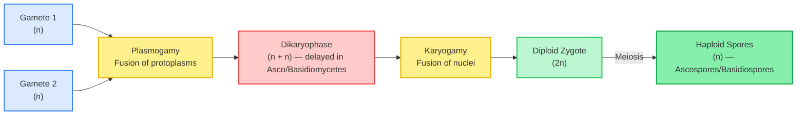
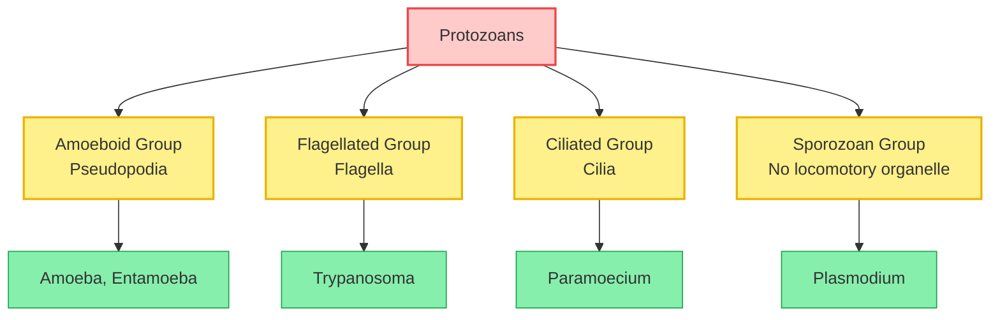

# ⚡ BIOLOGY XI — BIOLOGICAL CLASSIFICATION
### *48-Hour Rapid Revision Vault | Pure Visual + Tabular Format*

---

## 🔁 COMPARATIVE MATRIX 1: Two Kingdom vs Five Kingdom Classification

| Feature / Parameter of Comparison | **Two Kingdom System** | **Five Kingdom System (Whittaker)** |
|---|---|---|
| Proposed By | Linnaeus | **R.H. Whittaker (1969)** |
| Number of Kingdoms | 2 (Plantae, Animalia) | **5** (Monera, Protista, Fungi, Plantae, Animalia) |
| Prokaryote-Eukaryote Distinction | **Not made** | **Made explicitly** (Monera = prokaryotic) |
| Fungi's Placement | Wrongly grouped under Plantae | **Separate Kingdom Fungi** |
| Criteria Used | Nutrition mode + mobility only | Cell structure, body organisation, nutrition, reproduction, phylogeny |

---

## 🔁 COMPARATIVE MATRIX 2: Archaebacteria vs Eubacteria

| Feature / Parameter of Comparison | **Archaebacteria** | **Eubacteria** |
|---|---|---|
| Cell Wall | **Distinct chemistry** — survives extremes | **Peptidoglycan-based**, rigid |
| Habitat | Extreme (salty, hot, marshy) | Ubiquitous, common environments |
| Key Examples | Halophiles, Thermoacidophiles, Methanogens | Cyanobacteria, Mycoplasma |
| Special Feature | Methanogens → biogas from ruminant dung | Mycoplasma → **no cell wall at all** |

---

## 🔁 COMPARATIVE MATRIX 3: Virus vs Viroid

| Feature / Parameter of Comparison | **Virus** | **Viroid** |
|---|---|---|
| Genetic Material | RNA or DNA | **Only RNA** |
| Protein Coat (Capsid) | **Present** | **Absent** |
| Molecular Weight | Higher (nucleoprotein complex) | **Lower** (free RNA only) |
| Discoverer | Ivanowsky / Beijerinck / Stanley | **T.O. Diener (1971)** |
| Classic Disease Example | Tobacco Mosaic Disease | Potato Spindle Tuber Disease |

---

## 🔁 COMPARATIVE MATRIX 4: The Four Fungal Classes

| Feature / Parameter of Comparison | **Phycomycetes** | **Ascomycetes** | **Basidiomycetes** | **Deuteromycetes** |
|---|---|---|---|---|
| Hyphae | **Aseptate/Coenocytic** | Septate, branched | Septate, branched | Septate, branched |
| Asexual Spores | Zoospores / Aplanospores | **Conidia** | Usually absent | **Conidia** |
| Sexual Spores | **Zygospores** | **Ascospores** (in asci) | **Basidiospores** (on basidium) | **None known** |
| Also Called | — | "Sac Fungi" | "Club Fungi" | **"Fungi Imperfecti"** |
| Example | *Mucor*, *Rhizopus*, *Albugo* | *Aspergillus*, *Penicillium*, *Saccharomyces* | Mushrooms, *Puccinia*, *Ustilago* | *Alternaria*, *Trichoderma* |

---

## 🌳 FIVE KINGDOM CLASSIFICATION TREE

```mermaid
graph TD
    Life["ALL LIVING ORGANISMS"] --> Monera["KINGDOM MONERA<br/>Prokaryotic"]
    Life --> Protista["KINGDOM PROTISTA<br/>Unicellular Eukaryotic"]
    Life --> Fungi["KINGDOM FUNGI<br/>Chitin Wall, Heterotrophic"]
    Life --> Plantae["KINGDOM PLANTAE<br/>Cellulose Wall, Autotrophic"]
    Life --> Animalia["KINGDOM ANIMALIA<br/>No Wall, Heterotrophic"]

    Monera --> Archae["Archaebacteria"]
    Monera --> Eubac["Eubacteria"]

    Protista --> Chryso["Chrysophytes"]
    Protista --> Dino["Dinoflagellates"]
    Protista --> Eugleno["Euglenoids"]
    Protista --> Slime["Slime Moulds"]
    Protista --> Protozoa["Protozoans"]

    Fungi --> Phyco["Phycomycetes"]
    Fungi --> Asco["Ascomycetes"]
    Fungi --> Basidio["Basidiomycetes"]
    Fungi --> Deutero["Deuteromycetes"]

    style Life fill:#dbeafe,stroke:#3b82f6,stroke-width:2px
    style Monera fill:#fef08a,stroke:#eab308,stroke-width:2px
    style Protista fill:#fef08a,stroke:#eab308,stroke-width:2px
    style Fungi fill:#fef08a,stroke:#eab308,stroke-width:2px
    style Plantae fill:#bbf7d0,stroke:#22c55e,stroke-width:2px
    style Animalia fill:#86efac,stroke:#16a34a,stroke-width:2px
    style Archae fill:#e2e8f0,stroke:#64748b,stroke-width:1px
    style Eubac fill:#e2e8f0,stroke:#64748b,stroke-width:1px
    style Chryso fill:#dbeafe,stroke:#3b82f6,stroke-width:1px
    style Dino fill:#dbeafe,stroke:#3b82f6,stroke-width:1px
    style Eugleno fill:#dbeafe,stroke:#3b82f6,stroke-width:1px
    style Slime fill:#dbeafe,stroke:#3b82f6,stroke-width:1px
    style Protozoa fill:#dbeafe,stroke:#3b82f6,stroke-width:1px
    style Phyco fill:#fde047,stroke:#ca8a04,stroke-width:1px
    style Asco fill:#fde047,stroke:#ca8a04,stroke-width:1px
    style Basidio fill:#fde047,stroke:#ca8a04,stroke-width:1px
    style Deutero fill:#fde047,stroke:#ca8a04,stroke-width:1px
```

---

## 🔄 FUNGAL SEXUAL REPRODUCTION CYCLE — Mermaid Cascade

---

## 🐫 PROTOZOAN QUICK MAP — Locomotion-Based Grouping

---

## 🧠 MNEMONIC VAULT

> [!note] MNEMONIC: The Five Kingdoms (Whittaker)
> **M**y **P**et **F**rog **P**lays **A**lone
> → **M**onera, **P**rotista, **F**ungi, **P**lantae, **A**nimalia

> [!note] MNEMONIC: The Four Protistan Groups + Protozoans
> **C**hrysophytes **D**ance **E**very **S**aturday **P**arty
> → **C**hrysophytes, **D**inoflagellates, **E**uglenoids, **S**lime moulds, **P**rotozoans

> [!note] MNEMONIC: Archaebacterial Extreme Habitats
> "**H**ot **T**ubs **M**elt" → **H**alophiles (salty), **T**hermoacidophiles (hot springs), **M**ethanogens (marshy/gut)

> [!note] MNEMONIC: The Four Fungal Classes (in exam-answer order)
> "**P**lease **A**sk **B**iology **D**octors"
> → **P**hycomycetes, **A**scomycetes, **B**asidiomycetes, **D**euteromycetes

> [!note] MNEMONIC: Fungal Sexual Cycle Order
> "**P**lay **K**abaddi **M**onday" → **P**lasmogamy → **K**aryogamy → **M**eiosis

> [!note] MNEMONIC: Protozoan Locomotion Groups
> "**A** **F**riend **C**an **S**it" → **A**moeboid, **F**lagellated, **C**iliated, **S**porozoans

---

## ⚡ QUICK-SCAN FLASHCARD TABLE

| # | Fact | Tag |
|---|---|---|
| 1 | Five Kingdom Classification proposed by **R.H. Whittaker** in **1969** | Both |
| 2 | Bacterial cell wall (Eubacteria) is made of **peptidoglycan/murein** | NEET |
| 3 | **Mycoplasma** completely lack a cell wall | NEET |
| 4 | Diatoms leave behind **"diatomaceous earth"** used in polishing/filtration | Board |
| 5 | *Euglena* is autotrophic in light, heterotrophic in darkness | NEET |
| 6 | Fungal cell wall = **chitin**; NOT cellulose | NEET |
| 7 | Fungal sexual cycle order: **Plasmogamy → Karyogamy → Meiosis** | NEET |
| 8 | Deuteromycetes = **"Fungi Imperfecti"** — only asexual phase known | NEET |
| 9 | Lichen = **algae (phycobiont) + fungus (mycobiont)**; bio-indicator of air pollution | Both |
| 10 | Virus discovery chain: **Ivanowsky → Beijerinck → Stanley** | Board |
| 11 | Virus = nucleic acid (RNA/DNA) + capsid (capsomeres) | Both |
| 12 | Viroid (**T.O. Diener, 1971**) = free RNA, **no protein coat** | NEET |
| 13 | Methanogens produce **biogas** from ruminant dung | Board |
