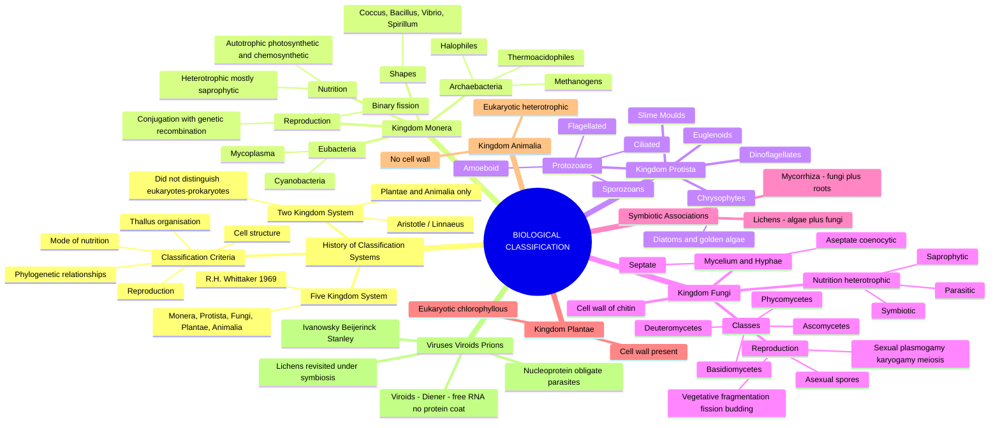
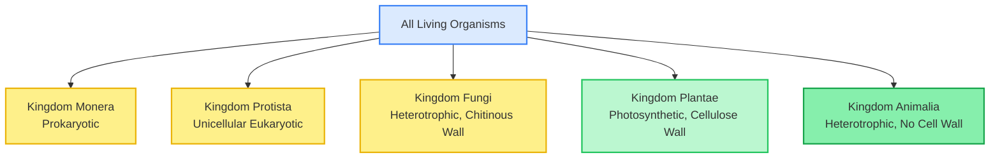
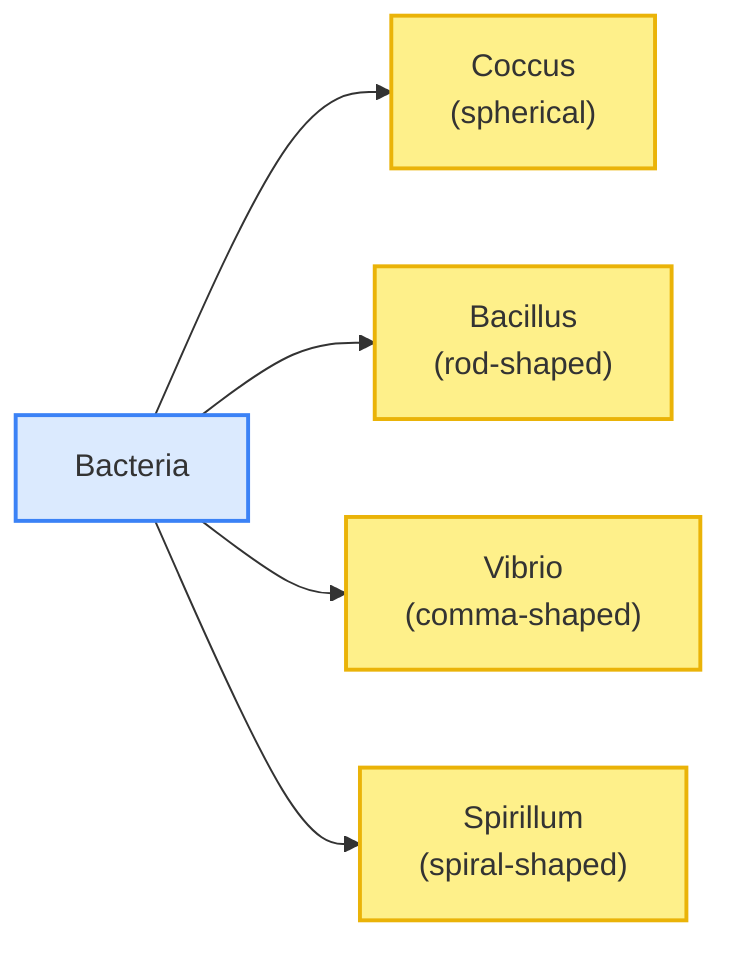
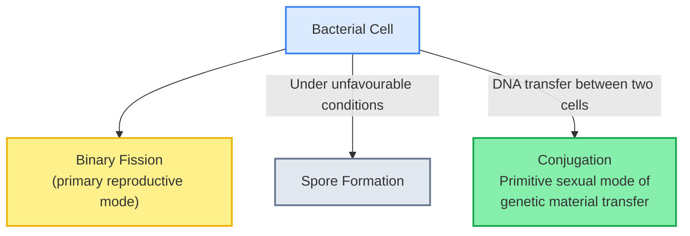
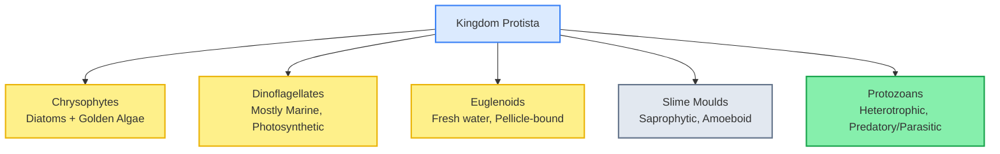
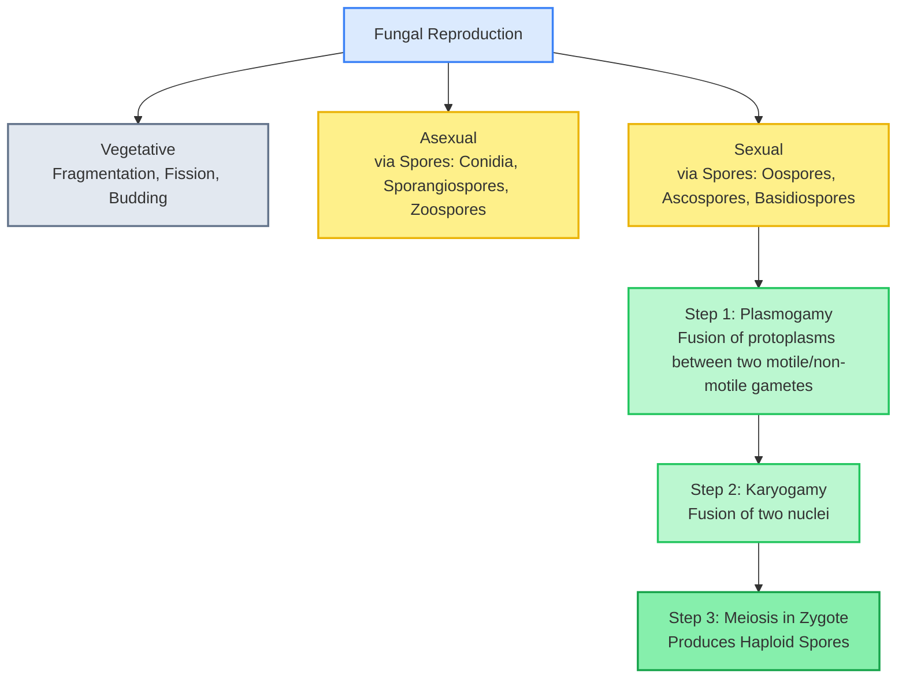

# 🧬 BIOLOGY XI — BIOLOGICAL CLASSIFICATION

### *Comprehensive Theory Notes | NCERT Chapter 2 | Board + NEET-UG Integrated*

---

## 🗺️ THE CHAPTER DASHBOARD

---

## 2.1 WHY CLASSIFICATION? THE HISTORICAL JOURNEY

Early classification schemes attempted to organise the bewildering diversity of life using the simplest visible criterion: mode of nutrition and mobility.

> [!info] Two Kingdom Classification (Aristotle → Linnaeus)
> The earliest formal classification, credited historically to **Carolus Linnaeus**, divided all living organisms into just two kingdoms: **Plantae** and **Animalia**. This system used a few characteristics such as cell structure, mode and site of nutrition, and body organisation.

> [!warning] ⚠️ CRITICAL PITFALL: Why the Two Kingdom System Failed
> This classification proved inadequate because it made **no distinction** between the following crucial biological categories, which are heavily tested by NEET:
>
> - **Eukaryotes and prokaryotes**
> - **Unicellular and multicellular organisms**
> - **Photosynthetic (autotrophic) and non-photosynthetic (heterotrophic) organisms**
>
> Organisms such as fungi (heterotrophic, cell wall present) were awkwardly forced into "Plantae," despite having a fundamentally different mode of nutrition and cell wall chemistry than true plants.

### 2.1.1 The Five Kingdom Classification — Whittaker's Solution

> [!info] R.H. Whittaker (1969) — The Five Kingdom System
> **R.H. Whittaker** proposed classifying all living organisms into **five kingdoms**: **Monera, Protista, Fungi, Plantae,** and **Animalia**. This classification used cell structure, body organisation, mode of nutrition, reproduction, and phylogenetic relationships as its criteria.

> [!warning] ⚠️ CRITICAL PITFALL: The Five Criteria Whittaker Actually Used
> NEET frequently asks students to identify Whittaker's exact criteria. Memorise all five precisely:
>
> 1. **Cell structure** (prokaryotic vs eukaryotic)
> 2. **Body organisation** (thallus organisation / level of organisation)
> 3. **Mode of nutrition** (autotrophic vs heterotrophic)
> 4. **Reproduction** (mode of reproduction)
> 5. **Phylogenetic relationships**

---

## 2.2 KINGDOM MONERA — THE PROKARYOTES

Bacteria are the sole occupants of Kingdom Monera and are the most abundant micro-organisms on Earth. They are found in extreme habitats such as hot springs, deserts, and deep oceans, as well as inside the bodies of plants and animals.

### 2.2.1 Archaebacteria vs Eubacteria

> [!warning] ⚠️ CRITICAL PITFALL: Archaebacteria's Distinguishing Feature
> Archaebacteria are distinguished from all other bacteria by possessing a **different cell wall structure** — this is what allows them to survive extreme conditions of salt concentration, temperature, and pH. Do not confuse this with a difference in genetic material type.

| Feature / Parameter | **Archaebacteria**                                                                                                                               | **Eubacteria**                                                           |
| ------------------- | ------------------------------------------------------------------------------------------------------------------------------------------------------ | ------------------------------------------------------------------------------ |
| Cell Wall           | Distinct chemical composition, allows extreme habitat survival                                                                                         | Rigid cell wall;**peptidoglycan / murein**-based                         |
| Habitats            | Extreme: salty areas, hot springs, marshy areas                                                                                                        | Ubiquitous — soil, water, air, living tissues                                 |
| Key Groups          | **Halophiles** (salty areas), **Thermoacidophiles** (hot springs), **Methanogens** (marshy areas, gut of ruminants)                  | **Cyanobacteria**, **Mycoplasma**, and all "true" typical bacteria |
| Special Role        | Methanogens present in the gut of ruminant animals (cows, buffaloes); responsible for**biogas** production from their dung (**gobar gas**) | Cyanobacteria are photosynthetic; Mycoplasma completely lack a cell wall       |

> [!example] NCERT MANDATORY EXAMPLES: Archaebacterial Habitats
> - **Halophiles** — extremely salty environments.
> - **Thermoacidophiles** — hot springs.
> - **Methanogens** — marshy areas; also present in the gut of ruminants, responsible for the production of methane (biogas) from dung.

### 2.2.2 Bacterial Shapes

### 2.2.3 Modes of Nutrition in Bacteria

> [!info] Autotrophic vs Heterotrophic Bacteria
> **Autotrophic bacteria** synthesise their own food via **photosynthetic** (using bacteriochlorophyll) or **chemosynthetic** pathways. **Heterotrophic bacteria** — the vast majority — are **saprophytic** or **parasitic**, and are the most abundant nutritional group in the bacterial world, playing a crucial role as decomposers.

### 2.2.4 Reproduction in Bacteria

> [!warning] ⚠️ CRITICAL PITFALL: Mycoplasma's Unique Position
> **Mycoplasma** are organisms that **completely lack a cell wall**, and are the smallest living cells known that can survive without it. Because of this, they are pleomorphic and can survive without oxygen. NEET often tests Mycoplasma as an exception when a question states "all bacteria possess a cell wall."

### 2.2.5 Cyanobacteria — The Blue-Green Algae

> [!info] Cyanobacteria (Blue-Green Algae)
> **Cyanobacteria** are photosynthetic, autotrophic, unicellular, colonial, or filamentous organisms found in fresh water, marine, and terrestrial environments. Some possess a specialised, thick-walled, heterocyst cell that is the site of **nitrogen fixation** — a colonial form, *Nostoc*, exemplifies this.

---

## 2.3 KINGDOM PROTISTA — THE UNICELLULAR EUKARYOTES

Kingdom Protista forms a crucial **boundary** or link kingdom, showing relationships with the other three eukaryotic kingdoms (Plantae, Fungi, Animalia).

> [!warning] ⚠️ CRITICAL PITFALL: Protista as a Transitional/Boundary Kingdom
> The Protista kingdom is often described as the "link kingdom" because its members show affinities with Plantae (via pigmented algal groups), Fungi (via slime moulds), and Animalia (via protozoans). NEET frequently frames Protista as "showing evolutionary bridges" in assertion-reasoning formats.

### 2.3.1 The Four Major Protistan Groups

**A. Chrysophytes** (diatoms and golden algae/desmids): Found in fresh water and marine environments; microscopic and float passively in water currents (**plankton**). Cell walls of diatoms form **two thin overlapping shells** that fit together like a soap box — indestructible due to embedded **silica**, leaving behind fossilised "**diatomaceous earth**" deposits used in polishing, filtration, and insulation.

**B. Dinoflagellates**: Mostly marine and photosynthetic, appearing yellow, green, brown, blue, or red depending on pigments. Cell wall has stiff cellulose plates on the outer surface, with **two flagella** — one longitudinal, one transverse (lying in a groove between the wall plates). Rapid multiplication of the red-pigmented species (e.g., *Gonyaulax*) causes the sea to appear red, known as **"red tides"** — the toxins released can even kill fish.

**C. Euglenoids**: Mostly fresh water organisms found in stagnant water. Instead of a cell wall, they have a protein-rich layer called a **pellicle**, making the body flexible. Possess two flagella (one short, one long). Autotrophic in sunlight but heterotrophic (predatory) when deprived of light, behaving like animals — *Euglena* is the classic example.

> [!warning] ⚠️ CRITICAL PITFALL: Euglena's Mixotrophic Nature
> *Euglena* exemplifies a key evolutionary boundary point — it photosynthesises in light (like a plant) but becomes predatory/heterotrophic in the absence of sunlight (like an animal). This is a **very high-yield NEET fact** frequently tested as an assertion-reasoning statement.

**D. Slime Moulds**: Saprophytic protists whose body moves along decaying twigs/leaves engulfing organic matter, forming an aggregation called a **plasmodium** that can grow and spread over several feet under favourable conditions. Under unfavourable conditions, the plasmodium differentiates and forms **fruiting bodies bearing spores** at their tips — the spores possess extremely resistant walls and survive for years, even under adverse conditions.

**E. Protozoans**: All protozoans are heterotrophic, living as predators or parasites; considered close to the animal kingdom. Four major groups:

| Sub-group                        | Locomotory Structure          | NCERT Example                                                                   |
| -------------------------------- | ----------------------------- | ------------------------------------------------------------------------------- |
| **Amoeboid Protozoans**    | Pseudopodia                   | *Amoeba* (fresh water/marine/moist soil); *Entamoeba* (parasitic)           |
| **Flagellated Protozoans** | Flagella                      | *Trypanosoma* (causes sleeping sickness)                                      |
| **Ciliated Protozoans**    | Cilia (numerous, act as oars) | *Paramoecium* (has a cavity called gullet opening to the outside of the cell) |
| **Sporozoans**             | No locomotory organelles      | *Plasmodium* (malarial parasite); infective spore-like stage in life cycle    |

---

## 2.4 KINGDOM FUNGI — THE HETEROTROPHIC DECOMPOSERS

Fungi are a **highly heterogeneous group** distinguished by their mode of nutrition (absorptive heterotrophy) and cell wall composition.

> [!info] Kingdom Fungi — Habitat and Nutrition
> Fungi are found in habitats that are warm and humid; besides on land, they also grow in acidic, hostile environments. Most fungi are **saprophytic**, deriving nutrition from dead organic matter; some are **parasitic**, living on other living organisms (plants, animals, humans) and causing diseases; some are **symbiotic**, forming associations with algae (lichens) or roots (mycorrhiza).

### 2.4.1 Structural Organisation — Mycelium and Hyphae

> [!info] The Fungal Body Plan (Outward Structural Blocks)
> The fungal body generally consists of long, slender, thread-like structures called **hyphae**. The network of hyphae collectively is called **mycelium**.
>
> - **Septate hyphae**: Hyphae with cross-walls (septa).
> - **Aseptate / Coenocytic hyphae**: Continuous tubes without septa, containing multinucleate cytoplasm.
>
> The cell walls of fungi are made of a tough complex sugar called **chitin**.

> [!warning] ⚠️ CRITICAL PITFALL: Fungal Cell Wall vs Plant Cell Wall
> A high-frequency NEET trap: Fungal cell walls are composed of **chitin**, NOT **cellulose**. Plant cell walls are made of cellulose. Do not conflate the two even though both possess rigid cell walls, since fungi were once erroneously grouped with plants under the two-kingdom system precisely because of this superficial similarity.

### 2.4.2 Reproduction in Fungi

Fungi reproduce by **vegetative, asexual, and sexual** methods.

> [!warning] ⚠️ CRITICAL PITFALL: The Sexual Cycle Sequence & the "Dikaryophase"
> The three-step sexual cycle sequence (**Plasmogamy → Karyogamy → Meiosis**) is one of the highest-yield sequencing questions in this chapter. In some fungi (notably Ascomycetes and Basidiomycetes), after plasmogamy, karyogamy is delayed, and the fungal body carries **two nuclei per cell** (**n + n**, dikaryon) — this stage is called the **dikaryophase** of the fungus, a unique feature not found elsewhere in the living world.

### 2.4.3 The Four Classes of Fungi

| Class                                         | Hyphae Type          | Asexual Spores                                                      | Sexual Spores                                                            | NCERT Example                                                                                                  |
| --------------------------------------------- | -------------------- | ------------------------------------------------------------------- | ------------------------------------------------------------------------ | -------------------------------------------------------------------------------------------------------------- |
| **Phycomycetes**                        | Aseptate, coenocytic | **Zoospores** (motile) or **aplanospores** (non-motile) | **Zygospores**                                                     | *Mucor*, *Rhizopus* (bread mould), *Albugo*                                                              |
| **Ascomycetes** ("Sac Fungi")           | Septate, branched    | **Conidia** (exogenously on conidiophores)                    | **Ascospores** (produced endogenously in sac-like **asci**)  | *Aspergillus*, *Claviceps*, *Neurospora*, *Penicillium* (yeast — *Saccharomyces* — is unicellular) |
| **Basidiomycetes**                      | Septate, branched    | Absent typically                                                    | **Basidiospores** (exogenously on **basidium**, club-shaped) | Mushrooms, bracket fungi, puffballs                                                                            |
| **Deuteromycetes** ("Fungi Imperfecti") | Septate, branched    | **Conidia**                                                   | **None known** (only asexual/vegetative phase known)               | *Alternaria*, *Colletotrichum*, *Trichoderma*                                                            |

> [!warning] ⚠️ CRITICAL PITFALL: Deuteromycetes — "Fungi Imperfecti"
> Deuteromycetes are called **"Fungi Imperfecti"** because only their **asexual/vegetative** phases are known — if a sexual stage is later discovered for a Deuteromycete, it is immediately reclassified into either Ascomycetes or Basidiomycetes. This is a classic NEET conceptual trap testing whether the classification is provisional.

> [!example] NCERT MANDATORY EXAMPLES: Fungal Classes with Exact Genera
> Memorise each with zero omission:
>
> - Phycomycetes: *Mucor*, *Rhizopus*, *Albugo*
> - Ascomycetes: *Aspergillus*, *Claviceps*, *Neurospora*, *Saccharomyces* (yeast), *Penicillium*
> - Basidiomycetes: *Agaricus* (mushroom), *Ustilago* (smut), *Puccinia* (rust)
> - Deuteromycetes: *Alternaria*, *Trichoderma*, *Colletotrichum*

---

## 2.5 SYMBIOTIC ASSOCIATIONS — LICHENS AND MYCORRHIZA

> [!info] Lichens — The Algal-Fungal Partnership
> **Lichens** are symbiotic associations between **algae** and **fungi**. The algal component (**phycobiont**) is autotrophic and prepares food for the fungal component, while the fungal component (**mycobiont**) provides shelter and absorbs mineral nutrients and water for its partner. Lichens are excellent indicators of **air pollution** — they do not grow in polluted areas.

> [!info] Mycorrhiza — The Fungal-Root Partnership
> **Mycorrhiza** is a symbiotic association between fungi and the roots of higher plants (e.g., *Pinus*). The fungal symbiont absorbs mineral nutrients from soil and passes them to the plant, benefiting from the plant's carbohydrate supply in return.

---

## 2.6 VIRUSES, VIROIDS, AND LICHENS RECAP — THE ACELLULAR ENTITIES

> [!info] Discovery Timeline of Viruses
> - **D.J. Ivanowsky (1892)** recognised a contagion (later termed viruses) causing the mosaic disease of tobacco, smaller than bacteria — since the sap of an infected tobacco plant, even after passage through a bacteria-proof filter, retained its infectivity.
> - **M.W. Beijerinck (1898)** demonstrated that the fluid extracted was infectious and could multiply only within a host's living cells, naming it **"contagium vivum fluidum"** (contagious living fluid).
> - **W.M. Stanley (1935)** showed that viruses could be **crystallised**, and demonstrated that crystals consist largely of proteins — establishing viruses as inert particles outside a living host.

> [!warning] ⚠️ CRITICAL PITFALL: Are Viruses "Living" or "Non-Living"?
> This is possibly the single most-repeated conceptual NEET trap in this chapter. Viruses are considered **non-cellular organisms** whose characteristics render this classification highly debatable — they are inert crystalline structures outside a living cell, but **become active and replicate only inside a specific living host cell**, showing properties of both living and non-living entities.

### Structural Composition of a Virus

> [!info] Virus Structure — The Nucleoprotein Complex
> Viruses are obligate parasites, and in this host-dependent state possess no cell organelles of their own. A virus is composed of genetic material (either **RNA or DNA**, never both together) surrounded by a protein coat called the **capsid** made of small subunits called **capsomeres**. This entire nucleic-acid-plus-protein assembly is called a **nucleoprotein**. The nucleic acid of a virus is infectious itself. Viruses causing diseases in plants generally have **RNA** as their genetic material, while viruses causing diseases in animals usually have either RNA or **DNA**. Bacterial viruses (bacteriophages) are usually double-stranded DNA viruses.

### 2.6.1 Viroids — Smaller Than Viruses

> [!info] T.O. Diener (1971) — Discovery of Viroids
> **T.O. Diener** discovered a new infectious agent even smaller than viruses, called **viroids**, which caused the potato spindle tuber disease. A viroid consists of a **free RNA molecule with a low molecular weight** but, crucially, **lacks the protein coat (capsid)** that characterises viruses.

> [!warning] ⚠️ CRITICAL PITFALL: Virus vs Viroid — The Capsid Distinction
> The single defining structural difference NEET tests repeatedly: a **virus** has genetic material **enclosed within a protein coat (capsid)**, whereas a **viroid** is **free RNA without any protein coat whatsoever**. Do not confuse a viroid with a "small virus" — it is structurally distinct.

---

## 📌 CHAPTER SYNTHESIS

The inadequacy of the **Two Kingdom System** — which could not distinguish prokaryotes from eukaryotes, or unicellular from multicellular, or autotrophs from heterotrophs — led **R.H. Whittaker** to propose the **Five Kingdom Classification** (Monera, Protista, Fungi, Plantae, Animalia) based on cell structure, body organisation, nutrition, reproduction, and phylogeny. **Kingdom Monera** houses the prokaryotic Archaebacteria (extremophiles) and Eubacteria (cyanobacteria, mycoplasma). **Kingdom Protista** acts as a boundary kingdom, containing Chrysophytes, Dinoflagellates, Euglenoids, Slime Moulds, and Protozoans. **Kingdom Fungi** — chitinous-walled, heterotrophic decomposers organised as hyphae/mycelium — is subdivided into Phycomycetes, Ascomycetes, Basidiomycetes, and Deuteromycetes based on hyphal structure and spore type, reproducing via the sequential **plasmogamy → karyogamy → meiosis** cycle. Beyond the five kingdoms lie the **acellular infectious agents** — viruses (nucleoprotein particles, neither fully living nor non-living, discovered progressively by Ivanowsky, Beijerinck, and Stanley) and the even simpler **viroids** (naked infectious RNA, discovered by Diener) — alongside symbiotic partnerships like **lichens** (algae + fungi) and **mycorrhiza** (fungi + plant roots).
