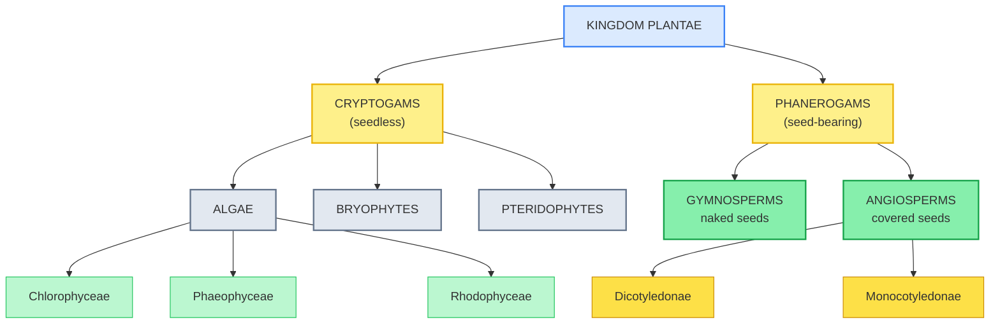
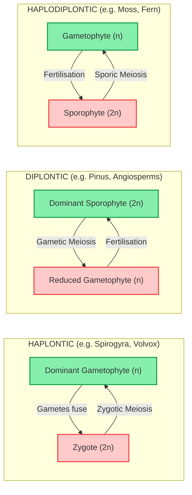

# ⚡ BIOLOGY XI — PLANT KINGDOM

### *48-Hour Rapid Revision Vault | Pure Visual + Tabular Format*

---

## 🔁 COMPARATIVE MATRIX 1: The Three Classes of Algae

| Feature / Parameter of Comparison | **Chlorophyceae**                     | **Phaeophyceae**                  | **Rhodophyceae**                     |
| --------------------------------- | ------------------------------------------- | --------------------------------------- | ------------------------------------------ |
| Dominant Pigment                  | **Chlorophyll a & b**                 | **Fucoxanthin**                   | ***r*-Phycoerythrin**              |
| Colour                            | Grass-green                                 | Brown                                   | Red                                        |
| Food Reserve                      | **Starch**                            | **Mannitol / Laminarin**          | **Floridean starch**                 |
| Cell Wall                         | Cellulose + pectose                         | Cellulose +**algin**              | Cellulose + pectin (± CaCO₃)             |
| Predominant Habitat               | Fresh water                                 | **Marine**                        | **Marine**                           |
| Example                           | *Chlamydomonas*, *Spirogyra*, *Chara* | *Laminaria*, *Sargassum*, *Fucus* | *Porphyra*, *Gracilaria*, *Gelidium* |

---

## 🔁 COMPARATIVE MATRIX 2: Bryophytes vs Pteridophytes

| Feature / Parameter of Comparison | **Bryophytes**                          | **Pteridophytes**                        |
| --------------------------------- | --------------------------------------------- | ---------------------------------------------- |
| Dominant Phase                    | **Gametophyte**                         | **Sporophyte**                           |
| Vascular Tissue                   | **Absent**                              | **Present** (first vascular land plants) |
| Body Differentiation              | Root/stem/leaf-**like** structures only | **True** root, stem, leaves              |
| Sporophyte Independence           | **Dependent** on gametophyte            | **Independent**, free-living             |
| Common Name                       | "Amphibians of the plant kingdom"             | —                                             |
| Example                           | *Marchantia*, *Funaria*, *Sphagnum*     | *Selaginella*, *Pteris*, *Equisetum*     |

---

## 🔁 COMPARATIVE MATRIX 3: Gymnosperms vs Angiosperms

| Feature / Parameter of Comparison | **Gymnosperms**                     | **Angiosperms**                                 |
| --------------------------------- | ----------------------------------------- | ----------------------------------------------------- |
| Seed Covering                     | **Naked** (no ovary wall enclosure) | **Enclosed** within ovary → fruit              |
| Fruit Formation                   | **Absent**                          | **Present**                                     |
| Fertilisation Type                | Single fertilisation                      | **Double fertilisation**                        |
| Sporing Nature                    | Heterosporous                             | Heterosporous                                         |
| Cotyledon-Based Sub-classes       | Not applicable                            | **Dicotyledonae** and **Monocotyledonae** |
| Example                           | *Pinus*, *Cycas*, *Sequoia*         | *Mangifera indica*, *Triticum aestivum*           |

---

## 🔁 COMPARATIVE MATRIX 4: Isogamy vs Anisogamy vs Oogamy

| Feature / Parameter of Comparison | **Isogamy**                | **Anisogamy**           | **Oogamy**                                  |
| --------------------------------- | -------------------------------- | ----------------------------- | ------------------------------------------------- |
| Gamete Size                       | **Equal**                  | **Unequal**             | Highly unequal — large egg + small sperm         |
| Gamete Motility                   | Both may be motile or non-motile | **Both motile**         | Female**non-motile**, male **motile** |
| Evolutionary Level                | Most primitive                   | Intermediate                  | **Most advanced**                           |
| Example Organism                  | Some*Chlamydomonas*            | Some*Chlamydomonas* species | *Volvox*, *Fucus*                             |

---

## 🌳 KINGDOM PLANTAE CLASSIFICATION TREE

---

## 🔄 ALTERNATION OF GENERATIONS — THE THREE PATTERNS

---

## 📊 MASTER RECALL TABLE — Alternation of Generation Patterns

| Life Cycle Type          | Dominant Phase                   | Meiosis Timing                                             | Example Groups                                                         |
| ------------------------ | -------------------------------- | ---------------------------------------------------------- | ---------------------------------------------------------------------- |
| **Haplontic**      | Gametophyte (n)                  | **Zygotic** meiosis (immediately after zygote forms) | *Volvox*, *Spirogyra*                                              |
| **Diplontic**      | Sporophyte (2n)                  | **Gametic** meiosis (at gamete formation)            | Gymnosperms, Angiosperms                                               |
| **Haplodiplontic** | Either phase, both multicellular | **Sporic** meiosis (at spore formation)              | Bryophytes (gametophyte-dominant), Pteridophytes (sporophyte-dominant) |

---

## 🧠 MNEMONIC VAULT

> [!note] ✏️ MNEMONIC: The Five Plant Groups in Evolutionary Order
> **A** **B**oy **P**lays **G**uitar **A**lways
> → **A**lgae, **B**ryophytes, **P**teridophytes, **G**ymnosperms, **A**ngiosperms

> [!note] ✏️ MNEMONIC: The Three Algal Classes and Their Colour
> "**C**lever **G**reen, **P**roud **B**rown, **R**oyal **R**ed"
> → **C**hlorophyceae-**G**reen, **P**haeophyceae-**B**rown, **R**hodophyceae-**R**ed

> [!note] ✏️ MNEMONIC: Gamete Fusion Progression
> "**I** **A**m **O**k" (increasing differentiation) → **I**sogamy → **A**nisogamy → **O**ogamy

> [!note] ✏️ MNEMONIC: Alternation of Generations Dominance
> "**Ha**re **Di**gs **Ha**ppily" → **Ha**plontic (gametophyte dominant) → **Di**plontic (sporophyte dominant) → **Ha**plodiplontic (both dominant, situationally)

---

## ⚡ QUICK-SCAN FLASHCARD TABLE

| #  | Fact                                                                           | Tag   |
| -- | ------------------------------------------------------------------------------ | ----- |
| 1  | Bryophytes = "**Amphibians of the plant kingdom**"                       | Board |
| 2  | Pteridophytes are the**first plants with true vascular tissue**          | NEET  |
| 3  | Gymnosperm = "naked seed";**no fruit** ever forms                        | NEET  |
| 4  | Angiosperms show**double fertilisation** — unique reproductive hallmark | NEET  |
| 5  | *Selaginella* is **heterosporous**, foreshadowing the seed habit       | NEET  |
| 6  | *Sphagnum* (peat moss) used as **fuel** and **packing material** | Board |
| 7  | *Cycas* has **coralloid roots** with N₂-fixing cyanobacteria          | NEET  |
| 8  | *Sequoia* — a gymnosperm — is among the **tallest trees** on Earth   | Board |
| 9  | **Agar** is extracted from red algae *Gelidium* and *Gracilaria*     | Board |
| 10 | Dicot seeds have**2 cotyledons**; monocot seeds have **1**         | Board |
