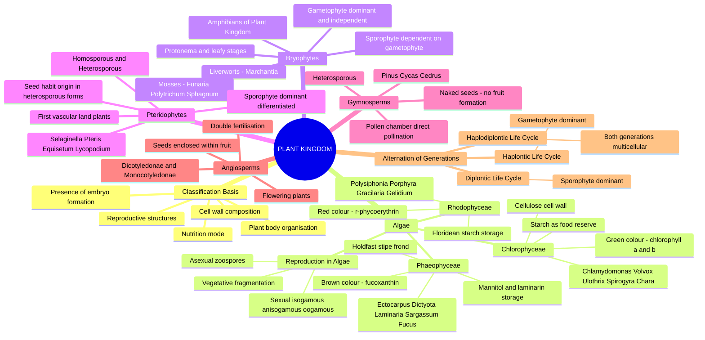
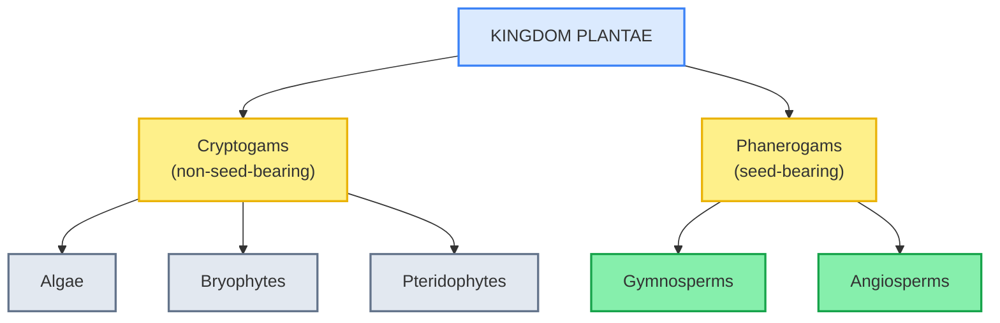
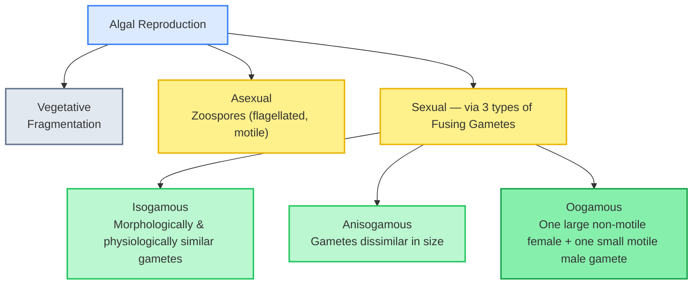
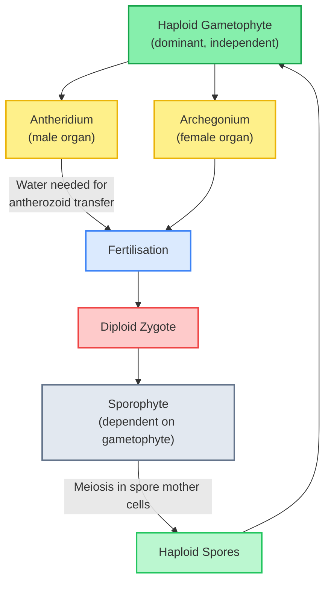
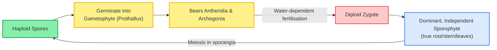
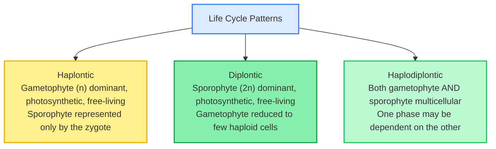

# 🧬 BIOLOGY XI — PLANT KINGDOM

### *Comprehensive Theory Notes | NCERT Chapter 3 | Board + NEET-UG Integrated*

---

## 🗺️ THE CHAPTER DASHBOARD

---

## 3.1 CLASSIFICATION CRITERIA FOR THE PLANT KINGDOM

Kingdom Plantae includes eukaryotic, chlorophyll-bearing organisms, commonly called **plants**. A few members are partially heterotrophic (e.g., insectivorous plants like *Bladderwort* and *Venus fly trap*, or parasitic plants like *Cuscuta*), but the vast majority are autotrophic.

> [!info] Broad Classification Basis
> Algae, Bryophytes, Pteridophytes, Gymnosperms, and Angiosperms are broadly classified based on: the **differentiation of the plant body**, the presence of a **vascular system**, and the ability to bear **seeds** or **flowers**. Plants are further categorised as **cryptogams** ("hidden reproductive organs" — Algae, Bryophytes, Pteridophytes) and **phanerogams** ("visible reproductive organs" — Gymnosperms, Angiosperms), based on whether they bear seeds.

---

## 3.2 ALGAE — THE CHLOROPHYLL-BEARING SIMPLE THALLOPHYTES

Algae are chlorophyll-bearing, simple, thalloid, autotrophic, largely aquatic organisms. They occur in a variety of habitats — fresh water, brackish water, salt water — as well as moist stones, soils, and wood.

> [!info] Economic and Ecological Importance of Algae
> At least **half of the total carbon dioxide fixation** on Earth is carried out by algae through photosynthesis. Algae are indispensable in aquatic food chains, and several forms (*Laminaria*, *Sargassum*) are used as food. **Agar** (from *Gelidium* and *Gracilaria*) is used to grow microbes and in preparing ice creams/jellies. Marine brown and red algae supply hydrocolloids like **algin** (from brown algae) and **carrageen** (from red algae).

Algae reproduce by **vegetative, asexual, and sexual** methods.

> [!warning] ⚠️ CRITICAL PITFALL: Isogamous vs Anisogamous vs Oogamous Progression
> NEET frequently uses these three terms as a spot-the-example trap. The progression from isogamy → anisogamy → oogamy represents increasing gamete differentiation:
>
> - **Isogamous**: fusion of two gametes, similar in structure but different in behaviour or size — flagellated and motile, or non-flagellated and non-motile.
> - **Anisogamous**: fusion between two dissimilar (in size) motile gametes.
> - **Oogamous**: fusion between one large, non-motile (egg) and one small, motile (male) gamete — the most advanced type.

### 3.2.1 The Three Classes of Algae

| Feature / Parameter       | **Chlorophyceae** (Green Algae)                                 | **Phaeophyceae** (Brown Algae)                                  | **Rhodophyceae** (Red Algae)                           |
| ------------------------- | --------------------------------------------------------------------- | --------------------------------------------------------------------- | ------------------------------------------------------------ |
| Colour Source Pigment     | **Chlorophyll a & b** dominant → grass-green                   | **Fucoxanthin** dominant → brown                               | ***r*-Phycoerythrin** dominant → red                |
| Habitat                   | Fresh water, brackish, salt water, moist stones/soil/wood             | **Predominantly marine**                                        | **Predominantly marine**                               |
| Cell Wall                 | Cellulose (inner layer) + pectose (outer layer)                       | Cellulose +**algin**                                            | Cellulose + pectin, some coated with**CaCO₃**         |
| Food Reserve              | **Starch**                                                      | **Mannitol** and **laminarin**                            | **Floridean starch**                                   |
| Flagellar Number/Position | 2 to 8, equal, apical                                                 | 2, lateral                                                            | Generally absent (non-motile gametes)                        |
| Structural Feature        | Unicellular, colonial, or filamentous                                 | Body differentiated into**holdfast, stipe, and frond**          | Thalloid, branched or unbranched filaments                   |
| NCERT Examples            | *Chlamydomonas*, *Volvox*, *Ulothrix*, *Spirogyra*, *Chara* | *Ectocarpus*, *Dictyota*, *Laminaria*, *Sargassum*, *Fucus* | *Polysiphonia*, *Porphyra*, *Gracilaria*, *Gelidium* |

> [!warning] ⚠️ CRITICAL PITFALL: Pigment-Based Naming vs Actual Colour Confusion
> Do not assume the class name always matches the visually observed shade exactly — the naming is based on the **dominant accessory pigment**, not merely visual colour perception. Confirm: **Chloro**phyceae → green pigments (chlorophyll a, b) dominate; **Phaeo**phyceae → **fucoxanthin** (brown) dominates; **Rhodo**phyceae → **phycoerythrin** (red) dominates.

> [!example] NCERT MANDATORY EXAMPLES: Algal Genera — Zero Omission List
> - Chlorophyceae: *Chlamydomonas*, *Volvox*, *Ulothrix*, *Spirogyra*, *Chara*
> - Phaeophyceae: *Ectocarpus*, *Dictyota*, *Laminaria*, *Sargassum*, *Fucus*
> - Rhodophyceae: *Polysiphonia*, *Porphyra*, *Gracilaria*, *Gelidium*

---

## 3.3 BRYOPHYTES — THE "AMPHIBIANS OF THE PLANT KINGDOM"

> [!info] Why Bryophytes Are Called "Amphibians of the Plant Kingdom"
> Bryophytes can live in soil but are dependent on water for sexual reproduction (fertilisation requires a film of water for the motile male gametes to swim to the egg) — hence the analogy with amphibians, which similarly live on land but require water/moist conditions to complete reproduction.

Bryophytes include the common **mosses** and **liverworts**, growing in cool, damp, shady localities. They are distributed widely, growing in "moss-covered" rocks/tree trunks, marshy conditions.

### 3.3.1 The Bryophyte Body Plan

> [!info] Gametophyte-Dominant Structure
> The plant body of a bryophyte is more differentiated than that of algae; it is commonly thallus-like, and prostrate or erect, attached to the substratum by **unicellular or multicellular rhizoids**. Bryophytes lack true roots, stem, or leaves — they may possess **root-like, leaf-like, or stem-like structures**. The dominant, photosynthetic phase in the life cycle is the **haploid gametophyte**, which produces male sex organs called **antheridia** (producing biflagellate antherozoids) and female sex organs called **archegonia** (producing a single egg).

> [!warning] ⚠️ CRITICAL PITFALL: Sporophyte Dependency in Bryophytes
> The sporophyte in bryophytes is **NOT free-living** — it remains **attached to and nutritionally dependent on** the photosynthetic gametophyte throughout its existence. This is a key distinguishing feature from pteridophytes, where the sporophyte becomes the dominant, independent phase.

### 3.3.2 Liverworts and Mosses

- **Liverworts**: Grow in moist, shady habitats. The plant body is thalloid (e.g., *Marchantia*), dorsiventral, and closely appressed to the substrate. Asexual reproduction occurs through fragmentation or by production of specialised structures called **gemmae** in **gemma cups**.
- **Mosses**: The dominant, photosynthetic phase of the moss passes through two distinct stages: (1) a creeping, protonema stage which develops directly from a spore; (2) a leafy stage that arises from a secondary protonema as a lateral bud. Common examples: *Funaria*, *Polytrichum*, *Sphagnum* (peat moss, used as fuel and packing material for perishables).

---

## 3.4 PTERIDOPHYTES — THE FIRST TRUE VASCULAR PLANTS

Pteridophytes are found in cool, damp, shady localities though some may flourish well in sandy-soil conditions. Pteridophytes are used for medicinal purposes, as soil-binders, and are frequently grown as ornamentals.

> [!info] Pteridophytes — First Land Plants with Specialised Vascular Tissue
> Unlike bryophytes, the main plant body of a pteridophyte is a **sporophyte**, differentiated into **true root, stem, and leaves**, and possesses **specialised vascular tissue** for conduction (xylem and phloem). This marks the first evolutionary appearance of a true vascular system in land plants.

> [!warning] ⚠️ CRITICAL PITFALL: Homosporous vs Heterosporous Pteridophytes and the Origin of Seed Habit
> - **Homosporous pteridophytes**: Produce spores of similar kinds (e.g., *Pteris*, *Lycopodium*).
> - **Heterosporous pteridophytes**: Produce two kinds of spores — **microspores** (male) and **megaspores** (female), e.g., *Selaginella*, *Salvinia*. The **megaspore and microspore** germinate and give rise to female and male gametophytes respectively, which are retained on the parent sporophytes for variable periods — this event is of great **evolutionary significance**, since it demonstrates the "seed habit" origin (the ovule is analogous to the retained megasporangium in seed plants).

> [!example] NCERT MANDATORY EXAMPLES: Pteridophyte Genera
> *Selaginella*, *Pteris*, *Equisetum*, *Lycopodium* — Pteridophytes are further classified into four classes: **Psilopsida, Lycopsida, Sphenopsida, and Pteropsida**.

---

## 3.5 GYMNOSPERMS — THE "NAKED-SEED" PLANTS

> [!info] Gymnosperms — Etymology and the "Naked Seed" Concept
> The term *gymnosperm* (Greek: *gymnos* = naked + *sperma* = seed) describes plants where the **ovules are not enclosed by any ovary wall**; after fertilisation, the seeds remain "naked" (not covered), since **no fruit formation** occurs, in stark contrast to angiosperms.

Gymnosperms include medium-sized trees or tall trees and shrubs; the giant redwood tree *Sequoia* — one of the tallest tree species — is a gymnosperm. The root system is generally a tap root; in some genera, roots are associated with fungi as **mycorrhiza** (e.g., *Pinus*), while in others small specialised roots called **coralloid roots** are associated with nitrogen-fixing cyanobacteria (e.g., *Cycas*).

> [!warning] ⚠️ CRITICAL PITFALL: Gymnosperms Are Heterosporous
> Gymnosperms are **heterosporous** — producing haploid microspores (male, produced in male cones/strobili) and megaspores (female, produced in female cones/strobili). The **male and female gametophytes do NOT have an independent free-living existence**; they remain within the sporangia retained on the sporophytes, another important evolutionary step towards the seed habit fully realised in angiosperms.

> [!example] NCERT MANDATORY EXAMPLES: Gymnosperm Genera
> *Cycas*, *Pinus*, *Cedrus*, *Sequoia* (giant redwood — one of the tallest tree species known).

---

## 3.6 ANGIOSPERMS — THE FLOWERING, SEED-BEARING PLANTS ENCLOSED IN FRUIT

> [!info] Angiosperms — The Most Advanced and Dominant Plant Group
> The term *angiosperm* (Greek: *angion* = vessel/case + *sperma* = seed) means "covered seeds" — the seeds develop **inside an ovary**, which matures into a **fruit** after fertilisation. Angiosperms are also called **flowering plants**, and represent the most successfully diversified group of the plant kingdom, occupying a variety of habitats from grasslands, forests, to deserts.

Angiosperms range in size from tiny, almost microscopic *Wolffia* to tall trees like *Eucalyptus* (over 100 metres). They provide food, fodder, fuel, medicines, and several other commercially important products. Angiosperms are divided into two classes based on the number of **cotyledons** present in the seed embryo:

| Feature / Parameter | **Dicotyledonae**                             | **Monocotyledonae**                              |
| ------------------- | --------------------------------------------------- | ------------------------------------------------------ |
| Cotyledon Number    | **Two**                                       | **One**                                          |
| Leaf Venation       | Reticulate                                          | Parallel                                               |
| Root System         | Tap root                                            | Fibrous                                                |
| Floral Parts        | Multiples of 4 or 5                                 | Multiples of 3                                         |
| NCERT Table Example | *Mangifera indica* (Mango) — Class Dicotyledonae | *Triticum aestivum* (Wheat) — Class Monocotyledonae |

> [!info] Double Fertilisation — Unique to Angiosperms
> Angiosperm sexual reproduction culminates in a unique phenomenon called **double fertilisation**, in which one male gamete fuses with the egg cell to form the diploid zygote, while the second male gamete fuses with the two polar nuclei to form the triploid **primary endosperm nucleus (PEN)** — this is covered in depth in the Reproduction unit but must be flagged here as the hallmark reproductive feature distinguishing angiosperms.

---

## 3.7 ALTERNATION OF GENERATIONS — THE THREE LIFE CYCLE PATTERNS

All plants exhibit an **alternation of generations** — a haploid, gamete-producing gametophyte alternates with a diploid, spore-producing sporophyte within the life cycle. Based on which phase dominates, three patterns are recognised.

> [!warning] ⚠️ CRITICAL PITFALL: Matching Each Life Cycle Type to Its Plant Group
> This is among the **highest-yield NEET conceptual matches** in the entire chapter:
>
> - **Haplontic**: e.g., some algae (*Volvox*, *Spirogyra*) — meiosis occurs immediately after zygote formation (**zygotic meiosis**), so the dominant phase is haploid.
> - **Diplontic**: Gymnosperms and Angiosperms — meiosis occurs at gamete formation (**gametic meiosis**), so the dominant phase is diploid; the gametophytic phase is represented only by a few-celled haploid structure.
> - **Haplodiplontic**: Bryophytes and Pteridophytes — meiosis occurs in the sporophyte at spore formation (**sporic meiosis**), and both phases are multicellular; in bryophytes the gametophyte is dominant, while in pteridophytes the sporophyte is dominant.

---

## 📌 CHAPTER SYNTHESIS

Kingdom Plantae encompasses a graded evolutionary series from simple aquatic thallophytes to complex, dominant flowering plants. **Algae** (Chlorophyceae, Phaeophyceae, Rhodophyceae — distinguished by dominant pigment, cell wall composition, and stored food) reproduce via fragmentation, zoospores, or isogamous/anisogamous/oogamous fusion. **Bryophytes**, the "amphibians of the plant kingdom," show a gametophyte-dominant, water-dependent life cycle with a permanently attached, dependent sporophyte. **Pteridophytes** mark the first appearance of true vascular tissue and a dominant, independent sporophyte, with heterosporous forms (*Selaginella*) foreshadowing the evolutionary "seed habit." **Gymnosperms** bear naked seeds (no fruit) on heterosporous cones, while **Angiosperms** — the most advanced and diversified group — enclose their seeds within a fruit and are uniquely characterised by **double fertilisation**. Across all groups, the life cycle follows one of three alternation-of-generation patterns: **haplontic** (gametophyte-dominant), **diplontic** (sporophyte-dominant), or **haplodiplontic** (both phases multicellular), reflecting the progressive dominance shift of the sporophytic generation across plant evolution.
