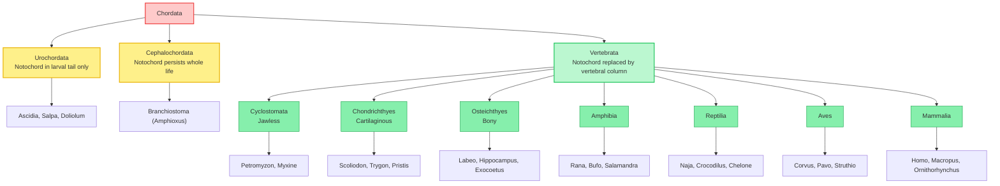

# Biology | Chapter 04 | Animal Kingdom | CNOTES

---

## 🔁 COMPARATIVE MATRIX 1: Diploblastic vs Triploblastic

| Feature / Parameter of Comparison | **Diploblastic** | **Triploblastic** |
|---|---|---|
| Germ Layers | **Two** — Ectoderm + Endoderm | **Three** — Ectoderm + Mesoderm + Endoderm |
| Layer Between | Non-cellular **mesoglea** | True cellular **mesoderm** |
| Phyla | Coelenterata, Ctenophora | Platyhelminthes onward (all higher phyla) |
| Organ Complexity | Low — tissue level only | Can achieve organ / organ-system level |
| NEET Exam Weight | Moderate | **High** |

---

## 🔁 COMPARATIVE MATRIX 2: Acoelomate vs Pseudocoelomate vs Coelomate

| Feature / Parameter | **Acoelomate** | **Pseudocoelomate** | **Coelomate** |
|---|---|---|---|
| Mesoderm Arrangement | **Solid, compact mass** — no cavity | **Scattered pouches**, cavity not lined | **Continuous mesodermal lining** on both sides |
| Body Cavity | **Absent** | Present but false | Present — **true coelom** |
| Phylum | Platyhelminthes | Aschelminthes | Annelida, Mollusca, Arthropoda, Echinodermata, Hemichordata, Chordata |
| NEET Trap | — | Mistaken for "no cavity" | Mistaken for "any fluid space" |

---

## 🔁 COMPARATIVE MATRIX 3: Open vs Closed Circulatory System

| Feature / Parameter | **Open Circulatory System** | **Closed Circulatory System** |
|---|---|---|
| Blood Pathway | Flows into body spaces called **haemocoel** | Confined entirely within **vessels** |
| Phyla | Arthropoda, most Mollusca | Annelida, Chordata (most) |
| Exception | **Cephalopod molluscs** (e.g., *Sepia*, *Loligo*) have closed system | — |
| Efficiency | Lower pressure, less efficient | Higher pressure, more efficient distribution |

---

## 🔁 COMPARATIVE MATRIX 4: Chondrichthyes vs Osteichthyes

| Feature / Parameter of Comparison | **Chondrichthyes** | **Osteichthyes** |
|---|---|---|
| Endoskeleton | **Cartilaginous** | **Bony** |
| Gill Covering | **Operculum absent** | **Operculum present** |
| Air Bladder | **Absent** (must swim continuously) | **Present** (buoyancy control) |
| Mouth Position | Usually **ventral** | Usually **terminal** |
| Fertilisation / Development | Internal; mostly **viviparous** | External; mostly **oviparous** |
| NCERT Examples | *Scoliodon*, *Pristis*, *Trygon* | *Exocoetus*, *Hippocampus*, *Labeo* |

---

## 🔁 COMPARATIVE MATRIX 5: Amphibia vs Reptilia

| Feature / Parameter of Comparison | **Amphibia** | **Reptilia** |
|---|---|---|
| Habitat | **Both aquatic and terrestrial** | Primarily **terrestrial** |
| Skin | **Moist**, without scales | **Dry, cornified**, with scales/scutes |
| Respiration | Gills, lungs, **and skin** | **Lungs only** |
| Heart Chambers | **Three-chambered** | **Three-chambered** (crocodile = **four**) |
| Fertilisation | **External** | **Internal** |
| Development | Indirect — **larval stage present** | Direct — **no larval stage** |

---

## 🔁 COMPARATIVE MATRIX 6: Aves vs Mammalia

| Feature / Parameter of Comparison | **Aves** | **Mammalia** |
|---|---|---|
| Body Covering | **Feathers** | **Hair** |
| Diagnostic Gland | Oil gland at tail base | **Mammary glands** |
| Heart | **Four-chambered** | **Four-chambered** |
| Thermoregulation | **Homeothermous** | **Homeothermous** |
| Reproduction | **Oviparous** (calcareous-shelled eggs) | Mostly **viviparous** (exception: prototherians, e.g. platypus — oviparous) |
| Skeletal Adaptation | **Pneumatic (hollow) bones** | Solid, dense bones |

---

## 🌳 NON-CHORDATE PHYLUM TREE — Increasing Complexity

```mermaid
graph TD
    Animalia --> P1["Porifera<br/>Cellular level, Asymmetrical"]
    Animalia --> P2["Coelenterata<br/>Tissue level, Radial, Diploblastic"]
    Animalia --> P3["Ctenophora<br/>Radial, Diploblastic, Comb plates"]
    Animalia --> P4["Platyhelminthes<br/>Bilateral, Acoelomate"]
    Animalia --> P5["Aschelminthes<br/>Bilateral, Pseudocoelomate"]
    Animalia --> P6["Annelida<br/>Coelomate, Metameric segmentation"]
    Animalia --> P7["Arthropoda<br/>Coelomate, Jointed appendages, Largest phylum"]
    Animalia --> P8["Mollusca<br/>Coelomate, Shell + Mantle + Foot"]
    Animalia --> P9["Echinodermata<br/>Coelomate, Water vascular system"]
    Animalia --> P10["Hemichordata<br/>Coelomate, Stomochord - connecting link"]

    style Animalia fill:#fecaca,stroke:#ef4444,stroke-width:2px
    style P1 fill:#dbeafe,stroke:#3b82f6,stroke-width:1px
    style P2 fill:#dbeafe,stroke:#3b82f6,stroke-width:1px
    style P3 fill:#dbeafe,stroke:#3b82f6,stroke-width:1px
    style P4 fill:#fef08a,stroke:#eab308,stroke-width:1px
    style P5 fill:#fef08a,stroke:#eab308,stroke-width:1px
    style P6 fill:#bbf7d0,stroke:#22c55e,stroke-width:1px
    style P7 fill:#bbf7d0,stroke:#22c55e,stroke-width:1px
    style P8 fill:#bbf7d0,stroke:#22c55e,stroke-width:1px
    style P9 fill:#bbf7d0,stroke:#22c55e,stroke-width:1px
    style P10 fill:#86efac,stroke:#16a34a,stroke-width:1px
```

---

## 🌳 PHYLUM CHORDATA — Complete Classification Tree

---

## 📊 MASTER RECALL TABLE — Complete Phylum Feature Grid (NCERT-Aligned)

| Phylum | Symmetry | Body Cavity | Circulatory System | Key Diagnostic Feature | Example |
|---|---|---|---|---|---|
| **Porifera** | Asymmetrical | Absent | Absent | Ostia, spongocoel, osculum | *Sycon* |
| **Coelenterata** | Radial | Absent | Absent | Cnidoblasts, single gastro-vascular opening | *Physalia* |
| **Ctenophora** | Radial | Absent | Absent | 8 rows of comb plates, bioluminescence | *Pleurobrachia* |
| **Platyhelminthes** | Bilateral | Acoelomate | Absent | Flame cells | *Fasciola* |
| **Aschelminthes** | Bilateral | Pseudocoelomate | Absent | Complete alimentary canal, dioecious | *Ascaris* |
| **Annelida** | Bilateral | Coelomate | **Closed** | Metameric segmentation | *Pheretima* |
| **Arthropoda** | Bilateral | Coelomate | **Open** | Jointed appendages, exoskeleton | *Palaemon* |
| **Mollusca** | Bilateral | Coelomate | Open (mostly) | Shell, mantle, radula | *Pila* |
| **Echinodermata** | Radial (adult) | Coelomate | Absent | Water vascular system, ossicles | *Asterias* |
| **Hemichordata** | Bilateral | Coelomate | Open | Stomochord | *Balanoglossus* |
| **Chordata** | Bilateral | Coelomate | Closed (mostly) | Notochord, dorsal hollow nerve cord | *Homo sapiens* |

---

## 📊 MASTER RECALL TABLE — Vertebrate Class Feature Grid

| Class | Heart | Skeleton | Skin/Covering | Fertilisation | Development |
|---|---|---|---|---|---|
| **Cyclostomata** | Two-chambered | Cartilaginous, jawless | Scale-less | External | Direct/indirect |
| **Chondrichthyes** | Two-chambered | Cartilaginous | Placoid scales | Internal | Mostly viviparous |
| **Osteichthyes** | Two-chambered | Bony | Cycloid/ctenoid scales | External | Oviparous |
| **Amphibia** | **Three**-chambered | Bony | Moist, glandular skin | External | Indirect (larval stage) |
| **Reptilia** | **Three**-chambered (Crocodile: **four**) | Bony | Dry, cornified scales | Internal | Direct |
| **Aves** | **Four**-chambered | Bony, pneumatic | Feathers | Internal | Oviparous, direct |
| **Mammalia** | **Four**-chambered | Bony | Hair | Internal | Mostly viviparous, direct |

---

## 🧠 MNEMONIC VAULT

> [!note] MNEMONIC: Order of Non-Chordate Phyla (Increasing Complexity)
> **P**oor **C**ats **C**limb **P**alm **A**nd **A**scend **A**rching **M**ountains **E**ach **H**our
> → **P**orifera, **C**oelenterata, **C**tenophora, **P**latyhelminthes, **A**schelminthes, **A**nnelida, **A**rthropoda, **M**ollusca, **E**chinodermata, **H**emichordata

> [!note] MNEMONIC: The Four Chordate Features
> "**N**ancy **D**rove **G**randma's **T**axi"
> → **N**otochord, **D**orsal hollow nerve cord, paired pharyn**G**eal gill slits, Post-anal **T**ail

> [!note] MNEMONIC: Chondrichthyes vs Osteichthyes Memory Hook
> "**C**artilage **C**an't float" (Chondrichthyes = Cartilage, no air bladder, must keep swimming) vs "**O**steichthyes = **O**perculum + air bladder = floats **O**K"

> [!note] MNEMONIC: Order of Vertebrate Classes (Evolutionary Sequence)
> "**C**urious **C**ats **O**ften **A**dmire **R**ainbow **A**quatic **M**oons"
> → **C**yclostomata, **C**hondrichthyes, **O**steichthyes, **A**mphibia, **R**eptilia, **A**ves, **M**ammalia

> [!note] MNEMONIC: The Coelom Hierarchy
> "**A** **P**enguin **C**an't Swim" → **A**coelomate (Platyhelminthes), **P**seudocoelomate (Aschelminthes), **C**oelomate (everything from Annelida onward)

---

## ⚡ QUICK-SCAN FLASHCARD TABLE

| # | Fact | Tag |
|---|---|---|
| 1 | Arthropoda is the **largest phylum**, comprising over two-thirds of all named animal species | NEET |
| 2 | Vertebrata is a **subphylum**, not a phylum — it sits within phylum Chordata | NEET |
| 3 | Notochord is present at **some stage of life** in all chordates, not necessarily in adults | Both |
| 4 | Hemichordata's **stomochord** is superficially similar to but **not** the same as a notochord | NEET |
| 5 | Echinoderm **larvae are bilateral**; only **adults** are radially symmetrical | NEET |
| 6 | **Cnidoblasts** are the defence/prey-capture cells unique to Coelenterata | Board |
| 7 | **Radula** is absent in bivalve molluscs, unlike other molluscs | NEET |
| 8 | Chondrichthyes lacks an **air bladder** and an **operculum**; Osteichthyes has both | NEET |
| 9 | Crocodiles are the **only reptiles** with a **four-chambered heart** | NEET |
| 10 | **Platypus** (*Ornithorhynchus*) is an egg-laying mammal — an exception to mammalian viviparity | NEET |
