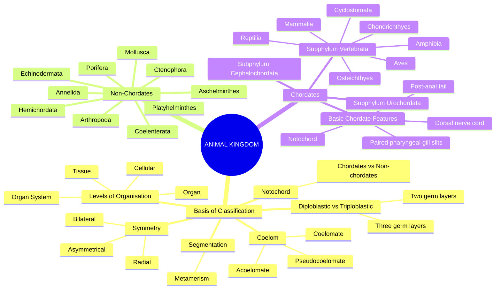
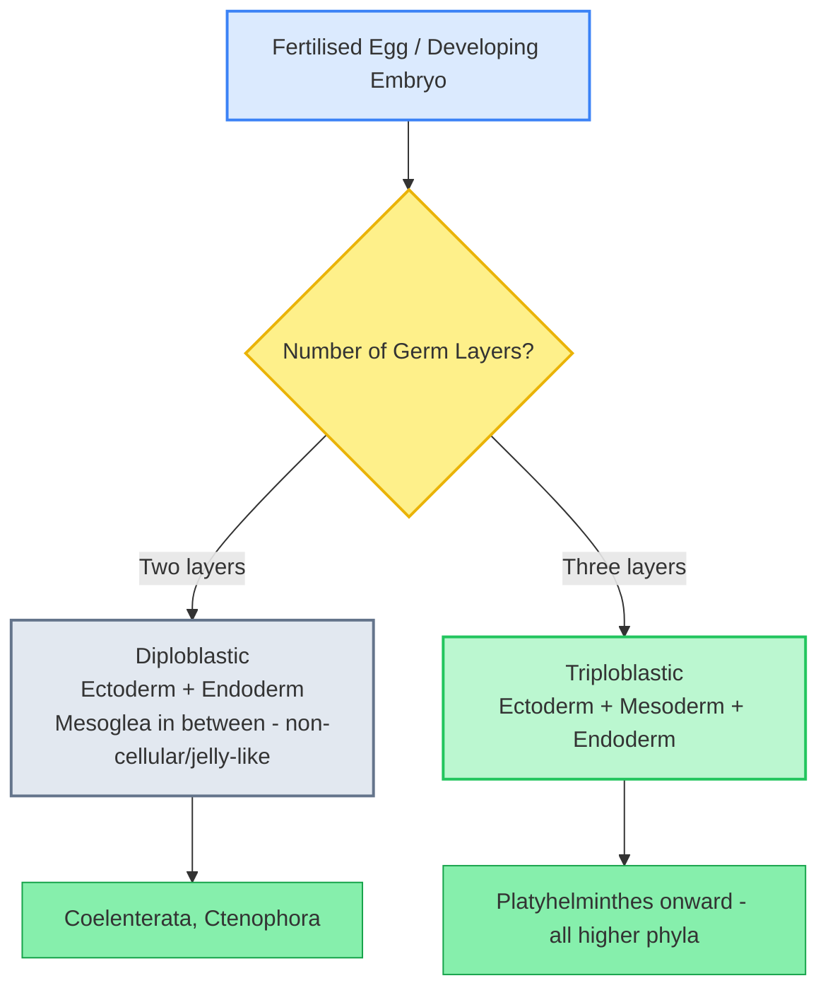
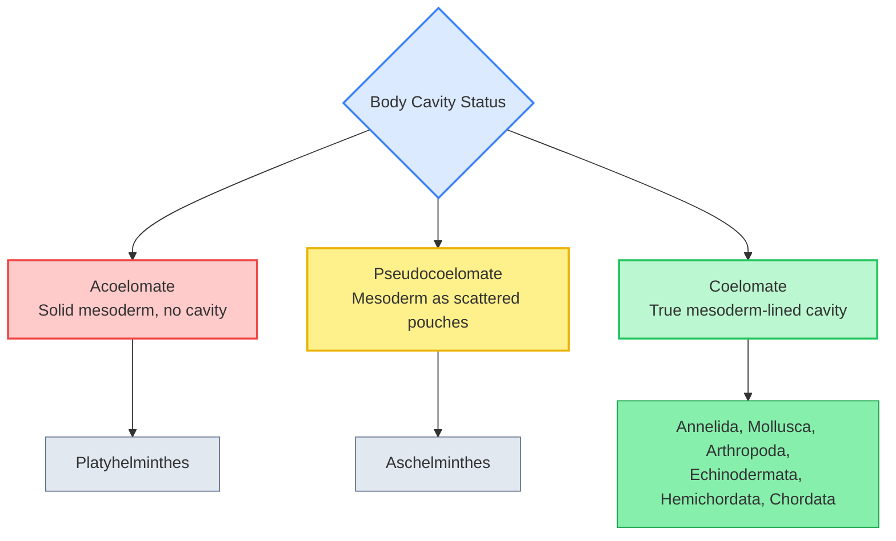
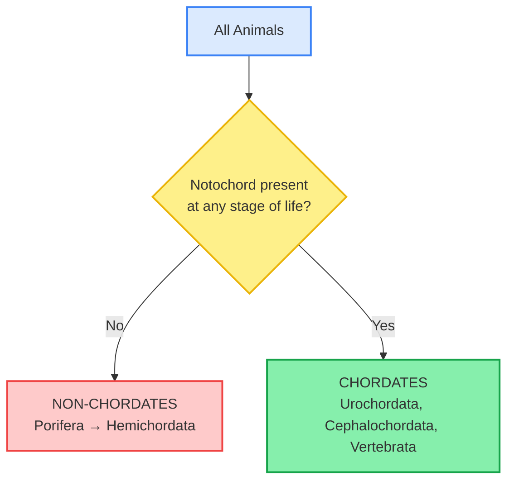
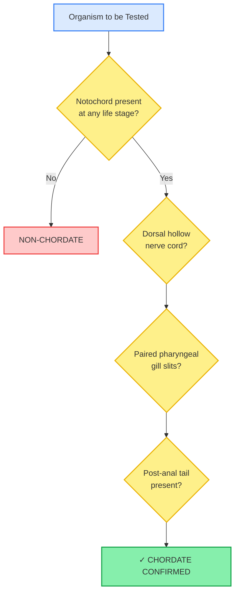
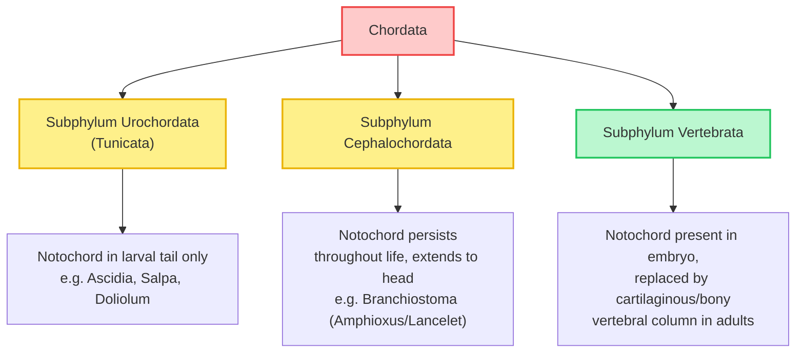

# Biology | Chapter 04 | Animal Kingdom | NOTES

---

## 🗺️ THE CHAPTER DASHBOARD

> Trace every branch here once before reading the subsections. This chapter has two conceptually distinct halves — **the classification criteria (the "grammar")** and **the phyla themselves (the "vocabulary")** — and this map holds both together.

---

## 4.1 BASIS OF CLASSIFICATION

Before a single phylum can be studied, animals must first be sorted using a common set of fundamental, comparable criteria. These criteria form the "grammar" of animal classification — every phylum you meet later will be described using this exact vocabulary.

### 4.1.1 Levels of Organisation

Not all multicellular animals organise their cells the same way.

> [!example] NCERT MANDATORY EXAMPLES: Levels of Organisation
> - **Cellular level**: Phylum **Porifera** (sponges) — cells arranged as loose aggregates.
> - **Tissue level**: Phylum **Coelenterata (Cnidaria)** — cells performing similar functions are arranged into tissues.
> - **Organ level**: Phylum **Platyhelminthes** — tissues organised into organs.
> - **Organ system level**: Phylum **Annelida** onward — organs form functional systems; in higher forms (e.g., **Annelida**), the digestive system has two openings, mouth and anus, and there is division of labour among organs.

### 4.1.2 Symmetry

> [!info] Symmetry Definitions
> - **Asymmetrical**: No plane can divide the body into equal halves — e.g., most **sponges**.
> - **Radial Symmetry**: Any plane passing through the central axis divides the body into two identical halves — e.g., **Coelenterata**, **Ctenophora**, **Echinodermata** (adult).
> - **Bilateral Symmetry**: Only one plane, passing longitudinally, divides the body into identical left and right halves — e.g., **Annelida**, **Arthropoda**, and most higher phyla.

> [!warning] CRITICAL PITFALL: Echinodermata's Deceptive Symmetry
> Adult **echinoderms** are radially symmetrical, but their **larvae are bilaterally symmetrical**. This mismatch between larval and adult symmetry is a favourite NEET assertion-reasoning trap — never assume symmetry is fixed across an organism's entire life cycle.

### 4.1.3 Diploblastic and Triploblastic Organisation

> [!info] Why Triploblasty Matters
> The mesoderm in triploblastic animals gives rise to structurally complex tissues and organs (e.g., muscles, connective tissue), which is why nearly all functionally advanced phyla — from **Platyhelminthes** onward — are triploblastic.

### 4.1.4 Coelom — The Body Cavity

The **coelom** is the body cavity lined by mesoderm. Its presence, absence, or partial development is one of the highest-yield classification criteria in the entire chapter.

| Type | Definition | Phyla |
|---|---|---|
| **Coelomate (Eucoelomate)** | Mesoderm is **fully lined** on both sides (body wall side and gut side), forming a true coelom | **Annelida, Mollusca, Arthropoda, Echinodermata, Hemichordata, Chordata** |
| **Pseudocoelomate** | Mesoderm is present as **scattered pouches** between ectoderm and endoderm — the body cavity is **not lined by mesoderm** | **Aschelminthes** (e.g., roundworms) |
| **Acoelomate** | **No body cavity** at all — mesoderm is present as a solid, compact mass | **Platyhelminthes** |

> [!warning] CRITICAL PITFALL: Coelomate ≠ "Has a Cavity"
> Students often assume any internal space qualifies as a "coelom." A pseudocoelomate **does** have a fluid-filled body cavity — but because it is **not lined by mesoderm on both sides**, it does not count as a true coelom. Precisely: True coelom = mesodermal lining present on **both** the outer (body-wall) and inner (gut) surfaces of the cavity.

### 4.1.5 Segmentation (Metamerism)

> [!info] Metameric Segmentation
> In some animals, the body is externally and internally divided into serially repeating segments, with at least some organs repeated in each segment. This phenomenon is called **metameric segmentation**, and the phenomenon itself is termed **metamerism**.
> **Anatomical Occurrence:** Best exemplified by **Annelida** (e.g., the earthworm, where segments are visible as external rings) — the phylum name *Annelida* itself derives from "annulus" (little ring).

### 4.1.6 Notochord

> [!info] The Notochord — The Great Divide
> The **notochord** is a mesodermally-derived, rod-like supporting structure that runs along the dorsal side of the body, separating the nerve cord from the gut during embryonic development.
> - Animals **with** a notochord (at some stage of life) → **Chordata**.
> - Animals **without** a notochord at any stage → **Non-chordata**.

---

## 4.2 CLASSIFICATION OF NON-CHORDATE PHYLA

```mermaid
graph TD
    Animalia --> Porifera
    Animalia --> Coelenterata
    Animalia --> Ctenophora
    Animalia --> Platyhelminthes
    Animalia --> Aschelminthes
    Animalia --> Annelida
    Animalia --> Arthropoda
    Animalia --> Mollusca
    Animalia --> Echinodermata
    Animalia --> Hemichordata
    Animalia --> Chordata

    style Animalia fill:#fecaca,stroke:#ef4444,stroke-width:2px
    style Porifera fill:#dbeafe,stroke:#3b82f6,stroke-width:1px
    style Coelenterata fill:#dbeafe,stroke:#3b82f6,stroke-width:1px
    style Ctenophora fill:#dbeafe,stroke:#3b82f6,stroke-width:1px
    style Platyhelminthes fill:#fef08a,stroke:#eab308,stroke-width:1px
    style Aschelminthes fill:#fef08a,stroke:#eab308,stroke-width:1px
    style Annelida fill:#bbf7d0,stroke:#22c55e,stroke-width:1px
    style Arthropoda fill:#bbf7d0,stroke:#22c55e,stroke-width:1px
    style Mollusca fill:#bbf7d0,stroke:#22c55e,stroke-width:1px
    style Echinodermata fill:#bbf7d0,stroke:#22c55e,stroke-width:1px
    style Hemichordata fill:#86efac,stroke:#16a34a,stroke-width:1px
    style Chordata fill:#86efac,stroke:#16a34a,stroke-width:2px
```

### 4.2.1 Phylum Porifera (Pore-Bearers)

- **Habitat:** Mostly marine, found attached to solid substrata; commonly called **sponges**.
- **Organisation:** Cellular level; **asymmetrical**.
- **Diagnostic feature:** The body is perforated by numerous minute pores (**ostia**), which open into a canal system leading to a central cavity, the **spongocoel**, from which water leaves via the **osculum**. This water transport (canal) system is used for food, oxygen, and waste removal, making it the defining functional feature of the phylum.
- **Cellular feature:** The body is supported by a skeleton made of **spicules** or **spongin fibres**.
- **Choanocytes** (collar cells) line the spongocoel and canals, and maintain the water flow.
- **Reproduction:** Sexual as well as asexual (via fragmentation); larvae are free-swimming, while adults are **sessile**.

> [!example] NCERT MANDATORY EXAMPLES: Porifera
> *Sycon* (*Scypha*), *Spongilla* (freshwater sponge), *Euspongia* (bath sponge).

### 4.2.2 Phylum Coelenterata (Cnidaria)

- **Habitat:** Aquatic, mostly marine, sessile or free-swimming.
- **Organisation:** Tissue level; **radially symmetrical**; **diploblastic**.
- **Diagnostic feature:** Possess a central gastro-vascular cavity with a **single opening** (mouth-cum-anus), surrounded by tentacles.
- **Cnidoblasts/cnidocytes** on the tentacles are used for defence and prey capture — the defining organelle-bearing cell of the phylum.
- **Body forms:** Some exist as **polyp** (sessile, cylindrical) and others as **medusa** (umbrella-shaped, free-swimming); some (e.g., *Obelia*) exhibit **polymorphism** — existing in both forms.
- Metagenesis (alternation of generations) is seen in forms like *Obelia*: polyp reproduces asexually, medusa reproduces sexually.

> [!example] NCERT MANDATORY EXAMPLES: Coelenterata
> *Physalia* (Portuguese man-of-war), *Adamsia* (sea anemone), *Pennatula* (sea-pen), *Gorgonia* (sea-fan), *Meandrina* (brain coral).

### 4.2.3 Phylum Ctenophora (Comb Jellies / Sea Walnuts)

- **Habitat:** Exclusively **marine**.
- **Organisation:** **Radially symmetrical**; **diploblastic**; tissue level.
- **Diagnostic feature:** Bear **eight external rows of ciliated comb plates**, which help in locomotion.
- **Bioluminescence** (property of a living organism to emit light) is well-marked in this phylum.
- Digestion is both extracellular and intracellular; sexes are not separate (i.e., **all ctenophores are hermaphrodite/monoecious**), and reproduction is exclusively sexual.

> [!example] NCERT MANDATORY EXAMPLES: Ctenophora
> *Ctenoplana*, *Pleurobrachia*.

### 4.2.4 Phylum Platyhelminthes (Flatworms)

- **Organisation:** **Triploblastic**, **acoelomate**; organ level.
- **Symmetry:** **Bilaterally symmetrical**; body dorso-ventrally flattened (hence "flat"-worms).
- Many members are **endoparasites** found in animals, including humans, and possess specific adaptations such as hooks and suckers to get attached to the body of the host.
- Body is covered by either a **cilia** or (in parasitic forms) a resistant **cuticle**.
- **Excretory organs:** Specialised cells called **flame cells** help in osmoregulation and excretion.
- Reproduce sexually (hermaphrodites); some are also capable of extraordinary **regeneration**.

> [!example] NCERT MANDATORY EXAMPLES: Platyhelminthes
> *Taenia* (tapeworm), *Fasciola* (liver fluke), *Planaria* (free-living, capable of regeneration).

### 4.2.5 Phylum Aschelminthes (Roundworms)

- **Organisation:** **Triploblastic, pseudocoelomate**; organ-system level.
- **Symmetry:** **Bilaterally symmetrical**; body is circular in cross-section (hence "round"-worms).
- Alimentary canal is **complete**, with a well-developed muscular pharynx.
- Excretory substances are removed through the body surface.
- Sexes are **separate** (dioecious); females are usually longer than males, and fertilisation is internal; may be free-living, aquatic, or parasitic in plants and animals.

> [!example] NCERT MANDATORY EXAMPLES: Aschelminthes
> *Ascaris* (roundworm), *Wuchereria* (filarial worm, causes filariasis), *Ancylostoma* (hookworm).

### 4.2.6 Phylum Annelida (Segmented Worms)

- **Habitat:** Found in marine, freshwater, and terrestrial habitats; some are free-living, some parasitic.
- **Organisation:** **Triploblastic, coelomate**; organ-system level.
- **Diagnostic feature:** Exhibit true **metameric segmentation** — body is externally and internally divided into identical segments.
- Have a **closed circulatory system** (blood is confined within vessels).
- Nervous system: paired ganglia connected by lateral nerves to a **double ventral nerve cord**.
- **Excretory organs**: nephridia.

> [!example] NCERT MANDATORY EXAMPLES: Annelida
> *Nereis* (marine, has lateral appendages called parapodia for swimming), *Pheretima* (earthworm), *Hirudinaria* (blood-sucking leech).

### 4.2.7 Phylum Arthropoda — The Largest Animal Phylum

> [!info] Numerical Dominance
> Phylum Arthropoda is the **largest phylum of the Animal Kingdom**, and includes more than **two-thirds of all named species** on Earth. This is an extremely high-yield standalone recall fact.

- **Organisation:** **Triploblastic, coelomate**; organ-system level; **bilaterally symmetrical**.
- **Diagnostic feature:** A hard, chitinous **exoskeleton** and **jointed appendages** (hence the name "arthro" = jointed, "poda" = foot/leg).
- Body is covered by a chitinous **cuticle**; possesses an **open circulatory system**, so blood does not flow in well-defined vessels — the body cavity here is termed a **haemocoel**.
- Respiratory organs: **gills, book gills, book lungs, or tracheal system**, depending on habitat.
- Sensory organs: antennae, eyes (compound and simple), statocysts/balance organs.
- Excretion via **Malpighian tubules** in most terrestrial forms.
- Sexes are usually separate; fertilisation generally internal; mostly **oviparous**.

> [!example] NCERT MANDATORY EXAMPLES: Arthropoda
> *Palaemon* (prawn), *Locusta* (locust), *Apis* (honey-bee), *Bombyx* (silkworm), *Laccifer* (lac insect), *Limulus* (king-crab, a "living fossil").

### 4.2.8 Phylum Mollusca — Second Largest Phylum

- **Organisation:** **Triploblastic, coelomate**; organ-system level.
- **Habitat:** Terrestrial or aquatic (fresh water as well as marine).
- **Diagnostic features:** The body is covered by a calcareous **shell** and divided into a distinct **head, muscular foot, and visceral hump**.
- A soft, spongy layer of skin called the **mantle** covers the visceral hump, and the space between the mantle and the visceral mass is called the **mantle cavity** (houses gill-like structures called **ctenidia**).
- A file-like rasping organ, the **radula**, is present in the mouth in most (except bivalves) — used for grazing on food.
- Respiration via **ctenidia (gills)**, and excretion via **kidneys**.
- Sexes are usually separate; oviparous.

> [!example] NCERT MANDATORY EXAMPLES: Mollusca
> *Pila* (apple snail), *Pinctada* (pearl oyster), *Sepia* (cuttlefish), *Loligo* (squid), *Octopus* (devilfish — has lost the shell entirely), *Aplysia* (sea-hare), *Dentalium* (tusk shell), *Chaetopleura* (chiton).

### 4.2.9 Phylum Echinodermata (Spiny-Skinned)

- **Habitat:** Exclusively **marine**.
- **Organisation:** **Triploblastic, coelomate**; organ-system level.
- **Symmetry:** Adults are **radially symmetrical**, but **larvae are bilaterally symmetrical** (see Critical Pitfall in Section 4.1.2).
- **Diagnostic feature:** Have a **spiny skin** made of calcareous ossicles.
- Possess a unique **water vascular system** which is used for locomotion, capture and transport of food, and respiration.
- Digestive system is complete, with mouth on the lower (oral) side and anus on the upper (aboral) side.
- Sexes are separate; reproduction sexual; fertilisation usually external; development through free-swimming larvae.

> [!example] NCERT MANDATORY EXAMPLES: Echinodermata
> *Asterias* (star fish), *Echinus* (sea urchin), *Antedon* (sea lily), *Cucumaria* (sea cucumber), *Ophiura* (brittle star).

### 4.2.10 Phylum Hemichordata

- **Historical Note:** Formerly considered a subphylum under Chordata, but now separated as an **independent phylum** placed between non-chordates and chordates.
- **Organisation:** **Triploblastic, coelomate**; organ-system level.
- **Diagnostic feature:** A short, tubular structure called the **stomochord** is found in the collar region (a superficial resemblance to a notochord — a historically important point of confusion).
- Body is cylindrical, and composed of three parts: **proboscis, collar, and trunk**.
- Circulatory system is of the **open type**; respiration through **gill-slits**.
- Sexes are separate; fertilisation is external; development is indirect.

> [!example] NCERT MANDATORY EXAMPLES: Hemichordata
> *Balanoglossus*, *Saccoglossus*.

> [!warning] CRITICAL PITFALL: Stomochord ≠ Notochord
> Because of the superficial similarity between the **stomochord** and a true **notochord**, Hemichordata was historically wrongly grouped as a chordate subphylum. NEET frequently tests this exact historical misclassification — Hemichordata is **not** a chordate; it is placed as a distinct connecting phylum.

---

## 4.3 PHYLUM CHORDATA

### 4.3.1 The Four Fundamental Chordate Features

> [!info] The Defining Quartet of Chordata
> All chordates possess the following four features at **some stage of their life** (not necessarily as adults):
> 1. **Notochord** is present.
> 2. A **dorsal, hollow nerve cord** is present.
> 3. **Paired pharyngeal gill slits** are present.
> 4. Body is **triploblastic, coelomate**, and has a **post-anal tail** (extends beyond the anus).

> [!warning] CRITICAL PITFALL: Non-Chordate Nerve Cord Position
> In **non-chordates** (e.g., Annelida, Arthropoda), the nerve cord — where present — is **solid and ventral**. In **chordates**, it is **dorsal and hollow**. This dorsal/ventral, hollow/solid inversion is a classic NEET differentiator between the two super-groups.

### 4.3.2 Chordata is Divided into Three Subphyla

> [!warning] CRITICAL PITFALL: Vertebrata is a SUBPHYLUM, not a Phylum
> One of the highest-yield NEET traps in this entire chapter: **Vertebrata is a subphylum of Chordata**, not an independent phylum. All vertebrates are chordates, but Urochordata and Cephalochordata are chordates that are **not** vertebrates ("Protochordata").

> [!info] Additional Vertebrate-Defining Feature
> In addition to all basic chordate features, vertebrates possess a **ventral, muscular heart** with two, three, or four chambers.

### 4.3.3 Superclass Pisces — The Fish Classes

Vertebrata (excluding Cyclostomata) is often first split into **Pisces** (fish-like, gill-breathing, aquatic) and **Tetrapoda** (four-limbed).

#### Class Cyclostomata (Jawless Fish)

- **Diagnostic feature:** **Jawless**; body elongated, and bears round, sucking mouths without jaws.
- Circular mouth is suctorial, and possesses **2-7 pairs of gill slits** for respiration.
- **Ectoparasitic** on some fishes; live in marine as well as freshwater (returning to breed).
- Cranium and vertebral column are cartilaginous.
- No scales, no paired fins.

> [!example] NCERT MANDATORY EXAMPLES: Cyclostomata
> *Petromyzon* (lamprey), *Myxine* (hagfish).

#### Class Chondrichthyes (Cartilaginous Fish)

- Marine, having a **cartilaginous endoskeleton** and a **streamlined body**.
- Mouth is usually **ventrally** placed; **notochord is persistent throughout life**.
- Gill slits are **separate and without an operculum (gill cover)**.
- Skin is tough, containing minute placoid scales; **teeth are modified placoid scales**, backwardly directed.
- **Air bladder is absent** — hence they must swim continuously to avoid sinking.
- Sexes are separate; internally fertilised, mostly **viviparous**.

> [!example] NCERT MANDATORY EXAMPLES: Chondrichthyes
> *Scoliodon* (dogfish), *Pristis* (sawfish), *Carcharodon* (great white shark), *Trygon* (stingray).

#### Class Osteichthyes (Bony Fish)

- Marine and freshwater fish possessing a **bony endoskeleton**.
- Body is streamlined; mouth generally **terminal**.
- Gills are covered by an **operculum** on either side.
- **Air bladder is present**, regulating buoyancy.
- Skin covered with cycloid/ctenoid scales; sexes are separate; usually **oviparous**; fertilisation is usually external.

> [!example] NCERT MANDATORY EXAMPLES: Osteichthyes
> Marine: *Exocoetus* (flying fish), *Hippocampus* (sea horse). Freshwater: *Labeo* (rohu), *Catla*, *Clarias*. Aquarium: *Betta* (fighting fish), *Pterophyllum* (angel fish).

> [!warning] CRITICAL PITFALL: Chondrichthyes vs Osteichthyes — The Three Non-Negotiable Differences
> NEET tests this pair relentlessly. Memorise exactly three contrasts:
> 1. Skeleton: **Cartilaginous** vs **Bony**.
> 2. Gill covering: **No operculum** vs **operculum present**.
> 3. Air bladder: **Absent** vs **present**.

### 4.3.4 Class Amphibia

- Can live in **both aquatic and terrestrial** habitats (hence "amphi" = both + "bios" = life).
- Body is divisible into head and trunk; tail may or may not be present.
- Skin is **moist** (without scales), used for cutaneous respiration.
- **Respiratory organs:** gills, lungs, and skin, depending on species and stage.
- Heart is generally **three-chambered**; sexes are separate; fertilisation is **external**; development is indirect, involving a **larval stage** (e.g., tadpole) which undergoes **metamorphosis** to become an adult.

> [!example] NCERT MANDATORY EXAMPLES: Amphibia
> *Bufo* (toad), *Rana tigrina* (frog), *Hyla* (tree frog), *Salamandra* (salamander — has a tail), *Ichthyophis* (limbless amphibian).

### 4.3.5 Class Reptilia

- Creeping or crawling reptiles (from Latin *repere* = to creep).
- Body is covered by **dry and cornified skin**, epidermal scales, or scutes.
- Skeleton is bony; respiration is exclusively through **lungs**.
- Heart is **three-chambered**, but crocodiles have a **four-chambered** heart.
- No external ear (only ear-holes); sexes are separate; fertilisation is **internal**; **oviparous** (mostly), with development being direct (no larval stage).

> [!warning] CRITICAL PITFALL: The Crocodile Exception
> While the standard class definition states Reptilia has a **three-chambered heart**, **crocodiles are the single exception with a four-chambered heart**. This exception is a favourite NEET trap and must be memorised verbatim.

> [!example] NCERT MANDATORY EXAMPLES: Reptilia
> *Chelone* (turtle), *Testudo* (tortoise), *Chameleon* (colour-changing lizard), *Calotes* (garden lizard), *Crocodilus* (crocodile), *Alligator*, *Naja* (cobra), *Hemidactylus* (wall lizard). Extinct: **dinosaurs**.

### 4.3.6 Class Aves (Birds)

- Presence of **feathers**; most can fly (except a few flightless — running/ratite — birds).
- Beak is present; forelimbs are modified into **wings**.
- Hind limbs generally show **scales**, and are modified for walking, swimming, or clasping tree branches.
- Skin is dry, without glands, except the **oil gland** at the base of the tail.
- Skeleton is fully ossified, and the long bones are **hollow with air cavities (pneumatic)**.
- Heart is completely **four-chambered**; they are **warm-blooded (homeothermous)**, maintaining a constant body temperature.
- Sexes are separate; fertilisation is internal; **oviparous**, and the eggs are covered by a calcareous shell, incubated externally by parent.

> [!example] NCERT MANDATORY EXAMPLES: Aves
> *Struthio* (ostrich — largest living bird), *Pavo* (peacock), *Corvus* (crow), *Columba* (pigeon), *Psittacula* (parrot), *Aptenodytes* (penguin — flightless, aquatic).

### 4.3.7 Class Mammalia

- Found in **all habitats** — polar, terrestrial, freshwater, marine, desert, and even some capable of flight (bats) or aerial locomotion (flying squirrel via gliding).
- **Diagnostic feature:** Presence of **mammary glands**, used for producing milk to nourish young.
- Skin possesses **hair**, and also has oil (sebaceous) and sweat (sudoriferous) glands.
- **Different types of teeth (heterodont)**, present in sockets of the jaw bones (**thecodont** dentition).
- Heart is **four-chambered**; they are **warm-blooded**.
- Sexes are separate; fertilisation is **internal**; usually **viviparous**, with direct development (a few exceptions lay eggs).

> [!warning] CRITICAL PITFALL: Egg-Laying Mammals
> While Mammalia is generally defined as **viviparous**, **Prototherians (egg-laying mammals)** such as the **platypus** are a critical NCERT-cited exception. Do not assume "mammal" automatically means "viviparous" in an exam context.

> [!example] NCERT MANDATORY EXAMPLES: Mammalia
> *Ornithorhynchus* (platypus — egg-laying), *Macropus* (kangaroo — marsupial/pouched), *Pteropus* (flying fox/bat), *Camelus* (camel), *Macaca* (monkey), *Panthera* (lion/tiger), *Canis* (dog), *Homo sapiens* (human).

---

## 4.4 CONSOLIDATED FEATURE MATRIX — QUICK VERTICAL SCAN

| Phylum | Symmetry | Germ Layers | Coelom | Circulatory System | Habitat |
|---|---|---|---|---|---|
| Porifera | Asymmetrical | — (Cellular level) | Absent | Absent | Mostly marine |
| Coelenterata | Radial | Diploblastic | Absent | Absent | Aquatic |
| Ctenophora | Radial | Diploblastic | Absent | Absent | Marine |
| Platyhelminthes | Bilateral | Triploblastic | Acoelomate | Absent | Free-living/Parasitic |
| Aschelminthes | Bilateral | Triploblastic | Pseudocoelomate | Absent | Free-living/Parasitic |
| Annelida | Bilateral | Triploblastic | Coelomate | **Closed** | Marine/Freshwater/Terrestrial |
| Arthropoda | Bilateral | Triploblastic | Coelomate | **Open** (Haemocoel) | All habitats |
| Mollusca | Bilateral | Triploblastic | Coelomate | Open (except Cephalopods) | Terrestrial/Aquatic |
| Echinodermata | Radial (adult), Bilateral (larva) | Triploblastic | Coelomate | Absent (Water Vascular System instead) | Marine |
| Hemichordata | Bilateral | Triploblastic | Coelomate | Open | Marine |
| Chordata | Bilateral | Triploblastic | Coelomate | Closed (most) | All habitats |

> [!warning] CRITICAL PITFALL: Open vs Closed Circulatory System
> **Closed circulatory system** = blood flows exclusively within vessels (Annelida, most Chordata). **Open circulatory system** = blood flows into body spaces/sinuses called **haemocoel** rather than through defined vessels for at least part of the circuit (Arthropoda, Mollusca except cephalopods, Hemichordata). This is asked directly as a matching question nearly every year.

---

## 📌 CHAPTER SYNTHESIS

The Animal Kingdom is first organised using **five universal structural criteria** — level of body organisation, symmetry, germ-layer number (diplo/triploblastic), coelom type, and presence/absence of a **notochord**. These criteria carve the kingdom into ten non-chordate phyla (**Porifera → Hemichordata**, increasing progressively in structural complexity) and the phylum **Chordata**, which alone is defined by the notochord, dorsal hollow nerve cord, paired pharyngeal gill slits, and post-anal tail. Chordata further splits into **Urochordata, Cephalochordata**, and **Vertebrata** — with Vertebrata alone giving rise to the seven familiar vertebrate classes (**Cyclostomata, Chondrichthyes, Osteichthyes, Amphibia, Reptilia, Aves, Mammalia**), each distinguished by a small, memorisable set of skeletal, respiratory, circulatory, and reproductive adaptations to its habitat.
