# Chemistry | Chapter 02 | Structure of Atom | CNOTES

### Condensed Notes — mirrors NOTES §1–§14 exactly, one heading per NOTES subsection

---

## SECTION 1 — DISCOVERY OF SUB-ATOMIC PARTICLES

### §1.1 — Cathode Ray Discharge Tube Experiments

- Setup: two electrodes in a glass tube at ~10⁻⁴ atm, high voltage, ZnS fluorescent screen behind the anode
- Rays travel cathode → anode, in straight lines
- Not visible themselves; detected only via fluorescence/phosphorescence
- Deflect toward the +ve plate in electric/magnetic fields → negatively charged
- Properties independent of electrode material and of the gas used
- **Conclusion:** all matter contains electrons — a fundamental constituent of every atom

### §1.2 — Thomson's Measurement of e/mₑ Ratio

- J.J. Thomson (1897) · Nobel Prize in Physics, 1906
- Balanced electric field (E) and magnetic field (B), both perpendicular to the beam and to each other
- **e/mₑ = 1.758820 × 10¹¹ C kg⁻¹**
- Trap: larger e/m ratio → lighter particle for the same charge

### §1.3 — Millikan's Oil Drop Experiment

- R.A. Millikan (1906–14)
- Oil droplets ionised by X-rays; charge measured from the balance of gravity and an applied electric force
- Charge always **q = ne** (an integral multiple of a basic unit)
- Charge on electron: **e = −1.602176 × 10⁻¹⁹ C**
- Mass of electron (combining with Thomson's e/mₑ): **mₑ = e ÷ (e/mₑ) = 9.1094 × 10⁻³¹ kg**

### §1.4 — Discovery of Protons — Canal Rays

- Holes bored in the cathode → rays flow *backward* through them = **canal rays** (positively charged)

| Property | Cathode Rays | Canal Rays |
|---|---|---|
| Charge | Negative | Positive |
| Mass | Same regardless of gas | Depends on gas used |
| e/m ratio | Constant | Varies with gas |
| Deflection in E/B field | Toward +ve plate | Toward −ve plate |

- Lightest positive ion, from hydrogen gas → the **proton**, characterised **1919**

### §1.5 — Discovery of Neutrons — Chadwick (1932)

- α-particles + ⁹₄Be → ¹²₆C + ¹₀n
- Electrically neutral particle, mass slightly greater than the proton → **neutron**
- Memory: Electron (1897, Thomson) → Proton (1919, Rutherford) → Neutron (1932, Chadwick)

### §1.6 — Properties of Fundamental Particles

| Particle | Symbol | Relative Charge | Mass (kg) | Mass (u) |
|---|---|---|---|---|
| Electron | e | −1 | 9.109382 × 10⁻³¹ | 0.00054 |
| Proton | p | +1 | 1.672622 × 10⁻²⁷ | 1.00727 |
| Neutron | n | 0 | 1.674927 × 10⁻²⁷ | 1.00867 |

- Proton ≈ neutron ≈ 1836× the mass of an electron

---

## SECTION 2 — ATOMIC MODELS

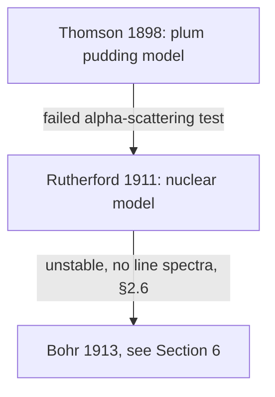

### §2.1 — Thomson's Model of Atom (1898) — "Plum Pudding"

- Atom = uniform sphere of positive charge (radius ≈ 10⁻¹⁰ m)
- Electrons embedded throughout, like plums in a pudding
- Mass uniformly distributed
- ✓ Explained overall electrical neutrality
- ✗ Failed: could not explain Rutherford's α-particle scattering results (§2.2)

### §2.2 — Rutherford's α-Particle Scattering Experiment (1911)

- Source: α-particles (He²⁺); target: ultra-thin gold foil (~100 nm ≈ 1000 atoms thick); detector: circular ZnS screen

| Observation | Inference |
|---|---|
| Most α-particles pass straight through | Atom is mostly empty space |
| Small fraction deflect at small angles | Positive charge concentrated somewhere small |
| ~1 in 20,000 bounce back (~180°) | Extremely small, dense, positive nucleus |

- Scale: if nucleus = a cricket ball, atom radius ≈ 5 km — nucleus is 10⁵× smaller in radius, 10¹⁵× smaller in volume

### §2.3 — Rutherford's Nuclear Model of Atom

- Tiny, dense, positively charged nucleus at the centre
- Electrons revolve around it in circular orbits at high speed ("solar system" picture)
- Nucleus + electrons held by electrostatic attraction

### §2.4 — Atomic Number (Z) and Mass Number (A)

- **Z** = number of protons = number of electrons (neutral atom)
- **A** = Z + number of neutrons
- Number of neutrons = **A − Z** (always true, ion or not)
- Notation: ᴬ_Z X (A = superscript left, Z = subscript left)
- Ions: cation electrons = Z − charge; anion electrons = Z + charge
- Worked: ⁸⁰₃₅Br → protons = electrons = 35; neutrons = 80 − 35 = 45

### §2.5 — Isobars and Isotopes

| Term | Definition | Example |
|---|---|---|
| Isotopes | Same Z, different A | ¹H, ²H, ³H |
| Isobars | Different Z, same A | ¹⁴₆C and ¹⁴₇N |

- Hydrogen isotopes: ¹H protium (0n, 99.985%) · ²H deuterium (1n, 0.015%) · ³H tritium (2n, trace)
- Carbon isotopes: ¹²C (6n) · ¹³C (7n) · ¹⁴C (8n)
- Chlorine isotopes: ³⁵Cl (18n) · ³⁷Cl (20n)
- Isotopes share chemical properties (same electron count/configuration); differ in physical properties (mass)

### §2.6 — Drawbacks of Rutherford's Model ⭐

- **Drawback 1 (instability):** Maxwell's theory says an accelerating charge radiates energy — a circling electron is always accelerating (changing direction), so it should radiate continuously, lose energy, and spiral into the nucleus in ~10⁻⁸ s. Real atoms are stable — direct contradiction.
- **Drawback 2 (no spectra explanation):** the same spiral-in picture predicts a continuous spectrum; real atoms emit line spectra (discrete frequencies) instead
- **Drawback 3 (no electron distribution info):** model is silent on how electrons are arranged, their energies, or their behaviour
- Trap: resembles the solar system but cannot explain atomic stability — the most commonly tested limitation

---

## SECTION 3 — ELECTROMAGNETIC RADIATION

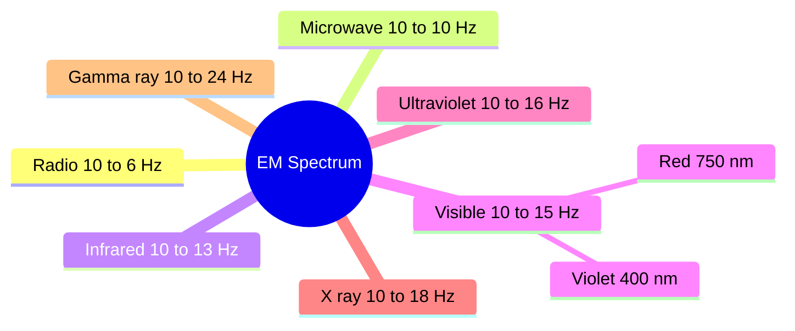

### §3.1 — Wave Nature of EM Radiation

- Maxwell (1870): an accelerating charged particle produces alternating E and B fields, transmitted as EM waves
- E and B fields are perpendicular to each other and to the direction of propagation
- No medium required — travels through vacuum
- Speed in vacuum: **c = 3.0 × 10⁸ m s⁻¹**
- **c = νλ**; wavenumber **ν̄ = 1/λ** (unit m⁻¹, commonly cm⁻¹)

### §3.2 — The Electromagnetic Spectrum

- Increasing frequency/energy order: Radio → Microwave → Infrared → Visible → UV → X-ray → γ-ray
- Visible region: ~4.0 × 10¹⁴ Hz (red) to 7.5 × 10¹⁴ Hz (violet); wavelength 400 nm (violet) to 750 nm (red)

| Region | Frequency | Use |
|---|---|---|
| Radio (AM) | ~10⁶ Hz | Broadcasting |
| Microwave | ~10¹⁰ Hz | Radar, cooking |
| Infrared | ~10¹³ Hz | Heating, spectroscopy |
| Visible | ~10¹⁵ Hz | Vision |
| Ultraviolet | ~10¹⁶ Hz | Sun's radiation |
| X-rays | ~10¹⁸ Hz | Medical imaging |
| γ-rays | ~10²⁴ Hz | Nuclear processes |

- Memory: ROYGBIV = increasing frequency/energy within the visible range

---

## SECTION 4 — PLANCK'S QUANTUM THEORY & PHOTOELECTRIC EFFECT

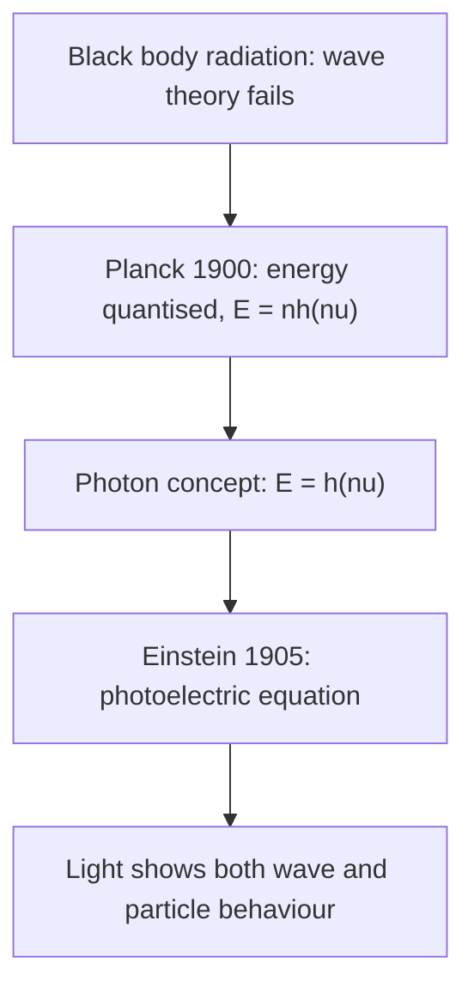

### §4.1 — Black Body Radiation & Planck's Quantum Theory

- Black body: absorbs and emits radiation of all frequencies uniformly
- At fixed T: intensity rises with λ, peaks, then falls
- As T increases: peak shifts to *shorter* wavelength (higher energy) — iron rod: dull red → bright red → white → blue
- Classical wave theory failed to explain this; Planck (1900) succeeded by quantising energy
- Quantum = smallest discrete packet of energy emitted/absorbed
- **E = nhν**, n = 0, 1, 2, 3… (energy levels like stairs, not a ramp)
- **h = Planck's constant = 6.626 × 10⁻³⁴ J·s**

### §4.2 — The Photoelectric Effect ⭐

- Observed by Hertz (1887); explained by Einstein (1905) using Planck's quantum idea

| Observation | Wave theory predicts | Quantum explanation |
|---|---|---|
| Electrons ejected instantly | Should take time | Photon transfers energy in one instant collision |
| Number of e⁻ ejected ∝ intensity | Same | More photons → more electrons |
| KE of e⁻ ∝ frequency, not intensity | KE should depend on brightness | Each photon carries hν; excess over W₀ becomes KE |
| Below threshold ν₀ → no emission | Should emit given enough intensity | Photon must individually carry ≥ hν₀ |

- Einstein's equation: **hν = hν₀ + ½mₑv²**; hν₀ = W₀ = work function (minimum energy to eject an electron)

| Metal | W₀ (eV) |
|---|---|
| Li | 2.42 |
| Na | 2.30 |
| K | 2.25 |
| Mg | 3.70 |
| Cu | 4.80 |
| Ag | 4.30 |

- Trap: intensity ↑ → more electrons ejected, NOT higher KE; only frequency ↑ raises KE; ν < ν₀ → no emission ever, at any intensity

### §4.3 — Dual Nature of Electromagnetic Radiation

| Phenomenon | Explained by |
|---|---|
| Diffraction, interference | Wave nature |
| Photoelectric effect, black body radiation | Particle nature (photons) |

- Photon: carries energy E = hν and momentum p = h/λ
- Conclusion: light shows wave-particle duality — which nature is observed depends on the experiment

---

## SECTION 5 — ATOMIC SPECTRA

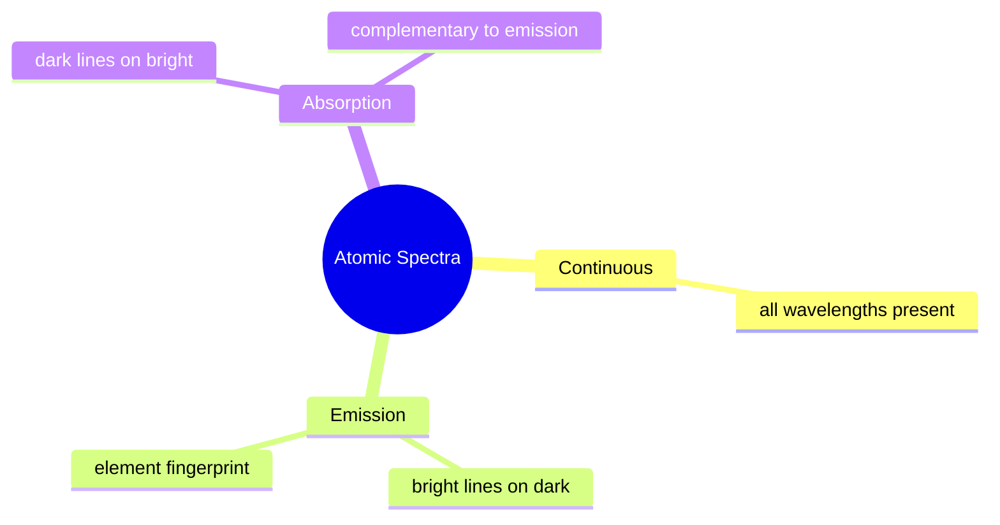

### §5.1 — Types of Spectra

- **Continuous:** white light through a prism → unbroken band of colours (ROYGBIV), all wavelengths present
- **Emission (line):** energy supplied (heat/discharge) excites atoms → discrete bright lines on a dark background; each element's pattern is a unique fingerprint
- **Absorption:** white light through unexcited gas → specific wavelengths absorbed → dark lines on a continuous bright background, complementary to emission
- Application: spectroscopy identified Rb, Cs, Tl, In, Ga, Sc; helium was discovered in the sun by spectroscopy

### §5.2 — Line Spectrum of Hydrogen

- Electric discharge through H₂ → dissociation → excited H atoms emit radiation at discrete frequencies
- Balmer (1885), empirical, visible lines only: ν̄ = 109,677(1/2² − 1/n²) cm⁻¹, n = 3, 4, 5…
- Rydberg, general formula for all series: **ν̄ = 109,677(1/n₁² − 1/n₂²) cm⁻¹**, n₁ = 1,2,3…, n₂ = n₁+1, n₁+2…
- **R_H = 109,677 cm⁻¹ = 1.09677 × 10⁷ m⁻¹**

### §5.3 — Spectral Series of Hydrogen

| Series | n₁ | n₂ | Region |
|---|---|---|---|
| Lyman | 1 | 2, 3, 4… | Ultraviolet |
| Balmer | 2 | 3, 4, 5… | Visible |
| Paschen | 3 | 4, 5, 6… | Infrared |
| Brackett | 4 | 5, 6, 7… | Infrared |
| Pfund | 5 | 6, 7, 8… | Infrared |

- Memory: "Lazy Boys Play Basketball Far" → Lyman, Balmer, Paschen, Brackett, Pfund
- Balmer is the ONLY series in the visible region
- Level spacing shrinks as n increases (Eₙ ∝ −1/n²) — every downward transition is one spectral line

### §5.4 — Counting the Number of Spectral Lines ⭐

- A cascade through every intermediate level, not a single jump, produces one line per pair of levels passed through
- **Max spectral lines = Δn(Δn + 1)/2**, Δn = n₂ − n₁
- Special case, cascade to ground state (n₁ = 1): reduces to **n(n − 1)/2**
- Worked: n = 6 → ground state: Δn = 5 → (5×6)/2 = **15 lines**
- Worked: n = 5 → n = 2: Δn = 3 → (3×4)/2 = **6 lines**
- Trap: this counts the *entire cascade* — a single named transition ("n=5 to n=2") is only ONE line, found via the Rydberg equation directly, not this formula

---

## SECTION 6 — BOHR'S MODEL FOR HYDROGEN ATOM

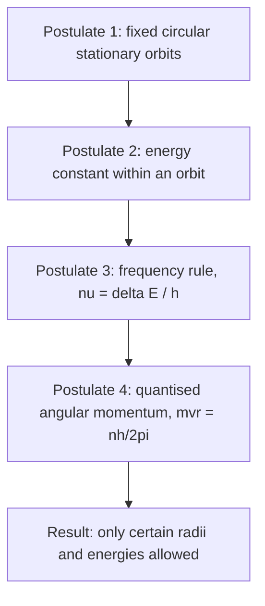

### §6.1 — Bohr's Four Postulates (1913) ⭐

- **P1 (stationary orbits):** electron moves in circular orbits of fixed radius and energy, concentric around the nucleus
- **P2 (energy constancy):** energy doesn't change with time in an orbit; absorbed only on jumping to a higher orbit, emitted only on falling to a lower one — never continuous
- **P3 (frequency rule):** ν = ΔE/h = (E₂ − E₁)/h
- **P4 (quantised angular momentum):** mₑvr = nh/2π, n = 1, 2, 3…
- Context: fixes Rutherford's instability problem (§2.6) by borrowing Planck's quantisation (§4.1)

### §6.2 — Key Equations from Bohr's Model

- Radius: **rₙ = n²a₀** (a₀ = 52.9 pm = 0.529 Å); r₁ = 52.9 pm, r₂ = 211.6 pm, r₃ = 476.1 pm
- Energy: **Eₙ = −R_H/n²** J (R_H = 2.18 × 10⁻¹⁸ J)

| n | Energy (J) | State |
|---|---|---|
| 1 | −2.18 × 10⁻¹⁸ | Ground state |
| 2 | −0.545 × 10⁻¹⁸ | First excited |
| 3 | −0.242 × 10⁻¹⁸ | Second excited |
| ∞ | 0 | Ionised |

- Why negative: energy measured relative to a free electron (0 at infinity); bound → negative; more negative = more stable = lower n
- H-like species (He⁺, Li²⁺, Be³⁺…): **Eₙ = −2.18×10⁻¹⁸(Z²/n²) J**; **rₙ = 52.9n²/Z pm**
- Transition energy: **ΔE = R_H(1/nᵢ² − 1/n_f²)**; n_f > nᵢ → absorbed (energy positive); n_f < nᵢ → emitted
- Trap: formula gives magnitude only — always check direction (absorption = going up, emission = coming down) physically

### §6.3 — Limitations of Bohr's Model ⭐

- Fails for multi-electron atoms (ignores electron–electron repulsion)
- Cannot explain fine structure (doublet/triplet lines under high resolution)
- Cannot explain the Zeeman effect (magnetic-field line splitting)
- Cannot explain the Stark effect (electric-field line splitting)
- Cannot explain chemical bonding
- Ignores the wave nature of the electron
- Contradicts the Heisenberg Uncertainty Principle (assumes simultaneous exact position and velocity)

---

## SECTION 7 — TOWARDS QUANTUM MECHANICAL MODEL

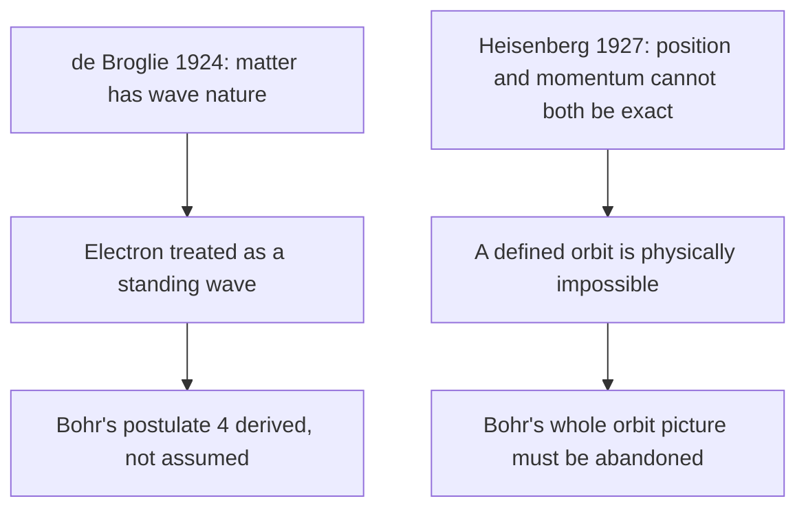

### §7.1 — de Broglie's Hypothesis — Dual Behaviour of Matter (1924) ⭐

- Logic: light (wave) has particle properties (photon) — does matter (particle) have wave properties?
- **λ = h/mv = h/p**

| Object | Mass | Speed | λ |
|---|---|---|---|
| Ball (0.1 kg) | 0.1 kg | 10 m/s | 6.626 × 10⁻³⁴ m — unmeasurable |
| Electron | 9.1 × 10⁻³¹ kg | ~10⁶ m/s | ~10⁻¹⁰ m — measurable, X-ray scale |

- Significant only for microscopic particles; confirmed via electron diffraction; basis of the electron microscope (~15 million× magnification)
- **Derivation of Bohr's postulate 4:** model the orbit as a standing wave — the circumference must hold a whole number of wavelengths, 2πr = nλ. Substituting λ = h/mv gives **mvr = nh/2π** — exactly Bohr's fourth postulate, now derived rather than assumed. Frequently asked as a 2–3 mark question.

### §7.2 — Heisenberg's Uncertainty Principle (1927)

- Cannot simultaneously know the exact position AND exact momentum/velocity of a microscopic particle
- **Δx·Δpₓ ≥ h/4π**; equivalently **Δx·Δvₓ ≥ h/4πm**
- Milligram object: Δv·Δx ≈ 10⁻²⁸ m²s⁻¹ — negligible
- Electron: Δv·Δx ≈ 10⁻⁴ m²s⁻¹ — enormous, very real constraint
- Why Bohr fails: a defined orbit needs both exact position and exact velocity at every instant — physically impossible per this principle
- Not an instrument limitation — a fundamental property of nature at the quantum scale

---

## SECTION 8 — QUANTUM MECHANICAL MODEL OF ATOM

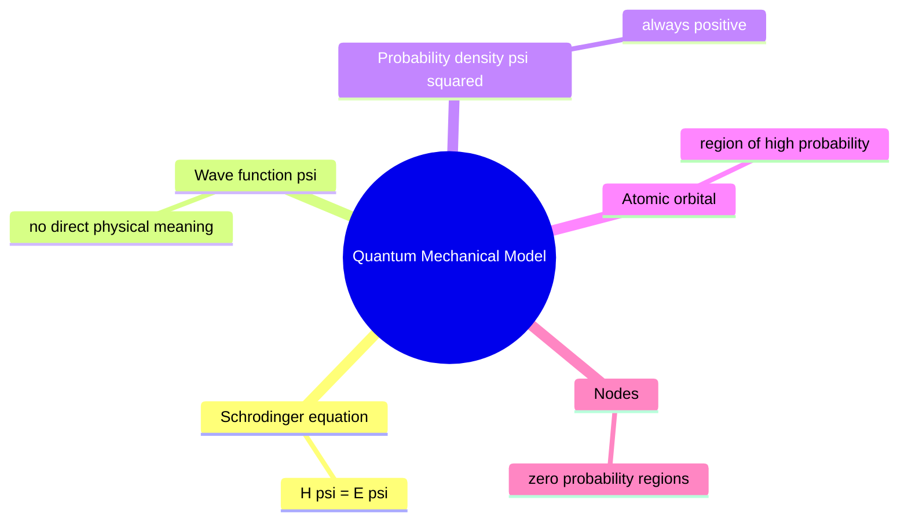

### §8.1 — Schrödinger Wave Equation (1926)

- Developed independently by Heisenberg and Schrödinger
- **ĤΨ = EΨ**: Ĥ = Hamiltonian operator (KE + PE), Ψ = wave function, E = total energy
- Ψ itself has no direct physical meaning — purely mathematical
- This equation is the mathematical resolution of both Bohr's failure (§6.3) and the wave-particle synthesis (§7)

### §8.2 — Wave Function (Ψ) and Probability Density (Ψ²)

- Born's interpretation: **|Ψ|² at a point = probability density of finding the electron there** (always positive)
- |Ψ|² × small volume element = probability of finding the electron in that volume
- Atomic orbital = the Ψ for one electron; region of ~90% probability

### §8.3 — Important Features of Quantum Mechanical Model

- Energy is quantised — electrons take only specific values
- Quantised levels are a direct result of the electron's wave-like properties
- Exact position and velocity cannot both be known (Heisenberg) → no definite path exists
- Atomic orbital = Ψ for an electron; all information about it is stored in Ψ
- |Ψ|² = probability density → predicts where the electron is most likely found
- An orbital can hold a maximum of two electrons

### §8.4 — Nodes — Regions of Zero Probability

- Node: region where |Ψ|² = 0 → zero probability
- **Radial nodes** (spherical surfaces, ψ = 0) = **n − l − 1**
- **Angular nodes** (planes through the nucleus, ψ = 0) = **l**
- **Total nodes = n − 1**

| Orbital | n | l | Radial | Angular | Total |
|---|---|---|---|---|---|
| 1s | 1 | 0 | 0 | 0 | 0 |
| 2s | 2 | 0 | 1 | 0 | 1 |
| 2p | 2 | 1 | 0 | 1 | 1 |
| 3s | 3 | 0 | 2 | 0 | 2 |
| 3p | 3 | 1 | 1 | 1 | 2 |
| 3d | 3 | 2 | 0 | 2 | 2 |

- For ns orbitals specifically: radial nodes = n − 1 (since l = 0)

---

## SECTION 9 — QUANTUM NUMBERS

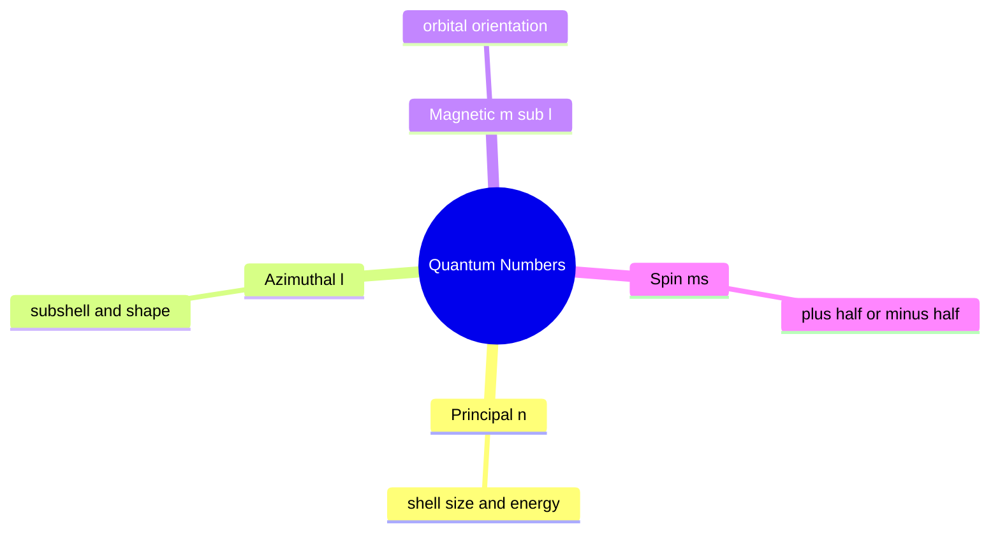

### §9.1 — Principal Quantum Number (n)

- n = 1, 2, 3, 4… (positive integer); identifies the shell; determines size and energy
- For H: Eₙ ∝ −1/n²; larger n → larger orbital, farther from nucleus, higher energy

| n | Shell | Max e⁻ (2n²) | Orbitals (n²) |
|---|---|---|---|
| 1 | K | 2 | 1 |
| 2 | L | 8 | 4 |
| 3 | M | 18 | 9 |
| 4 | N | 32 | 16 |

### §9.2 — Azimuthal Quantum Number (l)

- Also called orbital angular momentum / subsidiary quantum number; defines orbital shape
- For given n: l = 0, 1, 2 … (n − 1)

| l | Subshell | Shape | Max e⁻ |
|---|---|---|---|
| 0 | s | Spherical | 2 |
| 1 | p | Dumbbell | 6 |
| 2 | d | Cloverleaf | 10 |
| 3 | f | Complex | 14 |

- Notation = n + subshell letter, e.g. n=2,l=0 → 2s; n=3,l=2 → 3d; n=4,l=3 → 4f

### §9.3 — Magnetic Orbital Quantum Number (mₗ)

- Gives spatial orientation of the orbital
- For given l: mₗ = −l … 0 … +l → **(2l+1)** values

| l | Subshell | mₗ values | Orbitals |
|---|---|---|---|
| 0 | s | 0 | 1 |
| 1 | p | −1, 0, +1 | 3 |
| 2 | d | −2,−1,0,+1,+2 | 5 |
| 3 | f | −3…+3 | 7 |

- Total orbitals in a subshell = (2l+1); total orbitals in a shell = n²

### §9.4 — Spin Quantum Number (ms)

- Proposed by Uhlenbeck and Goudsmit (1925); describes intrinsic electron spin
- Only two values: **ms = +½** (↑) or **−½** (↓)
- Two electrons with opposite spin in the same orbital = spin-paired

### §9.5 — Master Quantum Number Summary ⭐

| QN | Symbol | Determines | Values |
|---|---|---|---|
| Principal | n | Shell, size, energy | 1, 2, 3… |
| Azimuthal | l | Subshell, shape | 0 to n−1 |
| Magnetic | mₗ | Orientation | −l to +l |
| Spin | ms | Spin direction | +½ or −½ |

- Impossible sets (Board/NEET trap): n=0 ✗ · n=1,l=1 ✗ (max l=0) · n=3,l=3 ✗ (max l=2) · l=2,mₗ=3 ✗ (range −2 to +2) · ms=+1 ✗ (only ±½ allowed)

---

## SECTION 10 — SHAPES OF ATOMIC ORBITALS

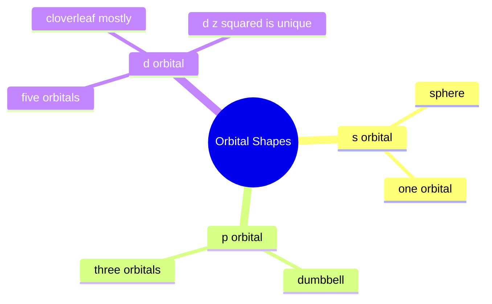

### §10.1 — s Orbitals (l = 0)

- Spherically symmetric; one orbital per subshell (mₗ = 0 only)
- Size increases with n: 4s > 3s > 2s > 1s
- 1s: max density at nucleus, decreases monotonically, 0 radial nodes
- 2s: 1 radial node then a small secondary hump
- 2p (for contrast): zero density AT the nucleus (that's an angular node), single hump, 0 radial nodes

### §10.2 — p Orbitals (l = 1)

- Dumbbell shape — two lobes on either side of a nodal plane through the nucleus
- Three orbitals (mₗ = −1,0,+1): 2pₓ, 2p_y, 2p_z — equal size/shape/energy, differ only in orientation
- One angular node (the nodal plane itself); size increases 4p > 3p > 2p

### §10.3 — d Orbitals (l = 2)

- Five orbitals (mₗ = −2…+2): d_xy, d_yz, d_xz, d_x²−y², d_z²
- Minimum n = 3 (since l ≤ n−1, and l=2 needs n≥3)
- d_xy, d_yz, d_xz, d_x²−y²: cloverleaf, 4 lobes each
- d_z²: unique — two lobes along z-axis plus a torus (donut) in the xy-plane
- All five 3d orbitals degenerate (same energy) in an isolated atom; 2 angular nodes each

| d Orbital | Lobes | Nodal planes |
|---|---|---|
| d_xy | Between x,y axes | xz, yz |
| d_xz | Between x,z axes | xy, yz |
| d_yz | Between y,z axes | xy, xz |
| d_x²−y² | Along x,y axes | — |
| d_z² | Along z-axis + torus | — |

---

## SECTION 11 — ENERGIES OF ORBITALS

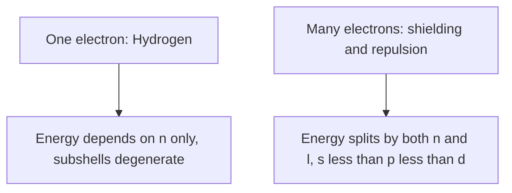

### §11.1 — Hydrogen Atom — Energy Depends on n Only

- All subshells of the same n are degenerate: 1s < 2s = 2p < 3s = 3p = 3d < 4s = 4p = 4d = 4f < …

### §11.2 — Multi-electron Atoms — Energy Depends on Both n and l

- Electron–electron repulsion and shielding split subshells of the same n
- Shielding effectiveness (same n): s > p > d — s electrons spend more time near the nucleus, so shield better
- **(n+l) rule:** lower (n+l) → lower energy; tie in (n+l) → lower n wins

| Orbital | n+l | Note |
|---|---|---|
| 2p | 3 | — |
| 3s | 3 | Same (n+l) as 2p, but n=3>2 → 3s > 2p |
| 3d | 5 | Same (n+l) as 4p, but n=3<4 → **3d < 4p** |
| 4p | 5 | — |

- Critical result: **4s < 3d** and **5s < 4d** — a lower-n orbital fills first even with higher (n+l) tie-breaking; this is why 4s fills before 3d in K and Ca

---

## SECTION 12 — FILLING OF ORBITALS IN ATOMS

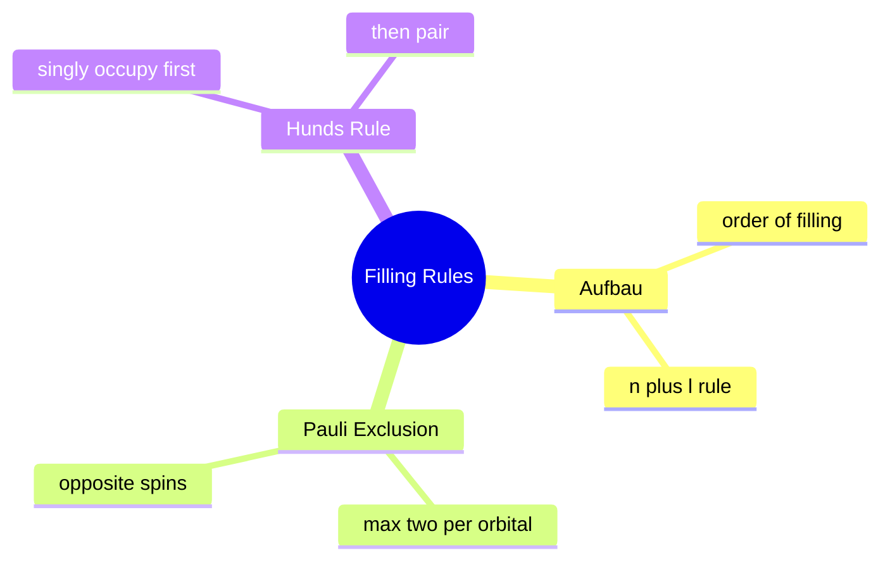

### §12.1 — Aufbau Principle

- German: "building up" — fill orbitals in order of increasing energy, lowest first
- Order: 1s 2s 2p 3s 3p 4s 3d 4p 5s 4d 5p 6s 4f 5d 6p 7s 5f 6d 7p
- Governed by the (n+l) rule (§11.2): lower (n+l) fills first; ties broken by lower n

### §12.2 — Pauli Exclusion Principle

- No two electrons share the same set of all four quantum numbers
- Equivalently: max 2 electrons per orbital, with opposite spins
- **Max e⁻ per subshell = 2(2l+1)**; **max e⁻ per shell n = 2n²**

| Subshell | Orbitals | Max e⁻ |
|---|---|---|
| s | 1 | 2 |
| p | 3 | 6 |
| d | 5 | 10 |
| f | 7 | 14 |

### §12.3 — Hund's Rule of Maximum Multiplicity

- Degenerate orbitals are singly occupied, with parallel spins, before any pairing occurs
- Pairing begins only once every orbital in the subshell has one electron
- Basis: parallel spins allow maximum exchange energy → lower energy → greater stability
- Example — Carbon (2p²): ↑ ↑ □ (two separate orbitals), NOT ↑↓ □ □

---

## SECTION 13 — ELECTRONIC CONFIGURATIONS

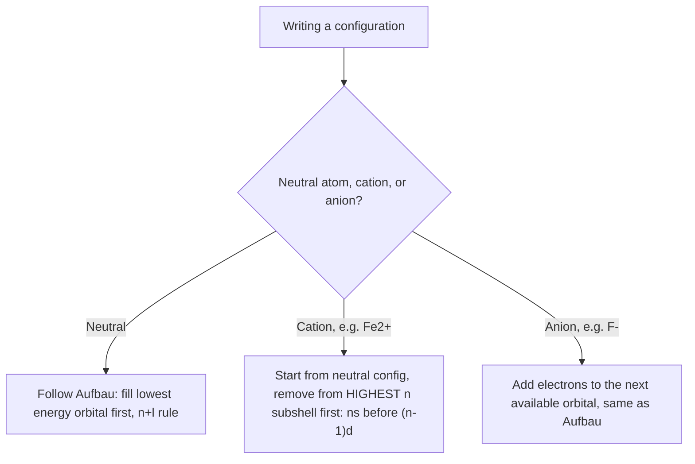

### §13.1 — Notation System

- Subshell notation: (n)(letter)^(count) — e.g. Carbon: 1s²2s²2p²
- Core notation: noble-gas symbol for filled inner shells — e.g. Na: [Ne]3s¹

### §13.2 — Electronic Configurations of Elements (Z = 1–30) ⭐

| Z | Element | Config | Z | Element | Config |
|---|---|---|---|---|---|
| 1 | H | 1s¹ | 16 | S | [Ne]3s²3p⁴ |
| 2 | He | 1s² | 17 | Cl | [Ne]3s²3p⁵ |
| 3 | Li | [He]2s¹ | 18 | Ar | [Ne]3s²3p⁶ |
| 4 | Be | [He]2s² | 19 | K | [Ar]4s¹ |
| 5 | B | [He]2s²2p¹ | 20 | Ca | [Ar]4s² |
| 6 | C | [He]2s²2p² | 21 | Sc | [Ar]3d¹4s² |
| 7 | N | [He]2s²2p³ | 22 | Ti | [Ar]3d²4s² |
| 8 | O | [He]2s²2p⁴ | 23 | V | [Ar]3d³4s² |
| 9 | F | [He]2s²2p⁵ | **24** | **Cr** ⭐ | **[Ar]3d⁵4s¹** |
| 10 | Ne | [He]2s²2p⁶ | 25 | Mn | [Ar]3d⁵4s² |
| 11 | Na | [Ne]3s¹ | 26 | Fe | [Ar]3d⁶4s² |
| 12 | Mg | [Ne]3s² | 27 | Co | [Ar]3d⁷4s² |
| 13 | Al | [Ne]3s²3p¹ | 28 | Ni | [Ar]3d⁸4s² |
| 14 | Si | [Ne]3s²3p² | **29** | **Cu** ⭐ | **[Ar]3d¹⁰4s¹** |
| 15 | P | [Ne]3s²3p³ | 30 | Zn | [Ar]3d¹⁰4s² |

- Cr (Z=24): expected [Ar]3d⁴4s² → actual **[Ar]3d⁵4s¹**
- Cu (Z=29): expected [Ar]3d⁹4s² → actual **[Ar]3d¹⁰4s¹**
- Reason: half-filled (d⁵) / fully-filled (d¹⁰) subshells are extra stable (§14.1) — one electron shifts from 4s to 3d

### §13.3 — Electronic Configurations of Ions ⭐

- Rule: electrons are removed from the **highest n subshell first** — for a transition-metal cation, ns empties before (n−1)d, even though ns filled first going in
- Worked: Fe (Z=26) = [Ar]3d⁶4s² → remove 2 from 4s → **Fe²⁺ = [Ar]3d⁶**
- Worked: Cu (Z=29) = [Ar]3d¹⁰4s¹ → remove the single 4s electron → **Cu⁺ = [Ar]3d¹⁰**
- Worked: Cu²⁺ → 4s already empty after removing 1 electron, so the 2nd comes from 3d → **Cu²⁺ = [Ar]3d⁹**
- Trap: filling order ≠ emptying order — "3d was added last, remove it last" is backwards; highest n *always* leaves first

---

## SECTION 14 — STABILITY OF COMPLETELY FILLED AND HALF-FILLED SUBSHELLS

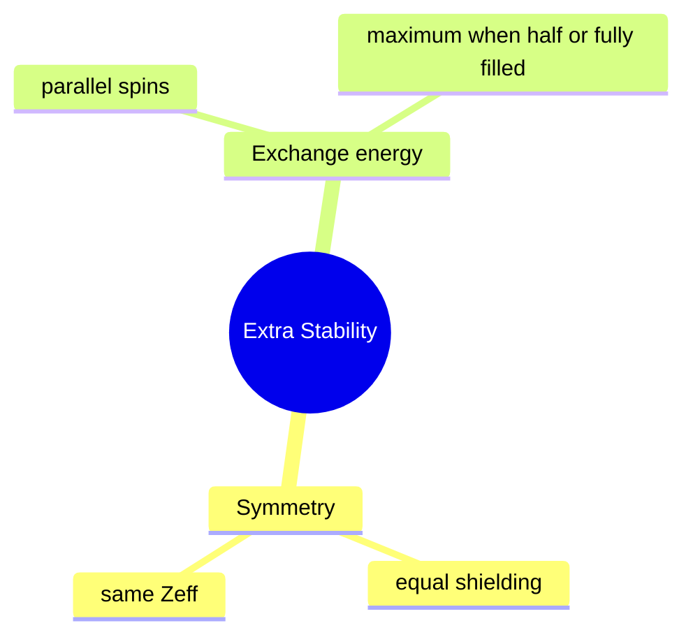

### §14.1 — Extra Stable Configurations

- Extra-stable configurations: p³, p⁶, d⁵, d¹⁰, f⁷, f¹⁴
- **Reason 1 — symmetry:** half-/fully-filled subshells have symmetrical electron distribution → each orbital equally shielded → same Zeff → more stable
- **Reason 2 — exchange energy:** same-spin electrons in degenerate orbitals can exchange positions, releasing exchange energy; this is maximum when the subshell is half- or fully-filled
- For 5 electrons, all parallel spin (d⁵): the maximum possible number of pairwise exchanges is C(5,2) = 4+3+2+1 = **10** — exactly why d⁵ is extra stable

### §14.2 — Core vs Valence Electrons

- **Core electrons:** in completely filled inner shells (e.g. the [Ne] core within Na)
- **Valence electrons:** in the outermost shell (highest n); determine chemical properties
- Na = [Ne]3s¹ → 1 valence electron, 10 core electrons

---

## CONCEPTUAL DISTINCTIONS — HIGH-YIELD COMPARISONS

| Orbit (Bohr) | Orbital (Quantum Mechanics) |
|---|---|
| Circular, well-defined path | 3D region of space (wave function) |
| Exact position known | Only probability known |
| Contradicts Heisenberg | Consistent with Heisenberg |
| 2D concept, defined by n only | 3D concept, defined by n, l, mₗ |
| Disproved | Currently accepted |

| Emission Spectrum | Absorption Spectrum |
|---|---|
| Atom loses energy → photon emitted | Atom gains energy → photon absorbed |
| Bright lines on dark background | Dark lines on bright background |
| Excited state → ground state | Ground state → excited state |

- Trap: subshells in shell n = n, but orbitals in shell n = n² — don't answer "3" for the orbital count when n=3 asks for orbitals; it's 9 *(§9.1)*
- Trap: radial nodes = n−l−1, angular nodes = l; the two formulas can be swapped by mistake and the total (n−1) will still look plausible *(§8.4)*
- Trap: larger threshold frequency ν₀ (bigger work function) means *smaller* threshold wavelength λ₀ = c/ν₀ — easy to flip mid-calculation *(§4.2)*
- Trap: frequency controls whether electrons are ejected at all, and their KE; intensity only controls how many come out — intensity never belongs in a KE calculation *(§4.2)*
- Trap: orbital degeneracy (2s = 2p) is a hydrogen-only privilege *(§11.1)* — the moment there's more than one electron, shielding splits them and 2s < 2p *(§11.2)*
- Trap: filling order ≠ emptying order — 4s fills before 3d going in, but 4s empties before 3d coming out *(§13.3)*
- Trap: isotopes share Z, isobars share A, isotones share (A−Z) — all three are tested as "identify the pair" questions *(§2.5)*
- Trap: mass number (A) is a whole number for one nuclide; atomic mass on the periodic table is the isotope-weighted *average* — why chlorine's atomic mass (35.45) isn't an integer *(§2.4, §2.5)*

---

## PROBLEM-SOLVING STRATEGY

- **p/n/e⁻ from ᴬZX or an ion** *(§2.4)*: protons = Z; electrons = Z ∓ ion charge; neutrons = A − Z always
- **Photon energy ↔ wavelength ↔ frequency** *(§3.1, §4.1)*: pick the equation linking given → wanted (E=hν, c=νλ); convert units (nm→m, eV→J) before substituting
- **Rydberg equation, forward and backward** *(§5.2)*: forward — given nᵢ,n_f find ΔE/λ/ν̄; backward — given λ, solve for n (should come out a clean integer)
- **"Maximum spectral lines" vs a single named transition** *(§5.4)*: cascade (Δn(Δn+1)/2) if it says "drops from an excited state"; one line via Rydberg if it names a direct transition
- **Bohr radius/energy for H-like species** *(§6.2)*: check for Z ≠ 1 — forgetting to square Z in energy, or scale by 1/Z in radius, is the most common slip
- **de Broglie wavelength** *(§7.1)*: λ = h/mv — settle momentum first; is v given, or does it need K.E. = ½mv² first?
- **Heisenberg uncertainty** *(§7.2)*: Δx·Δp ≥ h/4π — decide upfront whether solving for Δx, Δv, or Δp
- **Validating a quantum-number set** *(§9.5)*: check all three constraints (l < n; mₗ in range; ms = ±½ only), not just one
- **Counting nodes for a given (n,l)** *(§8.4)*: compute radial, angular, AND total as a self-check that they add up
- **Writing an electronic configuration** *(§12, §13)*: neutral → Aufbau + (n+l) rule, check Cr/Cu exceptions; ion → start from neutral, then add/remove using ns-before-(n−1)d for cations

---

## RAPID REFERENCE

| Fact | Value |
|---|---|
| Speed of light (c) | 3.0 × 10⁸ m s⁻¹ |
| Planck's constant (h) | 6.626 × 10⁻³⁴ J·s |
| Charge on electron (e) | 1.602 × 10⁻¹⁹ C |
| Mass of electron (mₑ) | 9.109 × 10⁻³¹ kg |
| Mass of proton (mₚ) | 1.673 × 10⁻²⁷ kg |
| Mass of neutron (mₙ) | 1.675 × 10⁻²⁷ kg |
| e/mₑ ratio | 1.758820 × 10¹¹ C kg⁻¹ |
| Bohr radius (a₀) | 52.9 pm |
| Rydberg constant, energy (R_H) | 2.18 × 10⁻¹⁸ J |
| Rydberg constant, wavenumber (R_H) | 1.09677 × 10⁷ m⁻¹ = 109,677 cm⁻¹ |
| Wave-speed relation | c = νλ |
| Photon energy | E = hν = hc/λ |
| Wavenumber | ν̄ = 1/λ |
| Photoelectric equation | hν = hν₀ + ½mₑv² |
| Work function | W₀ = hν₀ |
| Rydberg equation | ν̄ = R_H(1/n₁² − 1/n₂²) |
| Bohr radius, nth orbit (H) | rₙ = n²a₀ |
| Bohr radius (H-like) | rₙ = 52.9(n²/Z) pm |
| Bohr energy (H) | Eₙ = −R_H/n² |
| Bohr energy (H-like) | Eₙ = −2.18×10⁻¹⁸(Z²/n²) J |
| Transition energy | ΔE = R_H(1/nᵢ² − 1/n_f²) |
| Max spectral lines (cascade) | Δn(Δn+1)/2 |
| Max spectral lines (to ground state) | n(n−1)/2 |
| de Broglie wavelength | λ = h/mv = h/p |
| Heisenberg uncertainty | Δx·Δp ≥ h/4π |
| Angular momentum (Bohr) | mₑvr = nh/2π |
| Radial nodes | n − l − 1 |
| Angular nodes | l |
| Total nodes | n − 1 |
| Max e⁻ per orbital | 2 |
| Max e⁻ per subshell | 2(2l+1) |
| Max e⁻ per shell | 2n² |
| Orbitals per shell | n² |
| Orbitals per subshell | 2l + 1 |
| Visible light range | 400 nm (violet) – 750 nm (red) |
| Work function: Li / Na / K / Mg / Cu / Ag | 2.42 / 2.30 / 2.25 / 3.70 / 4.80 / 4.30 eV |

---

*End of CNOTES — Ch. 2: Structure of Atom*