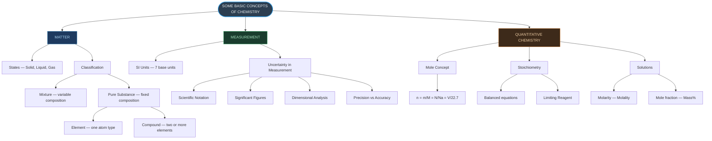
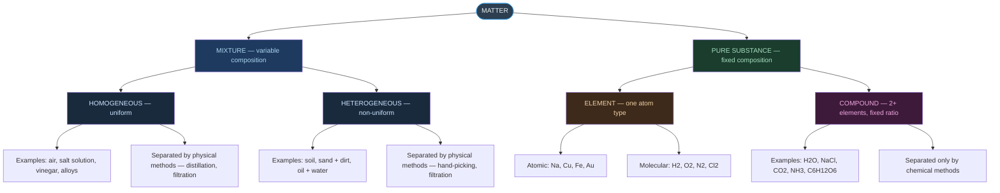
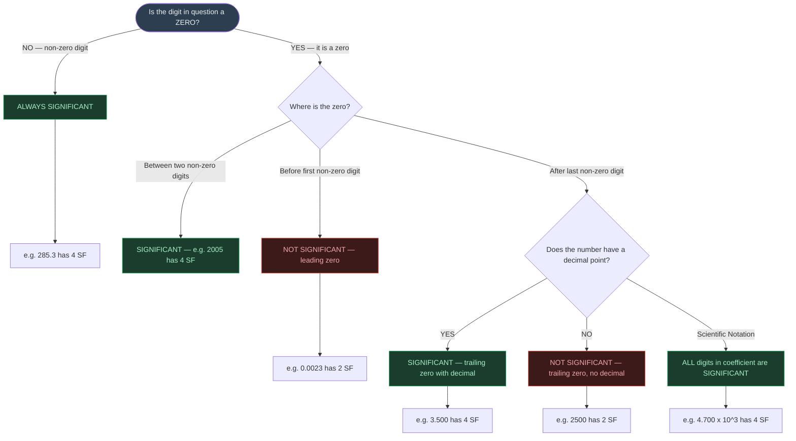
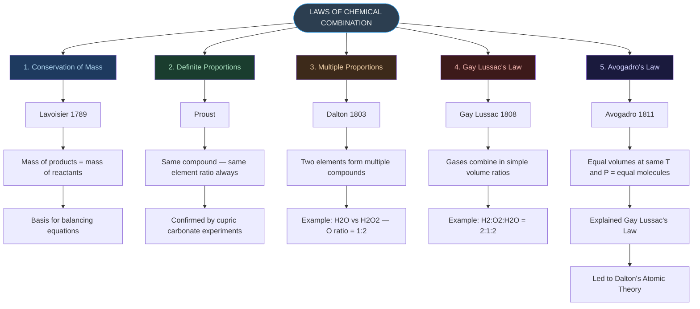
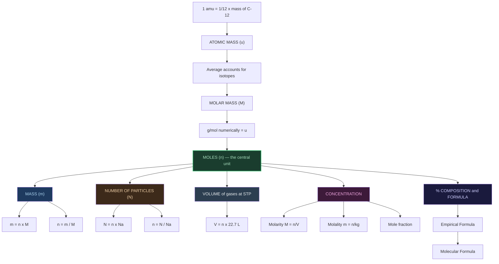
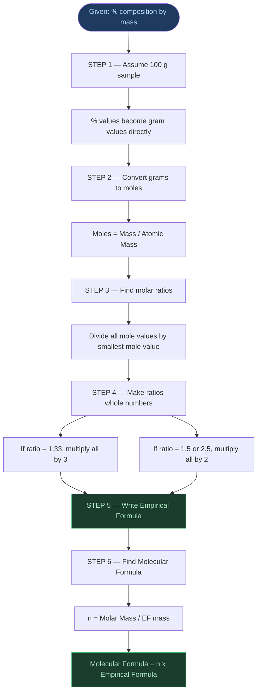
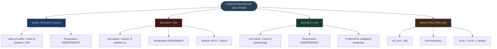

# Chemistry | Chapter 01 | Some Basic Concepts of Chemistry | CNOTES
> **Condensed Revision Notes** | Board · NEET · JEE — mirrors NOTES section numbers (§) for cross-reference

---

## 🗺️ Big Picture of Chapter 1

---

---

## §1 — Development of Chemistry

### §1.1 Historical Origins
- Sought for two purposes: **Philosopher's Stone** (base metal → gold), **Elixir of Life** (immortality)
- Developed as **Alchemy** and **Iatrochemistry** (1300–1600 CE)
- Modern chemistry took shape in **18th century Europe**

### §1.2 Ancient Indian Contributions ⭐ *(Frequently Tested — Board/NEET)*
> Acharya Kanda conceptualised atomic theory **~2500 years before Dalton**. Paramānu = eternal, indestructible, spherical, in motion.

| Source | Contribution |
|:---|:---|
| Acharya Kanda (600 BCE), *Vaiseshika Sutras* | First atomic theory; particles named **Paramānu** |
| Rasayan Shastra / Rasvidya | Indian term for chemistry — metallurgy, medicine, cosmetics, glass, dyes |
| Mohenjodaro & Harappa | Baked bricks, glazed pottery, gypsum cement, faience (early glass) |
| Harappans | Worked lead, silver, gold, copper; hardened copper with tin/arsenic |
| Rigveda (1000–400 BCE) | Leather tanning, cotton dyeing |
| Kautilya's Arthashastra | Salt production from sea |
| Charaka Samhita | Oldest Ayurvedic text; H₂SO₄, HNO₃, metal oxides; bhasma (nanoparticles) |
| Sushruta Samhita | Importance of alkalies |
| Rasopanishada | Gunpowder preparation |
| Nagarjuna, *Rasratnakar* | Mercury compounds; extraction of Au, Ag, Sn, Cu |
| Chakrapani | Mercury sulphide; credited with soap |
| Varāhmihir, *Brihat Samhita* (6th c. CE) | Perfumes, cosmetics, hair dyes, wall preparations |

### §1.3 Glass and Ink
- Glass: Maski (1000–900 BCE), Hastinapur & Taxila (1000–200 BCE); coloured with metal oxides
- Ink used since **4th century** (Taxila); paper known in India by the **17th century** (I-tsing's account)

---

## §2 — Importance of Chemistry

> Studies composition, structure, properties, and interactions of matter at the atomic/molecular level.

| Field | Chemistry's role |
|:---|:---|
| Food & Agriculture | Fertilisers, pesticides, insecticides |
| Healthcare | Cisplatin & Taxol (cancer), AZT (AIDS) |
| Industry | Acids, alkalis, dyes, polymers, metals, alloys |
| Advanced Materials | Superconducting ceramics, conducting polymers, optical fibres |
| Environment | CFC alternatives (ozone depletion); CH₄/CO₂ management |
| Biochemistry | Enzymes for large-scale chemical production |

---

## §3 — Nature of Matter

### §3.1 Definition
Matter = anything with **mass** and that **occupies space** (has volume).

### §3.2 States of Matter
| State | Shape | Volume | Compressibility |
|:---:|:---:|:---:|:---:|
| Solid | Fixed | Fixed | Negligible |
| Liquid | Takes container shape | Fixed | Very low |
| Gas | Takes container shape | Takes container volume | High |

### §3.3 Classification of Matter

---

## §4 — Properties of Matter and Their Measurement

### §4.1 Physical vs Chemical Properties
| Physical | Chemical |
|:---|:---|
| Observed without changing the substance | Requires a chemical change to observe |
| Colour, odour, m.p./b.p., density | Acidity, combustibility, reactivity with acids |

### §4.2 The SI System
Established **1960**, 11th CGPM, based on the Metre Convention (Paris, 1875). India: **NPL, New Delhi**.

| Quantity | Symbol | SI Unit | Unit Symbol |
|:---|:---:|:---:|:---:|
| Length | *l* | metre | m |
| Mass | *m* | kilogram | kg |
| Time | *t* | second | s |
| Electric current | *I* | ampere | A |
| Thermodynamic temperature | *T* | kelvin | K |
| Amount of substance | *n* | mole | mol |
| Luminous intensity | *Iᵥ* | candela | cd |

> [!warning] JEE Note — only 7 base units; everything else (speed, force, energy) is derived

| Multiple | Prefix | Symbol | | Multiple | Prefix | Symbol |
|:---:|:---:|:---:|---|:---:|:---:|:---:|
| $10^{-12}$ | pico | p | | $10^{3}$ | kilo | k |
| $10^{-9}$ | nano | n | | $10^{6}$ | mega | M |
| $10^{-6}$ | micro | μ | | $10^{9}$ | giga | G |
| $10^{-3}$ | milli | m | | $10^{12}$ | tera | T |
| $10^{-2}$ | centi | c | | $10^{-1}$ | deci | d |

### §4.3 Mass and Weight
| | Mass | Weight |
|:---|:---:|:---:|
| Definition | Amount of matter | Gravitational force on it |
| Constant everywhere? | ✅ Yes | ❌ No |
| SI Unit | kg | N |
| Instrument | Analytical balance | Spring balance |

Lab unit: gram (g), 1 kg = 1000 g.

### §4.4 Volume
- SI unit **m³**; lab units **cm³, dm³, mL, L**
- **1 L = 1000 mL = 1000 cm³ = 1 dm³**; **1 m³ = 10⁶ cm³ = 1000 L**
- Instruments: graduated cylinder, burette, pipette, volumetric flask

### §4.5 Density
$$\text{Density} = \frac{\text{Mass}}{\text{Volume}}$$
SI: kg m⁻³ | Lab: g cm⁻³ / g mL⁻¹ | Higher density = particles more closely packed

### §4.6 Temperature Scales
$$K = °C + 273.15 \qquad °F = \frac{9}{5}(°C) + 32$$

| Scale | Freezing pt. | Boiling pt. |
|:---|:---:|:---:|
| Celsius | 0 | 100 |
| Fahrenheit | 32 | 212 |
| Kelvin | 273.15 | 373.15 |

> [!warning] Negative values exist in °C, **never in K** (Kelvin ≥ 0; SI unit)

---

## §5 — Uncertainty in Measurement

### §5.1 Scientific Notation
$N \times 10^n$ where $1 \leq N < 10$. Used for very large/small numbers and to make sig-fig count unambiguous.

### §5.2 Significant Figures (Sig Figs)
> All digits known with certainty **+ one final estimated digit**.

| Type of digit | Significant? | Example | SF |
|:---|:---:|:---:|:---:|
| All non-zero digits | ✅ | 285 | 3 |
| Zeros between non-zero digits | ✅ | 2005 | 4 |
| Trailing zeros **with** decimal | ✅ | 1.200 | 4 |
| Leading zeros | ❌ | 0.0052 | 2 |
| Trailing zeros, **no** decimal | ❌ | 1200 | 2 |
| Scientific notation coefficient | ✅ all digits | $4.700\times10^3$ | 4 |

> [!tip] Add/Subtract → match **decimal places** of least precise value. Multiply/Divide → match **SF count** of least precise value.

**Rounding Off:**
| Digit to drop | Action |
|:---:|:---|
| > 5 | Raise preceding digit |
| < 5 | Leave unchanged |
| = 5, preceding even | Leave unchanged |
| = 5, preceding odd | Raise by 1 |

### §5.3 Precision vs Accuracy
| | Precision | Accuracy |
|:---|:---|:---|
| Asks | Do repeats agree with **each other**? | Does it agree with the **true value**? |
| Independent? | Neither guarantees the other — a systematic error can be precise yet inaccurate; a scattered set can average near the true value without being precise | |

### §5.4 Dimensional Analysis (Factor Label / Unit Factor Method)
Multiply by **unit factors** (ratios = 1) to cancel unwanted units.
- $3 \text{ in} \times \dfrac{2.54 \text{ cm}}{1 \text{ in}} = 7.62 \text{ cm}$
- $2 \text{ L} \times \dfrac{1000\text{ cm}^3}{1\text{ L}} \times \left(\dfrac{1\text{ m}}{100\text{ cm}}\right)^3 = 2\times10^{-3}\text{ m}^3$
- $2 \text{ days} \times 24 \times 60 \times 60 = 172{,}800 \text{ s}$

---

## §6 — Laws of Chemical Combination

| # | Law | Proposer | Statement |
|:---:|:---|:---|:---|
| 1 | Conservation of Mass | Lavoisier, 1789 | Mass of reactants = mass of products; matter never created/destroyed |
| 2 | Definite Proportions | Proust | A given compound always has the same element ratio by mass |
| 3 | Multiple Proportions | Dalton, 1803 | Two elements → multiple compounds → masses of one element (fixed mass of other) in small whole-number ratio |
| 4 | Gay Lussac's (Gaseous Volumes) | Gay Lussac, 1808 | Gases combine/form in simple volume ratios at same T, P |
| 5 | Avogadro's Law | Avogadro, 1811 | Equal volumes of gases (same T, P) = equal number of molecules |

---

## §7 — Dalton's Atomic Theory (1808)

```mermaid
flowchart TD
    ROOT(["DALTON'S ATOMIC THEORY 1808"])

    ROOT --> POST["POSTULATES"]
    ROOT --> SUC["EXPLAINED"]
    ROOT --> FAIL["FAILED TO EXPLAIN"]

    POST --> P1["Atoms are indivisible"]
    POST --> P2["Same element = same mass"]
    POST --> P3["Fixed ratio of atoms forms compounds"]
    POST --> P4["Atoms rearrange in reactions — not created or destroyed"]

    SUC --> S1["Conservation of Mass"]
    SUC --> S2["Definite Proportions"]
    SUC --> S3["Multiple Proportions"]

    FAIL --> F1["Gay Lussac's Law of Gaseous Volumes"]
    FAIL --> F2["Isotopes — same element, different mass"]
    FAIL --> F3["Isobars — different elements, same mass"]
    FAIL --> F4["Why atoms combine — valence not explained"]
    FAIL --> F5["Atoms are NOT truly indivisible"]

    style ROOT fill:#2c3e50,color:#ecf0f1,stroke:#3498db
    style POST fill:#1e3a5f,color:#aed6f1
    style SUC fill:#1a3d2e,color:#a9dfbf,stroke:#27ae60
    style FAIL fill:#3d1a1a,color:#f5b7b1,stroke:#e74c3c
```

---

## §8 — Atomic and Molecular Masses

### §8.1 Atomic Mass Unit (u / amu)
$$1 \text{ u} = \frac{1}{12}\text{ mass of one } {}^{12}\text{C atom} = 1.66056\times10^{-24}\text{ g}$$
'u' is the modern preferred symbol; 'amu' is the older equivalent. Mass of H atom ≈ **1.008 u**.

### §8.2 Average Atomic Mass
Weighted average over all naturally occurring isotopes:
$$\bar{A} = \sum_i(\text{fractional abundance}_i \times \text{atomic mass}_i)$$
- Carbon: $(0.98892)(12) + (0.01108)(13.00335) = 12.011$ u
- Chlorine (³⁵Cl : ³⁷Cl = 3 : 1): $0.75(35) + 0.25(37) = 35.5$ u

### §8.3 Molecular Mass
Sum of atomic masses of all atoms in **one molecule** — used for covalent compounds with discrete molecules.

### §8.4 Formula Mass
Used for **ionic compounds** (lattice, no discrete molecule) — sum of atomic masses over one formula unit.
- NaCl: $23.0 + 35.5 = \boxed{58.5 \text{ u}}$
> [!note] Formula mass, not molecular mass — because an ionic lattice has no isolated "molecule" to weigh, only a repeating ratio

---

## §9 — Mole Concept and Molar Masses

### §9.1 The Mole — Definition
1 mole = $N_A = 6.02214076\times10^{23}$ entities (atoms, molecules, ions — entity must be stated).

### §9.2 Interconversions

$$n = \frac{m}{M} = \frac{N}{N_A} = \frac{V(\text{gas at STP})}{22.7 \text{ L}}$$

> [!warning] STP source conflict — 22.4 L mol⁻¹ (old STP / NTP, 1 atm) vs **22.7 L mol⁻¹** (current IUPAC STP, 1 bar). Default to 22.7 L unless a question says NTP or is from older material — state which one you used.

### §9.3 Molar Mass
Mass of 1 mole, g mol⁻¹ — numerically equal to atomic/molecular/formula mass in u.
Derivation: $N_A = 12 \text{ g mol}^{-1} \div 1.992648\times10^{-23}\text{ g} = 6.0221367\times10^{23}\text{ mol}^{-1}$

---

## §10 — Percentage Composition

$$\text{Mass \% of element} = \frac{\text{Mass of element in 1 mol}}{\text{Molar mass of compound}} \times 100$$

*(Check: all element percentages must sum to ≈100%)*

| Compound | Result |
|:---|:---|
| Ethanol, C₂H₅OH (M = 46.068) | %C = 52.14, %H = 13.13, %O = 34.73 |
| Copper pyrites, CuFeS₂ (M = 183.3) | %Cu = 34.6, %Fe = 30.4, %S = 34.9 |
| Urea, CO(NH₂)₂ (M = 60) | %N = 46.67, %H = 6.67, %C = 20, %O = 26.67 |

---

## §11 — Empirical and Molecular Formula

$$n_{\text{(EF} \to \text{MF)}} = \frac{\text{Molar Mass}}{\text{EF mass}} \quad\Rightarrow\quad \text{Molecular Formula} = n \times \text{EF}$$

**Worked-example results** *(method only — full working in NOTES §11)*:
- EF = CH₂Cl (EF mass 49.48), molar mass 98.96 → n = 2 → Molecular formula **C₂H₄Cl₂**
- Combustion analysis → EF **Fe₂O₃** (mass check: $2(56)+3(16)=160$)
- EF = CH (EF mass 13), molar mass 78 → n = 6 → Molecular formula **C₆H₆** (benzene)
- EF mass 83, molar mass = 2 × 83 = 166 → n = 2 → Molecular formula **C₈H₆O₄**
- Combustion of 3.38 g CO₂ + 0.690 g H₂O → %C = 92.3%, %H = 7.7%
- Vapour density method: $M = \dfrac{\text{mass}}{\text{vol}}\times22.4$ → M = 26.0 g mol⁻¹ → n = 2 → Molecular formula **C₂H₂** (acetylene)

> [!tip] Vapour density method: $\text{Molar mass} = 2 \times \text{vapour density}$

---

## §12 — Stoichiometry and Stoichiometric Calculations

### §12.1 Definition
Stoichiometry (Gk. *stoicheion* = element, *metron* = measure) = quantitative relationships between reactants/products in a balanced equation.

### §12.2 Reading a Balanced Equation
Coefficients represent **both** molecules and moles.

Example, CH₄ + 2O₂ → CO₂ + 2H₂O:

| | CH₄ | 2O₂ | CO₂ | 2H₂O |
|:---|:---:|:---:|:---:|:---:|
| Moles | 1 | 2 | 1 | 2 |
| Mass | 16 g | 64 g | 44 g | 36 g |
| Volume at STP | 22.7 L | 45.4 L | 22.7 L | 45.4 L |

### §12.3 Balancing Equations
> [!warning] Only **coefficients** change to balance; **subscripts never change** (Law of Conservation of Mass)

Result: $\boxed{C_3H_8(g) + 5O_2(g) \rightarrow 3CO_2(g) + 4H_2O(l)}$

### §12.4 Limiting Reagent
**Method:** (1) convert all reactant masses to moles (2) divide by stoichiometric coefficient (3) **smallest quotient = limiting reagent**

> [!warning] Comparing raw masses/moles directly (without dividing by coefficients) gives the wrong answer whenever coefficients differ

- N₂ + 3H₂ → 2NH₃, 50.0 kg N₂ + 10.0 kg H₂: N₂ quotient 1786, H₂ quotient 1653 → **H₂ limiting**, NH₃ produced = 56.2 kg
- Same reaction, 2.00×10³ g N₂ + 1.00×10³ g H₂ → **N₂ limiting**, 2428.6 g NH₃ produced, 571.4 g H₂ left over (confirms: which mass is larger tells you nothing — always divide by coefficients)
- Generic A + B₂ → AB₂ (1:1:1): limiting reagent is whichever of A, B₂ has the smaller mole count; equal moles → no limiting reagent, both fully consumed

### §12.5 Mole-Mass-Volume Interconversions
Same §9.2 wheel, run once per substance:
$$n(\text{B}) = n(\text{A}) \times \frac{\text{coefficient of B}}{\text{coefficient of A}}$$

### §12.6 Practice — Purity, Reverse Stoichiometry, Careful Reading
- 2NaOH + H₂SO₄ → Na₂SO₄ + 2H₂O: 1 mol NaOH → **0.5 mol Na₂SO₄**
- 40 g limestone, 20% pure CaCO₃ → strip impurity first (8 g pure) → **3.52 g CO₂**
- 224 L O₂ at NTP needed from 2Pb(NO₃)₂ → 2PbO + 4NO₂ + O₂ → **20 mol Pb(NO₃)₂**
- 50% (by mass) H₂SO₄ needed to decompose 25 g CaCO₃ → pure acid 24.5 g → **49 g of the 50% solution**

---

## §13 — Concentration of Solutions

### §13.1 Mass Per Cent (w/w %)
$$\text{Mass \%} = \frac{\text{mass of solute}}{\text{mass of solution}} \times 100$$
Example: 2 g solute in 18 g water → **10%**

### §13.2 Mole Fraction (χ)
$$\chi_i = \frac{n_i}{\sum_j n_j}, \qquad \chi_A + \chi_B = 1$$
Example (water/methanol/acetic acid, 25 g/25 g/50 g): χ_water = **0.46**, χ_methanol = **0.26**, χ_acetic acid = **0.28**

### §13.3 Molarity (M)
$$M = \frac{n(\text{solute})}{V(\text{solution, L})} \qquad \text{Dilution: } M_1V_1 = M_2V_2$$
- Glucose example: n = 20/342 = 0.0585 mol → M = **0.0292 mol L⁻¹**
- Dilution: 18 M stock → 0.50 M, 250 mL final → V₁ = **6.94 mL stock**, then dilute **up to** the 250 mL mark (not "add 243 mL water" — final volumes aren't strictly additive)

### §13.4 Molality (m)
$$m = \frac{n(\text{solute})}{\text{mass(solvent, kg)}}$$
Example: n = M×V = 0.625 mol from a 20 g sample, density 0.793 g mL⁻¹ → volume = **25.2 mL**

### §13.5 Master Comparison Table

| Type | Formula | Temperature-dependent? |
|:---|:---|:---:|
| Molarity (M) | $n(\text{solute})/V(\text{L})$ | **YES** ⚠️ |
| Molality (m) | $n(\text{solute})/\text{mass(kg solvent)}$ | NO |
| Mole fraction (χ) | $n_A/(n_A+n_B)$ | NO |
| Mass % | mass(solute)/mass(solution) × 100 | NO |

> [!warning] Only **Molarity** changes with temperature (volume changes) — Molality, mole fraction, mass% do not.

---

## Quick Formula Reference

$$n = \frac{m}{M} = \frac{N}{N_A} = \frac{V(\text{gas at STP})}{22.7 \text{ L}} \qquad n_{\text{EF}\to\text{MF}} = \frac{\text{Molar Mass}}{\text{EF mass}}$$

$$\rho = \frac{m}{V} \qquad K = °C+273.15 \qquad °F = \tfrac{9}{5}(°C)+32$$

$$M = \frac{n(\text{solute})}{V(\text{L})} \qquad m = \frac{n(\text{solute})}{\text{mass(kg)}} \qquad \chi_A = \frac{n_A}{n_A+n_B} \qquad M_1V_1 = M_2V_2$$

---

*End of Condensed Notes — Chemistry Ch. 1: Some Basic Concepts of Chemistry*
*Exam Tags: Board · NEET · JEE Mains · JEE Advanced*