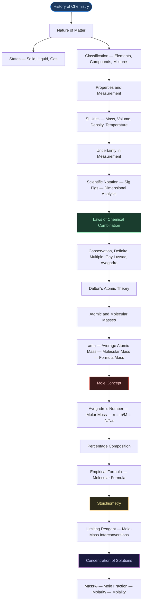
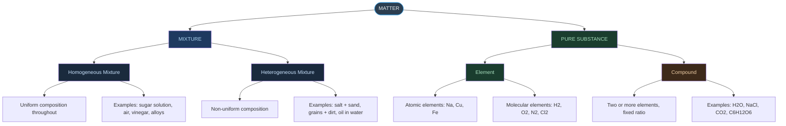
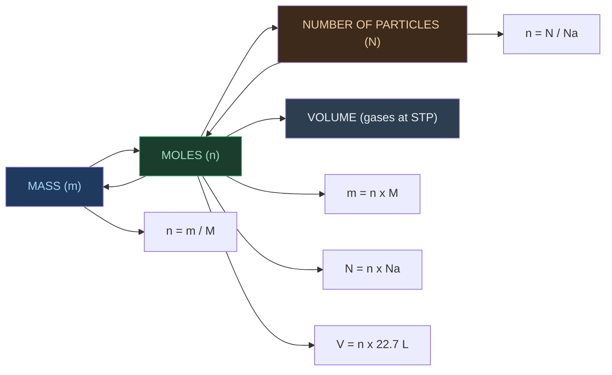
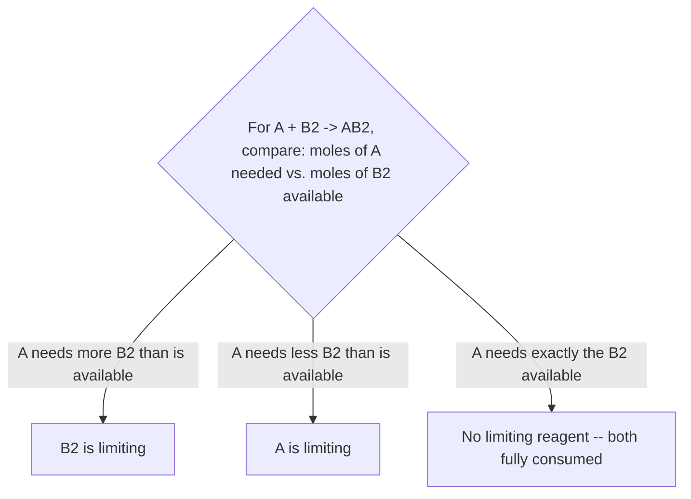
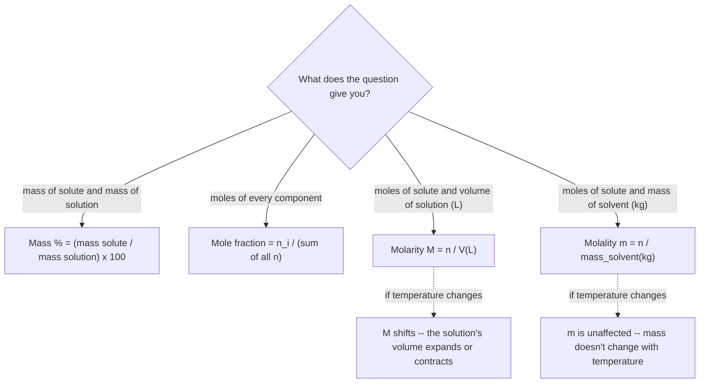

# ⚗️ CHAPTER 1 — SOME BASIC CONCEPTS OF CHEMISTRY
> **Complete Study Notes** | Board · NEET · JEE Layered

---

## 🗺️ CONCEPT ROADMAP



> [!note] What changed in this upgrade
> Added: a TikZ precision/accuracy target (§5.3) and a TikZ ionic-lattice diagram (§8.4); a decision flowchart for picking the right concentration term (§13); ~20 additional worked examples pulled from the handwritten problem set, each recomputed from scratch rather than copied — this caught a handful of small errors in the original working (a decimal-place slip in a metric-tonne mole calculation, a units slip in a density-based dilution, and a mismatched question/answer pair in a limestone-purity problem), all corrected below and flagged where it matters. Desmos was deliberately **not** used here — this chapter is mostly definitional/computational rather than curve-based, so an interactive graph wouldn't teach more than the tables already do, and Desmos rendering on this note-taking platform hasn't been confirmed to work yet anyway.

---

## SECTION 1 — DEVELOPMENT OF CHEMISTRY

### 1.1 Historical Origins

- Chemistry was originally sought for two purposes:
    - **Philosopher's Stone (Paras)** — to convert base metals (iron, copper) into gold
    - **Elixir of Life** — to grant immortality
- Developed mainly as **Alchemy** and **Iatrochemistry** (1300–1600 CE)
- Modern chemistry took shape in the **18th century Europe**, after alchemical traditions introduced by Arabs

### 1.2 Ancient Indian Contributions ⭐

> [!important] Frequently Tested — Board / NEET
> Acharya Kanda conceptualised the atomic theory **~2500 years before John Dalton** (1766–1844). His 'Paramānu' were described as eternal, indestructible, spherical, and in motion.

| Ancient Name / Text | Contribution |
|:---|:---|
| **Rasayan Shastra / Rasvidya** | Indian term for chemistry; included metallurgy, medicine, cosmetics, glass, dyes |
| **Mohenjodaro & Harappa** | Baked bricks, glazed pottery, Gypsum cement (lime + sand + CaCO₃), Faience (early glass) |
| **Harappans** | Worked with lead, silver, gold, copper; improved copper hardness with tin and arsenic |
| **Rigveda (1000–400 BCE)** | Tanning of leather and dyeing of cotton |
| **Kautilya's Arthashastra** | Production of salt from sea |
| **Charaka Samhita** | Oldest Ayurvedic text; preparation of H₂SO₄, HNO₃, metal oxides; bhasma (nanoparticles) |
| **Sushruta Samhita** | Importance of alkalies |
| **Rasopanishada** | Preparation of gunpowder |
| **Nagarjuna** | Mercury compounds (*Rasratnakar*); extraction of gold, silver, tin, copper |
| **Chakrapani** | Discovered mercury sulphide; credited with inventing soap |
| **Acharya Kanda (600 BCE)** | First proponent of atomic theory; named particles **'Paramānu'**; text: *Vaiseshika Sutras* |
| **Varāhmihir's Brihat Samhita** | Encyclopaedia (6th century CE); perfumes, cosmetics, hair dyes, wall preparations |

### 1.3 Glass and Ink in Ancient India

- Glass objects found at: **Maski, South India (1000–900 BCE)** and **Hastinapur & Taxila (1000–200 BCE)**
- Glass coloured using **metal oxides**
- Ink used in India since the **4th century** (evidenced at Taxila)
- Paper known in India in the **17th century** (account by Chinese traveller I-tsing)

---

## SECTION 2 — IMPORTANCE OF CHEMISTRY

> [!info] Definition
> Chemistry is the science that studies the **composition, structure, properties, and interactions of matter** at the level of atoms and molecules.

Chemistry is central to virtually every field of life:

- **Food & Agriculture**: Large-scale fertilisers, improved pesticides and insecticides
- **Healthcare**: Isolation and synthesis of life-saving drugs
    - **Cisplatin** and **Taxol** → cancer therapy
    - **AZT (Azidothymidine)** → AIDS treatment
- **Industry**: Acids, alkalis, dyes, polymers, metals, alloys
- **Advanced Materials**: Superconducting ceramics, conducting polymers, optical fibres
- **Environment**: Safer alternatives to **CFCs** (responsible for stratospheric ozone depletion); management of greenhouse gases (CH₄, CO₂)
- **Biochemistry**: Use of enzymes for large-scale production of chemicals

---

## SECTION 3 — NATURE OF MATTER

### 3.1 Definition of Matter

> [!info] Definition
> **Matter**: Anything that has **mass** and **occupies space** (has volume).

### 3.2 States of Matter

| Property | **Solid** | **Liquid** | **Gas** |
|:---|:---:|:---:|:---:|
| Shape | Definite | Takes container shape | Takes container shape |
| Volume | Definite | Definite | Not definite |
| Particle spacing | Very close, ordered | Close, mobile | Far apart |
| Particle movement | Vibrations only | Can move around | Easy and fast |
| Compressibility | Negligible | Negligible | High |
| Example | Ice, NaCl | Water, mercury | Steam, O₂ |

> [!warning] Board Trap
> Gases completely occupy the container; liquids take the container's shape but have definite volume.

### 3.3 Classification of Matter



**Key Distinctions:**

| Feature | Mixture | Compound |
|:---|:---|:---|
| Composition | Variable | Fixed |
| Separation | Physical methods | Chemical methods only |
| Properties | Similar to components | Different from components |
| Formation | No energy change necessarily | Energy absorbed or released |

> [!tip] Classic NEET Example
> H₂ + O₂ → both gases. But H₂O (compound) → liquid; hydrogen burns, oxygen supports combustion, but water extinguishes fire.

---

## SECTION 4 — PROPERTIES OF MATTER AND THEIR MEASUREMENT

### 4.1 Physical vs Chemical Properties

| Physical Properties | Chemical Properties |
|:---|:---|
| Observed/measured without changing substance | Require a chemical change to be observed |
| Colour, odour, melting/boiling point, density | Acidity, combustibility, reactivity with acids |
| Substance remains same after measurement | Substance is consumed or transformed |

### 4.2 The SI System of Units

Established in **1960** by the **11th General Conference on Weights and Measures (CGPM)** *(Conférence Générale des Poids et Mesures)*. Based on the **Metre Convention** signed in Paris, 1875. India's standard maintained by: **National Physical Laboratory (NPL), New Delhi**.

#### Seven Base SI Units

| Base Physical Quantity | Symbol | SI Unit | Unit Symbol |
|:---|:---:|:---:|:---:|
| Length | *l* | metre | m |
| Mass | *m* | kilogram | kg |
| Time | *t* | second | s |
| Electric current | *I* | ampere | A |
| Thermodynamic temperature | *T* | kelvin | K |
| Amount of substance | *n* | mole | mol |
| Luminous intensity | *Iᵥ* | candela | cd |

> [!warning] JEE Note
> These are the **only 7 base units**. All other units (speed, force, energy, etc.) are **derived** from these.

#### Key SI Prefix Table

| Multiple | Prefix | Symbol |
|:---:|:---:|:---:|
| $10^{-12}$ | pico | p |
| $10^{-9}$ | nano | n |
| $10^{-6}$ | micro | μ |
| $10^{-3}$ | milli | m |
| $10^{-2}$ | centi | c |
| $10^{-1}$ | deci | d |
| $10^{3}$ | kilo | k |
| $10^{6}$ | mega | M |
| $10^{9}$ | giga | G |
| $10^{12}$ | tera | T |

### 4.3 Mass and Weight

| | **Mass** | **Weight** |
|:---|:---:|:---:|
| Definition | Amount of matter | Force exerted by gravity |
| Nature | Constant everywhere | Varies with location |
| SI Unit | kilogram (kg) | newton (N) |
| Instrument | Analytical balance | Spring balance |

Lab unit of mass: **gram (g)** [1 kg = 1000 g]

### 4.4 Volume

- SI unit: **m³**
- Lab units: **cm³, dm³, mL, L**
- Conversions:
    - **1 L = 1000 mL = 1000 cm³ = 1 dm³**
    - **1 m³ = 10⁶ cm³ = 1000 dm³ = 1000 L**
- Lab instruments: graduated cylinder, burette, pipette, volumetric flask

### 4.5 Density

$$
\boxed{\text{Density} = \frac{\text{Mass}}{\text{Volume}}}
$$

- SI unit: **kg m⁻³**
- Common lab unit: **g cm⁻³** or **g mL⁻¹**
- Higher density → particles more closely packed

### 4.6 Temperature Scales

$$
\boxed{°F = \frac{9}{5}(°C) + 32}
$$

$$
\boxed{K = °C + 273.15}
$$

| Scale | Freezing point of water | Boiling point of water |
|:---|:---:|:---:|
| Celsius (°C) | 0 | 100 |
| Fahrenheit (°F) | 32 | 212 |
| Kelvin (K) | 273.15 | 373.15 |

> [!warning] Key Point
> Negative temperature is possible in Celsius, but **NOT in Kelvin**. K is always ≥ 0. Kelvin is the SI unit.

---

## SECTION 5 — UNCERTAINTY IN MEASUREMENT

### 5.1 Scientific Notation

Any number expressed as: **N × 10ⁿ** where **1.000… ≤ N ≤ 9.999…**

| Original Number | Scientific Notation | Move decimal |
|:---|:---:|:---|
| 232.508 | $2.32508 \times 10^{2}$ | 2 places left → positive exponent |
| 0.00016 | $1.6 \times 10^{-4}$ | 4 places right → negative exponent |
| 602,200,000,000,000,000,000,000 | $6.022 \times 10^{23}$ | 23 places left |

**Mathematical Operations:**

- **Multiplication**: $(a \times 10^x)(b \times 10^y) = (a \times b) \times 10^{(x+y)}$
- **Division**: $(a \times 10^x) \div (b \times 10^y) = (a/b) \times 10^{(x-y)}$
- **Addition/Subtraction**: First make exponents equal, then operate on coefficients

### 5.2 Significant Figures (Sig Figs)

> [!important] Definition
> All digits known with certainty **plus one uncertain (estimated) digit**.

#### Rules for Counting Significant Figures

| Rule | Example | Sig Figs |
|:---|:---:|:---:|
| All non-zero digits are significant | 285 cm | **3** |
| Leading zeros are NOT significant | 0.0052 | **2** |
| Zeros between non-zero digits ARE significant | 2.005 | **4** |
| Trailing zeros WITH decimal point ARE significant | 0.200 g | **3** |
| Trailing zeros WITHOUT decimal point are NOT significant | 100 | **1** |
| 100. (with decimal point) | 100. | **3** |
| All digits in scientific notation are significant | $4.01 \times 10^{2}$ | **3** |
| Exact/counted numbers | 2 eggs | **infinite** |

#### Rounding Rules

1. Digit to be removed **> 5** → preceding digit increases by 1 → 1.386 becomes **1.39**
2. Digit to be removed **< 5** → preceding digit unchanged → 4.334 becomes **4.33**
3. Digit to be removed **= 5** → preceding digit even → unchanged (6.25 → **6.2**); odd → increase by 1 (6.35 → **6.4**)

#### Sig Figs in Calculations

> [!tip] Calculation Rules
> - **Addition/Subtraction** → result has same **number of decimal places** as the least precise measurement
>     - Example: 12.11 + 18.0 + 1.012 = 31.122 → reported as **31.1**
> - **Multiplication/Division** → result has same **number of sig figs** as the measurement with fewest sig figs
>     - Example: 2.5 × 1.25 = 3.125 → reported as **3.1** (2.5 has only 2 sig figs)

### 5.3 Precision vs Accuracy

| | **Precision** | **Accuracy** |
|:---|:---|:---|
| Definition | Closeness of repeated measurements to each other | Closeness of a measurement to the true value |
| Analogy | Arrows clustered together (not necessarily at bullseye) | Arrows hitting the bullseye |
| Example | 1.95 g, 1.93 g (true value = 2.00 g) → Precise but NOT accurate | 2.01 g, 1.99 g → Both precise AND accurate |

```tikz
\usetikzlibrary{arrows.meta}
\begin{tikzpicture}[thick, scale=1.0]
  \begin{scope}[shift={(0,0)}]
    \draw[gray!40] (0,0) circle (1.2); \draw[gray!40] (0,0) circle (0.8); \draw[gray!40] (0,0) circle (0.4);
    \fill[black] (0,0) circle (1.5pt);
    \fill[red!75!black] (0.55,0.5) circle (2pt);
    \fill[red!75!black] (0.5,0.55) circle (2pt);
    \node[below, font=\small] at (0,-1.5) {Student A: precise, not accurate};
  \end{scope}
  \begin{scope}[shift={(3.2,0)}]
    \draw[gray!40] (0,0) circle (1.2); \draw[gray!40] (0,0) circle (0.8); \draw[gray!40] (0,0) circle (0.4);
    \fill[black] (0,0) circle (1.5pt);
    \fill[orange!85!black] (0.3,0.9) circle (2pt);
    \fill[orange!85!black] (-0.7,-0.6) circle (2pt);
    \node[below, font=\small] at (0,-1.5) {Student B: neither};
  \end{scope}
  \begin{scope}[shift={(6.4,0)}]
    \draw[gray!40] (0,0) circle (1.2); \draw[gray!40] (0,0) circle (0.8); \draw[gray!40] (0,0) circle (0.4);
    \fill[black] (0,0) circle (1.5pt);
    \fill[green!45!black] (0.08,0.1) circle (2pt);
    \fill[green!45!black] (-0.05,-0.08) circle (2pt);
    \node[below, font=\small] at (0,-1.5) {Student C: precise \& accurate};
  \end{scope}
  \node[below, font=\itshape\small, text=gray] at (3.2,-2.1) {bullseye = true value (2.00 g); each dot = one measurement};
\end{tikzpicture}
```

The two ideas are independent: precision only asks whether repeated measurements agree with *each other*; accuracy asks whether they agree with the *true value*. A systematic error (a badly calibrated balance, say) can make an entire cluster precise yet consistently off-target — exactly Student A above.

### 5.4 Dimensional Analysis (Factor Label Method / Unit Factor Method)

Multiply by **unit factors** (fractions equal to 1) to convert between units.

> [!example] Example 1 — Convert 3 inches to cm (1 in = 2.54 cm)
>
> $$3 \text{ in} \times \frac{2.54 \text{ cm}}{1 \text{ in}} = 7.62 \text{ cm}$$

> [!example] Example 2 — Convert 2 L to m³
>
> $$2 \text{ L} \times \frac{1000 \text{ cm}^3}{1 \text{ L}} \times \left(\frac{1 \text{ m}}{100 \text{ cm}}\right)^3 = 2 \times 10^{-3} \text{ m}^3$$

> [!example] Example 3 — Convert 2 days to seconds
>
> $$2 \text{ days} \times \frac{24 \text{ h}}{1 \text{ day}} \times \frac{60 \text{ min}}{1 \text{ h}} \times \frac{60 \text{ s}}{1 \text{ min}} = 172{,}800 \text{ s}$$

---

## SECTION 6 — LAWS OF CHEMICAL COMBINATION

### Law 1: Law of Conservation of Mass

**Proposed by**: Antoine Lavoisier (1789)

> [!important] Statement
> "In all physical and chemical changes, there is no net change in mass. Matter can neither be created nor destroyed."

Total mass of reactants = Total mass of products

### Law 2: Law of Definite Proportions

**Proposed by**: Joseph Proust

> [!important] Statement
> "A given compound always contains the same elements combined together in the same fixed proportion by mass."

Also called: **Law of Definite Composition**

Example: Cupric carbonate (natural or synthetic) always has Cu : C : O = **51.35 : 9.74 : 38.91** (by mass)

### Law 3: Law of Multiple Proportions

**Proposed by**: John Dalton (1803)

> [!important] Statement
> "When two elements form more than one compound, the masses of one element that combine with a fixed mass of the other are in a ratio of small whole numbers."

Example:

- H₂ + O₂ → **H₂O**: 2 g H combines with **16 g O**
- H₂ + O₂ → **H₂O₂**: 2 g H combines with **32 g O**
- Ratio of O = 16 : 32 = **1 : 2** ← simple whole number ratio ✓

### Law 4: Gay Lussac's Law of Gaseous Volumes

**Proposed by**: Gay Lussac (1808)

> [!important] Statement
> "When gases combine or are produced in a chemical reaction, they do so in a simple ratio by volume, provided all gases are at the same temperature and pressure."

Example: H₂ : O₂ : H₂O (vapour) = 100 mL : 50 mL : 100 mL = **2 : 1 : 2**

### Law 5: Avogadro's Law

**Proposed by**: Amedeo Avogadro (1811)

> [!important] Statement
> "Equal volumes of all gases at the same temperature and pressure should contain equal number of molecules."

Key contribution: Distinguished between **atoms** and **molecules**; proposed H₂ and O₂ are **diatomic**. His proposal was published in *Journal de Physique* but was accepted only ~50 years later (Karlsruhe Conference, 1860).

> [!tip] JEE Note
> Gay Lussac's law is actually the Law of Definite Proportions by Volume. Avogadro's law explained it correctly.

---

## SECTION 7 — DALTON'S ATOMIC THEORY (1808)

Published in: **'A New System of Chemical Philosophy'**

### Postulates

1. Matter consists of **indivisible atoms**
2. All atoms of a given element have **identical properties, including identical mass**; atoms of different elements differ in mass
3. Compounds are formed when atoms of different elements combine in a **fixed ratio**
4. Chemical reactions involve **reorganisation of atoms** — atoms are neither created nor destroyed

### Successes

- Explained Law of Conservation of Mass (atoms rearrange, not created/destroyed)
- Explained Law of Definite Proportions (fixed atom ratios)
- Explained Law of Multiple Proportions (different fixed ratios)

### Limitations

- Could **NOT** explain Gay Lussac's Law of Gaseous Volumes
- Could NOT explain why/how atoms combine (valence concept came later)
- Did not account for **isotopes** (same element, different mass)
- Did not account for **isobars** (different elements, same mass)
- Atoms are NOT truly indivisible (protons, neutrons, electrons exist)

---

## SECTION 8 — ATOMIC AND MOLECULAR MASSES

### 8.1 Atomic Mass Unit (amu / u)

$$
\boxed{1 \text{ amu} = \frac{1}{12} \times \text{mass of one }^{12}\text{C atom}}
$$

- 1 amu = **1.66056 × 10⁻²⁴ g**
- Standard: ¹²C = exactly **12 u** (agreed 1961)
- Mass of H atom = 1.6736 × 10⁻²⁴ g = **1.008 u**
- Current symbol: **u** (unified mass) replaces 'amu'

> [!note] Calculation
> Mass of H atom in amu = (1.6736 × 10⁻²⁴ g) / (1.66056 × 10⁻²⁴ g) = **1.0078 u ≈ 1.008 u**

> [!example] Worked Example — What is the mass of one ¹²C atom, in grams? (NCERT Exercise 1.30)
> **Given:** 1 mole of ¹²C = 12 g = $6.022 \times 10^{23}$ atoms.
> **Find:** mass of a single ¹²C atom.
> **Concept:** mass of one entity = molar mass ÷ Avogadro's number — the direct definition being asked about, not a formula to memorize separately.
> **Work:**
> $$\text{mass of 1 atom} = \frac{12 \text{ g}}{6.022 \times 10^{23}} = 1.99 \times 10^{-23} \text{ g}$$
> **Check:** units are grams per atom, as asked; the size ($10^{-23}$ g) is consistent with a single atom being unimaginably light — exactly the reason Avogadro's number exists in the first place.

### 8.2 Average Atomic Mass

Because most elements exist as **isotopes** (same atomic number, different mass number), we use a weighted average:

$$
\boxed{\bar{A} = \sum_{i} \left(\text{fractional abundance}_i \times \text{atomic mass}_i\right)}
$$

**Example — Carbon:**

| Isotope | Abundance | Atomic Mass |
|:---:|:---:|:---:|
| ¹²C | 98.892% | 12 u |
| ¹³C | 1.108% | 13.00335 u |
| ¹⁴C | ~2 × 10⁻¹⁰% | 14.00317 u |

Average = (0.98892)(12) + (0.01108)(13.00335) + (≈0)(14.00317) = **12.011 u**

> [!tip] Key Point
> Periodic table values are **average atomic masses**, not masses of individual atoms.

> [!example] Worked Example — Running the average-atomic-mass formula backwards
> **Given:** chlorine's average atomic mass is 35.5 g mol⁻¹, made up only of ³⁵Cl (mass 35) and ³⁷Cl (mass 37).
> **Find:** the natural abundance ratio of ³⁵Cl : ³⁷Cl.
> **Concept:** the same weighted-average equation as above, but with the abundances as the unknown instead of the final average.
> **Work:** let ³⁵Cl abundance be $x\%$, so ³⁷Cl abundance is $(100-x)\%$.
> $$
> \begin{aligned}
> 35.5 &= \frac{x}{100}(35) + \frac{100-x}{100}(37) \\
> 3550 &= 35x + 37(100-x) = 3700 - 2x \\
> 2x &= 150 \implies x = 75
> \end{aligned}
> $$
> So ³⁵Cl = 75%, ³⁷Cl = 25%, giving a ratio of $\boxed{{}^{35}\text{Cl} : {}^{37}\text{Cl} = 3 : 1}$.
> **Check:** $0.75(35) + 0.25(37) = 26.25 + 9.25 = 35.5$ ✓ — matches the given average exactly, and 3:1 is a believably simple whole-number ratio for a naturally occurring isotope mix.

### 8.3 Molecular Mass

$$
\text{Molecular mass} = \sum (\text{atomic mass} \times \text{number of atoms of that element})
$$

| Molecule | Calculation | Molecular Mass |
|:---|:---|:---:|
| CH₄ | 12.011 + 4(1.008) | **16.043 u** |
| H₂O | 2(1.008) + 16.00 | **18.02 u** |
| CO₂ | 12.011 + 2(16.00) | **44.011 u** |
| C₆H₁₂O₆ (glucose) | 6(12.011) + 12(1.008) + 6(16.00) | **180.162 u** |
| NH₃ | 14.01 + 3(1.008) | **17.034 u** |

> [!example] Practice Set — Mass of a single atom or molecule (handwritten problem set)
> Same pattern every time: **mass of one entity = molar mass ÷ 6.022 × 10²³**.
>
> | Entity | Molar mass | Mass of one entity |
> |:---|:---:|:---:|
> | Ag atom (at. mass 108) | 108 g mol⁻¹ | $1.79 \times 10^{-22}$ g |
> | Naphthalene, C₁₀H₈ | 128 g mol⁻¹ | $2.13 \times 10^{-22}$ g |
> | N₂ molecule | 28 g mol⁻¹ | $4.65 \times 10^{-23}$ g |
> | Sucrose, C₁₂H₂₂O₁₁ — mass of **100 molecules** | 342 g mol⁻¹ | $342 \times 100 / N_A = 5.68 \times 10^{-20}$ g |

### 8.4 Formula Mass

Used for **ionic compounds** that do NOT exist as discrete molecules (exist as 3D lattice structures):

**Example: NaCl** — Formula mass = 23.0 (Na) + 35.5 (Cl) = **58.5 u**

> [!note] Structure
> NaCl: each Na⁺ surrounded by 6 Cl⁻, and each Cl⁻ surrounded by 6 Na⁺

```tikz
\begin{tikzpicture}[thick, scale=0.85]
  \fill[blue!70!black] (0,0) circle (4pt); \fill[orange!85!black] (1,0) circle (3pt);
  \fill[blue!70!black] (2,0) circle (4pt); \fill[orange!85!black] (3,0) circle (3pt);
  \fill[orange!85!black] (0,1) circle (3pt); \fill[blue!70!black] (1,1) circle (4pt);
  \fill[orange!85!black] (2,1) circle (3pt); \fill[blue!70!black] (3,1) circle (4pt);
  \fill[blue!70!black] (0,2) circle (4pt); \fill[orange!85!black] (1,2) circle (3pt);
  \fill[blue!70!black] (2,2) circle (4pt); \fill[orange!85!black] (3,2) circle (3pt);
  \fill[orange!85!black] (0,3) circle (3pt); \fill[blue!70!black] (1,3) circle (4pt);
  \fill[orange!85!black] (2,3) circle (3pt); \fill[blue!70!black] (3,3) circle (4pt);
  \node[font=\small, text=blue!70!black] at (4.3,3) {Na$^+$};
  \node[font=\small, text=orange!85!black] at (4.3,2.5) {Cl$^-$};
  \node[below, font=\itshape\small, text=gray] at (1.5,-0.6) {a 2D slice of the lattice — each ion is boxed in by 6 opposite-charge neighbours in 3D};
\end{tikzpicture}
```

This is exactly *why* NaCl gets a **formula mass**, not a molecular mass — there is no single, isolated "NaCl molecule" sitting in the solid to weigh. The formula unit is just the smallest repeating ratio (1 Na⁺ to 1 Cl⁻) that the whole 3D grid is built from.

---

## SECTION 9 — MOLE CONCEPT AND MOLAR MASSES

### 9.1 The Mole — Definition

$$
\boxed{1 \text{ mole} = 6.02214076 \times 10^{23} \text{ elementary entities}}
$$

This number is **Avogadro's constant (Nₐ)** = **6.022 × 10²³ mol⁻¹**

In full: **602,213,670,000,000,000,000,000**

> [!important] Note
> "Elementary entity" can be an atom, molecule, ion, electron, formula unit — must be specified.

### 9.2 The Mole — Interconversions



| Conversion | Formula |
|:---|:---:|
| Moles from mass | $n = m / M$ |
| Mass from moles | $m = n \times M$ |
| Particles from moles | $N = n \times N_A$ |
| Moles from particles | $n = N / N_A$ |
| Volume of gas (STP) | $V = n \times 22.7 \text{ L}$ |

> [!warning] STP vs. NTP — the constant you multiply by depends on which one you mean
> This is a genuinely common source of mismatched answers, because the *definition itself changed*:
> - **Old STP / commonly called NTP** (0 °C, 1 atm): 1 mole of any gas occupies **22.4 L**. Most coaching material and older sources still default to this figure.
> - **Current IUPAC STP** (0 °C, 1 bar — 1 bar is very slightly less than 1 atm): 1 mole occupies **22.7 L**. This is the value current NCERT editions use.
>
> Both are "correct" — they're just two different reference pressures. Always check which convention a problem is using before reaching for 22.4 or 22.7, and state which one you used in your working. The worked examples below use whichever value the *source problem* specified, labelled each time.

> [!example] Practice Set — Particles from a given volume of gas (handwritten problem set, using the 22.4 L mol⁻¹ convention)
> | Given | Moles | Result |
> |:---|:---:|:---|
> | 11.2 L of O₂ at NTP | 11.2/22.4 = 0.5 mol | $3.01 \times 10^{23}$ molecules, $6.02 \times 10^{23}$ **atoms** (O₂ is diatomic) |
> | 1 dm³ of H₂ at STP (22.4 L convention) | 1/22.4 = 0.0446 mol | $2.69 \times 10^{22}$ molecules |
> | 1 kg of O₂ | 1000/32 = 31.25 mol | $1.88 \times 10^{25}$ molecules |

> [!example] Practice Set — Moles from a given mass
> $$n = \dfrac{\text{given mass}}{\text{molar mass}}$$
>
> | Given | Molar mass | Moles |
> |:---|:---:|:---:|
> | 7.9 mg of calcium | 40.1 g mol⁻¹ | $1.97 \times 10^{-4}$ mol |
> | 4.68 mg of silicon | 28.1 g mol⁻¹ | $1.67 \times 10^{-4}$ mol |
> | 1.46 metric tonnes of aluminium | 27 g mol⁻¹ | $5.41 \times 10^{4}$ mol |

> [!warning] Watch the decimal point when tonnes get involved
> 1.46 metric tonnes = $1.46 \times 10^{6}$ g, not $1.46 \times 10^{3}$ g — a slip here (dividing $1.46/27$ and misplacing the decimal) easily turns $5.41\times10^{4}$ mol into a wrong answer ten times too large or small. Always convert to grams explicitly as its own step before dividing by molar mass.

### 9.3 Molar Mass

> [!info] Definition
> **Molar mass** = Mass of **1 mole** of a substance in grams = numerically equal to atomic/molecular/formula mass in u.

| Substance | Molar Mass |
|:---:|:---:|
| H₂O | 18.02 g mol⁻¹ |
| NaCl | 58.5 g mol⁻¹ |
| C₆H₁₂O₆ | 180.162 g mol⁻¹ |
| NH₃ | 17.03 g mol⁻¹ |
| CO₂ | 44.01 g mol⁻¹ |

**Deriving Avogadro's Number:**

- 1 mole ¹²C = 12 g
- Mass of 1 ¹²C atom (by mass spectrometry) = 1.992648 × 10⁻²³ g
- $N_A = 12 \text{ g/mol} \div 1.992648 \times 10^{-23} \text{ g} = 6.0221367 \times 10^{23} \text{ mol}^{-1}$

---

## SECTION 10 — PERCENTAGE COMPOSITION

$$
\boxed{\text{Mass \% of element} = \frac{\text{Molar mass of element in 1 mol of compound}}{\text{Molar mass of compound}} \times 100}
$$

**Example: Ethanol (C₂H₅OH), Molar mass = 46.068 g mol⁻¹**

- %C = (24.02 / 46.068) × 100 = **52.14%**
- %H = (6.048 / 46.068) × 100 = **13.13%**
- %O = (16.00 / 46.068) × 100 = **34.73%**

Check: 52.14 + 13.13 + 34.73 = **100%** ✓

> [!example] Worked Example — Copper pyrites, CuFeS₂
> **Given:** CuFeS₂; atomic masses Cu = 63.5, Fe = 55.8, S = 32.
> **Find:** mass % of each element.
> **Concept:** same formula as above — mass of each element's contribution ÷ molar mass of the whole compound.
> **Work:**
> $$M = 63.5 + 55.8 + 2(32) = 183.3 \text{ g mol}^{-1}$$
> $$\%\text{Cu} = \frac{63.5}{183.3}\times100 = 34.6\%, \quad \%\text{Fe} = \frac{55.8}{183.3}\times100 = 30.4\%, \quad \%\text{S} = \frac{64}{183.3}\times100 = 34.9\%$$
> **Check:** $34.6+30.4+34.9 = 99.9\% \approx 100\%$ ✓ (the 0.1% gap is rounding, not an error).

> [!example] Worked Example — Urea, (NH₂)₂CO
> **Given:** (NH₂)₂CO; atomic masses N = 14, H = 1, C = 12, O = 16.
> **Work:**
> $$M = 2(14) + 4(1) + 12 + 16 = 60 \text{ g mol}^{-1}$$
> $$\%\text{N}=\frac{28}{60}\times100=46.67\%,\ \%\text{H}=\frac{4}{60}\times100=6.67\%,\ \%\text{C}=\frac{12}{60}\times100=20\%,\ \%\text{O}=\frac{16}{60}\times100=26.67\%$$
> **Check:** $46.67+6.67+20+26.67=100.01\%\approx100\%$ ✓

---

## SECTION 11 — EMPIRICAL AND MOLECULAR FORMULA

| | **Empirical Formula** | **Molecular Formula** |
|:---|:---|:---|
| Represents | Simplest whole number ratio of atoms | Actual number of atoms in a molecule |
| Obtained from | % composition data | Empirical formula + molar mass |
| May differ from molecular | Yes | No (it IS the actual formula) |
| Example | CH₂O | C₆H₁₂O₆ (glucose) |

### Steps to Find Empirical Formula from % Composition

**Step 1**: Assume 100 g of compound → % values become gram values directly.

**Step 2**: Convert grams to moles by dividing by atomic mass.

$$
\text{Moles} = \frac{\text{Mass (g)}}{\text{Atomic Mass (g mol}^{-1}\text{)}}
$$

**Step 3**: Divide all mole values by the **smallest** mole value → get molar ratios.

**Step 4**: If ratios are not whole numbers (e.g., 1.5, 2.5), multiply all by the smallest integer to make them whole (e.g., multiply by 2).

**Step 5**: Write empirical formula with these whole number ratios.

### Steps to Find Molecular Formula from Empirical Formula

$$
\boxed{n = \frac{\text{Molar Mass (given)}}{\text{Empirical Formula Mass (calculated)}}}
$$

$$
\text{Molecular Formula} = n \times \text{Empirical Formula}
$$

> [!example] Worked Example (NCERT Problem 1.2)
> Compound: 4.07% H, 24.27% C, 71.65% Cl; Molar mass = 98.96 g
>
> | Element | Mass (in 100 g) | Atomic Mass | Moles | Ratio (÷ 2.021) |
> |:---:|:---:|:---:|:---:|:---:|
> | H | 4.07 g | 1.008 | 4.04 | ≈ 2 |
> | C | 24.27 g | 12.01 | 2.021 | 1 |
> | Cl | 71.65 g | 35.453 | 2.021 | 1 |
>
> Empirical formula: **CH₂Cl**; EF mass = 12.01 + 2(1.008) + 35.453 = **49.48 g**
>
> $n = 98.96 / 49.48 = 2$
>
> Molecular formula: **C₂H₄Cl₂**

> [!example] Worked Example — An oxide of iron (NCERT Exercises 1.3 / 1.8)
> **Given:** 69.9% Fe, 30.1% O by mass.
> **Find:** empirical formula.
> **Work:**
> | Element | Mass (in 100 g) | Atomic Mass | Moles | Ratio (÷ 1.248) |
> |:---:|:---:|:---:|:---:|:---:|
> | Fe | 69.9 g | 56 | 1.248 | 1 |
> | O | 30.1 g | 16 | 1.881 | 1.5 → **×2 → 3** |
>
> Since 1.5 isn't a whole number, multiply *both* ratios by 2 (Step 4 of the method above) → Fe : O = 2 : 3.
>
> Empirical formula = $\boxed{\text{Fe}_2\text{O}_3}$; formula mass = $2(56)+3(16) = 160$ g mol⁻¹.
> **Check:** since no molar mass was given for the *molecular* compound, the empirical formula is the final answer here — this is genuinely as far as the data lets you go, not an incomplete solution.

> [!example] Worked Example — When both elements land on a 1:1 ratio
> **Given:** an organic compound, molar mass 78 g mol⁻¹, composition 92.4% C and 7.6% H.
> **Work:**
> | Element | Mass (in 100 g) | Atomic Mass | Moles | Ratio (÷ 7.6) |
> |:---:|:---:|:---:|:---:|:---:|
> | C | 92.4 g | 12 | 7.7 | 1 |
> | H | 7.6 g | 1 | 7.6 | 1 |
>
> Empirical formula = CH, EF mass = 12 + 1 = 13 g mol⁻¹.
> $$n = 78/13 = 6 \implies \text{Molecular formula} = \boxed{\text{C}_6\text{H}_6}\ \text{(benzene)}$$
> **Check:** $6\times13=78$ ✓, and C₆H₆ is a real, stable molecule (benzene) — a useful final sanity check whenever the molecular formula comes out of a calculation: does it correspond to something chemically reasonable?

> [!example] Worked Example — Using vapour density instead of a given molar mass
> **Given:** 57.8% C, 3.6% H, 38.6% O; vapour density = 83.
> **Concept:** for a gas, $\text{molar mass} = 2 \times \text{vapour density}$ — this is the extra step that makes this problem different from the two above.
> **Work:**
> | Element | Mass (in 100 g) | Atomic Mass | Moles | Ratio (÷ 2.4125, ×2) |
> |:---:|:---:|:---:|:---:|:---:|
> | C | 57.8 g | 12 | 4.81 | 2 → **4** |
> | H | 3.6 g | 1 | 3.6 | 1.5 → **3** |
> | O | 38.6 g | 16 | 2.41 | 1 → **2** |
>
> Empirical formula = C₄H₃O₂, EF mass = $4(12)+3(1)+2(16) = 83$ g mol⁻¹.
> $$\text{Molar mass} = 2 \times 83 = 166 \text{ g mol}^{-1} \implies n = 166/83 = 2 \implies \text{Molecular formula} = \boxed{\text{C}_8\text{H}_6\text{O}_4}$$

> [!example] Worked Example — Combining combustion analysis with gas density (NCERT Exercise 1.34, the most demanding version of this problem type)
> **Given:** a welding fuel gas contains only C and H. Burning a small sample gives 3.38 g CO₂ and 0.690 g H₂O. Separately, 10.0 L of the gas (at STP, 22.4 L convention) weighs 11.6 g.
> **Find:** (i) empirical formula, (ii) molar mass, (iii) molecular formula.
> **Concept:** the % composition isn't handed to you this time — it has to be *derived* from how much CO₂ and H₂O the combustion produced, using the fact that all the C in the sample ends up in the CO₂ and all the H ends up in the H₂O.
> **Work:**
> $$\text{mass of C} = \frac{12}{44}\times3.38 = 0.922\text{ g}, \qquad \text{mass of H} = \frac{2}{18}\times0.690 = 0.0767\text{ g}$$
> $$\%\text{C} = \frac{0.922}{0.922+0.0767}\times100 = 92.3\%, \qquad \%\text{H} = 7.7\%$$
> | Element | Mass (in 100 g) | Atomic Mass | Moles | Ratio |
> |:---:|:---:|:---:|:---:|:---:|
> | C | 92.3 g | 12 | 7.69 | 1 |
> | H | 7.7 g | 1 | 7.7 | 1 |
>
> Empirical formula = CH, EF mass = 13 g mol⁻¹.
>
> For the molar mass, use the given gas density directly:
> $$M = \frac{\text{mass}}{\text{volume}}\times22.4\text{ L mol}^{-1} = \frac{11.6}{10.0}\times22.4 = 26.0\text{ g mol}^{-1}$$
> $$n = 26.0/13 = 2 \implies \text{Molecular formula} = \boxed{\text{C}_2\text{H}_2}\ \text{(acetylene)}$$
> **Check:** acetylene is in fact a real welding fuel gas — the answer matches the question's own premise, which is a strong sanity check for a problem framed as a real-world scenario.

---

## SECTION 12 — STOICHIOMETRY AND STOICHIOMETRIC CALCULATIONS

### 12.1 What is Stoichiometry?

> [!info] Definition
> *(Greek: stoicheion = element, metron = measure)*
>
> Deals with the **quantitative relationships** between reactants and products in a balanced chemical equation.

### 12.2 Reading a Balanced Equation

**Example: CH₄(g) + 2O₂(g) → CO₂(g) + 2H₂O(g)**

| Interpretation | CH₄ | 2O₂ | CO₂ | 2H₂O |
|:---|:---:|:---:|:---:|:---:|
| Molecules | 1 | 2 | 1 | 2 |
| Moles | 1 mol | 2 mol | 1 mol | 2 mol |
| Mass | 16 g | 64 g | 44 g | 36 g |
| Volume at STP | 22.7 L | 45.4 L | 22.7 L | 45.4 L |

Stoichiometric coefficients (1, 2, 1, 2) represent both number of **molecules** and number of **moles**.

### 12.3 Balancing Chemical Equations

According to **Law of Conservation of Mass**, a balanced equation has the same number of each atom on both sides.

**Method — Trial and Error (propane combustion):**

> [!example] Balancing C₃H₈ + O₂ → CO₂ + H₂O
> 1. Balance C: C₃H₈ + O₂ → **3**CO₂ + H₂O
> 2. Balance H: C₃H₈ + O₂ → 3CO₂ + **4**H₂O
> 3. Balance O: C₃H₈ + **5**O₂ → 3CO₂ + 4H₂O
> 4. Verify: C(3=3) ✓, H(8=8) ✓, O(10=10) ✓
>
> $$\boxed{C_3H_8(g) + 5O_2(g) \rightarrow 3CO_2(g) + 4H_2O(l)}$$

> [!warning] Rule
> Only coefficients can be changed to balance; **subscripts cannot be changed**.

### 12.4 Limiting Reagent

> [!important] Definition
> **Limiting Reagent**: The reactant that is **completely consumed first** in a reaction, thereby limiting the amount of product formed.

**Method to Identify Limiting Reagent:**

1. Convert masses of all reactants to moles
2. Divide moles by their **stoichiometric coefficients**
3. The reactant with the **smallest quotient** is the limiting reagent

> [!example] NCERT Problem 1.5 — 50.0 kg N₂ + 10.0 kg H₂ → NH₃
> Reaction: N₂(g) + 3H₂(g) → 2NH₃(g)
>
> - Moles of N₂ = 50000/28 = **1786 mol**; quotient = 1786/1 = 1786
> - Moles of H₂ = 10000/2 = **4960 mol**; quotient = 4960/3 = **1653** ← smallest
>
> **H₂ is the limiting reagent.**
>
> NH₃ produced = 4960 mol H₂ × (2 mol NH₃ / 3 mol H₂) = **3307 mol NH₃ = 56.2 kg**

> [!tip] Try it yourself
> The same reaction with different numbers (NCERT Exercise 1.24): 2.00 × 10³ g N₂ + 1.00 × 10³ g H₂. Work it through yourself with the method above before checking — $\boxed{\text{N}_2 \text{ is now the limiting reagent}}$, giving 2428.6 g NH₃ produced and 571.4 g H₂ left unreacted. Notice that swapping which mass is larger doesn't tell you which reagent is limiting — you still have to divide by the coefficients, not just compare the two given masses directly.

**The identification method also works with plain mole/atom/molecule counts, not just masses** — for a generic reaction $A + B_2 \rightarrow AB_2$ (1:1:1 stoichiometry, so each mole of A needs exactly one mole of B₂):

| Given (NCERT Exercise 1.23) | A needs (1:1 with B₂) | Available B₂ | Limiting reagent |
|:---|:---:|:---:|:---:|
| 300 atoms A + 200 molecules B₂ | 300 | 200 | **B₂** |
| 2 mol A + 3 mol B₂ | 2 | 3 | **A** |
| 100 atoms A + 100 molecules B₂ | 100 | 100 | **none — both exactly consumed** |
| 5 mol A + 2.5 mol B₂ | 5 | 2.5 | **B₂** |
| 2.5 mol A + 5 mol B₂ | 2.5 | 5 | **A** |



### 12.5 Mole-Mass-Volume Interconversions

Stoichiometry is really just the mole-interconversion wheel from §9.2, run once *per substance* in a balanced equation, with the equation's coefficients converting moles of one substance to moles of another in between. See that wheel for the mass ↔ moles ↔ particles ↔ volume relationships — nothing new is needed here except the extra step of multiplying by a mole ratio from the balanced equation.

### 12.6 Practice: Purity, Reverse Stoichiometry, and Reading a Question Carefully

These four short problems each isolate one extra wrinkle on top of plain stoichiometry.

> [!example] Reading coefficients as mole ratios directly
> **Q:** How many moles of Na₂SO₄ are produced from 1 mole of NaOH? Reaction: $2\text{NaOH} + \text{H}_2\text{SO}_4 \rightarrow \text{Na}_2\text{SO}_4 + 2\text{H}_2\text{O}$.
> **Work:** 2 mol NaOH → 1 mol Na₂SO₄, so 1 mol NaOH → $\boxed{0.5 \text{ mol Na}_2\text{SO}_4}$.

> [!example] Accounting for impurity before doing any stoichiometry
> **Q:** Calculate the mass of CO₂ produced by heating 40 g of limestone that is only 20% pure CaCO₃. Reaction: $\text{CaCO}_3 \xrightarrow{\Delta} \text{CaO} + \text{CO}_2$.
> **Concept:** the impure 80% is inert filler (sand, etc.) and takes no part in the reaction — strip it out *first*, then do ordinary stoichiometry on the pure CaCO₃ only.
> **Work:**
> $$\text{pure CaCO}_3 = 40 \times 0.20 = 8\text{ g} \implies n = 8/100 = 0.08\text{ mol}$$
> $$1:1 \text{ ratio} \implies n(\text{CO}_2) = 0.08 \text{ mol} \implies \text{mass} = 0.08 \times 44 = \boxed{3.52\text{ g}}$$
> **Check:** the answer is necessarily smaller than what pure 40 g CaCO₃ would give (17.6 g) — a good sniff test for any purity problem.

> [!example] Working backwards from a target volume to moles of reactant
> **Q:** How many moles of Pb(NO₃)₂ are needed to produce 224 L of O₂ at NTP? Reaction: $2\text{Pb(NO}_3)_2 \rightarrow 2\text{PbO} + 4\text{NO}_2 + \text{O}_2$.
> **Work:**
> $$n(\text{O}_2) = 224/22.4 = 10\text{ mol} \implies \text{ratio } 2\text{Pb(NO}_3)_2 : 1\text{ O}_2 \implies n(\text{Pb(NO}_3)_2) = 2\times10 = \boxed{20 \text{ mol}}$$

> [!example] Combining a mass-percent solution with stoichiometry
> **Q:** What mass of 50% (by mass) H₂SO₄ solution is needed to completely decompose 25 g of CaCO₃? Reaction: $\text{CaCO}_3 + \text{H}_2\text{SO}_4 \rightarrow \text{CaSO}_4 + \text{CO}_2 + \text{H}_2\text{O}$.
> **Work:**
> $$n(\text{CaCO}_3) = 25/100 = 0.25\text{ mol} \xrightarrow{1:1} n(\text{H}_2\text{SO}_4) = 0.25 \text{ mol} \implies \text{pure mass} = 0.25\times98 = 24.5\text{ g}$$
> Since the acid is only 50% H₂SO₄ by mass, the *solution* needed weighs more than the pure acid alone:
> $$\text{mass of solution} = \frac{24.5}{0.50} = \boxed{49\text{ g of the 50\% solution}}$$
> **Check:** the answer (49 g) is roughly double the pure-acid requirement (24.5 g) — exactly what "50%" should mean, and a fast way to catch an inverted fraction.

---

## SECTION 13 — CONCENTRATION OF SOLUTIONS

### 13.1 Mass per cent (w/w %)

$$
\boxed{\text{Mass \%} = \frac{\text{Mass of solute}}{\text{Mass of solution}} \times 100}
$$

Mass of solution = Mass of solute + Mass of solvent

**Example**: 2 g substance A in 18 g water → Mass % = (2/20) × 100 = **10%**

### 13.2 Mole Fraction (χ)

$$
\boxed{\chi_A = \frac{n_A}{n_A + n_B}, \quad \chi_B = \frac{n_B}{n_A + n_B}}
$$

> [!note] Key Facts
> - **Always**: $\chi_A + \chi_B = 1$ (sum of all mole fractions = 1)
> - Mole fraction is **dimensionless**
> - The definition extends to any number of components: $\chi_i = n_i / \sum_j n_j$, and all mole fractions in the mixture still sum to 1.

> [!example] Worked Example — Mole fraction with three components
> **Given:** a solution that is 25% water, 25% methanol (CH₃OH), and 50% acetic acid (CH₃COOH) by mass.
> **Concept:** assume 100 g of solution total, so each mass percent converts directly to grams; then convert each to moles and divide by the grand total.
> **Work:**
> $$n_{\text{water}} = \frac{25}{18} = 1.39, \quad n_{\text{methanol}} = \frac{25}{32} = 0.78, \quad n_{\text{acetic acid}} = \frac{50}{60} = 0.83 \quad (\text{total} = 3.00 \text{ mol})$$
> $$\chi_{\text{water}} = \frac{1.39}{3.00} = \boxed{0.46}, \quad \chi_{\text{methanol}} = \boxed{0.26}, \quad \chi_{\text{acetic acid}} = \boxed{0.28}$$
> **Check:** $0.46+0.26+0.28 = 1.00$ ✓

### 13.3 Molarity (M)

$$
\boxed{M = \frac{\text{Number of moles of solute}}{\text{Volume of solution in litres}}}
$$

- Unit: **mol L⁻¹** (or **M**)
- **Changes with temperature** (because volume changes with temperature)
- **Dilution formula**: $M_1 V_1 = M_2 V_2$ (moles of solute conserved on dilution)

> [!example] NCERT 1.7 — 4 g NaOH in 250 mL solution
> $M = (4/40) / 0.250 = 0.1/0.250 =$ **0.4 M**

> [!example] Worked Example — Molarity of a sugar solution
> **Given:** 20 g of sugar (C₁₂H₂₂O₁₁, molar mass 342 g mol⁻¹) dissolved in enough water to make 2 L of solution.
> **Work:**
> $$n = 20/342 = 0.0585 \text{ mol} \implies M = 0.0585/2 = \boxed{0.0292 \text{ mol L}^{-1}}$$

> [!example] Worked Example — Preparing a dilute solution from a concentrated stock
> **Given:** stock H₂SO₄ is 18 M. **Find:** how to prepare 250 mL of 0.50 M H₂SO₄ from it.
> **Concept:** dilution adds only solvent — the moles of solute already in the volume of stock you pour out don't change, so $M_1V_1 = M_2V_2$ applies directly.
> **Work:**
> $$18 \times V_1 = 0.50 \times 250 \implies V_1 = \frac{0.50 \times 250}{18} = \boxed{6.94 \text{ mL of stock}}$$
> Then add water up to the 250 mL mark — that's $250 - 6.94 = 243.1$ mL of water, **not** simply "243 mL of water added to 6.94 mL of acid," since diluting to a final *total* volume isn't the same as adding a separately-measured volume of water (the final mixed volume of acid + water isn't perfectly additive in general; the safe method is always "dilute up to the mark," not "add this much water").

> [!example] Worked Example — Using density to find the volume of a pure liquid solute needed
> **Given:** methanol (CH₃OH, molar mass 32 g mol⁻¹) has density 0.793 kg L⁻¹. **Find:** the volume of pure methanol needed to make 2.5 L of 0.25 M solution.
> **Concept:** first find the *mass* of methanol needed from the molarity definition, then convert that mass to a volume using density — two separate conversions chained together.
> **Work:**
> $$n = M \times V = 0.25 \times 2.5 = 0.625 \text{ mol} \implies \text{mass} = 0.625 \times 32 = 20 \text{ g}$$
> $$\text{volume} = \frac{\text{mass}}{\text{density}} = \frac{20 \text{ g}}{0.793 \text{ g mL}^{-1}} = \boxed{25.2 \text{ mL}}$$
> **Check on units specifically:** density was given as 0.793 kg L⁻¹, which is numerically identical to 0.793 g mL⁻¹ — but the two unit forms are easy to cross, and mixing them up here would make the answer come out as "25.2 L," which is absurd for 20 g of a liquid with density close to water's. Always let the units of the final answer tell you whether the arithmetic makes physical sense.

### 13.4 Molality (m)

$$
\boxed{m = \frac{\text{Number of moles of solute}}{\text{Mass of solvent in kg}}}
$$

- Unit: **mol kg⁻¹**
- **Does NOT change with temperature** (mass is temperature-independent)
- Used in colligative property calculations

Before reaching for a formula, it helps to recognise which one a problem is actually set up for — the four terms are distinguished entirely by what's given, not by anything about the solute itself:



### 13.5 Master Comparison Table

| Property | Molarity (M) | Molality (m) | Mole Fraction (χ) | Mass % |
|:---|:---:|:---:|:---:|:---:|
| Symbol | M | m | χ | w/w% |
| Solute unit | moles | moles | moles | mass |
| Denominator | Volume of **solution** (L) | Mass of **solvent** (kg) | Total moles | Mass of **solution** |
| Temperature dependent | **YES** ⚠️ | **NO** | NO | NO |
| Unit | mol L⁻¹ | mol kg⁻¹ | dimensionless | % |

> [!tip] JEE Tip
> Molality is preferred when temperature varies because it is temperature-independent. Molarity is the most commonly used for lab solutions.

---

## QUICK FORMULA REFERENCE

| Quantity | Formula |
|:---|:---|
| Moles from mass | $n = m / M$ |
| Mass from moles | $m = n \times M$ |
| Particles from moles | $N = n \times N_A$ |
| Moles from particles | $n = N / N_A$ |
| Mass % of element | (mass of element / molar mass of compound) × 100 |
| Empirical formula factor | $n = \text{Molar mass} / \text{EF mass}$ |
| Molecular formula | $n \times \text{Empirical Formula}$ |
| Limiting reagent check | (moles available / stoichiometric coeff.) → smallest |
| Density | $\rho = m / V$ |
| Temperature conversion | $K = °C + 273.15$ |
| °F from °C | $°F = (9/5)(°C) + 32$ |
| Molarity | $M = n(\text{solute}) / V(\text{solution in L})$ |
| Molality | $m = n(\text{solute}) / \text{mass(solvent in kg)}$ |
| Mole fraction A | $\chi_A = n_A / (n_A + n_B)$ |
| Dilution | $M_1 V_1 = M_2 V_2$ |
| Average atomic mass | $\Sigma(\text{fractional abundance} \times \text{atomic mass})$ |

---

*End of Core Notes — Ch. 1: Some Basic Concepts of Chemistry*