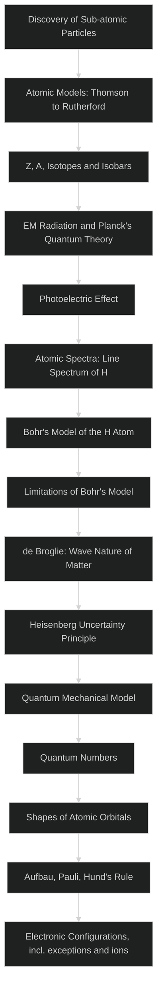
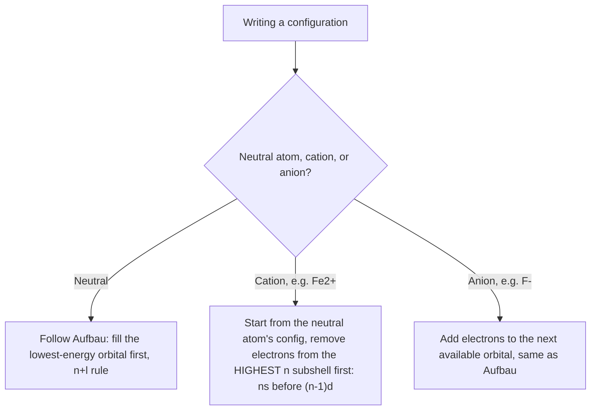

# CHAPTER 2: STRUCTURE OF ATOM

### Physical Chemistry | Complete Study Notes | Board · NEET · JEE Layered

---

## 🗺️ CONCEPT ROADMAP



Each box is one numbered section below (§1–§13); the chain runs prerequisite → concept → application, e.g. the *failure* of Rutherford's model (§2) is exactly what motivates Bohr's postulates (§6), and Bohr's own failure (§6.3) is what motivates de Broglie and Heisenberg (§7), which in turn motivate the Schrödinger picture (§8).

---

## SECTION 1 — DISCOVERY OF SUB-ATOMIC PARTICLES

### 1.1 Cathode Ray Discharge Tube Experiments

*"The cathode ray tube gave humanity its first window into the structure of the atom."*

**Setup:**

* A glass tube containing two metallic electrodes (cathode: −ve, anode: +ve)
* Gas at very low pressure (∼10⁻⁴ atm); very high voltage applied across electrodes
* Fluorescent coating of **zinc sulphide (ZnS)** placed behind the anode detects rays

```tikz
\usetikzlibrary{arrows.meta}
\begin{tikzpicture}[>={Stealth[length=6pt,width=4pt]}, thick, scale=1.0]
  \draw[line width=1.2pt] (0,0) rectangle (7,1.6);
  \draw[line width=2.2pt] (0.3,0.3) -- (0.3,1.3);
  \node[below, font=\small] at (0.3,-0.15) {Cathode ($-$)};
  \draw[line width=2.2pt] (5.2,0.3) -- (5.2,0.75);
  \draw[line width=2.2pt] (5.2,1.05) -- (5.2,1.3);
  \node[below, font=\small] at (5.2,-0.15) {Perforated anode ($+$)};
  \draw[->, blue!60!black, line width=1.4pt] (0.35,0.8) -- (5.15,0.8);
  \draw[->, blue!60!black, line width=1.4pt] (5.25,0.8) -- (6.9,0.8);
  \node[above, font=\small, text=blue!60!black] at (2.7,0.95) {cathode rays};
  \draw[line width=3pt, green!40!black] (6.9,0.2) -- (6.9,1.4);
  \node[right, font=\small] at (6.95,0.8) {ZnS screen};
  \node[below, font=\itshape\small, text=gray] at (3.5,-0.9) {Low-pressure gas, high voltage: rays travel cathode $\to$ anode, pass through the hole, strike the fluorescent screen};
\end{tikzpicture}
```
The rays travel in straight lines (Section 1.1's third observation) until deflected by an external field — that straight-line path is what the fluorescent screen is recording.

**Key Observations:**

* Cathode rays travel from **cathode → anode** in straight lines
* They are **NOT visible** themselves; detected by fluorescent/phosphorescent materials
* In electric/magnetic fields → rays deflect like **negatively charged particles**
* Properties are **independent** of:
  * The material of the electrodes
  * The nature of the gas in the tube

> **Conclusion:** All matter contains **negatively charged particles** called **electrons** — a fundamental constituent of every atom. `[Board]`

### 1.2 Thomson's Measurement of e/mₑ Ratio `[Board · NEET]`

**Scientist:** J.J. Thomson (1897) | Nobel Prize in Physics, 1906

**Method:** Applied electric field (E) and magnetic field (B) perpendicular to each other and to the electron beam.

* Electric field only → electrons deflect to point **A**
* Magnetic field only → electrons deflect to point **C**
* Both fields balanced → electrons travel straight to point **B**

By measuring the deflection, Thomson determined:

$$
\boxed{\frac{e}{m_e} = 1.758820 \times 10^{11} \text{ C kg}^{-1}}
$$

> ⚠️ **Common Mistake:** e/mₑ is the ratio of charge to mass. A larger e/mₑ means a lighter particle for the same charge — electrons are extremely light.

### 1.3 Millikan's Oil Drop Experiment — Charge on Electron `[Board · NEET]`

**Scientist:** R.A. Millikan (1906–14)

**Principle:**

* Tiny oil droplets ionised by X-rays acquire electric charge
* Droplet behaviour under combined gravitational + electric force measured
* Charge on droplets always found to be an **integral multiple of a basic unit:**

$$
\boxed{q = ne, \quad n = 1, 2, 3, \ldots}
$$

**Result:** Charge on electron = **−1.602176 × 10⁻¹⁹ C**

**Mass of electron** (combining Millikan's result with Thomson's e/mₑ):

$$
\boxed{m_e = \frac{e}{e/m_e} = \frac{1.602176 \times 10^{-19}}{1.758820 \times 10^{11}} = 9.1094 \times 10^{-31} \text{ kg}}
$$

### 1.4 Discovery of Protons — Canal Rays `[Board]`

**Observation:** When holes are made in the cathode of a discharge tube, rays flow **backward through the holes** — these are **canal rays** (positively charged).

**Properties of Canal Rays (contrast with cathode rays):**

| Property                | Cathode Rays           | Canal Rays          |
| ----------------------- | ---------------------- | ------------------- |
| Charge                  | Negative (−ve)        | Positive (+ve)      |
| Mass                    | Same regardless of gas | Depends on gas used |
| e/m ratio               | Constant               | Varies with gas     |
| Deflection in E/B field | Toward +ve plate       | Toward −ve plate   |

**Lightest positive ion** obtained from **hydrogen gas** → called  **proton** , characterised in  **1919** .

### 1.5 Discovery of Neutrons — Chadwick (1932) `[Board]`

**Experiment:** Bombarded thin beryllium sheet with α-particles:

```
α-particles + ⁹₄Be → ¹²₆C + ¹₀n
```

**Electrically neutral particles** with mass slightly greater than proton → named  **neutrons** .

> 🔑 **Memory Hook — Discovery Order:**
>
> ```
> Electron (1897, Thomson) → Proton (1919, Rutherford) → Neutron (1932, Chadwick)
> ```

### 1.6 Properties of Fundamental Particles `[Board · NEET]`

| Particle           | Symbol | Absolute Charge (C)    | Relative Charge | Mass (kg)            | Mass (u) | Approx. Mass (u) |
| ------------------ | ------ | ---------------------- | --------------- | -------------------- | -------- | ---------------- |
| **Electron** | e      | −1.602176 × 10⁻¹⁹ | −1             | 9.109382 × 10⁻³¹ | 0.00054  | ≈ 0             |
| **Proton**   | p      | +1.602176 × 10⁻¹⁹  | +1              | 1.672622 × 10⁻²⁷ | 1.00727  | ≈ 1             |
| **Neutron**  | n      | 0                      | 0               | 1.674927 × 10⁻²⁷ | 1.00867  | ≈ 1             |

> **Key value to memorise:** Mass of electron =  **9.1 × 10⁻³¹ kg** ; Mass of proton ≈ Mass of neutron ≈ **1.67 × 10⁻²⁷ kg** (proton is ~1836× heavier than electron) `[NEET]`

---

## SECTION 2 — ATOMIC MODELS

### 2.1 Thomson's Model of Atom (1898) — "Plum Pudding Model" `[Board]`

**Proposal:**

* Atom is a **uniform sphere of positive charge** (radius ≈ 10⁻¹⁰ m)
* Electrons are **embedded** into this positive sphere like plums in a pudding (also called: raisin pudding / watermelon model)
* Mass of atom is uniformly distributed throughout the atom

```tikz
\begin{tikzpicture}[thick, scale=1.0]
  \fill[orange!25] (0,0) circle (1.6);
  \draw[orange!70!black, line width=1pt] (0,0) circle (1.6);
  \fill[blue!70!black] (0.5,0.6) circle (2.5pt);
  \fill[blue!70!black] (-0.6,0.4) circle (2.5pt);
  \fill[blue!70!black] (0.2,-0.5) circle (2.5pt);
  \fill[blue!70!black] (-0.5,-0.7) circle (2.5pt);
  \fill[blue!70!black] (0.9,-0.3) circle (2.5pt);
  \fill[blue!70!black] (-1.0,0.9) circle (2.5pt);
  \fill[blue!70!black] (0,1.1) circle (2.5pt);
  \node[below, font=\itshape\small, text=gray] at (0,-2.1) {positive charge (orange) spread uniformly through the sphere; electrons (blue) embedded like plums in a pudding};
\end{tikzpicture}
```

**Success:** Explained overall **electrical neutrality** of atom.

**Failure:** Could NOT explain Rutherford's α-particle scattering results.

> **Nobel:** J.J. Thomson received the Nobel Prize in Physics in  **1906** .

---

### 2.2 Rutherford's α-Particle Scattering Experiment (1911) `[Board · NEET]`

**Experimental Setup:**

* Source: Radioactive material emitting **α-particles** (He²⁺, high energy, +2 charge)
* Target: **Ultra-thin gold foil** (thickness ~100 nm = 1000 atoms thick)
* Detector: Circular fluorescent **zinc sulphide (ZnS)** screen around the foil

```tikz
\usetikzlibrary{arrows.meta}
\begin{tikzpicture}[>={Stealth[length=6pt,width=4pt]}, thick, scale=1.0]
  \fill[yellow!60!orange] (3.4,-1.6) rectangle (3.7,1.6);
  \node[above, font=\small] at (3.55,1.75) {Gold foil ($\sim$100 nm)};
  \fill[red!70!black] (3.55,0.05) circle (2.2pt);
  \draw[->, blue!55!black] (0,1.1) -- (7,1.1);
  \draw[->, blue!55!black] (0,0.5) -- (7,0.5);
  \draw[->, blue!55!black] (0,-1.1) -- (7,-1.1);
  \draw[->, blue!55!black] (0,-0.3) -- (3.4,-0.15) -- (7,0.6);
  \draw[->, red!70!black, line width=1.3pt] (0,0.05) -- (3.55,0.05) -- (0.6,0.75);
  \node[left, font=\small] at (0,0.05) {$\alpha$-source};
  \node[below, font=\itshape\small, text=gray] at (3.5,-2.0) {most $\alpha$-particles (blue) pass straight through; a few deflect slightly; about 1 in 20{,}000 (red) bounces back $\Rightarrow$ a small, dense, positive nucleus};
\end{tikzpicture}
```

**Observations and Their Interpretations:**

| Observation                                                    | Inference                                               |
| -------------------------------------------------------------- | ------------------------------------------------------- |
| Most α-particles passed**straight through**             | Atom is mostly**empty space**                     |
| A**small fraction**deflected at small angles             | Positive charge concentrated somewhere small            |
| A**very few**(∼1/20,000)**bounced back**(∼180°) | Extremely small,**dense, positive nucleus**exists |

> 🔑 **Rutherford's famous analogy:** "It was almost as incredible as if you fired a 15-inch shell at a sheet of tissue paper and it came back and hit you."

**Scale comparison:** If nucleus = cricket ball → atom radius ≈  **5 km** . The nucleus is 10⁵× smaller than the atom in radius → 10¹⁵× smaller in volume.

---

### 2.3 Rutherford's Nuclear Model of Atom `[Board · NEET]`

Based on the scattering experiment, Rutherford proposed:

1. The atom has a **tiny, dense, positively charged nucleus** at its centre
2. Electrons move around the nucleus in **circular orbits at very high speed** (like planets around the sun → "solar system model")
3. Nucleus + electrons held together by **electrostatic forces of attraction**

This "mini solar system" picture is qualitative here — Section 6.1 gives the quantised version (fixed orbits, fixed energies) once Bohr fixes the stability problem raised in 2.6 below.

---

### 2.4 Atomic Number (Z) and Mass Number (A) `[Board · NEET · JEE]`

$$
\boxed{\text{Atomic Number (Z)} = \text{Number of protons} = \text{Number of electrons (neutral atom)}}
$$

$$
\boxed{\text{Mass Number (A)} = \text{Number of protons (Z)} + \text{Number of neutrons (n)}}
$$

$$
\boxed{\text{Number of neutrons} = A - Z}
$$

**Nuclear symbol notation:**

$$
\boxed{^A_Z X}
$$

where X = element symbol, A = mass number (superscript, left), Z = atomic number (subscript, left)

**Worked Example:**

For $^{80}_{35}$Br:

* Z = 35 → protons = electrons = **35**
* Neutrons = 80 − 35 = **45**

> ⚠️ **For Ions:** Number of electrons ≠ Z
>
> * Cation (e.g., Na⁺): electrons = Z − charge
> * Anion (e.g., Cl⁻): electrons = Z + charge
> * Neutrons = A − Z (always, regardless of ionic state)

---

### 2.5 Isobars and Isotopes `[Board · NEET]`

| Term               | Definition                                              | Example                                       |
| ------------------ | ------------------------------------------------------- | --------------------------------------------- |
| **Isotopes** | Same Z (same element), different A (different neutrons) | ¹H (protium), ²H (deuterium), ³H (tritium) |
| **Isobars**  | Different Z (different elements), same A                | ¹⁴₆C and ¹⁴₇N                           |

**Isotopes of hydrogen:**

| Isotope   | Name      | Protons | Neutrons | Abundance |
| --------- | --------- | ------- | -------- | --------- |
| ¹₁H     | Protium   | 1       | 0        | 99.985%   |
| ²₁H (D) | Deuterium | 1       | 1        | 0.015%    |
| ³₁H (T) | Tritium   | 1       | 2        | Trace     |

**Isotopes of carbon:** ¹²₆C (6n), ¹³₆C (7n), ¹⁴₆C (8n)
**Isotopes of chlorine:** ³⁵₁₇Cl (18n), ³⁷₁₇Cl (20n)

> 🔑 **Key Fact:** Isotopes have **same chemical properties** (same number of electrons → same electronic configuration). Different physical properties (different masses). `[NEET]`

---

### 2.6 Drawbacks of Rutherford's Model `[Board · NEET]`

**Drawback 1 — Atomic Instability:**

* According to Maxwell's electromagnetic theory, a **charged particle undergoing acceleration emits radiation**
* An electron in circular orbit continuously changes direction → acceleration → should emit radiation continuously
* Energy loss → electron spirals inward → collapses into nucleus in **∼10⁻⁸ s**
* But atoms are **stable** — contradiction!

**Drawback 2 — No Explanation of Atomic Spectra:**

* If electrons spiral inward, they would emit radiation of **continuously changing frequency** → continuous spectrum
* But atoms emit **line spectra** (discrete frequencies) — unexplained

**Drawback 3 — No Information on Electron Distribution:**

* Model silent about how electrons are arranged around nucleus, their energies, or their behaviour

> ⚠️ **Board Trap:** Rutherford's model resembles the solar system but CANNOT explain atomic stability — this is the most commonly tested limitation.

---

## SECTION 3 — ELECTROMAGNETIC RADIATION

### 3.1 Wave Nature of EM Radiation `[Board · NEET]`

**James Clerk Maxwell (1870):** When a charged particle accelerates, alternating electric (E) and magnetic (B) fields are produced and transmitted as  **electromagnetic waves** .

**Key Properties:**

* Electric field (E) and magnetic field (B) are **perpendicular to each other** and to the **direction of propagation**
* EM waves do **NOT require a medium** — they travel through vacuum
* All EM waves travel at the **speed of light** in vacuum:

$$
\boxed{c = 3.0 \times 10^8 \text{ m s}^{-1}}
$$

**Fundamental Wave Relationship:**

$$
\boxed{c = \nu \lambda}
$$

where:

* ν (nu) = frequency (Hz = s⁻¹) — number of waves passing a point per second
* λ (lambda) = wavelength (m) — distance between successive crests/troughs
* **Wavenumber** $\bar{\nu} = \frac{1}{\lambda}$ (unit: m⁻¹, commonly cm⁻¹)

### 3.2 The Electromagnetic Spectrum `[Board · NEET]`

```tikz
\usetikzlibrary{arrows.meta}
\begin{tikzpicture}[>={Stealth[length=6pt,width=4pt]}, thick, scale=1.0]
  \draw[->, red!70!black, line width=1.4pt] (0,2.0) -- (9.8,2.0) node[midway, above, font=\small, text=red!70!black] {increasing frequency, increasing energy};
  \draw (0,0) rectangle (1.4,1.2); \node[font=\tiny] at (0.7,0.6) {radio};
  \draw (1.4,0) rectangle (2.6,1.2); \node[font=\tiny] at (2.0,0.6) {micro};
  \draw (2.6,0) rectangle (3.8,1.2); \node[font=\tiny] at (3.2,0.6) {IR};
  \draw[fill=violet!25] (3.8,0) rectangle (4.6,1.2); \node[font=\tiny] at (4.2,0.6) {vis};
  \draw (4.6,0) rectangle (5.8,1.2); \node[font=\tiny] at (5.2,0.6) {UV};
  \draw (5.8,0) rectangle (7.4,1.2); \node[font=\tiny] at (6.6,0.6) {X-ray};
  \draw (7.4,0) rectangle (9.8,1.2); \node[font=\tiny] at (8.6,0.6) {$\gamma$-ray};
  \node[below, font=\tiny] at (0.7,-0.15) {$10^{6}$Hz};
  \node[below, font=\tiny] at (2.0,-0.15) {$10^{10}$};
  \node[below, font=\tiny] at (3.2,-0.15) {$10^{13}$};
  \node[below, font=\tiny] at (4.2,-0.15) {$10^{15}$};
  \node[below, font=\tiny] at (5.2,-0.15) {$10^{16}$};
  \node[below, font=\tiny] at (6.6,-0.15) {$10^{18}$};
  \node[below, font=\tiny] at (8.6,-0.15) {$10^{24}$};
  \node[below, font=\itshape\small, text=gray] at (4.9,-0.9) {visible light (shaded) is only a thin sliver of the full spectrum: 400 nm (violet) to 750 nm (red)};
\end{tikzpicture}
```

**Visible light region:** ~4.0 × 10¹⁴ Hz (red) to 7.5 × 10¹⁴ Hz (violet)
Wavelength: **400 nm (violet) to 750 nm (red)**

**Important Frequency Benchmarks:**

| Region           | Frequency  | Use                   |
| ---------------- | ---------- | --------------------- |
| Radio (AM)       | ~10⁶ Hz   | Broadcasting          |
| Microwave        | ~10¹⁰ Hz | Radar, cooking        |
| Infrared (IR)    | ~10¹³ Hz | Heating, spectroscopy |
| Visible          | ~10¹⁵ Hz | Vision                |
| Ultraviolet (UV) | ~10¹⁶ Hz | Sun's radiation       |
| X-rays           | ~10¹⁸ Hz | Medical imaging       |
| γ-rays          | ~10²⁴ Hz | Nuclear processes     |

> 🔑 **NEET Shortcut:** ROYGBIV — Red Orange Yellow Green Blue Indigo Violet (increasing frequency/energy within visible range)

---

## SECTION 4 — PLANCK'S QUANTUM THEORY & PHOTOELECTRIC EFFECT

### 4.1 Black Body Radiation & Planck's Quantum Theory `[Board · NEET · JEE]`

**Black Body:** An ideal body that absorbs and emits radiation of all frequencies uniformly.

* At given temperature: intensity increases with wavelength, peaks at a specific λ, then decreases
* As temperature increases: peak shifts to **shorter wavelengths** (higher energy)

```desmos
c_{2}=1.4388\times10^{7}
T_{1}=4000
T_{2}=6000
f\left(\lambda\right)=\frac{1}{\lambda^{5}\left(e^{\frac{c_{2}}{\lambda T_{1}}}-1\right)}
g\left(\lambda\right)=\frac{1}{\lambda^{5}\left(e^{\frac{c_{2}}{\lambda T_{2}}}-1\right)}
```
*Legend:* `c_2` = second radiation constant `hc/k_B ≈ 1.4388×10⁷ nm·K`, `T_1`/`T_2` = absolute temperature in K (sliders, `T_2 > T_1`), `λ` = wavelength in nm, `f(λ)`/`g(λ)` = relative spectral intensity (Planck's law, unnormalised — only the shape matters, exactly as NCERT Fig. 2.8 plots "Intensity" with no numeric axis).
*Try this:* drag `T_2` higher — the peak shifts to shorter wavelength and grows taller, which is Wien's displacement law (`λ_max·T` = constant) falling straight out of Planck's formula.

**Planck's Hypothesis (1900):**
Atoms/molecules can emit or absorb energy  **only in discrete packets (quanta)** , not continuously.

> **Quantum** = smallest discrete packet of energy that can be emitted/absorbed in the form of EM radiation.

$$
\boxed{E = h\nu}
$$

where **h = Planck's constant = 6.626 × 10⁻³⁴ J·s**

**Quantisation analogy:**

```
Energy levels like stairs — can stand on any step but NOT between steps.
E = 0, hν, 2hν, 3hν, ... nhν (allowed values)
      ↑cannot be between these
```

### 4.2 The Photoelectric Effect `[Board · NEET · JEE]`

**Observation (Hertz, 1887):** When certain metals (K, Rb, Cs) are exposed to light of sufficient frequency, electrons are  **immediately ejected** .

**Three Experimental Results (unexplained by wave theory):**

| Observation                                                   | Wave Theory Prediction                         | Einstein's Quantum Explanation                          |
| ------------------------------------------------------------- | ---------------------------------------------- | ------------------------------------------------------- |
| Electrons ejected**instantly**(no time lag)             | Should take time to accumulate energy          | Photon transfers energy instantly in one collision      |
| Number of ejected electrons ∝**intensity**(brightness) | Same                                           | More photons → more electrons                          |
| KE of electrons ∝**frequency** , NOT intensity         | KE should depend on brightness                 | Each photon has energy hν; excess energy → KE         |
| Below threshold frequency ν₀ →**no electrons**       | Always should be emitted with enough intensity | Photon must have minimum energy hν₀ to eject electron |

**Einstein's Equation (1905):** `[NEET · JEE most tested]`

$$
\boxed{h\nu = h\nu_0 + \frac{1}{2}m_e v^2}
$$

Where:

* hν = energy of incident photon
* hν₀ = **work function** (W₀) = minimum energy to eject electron from metal surface (= threshold energy)
* ½mₑv² = kinetic energy of ejected photoelectron
* ν₀ = **threshold frequency** (minimum frequency for photoelectric effect)

```tikz
\usetikzlibrary{arrows.meta}
\begin{tikzpicture}[>={Stealth[length=6pt,width=4pt]}, thick, scale=0.9]
  \draw[->, line width=1pt] (-0.3,0) -- (5,0) node[right, font=\small] {Intensity};
  \draw[->, line width=1pt] (0,-0.3) -- (0,2.6) node[above, font=\small] {K.E. of photoelectron};
  \draw[blue!60!black, line width=1.6pt] (0.3,1.4) -- (4.6,1.4);
  \node[below, font=\itshape\small, text=gray] at (2.3,-0.8) {K.E. is flat with intensity -- only the *number* of photoelectrons rises with intensity, not their energy};
\end{tikzpicture}
```

```desmos
k=0.4136
n_{0}=5
f\left(n\right)=k\left(n-n_{0}\right)\left\{n\ge n_{0}\right\}
n_{now}=7
P=\left(n_{now},f\left(n_{now}\right)\right)
```
*Legend:* `n` = frequency of incident light in units of 10¹⁴ Hz, `n_0` = threshold frequency (slider; default 5 matches NCERT's own potassium example, ν₀ = 5.0×10¹⁴ Hz), `k` = Planck's constant expressed as eV per unit of `n`, i.e. `h × 10¹⁴ = 0.4136 eV`, `f(n)` = photoelectron kinetic energy in eV (undefined/zero below threshold), `P` = a draggable point (`n_now`) to read off K.E. at a chosen frequency.
*Try this:* drag `n_0` to the right (a metal with a larger work function) and watch the whole line's x-intercept move right with it — nothing is emitted until `n` catches up; drag `n_now` past the intercept and read the linear K.E. growth directly, which is Einstein's equation `hν = hν₀ + K.E.` traced out as a straight line of slope `h`.

**Work Function Values (important for NEET):**

| Metal | W₀ (eV) |
| ----- | -------- |
| Li    | 2.42     |
| Na    | 2.30     |
| K     | 2.25     |
| Mg    | 3.70     |
| Cu    | 4.80     |
| Ag    | 4.30     |

> ⚠️ **Common Mistake:** Increasing intensity (brightness) increases the NUMBER of ejected electrons, NOT their kinetic energy. Only increasing frequency increases KE. `[NEET trap]`

### 4.3 Dual Nature of Electromagnetic Radiation `[Board · NEET]`

| Phenomenon                                 | Explained By              |
| ------------------------------------------ | ------------------------- |
| Diffraction, interference                  | Wave nature               |
| Photoelectric effect, black body radiation | Particle nature (photons) |

> **Conclusion:** Light exhibits both wave and particle nature —  **wave-particle duality** . The nature observed depends on the type of experiment.

**Photon:** A particle of light carrying energy E = hν and momentum p = h/λ.

---

## SECTION 5 — ATOMIC SPECTRA

### 5.1 Types of Spectra `[Board · NEET]`

**Continuous Spectrum:**

* White light through a prism → continuous band of colours (ROYGBIV)
* All wavelengths in visible range present

**Emission Spectrum (Line Spectrum):**

* Energy supplied to atoms (heat/electric discharge) → atoms excited
* Excited atoms emit light at **discrete specific wavelengths** → bright lines on dark background
* Each element has a **unique line emission spectrum** (fingerprint of element)

**Absorption Spectrum:**

* White light passed through unexcited gas → certain wavelengths absorbed
* Dark lines on continuous spectrum (complementary to emission spectrum)

> 🔑 **Application:** Spectroscopy used to identify unknown elements. Elements Rb, Cs, Tl, In, Ga, Sc discovered by spectroscopy. Helium (He) discovered in **sun** by spectroscopy!

### 5.2 Line Spectrum of Hydrogen `[Board · NEET · JEE]`

When electric discharge passed through H₂ gas → H₂ dissociates → excited H atoms emit radiation at discrete frequencies.

**Balmer (1885)** — first to find a pattern for visible hydrogen lines:

$$
\boxed{\bar{\nu} = 109{,}677\left(\frac{1}{2^2} - \frac{1}{n^2}\right) \text{ cm}^{-1}, \quad n = 3, 4, 5, \ldots}
$$

**Rydberg (general formula for all series):**

$$
\boxed{\bar{\nu} = 109{,}677\left(\frac{1}{n_1^2} - \frac{1}{n_2^2}\right) \text{ cm}^{-1}}
$$

where n₁ = 1, 2, 3... and n₂ = n₁+1, n₁+2, ...

**Rydberg constant for hydrogen: R_H = 109,677 cm⁻¹ = 1.09677 × 10⁷ m⁻¹**

### 5.3 Spectral Series of Hydrogen `[Board · NEET]`

| Series             | n₁ | n₂        | Spectral Region       | Discovery |
| ------------------ | --- | ---------- | --------------------- | --------- |
| **Lyman**    | 1   | 2, 3, 4... | **Ultraviolet** | Lyman     |
| **Balmer**   | 2   | 3, 4, 5... | **Visible**     | Balmer    |
| **Paschen**  | 3   | 4, 5, 6... | **Infrared**    | Paschen   |
| **Brackett** | 4   | 5, 6, 7... | **Infrared**    | Brackett  |
| **Pfund**    | 5   | 6, 7, 8... | **Infrared**    | Pfund     |

```tikz
\usetikzlibrary{arrows.meta}
\begin{tikzpicture}[>={Stealth[length=5pt,width=3.5pt]}, thick, scale=0.85]
  \draw (0,0) -- (10,0) node[right, font=\small] {$n=1$};
  \draw (0,3) -- (10,3) node[right, font=\small] {$n=2$};
  \draw (0,5) -- (10,5) node[right, font=\small] {$n=3$};
  \draw (0,6.2) -- (10,6.2) node[right, font=\small] {$n=4$};
  \draw (0,7) -- (10,7) node[right, font=\small] {$n=5$};
  \draw (0,7.6) -- (10,7.6) node[right, font=\small] {$n=6$};
  \draw[dashed] (0,8.6) -- (10,8.6) node[right, font=\small] {$n=\infty$ ($E=0$)};
  \draw[->, violet] (0.8,3) -- (0.8,0.1);
  \draw[->, violet] (1.4,5) -- (1.4,0.1);
  \draw[->, violet] (2.0,6.2) -- (2.0,0.1);
  \node[violet, font=\tiny] at (1.4,-0.5) {Lyman (UV)};
  \draw[->, blue!70!black] (3.0,5) -- (3.0,3.1);
  \draw[->, blue!70!black] (3.6,6.2) -- (3.6,3.1);
  \draw[->, blue!70!black] (4.2,7) -- (4.2,3.1);
  \node[blue!70!black, font=\tiny] at (3.6,2.5) {Balmer (Vis)};
  \draw[->, orange!80!black] (5.2,6.2) -- (5.2,5.1);
  \draw[->, orange!80!black] (5.8,7) -- (5.8,5.1);
  \node[orange!80!black, font=\tiny] at (5.5,4.6) {Paschen (IR)};
  \draw[->, teal] (6.8,7) -- (6.8,6.3);
  \draw[->, teal] (7.3,7.6) -- (7.3,6.3);
  \node[teal, font=\tiny] at (7.05,5.9) {Brackett (IR)};
  \draw[->, brown] (8.3,7.6) -- (8.3,7.1);
  \node[brown, font=\tiny] at (8.3,6.8) {Pfund (IR)};
  \node[below, font=\itshape\small, text=gray] at (5,-1.3) {level spacing shrinks as $n$ increases ($E_n \propto -1/n^2$); every downward arrow is one spectral line};
\end{tikzpicture}
```

> 🔑 **Memory Hook for Series Regions:**
>
> ```
> "Lazy Boys Play Basketball Far" → Lyman(UV), Balmer(Visible), Paschen(IR), Brackett(IR), Far-Pfund(IR)
> ```

> ⚠️ **Balmer series** is the ONLY series in the **visible** region — frequently tested!

### 5.4 Counting the Number of Spectral Lines `[NEET · JEE — high-yield, not in the NCERT text]`

When an electron sitting at some excited level n₂ cascades all the way down to a lower level n₁ — falling through every intermediate level on the way rather than jumping straight there — each pair of levels it passes between produces one distinct line. Choosing any 2 of the (Δn + 1) levels available gives:

$$
\boxed{\text{Maximum number of spectral lines} = \binom{\Delta n + 1}{2} = \frac{\Delta n(\Delta n + 1)}{2}}, \qquad \Delta n = n_2 - n_1
$$

**Special case** — falling all the way to the ground state (n₁ = 1) from level n reduces this to the more commonly quoted **n(n − 1)/2**.

**Worked Example (New):** Maximum number of emission lines when an excited electron in an H atom at n = 6 drops to the ground state.
Δn = 6 − 1 = 5 → lines = (5 × 6)/2 = **15**

**Worked Example (New):** Maximum number of emission lines when an excited electron in an H atom at n = 5 drops to n = 2.
Δn = 5 − 2 = 3 → lines = (3 × 4)/2 = **6**

> ⚠️ **Common Mistake:** This formula counts *every* line in the whole cascade, not the single line from a named direct transition. "Find the wavelength of the photon emitted during the transition n = 5 to n = 2" (NCERT Problem 2.10) is ONE line via the Rydberg equation; "the *maximum number* of lines when an excited electron at n = 5 drops (eventually) to n = 2" is the cascade count above. Read the question carefully before reaching for this formula. `[NEET trap]`

---

## SECTION 6 — BOHR'S MODEL FOR HYDROGEN ATOM

### 6.1 Neils Bohr (1913) — Four Postulates `[Board · NEET · JEE]`

> **Context:** Bohr used Planck's quantisation concept to fix the drawbacks of Rutherford's model.

**Postulate 1 — Stationary Orbits:**
The electron in hydrogen atom moves in circular orbits of **fixed radius and energy** called **stationary states** or  **allowed energy states** . These orbits are **arranged concentrically** around the nucleus.

**Postulate 2 — Energy Constancy:**
The energy of electron in an orbit does NOT change with time. Energy is absorbed only when electron **jumps to higher orbit** and emitted only when it  **falls to lower orbit** . This energy change is NOT continuous.

**Postulate 3 — Bohr's Frequency Rule:**

$$
\boxed{\nu = \frac{\Delta E}{h} = \frac{E_2 - E_1}{h}}
$$

The frequency of radiation absorbed/emitted equals the energy difference divided by Planck's constant.

**Postulate 4 — Quantised Angular Momentum:**
The angular momentum of an electron in an allowed orbit is an  **integral multiple of h/2π** :

$$
\boxed{m_e v r = n\frac{h}{2\pi}, \quad n = 1, 2, 3, \ldots}
$$

where n is the  **principal quantum number** . This is why only certain orbits are allowed!

```tikz
\usetikzlibrary{arrows.meta}
\begin{tikzpicture}[>={Stealth[length=6pt,width=4pt]}, thick, scale=1.0]
  \fill[red!70!black] (0,0) circle (3pt);
  \node[below, font=\small] at (0,-0.2) {nucleus};
  \draw[gray] (0,0) circle (1.0);
  \node[gray, font=\tiny] at (0.75,0.75) {$n=1$};
  \draw[gray] (0,0) circle (1.8);
  \node[gray, font=\tiny] at (1.35,1.35) {$n=2$};
  \draw[gray] (0,0) circle (2.5);
  \node[gray, font=\tiny] at (1.9,1.9) {$n=3$};
  \fill[blue!30] (2.5,0) circle (2.5pt);
  \node[blue!70!black, font=\small] at (2.5,-0.4) {e$^-$ starts at $n=3$};
  \draw[->, orange!80!black, line width=1.3pt] (2.5,0.15) -- (1.8,0.15);
  \node[orange!80!black, font=\small] at (2.15,0.45) {$h\nu$};
  \fill[blue!70!black] (1.8,0) circle (2.5pt);
  \node[below, font=\itshape\small, text=gray] at (0,-3.0) {electron drops from $n=3$ to $n=2$: a photon of energy $h\nu=E_3-E_2$ is emitted (Postulate 3); it can only ever sit on one of these fixed circles, never in between (Postulate 1)};
\end{tikzpicture}
```

---

### 6.2 Key Equations from Bohr's Model `[NEET · JEE]`

**Radius of nth orbit (for hydrogen):**

$$
\boxed{r_n = n^2 a_0}
$$

where **a₀ = 52.9 pm = 0.529 Å** (Bohr radius = radius of first orbit)

So: r₁ = 52.9 pm, r₂ = 4 × 52.9 = 211.6 pm, r₃ = 9 × 52.9 = 476.1 pm

**Energy of electron in nth orbit (for hydrogen):**

$$
\boxed{E_n = -R_H\left(\frac{1}{n^2}\right) \text{ J}, \quad n = 1, 2, 3, \ldots}
$$

where **R_H = 2.18 × 10⁻¹⁸ J** (Rydberg constant in energy units)

| n  | Energy (J)          | Description                |
| -- | ------------------- | -------------------------- |
| 1  | −2.18 × 10⁻¹⁸  | Ground state (most stable) |
| 2  | −0.545 × 10⁻¹⁸ | First excited state        |
| 3  | −0.242 × 10⁻¹⁸ | Second excited state       |
| ∞ | 0                   | Ionised (electron free)    |

> 🔑 **Why negative energy?** Energy is measured relative to free electron (at infinity = 0 J). Bound electrons have lower energy → negative. More negative = more stable = lower n.

**For hydrogen-like species (He⁺, Li²⁺, Be³⁺, etc.):** `[JEE]`

$$
\boxed{E_n = -2.18 \times 10^{-18}\left(\frac{Z^2}{n^2}\right) \text{ J}}
$$

$$
\boxed{r_n = \frac{52.9 \cdot n^2}{Z} \text{ pm}}
$$

where Z = atomic number of the ion.

**Energy difference for transition (emission/absorption):**

$$
\boxed{\Delta E = R_H\left(\frac{1}{n_i^2} - \frac{1}{n_f^2}\right) = 2.18 \times 10^{-18}\left(\frac{1}{n_i^2} - \frac{1}{n_f^2}\right) \text{ J}}
$$

* If n_f > n_i → ΔE positive → **energy absorbed** (transition to higher orbit)
* If n_f < n_i → ΔE negative → **energy emitted** (transition to lower orbit)

> ⚠️ **Common Mistake in NEET:**
>
> * Absorption: n_i < n_f → electron goes UP
> * Emission: n_i > n_f → electron comes DOWN
>   The formula gives magnitude; always check direction physically.

---

### 6.3 Limitations of Bohr's Model `[Board · NEET]`

1. **Fails for multi-electron atoms** — cannot explain spectrum of He, Li, etc. (electron–electron repulsion ignored)
2. **Cannot explain fine structure** — doublet/triplet lines in H spectrum under high-resolution spectroscopy
3. **Cannot explain Zeeman effect** — splitting of spectral lines in magnetic field
4. **Cannot explain Stark effect** — splitting of spectral lines in electric field
5. **Cannot explain chemical bonding** — no explanation of how atoms form molecules
6. **Ignores wave nature of electron** — treats electron purely as a particle in a defined path
7. **Contradicts Heisenberg Uncertainty Principle** — assumes both exact position AND velocity of electron are known simultaneously

---

## SECTION 7 — TOWARDS QUANTUM MECHANICAL MODEL

### 7.1 de Broglie's Hypothesis — Dual Behaviour of Matter (1924) `[NEET · JEE]`

**Logic:** If light (wave) has particle properties (photon), can matter (particles) have wave properties?

**de Broglie's Proposal:** Every object in motion has an associated wavelength.

$$
\boxed{\lambda = \frac{h}{mv} = \frac{h}{p}}
$$

where:

* λ = de Broglie wavelength
* h = Planck's constant = 6.626 × 10⁻³⁴ J·s
* m = mass of particle (kg)
* v = velocity of particle (m s⁻¹)
* p = momentum = mv

**Key Observations:**

| Object        | Mass               | Speed     | λ                                    |
| ------------- | ------------------ | --------- | ------------------------------------- |
| Ball (0.1 kg) | 0.1 kg             | 10 m/s    | 6.626 × 10⁻³⁴ m (unmeasurable!)   |
| Electron      | 9.1 × 10⁻³¹ kg | ~10⁶ m/s | ~10⁻¹⁰ m (measurable, X-ray scale) |

> 🔑 **Critical Insight:** de Broglie wavelength is significant ONLY for **microscopic particles** (electrons, protons). For macroscopic objects, λ is so tiny it has no practical significance. `[NEET]`

**Experimental confirmation:** Electron beam undergoes **diffraction** (wave property) — used in **electron microscope** (magnification ~15 million times).

**Connecting de Broglie to Bohr's Postulate `[Board — common derivation question, not spelled out in NCERT's own text]`**

Bohr simply *assumed* quantised angular momentum (Postulate 4, §6.1) without proving it. Once de Broglie's relation is available, that postulate stops being an assumption and becomes a derivation:

Model the electron's orbit as a standing wave. For the wave not to cancel itself out after one full trip around the circle, the circumference must hold a whole number of wavelengths:

$$
2\pi r = n\lambda, \qquad n = 1, 2, 3, \ldots
$$

Substitute de Broglie's λ = h/(mv):

$$
2\pi r = n\frac{h}{mv} \quad\Longrightarrow\quad \boxed{m v r = \frac{nh}{2\pi}}
$$

— exactly Bohr's fourth postulate. Angular momentum quantisation isn't an independent assumption at all; it falls straight out of treating the electron as a de Broglie standing wave.

> 🔑 This derivation is itself a frequently-asked 2–3 mark question: *"Derive Bohr's postulate of quantisation of angular momentum from de Broglie's hypothesis."*

### 7.2 Heisenberg's Uncertainty Principle (1927) `[NEET · JEE]`

**Statement:** It is **impossible to simultaneously determine** both the exact position AND exact momentum (velocity) of an electron.

$$
\boxed{\Delta x \cdot \Delta p_x \geq \frac{h}{4\pi}}
$$

$$
\boxed{\Delta x \cdot \Delta v_x \geq \frac{h}{4\pi m}}
$$

where:

* Δx = uncertainty in position
* Δpₓ = uncertainty in momentum
* Δvₓ = uncertainty in velocity
* m = mass of particle

**Interpretation:**

```
If Δx ↓ (position known precisely) → Δv ↑ (velocity highly uncertain)
If Δv ↓ (velocity known precisely) → Δx ↑ (position highly uncertain)
```

**Significance for macroscopic vs microscopic objects:**

For a milligram object (m = 10⁻⁶ kg):

* Δv · Δx = h/(4πm) = 6.626×10⁻³⁴ / (4π × 10⁻⁶) ≈ 10⁻²⁸ m²s⁻¹ → negligible, no real constraint

For an electron (m = 9.1 × 10⁻³¹ kg):

* Δv · Δx ≈ 10⁻⁴ m²s⁻¹ → **enormous** uncertainty, very real constraint

> 🔑 **WHY Bohr's Model fails (Heisenberg's reason):** Bohr assumes electrons move in **defined circular paths** — this requires knowing BOTH exact position and exact velocity at every instant. Heisenberg's principle says this is **physically impossible** for electrons.

> ⚠️ **Common Mistake:** The uncertainty here is NOT due to limitations of measuring instruments. It is a **fundamental property of nature** at the quantum scale.

---

## SECTION 8 — QUANTUM MECHANICAL MODEL OF ATOM

### 8.1 Schrödinger Wave Equation (1926) `[Board · NEET — conceptual only at this level]`

**Developed independently by:** Werner Heisenberg and Erwin Schrödinger (1926)

**Schrödinger Equation:**

$$
\hat{H}\Psi = E\Psi
$$

* **Ĥ** = Hamiltonian operator (accounts for kinetic + potential energy of all particles)
* **Ψ (psi)** = wave function (mathematical function of electron coordinates)
* **E** = energy of the system

> **Important:** The wave function Ψ itself has  **no direct physical meaning** . It is a mathematical function.

### 8.2 Wave Function (Ψ) and Probability Density (Ψ²) `[NEET · JEE]`

**Max Born's interpretation:**

$$
\boxed{|\Psi|^2 \text{ at a point} = \text{Probability density of finding electron at that point}}
$$

* |Ψ|² = **probability density** (always positive)
* |Ψ|² × (small volume element) = **probability of finding electron in that volume**
* |Ψ|² is maximum at points where electron is most likely to be found

**Atomic Orbital:** The wave function Ψ corresponding to one electron in an atom. Each orbital represents a **region of space** where the probability of finding the electron is high (usually 90%).

### 8.3 Important Features of Quantum Mechanical Model `[Board · NEET]`

1. **Energy is quantised** — electrons can only have specific energy values
2. **Existence of quantised levels** is a direct result of wave-like properties of electrons
3. **Exact position and velocity** of an electron in an atom **cannot be determined simultaneously** (Heisenberg principle) → path of electron can never be known
4. **An atomic orbital** = wave function Ψ for an electron → all info about electron stored in Ψ
5. **|Ψ|² = probability density** → used to predict regions where electron is most likely to be found
6. **An orbital can hold maximum 2 electrons**

### 8.4 Nodes — Regions of Zero Probability `[NEET · JEE]`

**Node:** Region where |Ψ|² = 0 → **zero probability** of finding the electron.

| Node Type                               | Definition                                  | Formula       |
| --------------------------------------- | ------------------------------------------- | ------------- |
| **Radial nodes**(spherical nodes) | Spherical surfaces where Ψ = 0             | = n − l − 1 |
| **Angular nodes**(nodal planes)   | Planes passing through nucleus where Ψ = 0 | = l           |
| **Total nodes**                   |                                             | = n − 1      |

**Examples:**

| Orbital | n | l | Radial nodes | Angular nodes | Total nodes |
| ------- | - | - | ------------ | ------------- | ----------- |
| 1s      | 1 | 0 | 0            | 0             | 0           |
| 2s      | 2 | 0 | 1            | 0             | 1           |
| 2p      | 2 | 1 | 0            | 1             | 1           |
| 3s      | 3 | 0 | 2            | 0             | 2           |
| 3p      | 3 | 1 | 1            | 1             | 2           |
| 3d      | 3 | 2 | 0            | 2             | 2           |

> 🔑 **For ns orbitals:** number of radial nodes = n − 1 (since l = 0 for s orbitals)

---

## SECTION 9 — QUANTUM NUMBERS

### 9.1 Principal Quantum Number (n) `[Board · NEET · JEE]`

* **Positive integer:** n = 1, 2, 3, 4, ...
* Identifies the **shell** and determines the **size** and **energy** of the orbital
* For hydrogen: energy determined solely by n (Eₙ ∝ −1/n²)
* Larger n → larger orbital → electron further from nucleus → higher energy

| n | Shell | Max electrons (2n²) | Number of orbitals (n²) |
| - | ----- | -------------------- | ------------------------ |
| 1 | K     | 2                    | 1                        |
| 2 | L     | 8                    | 4                        |
| 3 | M     | 18                   | 9                        |
| 4 | N     | 32                   | 16                       |

### 9.2 Azimuthal (Angular Momentum) Quantum Number (l) `[Board · NEET · JEE]`

* Also called: **orbital angular momentum** or **subsidiary quantum number**
* Defines **shape** of the orbital
* For given n: l can have values **0, 1, 2, ... (n−1)**

| l | Subshell | Shape                                  | Max electrons |
| - | -------- | -------------------------------------- | ------------- |
| 0 | s        | Spherical                              | 2             |
| 1 | p        | Dumbbell (2 lobes)                     | 6             |
| 2 | d        | Cloverleaf (4 lobes) / double dumbbell | 10            |
| 3 | f        | Complex                                | 14            |

**Subshell notation:** `n` followed by subshell letter

*Examples:* n=2, l=0 →  **2s** ; n=3, l=2 →  **3d** ; n=4, l=3 → **4f**

**Table 9.2a — Subshell Notations:**

| n | l | Subshell | n | l | Subshell |
| - | - | -------- | - | - | -------- |
| 1 | 0 | 1s       | 3 | 2 | 3d       |
| 2 | 0 | 2s       | 4 | 0 | 4s       |
| 2 | 1 | 2p       | 4 | 1 | 4p       |
| 3 | 0 | 3s       | 4 | 2 | 4d       |
| 3 | 1 | 3p       | 4 | 3 | 4f       |

### 9.3 Magnetic Orbital Quantum Number (mₗ) `[Board · NEET · JEE]`

* Gives information about **spatial orientation** of the orbital relative to coordinate axes
* For given l: mₗ = **−l, −(l−1), ..., 0, ..., (l−1), l** → total of **(2l + 1)** values

| l | Subshell | Possible mₗ values          | Number of orbitals |
| - | -------- | ---------------------------- | ------------------ |
| 0 | s        | 0                            | 1                  |
| 1 | p        | −1, 0, +1                   | 3                  |
| 2 | d        | −2, −1, 0, +1, +2          | 5                  |
| 3 | f        | −3, −2, −1, 0, +1, +2, +3 | 7                  |

> **Total orbitals in a subshell = (2l + 1)**
> **Total orbitals in a shell = n²**

### 9.4 Spin Quantum Number (ms) `[Board · NEET]`

* Proposed by **Uhlenbeck and Goudsmit (1925)**
* Describes the **intrinsic spin** of the electron around its own axis
* Only **two values:** ms = **+½** (spin up ↑) or **−½** (spin down ↓)
* Two electrons with opposite spin in the same orbital are called **spin-paired**

### 9.5 Master Quantum Number Summary `[NEET · JEE]`

| Quantum Number | Symbol | Determines                   | Allowed Values | Physical Meaning      |
| -------------- | ------ | ---------------------------- | -------------- | --------------------- |
| Principal      | n      | Shell, size, energy (H-like) | 1, 2, 3, ...   | Distance from nucleus |
| Azimuthal      | l      | Subshell, shape              | 0 to (n−1)    | Angular momentum      |
| Magnetic       | mₗ    | Orbital orientation          | −l to +l      | Orientation in space  |
| Spin           | ms     | Electron spin direction      | +½ or −½    | Spin angular momentum |

> ⚠️ **Impossible quantum number sets (Board/NEET trap):**
>
> * n=0 → NOT allowed (n must be ≥ 1)
> * n=1, l=1 → NOT allowed (l must be < n, so max l=0 for n=1)
> * n=3, l=3 → NOT allowed (max l = n−1 = 2)
> * l=2, mₗ=3 → NOT allowed (mₗ ranges from −2 to +2 only)

---

## SECTION 10 — SHAPES OF ATOMIC ORBITALS

### 10.1 s Orbitals (l = 0) `[Board · NEET]`

* **Shape:** Spherically symmetric (sphere)
* One orbital per subshell (mₗ = 0 only)
* **Size increases** with n: 4s > 3s > 2s > 1s
* Probability density is **maximum at nucleus** for 1s; then decreases
* 2s has **1 radial node** (spherical shell of zero density inside)

```tikz
\begin{tikzpicture}[thick, scale=1.0]
  \draw[->] (0,0) -- (2.6,0) node[right, font=\tiny] {$r$};
  \draw[->] (0,0) -- (0,2.2) node[above, font=\tiny] {$\psi^2$};
  \draw[blue!60!black, line width=1.3pt, smooth] plot coordinates {(0,2.0) (0.3,1.5) (0.6,1.0) (1.0,0.55) (1.5,0.22) (2.0,0.08) (2.5,0.02)};
  \node[below, font=\small] at (1.2,-0.4) {$1s$};
  \begin{scope}[shift={(4.2,0)}]
    \draw[->] (0,0) -- (2.8,0) node[right, font=\tiny] {$r$};
    \draw[->] (0,0) -- (0,2.2) node[above, font=\tiny] {$\psi^2$};
    \draw[blue!60!black, line width=1.3pt, smooth] plot coordinates {(0,1.7) (0.3,1.0) (0.6,0.35) (0.85,0.02) (1.0,0.10) (1.3,0.42) (1.6,0.28) (2.0,0.10) (2.5,0.02)};
    \draw[dashed, gray] (0.85,0) -- (0.85,1.7);
    \node[gray, font=\tiny] at (0.85,1.95) {node};
    \node[below, font=\small] at (1.3,-0.4) {$2s$};
  \end{scope}
  \begin{scope}[shift={(8.4,0)}]
    \draw[->] (0,0) -- (2.8,0) node[right, font=\tiny] {$r$};
    \draw[->] (0,0) -- (0,2.2) node[above, font=\tiny] {$\psi^2$};
    \draw[blue!60!black, line width=1.3pt, smooth] plot coordinates {(0,0) (0.3,0.35) (0.6,0.85) (0.9,1.3) (1.2,1.55) (1.6,1.35) (2.0,0.75) (2.5,0.15)};
    \node[below, font=\small] at (1.3,-0.4) {$2p$};
  \end{scope}
  \node[below, font=\itshape\small, text=gray] at (5.5,-1.0) {1s: no radial node, falls monotonically from the nucleus · 2s: one radial node (crosses zero) then a small secondary hump · 2p: zero AT the nucleus itself (angular node there), single hump, zero radial nodes};
\end{tikzpicture}
```

### 10.2 p Orbitals (l = 1) `[Board · NEET]`

* **Shape:** Dumbbell — two **lobes** on either side of a nodal plane through nucleus
* Three orbitals (mₗ = −1, 0, +1) → **2pₓ, 2p_y, 2p_z** (along x, y, z axes)
* Equal size, shape, energy; differ only in **orientation** (mutually perpendicular)
* One **angular node** (the nodal plane through the nucleus)
* Size increases: 4p > 3p > 2p

```tikz
\begin{tikzpicture}[thick, scale=1.0]
  \draw[->, gray] (-1.4,0) -- (1.4,0) node[right, font=\tiny]{$x$};
  \draw[->, gray] (0,-1.6) -- (0,1.6) node[above, font=\tiny]{$z$};
  \fill[purple!35] (0,0.75) ellipse (0.5 and 0.7);
  \draw[purple!70!black] (0,0.75) ellipse (0.5 and 0.7);
  \fill[purple!35] (0,-0.75) ellipse (0.5 and 0.7);
  \draw[purple!70!black] (0,-0.75) ellipse (0.5 and 0.7);
  \fill[black] (0,0) circle (1.5pt);
  \node[below, font=\small] at (0,-1.9) {$p_z$};

  \begin{scope}[shift={(3.6,0)}]
    \draw[->, gray] (-1.6,0) -- (1.6,0) node[right, font=\tiny]{$x$};
    \draw[->, gray] (0,-1.4) -- (0,1.4) node[above, font=\tiny]{$z$};
    \fill[purple!35] (0.75,0) ellipse (0.7 and 0.5);
    \draw[purple!70!black] (0.75,0) ellipse (0.7 and 0.5);
    \fill[purple!35] (-0.75,0) ellipse (0.7 and 0.5);
    \draw[purple!70!black] (-0.75,0) ellipse (0.7 and 0.5);
    \fill[black] (0,0) circle (1.5pt);
    \node[below, font=\small] at (0,-1.9) {$p_x$};
  \end{scope}

  \begin{scope}[shift={(7.2,0)}]
    \draw[->, gray] (-1.4,-0.9) -- (1.4,0.9) node[right, font=\tiny]{$y$};
    \draw[->, gray] (0,-1.4) -- (0,1.4) node[above, font=\tiny]{$z$};
    \fill[purple!35] (0.6,0.4) ellipse (0.65 and 0.5);
    \draw[purple!70!black] (0.6,0.4) ellipse (0.65 and 0.5);
    \fill[purple!35] (-0.6,-0.4) ellipse (0.65 and 0.5);
    \draw[purple!70!black] (-0.6,-0.4) ellipse (0.65 and 0.5);
    \fill[black] (0,0) circle (1.5pt);
    \node[below, font=\small] at (0,-1.9) {$p_y$};
  \end{scope}

  \node[below, font=\itshape\small, text=gray] at (3.6,-2.6) {each has two lobes on opposite sides of the nucleus, separated by one nodal plane through the origin; identical in size, shape and energy -- differing only in orientation};
\end{tikzpicture}
```

### 10.3 d Orbitals (l = 2) `[NEET · JEE]`

* Five orbitals (mₗ = −2, −1, 0, +1, +2)
* **Designations:** d_xy, d_yz, d_xz, d_x²−y², d_z²
* Minimum n for d orbital = **3** (since l ≤ n−1; l=2 requires n≥3)
* First four (d_xy, d_yz, d_xz, d_x²−y²) have **cloverleaf shape** (4 lobes)
* d_z² has **unique shape** — two lobes along z-axis + a donut (torus) in xy-plane
* All five 3d orbitals are **degenerate** (same energy)
* Two **angular nodes** for each d orbital

```tikz
\begin{tikzpicture}[thick, scale=1.0]
  \begin{scope}
    \begin{scope}[rotate=45]  \fill[teal!35] (0.7,0) ellipse (0.55 and 0.28); \draw[teal!70!black] (0.7,0) ellipse (0.55 and 0.28); \end{scope}
    \begin{scope}[rotate=135] \fill[teal!35] (0.7,0) ellipse (0.55 and 0.28); \draw[teal!70!black] (0.7,0) ellipse (0.55 and 0.28); \end{scope}
    \begin{scope}[rotate=225] \fill[teal!35] (0.7,0) ellipse (0.55 and 0.28); \draw[teal!70!black] (0.7,0) ellipse (0.55 and 0.28); \end{scope}
    \begin{scope}[rotate=315] \fill[teal!35] (0.7,0) ellipse (0.55 and 0.28); \draw[teal!70!black] (0.7,0) ellipse (0.55 and 0.28); \end{scope}
    \fill[black] (0,0) circle (1.2pt);
    \node[below, font=\small] at (0,-1.1) {$d_{xy}$};
  \end{scope}
  \begin{scope}[shift={(3.2,0)}]
    \begin{scope}[rotate=45]  \fill[teal!35] (0.7,0) ellipse (0.55 and 0.28); \draw[teal!70!black] (0.7,0) ellipse (0.55 and 0.28); \end{scope}
    \begin{scope}[rotate=135] \fill[teal!35] (0.7,0) ellipse (0.55 and 0.28); \draw[teal!70!black] (0.7,0) ellipse (0.55 and 0.28); \end{scope}
    \begin{scope}[rotate=225] \fill[teal!35] (0.7,0) ellipse (0.55 and 0.28); \draw[teal!70!black] (0.7,0) ellipse (0.55 and 0.28); \end{scope}
    \begin{scope}[rotate=315] \fill[teal!35] (0.7,0) ellipse (0.55 and 0.28); \draw[teal!70!black] (0.7,0) ellipse (0.55 and 0.28); \end{scope}
    \fill[black] (0,0) circle (1.2pt);
    \node[below, font=\small] at (0,-1.1) {$d_{yz}$};
  \end{scope}
  \begin{scope}[shift={(6.4,0)}]
    \begin{scope}[rotate=45]  \fill[teal!35] (0.7,0) ellipse (0.55 and 0.28); \draw[teal!70!black] (0.7,0) ellipse (0.55 and 0.28); \end{scope}
    \begin{scope}[rotate=135] \fill[teal!35] (0.7,0) ellipse (0.55 and 0.28); \draw[teal!70!black] (0.7,0) ellipse (0.55 and 0.28); \end{scope}
    \begin{scope}[rotate=225] \fill[teal!35] (0.7,0) ellipse (0.55 and 0.28); \draw[teal!70!black] (0.7,0) ellipse (0.55 and 0.28); \end{scope}
    \begin{scope}[rotate=315] \fill[teal!35] (0.7,0) ellipse (0.55 and 0.28); \draw[teal!70!black] (0.7,0) ellipse (0.55 and 0.28); \end{scope}
    \fill[black] (0,0) circle (1.2pt);
    \node[below, font=\small] at (0,-1.1) {$d_{xz}$};
  \end{scope}
  \begin{scope}[shift={(1.6,-3.0)}]
    \begin{scope}[rotate=0]   \fill[teal!35] (0.7,0) ellipse (0.55 and 0.28); \draw[teal!70!black] (0.7,0) ellipse (0.55 and 0.28); \end{scope}
    \begin{scope}[rotate=90]  \fill[teal!35] (0.7,0) ellipse (0.55 and 0.28); \draw[teal!70!black] (0.7,0) ellipse (0.55 and 0.28); \end{scope}
    \begin{scope}[rotate=180] \fill[teal!35] (0.7,0) ellipse (0.55 and 0.28); \draw[teal!70!black] (0.7,0) ellipse (0.55 and 0.28); \end{scope}
    \begin{scope}[rotate=270] \fill[teal!35] (0.7,0) ellipse (0.55 and 0.28); \draw[teal!70!black] (0.7,0) ellipse (0.55 and 0.28); \end{scope}
    \fill[black] (0,0) circle (1.2pt);
    \node[below, font=\small] at (0,-1.1) {$d_{x^2-y^2}$};
  \end{scope}
  \begin{scope}[shift={(4.8,-3.0)}]
    \fill[teal!35] (0,0.75) ellipse (0.4 and 0.7);
    \draw[teal!70!black] (0,0.75) ellipse (0.4 and 0.7);
    \fill[teal!35] (0,-0.75) ellipse (0.4 and 0.7);
    \draw[teal!70!black] (0,-0.75) ellipse (0.4 and 0.7);
    \fill[teal!20] (0,0) ellipse (0.9 and 0.22);
    \draw[teal!70!black] (0,0) ellipse (0.9 and 0.22);
    \fill[black] (0,0) circle (1.2pt);
    \node[below, font=\small] at (0,-1.6) {$d_{z^2}$};
  \end{scope}
  \node[below, font=\itshape\small, text=gray] at (3.2,-5.0) {schematic 2D projections: $d_{xy}, d_{yz}, d_{xz}$ share an identical four-lobe shape, each lying between a different pair of axes; $d_{x^2-y^2}$ has its four lobes along the axes instead of between them; $d_{z^2}$ alone has two lobes plus a ring};
\end{tikzpicture}
```

| d Orbital  | Lobes Along/Between    | Nodal Planes     |
| ---------- | ---------------------- | ---------------- |
| d_xy       | Between x and y axes   | xz and yz planes |
| d_xz       | Between x and z axes   | xy and yz planes |
| d_yz       | Between y and z axes   | xy and xz planes |
| d_x²−y² | Along x and y axes     | —               |
| d_z²      | Along z-axis (+ torus) | —               |

---

## SECTION 11 — ENERGIES OF ORBITALS

### 11.1 Hydrogen Atom — Energy depends on n only `[NEET]`

For hydrogen (one electron), all subshells of same n are **degenerate** (same energy):

```
Energy order (hydrogen):
1s < 2s = 2p < 3s = 3p = 3d < 4s = 4p = 4d = 4f < ...
```

### 11.2 Multi-electron Atoms — Energy depends on both n and l `[NEET · JEE]`

In multi-electron atoms, electron-electron **repulsion** and **shielding** cause splitting:

```tikz
\begin{tikzpicture}[thick, scale=0.9]
  \node[font=\small] at (1.5,6.6) {Hydrogen atom};
  \draw (0,0) -- (3,0); \node[right, font=\tiny] at (3,0) {$1s$};
  \draw (0,2.0) -- (3,2.0); \node[right, font=\tiny] at (3,2.0) {$2s,\,2p$};
  \draw (0,3.6) -- (3,3.6); \node[right, font=\tiny] at (3,3.6) {$3s,\,3p,\,3d$};
  \draw (0,4.8) -- (3,4.8); \node[right, font=\tiny] at (3,4.8) {$4s,\,4p,\,4d,\,4f$};

  \begin{scope}[shift={(6.5,0)}]
    \node[font=\small] at (1.5,6.6) {Multi-electron atom};
    \draw (0,0) -- (3,0); \node[right, font=\tiny] at (3,0) {$1s$};
    \draw (0,2.0) -- (3,2.0); \node[right, font=\tiny] at (3,2.0) {$2s$};
    \draw (0,2.6) -- (3,2.6); \node[right, font=\tiny] at (3,2.6) {$2p$};
    \draw (0,3.6) -- (3,3.6); \node[right, font=\tiny] at (3,3.6) {$3s$};
    \draw (0,4.1) -- (3,4.1); \node[right, font=\tiny] at (3,4.1) {$3p$};
    \draw (0,4.6) -- (3,4.6); \node[right, font=\tiny] at (3,4.6) {$4s$};
    \draw (0,5.0) -- (3,5.0); \node[right, font=\tiny] at (3,5.0) {$3d$};
    \draw (0,5.5) -- (3,5.5); \node[right, font=\tiny] at (3,5.5) {$4p$};
  \end{scope}

  \node[below, font=\itshape\small, text=gray] at (5,-0.9) {in H, energy depends only on $n$ (every subshell of a shell is degenerate); in a multi-electron atom shielding splits each shell into separate $s<p<d<f$ levels -- close enough that $4s$ actually sits below $3d$};
\end{tikzpicture}
```

**Shielding effect:** Inner electrons shield outer electrons from full nuclear charge (Zeff < Z)

* s electrons > p electrons > d electrons (in shielding effectiveness for same n)
* s electrons spend more time near nucleus → better shielded → lower energy

**The (n + l) Rule for energy ordering:** `[JEE]`

> **Lower (n + l) value → lower energy.**
> If two orbitals have same (n + l): **lower n → lower energy**

| Orbital | n | l | n+l | Energy order                                   |
| ------- | - | - | --- | ---------------------------------------------- |
| 1s      | 1 | 0 | 1   | Lowest                                         |
| 2s      | 2 | 0 | 2   |                                                |
| 2p      | 2 | 1 | 3   |                                                |
| 3s      | 3 | 0 | 3   | n+l same as 2p, but n=3>2, so 3s>2p            |
| 3p      | 3 | 1 | 4   |                                                |
| 4s      | 4 | 0 | 4   | n+l same as 3p, but n=4>3, so 4s>3p            |
| 3d      | 3 | 2 | 5   | n+l same as 4p, but n=3<4, so**3d < 4p** |
| 4p      | 4 | 1 | 5   |                                                |

> 🔑 **Critical result from (n+l) rule:** **4s < 3d** and **5s < 4d** — lower-n orbital fills first even though its n is higher! This explains why 4s fills before 3d in K and Ca.

---

## SECTION 12 — FILLING OF ORBITALS IN ATOMS

### 12.1 Aufbau Principle `[Board · NEET]`

> *(German: aufbau = building up)*

**Statement:** In the ground state, orbitals are filled in **order of increasing energy** — lowest energy orbital fills first.

**Correct filling order:**

```
1s → 2s → 2p → 3s → 3p → 4s → 3d → 4p → 5s → 4d → 5p → 6s → 4f → 5d → 6p → 7s → 5f → 6d → 7p
```

**Memory Aid (diagonal arrow method):**

```tikz
\begin{tikzpicture}[thick, scale=0.8]
  \draw (0,0) rectangle (1.4,0.8); \node[font=\small] at (0.7,0.4) {$1s$}; \node[font=\tiny, red!70!black] at (0.2,0.65) {1};
  \draw (0,-1.2) rectangle (1.4,-0.4); \node[font=\small] at (0.7,-0.8) {$2s$}; \node[font=\tiny, red!70!black] at (0.2,-0.55) {2};
  \draw (1.8,-1.2) rectangle (3.2,-0.4); \node[font=\small] at (2.5,-0.8) {$2p$}; \node[font=\tiny, red!70!black] at (2.0,-0.55) {3};
  \draw (0,-2.4) rectangle (1.4,-1.6); \node[font=\small] at (0.7,-2.0) {$3s$}; \node[font=\tiny, red!70!black] at (0.2,-1.75) {4};
  \draw (1.8,-2.4) rectangle (3.2,-1.6); \node[font=\small] at (2.5,-2.0) {$3p$}; \node[font=\tiny, red!70!black] at (2.0,-1.75) {5};
  \draw (3.6,-2.4) rectangle (5.0,-1.6); \node[font=\small] at (4.3,-2.0) {$3d$}; \node[font=\tiny, red!70!black] at (3.8,-1.75) {7};
  \draw (0,-3.6) rectangle (1.4,-2.8); \node[font=\small] at (0.7,-3.2) {$4s$}; \node[font=\tiny, red!70!black] at (0.2,-2.95) {6};
  \draw (1.8,-3.6) rectangle (3.2,-2.8); \node[font=\small] at (2.5,-3.2) {$4p$}; \node[font=\tiny, red!70!black] at (2.0,-2.95) {8};
  \draw (3.6,-3.6) rectangle (5.0,-2.8); \node[font=\small] at (4.3,-3.2) {$4d$}; \node[font=\tiny, red!70!black] at (3.8,-2.95) {10};
  \draw (5.4,-3.6) rectangle (6.8,-2.8); \node[font=\small] at (6.1,-3.2) {$4f$}; \node[font=\tiny, red!70!black] at (5.6,-2.95) {13};
  \draw (0,-4.8) rectangle (1.4,-4.0); \node[font=\small] at (0.7,-4.4) {$5s$}; \node[font=\tiny, red!70!black] at (0.2,-4.15) {9};
  \draw (1.8,-4.8) rectangle (3.2,-4.0); \node[font=\small] at (2.5,-4.4) {$5p$}; \node[font=\tiny, red!70!black] at (2.0,-4.15) {11};
  \draw (3.6,-4.8) rectangle (5.0,-4.0); \node[font=\small] at (4.3,-4.4) {$5d$}; \node[font=\tiny, red!70!black] at (3.8,-4.15) {14};
  \draw (5.4,-4.8) rectangle (6.8,-4.0); \node[font=\small] at (6.1,-4.4) {$5f$}; \node[font=\tiny, red!70!black] at (5.6,-4.15) {17};
  \draw (0,-6.0) rectangle (1.4,-5.2); \node[font=\small] at (0.7,-5.6) {$6s$}; \node[font=\tiny, red!70!black] at (0.2,-5.35) {12};
  \draw (1.8,-6.0) rectangle (3.2,-5.2); \node[font=\small] at (2.5,-5.6) {$6p$}; \node[font=\tiny, red!70!black] at (2.0,-5.35) {15};
  \draw (3.6,-6.0) rectangle (5.0,-5.2); \node[font=\small] at (4.3,-5.6) {$6d$}; \node[font=\tiny, red!70!black] at (3.8,-5.35) {18};
  \draw (0,-7.2) rectangle (1.4,-6.4); \node[font=\small] at (0.7,-6.8) {$7s$}; \node[font=\tiny, red!70!black] at (0.2,-6.55) {16};
  \draw (1.8,-7.2) rectangle (3.2,-6.4); \node[font=\small] at (2.5,-6.8) {$7p$}; \node[font=\tiny, red!70!black] at (2.0,-6.55) {19};
  \node[below, font=\itshape\small, text=gray] at (3.4,-7.9) {small red numbers = filling order; read them in sequence for the classic diagonal ($n{+}l$) pattern -- notice rank 7 ($3d$) sits below rank 6 ($4s$) on the grid, which is exactly why $4s$ fills first};
\end{tikzpicture}
```

### 12.2 Pauli Exclusion Principle `[Board · NEET]`

**Statement:** No two electrons in an atom can have the **same set of all four quantum numbers.**

**Alternative statement:** An orbital can contain a **maximum of two electrons** with **opposite spins** (one ↑, one ↓).

$$
\boxed{\text{Max electrons in a subshell} = 2(2l + 1)}
$$

$$
\boxed{\text{Max electrons in shell } n = 2n^2}
$$

| Subshell | l | Orbitals (2l+1) | Max electrons |
| -------- | - | --------------- | ------------- |
| s        | 0 | 1               | 2             |
| p        | 1 | 3               | 6             |
| d        | 2 | 5               | 10            |
| f        | 3 | 7               | 14            |

### 12.3 Hund's Rule of Maximum Multiplicity `[Board · NEET]`

**Statement:** Pairing of electrons in degenerate orbitals (same energy, same subshell) does NOT occur until each orbital in the subshell is **singly occupied** first.

* All singly occupied orbitals have electrons with **same spin** (parallel spins = ↑ ↑ ↑)
* Pairing starts after every orbital in subshell has one electron

**Example — Carbon (1s²2s²2p²):**

```
WRONG:                      CORRECT (Hund's Rule):
1s   2s   2p               1s   2s   2p
↑↓ | ↑↓ | ↑↓ □ □          ↑↓ | ↑↓ | ↑ ↑ □
                                        ↑ ↑ = parallel spins, NOT paired
```

**Basis of Hund's Rule:** Parallel spins allow **maximum exchange energy** → lower energy → greater stability.

---

## SECTION 13 — ELECTRONIC CONFIGURATIONS

### 13.1 Notation System `[Board · NEET]`

**Subshell notation:** (principal quantum number)(subshell letter)^(number of electrons)

*Example:* Carbon: 1s²2s²2p²

**Core notation:** Use noble gas symbol to represent inner filled shells.

*Example:* Na: [Ne]3s¹ (Ne = 1s²2s²2p⁶)

### 13.2 Electronic Configurations of Elements (Z = 1 to 30) `[Board · NEET · JEE]`

| Z            | Element        | Configuration            | Valence Config.      |
| ------------ | -------------- | ------------------------ | -------------------- |
| 1            | H              | 1s¹                     | 1s¹                 |
| 2            | He             | 1s²                     | 1s²                 |
| 3            | Li             | 1s²2s¹                 | 2s¹                 |
| 4            | Be             | 1s²2s²                 | 2s²                 |
| 5            | B              | 1s²2s²2p¹             | 2s²2p¹             |
| 6            | C              | 1s²2s²2p²             | 2s²2p²             |
| 7            | N              | 1s²2s²2p³             | 2s²2p³             |
| 8            | O              | 1s²2s²2p⁴             | 2s²2p⁴             |
| 9            | F              | 1s²2s²2p⁵             | 2s²2p⁵             |
| 10           | Ne             | 1s²2s²2p⁶             | 2s²2p⁶             |
| 11           | Na             | [Ne]3s¹                 | 3s¹                 |
| 12           | Mg             | [Ne]3s²                 | 3s²                 |
| 13           | Al             | [Ne]3s²3p¹             | 3s²3p¹             |
| 14           | Si             | [Ne]3s²3p²             | 3s²3p²             |
| 15           | P              | [Ne]3s²3p³             | 3s²3p³             |
| 16           | S              | [Ne]3s²3p⁴             | 3s²3p⁴             |
| 17           | Cl             | [Ne]3s²3p⁵             | 3s²3p⁵             |
| 18           | Ar             | [Ne]3s²3p⁶             | 3s²3p⁶             |
| 19           | K              | [Ar]4s¹                 | 4s¹                 |
| 20           | Ca             | [Ar]4s²                 | 4s²                 |
| 21           | Sc             | [Ar]3d¹4s²             | 3d¹4s²             |
| 22           | Ti             | [Ar]3d²4s²             | 3d²4s²             |
| 23           | V              | [Ar]3d³4s²             | 3d³4s²             |
| **24** | **Cr**⭐ | **[Ar]3d⁵4s¹**   | **3d⁵4s¹**   |
| 25           | Mn             | [Ar]3d⁵4s²             | 3d⁵4s²             |
| 26           | Fe             | [Ar]3d⁶4s²             | 3d⁶4s²             |
| 27           | Co             | [Ar]3d⁷4s²             | 3d⁷4s²             |
| 28           | Ni             | [Ar]3d⁸4s²             | 3d⁸4s²             |
| **29** | **Cu**⭐ | **[Ar]3d¹⁰4s¹** | **3d¹⁰4s¹** |
| 30           | Zn             | [Ar]3d¹⁰4s²           | 3d¹⁰4s²           |

> ⭐ **Exceptions — Most important for NEET/JEE:**
>
> **Cr (Z=24):** Expected [Ar]3d⁴4s² → Actual **[Ar]3d⁵4s¹**
> **Cu (Z=29):** Expected [Ar]3d⁹4s² → Actual **[Ar]3d¹⁰4s¹**
>
> **Reason:** Half-filled (d⁵) and fully-filled (d¹⁰) configurations are **extra stable** due to symmetrical electron distribution and maximum exchange energy. One electron shifts from 4s to 3d.

### 13.3 Electronic Configurations of Ions `[NEET · JEE — high-yield trap, no worked example in the NCERT text]`

**The rule:** electrons are removed from the orbital with the **highest n first**. For a transition-metal cation this means the **ns electron(s) empty before any (n−1)d electron**, even though 4s *filled* before 3d on the way in — the filling order and the emptying order are not the same list run backwards.



**Worked Example (New):** Fe²⁺ (from Fe, Z = 26)
Fe (neutral) = [Ar]3d⁶4s² → remove 2 electrons from the **4s** orbital first, not 3d
Fe²⁺ = **[Ar]3d⁶**

**Worked Example (New):** Cu⁺ (from Cu, Z = 29)
Cu (neutral) = [Ar]3d¹⁰4s¹ → remove the single **4s** electron
Cu⁺ = **[Ar]3d¹⁰**

**Worked Example (New):** Cu²⁺ (from Cu, Z = 29)
Cu (neutral) = [Ar]3d¹⁰4s¹ → remove the 4s electron first (1 gone, 4s now empty), then — since 4s is empty — the second electron must come from **3d**
Cu²⁺ = **[Ar]3d⁹**

> ⚠️ **Common Mistake:** Writing Fe²⁺ as [Ar]3d⁴4s² ("3d was added last, so remove it last" — backwards!), or Cu²⁺ as [Ar]3d⁸4s² (removing both electrons from 3d and leaving 4s untouched). The rule is always **highest n leaves first**, regardless of which orbital filled last. `[NEET trap]`

---

## SECTION 14 — STABILITY OF COMPLETELY FILLED AND HALF-FILLED SUBSHELLS

### 14.1 Extra Stable Configurations `[NEET · JEE]`

Configurations that are **extra stable:** p³, p⁶, d⁵, d¹⁰, f⁷, f¹⁴

**Two reasons for stability:**

**Reason 1 — Symmetrical Distribution:**

* Half-filled and fully-filled subshells have **symmetrical distribution** of electrons
* Symmetry → each orbital equally shielded → electrons experience same Zeff → more stable
* Shielding between same-subshell electrons is minimal (small mutual repulsion)

**Reason 2 — Maximum Exchange Energy:**

* Electrons with the **same spin** in degenerate orbitals can **exchange positions**
* This exchange releases **exchange energy** → lowers total energy → greater stability
* Exchange energy is **maximum** when subshell is half-filled or fully-filled

```tikz
\usetikzlibrary{arrows.meta}
\begin{tikzpicture}[>={Stealth[length=5pt,width=3.5pt]}, thick, scale=0.9]
  \draw (0,0) rectangle (0.9,0.9); \draw[->, blue!70!black] (0.45,0.15) -- (0.45,0.75);
  \draw (0.9,0) rectangle (1.8,0.9); \draw[->, blue!70!black] (1.35,0.15) -- (1.35,0.75);
  \draw (1.8,0) rectangle (2.7,0.9); \draw[->, blue!70!black] (2.25,0.15) -- (2.25,0.75);
  \draw (2.7,0) rectangle (3.6,0.9); \draw[->, blue!70!black] (3.15,0.15) -- (3.15,0.75);
  \draw (3.6,0) rectangle (4.5,0.9); \draw[->, blue!70!black] (4.05,0.15) -- (4.05,0.75);
  \node[font=\tiny] at (0.45,-0.3) {1}; \node[font=\tiny] at (1.35,-0.3) {2}; \node[font=\tiny] at (2.25,-0.3) {3}; \node[font=\tiny] at (3.15,-0.3) {4}; \node[font=\tiny] at (4.05,-0.3) {5};
  \draw[->, red!70!black] (0.45,0.9) to[bend left=35] (1.35,0.9);
  \draw[->, red!70!black] (0.45,0.9) to[bend left=45] (2.25,1.3);
  \draw[->, red!70!black] (0.45,0.9) to[bend left=50] (3.15,1.6);
  \draw[->, red!70!black] (0.45,0.9) to[bend left=55] (4.05,1.9);
  \node[right, font=\itshape\small, text=gray] at (4.7,1.0) {electron 1 alone exchanges with 2, 3, 4, 5 -- 4 possible swaps};
  \node[below, font=\itshape\small, text=gray] at (2.25,-0.9) {continuing this way: electron 2 with the remaining 3, electron 3 with the remaining 2, electron 4 with the last 1 $\Rightarrow$ $4+3+2+1=10$ exchanges -- the maximum possible for 5 electrons, exactly why $d^5$ is extra stable};
\end{tikzpicture}
```

> 🔑 **Bottom Line:** An electron from 4s moves to 3d in Cr and Cu because the extra stability of d⁵/d¹⁰ **more than compensates** for the energy cost of emptying 4s.

### 14.2 Core vs Valence Electrons `[Board]`

* **Core electrons:** Electrons in completely filled inner shells (e.g., the electrons of [Ne] in Na)
* **Valence electrons:** Electrons in outermost shell (highest n); determine chemical properties
* In Na: [Ne]3s¹ → 1 valence electron (3s¹); 10 core electrons

---

## QUICK FORMULA REFERENCE — CHAPTER 2

| Quantity                       | Formula                                | Constants                   |
| ------------------------------ | -------------------------------------- | --------------------------- |
| Speed of light                 | c = νλ                               | c = 3.0 × 10⁸ m s⁻¹     |
| Photon energy                  | E = hν = hc/λ                        | h = 6.626 × 10⁻³⁴ J·s  |
| Wavenumber                     | $\bar{\nu}$ = 1/λ                   | unit: m⁻¹ or cm⁻¹       |
| Photoelectric effect           | hν = hν₀ + ½mₑv²                 | —                          |
| Work function                  | W₀ = hν₀                            | ν₀ = threshold frequency  |
| Rydberg equation               | $\bar{\nu} = R_H(1/n_1^2 - 1/n_2^2)$ | R_H = 1.09677 × 10⁷ m⁻¹ |
| Bohr radius (nth orbit, H)     | rₙ = n²a₀                           | a₀ = 52.9 pm               |
| Bohr orbit radius (H-like)     | rₙ = 52.9(n²/Z) pm                   | Z = atomic number           |
| Bohr energy (H)                | Eₙ = −R_H/n²                        | R_H = 2.18 × 10⁻¹⁸ J    |
| Bohr energy (H-like)           | Eₙ = −2.18×10⁻¹⁸(Z²/n²) J      | —                          |
| Energy of transition           | ΔE = R_H(1/nᵢ² − 1/n_f²)          | Emission: nᵢ > n_f         |
| Max. number of spectral lines   | Δn(Δn+1)/2                             | Δn = n₂ − n₁ (§5.4)        |
| de Broglie wavelength          | λ = h/mv = h/p                        | —                          |
| Heisenberg principle           | Δx·Δp ≥ h/4π                      | Δx·Δv ≥ h/4πm          |
| Angular momentum (Bohr)        | mₑvr = nh/2π                         | —                          |
| Radial nodes                   | = n − l − 1                          | —                          |
| Angular nodes                  | = l                                    | —                          |
| Total nodes                    | = n − 1                               | —                          |
| Max electrons in orbital       | 2                                      | Pauli principle             |
| Max electrons in subshell      | 2(2l + 1)                              | —                          |
| Max electrons in shell         | 2n²                                   | —                          |
| Number of orbitals in shell    | n²                                    | —                          |
| Number of orbitals in subshell | 2l + 1                                 | —                          |

---

## KEY CONSTANTS — CHAPTER 2

| Constant                      | Symbol | Value                                  |
| ----------------------------- | ------ | -------------------------------------- |
| Planck's constant             | h      | 6.626 × 10⁻³⁴ J·s                 |
| Speed of light                | c      | 3.0 × 10⁸ m s⁻¹                    |
| Charge on electron            | e      | 1.602 × 10⁻¹⁹ C                    |
| Mass of electron              | mₑ    | 9.109 × 10⁻³¹ kg                   |
| Mass of proton                | mₚ    | 1.672 × 10⁻²⁷ kg                   |
| Mass of neutron               | mₙ    | 1.675 × 10⁻²⁷ kg                   |
| Bohr radius                   | a₀    | 52.9 pm                                |
| Rydberg constant (energy)     | R_H    | 2.18 × 10⁻¹⁸ J                     |
| Rydberg constant (wavenumber) | R_H    | 1.09677 × 10⁷ m⁻¹ = 109,677 cm⁻¹ |
| e/mₑ ratio                   | —     | 1.758820 × 10¹¹ C kg⁻¹            |

---

## CONCEPTUAL DISTINCTIONS — HIGH-YIELD COMPARISONS `[NEET · JEE]`

| Orbit (Bohr)                       | Orbital (Quantum Mechanics)                |
| ---------------------------------- | ------------------------------------------ |
| Circular, well-defined path        | 3D region of space (wave function)         |
| Electron's exact position known    | Only probability of finding electron known |
| Contradicts Heisenberg's principle | Consistent with Heisenberg's principle     |
| 2D concept                         | 3D concept                                 |
| Represented by n only              | Described by n, l, mₗ                     |
| Disproved                          | Currently accepted                         |

| Emission Spectrum                              | Absorption Spectrum                        |
| ---------------------------------------------- | ------------------------------------------ |
| Atom loses energy → photon emitted            | Atom gains energy → photon absorbed       |
| Bright lines on dark background                | Dark lines on bright continuous background |
| Atoms in excited state → ground state         | Atoms in ground state → excited state     |
| Same wavelengths as absorption (complementary) | Negative of emission spectrum              |

**Further traps worth a second look before an exam:**

* **Subshells vs orbitals in shell n:** number of *subshells* = n; number of *orbitals* = n². Don't answer "3" when asked for the orbital count in n = 3 — that's the subshell count; the orbital count is 9.
* **Radial vs angular nodes:** radial = n − l − 1 (spherical shells), angular = l (planes through the nucleus). Total nodes = n − 1 either way — swap the two formulas and the total still looks plausible, so it's an easy slip to miss.
* **Threshold frequency vs threshold wavelength:** a *larger* ν₀ (harder to eject electrons, bigger work function) corresponds to a *smaller* λ₀ = c/ν₀ — easy to flip mid-calculation.
* **Photoelectric effect, the one-line version:** *frequency* controls whether electrons are ejected at all and their kinetic energy; *intensity* only controls how many electrons come out. Intensity never belongs in a K.E. calculation.
* **Orbital degeneracy is a hydrogen-only privilege:** 2s = 2p in energy for H and H-like ions only (§11.1). The moment there's more than one electron, shielding splits them and 2s < 2p (§11.2).
* **Filling order ≠ emptying order:** 4s fills before 3d going in (Aufbau), but 4s *empties* before 3d coming out when forming a cation (§13.3) — these look like mirror-image rules and aren't.
* **Isotopes vs isobars vs isotones:** isotopes share Z (protons), isobars share A (mass number), isotones share A − Z (neutrons) — all three get tested as "identify the pair" questions.
* **Mass number vs atomic mass:** mass number (A) is a whole number specific to one nuclide; atomic mass on the periodic table is the isotope-weighted *average* across all naturally occurring isotopes — that's why chlorine's atomic mass (35.45) isn't an integer even though every individual Cl atom has one.

---

## PROBLEM-SOLVING STRATEGY — CHAPTER 2 `[Board · NEET · JEE]`

Before solving, identify which of these ten patterns the question actually is:

1. **Finding p / n / e⁻ from ᴬZX (or an ion):** protons = Z; electrons = Z ∓ (ion charge); neutrons = A − Z always, ion or not.
2. **Photon energy ↔ wavelength ↔ frequency:** pick the one equation connecting what's given to what's wanted (E = hν, c = νλ, so E = hc/λ) and convert units — nm→m, eV→J — *before* substituting, not after.
3. **Rydberg equation, forward and backward:** forward — given nᵢ and n_f, find ΔE/λ/ν̄. Backward — given λ, solve for the missing n (it should come out as a clean integer; if it doesn't, re-check the arithmetic before assuming the question is wrong).
4. **"Maximum number of spectral lines" (§5.4):** a cascade-counting question (Δn(Δn+1)/2), not a single-transition question — check whether it says "the transition n=a to n=b" (one line) or "drops to n=b" from an excited state (possibly many).
5. **Bohr radius/energy for H-like species:** always check for Z ≠ 1 (He⁺, Li²⁺…) — forgetting to square Z in the energy formula, or scale by 1/Z in the radius formula, is the single most common numeric slip in this chapter.
6. **de Broglie wavelength:** λ = h/mv — settle the momentum first: is v given directly, or does it need to come from K.E. = ½mv² first?
7. **Heisenberg uncertainty:** Δx·Δp ≥ h/4π — decide up front whether you're solving for Δx, Δv, or Δp, and don't lose the mass hiding inside Δp = mΔv.
8. **Checking whether a quantum-number set is valid:** l runs 0 to n−1; mₗ runs −l to +l; ms is only ±½ — check all three constraints, not just one, before calling a set valid or invalid.
9. **Counting nodes for a given (n, l):** radial = n−l−1, angular = l, total = n−1 — compute all three even if only one is asked, as a self-check that they add up correctly.
10. **Writing an electronic configuration:** neutral atom → Aufbau (n+l rule), checked against the Cr/Cu-type exceptions (§13.2); ion → start from the neutral atom's configuration, then add/remove using the ns-before-(n−1)d rule for cations (§13.3).

---

*End of Core Notes — Ch. 2: Structure of Atom*