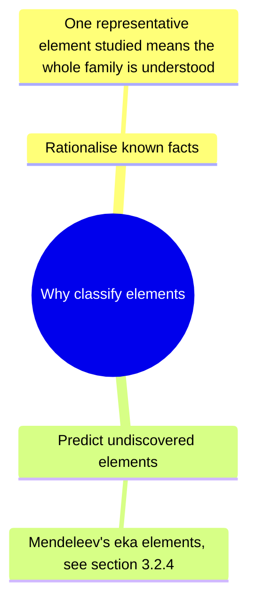
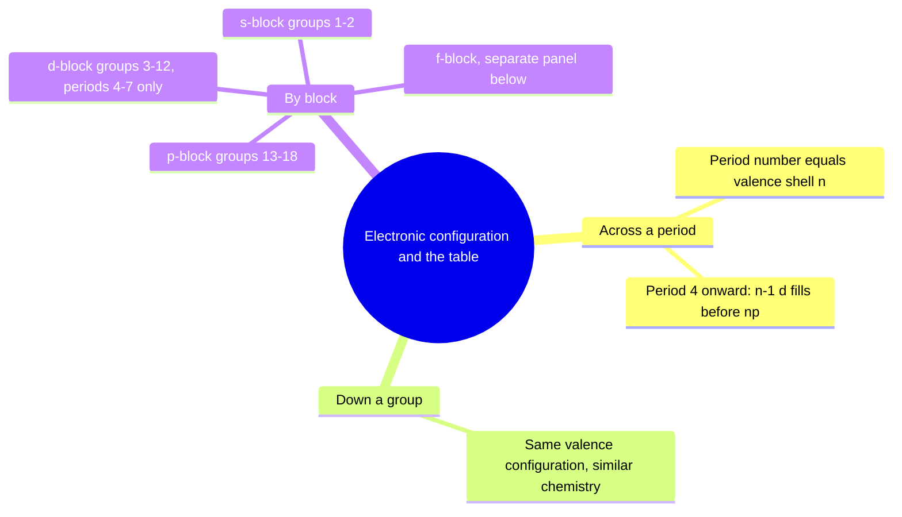
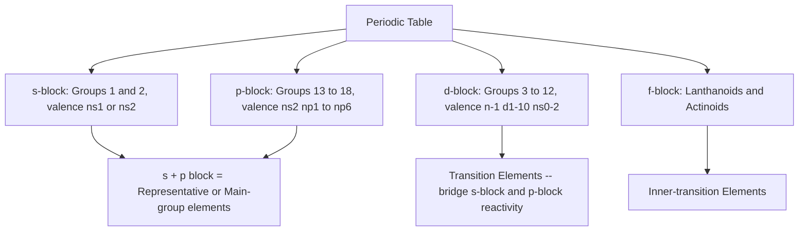
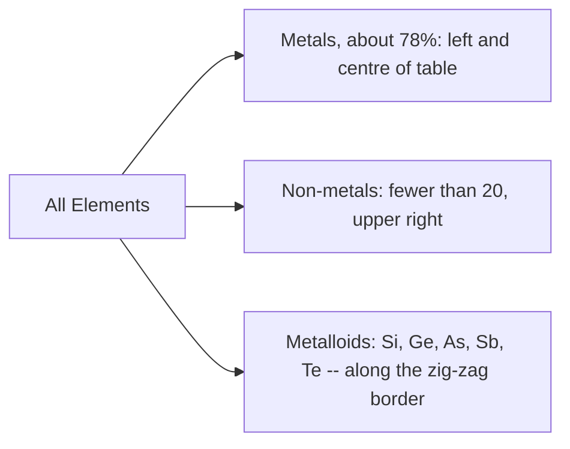
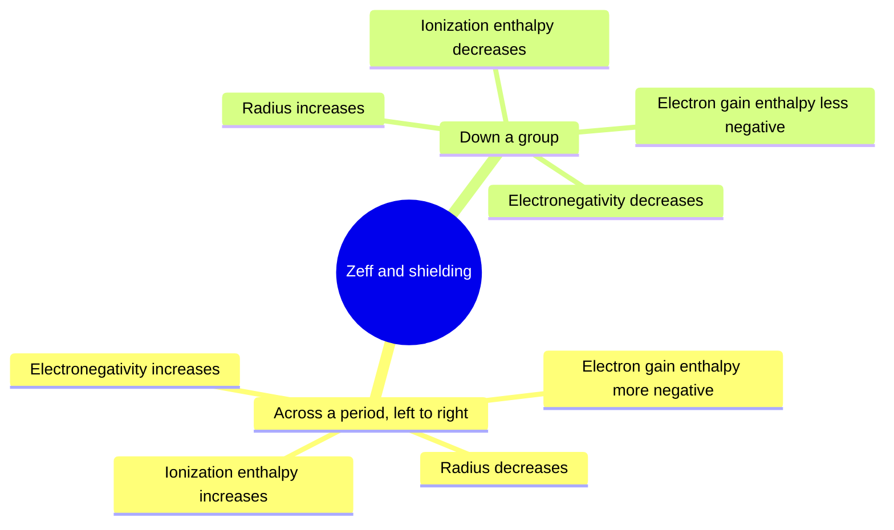

# Chemistry | Chapter 03 | Classification of Elements and Periodicity | CNOTES

### Classification of Elements and Periodicity in Properties

> Mirrors NOTES §3.1–§3.7 one-to-one. A miss here → follow the `§` tag to the matching NOTES section for the full reasoning.

---

## §3.1 — Why Do We Need to Classify Elements? ⭐

- 1800: 31 elements known.
- 1865: 63 elements known.
- Today: 118 elements known, Z = 1 to 118, all officially IUPAC-named.
- Classification exists to (1) rationalise known facts and (2) predict properties of undiscovered elements. §3.1

---

## §3.2 — Genesis of Periodic Classification ⭐⭐

### §3.2.1 Döbereiner's Triads (~1829)

- Middle element's atomic weight ≈ arithmetic mean of the other two, in groups of three similar elements.

| Triad | Elements | Atomic weights | Mean check |
|---|---|---|---|
| 1 | Li, Na, K | 7, 23, 39 | (7+39)/2 = 23 ✓ |
| 2 | Ca, Sr, Ba | 40, 88, 137 | (40+137)/2 = 88.5 ≈ 88 ✓ |
| 3 | Cl, Br, I | 35.5, 80, 127 | (35.5+127)/2 = 81.25 ≈ 80 ✓ |

- Limitation: worked for only a handful of elements — dismissed as coincidence. §3.2.1

### §3.2.2 de Chancourtois' Telluric Screw (1862)

- A.E.B. de Chancourtois (French geologist) arranged elements by increasing atomic weight on a cylinder.
- Elements with similar properties fell on the same vertical line — periodic recurrence.
- Attracted little attention at the time. §3.2.2

### §3.2.3 Newlands' Law of Octaves (1865)

- John Alexander Newlands: arranged by increasing atomic weight, every 8th element resembles the 1st (like musical octaves).

| 1 | 2 | 3 | 4 | 5 | 6 | 7 |
|---|---|---|---|---|---|---|
| Li | Be | B | C | N | O | F |
| Na | Mg | Al | Si | P | S | Cl |
| K | Ca | | | | | |

- Limitation: held only up to calcium; broke down for heavier elements.
- Newlands awarded the Davy Medal (1887) despite early rejection. §3.2.3

### §3.2.4 Lothar Meyer and Mendeleev (1869) ⭐⭐⭐

- Both worked independently, plotting properties against atomic weight; both found periodic recurrence.
- Lothar Meyer plotted atomic volume, melting point, boiling point vs atomic weight; published *after* Mendeleev.
- **Mendeleev's Periodic Law:** the properties of the elements are a periodic function of their atomic weights.
- System: horizontal rows, vertical columns (groups); similar-property elements placed in the same column.
- Where atomic-weight order conflicted with property similarity, Mendeleev trusted properties — e.g. I (at. wt. 127) placed after Te (at. wt. 128).
- Credited over Lothar Meyer: published the law first, made quantitative predictions later confirmed, had the courage to leave gaps.

**Eka-element predictions vs. reality:**

| Property | Eka-aluminium (predicted) | Gallium (found) | Eka-silicon (predicted) | Germanium (found) |
|---|---|---|---|---|
| Atomic weight | 68 | 70 | 72 | 72.6 |
| Density (g/cm³) | 5.9 | 5.94 | 5.5 | 5.36 |
| Melting point | Low | 302.93 K | High | 1231 K |
| Oxide formula | E₂O₃ | Ga₂O₃ | EO₂ | GeO₂ |
| Chloride formula | ECl₃ | GaCl₃ | ECl₄ | GeCl₄ |

**Achievements of Mendeleev's table:**
- First systematic arrangement placing similar-property elements in the same group.
- Left gaps for undiscovered elements and predicted their properties correctly (table above).
- Corrected wrongly-assigned atomic weights using periodicity itself — standout case: beryllium.

**Be atomic-weight correction:** assumed valency 3 (like Al) gave wrong at. wt. 13.5, which broke periodicity between Li(7) and B(11). Correct valency = 2 (like Mg, Ca) → At. wt. = Valency × Equivalent weight = 2 × 4.5 = **9** — matches the true value, 9.01. §3.2.4

**Drawbacks of Mendeleev's table:**

| # | Drawback |
|---|---|
| 1 | Ar (39.9) placed before K (39.1) despite higher atomic weight — no principled justification under Mendeleev's own rule |
| 2 | Position of hydrogen controversial — resembles both Group 1 and Group 17 |
| 3 | Chemically dissimilar elements sometimes shared a group (Li/Cu); chemically similar elements sometimes split (Cu/Hg) |
| 4 | Group VIII: unexplained catch-all, 3 elements per row (Fe–Co–Ni etc.), no justification |
| 5 | No suitable position for lanthanoids and actinoids |
| 6 | Isotopes made placing chemically identical atoms of different mass impossible to justify on atomic-weight basis |

> Trap: remember Drawback 1 as **Ar/K**, not Ar/Ca — mass order is Ar(39.9) > K(39.1), but Mendeleev preserved the *group* order (noble gas before alkali metal). §3.2.4

---

## §3.3 — Modern Periodic Law and the Long Form ⭐⭐

### §3.3.1 Moseley's X-ray Experiment (1913)

- Henry Moseley studied characteristic X-ray spectra of elements.
- Plot of √ν (ν = X-ray frequency) vs atomic number Z → straight line; vs atomic mass → not a straight line.
- Conclusion: atomic number is a more fundamental property of an element than atomic mass.
- This is exactly what resolves Mendeleev's Ar/K anomaly — by Z, Ar(18) genuinely precedes K(19). §3.3.1

### §3.3.2 Modern Periodic Law

- **Modern Periodic Law:** the physical and chemical properties of the elements are periodic functions of their atomic numbers.
- Mendeleev's atomic-weight version is the historical special case, working for most elements only because atomic weight usually rises in step with Z. §3.3.2

### §3.3.3 Long Form of the Periodic Table

- 7 periods (horizontal rows); period number = highest principal quantum number n occupied.
- 18 groups (vertical columns), IUPAC numbering 1–18, replacing the old IA…VIIA/VIII/IB…VIIB/0 scheme.

| Period | n | Elements | Orbitals filling | Count |
|---|---|---|---|---|
| 1 | 1 | H – He | 1s | 2 |
| 2 | 2 | Li – Ne | 2s, 2p | 8 |
| 3 | 3 | Na – Ar | 3s, 3p | 8 |
| 4 | 4 | K – Kr | 4s, 3d, 4p | 18 |
| 5 | 5 | Rb – Xe | 5s, 4d, 5p | 18 |
| 6 | 6 | Cs – Rn | 6s, 4f, 5d, 6p | 32 |
| 7 | 7 | Fr – Og | 7s, 5f, 6d, 7p | 32 (theoretical max) |

- Elements in a period = 2 × (orbitals available in that period's filling shells). §3.3.3
- Period 5 check: n=5, filling order 5s<4d<5p → l=0,1,2 → 1+5+3=9 orbitals → 2×9=18. Matches Rb(37)–Xe(54).
- Period 6 check: n=6, filling order 6s<4f<5d<6p → l=0,1,2,3 → 1+7+5+3=16 orbitals → 2×16=32.
- The 14 f-block elements of periods 6 and 7 (lanthanoids, actinoids) are pulled into a separate panel purely for layout compactness — chemically they belong between Groups 2 and 3.

---

## §3.4 — IUPAC Nomenclature for Z > 100 ⭐

- Why needed: super-heavy elements are synthesised in vanishingly small quantities; naming disputes arose (Z=104: Americans said Rutherfordium, Soviets said Kurchatovium). A dispute-proof temporary name is derived mechanically from Z.

| Digit | 0 | 1 | 2 | 3 | 4 | 5 | 6 | 7 | 8 | 9 |
|---|---|---|---|---|---|---|---|---|---|---|
| Root | nil | un | bi | tri | quad | pent | hex | sept | oct | enn |
| Symbol letter | n | u | b | t | q | p | h | s | o | e |

| Z | Systematic name | Symbol | Ratified name | Symbol |
|---|---|---|---|---|
| 101 | Unnilunium | Unu | Mendelevium | Md |
| 104 | Unnilquadium | Unq | Rutherfordium | Rf |
| 106 | Unnilhexium | Unh | Seaborgium | Sg |
| 112 | Ununbium | Uub | Copernicium | Cn |
| 118 | Ununoctium | Uuo | Oganesson | Og |

- Z=120 example: digits 1,2,0 → roots un, bi, nil → **unbinilium**, symbol **Ubn**. §3.4
- Z=117: one short of Og(118) → Group 17 (halogen family), config [Rn]5f¹⁴6d¹⁰7s²7p⁵.
- Z=120: two beyond Og → starts period 8's s-block → Group 2 (alkaline earth family), config [Uuo]8s². §3.4

---

## §3.5 — Electronic Configurations and the Periodic Table ⭐⭐⭐

### §3.5.1 Configurations in Periods

- Rule: period number = principal quantum number n of the valence shell being filled.
- Period 1 (n=1): 1s fills → H(1s¹) → He(1s²).
- Period 2 (n=2): 2s then 2p → Li(2s¹) → Ne(2s²2p⁶).
- Period 3 (n=3): 3s then 3p → Na → Ar.
- Period 4 (n=4): 4s fills first; 3d fills before 4p (3d transition series, Sc to Zn); then 4p completes the period at Kr.
- Period 5 (n=5): mirrors period 4; 4d series starts at Y(39), ends at Xe.
- Period 6 (n=6): 6s, then 4f (lanthanoids, Ce–Lu), then 5d, then 6p.
- Period 7 (n=7): 7s, then 5f (actinoids, Th–Lr), then 6d, then 7p — ends at Og(118).
- Na (Z=11), shells 2,8,1: the lone 3s¹ electron is shielded from +11 by the filled 2,8 core, not by the bare nucleus — this shielded, reduced pull is effective nuclear charge Zeff, the idea behind every trend in §3.7. §3.5.1

### §3.5.2 Configurations Down a Group

- Elements in one group share the same valence-shell configuration → similar chemistry.

| Z | Element | Configuration |
|---|---|---|
| 3 | Li | [He]2s¹ |
| 11 | Na | [Ne]3s¹ |
| 19 | K | [Ar]4s¹ |
| 37 | Rb | [Kr]5s¹ |
| 55 | Cs | [Xe]6s¹ |
| 87 | Fr | [Rn]7s¹ |

- Every Group 1 element: single, loosely-held ns¹ electron outside a noble-gas core → high reactivity, uniform +1 ion formation. §3.5.2

### §3.5.3 The Periodic Table by Block — a Schematic

- s-block: Groups 1–2, left edge.
- p-block: Groups 13–18, right side; He is the sole exception sitting with Group 18 despite s-block configuration.
- d-block: Groups 3–12, exists only from period 4 onward — no 3d/2d/1d gap, because periods 1–3 have no available (n−1)d orbital of the right energy yet.
- f-block: separate panel below the main body, purely for layout compactness — chemically sandwiched between Group 2 and Group 3. §3.5.3

---

## §3.6 — s-, p-, d-, f-Block Elements; Metals, Non-metals, Metalloids ⭐⭐⭐

- Two classification axes on the same table: which orbital fills last (electronic view) vs bulk metal/non-metal behaviour (physical view) — they correlate but are not identical. §3.6

### §3.6.1 s-Block Elements

- Groups 1 (alkali metals, ns¹) and 2 (alkaline earth metals, ns²).
- Reactive metals, low ionization enthalpy; lose outer electron(s) readily → 1+ or 2+ ions.
- Reactivity and metallic character increase down the group.
- Never found free in nature — too reactive.
- Compounds mostly ionic, except Li and Be, which are covalent-leaning (§3.7.2(b), anomalous first members). §3.6.1

### §3.6.2 p-Block Elements

- Groups 13–18, configuration ns²np¹ to ns²np⁶; together with s-block, called Representative/Main-group Elements.
- Each period ends in a noble gas (ns²np⁶) — chemically near-inert.
- Halogens (Gp 17) and chalcogens (Gp 16): most negative electron gain enthalpies, readily gain 1–2 electrons.
- Non-metallic character increases left→right; metallic character increases down.

| Element | Configuration | Anomaly |
|---|---|---|
| He | 1s² | Belongs to s-block by configuration, but sits in Group 18 — filled valence shell gives noble-gas behaviour |
| H | 1s¹ | Can lose its one electron (like Group 1) or gain one to complete 1s² (like Group 17) — placed separately |

§3.6.2

### §3.6.3 d-Block Elements (Transition Elements)

- Groups 3–12, general configuration (n−1)d¹⁻¹⁰ns⁰⁻² (exception: Pd, 4d¹⁰5s⁰).
- All metals; mostly coloured ions, variable oxidation states, paramagnetic (unpaired d electrons), widely used as catalysts.
- Zn, Cd, Hg — (n−1)d¹⁰ns², completely filled d — do NOT show most transition-metal properties (colourless ions, fixed oxidation state).
- Bridges the reactive s-block metals and the less-active Group 13/14 p-block elements.

| Series | Range | Period |
|---|---|---|
| 3d | Sc(21) – Zn(30) | 4 |
| 4d | Y(39) – Cd(48) | 5 |
| 5d | La(57)/Hf(72) – Hg(80) | 6 |
| 6d | Ac(89)/Rf(104) onward | 7 |

§3.6.3

### §3.6.4 f-Block Elements (Inner-Transition Elements)

| Series | Range | Z | Fills |
|---|---|---|---|
| Lanthanoids | Ce – Lu | 58–71 | 4f |
| Actinoids | Th – Lr | 90–103 | 5f |

- General configuration: (n−2)f¹⁻¹⁴(n−1)d⁰⁻¹ns².
- All metals; properties very similar within each series, especially lanthanoids.
- Actinoid chemistry more complex (more oxidation states); all actinoids radioactive; many made only in nanogram quantities.
- Elements after uranium (Z > 92): Transuranium Elements. §3.6.4

### §3.6.5 Metals, Non-metals, Metalloids ⭐⭐

| | Metals | Non-metals | Metalloids |
|---|---|---|---|
| Position | Left / centre | Top right | Zig-zag border (Si, Ge, As, Sb, Te) |
| State at RT | Usually solid (Hg liquid; Ga, Cs melt just above RT) | Solid or gas (B, C exceptions, high m.p.) | Solid |
| m.p./b.p. | High | Low | Intermediate |
| Malleable/ductile | Yes | No — brittle | Intermediate |
| Conductivity | Good | Poor | Intermediate (semiconductors) |

- Metallic conductance *decreases* as temperature rises (lattice vibration obstructs electron flow); semiconductor/metalloid conductivity *rises* with temperature. §3.6.5
- Metallic character increasing order example: P < Si < Be < Mg < Na (Na far left = most metallic; P far right = least). §3.6.5

---

## §3.7 — Periodic Trends in Properties ⭐⭐⭐

- The one idea behind every trend below: Zeff = Z − σ. Higher Zeff → tighter grip on the valence shell. Radius is the odd one out — it shrinks where every other "electron-grip" property grows. §3.7

### §3.7.1(a) Atomic Radius ⭐⭐⭐

| Radius type | Definition | Used for |
|---|---|---|
| Covalent radius | Half the internuclear distance, two like atoms, single covalent bond | Non-metals |
| Metallic radius | Half the internuclear distance, adjacent atoms in a metallic crystal | Metals |
| van der Waals radius | Half the distance, two non-bonded neighbouring atoms | Noble gases / non-bonded contacts |

- Size ordering for the same element: van der Waals radius > metallic radius > covalent radius — non-bonded contact is the weakest interaction, so it leaves the largest apparent radius. §3.7.1(a)
- Covalent radius of Cl: bond length 198 pm ÷ 2 = **99 pm**. Metallic radius of Cu: 256 pm ÷ 2 = **128 pm**.

| Direction | Trend | Reason |
|---|---|---|
| Across a period → | Decreases | Same valence shell, Zeff increases → stronger pull |
| Down a group ↓ | Increases | New shell added; inner shells shield, outweighing rise in Z |

| Period 2 | Li | Be | B | C | N | O | F |
|---|---|---|---|---|---|---|---|
| Radius (pm) | 152 | 111 | 88 | 77 | 74 | 66 | 64 |

| Group 1 | Li | Na | K | Rb | Cs |
|---|---|---|---|---|---|
| Radius (pm) | 152 | 186 | 231 | 244 | 262 |

> Trap: noble-gas radii are van der Waals radii, not covalent — never compare directly to a neighbouring halogen's covalent radius. §3.7.1(a)

### §3.7.1(b) Ionic Radius ⭐⭐⭐

- **Cation** (electron lost) < parent atom: same nuclear charge, fewer electrons → higher Zeff per electron → pulled in tighter.
- **Anion** (electron gained) > parent atom: more electron–electron repulsion, lower effective pull per electron → electrons spread out.
- Na(186 pm) → Na⁺(95 pm). F(64 pm) → F⁻(136 pm).
- Isoelectronic series (all 10 electrons), radius shrinks smoothly as nuclear charge climbs +7 to +13: N³⁻(171 pm) > O²⁻(140 pm) > F⁻(136 pm) > Na⁺(95 pm) > Mg²⁺(65 pm) > Al³⁺(50 pm).
- Isoelectronic-species rule: same electron count → higher Z → smaller radius. §3.7.1(b)
- Mg vs Al vs Mg²⁺ vs Al³⁺: Mg > Al (period trend, neutral atoms); Mg²⁺ and Al³⁺ are isoelectronic (both 10 e⁻), Al³⁺ has more positive charge → smaller. Largest: Mg. Smallest: Al³⁺.
- Isoelectronic matches: F⁻ (10 e⁻) ↔ Na⁺; Ar (18 e⁻) ↔ Cl⁻; Mg²⁺ (10 e⁻) ↔ Na⁺; Rb⁺ (36 e⁻) ↔ Kr.

### §3.7.1(c) Ionization Enthalpy (ΔᵢH) ⭐⭐⭐

- Definition: energy to remove an electron from an isolated gaseous atom in its ground state. X(g)→X⁺(g)+e⁻ is ΔᵢH₁; X⁺(g)→X²⁺(g)+e⁻ is ΔᵢH₂.
- Units kJ mol⁻¹; always positive. ΔᵢH₁ < ΔᵢH₂ < ΔᵢH₃ … — each successive removal is from a more electron-poor, more tightly-bound ion.

| Direction | Trend | Governing factor |
|---|---|---|
| Across a period → | Increases (generally) | Z rises, same-shell shielding barely changes → Zeff climbs |
| Down a group ↓ | Decreases | New shells shield faster than Z grows → Zeff felt by outer electron falls |

- Simplified Bohr-model estimate: ΔᵢH ≈ 1312 · Zeff²/n² kJ mol⁻¹. Captures the overall period/group slope only — does NOT reproduce the B<Be or O<N anomalies below (those need orbital-penetration and electron-pairing effects). §3.7.1(c)

**Period 2 anomalies** — actual order Li < B < Be < C < O < N < F < Ne:

| Anomaly | Why |
|---|---|
| B < Be | Be removes a 2s electron (penetrates closer to nucleus, held tighter); B removes a 2p electron, shielded by the 2s² pair, easier to remove |
| O < N | N(2p³): one electron per orbital, Hund's-rule stability; O(2p⁴): a paired orbital, electron–electron repulsion makes that paired electron easier to remove |

| Period 2 | Li | Be | B | C | N | O | F | Ne |
|---|---|---|---|---|---|---|---|---|
| ΔᵢH (kJ/mol) | 520 | 899 | 801 | 1086 | 1402 | 1314 | 1681 | 2080 |

- Al prediction: shielded by filled 3s² pair (same penetration argument as B vs Be) → predicted 575, actual 577 kJ/mol, between Na(496) and Mg(737).
- H atom ΔᵢH from ground-state energy −2.18×10⁻¹⁸ J: ΔE = 2.18×10⁻¹⁸ J/atom × Avogadro 6.022×10²³ mol⁻¹ = 1.313×10⁶ J mol⁻¹ = **1312.8 kJ/mol**.
- Na vs Mg: ΔᵢH₁(Na) < ΔᵢH₁(Mg) — Na empties its only 3s electron into a stable Ne core (easy); Mg breaks into a 3s¹ configuration (harder). ΔᵢH₂(Mg⁺) < ΔᵢH₂(Na⁺) — removing Na⁺'s second electron breaks a noble-gas 2p⁶ core (very costly, ≈4560 kJ/mol); Mg⁺'s second removal just empties an already-half-vacated 3s¹ orbital (≈1450 kJ/mol).

**Group 13 non-monotonic anomaly** (ΔᵢH₁, kJ/mol): B 801 > Al 577 < Ga 579 > In 558 < Tl 589 — not a smooth decrease down the group.
- B→Al: normal fall (new shell, better shielding). Ga follows a filled 3d¹⁰ subshell that shields poorly → Zeff creeps back up → IE edges above Al's. Tl follows both filled 4f¹⁴ and 5d¹⁰ → same effect, stronger.
- This is the first sighting of the same d/f-poor-shielding logic behind lanthanoid contraction (met later in d- and f-block chemistry). §3.7.1(c)

### §3.7.1(d) Electron Gain Enthalpy (ΔₑgH) ⭐⭐⭐

- Definition: enthalpy change when an electron is added to a neutral gaseous atom. X(g)+e⁻→X⁻(g).
- Negative ΔₑgH → exothermic (most non-metals, especially halogens). Positive → endothermic (noble gases — incoming electron must start a new, higher shell).

| Direction | Trend | Reason |
|---|---|---|
| Across a period → | Becomes more negative (generally) | Zeff rises → added electron sits closer to nucleus |
| Down a group ↓ | Becomes less negative | Atom larger → added electron sits farther out |

| Group 1 | ΔₑgH | Group 16 | ΔₑgH | Group 17 | ΔₑgH | Group 18 | ΔₑgH |
|---|---|---|---|---|---|---|---|
| H | −73 | | | | | He | +48 |
| Li | −60 | O | −141 | F | −328 | Ne | +116 |
| Na | −53 | S | −200 | Cl | −349 | Ar | +96 |
| K | −48 | Se | −195 | Br | −325 | Kr | +96 |
| Rb | −47 | Te | −190 | I | −295 | Xe | +77 |
| Cs | −46 | Po | −174 | At | −270 | Rn | +68 |

> Trap: F's ΔₑgH (−328) is *less* negative than Cl's (−349), even though F is smaller and higher up the group — F's small n=2 shell crowds the incoming electron with repulsion; Cl's roomier n=3 shell releases more net energy. Same logic makes O less negative than S. §3.7.1(d)
- Most/least negative among P, S, Cl, F: most negative Cl; least negative P (P's half-filled 3p³ configuration resists a fourth 3p electron).
- Second electron gain enthalpy of any element is always positive and less favourable than the first — the incoming electron is now repelled by an already-negative species (e.g. O⁻→O²⁻).

### §3.7.1(e) Electronegativity ⭐⭐

- Definition: qualitative measure of an atom's ability, while in a compound, to pull shared bonding electrons toward itself. Not a measurable property of an isolated atom — depends on bonding context. Pauling scale most used, F fixed at 4.0.

| Period 2 | Li | Be | B | C | N | O | F |
|---|---|---|---|---|---|---|---|
| χ | 1.0 | 1.5 | 2.0 | 2.5 | 3.0 | 3.5 | 4.0 |

| Group 1 | Li | Na | K | Rb | Cs |
|---|---|---|---|---|---|
| χ | 1.0 | 0.9 | 0.8 | 0.8 | 0.7 |

- Trend: increases across a period, decreases down a group — mirrors the ionization-enthalpy trend; NCERT states χ ∝ 1/r approximately.
- Consequence: directly tied to non-metallic character (↑ across, ↓ down), inversely tied to metallic character. §3.7.1(e)

### §3.7.2 Periodic Trends in Chemical Properties ⭐⭐⭐

**(a) Periodicity of Valence / Oxidation State**

| Group | 1 | 2 | 13 | 14 | 15 | 16 | 17 | 18 |
|---|---|---|---|---|---|---|---|---|
| Valence electrons | 1 | 2 | 3 | 4 | 5 | 6 | 7 | 8 |
| Common valence | 1 | 2 | 3 | 4 | 3, 5 | 2, 6 | 1, 7 | 0, 8 |

- Valence for representative elements = valence-electron count, or 8 minus that count, whichever applies. Oxidation state is a related but distinct idea: the charge assigned by comparing electronegativities, not simple bond-counting.
- OF₂: F more electronegative → each F is −1, O is +2. Na₂O: O more electronegative than Na → O is −2, Na is +1.
- Al in [AlCl(H₂O)₅]²⁺: oxidation state = +3 (fixed by electron loss), covalency = 6 (all bonds counted) — not the same thing.
- Formula prediction by cross-multiplying valences: Si(4)+Br(1)→SiBr₄. Al(3)+S(2)→Al₂S₃. Li(1)+O(2)→Li₂O. Mg(2)+N(3)→Mg₃N₂. Al(3)+I(1)→AlI₃. Si(4)+O(2)→SiO₂. P(3 or 5)+F(1)→PF₃ or PF₅. Lu(3)+F(1)→LuF₃. §3.7.2(a)

**(b) Anomalous Behaviour of Second-Period Elements ⭐⭐⭐**

| Cause | Consequence |
|---|---|
| Small size, high charge/radius ratio, high electronegativity | Li, Be form more covalent compounds than the rest of their (mostly ionic) groups |
| Only 4 valence orbitals (2s, 2p) → max covalency 4 | B forms [BF₄]⁻ but never [BF₆]³⁻; Al (9 valence orbitals) can expand to [AlF₆]³⁻ |
| Strong pπ–pπ overlap (small, similar-sized orbitals) | C=C, C≡C, N=N, N≡N, C=O, C≡N, N=O form readily for period-2 elements; heavier analogues (Si, P) prefer single bonds/3-D networks |

- Diagonal relationship: Li resembles Mg, Be resembles Al — diagonal neighbours share similar charge/radius ratios. Both Li and Mg form nitrides directly with N₂ (Li₃N, Mg₃N₂); both form normal carbonates.

| Property | Li | Be | B | Mg | Al |
|---|---|---|---|---|---|
| Metallic radius (pm) | 152 | 111 | 88 | 160 | 143 |
| Ionic radius Mⁿ⁺ (pm) | 76 | 31 | — | 72 | — |

§3.7.2(b)

### §3.7.3 Periodic Trends and Chemical Reactivity ⭐⭐

- IE lowest at the far left (alkali metals) → easiest electron loss → most reactive metals.
- ΔₑgH most negative at the far right (halogens) → easiest electron gain → most reactive non-metals.
- Reactivity highest at both extremes, lowest at the centre of a period.

| Position | Oxide type | Example | Test with water |
|---|---|---|---|
| Far left (Gp 1) | Most basic | Na₂O | Na₂O + H₂O → 2NaOH |
| Centre | Amphoteric | Al₂O₃, As₂O₃ | Reacts with both acid and base |
| Centre | Neutral | CO, NO, N₂O | No acid/base reaction |
| Far right (Gp 17) | Most acidic | Cl₂O₇ | Cl₂O₇ + H₂O → 2HClO₄ |

- Na₂O confirmed strong base, Cl₂O₇ confirmed strong acid — both equations balance with correct state symbols. §3.7.3
- d-block: radius change across a period much smaller than s/p-block (poorer shielding change), smaller still across f-block. d-block IEs sit between s- and p-block values — less electropositive than Groups 1–2.
- Six-element identification signatures:
  - Huge ΔᵢH₁→ΔᵢH₂ jump → alkali metal (valence shell just emptied).
  - Very negative ΔₑgH → halogen.
  - Positive ΔₑgH + very high ΔᵢH₁ → noble gas.
  - ΔᵢH₁ ≈ ΔᵢH₂ (ratio ~2×, no huge jump) → Group 2 metal.
  - Huge ΔᵢH₁→ΔᵢH₂ jump paired with a very small ΔᵢH₁ itself → small, high-charge-density alkali metal, covalent-leaning (e.g. Li). §3.7.3

---

## Rapid Reference

| Fact | Value |
|---|---|
| Elements known (current) | 118 (Z = 1–118, all IUPAC-named) |
| Periods / Groups | 7 periods / 18 groups |
| Period lengths | 2, 8, 8, 18, 18, 32, 32 |
| Elements per period formula | 2 × (orbitals available in that period's filling shells) |
| Mendeleev's Periodic Law basis | Atomic weight |
| Modern Periodic Law basis | Atomic number (Z) |
| Moseley's finding | √ν vs Z is linear; vs atomic mass, it is not |
| Zeff formula | Zeff = Z − σ |
| Bohr-model ΔᵢH estimate | ΔᵢH ≈ 1312 · Zeff²/n² kJ mol⁻¹ |
| H atom ΔᵢH | 1312.8 kJ/mol |
| Most negative ΔₑgH overall | Chlorine, −349 kJ/mol |
| F's ΔₑgH (anomalous) | −328 kJ/mol (less negative than Cl) |
| Pauling electronegativity reference | F = 4.0 (maximum) |
| Least electronegative (this data set) | Cs = 0.7 |
| Covalent radius of Cl | 99 pm (from Cl–Cl bond length 198 pm) |
| Metallic radius of Cu | 128 pm (from Cu–Cu distance 256 pm) |
| Radius size ordering (same element) | van der Waals > metallic > covalent |
| Ionic radius ordering example | Al³⁺(50) < Mg²⁺(65) < Na⁺(95) < F⁻(136) < O²⁻(140) < N³⁻(171), all pm |
| Group 13 IE zig-zag (kJ/mol) | B 801 > Al 577 < Ga 579 > In 558 < Tl 589 |
| Be's corrected atomic weight | 9 (valency 2 × equivalent weight 4.5); actual 9.01 |
| Davy Medal (Newlands) | 1887 |
| IUPAC digit roots | 0 nil, 1 un, 2 bi, 3 tri, 4 quad, 5 pent, 6 hex, 7 sept, 8 oct, 9 enn |
| Z=120 systematic name | Unbinilium, symbol Ubn |
| Lanthanoid range | Ce(58)–Lu(71), Period 6, fills 4f |
| Actinoid range | Th(90)–Lr(103), Period 7, fills 5f |
| Transuranium threshold | Z > 92 (uranium) |
| Max covalency, B vs Al | B: 4 ([BF₄]⁻); Al: 6 ([AlF₆]³⁻) |

---

*End of CNOTES — Ch. 3: Classification of Elements and Periodicity in Properties. Every entry above traces to a NOTES `§` section — follow the tag for the full derivation, worked example, or data table.*