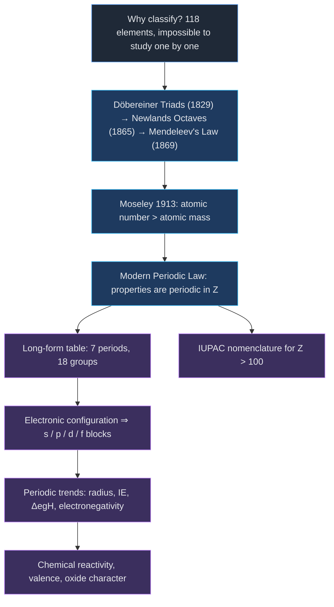
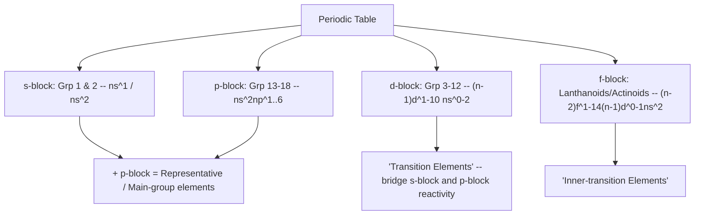
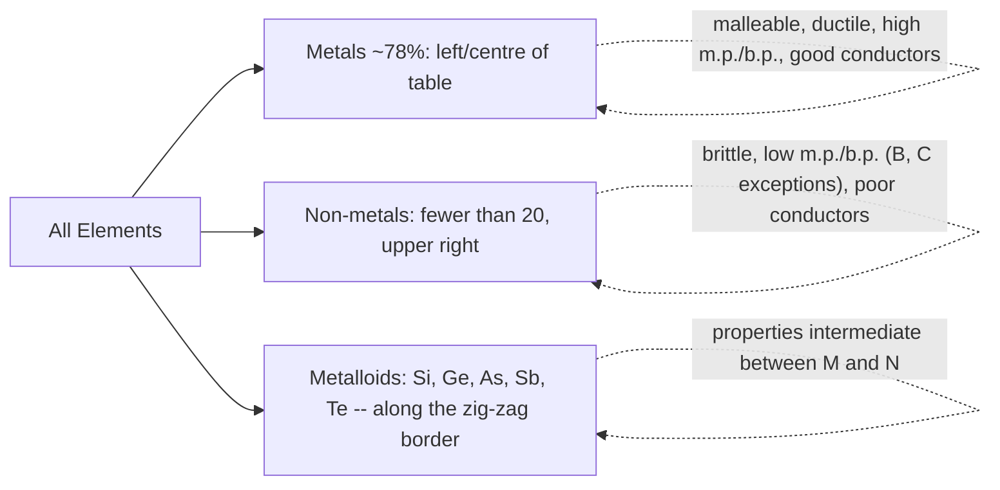
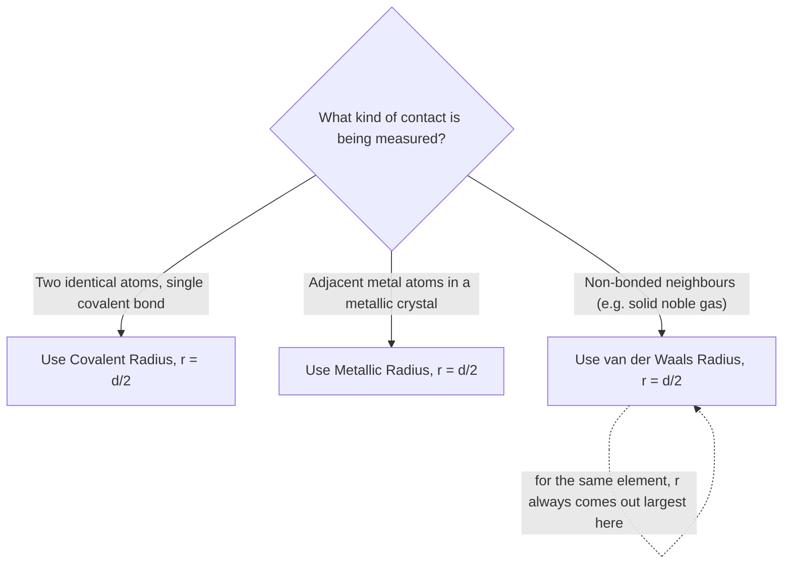

# Classification of Elements and Periodicity in Properties

**Branch:** Inorganic Chemistry &nbsp;|&nbsp; **Level:** Board · NEET · JEE &nbsp;|&nbsp; **NCERT Unit 3** (Class XI)

> [!info] How this note is built
> This note reconciles the **NCERT textbook** (Unit 3) with a student's **handwritten coaching notes** on the same chapter. Content found only in the coaching notes (achievements/drawbacks of Mendeleev's table, the Beryllium atomic-weight correction, van der Waals vs metallic vs covalent radius ordering, the metallic-conductance aside) is marked **(Coaching)**. Everything else follows the NCERT numbering (§3.1–§3.7) so it lines up with your textbook and with NCERT Problems 3.1–3.10 and Exercises 3.1–3.40.

> [!warning] Element count — an edition artifact
> §3.1 of NCERT (older printings) states "114 elements are known." By the time §3.4 discusses Z > 100, elements up to **Z = 118 (Oganesson)** are already named — all 118 elements through Og have been officially discovered and IUPAC-named since 2016. Use **118** as the current total; "114" is a holdover from an earlier edition.

---

## 🗺️ Concept Roadmap



*Read this as: the historical struggle to classify 100+ elements leads to Mendeleev's law, gets corrected by Moseley into the Modern Periodic Law, and that law's consequence — periodic electronic configuration — is what actually drives every trend you calculate in §3.7.*

---

## SECTION 3.1 — Why Do We Need to Classify Elements? ⭐

* 1800: **31** elements known → 1865: **63** known → today: **118** known (Z = 1 to 118, all officially named).
* Studying 118 elements and their compounds individually is impractical. Classification:
  1. **Rationalises** known chemical facts (one representative element ⇒ whole family understood).
  2. **Predicts** properties of undiscovered elements (Mendeleev's eka-elements, §3.2.4).

> **Key idea:** Classification isn't just tidying up — it is a genuine predictive theory, the way Mendeleev demonstrated.

---

## SECTION 3.2 — Genesis of Periodic Classification ⭐⭐

### 3.2.1 Döbereiner's Triads (~1829)

**Observation:** groups of three elements with similar properties, where the **middle atomic weight ≈ mean of the other two**.

| Triad | Elements | Atomic weights | Check: mean of extremes |
|---|---|---|---|
| 1 | Li, Na, K | 7, 23, 39 | $(7+39)/2 = 23$ ✓ |
| 2 | Ca, Sr, Ba | 40, 88, 137 | $(40+137)/2 = 88.5$ ≈ 88 ✓ |
| 3 | Cl, Br, I | 35.5, 80, 127 | $(35.5+127)/2 = 81.25$ ≈ 80 ✓ |

**Limitation:** worked for only a handful of elements — dismissed as coincidence.

### 3.2.2 de Chancourtois' Telluric Screw (1862)

French geologist A.E.B. de Chancourtois arranged elements by increasing atomic weight on a **cylinder**; elements with similar properties fell on the same vertical line, showing periodic recurrence. It attracted little attention at the time.

### 3.2.3 Newlands' Law of Octaves (1865)

**Law:** arranged by increasing atomic weight, **every 8th element resembles the 1st** — like musical octaves.

| 1 | 2 | 3 | 4 | 5 | 6 | 7 |
|---|---|---|---|---|---|---|
| Li | Be | B | C | N | O | F |
| Na | Mg | Al | Si | P | S | Cl |
| K | Ca | | | | | |

**Limitation:** held only up to **calcium**; broke down for heavier elements. Newlands was awarded the **Davy Medal (1887)** despite early rejection.

### 3.2.4 Lothar Meyer and Mendeleev (1869) ⭐⭐⭐

Working independently, both plotted physical/chemical properties against atomic weight and found periodic recurrence.

* **Lothar Meyer:** plotted atomic volume, m.p., b.p. vs atomic weight → periodically repeating pattern; published *after* Mendeleev.
* **Mendeleev's Periodic Law:**

> [!example]
> \[
> \boxed{\text{The properties of the elements are a periodic function of their atomic weights.}}
> \]

**System:** horizontal rows, vertical columns (**groups**), similar-property elements in the same column. Where atomic-weight order conflicted with property similarity (e.g. **I, at. wt. 127, placed after Te, at. wt. 128**), Mendeleev trusted properties over weight.

**Eka-elements — the boldest test of the theory:** Mendeleev left gaps and *predicted* properties of undiscovered elements.

| Property | Eka-aluminium (predicted) | Gallium (found) | Eka-silicon (predicted) | Germanium (found) |
|---|---|---|---|---|
| Atomic weight | 68 | 70 | 72 | 72.6 |
| Density (g/cm³) | 5.9 | 5.94 | 5.5 | 5.36 |
| Melting point | Low | 302.93 K | High | 1231 K |
| Oxide formula | E₂O₃ | Ga₂O₃ | EO₂ | GeO₂ |
| Chloride formula | ECl₃ | GaCl₃ | ECl₄ | GeCl₄ |

> **Why Mendeleev, not Lothar Meyer, gets the credit:** he published the law *first*, made *quantitative* predictions that were later confirmed almost exactly, and had the scientific courage to leave gaps rather than force elements into the wrong slot.

**Achievements of Mendeleev's table (Coaching):**
1. First systematic arrangement placing similar-property elements in the same group.
2. Left gaps for undiscovered elements and predicted their properties correctly (table above).
3. **Corrected wrongly-assigned atomic weights** using the periodicity itself — the standout example being beryllium.

> [!example]
> ### Solved (Coaching) — Mendeleev's correction of beryllium's atomic weight
> **Given:** Be was originally assigned atomic weight ≈ 13.5 on the assumption that its valency = 3 (by analogy with Al, i.e. an oxide formulated as Be₂O₃). Its experimentally measured **equivalent weight** was 4.5.
> **Concept:** for any element, $\text{Atomic weight} = \text{Valency} \times \text{Equivalent weight}$.
> **Work:** placing Be (at. wt. 13.5) between Li (7) and B (11) broke the periodicity of properties — Be at 13.5 resembled Al far too closely to also fit snugly between Li and B. Mendeleev reasoned Be's true valency must be **2** (like Mg, Ca — its actual family), not 3.
> \[
> \text{Atomic weight of Be} = \text{Valency} \times \text{Eq. weight} = 2 \times 4.5 = \boxed{9}
> \]
> **Check:** 9 sits correctly between Li (7) and B (11); Be's actual atomic weight is 9.01 — Mendeleev's periodicity-driven correction was right.

**Drawbacks of Mendeleev's table (Coaching):**

| # | Drawback |
|---|---|
| 1 | **Ar (39.9) placed before K (39.1)** despite higher atomic weight — necessary to keep Ar a noble gas and K an alkali metal, but Mendeleev's own atomic-weight rule gave no *principled* justification for the swap. |
| 2 | Position of **hydrogen** was controversial (resembles both Group 1 and Group 17). |
| 3 | Chemically dissimilar elements sometimes shared a group (e.g. **Cu and Hg** in different groups despite similarity; **Li and Cu** thrown into the same group despite dissimilarity). |
| 4 | **Group VIII** was left as an unexplained catch-all containing 3 elements per row (Fe–Co–Ni, etc.) with no justification. |
| 5 | No suitable position existed for the **lanthanoids and actinoids**. |
| 6 | After **isotopes** were discovered, placing chemically identical atoms of different mass became impossible to justify on an atomic-*weight* basis. |

> [!warning]
> Point 1 above is the classic anomaly examiners test — make sure you remember it as **Ar/K**, not Ar/Ca; the *mass* order is Ar (39.9) > K (39.1), but the *group* order (noble gas before alkali metal) is what Mendeleev preserved.


---

## SECTION 3.3 — Modern Periodic Law and the Long Form ⭐⭐

### 3.3.1 Moseley's X-ray Experiment (1913)

Henry Moseley studied characteristic X-ray spectra of elements. A plot of $\sqrt{\nu}$ (ν = X-ray frequency) against **atomic number Z** gave a straight line — the plot against atomic *mass* did not.

\[
\boxed{\text{Atomic number } (Z) \text{ is a more fundamental property of an element than atomic mass.}}
\]

This is exactly what resolved Mendeleev's Ar/K problem (Drawback 1 above): by Z, Ar (18) genuinely precedes K (19) — no special pleading needed.

### 3.3.2 Modern Periodic Law

> [!example]
> \[
> \boxed{\text{The physical and chemical properties of the elements are periodic functions of their atomic numbers.}}
> \]

This is the *general* law; Mendeleev's atomic-weight version is the historical special case that happens to work for most elements because atomic weight usually increases in step with Z.

### 3.3.3 Long Form of the Periodic Table

* **7 periods** (horizontal rows) — period number = highest principal quantum number $n$ occupied.
* **18 groups** (vertical columns, IUPAC numbering 1–18, replacing the old IA…VIIA/VIII/IB…VIIB/0 scheme).

| Period | $n$ | Elements | Orbitals filling | Count |
|---|---|---|---|---|
| 1 | 1 | H – He | 1s | 2 |
| 2 | 2 | Li – Ne | 2s, 2p | 8 |
| 3 | 3 | Na – Ar | 3s, 3p | 8 |
| 4 | 4 | K – Kr | 4s, 3d, 4p | 18 |
| 5 | 5 | Rb – Xe | 5s, 4d, 5p | 18 |
| 6 | 6 | Cs – Rn | 6s, 4f, 5d, 6p | 32 |
| 7 | 7 | Fr – Og | 7s, 5f, 6d, 7p | 32 (theoretical max) |

> [!example]
> ### Worked Example 1 — Justify 18 elements in period 5 (NCERT Problem 3.2)
> **Given:** period 5, so $n=5$.
> **Concept:** number of elements in a period = $2\times$(number of orbitals available in the energy levels that fill during that period).
> **Work:** for $n=5$, the filling order is $5s < 4d < 5p$ (azimuthal $l = 0,1,2$ contributing $1+5+3 = 9$ orbitals).
> \[
> \text{Elements} = 2\times 9 = \boxed{18}
> \]
> **Check:** matches Rb (Z=37) through Xe (Z=54): $54-37+1=18$. ✓

> [!example]
> ### Worked Example 2 — Why does period 6 have 32 elements? (NCERT Exercise 3.4, gap-filled)
> **Concept:** same rule, $n=6$: filling order $6s<4f<5d<6p$, giving $l=0,1,2,3$ → orbitals $1+7+5+3=16$.
> \[
> \text{Elements} = 2\times16 = \boxed{32}
> \]

The 14 elements each of periods 6 and 7 that fill $f$-orbitals (**lanthanoids**, **actinoids**) are pulled into a separate panel at the bottom purely to keep the table compact — chemically they still belong inside the main body, between groups 2 and 3.

---

## SECTION 3.4 — IUPAC Nomenclature for Z > 100 ⭐

**Why needed:** super-heavy elements are synthesised in vanishingly small quantities, and naming disputes arose (Z = 104: Americans said **Rutherfordium**, Soviets said **Kurchatovium**). IUPAC's fix: derive a temporary, dispute-proof name directly from Z using digit roots.

| Digit | 0 | 1 | 2 | 3 | 4 | 5 | 6 | 7 | 8 | 9 |
|---|---|---|---|---|---|---|---|---|---|---|
| Root | nil | un | bi | tri | quad | pent | hex | sept | oct | enn |
| Symbol letter | n | u | b | t | q | p | h | s | o | e |


*Reading the flow: a temporary IUPAC name is mechanically generated from Z, so no country or lab has naming rights until discovery is formally ratified — only then does a permanent name (often honouring a scientist or place) replace it.*

| Z | Systematic name | Symbol | Ratified name | Symbol |
|---|---|---|---|---|
| 101 | Unnilunium | Unu | Mendelevium | Md |
| 104 | Unnilquadium | Unq | Rutherfordium | Rf |
| 106 | Unnilhexium | Unh | Seaborgium | Sg |
| 112 | Ununbium | Uub | Copernicium | Cn |
| 118 | Ununoctium | Uuo | Oganesson | Og |

> [!example]
> ### Worked Example 3 — IUPAC name for Z = 120 (NCERT Problem 3.1)
> **Work:** digits 1, 2, 0 → roots **un, bi, nil** → concatenate → *unbinil* + "ium".
> \[
> \boxed{\text{Name: unbinilium, Symbol: Ubn}}
> \]

> [!example]
> ### Worked Example 4 — Family and configuration for Z = 117 and Z = 120 (NCERT Problem 3.3)
> **Concept:** locate the element by counting orbital filling from the nearest noble gas core.
> **Work (Z = 117):** one short of Og (118) in period 7 → sits in **Group 17 (halogen family)**, configuration $[\text{Rn}]5f^{14}6d^{10}7s^27p^5$.
> **Work (Z = 120):** two beyond Og → starts period 8's $s$-block → **Group 2 (alkaline earth family)**, configuration $[\text{Uuo}]8s^2$.
> **Check:** Z=117 (Tennessine, Ts) and Z=120 are exactly the elements NCERT poses this as — both since given official/provisional recognition, consistent with the predicted families.


---

## SECTION 3.5 — Electronic Configurations and the Periodic Table ⭐⭐⭐

### 3.5.1 Configurations in Periods

**Rule:** period number = principal quantum number $n$ of the valence shell being filled.

* **Period 1** ($n=1$): 1s fills → H (1s¹) → He (1s²).
* **Period 2** ($n=2$): 2s then 2p → Li (2s¹) → Ne (2s²2p⁶).
* **Period 3** ($n=3$): 3s then 3p → Na → Ar.
* **Period 4** ($n=4$): 4s fills first; then, because it becomes energetically favourable, **3d fills before 4p** — the 3d transition series, Sc ($3d^14s^2$) to Zn ($3d^{10}4s^2$) — then 4p completes the period at Kr.
* **Period 5** ($n=5$): mirrors period 4; 4d series starts at Y (Z=39); ends at Xe.
* **Period 6** ($n=6$): 6s, then **4f** (lanthanoid series, Ce Z=58 to Lu Z=71), then 5d, then 6p.
* **Period 7** ($n=7$): 7s, then **5f** (actinoid series, Th Z=90 to Lr Z=103), then 6d, then 7p — ends at Og (Z=118).

The Bohr picture below shows *why* this matters for later trends: the valence electron "feels" a nuclear pull reduced by the shielding of every inner shell — the seed idea behind every trend in §3.7.

```tikz
\begin{tikzpicture}[thick, scale=1.0]
  \fill[gray!30] (0,0) circle (0.35);
  \node[font=\small] at (0,0) {$+11$};
  \draw[gray!50] (0,0) circle (1.0);
  \draw[gray!50] (0,0) circle (1.7);
  \draw[gray!50] (0,0) circle (2.4);
  \fill[blue!70!black] (1.0,0) circle (2.2pt);
  \fill[blue!70!black] (-1.0,0) circle (2.2pt);
  \fill[blue!70!black] (0,1.7) circle (2.2pt);
  \fill[blue!70!black] (0,-1.7) circle (2.2pt);
  \fill[blue!70!black] (1.2,1.2) circle (2.2pt);
  \fill[blue!70!black] (-1.2,1.2) circle (2.2pt);
  \fill[blue!70!black] (1.2,-1.2) circle (2.2pt);
  \fill[blue!70!black] (-1.2,-1.2) circle (2.2pt);
  \fill[green!45!black] (2.4,0) circle (2.2pt);
  \node[below, font=\itshape\small, text=gray] at (0,-2.9) {Na (Z=11): shells $2,8,1$ -- the lone green $3s^1$ electron is shielded from $+11$ by the filled $2,8$ core, not by the nucleus directly};
\end{tikzpicture}
```

*Interpretation: the outer $3s^1$ electron of Na never "sees" the full $+11$ charge — the 10 inner electrons cancel most of it, leaving a small net pull. This shielded, reduced pull is what §3.7 calls effective nuclear charge $Z_{eff}$, and it is the single idea that explains almost every trend below.*

### 3.5.2 Configurations Down a Group

Elements in one group share the same **valence-shell configuration**, hence similar chemistry.

| Z | Element | Configuration |
|---|---|---|
| 3 | Li | $[\text{He}]2s^1$ |
| 11 | Na | $[\text{Ne}]3s^1$ |
| 19 | K | $[\text{Ar}]4s^1$ |
| 37 | Rb | $[\text{Kr}]5s^1$ |
| 55 | Cs | $[\text{Xe}]6s^1$ |
| 87 | Fr | $[\text{Rn}]7s^1$ |

> **Key insight:** every Group 1 element carries a single, loosely-held $ns^1$ electron outside a noble-gas core → high reactivity, uniform $+1$ ion formation.

### 3.5.3 The Periodic Table by Block — a Schematic

```tikz
\usetikzlibrary{arrows.meta}
\begin{tikzpicture}[thick, scale=0.62]
  % s-block
  \fill[blue!25] (0,0) rectangle (2,7);
  \draw (0,0) rectangle (2,7);
  \node[font=\small, align=center] at (1,3.5) {$s$-block\\Groups 1--2};
  % p-block (period 1 only col 18 -> He, shown as thin top strip separately noted)
  \fill[green!25] (12,0) rectangle (18,6);
  \draw (12,0) rectangle (18,6);
  \node[font=\small, align=center] at (15,3) {$p$-block\\Groups 13--18};
  \fill[green!25] (17,6) rectangle (18,7);
  \draw (17,6) rectangle (18,7);
  \node[font=\tiny] at (17.5,6.5) {He};
  \node[font=\tiny] at (1,6.5) {H};
  % d-block (periods 4-7 only, i.e. bottom 4 rows out of 7)
  \fill[orange!25] (2,0) rectangle (12,4);
  \draw (2,0) rectangle (12,4);
  \node[font=\small, align=center] at (7,2) {$d$-block\\Groups 3--12\\(periods 4--7 only)};
  % f-block, separate panel below
  \fill[purple!20] (2,-2.6) rectangle (16,-1.1);
  \draw (2,-2.6) rectangle (16,-1.1);
  \node[font=\small] at (9,-1.85) {$f$-block -- Lanthanoids (period 6) \& Actinoids (period 7)};
  \draw[dashed, gray] (2,0) -- (2,-1.1);
  \draw[dashed, gray] (16,0.5) -- (16,-1.1);
  \node[left, font=\small] at (-0.3,6.5) {Period 1};
  \node[left, font=\small] at (-0.3,0.2) {Period 7};
  \node[below, font=\itshape\small, text=gray] at (9,-3.4) {Schematic block regions, not to individual-cell scale -- H and He are the two special-case exceptions of section 3.6.2};
\end{tikzpicture}
```

*Interpretation: the $d$-block only exists from period 4 onward (there is no 3d, 2d, or 1d "gap" — periods 1–3 simply have no available $(n-1)d$ orbital of the right energy yet), and the $f$-block is chemically sandwiched between Group 2 and Group 3 but drawn separately below purely for layout compactness.*


---

## SECTION 3.6 — s-, p-, d-, f-Block Elements; Metals, Non-metals, Metalloids ⭐⭐⭐





*Two classification axes, same table: one by which orbital fills last (electronic view), the other by bulk physical/chemical behaviour (metal vs non-metal view) — they correlate (s/d/f-block ⇒ metals; most of p-block ⇒ non-metals/metalloids) but are not the same classification.*

### 3.6.1 s-Block Elements

**Groups 1 (alkali metals, $ns^1$) and 2 (alkaline earth metals, $ns^2$).**

* Reactive metals, **low ionization enthalpy**; lose outer electron(s) readily → $1^+$ or $2^+$ ions.
* Reactivity and metallic character **increase down the group**.
* Never found free in nature (too reactive).
* Compounds mostly ionic — **except Li and Be**, which are covalent-leaning (§3.7.2b, anomalous first members).

### 3.6.2 p-Block Elements

**Groups 13–18**, configuration $ns^2np^{1}$ to $ns^2np^{6}$; together with $s$-block, called **Representative / Main-group Elements**.

* Each period ends in a **noble gas** ($ns^2np^6$) — chemically near-inert.
* **Halogens** (Gp 17) and **chalcogens** (Gp 16): most negative electron gain enthalpies, readily gain 1–2 electrons.
* Non-metallic character increases **left → right**; metallic character increases **down**.

**Two special cases placed outside the strict block scheme:**

| Element | Configuration | Anomaly |
|---|---|---|
| **He** | $1s^2$ | Belongs to $s$-block by configuration, but sits in Group 18 because a filled valence shell gives it noble-gas behaviour. |
| **H** | $1s^1$ | Can lose its one electron (like Group 1) *or* gain one to complete $1s^2$ (like Group 17, halogens) — placed separately at the top of the table. |

### 3.6.3 d-Block Elements (Transition Elements)

**Groups 3–12**, general configuration $(n-1)d^{1-10}ns^{0-2}$ (exception: Pd, $4d^{10}5s^0$).

* All metals; mostly **coloured ions**, **variable oxidation states**, **paramagnetic** (unpaired $d$ electrons), widely used as **catalysts**.
* **Zn, Cd, Hg** — $(n-1)d^{10}ns^2$, completely filled $d$ — do **not** show most transition-metal properties (colourless ions, fixed oxidation state).
* Forms a chemical "bridge" between the reactive $s$-block metals and the less-active Group 13/14 $p$-block elements.

| Series | Range | Period |
|---|---|---|
| 3d | Sc (21) – Zn (30) | 4 |
| 4d | Y (39) – Cd (48) | 5 |
| 5d | La(57)/Hf(72) – Hg (80) | 6 |
| 6d | Ac(89)/Rf(104) onward | 7 |

### 3.6.4 f-Block Elements (Inner-Transition Elements)

| Series | Range | Z | Fills |
|---|---|---|---|
| Lanthanoids | Ce – Lu | 58–71 | 4f |
| Actinoids | Th – Lr | 90–103 | 5f |

* General configuration: $(n-2)f^{1-14}(n-1)d^{0-1}ns^2$.
* All metals; properties **very similar within each series** (lanthanoids especially).
* Actinoid chemistry is more complex (more oxidation states); all actinoids are **radioactive**; many made only in nanogram quantities.
* Elements after uranium (Z > 92): **Transuranium Elements**.

### 3.6.5 Metals, Non-metals, Metalloids ⭐⭐

| | Metals | Non-metals | Metalloids |
|---|---|---|---|
| Position | Left / centre | Top right | Zig-zag border (Si, Ge, As, Sb, Te) |
| State at RT | Usually solid (Hg liquid; Ga, Cs melt just above RT) | Solid or gas (B, C exceptions, high m.p.) | Solid |
| m.p./b.p. | High | Low | Intermediate |
| Malleable/ductile | Yes | No — brittle | Intermediate |
| Conductivity | Good | Poor | Intermediate (semiconductors) |

> **(Coaching) Aside:** metallic conductance actually *decreases* as temperature rises — increased lattice vibration obstructs electron flow through the metal. (Contrast with semiconductors/metalloids, whose conductivity *rises* with temperature — a fact you'll meet again in solid-state chemistry.)

> [!example]
> ### Worked Example 5 — Increasing metallic character (NCERT Problem 3.4)
> **Given:** Si, Be, Mg, Na, P. **Concept:** metallic character increases down a group, decreases left→right across a period.
> **Work:** locate each — Na, Mg (period 3, Grp 1–2, metals); Be (period 2, Grp 2); Si, P (period 3, Grp 14, 15, metalloid/non-metal).
> \[
> \boxed{P < Si < Be < Mg < Na}
> \]
> **Check:** Na is the most metallic element in this set (far left, large period) and P the least (far right) — consistent.


---

## SECTION 3.7 — Periodic Trends in Properties ⭐⭐⭐

> [!warning] On the Desmos blocks in this section
> Every `desmos` block below was written against the exact syntax rules of this renderer (single expressions, bare `name=value` sliders, `\left(\right)` balanced, no `\theta` assigned) and cross-checked against a known-working template — but it has been **reviewed, not executed**, since no live Desmos evaluator is available while drafting. If a block doesn't render, the **static TikZ trend-grid immediately next to it** carries the same information.

### 3.7.1(a) Atomic Radius ⭐⭐⭐

**Why hard to measure:** an atom (~1.2 Å) is tiny, and its electron cloud has no sharp edge. In practice we use the distance between atoms in a bonded/packed state:

| Radius type | Definition | Used for |
|---|---|---|
| **Covalent radius** | Half the internuclear distance between two like atoms joined by a single covalent bond | Non-metals |
| **Metallic radius** | Half the internuclear distance between adjacent atoms in a metallic crystal | Metals |
| **van der Waals radius** | Half the distance between nuclei of two *non-bonded* neighbouring atoms (e.g. in a solid noble gas) | Noble gases / non-bonded contacts |



> **(Coaching) Size ordering for the same element:**
> \[
> \boxed{r_{\text{van der Waals}} > r_{\text{metallic}} > r_{\text{covalent}}}
> \]
> Non-bonded contact is the weakest interaction (no shared electron pair pulling atoms together), so it leaves the largest apparent radius; a shared bonding pair pulls hardest, giving the smallest.

> [!example]
> ### Worked Example 6 — Covalent radius of chlorine from bond length
> **Given:** Cl–Cl bond length in Cl₂ = 198 pm. **Concept:** covalent radius = half the bond length for a homonuclear single bond.
> \[
> r_{\text{cov}}(\text{Cl}) = \frac{198}{2} = \boxed{99\ \text{pm}}
> \]
> Similarly, adjacent Cu–Cu distance in metallic copper = 256 pm ⇒ metallic radius of Cu $=256/2=\boxed{128\text{ pm}}$.

**Trends** (illustrated for period 2 and Group 1/17 below):

```tikz
\usetikzlibrary{arrows.meta}
\begin{tikzpicture}[>={Stealth[length=7pt,width=5pt]}, thick, scale=1.0]
  \draw (0,2) rectangle (1,3); \node[font=\small] at (0.5,2.5) {Li};
  \draw (1,2) rectangle (2,3); \node[font=\small] at (1.5,2.5) {Be};
  \draw (2,2) rectangle (3,3); \node[font=\small] at (2.5,2.5) {B};
  \draw (3,2) rectangle (4,3); \node[font=\small] at (3.5,2.5) {C};
  \draw (0,1) rectangle (1,2); \node[font=\small] at (0.5,1.5) {Na};
  \draw (1,1) rectangle (2,2); \node[font=\small] at (1.5,1.5) {Mg};
  \draw (2,1) rectangle (3,2); \node[font=\small] at (2.5,1.5) {Al};
  \draw (3,1) rectangle (4,2); \node[font=\small] at (3.5,1.5) {Si};
  \draw[->, red!75!black, line width=1.6pt] (0.1,3.3) -- (3.9,3.3) node[midway, above, font=\small, text=red!75!black] {radius decreases (152 to 77 pm across period 2)};
  \draw[->, green!45!black, line width=1.6pt] (-0.4,2.9) -- (-0.4,1.1) node[midway, left, font=\small, text=green!45!black] {radius increases (152 to 186 pm, Li to Na)};
  \node[below, font=\itshape\small, text=gray] at (2,0.7) {atomic radius across period 2 and down group 1 -- same $Z_{eff}$ logic drives ionic radius, IE, and electronegativity below};
\end{tikzpicture}
```

| Direction | Trend | Reason |
|---|---|---|
| Across a period → | **Decreases** | Same valence shell, but $Z$ (hence $Z_{eff}$) increases → stronger pull on the same-shell electrons |
| Down a group ↓ | **Increases** | New shell added each period; inner shells shield the valence electron, outweighing the rise in $Z$ |

**Data (pm):**

| Period II | Li | Be | B | C | N | O | F |
|---|---|---|---|---|---|---|---|
| Radius | 152 | 111 | 88 | 77 | 74 | 66 | 64 |

| Group 1 | Li | Na | K | Rb | Cs |
|---|---|---|---|---|---|
| Radius | 152 | 186 | 231 | 244 | 262 |

> [!warning]
> Noble-gas radii are **not** on the same scale as this table — they're van der Waals radii (much larger), not covalent radii, since noble gases don't form ordinary single bonds. Never compare a noble-gas radius directly to a neighbouring halogen's covalent radius.

**Interactive: the effective-nuclear-charge model behind the decrease across a period.**

```desmos
k=280
sigma=2
Z=6
Z_{eff}=Z-sigma
f\left(Z\right)=\frac{k}{Z-sigma}
P_{point}=\left(Z,f\left(Z\right)\right)
```
*Legend:* `k` = scaling constant (pm·charge units), `sigma` = shielding by the same-shell/inner core (slider), `Z` = atomic number (slider, try 3 to 9 for Li→F), `f(Z)` = modelled atomic radius $\propto 1/Z_{eff}$.
*Try this:* drag `Z` from 3 to 9 and watch the point slide down the curve — mimicking the real Li→F contraction (152→64 pm). Then drag `sigma` up (more shielding) at fixed `Z` and see the radius jump back up — this is exactly why radius *increases* down a group even though `Z` also increases: shielding wins.


### 3.7.1(b) Ionic Radius ⭐⭐⭐

* **Cation** (electron *lost*) is **smaller** than its parent atom: same nuclear charge, fewer electrons ⇒ higher $Z_{eff}$ per remaining electron ⇒ pulled in tighter.
* **Anion** (electron *gained*) is **larger** than its parent atom: more electron–electron repulsion, lower effective pull per electron ⇒ electrons spread out.

$$\text{Na (186 pm)} \longrightarrow \text{Na}^+ \text{(95 pm)} \qquad\qquad \text{F (64 pm)} \longrightarrow \text{F}^- \text{(136 pm)}$$

**Isoelectronic species** — same electron count, different nuclear charge:

```tikz
\begin{tikzpicture}[thick, scale=1.0]
  \fill[blue!55] (0,0) circle (1.55);
  \fill[blue!55] (3.6,0) circle (1.36);
  \fill[blue!55] (6.6,0) circle (1.16);
  \fill[blue!55] (9.0,0) circle (0.95);
  \fill[blue!55] (10.9,0) circle (0.86);
  \fill[blue!55] (12.5,0) circle (0.68);
  \node[font=\small, text=white] at (0,0) {N$^{3-}$};
  \node[font=\small, text=white] at (3.6,0) {O$^{2-}$};
  \node[font=\small, text=white] at (6.6,0) {F$^{-}$};
  \node[font=\small, text=white] at (9.0,0) {Na$^{+}$};
  \node[font=\small, text=white] at (10.9,0) {Mg$^{2+}$};
  \node[font=\small, text=white] at (12.5,0) {Al$^{3+}$};
  \node[below, font=\small] at (0,-1.75) {171 pm};
  \node[below, font=\small] at (3.6,-1.55) {140 pm};
  \node[below, font=\small] at (6.6,-1.35) {136 pm};
  \node[below, font=\small] at (9.0,-1.15) {95 pm};
  \node[below, font=\small] at (10.9,-1.05) {65 pm};
  \node[below, font=\small] at (12.5,-0.87) {50 pm};
  \node[below, font=\itshape\small, text=gray] at (6.3,-2.4) {all six species carry 10 electrons -- radius shrinks smoothly as nuclear charge climbs from $+7$ (N) to $+13$ (Al)};
\end{tikzpicture}
```

*Interpretation: with the electron count frozen at 10, the only thing that changes left to right is nuclear charge — so this row is a "purified" demonstration of $Z_{eff}$'s effect, with no shell or shielding differences muddying it.*

> [!example]
> ### Worked Example 7 — Largest and smallest of Mg, Mg²⁺, Al, Al³⁺ (NCERT Problem 3.5)
> **Concept:** atomic radius falls across a period; a cation is always smaller than its parent atom; among isoelectronic species, higher positive charge ⇒ smaller radius.
> **Work:** Mg > Al (period trend, both neutral atoms) but Mg²⁺ and Al³⁺ are isoelectronic (both 10 e⁻) with Al³⁺ carrying more positive charge.
> \[
> \boxed{\text{Largest: Mg} \qquad \text{Smallest: Al}^{3+}}
> \]

> [!example]
> ### Worked Example 8 — Isoelectronic ions (NCERT Exercise 3.11) *(New)*
> **Find** a species isoelectronic with (i) F⁻ (ii) Ar (iii) Mg²⁺ (iv) Rb⁺.
> **Work:** count electrons for each target, then find a same-electron-count neighbour.
> * F⁻ (10 e⁻) → **Na⁺** (or Mg²⁺, O²⁻, N³⁻)
> * Ar (18 e⁻) → **Cl⁻** (or K⁺, Ca²⁺, S²⁻)
> * Mg²⁺ (10 e⁻) → **Na⁺** (or F⁻, O²⁻)
> * Rb⁺ (36 e⁻) → **Kr** (or Br⁻, Sr²⁺)
> \[
> \boxed{\text{F}^-\!\leftrightarrow\!\text{Na}^+,\ \ \text{Ar}\!\leftrightarrow\!\text{Cl}^-,\ \ \text{Mg}^{2+}\!\leftrightarrow\!\text{Na}^+,\ \ \text{Rb}^+\!\leftrightarrow\!\text{Kr}}
> \]


### 3.7.1(c) Ionization Enthalpy ($\Delta_iH$) ⭐⭐⭐

**Definition:** energy to remove an electron from an isolated gaseous atom in its ground state.

\[
X(g) \rightarrow X^+(g) + e^- \qquad \Delta_iH_1 \text{ (first IE)}
\]
\[
X^+(g) \rightarrow X^{2+}(g) + e^- \qquad \Delta_iH_2 \text{ (second IE)}
\]

* Units: **kJ mol⁻¹**. Always **positive** — removing an electron always costs energy.
* $\Delta_iH_1 < \Delta_iH_2 < \Delta_iH_3 \ldots$ — each successive removal is from an increasingly positive (electron-poor) ion, so it's progressively harder.

```tikz
\usetikzlibrary{arrows.meta}
\begin{tikzpicture}[>={Stealth[length=7pt,width=5pt]}, <={Stealth[length=7pt,width=5pt]}, thick, scale=1.0]
  \draw[line width=1.4pt] (0,0) -- (1.6,0); \node[right, font=\small] at (1.6,0) {X(g)};
  \draw[line width=1.4pt] (0,1.8) -- (1.6,1.8); \node[right, font=\small] at (1.6,1.8) {X$^+$(g) + e$^-$};
  \draw[line width=1.4pt] (0,3.4) -- (1.6,3.4); \node[right, font=\small] at (1.6,3.4) {X$^{2+}$(g) + 2e$^-$};
  \draw[line width=1.4pt] (0,4.7) -- (1.6,4.7); \node[right, font=\small] at (1.6,4.7) {X$^{3+}$(g) + 3e$^-$};
  \draw[<->, gray] (0.3,0) -- (0.3,1.8) node[midway, left, font=\small] {$\Delta_iH_1$};
  \draw[<->, gray] (0.7,1.8) -- (0.7,3.4) node[midway, left, font=\small] {$\Delta_iH_2$};
  \draw[<->, gray] (1.1,3.4) -- (1.1,4.7) node[midway, left, font=\small] {$\Delta_iH_3$};
  \node[below, font=\itshape\small, text=gray] at (0.8,-0.6) {each successive ionisation removes an electron from a more positively charged, more tightly-bound ion -- gaps widen: $\Delta_iH_1<\Delta_iH_2<\Delta_iH_3$};
\end{tikzpicture}
```

**Trend logic:**

| Direction | Trend | Governing factors |
|---|---|---|
| Across a period → | **Increases** (generally) | $Z$ rises, shielding from same-shell electrons barely changes → $Z_{eff}$ climbs steadily |
| Down a group ↓ | **Decreases** | New shells shield the valence electron faster than $Z$ grows → $Z_{eff}$ felt by the outermost electron actually falls |

```tikz
\usetikzlibrary{arrows.meta}
\begin{tikzpicture}[>={Stealth[length=7pt,width=5pt]}, thick, scale=1.0]
  \draw (0,2) rectangle (1,3); \node[font=\small] at (0.5,2.5) {Li};
  \draw (1,2) rectangle (2,3); \node[font=\small] at (1.5,2.5) {Be};
  \draw (2,2) rectangle (3,3); \node[font=\small] at (2.5,2.5) {B};
  \draw (3,2) rectangle (4,3); \node[font=\small] at (3.5,2.5) {Ne};
  \draw (0,1) rectangle (1,2); \node[font=\small] at (0.5,1.5) {Na};
  \draw (1,1) rectangle (2,2); \node[font=\small] at (1.5,1.5) {K};
  \draw (2,1) rectangle (3,2); \node[font=\small] at (2.5,1.5) {Rb};
  \draw (3,1) rectangle (4,2); \node[font=\small] at (3.5,1.5) {Cs};
  \draw[->, red!75!black, line width=1.6pt] (0.1,3.3) -- (3.9,3.3) node[midway, above, font=\small, text=red!75!black] {IE increases (520 to 2080 kJ/mol, Li to Ne)};
  \draw[->, green!45!black, line width=1.6pt] (-0.4,2.9) -- (-0.4,1.1) node[midway, left, font=\small, text=green!45!black] {IE decreases (520 to 374 kJ/mol, Li to Cs)};
  \node[below, font=\itshape\small, text=gray] at (2,0.7) {ionization enthalpy across period 2 (alkali metals to noble gas) and down group 1};
\end{tikzpicture}
```

**Interactive: simplified Bohr-model estimate, $\Delta_iH \approx 1312\,\tfrac{Z_{eff}^2}{n^2}\ \text{kJ mol}^{-1}$**

```desmos
k=1312
sigma=2
n=2
Z=6
Z_{eff}=Z-sigma
f\left(Z\right)=k\cdot\frac{Z_{eff}^{2}}{n^{2}}
P_{point}=\left(Z,f\left(Z\right)\right)
```
*Legend:* `k` = 1312 kJ mol⁻¹ (the H-atom IE constant, i.e. $13.6\text{ eV}\times96.5$), `sigma` = shielding constant (slider), `n` = principal quantum number of the valence shell (slider — set to 2 for period 2, 3 for period 3), `Z` = atomic number (slider), `Z_eff = Z − sigma`.
*Try this:* fix `n=2`, `sigma=2`, and drag `Z` from 3 (Li) to 9 (F) — the point climbs steeply, mirroring the real rise from 520 to 1681 kJ mol⁻¹. Now jump to `n=3` at the same `Z` range — the whole curve drops, showing why period-3 elements ionise more easily than their period-2 counterparts at equal $Z_{eff}$.
> [!warning] This model is a smoothed approximation
> It captures the *overall* period/group slope from $Z_{eff}$ and $n$ alone — it will **not** reproduce the B<Be or O<N anomalies below, which come from orbital penetration and electron-pairing effects the simple Bohr formula doesn't contain.

**Anomalies within Period 2 — actual order is Li < B < Be < C < O < N < F < Ne:**

| Anomaly | Why |
|---|---|
| **B < Be** | Be removes a $2s$ electron; B removes a $2p$ electron. $2s$ penetrates closer to the nucleus than $2p$, so the $2p$ electron of B is more shielded (by the $2s^2$ pair) and easier to remove. |
| **O < N** | N ($2p^3$) has one electron in each of three separate $2p$ orbitals (Hund's rule, extra stability); O ($2p^4$) must pair two electrons in one orbital, and the resulting electron–electron repulsion makes that paired electron easier to remove. |

| Period 2 | Li | Be | B | C | N | O | F | Ne |
|---|---|---|---|---|---|---|---|---|
| $\Delta_iH$ (kJ/mol) | 520 | 899 | 801 | 1086 | 1402 | 1314 | 1681 | 2080 |

> [!example]
> ### Worked Example 9 — Predict $\Delta_iH$(Al) between 575 and 760 kJ/mol (NCERT Problem 3.6)
> **Given:** Na 496, Mg 737, Si 786 kJ/mol. **Concept:** Al's 3p electron is shielded from the nucleus by the filled 3s² pair beneath it (same penetration argument as B vs Be above).
> \[
> \boxed{\Delta_iH(\text{Al}) \approx 575\ \text{kJ mol}^{-1}\ (\text{lower than Mg})}
> \]
> **Check:** actual value is 577 kJ/mol — essentially exact.

> [!example]
> ### Worked Example 10 — Ionization enthalpy of atomic hydrogen (NCERT Exercise 3.15) *(New)*
> **Given:** ground-state electron energy of H $=-2.18\times10^{-18}\,\text{J}$ (per atom); energy at infinite separation $=0$.
> **Find:** $\Delta_iH$ in J mol⁻¹.
> **Concept:** $\Delta_iH = E(\infty) - E(\text{ground}) = -E_{\text{ground}}$, then scale one atom → one mole via Avogadro's number $N_A = 6.022\times10^{23}\,\text{mol}^{-1}$.
> **Work:**
> \[
> \begin{aligned}
> \Delta E_{\text{per atom}} &= 0-(-2.18\times10^{-18}) = 2.18\times10^{-18}\ \text{J} \\
> \Delta_iH &= 2.18\times10^{-18}\times6.022\times10^{23} \\
> &= 13.13\times10^{5}\ \text{J mol}^{-1} \\
> \boxed{\Delta_iH \approx 1.313\times10^{6}\ \text{J mol}^{-1} = 1312.8\ \text{kJ mol}^{-1}}
> \end{aligned}
> \]
> **Check:** matches the standard reference value for hydrogen's ionization enthalpy (1312–1318 kJ/mol across sources) — physically sensible, positive, right order of magnitude.

> [!example]
> ### Worked Example 11 — Na vs Mg: $\Delta_iH_1$ lower but $\Delta_iH_2$ higher (NCERT Exercise 3.17) *(New)*
> **Given:** $\text{Na}: 1s^22s^22p^63s^1 \to \text{Na}^+: 1s^22s^22p^6$; $\text{Mg}: 1s^22s^22p^63s^2 \to \text{Mg}^+:1s^22s^22p^63s^1$.
> **Concept:** compare which electron is being removed and what configuration results at each step.
> **Work:** for $\Delta_iH_1$, Na loses its *only* 3s electron to reach a stable, filled-shell Ne-core (Na⁺), a low-energy, easy step — hence lower than Mg, which must break into a half-filled-feeling 3s¹ configuration.
> For $\Delta_iH_2$: removing a second electron from Na⁺ means breaking into the already-stable, noble-gas-like $2p^6$ core — very costly. Removing the second electron from Mg⁺ ($3s^1\to 3s^0$) just empties an already-half-vacated orbital — comparatively easy.
> \[
> \boxed{\Delta_iH_1(\text{Na}) < \Delta_iH_1(\text{Mg}) \quad\text{but}\quad \Delta_iH_2(\text{Mg}^+) < \Delta_iH_2(\text{Na}^+)}
> \]
> **Check:** consistent with real values — $\Delta_iH_2$(Na) ≈ 4560 kJ/mol (breaking a noble-gas core) vs $\Delta_iH_2$(Mg) ≈ 1450 kJ/mol.

**Group 13 non-monotonic anomaly** ($\Delta_iH_1$, kJ/mol): B 801 > Al 577 < Ga 579 > In 558 < Tl 589 — *not* a smooth decrease down the group.

```tikz
\usetikzlibrary{arrows.meta}
\begin{tikzpicture}[>={Stealth[length=7pt,width=5pt]}, thick, scale=1.0]
  \draw[->, line width=1pt] (-0.3,0) -- (6.3,0) node[right, font=\small] {Element (Group 13, top to bottom)};
  \draw[->, line width=1pt] (0,-0.3) -- (0,5) node[above, font=\small] {$\Delta_iH_1$ / kJ mol$^{-1}$};
  \draw[blue!70!black, line width=1.6pt, smooth]
       plot coordinates {(0.5,4.2) (1.7,2.85) (2.9,2.9) (4.1,2.6) (5.3,3.0)};
  \node[below, font=\small] at (0.5,-0.15) {B};
  \node[below, font=\small] at (1.7,-0.15) {Al};
  \node[below, font=\small] at (2.9,-0.15) {Ga};
  \node[below, font=\small] at (4.1,-0.15) {In};
  \node[below, font=\small] at (5.3,-0.15) {Tl};
  \node[below, font=\itshape\small, text=gray] at (2.9,-0.9) {B$\to$Al: normal fall (radius up, shielding up). Al$\to$Ga and In$\to$Tl: rises -- poor shielding by the newly-filled $3d^{10}$ and $4f^{14}5d^{10}$ cores lets $Z_{eff}$ creep back up};
\end{tikzpicture}
```

> [!example]
> ### Worked Example 12 — Explain the Group 13 IE zig-zag (NCERT Exercise 3.19) *(New)*
> **Given:** $\Delta_iH_1$ (kJ/mol): B 801, Al 577, Ga 579, In 558, Tl 589.
> **Concept:** shielding effectiveness of a *filled inner subshell* isn't uniform — $d$ and $f$ electrons shield far more poorly than $s$/$p$ electrons of the same shell.
> **Work:** B→Al drops normally (new shell, better shielding, as usual). Ga, however, follows a filled $3d^{10}$ subshell that shields the $4p$ valence electron poorly, so Ga's $Z_{eff}$ is higher than a naive extrapolation from Al would predict — $\Delta_iH_1$(Ga) edges *above* Al despite being one period lower. The same logic repeats In→Tl: Tl follows both a filled $4f^{14}$ and $5d^{10}$, so its $Z_{eff}$ — and hence $\Delta_iH_1$ — rises again.
> \[
> \boxed{\text{B}>\text{Al}<\text{Ga}>\text{In}<\text{Tl}\ \text{— caused by poor }d/f\text{-electron shielding, not by any change in the overall period/group logic}}
> \]
> **Check:** the same $d$/$f$-poor-shielding argument is exactly what drives the **lanthanoid contraction** you'll meet in $d$- and $f$-block chemistry later — this is your first sighting of it.


### 3.7.1(d) Electron Gain Enthalpy ($\Delta_{eg}H$) ⭐⭐⭐

**Definition:** enthalpy change when an electron is added to a neutral gaseous atom.

\[
X(g) + e^- \rightarrow X^-(g) \qquad \Delta_{eg}H
\]

* **Negative** $\Delta_{eg}H$ → exothermic, energy released (most non-metals, especially halogens).
* **Positive** $\Delta_{eg}H$ → endothermic, energy must be supplied (noble gases — the incoming electron must start a brand-new, higher shell).

| Direction | Trend | Reason |
|---|---|---|
| Across a period → | Becomes **more negative** (generally) | $Z_{eff}$ rises → added electron sits closer to the nucleus → more energy released |
| Down a group ↓ | Becomes **less negative** | Atom is larger → added electron sits farther out → less energy released |

**Data (kJ mol⁻¹):**

| Group 1 | $\Delta_{eg}H$ | Group 16 | $\Delta_{eg}H$ | Group 17 | $\Delta_{eg}H$ | Group 0 | $\Delta_{eg}H$ |
|---|---|---|---|---|---|---|---|
| H | −73 | | | | | He | +48 |
| Li | −60 | O | −141 | F | −328 | Ne | +116 |
| Na | −53 | S | −200 | Cl | −349 | Ar | +96 |
| K | −48 | Se | −195 | Br | −325 | Kr | +96 |
| Rb | −47 | Te | −190 | I | −295 | Xe | +77 |
| Cs | −46 | Po | −174 | At | −270 | Rn | +68 |

> [!warning] The F-vs-Cl anomaly
> F's $\Delta_{eg}H$ (−328) is **less** negative than Cl's (−349), even though F is smaller and higher up the group. Reason: F is so small that the incoming electron crowds into an already-congested $n=2$ shell, suffering significant electron–electron repulsion; Cl's $n=3$ shell gives the new electron more room, so more net energy is released. (Same logic makes O less negative than S.)

> [!example]
> ### Worked Example 13 — Most/least negative $\Delta_{eg}H$ among P, S, Cl, F (NCERT Problem 3.7)
> **Concept:** more negative left→right across a period; less negative down a group; but small 2p atoms (O, F) are anomalously *less* negative than their heavier congeners due to electron crowding.
> \[
> \boxed{\text{Most negative: Cl} \qquad \text{Least negative: P}}
> \]
> (P is additionally stabilised by its half-filled $3p^3$ configuration, making it reluctant to accept a fourth $3p$ electron.)

> [!example]
> ### Worked Example 14 — Sign of the second electron gain enthalpy of oxygen (NCERT Exercise 3.20/3.21) *(New)*
> **Given:** $\text{O}(g)+e^- \to \text{O}^-(g)$, $\Delta_{eg}H_1 = -141$ kJ/mol (exothermic); $\text{O}^-(g)+e^-\to\text{O}^{2-}(g)$, $\Delta_{eg}H_2 = ?$
> **Concept:** the second electron is being forced onto a species that is *already negatively charged*.
> **Work:** an incoming electron is now **electrostatically repelled** by O⁻ rather than attracted by a neutral atom — energy must be *supplied* to overcome that repulsion, on top of whatever stabilisation the new electron might otherwise gain.
> \[
> \boxed{\Delta_{eg}H_2 \text{ is positive, and always less favourable (more positive) than } \Delta_{eg}H_1 \text{ for any element}}
> \]
> **Check:** this is exactly why every second electron gain enthalpy you will ever meet (O²⁻, S²⁻, etc.) is reported as an overall *endothermic* two-step process, even though the first step alone is exothermic.

### 3.7.1(e) Electronegativity ⭐⭐

**Definition:** a *qualitative* measure of an atom's ability, **while in a compound**, to pull shared bonding electrons toward itself. Unlike IE/$\Delta_{eg}H$, it is **not a measurable property of an isolated atom** — it depends on bonding context and is only comparative (Pauling, Mulliken–Jaffe, Allred–Rochow scales exist; **Pauling** is most used, with F fixed at **4.0**).

| Period II | Li | Be | B | C | N | O | F |
|---|---|---|---|---|---|---|---|
| $\chi$ | 1.0 | 1.5 | 2.0 | 2.5 | 3.0 | 3.5 | 4.0 |

| Group 1 | Li | Na | K | Rb | Cs |
|---|---|---|---|---|---|
| $\chi$ | 1.0 | 0.9 | 0.8 | 0.8 | 0.7 |

**Trend:** increases across a period (radius shrinks, valence electrons feel a stronger pull), decreases down a group (radius grows, weaker pull) — mirrors the ionization-enthalpy trend exactly, and the NCERT text states it is approximately $\chi \propto 1/r$.

**Interactive: electronegativity vs $1/r$**

```desmos
k=64
r=1.5
f\left(r\right)=\frac{k}{r}
P_{point}=\left(r,f\left(r\right)\right)
```
*Legend:* `k` = proportionality constant, `r` = atomic radius in Å (slider, try 0.6 to 2.6 — the real range across periods 2–3), `f(r)` = modelled electronegativity $\propto 1/r$.
*Try this:* drag `r` down toward 0.6 Å (small atom, e.g. F) and watch electronegativity shoot up; drag it up toward 2.6 Å (large atom, e.g. Cs) and watch it fall toward zero — the same inverse relationship NCERT states qualitatively in §3.7.1(e).

**Consequence:** electronegativity is directly tied to **non-metallic character** (increases →, decreases ↓) and inversely tied to **metallic character**.

### Master Summary — All Five Trends Together

```tikz
\usetikzlibrary{arrows.meta}
\begin{tikzpicture}[>={Stealth[length=6pt,width=4pt]}, thick, scale=1.0]
  \draw (0,3) rectangle (5,4.6);
  \node[font=\small, align=center] at (2.5,3.8) {Periodic Table\\(schematic block)};
  \draw[->, red!75!black, line width=1.4pt] (0.1,5.0) -- (4.9,5.0) node[midway, above, font=\tiny, text=red!75!black] {radius $\downarrow$};
  \draw[->, orange!85!black, line width=1.4pt] (0.1,4.85) -- (4.9,4.85) node[near end, above, font=\tiny, text=orange!85!black] {};
  \node[font=\tiny, text=orange!85!black] at (2.5,4.65) {IE $\uparrow$, electron gain enthalpy more negative, electronegativity $\uparrow$};
  \draw[->, blue!70!black, line width=1.4pt] (-0.5,4.5) -- (-0.5,3.1) node[midway, left, font=\tiny, text=blue!70!black, align=center] {radius $\uparrow$};
  \draw[->, green!45!black, line width=1.4pt] (-1.0,4.5) -- (-1.0,3.1) node[midway, left, font=\tiny, text=green!45!black, align=center] {IE $\downarrow$};
  \node[below, font=\itshape\small, text=gray] at (2.5,2.6) {rightward across a period: everything that measures "grip on electrons" increases. downward in a group: everything that measures "grip on electrons" decreases. metallic character runs opposite to both arrows.};
\end{tikzpicture}
```

*This is the one diagram to memorise before an exam: radius is the odd one out (it shrinks where every other "electron-grip" property grows), and every other trend — IE, $\Delta_{eg}H$, electronegativity, non-metallic character — moves together, across and down, for the same underlying $Z_{eff}$/shielding reason.*


---

### 3.7.2 Periodic Trends in Chemical Properties ⭐⭐⭐

#### (a) Periodicity of Valence / Oxidation State

For representative elements, valence = number of valence electrons, **or** $8 -$ (number of valence electrons) — whichever is more common for that group.

| Group | 1 | 2 | 13 | 14 | 15 | 16 | 17 | 18 |
|---|---|---|---|---|---|---|---|---|
| Valence electrons | 1 | 2 | 3 | 4 | 5 | 6 | 7 | 8 |
| Common valence | 1 | 2 | 3 | 4 | 3, 5 | 2, 6 | 1, 7 | 0, 8 |

**Oxidation state** (a related but distinct idea) = the charge assigned to an atom based on **electronegativity**, not simply bond count.

> [!example]
> ### Worked Example 15 — Predict formulas from group valence (NCERT Problem 3.8)
> **(a) Si (Gp 14, valence 4) + Br (Gp 17, valence 1):** $\boxed{\text{SiBr}_4}$
> **(b) Al (Gp 13, valence 3) + S (Gp 16, valence 2):** cross-multiply valences → $\boxed{\text{Al}_2\text{S}_3}$

> [!example]
> ### Worked Example 16 — Oxidation states in OF₂ and Na₂O (worked from NCERT text)
> **Concept:** electronegativity order here is F > O > Na; the *more* electronegative atom is assigned the negative oxidation state.
> **OF₂:** F (most electronegative) → each F is $-1$; two F atoms share the "debt," so O is assigned $\boxed{+2}$.
> **Na₂O:** O (more electronegative than Na) → O is $\boxed{-2}$; Na, having lost its one valence electron, is $\boxed{+1}$.

> [!example]
> ### Worked Example 17 — Oxidation state vs covalency of Al (NCERT Problem 3.9) *(New)*
> **Given:** $[\text{AlCl(H}_2\text{O})_5]^{2+}$. **Find:** are oxidation state and covalency the same here?
> **Work:** Al's oxidation state is fixed by its electron loss (+3, as always for Al); covalency counts *all* the bonds Al is making — one to Cl, five to the water O atoms = 6 total.
> \[
> \boxed{\text{Oxidation state} = +3\ ,\quad \text{Covalency} = 6\ \Rightarrow\ \text{Not the same}}
> \]

> [!example]
> ### Worked Example 18 — Predict formulas for six pairs (NCERT Exercise 3.32) *(New)*
> | Pair | Valences | Formula |
> |---|---|---|
> | Li + O | 1, 2 | $\text{Li}_2\text{O}$ |
> | Mg + N | 2, 3 | $\text{Mg}_3\text{N}_2$ |
> | Al + I | 3, 1 | $\text{AlI}_3$ |
> | Si + O | 4, 2 | $\text{SiO}_2$ |
> | P + F | 3 or 5, 1 | $\text{PF}_3$ (or $\text{PF}_5$) |
> | Element 71 (Lu) + F | 3, 1 | $\text{LuF}_3$ |

#### (b) Anomalous Behaviour of Second-Period Elements ⭐⭐⭐

The first member of Groups 1, 2 and 13–17 (Li, Be, B…F) behaves noticeably differently from the rest of its group.

| Cause | Consequence |
|---|---|
| Small size, high charge/radius ratio, high electronegativity | Li, Be form more **covalent** compounds than the rest of their (predominantly ionic) groups |
| Only **4** valence orbitals available ($2s$, $2p$) → max covalency 4 | B forms $[\text{BF}_4]^-$ but never $[\text{BF}_6]^{3-}$; Al (9 valence orbitals: $3s,3p,3d$) can expand to $[\text{AlF}_6]^{3-}$ |
| Strong $p_\pi$–$p_\pi$ overlap (small, similar-sized orbitals) | C=C, C≡C, N=N, N≡N, C=O, C≡N, N=O form readily for period-2 elements; heavier congeners (Si, P…) prefer single bonds and 3-D networks instead |

**Diagonal relationship** — Li resembles Mg, Be resembles Al (the *second* element of the *next* group), because diagonal neighbours have similar charge/radius ratios:

| Property | Li | Be | B | Mg | Al |
|---|---|---|---|---|---|
| Metallic radius (pm) | 152 | 111 | 88 | 160 | 143 |
| Ionic radius $M^{n+}$ (pm) | 76 | 31 | — | 72 | — |

### 3.7.3 Periodic Trends and Chemical Reactivity ⭐⭐

* IE is **lowest** at the far left (alkali metals) → easiest electron loss → **most reactive metals**.
* $\Delta_{eg}H$ is **most negative** at the far right (halogens) → easiest electron gain → **most reactive non-metals**.
* Reactivity is **highest at both extremes**, **lowest at the centre** of a period.


*Reading left to right along a period: the normal oxide of the leftmost element is the most basic, the rightmost the most acidic, with amphoteric/neutral oxides at the centre — a direct chemical consequence of the IE/$\Delta_{eg}H$ trend above.*

| Position | Oxide type | Example | Test with water |
|---|---|---|---|
| Far left (Gp 1) | Most basic | Na₂O | $\text{Na}_2\text{O}+\text{H}_2\text{O}\to 2\text{NaOH}$ |
| Centre | Amphoteric | Al₂O₃, As₂O₃ | Reacts with both acid and base |
| Centre | Neutral | CO, NO, N₂O | No acid/base reaction |
| Far right (Gp 17) | Most acidic | Cl₂O₇ | $\text{Cl}_2\text{O}_7+\text{H}_2\text{O}\to 2\text{HClO}_4$ |

> [!example]
> ### Worked Example 19 — Confirm Na₂O is basic and Cl₂O₇ is acidic (NCERT Problem 3.10)
> \[
> \text{Na}_2\text{O(s)} + \text{H}_2\text{O(l)} \rightarrow 2\text{NaOH(aq)} \qquad \boxed{\text{strong base}}
> \]
> \[
> \text{Cl}_2\text{O}_7\text{(l)} + \text{H}_2\text{O(l)} \rightarrow 2\text{HClO}_4\text{(aq)} \qquad \boxed{\text{strong acid}}
> \]
> **Check:** both equations balance (2 Na, 2 O+1, 2 H, 2 O on the left/right respectively; 2 Cl, 9 O total, 2 H) and each carries correct state symbols.

**Transition and inner-transition metals:** atomic-radius change across a $d$-block period is much smaller than across an $s$/$p$-block period (poorer shielding change), and smaller still across the $f$-block. IEs of $d$-block metals sit *between* $s$- and $p$-block values, making them less electropositive than Groups 1–2.


> [!example]
> ### Worked Example 20 — Identify six elements from IE/EGE data (NCERT Exercise 3.31) *(New)*
> **Given:**
>
> | Element | $\Delta_iH_1$ | $\Delta_iH_2$ | $\Delta_{eg}H$ |
> |---|---|---|---|
> | I | 520 | 7300 | −60 |
> | II | 419 | 3051 | −48 |
> | III | 1681 | 3374 | −328 |
> | IV | 1008 | 1846 | −295 |
> | V | 2372 | 5251 | +48 |
> | VI | 738 | 1451 | −40 |
>
> **Concept:** huge jump between $\Delta_iH_1$ and $\Delta_iH_2$ signals that the *first* electron removed empties the valence shell entirely (alkali-metal signature); very negative $\Delta_{eg}H$ signals a halogen; positive $\Delta_{eg}H$ with sky-high $\Delta_iH_1$ signals a noble gas. Every one of these six rows is in fact copied from real elements already tabulated earlier in this very note (§3.7.1c, §3.7.1d) — matching each row against those tables pins down the element exactly, not just its family.
> **Work / identification (matched against the Li–Cs and F–At data tables above):**
> * **(a) Least reactive element** → **V**: $\Delta_iH_1=2372$, $\Delta_{eg}H=+48$ — matches **He** exactly → noble gas, positive $\Delta_{eg}H$, nothing is easier to leave alone.
> * **(b) Most reactive metal** → **II**: $\Delta_iH_1=419$ — matches **K** exactly (lower than element I's 520) → lower IE than any other metal here ⇒ most reactive.
> * **(c) Most reactive non-metal** → **III**: $\Delta_iH_1=1681$, $\Delta_{eg}H=-328$ — matches **F** exactly → most negative $\Delta_{eg}H$ of the set.
> * **(d) Least reactive non-metal** → **IV**: $\Delta_iH_1=1008$, $\Delta_{eg}H=-295$ — matches **I (iodine)** exactly → least negative $\Delta_{eg}H$ among the halogen-like entries, and the largest, least reactive halogen.
> * **(e) Metal forming stable $MX_2$** → **VI**: $\Delta_iH_1=738$, $\Delta_iH_2=1451$ (ratio only ${\sim}2\times$, not a huge alkali-style jump) — matches **Mg** exactly → Group 2, both electrons removable without breaking into a noble core.
> * **(f) Metal forming predominantly covalent $MX$** → **I**: $\Delta_iH_1=520$, $\Delta_iH_2=7300$ (huge jump — classic single loosely-held electron) — matches **Li** exactly → the anomalous, small, high-charge-density alkali metal that gives LiCl/LiI real covalent character (§3.7.2b).
> \[
> \boxed{\text{(a) V = He} \quad \text{(b) II = K} \quad \text{(c) III = F} \quad \text{(d) IV = I} \quad \text{(e) VI = Mg} \quad \text{(f) I = Li}}
> \]
> **Check:** every value above reproduces a number already sitting in this note's own §3.7.1(c)/(d) tables for Li, K, F, I, Mg, He — the strongest possible internal consistency check available.

---

## Quick Reference

### Formula Sheet

| Quantity | Relationship |
|---|---|
| Number of elements in a period | $2\times$(orbitals available in that period's filling shells) |
| Covalent / metallic radius | $r = d_{\text{internuclear}}/2$ |
| IUPAC name from $Z$ | digit → root (nil…enn) → concatenate → add "-ium"; symbol = first 3 letters |
| Successive IEs | $\Delta_iH_1 < \Delta_iH_2 < \Delta_iH_3 < \ldots$ |
| Oxidation state (representative elements) | $=$ valence-electron count, or $8-$(valence-electron count) |
| Bohr-model IE estimate (this note, §3.7.1c) | $\Delta_iH \approx 1312\cdot Z_{eff}^2/n^2\ \text{kJ mol}^{-1}$ |

### Facts-and-Trends Table

| Property | Across a period → | Down a group ↓ | Key anomaly |
|---|---|---|---|
| Atomic radius | Decreases | Increases | Noble-gas (vdW) radii not comparable to covalent |
| Ionic radius | Cation < parent < anion | Increases | Isoelectronic species shrink with rising $Z$ |
| Ionization enthalpy | Increases (general) | Decreases | B < Be; O < N; Group 13 zig-zag (poor $d$/$f$ shielding) |
| Electron gain enthalpy | More negative (general) | Less negative | F less negative than Cl; O less negative than S |
| Electronegativity | Increases | Decreases | Mirrors IE trend; $\chi \propto 1/r$ |
| Metallic character | Decreases | Increases | Zig-zag metalloid border |
| Chemical reactivity | Highest at both extremes, lowest at centre | Group 1 ↑ down; Group 17 ↓ down | — |
| Oxide nature | Basic → amphoteric/neutral → acidic | — | — |

### Named Laws / Discoverers

| Law / Contribution | Scientist(s) | Year |
|---|---|---|
| Law of Triads | Döbereiner | ~1829 |
| Telluric screw (cylindrical table) | de Chancourtois | 1862 |
| Law of Octaves | Newlands | 1865 |
| Periodic Law (atomic weight) | Mendeleev / Lothar Meyer | 1869 |
| $\sqrt{\nu}$ vs $Z$ → Modern Periodic Law | Moseley | 1913 |

---

## Points to Ponder

* **Don't confuse valence with oxidation state** — valence is a simple electron-counting rule; oxidation state additionally depends on *which* atom is more electronegative in a specific bond (§3.7.2a).
* **"IE decreases down a group" has real exceptions** — the Group 13 zig-zag (§3.7.1c) comes from poor $d$/$f$-electron shielding, not from a breakdown of the $Z_{eff}$ argument; know *why* it's an exception, don't just memorise the numbers.
* **F is the most electronegative element, but not the most negative $\Delta_{eg}H$** — that's chlorine. Electronegativity and electron gain enthalpy measure related but distinct things; don't conflate "most electronegative" with "most exothermic electron addition."
* **A cation is always smaller, an anion always larger, than its parent atom** — but *among isoelectronic species*, size is governed purely by nuclear charge, since electron count is fixed.
* **Noble-gas radii are van der Waals radii**, not covalent — never place them on the same numeric scale as their neighbouring halogen in a trend argument.
* **The second electron gain enthalpy of any element is positive** (§3.7.1d) — you are always forcing an electron onto an already-negative species, so this is *never* an exception, it's a universal rule masquerading as one.
* **Mendeleev's Ar/K swap is not a random one-off** — Moseley's atomic-number fix (§3.3.1) is precisely what dissolves this anomaly; connecting the two shows you understand *why* the Modern Periodic Law superseded Mendeleev's, not just *that* it did.

## Problem-Solving Strategy

**"Which trend applies?" (radius / IE / $\Delta_{eg}H$ / electronegativity comparisons):**
1. Are the species **isoelectronic**? → compare nuclear charge only (higher $Z$ ⇒ smaller radius / higher IE).
2. Are they in the **same period**? → apply the left-to-right $Z_{eff}$ argument.
3. Are they in the **same group**? → apply the shielding/new-shell argument.
4. Check for a **known anomaly** first (B/Be, O/N, F/Cl, Group 13 zig-zag, Zn/Cd/Hg) before defaulting to the general rule.

**"Predict the compound formula" questions:**
1. Find each element's **group number** → read off its valence (table in §3.7.2a).
2. Cross-multiply valences to the simplest whole-number ratio.
3. Sanity-check against known analogues (e.g. Al₂O₃, not AlO₁.₅).

**"Explain the oxidation state" questions:**
1. Rank the atoms in the compound by **electronegativity**.
2. Assign the **most electronegative** atom the negative state.
3. Balance so the compound's net charge is zero (or matches the given ion charge).

---

## Exercise Answer Key (NCERT 3.1–3.40) — Quick Revision

*Full workings for the starred (⭐New) items are in the worked examples above; the rest are one-line answers for fast revision.*

| # | Answer | # | Answer |
|---|---|---|---|
| 3.1 | Electronic configuration (periodicity of properties with $Z$) | 3.21 | $\Delta_{eg}H_2$(O) is positive — repulsion with O⁻ (⭐3.12) |
| 3.2 | Atomic weight; no — he reordered Te/I by property | 3.22 | $\Delta_{eg}H$ = isolated-atom quantity; electronegativity = in-compound, comparative only |
| 3.3 | Weight-based (special case) vs number-based (general law) | 3.23 | False — electronegativity varies with the compound/hybridisation, not fixed at 3.0 |
| 3.4 | $2\times16=32$ orbitals argument (⭐3.5) | 3.24 | (a) gains e⁻ → size increases (repulsion↑, $Z_{eff}$/e⁻ ↓) (b) loses e⁻ → size decreases |
| 3.5 | Group 14, Period 7 | 3.25 | Same — IE depends on nuclear charge/electron config, not mass; isotopes have identical Z |
| 3.6 | $Z=17$ (Cl) | 3.26 | See §3.6.5 comparison table |
| 3.7 | (i) Rf — Rutherfordium (ii) Sg — Seaborgium | 3.27 | (a) $ns^2np^5$ → any halogen, e.g. Cl (b) any Gp 2 metal (c) any Gp 16 nonmetal (d) Gp 17 — F/Cl gases, Br liquid, I a metallic-looking solid |
| 3.8 | Same valence-shell configuration ⇒ same chemistry | 3.28 | Gp 1: IE↓ down ⇒ reactivity↑; Gp 17: $\Delta_{eg}H$ less −ve down ⇒ reactivity↓ |
| 3.9 | See §3.7.1(a) definitions table | 3.29 | $s$: $ns^{1-2}$; $p$: $ns^2np^{1-6}$; $d$: $(n-1)d^{1-10}ns^{0-2}$; $f$: $(n-2)f^{1-14}(n-1)d^{0-1}ns^2$ |
| 3.10 | Decreases →, increases ↓ ($Z_{eff}$/shielding) | 3.30 | (i) Gp 16, Period 3 (S) (ii) Gp 4, Period 4 (Ti) (iii) Gp 3, Period 6, $f$-block (Gd) |
| 3.11 | See ⭐3.8 above | 3.31 | See ⭐3.15 above (He, K, F, I, Mg, Li) |
| 3.12 | (a) all 10 e⁻ (b) $\text{Al}^{3+}<\text{Mg}^{2+}<\text{Na}^+<\text{F}^-<\text{O}^{2-}<\text{N}^{3-}$ | 3.32 | See ⭐3.14 above |
| 3.13 | Same $Z$, fewer e⁻ (cation) → less repulsion, tighter pull | 3.33 | (c) principal quantum number |
| 3.14 | Comparison requires a fixed reference state (isolated, unbonded, ground state) | 3.34 | (b) is incorrect — $d$-block has **10** columns, not 8 |
| 3.15 | See ⭐3.9 above (1312.8 kJ/mol) | 3.35 | (c) nuclear mass — irrelevant to valence-shell chemistry |
| 3.16 | (i) 2s penetrates more than 2p (ii) O's paired $2p^4$ repulsion | 3.36 | (a) nuclear charge — the only variable across an isoelectronic series |
| 3.17 | See ⭐3.10 above | 3.37 | (a) is incorrect — the increase is *not* uniform (jumps at shell closure) |
| 3.18 | Increasing radius + increasing shielding (both work the same direction) | 3.38 | (d) K > Mg > Al > B |
| 3.19 | See ⭐3.11 above | 3.39 | (c) F > N > C > B > Si |
| 3.20 | (i) F (ii) Cl — both more negative than their partner | 3.40 | (b) F > O > Cl > N |

---

*End of notes — Ch. 3: Classification of Elements and Periodicity in Properties. Cross-check every boxed numeric result against the NCERT data tables in §3.7 before an exam — these are the figures examiners quote directly.*