# Chemistry | Chapter 04 | Chemical Bonding and Molecular Structure | CNOTES

Mirrors NOTES §1–§13 exactly, one heading per NOTES section, condensed to granular points. A miss here → the matching `§` in NOTES for the full reasoning.

---

## §1 — Kössel-Lewis Approach `[Board · NEET]`

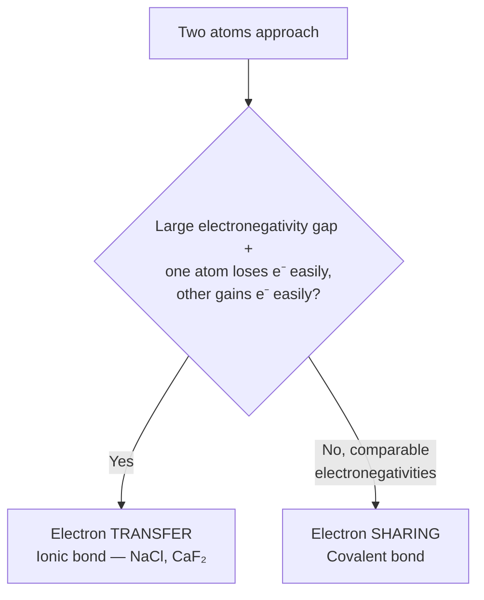

**§1.1**
- **Kössel & Lewis (1916)** — first electronic theory of bonding, from noble-gas chemical inertness.
- Lewis's atom = positively charged **kernel** (nucleus + inner e⁻) + valence shell holding max 8 e⁻ (**octet**).
- **Lewis symbols**: valence electrons drawn as dots around the symbol.
- Dot count = valence electron count = group valence (or 8 − dot count, past mid-period).
- Cubical 8-corner picture is a historical mnemonic only — dropped by Langmuir (§2.2).

**§1.2**
- Kössel's four observations: halogens/alkali metals flank noble gases on the periodic table.
- Halogens **gain** an electron → anions; alkali metals **lose** an electron → cations.
- Both directions reach a noble-gas configuration.
- Noble gases (except He, duplet) have stable ns²np⁶.
- Resulting ions held by **electrostatic attraction**.
- NaCl: Na → Na⁺ + e⁻ ([Ne]3s¹ → [Ne]); Cl + e⁻ → Cl⁻ ([Ne]3s²3p⁵ → [Ar]).
- CaF₂: Ca → Ca²⁺ + 2e⁻ ([Ar]4s² → [Ar]); F + e⁻ → F⁻ (→ [Ne]), ×2.
- **Electrovalence** = number of unit charges on the ion (Ca²⁺ = +2, Cl⁻ = −1).

---

## §2 — Octet Rule and Covalent Bonds `[Board · NEET · JEE]`

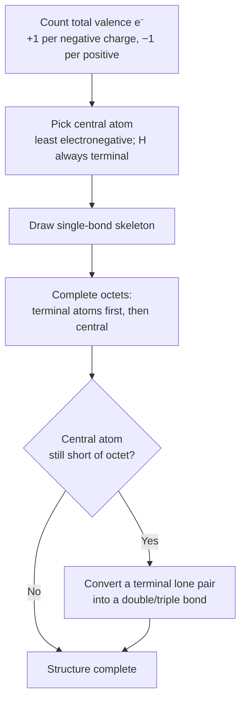

**§2.1 The Octet Rule**
- **Octet Rule** (Kössel-Lewis, 1916): atoms transfer or share e⁻ to reach 8 valence e⁻ (nearest noble-gas configuration).
- Ionic bonding → electron transfer (NaCl). Covalent bonding → electron sharing (Cl₂, H₂, F₂).

**§2.2 Covalent Bond (Lewis–Langmuir, 1919)**
- **Langmuir (1919)** coined the term "covalent bond," dropped the static cube picture.
- Each bond = 1 shared electron pair; each atom contributes ≥1 electron; atoms reach octet.
- Single bond = 1 pair (Cl₂, H₂); double = 2 pairs (O₂, CO₂); triple = 3 pairs (N₂, C₂H₂).
- Trap: hydrogen is the standing exception — needs only a **duplet** (2 electrons), never an octet.

**§2.3 Writing Lewis Dot Structures**
- 5-step method — see flowchart above.
- Worked (CO): 10 valence e⁻ total → single bond leaves C short of octet → triple bond C≡O satisfies both atoms. §NOTES 2.3.
- Worked (NO₂⁻): 18 valence e⁻ total → one N=O double bond needed → 2 equally valid resonance forms. §NOTES 2.3.

**§2.4 Formal Charge**
- **Formal charge** = (valence e⁻, free atom) − (non-bonding e⁻) − ½(bonding e⁻).
- Formal charge is bookkeeping, NOT a real, measurable charge separation.
- Preferred Lewis structure = smallest formal charges.
- Tie-break rules: (1) negative charge on the more electronegative atom; (2) fewer atoms carrying any charge at all.
- Worked (O₃): formal charges +1 (central O), 0 (double-bonded terminal O), −1 (single-bonded terminal O) — sum = 0, matches neutral O₃. §NOTES 2.4.

---

## §3 — Limitations of the Octet Rule `[Board · NEET]`

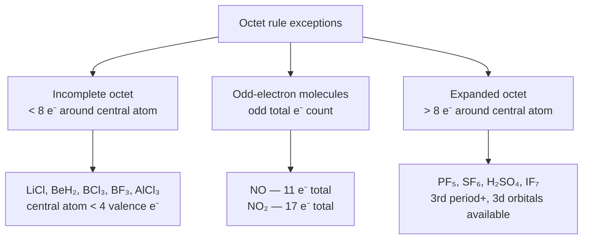

- Octet rule works best for **period-2** elements; not universal.
- **Incomplete octet**: LiCl (Li: 2e⁻), BeH₂ (Be: 4e⁻), BCl₃/BF₃ (B: 6e⁻), AlCl₃ (Al: 6e⁻) — all central atoms with < 4 valence e⁻.
- **Odd-electron molecules**: NO (11e⁻ total), NO₂ (17e⁻ total) — an odd total makes universal octets arithmetically impossible.
- **Expanded octet**: PF₅ (10e⁻ at P), SF₆ (12e⁻ at S), H₂SO₄ (12e⁻ at S), IF₇ (14e⁻ at I) — needs accessible 3d orbitals, 3rd period onward.
- Trap: expansion is not automatic for every heavy p-block atom — SCl₂ still obeys a plain octet (8e⁻ at S). §NOTES 3.3.
- Other drawbacks: noble-gas "inertness" isn't absolute (XeF₂, KrF₂, XeOF₂ exist); the rule is silent on molecular **shape** (needs VSEPR, §7) and on **energetics/stability** (needs bond enthalpy and MO theory, §5, §10).

---

## §4 — Ionic (Electrovalent) Bond `[Board · NEET · JEE]`

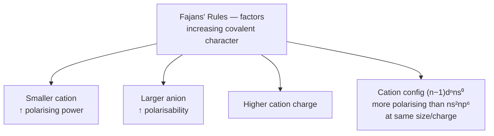

**§4.1 Conditions Favouring Ionic Bonds**
- Three conditions: (1) low ionization enthalpy of the metal, (2) highly negative electron gain enthalpy of the non-metal, (3) high lattice enthalpy of the resulting solid (the payoff).

**§4.2 Nature of Ionic Compounds**
- Crystalline solids — orderly 3-D lattice of cations and anions, coulombic attraction.
- Rock-salt structure (NaCl): every Na⁺ surrounded by 6 Cl⁻, and vice versa.
- Cations usually from metals, anions from non-metals — NH₄⁺ (two non-metals) is the notable cation exception.
- NaCl energetics: Na(g)→Na⁺(g)+e⁻ = +495.8 kJ/mol; Cl(g)+e⁻→Cl⁻(g) = −348.7 kJ/mol → net **+147.1 kJ/mol (endothermic)**.
- Lattice formation releases **−788 kJ/mol** — far outweighs the +147.1, making NaCl(s) formation favourable overall.
- Trap: stability of an ionic compound is measured by **lattice enthalpy**, not by whether the ions individually reached a noble-gas configuration. §NOTES 4.2.

**§4.3 Lattice Enthalpy**
- **Lattice enthalpy** = energy to completely separate 1 mole of a solid ionic compound into gaseous ions. NaCl = 788 kJ/mol.
- Involves both attractive (opposite-charge) and repulsive (like-charge) forces.
- Cannot be computed from simple pairwise coulombic interaction alone — 3-D crystal geometry needs a Born–Haber cycle (higher classes).

**§4.4 Fajans' Rules**
- No bond is 100% ionic or 100% covalent — see mindmap above for the four factors that increase covalent character in an "ionic" bond.
- Mechanism: the cation polarises the anion's electron cloud toward itself.

---

## §5 — Bond Parameters `[Board · NEET · JEE]`

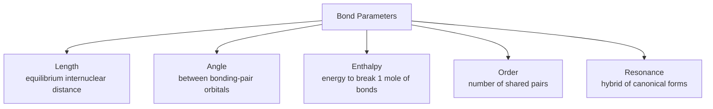

**§5.1 Bond Length**
- **Bond length** = equilibrium internuclear distance, potential energy minimum.
- Covalent A–B: R ≈ r_A + r_B (sum of **covalent radii**).
- **Van der Waals radius > covalent radius**, always — e.g. Cl: r_cov = 99 pm, r_vdW = 180 pm (no bond pulls non-bonded atoms as close).
- Key lengths (pm): H–H 74 · F–F 144 · Cl–Cl 199 · C–C 154 · C=C 133 · C≡C 120 · C–H 107 · C–O 143 · C=O 121 · C≡N 116 · N≡N 109 · O=O 121 · H–F 92 · H–Cl 127 · N–O 136 · O–H 96.
- Higher bond order → shorter bond length.

**§5.2 Bond Angle**
- **Bond angle** = angle between bonding-pair orbitals at the central atom, measured spectroscopically.
- Example: H–O–H in H₂O = 104.5°.

**§5.3 Bond Enthalpy**
- **Bond enthalpy** = energy to break 1 mole of a specific bond, gaseous state, kJ/mol. Larger value = stronger bond.
- H–H = 435.8 · O=O = 498 · N≡N = 946.0 (among the highest known) · H–Cl = 431.0.
- Polyatomic molecules: successive bonds of the same type cost different energies → use **mean bond enthalpy**.
- Worked (H₂O): O–H step 1 = 502 kJ/mol, step 2 = 427 kJ/mol → mean = (502+427)/2 = 464.5 kJ/mol.
- Trap: don't conflate one specific bond-dissociation step with the averaged mean bond enthalpy. §NOTES 5.3.

**§5.4 Bond Order**
- **Bond order** (Lewis) = number of shared electron pairs: 1/2/3 for single/double/triple.
- Fractional bond orders from resonance: 1.33 (NO₃⁻, CO₃²⁻, SO₃) · 1.5 (O₃).
- Isoelectronic species share bond order: F₂ & O₂²⁻ → 1; N₂, CO, NO⁺ → 3.
- Correlation: ↑ bond order ⇒ ↑ bond enthalpy ⇒ ↓ bond length — all three move together.

**§5.5 Resonance Structures**
- **Resonance**: one Lewis structure is inadequate → several **canonical forms** (same nuclei, same e⁻ count, different π-electron/lone-pair placement) → real structure = **resonance hybrid**.
- O₃ worked: canonical forms individually have O–O = 148 pm and O=O = 121 pm; experimentally **both** real O–O bonds = 128 pm (identical, intermediate).
- Canonical forms have no real existence; molecule does NOT switch between them; no equilibrium (unlike tautomerism, §12).
- Resonance stabilises: hybrid energy < any single canonical form's energy.
- Other examples (3 canonical forms unless noted): CO₃²⁻ (bond order 1.33) · CO₂ · NO₃⁻ (1.33) · SO₃ (1.33) · NO₂⁻/NO₂ (2 forms).

---

## §6 — Polarity of Bonds and Dipole Moment `[Board · NEET]`

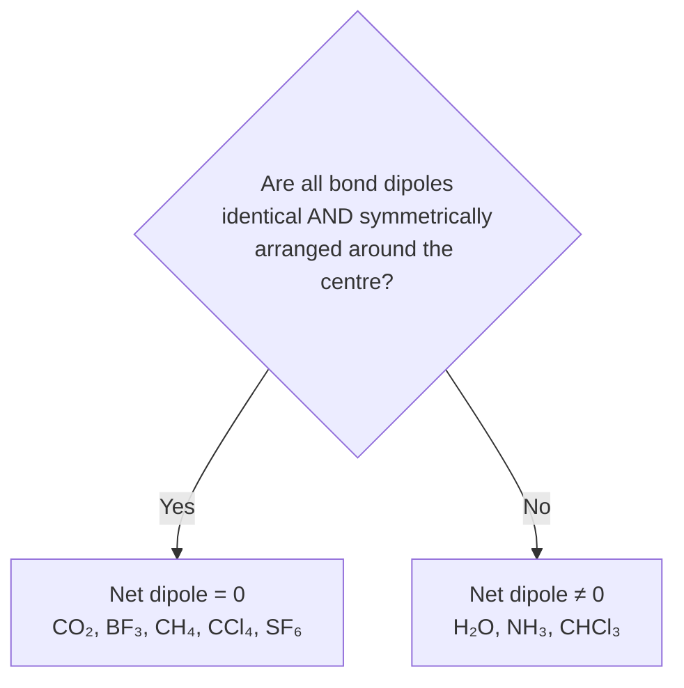

**§6.1 Polar vs Non-Polar Bonds**
- **Non-polar covalent**: identical atoms / equal electronegativity, shared pair at exact midpoint (H₂, Cl₂, N₂).
- **Polar covalent**: different electronegativity, pair shifted toward the more electronegative atom, δ+/δ− (HF, HCl, H₂O).

**§6.2 Dipole Moment (µ)**
- **µ = Q × r** (charge magnitude × separation of charge centres).
- Unit: Debye; 1 D = 3.33564×10⁻³⁰ C·m. Named after **Peter Debye** (Nobel Prize, 1936).
- Vector — chemistry convention draws the crossed arrow with the cross on the δ+ end, arrowhead on the δ− end.
- µ = 0: H₂, CO₂, BF₃, BeF₂, CH₄, CCl₄, SF₆, PCl₅ (symmetric cancellation).
- µ ≠ 0: HF 1.78 D (most polar diatomic) · HCl 1.07 D · H₂O 1.85 D · NH₃ 1.47 D · NF₃ 0.23 D · CHCl₃ 1.04 D · H₂S 0.95 D.
- Bent AB₂: µ_net = 2µ_bond·cos(A/2). A = 180° → cos(90°) = 0 → µ_net = 0 (matches CO₂). A = 104.5° → µ_net sizeable (matches H₂O).

**§6.3 NH₃ vs NF₃**
- Both pyramidal, 1 lone pair on N — yet µ(NH₃) = 4.90×10⁻³⁰ C·m **>** µ(NF₃) = 0.8×10⁻³⁰ C·m, despite F being more electronegative than H.
- NH₃: lone-pair dipole and resultant N–H bond dipoles point the SAME way → ADD.
- NF₃: F pulls bond dipoles strongly toward itself; lone-pair dipole ends up OPPOSITE the resultant → SUBTRACT.
- Trap: "more electronegative substituent ⇒ larger molecular dipole" is FALSE in general — direction of the lone-pair contribution can dominate. §NOTES 6.3.

---

## §7 — VSEPR Theory `[Board · NEET · JEE]`

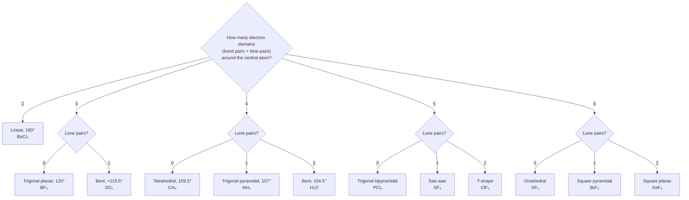

**§7.1–7.2 Introduction and Postulates**
- Proposed by **Sidgwick & Powell (1940)**, refined by **Nyholm & Gillespie (1957)**.
- Predicts molecular **shape** — something the Lewis approach cannot do. Does NOT explain bonding energetics (needs VB/MO theory, §8–§10).
- Postulates: shape depends on valence-shell electron-pair count (bonded + lone) around the central atom; pairs repel and arrange to minimise repulsion; valence shell treated as a sphere; a multiple bond counts as one "super pair"; applies to any one resonance structure.

**§7.3 Key Repulsion Order**
- **lp–lp > lp–bp > bp–bp**.
- Reason: lone pair localised entirely on the central atom (fatter cloud); bond pair shared between two nuclei (thinner, more compact).
- Effect: each additional lone pair compresses bond angles below the ideal geometric value.

**§7.4–7.5 Molecular Geometries** (domains → shape → angle → example)

| Domains | Lone pairs | Shape | Angle | Example |
| --- | --- | --- | --- | --- |
| 2 | 0 | Linear | 180° | BeCl₂ |
| 3 | 0 | Trigonal planar | 120° | BF₃ |
| 3 | 1 | Bent | 119.5° | SO₂ |
| 4 | 0 | Tetrahedral | 109.5° | CH₄ |
| 4 | 1 | Trigonal pyramidal | 107° | NH₃ |
| 4 | 2 | Bent | 104.5° | H₂O |
| 5 | 0 | Trigonal bipyramidal | 90°, 120° | PCl₅ |
| 5 | 1 | See-saw | ~90°, ~120° | SF₄ |
| 5 | 2 | T-shape | ~90° | ClF₃ |
| 6 | 0 | Octahedral | 90° | SF₆ |
| 6 | 1 | Square pyramidal | ~90° | BrF₅ |
| 6 | 2 | Square planar | 90° | XeF₄ |

**§7.6 Worked Explanations**
- Bond-angle order: CH₄ (109.5°) > NH₃ (107°) > H₂O (104.5°) — each successive lone pair compresses the angle further.
- Trap: VSEPR predicts geometry accurately but gives no theoretical justification for *why* electron pairs repel the way they do. §NOTES 7.6.

---

## §8 — Valence Bond (VB) Theory `[Board · NEET · JEE]`

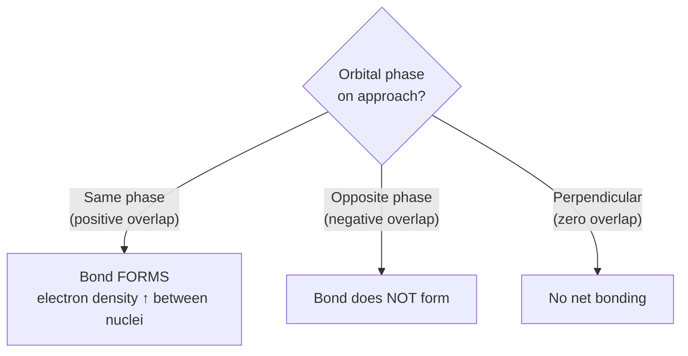

**§8.1 Introduction**
- **Heitler & London (1927)**, developed further by **Pauling**.
- Explains bond **energetics** and **directional properties** — exactly what Lewis/VSEPR leave unexplained.

**§8.2 Formation of H₂ — Energy Curve**
- Two H atoms approaching: new attractive forces (N_A–e_B, N_B–e_A) outweigh new repulsive forces (e_A–e_B, N_A–N_B).
- Potential energy falls to a minimum at equilibrium bond length **74 pm**; well depth = **435.8 kJ/mol**.
- Pushing closer than 74 pm → potential energy rises sharply (repulsion now dominates).

**§8.3 Orbital Overlap Concept**
- Greater overlap → stronger bond.
- Bond requires electrons of **opposite spin** pairing, with orbitals overlapping in the same phase — see flowchart above for the three overlap outcomes.

**§8.4 Types of Covalent Bonds**
- **σ bond**: head-on/axial overlap (s–s, s–p, p–p axial) — strong, extensive overlap. Always the **first** bond formed between any two atoms.
- **π bond**: sideways/lateral overlap of parallel p orbitals, perpendicular to the internuclear axis, two lobes above/below the bond plane. Weaker than σ. Never exists alone — double bond = 1σ+1π, triple bond = 1σ+2π.

**§8.5 Why Simple Orbital Overlap Fails**
- Carbon's 3 unhybridised p orbitals sit at 90° to each other → naive overlap predicts H–C–H = 90° in CH₄; actual = **109.5°**.
- Same failure for NH₃ (predicted 90°, actual 107°) and H₂O (predicted 90°, actual 104.5°).
- Gap closed by **hybridisation** (§9).

---

## §9 — Hybridisation `[Board · NEET · JEE]`

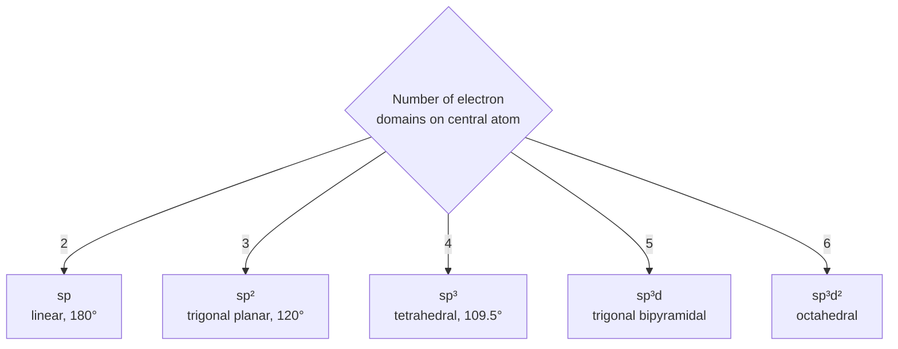

**§9.1 Introduction and Salient Features**
- **Hybridisation**: mixing of near-equal-energy atomic orbitals into a new set of equivalent hybrid orbitals (Pauling).
- Number of hybrids = number of AOs mixed. Hybrids are equivalent in energy and shape.
- Hybrid orbitals form **stronger** bonds than pure AOs (better directional overlap).
- Hybrid orbitals point to minimise electron-pair repulsion — hybridisation type always agrees with VSEPR geometry.
- Conditions: orbitals in the valence shell, near-equal energy; promotion of an electron is **not essential** beforehand; even a **filled** orbital (a lone pair) can take part.

| Type | Orbitals mixed | Count | Geometry | Angle | Example |
| --- | --- | --- | --- | --- | --- |
| sp | 1s + 1p | 2 | Linear | 180° | BeCl₂, C₂H₂ |
| sp² | 1s + 2p | 3 | Trigonal planar | 120° | BCl₃, C₂H₄ |
| sp³ | 1s + 3p | 4 | Tetrahedral | 109.5° | CH₄, NH₃, H₂O |
| sp³d | 1s + 3p + 1d | 5 | Trigonal bipyramidal | 90°, 120° | PCl₅, PF₅ |
| sp³d² | 1s + 3p + 2d | 6 | Octahedral | 90° | SF₆ |
| dsp² | 1d(inner) + 1s + 2p | 4 | Square planar | 90° | [Ni(CN)₄]²⁻ |
| d²sp³ | 2d(inner) + 1s + 3p | 6 | Octahedral | 90° | [Co(NH₃)₆]³⁺ |

**§9.2 sp** — each orbital 50% s / 50% p. Unused p_x, p_y free for π bonding. BeCl₂ (excited state 2s¹2p¹, no π bonds), C₂H₂ (2 π bonds/C), HCN, CO₂.

**§9.3 sp²** — each orbital 33% s / 67% p. 1 unhybridised p_z free for 1 π bond. BCl₃ (no π bond), C₂H₄ (C=C = 1σ+1π).

**§9.4 sp³** — each orbital 25% s / 75% p. No p orbitals left over. CH₄ (4 bond pairs, tetrahedral), NH₃ (3 bp + 1 lp, pyramidal), H₂O (2 bp + 2 lp, bent).

**§9.5 d-Orbital Hybridisations**
- **sp³d**: 3 equatorial orbitals (120°) + 2 axial orbitals (90° to equatorial plane). PCl₅, PF₅.
- Trap: PCl₅'s 5 positions are NOT equivalent — **axial bonds are longer and weaker** than equatorial (each axial pair faces 90° repulsion from 3 equatorial pairs, vs only 2 for an equatorial pair). §NOTES 9.5.
- **sp³d²**: 6 orbitals, all 90°, regular octahedral. SF₆.
- **dsp²**: uses an *inner* (n−1)d orbital + 1s + 2p → square planar. [Ni(CN)₄]²⁻, [PtCl₄]²⁻.
- **d²sp³**: uses *two inner* (n−1)d orbitals + 1s + 3p → octahedral, transition-metal complexes (e.g. [Co(NH₃)₆]³⁺).
- Distinct from sp³d² — d²sp³ uses inner (n−1)d orbitals; sp³d² uses same-shell d orbitals.

---

## §10 — Molecular Orbital (MO) Theory `[Board · NEET · JEE]`

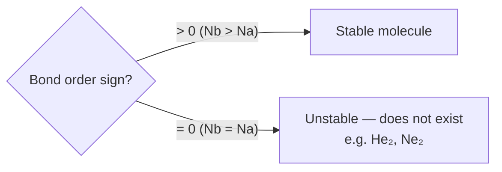

**§10.1–10.2 Introduction and Salient Features**
- **Hund & Mulliken (1932)**. Electrons occupy MOs spread over the **entire** molecule (unlike VB theory's localised bonds).
- MOs form via **LCAO** — combining atomic orbitals of comparable energy and matching symmetry.
- AO = monocentric (electron feels 1 nucleus); MO = polycentric (electron feels 2+ nuclei).
- 2 combining AOs → always 2 MOs: 1 bonding (lower energy) + 1 antibonding (higher energy).
- MOs fill via Aufbau, Pauli exclusion, and Hund's rule — exactly like atomic orbitals.

**§10.3 LCAO and the Electron-Cloud Picture**
- σ = ψ_A + ψ_B (bonding, constructive interference, density concentrated between nuclei).
- σ* = ψ_A − ψ_B (antibonding, destructive interference, nodal plane of zero density between nuclei).
- Same logic gives π (bonding, continuous cloud above/below axis) and π* (antibonding, node splits each lobe).
- Bonding MO energy < either parent AO; antibonding MO energy > either parent AO; total energy of the 2 MOs = total energy of the 2 parent AOs.
- LCAO conditions: (1) comparable AO energy, (2) same symmetry about the molecular axis, (3) maximum overlap.

**§10.4 Types of Molecular Orbitals**

| MO | Formed from | Symmetry |
| --- | --- | --- |
| σ1s, σ*1s | 1s + 1s | Cylindrically symmetric |
| σ2s, σ*2s | 2s + 2s | Cylindrically symmetric |
| σ2p_z, σ*2p_z | 2p_z + 2p_z (head-on) | Cylindrically symmetric |
| π2p_x, π*2p_x | 2p_x + 2p_x (sideways) | NOT symmetric — lobes above/below axis |
| π2p_y, π*2p_y | 2p_y + 2p_y (sideways) | NOT symmetric |

**§10.5 Energy-Level Order — Two Families**
- Trap: the single highest-yield MO-theory mistake — where σ2p_z sits relative to (π2p_x = π2p_y) **swaps** between the two families below.
- **Li₂–N₂ family**: ...σ*2s < (π2p_x=π2p_y) < σ2p_z < (π*2p_x=π*2p_y) < σ*2p_z.
- **O₂/F₂/Ne₂ family**: ...σ*2s < σ2p_z < (π2p_x=π2p_y) < (π*2p_x=π*2p_y) < σ*2p_z.
- N₂ worked (14e⁻, Li₂–N₂ order): N_b=10, N_a=4 → bond order = ½(10−4) = 3; all MOs paired → diamagnetic.
- O₂ worked (16e⁻, O₂/F₂/Ne₂ order): N_b=10, N_a=6 → bond order = ½(10−6) = 2; **2 unpaired e⁻** in degenerate π*2p → **paramagnetic**.
- This is MO theory's single biggest win over VB theory — Hund's rule forces one electron into *each* degenerate π*2p orbital before pairing.

**§10.6 Bond Order (MO Theory)**
- **Bond order = ½(N_b − N_a)**, where N_b = bonding electrons, N_a = antibonding electrons.
- Bond order > 0 → stable molecule. Bond order = 0 → unstable, does not exist (He₂, Ne₂).
- Higher bond order → shorter, stronger bond (same correlation as §5.4, now derived from first principles).

**§10.7 Electronic Configurations of Key Molecules**

| Species | Configuration | Bond order | Magnetic nature |
| --- | --- | --- | --- |
| H₂ | (σ1s)² | 1 | Diamagnetic |
| He₂ | (σ1s)²(σ*1s)² | 0 | Does not exist |
| Li₂ | KK(σ2s)² | 1 | Diamagnetic |
| Be₂ | KK(σ2s)²(σ*2s)² | 0 | Does not exist |
| B₂ | KK(σ2s)²(σ*2s)²(π2p_x¹=π2p_y¹) | 1 | **Paramagnetic** |
| C₂ | KK(σ2s)²(σ*2s)²(π2p_x²=π2p_y²) | 2 | Diamagnetic |
| N₂ | KK(σ2s)²(σ*2s)²(π2p_x²=π2p_y²)(σ2p_z)² | 3 | Diamagnetic |
| O₂ | KK(σ2s)²(σ*2s)²(σ2p_z)²(π2p_x²=π2p_y²)(π*2p_x¹=π*2p_y¹) | 2 | **Paramagnetic** |
| F₂ | KK(σ2s)²(σ*2s)²(σ2p_z)²(π2p_x²=π2p_y²)(π*2p_x²=π*2p_y²) | 1 | Diamagnetic |
| Ne₂ | all bonding/antibonding pairs filled equally | 0 | Does not exist |

- Trap: **B₂ is paramagnetic**, same reasoning as O₂ (Hund's rule half-fills its degenerate π2p pair) — one period earlier, easy to forget. §NOTES 10.7.
- Trap: **C₂'s double bond is 1π+1π, with no σ bond between the carbons** — σ2p_z is empty in C₂, unlike a normal double bond (1σ+1π).

**§10.8 Molecular Properties from MO Theory**

| Property | MO basis |
| --- | --- |
| Bond order | ½(N_b−N_a); higher = shorter, stronger bond |
| Stability | Stable if N_b > N_a |
| Diamagnetic | All MOs doubly occupied |
| Paramagnetic | One or more MOs singly occupied |
| Bond length | Inversely related to bond order |

---

## §11 — Hydrogen Bonding `[Board · NEET]`

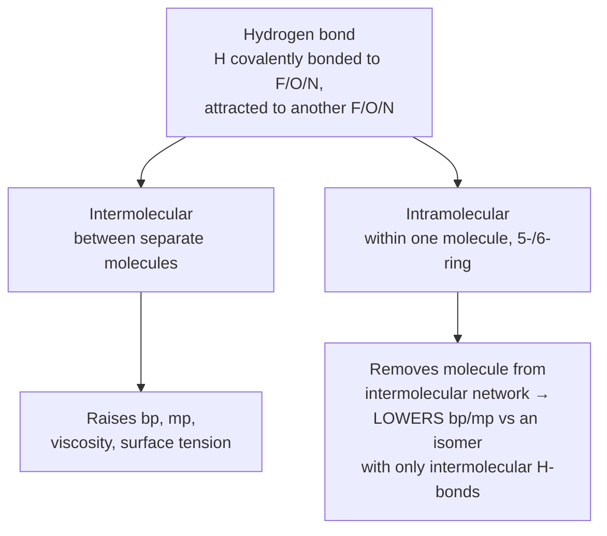

**§11.1 Introduction**
- **Hydrogen bond**: H covalently bonded to a highly electronegative atom (**F, O, or N**), attracted to another F/O/N atom (same or different molecule).
- Weaker than a covalent bond, stronger than van der Waals forces. Drawn as a dotted line (···).
- Needs BOTH high electronegativity AND small atomic size — only **F, O, N** qualify (Cl is electronegative but too large; H···Cl is far weaker than H···F).

**§11.2 Cause of Formation**
- H bonded to electronegative X → shared pair shifts heavily toward X → H becomes strongly δ+, X becomes δ−.
- This δ+ H is attracted to the δ− X of a neighbouring molecule (or another part of the same molecule).
- H-bond strength is **maximum in the solid state**, **minimum in the gaseous state**.

**§11.3 Types of Hydrogen Bonds**
- **Intermolecular** — between two different molecules (HF chains; each H₂O donates 2 and accepts 2 H-bonds). Raises boiling point, melting point, viscosity, surface tension.
- **Intramolecular** — within the same molecule, closes a 5- or 6-membered ring (o-nitrophenol). Makes the molecule effectively cyclic, removing it from the intermolecular network.
- Trap: *o*-nitrophenol (intramolecular H-bond) has a **lower** boiling point than *p*-nitrophenol (only intermolecular H-bonding available). §NOTES 11.3.

---

## §12 — Key Distinctions `[Board · NEET · JEE]`

| Feature | Ionic bond | Covalent bond |
| --- | --- | --- |
| Formation | Electron transfer | Electron sharing |
| Typically between | Metal + non-metal | Non-metals |
| Nature | Electrostatic attraction | Shared electron pair |
| Directional? | No | Yes |
| Examples | NaCl, CaF₂ | H₂, Cl₂, CH₄ |

| Feature | σ bond | π bond |
| --- | --- | --- |
| Overlap | Head-on (axial) | Sideways (lateral) |
| Extent of overlap | Large | Small |
| Strength | Stronger | Weaker |
| Free rotation? | Yes (in isolation) | No |
| Position in multiple bond | Always first | Always 2nd/3rd |

| Feature | VB theory | MO theory |
| --- | --- | --- |
| Orbital picture | Localised (2 atoms) | Delocalised (whole molecule) |
| Method | Orbital overlap | LCAO |
| Explains O₂ paramagnetism? | No | **Yes** |
| Bond order source | Read off Lewis structure | ½(N_b−N_a) |

| Feature | Resonance | Tautomerism |
| --- | --- | --- |
| Switching between forms? | No — canonical forms have no real existence | Yes — genuine equilibrium |
| Isolable forms? | Only the hybrid exists | Both forms isolable |
| Example | O₃, CO₃²⁻ | Keto–enol forms |

---

## §13 — Worked Solutions `[Board · NEET · JEE]`

- **13.1** CO₃²⁻ resonance (NCERT Problem 4.3): 3 canonical forms (C=O on each of the 3 O's in turn) → each C–O bond order = 4/3 = 1.33 → matches the equal experimental C–O bond lengths.
- **13.2** CO₂ resonance (NCERT Problem 4.4): experimental C–O = 115 pm, between C=O (121 pm) and C≡O (110 pm) → hybrid of O=C=O plus two charge-separated triple-bond forms.
- **13.3** VSEPR shapes (NCERT Exercise 4.7): BeCl₂ linear · BCl₃ trigonal planar · SiCl₄ tetrahedral · AsF₅ trigonal bipyramidal · H₂S bent · PH₃ trigonal pyramidal.
- **13.4** Electron transfer (NCERT Exercise 4.14): K,S → K₂S · Ca,O → CaO · Al,N → AlN.
- **13.5** Ionic-character ranking (NCERT Exercise 4.19): N₂ < ClF₃ < SO₂ < K₂O < LiF (tracks increasing electronegativity difference).
- **13.6** Hybridisation on adduct formation (NCERT Exercises 4.25–4.26): AlCl₃ (sp²) → AlCl₄⁻ (sp³, accepts Cl⁻ lone pair). BF₃ (sp²) → F₃B·NH₃ adduct (B becomes sp³); N in NH₃ stays sp³ — its lone pair just becomes a bond pair.
- **13.7** Which overlap is NOT σ (NCERT Exercise 4.29): of 1s+1s, 1s+2p_x, 2p_y+2p_y, 1s+2s — only **2p_y+2p_y** fails, since 2p_y is perpendicular to the internuclear (x) axis and can only overlap sideways (π character).
- **13.8** O₂-family bond order/stability/magnetism (NCERT Exercises 4.36, 4.40):

| Species | Total e⁻ | Bond order | Magnetic nature |
| --- | --- | --- | --- |
| N₂ | 14 | 3 | Diamagnetic |
| O₂⁺ | 15 | 2.5 | Paramagnetic (1 unpaired) |
| O₂ | 16 | 2 | Paramagnetic (2 unpaired) |
| O₂⁻ | 17 | 1.5 | Paramagnetic (1 unpaired) |
| O₂²⁻ | 18 | 1 | Diamagnetic |

  Stability by bond order: O₂⁺ > O₂ > O₂⁻ > O₂²⁻ — removing an electron from O₂ empties antibonding π*2p (bond order rises); adding electrons keeps filling π*2p (bond order falls).

---

## Rapid Reference

| Fact | Value |
| --- | --- |
| Octet rule | 8 valence e⁻ (H, He: duplet, 2 e⁻) |
| Formal charge | F.C. = V − L − ½B (V = valence e⁻ free atom, L = lone-pair e⁻, B = bonding e⁻) |
| Bond order (Lewis) | number of shared electron pairs |
| Bond order (MO) | ½(N_b − N_a) |
| Dipole moment | µ = Q × r |
| Net dipole, bent AB₂ | µ_net = 2µ_bond·cos(A/2) |
| 1 Debye | 3.33564 × 10⁻³⁰ C·m |
| H₂ bond length / enthalpy | 74 pm / 435.8 kJ mol⁻¹ |
| N≡N bond enthalpy | 946.0 kJ mol⁻¹ — highest common diatomic |
| F–F bond enthalpy | 155 kJ mol⁻¹ — unusually weak (lp–lp repulsion, small atom) |
| NaCl lattice enthalpy | 788 kJ mol⁻¹ |
| NaCl ionization + electron-gain steps | +495.8 and −348.7 kJ mol⁻¹ → net +147.1 kJ mol⁻¹ (endothermic) |
| H₂O bond angle | 104.5° |
| NH₃ bond angle | 107° |
| CH₄ bond angle | 109.5° |
| VSEPR repulsion order | lp–lp > lp–bp > bp–bp |
| Kössel & Lewis — octet rule | 1916 |
| Langmuir — term "covalent bond" | 1919 |
| Heitler & London — VB theory | 1927 |
| Sidgwick & Powell — VSEPR | 1940 |
| Nyholm & Gillespie — VSEPR refined | 1957 |
| Hund & Mulliken — MO theory | 1932 |
| Fajans — Fajans' rules | 1923 |
| Debye — dipole moment unit | Nobel Prize 1936 |
| O₂ magnetic nature | Paramagnetic — VB theory fails, MO theory predicts it |
| B₂ magnetic nature | Paramagnetic (same Hund's-rule reasoning as O₂) |
| Elements capable of H-bonding | F, O, N only |
| Isoelectronic, bond order 3 | N₂, CO, NO⁺, CN⁻ |
| Isoelectronic, bond order 1 | F₂, O₂²⁻ |
| Species that do not exist (b.o. = 0) | He₂, Be₂, Ne₂ |
| O₃ resonance-hybrid O–O bond length | 128 pm (between 121 pm and 148 pm) |

---

*End of CNOTES — Ch. 4: Chemical Bonding and Molecular Structure.*