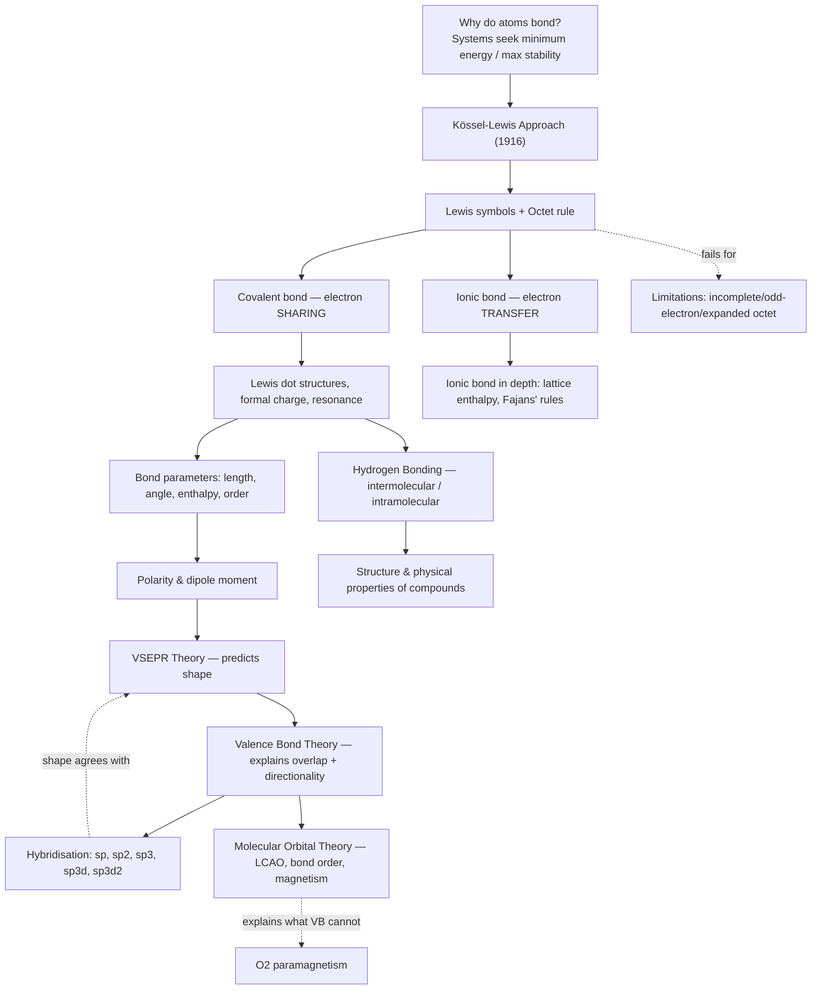
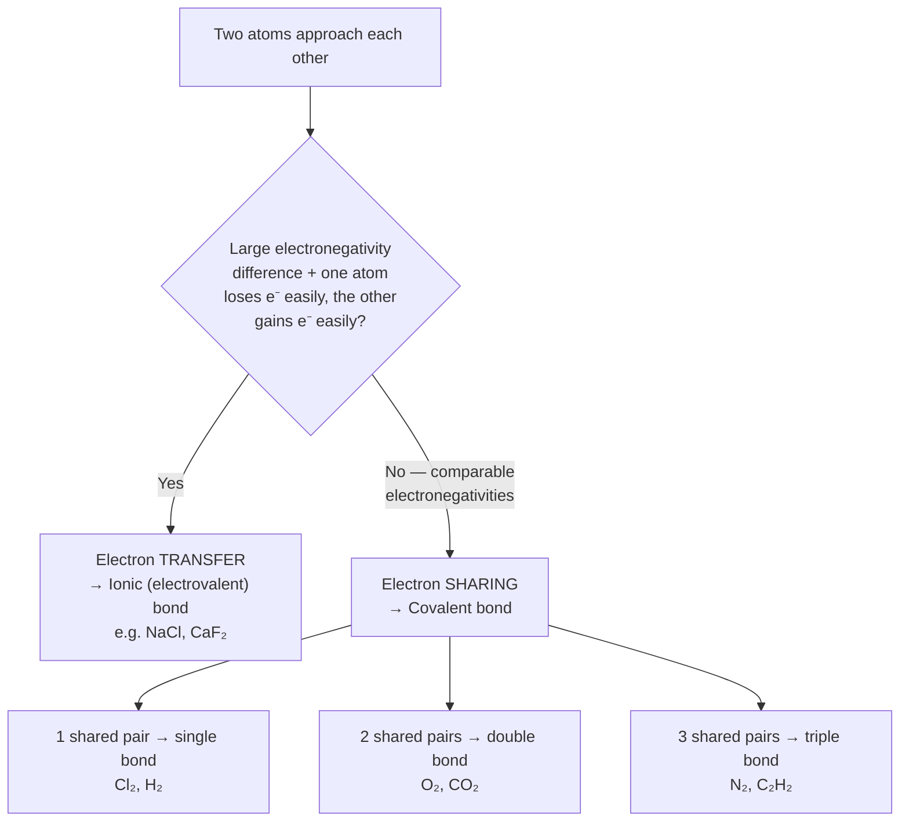
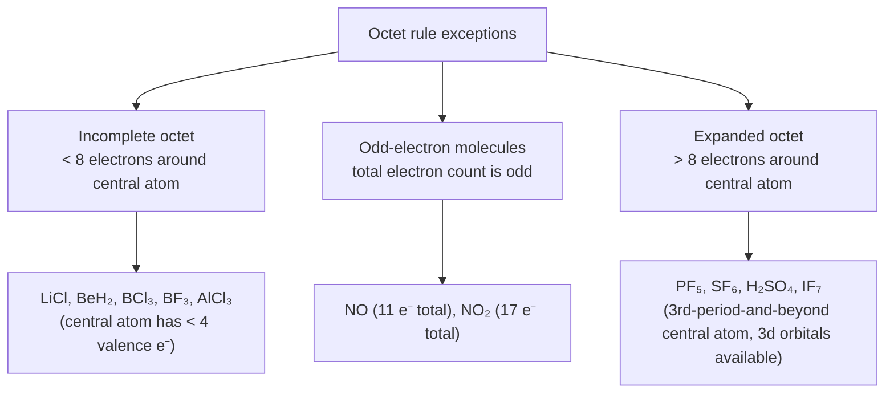
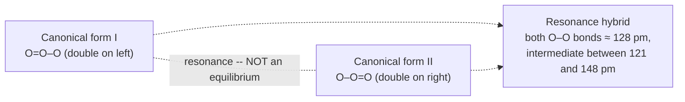
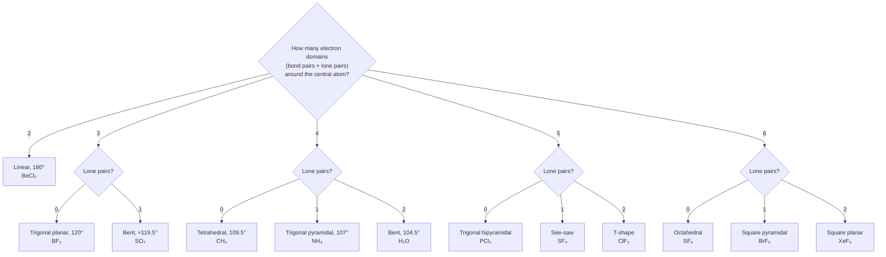
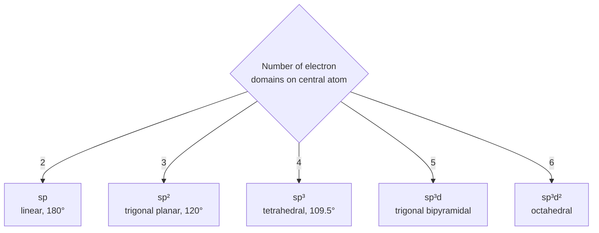
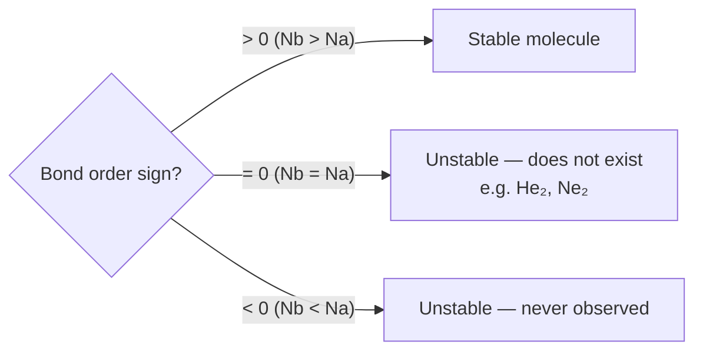

# Chapter 4: Chemical Bonding and Molecular Structure

**Branch:** Physical / Inorganic bridge chapter · **Level:** Board · NEET · JEE
*Upgraded NoteBooks-Framework edition — built from the NCERT Class 11 Chemistry Unit 4 PDF, reconciled with the existing handwritten-derived note. Diagrams added throughout: Mermaid roadmaps/decision logic, TikZ structural and orbital figures, and Desmos interactive graphs (marked where syntax is reviewed but not yet confirmed to render live — see the note before the first Desmos block in Section 8).*

---

## 🗺️ Concept Roadmap



*Read this top-down: Kössel–Lewis gets you dot structures and the octet rule, which VSEPR turns into 3‑D shape, which VB theory explains at the orbital level via hybridisation, and which MO theory re-derives from scratch — catching the one thing VB theory misses (O₂'s paramagnetism).*

---

## SECTION 1 — KÖSSEL-LEWIS APPROACH TO CHEMICAL BONDING ⭐⭐ `[Board · NEET]`

### 1.1 Background and Lewis Symbols

**Historical context:** In 1916, **Kössel** and **Lewis** independently gave the first logical explanation of valence, based on the chemical inertness of noble gases.

**Lewis's atomic model:**

* An atom = a positively charged **kernel** (nucleus + inner electrons) + an outer valence shell.
* The outer shell can hold a **maximum of eight electrons**, pictured as occupying the corners of a cube around the kernel.
* Eight electrons (an **octet**) is a particularly stable arrangement — noble gases already have it; other atoms bond to reach it.

```tikz
\begin{tikzpicture}[thick, scale=1.0]
  \draw (-1,-1) rectangle (1,1);
  \draw (-1,-1) -- (-0.4,-0.4);
  \draw (1,-1) -- (0.4,-0.4);
  \draw (1,1) -- (0.4,0.4);
  \draw (-1,1) -- (-0.4,0.4);
  \draw (-0.4,-0.4) rectangle (0.4,0.4);
  \node[font=\small] at (0,0) {kernel};
  \fill (-1,-1) circle (2.2pt); \fill (1,-1) circle (2.2pt);
  \fill (1,1) circle (2.2pt); \fill (-1,1) circle (2.2pt);
  \fill (-0.4,-0.4) circle (2.2pt); \fill (0.4,-0.4) circle (2.2pt);
  \fill (0.4,0.4) circle (2.2pt); \fill (-0.4,0.4) circle (2.2pt);
  \node[below, font=\itshape\small, text=gray] at (0,-1.6) {Lewis's original picture: 8 valence electrons sit at the corners of a cube around the kernel — a stable octet};
\end{tikzpicture}
```
This cubical picture is only a historical mnemonic (Langmuir later dropped it — Section 2.2) — the real payoff is the **counting rule** it produces: valence electrons shown as dots around the symbol.

**Lewis symbols** for period 2 elements:

| Element | Valence electrons | Lewis symbol (dots around symbol) |
| --- | --- | --- |
| Li | 1 | one dot |
| Be | 2 | two dots |
| B  | 3 | three dots |
| C  | 4 | four dots |
| N  | 5 | five dots |
| O  | 6 | six dots |
| F  | 7 | seven dots |
| Ne | 8 | eight dots |

> **Significance of Lewis symbols:** the number of dots = number of valence electrons = the element's **group valence**, which equals either the dot-count itself, or \( 8 - (\text{dot count}) \) for elements past the middle of a period.

### 1.2 Kössel's Observations

Kössel drew attention to four key facts:

1. In the periodic table, the highly electronegative **halogens** and the highly electropositive **alkali metals** sit on either side of the **noble gases**.
2. Halogen atoms **gain** an electron → negative ions; alkali metal atoms **lose** an electron → positive ions — both to reach a noble-gas configuration.
3. Noble gases (except He, which has a duplet) have the stable outer configuration \( ns^2np^6 \).
4. The resulting ions are held together by **electrostatic attraction**.

**Example — NaCl formation:**

\[
\begin{aligned}
\text{Na} &\rightarrow \text{Na}^+ + e^- \qquad &[\text{Ne}]3s^1 \rightarrow [\text{Ne}] \\
\text{Cl} + e^- &\rightarrow \text{Cl}^- \qquad &[\text{Ne}]3s^23p^5 \rightarrow [\text{Ne}]3s^23p^6 = [\text{Ar}] \\
\text{Na}^+ + \text{Cl}^- &\rightarrow \text{NaCl (or Na}^+\text{Cl}^-)
\end{aligned}
\]

**Example — CaF₂ formation:**

\[
\begin{aligned}
\text{Ca} &\rightarrow \text{Ca}^{2+} + 2e^- \qquad &[\text{Ar}]4s^2 \rightarrow [\text{Ar}] \\
\text{F} + e^- &\rightarrow \text{F}^- \qquad &[\text{He}]2s^22p^5 \rightarrow [\text{He}]2s^22p^6 = [\text{Ne}] \\
\text{Ca}^{2+} + 2\text{F}^- &\rightarrow \text{CaF}_2 \text{ or Ca}^{2+}(\text{F}^-)_2
\end{aligned}
\]

> [!example]
> **Electrovalent bond and electrovalence:** the bond formed by electrostatic attraction between oppositely charged ions is the **electrovalent (ionic) bond**. **Electrovalence** = the number of unit charges on the ion — so calcium's electrovalence is +2, chlorine's is −1.


*Kössel's picture only covers the ionic branch cleanly — the covalent branch needed Lewis's separate idea of shared electron pairs (Section 2), which is why the two names are always paired.*

---

## SECTION 2 — OCTET RULE AND COVALENT BONDS ⭐⭐⭐ `[Board · NEET · JEE]`

### 2.1 The Octet Rule

> [!example]
> **Octet Rule (Kössel and Lewis, 1916):** atoms combine — by transferring or sharing valence electrons — so as to acquire **eight electrons in their outermost shell**, matching the configuration of the nearest noble gas.

* **Ionic bonding** → electron transfer (e.g. NaCl).
* **Covalent bonding** → electron sharing (e.g. Cl₂, H₂, F₂).

### 2.2 Covalent Bond (Lewis–Langmuir, 1919)

**Langmuir (1919)** refined Lewis's model by dropping the static cubical-octet picture and introducing the term **covalent bond**.

**Conditions for covalent-bond formation:**

* Each bond forms by sharing **one electron pair** between two atoms.
* Each combining atom contributes **at least one electron** to that shared pair.
* The combining atoms reach outer-shell noble-gas (octet) configurations as a result.

| Bond type | Electron pairs shared | Examples | Bond order |
| --- | --- | --- | --- |
| Single bond | 1 | Cl₂, H₂ | 1 |
| Double bond | 2 | O₂, CO₂, C₂H₄ | 2 |
| Triple bond | 3 | N₂, C₂H₂, CO | 3 |

> [!warning]
> Hydrogen is the standing exception to the octet rule — it needs only **two** electrons (a *duplet*), matching helium, not eight.

**Formation of Cl₂ (each Cl is one electron short of Ar):**

```tikz
\begin{tikzpicture}[thick, scale=1.1]
  \node[font=\Large] (Cl1) at (-1.3,0) {Cl};
  \node[font=\Large] (Cl2) at (1.3,0) {Cl};
  \draw[line width=1.4pt] (Cl1) -- (Cl2);
  \fill (-2.1,0.35) circle (1.6pt); \fill (-2.1,-0.35) circle (1.6pt);
  \fill (-1.75,0.75) circle (1.6pt); \fill (-1.35,0.75) circle (1.6pt);
  \fill (-1.75,-0.75) circle (1.6pt); \fill (-1.35,-0.75) circle (1.6pt);
  \fill (2.1,0.35) circle (1.6pt); \fill (2.1,-0.35) circle (1.6pt);
  \fill (1.75,0.75) circle (1.6pt); \fill (1.35,0.75) circle (1.6pt);
  \fill (1.75,-0.75) circle (1.6pt); \fill (1.35,-0.75) circle (1.6pt);
  \node[below, font=\itshape\small, text=gray] at (0,-1.4) {one shared pair between Cl atoms $\Rightarrow$ both attain an octet (Ar configuration)};
\end{tikzpicture}
```

### 2.3 Writing Lewis Dot Structures — Systematic Steps

1. **Count total valence electrons** — sum valence electrons of all combining atoms; add one electron per negative charge (anion), subtract one per positive charge (cation).
2. **Identify the central atom** — usually the **least electronegative** atom (H is always terminal, never central).
3. **Draw the skeleton** — connect atoms with single bonds first.
4. **Distribute remaining electrons** — complete octets on terminal atoms first, then the central atom.
5. **Use multiple bonds if the central atom still lacks an octet** — convert a terminal lone pair into a second/third shared pair.

> [!example]
> ### 2.3 Solved — Lewis structure of CO (NCERT Problem 4.1)
> **Given:** C (\(2s^22p^2\)) and O (\(2s^22p^4\)).
> **Find:** the Lewis dot structure of CO.
> **Concept:** count valence electrons, build the skeleton, then add multiple bonds until *both* atoms reach an octet.
> **Work:**
> \[
> \text{Total valence electrons} = 4\,(\text{C}) + 6\,(\text{O}) = 10
> \]
> A single bond C–O with the remaining 8 electrons as lone pairs completes O's octet but leaves only 2 electrons (one lone pair) on C — carbon is short of an octet. Converting two of oxygen's lone pairs into two more shared pairs gives a **triple bond**:
> \[
> \boxed{:\!\text{C}\!\equiv\!\text{O}\!:}
> \]
> **Check:** C now has 1 lone pair + 3 bonding pairs = 8 electrons around it; O has 1 lone pair + 3 bonding pairs = 8 electrons around it. Both atoms satisfy the octet rule. ✓

```tikz
\begin{tikzpicture}[thick, scale=1.2]
  \node[font=\Large] (C) at (-1.1,0) {C};
  \node[font=\Large] (O) at (1.1,0) {O};
  \draw[line width=1.3pt] (-0.65,0.12) -- (0.65,0.12);
  \draw[line width=1.3pt] (-0.65,0) -- (0.65,0);
  \draw[line width=1.3pt] (-0.65,-0.12) -- (0.65,-0.12);
  \fill (-1.85,0.18) circle (1.6pt); \fill (-1.85,-0.18) circle (1.6pt);
  \fill (1.85,0.35) circle (1.6pt); \fill (1.85,0) circle (1.6pt);
  \fill (1.55,0.65) circle (1.6pt); \fill (1.9,0.65) circle (1.6pt);
  \node[below, font=\itshape\small, text=gray] at (0,-0.9) {C$\equiv$O: one lone pair on C, one lone pair on O -- both complete an octet};
\end{tikzpicture}
```

> [!example]
> ### 2.3 Solved — Lewis structure of NO₂⁻ (NCERT Problem 4.2)
> **Given:** the nitrite ion, N bonded to two O atoms, with an overall −1 charge.
> **Find:** the Lewis dot structure.
> **Concept:** count electrons including the ionic charge; put the least-electronegative atom (N) in the centre; complete octets, resorting to one double bond only where needed.
> **Work:**
> \[
> \text{Total valence electrons} = 5\,(\text{N}) + 2\times 6\,(\text{O}) + 1\,(\text{charge}) = 18
> \]
> A single bond from N to each O, with all remaining pairs as lone pairs, completes both O octets but leaves only **6** electrons (3 lone pairs) on N — one short of an octet. Converting one N–O lone pair into a second shared pair (a double bond to *one* oxygen) fixes this — and gives two equally valid resonance forms (Section 5.5), since either oxygen can carry the double bond:
> \[
> \boxed{\Big[\, \ddot{\text{O}}\!=\!\text{N}\!-\!\ddot{\text{O}}\!:^{\,-} \;\leftrightarrow\; {}^{-}\!:\!\ddot{\text{O}}\!-\!\text{N}\!=\!\ddot{\text{O}} \,\Big]}
> \]
> **Check:** in each form N has 1 lone pair + 4 bonding electrons... recount: N has 1 lone pair (2e⁻) + 3 bonding pairs (6e⁻ shared, N "owns" 3) = 5 electrons formally around N in the bond-sharing sense, but the octet count (total electrons *surrounding* N, shared + lone) is \(2 + 6 = 8\). ✓ Both O atoms also reach 8. ✓

### 2.4 Formal Charge ⭐⭐ `[NEET · JEE]`

> **Formal charge:** the charge assigned to an atom in a Lewis structure, assuming *equal* sharing of every bonding electron pair.

\[
\boxed{\text{Formal charge (F.C.)} = \big[\text{valence electrons, free atom}\big] - \big[\text{non-bonding electrons}\big] - \frac{1}{2}\big[\text{bonding electrons}\big]}
\]

> [!example]
> ### 2.4 Solved — Formal charges in ozone, O₃
> **Given:** the Lewis structure of O₃, one canonical form: central O = double-bonded to one terminal O, single-bonded to the other, with lone pairs completing each octet.
> **Find:** the formal charge on each of the three O atoms (numbered 1 = central, 2 = double-bonded terminal, 3 = single-bonded terminal).
> **Concept:** apply the formal-charge formula atom by atom, using that atom's own valence-electron count (6, for O), its lone-pair electrons, and its share of bonding electrons.
> **Work:**
> \[
> \begin{aligned}
> \text{FC(central O, 1 lone pair, 3 bonding pairs)} &= 6 - 2 - \tfrac{1}{2}(6) = +1 \\
> \text{FC(terminal O, double bond, 2 lone pairs)} &= 6 - 4 - \tfrac{1}{2}(4) = 0 \\
> \text{FC(terminal O, single bond, 3 lone pairs)} &= 6 - 6 - \tfrac{1}{2}(2) = -1
> \end{aligned}
> \]
> **Check:** formal charges sum to \(+1 + 0 - 1 = 0\), matching O₃'s overall neutral charge. ✓

**Uses of formal charge:**

* Choose the **most stable Lewis structure** among competing ones (generally the one with the **smallest** formal charges).
* Track valence electrons and get a rough sense of charge distribution — **formal charge is not a real, measurable charge separation.**

> [!warning]
> Two tie-breaking rules worth remembering when several structures have similarly small formal charges: (1) prefer the structure where a negative formal charge sits on the **more electronegative** atom; (2) prefer fewer atoms carrying a non-zero formal charge at all.

---

## SECTION 3 — LIMITATIONS OF THE OCTET RULE ⭐⭐ `[Board · NEET]`

The octet rule is **not universal** — it works best for second-period elements. Three families of exceptions:


*Interpretation: the octet rule breaks in exactly the two directions you'd expect from electron counting — too few valence electrons to reach 8 (incomplete octet), or a genuinely odd total that makes 8-around-every-atom arithmetically impossible (odd-electron) — plus one direction that only becomes possible once d orbitals are energetically accessible (expanded octet).*

### 3.1 Incomplete Octet of the Central Atom

Occurs for elements with **fewer than four valence electrons**:

| Compound | Central atom | Electrons around central atom |
| --- | --- | --- |
| LiCl | Li | 2 |
| BeH₂ | Be | 4 |
| BCl₃ | B | 6 |
| BF₃ | B | 6 |
| AlCl₃ | Al | 6 |

### 3.2 Odd-Electron Molecules

A molecule with an **odd total electron count** cannot have every atom reach an octet:

* **NO** — 11 valence electrons total: \(\ddot{\text{N}}\!=\!\ddot{\text{O}}\)
* **NO₂** — 17 valence electrons total: \(\ddot{\text{O}}\!=\!\overset{+}{\text{N}}\!-\!\ddot{\text{O}}\!:^{\,-}\)

### 3.3 The Expanded Octet

Elements from the **third period onward** have 3d orbitals comparable in energy to 3s/3p, allowing **more than eight** electrons around the central atom:

| Compound | Electrons around central atom |
| --- | --- |
| PF₅ | 10 (P) |
| SF₆ | 12 (S) |
| H₂SO₄ | 12 (S) |
| IF₇ | 14 (I) |

> [!warning]
> Sulphur does not *always* expand its octet — in sulphur dichloride (SCl₂) the S atom obeys the octet rule with exactly 8 electrons. Expansion only happens where extra bonding electrons are actually needed, not automatically for every 3rd-period-and-beyond atom.

### 3.4 Other Drawbacks of the Octet Theory

* The rule leans on the chemical inertness of noble gases — yet **XeF₂, KrF₂, XeOF₂** and other noble-gas compounds exist, so "inertness" was never absolute.
* It says nothing about the **shape** of a molecule (fixed by VSEPR, Section 7).
* It is silent on the **relative stability / energetics** of a molecule (addressed by bond enthalpy and MO theory, Sections 5 and 10).

---

## SECTION 4 — IONIC (ELECTROVALENT) BOND ⭐⭐ `[Board · NEET · JEE]`

### 4.1 Conditions Favouring Ionic Bond Formation

1. **Low ionization enthalpy** of the metal (electron loss is easy).
2. **Highly negative electron gain enthalpy** of the non-metal (electron gain is easy).
3. **High lattice enthalpy** of the resulting solid (the payoff that makes the whole process worthwhile).

> [!example]
> Ionic bonds form most readily between elements combining **low ionization enthalpy** with **highly negative electron gain enthalpy**.

### 4.2 Nature of Ionic Compounds

* **Crystalline solids:** an orderly 3-D arrangement of cations and anions held together by coulombic (electrostatic) interaction energies.
* **Rock-salt structure (NaCl):** every Na⁺ is surrounded by 6 Cl⁻, and every Cl⁻ by 6 Na⁺.
* Cations are usually from **metals**, anions from **non-metals** — the ammonium ion NH₄⁺ (built from two non-metals) is a notable exception, forming the cation of many ionic salts.

```tikz
\begin{tikzpicture}[thick, scale=0.85]
  \fill[blue!70!black] (0,0) circle (4pt); \fill[orange!85!black] (1,0) circle (3pt);
  \fill[blue!70!black] (2,0) circle (4pt); \fill[orange!85!black] (3,0) circle (3pt);
  \fill[orange!85!black] (0,1) circle (3pt); \fill[blue!70!black] (1,1) circle (4pt);
  \fill[orange!85!black] (2,1) circle (3pt); \fill[blue!70!black] (3,1) circle (4pt);
  \fill[blue!70!black] (0,2) circle (4pt); \fill[orange!85!black] (1,2) circle (3pt);
  \fill[blue!70!black] (2,2) circle (4pt); \fill[orange!85!black] (3,2) circle (3pt);
  \fill[orange!85!black] (0,3) circle (3pt); \fill[blue!70!black] (1,3) circle (4pt);
  \fill[orange!85!black] (2,3) circle (3pt); \fill[blue!70!black] (3,3) circle (4pt);
  \node[font=\small, text=blue!70!black] at (4.3,3) {Na$^+$};
  \node[font=\small, text=orange!85!black] at (4.3,2.5) {Cl$^-$};
  \node[below, font=\itshape\small, text=gray] at (1.5,-0.6) {rock-salt lattice: each ion is surrounded by 6 oppositely charged neighbours};
\end{tikzpicture}
```

**NaCl energetics** (all values as given by NCERT):

\[
\begin{aligned}
\text{Na(g)} &\rightarrow \text{Na}^+\text{(g)} + e^- \qquad &\Delta H = +495.8 \text{ kJ mol}^{-1} \;(\text{ionization enthalpy, endothermic}) \\
\text{Cl(g)} + e^- &\rightarrow \text{Cl}^-\text{(g)} \qquad &\Delta_{eg}H = -348.7 \text{ kJ mol}^{-1} \;(\text{electron gain, exothermic}) \\
\end{aligned}
\]
Summing these two steps alone is **endothermic** by \(495.8 - 348.7 = 147.1\) kJ mol⁻¹ — yet NaCl(s) forms readily, because the **lattice-formation** step releases far more energy than that:

```tikz
\usetikzlibrary{arrows.meta}
\begin{tikzpicture}[>={Stealth[length=7pt,width=5pt]}, <={Stealth[length=7pt,width=5pt]}, thick, scale=1.0]
  \draw[line width=1.4pt] (0,3.5) -- (1.3,3.5); \node[right, font=\small] at (1.3,3.5) {Na(g) + Cl(g)};
  \draw[line width=1.4pt] (0,4.647) -- (1.3,4.647); \node[right, font=\small] at (1.3,4.647) {Na$^+$(g) + Cl$^-$(g)};
  \draw[line width=1.4pt] (0,0) -- (1.3,0); \node[right, font=\small] at (1.3,0) {NaCl(s)};
  \draw[<->, gray] (0.55,3.5) -- (0.55,4.647) node[midway, right, font=\small] {$+147.1$ kJ mol$^{-1}$};
  \draw[<->, green!45!black] (0.95,0) -- (0.95,3.5) node[midway, right, font=\small, text=green!45!black] {$-788$ kJ mol$^{-1}$ (lattice enthalpy)};
  \node[below, font=\itshape\small, text=gray] at (0.65,-0.8) {net: 147.1 kJ mol$^{-1}$ absorbed is more than repaid by 788 kJ mol$^{-1}$ released on lattice formation};
\end{tikzpicture}
```
> [!example]
> **Key principle:** the qualitative measure of an ionic compound's stability is its **enthalpy of lattice formation** — *not* merely whether the ionic species individually reached a noble-gas configuration.

### 4.3 Lattice Enthalpy ⭐⭐ `[NEET · JEE]`

> **Lattice enthalpy** is the energy required to **completely separate one mole of a solid ionic compound** into its gaseous constituent ions. For NaCl, this is \(788\text{ kJ mol}^{-1}\).

* Involves both the **attractive** forces between opposite charges and the **repulsive** forces between like charges.
* Because the crystal is three-dimensional, lattice enthalpy **cannot** be computed from simple pairwise coulombic interaction alone — crystal-geometry factors must be included (Born–Haber cycles, covered in higher classes).

### 4.4 Fajans' Rules — Covalent Character in Ionic Bonds ⭐⭐ `[NEET · JEE]`

No bond is 100% ionic or 100% covalent — even H₂'s covalent bond has a trace of ionic character, and every ionic bond has some covalent character, arising when the cation **polarises** the anion (pulls its electron density toward itself, building up charge density between the two nuclei — exactly what happens in covalent bonding).

| Factor | Condition that increases covalent character |
| --- | --- |
| Cation size | **Smaller** cation → greater polarising power |
| Anion size | **Larger** anion → more easily polarised |
| Cation charge | **Higher** charge on the cation → more covalent character |
| Cation electron configuration | \((n-1)d^n ns^0\) (transition-metal type) is **more** polarising than \(ns^2np^6\) (noble-gas type) for the same size/charge |

---

## SECTION 5 — BOND PARAMETERS ⭐⭐⭐ `[Board · NEET · JEE]`

### 5.1 Bond Length

> **Bond length:** the equilibrium distance between the nuclei of two bonded atoms in a molecule. Measured by spectroscopic, X-ray diffraction, and electron-diffraction methods.

For a covalent bond A–B, bond length is (approximately) the sum of the **covalent radii** of the two atoms:
\[
R = r_A + r_B
\]
The **van der Waals radius** (the effective size of an atom in a *non-bonded* encounter) is always **larger** than its covalent radius — e.g. for Cl, \(r_{cov} = 99\) pm but \(r_{vdW} = 180\) pm.

**Key bond-length data (pm):**

| Bond | Length (pm) | Bond | Length (pm) |
| --- | --- | --- | --- |
| H–H | 74 | N≡N | 109 |
| F–F | 144 | O=O | 121 |
| Cl–Cl | 199 | H–F | 92 |
| C–C | 154 | H–Cl | 127 |
| C=C | 133 | C–H | 107 |
| C≡C | 120 | C–O | 143 |
| C=O | 121 | N–O | 136 |
| C≡N | 116 | O–H | 96 |

**The single/double/triple trend, made visual** (C–C family — real NCERT Table 4.2 data):

```tikz
\usetikzlibrary{arrows.meta}
\begin{tikzpicture}[>={Stealth[length=7pt,width=5pt]}, thick, scale=1.0]
  \draw (0,0) rectangle (2,1); \node[font=\small] at (1,0.5) {C--C, 154 pm};
  \draw (2.6,0) rectangle (4.6,1); \node[font=\small] at (3.6,0.5) {C=C, 133 pm};
  \draw (5.2,0) rectangle (7.2,1); \node[font=\small] at (6.2,0.5) {C$\equiv$C, 120 pm};
  \draw[->, red!75!black, line width=1.6pt] (0.1,1.35) -- (7.1,1.35) node[midway, above, font=\small, text=red!75!black] {bond order increases 1 $\to$ 2 $\to$ 3};
  \draw[->, green!45!black, line width=1.6pt] (7.1,-0.35) -- (0.1,-0.35) node[midway, below, font=\small, text=green!45!black] {bond length decreases};
  \node[below, font=\itshape\small, text=gray] at (3.6,-1.0) {higher bond order $\Rightarrow$ shorter, stronger bond (Section 5.4) -- swap the labels for N--N or C--O to reuse this ladder};
\end{tikzpicture}
```

### 5.2 Bond Angle

> **Bond angle:** the angle between orbitals containing bonding electron pairs around the central atom in a molecule/complex ion, determined spectroscopically. It reveals the molecule's **shape**.

Example: in water, H–O–H = \(104.5^\circ\).

### 5.3 Bond Enthalpy ⭐⭐ `[Board · NEET]`

> **Bond enthalpy:** the energy required to break **one mole of bonds** of a given type in the gaseous state, in kJ mol⁻¹. **Larger bond enthalpy = stronger bond.**

\[
\begin{aligned}
\text{H}_2(g) &\rightarrow \text{H}(g) + \text{H}(g) \qquad &\Delta_aH^\ominus = 435.8 \text{ kJ mol}^{-1} \\
\text{O}_2(g) &\rightarrow \text{O}(g) + \text{O}(g) \qquad &\Delta_aH^\ominus = 498 \text{ kJ mol}^{-1} \;(\text{O=O, double}) \\
\text{N}_2(g) &\rightarrow \text{N}(g) + \text{N}(g) \qquad &\Delta_aH^\ominus = 946.0 \text{ kJ mol}^{-1} \;(\text{N}\equiv\text{N, triple — among the highest known!}) \\
\text{HCl}(g) &\rightarrow \text{H}(g) + \text{Cl}(g) \qquad &\Delta_aH^\ominus = 431.0 \text{ kJ mol}^{-1}
\end{aligned}
\]

**Polyatomic molecules — mean bond enthalpy.** In H₂O, breaking the two O–H bonds one at a time costs different amounts of energy, because the local chemical environment changes after the first bond breaks:
\[
\text{H}_2\text{O}(g) \rightarrow \text{H}(g) + \text{OH}(g), \quad \Delta_aH_1 = 502 \text{ kJ mol}^{-1}
\]
\[
\text{OH}(g) \rightarrow \text{H}(g) + \text{O}(g), \quad \Delta_aH_2 = 427 \text{ kJ mol}^{-1}
\]
\[
\boxed{\text{Average O–H bond enthalpy} = \frac{502+427}{2} = 464.5 \text{ kJ mol}^{-1}}
\]

> [!warning]
> Don't conflate **bond dissociation enthalpy** (energy for one specific bond, in one specific molecule, at one specific step) with **mean/average bond enthalpy** (an average used for polyatomic molecules once each successive bond costs something slightly different).

### 5.4 Bond Order ⭐⭐ `[Board · NEET]`

> **Bond order:** the number of bonds (shared electron pairs) between two atoms in a molecule, per the Lewis description.

| Bond order | Type | Example |
| --- | --- | --- |
| 1 | Single | H₂, F₂, C₂H₆ |
| 2 | Double | O₂, CO₂, C₂H₄ |
| 3 | Triple | N₂, CO, C₂H₂ |
| 1.33 | Fractional (resonance) | NO₃⁻, CO₃²⁻, SO₃ |
| 1.5 | Fractional (resonance) | O₃ |

**Isoelectronic species share identical bond orders** — F₂ and O₂²⁻ (bond order 1); N₂, CO, and NO⁺ (bond order 3).

> [!example]
> **Correlation to remember:** \(\uparrow\) bond order \(\Rightarrow\) \(\uparrow\) bond enthalpy \(\Rightarrow\) \(\downarrow\) bond length — all three move together.

### 5.5 Resonance Structures ⭐⭐⭐ `[Board · NEET · JEE]`

> **Resonance:** when a single Lewis structure cannot accurately represent a molecule, several Lewis structures — **canonical forms** — of similar energy, identical nuclear positions, and the same number of bonding/non-bonding electron pairs are drawn together. Their weighted composite, the **resonance hybrid**, is the molecule's actual structure.

**Resonance in ozone, O₃:**

* Two canonical forms (each with one O–O single bond and one O=O double bond) — normal O–O = 148 pm, normal O=O = 121 pm.
* Experimentally, **both** O–O bonds in O₃ measure **128 pm** — intermediate, and identical to each other.
* Neither canonical form alone explains this; the resonance hybrid (an equal blend) does.


*The double-headed resonance arrow (⇌ drawn without half-arrowheads) signals "these are alternate depictions of one real structure," never an equilibrium — contrast with tautomerism (Section 12), where the two forms genuinely interconvert and both can be isolated.*

> [!warning] Common misconceptions about resonance — worth stating explicitly
> * Canonical forms have **no real, physical existence**.
> * The molecule does **not** spend part of its time as form I and part as form II.
> * There is **no equilibrium** between canonical forms — unlike keto–enol tautomerism.
> * **Resonance stabilises** the molecule: the hybrid's energy is lower than that of *any single* canonical form.
> * **Resonance averages** bond characteristics across the whole molecule.

**Other resonance examples** (all with 3 canonical forms unless noted): CO₃²⁻ (C–O bond order \( = 4/3 = 1.33\)), CO₂, NO₃⁻ (N–O bond order 1.33), SO₃ (S–O bond order 1.33), NO₂ (2 canonical forms).

---

## SECTION 6 — POLARITY OF BONDS AND DIPOLE MOMENT ⭐⭐ `[Board · NEET]`

### 6.1 Polar vs Non-Polar Covalent Bonds

| Bond type | Formed between | Electron distribution | Example |
| --- | --- | --- | --- |
| Non-polar covalent | Identical atoms | Exactly equal — shared pair sits at the midpoint | H₂, Cl₂, N₂ |
| Polar covalent | Atoms of different electronegativity | Unequal — shifted toward the more electronegative atom | HF, HCl, H₂O |

In HF, the shared pair shifts toward F; H becomes \(\delta^+\) and F becomes \(\delta^-\), giving a **polar covalent bond**.

### 6.2 Dipole Moment (µ)

> **Dipole moment:** the product of the magnitude of charge and the distance between the centres of positive and negative charge.

\[
\boxed{\mu = Q \times r}
\]

* **Units:** debye (D); \(1\text{ D} = 3.33564\times10^{-30}\text{ C m}\).
* **Vector quantity** — points from the negative centre to the positive centre by physics convention, but chemistry draws it as a **crossed arrow** with the cross on the positive end and the arrowhead on the negative end (opposite to the physics-vector direction — easy to mix up).
* Named after **Peter Debye** (Dutch chemist, Nobel Prize 1936, for work on X-ray diffraction and dipole moments).

**Dipole moments of representative molecules:**

| Molecule | µ (D) | Geometry | Reason |
| --- | --- | --- | --- |
| H₂ | 0 | Linear | Non-polar bond (identical atoms) |
| HF | 1.78 | Linear | Highly polar bond |
| HCl | 1.07 | Linear | Polar bond |
| H₂O | 1.85 | Bent | Bond dipoles reinforce |
| H₂S | 0.95 | Bent | Less polar S–H bonds |
| NH₃ | 1.47 | Trigonal pyramidal | Lone pair + bond dipoles add |
| NF₃ | 0.23 | Trigonal pyramidal | Lone pair opposes bond dipoles |
| BF₃ | 0 | Trigonal planar | Symmetric — bond dipoles cancel |
| CO₂ | 0 | Linear | Equal, opposite bond dipoles cancel |
| BeF₂ | 0 | Linear | Bond dipoles cancel |
| CH₄ | 0 | Tetrahedral | All C–H dipoles cancel by symmetry |
| CCl₄ | 0 | Tetrahedral | All C–Cl dipoles cancel |
| CHCl₃ | 1.04 | Tetrahedral | Asymmetric substitution — no cancellation |

**Why a bent AB₂ has non-zero µ but a linear AB₂ has zero — the vector-sum picture:** for two identical bond dipoles of magnitude \(\mu_{bond}\) separated by the molecular bond angle \(A\), the net dipole magnitude is
\[
\mu_{net} = 2\,\mu_{bond}\cos\!\left(\frac{A}{2}\right)
\]
At \(A = 180^\circ\) (linear): \(\cos(90^\circ) = 0 \Rightarrow \mu_{net}=0\) — matches CO₂ and BeF₂ exactly. At \(A = 104.5^\circ\) (water's bond angle): \(\cos(52.25^\circ)\approx 0.61\), giving a sizeable net dipole — matches H₂O's non-zero, bent-molecule dipole.

> [!warning] Reviewed, not executed
> Desmos syntax below was reviewed against the renderer contract (exact fence tag, no `\theta` assignment, balanced parentheses) but **not run against the live NoteBooks renderer** — confirm it actually appears before relying on more Desmos blocks in this note. If it fails to render, the TikZ bond-length ladder style above (Section 5.1) is the fallback pattern for any static curve.

```desmos
mu_{bond}=1.5
A=104.5
f\left(x\right)=2\mu_{bond}\cos\left(\frac{x}{2}\cdot\frac{\pi}{180}\right)
P=\left(A,f\left(A\right)\right)
```
*Legend:* `mu_bond` = magnitude of a single bond dipole in D (slider — NCERT does not disclose an exact individual O–H bond-dipole value, so treat this as illustrative, not a quoted textbook number), `A` = bond angle in degrees (slider), `f(x)` = net dipole moment of a bent AB₂ molecule as a function of bond angle.
*Try this:* drag `A` from 180° down toward 90° — the net dipole grows from zero (linear, cancelling) to a maximum, showing *why* bending a molecule is precisely what turns cancelling bond dipoles into a measurable net dipole moment.

### 6.3 NH₃ vs NF₃ — the Classic Counterintuitive Comparison ⭐⭐ `[NEET · JEE]`

Both molecules are pyramidal with one lone pair on N — yet \(\mu(\text{NH}_3) = 4.90\times10^{-30}\text{ C m}\) is **larger** than \(\mu(\text{NF}_3) = 0.8\times10^{-30}\text{ C m}\), even though F is *more* electronegative than H.

```tikz
\usetikzlibrary{arrows.meta}
\begin{tikzpicture}[>={Stealth[length=6pt,width=4pt]}, <={Stealth[length=6pt,width=4pt]}, thick, scale=1.0]
  \node[font=\Large] (N1) at (-3.2,0.6) {N};
  \node[font=\small] (H1a) at (-4.3,-0.6) {H};
  \node[font=\small] (H1b) at (-3.2,-0.9) {H};
  \node[font=\small] (H1c) at (-2.1,-0.6) {H};
  \draw[line width=1pt] (N1) -- (H1a); \draw[line width=1pt] (N1) -- (H1b); \draw[line width=1pt] (N1) -- (H1c);
  \draw[->, blue!70!black, line width=1.3pt] (N1) -- (-3.2,-0.5) node[midway, right, font=\small, text=blue!70!black] {};
  \draw[->, green!45!black, line width=1.6pt] (-3.2,0.6) -- (-3.2,1.7) node[above, font=\small, text=green!45!black] {lone pair};
  \draw[->, red!75!black, line width=1.8pt] (-3.2,0.4) -- (-3.2,-0.9) node[below, font=\small, text=red!75!black] {net $\mu$ = 1.47 D};
  \node[below, font=\itshape\small, text=gray] at (-3.2,-1.9) {NH$_3$: lone-pair dipole and resultant N--H bond dipoles point the SAME way $\Rightarrow$ ADD};

  \node[font=\Large] (N2) at (3.2,0.6) {N};
  \node[font=\small] (F2a) at (2.1,-0.6) {F};
  \node[font=\small] (F2b) at (3.2,-0.9) {F};
  \node[font=\small] (F2c) at (4.3,-0.6) {F};
  \draw[line width=1pt] (N2) -- (F2a); \draw[line width=1pt] (N2) -- (F2b); \draw[line width=1pt] (N2) -- (F2c);
  \draw[->, green!45!black, line width=1.6pt] (3.2,0.6) -- (3.2,1.7) node[above, font=\small, text=green!45!black] {lone pair};
  \draw[->, red!75!black, line width=1.2pt] (3.2,0.4) -- (3.2,-0.5) node[midway, right, font=\small, text=red!75!black] {small net $\mu$ = 0.23 D};
  \node[below, font=\itshape\small, text=gray] at (3.2,-1.9) {NF$_3$: lone-pair dipole points OPPOSITE to resultant N--F bond dipoles $\Rightarrow$ SUBTRACT};
\end{tikzpicture}
```

**Reason:** in NH₃, the lone-pair orbital dipole and the resultant of the three N–H bond dipoles point in the **same** direction (additive, larger net µ). In NF₃, the highly electronegative F atoms pull the bond dipoles strongly toward themselves, and the lone-pair orbital dipole ends up pointing **opposite** to this resultant (subtractive, small net µ).

> [!warning]
> Never assume "more electronegative substituent ⟹ larger molecular dipole moment" — the *direction* of the lone-pair contribution can dominate, as NF₃ shows.

---

## SECTION 7 — VSEPR THEORY ⭐⭐⭐ `[Board · NEET · JEE]`

### 7.1 Introduction

* Proposed by **Sidgwick and Powell (1940)**, refined by **Nyholm and Gillespie (1957)**.
* Explains and *predicts* **molecular shape** — something the Lewis approach cannot do.
* Does **not** explain the energetics of bond formation (that needs VB/MO theory, Sections 8–10).

### 7.2 Postulates of VSEPR Theory

1. Molecular shape depends on the number of **valence-shell electron pairs** (bonded or lone) around the central atom.
2. Electron pairs **repel** one another (their clouds are negatively charged).
3. Electron pairs arrange themselves to **minimise repulsion**, maximising mutual distance.
4. The valence shell is treated as a **sphere**, with electron pairs localised on its surface at maximum distance from each other.
5. A **multiple bond counts as a single "super pair"** for geometry purposes (but still repels more strongly than a single bond pair).
6. Where several resonance structures exist, VSEPR applies to any one of them.

### 7.3 Key Repulsion Order

\[
\boxed{\text{lone pair–lone pair} \;>\; \text{lone pair–bond pair} \;>\; \text{bond pair–bond pair}}
\]

**Why:** a lone pair is localised entirely on the central atom (a fatter, more space-occupying cloud); a bond pair is shared between two nuclei and so is pulled thinner and more compact. The practical effect: **each additional lone pair compresses the bond angles below the ideal geometric value.**


*This is the whole of Tables 4.6–4.7 collapsed into one lookup: count domains first (treating a multiple bond as one domain), then subtract for lone pairs — each lone pair you add pushes the shape one notch further from the ideal, bond-pairs-only geometry for that domain count.*

### 7.4 Molecular Geometries — No Lone Pairs (Table 4.6)

| Electron pairs | Geometry | Bond angle(s) | Examples |
| --- | --- | --- | --- |
| 2 | Linear | 180° | BeCl₂, HgCl₂, CO₂ |
| 3 | Trigonal planar | 120° | BF₃, BCl₃, AlCl₃ |
| 4 | Tetrahedral | 109.5° | CH₄, CCl₄, NH₄⁺ |
| 5 | Trigonal bipyramidal | 90°, 120° | PCl₅, PF₅ |
| 6 | Octahedral | 90° | SF₆, [CrF₆]³⁻ |

```tikz
\begin{tikzpicture}[thick, scale=1.0]
  \node[font=\Large] (Be) at (0,0) {Be};
  \node[font=\large] (Cl1) at (-2.0,0) {Cl};
  \node[font=\large] (Cl2) at (2.0,0) {Cl};
  \draw[line width=1.3pt] (Be) -- (Cl1); \draw[line width=1.3pt] (Be) -- (Cl2);
  \node[below, font=\itshape\small, text=gray] at (0,-0.8) {AX$_2$, BeCl$_2$ -- linear, 180$^\circ$};
\end{tikzpicture}
```
```tikz
\begin{tikzpicture}[thick, scale=1.0]
  \node[font=\Large] (B) at (0,0) {B};
  \node[font=\large] (F1) at (0,1.6) {F};
  \node[font=\large] (F2) at (-1.4,-0.8) {F};
  \node[font=\large] (F3) at (1.4,-0.8) {F};
  \draw[line width=1.3pt] (B) -- (F1); \draw[line width=1.3pt] (B) -- (F2); \draw[line width=1.3pt] (B) -- (F3);
  \node[below, font=\itshape\small, text=gray] at (0,-1.5) {AX$_3$, BF$_3$ -- trigonal planar, 120$^\circ$};
\end{tikzpicture}
```
```tikz
\begin{tikzpicture}[thick, scale=1.1]
  \node[font=\Large] (C) at (0,0) {C};
  \node[font=\Large] (H1) at (0,1.3) {H};
  \node[font=\Large] (H2) at (-1.2,-0.6) {H};
  \node[font=\Large] (H3) at (1.2,-0.6) {H};
  \node[font=\Large] (H4) at (0.2,-1.3) {H};
  \draw[line width=1.3pt] (C) -- (H1);
  \draw[line width=1.3pt] (C) -- (H2);
  \filldraw[black] (0.15,-0.05) -- (1.0,-0.5) -- (1.0,-0.35) -- cycle;
  \draw[dashed, line width=1.3pt] (C) -- (H4);
  \node[below, font=\itshape\small, text=gray] at (0,-1.9) {AX$_4$, CH$_4$ -- tetrahedral, 109.5$^\circ$: plain = in-plane, wedge = toward viewer, dashed = away};
\end{tikzpicture}
```
```tikz
\begin{tikzpicture}[thick, scale=1.0]
  \node[font=\Large] (P) at (0,0) {P};
  \node[font=\large] (Ax1) at (0,1.8) {Cl};
  \node[font=\large] (Ax2) at (0,-1.8) {Cl};
  \node[font=\large] (Eq1) at (-1.7,-0.7) {Cl};
  \node[font=\large] (Eq2) at (1.7,-0.7) {Cl};
  \node[font=\large] (Eq3) at (0,0.9) {};
  \draw[dashed, line width=1.3pt] (P) -- (Ax1);
  \draw[line width=1.3pt] (P) -- (Ax2);
  \draw[line width=1.3pt] (P) -- (Eq1);
  \draw[line width=1.3pt] (P) -- (Eq2);
  \filldraw[black] (0.15,0.1) -- (1.6,0.75) -- (1.55,0.55) -- cycle;
  \node[font=\large] at (2.1,0.85) {Cl};
  \node[below, font=\itshape\small, text=gray] at (0,-2.5) {AX$_5$, PCl$_5$ -- trigonal bipyramidal: 3 equatorial (120$^\circ$ apart) + 2 axial (90$^\circ$ to equatorial plane)};
\end{tikzpicture}
```
```tikz
\begin{tikzpicture}[thick, scale=1.0]
  \node[font=\Large] (S) at (0,0) {S};
  \node[font=\large] (U) at (0,1.7) {F};
  \node[font=\large] (D) at (0,-1.7) {F};
  \node[font=\large] (L) at (-1.6,0) {F};
  \node[font=\large] (R) at (1.6,0) {F};
  \draw[line width=1.3pt] (S) -- (U); \draw[line width=1.3pt] (S) -- (D);
  \draw[line width=1.3pt] (S) -- (L);
  \filldraw[black] (0.15,0.05) -- (1.35,0.35) -- (1.35,0.15) -- cycle;
  \node[font=\large] at (2.0,0.35) {F};
  \draw[dashed, line width=1.3pt] (S) -- (-0.9,-0.9);
  \node[font=\large] at (-1.4,-1.35) {F};
  \node[below, font=\itshape\small, text=gray] at (0,-2.4) {AX$_6$, SF$_6$ -- regular octahedral, all F--S--F = 90$^\circ$};
\end{tikzpicture}
```

### 7.5 Molecular Geometries — With Lone Pairs (Table 4.7)

| Molecule type | Bonding pairs | Lone pairs | Shape | Bond angle | Example |
| --- | --- | --- | --- | --- | --- |
| AB₂E | 2 | 1 | Bent | 119.5° | SO₂ |
| AB₃E | 3 | 1 | Trigonal pyramidal | 107° | NH₃, PH₃ |
| AB₂E₂ | 2 | 2 | Bent (angular) | 104.5° | H₂O, H₂S |
| AB₄E | 4 | 1 | See-saw | ~90°, ~120° | SF₄ |
| AB₃E₂ | 3 | 2 | T-shape | ~90° | ClF₃ |
| AB₅E | 5 | 1 | Square pyramidal | ~90° | BrF₅ |
| AB₄E₂ | 4 | 2 | Square planar | 90° | XeF₄ |

```tikz
\begin{tikzpicture}[thick, scale=1.1]
  \node[font=\Large] (N) at (0,0.2) {N};
  \node[font=\Large] (H1) at (-1.3,-0.9) {H};
  \node[font=\Large] (H2) at (1.3,-0.9) {H};
  \node[font=\Large] (H3) at (0,-1.4) {H};
  \draw[line width=1.3pt] (N) -- (H1); \draw[line width=1.3pt] (N) -- (H2);
  \filldraw[black] (0,-0.1) -- (0.15,-1.1) -- (-0.15,-1.1) -- cycle;
  \fill (-0.15,0.9) circle (1.6pt); \fill (0.15,0.9) circle (1.6pt);
  \node[below, font=\itshape\small, text=gray] at (0,-2.0) {AX$_3$E, NH$_3$ -- trigonal pyramidal, 107$^\circ$ (1 lone pair compresses angle from 109.5$^\circ$)};
\end{tikzpicture}
```
```tikz
\begin{tikzpicture}[thick, scale=1.1]
  \node[font=\Large] (O) at (0,0) {O};
  \node[font=\Large] (H1) at (-1.4,-1.0) {H};
  \node[font=\Large] (H2) at (1.4,-1.0) {H};
  \draw[line width=1.4pt] (O) -- (H1);
  \draw[line width=1.4pt] (O) -- (H2);
  \fill (-0.12,0.5) circle (1.6pt); \fill (0.12,0.5) circle (1.6pt);
  \fill (-0.5,0.12) circle (1.6pt); \fill (-0.5,-0.12) circle (1.6pt);
  \node[below, font=\itshape\small, text=gray] at (0,-1.7) {AX$_2$E$_2$, H$_2$O -- bent, 104.5$^\circ$ (2 lone pairs compress it further than NH$_3$)};
\end{tikzpicture}
```
```tikz
\begin{tikzpicture}[thick, scale=1.0]
  \node[font=\Large] (S) at (0,0) {S};
  \node[font=\large] (U) at (0,1.7) {F};
  \node[font=\large] (D) at (0,-1.7) {F};
  \node[font=\large] (L) at (-1.6,0.1) {F};
  \draw[line width=1.3pt] (S) -- (U); \draw[line width=1.3pt] (S) -- (D);
  \draw[line width=1.3pt] (S) -- (L);
  \fill (0.3,0.65) circle (1.6pt); \fill (0.65,0.35) circle (1.6pt);
  \node[below, font=\itshape\small, text=gray] at (0,-2.4) {AX$_4$E, SF$_4$ -- see-saw (equatorial lone pair, only 2 lp--bp repulsions at 90$^\circ$ -- more stable than an axial lone pair)};
\end{tikzpicture}
```
```tikz
\begin{tikzpicture}[thick, scale=1.0]
  \node[font=\Large] (Cl) at (0,0) {Cl};
  \node[font=\large] (U) at (0,1.7) {F};
  \node[font=\large] (D) at (0,-1.7) {F};
  \node[font=\large] (L) at (-1.7,0) {F};
  \draw[line width=1.3pt] (Cl) -- (U); \draw[line width=1.3pt] (Cl) -- (D); \draw[line width=1.3pt] (Cl) -- (L);
  \fill (0.55,0.45) circle (1.6pt); \fill (0.85,0.15) circle (1.6pt);
  \fill (0.55,-0.45) circle (1.6pt); \fill (0.85,-0.15) circle (1.6pt);
  \node[below, font=\itshape\small, text=gray] at (0,-2.4) {AX$_3$E$_2$, ClF$_3$ -- T-shape (both lone pairs equatorial -- minimises lp--bp repulsion)};
\end{tikzpicture}
```
```tikz
\begin{tikzpicture}[thick, scale=1.0]
  \node[font=\Large] (Br) at (0,0) {Br};
  \node[font=\large] (U) at (0,1.7) {F};
  \node[font=\large] (L) at (-1.6,0) {F};
  \node[font=\large] (R) at (1.6,0) {F};
  \draw[line width=1.3pt] (Br) -- (U); \draw[line width=1.3pt] (Br) -- (L);
  \filldraw[black] (0.15,0.05) -- (1.35,0.35) -- (1.35,0.15) -- cycle;
  \draw[dashed, line width=1.3pt] (Br) -- (-0.9,-0.9);
  \node[font=\large] at (-1.4,-1.35) {F};
  \fill (0.05,-1.55) circle (1.6pt); \fill (0.35,-1.55) circle (1.6pt);
  \node[below, font=\itshape\small, text=gray] at (0,-2.4) {AX$_5$E, BrF$_5$ -- square pyramidal (lone pair occupies the 6th octahedral position)};
\end{tikzpicture}
```
```tikz
\begin{tikzpicture}[thick, scale=1.0]
  \node[font=\Large] (Xe) at (0,0) {Xe};
  \node[font=\large] (U) at (0,1.7) {F};
  \node[font=\large] (D) at (0,-1.7) {F};
  \node[font=\large] (L) at (-1.6,0) {F};
  \node[font=\large] (R) at (1.6,0) {F};
  \draw[line width=1.3pt] (Xe) -- (U); \draw[line width=1.3pt] (Xe) -- (D);
  \draw[line width=1.3pt] (Xe) -- (L); \draw[line width=1.3pt] (Xe) -- (R);
  \fill (0.28,0.28) circle (1.6pt); \fill (0.42,0.42) circle (1.6pt);
  \fill (-0.28,-0.28) circle (1.6pt); \fill (-0.42,-0.42) circle (1.6pt);
  \node[below, font=\itshape\small, text=gray] at (0,-2.4) {AX$_4$E$_2$, XeF$_4$ -- square planar (2 lone pairs occupy the axial positions, perpendicular to the plane)};
\end{tikzpicture}
```

### 7.6 Important Worked Explanations

**Bond-angle ordering:** \(\text{CH}_4\,(109.5^\circ) > \text{NH}_3\,(107^\circ) > \text{H}_2\text{O}\,(104.5^\circ)\) — each successive lone pair compresses the angle further, per the lp–lp > lp–bp > bp–bp repulsion order.

> [!warning] Limitation of VSEPR
> VSEPR predicts geometry accurately, but it offers **no theoretical justification** for *why* electron pairs repel the way they do — that remains a point of ongoing discussion even in the source textbook's own words.

---

## SECTION 8 — VALENCE BOND (VB) THEORY ⭐⭐ `[Board · NEET · JEE]`

### 8.1 Introduction

* Introduced by **Heitler and London (1927)**, developed further by **Pauling**.
* Explains the **energetics** and **directional properties** of covalent bonds — exactly what Lewis/VSEPR leave unexplained.
* Built on: atomic orbitals, electronic configurations, orbital overlap, and hybridisation.

### 8.2 Formation of H₂ — the Energy Curve

As two H atoms (nuclei \(N_A, N_B\); electrons \(e_A, e_B\)) approach each other, **new forces** appear on top of each atom's own internal attraction:

* **New attractive forces:** nucleus of one atom ↔ electron of the *other* atom (\(N_A$–$e_B\), \(N_B$–$e_A\)).
* **New repulsive forces:** electron–electron (\(e_A$–$e_B\)) and nucleus–nucleus (\(N_A$–$N_B\)).

Experimentally, the new attractive forces **outweigh** the new repulsive forces, so potential energy falls as the atoms approach — until a minimum is reached at the **equilibrium bond length (74 pm)**, where the net attraction exactly balances the net repulsion. Pushing the nuclei any closer causes potential energy to shoot back up (nucleus–nucleus and electron–electron repulsion dominate).

```tikz
\usetikzlibrary{arrows.meta}
\begin{tikzpicture}[>={Stealth[length=7pt,width=5pt]}, <={Stealth[length=7pt,width=5pt]}, thick, scale=1.0]
  \draw[->, line width=1pt] (-0.3,2.6) -- (7,2.6) node[right, font=\small] {Internuclear distance};
  \draw[->, line width=1pt] (0,0) -- (0,5.2) node[above, font=\small] {Potential energy};
  \draw[blue!70!black, line width=1.6pt, smooth]
       plot coordinates {(0.3,4.8) (0.7,3.4) (1.1,2.0) (1.5,1.1) (1.9,0.75) (2.3,0.85) (2.9,1.4) (3.6,2.0) (4.5,2.35) (6.0,2.55)};
  \draw[dashed, gray] (1.9,2.6) -- (1.9,0.75);
  \node[below, font=\small] at (1.9,2.6) {74 pm};
  \draw[<->, gray] (0.15,0.75) -- (0.15,2.6) node[midway, left, font=\small] {435.8 kJ mol$^{-1}$};
  \node[below, font=\itshape\small, text=gray] at (3.5,-0.6) {H$_2$ potential-energy curve: the minimum at 74 pm is the equilibrium bond length; the well depth is the bond enthalpy};
\end{tikzpicture}
```

\[
\text{H}_2(g) + 435.8 \text{ kJ mol}^{-1} \rightarrow \text{H}(g) + \text{H}(g)
\]

> [!warning] Reviewed, not executed
> The Desmos block below models this well with a Morse-type potential; its syntax was checked against the rules (exact fence tag, no `\theta`, balanced parentheses) but not run against the live renderer. The static TikZ curve above is the confirmed fallback.

```desmos
D_{e}=4.36
a=1.9
r_{e}=0.74
V\left(r\right)=D_{e}\left(1-e^{-a\left(r-r_{e}\right)}\right)^{2}-D_{e}
r_{now}=0.74
P=\left(r_{now},V\left(r_{now}\right)\right)
```
*Legend:* `D_e` = well depth, a stand-in for bond dissociation energy (arbitrary units, slider), `a` = a curve-width parameter (slider), `r_e` = equilibrium bond length (slider, in Å-like units, 0.74 ≈ H₂'s 74 pm), `V(r)` = the Morse-potential energy as a function of internuclear distance `r`.
*Try this:* drag `D_e` up — the well gets deeper, modelling a *stronger* bond; drag `r_e` — the whole well shifts sideways, modelling a *longer or shorter* equilibrium bond length. This is the general-shape idea behind every bond-formation energy curve in this chapter, not just H₂'s.

### 8.3 Orbital Overlap Concept

> **Orbital overlap:** the partial interpenetration of atomic orbitals during bond formation, resulting in the pairing of electrons. **Greater overlap → stronger bond.**

A covalent bond forms by pairing valence-shell electrons of **opposite spin**, and only when the orbitals overlap with matching sign (phase):

```tikz
\begin{tikzpicture}[thick, scale=0.9]
  \fill[blue!30] (-4,0) circle (0.55); \node[font=\small] at (-4,0) {$+$};
  \fill[blue!30] (-3.0,0) circle (0.55); \node[font=\small] at (-3.0,0) {$+$};
  \node[below, font=\itshape\small, text=gray] at (-3.5,-1.0) {positive overlap: same phase $\Rightarrow$ bond forms};

  \fill[blue!30] (-0.6,0) circle (0.55); \node[font=\small] at (-0.6,0) {$+$};
  \fill[orange!40] (0.4,0) circle (0.55); \node[font=\small] at (0.4,0) {$-$};
  \node[below, font=\itshape\small, text=gray] at (-0.1,-1.0) {negative overlap: opposite phase $\Rightarrow$ bond does NOT form};

  \fill[blue!30] (2.8,0.55) circle (0.4); \node[font=\small] at (2.8,0.55) {$+$};
  \fill[orange!40] (2.8,-0.55) circle (0.4); \node[font=\small] at (2.8,-0.55) {$-$};
  \fill[blue!30] (3.8,0) circle (0.55); \node[font=\small] at (3.8,0) {$+$};
  \node[below, font=\itshape\small, text=gray] at (3.3,-1.3) {zero overlap: perpendicular orientation $\Rightarrow$ no net bonding};
\end{tikzpicture}
```
*Sign (+/−) here denotes the phase of the orbital wave function, not electrical charge.*

### 8.4 Types of Covalent Bonds

**(i) Sigma (σ) bond — head-on (axial) overlap.** Formed by end-to-end overlap along the internuclear axis; strong, because overlap is extensive.

| Overlap type | Description | Example |
| --- | --- | --- |
| s–s | Two half-filled s orbitals, head-on | H₂ (1s–1s) |
| s–p | Half-filled s of one atom + half-filled p of another | HCl (H 1s + Cl 3p) |
| p–p (axial) | Two half-filled p orbitals, head-on along the shared axis | Cl₂ (3p–3p) |

**(ii) Pi (π) bond — sideways (lateral) overlap.** p orbitals with **parallel axes**, **perpendicular** to the internuclear axis, overlap sideways, producing two saucer-shaped electron clouds above and below the bond axis. **Weaker** than σ (less overlap).

```tikz
\begin{tikzpicture}[thick, scale=0.85]
  \draw[fill=blue!25] (-5.6,0) ellipse (0.6 and 0.28);
  \draw[fill=orange!30] (-5.0,0) ellipse (0.6 and 0.28);
  \draw[fill=blue!25] (-4.4,0) ellipse (0.6 and 0.28);
  \draw[fill=orange!30] (-3.8,0) ellipse (0.6 and 0.28);
  \node[below, font=\itshape\small, text=gray] at (-4.7,-0.7) {$\sigma$ bond: p--p head-on overlap along the axis};

  \draw[fill=blue!25] (0,0.55) ellipse (0.9 and 0.32);
  \draw[fill=orange!30] (0,-0.55) ellipse (0.9 and 0.32);
  \draw[fill=blue!25] (1.8,0.55) ellipse (0.9 and 0.32);
  \draw[fill=orange!30] (1.8,-0.55) ellipse (0.9 and 0.32);
  \draw[dashed] (-0.9,0) -- (2.7,0);
  \node[below, font=\itshape\small, text=gray] at (0.9,-1.1) {$\pi$ bond: p--p sideways overlap -- lobes above and below the internuclear axis};
\end{tikzpicture}
```

> [!example]
> **The rule that never fails:** the *first* bond between any two atoms is always **σ**. A double bond = 1σ + 1π. A triple bond = 1σ + 2π. A π bond can never exist in isolation.

### 8.5 Why Simple Orbital Overlap Cannot Explain Molecular Shapes

Carbon's ground state \([He]2s^22p^2\) excites to \([He]2s^12p_x^12p_y^12p_z^1\) for bonding. But the three p orbitals sit at **90°** to each other — so naive overlap predicts H–C–H = 90° in CH₄. The **actual** angle is **109.5°**. The same failure recurs for NH₃ (predicted 90°, actual 107°) and H₂O (predicted 90°, actual 104.5°).

> [!example]
> **Conclusion:** simple s/p orbital overlap alone cannot reproduce real molecular geometries — this gap is exactly what **hybridisation** (Section 9) was introduced to close.

---

## SECTION 9 — HYBRIDISATION ⭐⭐⭐ `[Board · NEET · JEE]`

### 9.1 Introduction and Salient Features

> **Hybridisation:** the intermixing of atomic orbitals of *slightly* different energies to redistribute their energies, producing a new set of **equivalent hybrid orbitals** of identical energy and shape.

**Salient features:**

1. Number of hybrid orbitals produced = number of atomic orbitals mixed.
2. Hybrid orbitals are always **equivalent** in energy and shape.
3. Hybrid orbitals form **stronger bonds** than the pure atomic orbitals they came from (better directional overlap).
4. Hybrid orbitals point in specific directions in space, chosen to **minimise electron-pair repulsion** — so hybridisation type and VSEPR geometry always agree.

**Conditions for hybridisation:** orbitals must be in the **valence shell**, of **almost equal energy**; **promotion of an electron is not essential** beforehand; and even a **filled** orbital (a lone pair) can take part.


*Hybridisation type is read off the same electron-domain count used for VSEPR (Section 7.3) — they are two views of the same underlying electron-pair arrangement, one at the orbital level and one at the geometry level.*

### 9.2 sp Hybridisation — Linear Geometry

**Mixing:** 1 s + 1 p → **2 sp hybrid orbitals**, each **50% s + 50% p** character, oriented at **180°**. The unused \(p_x\) and \(p_y\) orbitals remain available for π bonding.

```tikz
\begin{tikzpicture}[thick, scale=1.0]
  \fill[gray!50] (0,0) circle (0.08);
  \fill[blue!35] (1.3,0) circle (0.55); \fill[blue!35] (0.35,0) circle (0.22);
  \fill[orange!45] (-1.3,0) circle (0.55); \fill[orange!45] (-0.35,0) circle (0.22);
  \node[below, font=\itshape\small, text=gray] at (0,-0.9) {2 sp hybrid orbitals, 180$^\circ$ apart -- each a large lobe (bonding face) + small counter-lobe};
\end{tikzpicture}
```

**Example — BeCl₂:** Be's ground state \(1s^22s^2\) has no unpaired electrons. In the excited state (\(1s^22s^12p^1\)), the 2s and one 2p orbital hybridise into two **sp** orbitals at 180°, each overlapping axially with a Cl 3p orbital to form two Be–Cl σ bonds. **Geometry: linear, 180°.**

**Other sp examples:** C₂H₂ (ethyne), HCN, CO₂ (each central-atom carbon is sp hybridised).

### 9.3 sp² Hybridisation — Trigonal Planar Geometry

**Mixing:** 1 s + 2 p → **3 sp² hybrid orbitals**, each **33% s + 67% p**, arranged trigonally at **120°**. The remaining unhybridised \(p_z\) orbital is available for **one** π bond.

```tikz
\begin{tikzpicture}[thick, scale=1.0]
  \fill[gray!50] (0,0) circle (0.08);
  \fill[blue!35] (0,1.3) circle (0.5); \fill[blue!35] (0,0.35) circle (0.2);
  \fill[orange!45] (-1.13,-0.65) circle (0.5); \fill[orange!45] (-0.3,-0.17) circle (0.2);
  \fill[green!45!black, opacity=0.55] (1.13,-0.65) circle (0.5); \fill[green!45!black, opacity=0.55] (0.3,-0.17) circle (0.2);
  \node[below, font=\itshape\small, text=gray] at (0,-1.4) {3 sp$^2$ hybrid orbitals at 120$^\circ$ -- 1 unhybridised $p_z$ orbital left over for a $\pi$ bond};
\end{tikzpicture}
```

**Example — BCl₃:** B's ground state \(1s^22s^22p^1\) excites to \(1s^22s^12p_x^12p_y^1\) (3 unpaired e⁻). The 2s, \(2p_x\), \(2p_y\) hybridise into three **sp²** orbitals, overlapping with Cl 3p orbitals. **Geometry: trigonal planar, ∠ClBCl = 120°.**

**Example — C₂H₄ (ethene):** each C is sp² hybridised — one sp² orbital forms the C–C σ bond (sp²–sp² overlap), two form C–H σ bonds. The leftover unhybridised 2p orbital on each carbon overlaps **sideways** to form one π bond. So the C=C double bond = **1σ + 1π**.

```tikz
\begin{tikzpicture}[thick, scale=0.9]
  \node[font=\Large] (C1) at (-1.0,0) {C};
  \node[font=\Large] (C2) at (1.0,0) {C};
  \node[font=\large] (H1) at (-1.9,0.9) {H}; \node[font=\large] (H2) at (-1.9,-0.9) {H};
  \node[font=\large] (H3) at (1.9,0.9) {H}; \node[font=\large] (H4) at (1.9,-0.9) {H};
  \draw[line width=1.5pt] (C1) -- (C2);
  \draw[line width=1.2pt] (C1) -- (H1); \draw[line width=1.2pt] (C1) -- (H2);
  \draw[line width=1.2pt] (C2) -- (H3); \draw[line width=1.2pt] (C2) -- (H4);
  \draw[fill=green!45!black, opacity=0.35] (-1.0,0.55) ellipse (1.15 and 0.28);
  \draw[fill=green!45!black, opacity=0.35] (-1.0,-0.55) ellipse (1.15 and 0.28);
  \node[below, font=\itshape\small, text=gray] at (0,-1.7) {ethene: C--C = 1 $\sigma$(sp$^2$--sp$^2$) + 1 $\pi$ (unhybridised $p$--$p$, shaded lobes above/below the molecular plane)};
\end{tikzpicture}
```
C–C bond length in ethene ≈ 134 pm; C–H ≈ 108 pm; ∠HCH ≈ 117.6°, ∠HCC ≈ 121°.

### 9.4 sp³ Hybridisation — Tetrahedral Geometry

**Mixing:** 1 s + 3 p → **4 sp³ hybrid orbitals**, each **25% s + 75% p**, pointing to the four corners of a tetrahedron at **109.5°**.

```tikz
\begin{tikzpicture}[thick, scale=1.0]
  \fill[gray!50] (0,0) circle (0.08);
  \fill[blue!35] (0,1.3) circle (0.48); \fill[blue!35] (0,0.35) circle (0.19);
  \fill[orange!45] (-1.1,-0.65) circle (0.48); \fill[orange!45] (-0.3,-0.17) circle (0.19);
  \fill[green!45!black, opacity=0.55] (1.1,-0.65) circle (0.48); \fill[green!45!black, opacity=0.55] (0.3,-0.17) circle (0.19);
  \fill[purple!45, opacity=0.6] (0.15,-0.15) circle (0.35);
  \node[font=\small] at (0.15,-0.15) {4th};
  \node[below, font=\itshape\small, text=gray] at (0,-1.4) {4 sp$^3$ hybrid orbitals at 109.5$^\circ$ -- 3 shown splayed in-plane, the 4th (purple) points toward the viewer, out of the page};
\end{tikzpicture}
```

**Example — CH₄:** C excites to \(2s^12p_x^12p_y^12p_z^1\); all four mix into sp³ orbitals, each overlapping with an H 1s orbital. **Geometry: tetrahedral, 109.5°.**

**Example — NH₃:** N is sp³ hybridised — **3 bonding sp³ orbitals + 1 lone-pair sp³ orbital**. The lone pair's greater repulsion compresses the H–N–H angle to **107°**. **Geometry: trigonal pyramidal.**

**Example — H₂O:** O is sp³ hybridised — **2 bonding sp³ orbitals + 2 lone-pair sp³ orbitals**. Two lone pairs compress the angle further, to **104.5°**. **Geometry: bent (V-shaped).**

**Example — C₂H₆ (ethane):** each C is sp³; C–C is an sp³–sp³ σ bond (154 pm), C–H bonds are sp³–s σ bonds (109 pm).

**Example — C₂H₂ (ethyne):** each C is **sp** hybridised (not sp³) — one sp–sp σ C–C bond, sp–s σ C–H bonds, and the two unhybridised \(p_x, p_y\) orbitals on each carbon overlap sideways to give **two** perpendicular π bonds. Triple bond = **1σ + 2π**; C–C bond length = 120 pm.

```tikz
\begin{tikzpicture}[thick, scale=0.9]
  \node[font=\Large] (C1) at (-1.0,0) {C};
  \node[font=\Large] (C2) at (1.0,0) {C};
  \node[font=\large] (H1) at (-2.3,0) {H}; \node[font=\large] (H2) at (2.3,0) {H};
  \draw[line width=1.5pt] (C1) -- (C2);
  \draw[line width=1.2pt] (C1) -- (H1); \draw[line width=1.2pt] (C2) -- (H2);
  \draw[fill=green!45!black, opacity=0.35] (0,0.5) ellipse (1.15 and 0.24);
  \draw[fill=green!45!black, opacity=0.35] (0,-0.5) ellipse (1.15 and 0.24);
  \draw[fill=purple!45, opacity=0.35] (0,0) ellipse (1.15 and 0.55);
  \node[below, font=\itshape\small, text=gray] at (0,-1.3) {ethyne: C$\equiv$C = 1 $\sigma$(sp--sp) + 2 mutually perpendicular $\pi$ bonds (both sets of shaded lobes)};
\end{tikzpicture}
```

### 9.5 Hybridisation Involving d Orbitals

From the **third period onward**, 3d orbitals are close enough in energy to 3s/3p to join in hybridisation:

| Hybridisation | Orbitals mixed | Hybrid orbitals | Geometry | Example |
| --- | --- | --- | --- | --- |
| sp³d | s + 3p + d | 5 | Trigonal bipyramidal | PCl₅, PF₅ |
| sp³d² | s + 3p + 2d | 6 | Octahedral | SF₆, [CrF₆]³⁻ |
| dsp² | d + s + 2p | 4 | Square planar | [Ni(CN)₄]²⁻, [PtCl₄]²⁻ |
| d²sp³ | 2d + s + 3p | 6 | Octahedral | [Co(NH₃)₆]³⁺ |

```tikz
\begin{tikzpicture}[thick, scale=0.95]
  \fill[gray!50] (0,0) circle (0.08);
  \fill[blue!35] (0,1.5) circle (0.42); \fill[blue!35] (0,0.4) circle (0.16);
  \fill[blue!35] (0,-1.5) circle (0.42); \fill[blue!35] (0,-0.4) circle (0.16);
  \fill[orange!45] (-1.3,-0.6) circle (0.42); \fill[orange!45] (-0.35,-0.15) circle (0.16);
  \fill[orange!45] (1.3,-0.6) circle (0.42); \fill[orange!45] (0.35,-0.15) circle (0.16);
  \fill[green!45!black, opacity=0.55] (0,0.75) circle (0.32);
  \node[below, font=\itshape\small, text=gray] at (0,-2.2) {sp$^3$d: 5 hybrid orbitals -- 2 axial (top/bottom) + 3 equatorial, trigonal bipyramidal, PCl$_5$};
\end{tikzpicture}
```
```tikz
\begin{tikzpicture}[thick, scale=0.95]
  \fill[gray!50] (0,0) circle (0.08);
  \fill[blue!35] (0,1.6) circle (0.4); \fill[blue!35] (0,0.4) circle (0.16);
  \fill[orange!45] (0,-1.6) circle (0.4); \fill[orange!45] (0,-0.4) circle (0.16);
  \fill[green!45!black, opacity=0.55] (-1.6,0) circle (0.4); \fill[green!45!black, opacity=0.55] (-0.4,0) circle (0.16);
  \fill[purple!45, opacity=0.6] (1.6,0) circle (0.4); \fill[purple!45, opacity=0.6] (0.4,0) circle (0.16);
  \fill[red!45, opacity=0.5] (0.6,0.6) circle (0.32);
  \fill[cyan!45, opacity=0.5] (-0.6,-0.6) circle (0.32);
  \node[below, font=\itshape\small, text=gray] at (0,-2.2) {sp$^3$d$^2$: 6 hybrid orbitals -- octahedral, all 90$^\circ$ apart, SF$_6$};
\end{tikzpicture}
```

**PCl₅ (sp³d):** P (ground state \(3s^23p^3\)) excites to \(3s^13p^33d^1\) — 5 unpaired electrons hybridise into 5 sp³d orbitals. **All bond angles are not equivalent:** the 3 equatorial P–Cl bonds sit at 120° to each other in a plane, while the 2 axial P–Cl bonds sit at 90° to that plane. Because axial bond pairs suffer more repulsion (from 3 nearby equatorial pairs, vs. only 2 for an equatorial pair), **axial bonds are slightly longer and weaker** than equatorial ones — making PCl₅ more reactive at the axial positions.

**SF₆ (sp³d²):** S (ground state \(3s^23p^4\)) excites to \(3s^13p^33d^2\) — 6 unpaired electrons hybridise into 6 sp³d² orbitals, giving a **regular octahedron** with all F–S–F angles equal (90°/180°).

---

## SECTION 10 — MOLECULAR ORBITAL (MO) THEORY ⭐⭐⭐ `[Board · NEET · JEE]`

> [!warning] Not in the handwritten/coaching notes for this chapter
> This section only exists in the NCERT source, not in supplementary coaching notes — so there is no second source to reconcile it against. Everything below is reconstructed directly and carefully from the textbook's own worked electronic configurations (Section 4.7–4.8 of the source), with diagrams added to make the electron-filling logic visible rather than just tabulated.

### 10.1–10.2 Introduction and Salient Features

Developed by **F. Hund and R. S. Mulliken (1932)**. Unlike VB theory (bonds localised between two atoms), MO theory treats **all** electrons in a molecule as occupying **molecular orbitals** spread over the *entire* molecule.

1. Electrons of a molecule sit in **molecular orbitals**, exactly as electrons of an atom sit in atomic orbitals.
2. MOs form by **combining atomic orbitals** of comparable energy and matching symmetry (the **LCAO** method).
3. An electron in an AO feels **one** nucleus; an electron in an MO feels **two or more** nuclei — an AO is *monocentric*, an MO is *polycentric*.
4. **Two** combining AOs always give **two** MOs: one **bonding** (lower energy) and one **antibonding** (higher energy).
5. MOs fill up following the **Aufbau principle**, **Pauli exclusion principle**, and **Hund's rule** — exactly like atomic orbitals.

### 10.3 Formation of MOs — the LCAO Method, and the Electron-Cloud Picture

For two 1s orbitals \(\psi_A\) and \(\psi_B\) on atoms A and B:

\[
\sigma = \psi_A + \psi_B \qquad(\text{bonding, constructive interference})
\]
\[
\sigma^{*} = \psi_A - \psi_B \qquad(\text{antibonding, destructive interference})
\]

```tikz
\begin{tikzpicture}[thick, scale=0.9]
  \draw[fill=blue!30, opacity=0.7] (-3.6,0) ellipse (1.35 and 0.55);
  \fill (-4.2,0) circle (2.2pt); \fill (-3.0,0) circle (2.2pt);
  \node[below, font=\itshape\small, text=gray] at (-3.6,-0.9) {$\sigma$ (bonding): clouds merge -- high electron density BETWEEN the nuclei};

  \draw[fill=blue!30, opacity=0.7] (1.0,0) ellipse (0.75 and 0.5);
  \draw[fill=orange!35, opacity=0.7] (3.0,0) ellipse (0.75 and 0.5);
  \fill (1.4,0) circle (2.2pt); \fill (2.6,0) circle (2.2pt);
  \draw[dashed, gray] (2.0,-0.7) -- (2.0,0.7);
  \node[below, font=\itshape\small, text=gray] at (2.0,-0.9) {$\sigma^{*}$ (antibonding): a NODAL PLANE between the nuclei -- zero density there, high repulsion};
\end{tikzpicture}
```
The same logic gives **π** and **π\*** MOs from sideways \(p\)–\(p\) overlap — bonding π has continuous density above and below the axis, antibonding π\* has a node splitting each lobe:

```tikz
\begin{tikzpicture}[thick, scale=0.85]
  \draw[fill=green!45!black, opacity=0.3] (-4.0,0.5) ellipse (1.3 and 0.3);
  \draw[fill=green!45!black, opacity=0.3] (-4.0,-0.5) ellipse (1.3 and 0.3);
  \draw[dashed] (-5.3,0) -- (-2.7,0);
  \node[below, font=\itshape\small, text=gray] at (-4.0,-1.0) {$\pi$ (bonding): continuous cloud above and below the axis};

  \draw[fill=green!45!black, opacity=0.3] (0.4,0.5) ellipse (0.6 and 0.28);
  \draw[fill=orange!45, opacity=0.3] (1.7,0.5) ellipse (0.6 and 0.28);
  \draw[fill=green!45!black, opacity=0.3] (0.4,-0.5) ellipse (0.6 and 0.28);
  \draw[fill=orange!45, opacity=0.3] (1.7,-0.5) ellipse (0.6 and 0.28);
  \draw[dashed, gray] (1.05,-0.9) -- (1.05,0.9);
  \node[below, font=\itshape\small, text=gray] at (1.05,-1.0) {$\pi^{*}$ (antibonding): a node splits each lobe -- density pushed to the outside};
\end{tikzpicture}
```

**Energy relationships:** the bonding MO is **lower** in energy than either parent AO; the antibonding MO is **higher**. The two MOs' *total* energy equals the two original AOs' total energy.

**Conditions for LCAO:** (1) combining AOs must have the **same or nearly the same energy** (1s+1s ✓, 1s+2s ✗); (2) they must have the **same symmetry about the molecular axis** (\(2p_z\)+\(2p_z\) ✓, \(2p_z\)+\(2p_x\) ✗); (3) they must **overlap maximally**.

### 10.4 Types of Molecular Orbitals

| MO designation | Formed from | Symmetry |
| --- | --- | --- |
| σ1s, σ*1s | 1s + 1s | Cylindrically symmetric about the bond axis |
| σ2s, σ*2s | 2s + 2s | Cylindrically symmetric |
| σ2p$_z$, σ*2p$_z$ | 2p$_z$ + 2p$_z$ (head-on) | Cylindrically symmetric |
| π2p$_x$, π*2p$_x$ | 2p$_x$ + 2p$_x$ (sideways) | NOT symmetric — lobes above/below the axis |
| π2p$_y$, π*2p$_y$ | 2p$_y$ + 2p$_y$ (sideways) | NOT symmetric |

### 10.5 Energy-Level Order — Two Different Orders for Two Different Families

**For O₂ and F₂ (and Ne₂):**
\[
\sigma1s < \sigma^{*}1s < \sigma2s < \sigma^{*}2s < \sigma2p_z < (\pi2p_x=\pi2p_y) < (\pi^{*}2p_x=\pi^{*}2p_y) < \sigma^{*}2p_z
\]

**For Li₂, Be₂, B₂, C₂, N₂ (2s–2p mixing pushes \(\sigma2p_z\) higher):**
\[
\sigma1s < \sigma^{*}1s < \sigma2s < \sigma^{*}2s < (\pi2p_x=\pi2p_y) < \sigma2p_z < (\pi^{*}2p_x=\pi^{*}2p_y) < \sigma^{*}2p_z
\]

> [!warning]
> The **only** difference between the two orders is where \(\sigma2p_z\) sits relative to the \(\pi2p_x=\pi2p_y\) pair — swapped for the two families. Getting this swap wrong is the single most common MO-theory mistake.

**Fully worked electron filling — N₂ (14 electrons, uses the Li₂...N₂ order):**

```tikz
\begin{tikzpicture}[thick, scale=0.85]
  \node[draw, minimum width=1.0cm, minimum height=0.45cm] (a) at (0,0) {$\uparrow\downarrow$};
  \node[right, font=\small] at (0.7,0) {$\sigma1s$ (bonding)};
  \node[draw, minimum width=1.0cm, minimum height=0.45cm] (b) at (0,0.9) {$\uparrow\downarrow$};
  \node[right, font=\small] at (0.7,0.9) {$\sigma^{*}1s$ (antibonding)};
  \node[draw, minimum width=1.0cm, minimum height=0.45cm] (c) at (0,1.8) {$\uparrow\downarrow$};
  \node[right, font=\small] at (0.7,1.8) {$\sigma2s$ (bonding)};
  \node[draw, minimum width=1.0cm, minimum height=0.45cm] (d) at (0,2.7) {$\uparrow\downarrow$};
  \node[right, font=\small] at (0.7,2.7) {$\sigma^{*}2s$ (antibonding)};
  \node[draw, minimum width=0.75cm, minimum height=0.45cm] (e1) at (-0.5,3.6) {$\uparrow\downarrow$};
  \node[draw, minimum width=0.75cm, minimum height=0.45cm] (e2) at (0.5,3.6) {$\uparrow\downarrow$};
  \node[right, font=\small] at (1.0,3.6) {$\pi2p_x = \pi2p_y$ (bonding)};
  \node[draw, minimum width=1.0cm, minimum height=0.45cm] (f) at (0,4.5) {$\uparrow\downarrow$};
  \node[right, font=\small] at (0.7,4.5) {$\sigma2p_z$ (bonding)};
  \node[draw, minimum width=0.75cm, minimum height=0.45cm] (g1) at (-0.5,5.4) {};
  \node[draw, minimum width=0.75cm, minimum height=0.45cm] (g2) at (0.5,5.4) {};
  \node[right, font=\small, text=gray] at (1.0,5.4) {$\pi^{*}2p_x = \pi^{*}2p_y$ (empty)};
  \node[draw, minimum width=1.0cm, minimum height=0.45cm] (h) at (0,6.3) {};
  \node[right, font=\small, text=gray] at (0.7,6.3) {$\sigma^{*}2p_z$ (empty)};
  \node[below, font=\itshape\small, text=gray] at (0,-0.7) {N$_2$: $N_b=10$, $N_a=4$ $\Rightarrow$ bond order $=\tfrac{1}{2}(10-4)=3$; all MOs paired $\Rightarrow$ diamagnetic};
\end{tikzpicture}
```

**Fully worked electron filling — O₂ (16 electrons, uses the O₂/F₂/Ne₂ order — note σ2p$_z$ drops BELOW the π2p pair here):**

```tikz
\begin{tikzpicture}[thick, scale=0.85]
  \node[draw, minimum width=1.0cm, minimum height=0.45cm] (a) at (0,0) {$\uparrow\downarrow$};
  \node[right, font=\small] at (0.7,0) {$\sigma1s$ (bonding)};
  \node[draw, minimum width=1.0cm, minimum height=0.45cm] (b) at (0,0.9) {$\uparrow\downarrow$};
  \node[right, font=\small] at (0.7,0.9) {$\sigma^{*}1s$ (antibonding)};
  \node[draw, minimum width=1.0cm, minimum height=0.45cm] (c) at (0,1.8) {$\uparrow\downarrow$};
  \node[right, font=\small] at (0.7,1.8) {$\sigma2s$ (bonding)};
  \node[draw, minimum width=1.0cm, minimum height=0.45cm] (d) at (0,2.7) {$\uparrow\downarrow$};
  \node[right, font=\small] at (0.7,2.7) {$\sigma^{*}2s$ (antibonding)};
  \node[draw, minimum width=1.0cm, minimum height=0.45cm] (e) at (0,3.6) {$\uparrow\downarrow$};
  \node[right, font=\small] at (0.7,3.6) {$\sigma2p_z$ (bonding)};
  \node[draw, minimum width=0.75cm, minimum height=0.45cm] (f1) at (-0.5,4.5) {$\uparrow\downarrow$};
  \node[draw, minimum width=0.75cm, minimum height=0.45cm] (f2) at (0.5,4.5) {$\uparrow\downarrow$};
  \node[right, font=\small] at (1.0,4.5) {$\pi2p_x = \pi2p_y$ (bonding)};
  \node[draw, minimum width=0.75cm, minimum height=0.45cm] (g1) at (-0.5,5.4) {$\uparrow$};
  \node[draw, minimum width=0.75cm, minimum height=0.45cm] (g2) at (0.5,5.4) {$\uparrow$};
  \node[right, font=\small, text=red!75!black] at (1.0,5.4) {$\pi^{*}2p_x = \pi^{*}2p_y$ (1 e$^-$ each -- UNPAIRED)};
  \node[draw, minimum width=1.0cm, minimum height=0.45cm] (h) at (0,6.3) {};
  \node[right, font=\small, text=gray] at (0.7,6.3) {$\sigma^{*}2p_z$ (empty)};
  \node[below, font=\itshape\small, text=gray] at (0,-0.7) {O$_2$: $N_b=10$, $N_a=6$ $\Rightarrow$ bond order $=\tfrac{1}{2}(10-6)=2$; TWO unpaired electrons in $\pi^{*}2p$ $\Rightarrow$ PARAMAGNETIC};
\end{tikzpicture}
```

> [!example]
> **This is the single biggest win for MO theory over VB theory.** O₂'s double bond looks perfectly ordinary by Lewis/VB reasoning (:O=O:, all electrons paired) — but O₂ is experimentally **paramagnetic** (attracted to a magnetic field). VB theory has no explanation for this. MO theory predicts it directly, straight out of the electron-filling diagram above: Hund's rule forces one electron into *each* of the degenerate π\*2p$_x$/π\*2p$_y$ orbitals before pairing, leaving two unpaired spins.

### 10.6 Bond Order (MO Theory) `[NEET · JEE]`

\[
\boxed{\text{Bond order} = \frac{1}{2}(N_b - N_a)}
\]
where \(N_b\) = electrons in bonding MOs, \(N_a\) = electrons in antibonding MOs.

* Bond order \(>0\) (\(N_b > N_a\)) → molecule is **stable**.
* Bond order \(=0\) (\(N_b = N_a\)) → molecule is **unstable / does not exist** (e.g. He₂).
* **Higher bond order → shorter, stronger bond** (same correlation as Section 5.4, now derived from first principles).



### 10.7 Electronic Configurations of Key Molecules

| Molecule | Configuration | Bond order | Magnetic nature | Notes |
| --- | --- | --- | --- | --- |
| H₂ | \((\sigma1s)^2\) | 1 | Diamagnetic | 438 kJ mol⁻¹, 74 pm |
| He₂ | \((\sigma1s)^2(\sigma^*1s)^2\) | 0 | — | Does **not exist** |
| Li₂ | KK\((\sigma2s)^2\) | 1 | Diamagnetic | Exists in vapour phase |
| Be₂ | KK\((\sigma2s)^2(\sigma^*2s)^2\) | 0 | — | Does **not exist** |
| C₂ | KK\((\sigma2s)^2(\sigma^*2s)^2(\pi2p_x^2=\pi2p_y^2)\) | 2 | Diamagnetic | **Both** bonds of the double bond are π (unusual — most double bonds are 1σ+1π) |
| N₂ | KK\((\sigma2s)^2(\sigma^*2s)^2(\pi2p_x^2=\pi2p_y^2)(\sigma2p_z)^2\) | 3 | Diamagnetic | 946 kJ mol⁻¹ — very strong |
| O₂ | KK\((\sigma2s)^2(\sigma^*2s)^2(\sigma2p_z)^2(\pi2p_x^2=\pi2p_y^2)(\pi^*2p_x^1=\pi^*2p_y^1)\) | 2 | **Paramagnetic** | Confirms MO theory experimentally |
| F₂ | KK\((\sigma2s)^2(\sigma^*2s)^2(\sigma2p_z)^2(\pi2p_x^2=\pi2p_y^2)(\pi^*2p_x^2=\pi^*2p_y^2)\) | 1 | Diamagnetic | |
| Ne₂ | (all bonding/antibonding pairs filled equally) | 0 | — | Does **not exist** |

### 10.8 Molecular Properties from MO Theory

| Property | MO basis |
| --- | --- |
| Bond order | \(\tfrac{1}{2}(N_b-N_a)\); higher = shorter, stronger bond |
| Stability | Stable if \(N_b > N_a\) |
| Diamagnetic | All MOs doubly occupied |
| Paramagnetic | One or more MOs singly occupied |
| Bond length | Inversely related to bond order |

> [!warning]
> **VB vs MO in one line:** VB theory localises bonding electrons between two specific atoms and cannot explain O₂'s paramagnetism; MO theory delocalises electrons over the whole molecule and gets it right straight out of the aufbau filling.

---

## SECTION 11 — HYDROGEN BONDING ⭐⭐ `[Board · NEET]`

### 11.1 Introduction

> **Hydrogen bond:** the attractive force that binds a hydrogen atom of one molecule to a highly electronegative atom (**F, O, or N**) of another molecule (or of the same molecule). **Weaker than a covalent bond**, but **stronger than van der Waals forces**. Drawn as a **dotted line (···)**, reserving the solid line for covalent bonds.

Example in HF:
\[
\cdots \text{H}^{\delta+}\!-\!\text{F}^{\delta-} \cdots \text{H}^{\delta+}\!-\!\text{F}^{\delta-} \cdots \text{H}^{\delta+}\!-\!\text{F}^{\delta-} \cdots
\]

### 11.2 Cause of Formation

When H bonds to a strongly electronegative atom X (F, O, N), the shared electron pair shifts heavily toward X. H becomes strongly \(\delta^+\); X becomes \(\delta^-\). This \(\delta^+\) hydrogen is then attracted to the \(\delta^-\) electronegative atom of a **neighbouring** molecule (or another part of the same molecule). H-bond strength is **maximum in the solid state**, **minimum in the gaseous state**.

> [!example]
> **Why only F, O, N?** Hydrogen bonding needs both very **high electronegativity** *and* very **small atomic size** (to concentrate the \(\delta^-\) charge tightly). Cl is electronegative but too large — an H···Cl interaction is far weaker than H···F.

### 11.3 Types of Hydrogen Bonds

**(i) Intermolecular H-bond** — between two *different* molecules of the same or different compounds (HF, H₂O, alcohols, carboxylic acids). Effect: **raises boiling/melting points** via molecular association.

```tikz
\begin{tikzpicture}[thick, scale=0.85]
  \node[font=\small] (O1) at (0,0) {O};
  \node[font=\small] (H1a) at (-0.7,0.6) {H}; \node[font=\small] (H1b) at (0.7,0.6) {H};
  \draw[line width=1pt] (O1)--(H1a); \draw[line width=1pt] (O1)--(H1b);

  \node[font=\small] (O2) at (2.6,-1.1) {O};
  \node[font=\small] (H2a) at (1.9,-0.5) {H}; \node[font=\small] (H2b) at (3.3,-0.5) {H};
  \draw[line width=1pt] (O2)--(H2a); \draw[line width=1pt] (O2)--(H2b);
  \draw[dashed, blue!60!black, line width=1.1pt] (H1b) -- (O2);

  \node[font=\small] (O3) at (-2.6,-1.1) {O};
  \node[font=\small] (H3a) at (-1.9,-0.5) {H}; \node[font=\small] (H3b) at (-3.3,-0.5) {H};
  \draw[line width=1pt] (O3)--(H3a); \draw[line width=1pt] (O3)--(H3b);
  \draw[dashed, blue!60!black, line width=1.1pt] (H1a) -- (O3);
  \node[below, font=\itshape\small, text=gray] at (0,-1.9) {intermolecular H-bonding in water (dashed lines) -- each H$_2$O can donate 2 and accept 2 H-bonds, giving extensive association and an unusually high boiling point};
\end{tikzpicture}
```

**(ii) Intramolecular H-bond** — *within* the same molecule, between an H and an electronegative atom of a different group in that same molecule, typically closing a 5- or 6-membered ring. Example: **o-nitrophenol**.

```tikz
\begin{tikzpicture}[thick, scale=0.9]
  \draw (0,0) -- (1,0.6) -- (2,0) -- (2,-1.2) -- (1,-1.8) -- (0,-1.2) -- cycle;
  \node[font=\small] at (0,0.35) {C};
  \node[font=\small] at (-0.8,-0.15) {O};
  \node[font=\small] at (-1.4,-0.75) {H};
  \draw[line width=1pt] (0,0) -- (-0.8,-0.15);
  \draw[line width=1pt] (-0.8,-0.15) -- (-1.4,-0.75);
  \node[font=\small] at (1,1.0) {N};
  \node[font=\small] at (1.9,1.5) {O};
  \node[font=\small] at (0.1,1.5) {O};
  \draw[line width=1pt] (1,0.6) -- (1,1.0);
  \draw[line width=1pt] (1,1.0) -- (1.9,1.5);
  \draw[line width=1.4pt] (1,1.0) -- (0.1,1.5);
  \draw[dashed, blue!60!black, line width=1.1pt] (-1.4,-0.75) -- (0.1,1.5);
  \node[below, font=\itshape\small, text=gray] at (1,-2.4) {intramolecular H-bond in $o$-nitrophenol: the phenolic H and a nitro-group O close a 6-membered ring within ONE molecule};
\end{tikzpicture}
```

> [!warning]
> An intramolecular H-bond makes the molecule effectively **cyclic**, which **removes** it from the intermolecular H-bonding network — so *o*-nitrophenol has a **lower** boiling point than *p*-nitrophenol, whose H-bonding must be intermolecular.

---

## SECTION 12 — KEY DISTINCTIONS ⭐⭐⭐ `[Board · NEET · JEE]`

| Feature | Ionic bond | Covalent bond |
| --- | --- | --- |
| Formation | Electron transfer | Electron sharing |
| Typically between | Metal and non-metal | Non-metals |
| Nature of bond | Electrostatic attraction | Shared electron pair |
| Directional? | Non-directional | Directional |
| Examples | NaCl, CaF₂ | H₂, Cl₂, CH₄ |

| Feature | σ bond | π bond |
| --- | --- | --- |
| Overlap | Head-on (axial) | Sideways (lateral) |
| Extent of overlap | Large | Small |
| Strength | Stronger | Weaker |
| Free rotation? | Yes (in isolation) | No — rotation breaks the π overlap |
| Position in a multiple bond | Always the first bond | Always the 2nd/3rd bond |

| Feature | VB theory | MO theory |
| --- | --- | --- |
| Orbital picture | Localised (between two atoms) | Delocalised (over the whole molecule) |
| Method | Orbital overlap | LCAO (addition/subtraction) |
| Explains O₂ paramagnetism? | No | **Yes** |
| Bond order source | Read off the Lewis structure | \(\tfrac{1}{2}(N_b-N_a)\) |

| Feature | Resonance | Tautomerism |
| --- | --- | --- |
| Switching between forms? | No — canonical forms have no real existence | Yes — genuine equilibrium |
| Isolable forms? | Only the hybrid exists | Both forms can be isolated |
| Example | O₃, CO₃²⁻ | Keto–enol forms |

---

## SECTION 13 — WORKED SOLUTIONS ⭐⭐⭐ `[Board · NEET · JEE]`

> [!example]
> ### 13.1 Solved — Resonance in CO₃²⁻ (NCERT Problem 4.3)
> **Given:** the carbonate ion, one carbon bonded to three oxygens, overall charge −2.
> **Find:** why a single Lewis structure is inadequate, and what the true structure is.
> **Concept:** a Lewis structure with 2 single C–O bonds + 1 double C=O bond would make the three C–O bonds *unequal* — but experiment shows all three are identical.
> **Work:** draw three canonical forms, each with the C=O double bond on a *different* one of the three oxygens; the true structure is the resonance hybrid of all three, where each C–O bond has bond order \( \tfrac{4}{3} = 1.33\) (4 total bonding "bond-equivalents" — 1 double + 2 single = 4 bond-order-units — shared equally across 3 identical C–O bonds).
> **Check:** experimentally, all three C–O bond lengths in CO₃²⁻ are equal — consistent only with the resonance-hybrid description, not any single canonical form. ✓

> [!example]
> ### 13.2 Solved — Resonance in CO₂ (NCERT Problem 4.4)
> **Given:** CO₂, experimental C–O bond length = 115 pm; reference values C=O = 121 pm, C≡O = 110 pm.
> **Find:** why a single Lewis structure (two C=O double bonds) doesn't fully capture CO₂'s bonding.
> **Concept:** 115 pm lies *between* the double-bond value (121 pm) and the triple-bond value (110 pm) — a single double-bond-only structure cannot produce an intermediate length.
> **Work:** write three canonical forms — the standard O=C=O, plus two forms with one C≡O triple bond and a charge-separated C–O single bond on the other side. The resonance hybrid (a blend favouring O=C=O but with some triple-bond character) reproduces the observed intermediate 115 pm.
> **Check:** 110 pm < 115 pm < 121 pm — the experimental value sits correctly between the two limiting canonical bond lengths. ✓

> [!example]
> ### 13.3 Additional Practice — VSEPR shapes of BeCl₂, BCl₃, SiCl₄, AsF₅, H₂S, PH₃ (New, from NCERT Exercise 4.7)
> **Given:** six species to classify by VSEPR.
> **Find:** the shape of each.
> **Concept:** count electron domains (bond pairs + lone pairs) on the central atom, then apply Section 7.3's repulsion order if lone pairs are present.
> **Work:**
> | Species | Domains | Lone pairs | Shape |
> | --- | --- | --- | --- |
> | BeCl₂ | 2 | 0 | Linear, 180° |
> | BCl₃ | 3 | 0 | Trigonal planar, 120° |
> | SiCl₄ | 4 | 0 | Tetrahedral, 109.5° |
> | AsF₅ | 5 | 0 | Trigonal bipyramidal |
> | H₂S | 4 | 2 | Bent (angular) |
> | PH₃ | 4 | 1 | Trigonal pyramidal |
> **Check:** H₂S and PH₃ follow the same AB₂E₂/AB₃E pattern as H₂O and NH₃ — but because S and P are larger, less electronegative, and hybridise with *more* p-character than O and N, their actual bond angles (H–S–H ≈ 92°, H–P–H ≈ 93.5°) sit noticeably **below** the water/ammonia values (104.5°/107°) — still bent/pyramidal, just more compressed. NCERT does not give these exact angles; they are cited here as well-known extensions, not textbook data.

> [!example]
> ### 13.4 Additional Practice — Electron transfer between atoms (New, from NCERT Exercise 4.14)
> **Given:** three atom pairs — (a) K, S (b) Ca, O (c) Al, N.
> **Find:** the ionic products of electron transfer.
> **Concept:** each metal loses electrons to reach its nearest noble-gas configuration; each non-metal gains electrons to reach *its* nearest noble-gas configuration; combine in whatever ratio balances total charge.
> **Work:**
> \[
> \text{(a)}\; 2\text{K} + \text{S} \rightarrow 2\text{K}^+ + \text{S}^{2-} \;(\text{K}_2\text{S}), \quad
> \text{(b)}\; \text{Ca} + \text{O} \rightarrow \text{Ca}^{2+} + \text{O}^{2-} \;(\text{CaO}), \quad
> \text{(c)}\; \text{Al} + \text{N} \rightarrow \text{Al}^{3+} + \text{N}^{3-} \;(\text{AlN})
> \]
> **Check:** in each product, total positive charge = total negative charge (e.g. \(2\times(+1) = 1\times(-2)\) for K₂S). ✓

> [!example]
> ### 13.5 Additional Practice — Ranking ionic character (New, from NCERT Exercise 4.19)
> **Given:** LiF, K₂O, N₂, SO₂, ClF₃.
> **Find:** arrange in order of *increasing* ionic character.
> **Concept:** ionic character tracks the electronegativity difference between the bonded atoms — the larger the gap, the more ionic the bond.
> **Work:** approximate Pauling electronegativity differences: N₂ (same atom, \(\Delta\chi=0\)) < ClF₃ (\(\Delta\chi\approx0.82\)) < SO₂ (\(\Delta\chi\approx0.86\)) < K₂O (\(\Delta\chi\approx2.62\)) < LiF (\(\Delta\chi\approx3.0\)).
> \[
> \boxed{\text{N}_2 < \text{ClF}_3 < \text{SO}_2 < \text{K}_2\text{O} < \text{LiF}}
> \]
> **Check:** N₂ (identical atoms) must be the purely covalent extreme, and LiF (an alkali metal + halogen, the largest possible electronegativity gap on this list) must be the most ionic — the ranking's two ends are consistent with chemical intuition, and the two closely-spaced middle values (ClF₃, SO₂) come from their genuinely close electronegativity differences. ✓

> [!example]
> ### 13.6 Additional Practice — Hybridisation change on adduct formation (New, from NCERT Exercises 4.25–4.26)
> **Given:** (a) \(\text{AlCl}_3 + \text{Cl}^- \rightarrow \text{AlCl}_4^-\); (b) \(\text{BF}_3 + \text{NH}_3 \rightarrow \text{F}_3\text{B}{\cdot}\text{NH}_3\).
> **Find:** whether the central atom's hybridisation changes.
> **Concept:** accepting a new coordinate (dative) bond adds one more electron domain to the central atom — recount domains and reassign hybridisation.
> **Work:** in AlCl₃, Al has 3 domains → **sp²**. Accepting Cl⁻'s lone pair adds a 4th domain in AlCl₄⁻ → Al becomes **sp³** (tetrahedral). In BF₃, B has 3 domains → **sp²**. Accepting NH₃'s lone pair adds a 4th domain in the adduct → B becomes **sp³** (tetrahedral around B). Nitrogen in NH₃ is already **sp³** with one lone pair; forming the new B–N bond simply converts that lone pair into a bond pair — N's hybridisation **does not change**.
> **Check:** both group-13 central atoms (Al, B) genuinely have too few electrons for an octet as free trihalides (Section 3.1) — accepting a lone pair to complete an octet, and re-hybridising \(sp^2\to sp^3\) to accommodate it, is exactly the expected fix. ✓

> [!example]
> ### 13.7 Additional Practice — Identifying the overlap that is NOT sigma (New, from NCERT Exercise 4.29)
> **Given:** x-axis as the internuclear axis; four orbital pairs — (a) 1s & 1s (b) 1s & \(2p_x\) (c) \(2p_y\) & \(2p_y\) (d) 1s & 2s.
> **Find:** which pair does **not** form a σ bond, and why.
> **Concept:** a σ bond requires **head-on** overlap directly along the internuclear axis; any orbital lobe oriented **perpendicular** to that axis can only overlap sideways (giving π character, not σ).
> **Work:** (a), (b), and (d) all involve orbitals that are either spherically symmetric (s) or aligned along the x-axis (\(2p_x\)) — each can overlap head-on. \(2p_y\), however, points **perpendicular** to the x-axis; two \(2p_y\) orbitals on atoms separated along x can only overlap **sideways**.
> \[
> \boxed{\text{(c) } 2p_y \text{ and } 2p_y \text{ do NOT form a } \sigma \text{ bond} - \text{sideways overlap gives } \pi \text{ character instead}}
> \]
> **Check:** this is the same logic used throughout Section 8.4 — σ needs axial alignment, π needs perpendicular, parallel p orbitals. ✓

> [!example]
> ### 13.8 Additional Practice — Bond order, stability, and magnetism of the O₂ family (New, from NCERT Exercises 4.36 and 4.40)
> **Given:** N₂, O₂, O₂⁺ (dioxygenyl cation), O₂⁻ (superoxide), O₂²⁻ (peroxide).
> **Find:** bond order of each, and the relative stability/magnetic nature of the O₂ family.
> **Concept:** fill MOs by the O₂/F₂/Ne₂ order (Section 10.5); each extra electron added to (or removed from) neutral O₂ goes into/out of the degenerate π\*2p level.
> **Work:**
> | Species | Total e⁻ | \(N_b\) | \(N_a\) | Bond order | Magnetic nature |
> | --- | --- | --- | --- | --- | --- |
> | N₂ | 14 | 10 | 4 | **3** | Diamagnetic |
> | O₂⁺ | 15 | 10 | 5 | **2.5** | Paramagnetic (1 unpaired) |
> | O₂ | 16 | 10 | 6 | **2** | Paramagnetic (2 unpaired) |
> | O₂⁻ | 17 | 10 | 7 | **1.5** | Paramagnetic (1 unpaired) |
> | O₂²⁻ | 18 | 10 | 8 | **1** | Diamagnetic |
> \[
> \boxed{\text{Stability (by bond order): } \text{O}_2^+ > \text{O}_2 > \text{O}_2^- > \text{O}_2^{2-}}
> \]
> **Check:** removing an electron from neutral O₂ takes it *out* of the antibonding π\*2p, so bond order should **rise** (O₂⁺: 2.5 > 2) ✓; adding electrons keeps landing in π\*2p, so bond order should **fall** steadily (O₂⁻: 1.5, O₂²⁻: 1) ✓ — and O₂²⁻ ends with *both* π\*2p orbitals fully paired, correctly diamagnetic. ✓

---

## Quick Reference

### Formula Sheet

| Quantity | Formula |
| --- | --- |
| Dipole moment | \(\mu = Q \times r\) |
| Formal charge | \(\text{F.C.} = V - L - \tfrac{1}{2}B\) (V = valence e⁻ of free atom, L = lone-pair e⁻, B = bonding e⁻) |
| Bond order (Lewis) | number of shared electron pairs between two atoms |
| Bond order (MO) | \(\text{b.o.} = \tfrac{1}{2}(N_b - N_a)\) |
| Net dipole of a bent AB₂ | \(\mu_{net} = 2\mu_{bond}\cos(A/2)\), \(A\) = bond angle |
| Average bond enthalpy (polyatomic) | \(\dfrac{\sum \text{individual bond dissociation enthalpies}}{\text{number of bonds broken}}\) |
| Unit conversion | \(1\text{ D} = 3.33564\times10^{-30}\text{ C m}\) |

### Reaction/Equation Sheet

| Process | General equation |
| --- | --- |
| Ionization (forming a cation) | \(\text{M(g)} \rightarrow \text{M}^+\text{(g)} + e^-\) (always endothermic) |
| Electron gain (forming an anion) | \(\text{X(g)} + e^- \rightarrow \text{X}^-\text{(g)}\) (may be exo- or endothermic) |
| Ionic solid formation | \(\text{M}^+\text{(g)} + \text{X}^-\text{(g)} \rightarrow \text{MX(s)}\) (strongly exothermic — lattice enthalpy release) |
| LCAO bonding/antibonding | \(\sigma = \psi_A + \psi_B\), \quad \(\sigma^{*} = \psi_A - \psi_B\) |

### Facts-and-Trends Table

| Trend / fact | Statement |
| --- | --- |
| Bond order ↔ length/enthalpy | \(\uparrow\) bond order \(\Rightarrow\) \(\uparrow\) bond enthalpy, \(\downarrow\) bond length |
| Repulsion order (VSEPR) | lp–lp > lp–bp > bp–bp |
| Bond-angle family | CH₄ (109.5°) > NH₃ (107°) > H₂O (104.5°) |
| MO energy-order split | Li₂–N₂: \(\pi2p\) below \(\sigma2p_z\); O₂–Ne₂: \(\sigma2p_z\) below \(\pi2p\) |
| Isoelectronic bond orders | F₂ & O₂²⁻ → 1; N₂, CO, NO⁺ → 3 |
| Axial vs equatorial (trigonal bipyramidal) | Axial bonds longer & weaker (more repulsion from equatorial pairs) |
| Octet-rule exceptions | incomplete (< 4 valence e⁻), odd-electron (NO, NO₂), expanded (3rd period+) |
| Discoverers/years | Kössel & Lewis (1916, octet); Langmuir (1919, covalent bond term); Sidgwick & Powell (1940)/Nyholm & Gillespie (1957, VSEPR); Heitler & London (1927, VB theory); Hund & Mulliken (1932, MO theory) |

---

## Points to Ponder

* **Formal charge is not a real charge separation.** It's a bookkeeping device for choosing the best Lewis structure and tracking electrons — never confuse it with an actual measured charge (that's what dipole moment / partial charges (\(\delta^+\)/\(\delta^-\)) are for).
* **Resonance ≠ tautomerism.** Canonical forms have no independent existence and there is no equilibrium between them — a resonance hybrid is *one* real structure, not a molecule flickering between two.
* **A more electronegative substituent does not automatically mean a larger molecular dipole moment** — NF₃'s lone-pair dipole opposes its bond dipoles, giving it a *smaller* net µ than NH₃, despite F being far more electronegative than H.
* **Hybridisation does not require electron promotion beforehand**, and even a filled orbital (a lone pair) can participate — don't assume every hybridisation example needs an "excited state" step; that's a specific bookkeeping device used for explaining the resulting *number* of unpaired electrons available for bonding, not a universal requirement.
* **Axial ≠ equatorial in trigonal bipyramidal geometry.** All five positions in PCl₅ are *not* equivalent — axial bonds are measurably longer and weaker because they experience more lp/bp-style repulsion from the three nearby equatorial pairs.
* **The octet rule's "expanded octet" is not automatic for every 3rd-period-and-beyond atom** — sulphur dichloride (SCl₂) still obeys the plain octet rule; expansion happens only when the compound's actual bonding needs it (as in SF₆, PCl₅).
* **VB theory cannot explain O₂'s paramagnetism; MO theory can — and does, directly from Hund's rule.** If a question specifically invokes magnetic behaviour, MO theory is almost always the tool being tested.
* **The MO energy-order swap (σ2p$_z$ vs π2p) between Li₂–N₂ and O₂–Ne₂ is the highest-yield MOT trap** — always check which family a diatomic belongs to before filling levels.
* **Fractional bond orders are real and expected in resonance-stabilised species** (O₃: 1.5; CO₃²⁻, NO₃⁻, SO₃: 1.33) — don't round them to the nearest integer.
* **Lattice enthalpy, not "did the ion reach a noble-gas configuration," is the correct measure of an ionic compound's stability** — NaCl's individual ionization/electron-gain steps are net *endothermic*; it's the lattice-formation step that makes the whole process favourable.

---

## Problem-Solving Strategy

**Writing a Lewis dot structure:**
1. Count total valence electrons (add 1 per negative charge, subtract 1 per positive charge).
2. Pick the central atom — usually the least electronegative (H is always terminal).
3. Draw single bonds from the central atom to every terminal atom.
4. Complete octets on terminal atoms first, then the central atom, using remaining electrons as lone pairs.
5. If the central atom is still short of an octet, convert a terminal lone pair into an additional shared pair (double/triple bond) until it's satisfied — or accept an incomplete/expanded octet per Section 3 if the central atom is a known exception.

**Predicting VSEPR geometry:**
1. Count the central atom's electron domains: every bonded atom counts as one domain (a double/triple bond still counts as just *one* domain), and every lone pair counts as one domain.
2. Look up the domains-only ideal geometry (Section 7.4 / Table 4.6).
3. Subtract for lone pairs using the flowchart in Section 7.3 — each lone pair pushes the actual shape one step further from the ideal, following lp–lp > lp–bp > bp–bp.
4. State both the **electron-pair arrangement** (e.g. tetrahedral) and the **molecular shape** (e.g. trigonal pyramidal) — they're not always the same once lone pairs are present.

**Assigning hybridisation:**
1. Count electron domains on the central atom (same count as for VSEPR).
2. Match: 2 → sp, 3 → sp², 4 → sp³, 5 → sp³d, 6 → sp³d².
3. Cross-check against the VSEPR-predicted geometry — hybridisation and VSEPR geometry must always agree, since they describe the same electron-pair arrangement from two different angles.

**Filling molecular orbitals and finding bond order / magnetism:**
1. Count total electrons in the molecule/ion (sum atomic electrons, adjust for charge).
2. Identify which energy order applies: **O₂/F₂/Ne₂ order** (σ2p$_z$ below π2p) or the **Li₂–N₂ order** (π2p below σ2p$_z$).
3. Fill orbitals bottom-up, obeying Pauli exclusion and Hund's rule (half-fill degenerate π/π* pairs before pairing electrons within them).
4. Compute \(N_b\), \(N_a\), then bond order = \(\tfrac{1}{2}(N_b-N_a)\).
5. Read off magnetism directly from the filled diagram: any unpaired electron ⟹ paramagnetic; all paired ⟹ diamagnetic.

**Comparing dipole moments across similar molecules:**
1. Check symmetry first — a highly symmetric arrangement of identical bond dipoles (linear AB₂, trigonal planar AB₃, tetrahedral AB₄, all with identical B) always gives **zero** net dipole, regardless of how polar each individual bond is.
2. If a lone pair is present, work out whether its orbital dipole **adds to** or **opposes** the resultant bond-dipole vector (as in the NH₃ vs NF₃ comparison, Section 6.3) — this can flip the expected ranking.
3. For a bent AB₂, use \(\mu_{net}=2\mu_{bond}\cos(A/2)\) to reason about how bond-angle changes affect the *magnitude* of the net dipole, holding the individual bond dipole fixed.

---

*End of Core Notes — Ch. 4: Chemical Bonding and Molecular Structure.*
*Diagram inventory: 6 Mermaid diagrams (roadmap, 2 classification/decision trees, 2 VSEPR/hybridisation decision flowcharts, 1 bond-order-stability flow, 1 resonance relationship) · ~30 TikZ figures (Lewis structures, ionic lattice, Born–Haber-style energy diagram, bond-length trend ladder, dipole vector comparisons, 11 VSEPR wedge-dash geometries, orbital-overlap sign diagrams, σ/π overlap and bonding/antibonding electron-cloud diagrams, 5 hybrid-orbital lobe diagrams, ethene/ethyne σ+π diagrams, 2 fully-filled MO energy-level diagrams, 2 hydrogen-bonding diagrams) · 2 Desmos interactive graphs (bent-AB₂ dipole vs bond angle; H₂ Morse-potential bond-formation curve — both syntax-reviewed but not yet confirmed live-rendering, per the warning in Section 6.2/8.2).*