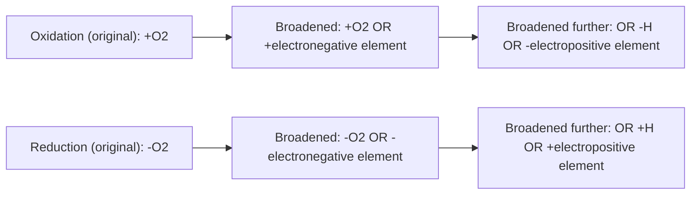
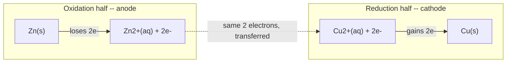
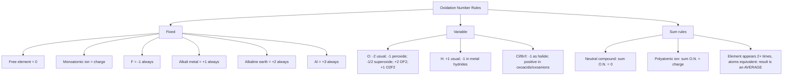
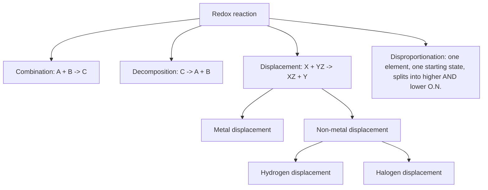
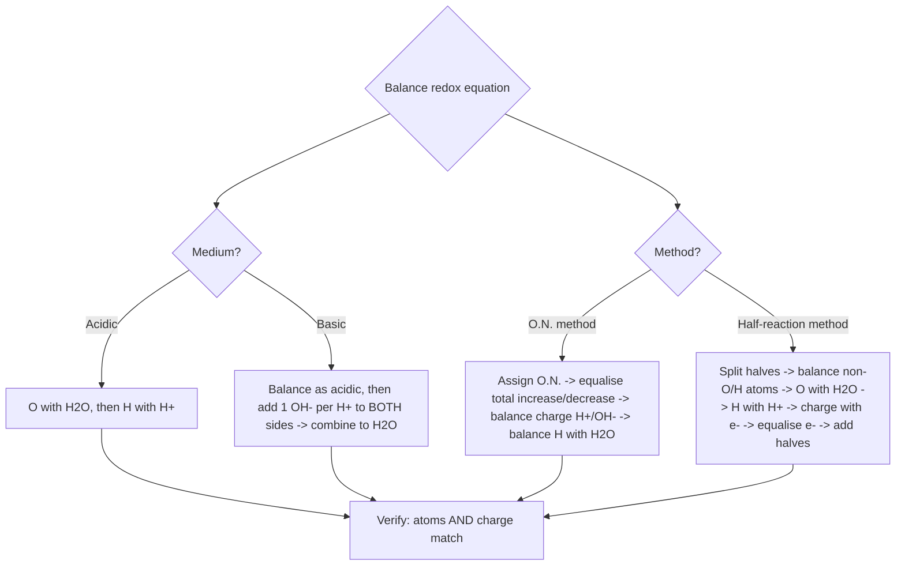
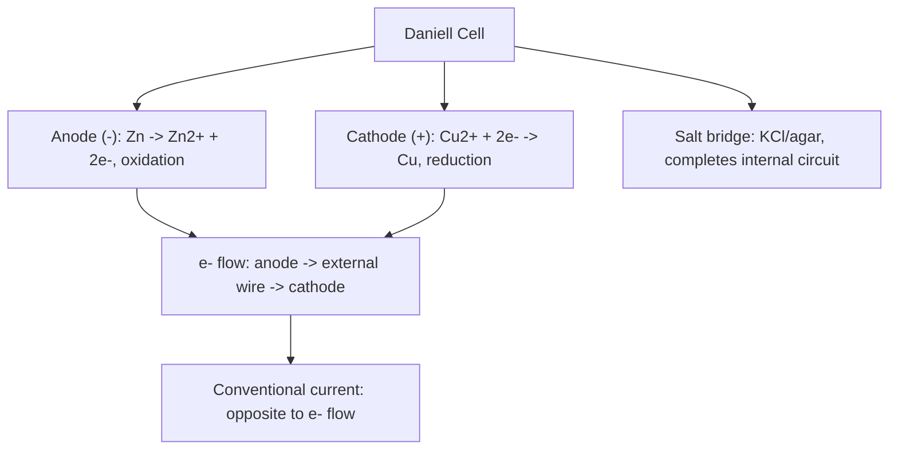

# Chemistry | Chapter 07 | Redox Reactions | CNOTES

Condensed, section-by-section. Mirrors NOTES §-numbering exactly — a missed fact here means "go read that §", not "start over."

---

## 7.1 The Classical Idea of Redox Reactions

### 7.1.1 Oxidation — The Classical View

- **Oxidation (classical)** — addition of O / electronegative element, OR removal of H / electropositive element
- Original definition: only addition of O₂. Broadened in three stages:
  1. Removal of H: 2H₂S + O₂ → 2S + 2H₂O
  2. Addition of any electronegative element: Mg + F₂ → MgF₂; Mg + Cl₂ → MgCl₂; Mg + S → MgS
  3. Removal of an electropositive element: 2K₄[Fe(CN)₆] + H₂O₂ → 2K₃[Fe(CN)₆] + 2KOH (K removed)

### 7.1.2 Reduction — The Classical View

- **Reduction (classical)** — removal of O / electronegative element, OR addition of H / electropositive element
- Examples: 2HgO →(Δ) 2Hg + O₂ (O removed); 2FeCl₃ + H₂ → 2FeCl₂ + 2HCl (Cl removed); CH₂=CH₂ + H₂ → CH₃–CH₃ (H added); 2HgCl₂ + SnCl₂ → Hg₂Cl₂ + SnCl₄ (Hg added to HgCl₂)

### 7.1.3 The Simultaneous Nature — Why "Redox"

- Oxidation and reduction never occur alone — every redox reaction has both, even when only one reactant's change is visually obvious
- Trap: 2HgCl₂ + SnCl₂ → Hg₂Cl₂ + SnCl₄ looks like "just a reduction" of HgCl₂ if SnCl₂ isn't checked — SnCl₂ is simultaneously oxidised to SnCl₄
- Worked (Problem 7.1 type): H₂S + Cl₂ → 2HCl + S — H₂S oxidised, Cl₂ reduced. 3Fe₃O₄ + 8Al → 9Fe + 4Al₂O₃ — Al oxidised (O added), Fe₃O₄ reduced (O removed). 2Na + H₂ → 2NaH — Na oxidised (→Na⁺), H₂ reduced (→H⁻, since an electropositive element, Na, is added to it)
- Worked (Problem 7.2 type): NaH is ionic Na⁺H⁻ — splits as 2Na → 2Na⁺ + 2e⁻ (oxidation) and H₂ + 2e⁻ → 2H⁻ (reduction); confirms redox with no O or classical electronegative element present §7.2 →

---

## 7.2 Redox Reactions in Terms of Electron Transfer

### 7.2.1 The Electronic Interpretation

- **Oxidation (electronic)** — loss of electron(s). Mnemonic: **OIL**
- **Reduction (electronic)** — gain of electron(s). Mnemonic: **RIG**
- **Oxidising agent (oxidant)** — electron acceptor, itself gets reduced
- **Reducing agent (reductant)** — electron donor, itself gets oxidised
- 2Na + Cl₂ → 2NaCl: half-reactions are 2Na → 2Na⁺ + 2e⁻ (oxidation) and Cl₂ + 2e⁻ → 2Cl⁻ (reduction); Na is the reducing agent, Cl₂ the oxidising agent
- The two half-reactions are one electron-counting exercise seen from two ends — electrons released by oxidation = electrons absorbed by reduction, always (formal balancing method: §7.3.6)

### 7.2.2 Competitive Electron Transfer Reactions

- Zn strip in CuSO₄(aq): Zn + Cu²⁺ → Zn²⁺ + Cu — strongly favours products, Cu²⁺ undetectable at equilibrium
- Cu rod in AgNO₃(aq): Cu + 2Ag⁺ → Cu²⁺ + 2Ag — strongly favours products
- Co strip in NiSO₄(aq): Co + Ni²⁺ → Co²⁺ + Ni — both ions persist at comparable concentration, neither side favoured
- Competition for electrons between metals ≈ competition for protons between acids
- **Metal activity series** (most → least reactive, from displacement experiments): K > Na > Ca > Mg > Al > Zn > Fe > Pb > H > Cu > Hg > Ag > Au > Pt
- Trap: activity series (metals, displacement-based) ≠ electrochemical series (any redox couple, quantitative E°, §7.4.3) — they agree closely for common metals but are built differently

---

## 7.3 Oxidation Number

- **Oxidation number** — the hypothetical charge on an atom if every bond to it were fully ionic, with the shared electron pair assigned entirely to the more electronegative atom
- Book-keeping device, not a real physical charge — never equate with formal charge or literal atomic charge
- Applied to 2H₂ + O₂ → 2H₂O: H goes 0 → +1, O goes 0 → –2 (notional full transfer, not the real partial shift)

### 7.3.1 Rules for Assigning Oxidation Number

- Rule order: fixed rules (F, alkali, alkaline-earth, Al) override the general sum rule whenever they conflict
- O exceptions: peroxide (H₂O₂, Na₂O₂) = –1; superoxide (KO₂, RbO₂) = –½; OF₂ = +2; O₂F₂ = +1 (only case O is positive)
- H exception: metal hydrides (LiH, NaH, CaH₂) = –1
- Highest O.N. across Period 3 (= group number for groups 1–2, or group number – 10 otherwise): Na +1, Mg +2, Al +3, Si +4, P +5, S +6, Cl +7 — increases left → right
- Worked: N in (NH₄)₂SO₄ → N = –3 (NH₄⁺ fixed at +1, N + 4(+1) = +1). S in Na₂SO₄ → S = +6. S (avg) in Na₂S₄O₆ → +2.5. S (avg) in Na₂S₂O₃ → +2
- Trap §7.3.1a: thiosulphate's average is unambiguously +2, but the individual sulphurs split +5 (central) / –1 (terminal) by consistent electronegativity assignment — a common shortcut gives +6/–2 instead, which breaks the same electronegativity rule used everywhere else in this section

### 7.3.2 Stock Notation

- **Stock notation** — metal's oxidation number written as a Roman numeral in parentheses after its symbol
- AuCl → Au(I)Cl (aurous); AuCl₃ → Au(III)Cl₃ (auric)
- SnCl₂ → Sn(II)Cl₂ (stannous); SnCl₄ → Sn(IV)Cl₄ (stannic)
- FeCl₂ → Fe(II)Cl₂ (ferrous); FeCl₃ → Fe(III)Cl₃ (ferric)
- HgCl₂ → Hg(II)Cl₂ (mercuric); Hg₂Cl₂ → Hg₂(I)Cl₂ (mercurous)
- Trap: "mercurous" is the dimeric Hg₂²⁺, never monomeric Hg⁺ — Hg₂Cl₂, not "HgCl"
- Worked: HAuCl₄ → Au +3; Tl₂O → Tl +1; FeO → Fe +2; Fe₂O₃ → Fe +3; CuI → Cu +1; CuO → Cu +2; MnO → Mn +2; MnO₂ → Mn +4

### 7.3.3 Redox Definitions Using Oxidation Number

- **Oxidation (O.N.)** — increase in oxidation number
- **Reduction (O.N.)** — decrease in oxidation number
- **Oxidising agent** — causes O.N. increase in another species; its own O.N. decreases
- **Reducing agent** — causes O.N. decrease in another species; its own O.N. increases

### 7.3.4 Fractional Oxidation Numbers

| Species | Average O.N. | Real structure |
|---|---|---|
| C₃O₂ | C = +4/3 | Two terminal C at +2, middle C at 0 |
| Br₃O₈ | Br = +16/3 | Two terminal Br at +6, middle Br at +4 |
| Na₂S₄O₆ | S = +2.5 | Two terminal S at +5, two middle S at 0 |
| Fe₃O₄ | Fe = +8/3 | 1 Fe²⁺ : 2 Fe³⁺ mixture |

- A fractional O.N. is always an average — never the real state of every atom of that element
- Genuinely fractional exceptions (not structural averages): O₂⁺ → O = +½; O₂⁻ → O = –½
- Worked (Problem 7.4): 2Cu₂O + Cu₂S → 6Cu + SO₂ — Cu: +1→0 (reduced, ×6 atoms total across both reactants = 6e⁻ gained); S: –2→+4 (oxidised, 6e⁻ lost). Cu₂O is oxidant, Cu₂S is reductant
- Worked (Problem 7.5, disproportionation screening): ClO⁻(+1), ClO₂⁻(+3), ClO₃⁻(+5), ClO₄⁻(+7) — only ClO₄⁻ cannot disproportionate (Cl already at ceiling +7)
- Worked (Problem 7.6, classification): N₂+O₂→2NO = combination; 2Pb(NO₃)₂→2PbO+4NO₂+O₂ = decomposition; NaH+H₂O→NaOH+H₂ = displacement; 2NO₂+2OH⁻→NO₂⁻+NO₃⁻+H₂O = disproportionation (N: +4 → +3 and +5)
- Worked (Problem 7.7): Pb₃O₄ is a **mixture** of 2 mol PbO (Pb²⁺, basic oxide) + 1 mol PbO₂ (Pb⁴⁺, oxidant) — NOT a compound with Pb at average +8/3
  - With HCl: PbO part does acid–base only; PbO₂ part oxidises Cl⁻ → Cl₂ (redox)
  - With HNO₃: HNO₃ is already an oxidant, so PbO₂ stays passive — only acid–base reaction occurs
  - Trap: same formula, different chemistry — always check "mixture vs compound" before assuming a fractional O.N. is real

### 7.3.5 Types of Redox Reactions

- Elemental-reactant/product test is a **shortcut**, not the rule — the real test is always whether an O.N. changes
- **Combination**: A + B → C, commonly ≥1 elemental reactant. C(s)+O₂→CO₂; 3Mg+N₂→Mg₃N₂. NOT redox: CaO+CO₂→CaCO₃ (no O.N. change despite fitting the shape)
- **Decomposition**: C → A+B, commonly ≥1 elemental product. 2H₂O→2H₂+O₂; 2KClO₃→2KCl+3O₂. NOT redox: CaCO₃→CaO+CO₂
- **Displacement — metal**: more active metal displaces less active from salt. CuSO₄+Zn→Cu+ZnSO₄; Cr₂O₃+2Al→Al₂O₃+2Cr
- **Displacement — hydrogen**: very active metals (Na, K, Ca, Sr, Ba) + cold water; less active (Mg, Fe) + steam only; many metals (Zn, Fe, etc.) + acids; Ag, Au — no reaction even with acid
- **Displacement — halogen**: oxidising power F₂ > Cl₂ > Br₂ > I₂. Cl₂+2KBr→2KCl+Br₂; Cl₂+2KI→2KCl+I₂
  - Layer Test: Br₂ → orange-brown in CCl₄; I₂ → violet in CCl₄
  - F₂ exception: attacks water itself (2H₂O+2F₂→4HF+O₂) before it can displace a halide — F₂ halogen-displacement never run in aqueous solution
  - F⁻ → F₂: no common aqueous chemical oxidant strong enough — only electrolysis
- **Disproportionation**: one element, one starting O.N., splits into a higher AND lower O.N. in the products. Needs ≥3 accessible O.N.s, reactant at the intermediate one
  - 2H₂O₂ → 2H₂O + O₂ [O: –1 → –2 and 0]
  - Cl₂ + 2OH⁻ → ClO⁻ + Cl⁻ + H₂O [Cl: 0 → +1 and –1] (household bleach)
  - P₄ + 3OH⁻ + 3H₂O → PH₃ + 3H₂PO₂⁻ [P: 0 → –3 and +1]
  - Trap: F₂ + 2OH⁻ → 2F⁻ + OF₂ + H₂O looks similar but is NOT disproportionation of F — F is only reduced (0→–1); O is what's oxidised (–2→+2). F can never go positive, so F can never disproportionate

### 7.3.6 Balancing of Redox Reactions

- **Oxidation number method** (5 steps): write formulas → assign O.N., find changes → scale so total increase = total decrease → balance charge with H⁺(acidic)/OH⁻(basic) → balance H with H₂O, confirm O
- **Half-reaction method** (7 steps): write ionic equation → split into oxidation/reduction halves → balance non-O/H atoms → balance O with H₂O, then H with H⁺ (basic: + OH⁻ to both sides after) → balance charge with e⁻ → scale halves to equal e⁻ → add and cancel e⁻
- Acidic medium: O ← H₂O; H ← H⁺; charge ← H⁺
- Basic medium: O ← H₂O; H ← H⁺ then + equal OH⁻ to BOTH sides, combine H⁺+OH⁻→H₂O; charge ← OH⁻
- Worked (O.N. method): Cr₂O₇²⁻ + 3SO₃²⁻ + 8H⁺ → 2Cr³⁺ + 3SO₄²⁻ + 4H₂O — Cr +6→+3 (×2 = –6), S +4→+6 (×3 = +6)
- Worked (half-reaction, acidic): 6Fe²⁺ + Cr₂O₇²⁻ + 14H⁺ → 6Fe³⁺ + 2Cr³⁺ + 7H₂O — Fe loses 1e⁻ ×6 = Cr₂O₇²⁻ gains 6e⁻
- Worked (half-reaction, basic): 2MnO₄⁻ + Br⁻ + H₂O → 2MnO₂ + BrO₃⁻ + 2OH⁻ — Mn +7→+4 (gain 3e⁻ ×2); Br –1→+5 (lose 6e⁻)
- Worked (half-reaction, basic): 6I⁻ + 2MnO₄⁻ + 4H₂O → 3I₂ + 2MnO₂ + 8OH⁻ — Mn +7→+4 (×2, 6e⁻); I –1→0 (×6, 6e⁻)
- Worked (O.N. method): 4Mg + 10HNO₃ → 4Mg(NO₃)₂ + N₂O + 5H₂O — Mg 0→+2 (×4=8e⁻ lost); N +5→+1 in N₂O, 2N per unit = 8e⁻ gained
- Worked (half-reaction, basic): 2Cr(OH)₃ + IO₃⁻ + 4OH⁻ → 2CrO₄²⁻ + I⁻ + 5H₂O — Cr +3→+6 (×2, 6e⁻ lost); I +5→–1 (6e⁻ gained)
  - Trap: the 4OH⁻ belong on the reactant side, not the product side — misplacing it breaks both atom and charge balance

### 7.3.7 Redox Reactions as the Basis for Titrations

| Titration type | Titrant / indicator | Endpoint signal |
|---|---|---|
| Self-indicating | MnO₄⁻ (purple) | First lasting pink tinge once last reductant consumed; detects down to ~10⁻⁶ mol/L |
| External-indicator | Cr₂O₇²⁻ + diphenylamine | Diphenylamine oxidised just past equivalence → intense blue |
| Iodometric (indirect) | Cu²⁺ liberates I₂; titrated vs thiosulphate, starch indicator | Deep blue starch–I₂ colour vanishes sharply at endpoint |

- Iodometric reactions: 2Cu²⁺ + 4I⁻ → Cu₂I₂ + I₂, then I₂ + 2S₂O₃²⁻ → 2I⁻ + S₄O₆²⁻

### 7.3.8 Limitations of the Oxidation Number Concept

- Modern reframing: oxidation = decrease in electron density; reduction = increase in electron density (around the atom) — softer than "complete" transfer
- O.N. assumes fully ionic bonding — real covalent bonds are shared, so O.N. rarely matches literal atomic charge
- Resonance structures can make a single O.N. arbitrary
- O.N. describes coordination compounds, radicals, and delocalised organic systems poorly
- Self-exchange reactions (e.g. Fe²⁺ + *Fe³⁺ ⇌ Fe³⁺ + *Fe²⁺) show genuine electron transfer with **no net O.N. change** — evidence that O.N. is a useful but imperfect proxy for real electron transfer

---

## 7.4 Redox Reactions and Electrode Processes

### 7.4.1 From Direct to Indirect Electron Transfer — The Daniell Cell

- Zn rod directly in CuSO₄(aq): direct atom-to-atom electron transfer, energy released as heat
- Daniell cell: physically separates Zn|ZnSO₄ and Cu|CuSO₄ half-cells, joined by salt bridge + external wire — forces electrons through the circuit as usable electricity
- Anode (–): Zn(s) → Zn²⁺(aq) + 2e⁻ (oxidation); Cathode (+): Cu²⁺(aq) + 2e⁻ → Cu(s) (reduction)
- Electrons: anode → external wire → cathode. Ions: migrate through salt bridge to keep both solutions neutral
- **Redox couple** — oxidised/reduced forms written together, e.g. Zn²⁺/Zn, Cu²⁺/Cu (oxidised form written first)

### 7.4.2 Electrode Potential, Standard Electrode Potential & SHE

- **Electrode potential** — tendency of the species at an electrode to stay oxidised or reduced; cannot be measured for one electrode alone
- **Standard Hydrogen Electrode (SHE)** — Pt wire in 1M H⁺(aq), H₂ gas at 1 atm; 2H⁺+2e⁻⇌H₂; assigned E° = 0.00 V by convention, the universal reference
- **Standard electrode potential (E°)** — measured at 298 K, 1 M every species, 1 atm any gas, against SHE; always tabulated as a **reduction** potential
- E° < 0 → couple's reduced form is a stronger reducing agent than H₂
- E° > 0 → couple's oxidised form is a stronger oxidising agent than H⁺

### 7.4.3 Standard Electrode Potentials and Feasibility

| Half-reaction (reduction) | E°/V |
|---|---|
| F₂ + 2e⁻ → 2F⁻ | +2.87 (strongest oxidant) |
| MnO₄⁻ + 8H⁺ + 5e⁻ → Mn²⁺ + 4H₂O | +1.51 |
| Cl₂ + 2e⁻ → 2Cl⁻ | +1.36 |
| Cr₂O₇²⁻ + 14H⁺ + 6e⁻ → 2Cr³⁺ + 7H₂O | +1.33 |
| Br₂(l) + 2e⁻ → 2Br⁻ | +1.09 |
| 2Hg²⁺ + 2e⁻ → Hg₂²⁺ | +0.92 |
| Ag⁺ + e⁻ → Ag(s) | +0.80 |
| Fe³⁺ + e⁻ → Fe²⁺ | +0.77 |
| I₂ + 2e⁻ → 2I⁻ | +0.54 |
| Cu²⁺ + 2e⁻ → Cu(s) | +0.34 |
| 2H⁺ + 2e⁻ → H₂ | 0.00 (reference) |
| Pb²⁺ + 2e⁻ → Pb(s) | –0.13 |
| Fe²⁺ + 2e⁻ → Fe(s) | –0.44 |
| Zn²⁺ + 2e⁻ → Zn(s) | –0.76 |
| Al³⁺ + 3e⁻ → Al(s) | –1.66 |
| Na⁺ + e⁻ → Na(s) | –2.71 |
| Li⁺ + e⁻ → Li(s) | –3.05 (strongest reductant) |

- This table **is** the electrochemical series — a sorted, quantitative generalisation of the activity series (§7.2.2) to any couple
- **Feasibility rule**: E°cell = E°(cathode) – E°(anode), both read directly (tabulated sign, no separate flip), > 0 ⇒ spontaneous as written
- Daniell cell check: E°cell = E°(Cu²⁺/Cu) – E°(Zn²⁺/Zn) = (+0.34) – (–0.76) = **+1.10 V** (positive — matches Zn oxidised/Cu²⁺ reduced direction)
- Trap: "negative E°" means stronger reducing agent than H₂, NOT "weak" — Li at –3.05 V is a ferocious reductant
- Worked (feasibility, 5 pairs):
  - Fe³⁺/Fe²⁺ (+0.77, cathode) vs I₂/I⁻ (+0.54, anode) → +0.23 V, **feasible** (Fe³⁺ oxidises I⁻)
  - Ag⁺/Ag (+0.80, cathode) vs Cu²⁺/Cu (+0.34, anode) → +0.46 V, **feasible** (silver mirror on copper)
  - Fe³⁺/Fe²⁺ (+0.77, cathode) vs Cu²⁺/Cu (+0.34, anode) → +0.43 V, **feasible** (FeCl₃ etches Cu PCBs)
  - Fe³⁺/Fe²⁺ (+0.77, cathode) vs Ag⁺/Ag (+0.80, anode) → **–0.03 V, NOT feasible** (Ag doesn't reduce Fe³⁺)
  - Br₂/Br⁻ (+1.09, cathode) vs Fe³⁺/Fe²⁺ (+0.77, anode) → +0.32 V, **feasible** (Br₂ oxidises Fe²⁺)

---

## Points to Ponder — Trap Digest

- Fractional O.N. is always an average, never a real per-atom state — check structure (C₃O₂, Br₃O₈, S₄O₆²⁻) §7.3.4
- "Mercurous" = dimeric Hg₂²⁺, never monomeric Hg⁺ — Hg₂Cl₂, not "HgCl" §7.3.2
- F₂ and ClO₄⁻ cannot disproportionate — both already at their extreme accessible O.N. §7.3.5, §7.3.4
- Pb₃O₄ is a mixture (PbO + PbO₂), not a compound with Pb at +8/3 — reacts differently with HCl (redox) vs HNO₃ (acid–base only) §7.3.4
- Negative E° ≠ weak — it means a stronger reducing agent than H₂ §7.4.3
- Basic-medium balancing: add OH⁻ to BOTH sides first, then combine — one-sided addition breaks the balance §7.3.6
- Combination/decomposition reactions are redox only if an O.N. actually changes — CaCO₃ ⇌ CaO + CO₂ is not redox either way §7.3.5
- Unusual oxidation states (e.g. Ag(II) in AgF₂) are almost always strong oxidants (if unusually high) or strong reductants (if unusually low) §7.3.1

---

## Rapid Reference

| Fact | Value |
|---|---|
| Oxidation (classical) | +O/electronegative element, or –H/electropositive element |
| Reduction (classical) | –O/electronegative element, or +H/electropositive element |
| Oxidation (electronic) | Loss of electrons (OIL) |
| Reduction (electronic) | Gain of electrons (RIG) |
| Oxidation (O.N.) | Increase in oxidation number |
| Reduction (O.N.) | Decrease in oxidation number |
| O free element | 0 |
| Monoatomic ion O.N. | = ionic charge |
| O usual / peroxide / superoxide / OF₂ / O₂F₂ | –2 / –1 / –½ / +2 / +1 |
| H usual / metal hydride | +1 / –1 |
| F | always –1 |
| Metal activity series | K>Na>Ca>Mg>Al>Zn>Fe>Pb>H>Cu>Hg>Ag>Au>Pt |
| Halogen oxidising power | F₂>Cl₂>Br₂>I₂ |
| Disproportionation requirement | ≥3 accessible O.N.s, reactant at intermediate |
| Cannot disproportionate | F₂, ClO₄⁻ |
| Self-indicator (titration) | MnO₄⁻, purple → faint pink |
| External indicator (titration) | Diphenylamine (with Cr₂O₇²⁻) → blue |
| Iodometric endpoint | Starch–I₂ blue disappears |
| SHE | E° = 0.00 V by convention |
| E° < 0 | Reduced form stronger reductant than H₂ |
| E° > 0 | Oxidised form stronger oxidant than H⁺ |
| Strongest oxidant (table) | F₂/F⁻, +2.87 V |
| Strongest reductant (table) | Li⁺/Li, –3.05 V |
| Daniell cell E°cell | +1.10 V |
| Feasibility rule | E°cell = E°(cathode) – E°(anode) > 0 ⇒ spontaneous |

---

*End of Condensed Notes — Ch. 7: Redox Reactions.*