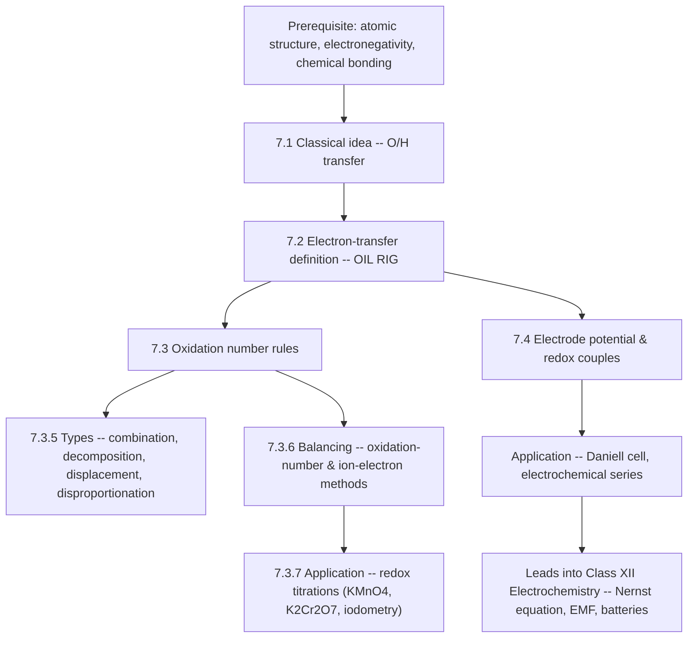
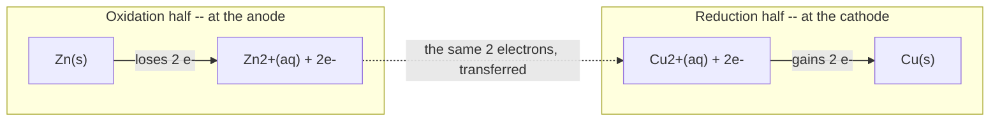
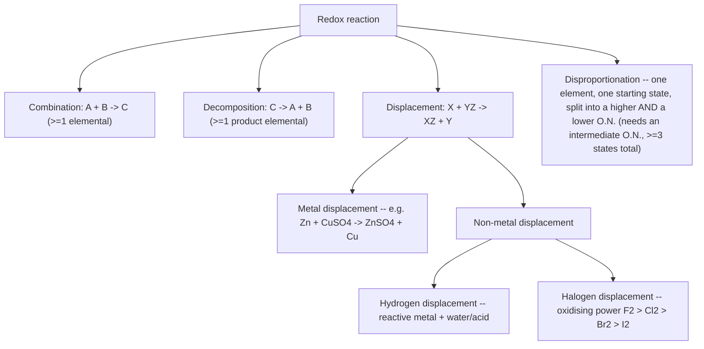
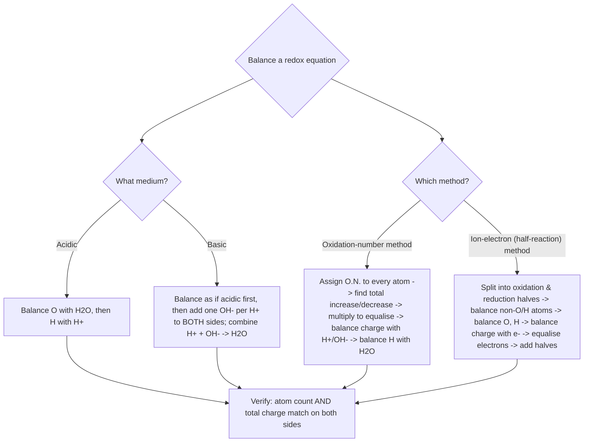

# Chemistry | Chapter 07 | Redox Reactions | NOTES

**Branch:** Physical Chemistry (Redox & Electrochemistry Foundations) · **Source:** NCERT Class XI Chemistry, Unit 7 · **Level:** Board · NEET · JEE

*"Where there is oxidation, there is always reduction — Chemistry is essentially a study of redox systems."*

---

## Chapter Brief

Redox reactions cover every chemical process in which electrons move between species — as familiar as rusting or combustion, and as engineered as a battery. This chapter builds the same idea through three lenses of increasing generality: the classical oxygen/hydrogen-transfer picture, the electron-transfer picture, and the oxidation-number bookkeeping that makes electron transfer trackable even in covalent compounds. By the end, a reader should be able to classify a redox reaction, balance it by either standard method, and use standard electrode potentials to predict whether a reaction runs as written.

**Prerequisites:** atomic structure, electronegativity, chemical bonding, basic stoichiometry.

**Key outcomes** — by the end of this chapter, a reader should be able to:
- Identify which species is oxidised and which is reduced, under all three definitions (classical, electronic, oxidation-number)
- Assign oxidation numbers to every atom in a compound or ion, including the exceptions (peroxides, superoxides, metal hydrides, O–F compounds)
- Classify a redox reaction as combination, decomposition, displacement, or disproportionation, and recognise when a reaction of that shape is *not* redox
- Balance a redox equation in acidic or basic medium, by both the oxidation-number method and the half-reaction (ion-electron) method
- Use standard electrode potentials to predict whether a given redox reaction is spontaneous under standard conditions

**Scope note:** this chapter stays at standard-conditions (1 M, 1 atm, 298 K) electrode potentials. Concentration-dependent potentials (the Nernst equation) and electrolytic cells belong to Class XII Electrochemistry and sit outside this chapter's scope; they are previewed only where the chapter's own feasibility rule needs the caveat.

## Table of Contents

- [Chemistry | Chapter 07 | Redox Reactions | NOTES](#chemistry--chapter-07--redox-reactions--notes)
  - [Chapter Brief](#chapter-brief)
  - [Table of Contents](#table-of-contents)
  - [Concept Roadmap](#concept-roadmap)
  - [7.1 The Classical Idea of Redox Reactions ⭐](#71-the-classical-idea-of-redox-reactions-)
    - [7.1.1 Oxidation — The Classical View](#711-oxidation--the-classical-view)
    - [7.1.2 Reduction — The Classical View](#712-reduction--the-classical-view)
    - [7.1.3 The Simultaneous Nature — Why "Redox"](#713-the-simultaneous-nature--why-redox)
  - [7.2 Redox Reactions in Terms of Electron Transfer ⭐⭐](#72-redox-reactions-in-terms-of-electron-transfer-)
    - [7.2.1 The Electronic Interpretation](#721-the-electronic-interpretation)
    - [7.2.2 Competitive Electron Transfer Reactions](#722-competitive-electron-transfer-reactions)
  - [7.3 Oxidation Number ⭐⭐⭐](#73-oxidation-number-)
    - [7.3.1 Rules for Assigning Oxidation Number](#731-rules-for-assigning-oxidation-number)
    - [7.3.2 Stock Notation](#732-stock-notation)
    - [7.3.3 Redox Definitions Using Oxidation Number](#733-redox-definitions-using-oxidation-number)
    - [7.3.4 Fractional Oxidation Numbers](#734-fractional-oxidation-numbers)
    - [7.3.5 Types of Redox Reactions ⭐⭐](#735-types-of-redox-reactions-)
    - [7.3.6 Balancing of Redox Reactions ⭐⭐⭐](#736-balancing-of-redox-reactions-)
      - [Method 1 — Oxidation Number Method (steps)](#method-1--oxidation-number-method-steps)
      - [Method 2 — Half-Reaction (Ion-Electron) Method (steps)](#method-2--half-reaction-ion-electron-method-steps)
    - [Acidic vs Basic Medium — Quick Rules](#acidic-vs-basic-medium--quick-rules)
    - [7.3.7 Redox Reactions as the Basis for Titrations ⭐⭐](#737-redox-reactions-as-the-basis-for-titrations-)
    - [7.3.8 Limitations of the Oxidation Number Concept ⭐](#738-limitations-of-the-oxidation-number-concept-)
  - [7.4 Redox Reactions and Electrode Processes ⭐⭐⭐](#74-redox-reactions-and-electrode-processes-)
    - [7.4.1 From Direct to Indirect Electron Transfer — The Daniell Cell](#741-from-direct-to-indirect-electron-transfer--the-daniell-cell)
    - [7.4.2 Electrode Potential, Standard Electrode Potential \& SHE](#742-electrode-potential-standard-electrode-potential--she)
    - [7.4.3 Standard Electrode Potentials and Feasibility](#743-standard-electrode-potentials-and-feasibility)
  - [Points to Ponder ⭐⭐⭐](#points-to-ponder-)

---

## Concept Roadmap



*Every later idea in this chapter — oxidation number, balancing, titrations, electrode potential — is one of two things stacked on top of each other: the classical O/H-transfer picture, or the electron-transfer picture. Keep asking "which of these two lenses am I using right now?" and the chapter stops feeling like a pile of disconnected rules.*

---

## 7.1 The Classical Idea of Redox Reactions ⭐

This section builds the oldest, narrowest definition of oxidation and reduction, then widens it in three deliberate steps until it covers reactions that don't obviously involve oxygen at all. The widening steps matter more than the final boxed definitions — they are what §7.2 leans on to motivate why an electron-based definition was needed.

### 7.1.1 Oxidation — The Classical View

**Originally defined** as the **addition of oxygen** to an element or compound:

| Reaction | Process |
|----------|---------|
| \( 2\text{Mg(s)} + \text{O}_2\text{(g)} \to 2\text{MgO(s)} \) | Mg is oxidised (O₂ added) |
| \( \text{S(s)} + \text{O}_2\text{(g)} \to \text{SO}_2\text{(g)} \) | S is oxidised (O₂ added) |
| \( \text{CH}_4\text{(g)} + 2\text{O}_2\text{(g)} \to \text{CO}_2\text{(g)} + 2\text{H}_2\text{O(l)} \) | C–H oxidised (O₂ added, H removed) |

**The definition was broadened** in three stages, each a generalisation of the last:

1. **Removal of hydrogen**: \( 2\text{H}_2\text{S(g)} + \text{O}_2\text{(g)} \to 2\text{S(s)} + 2\text{H}_2\text{O(l)} \) — H₂S is oxidised even though nothing here is a hydrocarbon.
2. **Addition of any electronegative element**, not just oxygen: \( \text{Mg(s)} + \text{F}_2\text{(g)} \to \text{MgF}_2\text{(s)} \); \( \text{Mg(s)} + \text{Cl}_2\text{(g)} \to \text{MgCl}_2\text{(s)} \); \( \text{Mg(s)} + \text{S(s)} \to \text{MgS(s)} \).
3. **Removal of an electropositive element**: \( 2\text{K}_4[\text{Fe(CN)}_6](aq) + \text{H}_2\text{O}_2(aq) \to 2\text{K}_3[\text{Fe(CN)}_6](aq) + 2\text{KOH}(aq) \) — potassium (electropositive) is removed from ferrocyanide as it becomes ferricyanide.

> [!example] Boxed definition
> \[
> \boxed{\textbf{Oxidation (classical)} = \text{addition of O/electronegative element} \;\;\text{OR}\;\; \text{removal of H/electropositive element}}
> \]

### 7.1.2 Reduction — The Classical View

**Originally:** removal of oxygen from a compound. **Broadened to include:**

| Reaction | Reduction process |
|----------|------------------|
| \( 2\text{HgO(s)} \xrightarrow{\Delta} 2\text{Hg(l)} + \text{O}_2\text{(g)} \) | Removal of oxygen from HgO |
| \( 2\text{FeCl}_3(aq) + \text{H}_2\text{(g)} \to 2\text{FeCl}_2(aq) + 2\text{HCl}(aq) \) | Removal of electronegative Cl |
| \( \text{CH}_2{=}\text{CH}_2\text{(g)} + \text{H}_2\text{(g)} \to \text{H}_3\text{C–CH}_3\text{(g)} \) | Addition of hydrogen |
| \( 2\text{HgCl}_2(aq) + \text{SnCl}_2(aq) \to \text{Hg}_2\text{Cl}_2\text{(s)} + \text{SnCl}_4(aq) \) | Addition of Hg (electropositive) to HgCl₂ |

> [!example] Boxed definition
> \[
> \boxed{\textbf{Reduction (classical)} = \text{removal of O/electronegative element} \;\;\text{OR}\;\; \text{addition of H/electropositive element}}
> \]

### 7.1.3 The Simultaneous Nature — Why "Redox"

In the last reaction above, HgCl₂ is reduced (it gains an Hg partner) **while SnCl₂ is simultaneously oxidised** to SnCl₄ (Cl, electronegative, is added to it). Re-examining every reaction in §7.1.1–7.1.2 the same way shows oxidation and reduction never occur alone — hence the portmanteau **"redox."**

> [!warning] The trap: reactions with only one *visible* change
> A reaction can look like "just an oxidation" if only one reactant is watched. \( 2\text{HgCl}_2 + \text{SnCl}_2 \to \text{Hg}_2\text{Cl}_2 + \text{SnCl}_4 \) is the textbook's own example of this — always check *both* reactants before concluding only one has changed.

**Worked Example — Identifying oxidised/reduced species**
**Given:** (i) \( \text{H}_2\text{S(g)} + \text{Cl}_2\text{(g)} \to 2\text{HCl(g)} + \text{S(s)} \) (ii) \( 3\text{Fe}_3\text{O}_4\text{(s)} + 8\text{Al(s)} \to 9\text{Fe(s)} + 4\text{Al}_2\text{O}_3\text{(s)} \) (iii) \( 2\text{Na(s)} + \text{H}_2\text{(g)} \to 2\text{NaH(s)} \)
**Find:** which species is oxidised, which is reduced, in each.
**Concept:** classical addition/removal rules from §7.1.1–7.1.2.
**Work:**
(i) H₂S is oxidised (electronegative Cl added to H — equivalently, H removed from S). Cl₂ is reduced (H added to it).
(ii) Al is oxidised (O added). Fe₃O₄ is reduced (O removed).
(iii) Na is oxidised (forms Na⁺ in the ionic solid NaH). H₂ is reduced (H goes from neutral to H⁻, i.e. an electropositive element — Na — has been *added* to it).
**Check:** every pair has one oxidation and one reduction — consistent with §7.1.3.

**Worked Example — Justifying 2Na(s) + H₂(g) → 2NaH(s) is redox**
**Given:** NaH is ionic, better written Na⁺H⁻(s).
**Find:** show this reaction is redox even though no oxygen or classical electronegative element appears anywhere in it.
**Concept:** split the reaction into two half-reactions and track electrons directly, rather than atoms.
**Work:**
\[
\begin{aligned}
\text{Oxidation half:}&\quad 2\text{Na(s)} \to 2\text{Na}^+\text{(g)} + 2e^- \\
\text{Reduction half:}&\quad \text{H}_2\text{(g)} + 2e^- \to 2\text{H}^-\text{(g)}
\end{aligned}
\]
**Check:** sodium is oxidised and hydrogen is reduced — confirmed redox despite no O or classical electronegative element in sight. This is exactly the case that motivates §7.2: the classical definition needs an electron-based backbone to handle reactions like this cleanly.

---

## 7.2 Redox Reactions in Terms of Electron Transfer ⭐⭐

### 7.2.1 The Electronic Interpretation

When sodium reacts with chlorine, oxygen, or sulphur, the products are ionic — better written with explicit charges:

\[
\begin{aligned}
2\text{Na(s)} + \text{Cl}_2\text{(g)} &\to 2\text{Na}^+\text{Cl}^-\text{(s)} \\
4\text{Na(s)} + \text{O}_2\text{(g)} &\to 2(\text{Na}^+)_2\text{O}^{2-}\text{(s)} \\
2\text{Na(s)} + \text{S(s)} &\to (\text{Na}^+)_2\text{S}^{2-}\text{(s)}
\end{aligned}
\]

The **charge development is direct evidence of electron transfer**. Splitting the first reaction into its two **half-reactions**:

\[
\begin{aligned}
\text{Oxidation half:}&\quad 2\text{Na(s)} \to 2\text{Na}^+\text{(g)} + 2e^- \\
\text{Reduction half:}&\quad \text{Cl}_2\text{(g)} + 2e^- \to 2\text{Cl}^-\text{(g)} \\
\hline
\text{Overall:}&\quad 2\text{Na(s)} + \text{Cl}_2\text{(g)} \to 2\text{Na}^+\text{Cl}^-\text{(s)}
\end{aligned}
\]

> [!example] Boxed electronic definitions
> \[
> \boxed{\textbf{Oxidation} = \text{loss of electron(s)}\;(\text{OIL}) \qquad \textbf{Reduction} = \text{gain of electron(s)}\;(\text{RIG})}
> \]
> \[
> \boxed{\textbf{Oxidising agent (oxidant)} = \text{electron acceptor, itself gets reduced} \qquad \textbf{Reducing agent (reductant)} = \text{electron donor, itself gets oxidised}}
> \]

In \( 2\text{Na} + \text{Cl}_2 \to 2\text{NaCl} \): Na loses electrons (oxidised, so Na is the *reducing agent*); Cl₂ gains electrons (reduced, so Cl₂ is the *oxidising agent*).



*The two half-reactions are not independent facts to memorise separately — they are one electron-counting exercise seen from two ends. Whatever number of electrons the oxidation half releases, the reduction half must absorb, or the equation isn't balanced (§7.3.6 turns this into a formal method).*

### 7.2.2 Competitive Electron Transfer Reactions

Three experiments build the case for ranking metals by how readily they give up electrons:

| Experiment | Reaction | Equilibrium behaviour |
|---|---|---|
| Zn strip in CuSO₄(aq) | \( \text{Zn(s)} + \text{Cu}^{2+}(aq) \to \text{Zn}^{2+}(aq) + \text{Cu(s)} \) | Strip coats with red-brown Cu; blue colour vanishes. **Greatly favours products** — Cu²⁺ is undetectable at equilibrium even by the sensitive H₂S/CuS test. |
| Cu rod in AgNO₃(aq) | \( \text{Cu(s)} + 2\text{Ag}^+(aq) \to \text{Cu}^{2+}(aq) + 2\text{Ag(s)} \) | Solution turns blue, Ag deposits on the rod. **Greatly favours products.** |
| Co strip in NiSO₄(aq) | \( \text{Co(s)} + \text{Ni}^{2+}(aq) \to \text{Co}^{2+}(aq) + \text{Ni(s)} \) | Both Ni²⁺(aq) and Co²⁺(aq) persist at **moderate, comparable concentrations** — neither side is strongly favoured. |

**Key idea:** competition for electrons between metals is directly analogous to competition for protons between acids. Comparing enough of these experiments builds a table of metals ranked by electron-releasing tendency: \( \text{Zn} > \text{Cu} > \text{Ag} \). Extending this comparison to as many metals as possible, by direct displacement experiments, gives the conventional **metal activity series**:

\[
\text{K} > \text{Na} > \text{Ca} > \text{Mg} > \text{Al} > \text{Zn} > \text{Fe} > \text{Pb} > \text{H} > \text{Cu} > \text{Hg} > \text{Ag} > \text{Au} > \text{Pt}
\]

> [!warning] Activity series vs. electrochemical series — not the same list
> The activity series above ranks *metals* by displacement behaviour, built from experiments like the ones in this section. The **electrochemical series** (§7.4.3) instead ranks **half-reactions** (redox couples, including non-metals) by their quantitative standard electrode potential \(E^\circ\). They agree closely for common metals but are not the same object — the electrochemical series is the more general, quantitative tool, and it is what §7.4.3 formalises.

The oxidation-number picture in the next section is what lets this competitive-electron-transfer idea be applied to reactions involving covalent (not just ionic) compounds, where "who loses/gains an electron" is not visually obvious the way it is for Na⁺Cl⁻.

---

## 7.3 Oxidation Number ⭐⭐⭐

**Oxidation number** denotes the oxidation state of an element in a compound, assigned by a consistent set of rules built on one assumption: **the electron pair in a covalent bond belongs entirely to the more electronegative atom.**

> [!warning] This is a book-keeping device, not a physical charge
> Real covalent bonds are *shared*, not transferred — the true charge distribution is a partial polarity, not a full +1/–1 split. Oxidation number pretends the transfer is complete, purely so redox bookkeeping stays simple. Never confuse it with formal charge or with the literal charge on an atom.

```tikz
\begin{tikzpicture}[thick, scale=1.1]
  \node[font=\Large] (H) at (-1.5,0) {H};
  \node[font=\Large] (Cl) at (1.5,0) {Cl};
  \draw[line width=1.4pt] (H) -- (Cl);
  \fill (-0.15,0.2) circle (1.8pt);
  \fill (-0.15,-0.2) circle (1.8pt);
  \draw[->, red!70!black, line width=1.2pt] (-0.15,0.55) .. controls (0.5,0.9) .. (1.1,0.35);
  \node[above, font=\small, text=red!70!black] at (0.55,0.85) {notional full transfer};
  \node[above, font=\small] at (-1.5,0.4) {$+1$};
  \node[above, font=\small] at (1.5,0.4) {$-1$};
  \node[below, font=\itshape\small, text=gray] at (0,-1.0) {H--Cl: the shared bonding pair (dots) is real; the oxidation-number rule notionally assigns it entirely to the more electronegative Cl -- a book-keeping convention, not the true partially-covalent charge distribution};
\end{tikzpicture}
```

Applying this to \( 2\text{H}_2\text{(g)} + \text{O}_2\text{(g)} \to 2\text{H}_2\text{O(l)} \): H is visualised as going from a neutral state to \(+1\), and O from neutral to \(-2\) — even though the real electron shift is partial, not a complete transfer.

### 7.3.1 Rules for Assigning Oxidation Number

The single electronegativity assumption above expands into six concrete rules, applied in the order given whenever they conflict (a fixed rule like "F = –1" always wins over the general sum rule):

1. **Free/uncombined element** → oxidation number = **0**. (H₂, O₂, Cl₂, O₃, P₄, S₈, Na, Mg, Al are all 0.)
2. **Monoatomic ion** → oxidation number = **charge on the ion**. (Na⁺ = +1, Mg²⁺ = +2, Fe³⁺ = +3, Cl⁻ = –1, O²⁻ = –2.)
3. **Oxygen** = **–2** in most compounds. Exceptions: peroxides (H₂O₂, Na₂O₂) → **–1**; superoxides (KO₂, RbO₂) → **–½**; bonded to fluorine (OF₂ → **+2**, O₂F₂ → **+1**) — the only case where O is positive.
4. **Hydrogen** = **+1**, except in **metal hydrides** (binary compounds with metals): LiH, NaH, CaH₂ → H = **–1**.
5. **Fluorine** = always **–1** (most electronegative element — cannot go positive). Other halogens (Cl, Br, I) = –1 as halide ions, but take **positive** values in oxoacids/oxoanions (combined with O).
6. **Sum of oxidation numbers** in a neutral compound = **0**; in a polyatomic ion = **charge on the ion**. If an element appears more than once and bonding does not distinguish the atoms (e.g. Na₂SO₄), the number obtained by this sum is the **average** across all atoms of that element — an atom-by-atom split, when the atoms genuinely differ, needs the compound's actual structure (§7.3.4).

| Element | Usual O.N. | Exception / range |
|---------|------------|-------------------|
| O | –2 | Peroxide: –1; superoxide: –½; OF₂: +2 |
| H | +1 | Metal hydrides: –1 |
| F | –1 | Always –1, no exception |
| Cl, Br, I | –1 (halide) | Positive in oxoacids/oxoanions |
| Alkali metals (Na, K, …) | +1 | Always +1 in compounds |
| Alkaline earths (Mg, Ca, …) | +2 | Always +2 in compounds |
| Al | +3 | Always +3 in compounds |

**Highest oxidation states across Period 3** (the highest O.N. a representative element can show = group number, for groups 1–2, or group number minus 10 for the rest — following the long-form periodic table):

| Group | 1 | 2 | 13 | 14 | 15 | 16 | 17 |
|-------|---|---|----|----|----|----|-----|
| Element | Na | Mg | Al | Si | P | S | Cl |
| Compound | NaCl | MgSO₄ | AlF₃ | SiCl₄ | P₄O₁₀ | SF₆ | HClO₄ |
| Highest O.N. | +1 | +2 | +3 | +4 | +5 | +6 | +7 |

> \[
> \boxed{\text{Highest oxidation number increases across a period}}
> \]

**Worked Example — Average oxidation numbers by direct calculation**
**Given:** N in (NH₄)₂SO₄; S in Na₂SO₄; S (average) in Na₂S₄O₆; S (average) in Na₂S₂O₃.
**Find:** the oxidation number of the indicated atom in each species.
**Concept:** Rule 6 — the algebraic sum of oxidation numbers equals 0 for a neutral compound, or the ionic charge for an ion.
**Work:**

| Species | Setting up | Result |
|---|---|---|
| N in (NH₄)₂SO₄ | NH₄⁺ is a unit charge +1: N + 4(+1) = +1 | **N = –3** |
| S in Na₂SO₄ | 2(+1) + S + 4(–2) = 0 | **S = +6** |
| S (average) in Na₂S₄O₆ | 2(+1) + 4S + 6(–2) = 0 → 4S = 10 | **S = +2.5** |
| S (average) in Na₂S₂O₃ | 2(+1) + 2S + 3(–2) = 0 → 2S = 4 | **S = +2** |

**Check:** each result satisfies rule 6 exactly (sum of O.N. × count = 0 for the neutral formula unit).

> [!warning] Where sources disagree — thiosulphate's *individual* sulphurs
> The average (+2) is unambiguous, but the two sulphurs' individual states depend on which of thiosulphate's two resonance-adjacent bonding pictures is used. Applying rule 3's electronegativity convention consistently — each S–S bond splits its shared pair equally between two identical S atoms, contributing 0 to each, while S–O bonds assign both electrons to O — gives the central S a **+5** environment (three O neighbours, one S neighbour) and the terminal S a **–1** environment (one S neighbour only), averaging to +2. A shortcut sometimes used treats thiosulphate as sulphate with one O replaced by S, giving **+6** and **–2**; this shortcut does not follow rule 3's own electronegativity assignment, since it silently treats the replacing S as if it still had oxygen's electronegativity. Use **+5/–1** for the individual states if a question asks for them, and the **average of +2** as the safe, universally examinable fact either way.

### 7.3.2 Stock Notation

Alfred Stock's convention writes the oxidation number as a **Roman numeral in parentheses** after the metal symbol.

| Compound | Stock name | Common name |
|----------|-----------|-------------|
| AuCl | Au(I)Cl — gold(I) chloride | aurous chloride |
| AuCl₃ | Au(III)Cl₃ — gold(III) chloride | auric chloride |
| SnCl₂ | Sn(II)Cl₂ — tin(II) chloride | stannous chloride |
| SnCl₄ | Sn(IV)Cl₄ — tin(IV) chloride | stannic chloride |
| FeCl₂ | Fe(II)Cl₂ — iron(II) chloride | ferrous chloride |
| FeCl₃ | Fe(III)Cl₃ — iron(III) chloride | ferric chloride |
| HgCl₂ | Hg(II)Cl₂ — mercury(II) chloride | mercuric chloride |
| Hg₂Cl₂ | Hg₂(I)Cl₂ — mercury(I) chloride | mercurous chloride |

> [!warning] High-yield edge case: "mercurous" is *not* HgCl
> The Hg(I) ion is the **dimeric** \( \text{Hg}_2^{2+} \), never a monomeric Hg⁺. That is why mercurous chloride is written **Hg₂Cl₂**, not "HgCl" — two Hg per formula unit, average oxidation number +1 each, but bonded to *each other* as a Hg–Hg unit. §7.1.2's reaction \( 2\text{HgCl}_2 + \text{SnCl}_2 \to \text{Hg}_2\text{Cl}_2 + \text{SnCl}_4 \) reduces Hg(II) to Hg(I), not to Hg(0).

**Worked Example — Stock notation from formulas**
**Given:** HAuCl₄, Tl₂O, FeO, Fe₂O₃, CuI, CuO, MnO, MnO₂.
**Find:** the Stock name for each compound.
**Concept:** rule 6, solving for the metal's oxidation number.
**Work:**

| Compound | O.N. of metal | Stock name |
|---|---|---|
| HAuCl₄ | Au = +3 | HAu(III)Cl₄ |
| Tl₂O | Tl = +1 | Tl₂(I)O |
| FeO | Fe = +2 | Fe(II)O |
| Fe₂O₃ | Fe = +3 | Fe₂(III)O₃ |
| CuI | Cu = +1 | Cu(I)I |
| CuO | Cu = +2 | Cu(II)O |
| MnO | Mn = +2 | Mn(II)O |
| MnO₂ | Mn = +4 | Mn(IV)O₂ |

**Check:** each metal O.N. satisfies rule 6 against the fixed O.N. of the non-metal partner (I = –1, O = –2, Cl = –1).

### 7.3.3 Redox Definitions Using Oxidation Number

Oxidation number gives a third definition of oxidation and reduction, general enough to apply even where electron transfer is only partial (covalent bonds):

> \[
> \boxed{\textbf{Oxidation} = \text{increase in O.N.} \qquad \textbf{Reduction} = \text{decrease in O.N.}}
> \]
> \[
> \boxed{\textbf{Oxidising agent} = \text{causes O.N. increase in another; its own O.N. decreases} \qquad \textbf{Reducing agent} = \text{causes O.N. decrease in another; its own O.N. increases}}
> \]

### 7.3.4 Fractional Oxidation Numbers

Averaging (rule 6) can produce a **fraction** when the same element occupies more than one real oxidation state in a molecule:

| Species | Average O.N. | Real structure |
|---------|-----------|---------|
| C₃O₂ (carbon suboxide) | C = +4/3 | Two terminal C at +2, middle C at 0 |
| Br₃O₈ (tribromooctaoxide) | Br = +16/3 | Two terminal Br at +6, middle Br at +4 |
| Na₂S₄O₆ (tetrathionate) | S = +2.5 | Two terminal S at +5, two middle S at 0 |

```tikz
\begin{tikzpicture}[thick, scale=1.1]
  \node[font=\Large] (O1) at (-3,0) {O};
  \node[font=\Large] (C1) at (-1.5,0) {C};
  \node[font=\Large] (C2) at (0,0) {C};
  \node[font=\Large] (C3) at (1.5,0) {C};
  \node[font=\Large] (O2) at (3,0) {O};
  \draw[line width=1.4pt, double, double distance=2pt] (O1) -- (C1);
  \draw[line width=1.4pt, double, double distance=2pt] (C1) -- (C2);
  \draw[line width=1.4pt, double, double distance=2pt] (C2) -- (C3);
  \draw[line width=1.4pt, double, double distance=2pt] (C3) -- (O2);
  \node[above, font=\small] at (-1.5,0.35) {$+2$};
  \node[above, font=\small, text=red!70!black] at (0,0.35) {$0$};
  \node[above, font=\small] at (1.5,0.35) {$+2$};
  \node[below, font=\itshape\small, text=gray] at (0,-1.0) {Carbon suboxide C$_3$O$_2$: real oxidation states are $+2, 0, +2$ -- the "average" of $4/3$ is a book-keeping artefact, not a physical state};
\end{tikzpicture}
```

> \[
> \boxed{\text{A fractional oxidation number is an average over every atom of that element in the species — either because the real molecule holds that element in more than one whole-number state (structural asymmetry), or, more rarely, because the species itself has a genuinely fractional electron count.}}
> \]

Other genuine mixed-oxide examples: Fe₃O₄ (a 1:2 mixture of Fe²⁺:Fe³⁺ giving average +8/3), Mn₃O₄, Pb₃O₄ (used again below). The genuinely fractional (not an average of whole-number structural positions) exceptions are the dioxygenyl and superoxide ions: \( \text{O}_2^+ \) (O = +½, one electron short of neutral O₂ overall) and \( \text{O}_2^- \) (O = –½, one electron in excess).

**Worked Example — Redox justification via O.N.**
**Given:** \( 2\text{Cu}_2\text{O(s)} + \text{Cu}_2\text{S(s)} \to 6\text{Cu(s)} + \text{SO}_2\text{(g)} \)
**Find:** which reactant is the oxidant, which is the reductant.
**Concept:** assign O.N. to every atom (§7.3.1), then apply §7.3.3.
**Work:**

```
 +1 –2      +1 –2       0      +4 –2
2Cu₂O(s) + Cu₂S(s) →  6Cu(s) + SO₂(g)
```

Cu goes +1 → 0 (**reduced**, so Cu₂O is the **oxidant**). S goes –2 → +4 (**oxidised**, so Cu₂S is the **reductant**).
**Check:** total electrons gained by Cu — 4 Cu atoms from the two Cu₂O formula units, each gaining 1e⁻, give 4e⁻; the 2 Cu atoms in Cu₂S also go +1 → 0, adding 2e⁻ more, for 6e⁻ gained across all 6 Cu atoms. Electrons lost by S: 1 S atom loses 6e⁻ (–2 → +4). 6e⁻ gained = 6e⁻ lost. ✓

**Worked Example — Disproportionation screening**
**Given:** ClO⁻, ClO₂⁻, ClO₃⁻, ClO₄⁻.
**Find:** which of these does *not* disproportionate, and why.
**Concept:** disproportionation needs an *intermediate* oxidation state with room to go both up and down (§7.3.5 states this formally).
**Work:** Cl oxidation numbers are +1, +3, +5, +7 respectively.

\[
\begin{aligned}
3\text{ClO}^- &\to 2\text{Cl}^- + \text{ClO}_3^- &&(+1 \to -1 \text{ and } +5)\\
6\text{ClO}_2^- &\to 4\text{ClO}_3^- + 2\text{Cl}^- &&(+3 \to +5 \text{ and } -1)\\
4\text{ClO}_3^- &\to \text{Cl}^- + 3\text{ClO}_4^- &&(+5 \to -1 \text{ and } +7)
\end{aligned}
\]

**Check:** **ClO₄⁻ does not disproportionate** — Cl is already at +7, its maximum possible oxidation state (Cl is in group 17, highest O.N. = 17 – 10 = 7), so it has nowhere higher to go.

**Worked Example — Classifying four redox reactions**
**Given:** \( \text{N}_2\text{(g)} + \text{O}_2\text{(g)} \to 2\text{NO(g)} \); \( 2\text{Pb(NO}_3)_2\text{(s)} \to 2\text{PbO(s)} + 4\text{NO}_2\text{(g)} + \text{O}_2\text{(g)} \); \( \text{NaH(s)} + \text{H}_2\text{O(l)} \to \text{NaOH}(aq) + \text{H}_2\text{(g)} \); \( 2\text{NO}_2\text{(g)} + 2\text{OH}^-(aq) \to \text{NO}_2^-(aq) + \text{NO}_3^-(aq) + \text{H}_2\text{O(l)} \).
**Find:** the redox classification of each.
**Concept:** §7.3.5's four-way classification, applied ahead of that section's formal treatment.
**Work:**

| Reaction | Classification | Why |
|---|---|---|
| N₂ + O₂ → 2NO | Combination | Two elements → one compound |
| 2Pb(NO₃)₂ → 2PbO + 4NO₂ + O₂ | Decomposition | One compound → three products |
| NaH + H₂O → NaOH + H₂ | Displacement | H of water displaced by hydride ion into H₂ |
| 2NO₂ + 2OH⁻ → NO₂⁻ + NO₃⁻ + H₂O | Disproportionation | N (+4) splits into +3 and +5 |

**Check:** each classification is confirmed once oxidation numbers are assigned atom-by-atom, exactly as §7.3.5 formalises next.

**Worked Example — Why identical-formula Pb₃O₄ reacts differently with HCl vs HNO₃**
**Given:** \( \text{Pb}_3\text{O}_4 + 8\text{HCl} \to 3\text{PbCl}_2 + \text{Cl}_2 + 4\text{H}_2\text{O} \) but \( \text{Pb}_3\text{O}_4 + 4\text{HNO}_3 \to 2\text{Pb(NO}_3)_2 + \text{PbO}_2 + 2\text{H}_2\text{O} \).
**Find:** why the same compound gives a redox reaction with one acid and not the other.
**Concept:** Pb₃O₄ is not a single compound with Pb at an average +8/3 — it is a **stoichiometric mixture of 2 mol PbO (Pb²⁺, basic oxide) and 1 mol PbO₂ (Pb⁴⁺, an oxidant)**.
**Work:** splitting the HCl reaction:
\[
\begin{aligned}
2\text{PbO} + 4\text{HCl} &\to 2\text{PbCl}_2 + 2\text{H}_2\text{O} &&\text{(acid–base, not redox)}\\
\text{PbO}_2 + 4\text{HCl} &\to \text{PbCl}_2 + \text{Cl}_2 + 2\text{H}_2\text{O} &&\text{(redox: Pb}^{4+}\to\text{Pb}^{2+}\text{, Cl}^-\to\text{Cl}_2\text{)}
\end{aligned}
\]
PbO₂ oxidises Cl⁻ to Cl₂ because Pb⁴⁺ is unstable relative to the more stable Pb²⁺. HNO₃, however, is *itself already an oxidising agent* — it cannot be oxidised further by PbO₂, so PbO₂ stays passive against HNO₃, and only the acid–base reaction \( 2\text{PbO} + 4\text{HNO}_3 \to 2\text{Pb(NO}_3)_2 + 2\text{H}_2\text{O} \) proceeds.
**Check:** treating Pb₃O₄ as a genuine mixture (not a fractional-O.N. compound, contrast §7.3.4) is the only picture that explains both reactions — this is the chapter's clearest illustration that "same formula" does not mean "same chemistry."

### 7.3.5 Types of Redox Reactions ⭐⭐



Most redox reactions in this chapter fit one of these four shapes. The **elemental-reactant/product test** below is a fast first check, not the definitive one — the definitive test is always whether any oxidation number actually changes (§7.3.1). If a reaction doesn't obviously fit a shape, assign oxidation numbers to every atom first — the classification usually becomes obvious once the changes are visible.

**Combination reactions** (\( A + B \to C \)): commonly, at least one of A, B is elemental — all combustion reactions using elemental O₂ qualify this way.

```
0    0       +4 –2
C(s) + O₂(g) →   CO₂(g)

 0    0      +2 –3
3Mg(s) + N₂(g) →  Mg₃N₂(s)
```

> [!warning] The elemental-reactant test is a shortcut, not the rule
> \( \text{CaO(s)} + \text{CO}_2\text{(g)} \to \text{CaCO}_3\text{(s)} \) fits the A + B → C shape but is **not** redox — Ca stays +2, C stays +4, O stays –2 throughout, so no oxidation number changes. Conversely, a combination reaction can be redox with **no** elemental reactant at all if two compounds exchange electrons on combining — always confirm with oxidation numbers, never the shape alone.

**Decomposition reactions**: the reverse — a compound breaks into ≥2 components, commonly with at least one elemental.

```
+1 –2           0    0
2H₂O(l) → 2H₂(g) + O₂(g)

+1 +5 –2        +1 –1    0
2KClO₃(s) → 2KCl(s) + 3O₂(g)
```

> [!warning] Not every decomposition reaction is redox
> \( \text{CaCO}_3\text{(s)} \to \text{CaO(s)} + \text{CO}_2\text{(g)} \) — Ca, C, O all keep their oxidation states. Not redox, for the same reason as the CaO + CO₂ counter-example above.

**Displacement reactions** (\( X + YZ \to XZ + Y \)):

*Metal displacement* — a more active metal (per §7.2.2's activity series) displaces a less active one from its salt:

```
+2+6–2    0       0    +2+6–2
CuSO₄(aq) + Zn(s) →  Cu(s) + ZnSO₄(aq)

+3–2     0    +3–2    0
Cr₂O₃(s) + 2Al(s) → Al₂O₃(s) + 2Cr(s)
```

*Non-metal displacement — hydrogen*: reactivity toward water and acid divides the common lab metals into three bands.

- Very active metals (alkali metals, Ca, Sr, Ba) displace H from **cold water**: \( 2\text{Na(s)} + 2\text{H}_2\text{O(l)} \to 2\text{NaOH}(aq) + \text{H}_2\text{(g)} \)
- Less active metals (Mg, Fe) need **steam**
- Many metals, including Zn and Fe, displace H from **acids**: \( \text{Zn(s)} + 2\text{HCl}(aq) \to \text{ZnCl}_2(aq) + \text{H}_2\text{(g)} \)
- Ag, Au don't react even with HCl — consistent with their position at the bottom of the activity series

Rate of H₂ evolution tracks reactivity (Mg fastest, Fe slowest among the common lab metals).

*Non-metal displacement — halogens*: oxidising power decreases \( \text{F}_2 > \text{Cl}_2 > \text{Br}_2 > \text{I}_2 \).

```
Cl₂(g) + 2KBr(aq) → 2KCl(aq) + Br₂(l)
Cl₂(g) + 2KI(aq)  → 2KCl(aq) + I₂(s)
```

> **Layer Test:** Br₂ and I₂ are coloured and dissolve in CCl₄ — used to identify Br⁻/I⁻ in the lab.
> **F₂ is exceptional**: it is so reactive it attacks the water itself before it can displace a halide from solution, \( 2\text{H}_2\text{O(l)} + 2\text{F}_2\text{(g)} \to 4\text{HF}(aq) + \text{O}_2\text{(g)} \), so halogen-displacement reactions using F₂ are never run in aqueous solution.
> **F⁻ → F₂** has no common aqueous chemical oxidant, since F₂ is already the strongest one available in this chapter's scope — in the school-chemistry context, only **electrolysis** achieves it.

**Disproportionation reactions**: one element, starting from a **single oxidation state**, ends up **simultaneously oxidised and reduced** in the products. Requires the element to have **at least three accessible oxidation states**, with the reactant sitting at the **intermediate** one.

```
+1 –1             +1 –2    0
2H₂O₂(aq) → 2H₂O(l) + O₂(g)      [O: –1 → –2 (reduced) and –1 → 0 (oxidised)]

  0                +1         –1
Cl₂(g) + 2OH⁻(aq) → ClO⁻(aq) + Cl⁻(aq) + H₂O(l)     [household bleach — ClO⁻ oxidises stains]

  0                          –3         +1
P₄(s) + 3OH⁻(aq) + 3H₂O(l) → PH₃(g) + 3H₂PO₂⁻(aq)   [alkaline hydrolysis of white phosphorus]
```

> [!warning] Fluorine cannot disproportionate
> \( 2\text{F}_2\text{(g)} + 2\text{OH}^-(aq) \to 2\text{F}^-(aq) + \text{OF}_2\text{(g)} + \text{H}_2\text{O(l)} \) looks similar to the chlorine reaction above but is **not** disproportionation of fluorine: F₂ is only reduced (0 → –1); it is oxygen that gets oxidised (–2 in OH⁻ → +2 in OF₂, the one exception where O bonded to F is positive, §7.3.1 rule 3). Fluorine, being the most electronegative element of all, **can never show a positive oxidation state**, so it can never be the species that gets oxidised — hence it never disproportionates.

### 7.3.6 Balancing of Redox Reactions ⭐⭐⭐

Two methods exist — same physics, different bookkeeping. Both are in active use; which one to reach for is mostly personal preference, with one exception (basic medium is easier to track cleanly with the half-reaction method).



*Whichever path is taken through this flowchart, the final "Verify" step is not optional — a redox equation that balances atoms but not charge (or vice versa) is wrong, not "almost done."*

#### Method 1 — Oxidation Number Method (steps)

1. Write the correct formula for every reactant and product.
2. Assign oxidation numbers to every atom; identify which ones change.
3. Compute the increase/decrease per atom, then per formula unit; multiply by whole numbers until total increase = total decrease.
4. In aqueous solution, add H⁺ (acidic) or OH⁻ (basic) so ionic charge balances on both sides.
5. Add H₂O to balance H atoms; check O atoms balance as a final confirmation.

**Worked Example — K₂Cr₂O₇ + Na₂SO₃ in acid**
**Given:** Cr₂O₇²⁻(aq) + SO₃²⁻(aq) → Cr³⁺(aq) + SO₄²⁻(aq), acidic medium.
**Find:** the balanced ionic equation.
**Concept:** oxidation number method (steps above).
**Work:**
\[
\begin{aligned}
&\text{Step 1:}\quad \text{Cr}_2\text{O}_7^{2-}(aq) + \text{SO}_3^{2-}(aq) \to \text{Cr}^{3+}(aq) + \text{SO}_4^{2-}(aq) \\[4pt]
&\text{Step 2:}\quad \overset{+6}{\text{Cr}_2\text{O}_7^{2-}} + \overset{+4}{\text{SO}_3^{2-}} \to \overset{+3}{\text{Cr}^{3+}} + \overset{+6}{\text{SO}_4^{2-}} \\[4pt]
&\text{Step 3:}\quad \text{Cr: } +6\to+3 \;(\Delta=-3,\ \times2\text{ Cr}=-6);\quad \text{S: } +4\to+6\;(\Delta=+2) \\
&\phantom{\text{Step 3:}}\quad \Rightarrow\ \text{Cr}_2\text{O}_7^{2-} + 3\text{SO}_3^{2-} \to 2\text{Cr}^{3+} + 3\text{SO}_4^{2-} \quad(-6 = +6\ \checkmark)\\[4pt]
&\text{Step 4:}\quad \text{charge left} = -2-6=-8,\ \text{charge right}=+6-6=0 \Rightarrow \text{add } 8\text{H}^+ \text{ to left}\\[4pt]
&\text{Step 5:}\quad \text{8 H on left} \Rightarrow \text{add } 4\text{H}_2\text{O to right; O: } 7+9=16 \text{ (left)} = 12+4=16 \text{ (right)}\ \checkmark
\end{aligned}
\]

\[
\boxed{\text{Cr}_2\text{O}_7^{2-}(aq) + 3\text{SO}_3^{2-}(aq) + 8\text{H}^+(aq) \to 2\text{Cr}^{3+}(aq) + 3\text{SO}_4^{2-}(aq) + 4\text{H}_2\text{O(l)}}
\]

**Check:** atoms — Cr 2=2, S 3=3, O 7+9=16=12+4, H 8=8 ✓. Charge — left \(-2-6+8=0\); right \(6-6+0=0\) ✓.

#### Method 2 — Half-Reaction (Ion-Electron) Method (steps)

1. Write the unbalanced ionic equation.
2. Split into oxidation and reduction half-reactions.
3. Balance atoms *other than* O and H in each half separately.
4. **Acidic:** add H₂O to balance O, then H⁺ to balance H. **Basic:** do the same, then add one OH⁻ per H⁺ to *both* sides, combining H⁺ + OH⁻ → H₂O wherever they land on the same side.
5. Add electrons to balance charge in each half.
6. Multiply each half so electron counts match; add the halves and cancel electrons.
7. Verify atoms and total charge on both sides.

**Worked Example — Fe²⁺ + Cr₂O₇²⁻ in acid**
**Given:** Fe²⁺(aq) + Cr₂O₇²⁻(aq) → Fe³⁺(aq) + Cr³⁺(aq), acidic medium.
**Find:** the balanced ionic equation.
**Concept:** half-reaction method (steps above).
**Work:**
\[
\begin{aligned}
&\text{Step 1:}\quad \text{Fe}^{2+}(aq) + \text{Cr}_2\text{O}_7^{2-}(aq) \to \text{Fe}^{3+}(aq) + \text{Cr}^{3+}(aq) \\[4pt]
&\text{Step 2--3:}\quad \text{Fe}^{2+} \to \text{Fe}^{3+}\qquad \text{Cr}_2\text{O}_7^{2-} \to 2\text{Cr}^{3+}\ \text{(Cr balanced)} \\[4pt]
&\text{Step 4:}\quad \text{Cr}_2\text{O}_7^{2-}(aq) + 14\text{H}^+(aq) \to 2\text{Cr}^{3+}(aq) + 7\text{H}_2\text{O(l)} \\[4pt]
&\text{Step 5:}\quad \text{Fe}^{2+} \to \text{Fe}^{3+} + e^- \qquad \text{Cr}_2\text{O}_7^{2-} + 14\text{H}^+ + 6e^- \to 2\text{Cr}^{3+} + 7\text{H}_2\text{O} \\[4pt]
&\text{Step 6:}\quad 6\times[\text{Fe}^{2+}\to\text{Fe}^{3+}+e^-] \Rightarrow 6\text{Fe}^{2+}\to6\text{Fe}^{3+}+6e^-\ \ (\text{now }6e^-=6e^-)
\end{aligned}
\]

\[
\boxed{6\text{Fe}^{2+}(aq) + \text{Cr}_2\text{O}_7^{2-}(aq) + 14\text{H}^+(aq) \to 6\text{Fe}^{3+}(aq) + 2\text{Cr}^{3+}(aq) + 7\text{H}_2\text{O(l)}}
\]

**Check:** atoms — Fe 6=6, Cr 2=2, O 7=7, H 14=14 ✓. Charge — left \(6(+2)+(-2)+14(+1)=12-2+14=24\); right \(6(+3)+2(+3)=18+6=24\) ✓.

**Worked Example — MnO₄⁻ + Br⁻ in basic medium**
**Given:** MnO₄⁻(aq) + Br⁻(aq) → MnO₂(s) + BrO₃⁻(aq), basic medium.
**Find:** the balanced ionic equation.
**Concept:** half-reaction method, basic-medium variant of step 4.
**Work:** Mn: +7→+4 (gain 3e⁻); Br: –1→+5 (lose 6e⁻), so the Mn half is multiplied by 2 to equalise 6e⁻ on each side. After balancing O with H₂O, H with H⁺, then converting to basic by adding OH⁻ to both sides:

\[
\boxed{2\text{MnO}_4^-(aq) + \text{Br}^-(aq) + \text{H}_2\text{O(l)} \to 2\text{MnO}_2\text{(s)} + \text{BrO}_3^-(aq) + 2\text{OH}^-(aq)}
\]

**Check:** O: \(8+1=9\) left, \(4+3+2=9\) right ✓. H: 2 left, 2 right ✓. Charge: left \(-2-1=-3\); right \(-1-2=-3\) ✓.

**Worked Example — MnO₄⁻ + I⁻ in basic medium**
**Given:** MnO₄⁻(aq) + I⁻(aq) → MnO₂(s) + I₂(s), basic medium.
**Find:** the balanced ionic equation.
**Concept:** half-reaction method, basic-medium variant.
**Work:** Mn: +7→+4 (gain 3e⁻ each, ×2 for electron count); I: –1→0 (lose 1e⁻ each, ×6 for two I⁻ per I₂, ×3 sets):

\[
\boxed{6\text{I}^-(aq) + 2\text{MnO}_4^-(aq) + 4\text{H}_2\text{O(l)} \to 3\text{I}_2\text{(s)} + 2\text{MnO}_2\text{(s)} + 8\text{OH}^-(aq)}
\]

**Check:** O: \(8+4=12\) left, \(4+8=12\) right ✓. H: 8 left, 8 right ✓. Charge: left \(-6-2=-8\); right \(-8\) ✓.

**Worked Example — Mg + dilute HNO₃ → N₂O**
**Given (skeletal):** Mg + HNO₃ → Mg(NO₃)₂ + N₂O + H₂O.
**Find:** the balanced equation.
**Concept:** oxidation number method.
**Work:** Mg: 0 → +2 (loses 2e⁻ per atom). N: +5 (in HNO₃) → +1 (in N₂O, since \(2N + (-2) = 0 \Rightarrow N=+1\)), a gain of 4e⁻ per N, and N₂O carries **two** N atoms, so each unit of N₂O absorbs 8e⁻ total. To equalise, 4 Mg atoms (4×2e⁻ = 8e⁻ lost) must accompany 1 N₂O (8e⁻ gained):

\[
\boxed{4\text{Mg(s)} + 10\text{HNO}_3(aq) \to 4\text{Mg(NO}_3)_2(aq) + \text{N}_2\text{O(g)} + 5\text{H}_2\text{O(l)}}
\]

**Check:** Mg 4=4. N: left 10, right \(4\times2+2=10\) ✓. H: left 10, right \(5\times2=10\) ✓. O: left \(10\times3=30\), right \(4\times6+1+5=24+1+5=30\) ✓. Electrons: 8 lost (Mg) = 8 gained (N₂O) ✓.

**Worked Example — Cr(OH)₃ + IO₃⁻ in basic medium**
**Given (skeletal):** \( \text{Cr(OH)}_3 + \text{IO}_3^- \to \text{CrO}_4^{2-} + \text{I}^- \), basic medium.
**Find:** the balanced ionic equation.
**Concept:** half-reaction method; the four hydroxide ions belong on the **reactant** side, not the product side — placing them on the wrong side breaks both the atom and charge balance.
**Work:**
\[
\begin{aligned}
\text{Oxidation half (Cr: +3}\to\text{+6, loses 3}e^-\text{):}\quad &\text{Cr(OH)}_3 + \text{H}_2\text{O} \to \text{CrO}_4^{2-} + 5\text{H}^+ + 3e^- \\
\text{Reduction half (I: +5}\to\text{--1, gains 6}e^-\text{):}\quad &\text{IO}_3^- + 6\text{H}^+ + 6e^- \to \text{I}^- + 3\text{H}_2\text{O}
\end{aligned}
\]
Multiply the oxidation half by 2 (6e⁻ each side), add, and cancel common H₂O/H⁺:
\[
2\text{Cr(OH)}_3 + \text{IO}_3^- \to 2\text{CrO}_4^{2-} + \text{I}^- + \text{H}_2\text{O} + 4\text{H}^+ \quad\text{(acidic-form intermediate)}
\]
Converting to basic medium — add 4 OH⁻ to **both** sides, combining the 4H⁺ on the right with 4 of those OH⁻ into 4H₂O (which joins the existing 1H₂O to give 5H₂O):

\[
\boxed{2\text{Cr(OH)}_3\text{(s)} + \text{IO}_3^-(aq) + 4\text{OH}^-(aq) \to 2\text{CrO}_4^{2-}(aq) + \text{I}^-(aq) + 5\text{H}_2\text{O(l)}}
\]

**Check:** Cr 2=2, I 1=1. O: left \(6+3+4=13\), right \(8+5=13\) ✓. H: left \(6+4=10\), right \(10\) ✓. Charge: left \(0-1-4=-5\), right \(-4-1+0=-5\) ✓. Electrons: 6 lost (2 Cr × 3e⁻) = 6 gained (1 I × 6e⁻) ✓.

### Acidic vs Basic Medium — Quick Rules

| Situation | Balance O with | Balance H with | Charge balanced using |
|-----------|-----------------|-----------------|---------------|
| **Acidic** | H₂O | H⁺ | H⁺ |
| **Basic** | H₂O | H⁺, then add equal OH⁻ to *both* sides | OH⁻ |

### 7.3.7 Redox Reactions as the Basis for Titrations ⭐⭐

Just as acid–base titrations use a pH-sensitive indicator, redox titrations use a **redox-sensitive signal** to find the equivalence point. Three distinct mechanisms are used in practice, summarised together since they are frequently confused with each other:

| Titration type | Titrant / indicator | How the endpoint shows |
|---|---|---|
| Self-indicating | \( \text{MnO}_4^- \) (intensely purple) titrant | The reagent itself is coloured; the first lasting pink tinge appears once the last reductant (Fe²⁺, C₂O₄²⁻) is consumed, detectable at concentrations as low as \(10^{-6}\ \text{mol L}^{-1}\) — a minimal colour "overshoot" past equivalence. |
| External-indicator | \( \text{Cr}_2\text{O}_7^{2-} \) titrant with **diphenylamine** indicator | Cr₂O₇²⁻ itself doesn't self-indicate; diphenylamine is oxidised just after equivalence, producing an intense blue colour. |
| Iodometric (indirect) | Cu(II) estimation via liberated I₂, titrated against thiosulphate | \( 2\text{Cu}^{2+}(aq) + 4\text{I}^-(aq) \to \text{Cu}_2\text{I}_2\text{(s)} + \text{I}_2(aq) \), then \( \text{I}_2(aq) + 2\text{S}_2\text{O}_3^{2-}(aq) \to 2\text{I}^-(aq) + \text{S}_4\text{O}_6^{2-}(aq) \). Starch turns intensely blue with I₂; the colour vanishes the instant thiosulphate consumes the last of the liberated iodine — a very sharp endpoint. |

### 7.3.8 Limitations of the Oxidation Number Concept ⭐

The textbook's own note: in recent understanding, **oxidation is reframed as a decrease in electron density**, and **reduction as an increase in electron density**, around the atom(s) involved — a softer, more physically honest picture than "complete" electron transfer.

> [!example] Why the O.N. concept eventually strains
> - **It assumes an ionic bonding model.** In genuinely covalent bonds electrons are *shared*, so O.N. rarely represents literal atomic charge (the H–Cl figure in §7.3 makes this concrete).
> - **Resonance structures make a single O.N. arbitrary.** When more than one resonance form is reasonable, forcing one oxidation number onto an atom can be misleading.
> - **It doesn't describe electron transfer well in complex coordination compounds, radicals, or large organic molecules**, where bonding is delocalised or the "more electronegative atom" rule breaks down.
> - **Some genuine electron-transfer (redox) processes show *no* net change in oxidation number.** The clearest example is a **self-exchange reaction**, e.g. \( \text{Fe}^{2+} + {}^*\text{Fe}^{3+} \rightleftharpoons \text{Fe}^{3+} + {}^*\text{Fe}^{2+} \) (the asterisk marks an isotopically labelled atom): an electron genuinely moves between two iron centres, yet the bulk oxidation-number bookkeeping shows +2 and +3 present before *and* after — real evidence that "electron transfer" is the deeper idea, and "change in oxidation number" a useful but imperfect proxy for it.

---

## 7.4 Redox Reactions and Electrode Processes ⭐⭐⭐

### 7.4.1 From Direct to Indirect Electron Transfer — The Daniell Cell

Dipping a Zn rod directly into CuSO₄(aq) (§7.2.2) transfers electrons **directly**, atom to atom, releasing the energy as heat. Separating the two half-reactions physically — Zn in ZnSO₄(aq), Cu in CuSO₄(aq), connected by a wire and a salt bridge — forces the *same* electrons to travel through an external circuit instead, which is what makes the energy extractable as **electricity**. This setup is the **Daniell cell**.

```tikz
\usetikzlibrary{arrows.meta}
\begin{tikzpicture}[>={Stealth[length=7pt,width=5pt]}, <={Stealth[length=7pt,width=5pt]}, thick, scale=1.0]
  % Left beaker: Zn / ZnSO4
  \draw[line width=1.2pt] (0,0) -- (0,3.2) -- (2.6,3.2) -- (2.6,0) -- cycle;
  \fill[blue!12] (0.05,0.1) rectangle (2.55,2.6);
  \node[font=\small] at (1.3,2.9) {ZnSO$_4$(aq)};
  \draw[line width=2.2pt, gray!60!black] (1.3,3.6) -- (1.3,1.0);
  \node[above, font=\small] at (1.3,3.65) {Zn};
  \node[below, font=\small\bfseries] at (1.3,-0.3) {Anode ($-$)};
  % Right beaker: Cu / CuSO4
  \draw[line width=1.2pt] (6.0,0) -- (6.0,3.2) -- (8.6,3.2) -- (8.6,0) -- cycle;
  \fill[blue!25] (6.05,0.1) rectangle (8.55,2.6);
  \node[font=\small] at (7.3,2.9) {CuSO$_4$(aq)};
  \draw[line width=2.2pt, orange!85!black] (7.3,3.6) -- (7.3,1.0);
  \node[above, font=\small] at (7.3,3.65) {Cu};
  \node[below, font=\small\bfseries] at (7.3,-0.3) {Cathode ($+$)};
  % Salt bridge
  \draw[line width=1.4pt] (2.6,1.3) .. controls (3.6,2.6) and (5.0,2.6) .. (6.0,1.3);
  \draw[line width=1.4pt] (2.6,0.9) .. controls (3.6,2.2) and (5.0,2.2) .. (6.0,0.9);
  \node[font=\itshape\small] at (4.3,2.85) {salt bridge (KCl/agar)};
  % External wire, ammeter, arrows
  \draw[line width=1.2pt] (1.3,3.6) -- (1.3,4.4) -- (2.95,4.4);
  \draw[line width=1.2pt] (7.3,3.6) -- (7.3,4.4) -- (5.65,4.4);
  \draw[line width=1.2pt] (3.4,4.4) circle (0.45);
  \node[font=\small] at (3.4,4.4) {A};
  \draw[line width=1.2pt] (3.85,4.4) -- (5.2,4.4);
  \draw[->, red!70!black, line width=1.3pt] (2.0,4.75) -- (6.6,4.75) node[midway, above, font=\small, text=red!70!black] {conventional current};
  \draw[->, green!45!black, line width=1.3pt] (6.6,4.15) -- (2.0,4.15) node[midway, below, font=\small, text=green!45!black] {e$^-$ flow};
  \node[below, font=\itshape\small, text=gray] at (4.3,-1.0) {Daniell cell: Zn(s) $\to$ Zn$^{2+}$(aq) $+$ 2e$^-$ at the anode; Cu$^{2+}$(aq) $+$ 2e$^-$ $\to$ Cu(s) at the cathode; conventional current flows opposite to electron flow};
\end{tikzpicture}
```

**With the switch closed:**
1. Electrons flow from Zn (anode) through the external wire to Cu (cathode) — not directly between the metal surfaces anymore.
2. Ions migrate through the salt bridge to keep both solutions electrically neutral, completing the internal circuit.

> \[
> \boxed{\textbf{Redox couple} = \text{the oxidised and reduced forms of a species written as Oxidised/Reduced, e.g. } \text{Zn}^{2+}/\text{Zn},\ \text{Cu}^{2+}/\text{Cu}}
> \]

### 7.4.2 Electrode Potential, Standard Electrode Potential & SHE

**Electrode potential** is the potential associated with each electrode — a measure of how strongly the active species there "wants" to stay oxidised or reduced. It cannot be measured for a single electrode in isolation; every value is measured **relative to a reference electrode**.

The universal reference is the **Standard Hydrogen Electrode (SHE)**: a platinum wire dipped in 1 M H⁺(aq), with H₂ gas at 1 atm bubbled over it, realising the half-reaction \( 2\text{H}^+(aq) + 2e^- \rightleftharpoons \text{H}_2\text{(g)} \). By convention, \(E^\circ_{\text{H}^+/\text{H}_2} = 0.00\ \text{V}\) exactly. Every other standard electrode potential in §7.4.3 is the potential of that couple measured against a SHE under standard conditions.

> \[
> \boxed{\textbf{Standard Electrode Potential } (E^\circ):\ \text{measured at 298 K, unit concentration (1 M) of every species, 1 atm for any gas; reference } E^\circ_{\text{H}^+/\text{H}_2} = 0.00\ \text{V}}
> \]

Because every tabulated \(E^\circ\) is a **reduction** potential, its sign describes the reduced/oxidised pair directly: a couple with negative \(E^\circ\) has a reduced form (e.g. Li metal) that is a stronger reducing agent than H₂; a couple with positive \(E^\circ\) has an oxidised form (e.g. F₂) that is a stronger oxidising agent than H⁺.

> \[
> \boxed{E^\circ < 0 \Rightarrow \text{the couple's reduced form is a stronger reducing agent than H}_2 \qquad E^\circ > 0 \Rightarrow \text{the couple's oxidised form is a stronger oxidising agent than H}^+}
> \]

### 7.4.3 Standard Electrode Potentials and Feasibility

Tabulating \(E^\circ\) for many couples against the same SHE reference (§7.4.2) turns "which species wins the competition for electrons" — the question §7.2.2 answered only qualitatively for metals — into a single sortable number that works for non-metals and complex ions too. This table **is** the electrochemical series referenced in §7.2.2's warning.

**Standard Electrode Potentials (298 K) — Selected Values**

| Half-reaction (reduction) | \(E^\circ\)/V |
|---|---|
| \( \text{F}_2\text{(g)} + 2e^- \to 2\text{F}^- \) | **+2.87** (strongest oxidant here) |
| \( \text{MnO}_4^- + 8\text{H}^+ + 5e^- \to \text{Mn}^{2+} + 4\text{H}_2\text{O} \) | +1.51 |
| \( \text{Cl}_2\text{(g)} + 2e^- \to 2\text{Cl}^- \) | +1.36 |
| \( \text{Cr}_2\text{O}_7^{2-} + 14\text{H}^+ + 6e^- \to 2\text{Cr}^{3+} + 7\text{H}_2\text{O} \) | +1.33 |
| \( \text{Br}_2(l) + 2e^- \to 2\text{Br}^- \) | +1.09 |
| \( 2\text{Hg}^{2+} + 2e^- \to \text{Hg}_2^{2+} \) | +0.92 |
| \( \text{Ag}^+ + e^- \to \text{Ag(s)} \) | +0.80 |
| \( \text{Fe}^{3+} + e^- \to \text{Fe}^{2+} \) | +0.77 |
| \( \text{I}_2\text{(s)} + 2e^- \to 2\text{I}^- \) | +0.54 |
| \( \text{Cu}^{2+} + 2e^- \to \text{Cu(s)} \) | +0.34 |
| \( 2\text{H}^+ + 2e^- \to \text{H}_2\text{(g)} \) | **0.00** (reference) |
| \( \text{Pb}^{2+} + 2e^- \to \text{Pb(s)} \) | –0.13 |
| \( \text{Fe}^{2+} + 2e^- \to \text{Fe(s)} \) | –0.44 |
| \( \text{Zn}^{2+} + 2e^- \to \text{Zn(s)} \) | –0.76 |
| \( \text{Al}^{3+} + 3e^- \to \text{Al(s)} \) | –1.66 |
| \( \text{Na}^+ + e^- \to \text{Na(s)} \) | –2.71 |
| \( \text{Li}^+ + e^- \to \text{Li(s)} \) | **–3.05** (strongest reductant here) |

```tikz
\usetikzlibrary{arrows.meta}
\begin{tikzpicture}[>={Stealth[length=7pt,width=5pt]}, thick, scale=0.95]
  \draw[line width=1.2pt] (0,-0.3) -- (0,8.7);
  \draw[line width=1.4pt] (0,8.0) -- (1.0,8.0);
  \node[right, font=\small] at (1.05,8.0) {F$_2$(g) + 2e$^-$ $\to$ 2F$^-$ \quad $+2.87$ V};
  \draw[line width=1.4pt] (0,7.2) -- (1.0,7.2);
  \node[right, font=\small] at (1.05,7.2) {MnO$_4^-$ + 8H$^+$ + 5e$^-$ $\to$ Mn$^{2+}$ + 4H$_2$O \quad $+1.51$ V};
  \draw[line width=1.4pt] (0,6.4) -- (1.0,6.4);
  \node[right, font=\small] at (1.05,6.4) {Cl$_2$(g) + 2e$^-$ $\to$ 2Cl$^-$ \quad $+1.36$ V};
  \draw[line width=1.4pt] (0,5.6) -- (1.0,5.6);
  \node[right, font=\small] at (1.05,5.6) {Ag$^+$ + e$^-$ $\to$ Ag(s) \quad $+0.80$ V};
  \draw[line width=1.4pt] (0,4.8) -- (1.0,4.8);
  \node[right, font=\small] at (1.05,4.8) {Cu$^{2+}$ + 2e$^-$ $\to$ Cu(s) \quad $+0.34$ V};
  \draw[line width=1.8pt, blue!60!black] (0,4.0) -- (1.0,4.0);
  \node[right, font=\small, text=blue!60!black] at (1.05,4.0) {2H$^+$ + 2e$^-$ $\to$ H$_2$(g) \quad $0.00$ V (reference)};
  \draw[line width=1.4pt] (0,3.2) -- (1.0,3.2);
  \node[right, font=\small] at (1.05,3.2) {Fe$^{2+}$ + 2e$^-$ $\to$ Fe(s) \quad $-0.44$ V};
  \draw[line width=1.4pt] (0,2.4) -- (1.0,2.4);
  \node[right, font=\small] at (1.05,2.4) {Zn$^{2+}$ + 2e$^-$ $\to$ Zn(s) \quad $-0.76$ V};
  \draw[line width=1.4pt] (0,1.6) -- (1.0,1.6);
  \node[right, font=\small] at (1.05,1.6) {Na$^+$ + e$^-$ $\to$ Na(s) \quad $-2.71$ V};
  \draw[line width=1.4pt] (0,0.8) -- (1.0,0.8);
  \node[right, font=\small] at (1.05,0.8) {Li$^+$ + e$^-$ $\to$ Li(s) \quad $-3.05$ V};
  \draw[->, red!75!black, line width=1.6pt] (-0.8,4.4) -- (-0.8,8.4);
  \node[font=\small, text=red!75!black, rotate=90] at (-1.15,6.4) {oxidising power increases};
  \draw[->, green!45!black, line width=1.6pt] (-0.8,3.6) -- (-0.8,-0.2);
  \node[font=\small, text=green!45!black, rotate=90] at (-1.15,1.6) {reducing power increases};
  \node[below, font=\itshape\small, text=gray] at (3.2,-0.9) {Standard reduction potentials (298 K), selected couples -- top = strongest oxidising agent, bottom = strongest reducing agent; vertical spacing is schematic (ordered by $E^\circ$, not linear in volts)};
\end{tikzpicture}
```

> \[
> \boxed{\textbf{Feasibility rule: } E^\circ_{\text{cell}} = E^\circ_{\text{cathode}} - E^\circ_{\text{anode}} > 0 \Rightarrow \text{reaction is spontaneous as written}}
> \]
> Both \(E^\circ_{\text{cathode}}\) and \(E^\circ_{\text{anode}}\) are read **directly from the reduction-potential table above, with their tabulated sign** — the cathode couple is the one being reduced (gaining electrons) and the anode couple is the one being oxidised (losing electrons); no sign is flipped separately before the subtraction.

Applying this to the Daniell cell of §7.4.1: \( E^\circ_{\text{cell}} = E^\circ_{\text{Cu}^{2+}/\text{Cu}} - E^\circ_{\text{Zn}^{2+}/\text{Zn}} = (+0.34) - (-0.76) = +1.10\ \text{V} \) — positive, consistent with the direction already established there (Zn oxidised at the anode, Cu²⁺ reduced at the cathode).

> [!warning] Sign-convention trap
> "Negative \(E^\circ\)" means the couple's *reduced form* is a stronger reducing agent than H₂ — it does **not** mean "weak" in any absolute sense. Li at –3.05 V is a ferociously strong reducing agent, not a weak one. Read the sign relative to the H⁺/H₂ reference, never as a plain "good/bad" label.

**Worked Example — Predicting five reaction feasibilities from the table**
**Given:** five candidate reactions, each pairing two couples from the table above.
**Find:** whether each is feasible (spontaneous) as written.
**Concept:** \(E^\circ_{\text{cell}} = E^\circ_{\text{cathode}} - E^\circ_{\text{anode}}\), both values read directly from the table.
**Work:**

| Pair | Cathode couple (reduced) | Anode couple (oxidised) | \(E^\circ_{\text{cell}}\) | Feasible? |
|---|---|---|---|---|
| (a) Fe³⁺(aq) + I⁻(aq) | Fe³⁺/Fe²⁺, +0.77 V | I₂/I⁻, +0.54 V | +0.23 V | **Yes** — Fe³⁺ oxidises I⁻ to I₂ (basis of an iodometric method for Fe³⁺) |
| (b) Ag⁺(aq) + Cu(s) | Ag⁺/Ag, +0.80 V | Cu²⁺/Cu, +0.34 V | +0.46 V | **Yes** — the classic "silver mirror on copper" reaction |
| (c) Fe³⁺(aq) + Cu(s) | Fe³⁺/Fe²⁺, +0.77 V | Cu²⁺/Cu, +0.34 V | +0.43 V | **Yes** — this is literally how FeCl₃ solution etches copper PCBs |
| (d) Ag(s) + Fe³⁺(aq) | Fe³⁺/Fe²⁺, +0.77 V | Ag⁺/Ag, +0.80 V | **–0.03 V** | **No** — narrowly non-spontaneous; Ag does not reduce Fe³⁺ under standard conditions |
| (e) Br₂(aq) + Fe²⁺(aq) | Br₂/Br⁻, +1.09 V | Fe³⁺/Fe²⁺, +0.77 V | +0.32 V | **Yes** — Br₂ oxidises Fe²⁺ to Fe³⁺ |

**Check:** every "yes" pairs a higher-\(E^\circ\) couple as the cathode against a lower-\(E^\circ\) couple as the anode — consistent with the boxed feasibility rule. Case (d) shows how close "feasible" and "not feasible" can sit (0.03 V); real concentrations away from the standard 1 M can shift a call this close via the Nernst equation (Class XII, outside this chapter's scope).

---

## Points to Ponder ⭐⭐⭐

> [!warning] Traps that actually cost marks
> - **Fractional oxidation number is always an average**, never a real per-atom state — always check the structure (C₃O₂, Br₃O₈, S₄O₆²⁻) before assuming every atom of that element is identical (§7.3.4).
> - **"Mercurous" is the dimeric Hg₂²⁺**, not a monomeric Hg⁺ — Hg₂Cl₂, not "HgCl" (§7.3.2).
> - **F₂ and ClO₄⁻ cannot disproportionate** — both are already at their most extreme accessible oxidation state (F is always –1 with no positive state possible; Cl in ClO₄⁻ is at its ceiling of +7) (§7.3.5, §7.3.4).
> - **Same formula, different chemistry** — Pb₃O₄ is a *mixture* of PbO and PbO₂, not a single compound with Pb at +8/3; that's why it reacts differently with HCl (redox) than with HNO₃ (acid–base only) (§7.3.4).
> - **Negative \(E^\circ\) ≠ "weak."** It means the couple's reduced form is a stronger reducing agent than H₂ — Li at –3.05 V is about as strong a reductant as exists (§7.4.3).
> - **Basic-medium balancing:** add OH⁻ to *both* sides first (mirroring the H⁺ count from the acidic-form intermediate), *then* cancel/combine — adding it to only one side silently breaks the balance (§7.3.6).
> - **Not every combination or decomposition reaction is redox** — always check oxidation numbers before classifying; CaCO₃ ⇌ CaO + CO₂ is a counter-example on both sides (§7.3.5).
> - **AgF₂ is unstable and a ferociously strong oxidant** precisely *because* Ag(II) is an unusual oxidation state for silver — it "wants" to drop back to the far more stable Ag(I), oxidising whatever is nearby in the process. Unusual oxidation states are almost always strong oxidants (if unusually high) or strong reductants (if unusually low), for exactly this reason (§7.3.1).

---

*End of notes — Unit 7: Redox Reactions.*