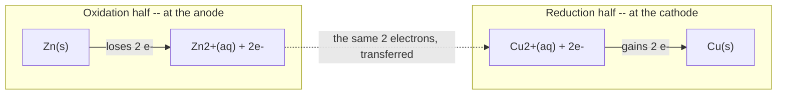
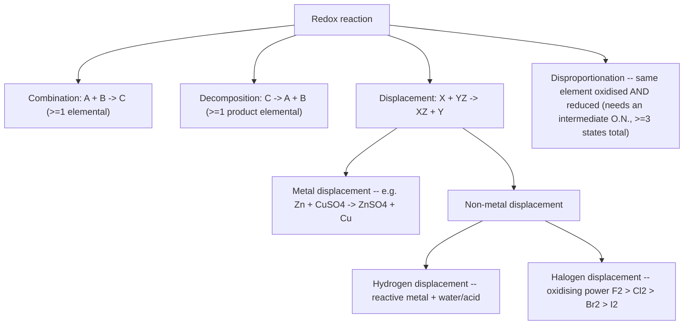
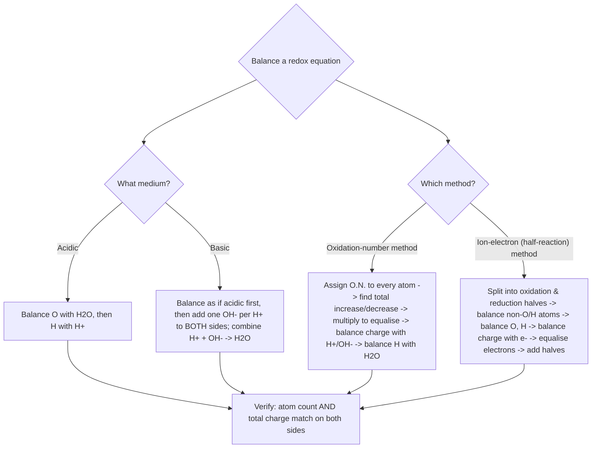

# Redox Reactions

**Branch:** Physical Chemistry (Redox & Electrochemistry Foundations) · **Source:** NCERT Class XI Chemistry, Unit 7 · **Level:** Board · NEET · JEE

*"Where there is oxidation, there is always reduction — Chemistry is essentially a study of redox systems."*

> [!info] How this note was built
> This note reconciles three sources: the NCERT textbook (Unit 7), your handwritten coaching notes, and an earlier draft of these notes. Where the handwritten notes go beyond the textbook (the full metal activity series, extra balancing examples) or where a calculation needed to be redone, that is flagged explicitly rather than silently merged in.

---

## Concept Roadmap


*Every later idea in this chapter -- oxidation number, balancing, titrations, electrode potential -- is one of two things stacked on top of each other: the classical O/H-transfer picture, or the electron-transfer picture. Keep asking "which of these two lenses am I using right now?" and the chapter stops feeling like a pile of disconnected rules.*

---

## 7.1 The Classical Idea of Redox Reactions ⭐

### 7.1.1 Oxidation — The Classical View

**Originally defined** as the **addition of oxygen** to an element or compound:

| Reaction | Process |
|----------|---------|
| \( 2\text{Mg(s)} + \text{O}_2\text{(g)} \to 2\text{MgO(s)} \) | Mg is oxidised (O₂ added) |
| \( \text{S(s)} + \text{O}_2\text{(g)} \to \text{SO}_2\text{(g)} \) | S is oxidised (O₂ added) |
| \( \text{CH}_4\text{(g)} + 2\text{O}_2\text{(g)} \to \text{CO}_2\text{(g)} + 2\text{H}_2\text{O(l)} \) | C–H oxidised (O₂ added, H removed) |

**The definition was broadened** in three stages, each one a generalisation of the last:

1. **Removal of hydrogen**: \( 2\text{H}_2\text{S(g)} + \text{O}_2\text{(g)} \to 2\text{S(s)} + 2\text{H}_2\text{O(l)} \) — H₂S is oxidised even though nothing here is a hydrocarbon.
2. **Addition of any electronegative element**, not just oxygen: \( \text{Mg(s)} + \text{F}_2\text{(g)} \to \text{MgF}_2\text{(s)} \); \( \text{Mg(s)} + \text{Cl}_2\text{(g)} \to \text{MgCl}_2\text{(s)} \); \( \text{Mg(s)} + \text{S(s)} \to \text{MgS(s)} \).
3. **Removal of an electropositive element**: \( 2\text{K}_4[\text{Fe(CN)}_6](aq) + \text{H}_2\text{O}_2(aq) \to 2\text{K}_3[\text{Fe(CN)}_6](aq) + 2\text{KOH}(aq) \) — potassium (electropositive) is removed from ferrocyanide as it becomes ferricyanide.

> [!example] Boxed definition
> \[
> \boxed{\textbf{Oxidation (classical)} = \text{addition of O/electronegative element} \;\;\text{OR}\;\; \text{removal of H/electropositive element}}
> \]

### 7.1.2 Reduction — The Classical View

**Originally:** removal of oxygen from a compound. **Broadened to include:**

| Reaction | Reduction process |
|----------|------------------|
| \( 2\text{HgO(s)} \xrightarrow{\Delta} 2\text{Hg(l)} + \text{O}_2\text{(g)} \) | Removal of oxygen from HgO |
| \( 2\text{FeCl}_3(aq) + \text{H}_2\text{(g)} \to 2\text{FeCl}_2(aq) + 2\text{HCl}(aq) \) | Removal of electronegative Cl |
| \( \text{CH}_2{=}\text{CH}_2\text{(g)} + \text{H}_2\text{(g)} \to \text{H}_3\text{C–CH}_3\text{(g)} \) | Addition of hydrogen |
| \( 2\text{HgCl}_2(aq) + \text{SnCl}_2(aq) \to \text{Hg}_2\text{Cl}_2\text{(s)} + \text{SnCl}_4(aq) \) | Addition of Hg (electropositive) to HgCl₂ |

> [!example] Boxed definition
> \[
> \boxed{\textbf{Reduction (classical)} = \text{removal of O/electronegative element} \;\;\text{OR}\;\; \text{addition of H/electropositive element}}
> \]

### 7.1.3 The Simultaneous Nature — Why "Redox"

In the last reaction above, HgCl₂ is reduced (it gains an Hg partner) **while SnCl₂ is simultaneously oxidised** to SnCl₄ (Cl, electronegative, is added to it). Re-examining every reaction in 7.1.1–7.1.2 the same way shows oxidation and reduction never occur alone — hence the portmanteau **"redox."**

> [!warning] The trap: reactions with only one *visible* change
> A reaction can look like "just an oxidation" if you only watch one reactant. \( 2\text{HgCl}_2 + \text{SnCl}_2 \to \text{Hg}_2\text{Cl}_2 + \text{SnCl}_4 \) is the textbook's own example of this — always check *both* reactants before concluding only one has changed.

#### Worked Example — Identifying oxidised/reduced species (NCERT Problem 7.1)

**Given:** (i) \( \text{H}_2\text{S(g)} + \text{Cl}_2\text{(g)} \to 2\text{HCl(g)} + \text{S(s)} \) (ii) \( 3\text{Fe}_3\text{O}_4\text{(s)} + 8\text{Al(s)} \to 9\text{Fe(s)} + 4\text{Al}_2\text{O}_3\text{(s)} \) (iii) \( 2\text{Na(s)} + \text{H}_2\text{(g)} \to 2\text{NaH(s)} \)
**Find:** which species is oxidised, which is reduced, in each.
**Concept:** classical addition/removal rules from 7.1.1–7.1.2.
**Work:**
(i) H₂S is oxidised (electronegative Cl added to H — equivalently, H removed from S). Cl₂ is reduced (H added to it).
(ii) Al is oxidised (O added). Fe₃O₄ is reduced (O removed).
(iii) Na is oxidised (forms Na⁺ in the ionic solid NaH). H₂ is reduced (H goes from neutral to H⁻, i.e. an electropositive element — Na — has been *added* to it).
**Check:** every pair has one oxidation and one reduction — consistent with 7.1.3.

#### Worked Example — Justifying 2Na(s) + H₂(g) → 2NaH(s) is redox (NCERT Problem 7.2)

**Concept:** NaH is ionic, better written Na⁺H⁻(s), so it splits into two half-reactions.
**Work:**
\[
\begin{aligned}
\text{Oxidation half:}&\quad 2\text{Na(s)} \to 2\text{Na}^+\text{(g)} + 2e^- \\
\text{Reduction half:}&\quad \text{H}_2\text{(g)} + 2e^- \to 2\text{H}^-\text{(g)}
\end{aligned}
\]
Splitting the reaction this way shows sodium is oxidised and hydrogen is reduced — the reaction is redox even though no O or classic electronegative element is anywhere in sight. This is exactly the case that motivates Section 7.2: the classical definition needs an electron-based backbone to handle reactions like this cleanly.

---

## 7.2 Redox Reactions in Terms of Electron Transfer ⭐⭐

### 7.2.1 The Electronic Interpretation

When sodium reacts with chlorine, oxygen, or sulphur, the products are ionic — better written with explicit charges:

\[
\begin{aligned}
2\text{Na(s)} + \text{Cl}_2\text{(g)} &\to 2\text{Na}^+\text{Cl}^-\text{(s)} \\
4\text{Na(s)} + \text{O}_2\text{(g)} &\to 2(\text{Na}^+)_2\text{O}^{2-}\text{(s)} \\
2\text{Na(s)} + \text{S(s)} &\to (\text{Na}^+)_2\text{S}^{2-}\text{(s)}
\end{aligned}
\]

The **charge development is direct evidence of electron transfer**. Splitting the first reaction into its two **half-reactions**:

\[
\begin{aligned}
\text{Oxidation half:}&\quad 2\text{Na(s)} \to 2\text{Na}^+\text{(g)} + 2e^- \\
\text{Reduction half:}&\quad \text{Cl}_2\text{(g)} + 2e^- \to 2\text{Cl}^-\text{(g)} \\
\hline
\text{Overall:}&\quad 2\text{Na(s)} + \text{Cl}_2\text{(g)} \to 2\text{Na}^+\text{Cl}^-\text{(s)}
\end{aligned}
\]

> [!example] Boxed electronic definitions
> \[
> \boxed{\textbf{Oxidation} = \text{loss of electron(s)}\;(\text{OIL}) \qquad \textbf{Reduction} = \text{gain of electron(s)}\;(\text{RIG})}
> \]
> \[
> \boxed{\textbf{Oxidising agent (oxidant)} = \text{electron acceptor, itself gets reduced} \qquad \textbf{Reducing agent (reductant)} = \text{electron donor, itself gets oxidised}}
> \]

In \( 2\text{Na} + \text{Cl}_2 \to 2\text{NaCl} \): Na loses electrons (oxidised, so Na is the *reducing agent*); Cl₂ gains electrons (reduced, so Cl₂ is the *oxidising agent*).



*The two half-reactions are not independent facts to memorise separately — they are one electron-counting exercise seen from two ends. Whatever number of electrons the oxidation half releases, the reduction half must absorb, or the equation isn't balanced (Section 7.3.2 turns this into a formal method).*

### 7.2.2 Competitive Electron Transfer Reactions

Three experiments build the case for ranking metals by how readily they give up electrons:

| Experiment | Reaction | Equilibrium behaviour |
|---|---|---|
| Zn strip in CuSO₄(aq) | \( \text{Zn(s)} + \text{Cu}^{2+}(aq) \to \text{Zn}^{2+}(aq) + \text{Cu(s)} \) | Strip coats with red-brown Cu; blue colour vanishes. **Greatly favours products** — Cu²⁺ is undetectable at equilibrium even by the sensitive H₂S/CuS test. |
| Cu rod in AgNO₃(aq) | \( \text{Cu(s)} + 2\text{Ag}^+(aq) \to \text{Cu}^{2+}(aq) + 2\text{Ag(s)} \) | Solution turns blue, Ag deposits on the rod. **Greatly favours products.** |
| Co strip in NiSO₄(aq) | \( \text{Co(s)} + \text{Ni}^{2+}(aq) \to \text{Co}^{2+}(aq) + \text{Ni(s)} \) | Both Ni²⁺(aq) and Co²⁺(aq) persist at **moderate, comparable concentrations** — neither side is strongly favoured. |

> **Key idea:** competition for electrons between metals is directly analogous to competition for protons between acids. Comparing enough of these experiments builds a table of metals ranked by electron-releasing tendency: \( \text{Zn} > \text{Cu} > \text{Ag} \). Extending this to as many metals as possible gives the **metal activity series (electrochemical series)** — the same ranking that, quantified, becomes the standard electrode potentials of Section 7.4.

**The full activity series** (most to least reactive), as commonly tabulated for quick recall:

\[
\text{K} > \text{Na} > \text{Ca} > \text{Mg} > \text{Al} > \text{Zn} > \text{Fe} > \text{Pb} > \text{H} > \text{Cu} > \text{Hg} > \text{Ag} > \text{Au} > \text{Pt}
\]

> [!warning] A gap worth closing
> A shorter version of this list sometimes circulates without **Ag** between Cu and Hg. Check it against Table 7.1's standard reduction potentials (Section 7.4): Ag⁺/Ag sits at +0.80 V, correctly between Cu²⁺/Cu (+0.34 V) and 2Hg²⁺/Hg₂²⁺ (+0.92 V) — so Ag belongs in the list exactly where shown above.

The oxidation-number picture in the next section is what lets this competitive-electron-transfer idea be applied to reactions involving covalent (not just ionic) compounds, where "who loses/gains an electron" is not visually obvious the way it is for Na⁺Cl⁻.

---

## 7.3 Oxidation Number ⭐⭐⭐

**Oxidation number** denotes the oxidation state of an element in a compound, assigned by a consistent set of rules built on one assumption: **the electron pair in a covalent bond belongs entirely to the more electronegative atom.**

> [!warning] This is a book-keeping device, not a physical charge
> Real covalent bonds are *shared*, not transferred — the true charge distribution is a partial polarity, not a full +1/–1 split. Oxidation number pretends the transfer is complete, purely so redox bookkeeping stays simple. Never confuse it with formal charge or with the literal charge on an atom.

```tikz
\begin{tikzpicture}[thick, scale=1.1]
  \node[font=\Large] (H) at (-1.5,0) {H};
  \node[font=\Large] (Cl) at (1.5,0) {Cl};
  \draw[line width=1.4pt] (H) -- (Cl);
  \fill (-0.15,0.2) circle (1.8pt);
  \fill (-0.15,-0.2) circle (1.8pt);
  \draw[->, red!70!black, line width=1.2pt] (-0.15,0.55) .. controls (0.5,0.9) .. (1.1,0.35);
  \node[above, font=\small, text=red!70!black] at (0.55,0.85) {notional full transfer};
  \node[above, font=\small] at (-1.5,0.4) {$+1$};
  \node[above, font=\small] at (1.5,0.4) {$-1$};
  \node[below, font=\itshape\small, text=gray] at (0,-1.0) {H--Cl: the shared bonding pair (dots) is real; the oxidation-number rule notionally assigns it entirely to the more electronegative Cl -- a book-keeping convention, not the true partially-covalent charge distribution};
\end{tikzpicture}
```

Applying this to \( 2\text{H}_2\text{(g)} + \text{O}_2\text{(g)} \to 2\text{H}_2\text{O(l)} \): H is visualised as going from a neutral state to \(+1\), and O from neutral to \(-2\) — even though the real electron shift is partial, not a complete transfer.

### Rules for Assigning Oxidation Number

1. **Free/uncombined element** → oxidation number = **0**. (H₂, O₂, Cl₂, O₃, P₄, S₈, Na, Mg, Al are all 0.)
2. **Monoatomic ion** → oxidation number = **charge on the ion**. (Na⁺ = +1, Mg²⁺ = +2, Fe³⁺ = +3, Cl⁻ = –1, O²⁻ = –2.)
3. **Oxygen** = **–2** in most compounds. Exceptions: peroxides (H₂O₂, Na₂O₂) → **–1**; superoxides (KO₂, RbO₂) → **–½**; bonded to fluorine (OF₂ → **+2**, O₂F₂ → **+1**) — the only case where O is positive.
4. **Hydrogen** = **+1**, except in **metal hydrides** (binary compounds with metals): LiH, NaH, CaH₂ → H = **–1**.
5. **Fluorine** = always **–1** (most electronegative element — cannot go positive). Other halogens (Cl, Br, I) = –1 as halide ions, but take **positive** values in oxoacids/oxoanions (combined with O).
6. **Sum of oxidation numbers** in a neutral compound = **0**; in a polyatomic ion = **charge on the ion**. If an element appears more than once (e.g. in Na₂S₂O₃ or Cr₂O₇²⁻), the number obtained is the **average** across all atoms of that element.

| Element | Usual O.N. | Exception / range |
|---------|------------|-------------------|
| O | –2 | Peroxide: –1; superoxide: –½; OF₂: +2 |
| H | +1 | Metal hydrides: –1 |
| F | –1 | Always –1, no exception |
| Cl, Br, I | –1 (halide) | Positive in oxoacids/oxoanions |
| Alkali metals (Na, K, …) | +1 | Always +1 in compounds |
| Alkaline earths (Mg, Ca, …) | +2 | Always +2 in compounds |
| Al | +3 | Always +3 in compounds |

**Highest oxidation states across Period 3** (the highest O.N. a representative element can show = group number, for groups 1–2, or group number minus 10 for the rest — following the long-form periodic table):

| Group | 1 | 2 | 13 | 14 | 15 | 16 | 17 |
|-------|---|---|----|----|----|----|-----|
| Element | Na | Mg | Al | Si | P | S | Cl |
| Compound | NaCl | MgSO₄ | AlF₃ | SiCl₄ | P₄O₁₀ | SF₆ | HClO₄ |
| Highest O.N. | +1 | +2 | +3 | +4 | +5 | +6 | +7 |

> \[
> \boxed{\text{Highest oxidation number increases across a period}}
> \]

### Stock Notation

Alfred Stock's convention writes the oxidation number as a **Roman numeral in parentheses** after the metal symbol.

| Compound | Stock name | Common name |
|----------|-----------|-------------|
| AuCl | Au(I)Cl — gold(I) chloride | aurous chloride |
| AuCl₃ | Au(III)Cl₃ — gold(III) chloride | auric chloride |
| SnCl₂ | Sn(II)Cl₂ — tin(II) chloride | stannous chloride |
| SnCl₄ | Sn(IV)Cl₄ — tin(IV) chloride | stannic chloride |
| FeCl₂ | Fe(II)Cl₂ — iron(II) chloride | ferrous chloride |
| FeCl₃ | Fe(III)Cl₃ — iron(III) chloride | ferric chloride |
| HgCl₂ | Hg(II)Cl₂ — mercury(II) chloride | mercuric chloride |
| Hg₂Cl₂ | Hg₂(I)Cl₂ — mercury(I) chloride | mercurous chloride |

> [!warning] High-yield edge case: "mercurous" is *not* HgCl
> The Hg(I) ion is the **dimeric** \( \text{Hg}_2^{2+} \), never a monomeric Hg⁺. That is why mercurous chloride is written **Hg₂Cl₂**, not "HgCl" — two Hg per formula unit, average oxidation number +1 each, but bonded to *each other* as a Hg–Hg unit. The textbook makes the same point the other way: \( \text{Hg}_2(\text{I})\text{Cl}_2 \) is described as *the reduced form of* Hg(II)Cl₂, i.e. \( 2\text{HgCl}_2 + \text{SnCl}_2 \to \text{Hg}_2\text{Cl}_2 + \text{SnCl}_4 \) reduces Hg(II) to Hg(I), not to Hg(0).

#### Additional Practice — Stock notation from formulas (NCERT Problem 7.3)

**Given:** HAuCl₄, Tl₂O, FeO, Fe₂O₃, CuI, CuO, MnO, MnO₂.
**Work (rule 6, solving for the metal's O.N.):**

| Compound | O.N. of metal | Stock name |
|---|---|---|
| HAuCl₄ | Au = +3 | HAu(III)Cl₄ |
| Tl₂O | Tl = +1 | Tl₂(I)O |
| FeO | Fe = +2 | Fe(II)O |
| Fe₂O₃ | Fe = +3 | Fe₂(III)O₃ |
| CuI | Cu = +1 | Cu(I)I |
| CuO | Cu = +2 | Cu(II)O |
| MnO | Mn = +2 | Mn(II)O |
| MnO₂ | Mn = +4 | Mn(IV)O₂ |

### Redox Definitions Using Oxidation Number

> \[
> \boxed{\textbf{Oxidation} = \text{increase in O.N.} \qquad \textbf{Reduction} = \text{decrease in O.N.}}
> \]
> \[
> \boxed{\textbf{Oxidising agent} = \text{causes O.N. increase in another; its own O.N. decreases} \qquad \textbf{Reducing agent} = \text{causes O.N. decrease in another; its own O.N. increases}}
> \]

### The Paradox of Fractional Oxidation Numbers

Averaging (rule 6) can produce a **fraction** when the same element occupies more than one real oxidation state in a molecule:

| Species | Average O.N. | Real structure |
|---------|-----------|---------|
| C₃O₂ (carbon suboxide) | C = +4/3 | Two terminal C at +2, middle C at 0 |
| Br₃O₈ (tribromooctaoxide) | Br = +16/3 | Two terminal Br at +6, middle Br at +4 |
| Na₂S₄O₆ (tetrathionate) | S = +2.5 | Two terminal S at +5, two middle S at 0 |

```tikz
\begin{tikzpicture}[thick, scale=1.1]
  \node[font=\Large] (O1) at (-3,0) {O};
  \node[font=\Large] (C1) at (-1.5,0) {C};
  \node[font=\Large] (C2) at (0,0) {C};
  \node[font=\Large] (C3) at (1.5,0) {C};
  \node[font=\Large] (O2) at (3,0) {O};
  \draw[line width=1.4pt, double, double distance=2pt] (O1) -- (C1);
  \draw[line width=1.4pt, double, double distance=2pt] (C1) -- (C2);
  \draw[line width=1.4pt, double, double distance=2pt] (C2) -- (C3);
  \draw[line width=1.4pt, double, double distance=2pt] (C3) -- (O2);
  \node[above, font=\small] at (-1.5,0.35) {$+2$};
  \node[above, font=\small, text=red!70!black] at (0,0.35) {$0$};
  \node[above, font=\small] at (1.5,0.35) {$+2$};
  \node[below, font=\itshape\small, text=gray] at (0,-1.0) {Carbon suboxide C$_3$O$_2$: real oxidation states are $+2, 0, +2$ -- the textbook's "average" of $4/3$ is a book-keeping artefact, not a physical state};
\end{tikzpicture}
```

> \[
> \boxed{\text{A fractional oxidation number is always an average -- the real molecule has that element in more than one whole-number state, revealed only by its structure.}}
> \]

Other genuine mixed-oxide examples: Fe₃O₄ (a 1:2 mixture of Fe²⁺:Fe³⁺ giving average +8/3), Mn₃O₄, Pb₃O₄ (used again in Problem 7.7 below). Genuinely fractional (not an average of integers) exceptions exist too: \( \text{O}_2^+ \) (O = +½) and \( \text{O}_2^- \) (O = –½).

#### Additional Practice — Average oxidation numbers by direct calculation (New)

Using rule 6 (\(\sum \text{O.N.} = 0\) for a neutral compound, or the ionic charge for an ion):

| Species | Setting up | Result |
|---|---|---|
| N in (NH₄)₂SO₄ | NH₄⁺ is a unit charge +1: N + 4(+1) = +1 | **N = –3** |
| S in Na₂SO₄ | 2(+1) + S + 4(–2) = 0 | **S = +6** |
| S (average) in Na₂S₄O₆ | 2(+1) + 4S + 6(–2) = 0 → 4S = 10 | **S = +2.5**, matching Table above |
| S (average) in Na₂S₂O₃ | 2(+1) + 2S + 3(–2) = 0 → 2S = 4 | **S = +2** |

> [!warning] Where sources disagree — thiosulfate's *individual* sulfurs
> The average (+2) is unambiguous, but the two sulfurs' individual states are reported differently across references. One common teaching device treats thiosulfate as sulfate (SO₄²⁻) with one O replaced by S: the central S stays at its sulfate-like **+6**, and the replacing S is assigned **–2** (mimicking the oxygen it replaced), averaging to +2. A structural formal-charge analysis instead often gives **+5** (sulfonate-type central S) and **–1** (terminal sulfido S), which also averages to +2. Both are used in different coaching resources — treat the **average of +2 as the safe, examinable fact**, and don't commit to one individual split unless a question's structural diagram forces it.

#### Worked Example — Redox justification via O.N. (NCERT Problem 7.4)

**Given:** \( 2\text{Cu}_2\text{O(s)} + \text{Cu}_2\text{S(s)} \to 6\text{Cu(s)} + \text{SO}_2\text{(g)} \)
**Work:** assign O.N. to every atom:

```
 +1 –2      +1 –2       0      +4 –2
2Cu₂O(s) + Cu₂S(s) →  6Cu(s) + SO₂(g)
```

Cu goes +1 → 0 (**reduced**, so Cu₂O is the **oxidant**). S goes –2 → +4 (**oxidised**, so Cu₂S is the **reductant**).
**Check:** total electrons gained by Cu — 4 Cu atoms (2 from each Cu₂O, ×2 formula units) each gain 1e⁻ = 4e⁻ gained. Total electrons lost by S: 1 S atom loses 6e⁻ (–2 → +4). ✓ 4 electrons gained across 4 Cu atoms is not equal to 6 lost by one S atom at first glance — but Cu₂S also contributes 2 Cu atoms that are reduced (+1→0, 2e⁻), so total Cu reduced = (4 from Cu₂O) + (2 from Cu₂S) = 6 Cu atoms × 1e⁻ = 6e⁻ gained, matching the 6e⁻ lost by S. Electrons lost = electrons gained. ✓

#### Worked Example — Disproportionation screening (NCERT Problem 7.5)

**Given:** ClO⁻, ClO₂⁻, ClO₃⁻, ClO₄⁻ — which does *not* disproportionate, and why?
**Concept:** disproportionation needs an *intermediate* oxidation state with room to go both up and down (Section 7.3.1 below states this formally).
**Work:** Cl oxidation numbers are +1, +3, +5, +7 respectively.

\[
\begin{aligned}
3\text{ClO}^- &\to 2\text{Cl}^- + \text{ClO}_3^- &&(+1 \to -1 \text{ and } +5)\\
6\text{ClO}_2^- &\to 4\text{ClO}_3^- + 2\text{Cl}^- &&(+3 \to +5 \text{ and } -1)\\
4\text{ClO}_3^- &\to \text{Cl}^- + 3\text{ClO}_4^- &&(+5 \to -1 \text{ and } +7)
\end{aligned}
\]

**ClO₄⁻ does not disproportionate** — Cl is already at +7, its maximum possible oxidation state (Cl is in group 17, highest O.N. = 17 – 10 = 7), so it has nowhere higher to go.

#### Additional Practice — Classifying four redox reactions (NCERT Problem 7.6)

| Reaction | Classification | Why |
|---|---|---|
| \( \text{N}_2\text{(g)} + \text{O}_2\text{(g)} \to 2\text{NO(g)} \) | Combination | Two elements → one compound |
| \( 2\text{Pb(NO}_3)_2\text{(s)} \to 2\text{PbO(s)} + 4\text{NO}_2\text{(g)} + \text{O}_2\text{(g)} \) | Decomposition | One compound → three products |
| \( \text{NaH(s)} + \text{H}_2\text{O(l)} \to \text{NaOH}(aq) + \text{H}_2\text{(g)} \) | Displacement | H of water displaced by hydride ion into H₂ |
| \( 2\text{NO}_2\text{(g)} + 2\text{OH}^-(aq) \to \text{NO}_2^-(aq) + \text{NO}_3^-(aq) + \text{H}_2\text{O(l)} \) | Disproportionation | N (+4) splits into +3 and +5 |

*(This table previews Section 7.3.1's four-way classification — worth returning to after reading it.)*

---

### 7.3.1 Types of Redox Reactions ⭐⭐



*Every redox reaction in this chapter fits exactly one branch of this tree. If a reaction doesn't obviously fit, assign oxidation numbers to every atom first (Section 7.3) — the classification usually becomes obvious once the changes are visible.*

**Combination reactions** (\( A + B \to C \)): at least one of A, B must be elemental. All combustion reactions using elemental O₂ qualify.

```
0    0       +4 –2
C(s) + O₂(g) →   CO₂(g)

 0    0      +2 –3
3Mg(s) + N₂(g) →  Mg₃N₂(s)
```

> [!warning] Not every combination reaction is redox
> \( \text{CaO(s)} + \text{CO}_2\text{(g)} \to \text{CaCO}_3\text{(s)} \) — Ca stays +2, C stays +4, O stays –2 throughout. No oxidation number changes, so this is **not** a redox reaction despite fitting the A + B → C pattern.

**Decomposition reactions**: the reverse — a compound breaks into ≥2 components, at least one elemental.

```
+1 –2           0    0
2H₂O(l) → 2H₂(g) + O₂(g)

+1 +5 –2        +1 –1    0
2KClO₃(s) → 2KCl(s) + 3O₂(g)
```

> [!warning] Not every decomposition reaction is redox
> \( \text{CaCO}_3\text{(s)} \to \text{CaO(s)} + \text{CO}_2\text{(g)} \) — Ca, C, O all keep their oxidation states. Not redox.

**Displacement reactions** (\( X + YZ \to XZ + Y \)):

*Metal displacement* — a more active metal (per the activity series of 7.2.2) displaces a less active one from its salt:

```
+2+6–2    0       0    +2+6–2
CuSO₄(aq) + Zn(s) →  Cu(s) + ZnSO₄(aq)

+3–2     0    +3–2    0
Cr₂O₃(s) + 2Al(s) → Al₂O₃(s) + 2Cr(s)
```

*Non-metal displacement — hydrogen*: very active metals (alkali metals, Ca, Sr, Ba) displace H from **cold water**; less active metals (Mg, Fe) need **steam**; many metals (including Zn, Fe) displace H from **acids**:

```
2Na(s) + 2H₂O(l) → 2NaOH(aq) + H₂(g)
Zn(s) + 2HCl(aq) → ZnCl₂(aq) + H₂(g)
```

Rate of H₂ evolution tracks reactivity (Mg fastest, Fe slowest among the common lab metals); Ag, Au don't react even with HCl — consistent with their position at the bottom of the activity series.

*Non-metal displacement — halogens*: oxidising power decreases \( \text{F}_2 > \text{Cl}_2 > \text{Br}_2 > \text{I}_2 \).

```
Cl₂(g) + 2KBr(aq) → 2KCl(aq) + Br₂(l)
Cl₂(g) + 2KI(aq)  → 2KCl(aq) + I₂(s)
```

> **Layer Test:** Br₂ and I₂ are coloured and dissolve in CCl₄ — used to identify Br⁻/I⁻ in the lab.
> **F₂ is exceptional**: it is so reactive it attacks water itself, \( 2\text{H}_2\text{O(l)} + 2\text{F}_2\text{(g)} \to 4\text{HF}(aq) + \text{O}_2\text{(g)} \), so F₂ halogen-displacement reactions are never run in aqueous solution.
> **F⁻ → F₂** cannot be achieved by any chemical oxidant (F₂ is already the strongest one available) — only **electrolysis** works.

**Disproportionation reactions**: the same element, in one oxidation state, is *simultaneously* oxidised and reduced. Requires the element to have **at least three accessible oxidation states**, with the reactant sitting at the **intermediate** one.

```
+1 –1             +1 –2    0
2H₂O₂(aq) → 2H₂O(l) + O₂(g)      [O: –1 → –2 (reduced) and –1 → 0 (oxidised)]

  0                +1         –1
Cl₂(g) + 2OH⁻(aq) → ClO⁻(aq) + Cl⁻(aq) + H₂O(l)     [household bleach — ClO⁻ oxidises stains]
```

> [!warning] Fluorine cannot disproportionate
> \( 2\text{F}_2\text{(g)} + 2\text{OH}^-(aq) \to 2\text{F}^-(aq) + \text{OF}_2\text{(g)} + \text{H}_2\text{O(l)} \) looks similar to the chlorine reaction above but is **not** disproportionation: F₂ is only reduced (0 → –1); it is oxygen that gets oxidised (–2 in OH⁻ → +2 in OF₂, since O bonded to F is the one exception to O = –2). Fluorine, being the most electronegative element of all, **can never show a positive oxidation state**, so it can never be the species that gets oxidised — hence it never disproportionates.

#### Worked Example — Why identical-formula Pb₃O₄ reacts differently with HCl vs HNO₃ (NCERT Problem 7.7)

**Given:** \( \text{Pb}_3\text{O}_4 + 8\text{HCl} \to 3\text{PbCl}_2 + \text{Cl}_2 + 4\text{H}_2\text{O} \) but \( \text{Pb}_3\text{O}_4 + 4\text{HNO}_3 \to 2\text{Pb(NO}_3)_2 + \text{PbO}_2 + 2\text{H}_2\text{O} \).
**Concept:** Pb₃O₄ is not a single compound with Pb at an average +8/3 — it is a **stoichiometric mixture of 2 mol PbO (Pb²⁺, basic oxide) and 1 mol PbO₂ (Pb⁴⁺, an oxidant)**.
**Work:** Splitting the HCl reaction:
\[
\begin{aligned}
2\text{PbO} + 4\text{HCl} &\to 2\text{PbCl}_2 + 2\text{H}_2\text{O} &&\text{(acid–base, not redox)}\\
\text{PbO}_2 + 4\text{HCl} &\to \text{PbCl}_2 + \text{Cl}_2 + 2\text{H}_2\text{O} &&\text{(redox: Pb}^{4+}\to\text{Pb}^{2+}\text{, Cl}^-\to\text{Cl}_2\text{)}
\end{aligned}
\]
PbO₂ oxidises Cl⁻ to Cl₂ because Pb⁴⁺ is unstable relative to the more stable Pb²⁺. But HNO₃ is *itself already an oxidising agent* — it cannot be oxidised further by PbO₂, so PbO₂ stays passive against HNO₃, and only the acid–base reaction (\( 2\text{PbO} + 4\text{HNO}_3 \to 2\text{Pb(NO}_3)_2 + 2\text{H}_2\text{O} \)) proceeds.
**Check:** this is the single best illustration in the whole chapter that "same formula" does not mean "same chemistry" — Pb₃O₄'s reactivity is entirely explained by treating it as a *mixture*, not a compound with a fractional oxidation state (contrast with the genuinely fractional/averaged species of the previous section).

---

### 7.3.2 Balancing of Redox Reactions ⭐⭐⭐

Two methods exist — same physics, different bookkeeping. Both are in active use; which one to reach for is mostly personal preference, with one exception (basic medium is easier to track cleanly with the half-reaction method).



*Whichever path you take through this flowchart, the final "Verify" step is not optional — a redox equation that balances atoms but not charge (or vice versa) is wrong, not "almost done."*

#### Method 1 — Oxidation Number Method (steps)

1. Write the correct formula for every reactant and product.
2. Assign oxidation numbers to every atom; identify which ones change.
3. Compute the increase/decrease per atom, then per formula unit; multiply by whole numbers until total increase = total decrease.
4. In aqueous solution, add H⁺ (acidic) or OH⁻ (basic) so ionic charge balances on both sides.
5. Add H₂O to balance H atoms; check O atoms balance as a final confirmation.

**Worked Example — K₂Cr₂O₇ + Na₂SO₃ in acid (NCERT Problem 7.8)**

\[
\begin{aligned}
&\text{Step 1:}\quad \text{Cr}_2\text{O}_7^{2-}(aq) + \text{SO}_3^{2-}(aq) \to \text{Cr}^{3+}(aq) + \text{SO}_4^{2-}(aq) \\[4pt]
&\text{Step 2:}\quad \overset{+6}{\text{Cr}_2\text{O}_7^{2-}} + \overset{+4}{\text{SO}_3^{2-}} \to \overset{+3}{\text{Cr}^{3+}} + \overset{+6}{\text{SO}_4^{2-}} \\[4pt]
&\text{Step 3:}\quad \text{Cr: } +6\to+3 \;(\Delta=-3,\ \times2\text{ Cr}=-6);\quad \text{S: } +4\to+6\;(\Delta=+2) \\
&\phantom{\text{Step 3:}}\quad \Rightarrow\ \text{Cr}_2\text{O}_7^{2-} + 3\text{SO}_3^{2-} \to 2\text{Cr}^{3+} + 3\text{SO}_4^{2-} \quad(-6 = +6\ \checkmark)\\[4pt]
&\text{Step 4:}\quad \text{charge left} = -2-6=-8,\ \text{charge right}=+6-6=0 \Rightarrow \text{add } 8\text{H}^+ \text{ to left}\\[4pt]
&\text{Step 5:}\quad \text{8 H on left} \Rightarrow \text{add } 4\text{H}_2\text{O to right; O: } 7+9=16 \text{ (left)} = 12+4=16 \text{ (right)}\ \checkmark
\end{aligned}
\]

\[
\boxed{\text{Cr}_2\text{O}_7^{2-}(aq) + 3\text{SO}_3^{2-}(aq) + 8\text{H}^+(aq) \to 2\text{Cr}^{3+}(aq) + 3\text{SO}_4^{2-}(aq) + 4\text{H}_2\text{O(l)}}
\]

#### Method 2 — Half-Reaction (Ion-Electron) Method (steps)

1. Write the unbalanced ionic equation.
2. Split into oxidation and reduction half-reactions.
3. Balance atoms *other than* O and H in each half separately.
4. **Acidic:** add H₂O to balance O, then H⁺ to balance H. **Basic:** do the same, then add one OH⁻ per H⁺ to *both* sides, combining H⁺ + OH⁻ → H₂O wherever they land on the same side.
5. Add electrons to balance charge in each half.
6. Multiply each half so electron counts match; add the halves and cancel electrons.
7. Verify atoms and total charge on both sides.

**Worked Example — Fe²⁺ + Cr₂O₇²⁻ in acid (NCERT, Eqs. 7.50–7.58)**

\[
\begin{aligned}
&\text{Step 1:}\quad \text{Fe}^{2+}(aq) + \text{Cr}_2\text{O}_7^{2-}(aq) \to \text{Fe}^{3+}(aq) + \text{Cr}^{3+}(aq) \\[4pt]
&\text{Step 2--3:}\quad \text{Fe}^{2+} \to \text{Fe}^{3+}\qquad \text{Cr}_2\text{O}_7^{2-} \to 2\text{Cr}^{3+}\ \text{(Cr balanced)} \\[4pt]
&\text{Step 4:}\quad \text{Cr}_2\text{O}_7^{2-}(aq) + 14\text{H}^+(aq) \to 2\text{Cr}^{3+}(aq) + 7\text{H}_2\text{O(l)} \\[4pt]
&\text{Step 5:}\quad \text{Fe}^{2+} \to \text{Fe}^{3+} + e^- \qquad \text{Cr}_2\text{O}_7^{2-} + 14\text{H}^+ + 6e^- \to 2\text{Cr}^{3+} + 7\text{H}_2\text{O} \\[4pt]
&\text{Step 6:}\quad 6\times[\text{Fe}^{2+}\to\text{Fe}^{3+}+e^-] \Rightarrow 6\text{Fe}^{2+}\to6\text{Fe}^{3+}+6e^-\ \ (\text{now }6e^-=6e^-)
\end{aligned}
\]

\[
\boxed{6\text{Fe}^{2+}(aq) + \text{Cr}_2\text{O}_7^{2-}(aq) + 14\text{H}^+(aq) \to 6\text{Fe}^{3+}(aq) + 2\text{Cr}^{3+}(aq) + 7\text{H}_2\text{O(l)}}
\]

**Check:** atoms — Fe 6=6, Cr 2=2, O 7=7, H 14=14 ✓. Charge — left \(6(+2)+(-2)+14(+1)=12-2+14=24\); right \(6(+3)+2(+3)=18+6=24\) ✓.

#### Worked Example — MnO₄⁻ + Br⁻ in basic medium (NCERT Problem 7.9)

Skeletal: \( \text{MnO}_4^-(aq) + \text{Br}^-(aq) \to \text{MnO}_2\text{(s)} + \text{BrO}_3^-(aq) \). Mn: +7→+4 (gain 3e⁻); Br: –1→+5 (lose 6e⁻), so multiply the Mn half by 2 to equalise 6e⁻ each side. After balancing O with H₂O, H with H⁺, then converting to basic by adding OH⁻ to both sides:

\[
\boxed{2\text{MnO}_4^-(aq) + \text{Br}^-(aq) + \text{H}_2\text{O(l)} \to 2\text{MnO}_2\text{(s)} + \text{BrO}_3^-(aq) + 2\text{OH}^-(aq)}
\]

**Check:** O: \(8+1=9\) left, \(4+3+2=9\) right ✓. H: 2 left, 2 right ✓. Charge: left \(-2-1=-3\); right \(-1-2=-3\) ✓.

#### Worked Example — MnO₄⁻ + I⁻ in basic medium (NCERT Problem 7.10)

Skeletal: \( \text{MnO}_4^-(aq) + \text{I}^-(aq) \to \text{MnO}_2\text{(s)} + \text{I}_2\text{(s)} \). Mn: +7→+4 (gain 3e⁻ each, ×2 for electron count); I: –1→0 (lose 1e⁻ each, ×6 for two I⁻ per I₂, ×3 sets):

\[
\boxed{6\text{I}^-(aq) + 2\text{MnO}_4^-(aq) + 4\text{H}_2\text{O(l)} \to 3\text{I}_2\text{(s)} + 2\text{MnO}_2\text{(s)} + 8\text{OH}^-(aq)}
\]

**Check:** O: \(8+4=12\) left, \(4+8=12\) right ✓. H: 8 left, 8 right ✓. Charge: left \(-6-2=-8\); right \(-8\) ✓.

#### Additional Practice — Mg + dilute HNO₃ → N₂O (New)

**Given (skeletal, as encountered in dilute-acid metal reactions):** \( \text{Mg} + \text{HNO}_3 \to \text{Mg(NO}_3)_2 + \text{N}_2\text{O} + \text{H}_2\text{O} \)
**Work — oxidation number method:** Mg: 0 → +2 (loses 2e⁻ per atom). N: +5 (in HNO₃) → +1 (in N₂O, since \(2N + (-2) = 0 \Rightarrow N=+1\)), a gain of 4e⁻ per N, and N₂O carries **two** N atoms, so each "unit" of N₂O absorbs 8e⁻ total. To equalise, 4 Mg atoms (4×2e⁻ = 8e⁻ lost) must accompany 1 N₂O (8e⁻ gained):

\[
\boxed{4\text{Mg(s)} + 10\text{HNO}_3(aq) \to 4\text{Mg(NO}_3)_2(aq) + \text{N}_2\text{O(g)} + 5\text{H}_2\text{O(l)}}
\]

**Check:** Mg 4=4. N: left 10, right \(4\times2+2=10\) ✓. H: left 10, right \(5\times2=10\) ✓. O: left \(10\times3=30\), right \(4\times6+1+5=24+1+5=30\) ✓. Electrons: 8 lost (Mg) = 8 gained (N₂O) ✓.

#### Additional Practice — Cr(OH)₃ + IO₃⁻ in basic medium (New — corrected)

**Given (skeletal):** chromium(III) hydroxide reacts with iodate ion in basic solution to give chromate ion and iodide ion: \( \text{Cr(OH)}_3 + \text{IO}_3^- \to \text{CrO}_4^{2-} + \text{I}^- \)

> [!warning] A placement error worth flagging
> An earlier draft of this reaction had "+4OH⁻" written after the products. Re-deriving it from the half-reactions (below) shows the four hydroxide ions belong on the **reactant** side, not the product side — the correction matters because misplacing OH⁻ silently breaks both the atom and charge balance.

**Work:**
\[
\begin{aligned}
\text{Oxidation half (Cr: +3}\to\text{+6, loses 3}e^-\text{):}\quad &\text{Cr(OH)}_3 + \text{H}_2\text{O} \to \text{CrO}_4^{2-} + 5\text{H}^+ + 3e^- \\
\text{Reduction half (I: +5}\to\text{--1, gains 6}e^-\text{):}\quad &\text{IO}_3^- + 6\text{H}^+ + 6e^- \to \text{I}^- + 3\text{H}_2\text{O}
\end{aligned}
\]
Multiply the oxidation half by 2 (6e⁻ each side), add, and cancel common H₂O/H⁺:
\[
2\text{Cr(OH)}_3 + \text{IO}_3^- \to 2\text{CrO}_4^{2-} + \text{I}^- + \text{H}_2\text{O} + 4\text{H}^+ \quad\text{(acidic-form intermediate)}
\]
Converting to basic medium — add 4 OH⁻ to **both** sides, combining the 4H⁺ on the right with 4 of those OH⁻ into 4H₂O (which joins the existing 1H₂O to give 5H₂O):

\[
\boxed{2\text{Cr(OH)}_3\text{(s)} + \text{IO}_3^-(aq) + 4\text{OH}^-(aq) \to 2\text{CrO}_4^{2-}(aq) + \text{I}^-(aq) + 5\text{H}_2\text{O(l)}}
\]

**Check:** Cr 2=2, I 1=1. O: left \(6+3+4=13\), right \(8+5=13\) ✓. H: left \(6+4=10\), right \(10\) ✓. Charge: left \(0-1-4=-5\), right \(-4-1+0=-5\) ✓. Electrons: 6 lost (2 Cr × 3e⁻) = 6 gained (1 I × 6e⁻) ✓.

### Acidic vs Basic Medium — Quick Rules

| Situation | Balance O with | Balance H with | Charge balanced using |
|-----------|-----------------|-----------------|---------------|
| **Acidic** | H₂O | H⁺ | H⁺ |
| **Basic** | H₂O | H⁺, then add equal OH⁻ to *both* sides | OH⁻ |

---

### 7.3.3 Redox Reactions as the Basis for Titrations ⭐⭐

Just as acid–base titrations use a pH-sensitive indicator, redox titrations use a **redox-sensitive indicator** to find the equivalence point.

| Indicator type | Example | How the endpoint shows |
|---|---|---|
| **Self-indicator** | \( \text{MnO}_4^- \) (intensely purple) | The reagent itself is coloured; the first lasting pink tinge appears once the last reductant (Fe²⁺, C₂O₄²⁻) is consumed, detectable at concentrations as low as \(10^{-6}\ \text{mol L}^{-1}\) — a minimal colour "overshoot" past equivalence. |
| **External indicator** | \( \text{Cr}_2\text{O}_7^{2-} \) with **diphenylamine** | Cr₂O₇²⁻ itself doesn't self-indicate; diphenylamine is oxidised just after equivalence, producing an intense blue colour. |
| **Iodometric (indirect)** | Cu(II) estimation | \( 2\text{Cu}^{2+}(aq) + 4\text{I}^-(aq) \to \text{Cu}_2\text{I}_2\text{(s)} + \text{I}_2(aq) \), then \( \text{I}_2(aq) + 2\text{S}_2\text{O}_3^{2-}(aq) \to 2\text{I}^-(aq) + \text{S}_4\text{O}_6^{2-}(aq) \). Starch turns intensely blue with I₂; the colour vanishes the instant thiosulfate consumes the last of the liberated iodine — a very sharp endpoint. |

### 7.3.4 Limitations of the Oxidation Number Concept ⭐

The textbook's own note: in recent understanding, **oxidation is reframed as a decrease in electron density**, and **reduction as an increase in electron density**, around the atom(s) involved — a softer, more physically honest picture than "complete" electron transfer.

> [!example] Why the O.N. concept eventually strains
> - **It assumes an ionic bonding model.** In genuinely covalent bonds electrons are *shared*, so O.N. rarely represents literal atomic charge (this is exactly the H–Cl figure earlier in Section 7.3).
> - **Resonance structures make a single O.N. arbitrary.** When more than one resonance form is reasonable, forcing one oxidation number onto an atom can be misleading.
> - **It doesn't describe electron transfer well in complex coordination compounds, radicals, or large organic molecules**, where bonding is delocalised or the "more electronegative atom" rule breaks down.
> - **Some genuine electron-transfer (redox) processes show *no* net change in oxidation number.** The clearest example is a **self-exchange reaction**, e.g. \( \text{Fe}^{2+} + {}^*\text{Fe}^{3+} \rightleftharpoons \text{Fe}^{3+} + {}^*\text{Fe}^{2+} \) (the asterisk marks an isotopically labelled atom): an electron genuinely moves between two iron centres, yet the bulk oxidation-number bookkeeping shows +2 and +3 present before *and* after. These reactions (central to Marcus theory, beyond NCERT/JEE syllabus) are real evidence that "electron transfer" is the deeper, more general idea, and "change in oxidation number" is a useful but imperfect proxy for it.

---

## 7.4 Redox Reactions and Electrode Processes ⭐⭐⭐

### From Direct to Indirect Electron Transfer

Dipping a Zn rod directly into CuSO₄(aq) (Section 7.2.2) transfers electrons **directly**, atom to atom, releasing the energy as heat. Separating the two half-reactions physically — Zn in ZnSO₄(aq), Cu in CuSO₄(aq), connected by a wire and a salt bridge — forces the *same* electrons to travel through an external circuit instead, which is what makes the energy extractable as **electricity**. This setup is the **Daniell cell**.

```tikz
\usetikzlibrary{arrows.meta}
\begin{tikzpicture}[>={Stealth[length=7pt,width=5pt]}, <={Stealth[length=7pt,width=5pt]}, thick, scale=1.0]
  % Left beaker: Zn / ZnSO4
  \draw[line width=1.2pt] (0,0) -- (0,3.2) -- (2.6,3.2) -- (2.6,0) -- cycle;
  \fill[blue!12] (0.05,0.1) rectangle (2.55,2.6);
  \node[font=\small] at (1.3,2.9) {ZnSO$_4$(aq)};
  \draw[line width=2.2pt, gray!60!black] (1.3,3.6) -- (1.3,1.0);
  \node[above, font=\small] at (1.3,3.65) {Zn};
  \node[below, font=\small\bfseries] at (1.3,-0.3) {Anode ($-$)};
  % Right beaker: Cu / CuSO4
  \draw[line width=1.2pt] (6.0,0) -- (6.0,3.2) -- (8.6,3.2) -- (8.6,0) -- cycle;
  \fill[blue!25] (6.05,0.1) rectangle (8.55,2.6);
  \node[font=\small] at (7.3,2.9) {CuSO$_4$(aq)};
  \draw[line width=2.2pt, orange!85!black] (7.3,3.6) -- (7.3,1.0);
  \node[above, font=\small] at (7.3,3.65) {Cu};
  \node[below, font=\small\bfseries] at (7.3,-0.3) {Cathode ($+$)};
  % Salt bridge
  \draw[line width=1.4pt] (2.6,1.3) .. controls (3.6,2.6) and (5.0,2.6) .. (6.0,1.3);
  \draw[line width=1.4pt] (2.6,0.9) .. controls (3.6,2.2) and (5.0,2.2) .. (6.0,0.9);
  \node[font=\itshape\small] at (4.3,2.85) {salt bridge (KCl/agar)};
  % External wire, ammeter, arrows
  \draw[line width=1.2pt] (1.3,3.6) -- (1.3,4.4) -- (2.95,4.4);
  \draw[line width=1.2pt] (7.3,3.6) -- (7.3,4.4) -- (5.65,4.4);
  \draw[line width=1.2pt] (3.4,4.4) circle (0.45);
  \node[font=\small] at (3.4,4.4) {A};
  \draw[line width=1.2pt] (3.85,4.4) -- (5.2,4.4);
  \draw[->, red!70!black, line width=1.3pt] (2.0,4.75) -- (6.6,4.75) node[midway, above, font=\small, text=red!70!black] {conventional current};
  \draw[->, green!45!black, line width=1.3pt] (6.6,4.15) -- (2.0,4.15) node[midway, below, font=\small, text=green!45!black] {e$^-$ flow};
  \node[below, font=\itshape\small, text=gray] at (4.3,-1.0) {Daniell cell: Zn(s) $\to$ Zn$^{2+}$(aq) $+$ 2e$^-$ at the anode; Cu$^{2+}$(aq) $+$ 2e$^-$ $\to$ Cu(s) at the cathode; conventional current flows opposite to electron flow};
\end{tikzpicture}
```

**With the switch closed:**
1. Electrons flow from Zn (anode) through the external wire to Cu (cathode) — not directly between the metal surfaces anymore.
2. Ions migrate through the salt bridge to keep both solutions electrically neutral, completing the internal circuit.

> \[
> \boxed{\textbf{Redox couple} = \text{the oxidised and reduced forms of a species written as Oxidised/Reduced, e.g. } \text{Zn}^{2+}/\text{Zn},\ \text{Cu}^{2+}/\text{Cu}}
> \]

### Electrode Potential and Standard Electrode Potential

**Electrode potential** is the potential associated with each electrode — a measure of how strongly the active species there "wants" to stay oxidised or reduced.

> \[
> \boxed{\textbf{Standard Electrode Potential } (E^\circ):\ \text{measured at 298 K, unit concentration (1 M) of every species, 1 atm for any gas; reference } E^\circ_{\text{H}^+/\text{H}_2} = 0.00\ \text{V}}
> \]
> \[
> \boxed{E^\circ < 0 \Rightarrow \text{stronger reducing agent than H}_2 \qquad E^\circ > 0 \Rightarrow \text{weaker reducing agent than H}_2\ (\text{i.e. a better oxidising agent})}
> \]

### Standard Electrode Potentials (298 K) — Selected Values

| Half-reaction (reduction) | \(E^\circ\)/V |
|---|---|
| \( \text{F}_2\text{(g)} + 2e^- \to 2\text{F}^- \) | **+2.87** (strongest oxidant here) |
| \( \text{MnO}_4^- + 8\text{H}^+ + 5e^- \to \text{Mn}^{2+} + 4\text{H}_2\text{O} \) | +1.51 |
| \( \text{Cl}_2\text{(g)} + 2e^- \to 2\text{Cl}^- \) | +1.36 |
| \( \text{Cr}_2\text{O}_7^{2-} + 14\text{H}^+ + 6e^- \to 2\text{Cr}^{3+} + 7\text{H}_2\text{O} \) | +1.33 |
| \( 2\text{Hg}^{2+} + 2e^- \to \text{Hg}_2^{2+} \) | +0.92 |
| \( \text{Ag}^+ + e^- \to \text{Ag(s)} \) | +0.80 |
| \( \text{Fe}^{3+} + e^- \to \text{Fe}^{2+} \) | +0.77 |
| \( \text{I}_2\text{(s)} + 2e^- \to 2\text{I}^- \) | +0.54 |
| \( \text{Cu}^{2+} + 2e^- \to \text{Cu(s)} \) | +0.34 |
| \( 2\text{H}^+ + 2e^- \to \text{H}_2\text{(g)} \) | **0.00** (reference) |
| \( \text{Pb}^{2+} + 2e^- \to \text{Pb(s)} \) | –0.13 |
| \( \text{Fe}^{2+} + 2e^- \to \text{Fe(s)} \) | –0.44 |
| \( \text{Zn}^{2+} + 2e^- \to \text{Zn(s)} \) | –0.76 |
| \( \text{Al}^{3+} + 3e^- \to \text{Al(s)} \) | –1.66 |
| \( \text{Na}^+ + e^- \to \text{Na(s)} \) | –2.71 |
| \( \text{Li}^+ + e^- \to \text{Li(s)} \) | **–3.05** (strongest reductant here) |

```tikz
\usetikzlibrary{arrows.meta}
\begin{tikzpicture}[>={Stealth[length=7pt,width=5pt]}, thick, scale=0.95]
  \draw[line width=1.2pt] (0,-0.3) -- (0,8.7);
  \draw[line width=1.4pt] (0,8.0) -- (1.0,8.0);
  \node[right, font=\small] at (1.05,8.0) {F$_2$(g) + 2e$^-$ $\to$ 2F$^-$ \quad $+2.87$ V};
  \draw[line width=1.4pt] (0,7.2) -- (1.0,7.2);
  \node[right, font=\small] at (1.05,7.2) {MnO$_4^-$ + 8H$^+$ + 5e$^-$ $\to$ Mn$^{2+}$ + 4H$_2$O \quad $+1.51$ V};
  \draw[line width=1.4pt] (0,6.4) -- (1.0,6.4);
  \node[right, font=\small] at (1.05,6.4) {Cl$_2$(g) + 2e$^-$ $\to$ 2Cl$^-$ \quad $+1.36$ V};
  \draw[line width=1.4pt] (0,5.6) -- (1.0,5.6);
  \node[right, font=\small] at (1.05,5.6) {Ag$^+$ + e$^-$ $\to$ Ag(s) \quad $+0.80$ V};
  \draw[line width=1.4pt] (0,4.8) -- (1.0,4.8);
  \node[right, font=\small] at (1.05,4.8) {Cu$^{2+}$ + 2e$^-$ $\to$ Cu(s) \quad $+0.34$ V};
  \draw[line width=1.8pt, blue!60!black] (0,4.0) -- (1.0,4.0);
  \node[right, font=\small, text=blue!60!black] at (1.05,4.0) {2H$^+$ + 2e$^-$ $\to$ H$_2$(g) \quad $0.00$ V (reference)};
  \draw[line width=1.4pt] (0,3.2) -- (1.0,3.2);
  \node[right, font=\small] at (1.05,3.2) {Fe$^{2+}$ + 2e$^-$ $\to$ Fe(s) \quad $-0.44$ V};
  \draw[line width=1.4pt] (0,2.4) -- (1.0,2.4);
  \node[right, font=\small] at (1.05,2.4) {Zn$^{2+}$ + 2e$^-$ $\to$ Zn(s) \quad $-0.76$ V};
  \draw[line width=1.4pt] (0,1.6) -- (1.0,1.6);
  \node[right, font=\small] at (1.05,1.6) {Na$^+$ + e$^-$ $\to$ Na(s) \quad $-2.71$ V};
  \draw[line width=1.4pt] (0,0.8) -- (1.0,0.8);
  \node[right, font=\small] at (1.05,0.8) {Li$^+$ + e$^-$ $\to$ Li(s) \quad $-3.05$ V};
  \draw[->, red!75!black, line width=1.6pt] (-0.8,4.4) -- (-0.8,8.4);
  \node[font=\small, text=red!75!black, rotate=90] at (-1.15,6.4) {oxidising power increases};
  \draw[->, green!45!black, line width=1.6pt] (-0.8,3.6) -- (-0.8,-0.2);
  \node[font=\small, text=green!45!black, rotate=90] at (-1.15,1.6) {reducing power increases};
  \node[below, font=\itshape\small, text=gray] at (3.2,-0.9) {Standard reduction potentials (298 K), selected couples -- top = strongest oxidising agent, bottom = strongest reducing agent; vertical spacing is schematic (ordered by $E^\circ$, not linear in volts)};
\end{tikzpicture}
```

> \[
> \boxed{\textbf{Feasibility rule: } E^\circ_{\text{cell}} = E^\circ_{\text{cathode (reduced)}} - E^\circ_{\text{anode (oxidised)}} > 0 \Rightarrow \text{reaction is spontaneous as written}}
> \]

> [!warning] Sign-convention trap
> "Negative \(E^\circ\)" means *stronger reducing agent than H₂* — it does **not** mean "weak" in any absolute sense. Li at –3.05 V is a ferociously strong reducing agent, not a weak one. Read the sign relative to the H⁺/H₂ reference, never as a plain "good/bad" label.

> [!info] Syntax reviewed, not executed
> The Desmos block below was checked against the syntax rules (exact fence tag, no `\theta` assignment, balanced brackets) but has not been run in a live renderer in this session — confirm it actually appears before relying on it further; fall back to the ladder figure above if it doesn't.

```desmos
E_{cat}=0.80
E_{an}=-0.76
E_{cell}=E_{cat}-E_{an}
y=x
P=\left(E_{an},\ E_{cat}\right)
```
*Legend:* \(E_{cat}\) = standard reduction potential of the cathode (reduction) couple, in V (slider); \(E_{an}\) = standard reduction potential of the anode (oxidation) couple, in V (slider); \(E_{cell}=E_{cat}-E_{an}\); the line \(y=x\) is the feasibility boundary.
*Try this:* the default values reproduce Zn + 2Ag⁺ → Zn²⁺ + 2Ag (\(E_{cat}=+0.80\), \(E_{an}=-0.76\), point \(P\) sits well above \(y=x\), \(E_{cell}=+1.56\) V — strongly spontaneous). Drag \(E_{an}\) upward past +0.80 and watch \(P\) cross below the line — that's the point the reaction as written stops being spontaneous.

#### Additional Practice — Predicting five reaction feasibilities from Table 7.1 (NCERT Exercise 7.26)

| Pair | Cathode candidate (reduced) | Anode candidate (oxidised) | \(E^\circ_{\text{cell}}\) | Feasible? |
|---|---|---|---|---|
| (a) Fe³⁺(aq) + I⁻(aq) | Fe³⁺/Fe²⁺, +0.77 V | I₂/I⁻ reversed, –0.54 V | +0.23 V | **Yes** — Fe³⁺ oxidises I⁻ to I₂ (basis of an iodometric method for Fe³⁺) |
| (b) Ag⁺(aq) + Cu(s) | Ag⁺/Ag, +0.80 V | Cu²⁺/Cu reversed, –0.34 V | +0.46 V | **Yes** — the classic "silver mirror on copper" reaction |
| (c) Fe³⁺(aq) + Cu(s) | Fe³⁺/Fe²⁺, +0.77 V | Cu²⁺/Cu reversed, –0.34 V | +0.43 V | **Yes** — this is literally how FeCl₃ solution etches copper PCBs |
| (d) Ag(s) + Fe³⁺(aq) | Fe³⁺/Fe²⁺, +0.77 V | Ag⁺/Ag reversed, –0.80 V | **–0.03 V** | **No** — narrowly non-spontaneous; Ag does not reduce Fe³⁺ under standard conditions |
| (e) Br₂(aq) + Fe²⁺(aq) | Br₂/Br⁻, +1.09 V | Fe³⁺/Fe²⁺ reversed, –0.77 V | +0.32 V | **Yes** — Br₂ oxidises Fe²⁺ to Fe³⁺ |

**Check:** every "yes" pairs a couple with a higher (more positive) \(E^\circ\) as the reduction step against a lower one as the (reversed) oxidation step, consistent with the boxed feasibility rule above — and (d) shows how close "feasible" and "not feasible" can sit (0.03 V), which is exactly why real Nernst-equation corrections for non-standard concentrations (next box) can occasionally flip a close call like this one.

> [!info] Bonus / beyond NCERT Class XI — Nernst equation preview (for JEE aspirants)
> Every \(E^\circ\) value above assumes 1 M concentrations. Class XII's **Nernst equation**, \( E = E^\circ - \dfrac{0.0591}{n}\log_{10}Q \) at 298 K, is how that assumption gets relaxed. The block below previews it — syntax-reviewed, not executed, same caveat as above.

```desmos
E^\circ=0.34
n=2
Q=1
f\left(Q\right)=E^\circ-\frac{0.0591}{n}\log_{10}\left(Q\right)
P=\left(Q,\ f\left(Q\right)\right)
```
*Legend:* \(E^\circ\) = standard electrode potential, V (slider); \(n\) = electrons transferred (slider); \(Q\) = reaction quotient / concentration ratio (slider); \(f(Q)\) = actual electrode potential at that \(Q\).
*Try this:* at \(Q=1\), \(f(Q)=E^\circ\) exactly — drag \(Q\) away from 1 and watch the potential shift, showing why "feasible at standard conditions" (Exercise 7.26 above) is not the same statement as "feasible at every concentration."

---

## Quick Reference

### Formula & Rule Sheet

\[
\boxed{
\begin{aligned}
&\text{Free element: O.N.} = 0 \qquad \text{Monoatomic ion: O.N.} = \text{charge}\\
&\text{O} = -2\ (\text{usual}); -1\ (\text{peroxide}); -\tfrac12\ (\text{superoxide}); +2/+1\ (\text{bonded to F})\\
&\text{H} = +1\ (\text{usual}); -1\ (\text{metal hydrides}) \qquad \text{F} = -1\ \text{always}\\
&\textstyle\sum \text{O.N.} = 0\ (\text{neutral compound})\ \text{or charge}\ (\text{ion})\\
&E^\circ_{\text{cell}} = E^\circ_{\text{cathode}} - E^\circ_{\text{anode}} > 0 \Rightarrow \text{spontaneous}
\end{aligned}}
\]

### Reaction / Equation Sheet

| Category | General form |
|---|---|
| Combination | \( A + B \to C \) (≥1 elemental) |
| Decomposition | \( C \to A + B \) (≥1 product elemental) |
| Displacement | \( X + YZ \to XZ + Y \) |
| Disproportionation | intermediate O.N. \(\to\) one higher + one lower O.N. |
| Oxidation half | reactant \(\to\) product \( + ne^- \) |
| Reduction half | reactant \( + ne^- \to \) product |

### Facts & Trends Table

| Fact | Value / trend |
|---|---|
| Reactivity series (most → least reactive) | K > Na > Ca > Mg > Al > Zn > Fe > Pb > H > Cu > Hg > Ag > Au > Pt |
| Halogen oxidising power | F₂ > Cl₂ > Br₂ > I₂ |
| Highest O.N., Period 3 | increases left→right: Na +1 … Cl +7 |
| Disproportionation requirement | ≥3 accessible O.N.s; reactant at the intermediate one |
| F₂, ClO₄⁻ | never disproportionate (already at their extreme O.N.) |
| Self-indicator | MnO₄⁻ (purple → colourless) |
| External indicator | Cr₂O₇²⁻ + diphenylamine (→ blue at endpoint) |

---

## Points to Ponder ⭐⭐⭐

> [!warning] Traps that actually cost marks
> - **Fractional oxidation number is always an average**, never a real per-atom state — always check the structure (C₃O₂, Br₃O₈, S₄O₆²⁻) before assuming every atom of that element is identical.
> - **"Mercurous" is the dimeric Hg₂²⁺**, not a monomeric Hg⁺ — Hg₂Cl₂, not "HgCl."
> - **F₂ and ClO₄⁻ cannot disproportionate** — both are already at their most extreme accessible oxidation state (F is always –1 with no positive state possible; Cl in ClO₄⁻ is at its ceiling of +7).
> - **Same formula, different chemistry** — Pb₃O₄ is a *mixture* of PbO and PbO₂, not a single compound with Pb at +8/3; that's why it reacts differently with HCl (redox) than with HNO₃ (acid–base only).
> - **Negative \(E^\circ\) ≠ "weak."** It means "stronger reducing agent than H₂" — Li at –3.05 V is about as strong a reductant as exists.
> - **Basic-medium balancing:** add OH⁻ to *both* sides first (mirroring the H⁺ count from the acidic-form intermediate), *then* cancel/combine — adding it to only one side (as an earlier draft mistakenly did for the Cr(OH)₃/IO₃⁻ example above) silently breaks the balance.
> - **Not every combination or decomposition reaction is redox** — always check oxidation numbers before classifying; CaCO₃ ⇌ CaO + CO₂ is a textbook counter-example on both sides.
> - **AgF₂ is unstable and a ferociously strong oxidant** (NCERT Exercise 7.10) precisely *because* Ag(II) is an unusual oxidation state for silver — it "wants" to drop back to the far more stable Ag(I), oxidising whatever is nearby in the process. Unusual oxidation states are almost always strong oxidants (if unusually high) or strong reductants (if unusually low), for exactly this reason.

---

## Problem-Solving Strategy

**1. Assigning an oxidation number quickly**
1. Elemental form or monoatomic ion? → done by rules 1–2.
2. Otherwise, fix the "reliable" atoms first: F = –1, O = –2 (check for peroxide/superoxide/O–F exceptions), H = +1 (check for metal hydride).
3. Solve the unknown from \(\sum\text{O.N.} = 0\) (or ionic charge).
4. If the same element appears more than once, the number found is an *average* — sanity-check whether the real structure needs individual (non-averaged) states.

**2. Classifying a redox reaction**
1. Is it \(A+B\to C\) with ≥1 element? → combination (check it's actually redox).
2. Is it \(C\to A+B\) with ≥1 element product? → decomposition (check it's actually redox).
3. Does one element/ion replace another in a compound? → displacement (metal or non-metal).
4. Does the *same* element show up both oxidised and reduced in the products? → disproportionation (confirm ≥3 accessible states and an intermediate starting point).

**3. Balancing a redox equation (ion-electron method)**
1. Write the skeletal ionic equation.
2. Split into oxidation/reduction halves; balance non-O/H atoms.
3. Balance O with H₂O, then H with H⁺.
4. If basic, add one OH⁻ per H⁺ to *both* sides and combine same-side H⁺/OH⁻ into H₂O.
5. Add electrons to balance charge in each half; scale to equalise electron count.
6. Add the halves, cancel electrons, and verify atoms *and* charge.

**4. Predicting feasibility from \(E^\circ\)**
1. Identify which couple is reduced (cathode) and which is oxidised (anode, use the reverse of its tabulated reduction value's sign in the subtraction).
2. Compute \(E^\circ_{\text{cell}} = E^\circ_{\text{cathode}} - E^\circ_{\text{anode}}\).
3. Positive → spontaneous as written; negative → not spontaneous as written (the reverse reaction is spontaneous instead).
4. Remember this is a *standard-conditions* prediction — real concentrations shift it via the Nernst equation (Class XII).

---

*End of notes — Unit 7: Redox Reactions.*