# Computer Science | Chapter 01 | Computer System and Organisation | CNOTES

**Chapter:** NCERT *Computer Science — Class XI*, Chapter 1 "Computer System", with *Computer Science with Python — XI* Chapter 1 folded in.
**Companion files:** `CS01-COMPUTER_SYSTEM-NOTES.md` (full explanation) · `CS01-COMPUTER_SYSTEM-GLOSSARY.md` (term-by-term lookup).
**This file:** the same chapter, same content, same breadth, reformatted as bullets, tables and diagrams for fast scanning. Every fact in NOTES appears here.

---

## Chapter Roadmap

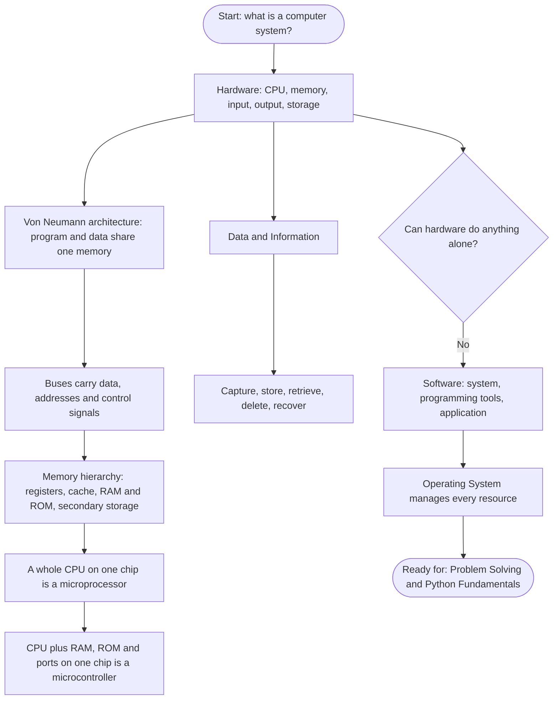

- Chapter builds the machine from physical parts first — hardware. §Roadmap
- Then shows how the parts communicate — buses. §Roadmap
- Then explains what moves through the system — data. §Roadmap
- Ends by showing nothing moves without software — hence Operating System closes the chapter. §Roadmap

---

## §1.1 Introduction to Computer System

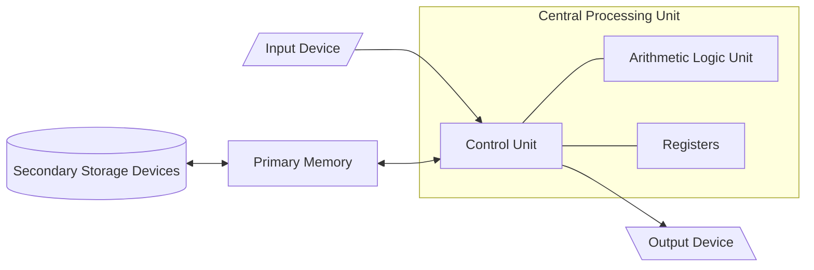

- NCERT definition: a computer is an electronic device that can be programmed to accept data (input), process it, and generate a result (output). §1.1
- Supplementary Commit-To-Memory definition: a computer is an electronic device that accepts a set of instructions in the form of a program, executes it and displays the output to the user. §1.1
- NCERT stresses data-in/result-out. §1.1
- Supplementary stresses accepting a program. §1.1
- Both are correct — quote whichever matches your own board book. §1.1
- A computer *together with* the additional hardware and software that make it usable is called a computer system. §1.1
- "Define a computer system" wants the computer-system answer, not the bare computer definition. §1.1
- A computer system primarily comprises: CPU, memory, input/output devices, storage devices. §1.1
- All these components function together as a single unit. §1.1
- The same architecture scales from a high-end server down to a desktop, laptop, tablet, or smartphone. §1.1
- Block diagram directed lines represent the flow of data and signals. §1.1.0
- Input and output devices talk to the CPU. §1.1.0
- Secondary storage talks to primary memory, not directly to the CPU. §1.1.0
- Anything on a hard disk must be pulled into RAM before the CPU can touch it. §1.1.0

### 1.1.0a The IPO cycle (Supplementary)

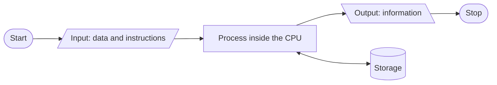

- Every task a computer performs follows an Input → Process → Output (IPO) cycle. §1.1.0a
- Memory holds data and instructions during the processing. §1.1.0a
- The storage box hangs off the process step. §1.1.0a
- Storage does not hang off input or output. §1.1.0a
- Storage holds intermediate results while a program is running. §1.1.0a

### 1.1.0b Capabilities of a computer (Supplementary)

- A computer's ability to process, store and retrieve data and information makes it intrinsic to every kind of environment. §1.1.0b
- Environments: home, office, business. §1.1.0b
- Examples: ATM withdrawals, online shopping, e-learning, ticket reservation, telephone/electricity bill payment, internet search, email, web surfing, upload/download, social networking, photography. §1.1.0b

| Capability | What it means |
| --- | --- |
| Speed | Executes millions of instructions per second — work that would take a person years |
| Reliability | Gives consistent, dependable results over long periods, as long as input and instructions are correct |
| Diligence | Never tires, never gets bored, never loses concentration — the millionth calculation is done as carefully as the first |
| Versatility | The same machine can do arithmetic, play video, run a database, control a machine tool |
| Large memory | Stores huge volumes of data and retrieves any part of it on demand |

§1.1.0b

- A computer has no intelligence of its own. §1.1.0b
- It does exactly what its instructions say. §1.1.0b
- Wrong data or a wrong formula produces a wrong answer at full speed with perfect reliability. §1.1.0b
- This is Garbage In, Garbage Out (GIGO). §1.1.0b
- Same idea as the logical error met in the programming chapters. §1.1.0b
- Printed True/False statement: "A computer has the capacity to perform calculations and other logical functions, whereas a calculator only performs arithmetic and geometrical operations." §1.1.0b
- Intended answer: True. §1.1.0b

| | Calculator | Computer |
| --- | --- | --- |
| Operations | Arithmetic (a scientific one adds trigonometric functions) | Arithmetic **and** logical — comparisons, decisions |
| Stored program | No — keys pressed in sequence | Yes — stores and executes a program (§1.2a) |
| Storage of data | Essentially none | Large primary and secondary memory |
| Decision making | No | Yes, via logical operations in the ALU |

§1.1.0b

- The word "geometrical" in the printed statement is loose. §1.1.0b
- Intended contrast: arithmetic-only vs. arithmetic + logic + storage + stored program. §1.1.0b

### 1.1.1 Central Processing Unit (CPU)

- CPU is the electronic circuitry that carries out the actual processing. §1.1.1
- Usually called the brain of the computer. §1.1.1
- Also called the processor. §1.1.1
- Physically sits on one or more microchips called integrated circuits (IC). §1.1.1
- ICs are made of semiconductor materials. §1.1.1

NCERT's four-step order:
1. CPU is given instructions and data through programs. §1.1.1
2. It fetches the program and data from memory. §1.1.1
3. It performs the arithmetic and logic operations the instructions demand. §1.1.1
4. It stores the result back to memory. §1.1.1

- While processing, the CPU keeps data and instructions in its own local memory called registers. §1.1.1
- Registers are part of the CPU chip. §1.1.1
- Registers are limited in size and number. §1.1.1
- Different registers hold data, instructions, or intermediate results. §1.1.1
- Registers are high-speed temporary storage areas inside the CPU. §1.1.1
- They work as per the instructions given by the Control Unit. §1.1.1
- They store instructions and data immediately required for an operation. §1.1.1
- The CPU places the highest-priority jobs/data inside registers for faster execution. §1.1.1
- Registers come in sizes: 16-bit, 32-bit, 64-bit and so on. §1.1.1

Each register has a specific function:
- storing a data value §1.1.1
- storing an instruction §1.1.1
- storing the address of a location in memory §1.1.1

- Named register: Memory Address Register (MAR). §1.1.1
- MAR holds the address the CPU is about to read from or write to. §1.1.1
- The address bus carries an address from the CPU to memory. §1.1.1
- MAR is where that address sits on the CPU side. §1.1.1

| Component | What it does |
| --- | --- |
| Arithmetic Logic Unit (ALU) | Performs all arithmetic (+, −, ×, ÷) and logic (AND, OR, NOT, XOR) operations required by the instruction |
| Control Unit (CU) | Controls sequential instruction execution, interprets instructions, guides data flow between memory, ALU and I/O devices |

§1.1.1

- ⚠ Genuine conflict between the two books. §1.1.1
- Supplementary book: CPU has three components — ALU, CU, Memory unit. §1.1.1
- NCERT: CPU has ALU, CU, registers — primary memory is drawn outside the CPU box. §1.1.1
- Safe answer for exams: ALU + CU (+ registers). §1.1.1
- Registers are the CPU's internal memory and are inside the CPU. §1.1.1
- Primary memory (RAM/ROM) is not part of the CPU. §1.1.1
- The CPU only interacts with primary memory over the bus. §1.1.1
- ⚠ The CU does not process data itself. §1.1.1
- It sends control signals to the ALU and to memory telling them which operation to carry out. §1.1.1
- Confusing "controls" with "computes" is a classic one-mark loss. §1.1.1

### 1.1.2 / 1.1.2a Input Devices

- Input devices are the devices through which data and control signals are sent to a computer. §1.1.2
- They convert input data into digital form acceptable to the computer system. §1.1.2
- Internally, everything becomes binary — 0s and 1s, i.e. OFF/ON or LOW/HIGH. §1.1.2
- NCERT's short list: keyboard, mouse, scanner, touch screen. §1.1.2
- Braille keyboards help visually impaired users enter data. §1.1.2
- Data can be entered by voice — e.g. Google voice search. §1.1.2
- Data entered through an input device is stored temporarily in main memory (RAM). §1.1.2
- For permanent storage, data must be written to secondary memory. §1.1.2

| # | Device | What it does | Where it is used |
| - | --- | --- | --- |
| 1 | Keyboard | Directly enters letters, digits and commands; has function, alphanumeric, direction, special/lock keys | General text entry |
| 2 | Mouse | Pointing device with a roller at its base; converts hand movement into binary digits giving a position | Moving the on-screen pointer |
| 3 | Light Pen | Photocell mounted in a pen-shaped tube (stylus); senses a position when its tip touches the screen | Engineers, architects, designers |
| 4 | OMR (Optical Mark Reader) | Recognises a pre-specified mark made with dark pencil or ink; transcribes marks into electrical pulses | Grading MCQ answer sheets |
| 5 | Smart Card Reader | Reads the microprocessor embedded in a PVC card holding personal data | ATM/ID/credit/debit cards, banking, security |
| 6 | Bar Code Reader | Light source + lens + light sensor translate optical impulses to electrical signals; decoder analyses the bar code image | Retail products, inventory |
| 7 | QR Code Reader | Reads a Quick Response code — a 2-D barcode scannable by a smartphone app | Marketing, payments, linking to a website |
| 8 | Biometric Sensor | Identifies a person from physical or behavioural traits (eyes, fingerprints, DNA) | Attendance, restricted entry to secured areas |
| 9 | Touch Screen | Touch-sensitive transparent panel over the display; no intermediate device needed | ATMs, phones, malls, amusement parks, airports |
| 10 | Microphone | Provides audio data to the computer; works with a sound card | Sound recording, voice commands |
| 11 | Webcam | Captures stills and video; no built-in storage — uses the computer's hard drive | Video conferencing, live streaming |
| 12 | MICR (Magnetic Ink Character Reader) | Detects numbers printed in magnetically charged ink and converts them to digital data | Bottom strip of bank cheques |
| 13 | OCR (Optical Character Reader) | Recognises scanned images, screenshots, PDFs and handwriting as machine-encoded text | Digitising documents, text-to-speech, translation |

§1.1.2a — almost every "name the device that…" question comes from this table.

- Mouse was invented by Douglas Engelbart, 1963. §1.1.2a
- Mouse types: mechanical (rubber ball rolling against two rollers). §1.1.2a
- Optical mouse: LED and sensor detect movement across a surface. §1.1.2a
- Laser mouse: optical mouse using a laser instead of an LED, works on more surfaces. §1.1.2a
- Wireless mouse: connects over radio or Bluetooth instead of a cable. §1.1.2a
- Trackball mouse: ball sits on top, rolled by the thumb, device stays still. §1.1.2a
- ⚠ OMR, OCR, MICR are the most-confused trio in this chapter. §1.1.2a
- OMR reads a mark (a filled bubble). §1.1.2a
- OCR reads a character (a shape it recognises as a letter). §1.1.2a
- MICR reads characters printed in magnetic ink (cheques). §1.1.2a
- Pencil-shaded bubble → OMR. §1.1.2a
- Handwriting or a scanned page → OCR. §1.1.2a
- A cheque → MICR. §1.1.2a

### 1.1.3 / 1.1.3a / 1.1.3b Output Devices

- Output device receives data from the computer system for display or physical production. §1.1.3
- Converts digital information into human-understandable form. §1.1.3
- NCERT examples: monitor, projector, headphone, speaker, printer. §1.1.3
- Braille display monitor helps a visually challenged person understand textual output. §1.1.3
- Output devices produce output generated by the CPU in human-readable form. §1.1.3
- Output devices can also be used to store the result for further use. §1.1.3
- Printer is the most commonly used device for output in physical (hardcopy) form. §1.1.3
- NCERT names three common printer types: inkjet, laserjet, dot matrix. §1.1.3
- 3D printer builds a physical replica of a digital 3D design. §1.1.3
- 3D printers are used in manufacturing to create prototypes. §1.1.3
- 3D printers are being explored in the medical field for developing body organs. §1.1.3
- Soft copy: a document or image stored on a hard disk or pen drive. §1.1.3
- Hard copy: a document or image once printed. §1.1.3

| Technology | Distinguishing feature |
| --- | --- |
| CRT (Cathode Ray Tube) | The original bulky display |
| LCD (Liquid Crystal Display) | Smaller and lighter than CRT; ideal for laptops, palmtops, portable devices |
| LED (Light-Emitting Diode) | Lightweight flat panel; uses light-emitting diodes to create pixels; less power than CRT/LCD; environment-friendly |
| OLED (Organic LED) | More advanced than LED; organic substance glows when current passes; ultra-thin, superior colour, true blacks |

§1.1.3a — VDU/Monitor is also called Visual Display Terminal (VDT).

- Pixel: the smallest element of an image on a computer display. §1.1.3a
- "Pixel" is short for picture element. §1.1.3a

| Family | Definition | Types |
| --- | --- | --- |
| Impact | Mechanical contact between printer head and paper | Dot matrix (serial printer) |
| Non-impact | No mechanical contact between printer head and paper | Inkjet / Deskjet / Bubble jet, Laser |

§1.1.3a

| Printer | How it works | Strengths | Limits |
| --- | --- | --- | --- |
| Dot Matrix | Prints one character at a time using dots, by striking an ink-soaked ribbon against the paper | Low operating cost; can make carbon copies | Noisy; one line at a time; low-resolution graphics only |
| Inkjet | Sprays quick-dry ink from cartridges (red, green, black, yellow) | High-quality prints; cheap hardware; good for homes/small offices | Slower and costlier per page than laser at volume |
| Laser | Uses laser technology to produce printed documents | Very fast, high quality, quiet, low per-page cost | Higher upfront cost |

§1.1.3a

- Speakers generate sound as output. §1.1.3a
- A sound card must be installed for a speaker to produce sound. §1.1.3a
- Plotters produce good-quality images and drawings. §1.1.3a
- Plotters support large-sized paper, unlike printers. §1.1.3a
- Plotters are mainly used in computer-aided design (CAD). §1.1.3a
- Drum plotter: paper moves over a rotating drum, pen moves along one axis. §1.1.3a
- Flatbed plotter: paper lies flat, pen moves in both axes. §1.1.3a
- Inkjet and electrostatic plotters also exist; neither book develops them. §1.1.3a
- Types of impact printer all work by striking the paper. §1.1.3a
- Dot matrix: a grid of pins forms each character. §1.1.3a
- Daisy wheel: fully-formed characters on a spoked wheel. §1.1.3a
- Line printers (drum, chain/band): print a whole line at a time in high-volume settings. §1.1.3a

| Task | Device | In / Out |
| --- | --- | --- |
| Output audio | Speaker / earphones / headphones | Output |
| Enter textual data | Keyboard | Input |
| Make a hard copy of a text file | Printer | Output |
| Display the data or information | Monitor (VDU) | Output |
| Enter an audio-based command | Microphone | Input |
| Build 3D models | 3D printer | Output |
| Assist a visually-impaired individual in entering data | Braille keyboard | Input |
| Read textual output without sight | Braille display monitor | Output |
| At a POS terminal, show items purchased/sold | Monitor | Output |
| At a POS terminal, take a printout of the bill/invoice | Printer | Output |

§1.1.3b

- POS worked answer: given a bar code reader and keyboard already present, name two more devices. §1.1.3b
- Monitor — displays information about items purchased or sold. §1.1.3b
- Printer — takes a printout of the bill or invoice generated. §1.1.3b
- Name the device and its use; the use is half the mark. §1.1.3b
- Worked Example 1-1 (choosing a printer for 1000 newsletters, text + images): laser preferred over inkjet/dot matrix for four reasons. §1.1.3b
- Quality — laser output is better, and the newsletter contains images. §1.1.3b
- Speed — laser is faster than both; 1000 copies makes speed the binding constraint. §1.1.3b
- Noise — laser is quiet; dot matrix (impact) is loud. §1.1.3b
- Cost per page — laser is cheaper per page; 1000 pages multiplies the difference. §1.1.3b
- Every reason must be tied to the volume in the question, not the cost of the machine. §1.1.3b

---

## §1.2 Evolution of Computer

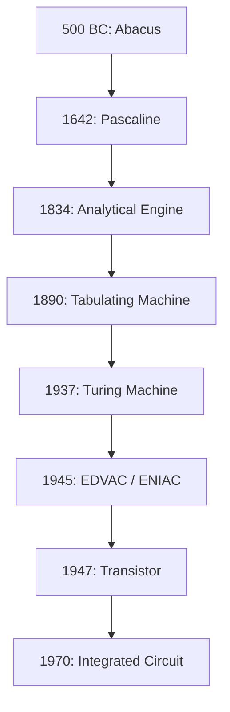

- Computing devices evolved from the simple calculator to a modern data processor in a relatively short span of time. §1.2

| Year | Invention | Who / what it did |
| --- | --- | --- |
| 500 BC | Abacus | Computing attributed to its invention almost 3000 years ago; a mechanical device capable of simple arithmetic only |
| 1642 | Pascaline | Blaise Pascal; mechanical calculator doing addition/subtraction directly, multiplication/division through repeated addition/subtraction |
| 1834 | Analytical Engine | Charles Babbage; mechanical computing device for inputting, processing, storing and displaying output; basis of modern computers |
| 1890 | Tabulating Machine | Herman Hollerith; summarised data stored on punched cards; first step towards programming |
| 1937 | Turing Machine | General purpose programmable machine, solves any problem by executing a program stored on punched cards |
| 1945 | EDVAC / ENIAC | John Von Neumann; introduced the stored program concept — storing data as well as program in memory |
| 1947 | Transistor | Vacuum tubes replaced by transistors at Bell Labs, using semiconductor materials |
| 1970 | Integrated Circuit | Silicon chip holding an entire electronic circuit in a very small area; computer size dropped drastically |

§1.2

- Punched card: a piece of stiff paper that stores digital data in the form of holes at predefined positions. §1.2

---

## §1.2a Von Neumann Architecture

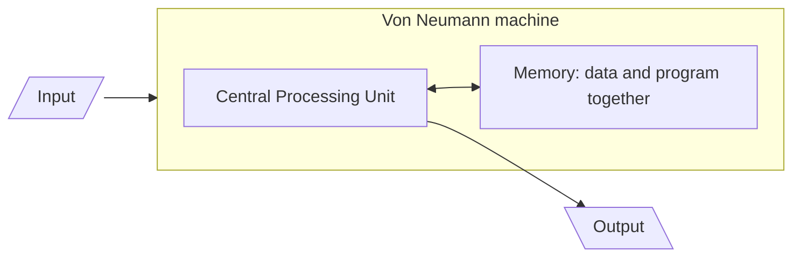

- This is the single most examinable idea in §1.2. §1.2a
- It is the design every machine in this chapter follows. §1.2a

### 1.2a.1 The problem it solved

- Before 1945, a programmable machine was programmed physically. §1.2a.1
- ENIAC was set up for a new calculation by re-plugging cables and resetting switches. §1.2a.1
- This job could take days. §1.2a.1
- The machine could compute, but the "program" lived in the wiring, not in memory. §1.2a.1
- In 1945, John Von Neumann introduced the stored program concept. §1.2a.1
- Stored program concept: a computer capable of storing data as well as the program in the memory. §1.2a.1
- The EDVAC and then the ENIAC computers were developed based on this concept (NCERT Figure 1.4). §1.2a.1
- Instructions are just another kind of data. §1.2a.1
- They can live in the same memory as the data they operate on. §1.2a.1
- Changing what the computer does means loading a different set of bytes, not rewiring the machine. §1.2a.1
- This one decision underlies: installable software, an OS loading one program after another, a compiler writing a program as its output. §1.2a.1

### 1.2a.2 The five functional units

The Von Neumann architecture consists of:
1. A Central Processing Unit (CPU) for processing arithmetic and logical instructions. §1.2a.2
2. A memory to store data and programs. §1.2a.2
3. Input devices. §1.2a.2
4. Output devices. §1.2a.2
5. Communication channels to send or receive the output data. §1.2a.2

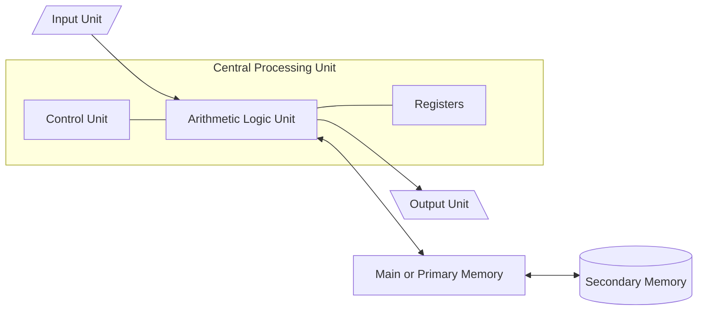

- NCERT draws this at its simplest (Figure 1.5): input, a CPU-plus-memory block, output. §1.2a.2
- The supplementary book draws the same architecture expanded into functional components (its Figure 1.4, labelled "Von Neumann Architecture" outright). §1.2a.2
- The expanded version is the one to reproduce for "draw the basic architecture of a computer" — worth more marks, names the sub-units. §1.2a.2
- Both diagrams are the same architecture at two zoom levels. §1.2a.2
- Structural fact the expanded diagram makes visible: secondary memory connects to primary memory, not to the CPU. §1.2a.2

### 1.2a.3 The machine cycle

- Because the program sits in memory, the CPU must fetch each instruction before obeying it. §1.2a.3
- NCERT's four steps (§1.1.1): given instructions through programs, fetches program/data from memory, performs the operations, stores the result back to memory. §1.2a.3

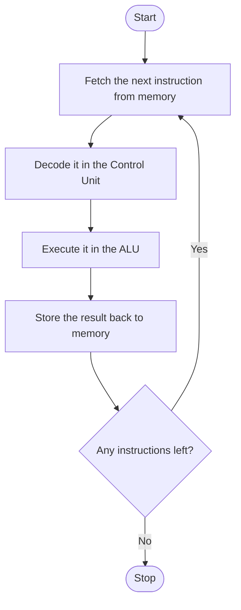

| Step | Who does it | What travels on the bus |
| --- | --- | --- |
| Fetch | CU requests, memory supplies | Address of instruction out on address bus; read on control bus; instruction back on data bus |
| Decode | Control Unit | Nothing leaves the CPU — CU interprets instruction, works out control signals |
| Execute | ALU | Operands already in registers; arithmetic/logic happens inside the CPU |
| Store | CU directs, memory accepts | Address on address bus, write on control bus, result on data bus |

§1.2a.3

- NCERT names fetch, perform, store back. §1.2a.3
- "Decode" and "machine cycle" (or instruction cycle) are standard computer-architecture terms. §1.2a.3
- Neither term is printed in either of the two books. §1.2a.3
- If a question quotes NCERT's wording, answer in NCERT's wording. §1.2a.3

### 1.2a.4 Characteristics to recite

| Characteristic | What it means |
| --- | --- |
| Stored program | Program and data are both held in the same memory |
| Sequential execution | Instructions are fetched and executed one after another, in order, unless an instruction explicitly changes the order |
| Binary representation | Both instructions and data are stored as binary numbers |
| Single memory, single path to it | One memory, reached over one shared bus, for both instructions and data |
| Central control | The Control Unit interprets instructions and directs every other unit |
| Reprogrammable without rewiring | A new task means loading new contents into memory |

§1.2a.4

- NCERT: ENIAC is the first binary programmable computer based on Von Neumann architecture. §1.2a.4
- Historical sequence is slightly untidier — see Appendix A #5. §1.2a.4

### 1.2a.5 The cost of the design

- ⚠ Not in NCERT or the supplementary book — for understanding, not to write unless asked. §1.2a.5
- Instructions and data share one memory and one path to it. §1.2a.5
- The CPU cannot fetch an instruction and fetch its data in the same instant. §1.2a.5
- The processor ends up waiting on memory. §1.2a.5
- As processors got faster than memory, that wait grew. §1.2a.5
- This is called the Von Neumann bottleneck. §1.2a.5
- Cache memory (§1.3.2B): very high-speed memory between CPU and RAM, narrows the speed gap. §1.2a.5
- Harvard architecture: rival design with separate memories and separate buses for instructions and data. §1.2a.5
- Harvard architecture lets both be fetched at once. §1.2a.5
- Harvard architecture is common in microcontrollers (§1.5.2). §1.2a.5
- Part of why a fixed-task chip can be small, cheap and fast at its one job. §1.2a.5

| | Von Neumann | Harvard |
| --- | --- | --- |
| Memory for instructions and data | One shared memory | Two separate memories |
| Buses | One shared path | Separate instruction and data buses |
| Fetching instruction + data | Cannot happen simultaneously | Can happen simultaneously |
| Typical use | General-purpose computers | Embedded systems, microcontrollers, DSPs |
| Flexibility vs speed | More flexible, simpler | Faster for fixed workloads, less flexible |

§1.2a.5

- Worked Example 1-2a: why a stored-program computer needs no rewiring. §1.2a.5
- Setup: Machine P is rewired for each new task; Machine Q is Von Neumann; both asked to switch from trajectory calculation to sorting names. §1.2a.5
- In machine P, the sequence of operations is encoded in the physical connections. §1.2a.5
- Changing the sequence in P means changing hardware. §1.2a.5
- In machine Q, the sequence of operations is encoded as binary values sitting in memory cells. §1.2a.5
- Memory cells are writable. §1.2a.5
- Changing the sequence in Q means writing different values into memory — an ordinary store operation. §1.2a.5
- Boxed result: Programs are data ⟹ changing the program is just writing data. §1.2a.5
- This explains: an OS can load one program after another into RAM (§1.8). §1.2a.5
- This explains: a compiler can produce a program as its output (§1.7.3). §1.2a.5
- This explains: software can be installed at all (§1.7). §1.2a.5
- None of those is possible on machine P. §1.2a.5
- Follow-on: the same property is also a security weakness. §1.2a.5
- If instructions are just bytes in memory, data written into the wrong place can be executed as instructions. §1.2a.5
- Root of a whole family of attacks, beyond this chapter. §1.2a.5

---

## §1.2b From LSI to SLSI, and Moore's Law

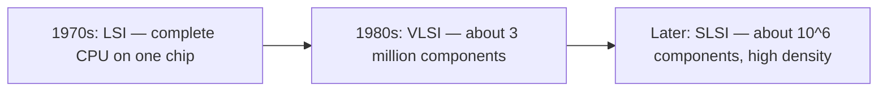

| Era | Integration level | What fits on one chip |
| --- | --- | --- |
| 1970s | LSI (Large Scale Integration) | A complete CPU on a single chip — created the microprocessor |
| 1980s | VLSI (Very Large Scale Integration) | Around 3 million components on a small chip |
| Later | SLSI (Super Large Scale Integration) | Approximately 10⁶ components at high density on a single IC |

§1.2b

- Moore's Law: in 1965, Intel co-founder Gordon Moore predicted the number of transistors on a chip would double every two years. §1.2b
- Moore's Law also predicted costs would be halved. §1.2b
- NCERT Figure 1.6 plots that prediction against real Intel microprocessors on a logarithmic scale. §1.2b
- Progression shown: invention of the transistor → 4004 → 8086 → 286 → 386 → 486 → Pentium → Pentium II → Pentium III → Pentium IV → Core 2 Duo → Core i7. §1.2b
- A straight line on a log scale is what "doubling every 2 years" looks like. §1.2b

```desmos
d=2
N\left(t\right)=2^{\frac{t}{d}}
```

- `d` = doubling period in years (draggable). §1.2b
- `t` = years since a chosen starting point. §1.2b
- `N(t)` = transistor count relative to year 0, so N(0) = 1. §1.2b
- At d = 2 (Moore's prediction), N(10) ≈ 32 — a chip ten years later carries about 32× as many transistors. §1.2b
- Dragging d to 3 shows the curve climbing more slowly — the debate over whether Moore's Law still holds. §1.2b
- This block's syntax has been reviewed, not executed. §1.2b
- No Desmos evaluator is available here; Desmos rendering is not confirmed in this build. §1.2b
- IBM introduced its first personal computer (PC) for the home user in 1981. §1.2b
- Apple introduced Macintosh machines in 1984. §1.2b
- PC popularity surged because of GUI-based operating systems from Microsoft and others. §1.2b
- GUI systems replaced command-line-only systems like UNIX or DOS. §1.2b
- Around the 1990s, growth of the World Wide Web accelerated mass usage. §1.2b
- Laptops made computing portable. §1.2b
- Then came smartphones, tablets and other personal digital assistants. §1.2b
- These leveraged processor miniaturisation, faster memory, high-speed connectivity. §1.2b
- Next wave: wearables — smart watch, lenses, headbands, headphones. §1.2b
- Smart appliances are joining the Internet of Things (IoT). §1.2b
- IoT leverages Artificial Intelligence (AI). §1.2b

---

## §1.3 Computer Memory

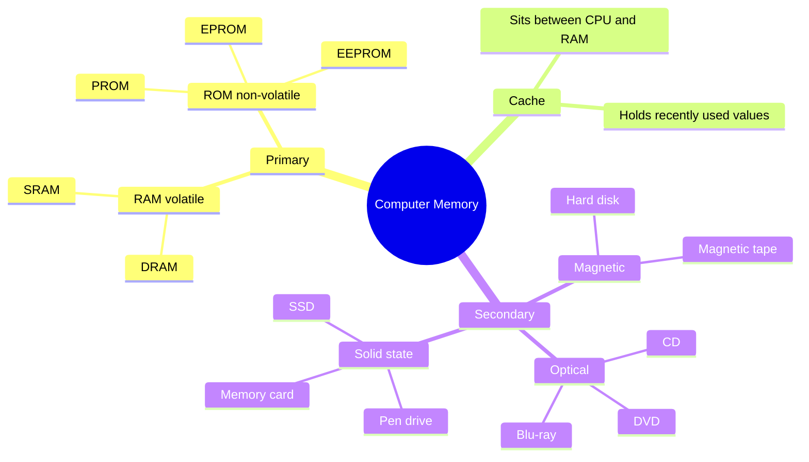

- A computer system needs memory to store data and instructions for processing. §1.3
- "The memory" of a computer usually means the main or primary memory. §1.3
- Secondary memory (also called a storage device) stores data, instructions and results permanently for future use. §1.3

### 1.3.1 Units of Memory

- A computer system uses binary numbers to store and process data. §1.3.1
- Binary digits 0 and 1 are the basic units of memory, called bits. §1.3.1
- "Bit" is short for binary digit. §1.3.1
- Bits are grouped into words. §1.3.1
- A 4-bit word is a nibble — e.g. 1001, 1010, 0010. §1.3.1
- A two-nibble (8-bit) word is a byte — e.g. 01000110, 01111100, 10000001. §1.3.1
- 1 byte = 8 bits = 2 nibbles. §1.3.1
- Example byte 10100010 splits into nibbles 1010 and 0010. §1.3.1
- One byte holds one character in binary form. §1.3.1
- Memory cell (supplementary): the device that stores a single symbol selected from a set of symbols. §1.3.1
- Cells break down into bits. §1.3.1

| Unit | Relation | As a power of 2 (bytes) |
| --- | --- | --- |
| Bit | binary digit, 0 or 1 | — |
| Nibble | 4 bits | — |
| Byte | 8 bits | 2⁰ |
| KB (Kilobyte) | 1024 Bytes | 2¹⁰ |
| MB (Megabyte) | 1024 KB | 2²⁰ |
| GB (Gigabyte) | 1024 MB | 2³⁰ |
| TB (Terabyte) | 1024 GB | 2⁴⁰ |
| PB (Petabyte) | 1024 TB | 2⁵⁰ |
| EB (Exabyte) | 1024 PB | 2⁶⁰ |
| ZB (Zettabyte) | 1024 EB | 2⁷⁰ |
| YB (Yottabyte) | 1024 ZB | 2⁸⁰ |

§1.3.1 — ⚠ every step is ×1024, never ×1000.

- Supplementary book extends the table two steps further: Bronto Byte (1 BB = 1024 YB), Geop Byte (1 GeopB = 1024 Brontobytes). §1.3.1
- ⚠ Bronto Byte and Geop Byte are not standardised units. §1.3.1
- They appear in Indian board textbooks, not in SI or IEC standards. §1.3.1
- Real ladder stops at yottabyte (and, since 2022, ronna- and quetta-). §1.3.1
- Reproduce Bronto/Geop only if the board book is the supplementary one. §1.3.1
- Worked Example 1-2: convert to bytes — (a) 2 MB (b) 3.7 GB (c) 1.2 TB. §1.3.1
- Method: multiply by 1024 once per rung down the ladder. §1.3.1
- MB → B is two steps (1024²); GB → B is three steps (1024³); TB → B is four steps (1024⁴). §1.3.1
- 2 MB = 2,097,152 bytes. §1.3.1
- 3.7 GB = 3,972,844,748.8 bytes. §1.3.1
- 1.2 TB = 1,319,413,953,331.2 bytes. §1.3.1
- Checked in Python 3.x: `2 * MB` prints as an int (2097152); `3.7 * GB` and `1.2 * TB` print as floats, since 3.7 and 1.2 are floats. §1.3.1
- A fractional byte count is physically impossible — it shows "3.7 GB" was itself a rounded figure. §1.3.1

### 1.3.2 Types of Memory

- NCERT analogy: humans memorise things over a lifetime and recall them, but also keep notes in a notebook, manual or journal. §1.3.2
- Computers do the same with primary and secondary memory. §1.3.2

#### (A) Primary Memory

- Primary memory is essential: program and data are loaded into it before processing. §1.3.2(A)
- The CPU interacts directly with primary memory to read or write. §1.3.2(A)
- Two types: RAM and ROM. §1.3.2(A)
- RAM (Random Access Memory) is a read/write memory. §1.3.2(A)
- RAM is volatile — retains data only while power is supplied. §1.3.2(A)
- All RAM contents are wiped when power is turned off. §1.3.2(A)
- RAM stores data temporarily while the computer works. §1.3.2(A)
- On start-up or app launch, required program and data are loaded into RAM. §1.3.2(A)
- RAM is usually called main memory. §1.3.2(A)
- RAM is faster than secondary memory. §1.3.2(A)
- ROM (Read-Only Memory) is non-volatile. §1.3.2(A)
- ROM contents are not lost when power is turned off. §1.3.2(A)
- ROM data/instructions are placed at manufacturing time and can't be changed thereafter. §1.3.2(A)
- ROM is a small but faster permanent store for rarely-changed content. §1.3.2(A)
- ROM most importantly holds the startup program (boot loader) that loads the OS into primary memory. §1.3.2(A)
- ROM also holds instructions to check basic hardware components during booting. §1.3.2(A)

| Feature | RAM | ROM |
| --- | --- | --- |
| Operations allowed | Read and write | Read only |
| Volatility | Volatile — contents lost on power-off | Non-volatile — contents retained |
| Contents | Data/files the user is currently working on | Contents can't be changed after manufacture |
| Speed | Faster than ROM | Slower than RAM |
| Part of | Primary memory | Primary memory |

§1.3.2(A)

- ⚠ Both RAM and ROM are primary memory. §1.3.2(A)
- Common slip: "primary memory = RAM" is wrong; ROM is primary memory too. §1.3.2(A)
- "Primary memory stores data permanently" is False. §1.3.2(A)
- The RAM half of primary memory does not retain data permanently. §1.3.2(A)
- Worked Example 1-2b: why primary memory is "destructive write" but "non-destructive read." §1.3.2(A)
- Read: contents of the memory word remain the same, not altered. §1.3.2(A)
- Read copies the value out, does not destroy it — hence non-destructive read. §1.3.2(A)
- Write: previous contents of the memory word are overwritten, old value gone — hence destructive write. §1.3.2(A)
- Both labels describe the effect on what was already stored, not the effect on the CPU. §1.3.2(A)
- Mental image: reading is photocopying a page; writing is writing over it in pen. §1.3.2(A)

| Property | SRAM (Static RAM) | DRAM (Dynamic RAM) |
| --- | --- | --- |
| Retention | Retains contents as long as power is connected | Needs regular refresh cycles or contents are lost |
| Transistors per bit | Six transistors | One transistor + one capacitor |
| Interfacing | Easy to interface | More complicated to interface and control |
| Density and cost | Lower density, costlier per bit | Much higher density, much cheaper per bit |
| Speed | Faster | Slower |
| Used as | Cache memory | Main memory |

§1.3.2(A)

| Type | Full form | How it can be changed |
| --- | --- | --- |
| PROM | Programmable Read-Only Memory | Programmed once by the user |
| EPROM | Erasable Programmable Read-Only Memory | Erasable (traditionally by UV light) and reprogrammable |
| EEPROM | Electrically Erasable Programmable ROM | Erasable electrically |

§1.3.2(A)

- Memory access time (supplementary): time taken to retrieve data from memory, from start of access until data becomes available. §1.3.2(A)
- RAM provides faster access than secondary memory — less memory access time. §1.3.2(A)

#### (B) Cache Memory

- RAM is faster than secondary storage, but not as fast as the processor. §1.3.2(B)
- Because of RAM, a CPU may have to slow down. §1.3.2(B)
- A very high-speed memory is placed between the CPU and primary memory, known as cache. §1.3.2(B)
- Cache stores copies of data from frequently accessed primary memory locations. §1.3.2(B)
- This reduces average time required to access data from primary memory. §1.3.2(B)
- When the CPU needs data, it first examines the cache. §1.3.2(B)
- If the requirement is met, data is read from the cache. §1.3.2(B)
- Otherwise, primary memory is accessed. §1.3.2(B)

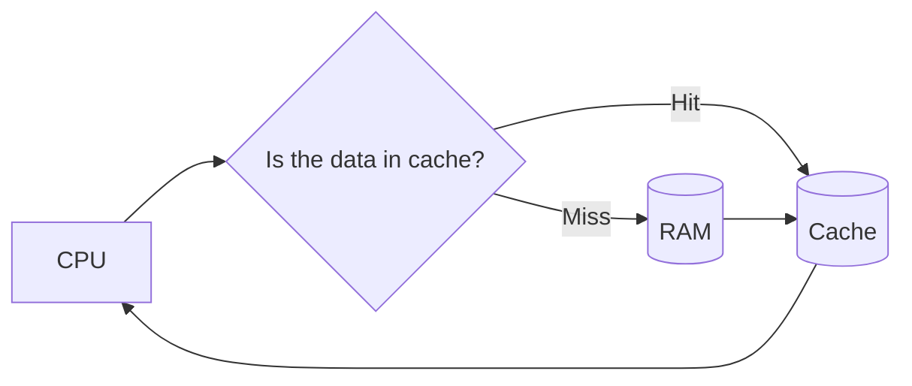

- Cache is also called CPU memory. §1.3.2(B)
- Typically integrated directly onto the CPU chip, or on a separate chip with a separate bus interconnected to the CPU. §1.3.2(B)
- ⚠ Cache is faster than RAM. §1.3.2(B)
- "RAM operates much faster than cache memory" is False — exact True/False question in the supplementary book. §1.3.2(B)
- Speed order: registers > cache > RAM > secondary storage. §1.3.2(B)

#### (C) Secondary Memory

- Primary memory has limited storage capacity. §1.3.2(C)
- Primary memory is either volatile (RAM) or read-only (ROM). §1.3.2(C)
- A computer system needs auxiliary or secondary memory to permanently store data or instructions. §1.3.2(C)

| Property | Primary memory | Secondary memory |
| --- | --- | --- |
| Volatility | RAM volatile, ROM non-volatile | Non-volatile |
| Capacity | Limited | Larger |
| Speed | Faster | Slower |
| Cost | Costlier | Cheaper |
| CPU access | Direct | Cannot be accessed directly by the CPU — contents must first be brought into main memory |

§1.3.2(C)

- Examples: Hard Disk Drive (HDD), CD/DVD, Memory Card, pen drive, magnetic tape. §1.3.2(C)
- SSDs support very fast data transfer compared to earlier HDDs. §1.3.2(C)
- Data transfer between computers has become easier due to small, portable flash/pen drives. §1.3.2(C)
- Secondary memory is also called auxiliary memory. §1.3.2(C)
- Also called auxiliary storage. §1.3.2(C)
- Also called external memory. §1.3.2(C)
- Also called backing store. §1.3.2(C)
- Secondary storage is accessed by the CPU through input-output controllers or units. §1.3.2(C)
- Contact between the CPU and the hard disk is indirect. §1.3.2(C)
- Work is done in RAM; results are later stored on the hard disk. §1.3.2(C)
- Memory (supplementary picture): the computer temporarily keeps information and data to facilitate its working. §1.3.2(C)
- When the task is executed or finished, it clears the memory. §1.3.2(C)
- That memory space becomes available for the next task. §1.3.2(C)

### 1.3.2a Secondary storage devices in detail (Supplementary)

- Disk capacity: the amount of data a disk can hold, measured in bytes, KB, MB and so on. §1.3.2a

| Device | Category | Capacity / key facts |
| --- | --- | --- |
| Hard Disk | Magnetic, secondary | Non-volatile, high capacity, 1 GB to several terabytes; solid rounded platters of magnetic material sealed in a case; generally fixed inside the computer |
| Magnetic Tape | Magnetic, secondary | Magnetic coatings store data on a thin tape; read/write slower because access is sequential; convenient, secure, affordable — still used for record-keeping |
| CD | Optical, offline | Thin optical disk; standard 120 mm CD holds 700 MB; original CD-ROM drives transferred only 150 KB/s, latest go up to 72× ≈ 10,800 KB/s |
| DVD | Optical, offline | Digital Versatile/Video Disc; recordable on one or both sides; 4.7 GB to 8.5 GB |
| Blu-ray (BD) | Optical, offline | Uses blue laser for higher data density; 25 GB single layer, 50 GB dual layer; designed to supersede the DVD |
| USB Pen Drive | Solid state, offline | Plugs into a USB port; less capacity than a hard disk but much more than a floppy or CD; 2, 4, 8, 16, 32, 64 GB |
| Memory Card | Solid state, offline | Also called flash memory card; used with cameras, phones, music players, consoles; 8, 16, 32, 64, 128 GB; power-free storage |

§1.3.2a

| | Magnetic disc (hard disk, tape) | Optical disc (CD, DVD, Blu-ray) |
| --- | --- | --- |
| How a bit is stored | Direction of magnetisation of a tiny region of a magnetic coating | Pits and lands on the surface, read by how they reflect a laser |
| Read/write mechanism | A magnetic head flying very close to the surface | A laser beam, no physical contact |
| Capacity and speed | Higher capacity, faster access | Lower capacity, slower access |
| Vulnerability | Damaged by magnetic fields and head crashes | Immune to magnetic fields; damaged by scratches |
| Typical role | Main working storage, fixed inside the machine | Distribution and archival, removable |

§1.3.2a

- CD vs DVD: same optical family, different densities. §1.3.2a
- CD holds 700 MB, DVD holds 4.7–8.5 GB. §1.3.2a
- DVD uses a tighter track pitch, a shorter-wavelength laser. §1.3.2a
- DVD can be recorded on one or both sides, and in dual layers. §1.3.2a
- Data is stored on platters in tracks, sectors and cylinders to keep it organised and easier to find. §1.3.2a

| Term | Definition |
| --- | --- |
| Track | Each platter is divided into concentric rings called tracks; thousands per platter |
| Sector | Each track is divided into sectors, which actually store the data; the basic unit of storage; as a rule, holds 512 bytes |
| Cylinder | A set of tracks described by all the heads (on separate platters) at a single seek position; equidistant from the centre of the disk |

§1.3.2a

- 512 bytes per sector is the traditional figure for the board exam. §1.3.2a
- Modern drives increasingly use a 4096-byte physical sector ("Advanced Format"), presenting 512-byte logical sectors for compatibility. §1.3.2a
- Worked Example 1-3: identify a storage device from six catalogue descriptions. §1.3.2a
- Two discriminators do all the work: spiral vs. concentric tracks, and red vs. blue laser. §1.3.2a
- If neither is given, it isn't optical — look for "magnetic" or "chip." §1.3.2a

| Description | Device | Category |
| --- | --- | --- |
| Optical media, one spiral track, red lasers, dual-layering to increase capacity | DVD | Offline storage |
| Non-volatile memory chip, contents can't be altered, holds start-up routines (e.g. the BIOS) | ROM | Primary memory |
| Optical media, concentric tracks, read and write at the same time | DVD-ROM | Offline storage |
| Non-volatile device using flash memories (millions of transistors wired in series on one board) | Solid State Memory / Memory Card | Offline storage |
| Optical media using blue laser technology | Blu-ray Disc | Offline storage |
| Magnetic disc, very large capacity, fixed inside the case, main storage device | Hard Disk | Secondary memory |

§1.3.2a

---

## §1.4 Data Transfer between Memory and CPU

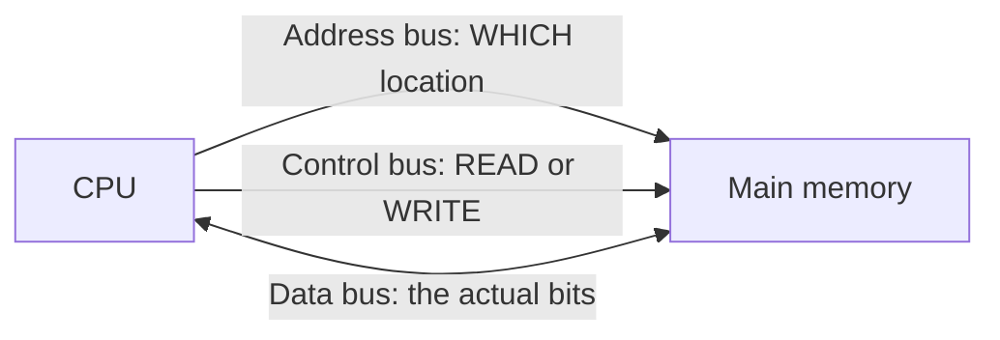

- Data must be transferred between the CPU and primary memory, and between primary and secondary memory. §1.4
- Data transferred between components using physical wires called a bus. §1.4
- Example: bus used for data transfer between a USB port and hard disk, or hard disk and main memory. §1.4
- Bus (supplementary): a collection of wires that transfers data between computer components. §1.4
- Bus carries binary information to or from I/O devices and memory. §1.4
- Usually transmits binary numbers one bit per wire. §1.4
- Bus is of three types, collectively making the system bus. §1.4

| Bus | What it carries | Direction (per NCERT) |
| --- | --- | --- |
| Data bus | The actual data, in binary form, between different components | Bidirectional |
| Address bus | Addresses, between CPU and main memory — the location to read or write | Unidirectional |
| Control bus | Control signals between different components (read/write and associated I/O operations) | Unidirectional |

§1.4

- A separate I/O (Input-Output) bus connects input, output and other external devices to the system (supplementary). §1.4

### 1.4a How a read and a write actually happen

- Since the CPU interacts directly with main memory, anything from an input device or the hard disk must first be placed in main memory. §1.4a

Write cycle:
1. CPU places the address of the target location on the address bus. §1.4a
2. CPU asserts the write signal on the control bus. §1.4a
3. CPU places the data on the data bus, which is written to the specified address. §1.4a

Read cycle:
1. CPU places the address on the address bus. §1.4a
2. CPU asserts the read signal on the control bus. §1.4a
3. Data is placed on the data bus by the memory controller. §1.4a

- Memory controller manages the flow of data into and out of the computer's main memory. §1.4a
- Why is the data bus bidirectional but the address bus unidirectional? (NCERT Exercise Q8) §1.4a
- CPU may need to read from memory or write to memory, so data travels both ways. §1.4a
- Addresses are only ever generated by the CPU and sent to memory. §1.4a
- Memory never sends an address back, so one direction suffices. §1.4a

### 1.4b Bus width and how much memory can be addressed

- Bus width is the number of parallel wires in it. §1.4b
- Each wire carries one bit. §1.4b
- An address bus of width n puts an n-bit binary number on the wires at once. §1.4b
- An n-bit binary number has 2 choices per bit, independently. §1.4b

$$
\text{addressable locations} = 2^{n}
$$

$$
\boxed{\text{An } n\text{-bit address bus can address } 2^{n} \text{ distinct memory locations.}}
$$

§1.4b

| Address-bus width n | 2ⁿ locations | In memory units |
| --- | --- | --- |
| 16 bits | 65,536 | 64 KB |
| 24 bits | 16,777,216 | 16 MB |
| 32 bits | 4,294,967,296 | 4 GB |
| 36 bits | 68,719,476,736 | 64 GB |
| 64 bits | 2⁶⁴ | 16 EB |

§1.4b

- NCERT Table 1.2's "maximum memory size" column equals 2ⁿ for each generation's addressing width. §1.4b
- 1 KB = 2¹⁰, 1 MB = 2²⁰, 16 MB = 2²⁴, 4 GB = 2³², 64 GB = 2³⁶. §1.4b
- This is NCERT Activity 1.1, solved. §1.4b
- ⚠ Two errors in the supplementary book's bus section. §1.4b
- "Address bus consists of 16 wires, thus its width is 16 bits" is not a general fact — describes one early 8-bit microprocessor. §1.4b
- "Data Bus: it is an 8-bit bus" is also not a general fact. §1.4b
- Bus widths vary by processor; a 64-bit CPU does not have a 16-bit address bus. §1.4b
- Solved Q28 states "a 16-bit binary number allows 2¹⁶ or 32,000 different numbers" — 2¹⁶ = 65,536, not 32,000. §1.4b
- The supplementary book's other statement — "a 64-bit address bus can transfer 2⁶⁴ memory locations" — is correct and the one to follow. §1.4b
- CPU word length (supplementary): the size of the data bus from memory to CPU equals the number of bits in an instruction. §1.4b
- The number of parallel wires is the bus width. §1.4b

### 1.4c Four connection terms

- These terms appear in the supplementary book's Memory Bytes list and unsolved questions but are never defined in its chapter body. §1.4c

| Term | Definition | Why it belongs here |
| --- | --- | --- |
| MAR (Memory Address Register) | The CPU register that holds the address of the memory location to be read from or written to; the address bus carries the address to the MAR | It is the CPU-side end of the address bus |
| Buffer | A data area shared by hardware devices or program processes that operate at different speeds, or with different sets of priorities | How a fast CPU and a slow printer work together without the CPU waiting |
| Port | A physical connection point (socket or interface) through which a peripheral device is attached and data is transferred — USB, HDMI, VGA, Ethernet (RJ-45), 3.5 mm audio jack, serial, parallel | Unsolved Q33 asks for it by name; it is the outside end of the I/O bus |
| I/O controller | The dedicated unit through which the CPU reaches an input/output device or secondary storage, rather than addressing it directly | Why §1.3.2(C) says secondary storage "cannot be accessed directly by the CPU" |

§1.4c

- Memory controller (§1.4a): dedicated hardware that places data on the data bus during a read, manages flow into/out of main memory. §1.4c
- I/O controller does the analogous job for a peripheral. §1.4c
- Both exist so the CPU can issue one request and get on with something else. §1.4c

---

## §1.5 Microprocessors

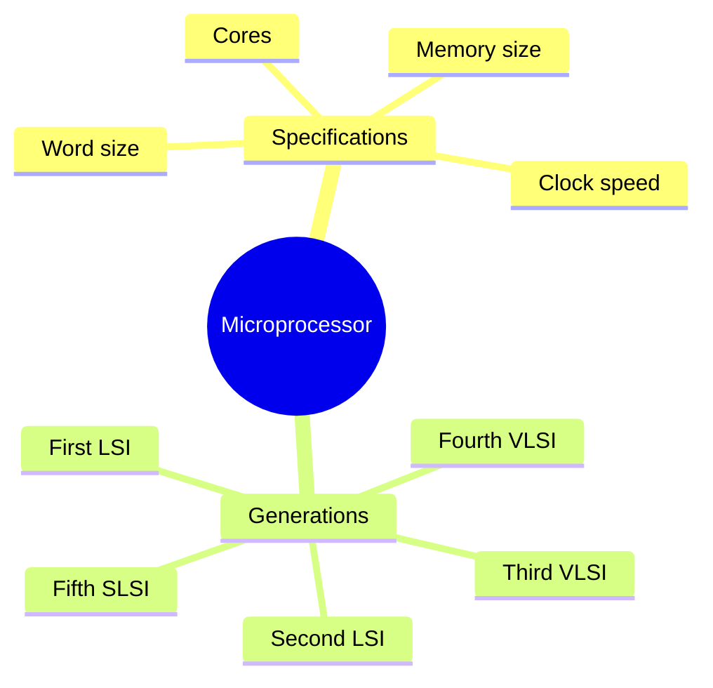

- In earlier days, a computer's CPU occupied a large room or multiple cabinets. §1.5
- With advancing technology, physical size shrank until a whole CPU fits on a single microchip. §1.5
- A processor (CPU) implemented on a single microchip is called a microprocessor. §1.5
- Nowadays almost all CPUs are microprocessors, so the terms are used synonymously. §1.5
- A microprocessor is a small-sized electronic component carrying out data processing plus arithmetic/logical operations. §1.5
- Built over an integrated circuit comprising millions of resistors, transistors and diodes. §1.5
- Currently available microprocessors process millions of instructions per millisecond. §1.5

### 1.5.1 Microprocessor Specifications

- Microprocessors are classified on chip type, word size, memory size, clock speed, cores. §1.5.1

| Specification | Definition | The number to remember |
| --- | --- | --- |
| Word size | The maximum number of bits a microprocessor can process at a time | Earlier 8 bits; now minimum 16 bits, maximum 64 bits |
| Memory size | Size of RAM, which depends on word size | Initially 4 MB (4/8-bit words); with 64-bit words, up to 16 EB |
| Clock speed | Number of pulses generated per second by the internal clock — speed of instruction execution | Earlier Hz and kHz; now GHz (billions of pulses per second) |
| Cores | A core is a basic computation unit of the CPU | 2 = dual-core, 4 = quad-core, 8 = octa-core |

§1.5.1

- Earlier processors had only one computation unit, performing only one task at a time. §1.5.1
- Multicore processors execute multiple tasks, increasing system performance. §1.5.1

| Generation | Era | Chip type | Word size | Max memory | Clock speed | Cores | Example |
| --- | --- | --- | --- | --- | --- | --- | --- |
| First | 1971–73 | LSI | 4/8 bit | 1 KB | 108 kHz–200 kHz | Single | Intel 8080 |
| Second | 1974–78 | LSI | 8 bit | 1 MB | up to 2 MHz | Single | Motorola 6800, Intel 8085 |
| Third | 1979–80 | VLSI | 16 bit | 16 MB | 4 MHz–6 MHz | Single | Intel 8086 |
| Fourth | 1981–95 | VLSI | 32 bit | 4 GB | up to 133 MHz | Single | Intel 80386, Motorola 68030 |
| Fifth | 1995 till date | SLSI | 64 bit | 64 GB | 533 MHz–34 GHz | Multicore | Pentium, Celeron, Xeon |

§1.5.1 (NCERT Table 1.2)

- ⚠ The fifth-generation clock speed is printed as "533 MHz – 34 GHz." §1.5.1
- Commercial desktop processors have not reached anywhere near 34 GHz. §1.5.1
- Almost certainly a typesetting slip for 3.4 GHz. §1.5.1
- Reproduce the table as printed if the question quotes it; don't carry "34 GHz" into your own sentence. §1.5.1

### 1.5.2 Microcontrollers

- A microcontroller is a small computing device with a CPU, a fixed amount of RAM, ROM and other peripherals all embedded on a single chip. §1.5.2
- Compared to a microprocessor. §1.5.2
- A microprocessor has only a CPU on the chip. §1.5.2

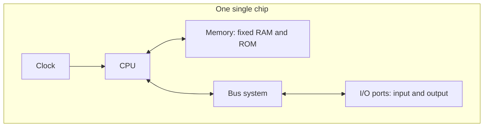

- Because everything needed is already on the chip, a microcontroller is embedded inside another device for one specific functionality. §1.5.2
- Examples: keyboard, mouse, washing machine, digital camera, pendrive, remote controller, microwave. §1.5.2
- Designed for specific tasks only, so size and cost are reduced. §1.5.2
- NCERT example: the microcontroller in a fully automatic washing machine controls the washing cycle with no human intervention. §1.5.2
- Cycle: filling water, soaking, washing, draining, spin dry. §1.5.2
- Permits repetitive execution of tedious tasks automatically. §1.5.2

| Feature | Microprocessor | Microcontroller |
| --- | --- | --- |
| What's on the chip | Only the CPU | CPU + fixed RAM + ROM + other peripherals |
| RAM/ROM | External, and expandable | Fixed amount, on-chip |
| Designed for | General-purpose computing | One specific task |
| Size and cost | Larger, costlier system overall | Reduced size and cost |
| Typical host | A computer | An embedded device — washing machine, microwave, remote |

§1.5.2

- Why do smart home appliances use a microcontroller rather than a microprocessor? (NCERT Exercise Q10) §1.5.2
- An appliance performs a single, fixed, repetitive task. §1.5.2
- It doesn't need expandable memory or general-purpose computing. §1.5.2
- It needs a self-contained, low-cost, small chip that already carries its own RAM, ROM and I/O ports. §1.5.2
- A microprocessor would require external memory and support chips, making the appliance bigger and costlier for no capability gain. §1.5.2

### 1.5.3 Graphics Processing Unit (GPU)

- Unsolved Q36 asks about the GPU's role in a smartphone; neither chapter defines it. §1.5.3
- A GPU is a specialised processor built to perform very many simple calculations in parallel. §1.5.3
- This is exactly what rendering an image, video frame or animation requires. §1.5.3
- Every pixel needs similar arithmetic done at the same time. §1.5.3
- A CPU has a few powerful cores optimised for running one instruction stream quickly. §1.5.3
- A GPU has many simpler cores optimised for doing the same operation to a large block of data at once. §1.5.3
- In a smartphone, the CPU, GPU and modem/communications processor are usually fabricated together on a single chip called a System on Chip (SoC). §1.5.3
- Same integration idea as §1.2b, taken one step further. §1.5.3
- GPU offloads display rendering, camera image processing, video decoding, gaming, UI animation from the CPU. §1.5.3
- This frees the CPU for general work and reduces power consumption for those tasks. §1.5.3
- "The role of the GPU with regard to the smartphone communications processor" is loosely phrased — the GPU does not process communications. §1.5.3
- Both sit on the same SoC alongside the CPU, dividing the workload. §1.5.3
- Answer in terms of: parallel graphics processing offloaded from the CPU, integrated on one SoC. §1.5.3

### 1.5.4 Classification of digital computers

- Unsolved Q64 asks to "discuss the classification of digital computers"; neither chapter develops it. §1.5.4
- Standard four-way classification, flagged as external to both books: §1.5.4

| Class | Size and users | Typical use |
| --- | --- | --- |
| Microcomputer | Single user; desktop, laptop, tablet, smartphone | Personal and small-office computing |
| Minicomputer | Mid-sized; supports several users at once | Departmental systems, process control (largely historical) |
| Mainframe | Large, many hundreds or thousands of users | Banking, insurance, railway reservation — huge transaction volumes |
| Supercomputer | The fastest available; massively parallel | Weather modelling, molecular simulation, nuclear and space research |

§1.5.4

- NCERT's own spread — "a high-end server to personal desktop, laptop, tablet computer, or a smartphone" (§1.1) — is the same idea stated as a range rather than classes. §1.5.4

---

## §1.6 Data and Information

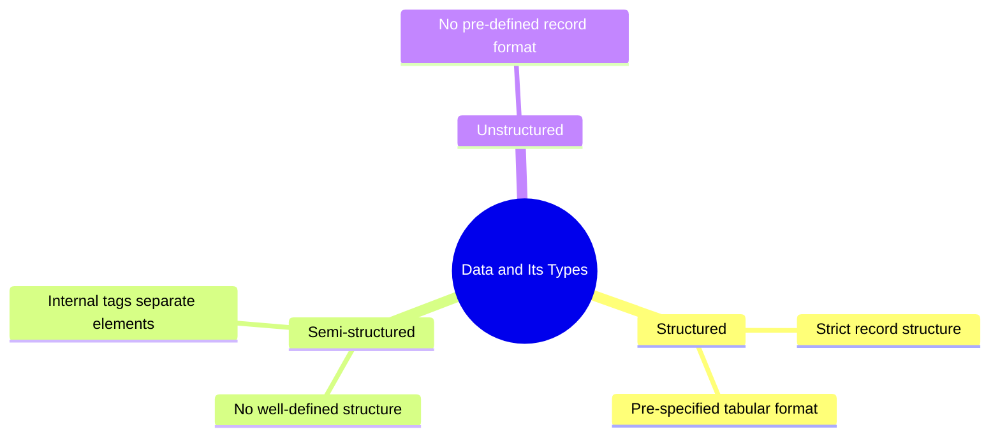

- A computer is primarily for processing data. §1.6
- A computer system considers everything as data — instructions, pictures, songs, videos, documents. §1.6
- Data can also be raw and unorganised facts that are processed to get meaningful information. §1.6

| Term | Definition | Example (supplementary) |
| --- | --- | --- |
| Data | Raw facts or figures — no meaning when presented as such | 106, "Shaurya", "Class 11" |
| Information | A collection of data organised in a particular manner to generate meaning | "Shaurya is a Class 11 student with Enrolment number 106" |

§1.6

- The process of converting data into meaningful information is the Information Processing Cycle. §1.6
- Same as the I-P-O cycle from §1.1.0a. §1.6
- ⚠ NCERT says outright: data, information and knowledge are sometimes used interchangeably. §1.6
- This is incorrect. §1.6
- Data is raw; information is processed data; knowledge is what is built from information. §1.6

### 1.6.1 Data and Its Types

- Internally everything is stored in binary (0 and 1). §1.6.1
- Externally, data can be input as text — English alphabets A–Z, a–z, numerals 0–9, special symbols like @, #. §1.6.1
- Data can be input in other languages, or read from files. §1.6.1
- Input data may come from different sources, so it may be in different formats. §1.6.1
- An image is a collection of Red, Green, Blue (RGB) pixels. §1.6.1
- A video is made up of frames. §1.6.1
- A fee receipt is made of numeric and non-numeric characters. §1.6.1

| Type | Definition | Examples |
| --- | --- | --- |
| Structured | Follows a strict record structure and is easy to comprehend; pre-specified tabular format | Attendance table (roll no, name, month, %); sales transactions; online railway ticket bookings; ATM transactions |
| Unstructured | Not organised in a pre-defined record format | Audio and video files, graphics, text documents, social media posts, satellite images, a report card mixing text and a chart |
| Semi-structured | No well-defined structure, but maintains internal tags or markings separating data elements | Email document, HTML page, comma-separated values (CSV file) |

§1.6.1

- NCERT's semi-structured example: each value is preceded by a tag saying how to interpret it, with no fixed record layout. §1.6.1

```text
Name: Mohan   Month: July   Class: XI   Attendance: 98
Name: Sohan   Month: July   Class: XI   Attendance: 65
Name: Sheen   Month: July   Class: XI   Attendance: 85
Name: Geet    Month: May    Class: XI   Attendance: 82
Name: Geet    Month: July   Class: XI   Attendance: 94
```

§1.6.1

- Worked Example 1-4: categorise Newspaper, Cricket Match Score, HTML Page, Patient records in a hospital. §1.6.1
- Question order: (1) fixed record format with same fields every record? → structured. (2) tags/markings separating elements? → semi-structured. (3) neither? → unstructured. §1.6.1

| Item | Category | Why |
| --- | --- | --- |
| Newspaper | Unstructured | Headlines, articles, photos, advertisements in no fixed record format |
| Cricket Match Score | Structured (as a scorecard) | Fixed table: batsman, runs, balls, 4s, 6s — same fields every row |
| HTML Page | Semi-structured | Tags mark up every element, no fixed record schema |
| Patient records in a hospital | Structured (as a database) | Fixed fields: patient ID, name, age, diagnosis, admission date |

§1.6.1

- Two of these depend on the actual artefact, not the label. §1.6.1
- Live ball-by-ball commentary alongside a scorecard is unstructured text. §1.6.1
- A patient's file with scanned X-rays and handwritten notes is unstructured for those parts. §1.6.1
- A good answer names the category and the reason. §1.6.1

### 1.6.1a How characters are actually encoded — ASCII, ISCII, Unicode

- Neither chapter body explains this. §1.6.1a
- Supplementary book's objective section asks: "___ is a new universal coding standard adopted by all new platforms" and "The expanded form of ISCII is ___." §1.6.1a
- Everything is stored in binary. §1.6.1a
- An agreed table must say which binary pattern means which character — a character encoding standard. §1.6.1a

| Standard | Expansion | Size | What it covers |
| --- | --- | --- | --- |
| ASCII | American Standard Code for Information Interchange | 7 bits → 128 characters | English letters, digits, punctuation, control codes; extended ASCII uses 8 bits → 256 |
| ISCII | Indian Script Code for Information Interchange | 8 bits → 256 characters | Lower 128 identical to ASCII; upper 128 for Indian scripts — Devanagari, Bengali, Tamil, others |
| Unicode | (no expansion — it is the name) | Variable (UTF-8, UTF-16, UTF-32) | A single universal standard aiming to cover every script in the world |

§1.6.1a

- The two blanks the supplementary book wants: Unicode (universal-standard blank), ISCII (Indian-script blank). §1.6.1a
- ⚠ The ISCII expansion is printed wrongly in the supplementary book. §1.6.1a
- Its MCQ options: "International Standard Code…", "Indian Standard Code…", "International Script Code…", "None of these." §1.6.1a
- Intended key: "Indian Standard Code for Information Interchange." §1.6.1a
- Actual standard (BIS IS 13194:1991): "Indian Script Code for Information Interchange." §1.6.1a
- The correct option is not among the four offered. §1.6.1a
- Exam approach: pick the book's intended option in its own MCQ. §1.6.1a
- If asked to write the expansion, write "Indian Script Code for Information Interchange." §1.6.1a
- Python 3 strings are Unicode strings. §1.6.1a
- This is why Hindi, Bengali or an emoji can go straight into a `str` with no extra work in the programming chapters. §1.6.1a

| While browsing you handle… | Type |
| --- | --- |
| HTML pages, XML feeds, CSV downloads, JSON from a web app | Semi-structured |
| Images, videos, audio streams, social media posts, memes | Unstructured |
| Train timetables, live scores, price tables, your order history | Structured |

§1.6.1a (NCERT Exercise Q11)

### 1.6.2 Data Capturing, Storage and Retrieval

- To process data, first input/capture it, then store it in a file or database, then retrieve it when needed. §1.6.2

| Stage | What it involves | The difficulty |
| --- | --- | --- |
| Data Capturing | Gathering data from different sources in digital form — keyboard, barcode readers at shopping outlets, social media comments, remote sensors on an earth-orbiting satellite | Heterogeneity among data sources makes capturing complex |
| Data Storage | Storing captured data for later processing | Data produced at a very high rate; offset by falling cost of storage devices; large organisations deploy data servers, with high hardware/software/maintenance cost, especially for small organisations and startups |
| Data Retrieval | Fetching data from storage devices for processing as per user requirement | As databases grow, search/retrieval within acceptable time gets harder; minimising data access time is crucial |

§1.6.2

### 1.6.3 Data Deletion and Recovery

- One of the biggest threats to digital data is its deletion. §1.6.3
- Causes: accidental erasure, storage device malfunction/crash, intentional deletion by a hacker or malware. §1.6.3
- Deleting digitally stored data means changing the details of data at bit level. §1.6.3
- Changing data at bit level is very time-consuming. §1.6.3
- When data is simply deleted, its address entry is marked as free. §1.6.3
- That much space is shown as empty to the user, without actually deleting the data. §1.6.3
- Data recovery: the process of retrieving deleted, corrupted and lost data from secondary storage devices. §1.6.3
- Recovery is possible only if the contents/memory space marked deleted have not been overwritten. §1.6.3

| Concern | Risk | Mitigation |
| --- | --- | --- |
| Unwanted deletion by an unauthorised person or software | Losing your data | Limit access to the computer system; use passwords for user accounts and files; encrypt files against unwanted modification |
| Unwanted recovery by an unauthorised user or software | Someone recovers data from a discarded, broken or malfunctioning device — threat to data confidentiality | Use proper tools to delete or shred data before disposing of any old or faulty storage device |

§1.6.3

- Emptying the Recycle Bin, or Shift + Delete, does not erase the file's contents. §1.6.3
- It only frees the address entry. §1.6.3
- This is simultaneously why recovery software works, and why a disk must be shredded before selling it. §1.6.3

---

## §1.7 Software

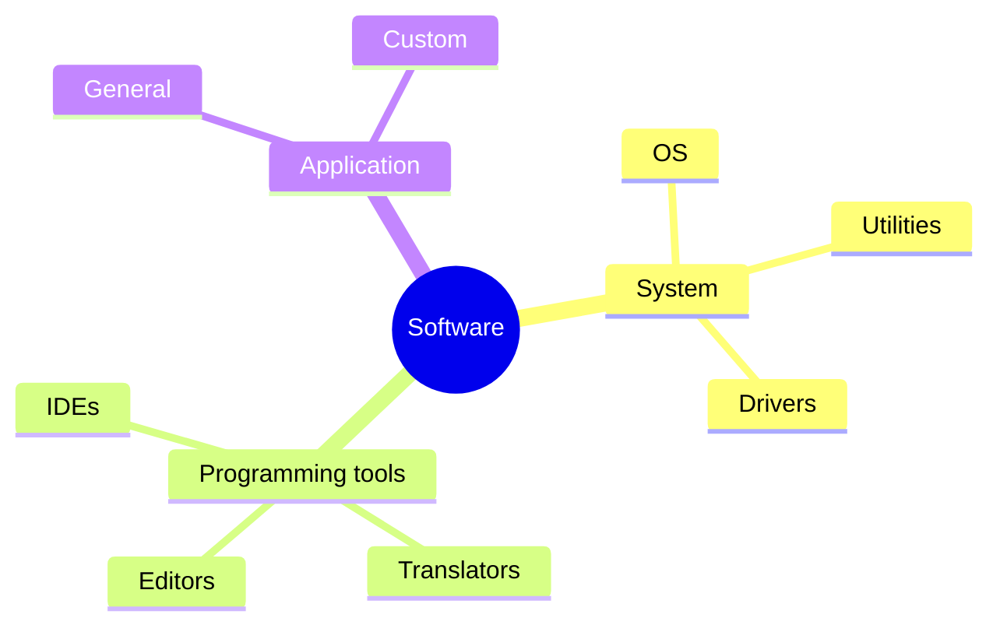

- Hardware is of no use on its own — it needs to be operated by a set of instructions. §1.7
- These sets of instructions are software. §1.7
- Software is the component of a computer system which cannot be touched or viewed physically. §1.7
- Software comprises the instructions and data to be processed using the hardware. §1.7
- Software and hardware complete any task together. §1.7
- Program (supplementary): a sequence of instructions written to solve a particular problem and to make the hardware run. §1.7
- Software is a set of programs designed to perform a well-defined function. §1.7
- All the programs used in a computer to perform specific tasks are called software. §1.7
- One program solves one problem; software is the package. §1.7
- A program in execution is a process (§1.8.2). §1.7

| | Hardware | Software |
| --- | --- | --- |
| Nature | Physical components that can be seen and touched | A set of instructions and data that makes hardware functional |
| Examples | RAM, keyboard, printer, monitor, CPU | Ubuntu, Windows 7/10, LibreOffice, MS Word, VLC Player, GIMP |
| Can it work alone? | No — needs software to be operational | No — needs hardware to run on |

§1.7

### 1.7.1 Need of Software

- The sole purpose of software is to make the computer hardware useful and operational. §1.7.1
- Software knows how to make different hardware components work and communicate with each other, and with the end user. §1.7.1
- Hardware cannot be instructed directly. §1.7.1
- Software acts as an interface between human users and the hardware. §1.7.1
- Depending on mode of interaction with hardware and functions performed, software is broadly classified into three categories (NCERT): System software, Programming tools, Application software. §1.7.1
- Supplementary book uses a four-way split instead: System, Application, Utility, Programming Tools — promoting utilities to a top-level category. §1.7.1
- NCERT nests utilities inside system software. §1.7.1
- Follow NCERT's three-way split unless the board book is the supplementary one. §1.7.1
- Utilities are system-level software either way, never application software. §1.7.1
- ⚠ A computer system can work without application software, but it cannot work without system software. §1.7.1
- A computer can be used with no word processor installed. §1.7.1
- A computer cannot be used at all with no operating system. §1.7.1
- Use of a computer is possible in the absence of application software. §1.7.1

### 1.7.2 System Software

- System software provides the basic functionality to operate a computer by interacting directly with its constituent hardware. §1.7.2
- It knows how to operate and use different hardware components. §1.7.2
- Provides services directly to the end user, or to other software. §1.7.2

Functions of system software (supplementary):
1. Reading data and receiving information §1.7.2
2. Translating data and instructions §1.7.2
3. Controlling all the peripheral devices §1.7.2
4. Processing and generating output §1.7.2

- (A) Operating System: a system software that operates the computer. §1.7.2
- Most basic system software. §1.7.2
- Other software cannot work without it. §1.7.2
- Manages other application programs. §1.7.2
- Provides access and security to users. §1.7.2
- Popular examples: Windows, Linux, Macintosh, Ubuntu, Fedora, Android, iOS. §1.7.2
- Full treatment in §1.8. §1.7.2
- (B) System Utilities: software used for maintenance and configuration of the computer system. §1.7.2

| Family | Examples |
| --- | --- |
| Shipped with the operating system | Disk defragmentation tool, formatting utility, system restore utility |
| Not shipped, installed to improve performance | Anti-virus software, disk cleaner tool, disk compression software |

§1.7.2

- Utilities perform housekeeping. §1.7.2
- Without them the computer still works, but with the right ones loaded it becomes more reliable and faster. §1.7.2

| Utility | What it does |
| --- | --- |
| Antivirus | Detects and removes computer viruses or infected areas; neutralises what it can't remove; may alert the user, flag the infected program, or kill the virus |
| Disk Defragmenter | Memory used in small chunks randomly; when no chunk of the right size is free, the OS fragments files, slowing access; defragmenter scans and brings all fragments together |
| Backup Utility | Duplicates disk information — a copy of complete or partial data onto another external disk, DVD or CD, so files can be restored after a crash or system failure |
| Compression Utility | Stores files in a special format taking less space; compressed files can be restored to original form; reduces resource usage, eases network transmission |
| Disk Cleaner | Scans for files not accessed/used since long, occupying space; prompts the user to delete them (taking a backup first if they matter) |

§1.7.2

- (C) Device Drivers: purpose is to ensure proper functioning of a particular device. §1.7.2
- The OS handles overall working, but new devices with diverse characteristics are added every day. §1.7.2
- The OS alone cannot operate all of them. §1.7.2
- Responsibility for overall control, operation and management of a particular device at hardware level is delegated to its device driver. §1.7.2
- The device driver acts as an interface between the device and the operating system. §1.7.2
- Provides required services by hiding the details of operations performed at hardware level. §1.7.2
- NCERT analogy: like a language translator, a device driver acts as a mediator between the OS and the attached device. §1.7.2
- Drivers exist for printers, scanners, displays, web cameras, modems, DVD readers. §1.7.2
- Nowadays most drivers are inbuilt and need no special installation. §1.7.2

### 1.7.3 Programming Tools

- Computers and humans understand completely different languages. §1.7.3
- Humans write programs in high-level language; computers understand machine language. §1.7.3
- Continuous need for conversion from high level to machine level — translators are needed. §1.7.3
- To write instructions, code editors (e.g. IDLE in Python) are needed. §1.7.3

#### (A) Classification of Programming Languages

- Writing instructions in 1s and 0s is very difficult for a human. §1.7.3
- Programming languages were developed to simplify coding. §1.7.3
- Two major categories: low-level languages and high-level languages. §1.7.3

| | Low-level languages | High-level languages |
| --- | --- | --- |
| Machine dependence | Machine dependent | Machine independent |
| Members | Machine language, Assembly language | C++, Java, Python, C, BASIC |
| Written using | Machine language: 1s and 0s, directly understood/executed; Assembly: English-like words and symbols instead of 1s and 0s | English-like sentences following a set of rules, similar to natural languages |
| Difficulty | Hard — must remember all operation codes and machine addresses; finding errors is difficult | Simpler to write and debug |
| Portability | Assembly code is computer specific — code for one CPU type cannot be used for another | Portable, but not directly understood by the computer, so a translator is required |

§1.7.3(A)

#### (B) Language Translators

- The program code written in assembly or high-level language is the source code. §1.7.3(B)
- A translator converts it into machine-understandable form called object (machine) code. §1.7.3(B)

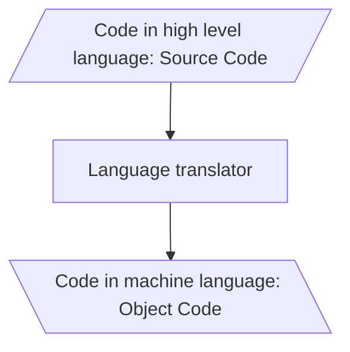

| Translator | Input | What it does | Needed at run time? |
| --- | --- | --- | --- |
| Assembler | Assembly language source | Converts assembly to machine code; each assembler understands one specific microprocessor instruction set, so the machine code is not portable | No |
| Compiler | High-level language source | Converts the complete source program as a whole, in one go, into machine code; if the code follows all syntactic rules it is executed | No — once translated, not needed |
| Interpreter | High-level language source | Translates one line at a time: takes a line, converts to executable code if syntactically correct, executes it, repeats for all lines | Yes — always needed whenever the source is executed |

§1.7.3(B)

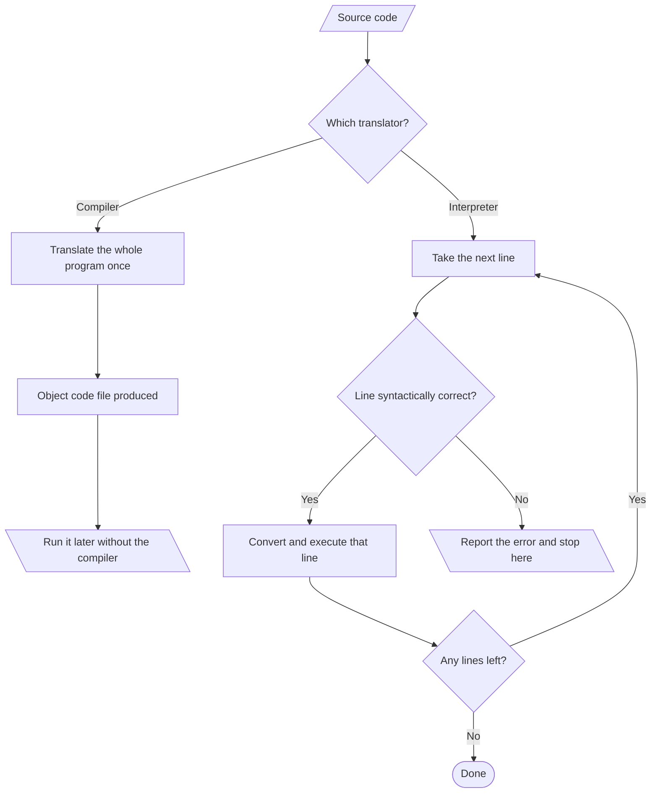

| # | Compiler | Interpreter |
| --- | --- | --- |
| 1 | Debugs the whole program in one go | Debugs it line by line |
| 2 | Errors displayed at the end of compilation, with line numbers | Errors displayed line-wise; does not move on until the current error is removed |
| 3 | Occupies more memory (generates an executable/object file that must reside in memory), but need not compile every time | More memory wastage at run time, since interpreted line-by-line every time it is executed |
| 4 | Less execution time | More execution time |

§1.7.3(B) — the four compiler-vs-interpreter differences that get asked.

- Languages that use an interpreter: Python, PHP, MATLAB. §1.7.3(B)
- Languages that use a compiler: C, C++. §1.7.3(B)
- Why is the execution time of machine code less than that of source code? (NCERT Exercise Q3) §1.7.3(B)
- Machine code is already in the form the CPU can execute directly. §1.7.3(B)
- Source code must first be translated. §1.7.3(B)
- With an interpreter, translation happens again on every run, adding time on top of execution. §1.7.3(B)

#### (C) Program Development Tools

- Writing a program needs a text editor. §1.7.3(C)
- An editor is software allowing creation of a text file where instructions are typed and stored as the source code. §1.7.3(C)
- An appropriate translator is then used to get the object code for execution. §1.7.3(C)
- To simplify program development, there is software called an Integrated Development Environment (IDE). §1.7.3(C)
- An IDE consists of a text editor, building tools and a debugger. §1.7.3(C)
- A program can be typed, compiled and debugged from the IDE directly. §1.7.3(C)
- Examples: Python IDLE, NetBeans, Eclipse, Atom, Lazarus. §1.7.3(C)
- Debugger: software to detect and correct errors in the source code. §1.7.3(C)

### 1.7.4 Application Software

- System software provides the core functionality, but different users need the computer for different purposes. §1.7.4
- Application software is the specific software that works on top of the system software to cater to end-user requirements. §1.7.4
- Examples of purpose: making a document, making a presentation, handling inventory, managing an employee database. §1.7.4

| Category | Definition | Examples |
| --- | --- | --- |
| General Purpose Software (Office Tools) | Developed for generic applications, to cater to a bigger audience; ready-made, used by end users as per their requirements | LibreOffice Calc, Adobe Photoshop, GIMP, Mozilla web browser, iTunes, MS Word, MS Excel, MS Access |
| Customised / Specific Purpose Software (Domain Specific Tool) | Custom or tailor-made to meet a specific organisation's or individual's requirements; cannot simply be installed and used by another customer | Websites, school management software, accounting software, Banking System, Payroll Management System, Inventory Management, Billing System |

§1.7.4

- Analogy: general purpose software is buying ready-made cloth. §1.7.4
- Customised software is buying a piece of cloth and getting a garment tailored to fitting, colour and fabric of choice. §1.7.4

### 1.7.5 Proprietary or Free and Open Source Software

| Category | Source code | Cost to use | Examples |
| --- | --- | --- | --- |
| FOSS (Free and Open Source Software) | Provided freely to the public, anyone with the knowledge can improve it or add functionality | Free | Ubuntu, Python, LibreOffice, OpenOffice, Mozilla Firefox |
| Freeware | May not be available | Free to use | Skype, Adobe Reader |
| Proprietary | Not available | Must be purchased from the vendor who holds the copyright | Microsoft Windows, Tally, Quickheal |

§1.7.5

- ⚠ Free ≠ open source. §1.7.5
- Freeware is free to use. §1.7.5
- FOSS is free to use, and free to read, modify and redistribute the source code of. §1.7.5
- Adobe Reader costs nothing and is still not open source. §1.7.5
- Which category a piece of software falls into depends entirely on the terms and conditions set by its developer/releaser. §1.7.5

---

## §1.8 Operating System

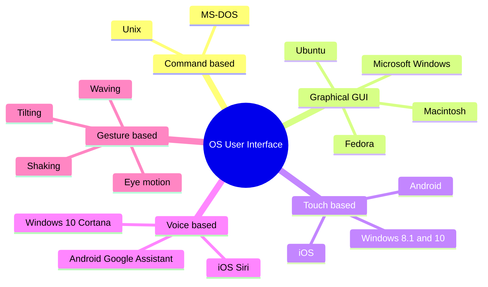

- Operating system (OS): can be considered a resource manager. §1.8
- Manages all the resources of a computer — CPU, RAM, Disk, Network, other input-output devices. §1.8
- Also controls various application software and device drivers. §1.8
- Manages system security. §1.8
- Handles access by different users. §1.8
- It is the most important system software. §1.8
- Examples: Windows, Linux, Android, Macintosh. §1.8
- The OS manages resources so each is used optimally and system performance does not deteriorate. §1.8
- Every OS function (§1.8.2) is a special case of that one job. §1.8

Two primary objectives of an operating system:
1. Provide services for building and running application programs. §1.8
2. Provide an interface to the user through which the user can interact with the computer. §1.8

- Objective 1 detail: when an application needs to run, the OS loads it into memory and allocates it to the CPU for execution. §1.8
- When multiple programs need to run, the OS decides the order of execution. §1.8
- Objective 2 detail: a user interface is a software component, part of the OS, whose job is to take commands/inputs from a user for the OS to process. §1.8
- Need for an OS (supplementary), seven points: user interface, program execution, resource allocation, manipulation of the file system, I/O operations, error detection and handling, controlling/allocating system hardware and software resources to users or programs as per requirement. §1.8
- Every computer must have an operating system to run other programs. §1.8
- Commonly used: DOS (Disk Operating System), UNIX, LINUX, Windows. §1.8
- An OS is the first program executed on a computer after the BIOS. §1.8
- Booting (supplementary): the process of starting the computer and loading the operating system. §1.8
- Who brings the OS into RAM? The boot loader / bootstrap program stored in ROM (BIOS firmware). §1.8
- It can't be the OS itself. §1.8
- The OS isn't in memory yet at that point. §1.8
- This is what §1.3.2(A) meant by "ROM stores the startup program that loads the OS into primary memory." §1.8

### 1.8.1 OS User Interface

| Interface | How the user interacts | Primary input device | Key limitation / note |
| --- | --- | --- | --- |
| Command-based | User enters commands to create, open, edit or delete a file; must remember the names of all such programs/commands | Keyboard | Often less interactive; usually allows a single program at a time |
| Graphical (GUI) | Programs/instructions given through icons, menus, visual options; icons represent files/programs stored on the computer; windows represent running programs launched through the OS | Mouse and keyboard | The reason PC popularity surged in the 1980s–90s |
| Touch-based | Inputs via touchscreen, interpreted by the OS as commands — opening/closing an app, dialing a number, scrolling | Touchscreen | Now standard on smartphones, tablets and PCs |
| Voice-based | Voice commands make the computer work in the desired way | Microphone | Designed for users who cannot use mouse/keyboard/touchscreens, and for hands-busy use |
| Gesture-based | Gestures like waving, tilting, eye motion, shaking | Camera / sensors | Evolving faster; promising potential in gaming, medicine, other areas |

§1.8.1

- Command-based examples: MS-DOS, Unix. §1.8.1
- GUI examples: Microsoft Windows, Ubuntu, Fedora, Macintosh. §1.8.1
- Touch-based examples: Android, iOS, Windows 8.1/10 (also supports touch). §1.8.1
- Voice-based examples: iOS Siri, Android Google Assistant, Windows 10 Cortana. §1.8.1

### 1.8.2 Functions of Operating System

| Function | What the OS is actually doing | The detail that earns marks |
| --- | --- | --- |
| Process Management | A process is a task in execution; OS manages processes and gets multiple tasks completed in minimum time | CPU is the main resource; its allocation among processes is the most important OS service; concerns management of multiple processes, allocation of required resources, exchange of information among processes; system monitor often activated with Ctrl+Alt+Delete |
| Memory Management | Give (allocate) and take (free) memory from running processes, dynamically, since many processes run at a time | Must not affect other processes already residing in memory; when a process finishes, OS takes the memory space back for re-utilisation; goal is maximum memory occupied/utilised by many processes, tracking every location as free or occupied |
| File Management | Creation, updation, deletion and protection of files in the secondary memory | Protection is crucial — a mechanism must stop users accessing files belonging to another user and not shared with them; file management handles secondary memory, memory management handles main memory |
| Device Management | Manages many heterogeneous, interdependent I/O devices and hardware connected to the system | OS interacts with the device driver and related software for a particular device; must provide options for configuring a device; devices, like files, need security measures, access restricted to authorised users, software and hardware |

§1.8.2

- ⚠ File management handles secondary memory; memory management handles main memory — this split is asked directly. §1.8.2

### 1.8.3 Resource management: time vs space multiplexing (Supplementary)

- The OS keeps track of who is using which resource. §1.8.3
- Grants resource requests, handles the same request from different users and programs. §1.8.3
- Decides between conflicting requests for efficient and fair resource use — e.g. maximise throughput, minimise response time. §1.8.3
- Resource management constitutes multiplexing (sharing) resources. §1.8.3
- Carried out in two manners: time multiplexing, space multiplexing. §1.8.3

| | Time multiplexing | Space multiplexing |
| --- | --- | --- |
| Idea | The resource is shared in turns — only one at a time | Each user/program gets some part of the resource simultaneously |
| Resource typically shared | CPU time, a printer | Main memory |
| Example | Several programs issue print commands at once; the resource manager determines who goes next and for how long; print jobs carried out one by one | Main memory divided amongst several running programs; OS assumes enough memory to hold multiple programs, more efficient than allocating all memory to a single user |

§1.8.3

### 1.8.4 Types of operating system (Supplementary)

- Supplementary book's objective section names three types: Single-user OS, Multi-user OS, Time-sharing OS. §1.8.4
- Its MCQ answer is "All of these" — all three are genuine types of OS. §1.8.4
- Neither book develops these in the chapter body. §1.8.4
- Treat them as vocabulary to recognise, not as a section to reproduce. §1.8.4

---

## Points to Ponder

Traps in this chapter that actually cost marks:

1. 1 GB = 1024 MB, not 1024 KB. Every step of the ladder is ×1024; skipping a rung is the single most common arithmetic error. §Points to Ponder
2. Cache is faster than RAM. "RAM operates much faster than cache memory" is False. Order: registers > cache > RAM > secondary. §Points to Ponder
3. ROM is non-volatile, and ROM is primary memory. "ROM is volatile" → False. "Primary memory = RAM only" → wrong. §Points to Ponder
4. "Primary memory stores data permanently" is False — RAM, its main part, is volatile. §Points to Ponder
5. The address bus does not carry data. "An address bus carries data from one place to another" → False; that's the data bus. Data bus is bidirectional, address bus unidirectional. §Points to Ponder
6. Secondary storage cannot be accessed directly by the CPU. Its contents must first be brought into main memory. §Points to Ponder
7. A dot matrix printer is an impact printer, not laser technology. "Dot matrix printer uses laser technology" → False. §Points to Ponder
8. Deleting a file does not erase its contents — only its address entry is marked free. Why recovery works, and why discarded drives are a confidentiality risk. §Points to Ponder
9. Microprocessor ≠ microcontroller. Microprocessor = CPU only; microcontroller = CPU + fixed RAM + ROM + peripherals on one chip. §Points to Ponder
10. Freeware is not FOSS. Free to use ≠ source code available. §Points to Ponder
11. A computer can run without application software but not without system software — get the direction right. §Points to Ponder
12. OMR vs OCR vs MICR: mark, character, magnetic-ink character (cheques). §Points to Ponder
13. Compiler reports errors at the end, with line numbers; interpreter stops at the first bad line. Interpreter is still needed at run time — the compiler isn't. §Points to Ponder
14. NCERT Think and Reflect: RAM but no secondary storage — can you install software? You could load and run it in RAM, but nothing survives power-off, so there is no installation in any lasting sense. Installation means writing to non-volatile storage. §Points to Ponder
15. A "word" is the maximum amount of data a CPU can process at once → True. Don't confuse word size with bus width, even though they coincide for many processors. §Points to Ponder
16. Reading memory does not change it; writing does. Non-destructive read, destructive write — both describe primary memory, both true at once. §Points to Ponder
17. ISCII expands to Indian Script Code for Information Interchange, not "Indian Standard Code," even though the supplementary book's MCQ offers only the latter. Unicode, not ISCII, is the universal standard. §Points to Ponder
18. A buffer is not a cache. A buffer smooths a speed mismatch between two components; a cache keeps copies of frequently used data closer to the CPU. §Points to Ponder
19. A port is a physical socket, not software. The word also means something different in networking (port numbers) — in this chapter it is the plug on the outside of the box. §Points to Ponder
20. The computer has no intelligence of its own. Speed, reliability and diligence are capabilities; correctness of the instructions is the user's job. GIGO. §Points to Ponder

---

## Problem-Solving Strategy

A per-type checklist for the question patterns this chapter generates.

**Type 1 — Unit conversion ("convert 3.7 GB to bytes", "1 TB equals how many GB?")**
1. Write the ladder from the larger unit to the target: GB → MB → KB → B. §Problem-Solving Strategy
2. Count the rungs — that is the exponent on 1024. §Problem-Solving Strategy
3. Multiply once: value × 1024^rungs. Never mix in 1000. §Problem-Solving Strategy
4. Sanity-check the magnitude — GB to bytes should gain about nine decimal digits. §Problem-Solving Strategy

**Type 2 — "Name the device that…"**
1. Identify the direction first: data going into the computer (input) or out (output)? §Problem-Solving Strategy
2. Identify the medium in the clue — mark, character, magnetic ink, bar, light, touch, voice, biometric. §Problem-Solving Strategy
3. Answer with the device and one clause of justification. The justification is usually worth the mark. §Problem-Solving Strategy

**Type 3 — Classify a piece of software**
1. Does it interact directly with hardware to make the machine usable? → System (OS / utility / driver). §Problem-Solving Strategy
2. Does it help write programs? → Programming tool (editor, translator, IDE). §Problem-Solving Strategy
3. Does it do a job for the user on top of the system? → Application (general purpose or customised). §Problem-Solving Strategy
4. Add the sub-label: Compiler → System software (language processor); WinRAR → System software (compression utility); PowerPoint → Application software; Ubuntu → System software (OS). §Problem-Solving Strategy

**Type 4 — RAM vs ROM / primary vs secondary sorting questions**
1. Can it be written to? No → ROM. §Problem-Solving Strategy
2. Does it survive power-off? No → RAM. §Problem-Solving Strategy
3. Can the CPU reach it directly? No → secondary. §Problem-Solving Strategy
4. Give the property, not just the label — "volatile, so contents are lost when power is turned off" scores where "RAM" alone may not. §Problem-Solving Strategy

**Type 5 — "Why…?" reasoning questions (bus direction, microcontroller choice, machine-code speed)**
1. State what the component does, in one sentence. §Problem-Solving Strategy
2. State what it therefore does not need to do — this is where the answer usually lives (the CPU never receives an address, an appliance never runs arbitrary programs, machine code is never re-translated). §Problem-Solving Strategy
3. Close with the consequence: hence unidirectional / hence smaller and cheaper / hence faster. §Problem-Solving Strategy

---

## Appendix A — Discrepancies found between the two sources

Flagged rather than silently corrected, so you know which version to write in which exam.

| # | Point | Supplementary book says | NCERT / verified position | What to write |
| --- | --- | --- | --- | --- |
| 1 | Components of the CPU | ALU, CU and Memory unit | ALU, CU and registers; primary memory sits outside the CPU | ALU + CU (+ registers). Registers are inside; RAM is not. |
| 2 | Address bus width | "consists of 16 wires… its width is 16 bits" | Width varies by processor; NCERT Table 1.2 implies 10, 20, 24, 32, 36 bits across generations | Quote the rule 2ⁿ, not a fixed 16 |
| 3 | 2¹⁶ | "2¹⁶ or 32,000 different numbers" | 2¹⁶ = 65,536 | 65,536 |
| 4 | Data bus width | "It is an 8-bit bus" | Varies; the book's own next line says the size equals the CPU word length | Say it equals the CPU word length |
| 5 | Timeline of stored-program machines | — | NCERT: "The EDVAC and then the ENIAC computers were developed based on this concept"; ENIAC called the first binary programmable computer on Von Neumann architecture | Write NCERT's version for the board. Historically, EDVAC was the stored-program design (1945), ENIAC was later modified to operate in a stored-program mode (1948) |
| 6 | Control bus direction | — | NCERT: control bus is unidirectional | Write NCERT's answer. Real interrupt lines do travel device → CPU, so "unidirectional" is a simplification |
| 7 | Fifth-gen clock speed | — | NCERT Table 1.2: "533 MHz – 34 GHz" | Almost certainly a typo for 3.4 GHz; reproduce the table as printed, don't repeat 34 GHz in prose |
| 8 | Memory units beyond YB | Bronto Byte, Geop Byte | Not standardised units | Include only if the board book is the supplementary one |
| 9 | Top-level software categories | Four: System, Application, Utility, Programming Tools | Three: System (containing utilities and drivers), Programming tools, Application | Follow whichever book the paper is set from; utilities are system-level either way |
| 10 | Sector size | "as a rule, holds 512 bytes" | Traditional standard; modern drives often use 4096-byte physical sectors | Write 512 bytes for the exam |
| 11 | ISCII expansion | MCQ key: "Indian Standard Code for Information Interchange"; correct expansion not among the four options | BIS IS 13194:1991 defines ISCII as Indian Script Code for Information Interchange | Pick the book's option in its own MCQ; write "Indian Script Code for Information Interchange" if asked to expand it |
| 12 | Computer vs calculator | "a calculator only performs arithmetic and geometrical operations" | The real contrast is arithmetic-only vs. arithmetic + logic + storage + stored program | Answer True, framed as the logic/stored-program contrast |

---

## Appendix B — Textbook activities and "Explore Yourself"

NCERT sets eight numbered Activities plus an Explore Yourself list; the supplementary book sets similar practical tasks. Most have machine-dependent answers, so this is the method rather than a fixed answer.

| Activity | Task | How to do it / what to find |
| --- | --- | --- |
| 1.1 | Express each generation's maximum memory size as a power of 2 | Already worked in §1.4b: 1 KB = 2¹⁰, 1 MB = 2²⁰, 16 MB = 2²⁴, 4 GB = 2³², 64 GB = 2³⁶ — exactly 2ⁿ for that generation's address width |
| 1.2 | Find the microprocessor's clock speed and compare with peers' | Windows: Settings → System → About → read the Processor line. Linux: `lscpu`, read CPU MHz / model name. Android: check the chipset in Settings → About phone |
| 1.3 | Visit a bank, showroom, mall or tehsil office and name 2–3 data-capture tools | Expect: bar code scanner at billing, biometric fingerprint scanner for attendance/verification, card reader/PIN pad, signature pad, OMR sheets, camera. Map each back to §1.1.2a |
| 1.4 | Explore ways of recovering deleted or corrupted data | Three levels: (1) restore from the Recycle Bin/Trash; (2) restore from a backup or previous-version/File-History snapshot; (3) run an undelete/data-recovery utility, working only while space is unoverwritten (§1.6.3) |
| 1.5 | Create a test file, delete it with Shift+Delete, then recover it | Practical demonstration of §1.6.3 — file bypasses the Recycle Bin, yet recovery software still finds it, because deletion only marked its address entry free. Stop using the drive immediately after deleting |
| 1.6 | Locate any two device drivers installed on the computer | Windows: Device Manager → expand a category → right-click a device → Properties → Driver tab. Linux: `lsmod` lists loaded kernel modules; `lspci -k` shows which driver each device uses |
| 1.7 | Install one application software | Any general-purpose tool — browser, media player, office suite; needs the OS already present (§1.7.1) |
| 1.8 | Install one free and open source application | E.g. LibreOffice, Mozilla Firefox, GIMP, Python; the point is source code is available, separating FOSS from freeware (§1.7.5) |
| Explore 2 | Name two system and two application software on the computer | System: the OS itself, plus an antivirus or disk utility. Application: word processor, browser |
| Explore 3–4 | Which microprocessor, which generation, what clock speed? | Use the Activity 1.2 steps, then place it in Table 1.2 — anything modern is fifth generation, SLSI, 64-bit, multicore |
| Explore 5 | Name two devices at home or school with a microcontroller | Washing machine, microwave, remote controller, digital camera, keyboard, mouse, pen drive (§1.5.2) |
| Explore 6 | Check RAM and HDD size, tabulate in B, KB, MB, GB | Use the ladder from §1.3.1; same arithmetic as Worked Example 1-2 |
| Explore 7 | List all secondary storage devices at school or home | Hard disk, SSD, pen drives, memory cards, CDs/DVDs, external drives, phone storage |
| Explore 8 | Which operating system is installed? | Name it and its interface type from §1.8.1 — e.g. "Windows 11, a GUI-based OS that also supports touch input" |

---

## Rapid Reference

Every major fact from the chapter, flat two-column table.

| Fact | Value |
| --- | --- |
| 1 nibble | 4 bits |
| 1 byte | 8 bits = 2 nibbles |
| 1 KB / MB / GB / TB | 1024 of the unit below it — never 1000 |
| 1 MB in bytes | 2²⁰ = 1,048,576 |
| 1 GB in bytes | 2³⁰ = 1,073,741,824 |
| 1 TB | 1024 GB = 2¹⁰ GB |
| n-bit address bus addresses | 2ⁿ locations |
| Standard sector size (traditional) | 512 bytes |
| CD / DVD / Blu-ray capacity | 700 MB / 4.7–8.5 GB / 25 GB (50 GB dual layer) |
| Speed order (fastest first) | Registers → Cache → RAM → Secondary storage |
| Computer | Electronic device programmed to accept data, process it, generate a result |
| Computer system | A computer plus the additional hardware and software bundled with it |
| CPU | Electronic circuitry that carries out the actual processing — the brain of the computer |
| Register | The CPU's own local memory, on the CPU chip, limited in size and number |
| ALU | Performs arithmetic and logic operations |
| CU | Controls sequential execution and guides data flow |
| Bus | Physical wires transferring data, addresses and control signals; one bit per wire |
| System bus | Data bus + address bus + control bus, collectively |
| Memory controller | Dedicated hardware managing the flow of data into and out of main memory |
| Microprocessor | A processor (CPU) implemented on a single microchip |
| Microcontroller | CPU + fixed RAM, ROM and peripherals, all on a single chip, for a specific task |
| Word size | The maximum number of bits a microprocessor can process at a time |
| Core | A basic computation unit of the CPU |
| Clock speed | The number of pulses per second generated by the internal clock |
| Data | Raw unorganised facts |
| Information | Data organised to generate meaning |
| Data recovery | Retrieving deleted, corrupted and lost data from secondary storage |
| Software | A set of instructions and data that makes hardware functional |
| Source code | Program written in assembly or high-level language |
| Object code | Its machine-code translation |
| IDE | Text editor + building tools + debugger, in one environment |
| Operating system | Resource manager and user interface; the most important system software |
| Process | A task in execution |
| Booting | Starting the computer and loading the operating system |
| Pixel | The smallest element of an image on a display; short for picture element |
| Soft copy | Stored on disk or pen drive |
| Hard copy | Printed on paper |
| ALU | Arithmetic Logic Unit |
| ASCII | American Standard Code for Information Interchange |
| BD | Blu-ray Disc |
| CAD | Computer-Aided Design |
| CPU | Central Processing Unit |
| CRT | Cathode Ray Tube |
| CU | Control Unit |
| DRAM | Dynamic RAM |
| EEPROM | Electrically Erasable Programmable ROM |
| ENIAC | Electronic Numerical Integrator and Computer |
| EPROM | Erasable Programmable ROM |
| FOSS | Free and Open Source Software |
| GIGO | Garbage In, Garbage Out |
| GPU | Graphics Processing Unit |
| GUI | Graphical User Interface |
| HDD | Hard Disk Drive |
| IC | Integrated Circuit |
| IDE | Integrated Development Environment |
| IoT | Internet of Things |
| IPO | Input-Process-Output |
| ISCII | Indian Script Code for Information Interchange |
| LCD | Liquid Crystal Display |
| LED | Light-Emitting Diode |
| LSI | Large Scale Integration |
| MAR | Memory Address Register |
| MICR | Magnetic Ink Character Reader |
| OCR | Optical Character Reader |
| OLED | Organic LED |
| OMR | Optical Mark Reader |
| OS | Operating System |
| POS | Point of Sale |
| PROM | Programmable ROM |
| QR | Quick Response |
| RAM | Random Access Memory |
| ROM | Read-Only Memory |
| SLSI | Super Large Scale Integration |
| SoC | System on Chip |
| SRAM | Static RAM |
| SSD | Solid State Drive |
| VDT | Visual Display Terminal |
| VDU | Visual Display Unit |
| VLSI | Very Large Scale Integration |
| WWW | World Wide Web |