# Computer Science | Chapter 01 | Computer System and Organisation | NOTES

**Branch:** Computer Fundamentals — Hardware, Memory, Software & Operating System (the chapter that sits *before* Python Fundamentals)
**Level:** Class XI · CBSE Board · NCERT Chapter 1
**Python version assumed:** Python 3.x (only two short snippets appear in this chapter; both are previews of later chapters)

**Primary source:** NCERT, *Computer Science — Class XI*, Chapter 1 "Computer System" (Reprint 2025-26). Section numbering `1.1`–`1.8` below is NCERT's own and is preserved exactly.
**Supplementary source:** *Computer Science with Python — XI*, Chapter 1 "Computer System Organization". This book folds far more device-level detail (input/output devices, printers, secondary storage, utilities) into the same chapter. That material is folded in as clearly labelled subsections rather than renumbering NCERT.
**Companion files:** `CS01-COMPUTER_SYSTEM-GLOSSARY.md` (fast lookup, one term at a time) · `CS01-COMPUTER_SYSTEM-CNOTES.md` (the same chapter reformatted as bullets, tables and diagrams for fast scanning — same content, denser shape).

> [!note] Renderer check before you trust the figures
> `mermaid` and `tikz` blocks render live in the current NoteBooks build. The `svg` and `desmos` blocks in this note follow the skill's self-contained rules and have been syntax-reviewed, but **neither fence is confirmed live yet** — render one of them once before relying on the rest.

---

## Concept Roadmap

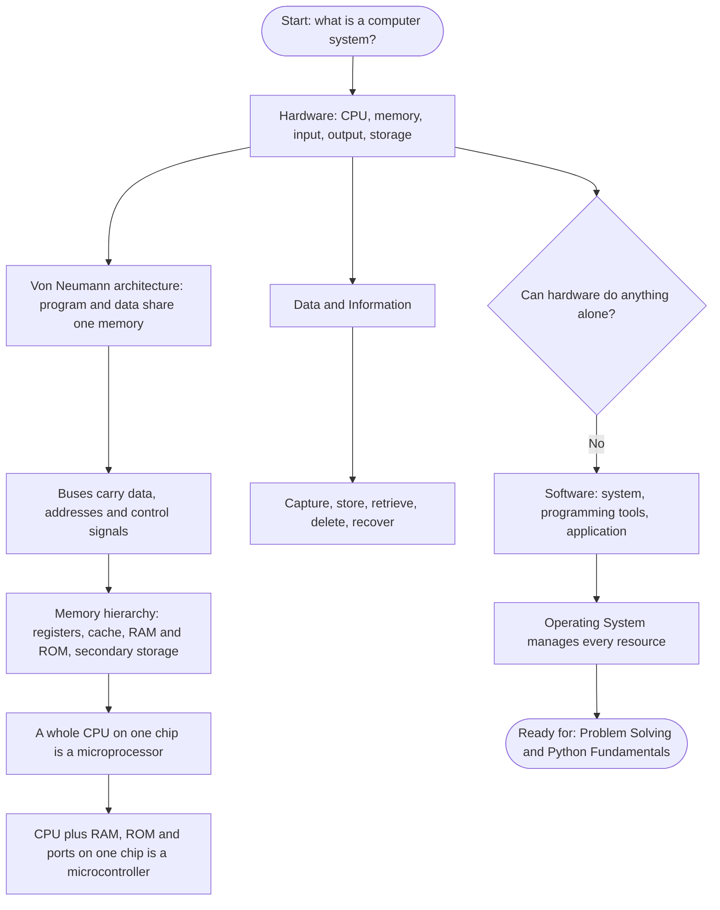

Read the diagram top-down: the chapter first builds the machine out of physical parts, then shows how the parts talk to each other, then explains what they move around (data), and finally admits that none of it moves at all without software — which is why the chapter ends on the operating system.

---

## 1.1 Introduction to Computer System ⭐⭐

A **computer** is an electronic device that can be programmed to accept data (input), process it, and generate a result (output). A computer *together with* the additional hardware and software that make it usable is called a **computer system**.

> **Key idea:** "computer" is the machine; "computer system" is the machine plus everything bundled with it. Board questions that ask you to "define a computer system" want the second one.

> [!note] Commit To Memory (Supplementary)
> **A computer is an electronic device that accepts a set of instructions in the form of a program, executes it and displays the output to the user.**
> This is the supplementary book's boxed definition, and it differs from NCERT's in emphasis: NCERT stresses *data in, result out*; this one stresses that what the machine accepts is **a program**. Both are correct — quote the one from your own board book.

A computer system primarily comprises a **central processing unit (CPU)**, **memory**, **input/output devices** and **storage devices**, all functioning together as a single unit. The same architecture scales from a high-end server down to a desktop, laptop, tablet or smartphone.

### 1.1.0 Block diagram of a computer system (NCERT Figure 1.1)

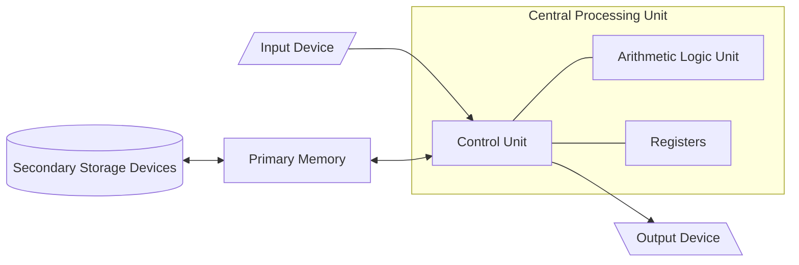

The directed lines are the *flow of data and signals*. Two things in this figure are examinable on their own: input and output devices talk to the **CPU**, but secondary storage talks to the **primary memory**, not directly to the CPU. Anything on a hard disk has to be pulled into RAM first before the CPU can touch it.

### 1.1.0a The IPO cycle (Supplementary)

The supplementary book states the same idea as an equation — every task a computer performs follows an **Input → Process → Output (IPO) cycle**, with memory holding data and instructions during the processing.

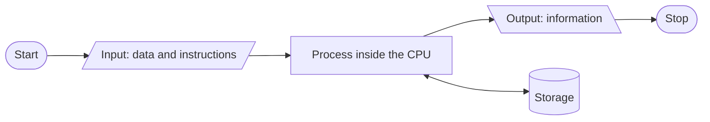

The storage box hangs off the *process* step, not off input or output — it is where intermediate results live while a program is running.

### 1.1.0b Capabilities of a computer (Supplementary) ⭐⭐

A computer's ability to **process, store and retrieve** data and information makes it intrinsic to every kind of environment — home, office or business. It shows up everywhere: ATM withdrawals, online shopping, e-learning, ticket reservation, telephone and electricity bill payment, internet search, email, web surfing, uploading and downloading, social networking, photography.

The supplementary book's Solved Q14 asks for the capabilities outright. Five, with what each one actually means:

| Capability       | What it means                                                                                  |
| ---------------- | ----------------------------------------------------------------------------------------------- |
| **Speed**        | Executes millions of instructions per second — work that would take a person years              |
| **Reliability**  | Gives consistent, dependable results over long periods, as long as input and instructions are correct |
| **Diligence**    | Never tires, never gets bored, never loses concentration — the millionth calculation is done exactly as carefully as the first |
| **Versatility**  | The same machine can do arithmetic, play video, run a database and control a machine tool        |
| **Large memory** | Stores huge volumes of data and retrieves any part of it on demand                              |

> [!note] The flip side — standard, not printed in either book
> A computer has **no intelligence of its own**: it does exactly what its instructions say. Feed it wrong data or a wrong formula and it will produce a wrong answer at full speed and with perfect reliability — **Garbage In, Garbage Out (GIGO)**. This is the same idea as the *logical error* you will meet in the programming chapters.

**Computer vs calculator (Supplementary — True/False (f)).** The printed statement is *"A computer has the capacity to perform calculations and other logical functions, whereas a calculator only performs arithmetic and geometrical operations."* The intended answer is **True**, and the contrast to hold on to is:

| | **Calculator** | **Computer** |
| - | -------------- | ------------ |
| Operations | Arithmetic (a scientific one adds trigonometric and similar functions) | Arithmetic **and logical** — comparisons, decisions |
| Stored program | No — you press keys in sequence | **Yes** — it stores and executes a program (§1.2a) |
| Storage of data | Essentially none | Large primary and secondary memory |
| Decision making | No | Yes, via logical operations in the ALU |

The word "geometrical" in the printed statement is loose; read the intended contrast as **arithmetic only** vs **arithmetic + logic + storage + a stored program**.

### 1.1.1 Central Processing Unit (CPU) ⭐⭐⭐

The CPU is the electronic circuitry that carries out the actual processing, and is usually called the **brain of the computer**. It is also called the **processor**. Physically a CPU sits on one or more microchips called **integrated circuits (IC)**, made of semiconductor materials.

How it works, in NCERT's own order:

1. The CPU is given instructions and data through **programs**.
2. It **fetches** the program and data from memory.
3. It performs the arithmetic and logic operations the instructions demand.
4. It **stores the result back** to memory.

While processing, the CPU keeps data and instructions in its own local memory called **registers**. Registers are part of the CPU chip and are limited in size and number; different registers hold data, instructions, or intermediate results.

**Registers in more detail (Supplementary).** Registers are **high-speed temporary storage areas** found inside the CPU. They work **as per the instructions given by the Control Unit**, storing the instructions and data *immediately required* for performing an operation — the CPU places the **highest-priority jobs and data** inside registers for faster execution. Registers come in different sizes (**16-bit, 32-bit, 64-bit and so on**), and **each register inside the CPU has a specific function**, such as:

- storing a data value,
- storing an instruction,
- storing the **address of a location in memory**.

One named register worth knowing now, because §1.4 needs it: the **Memory Address Register (MAR)**, which holds the address the CPU is about to read from or write to. The address bus is precisely the set of wires that carries an address from the CPU to memory — the MAR is where that address sits on the CPU side.

Besides the registers, the CPU has two main components:

| Component                      | What it does                                                                                                                |
| ------------------------------ | --------------------------------------------------------------------------------------------------------------------------- |
| **Arithmetic Logic Unit (ALU)** | Performs all arithmetic (`+`, `-`, `*`, `/`) and logic (`AND`, `OR`, `NOT`, `XOR`) operations required by the instruction |
| **Control Unit (CU)**           | Controls sequential instruction execution, interprets instructions, and guides data flow between memory, ALU and I/O devices |

> [!warning] A genuine conflict between your two books
> The supplementary book says "The CPU consists of three components — **ALU, CU and Memory unit**." NCERT says the CPU has the **ALU, the CU and registers**, with primary memory drawn *outside* the CPU box.
> The safe, correct answer: **registers** are the CPU's internal memory and *are* inside the CPU; **primary memory (RAM/ROM) is not part of the CPU** — the CPU only interacts with it over the bus. If an exam asks "components of the CPU", write ALU + CU (+ registers) and you are safe under both books.

> [!note] Learning tip carried over from the supplementary book
> The CU does **not** process data itself. It sends *control signals* to the ALU and to memory telling them which operation to carry out. Confusing "controls" with "computes" is a classic one-mark loss.

### 1.1.2 Input Devices ⭐⭐

The devices through which data and control signals are sent *to* a computer are **input devices**. They convert input data into a **digital form** acceptable to the computer system — internally, everything becomes binary (0s and 1s, i.e. OFF/ON or LOW/HIGH).

NCERT's short list: keyboard, mouse, scanner, touch screen. It also notes two accessibility points worth remembering:

- **Braille keyboards** are available to help visually impaired users enter data.
- Data can be entered **by voice** — e.g. Google voice search, where the search string is spoken rather than typed.

Data entered through an input device is stored **temporarily in the main memory (RAM)**. For permanent storage it must be written to **secondary memory**.

#### 1.1.2a Input devices in detail (Supplementary) ⭐⭐

The supplementary book lists thirteen devices. This table is the one to revise from — almost every "name the device that…" question comes from here.

| # | Device                                       | What it does                                                                                       | Where it is used                                     |
| -- | -------------------------------------------- | -------------------------------------------------------------------------------------------------- | ---------------------------------------------------- |
| 1  | **Keyboard**                                 | Directly enters letters, digits and commands; has function, alphanumeric, direction, special/lock keys | General text entry                                   |
| 2  | **Mouse**                                    | Pointing device with a roller at its base; converts hand movement into binary digits giving a position | Moving the on-screen pointer                         |
| 3  | **Light Pen**                                | Photocell mounted in a pen-shaped tube (stylus); senses a position when its tip touches the screen  | Engineers, architects, designers                     |
| 4  | **OMR** (Optical Mark Reader)                | Recognises a pre-specified mark made with dark pencil or ink; transcribes marks into electrical pulses | Grading MCQ answer sheets                            |
| 5  | **Smart Card Reader**                        | Reads the microprocessor embedded in a PVC card holding personal data                              | ATM/ID/credit/debit cards, banking, security         |
| 6  | **Bar Code Reader**                          | Light source + lens + light sensor translate optical impulses to electrical signals; decoder analyses the bar code image | Retail products, inventory                           |
| 7  | **QR Code Reader**                           | Reads a Quick Response code — a 2-D barcode scannable by a smartphone app                          | Marketing, payments, linking to a website            |
| 8  | **Biometric Sensor**                         | Identifies a person from physical or behavioural traits (eyes, fingerprints, DNA)                  | Attendance, restricted entry to secured areas        |
| 9  | **Touch Screen**                             | Touch-sensitive transparent panel over the display; no intermediate device needed                  | ATMs, phones, malls, amusement parks, airports       |
| 10 | **Microphone**                               | Provides audio data to the computer; works with a sound card                                       | Sound recording, voice commands                      |
| 11 | **Webcam**                                   | Captures stills and video; has **no built-in storage** — uses the computer's hard drive            | Video conferencing, live streaming                   |
| 12 | **MICR** (Magnetic Ink Character Reader)     | Detects numbers printed in magnetically charged ink and converts them to digital data              | Bottom strip of bank cheques                         |
| 13 | **OCR** (Optical Character Reader)           | Recognises scanned images, screenshots, PDFs and handwriting as machine-encoded text               | Digitising documents, text-to-speech, translation    |

**Two follow-ups the supplementary book's exercises ask about:**

- **Who invented the mouse?** (Solved Q4) The mouse is a pointing (input) device developed by **Douglas Engelbart in 1963**.
- **Types of mouse** (Unsolved Q49) — **mechanical** (a rubber ball rolling against two rollers), **optical** (an LED and a sensor detect movement across a surface), **laser** (an optical mouse using a laser instead of an LED, working on more surfaces), **wireless** (connecting over radio or Bluetooth instead of a cable) and **trackball** (the ball sits on top and is rolled by the thumb, so the device itself stays still).

> [!warning] The three "reader" acronyms are the most-confused trio in this chapter
> **OMR** reads a *mark* (a filled bubble). **OCR** reads a *character* (a shape it recognises as a letter). **MICR** reads characters printed in *magnetic ink* (cheques). If the question mentions a pencil-shaded bubble → OMR. Handwriting or a scanned page → OCR. A cheque → MICR.

### 1.1.3 Output Devices ⭐⭐

An **output device** receives data from the computer system for display or physical production, converting digital information into a **human-understandable form**. NCERT's examples: monitor, projector, headphone, speaker, printer. A **braille display monitor** helps a visually challenged person understand textual output.

The supplementary book adds one clause worth keeping: output devices produce the output generated by the CPU in human-readable form, and **can also be used to store the result for further use**.

A **printer** is the most commonly used device for output in **physical (hardcopy)** form. NCERT names three common types — **inkjet, laserjet and dot matrix** — plus a fourth, newer one:

- **3D printer** — builds a physical replica of a digital 3D design. Used in manufacturing to create prototypes, and being explored in the medical field for developing body organs.

> **Soft copy vs hard copy:** a document or image stored on a hard disk or pen drive is a **soft copy**. Once printed, it is a **hard copy**. (NCERT introduces this pair later, in §1.7, but it belongs with output devices.)

#### 1.1.3a Display technologies and printers in detail (Supplementary) ⭐⭐

**Visual Display Unit (VDU) / Monitor** — also called a **Visual Display Terminal (VDT)**. Four display technologies, in order of development:

| Technology                              | Distinguishing feature                                                                                        |
| --------------------------------------- | ------------------------------------------------------------------------------------------------------------- |
| **CRT** (Cathode Ray Tube)              | The original bulky display                                                                                    |
| **LCD** (Liquid Crystal Display)        | Smaller and lighter than CRT → ideal for laptops, palmtops, portable devices                                  |
| **LED** (Light-Emitting Diode)          | Lightweight flat panel; uses light-emitting diodes to create pixels; **less power** than CRT and LCD, considered environment-friendly |
| **OLED** (Organic LED)                  | More advanced than LED; an **organic** substance glows when current passes; ultra-thin, superior colour, individual pixels switch off for true blacks |

> [!note] Definition worth memorising verbatim
> A **pixel** is the smallest element of an image on a computer display. "Pixel" is short for **pic**ture **el**ement.

**Printers** split into two families by whether the print head physically touches the paper:

| Family         | Definition                                                    | Types                             |
| -------------- | ------------------------------------------------------------- | --------------------------------- |
| **Impact**     | Mechanical contact between printer head and paper             | Dot matrix (serial printer)       |
| **Non-impact** | No mechanical contact between printer head and paper          | Inkjet / Deskjet / Bubble jet, Laser |

| Printer         | How it works                                                                     | Strengths                                            | Limits                                           |
| --------------- | -------------------------------------------------------------------------------- | ---------------------------------------------------- | ------------------------------------------------ |
| **Dot Matrix**  | Prints one character at a time using dots, by striking an ink-soaked ribbon against the paper | Low operating cost; can make **carbon copies**       | Noisy; one line at a time; only low-resolution graphics |
| **Inkjet**      | Sprays quick-dry ink from cartridges (red, green, black, yellow)                 | High-quality prints; cheap hardware; good for homes and small offices | Slower and costlier per page than laser at volume |
| **Laser**       | Uses laser technology to produce printed documents                                | Very fast, high quality, quiet, low per-page cost    | Higher upfront cost                              |

Two more output devices from the supplementary book:

- **Speakers** — generate sound as output. A **sound card** must be installed for a speaker to produce sound.
- **Plotters** — produce good-quality images and drawings and, unlike printers, support **large-sized paper**. Mainly used in **computer-aided design (CAD)**. Two main types (Unsolved Q23): the **drum plotter**, where the paper moves over a rotating drum while the pen moves along one axis, and the **flatbed plotter**, where the paper lies flat and the pen moves in both axes. *(Inkjet and electrostatic plotters also exist; neither book develops them.)*

**Types of impact printer** (Unsolved Q16) — all of them work by striking the paper: **dot matrix** (a grid of pins forms each character), **daisy wheel** (fully-formed characters on a spoked wheel), and **line printers** such as **drum** and **chain/band** printers, which print a whole line at a time in high-volume settings.

#### 1.1.3b Naming the device for a task ⭐⭐

Both books ask this pattern repeatedly (NCERT Exercise Q13; Supplementary Solved Q7 and Q8). The full set, in one table:

| Task                                                   | Device                         | In / Out |
| ------------------------------------------------------ | ------------------------------ | -------- |
| Output audio                                           | **Speaker / earphones / headphones** | Output   |
| Enter textual data                                     | **Keyboard**                   | Input    |
| Make a hard copy of a text file                        | **Printer**                    | Output   |
| Display the data or information                        | **Monitor (VDU)**              | Output   |
| Enter an audio-based command                           | **Microphone**                 | Input    |
| Build 3D models                                        | **3D printer**                 | Output   |
| Assist a visually-impaired individual in entering data | **Braille keyboard**           | Input    |
| Read textual output without sight                      | **Braille display monitor**    | Output   |
| At a supermarket POS, show the items purchased or sold | **Monitor**                    | Output   |
| At a supermarket POS, take a printout of the bill or invoice | **Printer**              | Output   |

> **Point-of-sale worked answer (Supplementary Solved Q7).** Given that a POS terminal already uses a bar code reader and a keyboard, the two other devices to name are the **monitor** — used to display information about the items purchased or sold — and the **printer** — used for taking a printout of the bill or invoice generated. Name the device **and its use**; the use is half the mark.

> [!example]
> ### Worked Example 1-1 — Choosing a printer for 1000 newsletters (Supplementary — Case-based Q3)
>
> **Given.** A school newsletter contains text *and* images. The head teacher needs one thousand copies.
> **Find.** Four reasons to prefer a laser printer over an inkjet or a dot matrix printer.
> **Concept.** Compare the two families on the four dimensions that actually change at volume: print quality, speed, noise, and cost *per page* (not cost of the machine).
> **Work.**
> 1. **Quality** — laser output is better than inkjet or dot matrix, and the newsletter contains images.
> 2. **Speed** — laser is faster than both; 1000 copies makes speed the binding constraint.
> 3. **Noise** — laser makes very little noise; dot matrix is an impact printer and is loud.
> 4. **Cost per page** — laser is cheaper per page than inkjet or dot matrix, and 1000 pages multiplies that difference.
> **Check.** Every reason is tied to the *volume* in the question. A reason like "laser printers are more expensive" would be about the machine, not the job, and would not earn the mark.

---

## 1.2 Evolution of Computer ⭐

Computing devices evolved from the simple calculator to a modern data processor in a relatively short span of time. NCERT presents this as a timeline (Figure 1.4); a table is easier to revise from and carries exactly the same information.

| Year        | Invention              | Who / what it did                                                                                                          |
| ----------- | ---------------------- | -------------------------------------------------------------------------------------------------------------------------- |
| **500 BC**  | **Abacus**             | Computing is attributed to the invention of the abacus almost 3000 years ago — a mechanical device capable of simple arithmetic only |
| **1642**    | **Pascaline**          | **Blaise Pascal** invented a mechanical calculator doing addition and subtraction directly, and multiplication/division through repeated addition and subtraction |
| **1834**    | **Analytical Engine**  | **Charles Babbage** — a mechanical computing device for inputting, processing, storing and displaying output; considered the basis of modern computers |
| **1890**    | **Tabulating Machine** | **Herman Hollerith** — summarised data stored on punched cards; considered the first step towards programming              |
| **1937**    | **Turing Machine**     | A general purpose programmable machine capable of solving any problem by executing a program stored on punched cards        |
| **1945**    | **EDVAC / ENIAC**      | **John Von Neumann** introduced the **stored program** concept — storing data *as well as* program in memory                |
| **1947**    | **Transistor**         | Vacuum tubes replaced by transistors at Bell Labs, using semiconductor materials                                           |
| **1970**    | **Integrated Circuit** | An IC is a silicon chip holding an entire electronic circuit in a very small area; computer size dropped drastically       |

> **Punched card:** a piece of stiff paper that stores digital data in the form of **holes at predefined positions**.

## 1.2a Von Neumann Architecture ⭐⭐⭐

This is the single most examinable idea in §1.2, and it is the design every machine in this chapter follows — so it gets its own section rather than a line on the timeline.

### 1.2a.1 The problem it solved

Before 1945, a programmable machine was programmed **physically**. ENIAC was set up for a new calculation by re-plugging cables and resetting switches — a job that could take days. The machine could compute, but the "program" lived in the wiring, not in the machine's memory.

In 1945 **John Von Neumann** introduced the **stored program concept**: a computer capable of **storing data as well as the program in the memory**. The **EDVAC** and then the **ENIAC** computers were developed based on this concept (NCERT Figure 1.4).

> **Key idea — the stored program concept:** instructions are just another kind of data, so they can live in the *same* memory as the data they operate on. Changing what the computer does then means **loading a different set of bytes**, not rewiring the machine. Everything about a modern computer — that you can install software, that an OS can load one program after another, that a compiler can *write* a program as its output — follows from this one decision.

### 1.2a.2 The five functional units

The Von Neumann architecture consists of:

1. A **Central Processing Unit (CPU)** for processing arithmetic and logical instructions.
2. A **memory** to store data **and** programs.
3. **Input devices**.
4. **Output devices**.
5. **Communication channels** to send or receive the output data.

NCERT draws this at its simplest (Figure 1.5) — input, a CPU-plus-memory block, and output:

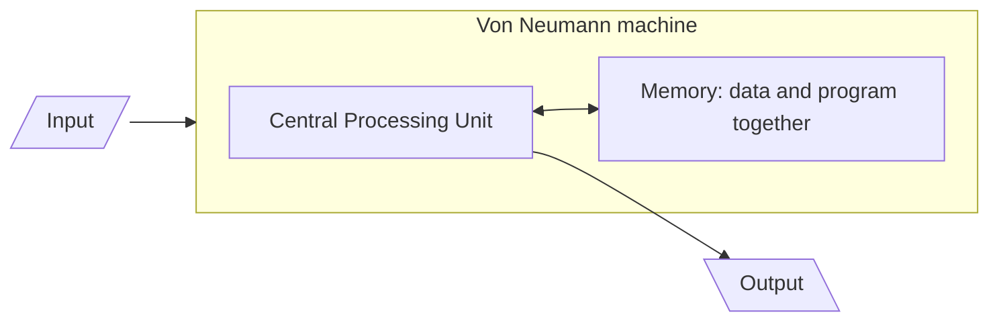

The supplementary book draws the **same** architecture expanded into its functional components (its Figure 1.4, which it labels "Von Neumann Architecture" outright). This is the version to reproduce when a question says *"draw the basic architecture of a computer"* — it is worth more marks because it names the sub-units:

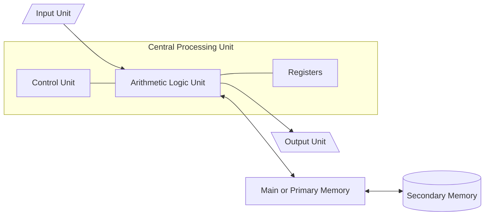

Both diagrams are the same architecture at two zoom levels. Note the one structural fact the expanded diagram makes visible and the simple one hides: **secondary memory connects to primary memory, not to the CPU** — the point already made under §1.1.0.

### 1.2a.3 The machine cycle that follows from it ⭐⭐⭐

Because the program sits in memory, the CPU must go and *get* each instruction before it can obey it. NCERT states this as four steps in §1.1.1 — the CPU is given instructions through programs, **fetches** the program and data from memory, **performs** the operations, and **stores the result back** to memory. Written as a repeating cycle:

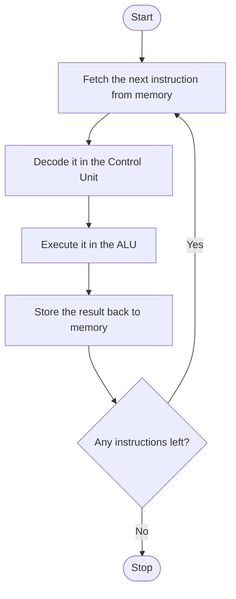

Map each step onto the hardware, and onto the buses from §1.4:

| Step        | Who does it              | What travels on the bus                                                    |
| ----------- | ------------------------ | -------------------------------------------------------------------------- |
| **Fetch**   | CU requests, memory supplies | Address of the instruction goes out on the **address bus**; `read` on the **control bus**; the instruction comes back on the **data bus** |
| **Decode**  | **Control Unit**         | Nothing leaves the CPU — the CU interprets the instruction and works out which control signals to raise |
| **Execute** | **ALU**                  | Operands are already in **registers**; the arithmetic or logic happens inside the CPU |
| **Store**   | CU directs, memory accepts | Address on the **address bus**, `write` on the **control bus**, result on the **data bus** |

> [!note] Terminology honesty
> NCERT names *fetch*, *perform* and *store back*; the word **decode** and the phrase **machine cycle** (or *instruction cycle*) are standard computer-architecture terms, not printed in either of your two books. Use them — they are correct and they make the CU's role explicit — but if a question quotes NCERT's wording, answer in NCERT's wording.

### 1.2a.4 Characteristics to recite

| Characteristic                              | What it means                                                                   |
| ------------------------------------------- | -------------------------------------------------------------------------------- |
| **Stored program**                          | Program and data are both held in the **same memory**                           |
| **Sequential execution**                    | Instructions are fetched and executed **one after another**, in order, unless an instruction explicitly changes the order |
| **Binary representation**                   | Both instructions and data are stored as **binary** numbers                     |
| **Single memory, single path to it**        | One memory, reached over one shared bus, for both instructions and data         |
| **Central control**                         | The **Control Unit** interprets instructions and directs every other unit       |
| **Reprogrammable without rewiring**         | A new task means loading new contents into memory                               |

**ENIAC's place in it.** NCERT states that **ENIAC** (Electronic Numerical Integrator and Computer) is **the first binary programmable computer based on Von Neumann architecture**. Write that for the board. (The historical sequence is slightly untidier — see Appendix item 5.)

### 1.2a.5 The cost of the design — beyond both books ⭐

> [!warning] Not in NCERT or the supplementary book — read for understanding, don't write it unless asked
> Because instructions **and** data share one memory and one path to it, the CPU cannot fetch an instruction and fetch its data in the same instant. The processor ends up waiting on memory, and as processors got faster than memory that wait grew. This is called the **Von Neumann bottleneck**.
>
> Two things you *have* already met in this chapter are responses to it:
> - **Cache memory** (§1.3.2 B) — a very high-speed memory between CPU and RAM, narrowing the speed gap.
> - **Harvard architecture** — a rival design with **separate memories and separate buses** for instructions and data, so both can be fetched at once. It is common in **microcontrollers** (§1.5.2), which is part of why a fixed-task chip can be small, cheap and fast at its one job.

| | **Von Neumann** | **Harvard** |
| - | --------------- | ----------- |
| Memory for instructions and data | **One shared** memory | **Two separate** memories |
| Buses | One shared path | Separate instruction and data buses |
| Fetching instruction + data | Cannot happen simultaneously | Can happen simultaneously |
| Typical use | General-purpose computers | Embedded systems, microcontrollers, DSPs |
| Flexibility vs speed | More flexible, simpler | Faster for fixed workloads, less flexible |

> [!example]
> ### Worked Example 1-2a — Why a stored-program computer needs no rewiring (Conceptual, New)
>
> **Given.** Two machines. Machine P is programmed by re-plugging cables. Machine Q is built on the Von Neumann architecture. Both are asked to stop calculating trajectories and start sorting names instead.
> **Find.** Why Q can switch tasks in seconds while P takes days — and what single design decision accounts for the whole difference.
> **Concept.** In a Von Neumann machine, an instruction is stored in memory in exactly the same binary form as a piece of data. The CU fetches whatever bytes sit at the next address and interprets them as an instruction.
> **Work.**
> 1. In machine P, the *sequence of operations* is encoded in the **physical connections**. Changing the sequence therefore means changing hardware.
> 2. In machine Q, the sequence of operations is encoded as **binary values sitting in memory cells**.
> 3. Memory cells are writable. So changing the sequence means **writing different values into memory** — which is an ordinary store operation the machine already performs millions of times a second.
> 4. Therefore loading a new program is not a hardware operation at all; it is the machine doing its normal job on a different set of bytes.
>
> \[ \boxed{\text{Programs are data} \implies \text{changing the program is just writing data}} \]
>
> **Check.** Does this match what the rest of the chapter claims? Yes, and it explains three later facts: an **OS can load one program after another into RAM** (§1.8, objective 1); a **compiler can produce a program as its output** (§1.7.3); and **software can be installed** at all (§1.7). None of those is possible on machine P.
>
> **Follow-on worth noticing.** The same property is also a security weakness — if instructions are just bytes in memory, then data that gets written into the wrong place can be executed as instructions. That is the root of a whole family of attacks, and is beyond this chapter.

### 1.2b From LSI to SLSI, and Moore's Law ⭐⭐

| Era        | Integration level                        | What fits on one chip                                                    |
| ---------- | ---------------------------------------- | ------------------------------------------------------------------------ |
| **1970s**  | **LSI** (Large Scale Integration)        | A complete CPU on a single chip — this is what created the microprocessor |
| **1980s**  | **VLSI** (Very Large Scale Integration)  | Around **3 million** components on a small chip                          |
| Later      | **SLSI** (Super Large Scale Integration) | Approximately **10⁶** components at high density on a single IC          |

> **Moore's Law.** In 1965, Intel co-founder **Gordon Moore** predicted that the number of transistors on a chip would **double every two years** while the **costs would be halved**.

NCERT's Figure 1.6 plots that prediction against real Intel microprocessors on a logarithmic scale, starting from the **invention of the transistor** and running through **4004 → 8086 → 286 → 386 → 486 → Pentium → Pentium II → Pentium III → Pentium IV → Core 2 Duo → Core i7**. The straight line on a log scale is what "doubling every 2 years" looks like.

```desmos
d=2
N\left(t\right)=2^{\frac{t}{d}}
```

*Legend:* `d` = doubling period in years (drag it), `t` = years since a chosen starting point, `N(t)` = transistor count **relative to year 0** (so `N(0) = 1`).
*Try this:* leave `d = 2` (Moore's prediction) and read off `N(10)` — a chip ten years later carries about 32 times as many transistors. Now drag `d` to 3 and watch how much slower the curve climbs; that is exactly the debate about whether Moore's Law is still holding.
*Honesty note:* this block's syntax has been **reviewed, not executed** — exact `desmos` fence tag, balanced `\left(`/`\right)`, one expression per line. There is no Desmos evaluator available here, and Desmos rendering is not yet confirmed in this build.

After the integration era: **IBM** introduced its first personal computer (PC) for the home user in **1981**; **Apple** introduced **Macintosh** machines in **1984**. PC popularity then surged because of **GUI-based** operating systems from Microsoft and others, replacing command-line-only systems like UNIX or DOS. Around the **1990s**, the growth of the **World Wide Web** accelerated mass usage. Laptops made computing portable; then came smartphones, tablets and other personal digital assistants, leveraging processor miniaturisation, faster memory and high-speed connectivity. The next wave is **wearables** (smart watch, lenses, headbands, headphones) and **smart appliances** joining the **Internet of Things (IoT)** by leveraging **Artificial Intelligence (AI)**.

---

## 1.3 Computer Memory ⭐⭐⭐

A computer system needs memory to store the data and instructions for processing. When we say "the memory" of a computer we usually mean the **main or primary memory**. The **secondary memory** (also called a storage device) stores data, instructions and results **permanently for future use**.

### 1.3.1 Units of Memory ⭐⭐⭐

A computer system uses **binary numbers** to store and process data. The binary digits **0 and 1** are the basic units of memory and are called **bits** (short for **bi**nary digi**t**). Bits are grouped into **words**:

- A **4-bit word is a nibble** — e.g. `1001`, `1010`, `0010`.
- A **two-nibble (8-bit) word is a byte** — e.g. `01000110`, `01111100`, `10000001`.

```svg
<svg viewBox="0 0 460 160" xmlns="http://www.w3.org/2000/svg" style="max-width:100%;height:auto" font-family="sans-serif">
  <text x="220" y="20" font-size="13" fill="#262626" text-anchor="middle">1 byte = 8 bits = 2 nibbles</text>
  <rect x="20" y="35" width="50" height="45" fill="#e3f2fd" stroke="#1565c0" stroke-width="1.5"/>
  <text x="45" y="64" font-size="15" fill="#1565c0" text-anchor="middle">1</text>
  <rect x="70" y="35" width="50" height="45" fill="#e3f2fd" stroke="#1565c0" stroke-width="1.5"/>
  <text x="95" y="64" font-size="15" fill="#1565c0" text-anchor="middle">0</text>
  <rect x="120" y="35" width="50" height="45" fill="#e3f2fd" stroke="#1565c0" stroke-width="1.5"/>
  <text x="145" y="64" font-size="15" fill="#1565c0" text-anchor="middle">1</text>
  <rect x="170" y="35" width="50" height="45" fill="#e3f2fd" stroke="#1565c0" stroke-width="1.5"/>
  <text x="195" y="64" font-size="15" fill="#1565c0" text-anchor="middle">0</text>
  <rect x="220" y="35" width="50" height="45" fill="#ffffff" stroke="#262626" stroke-width="1.5"/>
  <text x="245" y="64" font-size="15" fill="#262626" text-anchor="middle">0</text>
  <rect x="270" y="35" width="50" height="45" fill="#ffffff" stroke="#262626" stroke-width="1.5"/>
  <text x="295" y="64" font-size="15" fill="#262626" text-anchor="middle">0</text>
  <rect x="320" y="35" width="50" height="45" fill="#ffffff" stroke="#262626" stroke-width="1.5"/>
  <text x="345" y="64" font-size="15" fill="#262626" text-anchor="middle">1</text>
  <rect x="370" y="35" width="50" height="45" fill="#ffffff" stroke="#262626" stroke-width="1.5"/>
  <text x="395" y="64" font-size="15" fill="#262626" text-anchor="middle">0</text>
  <line x1="20" y1="92" x2="220" y2="92" stroke="#1565c0" stroke-width="1.5"/>
  <text x="120" y="110" font-size="12" fill="#1565c0" text-anchor="middle">nibble (4 bits)</text>
  <line x1="220" y1="92" x2="420" y2="92" stroke="#262626" stroke-width="1.5"/>
  <text x="320" y="110" font-size="12" fill="#262626" text-anchor="middle">nibble (4 bits)</text>
  <text x="220" y="140" font-size="12" fill="#555555" text-anchor="middle">this byte is 10100010</text>
</svg>
```

One byte holds one character in binary form. The **memory cell** is the device that stores a single symbol selected from a set of symbols (supplementary), and cells break down into bits.

> [!warning] ⚠️ The memory-unit table — every step is ×1024, never ×1000
>
> | Unit | Relation | As a power of 2 (bytes) |
> | ---- | -------- | ----------------------- |
> | **Bit** | binary digit, 0 or 1 | — |
> | **Nibble** | 4 bits | — |
> | **Byte** | 8 bits | 2⁰ |
> | **KB** (Kilobyte) | 1 KB = 1024 Bytes | 2¹⁰ |
> | **MB** (Megabyte) | 1 MB = 1024 KB | 2²⁰ |
> | **GB** (Gigabyte) | 1 GB = 1024 MB | 2³⁰ |
> | **TB** (Terabyte) | 1 TB = 1024 GB | 2⁴⁰ |
> | **PB** (Petabyte) | 1 PB = 1024 TB | 2⁵⁰ |
> | **EB** (Exabyte) | 1 EB = 1024 PB | 2⁶⁰ |
> | **ZB** (Zettabyte) | 1 ZB = 1024 EB | 2⁷⁰ |
> | **YB** (Yottabyte) | 1 YB = 1024 ZB | 2⁸⁰ |

The supplementary book extends the table two steps further, with **Bronto Byte** (1 BB = 1024 YB) and **Geop Byte** (1 GeopB = 1024 Brontobytes). Note honestly: these two are *not* standardised units — they appear in Indian board textbooks but not in the SI or IEC standards, where the ladder stops at the yottabyte (and, since 2022, ronna- and quetta-). Reproduce them if your board book is the supplementary one; don't expect them elsewhere.

> [!example]
> ### Worked Example 1-2 — Converting to bytes (Supplementary — Unsolved Q27)
>
> **Given.** (a) 2 MB (b) 3.7 GB (c) 1.2 TB
> **Find.** Each quantity expressed in bytes.
> **Approach.** Walk *down* the ladder, multiplying by 1024 at every step. MB → KB → B is two steps (1024²), GB → B is three steps (1024³), TB → B is four steps (1024⁴).
> **Work.**
> \[ 2\ \text{MB} = 2 \times 1024^2 = 2 \times 1\,048\,576 \]
> \[ \boxed{2\ \text{MB} = 2\,097\,152\ \text{bytes}} \]
> \[ 3.7\ \text{GB} = 3.7 \times 1024^3 = 3.7 \times 1\,073\,741\,824 \]
> \[ \boxed{3.7\ \text{GB} = 3\,972\,844\,748.8\ \text{bytes}} \]
> \[ 1.2\ \text{TB} = 1.2 \times 1024^4 = 1.2 \times 1\,099\,511\,627\,776 \]
> \[ \boxed{1.2\ \text{TB} = 1\,319\,413\,953\,331.2\ \text{bytes}} \]
>
> **Check (with Python 3.x — a preview of Chapter 5).**
>
> ```python
> KB = 1024
> MB = KB * 1024
> GB = MB * 1024
> TB = GB * 1024
>
> print(2 * MB)
> print(3.7 * GB)
> print(1.2 * TB)
> ```
>
> Output:
>
> ```text
> 2097152
> 3972844748.8
> 1319413953331.2
> ```
>
> The first result is an `int` because both operands are integers; the other two are `float` because `3.7` and `1.2` are floats. A fractional byte count is of course physically impossible — it just tells you that "3.7 GB" was itself a rounded figure.

### 1.3.2 Types of Memory ⭐⭐⭐

NCERT's analogy: human beings memorise things over a lifetime and recall them, but we do not rely on memory completely — we make notes in a notebook, manual or journal. Computers do the same with **primary** and **secondary** memory.

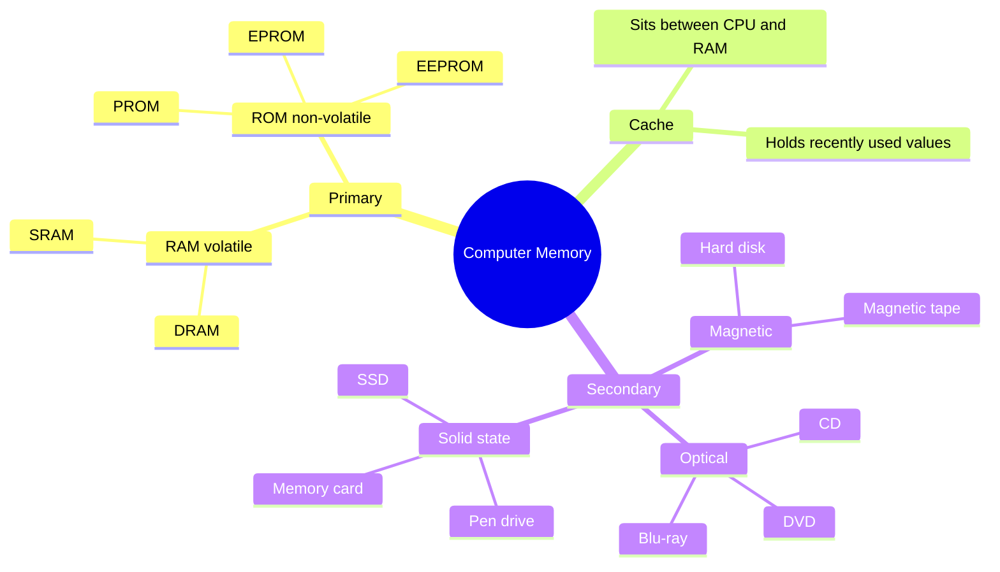

#### (A) Primary Memory

Primary memory is an **essential** component: program and data are loaded into it **before** processing, and the CPU interacts **directly** with it to read or write. It is of two types — **RAM** and **ROM**.

**RAM (Random Access Memory)** is a read/write memory: you can both read from and write to a location. It is **volatile** — as long as power is supplied it retains data, but the moment power is turned off **all contents are wiped out**. It stores data temporarily while the computer works; whenever the computer starts or an application launches, the required program and data are loaded into RAM. RAM is usually called **main memory** and is faster than secondary memory.

**ROM (Read-Only Memory)** is **non-volatile** — contents are not lost when power is turned off. Data and instructions are placed in ROM at the time of manufacturing and can't be changed thereafter. It is used as a **small but faster permanent** store for contents that are rarely changed — most importantly, the **startup program (boot loader)** that loads the operating system into primary memory. ROM also holds instructions to check basic hardware components during booting.

| Feature            | RAM                                    | ROM                                              |
| ------------------ | -------------------------------------- | ------------------------------------------------ |
| Operations allowed | Read **and** write                     | Read **only**                                    |
| Volatility         | **Volatile** — contents lost on power-off | **Non-volatile** — contents retained           |
| Contents           | Data/files the user is currently working on | Contents can't be changed after manufacture  |
| Speed              | Faster than ROM                         | **Slower than RAM**                             |
| Part of            | Primary memory                          | Primary memory                                   |

> [!warning] Both RAM **and** ROM are primary memory
> A very common slip is to answer "primary memory = RAM". ROM is primary memory too — it is just read-only. Equally common: "primary memory stores data permanently" is **False**, because the RAM half of it does not.

> [!example]
> ### Worked Example 1-2b — Why primary memory is "destructive write" but "non-destructive read" (Supplementary — Solved Q27, HOTS)
>
> **Given.** Primary memory is described with two opposite-sounding labels: **destructive write** and **non-destructive read**.
> **Find.** What each label means and why both are true of the same memory.
> **Concept.** Ask what happens to the *existing contents* of a memory word after each operation.
> **Work.**
> 1. **Read.** When a memory location is read from primary memory, the contents of the memory word **remain the same** — they are not altered. The read operation copies the value out; it does not destroy it. Hence **non-destructive read**.
> 2. **Write.** When a write operation takes place, the **previous contents of the memory word are overwritten**. The old value is gone. Hence **destructive write**.
> **Check.** Both labels describe the *effect on what was already stored*, not the effect on the CPU — which is why they can be opposite without contradicting each other. A useful mental image: reading is photocopying a page; writing is writing over it in pen.

**DRAM vs SRAM (Supplementary).** RAM chips come in two types:

| Property              | **SRAM** (Static RAM)                             | **DRAM** (Dynamic RAM)                                        |
| --------------------- | ------------------------------------------------- | ------------------------------------------------------------- |
| Retention             | Retains contents as long as power is connected    | Needs **regular refresh cycles** or contents are lost          |
| Transistors per bit   | **Six** transistors                                | **One transistor + one capacitor**                            |
| Interfacing           | Easy to interface                                  | More complicated to interface and control                     |
| Density and cost      | Lower density, costlier per bit                    | Much higher density → **much cheaper per bit**                |
| Speed                 | **Faster**                                         | Slower                                                        |
| Used as               | **Cache memory**                                   | **Main memory**                                               |

**Types of ROM (Supplementary):**

| Type       | Full form                                   | How it can be changed                  |
| ---------- | ------------------------------------------- | -------------------------------------- |
| **PROM**   | Programmable Read-Only Memory                | Programmed once by the user            |
| **EPROM**  | Erasable Programmable Read-Only Memory       | Erasable (traditionally by UV light) and reprogrammable |
| **EEPROM** | Electrically Erasable Programmable ROM       | Erasable **electrically**              |

> **Memory access time (Supplementary):** the amount of time taken to retrieve data required from memory, from the start of access until the data becomes available. RAM provides faster access than secondary memory, i.e. **less memory access time**.

#### (B) Cache Memory ⭐⭐⭐

RAM is faster than secondary storage, but **not as fast as the processor** — so because of RAM, a CPU may have to slow down. To speed up CPU operations, a **very high-speed memory is placed between the CPU and the primary memory**, known as **cache**.

Cache stores copies of the data from **frequently accessed primary memory locations**, reducing the average time required to access data from primary memory. When the CPU needs some data it **first examines the cache**; if the requirement is met it is read from the cache, otherwise the primary memory is accessed.

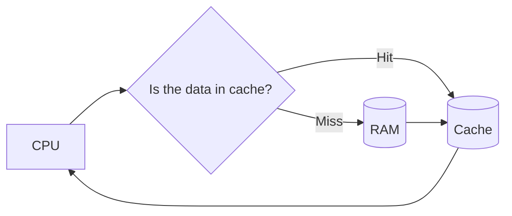

The supplementary book adds that cache is also called **CPU memory**, and is typically integrated directly onto the CPU chip or placed on a separate chip with a separate bus interconnected with the CPU.

> [!warning] Ordering trap
> **Cache is faster than RAM.** The statement "RAM operates much faster than cache memory" is **False** — this exact sentence appears as a True/False question in the supplementary book. The speed order is: **registers > cache > RAM > secondary storage**.

#### (C) Secondary Memory ⭐⭐

Primary memory has **limited storage capacity** and is either volatile (RAM) or read-only (ROM). So a computer system needs **auxiliary or secondary memory** to permanently store data or instructions for future use.

| Property                    | Primary memory                  | Secondary memory                                      |
| --------------------------- | ------------------------------- | ----------------------------------------------------- |
| Volatility                  | RAM volatile, ROM non-volatile  | **Non-volatile**                                      |
| Capacity                    | Limited                         | **Larger**                                            |
| Speed                       | Faster                          | Slower                                                |
| Cost                        | Costlier                        | Cheaper                                               |
| CPU access                  | **Direct**                      | **Cannot be accessed directly by the CPU** — contents must first be brought into main memory |

Examples: **Hard Disk Drive (HDD)**, **CD/DVD**, **Memory Card**, **pen drive**, **magnetic tape**. NCERT notes that **SSD**s now support very fast data transfer compared to earlier HDDs, and that data transfer between computers has become easier due to small, portable **flash/pen drives**.

**Two names and one mechanism the supplementary book adds:**

- Secondary memory is also called **auxiliary memory**, **auxiliary storage**, **external memory**, or **backing store** — all four mean the same thing, and any of them can appear in a question.
- *How* the CPU reaches it: secondary storage is accessed by the CPU **through input-output controllers or units**. So there is only **indirect contact between the CPU and the hard disk** — the work is done in RAM, and results are later stored on the hard disk. This is the mechanical reason behind the "cannot be accessed directly" row above.
- The supplementary book's picture of memory as a working space: the computer "temporarily keeps information and data to facilitate its working; when the task is executed or finished, it **clears the memory**, and this memory space becomes available for the next task."

#### 1.3.2a Secondary storage devices in detail (Supplementary) ⭐⭐

The amount of data a disk can hold is its **disk capacity**, measured in bytes, KB, MB and so on.

| Device            | Category                 | Capacity / key facts                                                                                          |
| ----------------- | ------------------------ | ------------------------------------------------------------------------------------------------------------- |
| **Hard Disk**     | Magnetic, secondary      | Non-volatile, high capacity, **1 GB to several terabytes**; solid rounded platters of magnetic material sealed in a case; generally fixed inside the computer so it isn't easily lost or damaged |
| **Magnetic Tape** | Magnetic, secondary      | Magnetic coatings store data on a thin tape; read/write is **slower because access is sequential**; convenient, secure, affordable — still used for record-keeping |
| **CD**            | Optical, offline         | Thin optical disk; a standard 120 mm CD holds **700 MB**; original CD-ROM drives transferred only 150 KB/s, latest go up to 72× ≈ 10800 KB/s |
| **DVD**           | Optical, offline         | Digital Versatile Disc / Digital Video Disc; recordable on one or both sides; **4.7 GB to 8.5 GB**             |
| **Blu-ray (BD)**  | Optical, offline         | Uses **blue** laser → higher data density; **25 GB single layer, 50 GB dual layer**; designed to supersede the DVD |
| **USB Pen Drive** | Solid state, offline     | Plugs into a USB port; less capacity than a hard disk but much more than a floppy or CD; **2, 4, 8, 16, 32, 64 GB** |
| **Memory Card**   | Solid state, offline     | Also called flash memory card; used with cameras, phones, music players, consoles; **8, 16, 32, 64, 128 GB**; high recording ability with **power-free storage** |

**Optical vs magnetic discs** (Unsolved Q31) — the difference is in *how the bit is physically recorded*:

| | **Magnetic disc** (hard disk, tape) | **Optical disc** (CD, DVD, Blu-ray) |
| - | ---------------------------------- | ----------------------------------- |
| How a bit is stored | As the **direction of magnetisation** of a tiny region of a magnetic coating | As **pits and lands** on the surface, read by the way they reflect a **laser** |
| Read/write mechanism | A magnetic head flying very close to the surface | A laser beam, with **no physical contact** |
| Capacity and speed | Higher capacity, faster access | Lower capacity, slower access |
| Vulnerability | Damaged by **magnetic fields** and by head crashes | Immune to magnetic fields; damaged by **scratches** |
| Typical role | Main working storage, fixed inside the machine | Distribution and archival, removable |

**CD vs DVD** (Unsolved Q34) — same optical family, different densities: a CD holds **700 MB** and a DVD **4.7–8.5 GB**, because the DVD uses a tighter track pitch, a shorter-wavelength laser, and can be recorded on **one or both sides** and in dual layers.

**Hard disk geometry** — data is stored on the platters in **tracks, sectors and cylinders** to keep it organised and easier to find.

```svg
<svg viewBox="0 0 340 230" xmlns="http://www.w3.org/2000/svg" style="max-width:100%;height:auto" font-family="sans-serif">
  <circle cx="110" cy="110" r="90" fill="#ffffff" stroke="#262626" stroke-width="1.5"/>
  <circle cx="110" cy="110" r="70" fill="none" stroke="#9e9e9e" stroke-width="1"/>
  <circle cx="110" cy="110" r="50" fill="none" stroke="#9e9e9e" stroke-width="1"/>
  <circle cx="110" cy="110" r="30" fill="none" stroke="#9e9e9e" stroke-width="1"/>
  <path d="M 110 110 L 110 20 A 90 90 0 0 1 173.6 46.4 Z" fill="#e3f2fd" stroke="#1565c0" stroke-width="1.5"/>
  <circle cx="110" cy="110" r="12" fill="#bdbdbd" stroke="#262626" stroke-width="1"/>
  <line x1="200" y1="110" x2="245" y2="110" stroke="#262626" stroke-width="1"/>
  <text x="250" y="114" font-size="12" fill="#262626">Track</text>
  <line x1="152" y1="48" x2="245" y2="34" stroke="#1565c0" stroke-width="1"/>
  <text x="250" y="38" font-size="12" fill="#1565c0">Sector</text>
  <text x="110" y="222" font-size="11" fill="#555555" text-anchor="middle">Cylinder = the same track on every platter, at one seek position</text>
</svg>
```

| Term         | Definition                                                                                                     |
| ------------ | -------------------------------------------------------------------------------------------------------------- |
| **Track**    | Each platter is divided into **concentric rings** called tracks; there are thousands per platter                |
| **Sector**   | Each track is divided into sectors, which **actually store the data**; a sector is the **basic unit of storage** and, as a rule, holds **512 bytes** |
| **Cylinder** | A set of tracks described by all the heads (on separate platters) **at a single seek position**; each cylinder is equidistant from the centre of the disk |

> [!note] Where the textbook's "512 bytes" now stands
> 512 bytes per sector is the traditional figure your board book gives, and it is what to write in an exam. Modern drives increasingly use a 4096-byte physical sector ("Advanced Format") while still presenting 512-byte logical sectors for compatibility — worth knowing, not worth writing unless asked.

> [!example]
> ### Worked Example 1-3 — Identifying a storage device from its description (Supplementary — Case-based Q1)
>
> **Given.** Six descriptions from a hardware dealer's catalogue.
> **Find.** The device being described, plus its storage category.
> **Concept.** Two independent decisions each time: (i) *which technology* the description points to — magnetic, optical, or a memory chip; (ii) *which category* it lives in — primary memory (chips the CPU addresses directly) vs. secondary/offline storage.
> **Work.**
>
> | Description                                                                                       | Device                | Category          |
> | ------------------------------------------------------------------------------------------------- | --------------------- | ----------------- |
> | Optical media using **one spiral track**, **red lasers**, dual-layering to increase capacity      | **DVD**               | Offline storage   |
> | Non-volatile memory chip, contents can't be altered, holds start-up routines (e.g. the BIOS)      | **ROM**               | Primary memory    |
> | Optical media using **concentric tracks**, allowing read and write **at the same time**           | **DVD-ROM**           | Offline storage   |
> | Non-volatile device using **flash memories** (millions of transistors wired in series on one board) | **Solid State Memory / Memory Card** | Offline storage |
> | Optical media using **blue laser** technology                                                     | **Blu-ray Disc**      | Offline storage   |
> | Magnetic disc, very large capacity, **fixed inside the case**, the main storage device            | **Hard Disk**         | Secondary memory  |
>
> **Check.** The two discriminators doing all the work here are *spiral vs. concentric* tracks and *red vs. blue* laser. If a description gives neither, it isn't an optical medium — look for "magnetic" or "chip".

---

## 1.4 Data Transfer between Memory and CPU ⭐⭐⭐

Data must be transferred between the CPU and primary memory, and between primary and secondary memory. Data are transferred between components using **physical wires called a bus** — for example between a USB port and a hard disk, or between a hard disk and main memory.

> **Bus (Supplementary definition):** a collection of wires that transfers data between computer components, i.e. carries binary information to or from input/output devices and memory. It usually transmits binary numbers **one bit per wire**.

Bus is of three types, which **collectively make the system bus**:

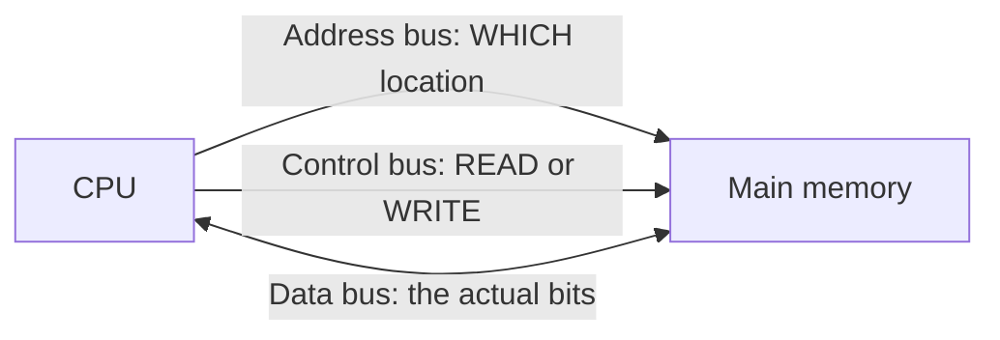

| Bus             | What it carries                                                        | Direction (per NCERT)      |
| --------------- | ---------------------------------------------------------------------- | -------------------------- |
| **Data bus**    | The actual data, in binary form, between different components           | **Bidirectional**          |
| **Address bus** | Addresses, between CPU and main memory — the location to read or write | **Unidirectional**         |
| **Control bus** | Control signals between different components (read/write and associated I/O operations) | **Unidirectional** |

Apart from these, a separate **I/O (Input-Output) bus** connects input, output and other external devices to the system (supplementary).

### 1.4a How a read and a write actually happen

Since the CPU interacts directly with main memory, anything entered from an input device, or fetched from the hard disk, must first be **placed in main memory** for further processing.

**Write cycle:**
1. The CPU places the **address** of the target location on the **address bus**.
2. The CPU asserts the **write** signal on the **control bus**.
3. The CPU places the **data** on the **data bus**, which is then written to the specified address.

**Read cycle:**
1. The CPU places the **address** on the address bus.
2. The CPU asserts the **read** signal on the control bus.
3. The data is placed on the **data bus** by a dedicated hardware unit called the **memory controller**, which manages the flow of data into and out of the computer's main memory.

> **Why is the data bus bidirectional but the address bus unidirectional?** (NCERT Exercise Q8) Because the CPU may need to **read from** memory *or* **write to** memory, so data must be able to travel both ways. Addresses, on the other hand, are only ever **generated by the CPU and sent to memory** — memory never sends an address back — so one direction suffices.

### 1.4b Bus width and how much memory can be addressed ⭐⭐⭐

**General rule first, specific case second.**

**Step 1 — What a bus width means.** The **width** of a bus is the number of parallel wires in it, and each wire carries one bit. So an address bus of width \( n \) puts an \( n \)-bit binary number on the wires at once.

**Step 2 — Count the distinct patterns.** An \( n \)-bit binary number has \( 2 \) choices per bit, independently, so the number of distinct addresses is

\[
\text{addressable locations} = 2^{n}
\]

**Step 3 — Boxed general result.**

\[
\boxed{\text{An } n\text{-bit address bus can address } 2^{n} \text{ distinct memory locations.}}
\]

**Step 4 — The specific cases both books use.**

| Address-bus width \( n \) | \( 2^{n} \) locations | In memory units |
| ------------------------- | --------------------- | --------------- |
| 16 bits                   | 65 536                | 64 KB           |
| 24 bits                   | 16 777 216            | 16 MB           |
| 32 bits                   | 4 294 967 296         | 4 GB            |
| 36 bits                   | 68 719 476 736        | 64 GB           |
| 64 bits                   | \( 2^{64} \)          | 16 EB           |

Compare this with NCERT's Table 1.2 (§1.5): the "maximum memory size" column for each microprocessor generation is exactly \( 2^{n} \) for that generation's addressing width — 1 KB = \( 2^{10} \), 1 MB = \( 2^{20} \), 16 MB = \( 2^{24} \), 4 GB = \( 2^{32} \), 64 GB = \( 2^{36} \). This is **NCERT Activity 1.1**, done.

> [!warning] ⚠️ Two errors in the supplementary book's bus section — don't copy them
> 1. *"Address bus consists of 16 wires, thus its width is 16 bits"* and *"Data Bus: It is an 8-bit bus"* are **not general facts** — they describe an early 8-bit microprocessor. Bus widths vary by processor; a 64-bit CPU does not have a 16-bit address bus.
> 2. Solved Q28 states *"A 16-bit binary number allows 2¹⁶ or 32,000 different numbers."* \( 2^{16} = 65\,536 \), not 32 000. The formula is right; the arithmetic printed next to it is wrong.
>
> The supplementary book's own other statement — *"a 64-bit address bus can transfer \( 2^{64} \) memory locations"* — is the correct application of the rule, and is the one to follow.

> **CPU word length (Supplementary):** the size of the data bus from memory to CPU equals the number of bits in an instruction, called the **CPU word length**. The number of parallel wires is the **bus width**.

### 1.4c Four connection terms the exercises assume you know ⭐⭐

These appear in the supplementary book's *Memory Bytes* list and unsolved questions but are never defined in its chapter body — which is exactly why they get missed.

| Term | Definition | Why it belongs here |
| ---- | ---------- | ------------------- |
| **MAR** (Memory Address Register) | The CPU register that holds the address of the memory location to be read from or written to. The **address bus carries the address to the MAR** | It is the CPU-side end of the address bus |
| **Buffer** | A **data area shared by hardware devices or program processes that operate at different speeds, or with different sets of priorities** | It is how a fast CPU and a slow printer can work together without the CPU waiting — data is dropped into the buffer and the device drains it at its own pace |
| **Port** | A **physical connection point (socket or interface) on a computer through which a peripheral device is attached and data is transferred**. Examples: **USB** port, **HDMI** and **VGA** ports for displays, **Ethernet (RJ-45)** for networking, the **3.5 mm audio jack**, and the older **serial** and **parallel** ports | Unsolved Q33 asks for it by name; it is the outside end of the I/O bus |
| **I/O controller** | The dedicated unit through which the CPU reaches an input/output device or secondary storage, rather than addressing it directly | It is why §1.3.2(C) says secondary storage "cannot be accessed directly by the CPU" |

> **Where the memory controller fits.** §1.4a already named the **memory controller** — the dedicated hardware that places data on the data bus during a read and manages the flow of data into and out of main memory. An **I/O controller** does the analogous job for a peripheral. Both exist so the CPU can issue one request and get on with something else instead of driving the device signal by signal.

---

## 1.5 Microprocessors ⭐⭐

In earlier days a computer's CPU occupied a large room or multiple cabinets. With advancing technology the physical size shrank until a whole CPU fits on a single microchip. **A processor (CPU) implemented on a single microchip is called a microprocessor.** Nowadays almost all CPUs are microprocessors, so for practical purposes the terms are used **synonymously**.

A microprocessor is a small-sized electronic component inside a computer that carries out data processing plus arithmetic and logical operations. It is built over an **integrated circuit** comprising millions of small components like **resistors, transistors and diodes**. Currently available microprocessors can process **millions of instructions per millisecond**.

### 1.5.1 Microprocessor Specifications ⭐⭐

Microprocessors are classified on chip type, word size, memory size, clock speed and cores.

| Specification    | Definition                                                                                  | The number to remember                                                    |
| ---------------- | ------------------------------------------------------------------------------------------- | ------------------------------------------------------------------------- |
| **Word size**    | The **maximum number of bits a microprocessor can process at a time**                       | Earlier 8 bits; at present **minimum 16 bits, maximum 64 bits**           |
| **Memory size**  | Size of RAM, which depends on word size                                                     | Initially 4 MB (4/8-bit words); with 64-bit words, RAM up to **16 EB**    |
| **Clock speed**  | The number of **pulses generated per second** by the internal clock — i.e. the speed at which instructions execute | Earlier Hz and kHz; now **GHz** (billions of pulses per second)           |
| **Cores**        | A **core** is a basic computation unit of the CPU                                           | 2 = dual-core, 4 = quad-core, 8 = octa-core                               |

Earlier processors had only one computation unit, so they could perform only one task at a time. With **multicore** processors a computer can execute **multiple tasks**, increasing system performance.

**Generations of microprocessor (NCERT Table 1.2):**

| Generation | Era             | Chip type | Word size  | Max memory | Clock speed      | Cores     | Example                       |
| ---------- | --------------- | --------- | ---------- | ---------- | ---------------- | --------- | ----------------------------- |
| First      | 1971–73         | LSI       | 4 / 8 bit  | 1 KB       | 108 kHz–200 kHz  | Single    | Intel 8080                    |
| Second     | 1974–78         | LSI       | 8 bit      | 1 MB       | up to 2 MHz      | Single    | Motorola 6800, Intel 8085     |
| Third      | 1979–80         | VLSI      | 16 bit     | 16 MB      | 4 MHz–6 MHz      | Single    | Intel 8086                    |
| Fourth     | 1981–95         | VLSI      | 32 bit     | 4 GB       | up to 133 MHz    | Single    | Intel 80386, Motorola 68030   |
| Fifth      | 1995 till date  | SLSI      | 64 bit     | 64 GB      | 533 MHz–34 GHz   | Multicore | Pentium, Celeron, Xeon        |

> [!note] One printed figure to treat with care
> The fifth-generation clock speed is printed as "533 MHz – 34 GHz". Commercial desktop processors have not reached anywhere near 34 GHz; this is almost certainly a typesetting slip for **3.4 GHz**. Reproduce the table as printed if the question quotes it, but don't carry "34 GHz" into a sentence of your own.

### 1.5.2 Microcontrollers ⭐⭐

A **microcontroller** is a small computing device which has a **CPU, a fixed amount of RAM, ROM and other peripherals all embedded on a single chip** — as compared to a microprocessor, which has **only a CPU** on the chip.

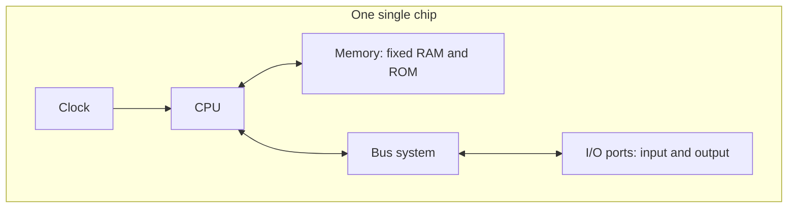

Because everything needed is already on the chip, a microcontroller is **embedded inside another device** to perform one specific functionality. Examples: **keyboard, mouse, washing machine, digital camera, pendrive, remote controller, microwave**. Since they are designed for specific tasks only, their **size and cost are reduced**.

NCERT's example: the microcontroller in a fully automatic washing machine controls the washing cycle with **no human intervention** — filling water, soaking, washing, draining, spin dry — permitting repetitive execution of tedious tasks automatically.

| Feature              | **Microprocessor**                            | **Microcontroller**                                       |
| -------------------- | --------------------------------------------- | --------------------------------------------------------- |
| What's on the chip   | **Only the CPU**                              | CPU + fixed RAM + ROM + other peripherals                 |
| RAM/ROM              | External, and expandable                       | **Fixed amount**, on-chip                                 |
| Designed for         | General-purpose computing                      | **One specific task**                                     |
| Size and cost        | Larger, costlier system overall                 | **Reduced** size and cost                                 |
| Typical host         | A computer                                      | An **embedded** device — washing machine, microwave, remote |

> **Why do smart home appliances use a microcontroller rather than a microprocessor?** (NCERT Exercise Q10) Because an appliance performs a **single, fixed, repetitive task**. It doesn't need expandable memory or general-purpose computing — it needs a self-contained, low-cost, small chip that already carries its own RAM, ROM and I/O ports. A microprocessor would require external memory and support chips, making the appliance bigger, costlier and no more capable.

### 1.5.3 Graphics Processing Unit (GPU) ⭐

Unsolved Q36 asks about the GPU's role in a smartphone, but neither chapter defines it. Honestly stated:

A **GPU (Graphics Processing Unit)** is a **specialised processor built to perform very many simple calculations in parallel**, which is exactly what rendering an image, a video frame or an animation requires — every pixel needs similar arithmetic done to it at the same time. Where a CPU has a few powerful cores optimised for running one instruction stream quickly, a GPU has a great many simpler cores optimised for doing the same operation to a large block of data at once.

In a smartphone, the CPU, the GPU and the **modem/communications processor** are usually fabricated together on a single chip called a **System on Chip (SoC)** — the same integration idea as §1.2b, taken one step further. The GPU **offloads** display rendering, camera image processing, video decoding, gaming and UI animation from the CPU, which leaves the CPU free for general work and reduces power consumption for those tasks.

> [!note] On the wording of that question
> "The role of the GPU with regard to the smartphone communications processor" is loosely phrased — the GPU does not process communications. What is true is that both sit on the same SoC alongside the CPU, dividing the workload. Answer in terms of **parallel graphics processing offloaded from the CPU, integrated on one SoC**.

### 1.5.4 Classification of digital computers ⭐

Unsolved Q64 asks you to "discuss the classification of digital computers", but **neither chapter develops it** — so here is the standard four-way classification, flagged as external to both books:

| Class              | Size and users                                  | Typical use                                                    |
| ------------------ | ----------------------------------------------- | -------------------------------------------------------------- |
| **Microcomputer**  | Single user; desktop, laptop, tablet, smartphone | Personal and small-office computing                             |
| **Minicomputer**   | Mid-sized; supports several users at once        | Departmental systems, process control *(largely historical)*    |
| **Mainframe**      | Large, many hundreds or thousands of users       | Banking, insurance, railway reservation — huge transaction volumes |
| **Supercomputer**  | The fastest available; massively parallel        | Weather modelling, molecular simulation, nuclear and space research |

NCERT's own spread — "a high-end server to personal desktop, laptop, tablet computer, or a smartphone" (§1.1) — is the same idea stated as a range rather than as classes.

---

## 1.6 Data and Information ⭐⭐

A computer is primarily for **processing data**, and a computer system considers **everything** as data — instructions, pictures, songs, videos, documents. Data can also be **raw and unorganised facts that are processed to get meaningful information**.

| Term            | Definition                                                                    | Example (supplementary)                           |
| --------------- | ----------------------------------------------------------------------------- | ------------------------------------------------- |
| **Data**        | Raw facts or figures — no meaning when presented as such                      | `106`, `"Shaurya"`, `"Class 11"`                  |
| **Information** | A collection of data organised in a particular manner to generate **meaning** | "Shaurya is a Class 11 student with Enrolment number 106" |

The process of converting data into meaningful information is the **Information Processing Cycle**, which is the same I-P-O cycle from §1.1.0a.

> [!warning] NCERT says this outright
> People sometimes use the terms **data, information and knowledge interchangeably, which is incorrect.** Data is raw; information is processed data; knowledge is what you build from information.

### 1.6.1 Data and Its Types ⭐⭐⭐

Internally everything is stored in **binary (0 and 1)**, but externally data can be input as text — English alphabets A–Z, a–z, numerals 0–9, special symbols like `@`, `#` — in other languages, or read from files. Because input data may come from different sources, it may be in different **formats**: an image is a collection of **Red, Green, Blue (RGB) pixels**, a video is made up of **frames**, and a fee receipt is made of **numeric and non-numeric characters**.

Primarily there are **three types of data**:

| Type                | Definition                                                                              | Examples                                                                 |
| ------------------- | --------------------------------------------------------------------------------------- | ------------------------------------------------------------------------ |
| **Structured**      | Follows a **strict record structure** and is easy to comprehend; pre-specified tabular format | Attendance table (roll no, name, month, %); sales transactions; online railway ticket bookings; ATM transactions |
| **Unstructured**    | **Not organised** in a pre-defined record format                                         | Audio and video files, graphics, text documents, social media posts, satellite images, a report card mixing text and a chart |
| **Semi-structured** | **No well-defined structure**, but maintains **internal tags or markings** separating data elements | Email document, HTML page, comma-separated values (CSV file)             |

NCERT's semi-structured example is worth seeing in raw form — each value is preceded by a **tag** that says how to interpret it, but there is no fixed record layout:

```text
Name: Mohan   Month: July   Class: XI   Attendance: 98
Name: Sohan   Month: July   Class: XI   Attendance: 65
Name: Sheen   Month: July   Class: XI   Attendance: 85
Name: Geet    Month: May    Class: XI   Attendance: 82
Name: Geet    Month: July   Class: XI   Attendance: 94
```

#### 1.6.1a How characters are actually encoded — ASCII, ISCII, Unicode ⭐⭐

Neither chapter body explains this, but the supplementary book's objective section asks for it twice — *"___ is a new universal coding standard adopted by all new platforms"* and *"The expanded form of ISCII is ___"*. Since everything is stored in binary, some agreed table must say **which binary pattern means which character**. That table is a **character encoding standard**.

| Standard    | Expansion                                          | Size                   | What it covers                                                                 |
| ----------- | -------------------------------------------------- | ---------------------- | ------------------------------------------------------------------------------- |
| **ASCII**   | American Standard Code for Information Interchange | 7 bits → 128 characters | English letters, digits, punctuation, control codes. Extended ASCII uses 8 bits → 256 |
| **ISCII**   | **Indian Script Code for Information Interchange** | 8 bits → 256 characters | Keeps the lower 128 identical to ASCII and uses the upper 128 for **Indian scripts** — Devanagari, Bengali, Tamil and others |
| **Unicode** | *(no expansion — it is the name)*                  | Variable (UTF-8, UTF-16, UTF-32) | A **single universal standard** aiming to cover every script in the world, which is why it is "adopted by all new platforms" |

So the two answers your supplementary book wants are **Unicode** for the universal-standard blank and **ISCII** for the Indian-script one.

> [!warning] ⚠️ The ISCII expansion is printed wrongly in the supplementary book
> Its MCQ options are "International Standard Code…", "**Indian Standard Code**…", "International Script Code…" and "None of these", and the intended key is *Indian Standard Code for Information Interchange*.
> The actual standard, published by the Bureau of Indian Standards as **IS 13194:1991**, is **Indian *Script* Code for Information Interchange**. The correct option is not among the four offered.
> **What to do in the exam:** pick the book's intended option (Indian Standard Code…) in its own MCQ, since "Indian Script Code" isn't offered — but if you are asked to *write* the expansion, write **Indian Script Code for Information Interchange**.

> [!note] Forward link
> Python 3 strings are **Unicode** strings. That is why you will be able to put Hindi, Bengali or an emoji straight into a `str` in the programming chapters without doing anything special — the encoding work is already done for you.

**Types of data you deal with while browsing the Internet** (NCERT Exercise Q11) — a direct application of the three-way classification:

| While browsing you handle… | Type |
| -------------------------- | ---- |
| HTML pages, XML feeds, CSV downloads, JSON from a web app | **Semi-structured** |
| Images, videos, audio streams, social media posts, memes | **Unstructured** |
| Train timetables, live scores, price tables, your order history | **Structured** |

> [!example]
> ### Worked Example 1-4 — Categorising data (NCERT Exercise Q12)
>
> **Given.** Newspaper · Cricket Match Score · HTML Page · Patient records in a hospital.
> **Find.** Structured, semi-structured, or unstructured for each.
> **Concept.** Ask two questions in order: (1) Is there a **fixed record format** with the same fields in every record? → structured. (2) If not, are there **tags or markings** separating the data elements? → semi-structured. (3) Neither? → unstructured.
> **Work.**
>
> | Item                    | Category                | Why                                                                              |
> | ----------------------- | ----------------------- | -------------------------------------------------------------------------------- |
> | **Newspaper**           | **Unstructured**        | Headlines, articles, photos and advertisements in no fixed record format         |
> | **Cricket Match Score** | **Structured** (as a scorecard) | The scorecard is a fixed table: batsman, runs, balls, 4s, 6s — same fields every row |
> | **HTML Page**           | **Semi-structured**     | Tags mark up every element, but there is no fixed record schema                  |
> | **Patient records in a hospital** | **Structured** (as a database) | Fixed fields: patient ID, name, age, diagnosis, admission date         |
>
> **Check — and an honest caveat.** Two of these depend on the *actual artefact*, not the label. Live ball-by-ball commentary alongside a scorecard is unstructured text. A patient's file that also contains scanned X-rays and handwritten notes is unstructured for those parts. A good answer names the category **and** the reason; the reason is what the marks are for.

### 1.6.2 Data Capturing, Storage and Retrieval ⭐

To process data we must first input or **capture** it, then **store** it in a file or database, then **retrieve** it whenever it is to be processed.

| Stage             | What it involves                                                                       | The difficulty                                                                 |
| ----------------- | -------------------------------------------------------------------------------------- | ------------------------------------------------------------------------------ |
| **Data Capturing** | Gathering data from different sources in digital form — keyboard, barcode readers at shopping outlets, social media comments, remote sensors on an earth-orbiting satellite | **Heterogeneity** among data sources makes capturing complex                    |
| **Data Storage**   | Storing captured data for later processing                                             | Data is produced at a very high rate; offset by falling cost of storage devices. Large organisations deploy **data servers** — computers with larger and faster storage — but their hardware, software and maintenance cost is high, especially for small organisations and startups |
| **Data Retrieval** | Fetching data from storage devices for processing as per user requirement              | As databases grow, search and retrieval within an acceptable time gets harder. **Minimising data access time is crucial** |

### 1.6.3 Data Deletion and Recovery ⭐⭐

One of the biggest threats to digital data is its **deletion** — accidental erasure, a storage device malfunction or crash, or intentional deletion by a hacker or malware.

**Why deleted data isn't really gone.** Deleting digitally stored data means changing the details of data **at bit level**, which is very time-consuming. Therefore, when data is simply deleted, its **address entry is marked as free** and that much space is shown as empty to the user, **without actually deleting the data**.

**Data recovery** is the process of retrieving deleted, corrupted and lost data from secondary storage devices. It is possible **only if the contents or memory space marked as deleted have not been overwritten** by some other data.

This one mechanism creates **two opposite security concerns**:

| Concern                                        | Risk                                                                       | Mitigation                                                                               |
| ---------------------------------------------- | -------------------------------------------------------------------------- | ---------------------------------------------------------------------------------------- |
| **Unwanted deletion** by an unauthorised person or software | Losing your data                                                  | Limit access to the computer system; use **passwords** for user accounts and files; **encrypt** files to protect them from unwanted modification |
| **Unwanted recovery** by an unauthorised user or software   | Someone recovers data from your discarded, broken or malfunctioning device — a threat to **data confidentiality** | Use **proper tools to delete or shred data** before disposing of any old or faulty storage device |

> **Points to Ponder.** Emptying the Recycle Bin, or `Shift + Delete`, does **not** erase the file's contents. It only frees the address entry. This is simultaneously why recovery software works and why you must shred a disk before selling it.

---

## 1.7 Software ⭐⭐⭐

Hardware is of no use on its own — it needs to be operated by a set of instructions. These sets of instructions are **software**: the component of a computer system which we **cannot touch or view physically**. Software comprises the instructions and data to be processed using the hardware; software and hardware complete any task **together**.

> **Program vs software (Supplementary).** A **program** is a **sequence of instructions written to solve a particular problem and to make the hardware run**. **Software** is a set of programs designed to perform a well-defined function — all the programs used in a computer to perform specific tasks are called software. So: one program solves one problem; software is the package. And a program *in execution* is a **process** — see §1.8.2.

| | **Hardware** | **Software** |
| - | ------------ | ------------ |
| Nature | **Physical** components that can be seen and touched | A set of **instructions and data** that makes hardware functional |
| Examples | RAM, keyboard, printer, monitor, CPU | Ubuntu, Windows 7/10, LibreOffice, MS Word, VLC Player, GIMP |
| Can it work alone? | **No** — needs software to be operational | **No** — needs hardware to run on |

### 1.7.1 Need of Software ⭐⭐

The sole purpose of software is to **make the computer hardware useful and operational**. Software knows how to make different hardware components work and communicate with each other **and with the end user**. We cannot instruct the hardware directly — **software acts as an interface between human users and the hardware**.

Depending on mode of interaction with hardware and functions performed, software is broadly classified into **three categories** (NCERT): **System software**, **Programming tools**, and **Application software**.

```tikz
\begin{tikzpicture}[thick, scale=0.9, level distance=1.5cm,
  level 1/.style={sibling distance=4.4cm},
  level 2/.style={sibling distance=2.0cm}]
  \node {Software}
    child { node {System}
      child { node {OS} }
      child { node {Utilities} }
      child { node {Drivers} } }
    child { node {Prog. tools}
      child { node {Editors} }
      child { node {Translators} }
      child { node {IDEs} } }
    child { node {Application}
      child { node {General} }
      child { node {Custom} } };
\end{tikzpicture}
```

The supplementary book uses a **four-way** split instead — System, Application, **Utility**, Programming Tools — promoting utilities to a top-level category. NCERT nests utilities *inside* system software. Follow NCERT's three-way split unless your board book is the supplementary one; either way, utilities are system-level software, never application software.

> [!warning] ⚠️ The asymmetry both books state explicitly
> A computer system **can work without application software, but it cannot work without system software.** You can use a computer with no word processor installed; you cannot use it at all with no operating system. So the use of a computer is possible in the absence of application software.

### 1.7.2 System Software ⭐⭐⭐

Software that provides the **basic functionality to operate a computer by interacting directly with its constituent hardware** is system software. It knows how to operate and use different hardware components, and provides services directly to the end user or to other software.

**Functions of system software (Supplementary):**
1. Reading data and receiving information
2. Translating data and instructions
3. Controlling all the peripheral devices
4. Processing and generating output

Three kinds:

**(A) Operating System** — a system software that **operates the computer**. It is the most basic system software, **without which other software cannot work**. It manages other application programs and provides access and security to users. Popular examples: **Windows, Linux, Macintosh, Ubuntu, Fedora, Android, iOS**. (Full treatment in §1.8.)

**(B) System Utilities** — software used for **maintenance and configuration** of the computer system. Two families:

| Family                                   | Examples                                                              |
| ---------------------------------------- | --------------------------------------------------------------------- |
| **Shipped with** the operating system     | Disk defragmentation tool, formatting utility, system restore utility  |
| **Not shipped**, installed to improve performance | Anti-virus software, disk cleaner tool, disk compression software |

Utilities in detail (Supplementary) — utilities perform **housekeeping**; without them the computer still works, but with the right ones loaded it becomes more reliable and its processing speed increases:

| Utility                | What it does                                                                                                     |
| ---------------------- | ----------------------------------------------------------------------------------------------------------------- |
| **Antivirus**          | Detects and removes computer viruses or infected areas; if it can't remove a virus it **neutralises** it; may alert the user, flag the infected program, or kill the virus |
| **Disk Defragmenter**  | Memory is used in small chunks randomly; when no chunk of the right size is free, the OS **fragments** files, slowing access. A defragmenter scans for fragmented files and **brings all the fragments together** |
| **Backup Utility**     | Duplicates disk information — a copy of complete or partial data onto another external disk, DVD or CD, so files can be **restored** after a crash or system failure |
| **Compression Utility**| Stores files in a special format that takes less space; compressed files can be **restored to their original form**; reduces resource usage and makes network transmission easier |
| **Disk Cleaner**       | Scans for files not accessed/used since long, which may be occupying a huge amount of space, and **prompts the user to delete** them (taking a backup first if they matter) |

**(C) Device Drivers** — a device driver's purpose is to ensure the **proper functioning of a particular device**. The operating system handles overall working, but new devices with diverse characteristics are added every day and the OS alone cannot operate all of them. So the responsibility for **overall control, operation and management of a particular device at the hardware level is delegated to its device driver**.

The device driver **acts as an interface between the device and the operating system**, providing required services by **hiding the details** of operations performed at the hardware level. NCERT's analogy: *just like a language translator, a device driver acts as a mediator between the operating system and the attached device.* Drivers exist for printers, scanners, displays, web cameras, modems, DVD readers; nowadays most are inbuilt and need no special installation.

### 1.7.3 Programming Tools ⭐⭐⭐

Computers and humans understand **completely different languages**: humans write programs in high-level language, computers understand machine language. So there is a continuous need for conversion from high level to machine level, for which **translators** are needed; and to write the instructions, **code editors** (e.g. IDLE in Python) are needed.

#### (A) Classification of Programming Languages

It is very difficult for a human to write instructions in the form of 1s and 0s, so programming languages were developed to simplify coding. Two major categories:

| | **Low-level languages** | **High-level languages** |
| - | ------------------------ | ------------------------ |
| Machine dependence | **Machine dependent** | **Machine independent** |
| Members | Machine language, Assembly language | C++, Java, Python, C, BASIC |
| Written using | Machine language: 1s and 0s, directly understood and executed by the computer. Assembly: **English-like words and symbols** instead of 1s and 0s | English-like sentences following a set of rules, similar to natural languages |
| Difficulty | Hard — you must remember all **operation codes** and **machine addresses**; finding errors is difficult | Simpler to write and debug |
| Portability | Assembly code is **computer specific** — code written for one type of CPU cannot be used for another | Portable, but **not directly understood** by the computer, so a translator is required |

#### (B) Language Translators ⭐⭐⭐

The program code written in assembly or high-level language is the **source code**. A translator converts it into machine-understandable form called **object (machine) code**.

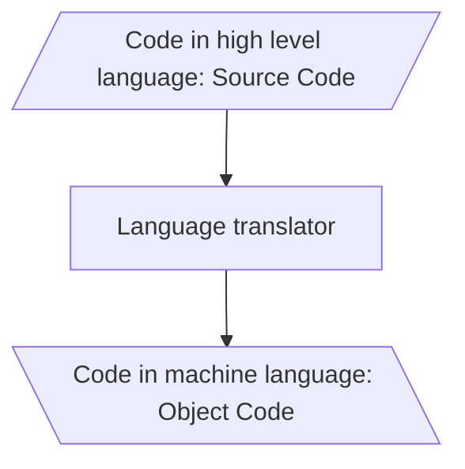

Three types of translators:

| Translator      | Input                         | What it does                                                                                          | Needed at run time?          |
| --------------- | ----------------------------- | ------------------------------------------------------------------------------------------------------ | ---------------------------- |
| **Assembler**   | Assembly language source      | Converts assembly to machine code. Each assembler understands **one specific microprocessor instruction set**, so **the machine code is not portable** | No                           |
| **Compiler**    | High-level language source    | Converts the **complete source program as a whole, in one go**, into machine code. If the code follows all syntactic rules it is executed | **No** — once translated, the compiler is not needed |
| **Interpreter** | High-level language source    | Translates **one line at a time**: takes a line, converts it to executable code if syntactically correct, executes it, then repeats for all lines | **Yes** — always needed whenever the source is executed |

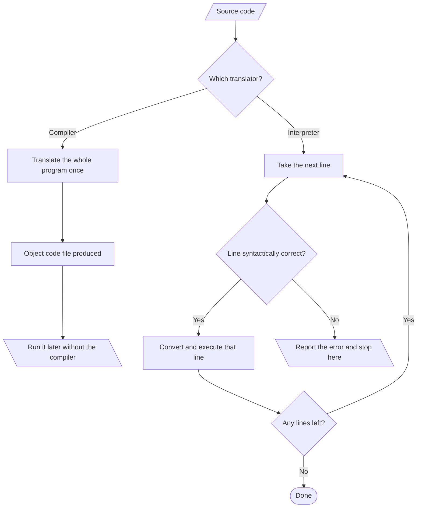

> [!warning] ⚠️ Compiler vs Interpreter — the four differences that get asked
>
> | # | Compiler | Interpreter |
> | - | -------- | ----------- |
> | 1 | Debugs the **whole program in one go** | Debugs it **line by line** |
> | 2 | Errors are displayed **at the end** of compilation, with line numbers | Errors are displayed **line-wise**; it does not move to the next line or execute further until the current error is removed |
> | 3 | Occupies **more memory**, because it generates an executable/object file that must reside in memory; but it need not compile every time | **More memory wastage at run time**, since the program is interpreted line-by-line **every time** it is executed |
> | 4 | **Less execution time** | More execution time |
>
> Languages that use an interpreter include **Python, PHP, MATLAB**. Languages that use a compiler include **C and C++**.

> **Why is the execution time of machine code less than that of source code?** (NCERT Exercise Q3) Because machine code is already in the form the CPU can execute directly. Source code must first be **translated** — and with an interpreter, that translation happens again on every run — so the translation time is added to the execution time.

#### (C) Program Development Tools ⭐

Whenever we decide to write a program we need a **text editor** — software that lets us create a text file where we type instructions and store the file as the source code. Then an appropriate translator is used to get the object code for execution.

To simplify program development there is software called an **Integrated Development Environment (IDE)**, consisting of a **text editor, building tools and a debugger**. A program can be typed, compiled and debugged from the IDE directly. Examples: **Python IDLE, NetBeans, Eclipse, Atom, Lazarus**.

> **Debugger:** as the name implies, the software to **detect and correct errors** in the source code.

### 1.7.4 Application Software ⭐⭐

System software provides the core functionality, but different users need the computer for different purposes. **Application software is the specific software that works on top of the system software** to cater to the end-user's requirements — making a document, making a presentation, handling inventory, managing an employee database.

| Category                                       | Definition                                                                            | Examples                                                                                     |
| ---------------------------------------------- | ------------------------------------------------------------------------------------- | -------------------------------------------------------------------------------------------- |
| **General Purpose Software** (Office Tools)    | Developed for **generic** applications, to cater to a bigger audience in general; ready-made, used by end users as per their requirements | LibreOffice Calc, Adobe Photoshop, GIMP, Mozilla web browser, iTunes, MS Word, MS Excel, MS Access |
| **Customised / Specific Purpose Software** (Domain Specific Tool) | **Custom or tailor-made** to meet the requirements of a specific organisation or individual; **cannot** simply be installed and used by another customer, since requirements differ | Websites, school management software, accounting software, Banking System, Payroll Management System, Inventory Management, Billing System |

Both books use the same analogy: general purpose software is **buying ready-made cloth**; customised software is **buying a piece of cloth and getting a garment tailored** to the fitting, colour and fabric of your choice.

### 1.7.5 Proprietary or Free and Open Source Software ⭐⭐

| Category                                | Source code               | Cost to use            | Examples                                          |
| --------------------------------------- | ------------------------- | ---------------------- | ------------------------------------------------- |
| **FOSS** (Free and Open Source Software) | **Provided freely** to the public, so anyone with the knowledge can improve it or add functionality | Free                   | Ubuntu, Python, LibreOffice, OpenOffice, Mozilla Firefox |
| **Freeware**                             | **May not be available**   | Free to use            | Skype, Adobe Reader                               |
| **Proprietary**                          | Not available              | **Must be purchased** from the vendor who holds the copyright | Microsoft Windows, Tally, Quickheal               |

> [!warning] Free ≠ open source
> Freeware is free **to use**; FOSS is free **to use and to read, modify and redistribute the source code of**. Adobe Reader costs nothing and is still not open source. Which category a piece of software falls into depends entirely on the **terms and conditions** set by the person or group who developed and released it.

---

## 1.8 Operating System ⭐⭐⭐

An **operating system (OS)** can be considered a **resource manager** which manages all the resources of a computer — its hardware including **CPU, RAM, Disk, Network** and other input-output devices. It also controls various application software and device drivers, manages system security, and handles access by different users. It is **the most important system software**. Examples: Windows, Linux, Android, Macintosh.

> [!note] Why "resource manager" is the right phrase
> The OS manages different resources like main memory, CPU and I/O devices **so that each resource is used optimally and system performance does not deteriorate**. Every function in §1.8.2 is a special case of that one job.

**The two primary objectives of an operating system:**

1. **Provide services for building and running application programs.** When an application needs to run, it is the OS which **loads that program into memory and allocates it to the CPU** for execution. When multiple programs need to run, the OS **decides the order of execution**.
2. **Provide an interface to the user** through which the user can interact with the computer. A **user interface** is a software component, part of the OS, whose job is to take commands or inputs from a user for the OS to process.

**Need for an OS (Supplementary), in seven points:** user interface · program execution · resource allocation · manipulation of the file system · I/O operations · error detection and handling · controlling and allocating system hardware and software resources to users or programs as per requirement.

Every computer must have an operating system to run other programs. **DOS (Disk Operating System), UNIX, LINUX and Windows** are commonly used ones. An OS is the **first program executed on a computer after the BIOS**.

> **Booting (Supplementary):** the process of starting your computer and loading the operating system.
> **Points to Ponder — who brings the OS into RAM?** The **boot loader / bootstrap program stored in ROM** (the BIOS firmware). It can't be the OS itself, because at that moment the OS isn't in memory yet. This is precisely what §1.3.2(A) meant by "ROM stores the startup program that loads the operating system into primary memory."

### 1.8.1 OS User Interface ⭐⭐

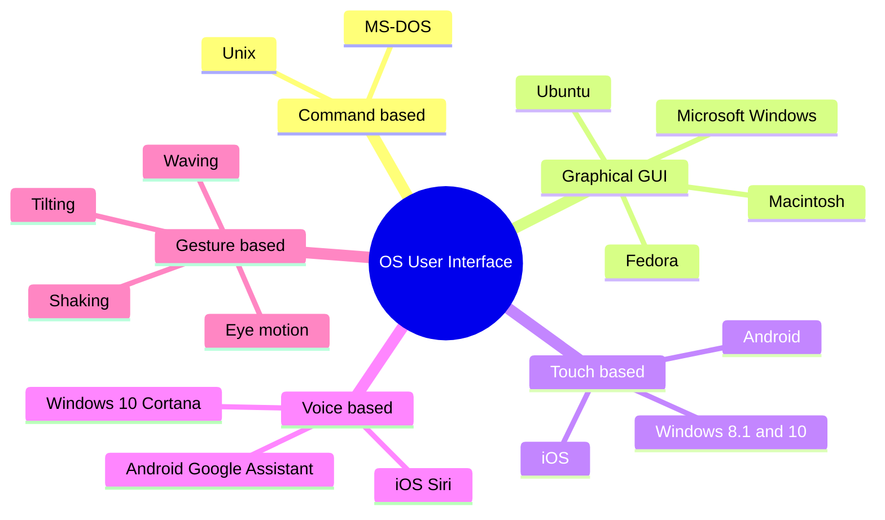

| Interface        | How the user interacts                                                                                                 | Primary input device  | Key limitation / note                                                    |
| ---------------- | ----------------------------------------------------------------------------------------------------------------------- | --------------------- | ------------------------------------------------------------------------ |
| **Command-based** | The user **enters commands** to create, open, edit or delete a file, and must **remember the names** of all such programs or specific commands | **Keyboard**          | Often **less interactive**; usually allows a user to run **a single program at a time** |
| **Graphical (GUI)** | Programs and instructions given through **icons, menus and other visual options**. **Icons** represent files and programs stored on the computer; **windows** represent running programs the user has launched | **Mouse and keyboard** | The reason PC popularity surged in the 1980s–90s                         |
| **Touch-based**   | Inputs via the **touchscreen**, interpreted by the OS as commands — opening an app, closing an app, dialing a number, scrolling across apps | Touchscreen           | Now standard on smartphones, tablets and PCs                             |
| **Voice-based**   | **Voice commands** make the computer work in the desired way                                                            | Microphone            | Designed for users who **cannot use mouse, keyboard and touchscreens**, and for hands-busy use |
| **Gesture-based** | Gestures like **waving, tilting, eye motion and shaking**                                                               | Camera / sensors      | Evolving faster; promising potential in **gaming, medicine** and other areas |

### 1.8.2 Functions of Operating System ⭐⭐⭐

| Function                  | What the OS is actually doing                                                                                                                      | The detail that earns marks                                                                  |
| ------------------------- | ---------------------------------------------------------------------------------------------------------------------------------------------------- | -------------------------------------------------------------------------------------------- |
| **Process Management**    | A **process** is a task in execution. The OS manages processes and gets multiple tasks completed in **minimum time** | Since the **CPU is the main resource**, its allocation among processes is the **most important service** of the OS. Concerns management of multiple processes, allocation of required resources, and **exchange of information among processes**. A system monitor showing running processes can often be activated with `Ctrl+Alt+Delete` |
| **Memory Management**     | **Give (allocate)** and **take (free)** memory from running processes, **dynamically (on-the-go)**, since many processes run at a time | Must do it **without affecting other processes already residing in memory**; when a process finishes, the OS **takes the memory space back for re-utilisation**. Goal: maximum memory occupied/utilised by a large number of processes, while **keeping track of every location as free or occupied** |
| **File Management**       | **Creation, updation, deletion and protection** of files in the **secondary** memory                                                                | **Protection is crucial** — there must be a mechanism that stops users from accessing files that belong to another user and have not been shared with them. File management handles **secondary** memory; memory management handles **main** memory |
| **Device Management**     | Manages the many **heterogeneous, interdependent** I/O devices and hardware connected to the system                                                 | The OS interacts with the **device driver** and related software for a particular device; must provide options for **configuring** a device so it can be used by an end user or another device; devices, like files, need **security measures**, with access restricted to authorised users, software and hardware |

### 1.8.3 Resource management: time vs space multiplexing (Supplementary) ⭐⭐

The OS keeps track of **who is using which resource**, grants resource requests, and handles the same request from different users and programs. It also **decides between conflicting requests** for efficient and fair resource use — for example, maximise throughput, minimise response time. Resource management constitutes **multiplexing (sharing)** resources, carried out in two different manners:

| | **Time multiplexing** | **Space multiplexing** |
| - | --------------------- | ---------------------- |
| Idea | The resource is shared **in turns** — only one at a time | Each user/program gets **some part** of the resource simultaneously |
| Resource typically shared | **CPU time**, a printer | **Main memory** |
| Example | Several programs issue print commands at once; the resource manager determines **who goes next and for how long**, so the print jobs are carried out **one by one** | Main memory is **divided amongst several running programs**; the OS assumes enough memory to hold multiple programs, since it is **more efficient** than allocating all the memory to a single user |

### 1.8.4 Types of operating system (Supplementary) ⭐

The supplementary book's objective section names three: **Single-user OS**, **Multi-user OS**, **Time-sharing OS** — and its MCQ answer is "All of these" (all three are genuine types of OS). Neither book develops these in the chapter body; treat them as vocabulary to recognise, not as a section to reproduce.

---

## Quick Reference

### A. Memory and number cheat-sheet

| Fact                                    | Value                                             |
| --------------------------------------- | ------------------------------------------------- |
| 1 nibble                                | 4 bits                                            |
| 1 byte                                  | 8 bits = 2 nibbles                                |
| 1 KB / MB / GB / TB                     | 1024 of the unit below it — **never 1000**        |
| 1 MB in bytes                           | \( 2^{20} \) = 1 048 576                          |
| 1 GB in bytes                           | \( 2^{30} \) = 1 073 741 824                      |
| 1 TB                                    | 1024 GB = \( 2^{10} \) GB                         |
| \( n \)-bit address bus addresses       | \( 2^{n} \) locations                             |
| Standard sector size (traditional)      | 512 bytes                                         |
| CD / DVD / Blu-ray capacity             | 700 MB / 4.7–8.5 GB / 25 GB (50 GB dual layer)    |
| Speed order (fastest first)             | Registers → Cache → RAM → Secondary storage       |

### B. Concept/definition table

| Concept                         | One-line definition                                                                      |
| ------------------------------- | ----------------------------------------------------------------------------------------- |
| **Computer**                    | Electronic device programmed to accept data, process it, generate a result                |
| **Computer system**             | A computer **plus** the additional hardware and software bundled with it                  |
| **CPU**                         | Electronic circuitry that carries out the actual processing — the brain of the computer   |
| **Register**                    | The CPU's own local memory, on the CPU chip, limited in size and number                   |
| **ALU / CU**                    | Performs arithmetic and logic / controls sequential execution and guides data flow        |
| **Bus**                         | Physical wires transferring data, addresses and control signals; one bit per wire         |
| **System bus**                  | Data bus + address bus + control bus, collectively                                        |
| **Memory controller**           | Dedicated hardware managing the flow of data into and out of main memory                  |
| **Microprocessor**              | A processor (CPU) implemented on a single microchip                                       |
| **Microcontroller**             | CPU + fixed RAM, ROM and peripherals, all on a single chip, for a specific task           |
| **Word size**                   | The maximum number of bits a microprocessor can process at a time                         |
| **Core**                        | A basic computation unit of the CPU                                                       |
| **Clock speed**                 | The number of pulses per second generated by the internal clock                           |
| **Data / Information**          | Raw unorganised facts / data organised to generate meaning                                |
| **Data recovery**               | Retrieving deleted, corrupted and lost data from secondary storage                        |
| **Software**                    | A set of instructions and data that makes hardware functional                             |
| **Source code / Object code**   | Program written in assembly or high-level language / its machine-code translation         |
| **IDE**                         | Text editor + building tools + debugger, in one environment                               |
| **Operating system**            | Resource manager and user interface; the most important system software                   |
| **Process**                     | A task in execution                                                                       |
| **Booting**                     | Starting the computer and loading the operating system                                    |
| **Pixel**                       | The smallest element of an image on a display; short for picture element                  |
| **Soft copy / Hard copy**       | Stored on disk or pen drive / printed on paper                                            |

### C. Abbreviations

`ALU` Arithmetic Logic Unit · `ASCII` American Standard Code for Information Interchange · `BD` Blu-ray Disc · `CAD` Computer-Aided Design · `CPU` Central Processing Unit · `CRT` Cathode Ray Tube · `CU` Control Unit · `DRAM` Dynamic RAM · `EEPROM` Electrically Erasable Programmable ROM · `ENIAC` Electronic Numerical Integrator and Computer · `EPROM` Erasable Programmable ROM · `FOSS` Free and Open Source Software · `GIGO` Garbage In, Garbage Out · `GPU` Graphics Processing Unit · `GUI` Graphical User Interface · `HDD` Hard Disk Drive · `IC` Integrated Circuit · `IDE` Integrated Development Environment · `IoT` Internet of Things · `IPO` Input-Process-Output · `ISCII` Indian Script Code for Information Interchange · `LCD` Liquid Crystal Display · `LED` Light-Emitting Diode · `LSI` Large Scale Integration · `MAR` Memory Address Register · `MICR` Magnetic Ink Character Reader · `OCR` Optical Character Reader · `OLED` Organic LED · `OMR` Optical Mark Reader · `OS` Operating System · `POS` Point of Sale · `PROM` Programmable ROM · `QR` Quick Response · `RAM` Random Access Memory · `ROM` Read-Only Memory · `SLSI` Super Large Scale Integration · `SoC` System on Chip · `SRAM` Static RAM · `SSD` Solid State Drive · `VDT` Visual Display Terminal · `VDU` Visual Display Unit · `VLSI` Very Large Scale Integration · `WWW` World Wide Web

---

## Points to Ponder

The traps in this chapter that actually cost marks:

1. **1 GB = 1024 MB, not 1024 KB.** Every step of the ladder is ×1024, and skipping a rung is the single most common arithmetic error here.
2. **Cache is faster than RAM.** "RAM operates much faster than cache memory" is **False**. Order: registers > cache > RAM > secondary.
3. **ROM is non-volatile, and ROM is primary memory.** Both halves get missed. "ROM is volatile" → False. "Primary memory = RAM only" → wrong.
4. **"Primary memory stores data permanently" is False** — because RAM, its main part, is volatile.
5. **The address bus does not carry data.** "An address bus carries data from one place to another" → **False**; that's the data bus. And the data bus is bidirectional while the address bus is unidirectional.
6. **Secondary storage cannot be accessed directly by the CPU.** Its contents must first be brought into main memory.
7. **A dot matrix printer is an impact printer** and does *not* use laser technology. "Dot matrix printer uses laser technology" → **False**.
8. **Deleting a file does not erase its contents** — only its address entry is marked free. That's why recovery works, and why discarded drives are a confidentiality risk.
9. **Microprocessor ≠ microcontroller.** Microprocessor = CPU only; microcontroller = CPU + fixed RAM + ROM + peripherals on one chip.
10. **Freeware is not FOSS.** Free to use ≠ source code available.
11. **A computer can run without application software but not without system software** — get the direction of that sentence right.
12. **OMR vs OCR vs MICR**: mark · character · magnetic-ink character (cheques).
13. **Compiler reports errors at the end, with line numbers; an interpreter stops at the first bad line.** And the interpreter is still needed at run time — the compiler isn't.
14. **NCERT Think and Reflect — RAM but no secondary storage: can you install software?** You could *load and run* it in RAM, but nothing survives power-off, so there is no **installation** in any lasting sense. The point of the question is that installation means writing to non-volatile storage.
15. **A "word" is the maximum amount of data a CPU can process at once** → **True**. Don't confuse word size with bus width, even though for many processors they coincide.
16. **Reading memory does not change it; writing does.** Non-destructive read, destructive write — both describe primary memory, and both are true at once.
17. **ISCII expands to Indian *Script* Code for Information Interchange**, not "Indian Standard Code", even though your supplementary book's MCQ offers only the latter. Unicode, not ISCII, is the *universal* standard.
18. **A buffer is not a cache.** A buffer smooths a **speed mismatch** between two components; a cache keeps **copies of frequently used data** closer to the CPU. Both sit "in between", for different reasons.
19. **A port is a physical socket, not software.** The word also means something entirely different in networking (port numbers) — in this chapter it is the plug on the outside of the box.
20. **The computer has no intelligence of its own.** Speed, reliability and diligence are capabilities; correctness of the *instructions* is your job. GIGO.

---

## Problem-Solving Strategy

A per-*type* checklist for the question patterns this chapter generates.

**Type 1 — Unit conversion ("convert 3.7 GB to bytes", "1 TB equals how many GB?")**
1. Write the ladder down from the larger unit to the target: GB → MB → KB → B.
2. Count the rungs. That is the exponent on 1024.
3. Multiply once: `value × 1024^rungs`. Never mix in 1000.
4. Sanity-check the magnitude — GB to bytes should gain about nine decimal digits.

**Type 2 — "Name the device that…"**
1. Identify the *direction* first: is data going **into** the computer (input) or **out** (output)?
2. Then identify the **medium** in the clue — mark, character, magnetic ink, bar, light, touch, voice, biometric.
3. Answer with the device **and** one clause of justification. The justification is usually worth the mark.

**Type 3 — Classify a piece of software**
1. Does it interact directly with hardware to make the machine usable? → **System** (OS / utility / driver).
2. Does it help *write* programs? → **Programming tool** (editor, translator, IDE).
3. Does it do a job *for the user* on top of the system? → **Application** (general purpose or customised).
4. Then add the sub-label: e.g. Compiler → System software (language processor); WinRAR → System software (compression utility); PowerPoint → Application software; Ubuntu → System software (OS).

**Type 4 — RAM vs ROM / primary vs secondary sorting questions**
1. Ask: **can it be written to?** No → ROM.
2. Ask: **does it survive power-off?** No → RAM.
3. Ask: **can the CPU reach it directly?** No → secondary.
4. Give the property, not just the label — "volatile, so contents are lost when power is turned off" scores where "RAM" alone may not.

**Type 5 — "Why…?" reasoning questions (bus direction, microcontroller choice, machine-code speed)**
1. State **what the component does**, in one sentence.
2. State **what it therefore does not need to do** — this is where the answer usually lives (the CPU never receives an address, an appliance never runs arbitrary programs, machine code is never re-translated).
3. Close with the consequence: hence unidirectional / hence smaller and cheaper / hence faster.

---

## Appendix A — Discrepancies found between the two sources

Flagged rather than silently corrected, so you know which version to write in which exam.

| # | Point | Supplementary book says | NCERT / verified position | What to write |
| - | ----- | ----------------------- | ------------------------- | ------------- |
| 1 | Components of the CPU | ALU, CU **and Memory unit** | ALU, CU **and registers**; primary memory sits outside the CPU | ALU + CU (+ registers). Registers are inside; RAM is not. |
| 2 | Address bus width | "consists of 16 wires… its width is 16 bits" | Width varies by processor; NCERT's Table 1.2 implies 10, 20, 24, 32 and 36 bits across generations | Quote the **rule** \( 2^n \), not a fixed 16 |
| 3 | \( 2^{16} \) | "2¹⁶ **or 32,000** different numbers" | \( 2^{16} = 65\,536 \) | 65 536 |
| 4 | Data bus width | "It is an **8-bit** bus" | Varies; the book's own next line says the size equals the CPU word length | Say it equals the CPU word length |
| 5 | Timeline of stored-program machines | — | NCERT: "The EDVAC and then the ENIAC computers were developed based on this concept", and calls ENIAC the first binary programmable computer on Von Neumann architecture | Write NCERT's version for the board. Historically, EDVAC was the stored-program *design* (1945) and ENIAC was later modified to operate in a stored-program mode (1948) |
| 6 | Control bus direction | — | NCERT: control bus is unidirectional | Write NCERT's answer. In real systems some control lines (e.g. interrupt requests) do travel device → CPU, so "unidirectional" is a simplification |
| 7 | Fifth-gen clock speed | — | NCERT Table 1.2: "533 MHz – 34 GHz" | Almost certainly a typo for 3.4 GHz; reproduce the table as printed, don't repeat 34 GHz in prose |
| 8 | Memory units beyond YB | Bronto Byte, Geop Byte | Not standardised units | Include only if your board book is the supplementary one |
| 9 | Top-level software categories | Four: System, Application, **Utility**, Programming Tools | Three: System (containing utilities and drivers), Programming tools, Application | Follow whichever book your paper is set from; utilities are system-level either way |
| 10 | Sector size | "as a rule, holds 512 bytes" | Traditional standard; modern drives often use 4096-byte physical sectors | Write 512 bytes for the exam |
| 11 | ISCII expansion | MCQ key: "Indian **Standard** Code for Information Interchange"; the correct expansion is not among the four options | BIS **IS 13194:1991** defines ISCII as Indian **Script** Code for Information Interchange | Pick the book's option in its own MCQ; **write** "Indian Script Code for Information Interchange" if asked to expand it |
| 12 | Computer vs calculator | "a calculator only performs arithmetic and **geometrical** operations" | The real contrast is arithmetic-only vs arithmetic + logic + storage + stored program | Answer **True**, but frame it as the logic/stored-program contrast |

---

## Appendix B — Textbook activities and "Explore Yourself"

NCERT sets eight numbered Activities plus an *Explore Yourself* list, and the supplementary book sets similar practical tasks. Most have machine-dependent answers, so here is the method rather than a fake answer.

| Activity | Task | How to do it / what you should find |
| -------- | ---- | ---------------------------------- |
| **1.1** | Express each generation's maximum memory size as a power of 2 | Already worked in **§1.4b**: 1 KB = 2¹⁰, 1 MB = 2²⁰, 16 MB = 2²⁴, 4 GB = 2³², 64 GB = 2³⁶. Notice these are exactly \( 2^{n} \) for that generation's address width |
| **1.2** | Find your microprocessor's clock speed and compare with your peers' | **Windows:** 1. Open Settings. 2. Go to System. 3. Choose About. 4. Read the "Processor" line. **Linux:** run `lscpu` and read `CPU MHz` / model name. **Android:** check the chipset in Settings → About phone |
| **1.3** | Visit a bank, showroom, mall or tehsil office and name 2–3 data-capture tools | Expect to find: **bar code scanner** at billing, **biometric fingerprint scanner** for attendance or verification, **card reader / PIN pad**, **signature pad**, **OMR sheets**, **camera**. Map each back to §1.1.2a |
| **1.4** | Explore ways of recovering deleted or corrupted data | Three levels, in increasing effort: (1) **restore from the Recycle Bin / Trash**; (2) restore from a **backup or previous-version/File-History snapshot**; (3) run an **undelete / data-recovery utility**, which works only while the space is unoverwritten (§1.6.3) |
| **1.5** | Create a test file, delete it with `Shift+Delete`, then recover it | This is the practical demonstration of §1.6.3 — the file bypasses the Recycle Bin, yet recovery software still finds it, because deletion only marked its **address entry free**. Stop using that drive immediately after deleting, or the space may be overwritten |
| **1.6** | Locate any two device drivers installed on your computer | **Windows:** Device Manager → expand a category → right-click a device → Properties → Driver tab. **Linux:** `lsmod` lists loaded kernel modules; `lspci -k` shows which driver each device uses |
| **1.7** | Install one application software | Any general-purpose tool — a browser, a media player, an office suite. Note during install that it needs the **OS** already present (§1.7.1) |
| **1.8** | Install one free and open source application | E.g. LibreOffice, Mozilla Firefox, GIMP, Python. The point of the activity: its **source code is available**, which is what separates FOSS from freeware (§1.7.5) |
| **Explore 2** | Name two system and two application software on your computer | System: the OS itself, plus an antivirus or disk utility. Application: word processor, browser |
| **Explore 3–4** | Which microprocessor do you have, which generation, what clock speed? | Use the Activity 1.2 steps, then place it in **Table 1.2** — anything modern is **fifth generation, SLSI, 64-bit, multicore** |
| **Explore 5** | Name two devices at home or school with a microcontroller | Washing machine, microwave, remote controller, digital camera, keyboard, mouse, pen drive (§1.5.2) |
| **Explore 6** | Check RAM and HDD size, and tabulate in B, KB, MB, GB | Use the ladder from §1.3.1. Worth doing once by hand — it is the same arithmetic as Worked Example 1-2 |
| **Explore 7** | List all secondary storage devices at your school or home | Hard disk, SSD, pen drives, memory cards, CDs/DVDs, external drives, phone storage |
| **Explore 8** | Which operating system is installed? | Name it **and** its interface type from §1.8.1 — e.g. "Windows 11, a GUI-based OS that also supports touch input" |

---

*Note built with the `cs-generator` skill, NCERT Chapter 1 as structural primary. Every code block traced by hand; every claimed output verified against Python 3.x semantics. `svg` and `desmos` blocks: syntax reviewed, rendering **not** confirmed in the current build.*