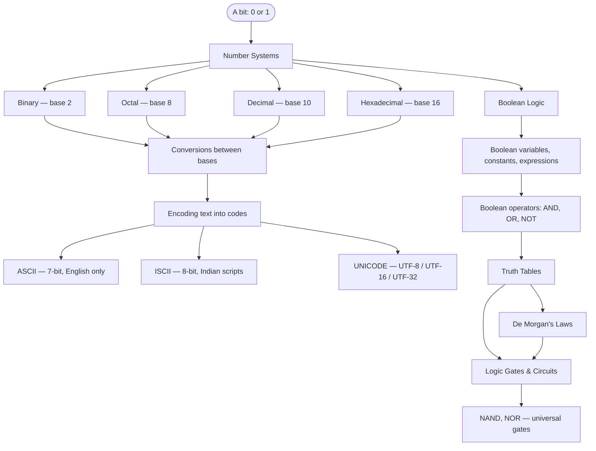
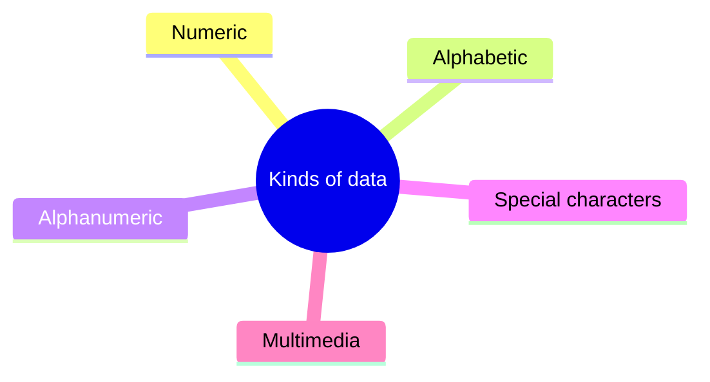
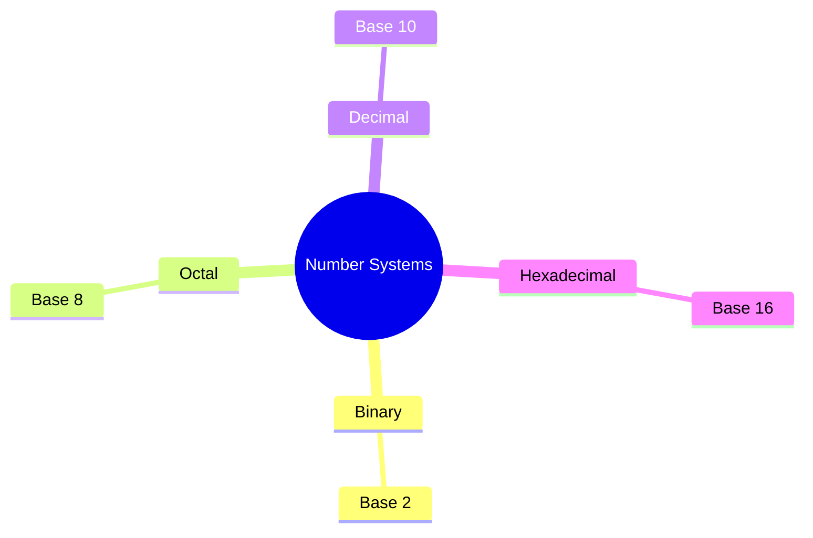
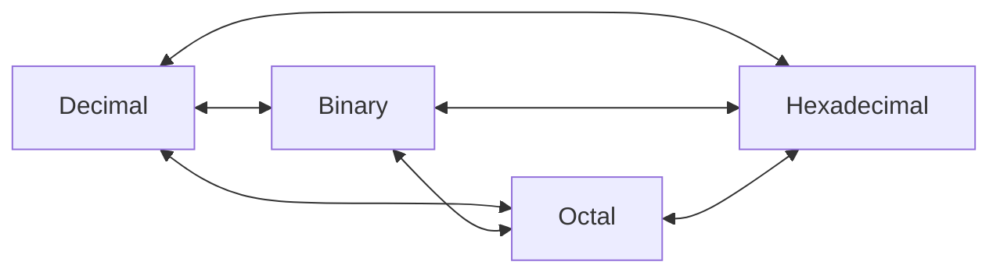
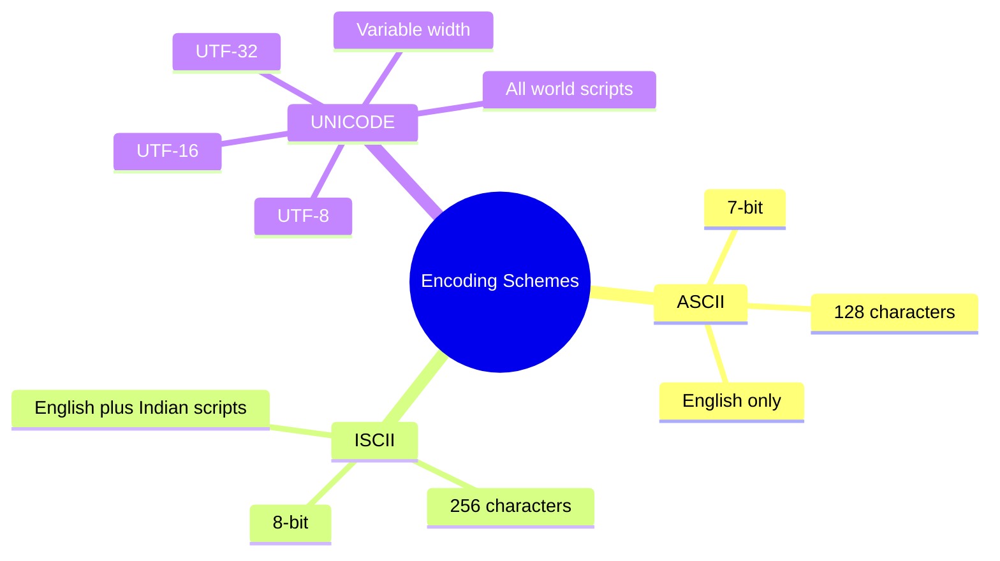
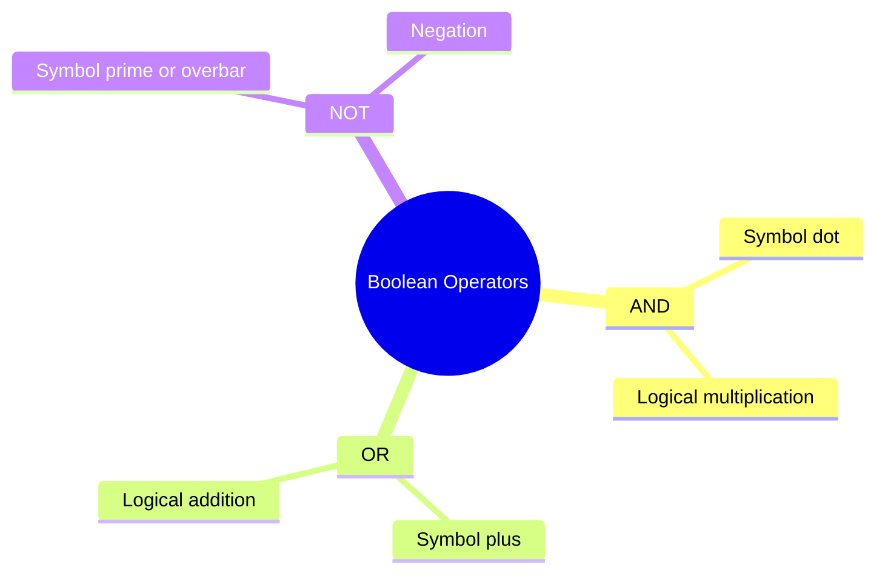
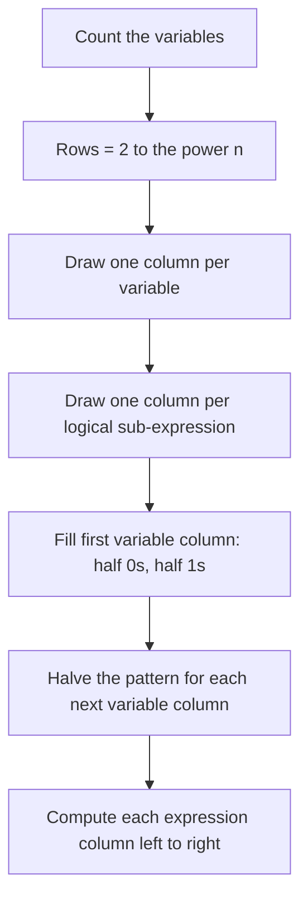
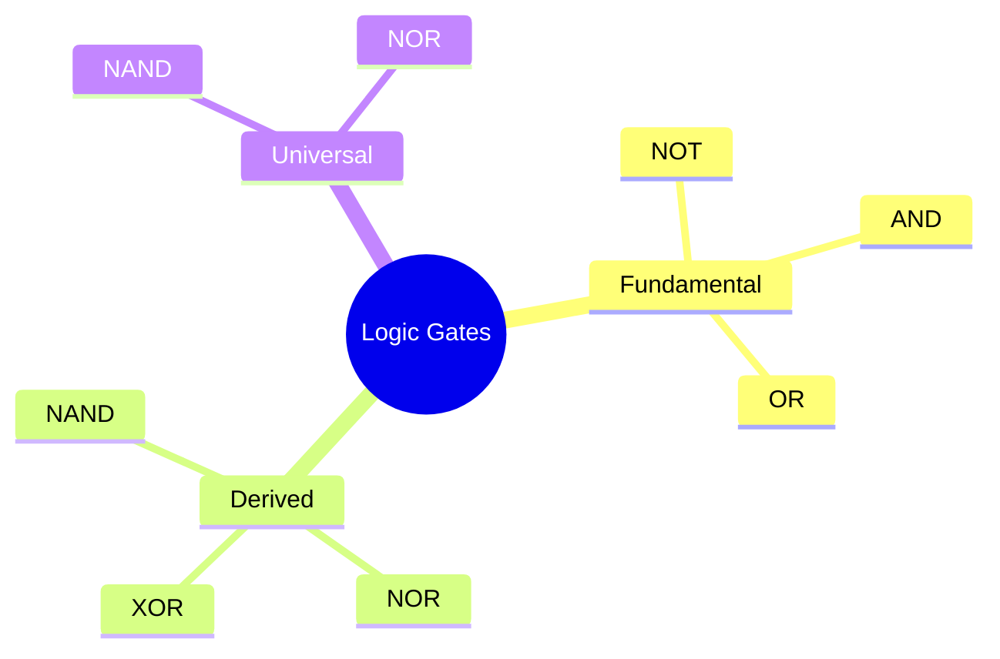
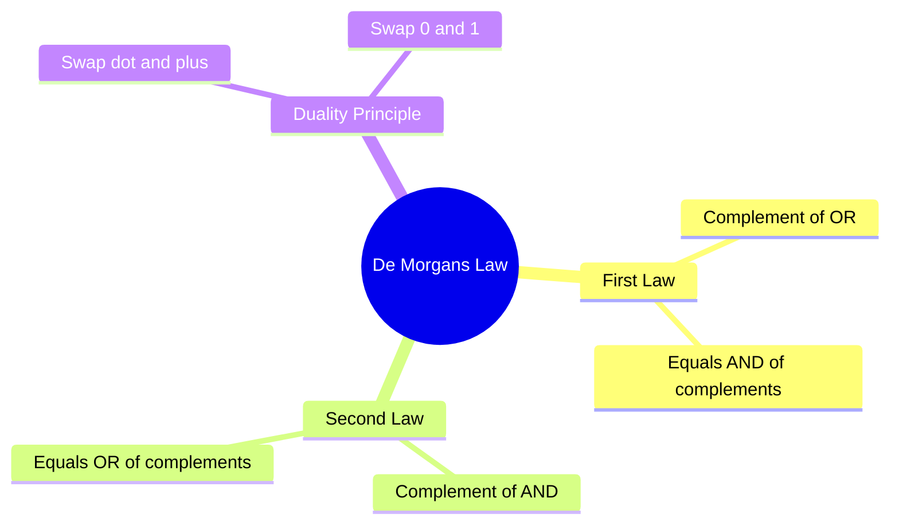

# Computer Science | Chapter 02 | DATA REPRESENTATION and BOOLEAN LOGIC | CNOTES

**Level:** Class XI (CBSE) · **Source:** `CS02-DATA_REPRESENTATION_AND_BOOLEAN_LOGIC-NOTES.md` · **Companion:** `CS02-...-GLOSSARY.md`

Same content as NOTES, same breadth, reformatted as bullets, tables, and diagrams for fast scanning. Sources: *Computer Science with Python–XI* (Sumita Arora, primary) and NCERT *Computer Science–XI* (supplementary, marked **(NCERT)**).

---

## Concept Roadmap



- Numbers, letters, and logical truth values all ultimately reduce to the same two symbols, `0` and `1`.
- Number systems tell us how to **read** those bits as values.
- Encoding schemes tell us how to map **characters** onto them.
- Boolean logic tells us how to make **decisions** with them.

---

## §2.1 Introduction



- A computer's circuits carry information as electrical pulses with only two recognisable states — ON and OFF. §2.1
- ON maps to `1`; OFF maps to `0`. §2.1
- A computer stores and processes everything in binary (digital) form. §2.1
- One wire = one bit (binary digit) = 2 possible states (`0`/`1`). §2.1
- More wires = more bits = more distinct combinations = more complex information representable. §2.1
- Fig. 2.1 (source): 1 wire = 2 states, 2 wires = 4 states, 3 wires = 8 states. §2.1
- Every symbol a computer handles — numeric, alphabetic, alphanumeric, special character, or multimedia data — is represented as a unique combination of `0`s and `1`s. §2.1

| Kind of data | Examples |
|---|---|
| Numeric | 0, 1, 2, …, 9 |
| Alphabetic | A–Z, a–z |
| Alphanumeric | Mix of letters, digits (e.g. `A1B2`) |
| Special characters | `+ - # @ $ % ? blank` |
| Multimedia | audio, video, graphics, images |

- **(NCERT)** Key `A` pressed → internally mapped to decimal code value 65 → converted to 7-bit binary `0100 0001`. §2.1
- **(NCERT)** Devanagari letter `अ` maps to hexadecimal code `0905` → binary `0000100100000101`. §2.1
- Chain: *key → code (decimal/hex) → binary* — explained in full across §2.2–§2.4. §2.1
- **(NCERT)** Every keyboard maps `A` to code 65 because of industry-wide standard encoding schemes (ASCII, ISCII, UNICODE). §2.1
- This mapping is not due to any property of the letter itself. §2.1
- This standardisation is what makes text portable between devices, operating systems, and software. §2.1

---

## §2.2 Number System



- A number system is the technique used to represent numbers in computer system architecture (CTM definition). §2.2
- Every digit in a number system has a face value: the digit itself. §2.2
- Every digit has a base/radix: the count of unique symbols the system uses. §2.2
- Every digit has a position: its positional value is `base^position`. §2.2

| Number System | Base (Radix) | Symbols used |
|---|---|---|
| Binary | 2 | `0, 1` |
| Octal | 8 | `0, 1, 2, 3, 4, 5, 6, 7` |
| Decimal | 10 | `0, 1, 2, …, 9` |
| Hexadecimal | 16 | `0–9, A, B, C, D, E, F` (A=10, B=11, C=12, D=13, E=14, F=15) |

- MSB (Most Significant Bit) = left-most digit of a number, carries the greatest positional weight. §2.2
- LSB (Least Significant Bit) = right-most digit of a number, carries the lowest positional weight. §2.2
- MSB/LSB terminology applies to every number system, not just binary. §2.2
- Learning Tip: a microprocessor (CPU) is a small electronic component built on a single chip called an integrated circuit (IC). §2.2
- An IC performs the basic arithmetic and logical operations on data. §2.2
- An IC is a piece of semiconductor material loaded with transistors and other electronic components. §2.2
- A transistor is a tiny switch activated by the electronic signal it receives. §2.2
- The binary digits `1` and `0` used in binary directly reflect a transistor's ON and OFF states. §2.2

**Consolidated Number Representation Table (0–15)** (NCERT, Table 2.2 equivalent):

| Decimal | Binary | Octal | Hexadecimal |
|---|---|---|---|
| 0 | 0000 | 0 | 0 |
| 1 | 0001 | 1 | 1 |
| 2 | 0010 | 2 | 2 |
| 3 | 0011 | 3 | 3 |
| 4 | 0100 | 4 | 4 |
| 5 | 0101 | 5 | 5 |
| 6 | 0110 | 6 | 6 |
| 7 | 0111 | 7 | 7 |
| 8 | 1000 | 10 | 8 |
| 9 | 1001 | 11 | 9 |
| 10 | 1010 | 12 | A |
| 11 | 1011 | 13 | B |
| 12 | 1100 | 14 | C |
| 13 | 1101 | 15 | D |
| 14 | 1110 | 16 | E |
| 15 | 1111 | 17 | F |

- The octal column jumps straight from `7` to `10` — there is no digit `8` or `9` in base 8. §2.2
- The hexadecimal column continues past `9` into `A`–`F` instead of rolling over to two digits until `16`. §2.2

### 2.2.1 Decimal Number System

- Base 10, digits `0–9`. §2.2.1
- Positional values are powers of 10. §2.2.1
- Positive powers of 10 sit to the left of the decimal point, increasing right→left. §2.2.1
- Negative powers of 10 sit to the right of the decimal point, decreasing left→right. §2.2.1
- Formula: `123.45 = 1×10² + 2×10¹ + 3×10⁰ + 4×10⁻¹ + 5×10⁻²`. §2.2.1

### 2.2.2 Binary Number System

- Base 2, digits `0, 1`. §2.2.2
- Matches the ON/OFF transistor states directly — this is why computers use binary internally. §2.2.2
- Positional values are powers of 2. §2.2.2
- Example: `(10101.1101)₂` — integer-part weights `2⁴ 2³ 2² 2¹ 2⁰`; fractional-part weights `2⁻¹ 2⁻² 2⁻³ 2⁻⁴`. §2.2.2

### 2.2.3 Octal Number System

- Base 8, digits `0–7`. §2.2.3
- Positional values are powers of 8. §2.2.3
- Devised to give a shorter, more manageable way to write long binary strings. §2.2.3

### 2.2.4 Hexadecimal Number System

- Base 16, digits `0–9, A–F`. §2.2.4
- Positional values are powers of 16. §2.2.4
- Devised to compact long binary numbers — one hex digit encodes exactly 4 bits. §2.2.4
- Example: `(2A3.45)₁₆` = weights `16² 16¹ 16⁰ . 16⁻¹ 16⁻²` on digits `2, A, 3 . 4, 5`. §2.2.4

### 2.2.5 Applications of Hexadecimal Numbers

- Memory addressing: a 16-bit or 32-bit memory address is unwieldy in binary. §2.2.5
- Example: 16-bit address `1111000010101111` is written compactly as `F0AF` in hexadecimal. §2.2.5
- Web colour codes: format `#RRGGBB` uses two hex digits each for Red, Green, and Blue. §2.2.5
- Each colour channel ranges `00`–`FF`. §2.2.5
- Example: `#FF0000` = pure red. §2.2.5
- **(NCERT)** 24-bit RGB colour needs 8 bits per channel; hex compresses each channel to 2 digits. §2.2.5

| Colour | Decimal (R,G,B) | Binary | Hexadecimal |
|---|---|---|---|
| Black | (0,0,0) | 00000000,00000000,00000000 | (00,00,00) |
| White | (255,255,255) | 11111111,11111111,11111111 | (FF,FF,FF) |
| Yellow | (255,255,0) | 11111111,11111111,00000000 | (FF,FF,00) |
| Grey | (128,128,128) | 10000000,10000000,10000000 | (80,80,80) |

---

## §2.3 Number System Conversions



- Conversions fall into three broad categories: decimal→other base, other base→decimal, and one base→another base. §2.3

### 2.3.1 Decimal Number to Other Base

- Whole-number part: repeated division by the target base `b`. §2.3.1
- Divide the number by `b`; note the quotient and remainder. §2.3.1
- Divide the new quotient by `b` again; note the remainder. §2.3.1
- Repeat until the quotient becomes 0. §2.3.1
- Read the remainders bottom to top — this gives MSB→LSB order. §2.3.1
- Fractional part: repeated multiplication by `b`. §2.3.1
- Multiply the fraction by `b`. §2.3.1
- Record the integer part produced; keep only the new fractional part. §2.3.1
- Repeat until the fractional part becomes 0, or starts repeating (then stop and note it doesn't terminate). §2.3.1
- Read the recorded integers top to bottom. §2.3.1

**Worked examples (method + result only):**

- `(125)₁₀` → binary: repeated ÷2, remainders bottom→top → `(1111101)₂`. §2.3.1
- `(105.15)₁₀` → binary: integer 105 ÷2 repeatedly → `1101001`; fraction 0.15 ×2 repeatedly → `.001001` → `(1101001.001001)₂`. §2.3.1
- ⚠ A repeating fraction never becomes exactly 0 — stop after ~6–10 digits and note the conversion is non-terminating in that base. §2.3.1
- `(125)₁₀` → octal: repeated ÷8, remainders bottom→top → `(175)₈`. §2.3.1
- `(300)₁₀` → hexadecimal: repeated ÷16, remainders bottom→top → `(12C)₁₆`. §2.3.1
- `(0.21875)₁₀` → octal: repeated ×8, integers top→bottom → `(0.16)₈`. §2.3.1
- `(0.03125)₁₀` → hexadecimal: repeated ×16, integers top→bottom → `(0.08)₁₆`. §2.3.1
- `(0.375)₁₀` → binary: repeated ×2, integers top→bottom → `(0.011)₂`. §2.3.1

### 2.3.2 Other Base to Decimal Number System

- Method works identically for binary, octal, and hexadecimal. §2.3.2
- Write the position number of each digit — 0 at the right-most integer digit, increasing leftward by 1; −1, −2, … for fractional digits, decreasing left→right. §2.3.2
- Raise the base to each position number to get that digit's positional value. §2.3.2
- Multiply each digit by its positional value. §2.3.2
- Sum all the products. §2.3.2

**Worked examples (method + result only):**

- `(100011)₂` → decimal: `1×2⁵+0×2⁴+0×2³+0×2²+1×2¹+1×2⁰ = 32+2+1 = (35)₁₀`. §2.3.2
- `(321)₈` → decimal: `3×8²+2×8¹+1×8⁰ = 192+16+1 = (209)₁₀`. §2.3.2
- `(AB)₁₆` → decimal: `A×16¹+B×16⁰ = 160+11 = (171)₁₀`. §2.3.2
- `(23.25)₈` → decimal: `2×8¹+3×8⁰+2×8⁻¹+5×8⁻² = 16+3+0.25+0.078125 = (19.328125)₁₀`. §2.3.2
- `(11011.1101)₂` → decimal: integer part `16+8+0+2+1=27`; fraction part `0.5+0.25+0+0.0625=0.8125` → `(27.8125)₁₀`. §2.3.2
- `(1E.8C)₁₆` → decimal: `16+14+0.5+0.046875 = (30.546875)₁₀`. §2.3.2

### 2.3.3 One Base to Another Base System

- Binary ↔ Hexadecimal groups bits in 4s. §2.3.3
- Reason: `16 = 2⁴`. §2.3.3
- Binary ↔ Octal groups bits in 3s. §2.3.3
- Reason: `8 = 2³`. §2.3.3

| Binary | Hex | Binary | Hex |
|---|---|---|---|
| 0000 | 0 | 1000 | 8 |
| 0001 | 1 | 1001 | 9 |
| 0010 | 2 | 1010 | A |
| 0011 | 3 | 1011 | B |
| 0100 | 4 | 1100 | C |
| 0101 | 5 | 1101 | D |
| 0110 | 6 | 1110 | E |
| 0111 | 7 | 1111 | F |

| Octal | Binary | Octal | Binary |
|---|---|---|---|
| 0 | 000 | 4 | 100 |
| 1 | 001 | 5 | 101 |
| 2 | 010 | 6 | 110 |
| 3 | 011 | 7 | 111 |

- Binary → Hex: group bits in 4s from the binary point outward (right→left for the integer part, left→right for the fraction), padding with leading/trailing `0`s where a group is short. §2.3.3
- Hex → Binary: replace each hex digit with its 4-bit binary equivalent and concatenate. §2.3.3
- Octal ↔ Hex has no direct grouping — always convert via binary as the intermediate step (expand to 4-bit or 3-bit groups, concatenate, regroup in the other size). §2.3.3
- ⚠ Pad the integer part on the left (toward the MSB) and the fractional part on the right (toward the LSB) — padding the wrong side silently changes the value. §2.3.3

**Worked examples (method + result only):**

- `(1001.11001)₂` → hexadecimal: integer `1001`→`9`; fraction `1100|1000`→`C, 8` → `(9.C8)₁₆`. §2.3.3
- `(10AF)₁₆` → binary: `1→0001, 0→0000, A→1010, F→1111` → `(0001000010101111)₂`. §2.3.3
- `(A2F)₁₆` → binary: `A→1010, 2→0010, F→1111` → `(1010 0010 1111)₂`. §2.3.3
- `(FACE.32)₁₆` → binary: expand each hex digit to 4 bits → `(1111101011001110.00110010)₂`. §2.3.3
- `(10110101.11001)₂` → octal: integer `010 110 101`→`2 6 5`; fraction `110 010`→`6 2` → `(265.62)₈`. §2.3.3
- `(742)₈` → binary: `7→111, 4→100, 2→010` → `(111100010)₂`. §2.3.3
- `(3.1)₈` → binary: `3→011, 1→001` → `(011.001)₂`. §2.3.3
- `(A2DE)₁₆` → octal: expand to 4-bit binary, pad to a multiple of 3, regroup in 3s → `(121336)₈`. §2.3.3
- `(762)₈` → hexadecimal: expand to 3-bit binary, regroup in 4s → `(172)₁₆`. §2.3.3
- `(345)₈` → hexadecimal: expand to 3-bit binary, regroup in 4s → `(E5)₁₆`. §2.3.3

### 2.3.4 Conversion of Numbers with Fractional Parts (NCERT emphasis)

| Direction | Method |
|---|---|
| Decimal fraction → other base | Multiply repeatedly by target base; record integer parts top→bottom; stop at `0` or when the fraction repeats |
| Other-base fraction → Decimal | Multiply each digit by its negative power-of-base positional value and sum |
| Binary fraction → Octal/Hex | Group fractional bits in 3s/4s from the binary point rightward, padding trailing zeros as needed |

---

## §2.4 Internal Storage Encoding of Characters




- Encoding is the mechanism of converting data into an equivalent code (a "cipher") using a specific scheme, so it can be represented in binary and understood by the computer. §2.4

### ASCII — American Standard Code for Information Interchange

- Developed by ANSI in the early 1960s to standardise character representation across machines. §2.4
- Uses 7 bits → `2⁷ = 128` possible codes. §2.4
- Covers digits `0–9`, lowercase `a–z`, uppercase `A–Z`, punctuation, control codes, and space. §2.4
- Limitation: encodes English-language characters only. §2.4

| Character | Decimal | 7-bit Binary |
|---|---|---|
| Space | 32 | 0100000 |
| `A` | 65 | 1000001 |
| `a` | 97 | 1100001 |
| `0` | 48 | 0110000 |

**Worked examples (method + result only):**

- Encode `DATA`: D=68/`1000100`, A=65/`1000001`, T=84/`1010100`, A=65/`1000001`. §2.4
- Encode `BYTE`: B=`1000010`(hex 42), Y=`1011001`(hex 59), T=`1010100`(hex 54), E=`1000101`(hex 45); 4 characters = 4 bytes (1 byte per ASCII-7 character). §2.4
- Decode `1001000 1000101 1001100 1010000`: convert each 7-bit group to hex (`48, 45, 4C, 50`), look up in ASCII table → `HELP`. §2.4
- The same ASCII table used to encode (letter → code → binary) is used to decode (binary → code → letter) in the reverse direction. §2.4

### ISCII — Indian Script Code for Information Interchange

- Adopted by the Bureau of Indian Standards in 1991 (developed mid-1980s, **NCERT**). §2.4
- An 8-bit code → `2⁸ = 256` characters. §2.4
- Can represent English and Indian-script characters together. §2.4
- Retains all 128 ASCII codes unchanged. §2.4
- Uses the remaining 128 codes (values 160–255) for the *aksharas* of Indian scripts. §2.4
- Covers 15 officially recognised Indian languages: Hindi, Marathi, Sanskrit, Punjabi, Gujarati, Oriya, Bengali, Assamese, Telugu, Kannada, Malayalam, Tamil, Urdu, Sindhi, Kashmiri. §2.4

### UNICODE

- A universal coding standard maintained by the Unicode Consortium (a non-profit). §2.4
- Gives a unique number ("code point") to every character, regardless of platform, program, or language. §2.4
- Enables worldwide interchange of text without corruption or re-engineering. §2.4
- It is a superset of ASCII: code points 0–128 mean exactly the same characters as in ASCII. §2.4
- **(NCERT)** Devanagari script occupies the hex code-point block `0900`–`097F`; e.g. `अ = 0905`. §2.4
- Gujarati and other Indian scripts each get their own dedicated, non-overlapping code-point block (Sumita Arora's Fig. 2.4 shows the ISCII code charts for Gujarati and Devanagari). §2.4
- Significance: one software/website can support multiple platforms, languages, and countries without re-engineering, cutting cost versus legacy character sets. §2.4
- Significance: data can move across systems without corruption. §2.4
- Significance: it's the common conversion point between other encoding schemes, and the preferred scheme for XML-based tools. §2.4

**UTF-8, UTF-16, UTF-32 — Unicode Transformation Formats:**

| Format | Bytes used | Type |
|---|---|---|
| UTF-8 | 1, 2, 3, or 4 bytes (depends on the code point's size) | Variable-width |
| UTF-16 | 2 or 4 bytes (most modern-language characters use 2) | Variable-width |
| UTF-32 | Always 4 bytes | Fixed-width |

- UTF-8 is backward compatible with ASCII: a file of only ASCII characters encoded in UTF-8 is byte-for-byte identical to plain ASCII. §2.4
- UTF-16 cannot make this claim — even a plain ASCII character occupies 2 bytes there. §2.4

---

## §2.5 Boolean Logic

- Developed by George Boole in the mid-1800s to put formal logic into mathematical form. §2.5
- Boolean logic evaluates the truth of a statement using only two possible values. §2.5

| Concept | Meaning |
|---|---|
| Boolean statement (Proposition) | Any statement with a definite value, `True` or `False` — e.g. "Is New Delhi the capital of India?" (Not: "Where is your house located?" — has no true/false value.) |
| Boolean variable | A variable (e.g. `X`, `Y`, `Z`) that can hold only one of two values: `0`/`1`, `True`/`False`, `Yes`/`No`. Also called a binary or logical variable. One bit represents one Boolean variable. |
| Boolean constant | The actual values stored in Boolean variables: `True`/`False`, `1`/`0`, `Yes`/`No`. |
| Boolean expression (Logical expression) | A meaningful combination of Boolean operators, variables, and constants, e.g. `X + Y.Z`, `A.(B+C) + B.C'` |

- Physically: a switch has only two states — open (binary 0) and closed (binary 1). §2.5
- If current passes through a circuit it represents `1`; else `0`. §2.5

---

## §2.6 Boolean Operators



| Operator | Symbol | Also called |
|---|---|---|
| AND | `.` (dot) | Logical multiplication |
| OR | `+` (plus) | Logical addition |
| NOT | `'` or an overbar | Negation / Complementation |

### 2.6.1 AND Operator

- Binary operator on two variables. §2.6.1
- Result is `1` only when both inputs are `1`; otherwise `0`. §2.6.1

| A | B | A·B |
|---|---|---|
| 0 | 0 | 0 |
| 0 | 1 | 0 |
| 1 | 0 | 0 |
| 1 | 1 | 1 |

### 2.6.2 OR Operator

- Binary operator on two variables. §2.6.2
- Result is `1` if either or both inputs are `1`; `0` only when both are `0`. §2.6.2

| A | B | A+B |
|---|---|---|
| 0 | 0 | 0 |
| 0 | 1 | 1 |
| 1 | 0 | 1 |
| 1 | 1 | 1 |

### 2.6.3 NOT Operator

- Unary operator (one input). §2.6.3
- Reverses/complements the input. §2.6.3

| A | A' |
|---|---|
| 0 | 1 |
| 1 | 0 |

- `A` and `A'` are always opposite — if `A = 0`, then `A' = 1`, and vice versa. §2.6.3

---

## §2.7 Truth Table



- A truth table lists every possible combination of input values for a Boolean expression, along with the resulting output, in tabular form. §2.7
- If the result is always `1`, the expression is a Tautology. §2.7
- If the result is always `0`, the expression is a Fallacy. §2.7
- Number of rows = `2ⁿ`, where `n` = number of distinct Boolean variables. §2.7
- Number of columns = number of variables + number of distinct logical sub-expressions. §2.7
- Rule: count the literals/variables in the expression. §2.7
- Rule: draw one column per unique variable. §2.7
- Rule: draw one column per logical sub-operation in the expression. §2.7
- Rule: draw `2ⁿ` rows. §2.7
- Rule: fill the first variable's column — first half `0`s, second half `1`s. §2.7
- Rule: for the next column, halve each of those halves again (alternate blocks of `0`s and `1`s), repeating this halving pattern for every subsequent variable column, ending with strict alternation (`0,1,0,1,...`) in the last variable's column. §2.7
- Rule: compute each logical-expression column row by row from the variable values already filled in. §2.7

**Worked example — Truth table for F = A·B′ + C:**

| A | B | C | B' | A.B' | A.B'+C |
|---|---|---|---|---|---|
| 0 | 0 | 0 | 1 | 0 | 0 |
| 0 | 0 | 1 | 1 | 0 | 1 |
| 0 | 1 | 0 | 0 | 0 | 0 |
| 0 | 1 | 1 | 0 | 0 | 1 |
| 1 | 0 | 0 | 1 | 1 | 1 |
| 1 | 0 | 1 | 1 | 1 | 1 |
| 1 | 1 | 0 | 0 | 0 | 0 |
| 1 | 1 | 1 | 0 | 0 | 1 |

**Worked example — Truth table for F = A + B·C′ + A′·C′:**

| A | B | C | C' | A' | B.C' | A'.C' | A+B.C'+A'.C' |
|---|---|---|---|---|---|---|---|
| 0 | 0 | 0 | 1 | 1 | 0 | 1 | 1 |
| 0 | 0 | 1 | 0 | 1 | 0 | 0 | 0 |
| 0 | 1 | 0 | 1 | 1 | 1 | 1 | 1 |
| 0 | 1 | 1 | 0 | 1 | 0 | 0 | 0 |
| 1 | 0 | 0 | 1 | 0 | 0 | 0 | 1 |
| 1 | 0 | 1 | 0 | 0 | 0 | 0 | 1 |
| 1 | 1 | 0 | 1 | 0 | 1 | 0 | 1 |
| 1 | 1 | 1 | 0 | 0 | 0 | 0 | 1 |

**Precedence of Boolean Operators:**

| Priority | Operator |
|---|---|
| 1st (highest) | NOT |
| 2nd | AND |
| 3rd (lowest) | OR |

- Rule: evaluate left to right. §2.7
- Rule: evaluate anything inside parentheses first. §2.7
- Rule: perform all NOT operations. §2.7
- Rule: perform all AND operations. §2.7
- Rule: perform all OR operations. §2.7
- ⚠ In `X.Y' + Z`, the complement `Y'` is computed first, then `X.Y'` (AND), and only then is `Z` OR-ed in — not left-to-right blindly. §2.7

**Worked example — Verify `X.(Y+Z) = (X.Y) + (X.Z)` (Distributive Law):**

| X | Y | Z | Y+Z | X.(Y+Z) | X.Y | X.Z | (X.Y)+(X.Z) |
|---|---|---|---|---|---|---|---|
| 0 | 0 | 0 | 0 | 0 | 0 | 0 | 0 |
| 0 | 0 | 1 | 1 | 0 | 0 | 0 | 0 |
| 0 | 1 | 0 | 1 | 0 | 0 | 0 | 0 |
| 0 | 1 | 1 | 1 | 0 | 0 | 0 | 0 |
| 1 | 0 | 0 | 0 | 0 | 0 | 0 | 0 |
| 1 | 0 | 1 | 1 | 1 | 0 | 1 | 1 |
| 1 | 1 | 0 | 1 | 1 | 1 | 0 | 1 |
| 1 | 1 | 1 | 1 | 1 | 1 | 1 | 1 |

- The last two columns match for every row → L.H.S. = R.H.S., confirming the Distributive Law. §2.7

**Worked example — Verify `X+Y.Z = (X+Y).(X+Z)` (OR distributing over AND):**

| X | Y | Z | Y.Z | X+Y.Z | (X+Y) | (X+Z) | (X+Y).(X+Z) |
|---|---|---|---|---|---|---|---|
| 0 | 0 | 0 | 0 | 0 | 0 | 0 | 0 |
| 0 | 0 | 1 | 0 | 0 | 0 | 1 | 0 |
| 0 | 1 | 0 | 0 | 0 | 1 | 0 | 0 |
| 0 | 1 | 1 | 1 | 1 | 1 | 1 | 1 |
| 1 | 0 | 0 | 0 | 1 | 1 | 1 | 1 |
| 1 | 0 | 1 | 0 | 1 | 1 | 1 | 1 |
| 1 | 1 | 0 | 0 | 1 | 1 | 1 | 1 |
| 1 | 1 | 1 | 1 | 1 | 1 | 1 | 1 |

- `X+Y.Z` and `(X+Y).(X+Z)` match row for row → L.H.S. = R.H.S. §2.7
- This is the dual form of the previous Distributive Law example — swapping every `.`↔`+` turns one into the other (Duality Principle, §2.9). §2.7

**Worked example — Verify `X.X′ = 0` and `X+1 = 1`:**

| X | X' | X.X' | X+1 |
|---|---|---|---|
| 0 | 1 | 0 | 1 |
| 1 | 0 | 0 | 1 |

- `X.X'` is `0` for every value of `X` (Inverse/Complement Law, AND form). §2.7
- `X+1` is `1` for every value of `X` (Property of 1, OR form). §2.7
- Both are identities rather than expressions that depend on the input. §2.7

---

## §2.8 Logic Circuit



- A logic circuit takes one or more inputs and generates an output, built from logic gates that implement Boolean operators. §2.8

| Gate | Inputs | Behaviour |
|---|---|---|
| NOT ("inverter") | 1 | Output is the complement of the input |
| AND | 2 or more | Output is `1` only if all inputs are `1` |
| OR | 2 or more | Output is `1` if any input is `1` |

| Gate | Behaviour | Relation to fundamentals |
|---|---|---|
| NAND | Output is `0` only if both inputs are `1`; else `1` | AND followed by NOT |
| NOR | Output is `1` only if both inputs are `0`; else `0` | OR followed by NOT |
| XOR (exclusive-OR) | Output is `1` if inputs differ; `0` if they are the same | "Either, but not both" |

- Any digital circuit — including AND, OR, and NOT themselves — can be built using only NAND gates, or only NOR gates. §2.8
- This is why NAND and NOR are called universal gates. §2.8

**Full truth tables for all six gates:**

| X | X' (NOT) |
|---|---|
| 0 | 1 |
| 1 | 0 |

| X | Y | X.Y (AND) | X+Y (OR) | (X.Y)' (NAND) | (X+Y)' (NOR) | X⊕Y (XOR) |
|---|---|---|---|---|---|---|
| 0 | 0 | 0 | 0 | 1 | 1 | 0 |
| 0 | 1 | 0 | 1 | 1 | 0 | 1 |
| 1 | 0 | 0 | 1 | 1 | 0 | 1 |
| 1 | 1 | 1 | 1 | 0 | 0 | 0 |

| Operator | Gate symbol (schematic) |
|---|---|
| NOT | Triangle + bubble |
| AND | Flat-back D shape |
| OR | Curved-back pointed shape |
| NAND | D shape + bubble |
| NOR | OR shape + bubble |
| XOR | OR shape with double curved input line |

**AND gate symbol:**

```svg
<svg viewBox="0 0 160 130" xmlns="http://www.w3.org/2000/svg" style="max-width:100%;height:auto" font-family="sans-serif">
  <path d="M 40 30 L 40 90 L 70 90 A 30 30 0 0 0 70 30 Z" fill="#ffffff" stroke="#262626" stroke-width="1.5"/>
  <line x1="10" y1="45" x2="40" y2="45" stroke="#262626" stroke-width="1.5"/>
  <line x1="10" y1="75" x2="40" y2="75" stroke="#262626" stroke-width="1.5"/>
  <line x1="100" y1="60" x2="130" y2="60" stroke="#262626" stroke-width="1.5"/>
  <text x="15" y="42" font-size="11" fill="#555555">X</text>
  <text x="15" y="72" font-size="11" fill="#555555">Y</text>
  <text x="135" y="64" font-size="11" fill="#1565c0">X.Y</text>
  <text x="65" y="115" font-size="12" fill="#262626" text-anchor="middle">AND</text>
</svg>
```

**OR gate symbol:**

```svg
<svg viewBox="0 0 160 130" xmlns="http://www.w3.org/2000/svg" style="max-width:100%;height:auto" font-family="sans-serif">
  <path d="M 30 30 Q 55 60 30 90 Q 60 85 100 60 Q 60 35 30 30 Z" fill="#ffffff" stroke="#262626" stroke-width="1.5"/>
  <line x1="5" y1="45" x2="33" y2="45" stroke="#262626" stroke-width="1.5"/>
  <line x1="5" y1="75" x2="33" y2="75" stroke="#262626" stroke-width="1.5"/>
  <line x1="100" y1="60" x2="130" y2="60" stroke="#262626" stroke-width="1.5"/>
  <text x="10" y="42" font-size="11" fill="#555555">X</text>
  <text x="10" y="72" font-size="11" fill="#555555">Y</text>
  <text x="135" y="64" font-size="11" fill="#1565c0">X+Y</text>
  <text x="65" y="115" font-size="12" fill="#262626" text-anchor="middle">OR</text>
</svg>
```

**NOT gate symbol:**

```svg
<svg viewBox="0 0 160 100" xmlns="http://www.w3.org/2000/svg" style="max-width:100%;height:auto" font-family="sans-serif">
  <path d="M 40 25 L 40 75 L 90 50 Z" fill="#ffffff" stroke="#262626" stroke-width="1.5"/>
  <circle cx="97" cy="50" r="6" fill="#ffffff" stroke="#262626" stroke-width="1.5"/>
  <line x1="10" y1="50" x2="40" y2="50" stroke="#262626" stroke-width="1.5"/>
  <line x1="103" y1="50" x2="140" y2="50" stroke="#262626" stroke-width="1.5"/>
  <text x="15" y="45" font-size="11" fill="#555555">X</text>
  <text x="145" y="54" font-size="11" fill="#1565c0">X'</text>
  <text x="65" y="90" font-size="12" fill="#262626" text-anchor="middle">NOT</text>
</svg>
```

**NAND gate symbol:**

```svg
<svg viewBox="0 0 160 130" xmlns="http://www.w3.org/2000/svg" style="max-width:100%;height:auto" font-family="sans-serif">
  <path d="M 40 30 L 40 90 L 70 90 A 30 30 0 0 0 70 30 Z" fill="#ffffff" stroke="#262626" stroke-width="1.5"/>
  <circle cx="107" cy="60" r="6" fill="#ffffff" stroke="#262626" stroke-width="1.5"/>
  <line x1="10" y1="45" x2="40" y2="45" stroke="#262626" stroke-width="1.5"/>
  <line x1="10" y1="75" x2="40" y2="75" stroke="#262626" stroke-width="1.5"/>
  <line x1="113" y1="60" x2="140" y2="60" stroke="#262626" stroke-width="1.5"/>
  <text x="15" y="42" font-size="11" fill="#555555">A</text>
  <text x="15" y="72" font-size="11" fill="#555555">B</text>
  <text x="145" y="64" font-size="11" fill="#1565c0">(A.B)'</text>
  <text x="65" y="115" font-size="12" fill="#262626" text-anchor="middle">NAND</text>
</svg>
```

**NOR gate symbol:**

```svg
<svg viewBox="0 0 160 130" xmlns="http://www.w3.org/2000/svg" style="max-width:100%;height:auto" font-family="sans-serif">
  <path d="M 30 30 Q 55 60 30 90 Q 60 85 100 60 Q 60 35 30 30 Z" fill="#ffffff" stroke="#262626" stroke-width="1.5"/>
  <circle cx="107" cy="60" r="6" fill="#ffffff" stroke="#262626" stroke-width="1.5"/>
  <line x1="5" y1="45" x2="33" y2="45" stroke="#262626" stroke-width="1.5"/>
  <line x1="5" y1="75" x2="33" y2="75" stroke="#262626" stroke-width="1.5"/>
  <line x1="113" y1="60" x2="140" y2="60" stroke="#262626" stroke-width="1.5"/>
  <text x="10" y="42" font-size="11" fill="#555555">A</text>
  <text x="10" y="72" font-size="11" fill="#555555">B</text>
  <text x="145" y="64" font-size="11" fill="#1565c0">(A+B)'</text>
  <text x="65" y="115" font-size="12" fill="#262626" text-anchor="middle">NOR</text>
</svg>
```

**XOR gate symbol:**

```svg
<svg viewBox="0 0 160 130" xmlns="http://www.w3.org/2000/svg" style="max-width:100%;height:auto" font-family="sans-serif">
  <path d="M 22 30 Q 40 60 22 90" fill="none" stroke="#262626" stroke-width="1.5"/>
  <path d="M 30 30 Q 55 60 30 90 Q 60 85 100 60 Q 60 35 30 30 Z" fill="#ffffff" stroke="#262626" stroke-width="1.5"/>
  <line x1="0" y1="45" x2="26" y2="45" stroke="#262626" stroke-width="1.5"/>
  <line x1="0" y1="75" x2="26" y2="75" stroke="#262626" stroke-width="1.5"/>
  <line x1="100" y1="60" x2="130" y2="60" stroke="#262626" stroke-width="1.5"/>
  <text x="4" y="42" font-size="11" fill="#555555">A</text>
  <text x="4" y="72" font-size="11" fill="#555555">B</text>
  <text x="135" y="64" font-size="11" fill="#1565c0">A⊕B</text>
  <text x="65" y="115" font-size="12" fill="#262626" text-anchor="middle">XOR</text>
</svg>
```

**NAND gate — truth table and circuit:**

| A | B | (A.B)' |
|---|---|---|
| 0 | 0 | 1 |
| 0 | 1 | 1 |
| 1 | 0 | 1 |
| 1 | 1 | 0 |

- Circuit: an AND gate on inputs A and B, with its output passed through a small inversion bubble, labelled `(AB)'`. §2.8

**Constructing circuits from expressions, and reading circuits back into expressions:**

- `F = A.B' + C'.D`: complement B (NOT), complement C (NOT); AND A with B'; AND C' with D; OR the two AND outputs to get F. §2.8
- Circuit with U and V each through separate NOT gates then AND-ed, and separately U' AND-ed with W', both AND outputs OR-ed → `Y = (U.V') + (U'.W')`. §2.8
- Circuit with U through NOT OR-ed with V, and separately V OR-ed with W-through-NOT, the two OR outputs AND-ed → `Z = (U'+V).(V'+W)`. §2.8
- Circuit with A through NOT AND-ed with B, and separately C OR-ed with D-through-NOT then that whole output through a further NOT, both results OR-ed → `F = A'.B + (C+D')'` (CBSE 2014). §2.8
- A multi-stage circuit combining several NAND-shaped gates on inputs X and Y (chain of AND-with-bubble stages feeding a final AND-with-bubble stage) is equivalent to a single NOR gate — trace the wiring against the original diagram to re-derive this rather than pattern-matching from memory. §2.8
- ⚠ A NAND gate is not an AND gate — it's AND-then-invert. Forgetting the final inversion bubble is a common circuit-reading error. §2.8

---

## §2.9 De Morgan's Law



- Two laws (proposed by mathematician De Morgan) that convert between AND/OR by pushing a NOT through them. §2.9
- These laws are the algebraic basis for building AND/OR/NOT circuits entirely from NAND or NOR gates. §2.9

**First Law:** `(A+B)' = A'.B'`

- In words: the complement of an OR is the AND of the complements. §2.9
- "NOT (A OR B)" behaves the same as "NOT A AND NOT B." §2.9
- Algebraic proof outline: let `P = A+B`; since `P+P'=1` and `P.P'=0` (Complement Law), substituting `(A+B)'` for `P'` and simplifying via the Distributive and Commutative Laws on both `(A+B)+(A'.B')=1` and `(A+B).(A'.B')=0` confirms the law. §2.9

| A | B | A' | B' | A+B | (A+B)' | A'.B' |
|---|---|---|---|---|---|---|
| 0 | 0 | 1 | 1 | 0 | 1 | 1 |
| 0 | 1 | 1 | 0 | 1 | 0 | 0 |
| 1 | 0 | 0 | 1 | 1 | 0 | 0 |
| 1 | 1 | 0 | 0 | 1 | 0 | 0 |

- Columns `(A+B)'` and `A'.B'` match in every row ⟹ proved. §2.9

**Second Law:** `(A.B)' = A'+B'`

- In words: the complement of an AND is the OR of the complements. §2.9

| A | B | A' | B' | A.B | (A.B)' | A'+B' |
|---|---|---|---|---|---|---|
| 0 | 0 | 1 | 1 | 0 | 1 | 1 |
| 0 | 1 | 1 | 0 | 0 | 1 | 1 |
| 1 | 0 | 0 | 1 | 0 | 1 | 1 |
| 1 | 1 | 0 | 0 | 1 | 0 | 0 |

- Columns `(A.B)'` and `A'+B'` match in every row ⟹ proved. §2.9
- Circuit-level meaning: Law 1 says an OR-gate-then-NOT circuit behaves identically to two NOT gates feeding an AND gate. §2.9
- Circuit-level meaning: Law 2 says an AND-gate-then-NOT circuit behaves identically to two NOT gates feeding an OR gate. §2.9
- This equivalence is exactly why NAND/NOR gates alone can rebuild every other gate. §2.9

**Duality Principle:**

- Replacing variables in an expression doesn't change the value of the Boolean function if the operators and constants are also swapped. §2.9
- Replace every `.` (AND) with `+` (OR). §2.9
- Replace every `+` (OR) with `.` (AND). §2.9
- Replace every `0` with `1` and every `1` with `0`. §2.9
- The transformed expression is called the dual. §2.9

**Worked examples (method + result only):**

- Dual of `A.B + A.C`: swap `.`↔`+` → `(A+B).(A+C)`. §2.9
- Dual of `x.y̅ + x̅.z`: swap `.`↔`+` (complements on variables stay as-is) → `(x+y̅).(x̅+z)`. §2.9
- Dual of `(A.1) + (B.(C+0))`: swap `.`↔`+` **and** swap `0`↔`1` → `(A+0).(B+(C.1))`. §2.9
- ⚠ Duality also flips `0`s and `1`s, not just operators — a dual isn't just "swap `.` and `+`" if literal constants `0`/`1` appear in the expression. §2.9

**Summary Table of Boolean Laws:**

| # | Law Name | AND form | OR form |
|---|---|---|---|
| 1 | Property of 0 | `0.A = 0` | `0+A = A` |
| 2 | Property of 1 | `1.A = A` | `1+A = 1` |
| 3 | Idempotent Law | `A.A = A` | `A+A = A` |
| 4 | Inverse/Complement Law | `A.A' = 0` | `A+A' = 1` |
| 5 | Commutative Law | `A.B = B.A` | `A+B = B+A` |
| 6 | Associative Law | `A.(B.C) = (A.B).C` | `A+(B+C) = (A+B)+C` |
| 7 | Distributive Law | `A+B.C = (A+B).(A+C)` | `A.(B+C) = A.B+A.C` |
| 8 | Absorption Law | `A.(A+B) = A` | `A+A.B = A` |
| 9 | De Morgan's Law | `(A.B)' = A'+B'` | `(A+B)' = A'.B'` |

---

## Quick Reference (from NOTES)

**Number System Cheat-Sheet:**

| System | Base | Symbols | Group size for binary conversion |
|---|---|---|---|
| Binary | 2 | 0,1 | — |
| Octal | 8 | 0–7 | 3 bits |
| Decimal | 10 | 0–9 | — (use division/multiplication method) |
| Hexadecimal | 16 | 0–9, A–F | 4 bits |

**Conversion Method Cheat-Sheet:**

| From → To | Method |
|---|---|
| Decimal → any base | Repeated division (integer) / repeated multiplication (fraction); read remainders bottom→top, integers top→bottom |
| Any base → Decimal | Multiply each digit by `base^position`, sum all products |
| Binary ↔ Octal | Group in 3s (pad zeros) |
| Binary ↔ Hex | Group in 4s (pad zeros) |
| Octal ↔ Hex | Convert via binary as the intermediate step |

**Encoding Scheme Cheat-Sheet:**

| Scheme | Bits | Max characters | Scope |
|---|---|---|---|
| ASCII | 7 | 128 | English only |
| ISCII | 8 | 256 | English + Indian scripts |
| UNICODE (UTF-8/16/32) | Variable (8/16/32-bit units) | All world scripts | Universal, superset of ASCII |

**Boolean/Logic Cheat-Sheet:**

| Concept | Symbol/Rule |
|---|---|
| AND | `.`; result 1 only if all inputs 1 |
| OR | `+`; result 1 if any input 1 |
| NOT | `'`; flips the value |
| Precedence | NOT → AND → OR |
| Universal gates | NAND, NOR |
| De Morgan 1 | `(A+B)' = A'.B'` |
| De Morgan 2 | `(A.B)' = A'+B'` |

**All-Gates Truth Table (at a glance):**

| X | Y | AND | OR | NAND | NOR | XOR |
|---|---|---|---|---|---|---|
| 0 | 0 | 0 | 0 | 1 | 1 | 0 |
| 0 | 1 | 0 | 1 | 1 | 0 | 1 |
| 1 | 0 | 0 | 1 | 1 | 0 | 1 |
| 1 | 1 | 1 | 1 | 0 | 0 | 0 |

---

## Points to Ponder (from NOTES)

- ⚠ MSB/LSB direction: remainders from decimal-to-base conversion must be read bottom to top — writing them top to bottom silently reverses the number. §2.3.1
- ⚠ Grouping direction for fractions: when grouping binary digits into octal/hex, the integer part groups right→left, but the fractional part groups left→right — mixing these up misplaces digits. §2.3.3
- ⚠ Padding zeros: pad the integer part on the left (MSB side) and the fractional part on the right (LSB side) when a group is short of 3 or 4 bits. §2.3.3
- ⚠ Operator precedence: NOT binds tighter than AND. §2.7
- ⚠ AND binds tighter than OR. §2.7
- ⚠ Example: `X.Y'+Z` is `(X.(Y'))+Z`, not `X.(Y'+Z)`. §2.7
- ⚠ NAND/NOR vs AND/OR: a NAND gate is not an AND gate — it's AND-then-invert. Forgetting the final inversion bubble is a very common circuit-reading error. §2.8
- ⚠ ASCII is 7-bit by default: don't assume 8 bits (that's ISCII/extended-ASCII territory) unless the question specifies ASCII-8. §2.4
- ⚠ Truth table row count: always `2ⁿ` for `n` variables — for 3 variables that's 8 rows, not 6 or 9. §2.7
- ⚠ Duality also flips 0s and 1s, not just operators — a dual isn't just "swap `.` and `+`" if literal constants `0`/`1` appear in the expression. §2.9

---

## Problem-Solving Strategy (from NOTES)

**"Convert this number to another base" checklist:**

- Identify the given base and the target base. §2.3
- Decimal involved → use division (whole part) / multiplication (fraction) method. §2.3.1
- Only binary/octal/hex involved (no decimal) → use the grouping method (3 bits for octal, 4 bits for hex; via binary if octal↔hex directly). §2.3.3
- Has a fractional part → convert integer and fractional parts separately, then join with the radix point. §2.3.4
- Trace every remainder/product step by hand once before trusting the final answer. §2.3

**"Build/read a logic circuit" checklist:**

- Identify each gate by its shape (D-shape = AND, curved-point = OR, triangle+bubble = NOT) and check for an inversion bubble (NAND/NOR). §2.8
- Work inside-out: resolve NOT gates first, then AND gates, then the final OR gate — matching operator precedence. §2.8
- Write the Boolean expression stage by stage, matching each gate to its algebraic operator. §2.8
- If asked to verify an expression or law, build the truth table and compare the relevant columns row by row. §2.7

**"Write a truth table" checklist:**

- Count variables → rows = `2ⁿ`. §2.7
- List every unique sub-expression as its own column, in the order it would be evaluated (NOT → AND → OR). §2.7
- Fill variable columns using the halving pattern (first half 0, second half 1; recurse). §2.7
- Compute each expression column strictly from already-filled columns to its left. §2.7

---

## Rapid Reference

| Fact | Value |
|---|---|
| Base of binary / octal / decimal / hexadecimal | 2 / 8 / 10 / 16 |
| Symbols in binary | `0, 1` |
| Symbols in octal | `0–7` |
| Symbols in decimal | `0–9` |
| Symbols in hexadecimal | `0–9, A–F` (A=10 … F=15) |
| MSB | Left-most digit, greatest positional weight |
| LSB | Right-most digit, smallest positional weight |
| Octal's missing digits | 8 and 9 (jumps 7 → 10) |
| Bits per octal digit | 3 |
| Bits per hex digit | 4 |
| Decimal→base conversion (whole part) | Repeated division; read remainders bottom→top |
| Decimal→base conversion (fraction) | Repeated multiplication; read integers top→bottom |
| Other base→decimal method | Digit × base^position, summed |
| Binary↔Octal grouping | 3 bits |
| Binary↔Hex grouping | 4 bits |
| Octal↔Hex conversion path | Via binary (no direct grouping) |
| Padding rule | Integer part padded left; fraction part padded right |
| Hexadecimal application 1 | Compact memory addresses (16/32-bit) |
| Hexadecimal application 2 | Web colour codes `#RRGGBB` |
| ASCII bits / max characters | 7-bit / 128 |
| ASCII scope | English only |
| ISCII bits / max characters | 8-bit / 256 |
| ISCII scope | English + Indian scripts; retains all 128 ASCII codes |
| ISCII extra codes | 160–255, for Indian-script *aksharas* |
| Unicode | Universal code point per character; superset of ASCII |
| UTF-8 | 1–4 bytes, variable; backward-compatible with ASCII |
| UTF-16 | 2 or 4 bytes, variable; not ASCII-byte-compatible |
| UTF-32 | Always 4 bytes, fixed |
| Boolean variable | Holds exactly one of two values; 1 bit each |
| Boolean statement | Has a definite True/False value |
| AND result | 1 only if all inputs are 1 |
| OR result | 1 if any input is 1 |
| NOT result | Complements the single input |
| Operator precedence | NOT → AND → OR |
| Truth table rows | `2ⁿ` for `n` variables |
| Tautology | Expression always `1` |
| Fallacy | Expression always `0` |
| NAND | AND followed by NOT; `0` only when both inputs `1` |
| NOR | OR followed by NOT; `1` only when both inputs `0` |
| XOR | `1` only when inputs differ |
| Universal gates | NAND, NOR — either alone builds any circuit |
| De Morgan's First Law | `(A+B)' = A'.B'` |
| De Morgan's Second Law | `(A.B)' = A'+B'` |
| Duality Principle | Swap `.`↔`+` and `0`↔`1`; function value unchanged |
| George Boole | Developed Boolean logic, mid-1800s |
| De Morgan | Proposed the two De Morgan's Laws |
