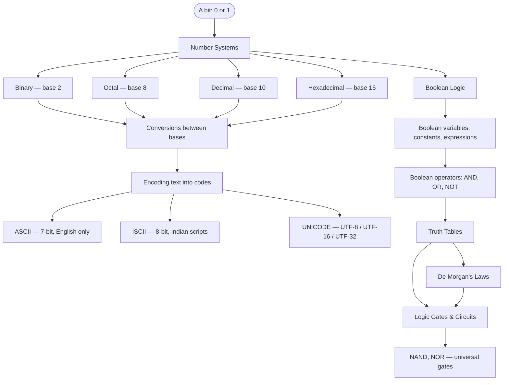
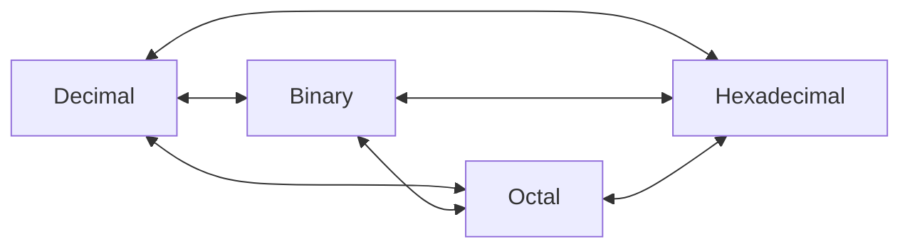

# Computer Science | Chapter 02 | Data Representation and Boolean Logic | NOTES

**Branch:** Boolean Algebra & Logic Gates (built on Number System foundations) · **Level:** Class XI (CBSE)
**Companion files:** `CS02-...-GLOSSARY.md` (fast lookup), `CS02-...-CNOTES.md` (self-test before revision)

> **Sources reconciled in this note:**
> - **Primary:** *Computer Science with Python–XI* (Sumita Arora), Chapter 2 — "Data Representation and Boolean Logic" (Sections 2.1–2.9). Section numbering below follows this book.
> - **Supplementary:** NCERT *Computer Science–XI*, Chapter 2 — "Encoding Schemes and Number System." NCERT covers only the number-system/encoding half (no Boolean logic); its unique explanations, tables, and examples are folded in and marked **(NCERT)**.

---

## Concept Roadmap



*Interpretation:* everything a computer stores — numbers, letters, or logical truth values — ultimately reduces to the same two symbols, `0` and `1`. Number systems tell us how to **read** those bits as values; encoding schemes tell us how to map **characters** onto them; Boolean logic tells us how to make **decisions** with them.

---

## 2.1 Introduction ⭐

A computer's circuits carry information as electrical pulses with only two recognisable states — **ON** and **OFF**. These map naturally to `1` and `0`, so a computer stores and processes everything in **binary (digital) form**.

- One wire → one **bit** (binary digit) → 2 states (`0`/`1`).
- More wires → more bits → more distinct combinations → more complex information can be represented (Fig. 2.1 in the source shows 1 wire = 2 states, 2 wires = 4 states, 3 wires = 8 states).

> **Key idea:** Every symbol a computer handles — numeric, alphabetic, alphanumeric, special character, or multimedia data — is ultimately represented as a unique combination of `0`s and `1`s.

**(NCERT) Worked walk-through:** when the key `A` is pressed, it is internally mapped to the decimal **code value 65**, which is converted to its 7-bit binary form `0100 0001`. Similarly, the Devanagari letter `अ` maps to hexadecimal code `0905`, i.e. binary `0000100100000101`. This chain — *key → code (decimal/hex) → binary* — is exactly what Sections 2.2–2.4 below explain in full.

| Kind of data | Examples |
|---|---|
| Numeric | 0, 1, 2, …, 9 |
| Alphabetic | A–Z, a–z |
| Alphanumeric | Mix of letters, digits (e.g. `A1B2`) |
| Special characters | `+ - # @ $ % ? blank` |
| Multimedia | audio, video, graphics, images |

> [!info] Why 65 for 'A', and is it universal?
> Yes — every keyboard maps 'A' to the same underlying code because of **standard encoding schemes** (ASCII, ISCII, UNICODE) agreed upon industry-wide, not because of any property of the letter itself. This is precisely what makes text portable between devices, operating systems, and software. **(NCERT)**

---

## 2.2 Number System ⭐⭐

> **Definition (CTM):** A number system is the technique used to represent numbers in computer system architecture.

Every number system is defined by three things for each digit:

1. **Face value** — the digit itself.
2. **Base / Radix** — the count of unique symbols the system uses.
3. **Position** — where the digit sits in the number (its *positional value* is `base^position`).

The four number systems used in computing:

| Number System | Base (Radix) | Symbols used |
|---|---|---|
| Binary | 2 | `0, 1` |
| Octal | 8 | `0, 1, 2, 3, 4, 5, 6, 7` |
| Decimal | 10 | `0, 1, 2, …, 9` |
| Hexadecimal | 16 | `0–9, A, B, C, D, E, F` (A=10, B=11, C=12, D=13, E=14, F=15) |

> [!info] Most Significant Bit (MSB) and Least Significant Bit (LSB)
> The **left-most digit** of a number (carrying the greatest positional weight) is the **MSB**. The **right-most digit** (lowest weight) is the **LSB**. This holds for *every* number system, not just binary.

> [!info] Learning Tip — what actually stores the bit (Sumita Arora)
> A **microprocessor (CPU)** is a small electronic component built on a single chip called an **integrated circuit (IC)** that performs the basic arithmetic and logical operations on data. An IC is a piece of semiconductor material loaded with **transistors** and other electronic components. A **transistor** is a tiny switch activated by the electronic signal it receives — the digits `1` and `0` used in binary directly reflect a transistor's **ON** and **OFF** states.

### Consolidated Number Representation Table (0–15) ⭐⭐ (NCERT, Table 2.2 equivalent)

A single reference table for the first 16 values in all four systems — invaluable for quick binary↔hex/octal grouping:

| Decimal | Binary | Octal | Hexadecimal |
|---|---|---|---|
| 0 | 0000 | 0 | 0 |
| 1 | 0001 | 1 | 1 |
| 2 | 0010 | 2 | 2 |
| 3 | 0011 | 3 | 3 |
| 4 | 0100 | 4 | 4 |
| 5 | 0101 | 5 | 5 |
| 6 | 0110 | 6 | 6 |
| 7 | 0111 | 7 | 7 |
| 8 | 1000 | 10 | 8 |
| 9 | 1001 | 11 | 9 |
| 10 | 1010 | 12 | A |
| 11 | 1011 | 13 | B |
| 12 | 1100 | 14 | C |
| 13 | 1101 | 15 | D |
| 14 | 1110 | 16 | E |
| 15 | 1111 | 17 | F |

> **Key idea:** notice the octal column jumps straight from `7` to `10` (there's no digit `8` or `9` in base 8), and the hexadecimal column continues past `9` into `A`–`F` instead of rolling over to two digits until `16`.

### 2.2.1 Decimal Number System ⭐

Base 10, digits `0–9`. Positional values are powers of 10: `...10², 10¹, 10⁰ . 10⁻¹, 10⁻²...` — positive powers to the left of the decimal point (increasing right→left), negative powers to the right (decreasing left→right).

\[
123.45 = 1\times10^{2} + 2\times10^{1} + 3\times10^{0} + 4\times10^{-1} + 5\times10^{-2}
\]

### 2.2.2 Binary Number System ⭐

Base 2, digits `0, 1` — matches the ON/OFF transistor states directly, which is why computers use it internally. Positional values are powers of 2.

Example: `(10101.1101)₂` has integer-part weights `2⁴ 2³ 2² 2¹ 2⁰` and fractional-part weights `2⁻¹ 2⁻² 2⁻³ 2⁻⁴`.

### 2.2.3 Octal Number System ⭐

Base 8, digits `0–7`. Positional values are powers of 8. Devised to give a shorter, more manageable way to write long binary strings (see §2.3.3).

### 2.2.4 Hexadecimal Number System ⭐

Base 16, digits `0–9, A–F`. Positional values are powers of 16. Also devised to compact long binary numbers — one hex digit encodes exactly 4 bits.

Example: `(2A3.45)₁₆` = weights `16² 16¹ 16⁰ . 16⁻¹ 16⁻²` on digits `2, A, 3 . 4, 5`.

### 2.2.5 Applications of Hexadecimal Numbers ⭐⭐

- **Memory addressing:** a 16-bit or 32-bit memory address is unwieldy in binary. E.g. the 16-bit address `1111000010101111` is written compactly as `F0AF` in hexadecimal.
- **Web colour codes:** the format `#RRGGBB` uses two hex digits each for Red, Green, and Blue, each ranging `00`–`FF`. E.g. `#FF0000` = pure red.

**(NCERT) Colour codes table** — 24-bit RGB colour needs 8 bits per channel; hex compresses each channel to 2 digits:

| Colour | Decimal (R,G,B) | Binary | Hexadecimal |
|---|---|---|---|
| Black | (0,0,0) | 00000000,00000000,00000000 | (00,00,00) |
| White | (255,255,255) | 11111111,11111111,11111111 | (FF,FF,FF) |
| Yellow | (255,255,0) | 11111111,11111111,00000000 | (FF,FF,00) |
| Grey | (128,128,128) | 10000000,10000000,10000000 | (80,80,80) |

---

## 2.3 Number System Conversions ⭐⭐⭐

Conversions fall into three broad categories:



### 2.3.1 Decimal Number to Other Base ⭐⭐

**Whole-number part — repeated division:**

1. Divide the decimal number by the target base `b`; note the quotient and remainder.
2. Divide the new quotient by `b` again; note the remainder.
3. Repeat until the quotient becomes 0.
4. Read the remainders **bottom to top** (this gives MSB→LSB order).

**Fractional part — repeated multiplication:**

1. Multiply the fraction by `b`.
2. Record the integer part produced; keep only the new fractional part.
3. Repeat until the fractional part becomes `0`, or starts repeating (then stop and note it doesn't terminate).
4. Read the recorded integers **top to bottom**.

> [!example] Worked Example — Decimal 125 → Binary (Sumita Arora, Example 1)
> **Given:** `(125)₁₀`. **Find:** binary equivalent.
> **Approach:** repeated division by 2 (base of target system).
>
> | Divide by 2 | Quotient | Remainder |
> |---|---|---|
> | 125 | 62 | 1 (LSB) |
> | 62 | 31 | 0 |
> | 31 | 15 | 1 |
> | 15 | 7 | 1 |
> | 7 | 3 | 1 |
> | 3 | 1 | 1 |
> | 1 | 0 | 1 (MSB) |
>
> **Check:** read remainders bottom→top: `1111101`. So `(125)₁₀ = (1111101)₂`.

> [!example] Worked Example — Decimal 105.15 → Binary (Sumita Arora, Example 4)
> **Given:** `(105.15)₁₀`. **Find:** binary equivalent (integer + fraction).
> **Work (integer 105, ÷2 repeatedly):** remainders bottom→top give `(105)₁₀ = (1101001)₂`.
> **Work (fraction 0.15, ×2 repeatedly):**
>
> | Step | Multiply | Result | Integer part |
> |---|---|---|---|
> | 1 | 0.15 × 2 | 0.30 | 0 |
> | 2 | 0.30 × 2 | 0.60 | 0 |
> | 3 | 0.60 × 2 | 1.20 | 1 |
> | 4 | 0.20 × 2 | 0.40 | 0 |
> | 5 | 0.40 × 2 | 0.80 | 0 |
> | 6 | 0.80 × 2 | 1.60 | 1 |
>
> Reading integers top→bottom: `(0.15)₁₀ = (0.001001)₂`.
> **Check:** combine both parts → `(105.15)₁₀ = (1101001.001001)₂`.
>
> [!warning] ⚠️ A repeating fraction never becomes exactly 0
> If the fractional product keeps repeating without ever reaching `.000`, stop after a reasonable number of digits (commonly 6–10) and note that the conversion is non-terminating in that base.

> [!example] Worked Example — Decimal 125 → Octal (Sumita Arora, Example 5) ⭐
> Repeated division by 8: `125 ÷ 8 = 15` rem `5`; `15 ÷ 8 = 1` rem `7`; `1 ÷ 8 = 0` rem `1`.
> Reading bottom→top: `(125)₁₀ = (175)₈`.

> [!example] Worked Example — Decimal 300 → Hexadecimal (Sumita Arora, Example 7) ⭐
> Repeated division by 16: `300 ÷ 16 = 18` rem `12 (= C)`; `18 ÷ 16 = 1` rem `2`; `1 ÷ 16 = 0` rem `1`.
> Reading bottom→top: `(300)₁₀ = (12C)₁₆`.

> [!example] Worked Example — Decimal fraction 0.21875 → Octal (Sumita Arora, Example 6)
> **Given:** `(0.21875)₁₀`. **Approach:** repeated multiplication by 8.
>
> | Multiply | Result | Integer part |
> |---|---|---|
> | 0.21875 × 8 | 1.75000 | 1 (LSB) |
> | 0.75000 × 8 | 6.00000 | 6 (MSB — fraction now 0, stop) |
>
> **Check:** reading integers top→bottom: `(0.21875)₁₀ = (0.16)₈`.

> [!example] Worked Example — Decimal fraction 0.03125 → Hexadecimal (Sumita Arora, Example 8)
> **Given:** `(0.03125)₁₀`. **Approach:** repeated multiplication by 16.
>
> | Multiply | Result | Integer part |
> |---|---|---|
> | 0.03125 × 16 | 0.50000 | 0 |
> | 0.50000 × 16 | 8.00000 | 8 (fraction now 0, stop) |
>
> **Check:** reading integers top→bottom: `(0.03125)₁₀ = (0.08)₁₆`.

### 2.3.2 Other Base to Decimal Number System ⭐⭐

**Method (works for binary, octal, hexadecimal alike):**

1. Write the position number of each digit (0 at the right-most integer digit, increasing leftward by 1; −1, −2, … for fractional digits, decreasing left→right).
2. Raise the base to each position number to get that digit's positional value.
3. Multiply each digit by its positional value.
4. Sum all the products.

> [!example] Worked Example — Binary 100011 → Decimal ⭐
> **Given:** `(100011)₂`. **Approach:** positional-weight method, base 2.
>
> | Digit | 1 | 0 | 0 | 0 | 1 | 1 |
> |---|---|---|---|---|---|---|
> | Position | 5 | 4 | 3 | 2 | 1 | 0 |
> | Value | `1×2⁵=32` | `0×2⁴=0` | `0×2³=0` | `0×2²=0` | `1×2¹=2` | `1×2⁰=1` |
>
> **Check:** `32+0+0+0+2+1 = 35`. So `(100011)₂ = (35)₁₀`.

> [!example] Worked Example — Octal 321 → Decimal ⭐
> `3×8² + 2×8¹ + 1×8⁰ = 192 + 16 + 1 = (209)₁₀`.

> [!example] Worked Example — Hexadecimal AB → Decimal ⭐
> `A×16¹ + B×16⁰ = 10×16 + 11×1 = 160 + 11 = (171)₁₀`.

**Fractional non-decimal → decimal** works the same way with negative-position weights:

> [!example] Octal 23.25 → Decimal
> `2×8¹ + 3×8⁰ + 2×8⁻¹ + 5×8⁻² = 16 + 3 + 0.25 + 0.078125 = (19.328125)₁₀`.

> [!example] Worked Example — Binary fraction 11011.1101 → Decimal (Sumita Arora)
> **Given:** `(11011.1101)₂`.
>
> | Digit | 1 | 1 | 0 | 1 | 1 | . | 1 | 1 | 0 | 1 |
> |---|---|---|---|---|---|---|---|---|---|---|
> | Position | 4 | 3 | 2 | 1 | 0 | | −1 | −2 | −3 | −4 |
> | Value | 16 | 8 | 0 | 2 | 1 | | 0.5 | 0.25 | 0 | 0.0625 |
>
> **Check:** `16+8+0+2+1 = 27` (integer part); `0.5+0.25+0+0.0625 = 0.8125`. Sum → `(11011.1101)₂ = (27.8125)₁₀`.

> [!example] Worked Example — Hexadecimal fraction 1E.8C → Decimal (Sumita Arora, Example 9)
> **Given:** `(1E.8C)₁₆`.
>
> | Digit | 1 | E | . | 8 | C |
> |---|---|---|---|---|---|
> | Position | 1 | 0 | | −1 | −2 |
> | Value | `1×16¹=16` | `14×16⁰=14` | | `8×16⁻¹=0.5` | `12×16⁻²=0.046875` |
>
> **Check:** `16+14+0.5+0.046875 = (30.546875)₁₀`.

### 2.3.3 One Base to Another Base System ⭐⭐⭐

**Binary ↔ Hexadecimal (group of 4 bits):** because `16 = 2⁴`, exactly 4 binary digits encode one hex digit.

| Binary | Hex | Binary | Hex |
|---|---|---|---|
| 0000 | 0 | 1000 | 8 |
| 0001 | 1 | 1001 | 9 |
| 0010 | 2 | 1010 | A |
| 0011 | 3 | 1011 | B |
| 0100 | 4 | 1100 | C |
| 0101 | 5 | 1101 | D |
| 0110 | 6 | 1110 | E |
| 0111 | 7 | 1111 | F |

- **Binary → Hex:** group bits in 4s from the *binary point outward* (right→left for the integer part, left→right for the fraction), padding with leading/trailing `0`s where a group is short, then write the hex digit for each group.
- **Hex → Binary:** replace each hex digit with its 4-bit binary equivalent and concatenate.

> [!example] Worked Example — Binary 1001.11001 → Hexadecimal (Sumita Arora)
> Integer part `1001` needs no padding → one group of 4: `1001`.
> Fractional part `11001` is grouped left→right in 4s, padding the last group with trailing zeros: `1100 | 1000`.
> Convert each group: `1001 = 9`; `1100 = 12 (C)`; `1000 = 8`.
> **Result:** `(1001.11001)₂ = (9.C8)₁₆`.
>
> [!warning] ⚠️ Always confirm which side you're padding
> Pad the **integer part on the left** (toward the MSB) and the **fractional part on the right** (toward the LSB) — padding the wrong side silently changes the value.

> [!example] Worked Example — Hexadecimal 10AF → Binary (Sumita Arora, Example 10)
> `1→0001, 0→0000, A→1010, F→1111` → `(10AF)₁₆ = (0001000010101111)₂`.

> [!example] Worked Example — Hexadecimal A2F → Binary (Sumita Arora, Example 11)
> `A→1010, 2→0010, F→1111` → `(A2F)₁₆ = (1010 0010 1111)₂`.

> [!example] Worked Example — Hexadecimal FACE.32 → Binary (Sumita Arora)
> Expand each hex digit to 4 bits: `F→1111, A→1010, C→1100, E→1110` (integer part); `3→0011, 2→0010` (fractional part).
> **Result:** `(FACE.32)₁₆ = (1111101011001110.00110010)₂`.

**Binary ↔ Octal (group of 3 bits):** because `8 = 2³`, exactly 3 binary digits encode one octal digit.

| Octal | Binary | Octal | Binary |
|---|---|---|---|
| 0 | 000 | 4 | 100 |
| 1 | 001 | 5 | 101 |
| 2 | 010 | 6 | 110 |
| 3 | 011 | 7 | 111 |

> [!example] Worked Example — Binary 10110101.11001 → Octal (Sumita Arora)
> Integer part grouped right→left in 3s (pad left with 0 if needed): `010 110 101` → `2 6 5`.
> Fraction part grouped left→right in 3s (pad right with 0 if needed): `110 010` → `6 2`.
> **Result:** `(10110101.11001)₂ = (265.62)₈`.

> [!example] Worked Example — Octal 742 → Binary (Sumita Arora)
> Replace each octal digit with its 3-bit binary form: `7→111, 4→100, 2→010`.
> **Result:** `(742)₈ = (111100010)₂`.

> [!example] Worked Example — Octal 3.1 → Binary (Sumita Arora)
> `3→011, 1→001` → `(3.1)₈ = (011.001)₂`.

**Hexadecimal ↔ Octal (via binary as the intermediate step):**

1. Expand each hex digit to 4 bits (or each octal digit to 3 bits).
2. Concatenate all the bits.
3. Re-group the full bit-string in the *other* group size (3 for octal, 4 for hex), then write the corresponding digit for each new group.

> [!example] Worked Example — Hexadecimal A2DE → Octal (Sumita Arora)
> Step 1 — expand to 4-bit binary: `A→1010, 2→0010, D→1101, E→1110` → `1010 0010 1101 1110`.
> Step 2 — combine: `10100010110111110` *(17 bits — pad to a multiple of 3 with leading 0s → 18 bits)* `001010001011011110`.
> Step 3 — regroup in 3s: `001 010 001 011 011 110` → `1 2 1 3 3 6`.
> **Result:** `(A2DE)₁₆ = (121336)₈`.

> [!example] Worked Example — Octal 762 → Hexadecimal (Sumita Arora)
> Step 1 — expand each octal digit to 3-bit binary: `7→111, 6→110, 2→010` → combined `111110010`.
> Step 2 — regroup in 4s from the right, padding the left with 0s: `0001 0111 0010`.
> Step 3 — write hex digit per group: `1 7 2`.
> **Result:** `(762)₈ = (172)₁₆`.

> [!example] Worked Example — Octal 345 → Hexadecimal (Sumita Arora)
> Step 1 — expand each digit to 3 bits: `3→011, 4→100, 5→101` → combined `011100101`.
> Step 2 — regroup in 4s from the right, padding the left with 0s: `0000 1110 0101`.
> Step 3 — write hex digit per group: `0 E 5`.
> **Result:** `(345)₈ = (E5)₁₆`.

### 2.3.4 Conversion of Numbers with Fractional Parts ⭐⭐ (NCERT emphasis)

NCERT states the fractional-conversion rules as their own explicit subsection — summarised here for completeness (methods already shown above, worked together):

| Direction | Method |
|---|---|
| Decimal fraction → other base | Multiply repeatedly by target base; record integer parts top→bottom; stop at `0` or when the fraction repeats |
| Other-base fraction → Decimal | Multiply each digit by its **negative** power-of-base positional value and sum |
| Binary fraction → Octal/Hex | Group fractional bits in 3s/4s from the binary point **rightward**, padding trailing zeros as needed |

> [!example] Decimal 0.375 → Binary (Sumita Arora, Example 3)
> `0.375×2=0.750`→`0`; `0.750×2=1.50`→`1`; `0.50×2=1.0`→`1` (fraction now 0, stop).
> Reading top→bottom: `(0.375)₁₀ = (0.011)₂`.

---

## 2.4 Internal Storage Encoding of Characters ⭐⭐

> **Definition:** Encoding is the mechanism of converting data into an equivalent code (a "cipher") using a specific scheme, so it can eventually be represented in binary and understood by the computer.


### ASCII — American Standard Code for Information Interchange ⭐⭐

- Developed by ANSI in the early 1960s to standardise character representation across machines.
- Uses **7 bits** → `2⁷ = 128` possible codes — covers digits `0–9`, lowercase `a–z`, uppercase `A–Z`, punctuation, control codes, and space.
- **Limitation:** encodes English-language characters only.

| Character | Decimal | 7-bit Binary |
|---|---|---|
| Space | 32 | 0100000 |
| `A` | 65 | 1000001 |
| `a` | 97 | 1100001 |
| `0` | 48 | 0110000 |

> [!example] Worked Example — Encode "DATA" in ASCII (Sumita Arora / NCERT, both give this example)
> **Given:** the word `DATA`. **Find:** ASCII decimal code and 7-bit binary for each letter.
>
> | Letter | D | A | T | A |
> |---|---|---|---|---|
> | ASCII (decimal) | 68 | 65 | 84 | 65 |
> | 7-bit Binary | 1000100 | 1000001 | 1010100 | 1000001 |
>
> **Check:** concatenating gives the full binary stream the computer stores for "DATA".

> [!example] Worked Example — Encode "BYTE," binary + hex, and byte count (Sumita Arora)
> `B=1000010` (hex `42`), `Y=1011001` (hex `59`), `T=1010100` (hex `54`), `E=1000101` (hex `45`).
> Since each ASCII-7 character occupies **1 byte**, the word `BYTE` (4 characters) needs **4 bytes** to store.

> [!example] Worked Example — Decode an ASCII message (reverse direction) (Sumita Arora)
> **Given:** a message encoded in ASCII binary: `1001000 1000101 1001100 1010000`.
> **Approach:** convert each 7-bit code into its hexadecimal equivalent, then look up the corresponding character in the ASCII table.
> Converting each 7-bit group to hex: `48, 45, 4C, 50`.
> Looking these decimal/hex values up in the ASCII table gives the characters `H, E, L, P`.
> **Result:** the decoded message is **`HELP`**.
>
> [!info] Encoding works both directions
> The same ASCII table used to *encode* a character (letter → code → binary) is used to *decode* it (binary → code → letter) — always keep the lookup table's direction in mind when a question gives you binary/hex and asks for the text.

### ISCII — Indian Script Code for Information Interchange ⭐

- Adopted by the Bureau of Indian Standards in 1991 (developed mid-1980s **(NCERT)**).
- An **8-bit** code → `2⁸ = 256` characters, so it can represent English *and* Indian-script characters together.
- **Retains all 128 ASCII codes unchanged** and uses the remaining 128 codes (values 160–255) for the *aksharas* of Indian scripts.
- Covers 15 officially recognised Indian languages: Hindi, Marathi, Sanskrit, Punjabi, Gujarati, Oriya, Bengali, Assamese, Telugu, Kannada, Malayalam, Tamil, Urdu, Sindhi, Kashmiri.

### UNICODE ⭐⭐

- A universal coding standard maintained by the **Unicode Consortium** (a non-profit).
- Gives a **unique number ("code point") to every character**, regardless of platform, program, or language — enabling worldwide interchange of text without corruption or re-engineering.
- It is a **superset** of ASCII: code points 0–128 mean exactly the same characters as in ASCII.
- **(NCERT)** Devanagari script alone occupies the hex code-point block `0900`–`097F`; e.g. `अ = 0905`. The same NCERT Unicode chart also assigns Gujarati and other Indian scripts their own code-point blocks (Sumita Arora's Fig. 2.4 shows the ISCII code charts for Gujarati and Devanagari specifically) — each script gets its own dedicated, non-overlapping range so no two scripts' characters collide.

**Significance of Unicode:**
- One software/website can support multiple platforms, languages, and countries without re-engineering — cutting cost versus maintaining legacy character sets.
- Data can move across systems without corruption.
- It's the common conversion point between other encoding schemes, and the preferred scheme for XML-based tools.

### UTF-8, UTF-16, UTF-32 — Unicode Transformation Formats ⭐⭐

| Format | Bytes used | Type |
|---|---|---|
| UTF-8 | 1, 2, 3, or 4 bytes (depends on the code point's size) | Variable-width |
| UTF-16 | 2 or 4 bytes (most modern-language characters use 2) | Variable-width |
| UTF-32 | Always 4 bytes | Fixed-width |

> [!info] Why UTF-8 is special
> UTF-8 is **backward compatible with ASCII**: encoding a file containing only ASCII characters in UTF-8 produces output byte-for-byte identical to plain ASCII (since both use one byte for those characters). UTF-16 cannot make this claim — even a plain ASCII character occupies 2 bytes there.

---

## 2.5 Boolean Logic ⭐⭐

Developed by **George Boole** in the mid-1800s to put formal logic into mathematical form. Boolean logic evaluates the truth of a statement using only two possible values.

| Concept | Meaning |
|---|---|
| **Boolean statement (Proposition)** | Any statement with a definite value, either `True` or `False` — e.g. *"Is New Delhi the capital of India?"* (Not: *"Where is your house located?"* — has no true/false value.) |
| **Boolean variable** | A variable (e.g. `X`, `Y`, `Z`) that can hold only one of two values: `0`/`1`, `True`/`False`, `Yes`/`No`. Also called a *binary* or *logical* variable. One **bit** represents one Boolean variable. |
| **Boolean constant** | The actual values stored in Boolean variables: `True`/`False`, `1`/`0`, `Yes`/`No`. |
| **Boolean expression (Logical expression)** | A meaningful combination of Boolean operators, variables, and constants, e.g. `X + Y.Z`, `A.(B+C) + B.C'` |

> Physically: a switch has only two states — **open (binary 0)** and **closed (binary 1)**. If current passes through a circuit it represents `1`; else `0`.

---

## 2.6 Boolean Operators ⭐⭐⭐

Boolean/logical operators used in Boolean algebra:

| Operator | Symbol | Also called |
|---|---|---|
| AND | `.` (dot) | Logical multiplication |
| OR | `+` (plus) | Logical addition |
| NOT | `'` or an overbar | Negation / Complementation |

### 2.6.1 AND Operator ⭐⭐

Binary operator on two variables. Result is `1` **only when both inputs are `1`**; otherwise `0`.

| A | B | A·B |
|---|---|---|
| 0 | 0 | 0 |
| 0 | 1 | 0 |
| 1 | 0 | 0 |
| 1 | 1 | 1 |

### 2.6.2 OR Operator ⭐⭐

Binary operator on two variables. Result is `1` if **either or both** inputs are `1`; `0` only when both are `0`.

| A | B | A+B |
|---|---|---|
| 0 | 0 | 0 |
| 0 | 1 | 1 |
| 1 | 0 | 1 |
| 1 | 1 | 1 |

### 2.6.3 NOT Operator ⭐

Unary operator (one input). Reverses/complements the input.

| A | A' |
|---|---|
| 0 | 1 |
| 1 | 0 |

> **Key idea:** `A` and `A'` are always opposite — if `A = 0`, then `A' = 1`, and vice versa.

---

## 2.7 Truth Table ⭐⭐⭐

> **Definition:** A truth table lists **every possible combination** of input values for a Boolean expression, along with the resulting output, in tabular form.

- If the result is **always `1`**, the expression is a **Tautology**.
- If the result is **always `0`**, the expression is a **Fallacy**.
- **Number of rows** = `2ⁿ`, where `n` = number of distinct Boolean variables.
- **Number of columns** = number of variables + number of distinct logical sub-expressions.

**Rules for constructing a truth table:**

1. Count the literals/variables in the expression.
2. Draw one column per unique variable.
3. Draw one column per logical sub-operation in the expression.
4. Draw `2ⁿ` rows.
5. Fill the first variable's column: first half `0`s, second half `1`s.
6. For the next column, halve each of those halves again (alternate blocks of `0`s and `1`s), and repeat this halving pattern for every subsequent variable column, ending with strict alternation (`0,1,0,1,...`) in the last variable's column.
7. Compute each logical-expression column row by row from the variable values already filled in.

> [!example] Worked Example — Truth table for F = A·B′ + C (Sumita Arora)
> **Given:** 3 variables (A, B, C) → `2³ = 8` rows; columns needed: `A, B, C, B', A.B', A.B'+C`.
>
> | A | B | C | B' | A.B' | A.B'+C |
> |---|---|---|---|---|---|
> | 0 | 0 | 0 | 1 | 0 | 0 |
> | 0 | 0 | 1 | 1 | 0 | 1 |
> | 0 | 1 | 0 | 0 | 0 | 0 |
> | 0 | 1 | 1 | 0 | 0 | 1 |
> | 1 | 0 | 0 | 1 | 1 | 1 |
> | 1 | 0 | 1 | 1 | 1 | 1 |
> | 1 | 1 | 0 | 0 | 0 | 0 |
> | 1 | 1 | 1 | 0 | 0 | 1 |

> [!example] Worked Example — Truth table for F = A + B·C′ + A′·C′ (Sumita Arora)
> **Given:** 3 variables (A, B, C) → `2³ = 8` rows; columns needed: `A, B, C, C', A', B.C', A'.C', A+B.C'+A'.C'`.
>
> | A | B | C | C' | A' | B.C' | A'.C' | A+B.C'+A'.C' |
> |---|---|---|---|---|---|---|---|
> | 0 | 0 | 0 | 1 | 1 | 0 | 1 | 1 |
> | 0 | 0 | 1 | 0 | 1 | 0 | 0 | 0 |
> | 0 | 1 | 0 | 1 | 1 | 1 | 1 | 1 |
> | 0 | 1 | 1 | 0 | 1 | 0 | 0 | 0 |
> | 1 | 0 | 0 | 1 | 0 | 0 | 0 | 1 |
> | 1 | 0 | 1 | 0 | 0 | 0 | 0 | 1 |
> | 1 | 1 | 0 | 1 | 0 | 1 | 0 | 1 |
> | 1 | 1 | 1 | 0 | 0 | 0 | 0 | 1 |

### Precedence of Boolean Operators ⭐⭐⭐

| Priority | Operator |
|---|---|
| 1st (highest) | NOT |
| 2nd | AND |
| 3rd (lowest) | OR |

**Rules for evaluating a Boolean expression:**

1. Evaluate left to right.
2. Evaluate anything inside parentheses first.
3. Perform all NOT operations.
4. Perform all AND operations.
5. Perform all OR operations.

> [!warning] ⚠️ NOT beats AND beats OR
> In `X.Y' + Z`, the complement `Y'` is computed first, then `X.Y'` (AND), and only then is `Z` OR-ed in — **not** left-to-right blindly.

> [!example] Verify `X.(Y+Z) = (X.Y) + (X.Z)` by truth table (Distributive Law, Example 12)
>
> | X | Y | Z | Y+Z | X.(Y+Z) | X.Y | X.Z | (X.Y)+(X.Z) |
> |---|---|---|---|---|---|---|---|
> | 0 | 0 | 0 | 0 | 0 | 0 | 0 | 0 |
> | 0 | 0 | 1 | 1 | 0 | 0 | 0 | 0 |
> | 0 | 1 | 0 | 1 | 0 | 0 | 0 | 0 |
> | 0 | 1 | 1 | 1 | 0 | 0 | 0 | 0 |
> | 1 | 0 | 0 | 0 | 0 | 0 | 0 | 0 |
> | 1 | 0 | 1 | 1 | 1 | 0 | 1 | 1 |
> | 1 | 1 | 0 | 1 | 1 | 1 | 0 | 1 |
> | 1 | 1 | 1 | 1 | 1 | 1 | 1 | 1 |
>
> **Check:** the last two columns match for every row → L.H.S. = R.H.S., confirming the Distributive Law.

> [!example] Verify `X+Y.Z = (X+Y).(X+Z)` by truth table (OR distributing over AND) (Sumita Arora, Q. 16)
>
> | X | Y | Z | Y.Z | X+Y.Z | (X+Y) | (X+Z) | (X+Y).(X+Z) |
> |---|---|---|---|---|---|---|---|
> | 0 | 0 | 0 | 0 | 0 | 0 | 0 | 0 |
> | 0 | 0 | 1 | 0 | 0 | 0 | 1 | 0 |
> | 0 | 1 | 0 | 0 | 0 | 1 | 0 | 0 |
> | 0 | 1 | 1 | 1 | 1 | 1 | 1 | 1 |
> | 1 | 0 | 0 | 0 | 1 | 1 | 1 | 1 |
> | 1 | 0 | 1 | 0 | 1 | 1 | 1 | 1 |
> | 1 | 1 | 0 | 0 | 1 | 1 | 1 | 1 |
> | 1 | 1 | 1 | 1 | 1 | 1 | 1 | 1 |
>
> **Check:** the highlighted columns `X+Y.Z` and `(X+Y).(X+Z)` are identical row for row → L.H.S. = R.H.S. This is the **dual form** of the Distributive Law verified in the previous example — swapping every `.`↔`+` turns one into the other, exactly as the Duality Principle (§2.9) predicts.

> [!example] Verify `X.X′ = 0` and `X+1 = 1` by truth table (Sumita Arora, Q. 17)
>
> | X | X' | X.X' | X+1 |
> |---|---|---|---|
> | 0 | 1 | 0 | 1 |
> | 1 | 0 | 0 | 1 |
>
> **Check:** `X.X'` is `0` for every value of `X` (the Inverse/Complement Law's AND form), and `X+1` is `1` for every value of `X` (the Property of 1's OR form) — both are **tautology/fallacy-style identities** rather than expressions that depend on the input.

---

## 2.8 Logic Circuit ⭐⭐⭐

> **Definition:** A logic circuit takes one or more inputs and generates an output, built from **logic gates** that implement Boolean operators.

### The Three Fundamental Gates

| Gate | Inputs | Behaviour |
|---|---|---|
| **NOT** ("inverter") | 1 | Output is the complement of the input |
| **AND** | 2 or more | Output is `1` only if *all* inputs are `1` |
| **OR** | 2 or more | Output is `1` if *any* input is `1` |

### Other Important Gates

| Gate | Behaviour | Relation to fundamentals |
|---|---|---|
| **NAND** | Output is `0` only if *both* inputs are `1`; else `1` | AND followed by NOT |
| **NOR** | Output is `1` only if *both* inputs are `0`; else `0` | OR followed by NOT |
| **XOR** (exclusive-OR) | Output is `1` if inputs *differ*; `0` if they are the same | "Either, but not both" |

> [!info] NAND and NOR are Universal Gates
> Any digital circuit — including AND, OR, and NOT themselves — can be built using **only NAND gates**, or **only NOR gates**. This is why they're called *universal gates*.

### Truth Tables and Gate Symbols

**Full truth tables for all six gates** (Sumita Arora consolidates these in one table):

| X | X' (NOT) |
|---|---|
| 0 | 1 |
| 1 | 0 |

| X | Y | X.Y (AND) | X+Y (OR) | (X.Y)' (NAND) | (X+Y)' (NOR) | X⊕Y (XOR) |
|---|---|---|---|---|---|---|
| 0 | 0 | 0 | 0 | 1 | 1 | 0 |
| 0 | 1 | 0 | 1 | 1 | 0 | 1 |
| 1 | 0 | 0 | 1 | 1 | 0 | 1 |
| 1 | 1 | 1 | 1 | 0 | 0 | 0 |

| Operator | Gate symbol (schematic) |
|---|---|
| NOT | Triangle + bubble |
| AND | Flat-back D shape |
| OR | Curved-back pointed shape |
| NAND | D shape + bubble |
| NOR | OR shape + bubble |
| XOR | OR shape with double curved input line |

> [!example] NAND gate — truth table and circuit (Sumita Arora, Solved Q.8)
> **Given:** a 2-input NAND gate on inputs A, B.
>
> | A | B | (A.B)' |
> |---|---|---|
> | 0 | 0 | 1 |
> | 0 | 1 | 1 |
> | 1 | 0 | 1 |
> | 1 | 1 | 0 |
>
> **Circuit:** an AND gate on inputs A and B, with its output passed through a small inversion bubble, labelled `(AB)'` — see the NAND gate symbol above.

**AND gate symbol** (2-input):

```svg
<svg viewBox="0 0 160 130" xmlns="http://www.w3.org/2000/svg" style="max-width:100%;height:auto" font-family="sans-serif">
  <path d="M 40 30 L 40 90 L 70 90 A 30 30 0 0 0 70 30 Z" fill="#ffffff" stroke="#262626" stroke-width="1.5"/>
  <line x1="10" y1="45" x2="40" y2="45" stroke="#262626" stroke-width="1.5"/>
  <line x1="10" y1="75" x2="40" y2="75" stroke="#262626" stroke-width="1.5"/>
  <line x1="100" y1="60" x2="130" y2="60" stroke="#262626" stroke-width="1.5"/>
  <text x="15" y="42" font-size="11" fill="#555555">X</text>
  <text x="15" y="72" font-size="11" fill="#555555">Y</text>
  <text x="135" y="64" font-size="11" fill="#1565c0">X.Y</text>
  <text x="65" y="115" font-size="12" fill="#262626" text-anchor="middle">AND</text>
</svg>
```

**OR gate symbol** (2-input, curved back edge and pointed front):

```svg
<svg viewBox="0 0 160 130" xmlns="http://www.w3.org/2000/svg" style="max-width:100%;height:auto" font-family="sans-serif">
  <path d="M 30 30 Q 55 60 30 90 Q 60 85 100 60 Q 60 35 30 30 Z" fill="#ffffff" stroke="#262626" stroke-width="1.5"/>
  <line x1="5" y1="45" x2="33" y2="45" stroke="#262626" stroke-width="1.5"/>
  <line x1="5" y1="75" x2="33" y2="75" stroke="#262626" stroke-width="1.5"/>
  <line x1="100" y1="60" x2="130" y2="60" stroke="#262626" stroke-width="1.5"/>
  <text x="10" y="42" font-size="11" fill="#555555">X</text>
  <text x="10" y="72" font-size="11" fill="#555555">Y</text>
  <text x="135" y="64" font-size="11" fill="#1565c0">X+Y</text>
  <text x="65" y="115" font-size="12" fill="#262626" text-anchor="middle">OR</text>
</svg>
```

**NOT gate symbol** (triangle + inversion bubble):

```svg
<svg viewBox="0 0 160 100" xmlns="http://www.w3.org/2000/svg" style="max-width:100%;height:auto" font-family="sans-serif">
  <path d="M 40 25 L 40 75 L 90 50 Z" fill="#ffffff" stroke="#262626" stroke-width="1.5"/>
  <circle cx="97" cy="50" r="6" fill="#ffffff" stroke="#262626" stroke-width="1.5"/>
  <line x1="10" y1="50" x2="40" y2="50" stroke="#262626" stroke-width="1.5"/>
  <line x1="103" y1="50" x2="140" y2="50" stroke="#262626" stroke-width="1.5"/>
  <text x="15" y="45" font-size="11" fill="#555555">X</text>
  <text x="145" y="54" font-size="11" fill="#1565c0">X'</text>
  <text x="65" y="90" font-size="12" fill="#262626" text-anchor="middle">NOT</text>
</svg>
```

**NAND gate symbol** (AND shape with an added inversion bubble):

```svg
<svg viewBox="0 0 160 130" xmlns="http://www.w3.org/2000/svg" style="max-width:100%;height:auto" font-family="sans-serif">
  <path d="M 40 30 L 40 90 L 70 90 A 30 30 0 0 0 70 30 Z" fill="#ffffff" stroke="#262626" stroke-width="1.5"/>
  <circle cx="107" cy="60" r="6" fill="#ffffff" stroke="#262626" stroke-width="1.5"/>
  <line x1="10" y1="45" x2="40" y2="45" stroke="#262626" stroke-width="1.5"/>
  <line x1="10" y1="75" x2="40" y2="75" stroke="#262626" stroke-width="1.5"/>
  <line x1="113" y1="60" x2="140" y2="60" stroke="#262626" stroke-width="1.5"/>
  <text x="15" y="42" font-size="11" fill="#555555">A</text>
  <text x="15" y="72" font-size="11" fill="#555555">B</text>
  <text x="145" y="64" font-size="11" fill="#1565c0">(A.B)'</text>
  <text x="65" y="115" font-size="12" fill="#262626" text-anchor="middle">NAND</text>
</svg>
```

**NOR gate symbol** (OR shape with an added inversion bubble):

```svg
<svg viewBox="0 0 160 130" xmlns="http://www.w3.org/2000/svg" style="max-width:100%;height:auto" font-family="sans-serif">
  <path d="M 30 30 Q 55 60 30 90 Q 60 85 100 60 Q 60 35 30 30 Z" fill="#ffffff" stroke="#262626" stroke-width="1.5"/>
  <circle cx="107" cy="60" r="6" fill="#ffffff" stroke="#262626" stroke-width="1.5"/>
  <line x1="5" y1="45" x2="33" y2="45" stroke="#262626" stroke-width="1.5"/>
  <line x1="5" y1="75" x2="33" y2="75" stroke="#262626" stroke-width="1.5"/>
  <line x1="113" y1="60" x2="140" y2="60" stroke="#262626" stroke-width="1.5"/>
  <text x="10" y="42" font-size="11" fill="#555555">A</text>
  <text x="10" y="72" font-size="11" fill="#555555">B</text>
  <text x="145" y="64" font-size="11" fill="#1565c0">(A+B)'</text>
  <text x="65" y="115" font-size="12" fill="#262626" text-anchor="middle">NOR</text>
</svg>
```

**XOR gate symbol** (OR shape with an extra curved line at the input side):

```svg
<svg viewBox="0 0 160 130" xmlns="http://www.w3.org/2000/svg" style="max-width:100%;height:auto" font-family="sans-serif">
  <path d="M 22 30 Q 40 60 22 90" fill="none" stroke="#262626" stroke-width="1.5"/>
  <path d="M 30 30 Q 55 60 30 90 Q 60 85 100 60 Q 60 35 30 30 Z" fill="#ffffff" stroke="#262626" stroke-width="1.5"/>
  <line x1="0" y1="45" x2="26" y2="45" stroke="#262626" stroke-width="1.5"/>
  <line x1="0" y1="75" x2="26" y2="75" stroke="#262626" stroke-width="1.5"/>
  <line x1="100" y1="60" x2="130" y2="60" stroke="#262626" stroke-width="1.5"/>
  <text x="4" y="42" font-size="11" fill="#555555">A</text>
  <text x="4" y="72" font-size="11" fill="#555555">B</text>
  <text x="135" y="64" font-size="11" fill="#1565c0">A⊕B</text>
  <text x="65" y="115" font-size="12" fill="#262626" text-anchor="middle">XOR</text>
</svg>
```

### Constructing a Circuit from an Expression, and Vice-Versa ⭐⭐⭐

> [!example] Draw the circuit for `F = A.B' + C'.D` (Sumita Arora)
> **Approach:** identify sub-expressions inside-out: complement `B` (NOT gate) and complement `C` (NOT gate); AND `A` with `B'`; AND `C'` with `D`; OR the two AND outputs together to get `F`.
> **Structure:** `NOT(B) → AND with A` ⟶ one input to final OR gate; `NOT(C) → AND with D` ⟶ other input to final OR gate; OR gate output = `F`.

> [!example] Read a circuit back into an expression (U, V, W inputs) (Sumita Arora)
> Given a circuit where `U` and `V` each pass through separate NOT gates before being AND-ed together, and `U'` is AND-ed with `W'`, with both AND outputs OR-ed together:
> **Result:** `Y = (U.V') + (U'.W')`.

> [!example] Read a circuit back into an expression, second form (U, V, W inputs) (Sumita Arora)
> Given a circuit where `U` passes through a NOT gate before being OR-ed with `V` (giving `U'+V`), while `V` (untouched) and `W` (through a NOT gate) are OR-ed together (giving `V'+W`), and the two OR outputs are finally AND-ed together:
> **Result:** `Z = (U'+V).(V'+W)`.

> [!example] Obtain the Boolean expression for a mixed NOT/AND/OR/NOT circuit (Sumita Arora, CBSE 2014)
> Given a circuit where input `A` passes through a NOT gate before being AND-ed with `B` (giving `A'.B`), while `C` and `D` (the latter through a NOT gate, giving `D'`) are OR-ed together and that OR output is passed through a further NOT gate (giving `(C+D')'`), with the two results finally OR-ed together:
> **Result:** `F = A'.B + (C+D')'`.

> [!example] Identify which single gate a compound circuit is equivalent to (Sumita Arora, multi-gate NAND-chain diagram)
> **Given:** a multi-stage circuit combining several NAND-shaped gates on inputs `X` and `Y` (see the source diagram for exact wiring — a chain of AND-with-bubble stages feeding a final AND-with-bubble stage).
> **Approach:** simplify stage by stage using De Morgan's Laws — a chain of NAND stages arranged this way algebraically collapses via repeated complementation.
> **Result (as given in the source):** the whole circuit is equivalent to a single **NOR** gate — i.e. option **(d) NOR** out of {AND, OR, NAND, NOR}.
>
> [!warning] ⚠️ Trace the actual wiring, don't pattern-match
> This kind of "identify the equivalent single gate" question only yields the correct answer if you trace each stage's output algebraically against the source circuit diagram — treat the answer above as the confirmed result, but re-derive it from your own textbook's figure rather than from memory.

---

## 2.9 De Morgan's Law ⭐⭐⭐

Two laws (proposed by mathematician **De Morgan**) that convert between AND/OR by pushing a NOT through them — the algebraic basis for building AND/OR/NOT circuits entirely from NAND or NOR gates.

### First Law

\[
\overline{A+B} = \overline{A}\cdot\overline{B}
\]

*In words:* the complement of an OR is the AND of the complements. ("NOT (A OR B)" behaves the same as "NOT A AND NOT B".)

**Proof outline (algebraic):** Let `P = A+B`. Since `P + P' = 1` and `P.P' = 0` (Complement Law), substituting `(A+B)'` for `P'` and simplifying via the Distributive and Commutative Laws on both `(A+B)+(A'.B')=1` and `(A+B).(A'.B')=0` confirms `(A+B)' = A'.B'`. *(Full step-by-step algebraic proof is in the source; the truth-table proof below is the quicker classroom check.)*

**Proof by truth table:**

| A | B | A' | B' | A+B | (A+B)' | A'.B' |
|---|---|---|---|---|---|---|
| 0 | 0 | 1 | 1 | 0 | 1 | 1 |
| 0 | 1 | 1 | 0 | 1 | 0 | 0 |
| 1 | 0 | 0 | 1 | 1 | 0 | 0 |
| 1 | 1 | 0 | 0 | 1 | 0 | 0 |

Columns `(A+B)'` and `A'.B'` match in every row ⟹ proved.

### Second Law

\[
\overline{A\cdot B} = \overline{A}+\overline{B}
\]

*In words:* the complement of an AND is the OR of the complements.

**Proof by truth table:**

| A | B | A' | B' | A.B | (A.B)' | A'+B' |
|---|---|---|---|---|---|---|
| 0 | 0 | 1 | 1 | 0 | 1 | 1 |
| 0 | 1 | 1 | 0 | 0 | 1 | 1 |
| 1 | 0 | 0 | 1 | 0 | 1 | 1 |
| 1 | 1 | 0 | 0 | 1 | 0 | 0 |

Columns `(A.B)'` and `A'+B'` match in every row ⟹ proved.

> [!info] Circuit-level meaning
> Law 1 says: *an OR-gate-then-NOT* circuit behaves identically to *two NOT gates feeding an AND gate*. Law 2 says: *an AND-gate-then-NOT* circuit behaves identically to *two NOT gates feeding an OR gate*. This equivalence is exactly why NAND/NOR gates alone can rebuild every other gate.

### Duality Principle ⭐⭐

Replacing variables in an expression doesn't change the value of the Boolean function if you also:

1. Replace every `.` (AND) with `+` (OR).
2. Replace every `+` (OR) with `.` (AND).
3. Replace every `0` with `1` and every `1` with `0`.

The transformed expression is called the **dual**.

> [!example] Find the dual of `A.B + A.C` (Sumita Arora)
> Swap `.`↔`+`: dual is `(A+B).(A+C)`.

> [!example] Find the dual of `x.y̅ + x̅.z` (Sumita Arora)
> Swap `.`↔`+` (complements on variables stay as-is): dual is `(x+y̅).(x̅+z)`.

> [!example] Find the dual of `(A.1) + (B.(C+0))` (Sumita Arora)
> **Approach:** swap every `.`↔`+`, **and** swap every literal `0`↔`1` — the constants in this expression must flip, not just the operators.
> Swap `.`→`+`, `+`→`.`, and `1`→`0`, `0`→`1`: `(A+0) . (B+(C.1))`.
> **Result:** dual is `(A+0).(B+(C.1))`.

### Summary Table of Boolean Laws ⭐⭐⭐

| # | Law Name | AND form | OR form |
|---|---|---|---|
| 1 | Property of 0 | `0.A = 0` | `0+A = A` |
| 2 | Property of 1 | `1.A = A` | `1+A = 1` |
| 3 | Idempotent Law | `A.A = A` | `A+A = A` |
| 4 | Inverse/Complement Law | `A.A' = 0` | `A+A' = 1` |
| 5 | Commutative Law | `A.B = B.A` | `A+B = B+A` |
| 6 | Associative Law | `A.(B.C) = (A.B).C` | `A+(B+C) = (A+B)+C` |
| 7 | Distributive Law | `A+B.C = (A+B).(A+C)` | `A.(B+C) = A.B+A.C` |
| 8 | Absorption Law | `A.(A+B) = A` | `A+A.B = A` |
| 9 | De Morgan's Law | `\(\overline{A.B} = \overline{A}+\overline{B}\)` | `\(\overline{A+B} = \overline{A}.\overline{B}\)` |

---

## Quick Reference

### Number System Cheat-Sheet

| System | Base | Symbols | Group size for binary conversion |
|---|---|---|---|
| Binary | 2 | 0,1 | — |
| Octal | 8 | 0–7 | 3 bits |
| Decimal | 10 | 0–9 | — (use division/multiplication method) |
| Hexadecimal | 16 | 0–9, A–F | 4 bits |

### Conversion Method Cheat-Sheet

| From → To | Method |
|---|---|
| Decimal → any base | Repeated division (integer) / repeated multiplication (fraction); read remainders bottom→top, integers top→bottom |
| Any base → Decimal | Multiply each digit by `base^position`, sum all products |
| Binary ↔ Octal | Group in 3s (pad zeros) |
| Binary ↔ Hex | Group in 4s (pad zeros) |
| Octal ↔ Hex | Convert via binary as the intermediate step |

### Encoding Scheme Cheat-Sheet

| Scheme | Bits | Max characters | Scope |
|---|---|---|---|
| ASCII | 7 | 128 | English only |
| ISCII | 8 | 256 | English + Indian scripts |
| UNICODE (UTF-8/16/32) | Variable (8/16/32-bit units) | All world scripts | Universal, superset of ASCII |

### Boolean/Logic Cheat-Sheet

| Concept | Symbol/Rule |
|---|---|
| AND | `.`; result 1 only if all inputs 1 |
| OR | `+`; result 1 if any input 1 |
| NOT | `'`; flips the value |
| Precedence | NOT → AND → OR |
| Universal gates | NAND, NOR |
| De Morgan 1 | `(A+B)' = A'.B'` |
| De Morgan 2 | `(A.B)' = A'+B'` |

### All-Gates Truth Table (at a glance)

| X | Y | AND | OR | NAND | NOR | XOR |
|---|---|---|---|---|---|---|
| 0 | 0 | 0 | 0 | 1 | 1 | 0 |
| 0 | 1 | 0 | 1 | 1 | 0 | 1 |
| 1 | 0 | 0 | 1 | 1 | 0 | 1 |
| 1 | 1 | 1 | 1 | 0 | 0 | 0 |

---

## Points to Ponder ⭐⭐⭐

> [!warning] ⚠️ Traps that actually cost marks
> - **MSB/LSB direction:** remainders from decimal-to-base conversion must be read **bottom to top** — writing them top to bottom silently reverses the number.
> - **Grouping direction for fractions:** when grouping binary digits into octal/hex, the **integer part groups right→left**, but the **fractional part groups left→right** — mixing these up misplaces digits.
> - **Padding zeros:** pad the *integer* part on the **left** (MSB side) and the *fractional* part on the **right** (LSB side) when a group is short of 3 or 4 bits.
> - **Operator precedence:** NOT binds tighter than AND, which binds tighter than OR — `X.Y'+Z` is `(X.(Y'))+Z`, not `X.(Y'+Z)`.
> - **NAND/NOR vs AND/OR:** a NAND gate is *not* an AND gate — it's AND-then-invert. Forgetting the final inversion bubble is a very common circuit-reading error.
> - **ASCII is 7-bit by default:** don't assume 8 bits (that's ISCII/extended-ASCII territory) unless the question specifies ASCII-8.
> - **Truth table row count:** always `2ⁿ` for `n` variables — for 3 variables that's 8 rows, not 6 or 9.
> - **Duality also flips 0s and 1s**, not just operators — a dual isn't just "swap `.` and `+`" if literal constants `0`/`1` appear in the expression.

---

## Problem-Solving Strategy ⭐⭐⭐

**"Convert this number to another base" → checklist:**
1. Identify the *given* base and the *target* base.
2. Decimal involved? → use division (whole part) / multiplication (fraction) method.
3. Only binary/octal/hex involved (no decimal)? → use the grouping method (3 bits for octal, 4 bits for hex; via binary if octal↔hex directly).
4. Has a fractional part? → convert integer and fractional parts **separately**, then join with the radix point.
5. Trace every remainder/product step by hand once before trusting the final answer.

**"Build/read a logic circuit" → checklist:**
1. Identify each gate by its *shape* (D-shape = AND, curved-point = OR, triangle+bubble = NOT) and check for an inversion bubble (NAND/NOR).
2. Work **inside-out**: resolve NOT gates first, then AND gates, then the final OR gate — matching operator precedence.
3. Write the Boolean expression stage by stage, matching each gate to its algebraic operator.
4. If asked to *verify* an expression or law, build the truth table and compare the relevant columns row by row.

**"Write a truth table" → checklist:**
1. Count variables → rows = `2ⁿ`.
2. List every unique sub-expression as its own column, in the order it would be evaluated (NOT → AND → OR).
3. Fill variable columns using the halving pattern (first half 0, second half 1; recurse).
4. Compute each expression column strictly from already-filled columns to its left.
