# Computer Science | Chapter 03 | Getting Started with Python | CNOTES

- Covers NCERT Class XI Computer Science, Chapter 4 (Introduction to Problem Solving) and Chapter 5 (Getting Started with Python).
- Supplementary source: *Computer Science with Python — XI*, single combined Chapter 4 ("Computational Thinking and Getting Started with Python"); content unique to it is labeled **(Supp.)**.
- Python version assumed throughout: Python 3.x.
- This edition folds in material a first pass missed: Computational Thinking and its four pillars, the Advantages/Limitations of Python lists, Python's origin story, several solved worked examples from the supplementary book, and a set of exact traced facts (IDLE's full form, how to exit Python, the string lexicographic-comparison rule).

---

# PART A — Chapter 4: Introduction to Problem Solving

Branch: Problem Solving & Algorithms. Level: Class XI.

## Concept Roadmap

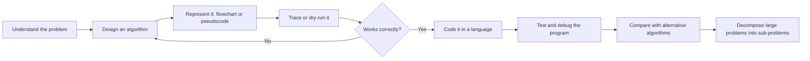

- Problem solving loops back through algorithm design every time a dry run or a test reveals a gap; it is not a straight line to code. §Concept Roadmap

## §4.1 Why Problem Solving Matters

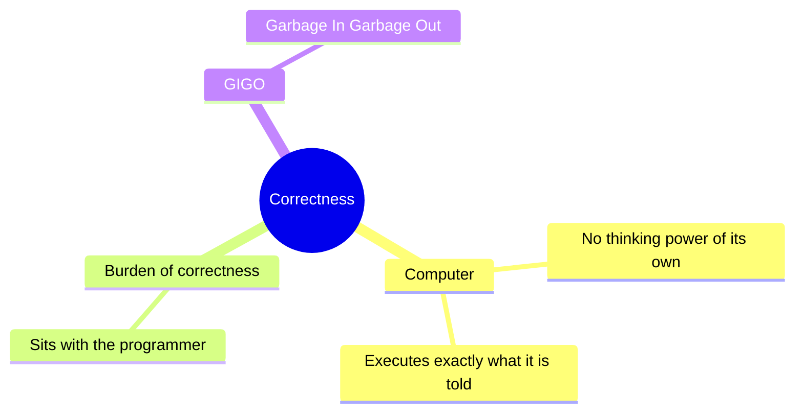

- A computer has no thinking power of its own. §4.1
- A computer executes exactly what it is told, in exactly the sequence it is told. §4.1
- The entire burden of correctness sits with the person who writes the instructions, not the machine. §4.1
- Problem solving is the process of: (1) identifying a problem, (2) developing an algorithm for it, (3) implementing that algorithm as a program. §4.1
- GIGO stands for Garbage In, Garbage Out. §4.1
- The correctness of a computer's output depends entirely on the correctness of the input and the logic supplied. §4.1
- ⚠ A perfectly executed program built on a wrong algorithm still gives a wrong answer. §4.1

## §4.2 Steps for Problem Solving

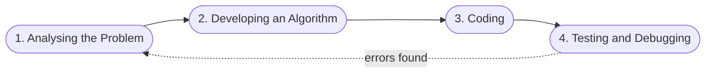

| # | Step | What happens | Why it matters |
|---|---|---|---|
| 1 | Analysing the problem | Read the problem statement carefully; list the exact inputs the program should accept and the exact outputs it should produce | Skipping this leads to a program that solves the wrong problem correctly |
| 2 | Developing an algorithm | Write a tentative, step-by-step solution in natural language; refine it until it covers every case | More than one algorithm is usually possible — pick the most suitable one |
| 3 | Coding | Convert the finished algorithm into a programming language, following that language's syntax | Also involves documenting the coding decisions for future maintenance |
| 4 | Testing and debugging | Run the program on many inputs; fix syntactical and logical errors until output is correct for all valid inputs | A syntax error produces no output at all; a logical error produces a wrong output |

- These four steps form a cycle in practice, not a one-way pipeline. §4.2
- Bugs found in testing routinely send you back to re-analyse or re-design. §4.2

## §4.3 Algorithm

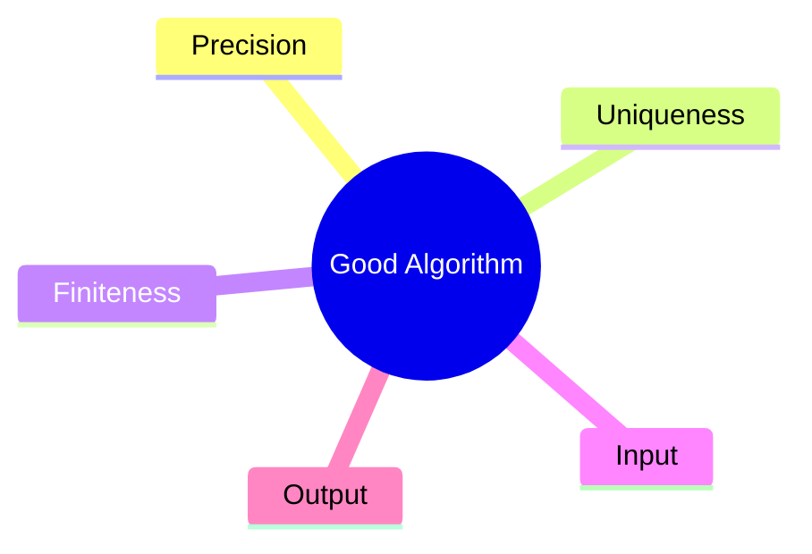

- Definition: an algorithm is a finite sequence of precisely stated, unambiguous steps that, if followed correctly, leads to the desired result in a finite amount of time. §4.3

**Worked example — GCD by listing divisors:**
- Method: list every divisor of each number, then pick the largest value common to both lists. §4.3
- Divisors of 45: 1, 3, 5, 9, 15, 45. §4.3
- Divisors of 54: 1, 2, 3, 6, 9, 18, 27, 54. §4.3
- Common divisors: 1, 3, 9. GCD = 9. §4.3

**Why do we need an algorithm:**
- A programmer prepares a roadmap of the program before writing a single line of code — that roadmap is the algorithm. §4.3
- Without an algorithm, the programmer cannot clearly visualise the instructions to be written. §4.3
- Search engines, messaging, finding a word in a document, booking a taxi through an app, online banking, and computer games are all built on algorithms underneath. §4.3
- If the algorithm is correct, the computer will run the resulting program correctly every single time. §4.3
- The purpose of an algorithm is to increase the reliability, accuracy, and efficiency of the eventual solution. §4.3
- ⚠ The word "Algorithm" traces to the Persian astronomer/mathematician Al-Khwarizmi (c. 850 AD) — the Latin translation of his name became "Algorithmi." §4.3

**Characteristics of a good algorithm:**

| Characteristic | Meaning |
|---|---|
| Precision | Each step is stated exactly, with no room for misreading |
| Uniqueness | The result of every step is uniquely determined by the input and the results of earlier steps |
| Finiteness | The algorithm always stops after a finite number of steps |
| Input | The algorithm accepts zero or more well-defined inputs |
| Output | The algorithm produces at least one well-defined output |

- While writing any algorithm, three things must be clearly identified: the input to be taken from the user, the processing needed to reach the result, and the output desired. §4.3
- ⚠ An algorithm that does not stop after a finite number of steps becomes an infinite loop, not an algorithm — finiteness is part of the definition. §4.3

## §4.3A Computational Thinking

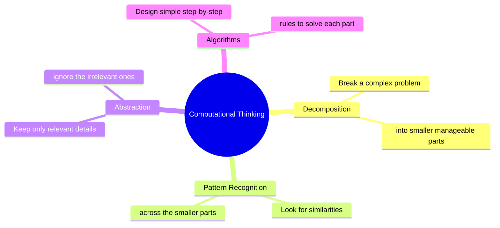

- Definition: Computational Thinking is the thought process of formulating a problem and expressing its solution(s) in a way a human, a computer, or both, can effectively carry out. §4.3A
- Before writing any program, the problem and its solution must first be thought through computationally — only then is the program written in a language. §4.3A
- Computational thinking is not limited to programmers — everyday decisions use it too: making tea or coffee, buying a car, changing jobs, moving city, buying a house, writing a book, creating an app. §4.3A
- Patterns cannot be recognised until the problem is decomposed. §4.3A
- The algorithm cannot be written until abstraction has identified which details matter. §4.3A

**Pillar 1 — Decomposition:**
- Breaking a complex problem or system into smaller, more easily manageable parts, solved one after another until the bigger problem is solved. §4.3A
- Example: tasting an unfamiliar dish and identifying its individual ingredients from the flavour. §4.3A
- Example: giving directions to a house — decomposing "getting from A to B" into city, then area, then street. §4.3A
- Example: breaking a course project into smaller steps/sub-tasks. §4.3A
- Example: decomposing 256.37 as 2×10² + 5×10¹ + 6×10⁰ + 3×10⁻¹ + 7×10⁻². §4.3A
- Example: the quadratic-formula root decomposes into 8 steps — b², 4ac, b²−4ac, √(b²−4ac), −b±√(b²−4ac), 2a, x₁=(−b+√(b²−4ac))/2a, repeat for x₂ using −b−√(b²−4ac). §4.3A

**Pillar 2 — Pattern Recognition:**
- Identifying patterns or trends within a problem, once decomposed, so a recognised pattern can be reused to solve the larger problem more effectively. §4.3A
- Example: all cats share eyes, tails, fur — describing one cat lets any cat be described by varying only the specifics (green eyes/long tail/black fur vs yellow eyes/short tail/striped fur). §4.3A
- Example: drivers watch traffic patterns to decide when to switch lanes. §4.3A
- Example: investors watch stock-price patterns to decide when to buy or sell. §4.3A
- Example: scientists derive theories and models from patterns in data. §4.3A
- Example: learning from past patterns avoids repeating the same mistake. §4.3A

**Pillar 3 — Abstraction:**
- Focusing only on important, relevant information and ignoring irrelevant details, so a general model of the problem emerges. §4.3A
- Example: a world map is an abstraction of the Earth using only longitude and latitude. §4.3A
- Example: an aisle sign in a store is an abstraction of every item stocked in that aisle. §4.3A
- Example: a book report summarises only the theme or key aspects of the book. §4.3A

**Pillar 4 — Algorithms:**
- The last pillar: design simple step-by-step rules to solve each of the smaller problems, once decomposed, pattern-matched, and abstracted. §4.3A
- This pillar is the same "Algorithm" concept covered in §4.3. §4.3A

- ⚠ "Decomposition" is used at two different scales in this unit: as a Computational Thinking pillar (breaking down one problem, §4.3A) and as a systems-design technique (breaking down an entire software system, e.g. Railway Reservation, §4.9). §4.3A

## §4.4 Representation of Algorithms

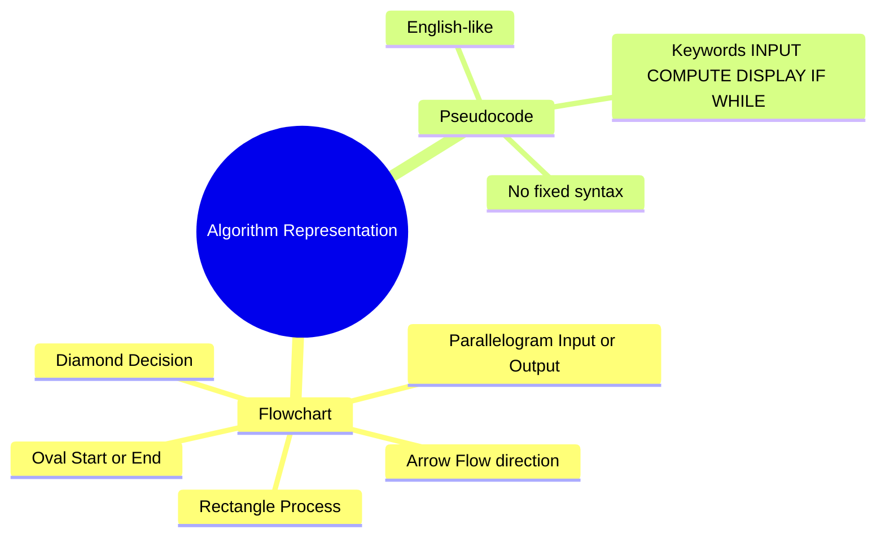

- An algorithm can be represented as a flowchart (visual) or as pseudocode (English-like text). §4.4
- Either representation should show the logic of the solution without implementation detail. §4.4
- Either representation should make the flow of control during execution clear. §4.4

### §4.4.1 Flowchart — Standard Symbols

| Symbol | Name | What it represents |
|---|---|---|
| Oval (stadium) | Start/End (Terminator) | Where the flow starts and ends |
| Rectangle | Process | A computation or processing step |
| Parallelogram | Input/Output | Reading a value in, or displaying a value out |
| Diamond | Decision | A yes/no or true/false question that splits the flow |
| Arrow | Connector | Order/direction of flow between shapes |

**Worked example — square of a number:**

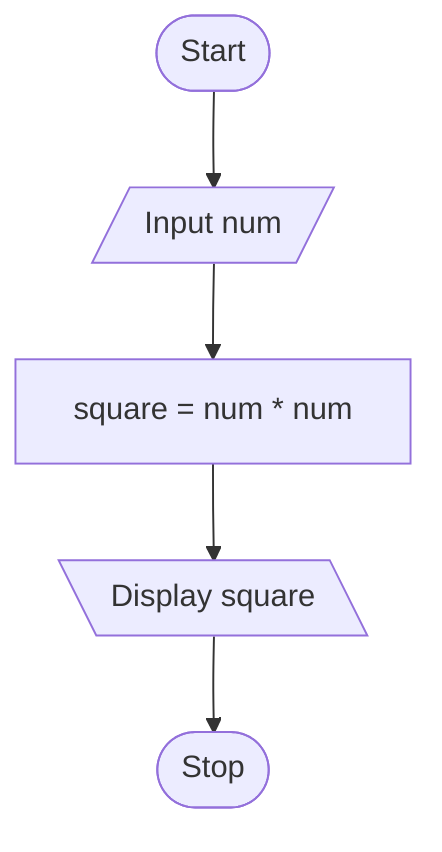
- Method: input num, compute square = num × num, display square. §4.4.1

**Worked example — average of three numbers (Supp., Example 4.1):**

```mermaid
flowchart TD
    A([Start]) --> B[/Read a, b, c/]
    B --> C[avg = (a + b + c) / 3]
    C --> D[\Print avg\]
    D --> E([Stop])
```
- Method: read a, b, c; compute avg = (a+b+c)/3; print avg. §4.4.1

**Worked example — non-functioning light bulb (NCERT Example 4.2):**

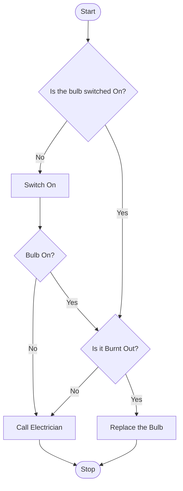
- This flowchart represents everyday decision-making, not code. §4.4.1
- "Call Electrician" is reached from two different decision paths: bulb switched on but "Bulb On?" answers No, or bulb is on but "Is it Burnt Out?" answers No. §4.4.1

### §4.4.2 Pseudocode

- Pseudocode has no fixed syntax. §4.4.2
- It is an informal, English-like description meant to be read by humans, never executed directly by a computer. §4.4.2
- Keywords used in this note: INPUT, COMPUTE, DISPLAY/PRINT, SET, WHILE, IF...THEN...ELSE. §4.4.2
- A good pseudocode is not written in any specific coding language. §4.4.2
- A good pseudocode drafts the structure of the eventual code. §4.4.2
- A good pseudocode stays understandable to any human reader. §4.4.2

**Worked example — sum of two numbers (NCERT Example 4.3):**
```text
INPUT num1
INPUT num2
COMPUTE Result = num1 + num2
DISPLAY Result
```
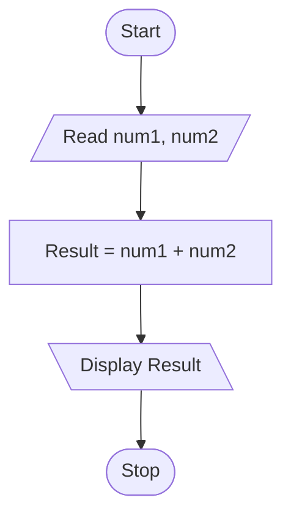

**Worked example — area and perimeter of a rectangle (NCERT Example 4.4):**
```text
INPUT length
INPUT breadth
COMPUTE Area = length * breadth
DISPLAY Area
COMPUTE Perimeter = 2 * (length + breadth)
DISPLAY Perimeter
```

**Worked example — Celsius to Fahrenheit (Supp., Solved Q.14):**
- Formula: F = C × 1.8 + 32. §4.4.2
- Check: 100°C → 212°F; 0°C → 32°F. §4.4.2

**Worked example — largest of three numbers (Supp., Solved Q.16):**
- Needs nested selection — a single IF A>B is not enough, since C must also be checked against whichever of A/B is bigger. §4.4.2
```text
INPUT A, B, C
IF A > B AND A > C THEN
    DISPLAY "A is the largest number"
ELSE
    IF B > C THEN
        DISPLAY "B is the largest number"
    ELSE
        DISPLAY "C is the largest number"
    END IF
END IF
```
- Trace check: A=7, B=9, C=4 → A>B is False → B>C is True → "B is the largest" (correct, since 9 is largest of 7, 9, 4). §4.4.2

**Worked example — average of ten students' marks (Supp., Example 3):**
- Sentinel-free, count-controlled version; counter starts at 1 rather than 0. §4.4.2
```text
SET total = 0
SET marks_counter = 1
WHILE marks_counter <= 10, REPEAT:
    INPUT the next marks
    ADD the marks into total
    INCREMENT marks_counter
COMPUTE average = total / 10
DISPLAY average
```

**Worked example — pseudocode next to its Python code (Supp., Example 4):**

| Pseudocode | Python code |
|---|---|
| INPUT username | name = input("What is your name?") |
| DISPLAY "Hello " + username | print("Hello" + name) |

**Everyday pseudocode (Supp., Fig. 4.5):**
- Making a phone call: Unlock Phone → Open Contacts → Search for Contact → Place a Call → End Call. §4.4.2
- Sending a man to the Moon: Launch → Navigate to the Moon → Land on the Moon. §4.4.2
- Pseudocode can describe any step-by-step process, not just numeric calculations. §4.4.2

## §4.5 Flow of Control

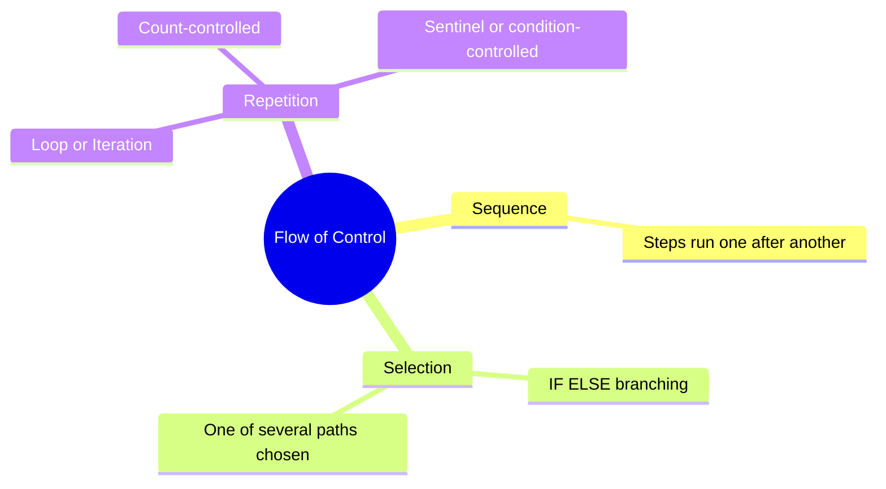

- Flow of control describes how the steps of an algorithm actually execute: in order, along one of several branches, or repeated a number of times. §4.5

### §4.5.1 Sequence
- The simplest flow: every statement executes once, in the order written. §4.5.1
- Both worked pseudocode examples in §4.4.2 (sum of two numbers, area/perimeter) illustrate pure sequence. §4.5.1

### §4.5.2 Selection

- Selection means the algorithm evaluates a condition and executes different steps depending on whether the condition is True or False. §4.5.2
```text
IF <condition> THEN
    steps to be taken when the condition is true
ELSE
    steps to be taken when the condition is false (otherwise)
END IF
```
- In programming languages, "otherwise" is written using the else keyword. §4.5.2
- A two-way conditional is written as an if-else block in actual code. §4.5.2

**Worked example — odd or even (NCERT Example 4.5):**
```text
DISPLAY "Enter the Number"
INPUT number
IF number MOD 2 == 0 THEN
    DISPLAY "Number is Even"
ELSE
    DISPLAY "Number is Odd"
```
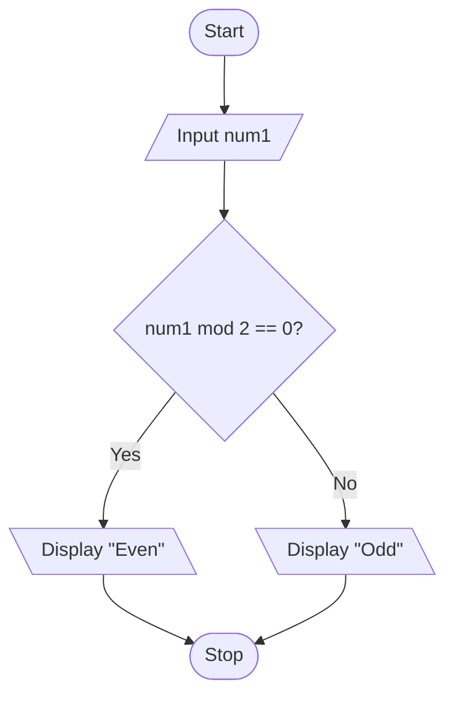

**Worked example — child/teenager/adult (NCERT Example 4.6):**
```text
INPUT Age
IF Age < 13 THEN
    DISPLAY "Child"
ELSE IF Age < 20 THEN
    DISPLAY "Teenager"
ELSE
    DISPLAY "Adult"
END IF
```
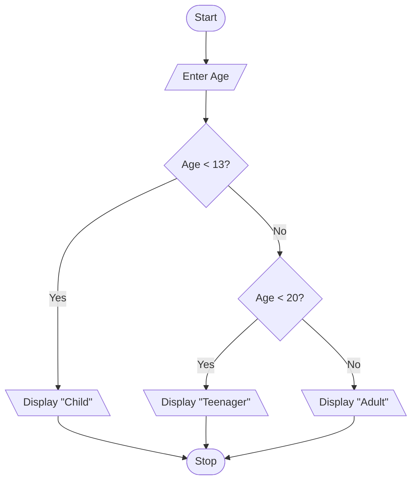

**Worked example — "Dragons and Wizards" card game (NCERT Example 4.7):**
- Multiple AND/OR conditions can be chained in a single IF…ELSE IF…ELSE block. §4.5.2
- Rule: card is diamond or club → Team DRAGONS scores. §4.5.2
- Rule: card is a heart that is a number → Team WIZARDS scores. §4.5.2
- Rule: card is a heart that is not a number → Team DRAGONS scores. §4.5.2
- Rule: any other card → Team WIZARDS scores. §4.5.2
- Two running counters, Dpoint and Wpoint, are incremented inside each branch, then compared at the end to decide the winner. §4.5.2

### §4.5.3 Repetition (Iteration / Loop)

- Repetition means a set of steps executes repeatedly until a specified condition is satisfied. §4.5.3
- A counter variable is commonly used to track how many times the loop has run. §4.5.3

**Worked example — average of 5 numbers (NCERT Example 4.8), count-controlled:**
```text
Step 1: SET count = 0, sum = 0
Step 2: WHILE count < 5, REPEAT steps 3 to 5
Step 3:     INPUT num
Step 4:     sum = sum + num
Step 5:     count = count + 1
Step 6: COMPUTE average = sum / 5
Step 7: DISPLAY average
```
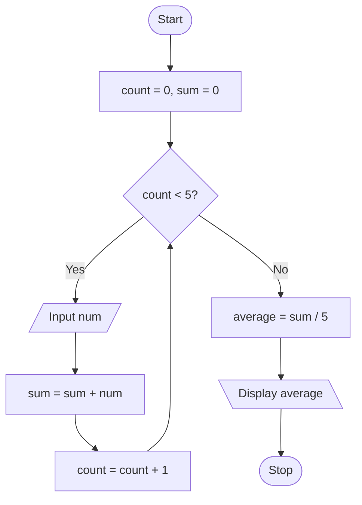

**Worked example — accept numbers until user enters 0 (NCERT Example 4.9), sentinel-controlled:**
```text
Step 1: SET count = 0, sum = 0
Step 2: INPUT num
Step 3: WHILE num is not equal to 0, REPEAT steps 4 to 6
Step 4:     sum = sum + num
Step 5:     count = count + 1
Step 6:     INPUT num
Step 7: COMPUTE average = sum / count
Step 8: DISPLAY average
```
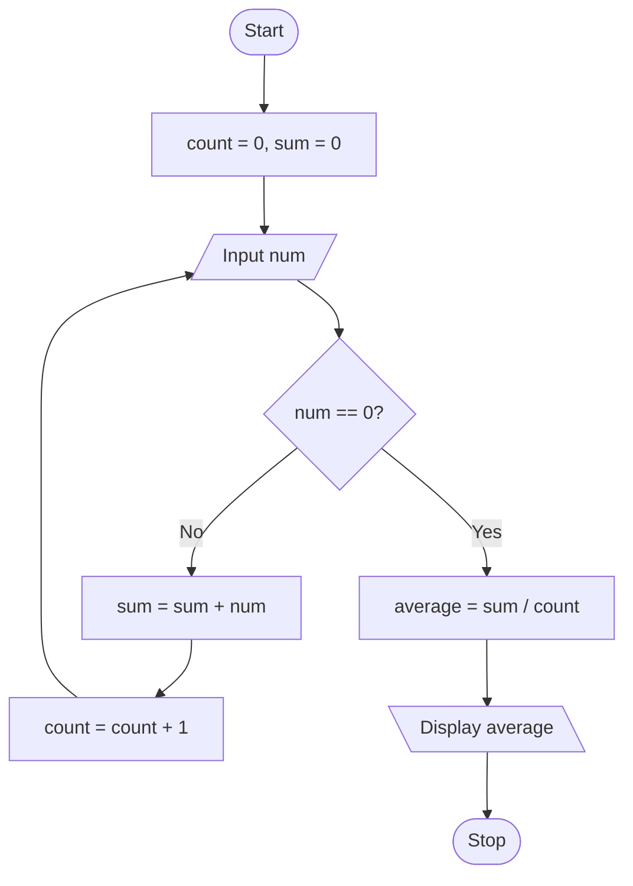

- ⚠ Count-controlled loop (WHILE count < N) is used when the number of repetitions is known in advance. §4.5.3
- ⚠ Sentinel-controlled loop (WHILE input ≠ stop-value) is used when repetitions continue until the data itself signals "stop." §4.5.3

**Worked example — table of a number, 1 to 10 (adapted from Supp., Solved Q.17):**
```text
INPUT n
SET a = 1
WHILE a <= 10, REPEAT:
    DISPLAY a * n
    INCREMENT a
```
- Presented in standard pre-test WHILE form for unambiguous behaviour: exactly 10 lines are printed, multipliers 1 through 10. §4.5.3
- Check: for n = 5, prints 5, 10, 15, ..., 50 — ten lines. §4.5.3

**Worked example — sum of a factorial series, 1! + 2! + ... + 10! (Supp., Solved Q.18):**
```text
SET F = 1, sum = 0
SET a = 1
WHILE a <= 10, REPEAT:
    F = F * a
    sum = sum + F
    a = a + 1
DISPLAY sum
```
- Method: keep a running factorial F, multiplied by the loop counter each pass; add F into an accumulating sum. §4.5.3
- Trace: a=1 → F=1, sum=1. a=2 → F=2, sum=3. a=3 → F=6, sum=9. §4.5.3

## §4.6 Verifying Algorithms

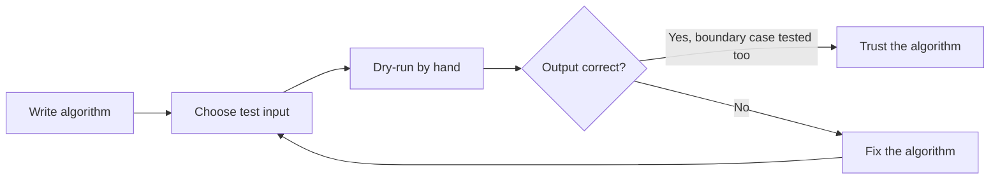

- Verifying an algorithm means taking different input values and tracing through every step by hand (a dry run), checking the output matches expectation, before trusting the algorithm enough to code it. §4.6

**Worked example — buggy time-addition algorithm (NCERT §4.6):**
```text
INPUT hh1, mm1   (for T1)
INPUT hh2, mm2   (for T2)
hh_total = hh1 + hh2
mm_total = mm1 + mm2
DISPLAY hh_total, mm_total
```
- Trial 1: T1=5h20m, T2=7h30m → hh_total=12, mm_total=50 → "12 hrs 50 mins" — looks correct. §4.6
- Trial 2: T1=4h50m, T2=2h20m → hh_total=6, mm_total=70 → "6 hrs 70 mins" — wrong; correct answer is 7 hrs 10 mins. §4.6
- Fix: IF mm_total >= 60 THEN hh_total = hh_total + 1; mm_total = mm_total − 60. §4.6
- Re-check Trial 2 with fix: mm_total=70≥60 → hh_total=7, mm_total=10 → "7 hrs 10 mins" — now correct. §4.6
- ⚠ Trial 1 alone would have hidden the bug completely — always dry-run more than one test case, including a boundary case. §4.6
- A dry run helps identify incorrect steps. §4.6
- A dry run helps spot missing details or special cases the algorithm hasn't accounted for. §4.6

## §4.7 Comparison of Algorithms

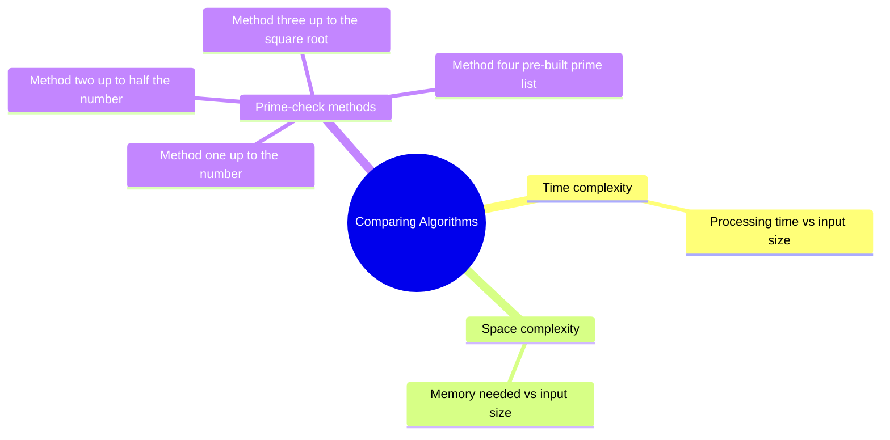

- More than one algorithm can solve the same problem. §4.7
- Choice between algorithms is based on time complexity (processing time relative to input size) and space complexity (memory needed). §4.7

**Four ways to test whether a number is prime:**

| Method | Description | Efficiency note |
|---|---|---|
| (i) | Divide by every number from 2 up to the number itself | Slowest — checks far more divisors than necessary |
| (ii) | Same as (i), but only up to half the number | Better — a divisor can never exceed half the number |
| (iii) | Only up to the square root of the number | Better still — fewer divisors than method (ii) |
| (iv) | Pre-built list of primes below 100, divide only by those | Fewest calculations, but needs extra memory |

- Algorithm (iv) trades memory for speed — a good trade only when memory is cheap and speed matters more. §4.7
- As n grows, √n stays far smaller than n/2 — this is why method (iii) needs dramatically fewer comparisons for large numbers. §4.7

## §4.8 Coding

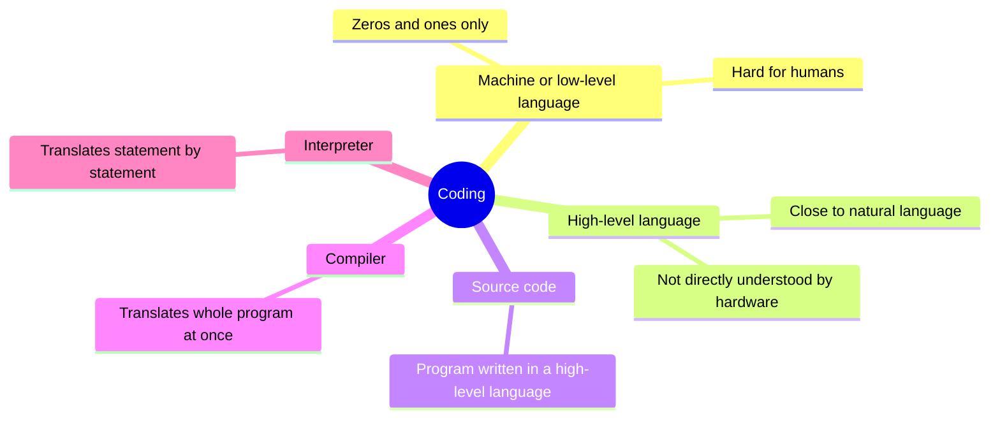

- Once an algorithm is finalised, it is translated into a high-level programming language, following that language's syntax. §4.8
- Syntax is the rules of grammar (spelling, word order, punctuation) that statements must obey. §4.8

| Term | Meaning |
|---|---|
| Machine / low-level language | 0s and 1s only; directly understood by hardware, extremely hard for humans to write or read |
| High-level language | Close to natural language (Python, C, C++, Java...); easy for humans, not directly understood by hardware |
| Source code | A program written in a high-level language |
| Compiler | Translates the entire source code at once into object code before execution; reports all errors after scanning the whole program |
| Interpreter | Translates and executes source code statement by statement; stops at the first error encountered |

- High-level languages are portable — the same source code can run on different types of computers with little or no modification. §4.8
- Low-level code must be rewritten for each machine type. §4.8

## §4.9 Decomposition

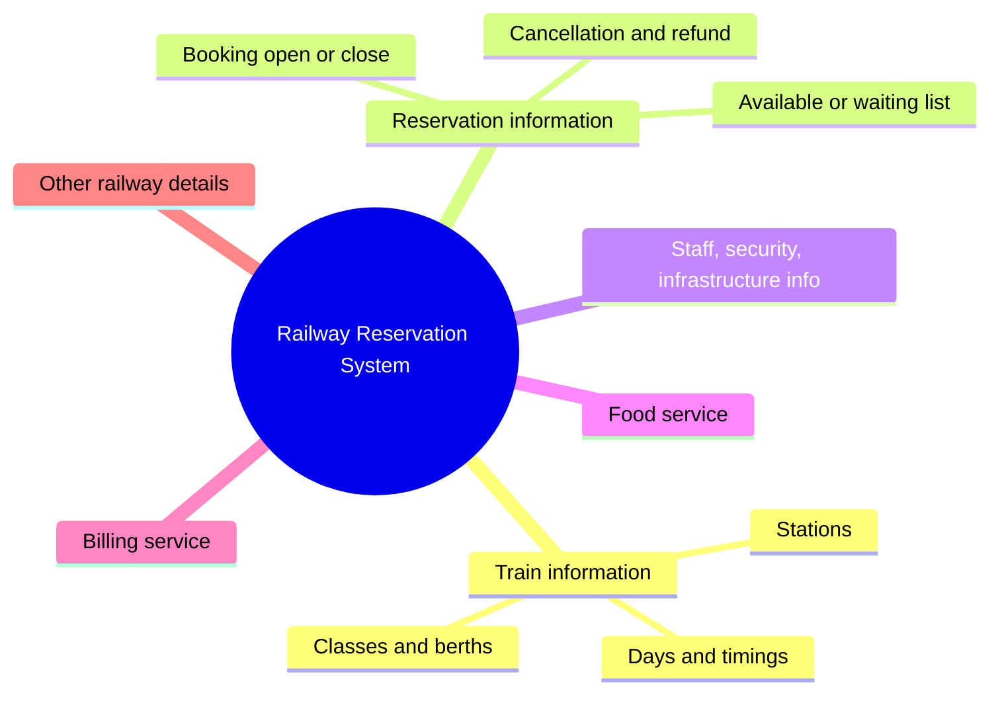

- Definition: decomposition is the technique of breaking a complex problem into smaller, more manageable sub-problems, solving each (possibly by a different person or team), then combining the solutions logically. §4.9
- Each branch of the Railway Reservation System can be designed, built, and tested largely independently — that is decomposition's whole payoff — before the pieces are integrated into one working system. §4.9
- Quote: "Decompose a complex problem into simpler problems... put these analyses together with logical glue." — Howard Raffa. §4.9

---

## Quick Reference — Chapter 4

- Flowchart symbols: see §4.4.1.
- Pseudocode keywords used in this note: INPUT, COMPUTE, DISPLAY/PRINT, SET, IF...THEN...ELSE...END IF, WHILE, INCREMENT, DECREMENT, TRUE/FALSE.
- Characteristics of a good algorithm: Precision, Uniqueness, Finiteness, Input, Output. §4.3
- Four steps of problem solving: Analysing, Developing an algorithm, Coding, Testing and Debugging. §4.2
- Four pillars of Computational Thinking: Decomposition, Pattern Recognition, Abstraction, Algorithms. §4.3A
- Origin of the word "algorithm": from Al-Khwarizmi (Persian mathematician, c. 850 AD), via its Latin translation "Algorithmi." §4.3

## Points to Ponder — Chapter 4

- ⚠ An algorithm with no defined stopping point is not a valid algorithm — finiteness is part of the definition, not a nice-to-have. §4.3
- ⚠ "It ran without error" is not the same as "it is correct" — dry-run with a boundary case before trusting an algorithm. §4.6
- ⚠ More than one algorithm can be correct. §4.7
- ⚠ Time and space complexity decide which algorithm is better — not correctness alone. §4.7
- ⚠ GIGO: a flawless algorithm still gives a wrong answer if the input data is wrong. §4.1
- ⚠ A flowchart and pseudocode both describe the logic, never the implementation syntax of a specific language. §4.4
- ⚠ Decomposition, Pattern Recognition, Abstraction, and Algorithms are the four named pillars of Computational Thinking — don't confuse "Decomposition" the thinking-skill (§4.3A) with "Decomposition" the systems-design technique (§4.9). §4.3A

## Problem-Solving Strategy — Word Problem → Algorithm/Flowchart

1. Identify exactly what the problem gives as input.
2. Identify exactly what the problem wants as output.
3. Decide whether the logic needs pure sequence, a decision (selection), or a loop (repetition), or some combination.
4. Write the algorithm/pseudocode before drawing a flowchart or writing code.
5. Dry-run the algorithm on at least two different inputs, including one boundary/edge case.
6. Only then translate it into a flowchart or program code.
7. If more than one algorithm is possible, compare them by time and space complexity before choosing.

---

# PART B — Chapter 5: Getting Started with Python

Branch: Python Fundamentals. Level: Class XI. Python version: Python 3.x.

- Epigraph: "Computer programming is an art, because it applies accumulated knowledge to the world, because it requires skill and ingenuity, and especially because it produces objects of beauty. A programmer who subconsciously views himself as an artist will enjoy what he does and will do it better." — Donald Knuth (NCERT, Chapter 5 epigraph). §Part B

## Concept Roadmap

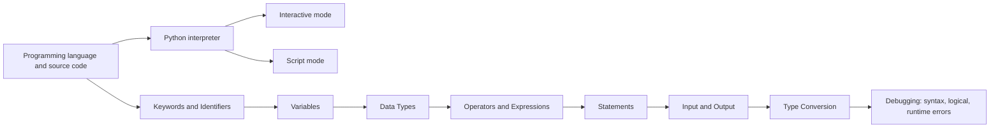

## §5.1 Introduction to Python

```mermaid
mindmap
  root((Python))
    Origin
      Guido van Rossum 1991
      Based on the ABC language
      Named after Monty Python Flying Circus
    Features
      High-level interpreted
      Case-sensitive
      Portable
    Advantages
    Limitations
    Real-world usage
```

- A program is an ordered set of instructions executed by a computer to carry out a task. §5.1
- The language used to write those instructions is a programming language. §5.1
- Python is a high-level language. §5.1
- A program written in Python is source code, translated to machine language by an interpreter. §5.1
- The interpreter processes statements one at a time: first translating, then executing, stopping the moment an error is hit. §5.1

**Where Python came from (Supp. §4.7):**
- Python is open-source, object-oriented, high-level. §5.1
- Developed by Guido van Rossum in 1991. §5.1
- Developed at the National Research Institute for Mathematics and Computer Science, the Netherlands. §5.1
- Presently owned by the Python Software Foundation (PSF). §5.1
- Based on the ABC language, itself a teaching language created to replace an earlier language called BASIC. §5.1
- ⚠ The name "Python" was inspired by the BBC comedy show Monty Python's Flying Circus, not the snake, despite the reptile logo. §5.1

### §5.1.1 Features of Python

- High-level. §5.1.1
- Free and open source. §5.1.1
- Interpreted — no separate compile step before running. §5.1.1
- Clearly defined, relatively simple syntax — easy to read. §5.1.1
- Case-sensitive: NUMBER and number are different identifiers. §5.1.1
- Portable / platform-independent — runs on multiple operating systems and hardware. §5.1.1
- Rich library of predefined functions. §5.1.1
- Widely used in web development. §5.1.1
- Uses indentation to mark blocks and nested blocks, not braces { }. §5.1.1
- Extensible and embeddable — Python programs can call, and be called from, C/C++ code. §5.1.1
- No wasted time declaring the types of variables or arguments. §5.1.1
- Supports GUI (Graphical User Interface) programming. §5.1.1
- Has built-in garbage collection for automatic memory management. §5.1.1
- Easily compatible with other languages like C, C++, and Core Java. §5.1.1
- Used for both scientific and non-scientific programming. §5.1.1

**Advantages of Python (Supp. §4.7.2):**

| # | Advantage | What it means |
|---|---|---|
| a | Platform-Independent | Runs across Windows, Linux/Unix, macOS, and other operating systems unchanged |
| b | Readability | Clear, simple, concise, English-like instructions, readable even by non-programmers |
| c | Object-Oriented | Interactive, interpreted, and Object-Oriented Programming Language |
| d | Higher Productivity | Simple language, small code, extensive libraries — more done with less typing than C++ or Java |
| e | Less Learning Time | Simpler, shorter code needs less time to understand and learn |
| f | GUI Programming | Supports GUI applications ported to many system calls, libraries, systems (Windows MFC, Macintosh, X Window system of Unix) |
| g | Ample Availability of Libraries | Large standard libraries available to solve almost any task |
| h | Syntax Highlighting | Distinguishes input, output, and error messages using different colour codes |

**Limitations of Python (Supp. §4.7.3):**

| # | Limitation | Why it matters |
|---|---|---|
| a | Speed | Slower than C or C++, since Python is high-level, not close to hardware |
| b | Mobile Development | Weak language for mobile computing — very few mobile apps built in it |
| c | Memory Consumption | Not ideal for memory-intensive tasks; flexible data types push memory use higher |
| d | Database Access | Underdeveloped/primitive next to JDBC (Java) or ODBC |
| e | Runtime Errors | Dynamically typed, requires more testing — some errors show up only at run-time |

**Real-world usage (Supp. §4.9):**
- Used by Google's search engine, YouTube, Netflix, Spotify, Dropbox, Instagram, among others. §5.1.1
- Widely used for: System programming, GUI programming, Internet Scripting/Web development, Gaming, Text processing, Network programming, Commercial Robots, Space and Scientific applications. §5.1.1

**Python vs Java (Supp., Solved Q.12):**

| Basis | Python | Java |
|---|---|---|
| Speed vs size | Runs slower than Java, but programs are typically 3 to 5 times shorter — saving time and space overall | Runs faster, but needs more code |
| Typing | Loosely typed, dynamic — no time wasted declaring variable types | Statically typed — variable types must be declared |
| Learning curve | Easier to learn | Steeper learning curve |

### §5.1.3 Execution Modes

| Mode | How it works | Good for |
|---|---|---|
| Interactive mode | Type one statement at the >>> prompt; executes and shows result immediately on Enter | Testing a single line quickly; statements not saved for later |
| Script mode | Write multiple statements in a .py file, save it, run the whole file (Run → Run Module, or F5) | Real programs — output only appears once you run the saved script |

- The Python interpreter is also called the Python Shell. §5.1.3
- On start-up it shows a version/copyright banner followed by the >>> prompt, indicating it's ready to accept a command. §5.1.3
- Python can be downloaded from the official site, https://www.python.org/. §5.1.3

**Worked example — Program 5-1, print statement in script mode (NCERT):**
```python
print("Save Earth")
print("Preserve Future")
```
- Output: Save Earth / Preserve Future. §5.1.3

**Case sensitivity, traced (Supp., Fig. 4.14(d)):**
- print is a valid, defined command in Python; Print (capital P) is an undefined word to the interpreter. §5.1.3
- Print("Hello World") raises: NameError: name 'Print' is not defined. §5.1.3
- This is a runtime error at the interactive prompt — Python never guesses that "Print" means "print." §5.1.3

**Using the interpreter as a calculator, traced (Supp., Fig. 4.14(e)):**
- 5 + 8 → 13. §5.1.3
- print(10 + 55) → 65. §5.1.3
- print(20 / 4 * 5 + 8 - 10) → 23.0. §5.1.3
- print(22 / 7) → 3.142857142857143. §5.1.3
- print(3.14 * 20.8 * 20.8) → 1358.4896000000003. §5.1.3

**Small IDLE facts:**
- IDLE stands for Integrated Development Learning Environment — the standard Python IDE, letting a user edit, run, browse, and debug a program from one interface. §5.1.3
- Alt+P in IDLE's shell repeats (recalls) a previously typed command. §5.1.3
- Even if the .py (or .pyw) extension is forgotten when saving a script for the first time, the editor automatically appends it. §5.1.3

**Exiting Python:**
- Press Ctrl+Q, or type quit() or exit() and press Enter. §5.1.3
- Fallback if neither works: import sys; sys.exit(). §5.1.3

## §5.2 Python Keywords

```mermaid
mindmap
  root((Python Keywords))
    33 reserved words
    Cannot be used as identifiers
    Case-sensitive
    Capitalised
      True
      False
      None
    Everything else lowercase
```

- Keywords are reserved words with a fixed meaning to the interpreter. §5.2
- Keywords can never be used as identifiers. §5.2
- Keywords must be typed exactly as shown, since Python is case-sensitive. §5.2

| | | | | |
|---|---|---|---|---|
| False | class | finally | is | return |
| None | continue | for | lambda | try |
| True | def | from | nonlocal | while |
| and | del | global | not | with |
| as | elif | if | or | yield |
| assert | else | import | pass | |
| break | except | in | raise | |

- 33 keywords in this list. §5.2
- True, False, None are capitalised; almost everything else is lowercase. §5.2

## §5.3 Identifiers

- An identifier is a name chosen to identify a variable, function, or other entity. §5.3

**Rules:**
1. Must begin with an uppercase letter, lowercase letter, or underscore (_) — never a digit. §5.3
2. May then contain any combination of a–z, A–Z, 0–9, _. §5.3
3. Can be any length, but keep it short and meaningful. §5.3
4. Must not be a keyword. §5.3
5. No special symbols (!, @, #, $, %, ...) are allowed. §5.3

- Meaningful names (marks1, avg, area, length, breadth) are preferred over single letters (a, b, c) for clarity and readability. §5.3

## §5.4 Variables

- A variable is a name (identifier) that refers to an object stored in memory. §5.4
- Its value can be a string, a number, or any combination of alphanumeric characters. §5.4
- Variable declaration in Python is implicit. §5.4
- A variable is created the moment it is first assigned a value using =. §5.4
- A variable must be assigned before it appears in any expression. §5.4

**Worked example — Program 5-3, area of a rectangle (NCERT):**
```python
length = 10
breadth = 20
area = length * breadth
print(area)
```
- Output: 200. §5.4

## §5.5 Comments

- A comment starts with # (hash). §5.5
- Everything from # to the end of the line is ignored by the interpreter. §5.5
- Comments document why, not what a line already visibly does. §5.5
- Useful when a program is written by one person and later read or maintained by another. §5.5

## §5.6 Everything Is an Object

- Every value Python handles — numeric, string, or otherwise — is treated as an object. §5.6
- Every object is given a unique identity (ID) for its lifetime. §5.6
- id() returns an object's identity, conceptually similar to a memory address. §5.6

**Why "everything is an object" (NCERT side-note):**
- In Object-Oriented Programming generally, an object represents something from the real world (employee, student, vehicle, book...). §5.6
- Each object has (i) data/attributes and (ii) behaviour/methods, usually created from a class. §5.6
- Python is loosely cast in this mould: some of its objects may lack attributes, or lack methods. §5.6

## §5.7 Data Types

```mermaid
mindmap
  root((Data Types in Python))
    Numbers
      Integer
        Boolean
      Floating Point
      Complex
    Sequences
      Strings
      Lists
      Tuples
    Sets
    None
    Mappings
      Dictionaries
```

- Every value belongs to a data type. §5.7
- A data type determines what values a variable can hold and what operations are valid on it. §5.7

### §5.7.1 Number

| Type/class | Description | Example |
|---|---|---|
| int | Integer numbers | -12, -3, 0, 125, 2 |
| float | Real / floating-point numbers | -2.04, 4.0, 14.23 |
| complex | Complex numbers | 3 + 4j, 2 - 2j |

- bool is a subtype of int, restricted to True and False. §5.7.1
- True behaves as non-zero, non-null, non-empty. §5.7.1
- False behaves as the value zero. §5.7.1

### §5.7.2 Sequence — String, List, Tuple

| Type | Enclosed in | Ordered? | Example |
|---|---|---|---|
| String | ' ' or " " | Yes | 'Hello Friend' |
| List | [ ] | Yes | [5, 3.4, "New Delhi", "20C", 45] |
| Tuple | ( ) | Yes | (10, 20, "Apple", 3.4, 'a') |

- ⚠ A string that looks like a number is still a string — "452" cannot be used in numeric arithmetic directly. §5.7.2

### §5.7.3 Set
- Enclosed in { }. §5.7.3
- An unordered collection with no duplicate entries. §5.7.3
- Elements, once created, cannot be individually changed. §5.7.3
- Example: {1, 2, 1, 3} becomes {1, 2, 3} — the duplicate 1 is silently dropped. §5.7.3

### §5.7.4 None
- A special data type with a single value, None. §5.7.4
- Used to signify the absence of a value. §5.7.4
- None is neither False nor 0. §5.7.4
- None supports no special operations of its own. §5.7.4

### §5.7.5 Mapping — Dictionary
- Enclosed in { }, holds key : value pairs. §5.7.5
- Values are looked up by key using square brackets. §5.7.5
- A mobile phone's contacts book (name mapped to number) is a good everyday application. §5.7.5
- Example: dict1 = {'Fruit':'Apple', 'Climate':'Cold', 'Price(kg)':120}; dict1['Price(kg)'] → 120. §5.7.5

### §5.7.6 Mutable vs Immutable

| Immutable (cannot change in place) | Mutable (can change in place) |
|---|---|
| Integers, Float, Boolean, Complex, Strings, Tuples | Lists, Sets, Dictionary |

- When an immutable variable's value is "changed," Python does not edit the existing object — it destroys the old binding and creates a new object, rebinding the same variable name to it. §5.7.6

```svg
<svg viewBox="0 0 420 160" xmlns="http://www.w3.org/2000/svg" style="max-width:100%;height:auto" font-family="sans-serif">
  <defs>
    <marker id="arrowA" viewBox="0 0 10 10" refX="9" refY="5" markerWidth="6" markerHeight="6" orient="auto-start-reverse">
      <path d="M0,0 L10,5 L0,10 z" fill="#262626"/>
    </marker>
  </defs>
  <rect x="20" y="20" width="90" height="30" fill="#ffffff" stroke="#262626" stroke-width="1.5"/>
  <text x="65" y="40" font-size="13" fill="#262626" text-anchor="middle">num1</text>
  <rect x="20" y="100" width="90" height="30" fill="#ffffff" stroke="#262626" stroke-width="1.5"/>
  <text x="65" y="120" font-size="13" fill="#262626" text-anchor="middle">num2</text>
  <rect x="270" y="55" width="110" height="40" fill="#e3f2fd" stroke="#1565c0" stroke-width="1.5"/>
  <text x="325" y="80" font-size="14" fill="#1565c0" text-anchor="middle">300</text>
  <text x="325" y="30" font-size="11" fill="#757575" text-anchor="middle">id 1000</text>
  <line x1="110" y1="35" x2="265" y2="65" stroke="#262626" stroke-width="1.5" marker-end="url(#arrowA)"/>
  <line x1="110" y1="115" x2="265" y2="85" stroke="#262626" stroke-width="1.5" marker-end="url(#arrowA)"/>
  <text x="325" y="130" font-size="11" fill="#555555" text-anchor="middle">num1 = 300; num2 = num1</text>
</svg>
```

```svg
<svg viewBox="0 0 420 200" xmlns="http://www.w3.org/2000/svg" style="max-width:100%;height:auto" font-family="sans-serif">
  <defs>
    <marker id="arrowB" viewBox="0 0 10 10" refX="9" refY="5" markerWidth="6" markerHeight="6" orient="auto-start-reverse">
      <path d="M0,0 L10,5 L0,10 z" fill="#262626"/>
    </marker>
  </defs>
  <rect x="20" y="130" width="90" height="30" fill="#ffffff" stroke="#262626" stroke-width="1.5"/>
  <text x="65" y="150" font-size="13" fill="#262626" text-anchor="middle">num2</text>
  <rect x="270" y="115" width="110" height="40" fill="#e3f2fd" stroke="#1565c0" stroke-width="1.5"/>
  <text x="325" y="140" font-size="14" fill="#1565c0" text-anchor="middle">300</text>
  <text x="325" y="100" font-size="11" fill="#757575" text-anchor="middle">id 1000</text>
  <line x1="110" y1="145" x2="265" y2="135" stroke="#262626" stroke-width="1.5" marker-end="url(#arrowB)"/>
  <rect x="20" y="20" width="90" height="30" fill="#ffffff" stroke="#262626" stroke-width="1.5"/>
  <text x="65" y="40" font-size="13" fill="#262626" text-anchor="middle">num1</text>
  <rect x="270" y="20" width="110" height="40" fill="#fff3e0" stroke="#e65100" stroke-width="1.5"/>
  <text x="325" y="45" font-size="14" fill="#e65100" text-anchor="middle">400</text>
  <text x="325" y="70" font-size="11" fill="#757575" text-anchor="middle">id 2200 (new object)</text>
  <line x1="110" y1="35" x2="265" y2="40" stroke="#262626" stroke-width="1.5" marker-end="url(#arrowB)"/>
  <text x="210" y="185" font-size="11" fill="#555555" text-anchor="middle">num1 = num2 + 100 rebinds num1; num2 is unaffected</text>
</svg>
```

- Before reassignment: num1 and num2 both point at the same int object 300. §5.7.6
- After num1 = num2 + 100: num1 points to a brand-new object 400; num2 still points at the original 300. §5.7.6
- num2 is unaffected because int is immutable and cannot be edited in place. §5.7.6

### §5.7.7 Choosing the Right Data Type

| Need | Use |
|---|---|
| A simple, iterable collection that changes often | List |
| Data that should never change (e.g. month names) | Tuple |
| Unique elements, duplicates not wanted | Set |
| Fast lookup by a custom key, key–value association | Dictionary |

## §5.8 Operators

```mermaid
mindmap
  root((Python Operators))
    Arithmetic
    Relational
    Assignment
    Logical
    Identity
    Membership
```

- An operator performs an operation on operands. §5.8
- Python groups operators into six categories. §5.8

### §5.8.1 Arithmetic Operators

| Operator | Operation | Example |
|---|---|---|
| + | Addition (also string concatenation) | 5 + 6 → 11; "Hello"+"India" → 'HelloIndia' |
| - | Subtraction | 5 - 6 → -1 |
| * | Multiplication (also string repetition with an int) | 5 * 6 → 30; 'India' * 2 → 'IndiaIndia' |
| / | Division (true division, returns float) | 4 / 8 → 0.5 |
| % | Modulus (remainder) | 13 % 5 → 3 |
| // | Floor division (integer division) | 13 // 4 → 3 |
| ** | Exponent | 3 ** 4 → 81 |

### §5.8.2 Relational Operators

| Operator | Meaning | Example (num1=10, num2=0) |
|---|---|---|
| == | Equal to | num1 == num2 → False |
| != | Not equal to | num1 != num2 → True |
| > | Greater than | num1 > num2 → True |
| < | Less than | num1 < num2 → False |
| >= | Greater than or equal to | num1 >= num2 → True |
| <= | Less than or equal to | num1 <= num2 → False |

**Relational operators also work on strings, with str1="Good", str2="Afternoon":**
- str1 > str2 → True. §5.8.2
- str2 < str1 → True. §5.8.2
- str1 >= str2 → True. §5.8.2
- str1 <= str2 → False. §5.8.2
- Python compares strings lexicographically, using the ASCII value of characters. §5.8.2
- It compares the first character of each string; if those match, it compares the second character, and so on. §5.8.2
- 'G' (in "Good") has a higher ASCII value than 'A' (in "Afternoon"). §5.8.2
- Because of that ASCII ranking, "Good" > "Afternoon" evaluates to True. §5.8.2

### §5.8.3 Assignment Operators

| Operator | Meaning | Example |
|---|---|---|
| = | Simple assignment | num2 = num1 |
| += | x = x + y | num1 = 10; num1 += 2 → 12 |
| -= | x = x - y | 10 -= 2 → 8 |
| *= | x = x * y | 2 *= 3 → 6 |
| /= | x = x / y | 6 /= 3 → 2.0 |
| %= | x = x % y | 7 %= 3 → 1 |
| //= | x = x // y | 7 //= 3 → 2 |
| **= | x = x ** y | 2 **= 3 → 8 |

### §5.8.4 Logical Operators

- and, or, not — always lowercase. §5.8.4
- Every value is logically True except None, False, 0, and empty collections ("", (), [], {}). §5.8.4

| Operator | Rule | Example |
|---|---|---|
| and | True only if both operands are True | True and False → False |
| or | True if either operand is True | True or False → True |
| not | Reverses the logical state of its operand | not True → False |

- ⚠ Given num1 = 10, the standalone expression `not num1` produces the value False, but does not change num1 itself (no = on the left). A later bool(num1) still evaluates to True. §5.8.4

### §5.8.5 Identity Operators

- is and is not compare whether two variables refer to the same object in memory (same id()), not merely equal values. §5.8.5
- num1 = 5; num2 = num1 → num1 is num2 → True (same object); num1 is not num2 → False. §5.8.5

### §5.8.6 Membership Operators

- in and not in test whether a value exists inside a sequence. §5.8.6
- a = [1, 2, 3]; 2 in a → True; '1' in a → False (string '1' is not the same as int 1). §5.8.6

## §5.9 Expressions

- An expression is any combination of constants, variables, and operators that evaluates to a value. §5.9
- A bare value or bare variable also counts as an expression. §5.9
- A bare operator does not count as an expression. §5.9

### §5.9.1 Precedence of Operators

```mermaid
flowchart TD
    A[Exponentiation] --> B[Unary plus, minus, complement]
    B --> C[Multiply, divide, modulo, floor division]
    C --> D[Addition, subtraction]
    D --> E[Relational and comparison]
    E --> F[Assignment]
    F --> G[Identity: is, is not]
    G --> H[Membership: in, not in]
    H --> I[Logical NOT]
    I --> J[Logical AND]
    J --> K[Logical OR]
```

| Order | Operator(s) | Description |
|---|---|---|
| 1 (highest) | ** | Exponentiation |
| 2 | ~, unary +, unary - | Complement, unary plus/minus |
| 3 | *, /, %, // | Multiply, divide, modulo, floor division |
| 4 | +, - | Addition, subtraction |
| 5 | <=, <, >, >=, ==, != | Relational / comparison |
| 6 | =, %=, /=, //=, -=, +=, *=, **= | Assignment |
| 7 | is, is not | Identity |
| 8 | in, not in | Membership |
| 9 | not | Logical NOT |
| 10 | and | Logical AND |
| 11 (lowest) | or | Logical OR |

- Parentheses ( ) can always be used to force an evaluation order. §5.9.1
- Among operators of equal precedence, evaluation proceeds left to right. §5.9.1

**Worked examples, hand-traced:**

| Expression | Step-by-step | Result |
|---|---|---|
| 20 + 30 * 40 | * before + → 20 + 1200 | 1220 |
| 20 - 30 + 40 | equal precedence, left→right → (-10) + 40 | 30 |
| (20 + 30) * 40 | parentheses force + first → 50 * 40 | 2000 |
| 15.0 / 4 + (8 + 3.0) | inner () first → 15.0/4.0 + 11.0 → 3.75 + 11.0 | 14.75 |

## §5.10 Statement

- A statement is a unit of code the Python interpreter can execute — an assignment statement, a print() call, and so on. §5.10
- Example: x = 4 (assignment statement); cube = x ** 3 (assignment statement); print(x, cube) (print statement) → 4 64. §5.10

## §5.11 Input and Output

```mermaid
mindmap
  root((Input and Output))
    input
      Always returns a string
      Optional prompt
    print
      sep default single space
      end default newline
```

### input()
- Syntax: input([Prompt]). §5.11
- Prompt (optional) is displayed before the user types. §5.11
- input() always returns a string, no matter what the user types. §5.11
- age = input("Enter your age: "); type(age) → class 'str', even though the user typed a number. §5.11
- To use the value numerically, convert explicitly: age = int(input("Enter your age: ")); type(age) → class 'int'. §5.11

### print()
- Syntax: print(value [, ..., sep = ' ', end = '\n']). §5.11
- sep — string inserted between printed values; default is a single space. §5.11
- end — string appended after the last value; default is '\n' (new line). §5.11
- print() converts every argument into a string form before writing it to the screen. §5.11
- print() always outputs a complete line before moving to the next one. §5.11

| Statement | Output |
|---|---|
| print("Hello") | Hello |
| print(10*2.5) | 25.0 |
| print("I" + "love" + "my" + "country") | Ilovemycountry (no space — + concatenates directly) |
| print("I'm", 16, "years old") | I'm 16 years old (comma passes multiple arguments, separated by sep) |

**Custom sep and end (Supp. demo):**
- print('cow', 'cat', 'dog', sep=', ', end='!!!\n') → cow, cat, dog!!!. §5.11
- If sep is used, it must be given after all the positional values, or Python raises SyntaxError: positional argument follows keyword argument. §5.11

**The sep argument, several ways at once (Supp., Fig. 4.14(f)):**

| Call | Output |
|---|---|
| print(10, 20, 30) | 10 20 30 (default: single space) |
| print(10, 20, 30, sep="*") | 10*20*30 |
| print(10, 20, 30, sep="-*-") | 10-*-20-*-30 |
| print(10, 20, 30, sep=',') | 10,20,30 |
| print(10, 20, 30, sep='\n') | 10, 20, 30 each on its own line |
| print(10, 20, 30, sep='\t') | 10, 20, 30 separated by tab characters |

## §5.12 Type Conversion

```mermaid
mindmap
  root((Type Conversion))
    Explicit
      Programmer requests it
      int float str chr ord
      Can lose information
    Implicit
      Python does it automatically
      Also called coercion
      Only when no data is lost
```

### §5.12.1 Explicit Conversion (Type Casting)
- The programmer forces the conversion: (new_data_type)(expression). §5.12.1

| Function | Converts to |
|---|---|
| int(x) | Integer |
| float(x) | Floating-point number |
| str(x) | String representation |
| chr(x) | Character for ASCII code x |
| ord(x) | ASCII code for character x |

**Worked example — Program 5-9, concatenation vs arithmetic (NCERT):**
- icecream = '25', brownie = '45' (both strings). §5.12.1
- price = icecream + brownie → '2545' (string concatenation). §5.12.1
- print("Total Price Rs." + price) → Total Price Rs.2545. §5.12.1
- price = int(icecream) + int(brownie) → 70 (numeric addition). §5.12.1
- print("Total Price Rs." + str(price)) → Total Price Rs.70. §5.12.1

- ⚠ print("The total is Rs." + totalPrice) where totalPrice is an int raises TypeError: can only concatenate str (not "int") to str — must write str(totalPrice) explicitly. §5.12.1

### §5.12.2 Implicit Conversion (Coercion)
- Python converts automatically, without the programmer asking, whenever it can do so without loss of information — called type promotion. §5.12.2
- Adding an int and a float promotes the result to float (the wider type), never the other way round. §5.12.2
- num1 = 10 (int); num2 = 20.0 (float); sum1 = num1 + num2 → 30.0, type float. §5.12.2

## §5.13 Debugging

```mermaid
mindmap
  root((Debugging))
    Syntax error
      Detected before running
      No output at all
    Logical error
      Program runs to completion
      Plausible but wrong output
    Runtime error
      Appears during execution
      Abnormal termination
```

- Debugging is the process of identifying and removing mistakes (bugs/errors) from a program. §5.13

| Error type | When it appears | Effect | Example |
|---|---|---|---|
| Syntax error | Detected before the program runs | Program does not run at all | A missing parenthesis, e.g. (7 + 11; wrong indentation also produces a syntax error |
| Logical (semantic) error | Program runs to completion | Produces a plausible but wrong output | Computing average as 10 + 12/2 (→16) instead of (10+12)/2 (→11) |
| Runtime error | Appears while the program is executing | Program terminates abnormally mid-run | Division by zero |

- Most Python editors (including IDLE) automatically indent statements inside a block. §5.13
- A manually broken indentation level is still a common, easy-to-miss cause of a SyntaxError/IndentationError. §5.13
- Python program files are saved with either the .py or the .pyw extension. §5.13

**Worked example — Program 5-11, classifying three runtime scenarios (NCERT):**
```python
num1 = 10.0
num2 = int(input("num2 = "))
print(num1 / num2)
```

| Input for num2 | Result | Classification |
|---|---|---|
| apple | ValueError: invalid literal for int() with base 10: 'apple' | Runtime error — program had already started executing int(input(...)) when it failed |
| 0 | ZeroDivisionError: float division by zero | Runtime error |
| 10 | 1.0 | Correct — no error |

- None of these are syntax errors, since the code is grammatically valid Python in all three cases — the failure only happens once execution reaches the offending line. §5.13

---

## Quick Reference — Chapter 5

- Explicit type-conversion functions: int(), float(), str(), chr(), ord(). §5.12.1
- print() defaults: sep=' ', end='\n'. §5.11
- Mutable: list, set, dictionary. Immutable: int, float, bool, complex, string, tuple. §5.7.6
- Operator precedence (high→low): ** → unary +/-/~ → *,/,%,// → +,- → comparisons → assignment → is/is not → in/not in → not → and → or. §5.9.1
- File extensions: Python programs are saved with .py or .pyw. §5.13
- Exiting the interpreter: Ctrl+Q, or quit()/exit(), or import sys; sys.exit(). §5.1.3
- IDLE: Integrated Development Learning Environment — as this textbook defines the acronym (some other sources expand it as "Integrated Development and Learning Environment"). §5.1.3
- Python's creator and origin: Guido van Rossum, 1991, based on the ABC language; name inspired by Monty Python's Flying Circus. §5.1

## Points to Ponder — Chapter 5

- ⚠ input() always returns a str — wrap it in int()/float() before doing arithmetic, or * will repeat a string instead of multiplying a number. §5.11
- ⚠ print()'s default separator is one space, default line-ending is \n — override both explicitly with sep= / end= when the output format matters. §5.11
- ⚠ Python is case-sensitive: Print is not print (raises NameError: name 'Print' is not defined); NUMBER and number are different identifiers. §5.1.3 / §5.1.1
- ⚠ A keyword (e.g. class, True, is) can never be used as an identifier. §5.2
- ⚠ Reassigning an immutable variable creates a brand-new object; it does not edit the old one in place — mutable types (list/set/dict) genuinely change in place. §5.7.6
- ⚠ + between two strings concatenates; between a string and an int it raises TypeError unless one side is explicitly converted with str()/int(). §5.12.1
- ⚠ Explicit type conversion can lose information — int(20.67) discards .67; it truncates, it does not round. §5.12.1
- ⚠ By default, every value is logically True except None, False, 0, and empty collections ("", (), [], {}). §5.8.4
- ⚠ Relational operators on strings compare lexicographically by ASCII value, character by character. §5.8.2
- ⚠ "Good" > "Afternoon" is True: 'G' has a higher ASCII code than 'A'. §5.8.2
- ⚠ Wrong indentation is not a cosmetic issue in Python — it is a syntax error. §5.13
- ⚠ Indentation is how Python marks a block. §5.13
- ⚠ = assigns a value; == compares two values for equality. Confusing them is one of the most common beginner mistakes — if a line is asking a yes/no question, it needs ==. §5.8.2 / §5.8.3

## Problem-Solving Strategy — Python Coding Question

1. Note exactly what output is wanted, and what data type that output should be.
2. For every input() call, ask immediately: "do I need to convert this string?"
3. Choose the data type/structure deliberately (see §5.7.7's quick guide) rather than defaulting to whatever comes to mind first.
4. Write the expression, then apply the precedence table by hand once before trusting the result.
5. Trace the code line by line, writing down each variable's value as it changes.
6. Classify any error you hit: does the program refuse to start (syntax), crash partway through (runtime), or run to completion with a wrong answer (logical)?
7. Fix the bug, then re-trace — never just guess-and-rerun until the output looks right.

---

## Rapid Reference — Whole Unit

| Fact | Value |
|---|---|
| GIGO stands for | Garbage In, Garbage Out |
| Four steps of problem solving | Analysing, Developing an algorithm, Coding, Testing and Debugging |
| Five characteristics of a good algorithm | Precision, Uniqueness, Finiteness, Input, Output |
| Origin of the word "algorithm" | Al-Khwarizmi, Persian mathematician, c. 850 AD; Latin "Algorithmi" |
| GCD of 45 and 54 | 9 |
| Four pillars of Computational Thinking | Decomposition, Pattern Recognition, Abstraction, Algorithms |
| Five flowchart shapes | Oval, Rectangle, Parallelogram, Diamond, Arrow |
| Celsius to Fahrenheit formula | F = C × 1.8 + 32 |
| 100°C in Fahrenheit | 212°F |
| 0°C in Fahrenheit | 32°F |
| Count-controlled loop | repeat count known in advance |
| Sentinel-controlled loop | repeats until data signals stop |
| Time-addition bug fix | IF mm_total >= 60 THEN hh_total += 1; mm_total -= 60 |
| Fastest prime-check method and its cost | (iv) pre-built prime list — trades memory for speed |
| Compiler | translates whole program before execution, reports errors after full scan |
| Interpreter | translates and executes one statement at a time, stops at first error |
| Howard Raffa quote | "Decompose a complex problem into simpler problems... with logical glue" |
| Python's creator | Guido van Rossum |
| Year Python was created | 1991 |
| Institute where Python was created | National Research Institute for Mathematics and Computer Science, Netherlands |
| Language Python is based on | ABC language (created to replace BASIC) |
| Python's name comes from | Monty Python's Flying Circus, not the snake |
| Python's owner | Python Software Foundation (PSF) |
| Biggest speed weakness vs | C / C++ |
| IDLE stands for | Integrated Development Learning Environment |
| Exit the Python interpreter | Ctrl+Q, or quit()/exit(), or sys.exit() |
| IDLE shortcut to repeat a command | Alt+P |
| Number of Python keywords | 33 |
| Capitalised keywords | True, False, None |
| Identifier cannot start with | a digit |
| Variable declaration in Python is | implicit — created on first assignment |
| id() returns | a unique object identity |
| bool is a subtype of | int |
| Immutable types | int, float, bool, complex, str, tuple |
| Mutable types | list, set, dict |
| String comparison rule | lexicographic, by ASCII code |
| = vs == | assigns vs compares |
| is vs == | same object vs equal value |
| Does `not num1` reassign num1 | No |
| Highest-precedence operator | ** |
| 20 + 30 * 40 | 1220 |
| 20 - 30 + 40 | 30 |
| (20 + 30) * 40 | 2000 |
| 15.0 / 4 + (8 + 3.0) | 14.75 |
| input() always returns a | string |
| print() default sep | ' ' (single space) |
| print() default end | '\n' |
| int(20.67) | 20 (truncates, does not round) |
| Implicit conversion only happens when | no information would be lost |
| icecream='25' + brownie='45' | '2545' (string concatenation) |
| int('25') + int('45') | 70 |
| Wrong indentation causes | a syntax error |
| int("apple") error type | ValueError — a runtime error |
| int(input()) with 0, then divide | ZeroDivisionError — a runtime error |
| Python file extensions | .py or .pyw |
