# Computer Science | Chapter 03 | Getting Started with Python | NOTES

> Two chapters, one thread: you cannot write a correct program until you can describe the solution precisely in words or pictures first. This note takes that thread from "what is a problem" all the way to "why did my Python program just crash."

**Primary source:** NCERT *Computer Science — Class XI*, Chapter 4 (*Introduction to Problem Solving*) and Chapter 5 (*Getting Started with Python*).
**Supplementary source:** *Computer Science with Python — XI* (single combined Chapter 4, "Computational Thinking and Getting Started with Python"). Content unique to this book is labeled **(Supplementary)**.
**Python version assumed:** Python 3.x throughout.

> [!note] Revision-2 pass
> This edition adds material that a first pass missed on re-checking all three source PDFs — most importantly an entire missing topic (**Computational Thinking and its four pillars**), the **Advantages/Limitations of Python** lists, Python's **origin story**, several **solved worked examples** from the supplementary book (largest-of-three, multiplication table, factorial-sum, Celsius→Fahrenheit, name-concatenation), and a handful of exact traced facts (IDLE's full form, how to exit Python, the string lexicographic-comparison rule). New material is marked **(Added)** where it sits inside an existing section.

---

# PART A — Chapter 4: Introduction to Problem Solving

**Branch:** Problem Solving & Algorithms · **Level:** Class XI

## Concept Roadmap

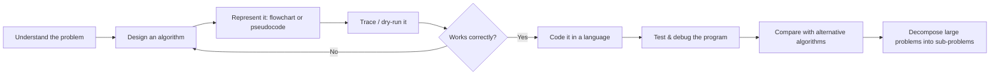

*Reading guide:* problem solving is not a straight line to code — it loops back through algorithm design every time a dry run or a test reveals a gap.

## 4.1 Why Problem Solving Matters ⭐

A computer has no thinking power of its own — it executes exactly what it is told, in exactly the sequence it is told. So the **entire burden of correctness sits with the person who writes the instructions**, not the machine.

> **Key idea:** *Problem solving* is the process of (1) identifying a problem, (2) developing an **algorithm** for it, and (3) implementing that algorithm as a **program**.

> [!note] GIGO — Garbage In, Garbage Out
> The correctness of a computer's output depends entirely on the correctness of the input and the logic supplied. A perfectly executed program built on a wrong algorithm still gives a wrong answer.

## 4.2 Steps for Problem Solving ⭐⭐

| Step | What happens | Why it matters |
|---|---|---|
| 1. **Analysing the problem** | Read the problem statement carefully; list the exact inputs the program should accept and the exact outputs it should produce | Skipping this leads to a program that solves the *wrong* problem correctly |
| 2. **Developing an algorithm** | Write a tentative, step-by-step solution in natural language; refine it until it covers every case | More than one algorithm is usually possible — pick the most suitable one |
| 3. **Coding** | Convert the finished algorithm into a programming language, following that language's syntax | Also involves documenting the coding decisions for future maintenance |
| 4. **Testing and debugging** | Run the program on many inputs; fix syntactical and logical errors until output is correct for *all* valid inputs | A program with a syntax error produces no output at all; one with a logical error produces a *wrong* output |

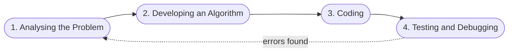

*Reading guide:* these four steps form a cycle in practice, not a one-way pipeline — bugs found in testing routinely send you back to re-analyse or re-design.

## 4.3 Algorithm ⭐⭐⭐

> **Definition:** An **algorithm** is a finite sequence of precisely stated, unambiguous steps that, if followed correctly, leads to the desired result in a finite amount of time.

### Worked Example — GCD by listing divisors (NCERT/Supplementary, Section 4.3)

> [!example]
> **Given:** Two numbers, 45 and 54.
> **Find:** Their Greatest Common Divisor (GCD) — the largest number that divides both exactly.
> **Approach:** The general technique is: list every divisor of each number, then pick the largest value common to both lists. (45 and 54 are just one worked instance of this general technique — it applies to any pair of numbers.)
> **Work:**
> 1. Divisors of 45: 1, 3, 5, 9, 15, 45
> 2. Divisors of 54: 1, 2, 3, 6, 9, 18, 27, 54
> 3. Common divisors: 1, 3, 9 → largest is **9**
> **Check:** 45 ÷ 9 = 5 exactly, 54 ÷ 9 = 6 exactly, and no larger number appears in both divisor lists. GCD = 9. ✓

### Why Do We Need an Algorithm? (Added — NCERT §4.3.1)

A programmer prepares a **roadmap** of the program before writing a single line of code — that roadmap *is* the algorithm. Without it, the programmer cannot clearly visualise the instructions to be written and risks producing a program that doesn't work as expected. Searching with a search engine, sending a message, finding a word in a document, booking a taxi through an app, online banking, and computer games are all, underneath, built on algorithms. If the algorithm is correct, the computer will run the resulting program correctly *every single time* — which is exactly why the purpose of an algorithm is to increase the **reliability, accuracy, and efficiency** of the eventual solution.

> [!note] Trivia — where the word "algorithm" comes from (Added)
> The term *Algorithm* is traced to the Persian astronomer and mathematician **Abu Abdullah Muhammad ibn Musa Al-Khwarizmi** (c. 850 AD) — the Latin translation of "Al-Khwarizmi" was rendered as **"Algorithmi."** This is a frequently examined one-line fact.

### Characteristics of a Good Algorithm

| Characteristic | Meaning |
|---|---|
| **Precision** | Each step is stated exactly, with no room for misreading |
| **Uniqueness** | The result of every step is uniquely determined by the input and the results of earlier steps |
| **Finiteness** | The algorithm always stops after a finite number of steps |
| **Input** | The algorithm accepts zero or more well-defined inputs |
| **Output** | The algorithm produces at least one well-defined output |

While writing any algorithm, you must clearly identify three things: **the input** to be taken from the user, **the processing** needed to reach the result, and **the output** desired.

> [!warning] Think and Reflect
> What happens if an algorithm does *not* stop after a finite number of steps? It becomes an infinite loop rather than an algorithm — finiteness is not optional, it is part of the definition.

## 4.3A Computational Thinking (Added — Supplementary book §4.5–4.6)

> **This entire topic was missing from the first pass** — it exists only in the supplementary textbook, but it is a named CBSE topic in its own right and sits conceptually right between "what is an algorithm" and "how do I represent one."

**Definition:** *Computational Thinking* is the thought process involved in formulating a problem and expressing its solution(s) in a way that a human, a computer, or both, can effectively carry out. Before writing any program, you must first think computationally about the problem and its solution — only *then* is the program written in a language.

Computational thinking is not limited to programmers — everyday decisions use it too: making a cup of tea or coffee, buying a car, changing jobs, moving to another city, buying a house, writing a book, creating an app. Each of these needs the same underlying thought process: take a complex problem, understand what it actually is, and develop a workable solution.

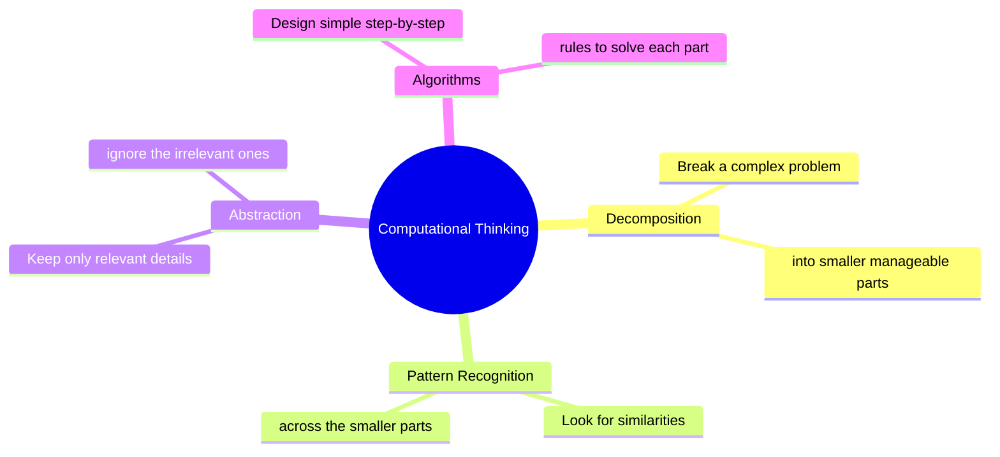

*Reading guide:* the four pillars are meant to be applied in roughly this order — you cannot recognise a pattern until you've decomposed the problem, and you cannot write the algorithm until abstraction has told you which details actually matter.

### Pillar 1 — Decomposition

Breaking a complex problem or system into smaller, more easily manageable parts, which are then solved one after another until the bigger problem is solved.

> [!example] Real-life decomposition examples (Supplementary book)
> - Tasting an unfamiliar dish and identifying its individual ingredients from the flavour.
> - Giving someone directions to your house — decomposing "getting from A to B" into city → area → street.
> - Breaking a course project into several smaller steps/sub-tasks.
> - In mathematics, decomposing a number such as **256.37** as `2×10² + 5×10¹ + 6×10⁰ + 3×10⁻¹ + 7×10⁻²`.
> - The quadratic-formula root `x = (-b ± √(b²-4ac)) / 2a` looks intimidating at first glance, but decomposes into 8 manageable steps: (1) `b²`, (2) `4ac`, (3) `b² - 4ac`, (4) `√(b² - 4ac)`, (5) `-b ± √(b² - 4ac)`, (6) `2a`, (7) `x₁ = (-b + √(b² - 4ac)) / 2a`, (8) repeat for `x₂` with `-b - √(b² - 4ac)`.

### Pillar 2 — Pattern Recognition

Identifying patterns or trends *within* a problem, once it has been decomposed, so that a recognised pattern can be reused to solve the larger problem more effectively.

> [!example] "What are patterns?" (Supplementary book)
> Imagine drawing a series of cats. All cats share common characteristics — eyes, tails, fur. Once we know how to describe *one* cat using this pattern, we can describe *any* cat by simply changing the specifics (one cat has green eyes/long tail/black fur; another has yellow eyes/short tail/striped fur). Everyday pattern recognition: drivers watching traffic patterns to decide when to switch lanes; investors watching stock-price patterns to decide when to buy or sell; scientists deriving theories and models from patterns in data; learning from past patterns to avoid repeating the same mistake.

### Pillar 3 — Abstraction

Focusing only on the important, relevant information and deliberately ignoring irrelevant details, so that a general **model** of the problem emerges.

> [!example] Abstraction examples (Supplementary book)
> - A **world map** is an abstraction of the Earth using only longitude and latitude — it strips away almost everything else.
> - An **aisle sign in a store** (e.g. a supermarket) is an abstraction of every individual item stocked in that aisle.
> - Writing a **book report** means summarising only the theme or key aspects of the book — that summarising *is* abstraction.

### Pillar 4 — Algorithms

Once the problem has been decomposed, patterns recognised, and irrelevant detail abstracted away, the last step is to design simple step-by-step rules or instructions to solve each of the smaller problems — this *is* the "Algorithm" section covered above (§4.3). The four pillars together turn a vague, complex problem into something a computer can actually be instructed to solve.

## 4.4 Representation of Algorithms ⭐⭐

An algorithm can be represented two ways: as a **flowchart** (visual) or as **pseudocode** (English-like text). Either representation should (a) show the logic of the solution without implementation detail, and (b) make the flow of control during execution clear.

### 4.4.1 Flowchart — Standard Symbols

| Symbol | Name | What it represents |
|---|---|---|
| Oval (stadium) | Start/End (Terminator) | Where the flow starts and ends |
| Rectangle | Process | A computation or processing step |
| Parallelogram | Input/Output | Reading a value in, or displaying a value out |
| Diamond | Decision | A yes/no or true/false question that splits the flow |
| Arrow | Connector | Order/direction of flow between shapes |

**Example — square of a number:**

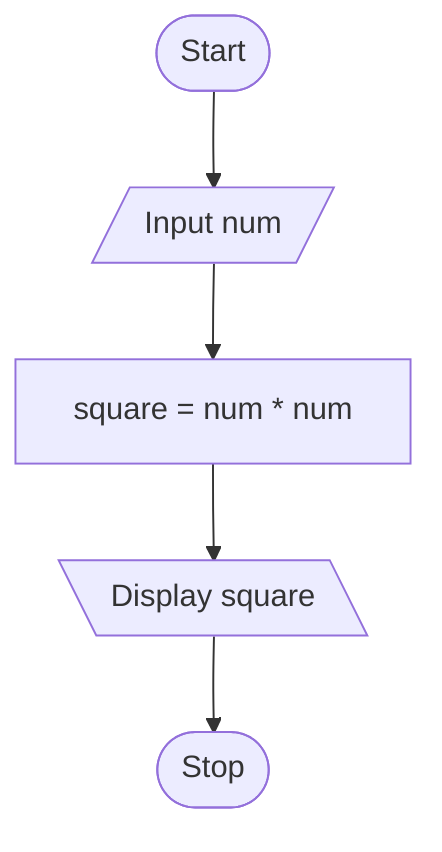

**Example — average of three numbers (Added — Supplementary book, Example 4.1):**

```mermaid
flowchart TD
    A([Start]) --> B[/Read a, b, c/]
    B --> C[avg = (a + b + c) / 3]
    C --> D[\Print avg\]
    D --> E([Stop])
```

*Reading guide:* three values are read in one input step, one process step computes the average, one output step displays it — the cleanest possible illustration of pure sequence.

**Example — troubleshooting a non-functioning light bulb** *(NCERT Example 4.2 — this flowchart represents everyday decision-making, not code)*:

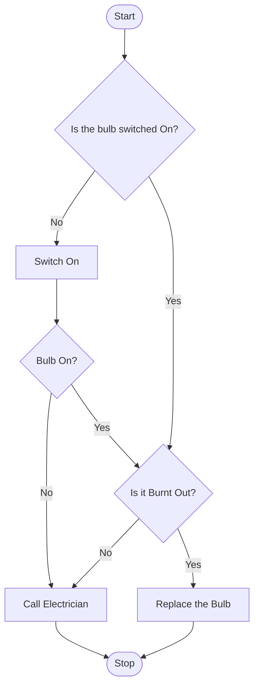

*Reading guide:* the same decision — "is it burnt out?" — is reached from two different paths (bulb was already on, or bulb was just switched on and is on), which is exactly why flowcharts are useful for spotting shared logic.

### 4.4.2 Pseudocode

Pseudocode has no fixed syntax — it is an informal, English-like description meant to be read by humans, never executed directly by a computer. This note uses ALL-CAPS keywords: `INPUT`, `COMPUTE`, `DISPLAY`/`PRINT`, `SET`, `WHILE`, `IF … THEN … ELSE`.

> [!note] A good pseudocode
> - is **not** written in any specific coding language,
> - drafts the structure of the eventual code,
> - stays understandable to any human reader.

**Worked Example — sum of two numbers (NCERT Example 4.3):**

```text
INPUT num1
INPUT num2
COMPUTE Result = num1 + num2
DISPLAY Result
```

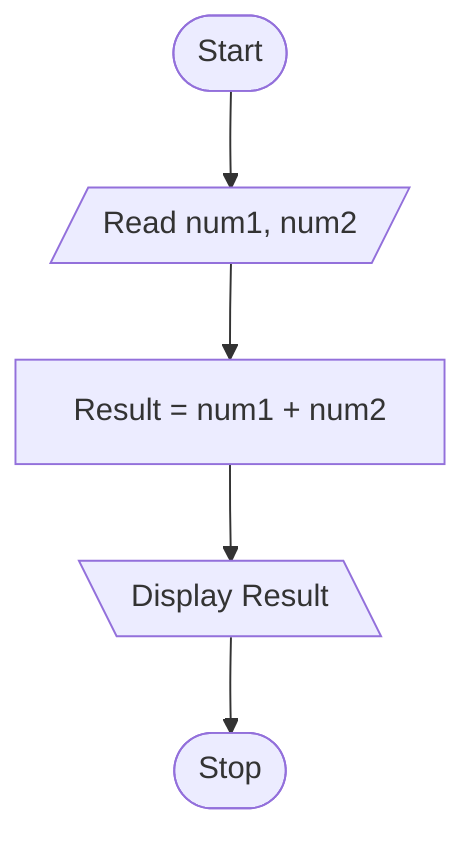

**Worked Example — area and perimeter of a rectangle (NCERT Example 4.4):**

```text
INPUT length
INPUT breadth
COMPUTE Area = length * breadth
DISPLAY Area
COMPUTE Perimeter = 2 * (length + breadth)
DISPLAY Perimeter
```

> [!example] Worked Example — Celsius to Fahrenheit (Added — Supplementary book, Solved Q.14)
> **Given:** a temperature in degrees Celsius.
> **Find:** the equivalent temperature in degrees Fahrenheit, using `F = C × 1.8 + 32`.
> ```text
> INPUT Celsius
> COMPUTE Fahrenheit = Celsius * 1.8 + 32
> DISPLAY Celsius, Fahrenheit
> ```
> **Check (traced):** water boils at 100°C → `100 × 1.8 + 32 = 212°F` ✓; water freezes at 0°C → `0 × 1.8 + 32 = 32°F` ✓ — both match the well-known reference points, confirming the formula is applied correctly.

> [!example] Worked Example — largest of three numbers (Added — Supplementary book, Solved Q.16)
> **Given:** three numbers, A, B, C.
> **Find:** which one is the largest.
> **Approach:** this needs *nested* selection — a straightforward `IF A>B` isn't enough, because C must also be checked against whichever of A/B is bigger.
> ```text
> INPUT A, B, C
> IF A > B AND A > C THEN
>     DISPLAY "A is the largest number"
> ELSE
>     IF B > C THEN
>         DISPLAY "B is the largest number"
>     ELSE
>         DISPLAY "C is the largest number"
>     END IF
> END IF
> ```
> **Check:** trace with A=7, B=9, C=4 → `A>B`? 7>9 is False → go to ELSE → `B>C`? 9>4 True → "B is the largest" ✓ (matches expectation, since 9 is indeed the largest of 7, 9, 4).

> [!example] Worked Example — average of ten students' marks (Added — Supplementary book, Example 3)
> A sentinel-free, purely count-controlled version that starts its counter at **1** rather than 0 (a variant worth knowing, since NCERT's own Example 4.8 starts its counter at 0 — both are valid, the loop condition just has to match):
> ```text
> SET total = 0
> SET marks_counter = 1
> WHILE marks_counter <= 10, REPEAT:
>     INPUT the next marks
>     ADD the marks into total
>     INCREMENT marks_counter
> COMPUTE average = total / 10
> DISPLAY average
> ```

> [!example] Worked Example — pseudocode next to its Python code (Added — Supplementary book, Example 4)
> This pair is the exact bridge between Chapter 4 (algorithm) and Chapter 5 (code) — get a user's name and greet them with it:
>
> | Pseudocode | Python code |
> |---|---|
> | `INPUT username` | `name = input("What is your name?")` |
> | `DISPLAY "Hello " + username` | `print("Hello" + name)` |

> [!example] Everyday pseudocode (Supplementary book, Fig. 4.5)
> **Making a phone call:** `1. Unlock Phone → 2. Open Contacts → 3. Search for Contact → 4. Place a Call → 5. End Call`.
> **Sending a man to the Moon:** `1. Launch → 2. Navigate to the Moon → 3. Land on the Moon`.
>
> Both examples make the same point: pseudocode can describe *any* step-by-step process, not just numeric calculations — which is why it's such a good first sanity check before tackling a harder problem.

## 4.5 Flow of Control ⭐⭐⭐

Flow of control describes how the steps of an algorithm actually execute: in order, along one of several branches, or repeated a number of times.

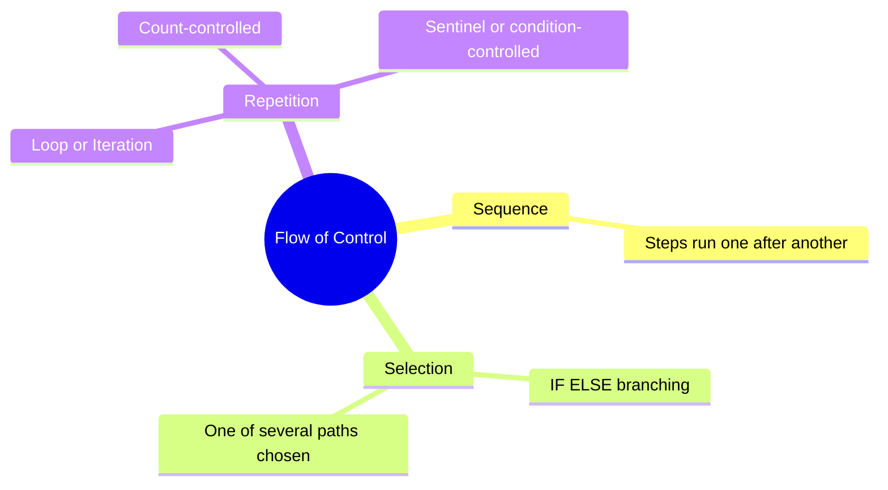

### 4.5.1 Sequence

The simplest flow: every statement executes once, in the order written — as in both worked pseudocode examples above (4.4.2).

### 4.5.2 Selection ⭐⭐⭐

Selection means the algorithm evaluates a condition and executes different steps depending on whether that condition is `True` or `False`.

```text
IF <condition> THEN
    steps to be taken when the condition is true
ELSE
    steps to be taken when the condition is false (otherwise)
END IF
```

> [!note] Terminology carried into Python
> In programming languages, "otherwise" is written using the `else` keyword — so a two-way conditional is written as an `if-else` block in actual code (Chapter 6).

**Worked Example — odd or even (NCERT Example 4.5):**

```text
DISPLAY "Enter the Number"
INPUT number
IF number MOD 2 == 0 THEN
    DISPLAY "Number is Even"
ELSE
    DISPLAY "Number is Odd"
```

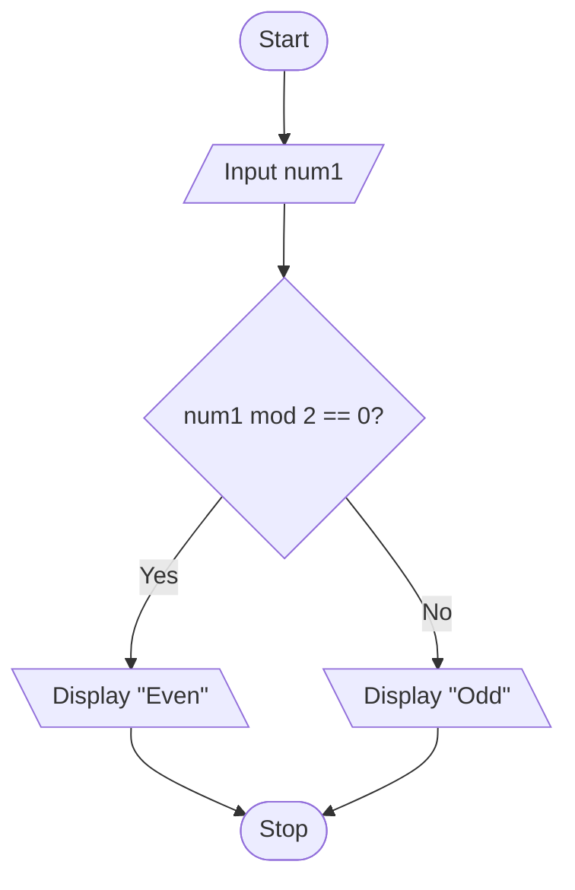

**Worked Example — multi-way selection: child / teenager / adult (NCERT Example 4.6):**

```text
INPUT Age
IF Age < 13 THEN
    DISPLAY "Child"
ELSE IF Age < 20 THEN
    DISPLAY "Teenager"
ELSE
    DISPLAY "Adult"
END IF
```

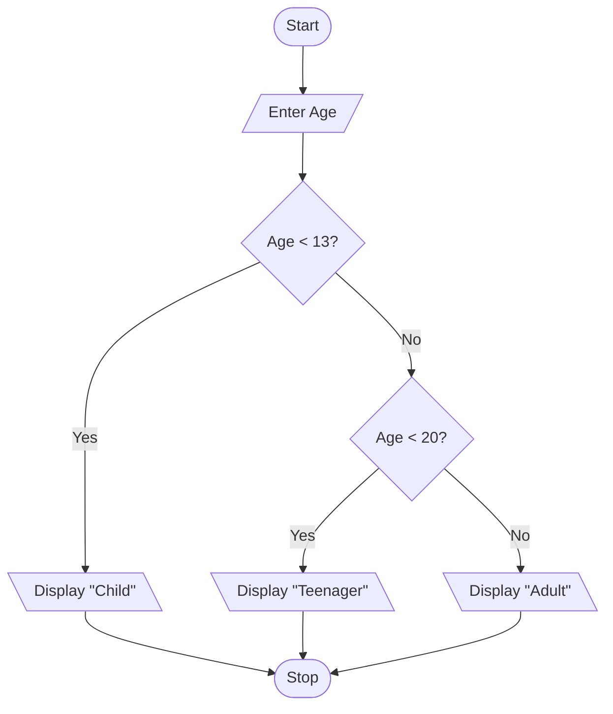

> [!example] Practice 4-B — "Dragons and Wizards" card game (NCERT Example 4.7)
> Multiple `AND`/`OR` conditions can be chained in a single `IF … ELSE IF … ELSE` block: *if the card is a diamond or club → Team DRAGONS scores; else if it's a heart that is a number → Team WIZARDS scores; else if it's a heart that is not a number → Team DRAGONS scores; else → Team WIZARDS scores.* The algorithm keeps two running counters, `Dpoint` and `Wpoint`, incremented inside each branch, then compares them at the end to decide the winner.

### 4.5.3 Repetition (Iteration / Loop) ⭐⭐⭐

Repetition means a set of steps executes repeatedly until a specified condition is satisfied. A counter variable is commonly used to track how many times the loop has run.

**Count-controlled loop — average of 5 numbers (NCERT Example 4.8), known number of repetitions:**

```text
Step 1: SET count = 0, sum = 0
Step 2: WHILE count < 5, REPEAT steps 3 to 5
Step 3:     INPUT num
Step 4:     sum = sum + num
Step 5:     count = count + 1
Step 6: COMPUTE average = sum / 5
Step 7: DISPLAY average
```

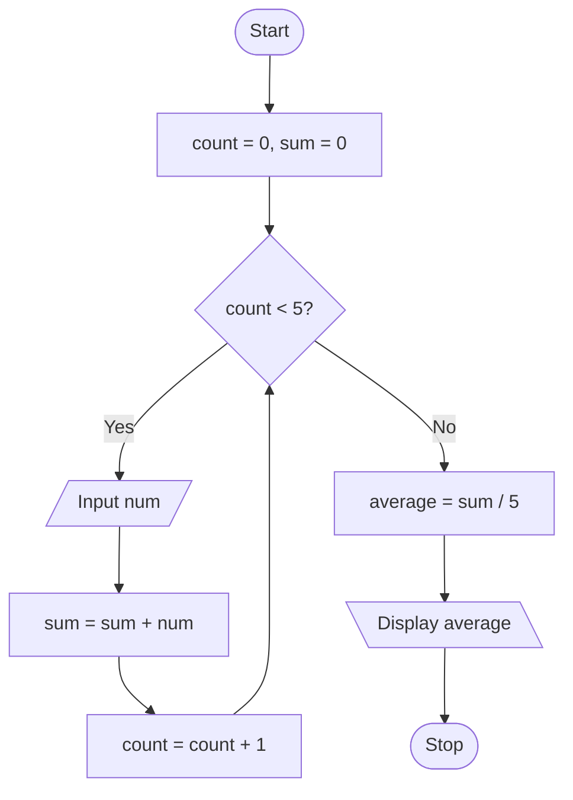

**Sentinel-controlled loop — accept numbers until user enters 0 (NCERT Example 4.9), unknown number of repetitions:**

```text
Step 1: SET count = 0, sum = 0
Step 2: INPUT num
Step 3: WHILE num is not equal to 0, REPEAT steps 4 to 6
Step 4:     sum = sum + num
Step 5:     count = count + 1
Step 6:     INPUT num
Step 7: COMPUTE average = sum / count
Step 8: DISPLAY average
```

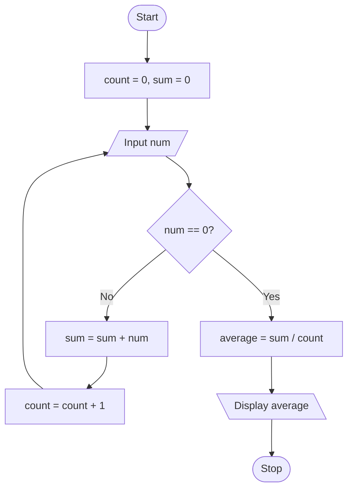

> [!warning] Count-controlled vs sentinel-controlled — don't mix these up
> Use a **count-controlled loop** (`WHILE count < N`) when you already know exactly how many repetitions are needed. Use a **sentinel-controlled loop** (`WHILE input ≠ stop-value`) when repetitions continue until the *data itself* signals "stop" — you genuinely don't know the count in advance.

> [!example] Worked Example — table of a number, 1 to 10 (Added — adapted from Supplementary book, Solved Q.17)
> **Given:** a number `n`. **Find:** its multiplication table from 1×n to 10×n.
> *Note: presented here in the standard pre-test `WHILE` form used throughout this note (rather than the source's own hand-drawn loop-back arrow, whose exact target was ambiguous in the scanned figure) — this keeps the traced behaviour unambiguous: exactly 10 lines are printed, for multipliers 1 through 10.*
> ```text
> INPUT n
> SET a = 1
> WHILE a <= 10, REPEAT:
>     DISPLAY a * n
>     INCREMENT a
> ```
> **Check:** for `n = 5`, this prints `5, 10, 15, … , 50` — ten lines, multiplier `a` running 1 to 10. ✓

> [!example] Worked Example — sum of a factorial series, 1! + 2! + … + 10! (Added — Supplementary book, Solved Q.18)
> **Given:** nothing to input — compute the fixed series `S = 1! + 2! + 3! + … + 10!`.
> **Approach:** keep a *running factorial* `F` that gets multiplied by the loop counter each pass, and add that running factorial into an accumulating `sum` — this reuses the previous term's factorial instead of recomputing each factorial from scratch.
> ```text
> SET F = 1, sum = 0
> SET a = 1
> WHILE a <= 10, REPEAT:
>     F = F * a
>     sum = sum + F
>     a = a + 1
> DISPLAY sum
> ```
> **Check (traced for the first three passes):** `a=1`: `F=1×1=1`, `sum=0+1=1`. `a=2`: `F=1×2=2`, `sum=1+2=3`. `a=3`: `F=2×3=6`, `sum=3+6=9`. — `F` correctly tracks `1!, 2!, 3!, …` at each step because it is repeatedly multiplied by the *next* counter value rather than recomputed from 1 each time.

## 4.6 Verifying Algorithms ⭐⭐⭐

Verifying an algorithm means taking different input values and tracing (running by hand — a **dry run**) through every step, checking the output matches what's expected, before trusting the algorithm enough to code it.

> [!example] Worked Example — a buggy time-addition algorithm (NCERT Section 4.6)
> **Given:** An algorithm to add two durations given as hours and minutes (T1 and T2), producing a combined total.
> **First version:**
> ```text
> INPUT hh1, mm1        (for T1)
> INPUT hh2, mm2        (for T2)
> hh_total = hh1 + hh2
> mm_total = mm1 + mm2
> DISPLAY hh_total, mm_total
> ```
> **Trial 1:** T1 = 5h 20m, T2 = 7h 30m → hh_total = 12, mm_total = 50 → "12 hrs 50 mins" — looks correct.
> **Trial 2:** T1 = 4h 50m, T2 = 2h 20m → hh_total = 6, mm_total = 70 → "6 hrs 70 mins" — **wrong**: 70 minutes is not a valid time value; the correct answer is 7 hrs 10 mins.
> **Fix:** add a check for overflow past 60 minutes:
> ```text
> IF mm_total >= 60 THEN
>     hh_total = hh_total + 1
>     mm_total = mm_total - 60
> END IF
> ```
> **Re-check Trial 2 with the fix:** mm_total = 70 ≥ 60 → hh_total = 7, mm_total = 10 → "7 hrs 10 mins" ✓ now correct.
>
> This is exactly why **you must dry-run more than one test case, including a boundary case** — Trial 1 alone would have hidden the bug completely.

A dry run helps you (1) identify incorrect steps, and (2) spot missing details or special cases the algorithm hasn't accounted for.

## 4.7 Comparison of Algorithms ⭐⭐

More than one algorithm can solve the same problem. Choosing between them is based on **time complexity** (how much processing time an algorithm needs, relative to input size) and **space complexity** (how much memory it needs).

**Example — four ways to test whether a number is prime:**

| Method | Description | Efficiency note |
|---|---|---|
| (i) | Divide by every number from 2 up to the number itself; if any divides evenly, not prime | Slowest — checks far more divisors than necessary |
| (ii) | Same as (i), but only test divisors up to **half** the number | Better — a divisor can never exceed half the number |
| (iii) | Only test divisors up to the **square root** of the number | Better still — fewer divisors to check than method (ii) |
| (iv) | Keep a pre-built list of primes below 100 and divide only by those | Fewest calculations, but needs **extra memory** to store the prime list |

> **Key idea:** there is no single "best" algorithm in the abstract — algorithm (iv) trades memory for speed, which is only a good trade when memory is cheap and speed matters more.

```desmos
f\left(n\right)=n
g\left(n\right)=\sqrt{n}
h\left(n\right)=n/2
```

*Legend:* rough divisor-count comparison for the four prime-check strategies above — `f` = checking up to `n` (method i), `h` = checking up to `n/2` (method ii), `g` = checking up to `√n` (method iii).
*Try this:* as `n` grows, `√n` stays far smaller than `n/2`, which is exactly why method (iii) needs dramatically fewer comparisons for large numbers. *(Syntax reviewed for correctness, not executed against a live Desmos instance.)*

## 4.8 Coding ⭐⭐

Once an algorithm is finalised, it is translated into a **high-level programming language**, following that language's **syntax** — the rules of grammar (spelling, word order, punctuation) that statements must obey.

| Term | Meaning |
|---|---|
| **Machine / low-level language** | 0s and 1s only; directly understood by hardware, extremely hard for humans to write or read |
| **High-level language** | Close to natural language (Python, C, C++, Java…); easy for humans, but not directly understood by hardware |
| **Source code** | A program written in a high-level language |
| **Compiler** | Translates the *entire* source code at once into object code before execution; reports all errors after scanning the whole program |
| **Interpreter** | Translates and executes source code statement by statement; stops at the first error encountered |

High-level languages are **portable** — the same source code can run on different types of computers with little or no modification, unlike low-level code which must be rewritten for each machine type.

## 4.9 Decomposition ⭐⭐

> **Definition:** **Decomposition** is the technique of breaking a complex problem into smaller, more manageable sub-problems, solving each sub-problem (possibly by a different person or team), and then combining the solutions logically to solve the original problem.

**Worked Example — Railway Reservation System (NCERT/Supplementary Section 4.9):**

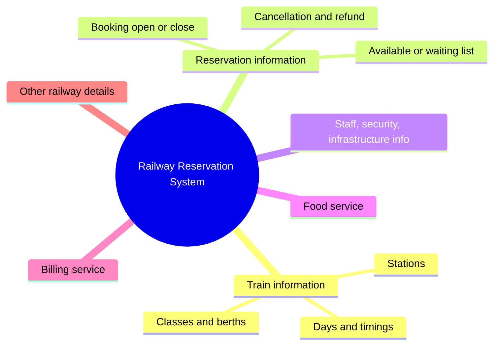

*Reading guide:* each branch of this mindmap can be designed, built, and tested largely independently — that is decomposition's whole payoff — before the six pieces are integrated into one working reservation system.

> **Quote:** *"Decompose a complex problem into simpler problems… put these analyses together with logical glue."* — Howard Raffa

---

## Quick Reference — Chapter 4

**Flowchart symbols:** see table in §4.4.1.

**Pseudocode keywords used in this note:** `INPUT`, `COMPUTE`, `DISPLAY`/`PRINT`, `SET`, `IF … THEN … ELSE … END IF`, `WHILE`, `INCREMENT`, `DECREMENT`, `TRUE`/`FALSE`.

**Characteristics of a good algorithm:** Precision · Uniqueness · Finiteness · Input · Output.

**Four steps of problem solving:** Analysing → Developing an algorithm → Coding → Testing and Debugging.

**Four pillars of Computational Thinking (Added):** Decomposition → Pattern Recognition → Abstraction → Algorithms.

**Origin of the word "algorithm" (Added):** from *Al-Khwarizmi* (Persian mathematician, c. 850 AD), via its Latin translation "Algorithmi."

## Points to Ponder — Chapter 4

> [!warning] Traps that cost marks
> - An algorithm with no defined stopping point is **not** a valid algorithm — finiteness is part of the definition, not a nice-to-have.
> - "It ran without error" is not the same as "it is correct" — dry-run with a boundary case (like the minutes-overflow example) before trusting an algorithm.
> - More than one algorithm can be *correct*; time and space complexity decide which is *better*, not correctness alone.
> - GIGO: a flawless algorithm still gives a wrong answer if the input data is wrong.
> - A flowchart and pseudocode both describe the *logic*, never the implementation syntax of a specific language.
> - **(Added)** Decomposition, Pattern Recognition, Abstraction, and Algorithms are the four named pillars of *Computational Thinking* — don't confuse "Decomposition" the general thinking-skill (§4.3A) with "Decomposition" the systems-design technique (§4.9): the supplementary book uses the same word for both, at two different scales (a single problem vs an entire software system).

## Problem-Solving Strategy — Word Problem → Algorithm/Flowchart

1. Identify exactly what the problem gives you as **input**.
2. Identify exactly what the problem wants as **output**.
3. Decide whether the logic needs pure sequence, a decision (selection), or a loop (repetition) — or some combination.
4. Write the algorithm/pseudocode **before** drawing a flowchart or writing code.
5. Dry-run the algorithm on at least two different inputs, including one boundary/edge case.
6. Only then translate it into a flowchart or program code.
7. If more than one algorithm is possible, compare them by time and space complexity before choosing.

---

# PART B — Chapter 5: Getting Started with Python

**Branch:** Python Fundamentals · **Level:** Class XI · **Python version:** Python 3.x

> *"Computer programming is an art, because it applies accumulated knowledge to the world, because it requires skill and ingenuity, and especially because it produces objects of beauty. A programmer who subconsciously views himself as an artist will enjoy what he does and will do it better."* — Donald Knuth (NCERT, Chapter 5 epigraph)

## Concept Roadmap

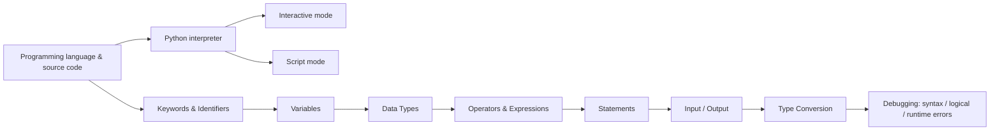

## 5.1 Introduction to Python ⭐

A **program** is an ordered set of instructions executed by a computer to carry out a task; the language used to write those instructions is a **programming language**. Python is a high-level language, so a program written in it is **source code**, translated to machine language by an **interpreter** — statement by statement, first translating, then executing, stopping the moment an error is hit.

> [!note] Where Python came from (Added — Supplementary book §4.7)
> Python is an **open-source, object-oriented, high-level** programming language, developed by **Guido van Rossum in 1991** at the National Research Institute for Mathematics and Computer Science, the Netherlands. It is presently owned by the **Python Software Foundation (PSF)**. Python is based on the **ABC language**, itself a teaching language created to replace an earlier language called BASIC.
>
> Despite the reptile logo, the name **"Python" was inspired by the BBC comedy show *Monty Python's Flying Circus*** — not the snake. (This is a favourite one-mark trivia question.)

### 5.1.1 Features of Python

- High-level, **free and open source**.
- **Interpreted** — no separate compile step before running.
- Clearly defined, relatively simple syntax → easy to read.
- **Case-sensitive**: `NUMBER` and `number` are different identifiers.
- **Portable / platform-independent** — runs on multiple operating systems and hardware.
- Rich library of predefined functions; widely used in web development.
- Uses **indentation** to mark blocks and nested blocks (not braces `{}`).
- **(Added)** Extensible and embeddable — Python programs can call, and be called from, C/C++ code, with no wasted time declaring the types of variables or arguments.
- **(Added)** Supports GUI (Graphical User Interface) programming and has built-in garbage collection for automatic memory management.
- **(Added)** Easily compatible with other languages like C, C++, and Core Java; used for both scientific and non-scientific programming.

> [!note] Advantages of Python (Added — Supplementary book §4.7.2)
> | # | Advantage | What it means |
> |---|---|---|
> | (a) | **Platform-Independent** | Runs across Windows, Linux/Unix, macOS, and other operating systems unchanged |
> | (b) | **Readability** | Clear, simple, concise, English-like instructions, readable even by non-programmers |
> | (c) | **Object-Oriented** | Interactive, interpreted, and Object-Oriented Programming Language |
> | (d) | **Higher Productivity** | Simple language, small code, extensive libraries → more done with less typing than languages like C++ or Java |
> | (e) | **Less Learning Time** | Simpler, shorter code needs less time to understand and learn |
> | (f) | **GUI Programming** | Supports GUI applications created and ported to many system calls, libraries, and systems (e.g. Windows MFC, Macintosh, the X Window system of Unix) |
> | (g) | **Ample Availability of Libraries** | Large standard libraries available to solve almost any task |
> | (h) | **Syntax Highlighting** | Distinguishes input, output, and error messages using different colour codes |

> [!warning] Limitations of Python (Added — Supplementary book §4.7.3)
> | # | Limitation | Why it matters |
> |---|---|---|
> | (a) | **Speed** | Slower than C or C++, since Python is a high-level language, not close to hardware |
> | (b) | **Mobile Development** | Considered a weak language for mobile computing — very few mobile apps are built in it |
> | (c) | **Memory Consumption** | Not ideal for memory-intensive tasks; flexible data types push memory consumption higher |
> | (d) | **Database Access** | Its database-access layer is comparatively underdeveloped/primitive next to JDBC (Java) or ODBC (Open Database Connectivity) |
> | (e) | **Runtime Errors** | Being dynamically typed, it requires more testing, since some errors show up only at run-time |

> [!note] Real-world usage (Added — Supplementary book §4.9)
> Python is used by **Google's search engine, YouTube, Netflix, Spotify, Dropbox, and Instagram**, among many others. It is widely used for: System programming, GUI programming, Internet Scripting/Web development, Gaming, Text processing, Network programming, Commercial Robots, and Space and Scientific applications.

> [!example] Python vs Java (Added — Supplementary book, Solved Q.12)
> | Basis | Python | Java |
> |---|---|---|
> | Speed vs size | Runs slower than Java, but programs are typically **3 to 5 times shorter** — saving time and space overall | Runs faster, but needs more code |
> | Typing | **Loosely typed**, dynamic — no time wasted declaring variable types | Statically typed — variable types must be declared |
> | Learning curve | Easier to learn | Steeper learning curve |

### 5.1.3 Execution Modes ⭐⭐

| Mode | How it works | Good for |
|---|---|---|
| **Interactive mode** | Type one statement at the `>>>` prompt; it executes and shows a result immediately on `Enter` | Testing a single line quickly; statements are **not saved** for later |
| **Script mode** | Write multiple statements in a `.py` file, save it, then run the whole file (`Run → Run Module`, or `F5`) | Real programs — output only appears once you run the saved script |

The Python interpreter is also called the **Python Shell**; on start-up it shows a version/copyright banner followed by the `>>>` prompt, which indicates it is ready to accept a command. Python can be downloaded from the official site, **https://www.python.org/**.

> [!example] Program 5-1 — print statement in script mode (NCERT)
> ```python
> print("Save Earth")
> print("Preserve Future")
> ```
> Output:
> ```text
> Save Earth
> Preserve Future
> ```

> [!example] Case sensitivity, traced exactly (Added — Supplementary book, Fig. 4.14(d))
> `print` is a valid, defined command in Python; `Print` (capital P) is just an ordinary, undefined word to the interpreter — because Python is case-sensitive.
> ```python
> >>> Print("Hello World")
> Traceback (most recent call last):
>   File "<pyshell#2>", line 1, in <module>
>     Print("Hello World")
> NameError: name 'Print' is not defined
> ```
> This is a **runtime error at the interactive prompt**, not a silent auto-correction — Python never guesses that you "meant" `print`.

> [!example] Using the interpreter as a calculator, traced (Added — Supplementary book, Fig. 4.14(e); values independently verified)
> ```python
> >>> 5 + 8
> 13
> >>> print(10 + 55)
> 65
> >>> print(20 / 4 * 5 + 8 - 10)
> 23.0
> >>> print(22 / 7)
> 3.142857142857143
> >>> print(3.14 * 20.8 * 20.8)
> 1358.4896000000003
> ```

> [!note] Small but examined IDLE facts (Added)
> - **IDLE** stands for **Integrated Development Learning Environment** — the standard Python IDE, allowing a user to edit, run, browse, and debug a program from one interface.
> - Press **Alt+P** in IDLE's shell to repeat (recall) a previously typed command, saving re-typing effort.
> - Even if you forget to type the `.py` (or `.pyw`) extension when saving a script for the first time, the editor automatically appends it.

### Exiting Python (Added — NCERT/Supplementary §4.10)

To leave the Python command prompt, press **Ctrl+Q**, or type the built-in function `quit()` or `exit()` and press Enter. If neither works, the fallback is:

```python
import sys
sys.exit()
```

## 5.2 Python Keywords ⭐⭐

**Keywords** are reserved words with a fixed meaning to the interpreter — they can never be used as identifiers, and (being case-sensitive) must be typed exactly as shown.

| | | | | |
|---|---|---|---|---|
| `False` | `class` | `finally` | `is` | `return` |
| `None` | `continue` | `for` | `lambda` | `try` |
| `True` | `def` | `from` | `nonlocal` | `while` |
| `and` | `del` | `global` | `not` | `with` |
| `as` | `elif` | `if` | `or` | `yield` |
| `assert` | `else` | `import` | `pass` | |
| `break` | `except` | `in` | `raise` | |

*(33 keywords in this list. `True`, `False`, `None` are capitalised; almost everything else is lowercase — memorise the exceptions, not the rule.)*

## 5.3 Identifiers ⭐⭐

An **identifier** is a name chosen to identify a variable, function, or other entity. Rules:

1. Must begin with an uppercase letter, lowercase letter, or underscore (`_`) — **never a digit**.
2. May then contain any combination of `a`–`z`, `A`–`Z`, `0`–`9`, `_`.
3. Can be any length (but keep it short and meaningful).
4. Must **not** be a keyword.
5. No special symbols (`!`, `@`, `#`, `$`, `%`, …) are allowed.

> **Key idea:** prefer meaningful names — `marks1`, `avg`, `area`, `length`, `breadth` — over single letters like `a`, `b`, `c` for clarity and readability.

## 5.4 Variables ⭐⭐

A **variable** is a name (identifier) that refers to an **object** stored in memory; its value can be a string, a number, or any combination of alphanumeric characters. Variable declaration in Python is **implicit** — a variable is created the moment it is first assigned a value using `=`, and it must be assigned before it appears in any expression.

> [!example] Program 5-3 — area of a rectangle (NCERT Program 5.3)
> ```python
> length = 10
> breadth = 20
> area = length * breadth
> print(area)
> ```
> Output:
> ```text
> 200
> ```

## 5.5 Comments ⭐

A **comment** starts with `#` (hash); everything from `#` to the end of the line is ignored by the interpreter. Comments document *why*, not *what* a line already visibly does — useful when a program is written by one person and later read or maintained by another.

```python
#totalMarks is sum of marks in all the tests of Mathematics
totalMarks = test1 + test2 + finalTest
```

## 5.6 Everything Is an Object ⭐⭐

Every value Python handles — numeric, string, or otherwise — is treated as an **object**, and every object is given a unique **identity (ID)** for its lifetime, returned by the built-in `id()` function (conceptually similar to a memory address).

```python
num1 = 20
print(id(num1))        # some identity value
num2 = 30 - 10
print(id(num2))        # same identity as num1 — both refer to the same object 20
```

> [!note] Why "everything is an object" (Added — NCERT side-note)
> In Object-Oriented Programming generally, an *object* represents something from the real world (employee, student, vehicle, book…), and each object has (i) **data/attributes** and (ii) **behaviour/methods**, usually created from a *class*. Python is loosely cast in this mould: it is an object-oriented language, but some of its objects may lack attributes, or lack methods, so the fit with "classic" OOP definitions (as in C++ or Java) is intentionally relaxed.

## 5.7 Data Types ⭐⭐⭐

Every value belongs to a **data type**, which determines what values a variable can hold and what operations are valid on it.

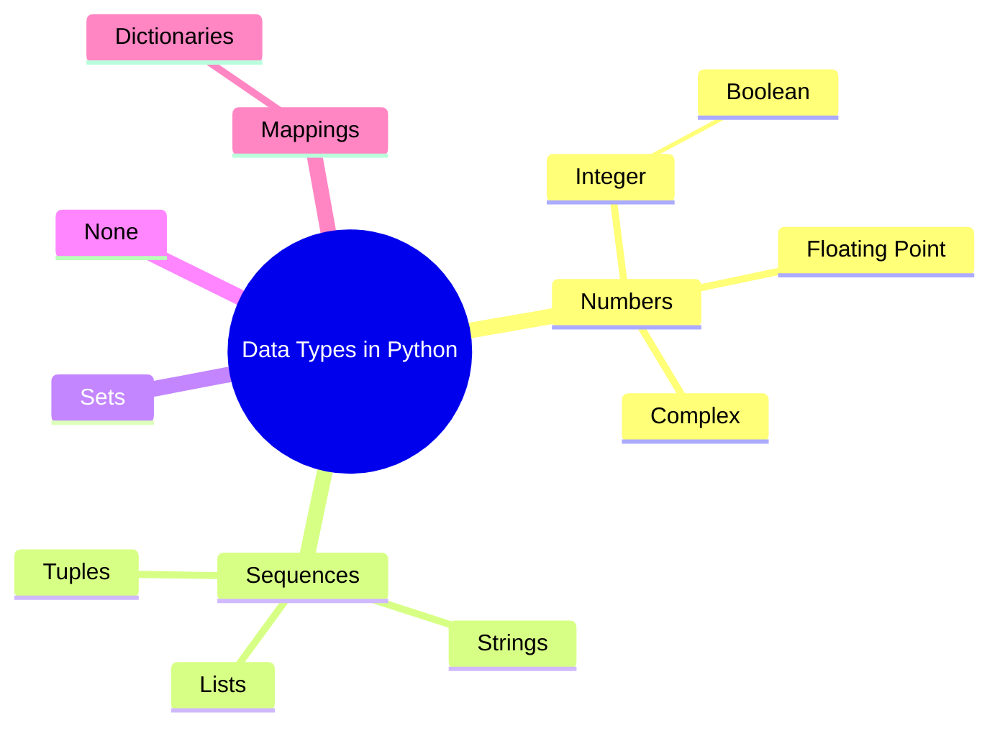

### 5.7.1 Number

| Type/class | Description | Example |
|---|---|---|
| `int` | Integer numbers | `-12, -3, 0, 125, 2` |
| `float` | Real / floating-point numbers | `-2.04, 4.0, 14.23` |
| `complex` | Complex numbers | `3 + 4j, 2 - 2j` |

`bool` is a **subtype of `int`**, restricted to `True` and `False`. `True` behaves as non-zero, non-null, non-empty; `False` behaves as the value zero.

```python
num1 = 10;       print(type(num1))   # <class 'int'>
var1 = True;     print(type(var1))   # <class 'bool'>
float1 = -1921.9; print(type(float1)) # <class 'float'>
var2 = -3+7.2j;  print(type(var2))   # <class 'complex'>
```

### 5.7.2 Sequence — String, List, Tuple

| Type | Enclosed in | Ordered? | Example |
|---|---|---|---|
| **String** | `' '` or `" "` | Yes | `'Hello Friend'` |
| **List** | `[ ]` | Yes | `[5, 3.4, "New Delhi", "20C", 45]` |
| **Tuple** | `( )` | Yes | `(10, 20, "Apple", 3.4, 'a')` |

> [!warning] A string that "looks like" a number is still a string
> `str2 = "452"` cannot be used in numeric arithmetic directly — the quotes mark text, not a numeric value, no matter what characters are inside them.

### 5.7.3 Set

Enclosed in `{ }`; an **unordered** collection with **no duplicate entries** — elements, once created, cannot be individually changed.

```python
set2 = {1, 2, 1, 3}
print(set2)   # {1, 2, 3}  -- the duplicate 1 is silently dropped
```

### 5.7.4 None

A special data type with a single value, `None`, used to signify the *absence* of a value. `None` is **neither** `False` nor `0` — it supports no special operations of its own.

### 5.7.5 Mapping — Dictionary

Enclosed in `{ }`, but holds **key : value** pairs (unlike a set, which holds bare values). Values are looked up by key using square brackets. A mobile phone's contacts book — name mapped to number — is a good everyday application of a dictionary.

```python
dict1 = {'Fruit':'Apple', 'Climate':'Cold', 'Price(kg)':120}
print(dict1['Price(kg)'])   # 120
```

### 5.7.6 Mutable vs Immutable ⭐⭐⭐

| Immutable (cannot change in place) | Mutable (can change in place) |
|---|---|
| Integers, Float, Boolean, Complex, Strings, Tuples | Lists, Sets, Dictionary |

When you try to change the value of an **immutable** variable, Python does not edit the existing object — it destroys the old binding and creates a **new** object, rebinding the same variable name to it.

```svg
<svg viewBox="0 0 420 160" xmlns="http://www.w3.org/2000/svg" style="max-width:100%;height:auto" font-family="sans-serif">
  <defs>
    <marker id="arrow1" viewBox="0 0 10 10" refX="9" refY="5" markerWidth="6" markerHeight="6" orient="auto-start-reverse">
      <path d="M0,0 L10,5 L0,10 z" fill="#262626"/>
    </marker>
  </defs>
  <rect x="20" y="20" width="90" height="30" fill="#ffffff" stroke="#262626" stroke-width="1.5"/>
  <text x="65" y="40" font-size="13" fill="#262626" text-anchor="middle">num1</text>
  <rect x="20" y="100" width="90" height="30" fill="#ffffff" stroke="#262626" stroke-width="1.5"/>
  <text x="65" y="120" font-size="13" fill="#262626" text-anchor="middle">num2</text>
  <rect x="270" y="55" width="110" height="40" fill="#e3f2fd" stroke="#1565c0" stroke-width="1.5"/>
  <text x="325" y="80" font-size="14" fill="#1565c0" text-anchor="middle">300</text>
  <text x="325" y="30" font-size="11" fill="#757575" text-anchor="middle">id 1000</text>
  <line x1="110" y1="35" x2="265" y2="65" stroke="#262626" stroke-width="1.5" marker-end="url(#arrow1)"/>
  <line x1="110" y1="115" x2="265" y2="85" stroke="#262626" stroke-width="1.5" marker-end="url(#arrow1)"/>
  <text x="325" y="130" font-size="11" fill="#555555" text-anchor="middle">num1 = 300; num2 = num1</text>
</svg>
```

```svg
<svg viewBox="0 0 420 200" xmlns="http://www.w3.org/2000/svg" style="max-width:100%;height:auto" font-family="sans-serif">
  <defs>
    <marker id="arrow2" viewBox="0 0 10 10" refX="9" refY="5" markerWidth="6" markerHeight="6" orient="auto-start-reverse">
      <path d="M0,0 L10,5 L0,10 z" fill="#262626"/>
    </marker>
  </defs>
  <rect x="20" y="130" width="90" height="30" fill="#ffffff" stroke="#262626" stroke-width="1.5"/>
  <text x="65" y="150" font-size="13" fill="#262626" text-anchor="middle">num2</text>
  <rect x="270" y="115" width="110" height="40" fill="#e3f2fd" stroke="#1565c0" stroke-width="1.5"/>
  <text x="325" y="140" font-size="14" fill="#1565c0" text-anchor="middle">300</text>
  <text x="325" y="100" font-size="11" fill="#757575" text-anchor="middle">id 1000</text>
  <line x1="110" y1="145" x2="265" y2="135" stroke="#262626" stroke-width="1.5" marker-end="url(#arrow2)"/>
  <rect x="20" y="20" width="90" height="30" fill="#ffffff" stroke="#262626" stroke-width="1.5"/>
  <text x="65" y="40" font-size="13" fill="#262626" text-anchor="middle">num1</text>
  <rect x="270" y="20" width="110" height="40" fill="#fff3e0" stroke="#e65100" stroke-width="1.5"/>
  <text x="325" y="45" font-size="14" fill="#e65100" text-anchor="middle">400</text>
  <text x="325" y="70" font-size="11" fill="#757575" text-anchor="middle">id 2200 (new object)</text>
  <line x1="110" y1="35" x2="265" y2="40" stroke="#262626" stroke-width="1.5" marker-end="url(#arrow2)"/>
  <text x="210" y="185" font-size="11" fill="#555555" text-anchor="middle">num1 = num2 + 100 rebinds num1; num2 is unaffected</text>
</svg>
```

*Reading guide:* before the reassignment, `num1` and `num2` both point at the same `int` object `300`. After `num1 = num2 + 100`, `num1` points to a brand-new object `400` — `num2` still points at the original `300`, because `int` is immutable and cannot be edited in place.

### 5.7.7 Choosing the Right Data Type

| Need | Use |
|---|---|
| A simple, iterable collection that changes often | **List** |
| Data that should never change (e.g. month names) | **Tuple** |
| Unique elements, duplicates not wanted | **Set** |
| Fast lookup by a custom key, key–value association | **Dictionary** |

## 5.8 Operators ⭐⭐⭐

An **operator** performs an operation on **operands**. Python groups operators into six categories.

### 5.8.1 Arithmetic Operators

| Operator | Operation | Example |
|---|---|---|
| `+` | Addition (also string concatenation) | `5 + 6 → 11`; `"Hello"+"India" → 'HelloIndia'` |
| `-` | Subtraction | `5 - 6 → -1` |
| `*` | Multiplication (also string repetition with an int) | `5 * 6 → 30`; `'India' * 2 → 'IndiaIndia'` |
| `/` | Division (true division, returns float) | `4 / 8 → 0.5` |
| `%` | Modulus (remainder) | `13 % 5 → 3` |
| `//` | Floor division (integer division) | `13 // 4 → 3` |
| `**` | Exponent | `3 ** 4 → 81` |

### 5.8.2 Relational Operators

| Operator | Meaning | Example (`num1=10, num2=0`) |
|---|---|---|
| `==` | Equal to | `num1 == num2 → False` |
| `!=` | Not equal to | `num1 != num2 → True` |
| `>` | Greater than | `num1 > num2 → True` |
| `<` | Less than | `num1 < num2 → False` |
| `>=` | Greater than or equal to | `num1 >= num2 → True` |
| `<=` | Less than or equal to | `num1 <= num2 → False` |

> [!note] Relational operators also work on strings (Added — NCERT, restored)
> With `str1 = "Good"` and `str2 = "Afternoon"`:
> ```python
> str1 > str2   # True
> str2 < str1   # True
> str1 >= str2  # True
> str1 <= str2  # False
> ```
> **Why:** Python compares strings **lexicographically**, using the **ASCII value** of characters. It compares the first character of each string; if those match, it compares the second character, and so on. Since `'G'` (in "Good") has a higher ASCII value than `'A'` (in "Afternoon"), `"Good" > "Afternoon"` evaluates to `True` — exactly the same logic as alphabetical-order comparison, just character-code-driven rather than dictionary-driven.

### 5.8.3 Assignment Operators

| Operator | Meaning | Example |
|---|---|---|
| `=` | Simple assignment | `num2 = num1` |
| `+=` | `x = x + y` | `num1 = 10; num1 += 2 → 12` |
| `-=` | `x = x - y` | `10 -= 2 → 8` |
| `*=` | `x = x * y` | `2 *= 3 → 6` |
| `/=` | `x = x / y` | `6 /= 3 → 2.0` |
| `%=` | `x = x % y` | `7 %= 3 → 1` |
| `//=` | `x = x // y` | `7 //= 3 → 2` |
| `**=` | `x = x ** y` | `2 **= 3 → 8` |

### 5.8.4 Logical Operators

`and`, `or`, `not` (always lowercase). Every value is logically `True` except `None`, `False`, `0`, and empty collections (`""`, `()`, `[]`, `{}`).

| Operator | Rule | Example |
|---|---|---|
| `and` | `True` only if **both** operands are `True` | `True and False → False` |
| `or` | `True` if **either** operand is `True` | `True or False → True` |
| `not` | Reverses the logical state of its operand | `not True → False` |

> [!warning] A real trap — `not` does not reassign the variable
> Given `num1 = 10`, evaluating the standalone expression `not num1` produces the value `False`, but it does **not change `num1` itself** (there is no `=` on the left). A later `bool(num1)` still evaluates to `True`, since `num1` is still `10`. Confusing a bare logical expression with an assignment is one of the most common beginner mistakes.

### 5.8.5 Identity Operators

`is` and `is not` compare whether two variables refer to the **same object in memory** (same `id()`), not merely equal values.

```python
num1 = 5
num2 = num1
print(num1 is num2)      # True  -- same object
print(num1 is not num2)  # False
```

### 5.8.6 Membership Operators

`in` and `not in` test whether a value exists inside a sequence.

```python
a = [1, 2, 3]
print(2 in a)      # True
print('1' in a)     # False -- string '1' is not the same as int 1
```

## 5.9 Expressions ⭐⭐⭐

An **expression** is any combination of constants, variables, and operators that evaluates to a value. A bare value or bare variable also counts as an expression; a bare operator does not.

### 5.9.1 Precedence of Operators

| Order | Operator(s) | Description |
|---|---|---|
| 1 (highest) | `**` | Exponentiation |
| 2 | `~`, unary `+`, unary `-` | Complement, unary plus/minus |
| 3 | `*`, `/`, `%`, `//` | Multiply, divide, modulo, floor division |
| 4 | `+`, `-` | Addition, subtraction |
| 5 | `<=`, `<`, `>`, `>=`, `==`, `!=` | Relational / comparison |
| 6 | `=`, `%=`, `/=`, `//=`, `-=`, `+=`, `*=`, `**=` | Assignment |
| 7 | `is`, `is not` | Identity |
| 8 | `in`, `not in` | Membership |
| 9 | `not` | Logical NOT |
| 10 | `and` | Logical AND |
| 11 (lowest) | `or` | Logical OR |

> **Rules:** parentheses `()` can always be used to force an evaluation order; among operators of *equal* precedence, evaluation proceeds **left to right**.

**Worked examples (NCERT Examples 5.9–5.12), hand-traced:**

| Expression | Step-by-step | Result |
|---|---|---|
| `20 + 30 * 40` | `*` before `+` → `20 + 1200` | `1220` |
| `20 - 30 + 40` | equal precedence, left→right → `(-10) + 40` | `30` |
| `(20 + 30) * 40` | parentheses force `+` first → `50 * 40` | `2000` |
| `15.0 / 4 + (8 + 3.0)` | inner `()` first → `15.0/4.0 + 11.0` → `3.75 + 11.0` | `14.75` |

## 5.10 Statement ⭐

A **statement** is a unit of code the Python interpreter can execute — an assignment statement, a `print()` call, and so on.

```python
x = 4          # assignment statement
cube = x ** 3  # assignment statement
print(x, cube) # print statement → 4 64
```

## 5.11 Input and Output ⭐⭐⭐

### `input()`

```text
input([Prompt])
```

`Prompt` (optional) is displayed before the user types. **`input()` always returns a string**, no matter what the user types — a number typed at the prompt is still handed back as text.

```python
age = input("Enter your age: ")
print(type(age))   # <class 'str'>, even though the user typed a number
```

To use the value numerically, convert it explicitly:

```python
age = int(input("Enter your age: "))
print(type(age))   # <class 'int'>
```

### `print()`

```text
print(value [, ..., sep = ' ', end = '\n'])
```

- `sep` — string inserted **between** printed values; default is a single space.
- `end` — string appended **after** the last value; default is `'\n'` (new line).
- `print()` converts every argument passed to it into a string form before writing it to the screen, and always outputs a complete line before moving to the next one.

| Statement | Output |
|---|---|
| `print("Hello")` | `Hello` |
| `print(10*2.5)` | `25.0` |
| `print("I" + "love" + "my" + "country")` | `Ilovemycountry` (no space — `+` concatenates directly) |
| `print("I'm", 16, "years old")` | `I'm 16 years old` (comma passes *multiple arguments*, separated by `sep`) |

> [!example] Custom `sep` and `end` (Supplementary book demo)
> ```python
> print('cow', 'cat', 'dog', sep=', ', end='!!!\n')
> ```
> Output:
> ```text
> cow, cat, dog!!!
> ```
> If `sep` is used, it must be given **after** all the positional values, or Python raises `SyntaxError: positional argument follows keyword argument`.

> [!example] The `sep` argument, several ways at once (Added — Supplementary book, Fig. 4.14(f))
> All five lines below print the same three numbers, `10`, `20`, `30` — only the separator between them changes:
> | Call | Output |
> |---|---|
> | `print(10, 20, 30)` | `10 20 30` *(default: single space)* |
> | `print(10, 20, 30, sep="*")` | `10*20*30` |
> | `print(10, 20, 30, sep="-*-")` | `10-*-20-*-30` |
> | `print(10, 20, 30, sep=',')` | `10,20,30` |
> | `print(10, 20, 30, sep='\n')` | `10`, `20`, `30` each on its own line |
> | `print(10, 20, 30, sep='\t')` | `10`, `20`, `30` separated by tab characters |

## 5.12 Type Conversion ⭐⭐⭐

### 5.12.1 Explicit Conversion (Type Casting)

The programmer forces the conversion: `(new_data_type)(expression)`.

| Function | Converts to |
|---|---|
| `int(x)` | Integer |
| `float(x)` | Floating-point number |
| `str(x)` | String representation |
| `chr(x)` | Character for ASCII code `x` |
| `ord(x)` | ASCII code for character `x` |

> [!example] Worked Example — Program 5-9 (NCERT), concatenation vs arithmetic
> **Given:** `icecream = '25'`, `brownie = '45'` (both strings).
> **Find:** the total price as a correctly added number, printed with a label.
> **Approach:** `+` on two strings concatenates rather than adds — `int()` is needed before arithmetic, then `str()` to rejoin the numeric result with label text.
> **Work / Check** (traced, not invented):
> ```python
> icecream = '25'
> brownie = '45'
> price = icecream + brownie                  # string concatenation
> print("Total Price Rs." + price)             # Total Price Rs.2545
> price = int(icecream) + int(brownie)         # numeric addition
> print("Total Price Rs." + str(price))        # Total Price Rs.70
> ```
> Output:
> ```text
> Total Price Rs.2545
> Total Price Rs.70
> ```

> [!warning] `TypeError` on mixed types
> `print("The total is Rs." + totalPrice)` where `totalPrice` is an `int` raises `TypeError: can only concatenate str (not "int") to str`. Python will **not** silently guess a conversion here — you must write `str(totalPrice)` explicitly, because an automatic string conversion could lose information the interpreter has no way to judge as safe.

### 5.12.2 Implicit Conversion (Coercion)

Python converts automatically, without the programmer asking, whenever it can do so **without loss of information** — this is called **type promotion**. Adding an `int` and a `float` promotes the result to `float` (the wider type), never the other way round.

```python
num1 = 10       # int
num2 = 20.0     # float
sum1 = num1 + num2
print(sum1, type(sum1))   # 30.0 <class 'float'>
```

## 5.13 Debugging ⭐⭐⭐

**Debugging** is the process of identifying and removing mistakes (**bugs**/errors) from a program.

| Error type | When it appears | Effect | Example |
|---|---|---|---|
| **Syntax error** | Detected *before* the program runs | Program does not run at all | A missing parenthesis, e.g. `(7 + 11`; **wrong indentation** also produces a syntax error, since Python uses indentation to mark blocks |
| **Logical (semantic) error** | Program runs to completion | Produces a *plausible but wrong* output | Computing average as `10 + 12/2` (→ 16) instead of `(10 + 12)/2` (→ 11) |
| **Runtime error** | Appears *while* the program is executing | Program terminates abnormally mid-run | Division by zero |

> [!note] Added
> Most Python editors (including IDLE) will automatically indent statements for you inside a block — but a manually broken indentation level is still a common, easy-to-miss cause of a `SyntaxError`/`IndentationError`. Python program files are saved with either the `.py` or the `.pyw` extension.

> [!example] Worked Example — Program 5-11 (NCERT), classifying three runtime scenarios
> **Given:**
> ```python
> num1 = 10.0
> num2 = int(input("num2 = "))
> print(num1 / num2)
> ```
> **Concept:** classify what happens for each input as syntax / runtime / logical.
> **Work — traced against actual Python behaviour:**
>
> | Input for `num2` | Result | Classification |
> |---|---|---|
> | `apple` | `ValueError: invalid literal for int() with base 10: 'apple'` | **Runtime error** — the program had already started executing `int(input(...))` when it failed |
> | `0` | `ZeroDivisionError: float division by zero` | **Runtime error** |
> | `10` | `1.0` | Correct — no error |
>
> **Check:** none of these are syntax errors, because the code is grammatically valid Python in all three cases; the failure only happens once execution reaches the offending line.

---

## Quick Reference — Chapter 5

**Explicit type-conversion functions:** `int()`, `float()`, `str()`, `chr()`, `ord()`.

**`print()` defaults:** `sep=' '`, `end='\n'`.

**Mutable:** list, set, dictionary. **Immutable:** int, float, bool, complex, string, tuple.

**Operator precedence (high → low):** `**` → unary `+`/`-`/`~` → `*`,`/`,`%`,`//` → `+`,`-` → comparisons → assignment → `is`/`is not` → `in`/`not in` → `not` → `and` → `or`.

**File extensions (Added):** Python programs are saved with `.py` or `.pyw`.

**Exiting the interpreter (Added):** `Ctrl+Q`, or `quit()` / `exit()`, or `import sys; sys.exit()`.

**IDLE (Added):** Integrated Development **L**earning **E**nvironment — as this textbook defines the acronym (note: some other sources expand it as "Integrated Development *and* Learning Environment"; this note preserves the exact source wording).

**Python's creator and origin (Added):** Guido van Rossum, 1991, based on the ABC language; name inspired by *Monty Python's Flying Circus*.

## Points to Ponder — Chapter 5

> [!warning] Traps that cost marks
> - `input()` **always** returns a `str` — wrap it in `int()`/`float()` before doing arithmetic, or `*` will *repeat* a string instead of multiplying a number.
> - `print()`'s default separator is one space, default line-ending is `\n` — override both explicitly with `sep=` / `end=` when the output format matters.
> - Python is case-sensitive: `Print` is not `print` (it raises `NameError: name 'Print' is not defined`); `NUMBER` and `number` are different identifiers.
> - A **keyword** (e.g. `class`, `True`, `is`) can never be used as an identifier.
> - Reassigning an **immutable** variable creates a brand-new object; it does not edit the old one in place — mutable types (list/set/dict) genuinely change in place.
> - `+` between two strings concatenates; between a string and an `int` it raises `TypeError` unless one side is explicitly converted with `str()`/`int()`.
> - Explicit type conversion can **lose information** — `int(20.67)` discards `.67`; it truncates, it does not round.
> - By default, every value is logically `True` **except** `None`, `False`, `0`, and empty collections (`""`, `()`, `[]`, `{}`).
> - **(Added)** Relational operators on strings compare **lexicographically by ASCII value**, character by character — `"Good" > "Afternoon"` is `True` because `'G'` has a higher ASCII code than `'A'`.
> - **(Added)** Wrong indentation is not a cosmetic issue in Python — it is a **syntax error**, because indentation is how Python marks a block.
> - **(Added)** `=` **assigns** a value; `==` **compares** two values for equality. Confusing them is one of the single most common beginner mistakes in any C-family-syntax language, Python included — if a line is asking a yes/no question, it needs `==`.

## Problem-Solving Strategy — Python Coding Question

1. Note exactly what output is wanted, and what **data type** that output should be.
2. For every `input()` call, ask immediately: "do I need to convert this string?"
3. Choose the data type/structure deliberately (see §5.7.7's quick guide) rather than defaulting to whatever comes to mind first.
4. Write the expression, then apply the precedence table by hand once before trusting the result.
5. Trace the code line by line, writing down each variable's value as it changes.
6. Classify any error you hit: does the program refuse to start (**syntax**), crash partway through (**runtime**), or run to completion with a wrong answer (**logical**)?
7. Fix the bug, then **re-trace** — never just guess-and-rerun until the output looks right.
