# Computer Science | Chapter 04 | Python Programming Fundamentals | CNOTES

**Branches merged:** Python Fundamentals + Functions & Modules · **Level:** Class XI · Companion to `Python-Programming-Fundamentals-NOTES.md`
**Source chapters:** NCERT Computer Science — Chapter 5 (Getting Started with Python) + Chapter 7 (Functions)

> Same content as NOTES, same breadth, reformatted into bullets, tables, and diagrams for fast scanning. No facts, figures, examples, or comparisons have been dropped.

## Concept Roadmap

```mermaid
%%{init: {'theme':'dark'}}%%
flowchart TD
    A([High-level language: Python]) --> B[Interpreter converts source to machine code]
    B --> C{Execution mode?}
    C -->|Interactive| D1[One statement at a time, instant result]
    C -->|Script| D2[Whole .py file, run together]
    D1 --> E[Identifiers & Keywords name things]
    D2 --> E
    E --> F[Variables bind names to objects]
    F --> G[Data types: Number, Sequence, Set, None, Mapping]
    G --> H[Operators combine values]
    H --> I[Expressions evaluate by precedence]
    I --> J[Statements: assignment, input, print]
    J --> K[Type conversion: implicit & explicit]
    K --> L[Debugging: syntax / logical / runtime errors]
    L --> M[Repeated code → break into functions]
    M --> N[def creates a user-defined function]
    N --> O[Arguments passed in, received as parameters]
    O --> P[return sends value(s) back]
    P --> Q[Variable scope: local vs global]
    Q --> R([Standard Library: built-ins + modules])
```

## Unit Overview

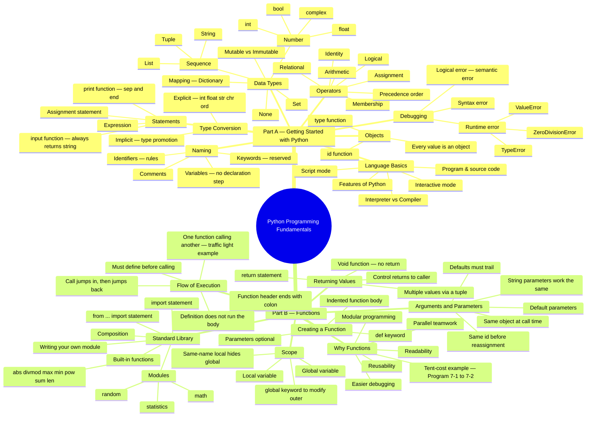
```mermaid
mindmap
  root((Python Programming Fundamentals))
    Part A — Getting Started with Python
      Language Basics
        Program & source code
        Interpreter vs Compiler
        Interactive mode
        Script mode
        Features of Python
      Naming
        Keywords — reserved
        Identifiers — rules
        Variables — no declaration step
        Comments
      Objects
        id function
        type function
        Every value is an object
      Data Types
        Number
          int
          float
          complex
          bool
        Sequence
          String
          List
          Tuple
        Set
        None
        Mapping — Dictionary
        Mutable vs Immutable
      Operators
        Arithmetic
        Relational
        Assignment
        Logical
        Identity
        Membership
        Precedence order
      Statements
        Expression
        Assignment statement
        input function — always returns string
        print function — sep and end
      Type Conversion
        Explicit — int float str chr ord
        Implicit — type promotion
      Debugging
        Syntax error
        Runtime error
          ValueError
          ZeroDivisionError
          TypeError
        Logical error — semantic error
    Part B — Functions
      Why Functions
        Modular programming
        Tent-cost example — Program 7-1 to 7-2
        Readability
        Reusability
        Easier debugging
        Parallel teamwork
      Creating a Function
        def keyword
        Function header ends with colon
        Indented function body
        Parameters optional
      Arguments and Parameters
        Same object at call time
        Same id before reassignment
        String parameters work the same
        Default parameters
        Defaults must trail
      Returning Values
        return statement
        Void function — no return
        Multiple values via a tuple
        Control returns to caller
      Flow of Execution
        Definition does not run the body
        Must define before calling
        Call jumps in, then jumps back
        One function calling another — traffic light example
      Scope
        Global variable
        Local variable
        global keyword to modify outer
        Same-name local hides global
      Standard Library
        Built-in functions
          abs divmod max min pow sum len
        Modules
          math
          random
          statistics
        import statement
        from ... import statement
        Writing your own module
        Composition
```

---

## Part A — Getting Started with Python (NCERT Chapter 5)

### §1 — Programming Languages and Python

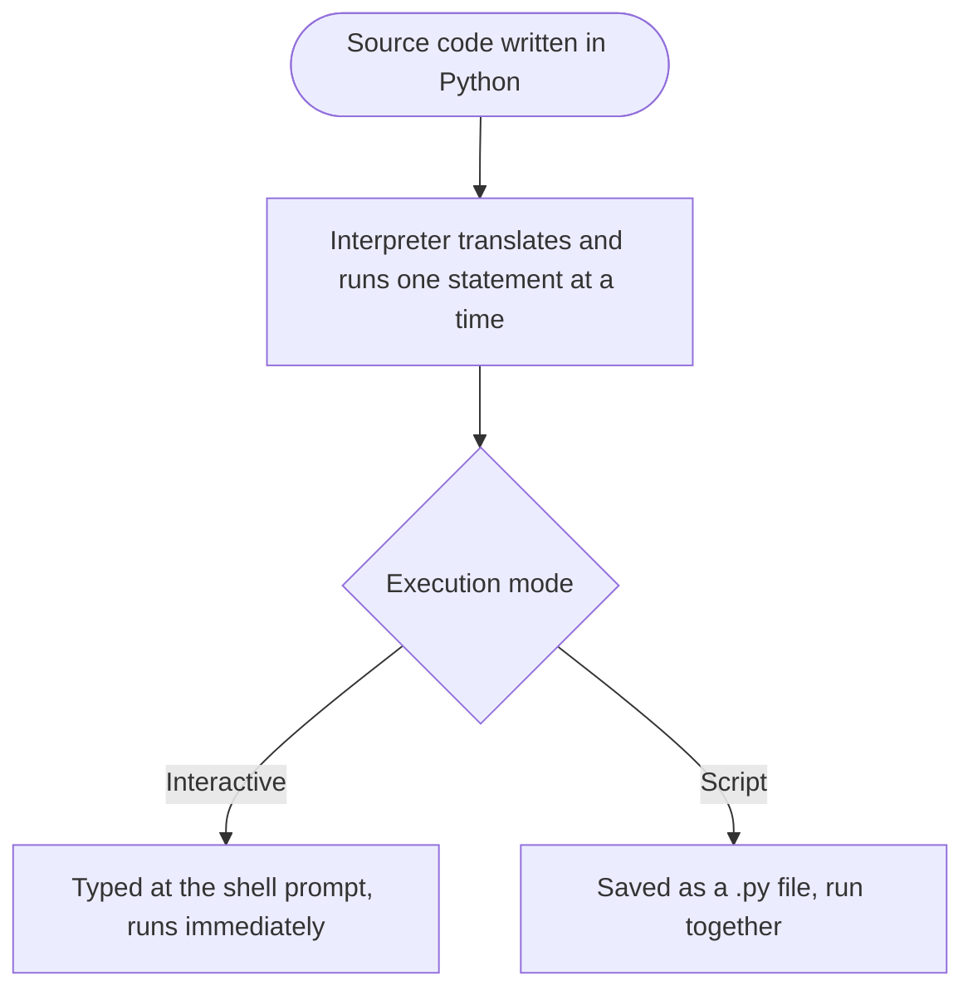
```mermaid
flowchart TD
    A([Source code written in Python]) --> B[Interpreter translates and runs one statement at a time]
    B --> C{Execution mode}
    C -->|Interactive| D[Typed at the shell prompt, runs immediately]
    C -->|Script| E[Saved as a .py file, run together]
```

**§1.1 — Programs, source code, translators**

- A program is an ordered set of instructions a computer executes to carry out a task. §1.1
- A programming language is the language used to write those instructions. §1.1
- Computers natively understand only machine language — 0s and 1s. §1.1
- High-level languages (Python, C++, etc.) exist so people don't have to write machine language directly. §1.1
- Machine language is impractical for people to write directly. §1.1
- Source code = a program written in a high-level language. §1.1
- A language translator converts source code to machine language. §1.1
- Python uses an interpreter. §1.1

| Translator | How it works | When errors surface |
|---|---|---|
| Interpreter | Translates and runs one statement at a time | Execution stops at the first error found |
| Compiler | Translates the entire program into object code before running any of it | All errors reported together, after scanning the whole program |

**§1.2 — Features of Python**

- Free, open-source, high-level language. §1.2
- Interpreted, with clearly defined, relatively simple syntax. §1.2
- Case-sensitive — `NUMBER` and `number` are different identifiers. §1.2
- Portable and platform-independent. §1.2
- Ships with a rich standard library of ready-made functions. §1.2
- Widely used in web development. §1.2
- Uses indentation — not braces — to mark blocks and nested blocks. §1.2
- Latest Python 3 release is available from python.org. §1.2

**§1.3 — Working with the Python shell**

- The Python interpreter is also called the Python shell. §1.3
- Started from an installed distribution or an online interpreter. §1.3
- The `>>>` prompt signals the interpreter is ready for a statement. §1.3

**§1.4 — Execution modes**

| Mode | Behaviour | Trade-off |
|---|---|---|
| Interactive mode | Type one statement at the `>>>` prompt; it runs immediately | Great for quick tests, but nothing is saved for reuse |
| Script mode | Write several statements into a `.py` file, then run the whole file | Reusable and shareable, but no per-line feedback |

- A saved script is run by typing the file name (with path) at the prompt, or via Run → Run Module (F5) from inside the editor. §1.4

Program 5-1 (NCERT Program 5.1) — print statements in script mode. §1.4
```python
print("Save Earth")
print("Preserve Future")
```
Output:
```text
Save Earth
Preserve Future
```

---

### §2 — Python Keywords

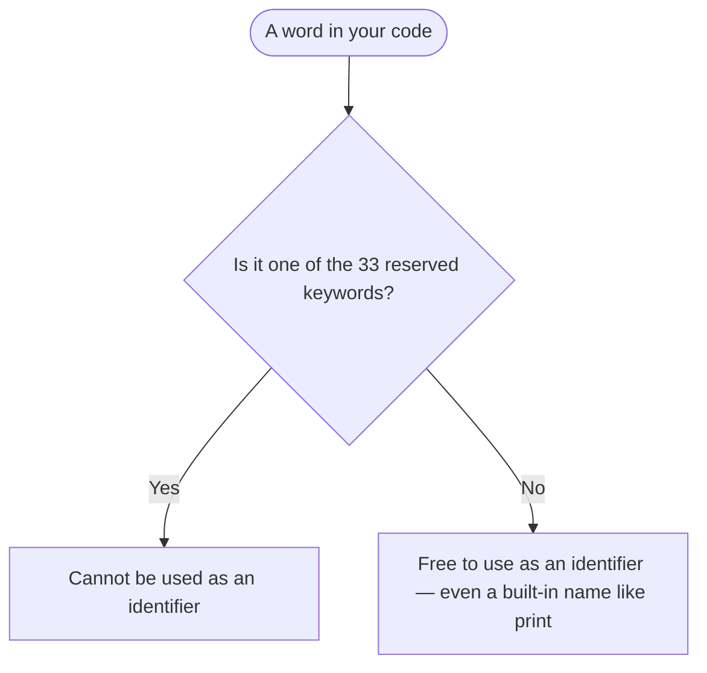
```mermaid
flowchart TD
    A([A word in your code]) --> B{Is it one of the 33 reserved keywords?}
    B -->|Yes| C[Cannot be used as an identifier]
    B -->|No| D[Free to use as an identifier — even a built-in name like print]
```

- Keywords are reserved words with a fixed meaning to the interpreter. §2
- Python is case-sensitive, so keywords must be typed exactly as reserved. §2
- Keywords can never be reused as identifiers. §2

| | | | | |
|---|---|---|---|---|
| `False` | `class` | `finally` | `is` | `return` |
| `None` | `continue` | `for` | `lambda` | `try` |
| `True` | `def` | `from` | `nonlocal` | `while` |
| `and` | `del` | `global` | `not` | `with` |
| `as` | `elif` | `if` | `or` | `yield` |
| `assert` | `else` | `import` | `pass` | |
| `break` | `except` | `in` | `raise` | |

---

### §3 — Identifiers

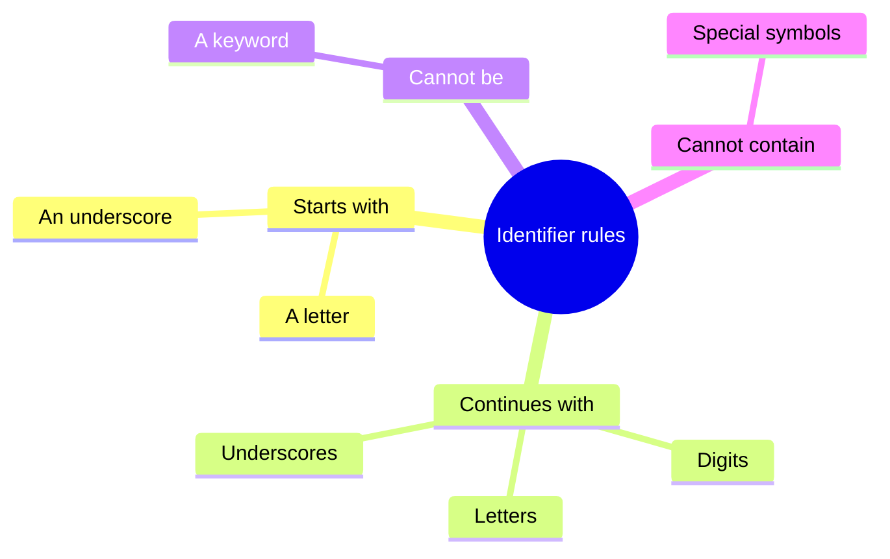
```mermaid
mindmap
  root((Identifier rules))
    Starts with
      A letter
      An underscore
    Continues with
      Letters
      Digits
      Underscores
    Cannot be
      A keyword
    Cannot contain
      Special symbols
```

- An identifier is the name given to a variable, function, or other entity. §3
- Rule 1: must begin with a letter (upper- or lowercase) or an underscore `_` — never a digit. §3
- Rule 2: may contain letters, digits, and underscores after the first character. §3
- Rule 3: can be any length, but should stay short and meaningful. §3
- Rule 4: cannot be a keyword. §3
- Rule 5: cannot contain special symbols such as `!`, `@`, `#`, `$`, `%`. §3
- `avg = (marks1 + marks2 + marks3) / 3` is easier to read and maintain than `a = (b + c + d) / 3` — meaningful identifiers are correctness practice, not just style. §3
- This unit's worked examples mix `camelCase` (`sumSquares`, `mixedFraction`) and `snake_case` (`csa_cyl`, `unit_price`) — both are kept as given rather than silently normalized. §3
- New examples in these notes use `snake_case`, per common Python style guidance (PEP 8). §3

---

### §4 — Variables

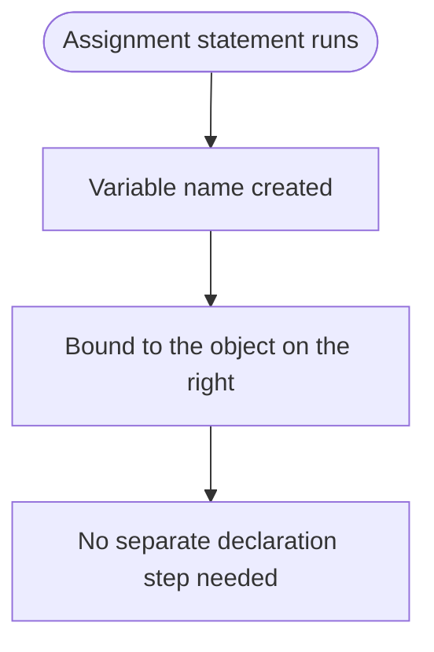
```mermaid
flowchart TD
    A([Assignment statement runs]) --> B[Variable name created]
    B --> C[Bound to the object on the right]
    C --> D[No separate declaration step needed]
```

- A variable is a name bound to an object — a value held in memory. §4
- Python creates a variable the moment an assignment statement runs. §4
- There is no separate declaration step. §4
- A variable must be assigned a value before it's used in an expression. §4
- String values may be written in single `'…'` or double `"…"` quotes (quotes aren't part of the value). §4
- Numeric values are never quoted. §4

Program 5-2 (NCERT Program 5.2) — displaying variable values. §4
```python
message = "Keep Smiling"
print(message)
userNo = 101
print('User Number is', userNo)
```
Output:
```text
Keep Smiling
User Number is 101
```

Program 5-3 (NCERT Program 5.3) — area of a rectangle. §4
```python
length = 10
breadth = 20
area = length * breadth
print(area)
```
Output:
```text
200
```

---

### §5 — Comments

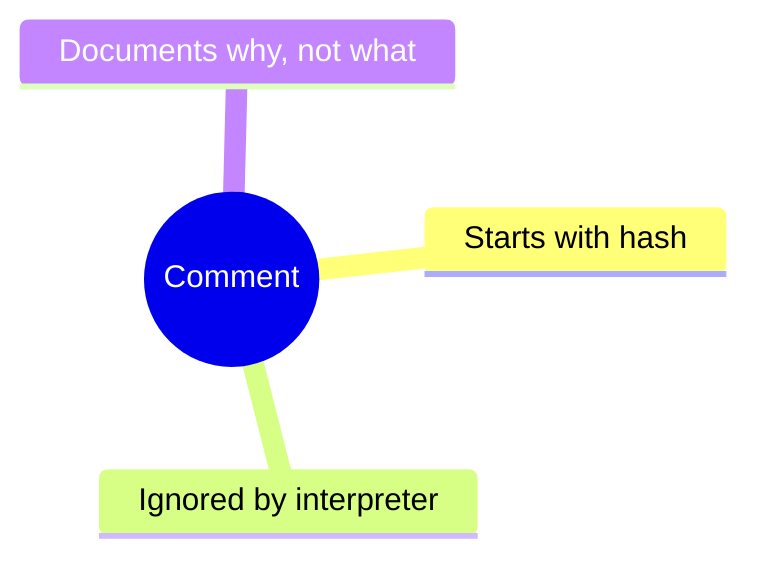
```mermaid
mindmap
  root((Comment))
    Starts with hash
    Ignored by interpreter
    Documents why, not what
```

- A comment documents why code exists for later readers. §5
- Starts with `#`; the interpreter ignores everything after `#` to the end of the line. §5

```python
# Variable amount is the total spending on grocery
amount = 3400
```

---

### §6 — Everything Is an Object

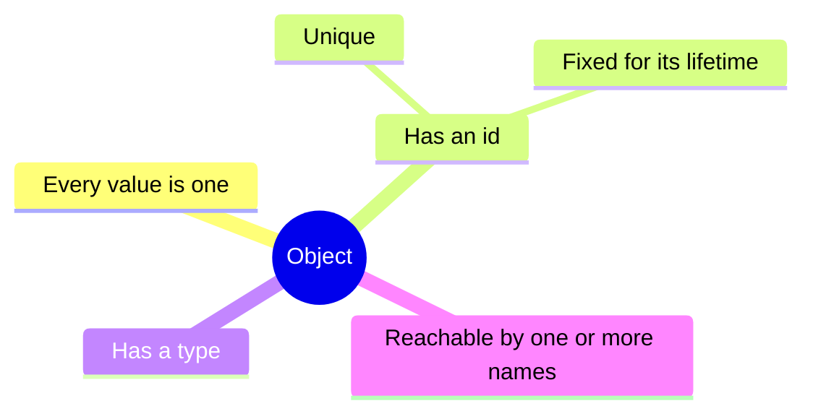
```mermaid
mindmap
  root((Object))
    Every value is one
    Has an id
      Unique
      Fixed for its lifetime
    Has a type
    Reachable by one or more names
```

- Python treats every value — numeric, string, or otherwise — as an object. §6
- Every object is assigned a unique identity (id), similar in spirit to a memory address, fixed for its lifetime. §6
- `id()` returns an object's identity. §6
- `type()` reports an object's data type. §6

```python
num1 = 20
print(id(num1))
num2 = 30 - 10
print(id(num2))
```
Output (id values are implementation-dependent — NCERT's own traced run shown; expect different numbers on your machine):
```text
1433920576
1433920576
```

```svg
<svg viewBox="0 0 420 170" xmlns="http://www.w3.org/2000/svg" style="max-width:100%;height:auto" font-family="sans-serif">
  <defs>
    <marker id="arrow1" viewBox="0 0 10 10" refX="9" refY="5" markerWidth="6" markerHeight="6" orient="auto-start-reverse">
      <path d="M0,0 L10,5 L0,10 z" fill="#262626"/>
    </marker>
  </defs>
  <rect x="20" y="20" width="90" height="30" fill="#ffffff" stroke="#262626" stroke-width="1.5"/>
  <text x="65" y="40" font-size="13" fill="#262626" text-anchor="middle">num1</text>
  <rect x="20" y="100" width="90" height="30" fill="#ffffff" stroke="#262626" stroke-width="1.5"/>
  <text x="65" y="120" font-size="13" fill="#262626" text-anchor="middle">num2</text>
  <rect x="270" y="55" width="110" height="40" fill="#e3f2fd" stroke="#1565c0" stroke-width="1.5"/>
  <text x="325" y="80" font-size="14" fill="#1565c0" text-anchor="middle">20</text>
  <text x="325" y="30" font-size="11" fill="#757575" text-anchor="middle">id 1433920576</text>
  <line x1="110" y1="35" x2="265" y2="65" stroke="#262626" stroke-width="1.5" marker-end="url(#arrow1)"/>
  <line x1="110" y1="115" x2="265" y2="80" stroke="#262626" stroke-width="1.5" marker-end="url(#arrow1)"/>
  <text x="325" y="130" font-size="11" fill="#555555" text-anchor="middle">num2 = 30 - 10 evaluates to the</text>
  <text x="325" y="145" font-size="11" fill="#555555" text-anchor="middle">same object num1 already names</text>
</svg>
```

- Two variables can share an `id()` when they refer to the same value — ordinary for small numbers, not a special "link" between the variables. §6
- Reassigning one name never changes what the other name refers to. §6
- In OOP generally, an object represents something real-world and carries both data/attributes and behaviour/methods, organized via classes and class hierarchies (outside this unit's scope). §6
- Python applies "object" more loosely — some Python objects have no meaningful attributes, and others have no methods. §6

---

### §7 — Data Types

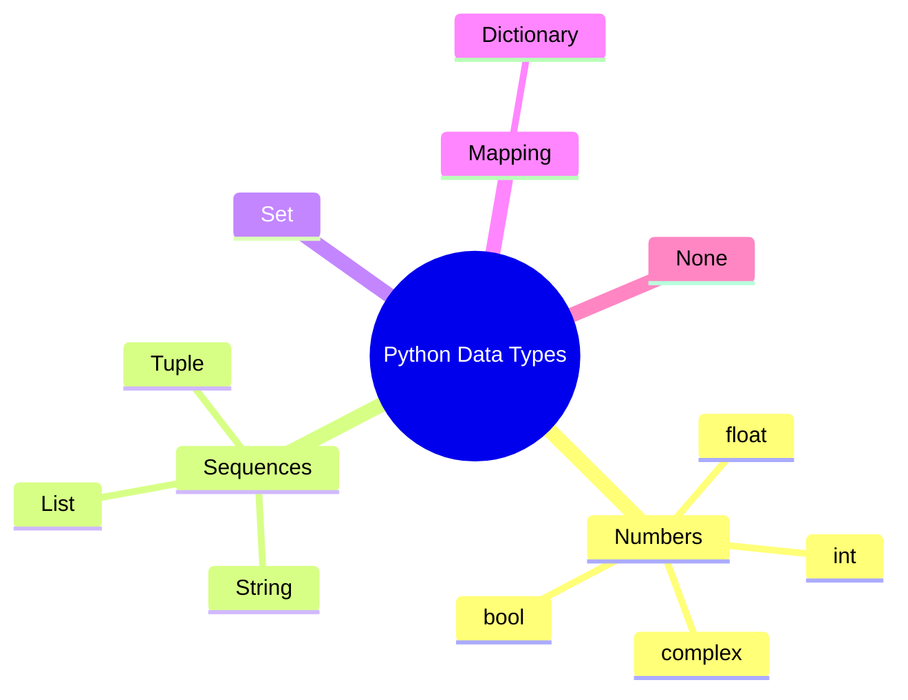
```mermaid
mindmap
  root((Python Data Types))
    Numbers
      int
      float
      complex
      bool
    Sequences
      String
      List
      Tuple
    Set
    Mapping
      Dictionary
    None
```

- Every value has a data type. §7
- A data type fixes what operations are valid on a value. §7

**§7.1 — Numbers**

| Type | Description | Examples |
|---|---|---|
| `int` | Whole numbers | `-12, -3, 0, 125` |
| `float` | Real / floating-point numbers | `-2.04, 4.0, 14.23` |
| `complex` | A real part and an imaginary part | `3 + 4j, 2 - 2j` |

- `bool` is a subtype of `int` with exactly two values, `True` and `False`. §7.1
- `True` behaves as non-zero, non-null, non-empty; `False` behaves as `0`. §7.1
- `int`, `float`, `bool` each hold a single value at a time — for a collection of values, Python offers sequence, set, and mapping types. §7.1

```python
num1 = 10
print(type(num1))
num2 = -1210
print(type(num2))
var1 = True
print(type(var1))
float1 = -1921.9
print(type(float1))
float2 = -9.8 * 10 ** 2
print(float2, type(float2))
var2 = -3 + 7.2j
print(var2, type(var2))
```
Output (NCERT Example 5.3):
```text
<class 'int'>
<class 'int'>
<class 'bool'>
<class 'float'>
-980.0000000000001 <class 'float'>
(-3+7.2j) <class 'complex'>
```

- `-9.8 * 10 ** 2` doesn't print as a clean `-980.0` — floating-point numbers are stored in binary, so a tiny representation error is normal, not a bug. §7.1

**§7.2 — Sequences**

- A sequence is an ordered collection whose items are each reachable by an integer index. §7.2

| Type | Delimiter | Example | Can it change? |
|---|---|---|---|
| String | `'…'` or `"…"` | `'Hello Friend'` | No (immutable) |
| List | `[ ]` | `[5, 3.4, "New Delhi"]` | Yes (mutable) |
| Tuple | `( )` | `(10, 20, 'a')` | No (immutable) |

- A string that looks numeric, e.g. `"452"`, still can't be used in arithmetic without converting it first — it's text, not a number. §7.2

**§7.3 — Set**

- A set, written `{ }`, is an unordered collection with no duplicate entries. §7.3
- Once created, individual elements can't be changed. §7.3

```python
set2 = {1, 2, 1, 3}
print(set2)
```
Output:
```text
{1, 2, 3}
```

**§7.4 — None**

- `None` is a special type with exactly one value, used to represent the absence of a value. §7.4
- `None` is neither `False` nor `0` — a distinct concept from both. §7.4

**§7.5 — Mapping**

- A dictionary — Python's one built-in mapping type — stores `key : value` pairs inside `{ }`. §7.5
- A value is looked up by its key, not by its position. §7.5

```python
dict1 = {'Fruit': 'Apple', 'Climate': 'Cold', 'Price(kg)': 120}
print(dict1['Price(kg)'])
```
Output:
```text
120
```

**§7.6 — Mutable vs. immutable**

| Immutable | Mutable |
|---|---|
| `int`, `float`, `bool`, `complex`, `str`, `tuple` | `list`, `set`, `dict` |

- When code tries to change an immutable object's value, Python doesn't edit it in place. §7.6
- Python builds a new object and rebinds the name to it. §7.6
- This changes that name's `id()`. §7.6

```svg
<svg viewBox="0 0 380 150" xmlns="http://www.w3.org/2000/svg" style="max-width:100%;height:auto" font-family="sans-serif">
  <defs>
    <marker id="arrow2" viewBox="0 0 10 10" refX="9" refY="5" markerWidth="6" markerHeight="6" orient="auto-start-reverse">
      <path d="M0,0 L10,5 L0,10 z" fill="#262626"/>
    </marker>
  </defs>
  <rect x="20" y="15" width="90" height="30" fill="#ffffff" stroke="#262626" stroke-width="1.5"/>
  <text x="65" y="35" font-size="13" fill="#262626" text-anchor="middle">num1</text>
  <rect x="20" y="90" width="90" height="30" fill="#ffffff" stroke="#262626" stroke-width="1.5"/>
  <text x="65" y="110" font-size="13" fill="#262626" text-anchor="middle">num2</text>
  <rect x="250" y="50" width="100" height="40" fill="#e3f2fd" stroke="#1565c0" stroke-width="1.5"/>
  <text x="300" y="75" font-size="14" fill="#1565c0" text-anchor="middle">300</text>
  <text x="300" y="25" font-size="11" fill="#757575" text-anchor="middle">id 1000</text>
  <line x1="110" y1="30" x2="245" y2="60" stroke="#262626" stroke-width="1.5" marker-end="url(#arrow2)"/>
  <line x1="110" y1="105" x2="245" y2="80" stroke="#262626" stroke-width="1.5" marker-end="url(#arrow2)"/>
  <text x="190" y="140" font-size="11" fill="#555555" text-anchor="middle">Before: num1 = 300, then num2 = num1</text>
</svg>
```

```svg
<svg viewBox="0 0 380 170" xmlns="http://www.w3.org/2000/svg" style="max-width:100%;height:auto" font-family="sans-serif">
  <defs>
    <marker id="arrow3" viewBox="0 0 10 10" refX="9" refY="5" markerWidth="6" markerHeight="6" orient="auto-start-reverse">
      <path d="M0,0 L10,5 L0,10 z" fill="#262626"/>
    </marker>
  </defs>
  <rect x="20" y="15" width="90" height="30" fill="#ffffff" stroke="#262626" stroke-width="1.5"/>
  <text x="65" y="35" font-size="13" fill="#262626" text-anchor="middle">num2</text>
  <rect x="20" y="90" width="90" height="30" fill="#ffffff" stroke="#262626" stroke-width="1.5"/>
  <text x="65" y="110" font-size="13" fill="#262626" text-anchor="middle">num1</text>
  <rect x="250" y="0" width="100" height="40" fill="#e3f2fd" stroke="#1565c0" stroke-width="1.5"/>
  <text x="300" y="25" font-size="14" fill="#1565c0" text-anchor="middle">300</text>
  <text x="300" y="55" font-size="10" fill="#757575" text-anchor="middle">id 1000</text>
  <rect x="250" y="90" width="100" height="40" fill="#fff3e0" stroke="#e65100" stroke-width="1.5"/>
  <text x="300" y="115" font-size="14" fill="#e65100" text-anchor="middle">400</text>
  <text x="300" y="145" font-size="10" fill="#757575" text-anchor="middle">id 2200 (new object)</text>
  <line x1="110" y1="30" x2="245" y2="20" stroke="#262626" stroke-width="1.5" marker-end="url(#arrow3)"/>
  <line x1="110" y1="105" x2="245" y2="110" stroke="#262626" stroke-width="1.5" marker-end="url(#arrow3)"/>
  <text x="190" y="165" font-size="11" fill="#555555" text-anchor="middle">After: num1 = num2 + 100 rebinds only num1</text>
</svg>
```

- `num1 = 300` then `num2 = num1` makes both names point to the same object. §7.6
- `num1 = num2 + 100` creates a brand-new `int` object for `num1` (integers are immutable), while `num2` keeps pointing at the original `300`. §7.6

**§7.7 — Choosing the right data type**

| Need | Use | Typical example |
|---|---|---|
| Frequently changing, ordered collection | List | Names of students in a class, updated as they join or leave |
| Fixed, never-changing ordered collection | Tuple | The names of the months in a year |
| Unique elements, no duplicates | Set | A museum's list of artefacts |
| Fast lookup by a custom key | Dictionary | A mobile phone book (name → number) |

---

### §8 — Operators

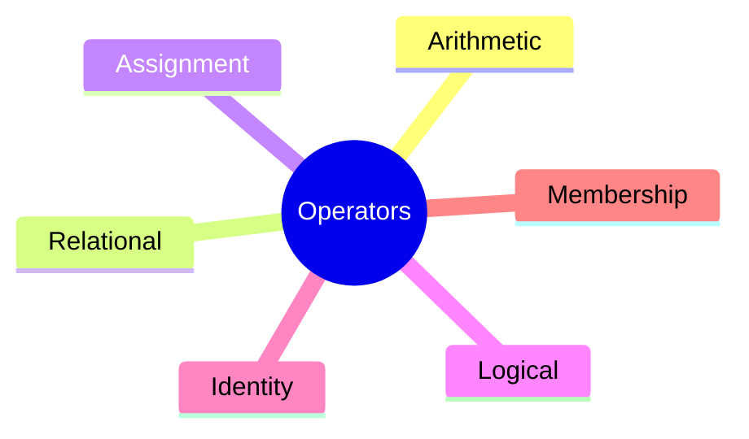
```mermaid
mindmap
  root((Operators))
    Arithmetic
    Relational
    Assignment
    Logical
    Identity
    Membership
```

- An operator performs an operation on operands. §8
- Python groups operators into six families. §8

**§8.1 — Arithmetic**

| Operator | Meaning | Example |
|---|---|---|
| `+` | Addition / string concatenation | `"Hello" + "India"` → `'HelloIndia'` |
| `-` | Subtraction | `5 - 6` → `-1` |
| `*` | Multiplication / string repetition | `'India' * 2` → `'IndiaIndia'` |
| `/` | Division — always returns a `float` | `8 / 4` → `2.0` |
| `%` | Modulus (remainder) | `13 % 5` → `3` |
| `//` | Floor division (drops the decimal part) | `13 // 4` → `3` |
| `**` | Exponent | `3 ** 4` → `81` |

**§8.2 — Relational**

- `==`, `!=`, `>`, `<`, `>=`, `<=` each compare two operands and evaluate to `True` or `False`. §8.2
- Strings compare lexicographically, using each character's ASCII value in turn. §8.2

```python
num1, num2, num3 = 10, 0, 10
str1, str2 = "Good", "Afternoon"
print(num1 == num2)
print(num1 != num2)
print(num1 > num2)
print(num1 < num3)
print(num1 >= num2)
print(str1 > str2)
```
Output (selected rows, NCERT Table 5.4):
```text
False
True
True
False
True
True
```
- `str1 > str2` is `True`. §8.2
- Reason: `'G'` (in `"Good"`) has a higher ASCII value than `'A'` (in `"Afternoon"`). §8.2

**§8.3 — Assignment**

- `=` and the compound forms `+=`, `-=`, `*=`, `/=`, `%=`, `//=`, `**=` each combine an operation with assignment. §8.3
- `x += y` means `x = x + y`. §8.3

| Operator | Meaning | Starting point | Result |
|---|---|---|---|
| `+=` | `x = x + y` | `str1 = 'Hello'; str1 += 'India'` | `'HelloIndia'` |
| `-=` | `x = x - y` | `num1 = 10; num2 = 2; num1 -= num2` | `8` |
| `*=` | `x = x * y` | `a = 'India'; a *= 3` | `'IndiaIndiaIndia'` |
| `/=` | `x = x / y` | `num1 = 6; num2 = 3; num1 /= num2` | `2.0` |
| `%=` | `x = x % y` | `num1 = 7; num2 = 3; num1 %= num2` | `1` |
| `//=` | `x = x // y` | `num1 = 7; num2 = 3; num1 //= num2` | `2` |
| `**=` | `x = x ** y` | `num1 = 2; num2 = 3; num1 **= num2` | `8` |

**§8.4 — Logical**

- `and`, `or`, `not` — always lowercase. §8.4
- Every value is logically `True` except `None`, `False`, `0`, and empty collections (`""`, `()`, `[]`, `{}`). §8.4

```python
num1, num2, num3 = 10, -20, 0
print(bool(num1 and num2))
print(bool(num1 and num3))
print(bool(num1 or num3))
```
Output (NCERT Table 5.6):
```text
True
False
True
```

**§8.5 — Identity**

- `is` and `is not` test whether two names refer to the same object (matching `id()`) — not merely equal values. §8.5

```python
num1 = 5
num2 = num1
print(id(num1) == id(num2))
print(num1 is num2)
```
Output (NCERT Table 5.7):
```text
True
True
```

**§8.6 — Membership**

- `in` and `not in` test whether a value exists inside a sequence. §8.6

```python
a = [1, 2, 3]
print(2 in a)
print('1' in a)
print(10 not in a)
```
Output (NCERT Table 5.8):
```text
True
False
True
```

- ⚠ `=` assigns a value; `==` compares two values — mixing these up is one of the most common Class XI slips; `if x = 5:` is a syntax error, not a comparison. §8.2/§8.3

---

### §9 — Expressions and Precedence

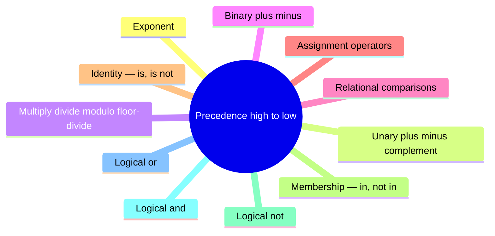
```mermaid
mindmap
  root((Precedence high to low))
    Exponent
    Unary plus minus complement
    Multiply divide modulo floor-divide
    Binary plus minus
    Relational comparisons
    Assignment operators
    Identity — is, is not
    Membership — in, not in
    Logical not
    Logical and
    Logical or
```

- An expression is a combination of constants, variables, and operators that evaluates to a single value. §9
- A bare value or variable is a valid expression; a bare operator by itself is not. §9

```python
100                     # a value, on its own, is a valid expression
num                     # so is a bare variable
num - 20.4              # arithmetic
3.0 + 3.14              # arithmetic
"Global" + "Citizen"    # string concatenation
```

**§9.1 — Precedence of operators**

| Order | Operators | Meaning |
|---|---|---|
| 1 | `**` | Exponentiation |
| 2 | `~ , + , -` (unary) | Complement, unary plus/minus |
| 3 | `* , / , % , //` | Multiply, divide, modulo, floor division |
| 4 | `+ , -` (binary) | Addition, subtraction |
| 5 | `<= , < , > , >= , == , !=` | Relational |
| 6 | `= , %= , /= , //= , -= , += , *= , **=` | Assignment |
| 7 | `is , is not` | Identity |
| 8 | `in , not in` | Membership |
| 9 | `not` | Logical NOT |
| 10 | `and` | Logical AND |
| 11 | `or` | Logical OR |

- Parentheses always evaluate first, overriding precedence. §9.1
- Operators of equal precedence evaluate left to right. §9.1

Example 5.9 — `20 + 30 * 40`:
```text
= 20 + (30 * 40)   # * binds tighter than +
= 20 + 1200
= 1220
```
Example 5.10 — equal precedence runs left to right:
```text
20 - 30 + 40
= (20 - 30) + 40
= -10 + 40
= 30
```
Example 5.11 — parentheses override precedence:
```text
(20 + 30) * 40
= 50 * 40
= 2000
```
Example 5.12 — mixed `int`/`float` in one expression:
```text
15.0 / 4 + (8 + 3.0)
= 15.0 / 4 + 11.0
= 3.75 + 11.0
= 14.75
```

---

### §10 — Statements

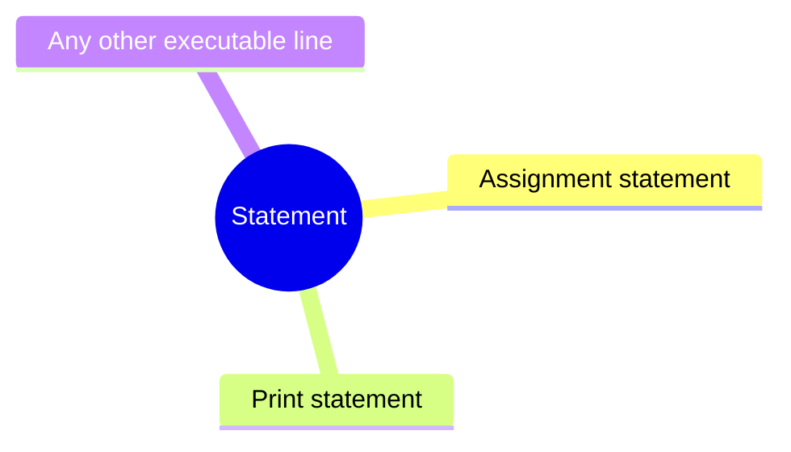
```mermaid
mindmap
  root((Statement))
    Assignment statement
    Print statement
    Any other executable line
```

- A statement is a unit of code the interpreter can execute directly — an assignment, a `print()` call, and so on. §10

```python
x = 4              # assignment statement
cube = x ** 3      # assignment statement
print(x, cube)     # print statement
```
Output:
```text
4 64
```

---

### §11 — Input and Output

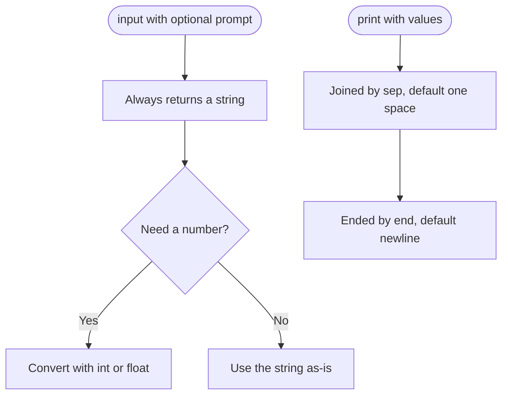
```mermaid
flowchart TD
    A([input with optional prompt]) --> B[Always returns a string]
    B --> C{Need a number?}
    C -->|Yes| D[Convert with int or float]
    C -->|No| E[Use the string as-is]
    F([print with values]) --> G[Joined by sep, default one space]
    G --> H[Ended by end, default newline]
```

- `input([prompt])` shows an optional prompt, waits for the user to type, and always returns a string — even when the user types a number. §11
- ⚠ If a user types `2`, `num1 = num1 * 2` repeats the string to `'22'` — it does not double it numerically. Convert first: `num1 = int(input(...))`. §11

```python
fname = input("Enter your first name: ")
age = input("Enter your age: ")
print(type(age))
```
Output:
```text
<class 'str'>
```
```python
age = int(input("Enter your age: "))
print(type(age))
```
Output:
```text
<class 'int'>
```

- `print(value [, ..., sep = ' ', end = '\n'])`. §11
- `sep` is inserted between multiple printed values (default: one space). §11
- `end` is appended after the last value (default: a newline). §11

| Statement | Output |
|---|---|
| `print("Hello")` | `Hello` |
| `print(10 * 2.5)` | `25.0` |
| `print("I" + "love" + "my" + "country")` | `Ilovemycountry` |
| `print("I'm", 16, "years old")` | `I'm 16 years old` |

- `+` concatenates strings with no added space. §11
- A comma-separated argument list is joined using `sep` (a single space by default). §11

---

### §12 — Type Conversion

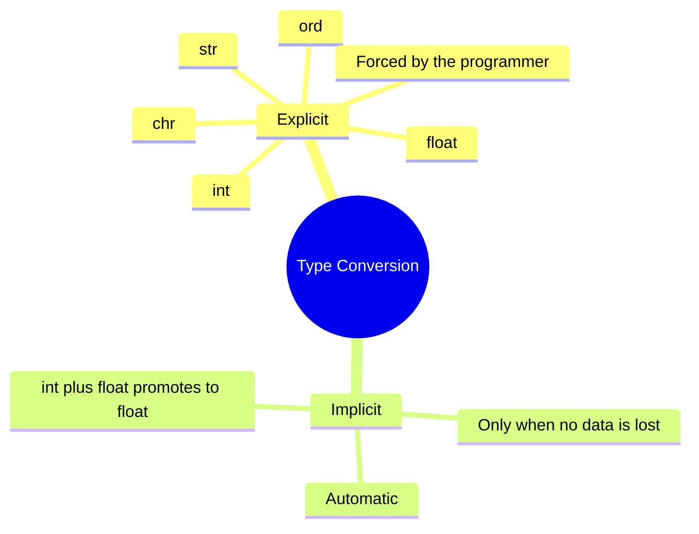
```mermaid
mindmap
  root((Type Conversion))
    Explicit
      int
      float
      str
      chr
      ord
      Forced by the programmer
    Implicit
      Automatic
      Only when no data is lost
      int plus float promotes to float
```

- Type conversion changes a value's data type — forced by the programmer (explicit) or performed automatically (implicit). §12

**§12.1 — Explicit conversion / type casting**

| Function | Converts to |
|---|---|
| `int(x)` | Integer |
| `float(x)` | Floating-point |
| `str(x)` | String |
| `chr(x)` | Character, from an ASCII code |
| `ord(x)` | ASCII code, from a character |

Program 5-5 (NCERT Program 5.5) — `int` to `float`. §12.1
```python
num1 = 10
num2 = 20
num3 = num1 + num2
print(num3, type(num3))
num4 = float(num1 + num2)
print(num4, type(num4))
```
Output:
```text
30 <class 'int'>
30.0 <class 'float'>
```

Program 5-6 (NCERT Program 5.6) — `float` to `int`. §12.1
```python
num1 = 10.2
num2 = 20.6
num3 = num1 + num2
print(num3, type(num3))
num4 = int(num1 + num2)
print(num4, type(num4))
```
Output:
```text
30.8 <class 'float'>
30 <class 'int'>
```
- `int(30.8)` drops the decimal part to give `30` — it truncates, it does not round. §12.1

Program 5-7 (NCERT Program 5.7) — why this fails without a conversion. §12.1
```python
priceIcecream = 25
priceBrownie = 45
totalPrice = priceIcecream + priceBrownie
print("The total is Rs." + totalPrice)
```
Output:
```text
TypeError: can only concatenate str (not "int") to str
```
- Python never silently converts an `int` to `str` for `+` — doing so automatically could quietly hide a real bug, so it insists on an explicit conversion instead. §12.1

Program 5-8 (NCERT Program 5.8) — the fix: convert explicitly. §12.1
```python
priceIcecream = 25
priceBrownie = 45
totalPrice = priceIcecream + priceBrownie
print("The total is Rs." + str(totalPrice))
```
Output:
```text
The total is Rs.70
```

Program 5-9 (NCERT Program 5.9) — string concatenation is not numeric addition. §12.1
```python
icecream = '25'
brownie = '45'
price = icecream + brownie
print("Total Price Rs." + price)
price = int(icecream) + int(brownie)
print("Total Price Rs." + str(price))
```
Output:
```text
Total Price Rs.2545
Total Price Rs.70
```
- `icecream + brownie` on two strings concatenates their characters (`'25' + '45'` → `'2545'`) — it never adds them numerically, no matter how numeric they look. §12.1
- Only converting first, with `int()`, gives the arithmetic result `70`. §12.1

**§12.2 — Implicit conversion / coercion**

- Python performs implicit conversion only when no information would be lost. §12.2
- Mixing `int` and `float` in one expression produces a `float` (type promotion), never the reverse. §12.2

```python
num1 = 10       # int
num2 = 20.0     # float
sum1 = num1 + num2
print(sum1, type(sum1))
```
Output:
```text
30.0 <class 'float'>
```

---

### §13 — Debugging

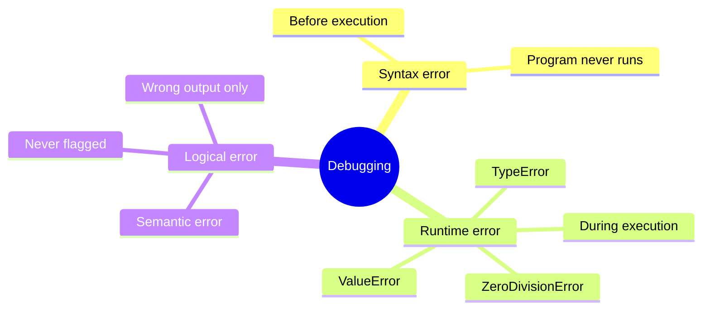
```mermaid
mindmap
  root((Debugging))
    Syntax error
      Before execution
      Program never runs
    Runtime error
      During execution
      ValueError
      ZeroDivisionError
      TypeError
    Logical error
      Semantic error
      Never flagged
      Wrong output only
```

- Debugging is the process of finding and removing bugs (errors). §13

| Error type | When it appears | Effect | Example |
|---|---|---|---|
| Syntax error | Before execution starts | Interpreter refuses to run the program at all | Unbalanced parenthesis: `(7 + 11` |
| Runtime error | Mid-execution | Program starts, then terminates abnormally | Dividing by zero |
| Logical error | Never flagged by the interpreter | Program runs to completion but produces a wrong answer | `10 + 12 / 2` used for an average instead of `(10 + 12) / 2` |

- A logical error (also called a semantic error) is the hardest to catch precisely. §13
- Reason: the program runs without complaint. §13
- The only clue is a wrong output, so debugging means working backward from what actually printed. §13

Program 5-11 (NCERT Program 5.11) — two different runtime errors. §13
```python
num1 = 10.0
num2 = int(input("num2 = "))
print(num1 / num2)
```

| User enters | Result |
|---|---|
| `apple` | `ValueError: invalid literal for int() with base 10: 'apple'` |
| `0` | `ZeroDivisionError: float division by zero` |
| `10` | `1.0` (runs correctly) |

- Python names its runtime errors specifically — `ValueError` for a value of the wrong kind, `ZeroDivisionError` for division by zero, `TypeError` for an operation on the wrong type — rather than one generic "runtime error." §13
- Reading the exact error name is the fastest way to diagnose what went wrong. §13

---

## Part B — Functions (NCERT Chapter 7)

### §14 — Why Functions?

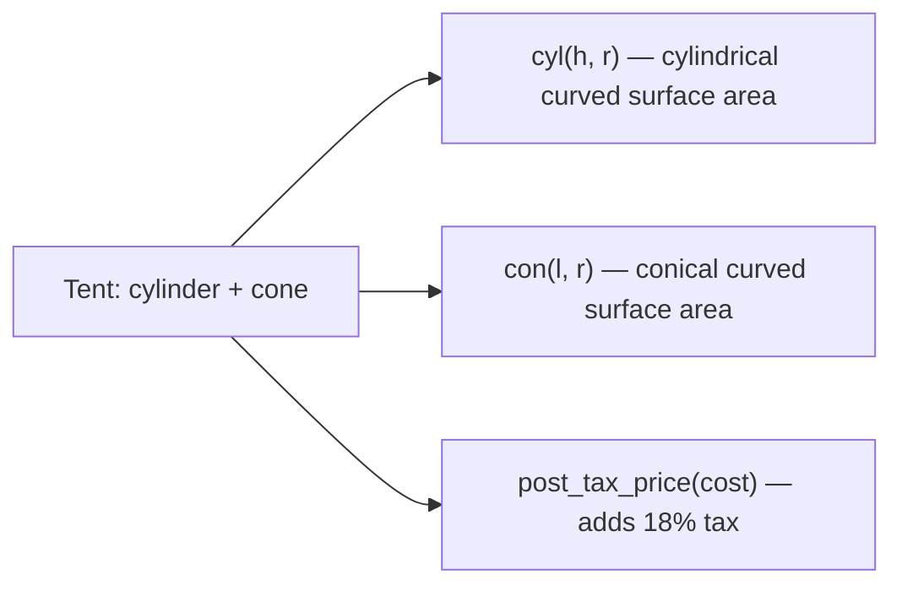
```mermaid
flowchart LR
    T[Tent: cylinder + cone] --> A["cyl(h, r) — cylindrical curved surface area"]
    T --> B["con(l, r) — conical curved surface area"]
    T --> C["post_tax_price(cost) — adds 18% tax"]
```

**§14.1 — From one long script to modular programming**

- A program that keeps growing in a single block of code becomes bulky and hard to manage. §14.1
- Modular programming = splitting a program into separate, independently named blocks, each solving one sub-problem. §14.1
- A function is a named group of instructions that runs a specific task when invoked (called). §14.1
- Once defined, a function can be called repeatedly, from anywhere in the program, without rewriting its code each time. §14.1

Programs 7-1 → 7-2 (condensed from NCERT Programs 7.1–7.2) — a tent-cost calculator, before and after functions. A company sells tents (a cylinder topped by a cone) and needs the canvas area, the canvas cost, and the tax-inclusive price. §14.1

Program 7-1 — one flat script:
```python
h = float(input("Height of the cylindrical part: "))
r = float(input("Radius: "))
l = float(input("Slant height of the conical part: "))

csa_conical = 3.14 * r * l
csa_cylindrical = 2 * 3.14 * r * h
canvas_area = csa_conical + csa_cylindrical

unit_price = float(input("Cost of 1 m^2 canvas: "))
total_cost = unit_price * canvas_area

tax = 0.18 * total_cost
net_price = total_cost + tax
print("Net amount payable =", net_price)
```

Program 7-2 — same logic split into three functions, `cyl()`, `con()`, `post_tax_price()`:
```python
def cyl(h, r):                       # curved surface area of the cylindrical part
    return 2 * 3.14 * r * h

def con(l, r):                       # curved surface area of the conical part
    return 3.14 * r * l

def post_tax_price(cost):            # adds 18% tax to a cost
    tax = 0.18 * cost
    return cost + tax

h = float(input("Height of the cylindrical part: "))
r = float(input("Radius: "))
csa_cyl = cyl(h, r)

l = float(input("Slant height of the conical part: "))
csa_con = con(l, r)

canvas_area = csa_cyl + csa_con
unit_price = float(input("Cost of 1 m^2 canvas: "))
total_cost = unit_price * canvas_area
print("Net amount payable =", post_tax_price(total_cost))
```

- Nothing about what gets computed changes between the two versions — only how the code is organized. §14.1
- If the company later adds a rectangular-base tent, `con()` and `post_tax_price()` can be reused immediately without being rewritten. §14.1

**§14.2 — Advantages of using functions**

| Advantage | Why it matters |
|---|---|
| Readability | A well-named function call reads like a step in the plan, not a wall of code |
| Shorter code | The same logic is written once and called wherever it's needed |
| Reusability | A function can be called from other functions, or from other programs |
| Easier debugging | A bug is isolated to the one function responsible for it |
| Parallel teamwork | Different people can write and test different functions independently |

---

### §15 — User-Defined Functions

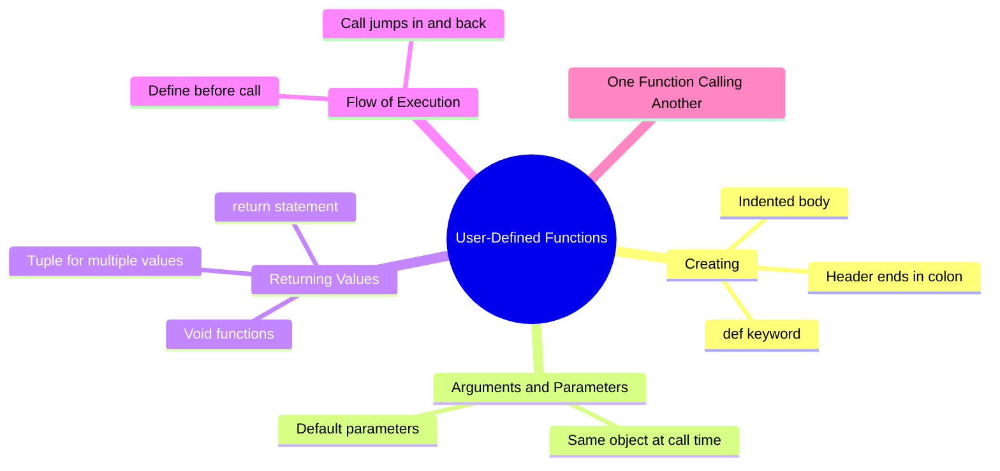
```mermaid
mindmap
  root((User-Defined Functions))
    Creating
      def keyword
      Header ends in colon
      Indented body
    Arguments and Parameters
      Same object at call time
      Default parameters
    Returning Values
      return statement
      Void functions
      Tuple for multiple values
    Flow of Execution
      Define before call
      Call jumps in and back
    One Function Calling Another
```

**§15.1 — Creating a function**

```text
def <function name>([parameter 1, parameter 2, ...]):
    <statements — the function body, indented>
    [return <value>]
```

- Items in `[ ]` (parameters, `return`) are optional — a function may take zero or more parameters, and may or may not return a value. §15.1
- The function header always ends with a colon `:`. §15.1
- The function name must be unique and follows identifier rules. §15.1
- Only the indented lines belong to the function body. §15.1

Program 7-3 (NCERT Program 7.3) — add two numbers. §15.1
```python
def addnum():
    fnum = int(input("Enter first number: "))
    snum = int(input("Enter second number: "))
    sum = fnum + snum
    print("The sum of", fnum, "and", snum, "is", sum)

addnum()
```
Output:
```text
Enter first number: 5
Enter second number: 6
The sum of 5 and 6 is 11
```

**§15.2 — Arguments and parameters**

- An argument is a value supplied at the call site; a parameter is the name that receives it. §15.2
- At the moment of the call, both names refer to the same object. §15.2

Program 7-4 (NCERT Program 7.4) — sum of the first n natural numbers. §15.2
```python
def sumSquares(n):
    sum = 0
    for i in range(1, n + 1):
        sum = sum + i
    print("The sum of first", n, "natural numbers is:", sum)

num = int(input("Enter the value for n: "))
sumSquares(num)
```
Output:
```text
Enter the value for n: 5
The sum of first 5 natural numbers is: 15
```
- `num` (argument, caller) and `n` (parameter, function) refer to the same value the instant the call runs. §15.2

Program 7-5 (NCERT Program 7.5) — argument and parameter share an identity. §15.2
```python
def incrValue(num):
    print("Parameter num has value:", num, "\nid =", id(num))
    num = num + 5
    print("num incremented by 5 is", num, "\nNow id is", id(num))

number = int(input("Enter a number: "))
print("id of argument number is:", id(number))
incrValue(number)
```
Output:
```text
Enter a number: 8
id of argument number is: 1712903328
Parameter num has value: 8
id = 1712903328
num incremented by 5 is 13
Now id is 1712903408
```

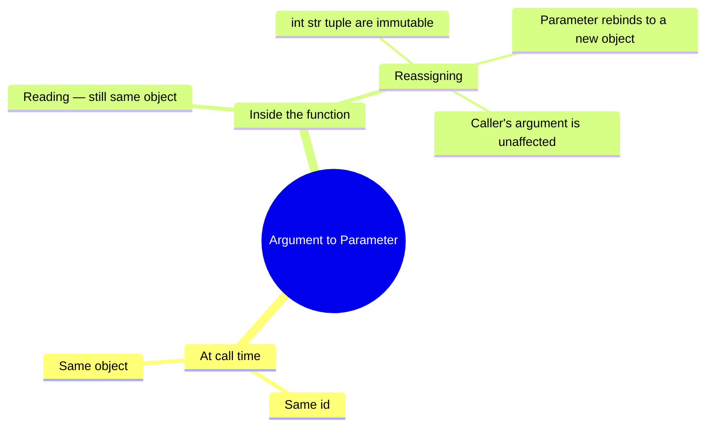
```mermaid
mindmap
  root((Argument to Parameter))
    At call time
      Same object
      Same id
    Inside the function
      Reading — still same object
      Reassigning
        int str tuple are immutable
        Parameter rebinds to a new object
        Caller's argument is unaffected
```

- Before any change, `number` (argument) and `num` (parameter) share the same `id()`. §15.2
- The moment `num = num + 5` runs, `int` being immutable, `num` is rebound to a new object; `number` back in the caller is unaffected. §15.2

Program 7-6 (NCERT Program 7.6) — an argument and its parameter can share a name. §15.2
```python
def myMean(myList):
    total = 0
    count = 0
    for i in myList:
        total = total + i
        count = count + 1
    mean = total / count
    print("The calculated mean is:", mean)

myList = [1.3, 2.4, 3.5, 6.9]
myMean(myList)
```
Output:
```text
The calculated mean is: 3.5250000000000004
```
- The argument (`myList`, outside the function) and the parameter (`myList`, in the header) can legally have the identical name — the parameter is a fresh local name that happens to match. §15.2

Program 7-7 (NCERT Program 7.7) — factorial. §15.2
```python
def calcFact(num):
    fact = 1
    for i in range(num, 0, -1):
        fact = fact * i
    print("Factorial of", num, "is", fact)

num = int(input("Enter the number: "))
calcFact(num)
```
Output:
```text
Enter the number: 5
Factorial of 5 is 120
```

Program 7-8 (NCERT Program 7.8) — string parameters; full name from two parts. §15.2
```python
def fullname(first, last):
    fullname = first + " " + last
    print("Hello", fullname)

first = input("Enter first name: ")
last = input("Enter last name: ")
fullname(first, last)
```
Output:
```text
Enter first name: Gyan
Enter last name: Vardhan
Hello Gyan Vardhan
```

- A parameter can carry a pre-decided default value, used only when the call doesn't supply a matching argument. §15.2

Program 7-9 (NCERT Program 7.9) — default parameter for a mixed fraction. §15.2
```python
def mixedFraction(num, deno=1):
    remainder = num % deno
    if remainder != 0:
        quotient = int(num / deno)
        print("The mixed fraction =", quotient, "(", remainder, "/", deno, ")")
    else:
        print("The given fraction evaluates to a whole number")

num = int(input("Enter the numerator: "))
deno = int(input("Enter the denominator: "))
if num > deno:
    mixedFraction(num, deno)
else:
    print("It is a proper fraction")
```
Output:
```text
Enter the numerator: 17
Enter the denominator: 2
The mixed fraction = 8 ( 1 / 2 )
```
- Calling `mixedFraction(9)` leaves `deno` at its default, `1`. §15.2
- A function argument can also be an expression (e.g. `mixedFraction(num + 5, deno + 5)`) — it's evaluated first, and the result is what gets passed in. §15.2
- ⚠ Default parameters must be the trailing parameters in the header. §15.2
- `def calcInterest(rate, principal=1000, time=5):` is valid. §15.2
- `def calcInterest(principal=1000, rate, time=5):` is a syntax error. §15.2
- Reason: `rate` (no default) would follow `principal` (has a default). §15.2

**§15.3 — Functions returning values**

- A function with no `return` (a void function) performs an action but sends nothing back. §15.3
- `return` hands control back to the caller, and sends back a value — or `None`, if no value is given. §15.3

| | No return value | Returns value(s) |
|---|---|---|
| No arguments | e.g. `addnum()` in Program 7-3 — takes input via `input()` inside itself, prints a result | Computes internally (or reads global state) and sends a result back |
| With arguments | Takes input as parameters, performs an action, sends nothing back (void function) | Takes input as parameters and sends a computed result back — e.g. `calcpow()` below |

Program 7-10 (NCERT Program 7.10) — base to the power exponent. §15.3
```python
def calcpow(number, power):
    result = 1
    for i in range(1, power + 1):
        result = result * number
    return result

answer = calcpow(5, 4)
print(answer)
```
Output:
```text
625
```

- A function can send back more than one value by packing them into a tuple. §15.3

Program 7-12 (NCERT Program 7.12) — area and perimeter together. §15.3
```python
def calcAreaPeri(length, breadth):
    area = length * breadth
    perimeter = 2 * (length + breadth)
    return (area, perimeter)

area, perimeter = calcAreaPeri(45, 66)
print("Area is:", area, "\nPerimeter is:", perimeter)
```
Output:
```text
Area is: 2970.0
Perimeter is: 222.0
```

**§15.4 — Flow of execution**

- The interpreter runs statements top to bottom, except that a function's body only runs when it's called, not merely when it's defined. §15.4
- On a call, control jumps into the function, runs its body, then returns to right after the call. §15.4

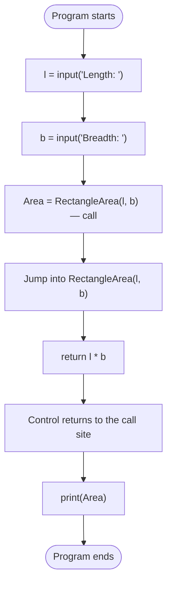
```mermaid
flowchart TD
    A([Program starts]) --> B["l = input('Length: ')"]
    B --> C["b = input('Breadth: ')"]
    C --> D["Area = RectangleArea(l, b)  — call"]
    D --> E["Jump into RectangleArea(l, b)"]
    E --> F["return l * b"]
    F --> G["Control returns to the call site"]
    G --> H["print(Area)"]
    H --> I([Program ends])
```

- ⚠ A function must be defined before it is called, in the file's top-to-bottom order — calling `helloPython()` before `def helloPython():` appears raises `NameError: name 'helloPython' is not defined`. §15.4

**§15.5 — A worked example: one function calling another**

Program 7-13 (NCERT Program 7.13) — traffic-light simulation. `trafficLight()` validates the user's input and calls `light()` to convert a colour name into a numeric code; the returned code decides which message to print. §15.5
```python
def light(colour):
    if colour == "RED":
        return 0
    elif colour == "YELLOW":
        return 1
    else:
        return 2

def trafficLight():
    signal = input("Enter the colour of the traffic light: ")
    if signal not in ("RED", "YELLOW", "GREEN"):
        print("Please enter a valid Traffic Light colour in CAPITALS")
    else:
        value = light(signal)
        if value == 0:
            print("STOP, Your Life is Precious.")
        elif value == 1:
            print("PLEASE GO SLOW.")
        else:
            print("GO!, Thank you for being patient.")

trafficLight()
print("SPEED THRILLS BUT KILLS")
```
Output:
```text
Enter the colour of the traffic light: YELLOW
PLEASE GO SLOW.
SPEED THRILLS BUT KILLS
```

- `trafficLight()` doesn't know or care how `light()` decides its return value — it only uses the number that comes back. §15.5
- This separation (one function validating/orchestrating, another doing one focused calculation) is the reusability/readability payoff of §14.2. §15.5
- `signal not in (...)` reuses the membership operator (§8.6) to validate input against a tuple of allowed strings. §15.5

---

### §16 — Scope of a Variable

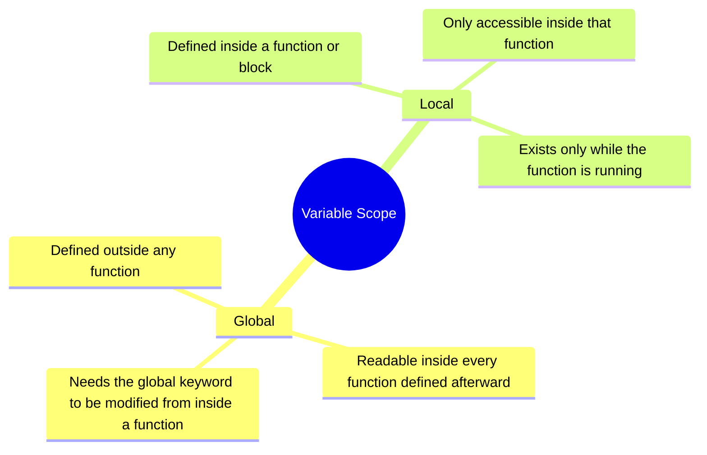
```mermaid
mindmap
  root((Variable Scope))
    Global
      Defined outside any function
      Readable inside every function defined afterward
      Needs the global keyword to be modified from inside a function
    Local
      Defined inside a function or block
      Only accessible inside that function
      Exists only while the function is running
```

- Scope = the part of a program where a variable can be accessed. §16

| Scope | Created where | Visible where |
|---|---|---|
| Global variable | Outside any function or block | Anywhere in the program, in any function defined onward |
| Local variable | Inside a function or block | Only inside that function/block — stops existing once the function finishes |

Program 7-14 (adapted from NCERT Program 7.14) — a local variable is invisible outside its function. §16
```python
num = 5
def myFunc1():
    y = num + 5
    print("Inside myFunc1, y =", y)

myFunc1()
print("Outside myFunc1, num =", num)
print("Outside myFunc1, y =", y)
```
Output:
```text
Inside myFunc1, y = 10
Outside myFunc1, num = 5
NameError: name 'y' is not defined
```

- ⚠ If a local variable inside a function shares a name with a global variable, the local name hides the global one for the rest of that function — assigning to it there does not change the global. §16
- To modify the actual global variable from inside a function, prefix it with `global`. §16

```python
num = 5
def myfunc1():
    global num
    num = 10
myfunc1()
print(num)   # 10
```

---

### §17 — Python Standard Library

```mermaid
mindmap
  root((Functions in Python))
    User Defined
      def ... return
    Standard Library
      Built-in
        input print
        int float str
        abs divmod max min pow sum len
      Module
        math
        random
        statistics
```

**§17.1 — Built-in functions**

- Ready-made functions, available without importing anything. §17.1

| Function | Arguments | Returns | Example |
|---|---|---|---|
| `abs(x)` | a number | absolute value | `abs(-5.7)` → `5.7` |
| `divmod(x, y)` | two integers | `(quotient, remainder)` tuple | `divmod(7, 2)` → `(3, 1)` |
| `max(...)` | a sequence or several values | the largest | `max([1, 2, 3, 4])` → `4` |
| `min(...)` | a sequence or several values | the smallest | `min(23, 4, 56)` → `4` |
| `pow(x, y[, z])` | numbers | `x ** y`, or `(x**y) % z` if `z` is given | `pow(5, 2, 4)` → `1` |
| `sum(x[, num])` | a numeric sequence | its total, plus optional `num` | `sum([2, 4, 7, 3])` → `16` |
| `len(x)` | a sequence or dictionary | count of elements | `len("Patience")` → `8` |

**§17.2 — Modules**

- A module is a `.py` file containing a collection of function definitions — a way to organize a large program, and reuse functions across programs. §17.2
- Loaded with `import modulename1 [, modulename2, ...]`. §17.2
- Once imported, a function is called as `modulename.functionname()`. §17.2

| Module | Purpose | Example |
|---|---|---|
| `math` | Mathematical functions, mostly returning `float` | `math.sqrt(144)` → `12.0` |
| `random` | Generating random numbers | `random.randint(3, 7)` → an `int` from 3 to 7, inclusive |
| `statistics` | Statistics on numeric data | `statistics.mean([11, 24, 32, 45, 51])` → `32.6` |

| `math` function | Returns |
|---|---|
| `math.ceil(x)` | Smallest integer ≥ `x` |
| `math.floor(x)` | Largest integer ≤ `x` |
| `math.fabs(x)` | Absolute value, always as a `float` |
| `math.factorial(x)` | `x!` (`x` must be a positive integer) |
| `math.fmod(x, y)` | `x % y`, keeping the sign of `x` |
| `math.gcd(x, y)` | Greatest common divisor of `x` and `y` |
| `math.pow(x, y)` | `x ** y`, always as a `float` |
| `math.sqrt(x)` | Square root of `x` |
| `math.sin(x)` | Sine of `x`, given in radians |

| `random` function | Argument(s) | Returns |
|---|---|---|
| `random.random()` | none | a random `float` in `[0.0, 1.0)` |
| `random.randint(x, y)` | two integers, `x <= y` | a random integer between `x` and `y`, inclusive |
| `random.randrange(y)` | one integer (stop) | a random integer from `0` up to (not including) `y` |
| `random.randrange(x, y)` | two integers (start, stop) | a random integer from `x` up to (not including) `y` |

| `statistics` function | Returns |
|---|---|
| `statistics.mean(x)` | arithmetic mean of a numeric sequence |
| `statistics.median(x)` | the middle value of a numeric sequence |
| `statistics.mode(x)` | the most frequently occurring value — works on non-numeric sequences too: `statistics.mode(("red", "blue", "red"))` → `'red'` |

- The `from` statement, `from modulename import functionname [, functionname, ...]`, loads only the named function(s), callable without the module prefix. §17.2

```python
from math import ceil, sqrt
print(sqrt(ceil(624.7)))
```
Output:
```text
25.0
```
- Wrapping one function call inside another — where the inner call's result feeds the outer call's argument — is called composition. §17.2

- `import` can be written anywhere in a program, but a module is only ever loaded once, no matter how many times it's imported. §17.2
- `help("math")` (or any module name, in quotes) lists what that module provides, directly from the interpreter. §17.2
- Standard-library modules live in Python's own `Lib` folder. §17.2
- Importing only the function(s) actually needed, via `from module import name`, uses less memory than importing the whole module. §17.2

- Writing your own module: save a `.py` file containing function definitions (optionally starting with a `"""docstring"""`), then `import` it like any other module. §17.2
- `<modulename>.__doc__` displays that docstring. §17.2

Program 7-16 (NCERT Program 7.16) — a `basic_math` module. §17.2
```python
"""
    basic_math Module
    ******************
This module contains basic arithmetic operations
that can be carried out on numbers
"""
def addnum(x, y):
    return x + y

def divnum(x, y):
    if y == 0:
        print("Division by Zero Error")
    else:
        return x / y

# subnum(x, y) and multnum(x, y) follow the same one-line-return pattern
```
```python
import basic_math
print(basic_math.__doc__)
print(basic_math.addnum(2, 5))   # 7
print(basic_math.divnum(2, 0))   # Division by Zero Error (returns None)
```

---

## Quick Reference

**Part A — Python Fundamentals**
- Explicit conversion functions: `int()`, `float()`, `str()`, `chr()`, `ord()`.
- Six operator families: Arithmetic, Relational, Assignment, Logical, Identity, Membership.
- Mutable: `list`, `set`, `dict`. Immutable: `int`, `float`, `bool`, `complex`, `str`, `tuple`.

**Part B — Functions**
- Function header syntax: `def name([param1, param2=default, ...]):`.
- Argument vs. parameter: the value passed in, vs. the name that receives it — same object at call time.
- `global` keyword required inside a function only to reassign a global variable; reading one needs no special keyword.
- `import module` then `module.func()`; `from module import func` then `func()` directly.

## Points to Ponder

1. `input()` always returns a string — convert with `int()`/`float()` before doing arithmetic on it.
2. `=` assigns; `==` compares. Never interchangeable.
3. Python is case-sensitive: `number` ≠ `Number` ≠ `NUMBER`.
4. `/` always returns a `float`, even `8 / 4` → `2.0`; `//` returns the floored result.
5. A variable isn't fixed to one type — it can be reassigned to a value of a different type at any time.
6. Two variables holding equal immutable values may share an `id()` — an implementation detail, not something a program should rely on.
7. Syntax error stops a program before it starts; runtime error stops it mid-way; logical error never stops it at all.
8. Runtime errors have specific names — `ValueError`, `ZeroDivisionError`, `TypeError` — reading the exact name is the fastest way to diagnose the bug.
9. A function is not executed merely by being defined — only a call runs its body.
10. A function must be defined before it's called, in top-to-bottom file order.
11. Argument and parameter refer to the same object at the moment of a call — they diverge only if the parameter is reassigned inside the function, and only because most simple types are immutable.
12. Default parameters must be the trailing parameters in the header.
13. A variable assigned inside a function is local by default, even if a global variable of the same name exists.
14. `return` both sends a value back and ends the function's execution at that point.
15. A module is loaded only once, no matter how many times it is imported.
16. A function can call another function — the caller only ever needs the callee's return value, never its internal logic.

## Problem-Solving Strategy

**For a "write a program that…" question (Part A):**
1. Identify every input the program needs, and its data type.
2. Identify the exact output required, including its format.
3. Write the expression or formula on paper first, and check operator precedence.
4. Convert `input()` results to the right type before using them in arithmetic.
5. Trace the code by hand for one sample input before trusting it.

**For a "write a function that…" question (Part B):**
1. List the function's inputs — will they arrive as parameters, or via `input()` inside the function itself?
2. Decide whether the function needs to return a value or simply perform an action (void).
3. Choose parameter names distinct from any global variable you don't intend to shadow.
4. Write the function body, then write the call, and check the call appears after the `def`.
5. Trace the call by hand: what does each parameter equal, and what does the function return?

## Rapid Reference

| Fact | Value |
|---|---|
| Python's translator type | Interpreter (not compiler) |
| Interpreter error behaviour | Stops at the first error |
| Compiler error behaviour | Reports all errors together, after scanning the whole program |
| Number of Python 3 keywords (this unit's list) | 33 |
| Identifier first character | Letter or underscore, never a digit |
| Comment marker | `#` |
| `id()` returns | An object's unique identity |
| `type()` returns | An object's data type |
| `bool` is a subtype of | `int` |
| `None` is | Distinct from both `False` and `0` |
| Immutable built-in types | `int`, `float`, `bool`, `complex`, `str`, `tuple` |
| Mutable built-in types | `list`, `set`, `dict` |
| `/` result type | Always `float` |
| `//` result | Floored quotient |
| `%` result | Remainder |
| `**` operation | Exponentiation |
| String comparison method | Lexicographic, by ASCII value |
| `=` vs `==` | Assign vs compare |
| `is` vs `==` | Same object vs equal value |
| Highest-precedence operator | `**` |
| Lowest-precedence operator | `or` |
| `input()` return type | Always `string` |
| `print()` default `sep` | One space |
| `print()` default `end` | Newline |
| `int(30.8)` | `30` (truncates, doesn't round) |
| String `+` on numeric-looking strings | Concatenates characters, doesn't add |
| `int` + `float` implicit result | `float` (type promotion) |
| Syntax error timing | Before execution — program never runs |
| Runtime error timing | During execution — program stops mid-way |
| Logical error timing | Never — program runs, output is wrong |
| Division by zero raises | `ZeroDivisionError` |
| `int("apple")` raises | `ValueError` |
| `"text" + 5` raises | `TypeError` |
| Function definition keyword | `def` |
| Function header ends with | `:` |
| Argument vs parameter | Value passed vs name that receives it |
| Default-parameter ordering rule | Must be the trailing parameters |
| `return` does | Sends a value back and ends execution |
| Multiple return values, mechanism | Packed into a tuple |
| Function must be defined | Before it is called |
| Local variable visible outside its function | No |
| Global variable modified inside a function needs | `global` keyword |
| Module load count regardless of import count | Once |
| `import module` call syntax | `module.function()` |
| `from module import function` call syntax | `function()`, no prefix |
| Two functions calling each other, caller needs | Only the callee's return value |
