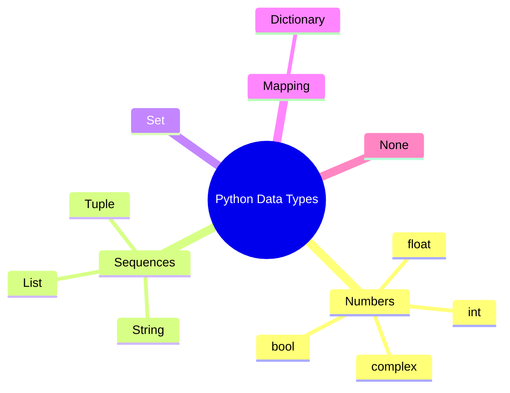
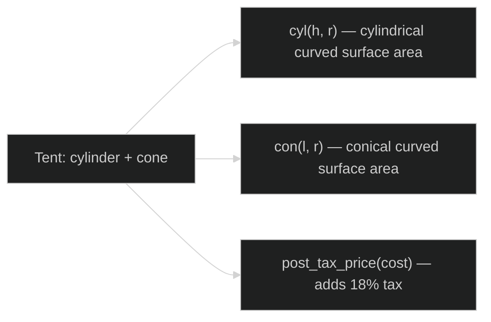
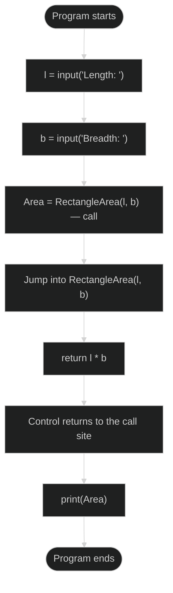
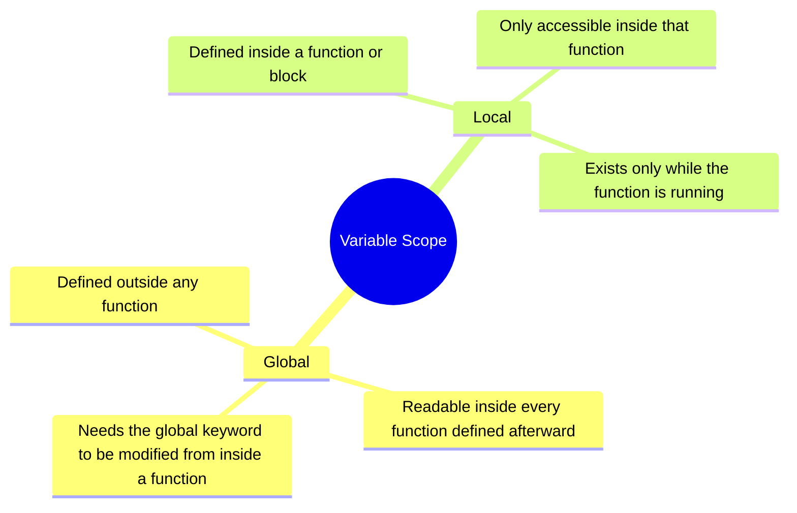
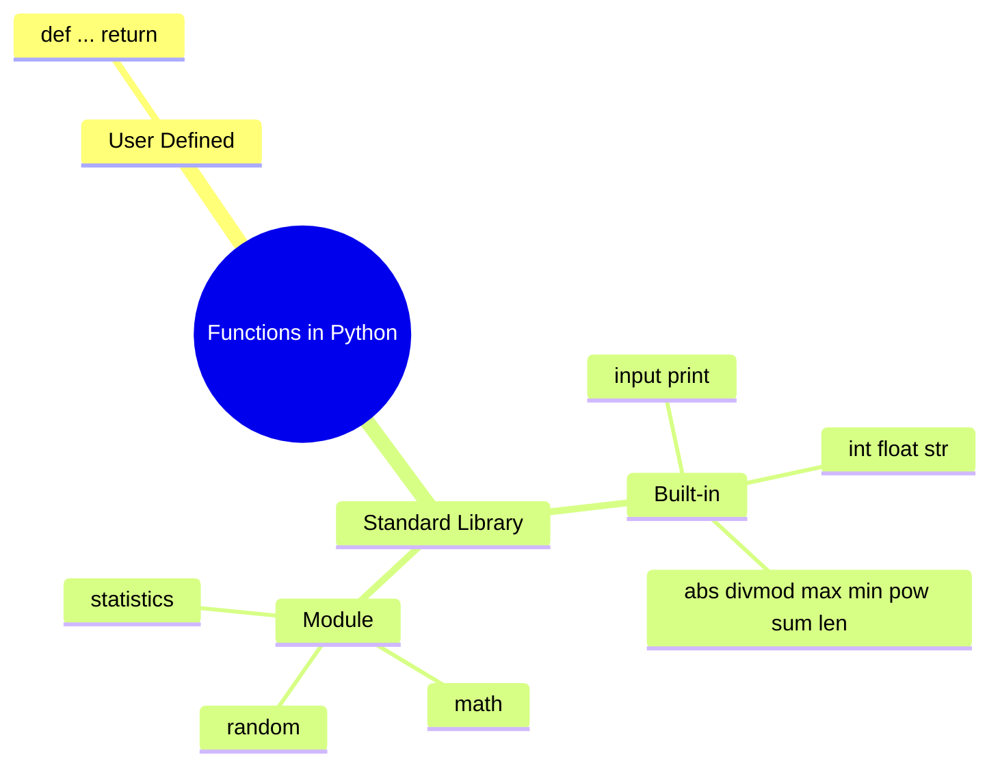

# Computer Science | Chapter 04 | PYTHON PROGRAMMING FUNDAMENTALS | NOTES

**Branches merged:** Python Fundamentals + Functions & Modules · **Level:** Class XI (CBSE Computer Science) · **Python version assumed:** Python 3.x
**Source chapters:** NCERT Computer Science — Chapter 5 (Getting Started with Python) + Chapter 7 (Functions)

> This unit builds the vocabulary every Python program depends on — how source code runs, how names bind to values, data types, operators and expressions — and then builds on it: how to name a group of instructions once, as a function, and reuse it anywhere.

> [!note]
> Worked examples reproduce the NCERT chapters' own program numbering (`Program 5-1`, `Program 7-3`, …) so this note can be cross-checked against the textbook. SVG figures follow the note-taking skill's fence convention; spot-check one against the live renderer before trusting the whole set.

## Concept Roadmap

```mermaid
%%{init: {'theme':'dark'}}%%
flowchart TD
    A([High-level language: Python]) --> B[Interpreter converts source to machine code]
    B --> C{Execution mode?}
    C -->|Interactive| D1[One statement at a time, instant result]
    C -->|Script| D2[Whole .py file, run together]
    D1 --> E[Identifiers & Keywords name things]
    D2 --> E
    E --> F[Variables bind names to objects]
    F --> G[Data types: Number, Sequence, Set, None, Mapping]
    G --> H[Operators combine values]
    H --> I[Expressions evaluate by precedence]
    I --> J[Statements: assignment, input, print]
    J --> K[Type conversion: implicit & explicit]
    K --> L[Debugging: syntax / logical / runtime errors]
    L --> M[Repeated code → break into functions]
    M --> N[def creates a user-defined function]
    N --> O[Arguments passed in, received as parameters]
    O --> P[return sends value(s) back]
    P --> Q[Variable scope: local vs global]
    Q --> R([Standard Library: built-ins + modules])
```

---

## Part A — Getting Started with Python (NCERT Chapter 5)

> Vocabulary and building blocks: source code, interpreters, names, data types, operators, expressions, input/output, type conversion, and debugging.

### 1. Programming Languages and Python ⭐

#### 1.1 Programs, source code, and translators (§5.1)

A **program** is an ordered set of instructions a computer executes to carry out a task, written in a **programming language**. Computers natively understand only **machine language** (0s and 1s) — writing directly in it is impractical for people, which is why **high-level languages** like Python exist. Code written in a high-level language is called **source code**, and a **language translator** converts it to machine language before (or while) it runs.

| Translator | How it works | When errors surface |
|---|---|---|
| **Interpreter** | Translates and runs one statement at a time | Execution stops at the *first* error found |
| **Compiler** | Translates the *entire* program into object code before running any of it | All errors are reported together, after scanning the whole program |

Python uses an **interpreter**.

#### 1.2 Features of Python (§5.1.1) ⭐

- Free, open-source, high-level language
- Interpreted, with clearly defined, relatively simple syntax
- **Case-sensitive** — `NUMBER` and `number` are different identifiers
- Portable and platform-independent
- Ships with a rich standard library of ready-made functions
- Widely used in web development
- Uses **indentation** — not braces — to mark blocks and nested blocks

> [!note] Getting Python
> The latest Python 3 release is available from the official site, python.org.

#### 1.3 Working with the Python shell (§5.1.2) ⭐

The **Python interpreter**, also called the **Python shell**, can be started from an installed distribution or an online interpreter. The `>>>` prompt signals the interpreter is ready for a statement.

#### 1.4 Execution modes (§5.1.3) ⭐⭐

| Mode | Behaviour | Trade-off |
|---|---|---|
| **Interactive mode** | Type one statement at the `>>>` prompt; it runs immediately | Great for quick tests, but nothing is saved for reuse |
| **Script mode** | Write several statements into a `.py` file, then run the whole file | Reusable and shareable, but no per-line feedback |

> [!example]
> ##### Program 5-1 — Print statement in script mode (NCERT Program 5.1)

```python
print("Save Earth")
print("Preserve Future")
```

Output:

```text
Save Earth
Preserve Future
```

A saved script is run either by typing the file name (with path) at the prompt, or via **Run → Run Module (`F5`)** from inside the editor.

### 2. Python Keywords (§5.2) ⭐

**Keywords** are reserved words with a fixed meaning to the interpreter. Because Python is case-sensitive, they must be typed exactly as reserved, and they can never be reused as identifiers.

> [!info] Python 3 keywords — reserved, cannot be used as identifiers
> | | | | | |
> |---|---|---|---|---|
> | `False` | `class` | `finally` | `is` | `return` |
> | `None` | `continue` | `for` | `lambda` | `try` |
> | `True` | `def` | `from` | `nonlocal` | `while` |
> | `and` | `del` | `global` | `not` | `with` |
> | `as` | `elif` | `if` | `or` | `yield` |
> | `assert` | `else` | `import` | `pass` | |
> | `break` | `except` | `in` | `raise` | |

### 3. Identifiers (§5.3) ⭐

An **identifier** is the name given to a variable, function, or other entity.

**Naming rules:**

1. Must begin with a letter (upper- or lowercase) or an underscore `_` — never a digit.
2. May contain letters, digits, and underscores after the first character.
3. Can be any length, but should stay short and meaningful.
4. Cannot be a keyword.
5. Cannot contain special symbols such as `!`, `@`, `#`, `$`, `%`.

> **Key idea:** `avg = (marks1 + marks2 + marks3) / 3` is easier to read and maintain than `a = (b + c + d) / 3` — meaningful identifiers are part of *correct* practice, not just style.

> [!note] Naming-convention note
> This unit's worked examples mix `camelCase` (`sumSquares`, `mixedFraction`) and `snake_case` (`csa_cyl`, `unit_price`) — both are kept as given rather than silently normalized. New examples added in this note use `snake_case`, in line with common Python style guidance (PEP 8).

### 4. Variables (§5.4) ⭐

A **variable** is a name bound to an **object** — a value held in memory. Python creates a variable the moment an assignment statement runs; there is no separate declaration step, and a variable must be assigned a value before it's used in an expression.

> [!example]
> ##### Program 5-2 — Displaying variable values (NCERT Program 5.2)

```python
message = "Keep Smiling"
print(message)
userNo = 101
print('User Number is', userNo)
```

Output:

```text
Keep Smiling
User Number is 101
```

String values may be written in single `'…'` or double `"…"` quotes (the quotes aren't part of the value); numeric values are never quoted.

> [!example]
> ##### Program 5-3 — Area of a rectangle (NCERT Program 5.3)

```python
length = 10
breadth = 20
area = length * breadth
print(area)
```

Output:

```text
200
```

### 5. Comments (§5.5) ⭐

A **comment** documents *why* code exists for later readers (including future you); the interpreter ignores everything after `#` to the end of the line.

```python
# Variable amount is the total spending on grocery
amount = 3400
```

### 6. Everything Is an Object (§5.6) ⭐⭐

Python treats every value — numeric, string, or otherwise — as an **object**. Every object is assigned a unique **identity**, similar in spirit to a memory address, that stays fixed for the object's lifetime; `id()` returns it, and `type()` reports the object's data type.

```python
num1 = 20
print(id(num1))
num2 = 30 - 10
print(id(num2))
```

Output (id values are implementation-dependent — NCERT's own traced run is shown; expect different numbers on your machine):

```text
1433920576
1433920576
```

```svg
<svg viewBox="0 0 420 170" xmlns="http://www.w3.org/2000/svg" style="max-width:100%;height:auto" font-family="sans-serif">
  <defs>
    <marker id="arrow1" viewBox="0 0 10 10" refX="9" refY="5" markerWidth="6" markerHeight="6" orient="auto-start-reverse">
      <path d="M0,0 L10,5 L0,10 z" fill="#262626"/>
    </marker>
  </defs>
  <rect x="20" y="20" width="90" height="30" fill="#ffffff" stroke="#262626" stroke-width="1.5"/>
  <text x="65" y="40" font-size="13" fill="#262626" text-anchor="middle">num1</text>
  <rect x="20" y="100" width="90" height="30" fill="#ffffff" stroke="#262626" stroke-width="1.5"/>
  <text x="65" y="120" font-size="13" fill="#262626" text-anchor="middle">num2</text>
  <rect x="270" y="55" width="110" height="40" fill="#e3f2fd" stroke="#1565c0" stroke-width="1.5"/>
  <text x="325" y="80" font-size="14" fill="#1565c0" text-anchor="middle">20</text>
  <text x="325" y="30" font-size="11" fill="#757575" text-anchor="middle">id 1433920576</text>
  <line x1="110" y1="35" x2="265" y2="65" stroke="#262626" stroke-width="1.5" marker-end="url(#arrow1)"/>
  <line x1="110" y1="115" x2="265" y2="80" stroke="#262626" stroke-width="1.5" marker-end="url(#arrow1)"/>
  <text x="325" y="130" font-size="11" fill="#555555" text-anchor="middle">num2 = 30 - 10 evaluates to the</text>
  <text x="325" y="145" font-size="11" fill="#555555" text-anchor="middle">same object num1 already names</text>
</svg>
```

> **Watch out:** two variables can share an `id()` when they refer to the same value — this is ordinary for small numbers, not a special "link" between the variables. Reassigning one name never changes what the other name refers to (see §7.6 below).

> [!info] Where the term "object" comes from
> In object-oriented programming generally, an **object** represents something real-world — an employee, a vehicle, a book — and typically carries both **data/attributes** and **behaviour/methods**, organized through classes and class hierarchies (outside this unit's scope). Python is object-oriented too, but applies the term more loosely: some Python objects have no meaningful attributes, and others have no methods.

### 7. Data Types (§5.7) ⭐⭐

Every value has a **data type**, which fixes what operations are valid on it.



#### 7.1 Numbers (§5.7.1)

| Type | Description | Examples |
|---|---|---|
| `int` | Whole numbers | `-12, -3, 0, 125` |
| `float` | Real / floating-point numbers | `-2.04, 4.0, 14.23` |
| `complex` | A real part and an imaginary part | `3 + 4j, 2 - 2j` |

`bool` is a *subtype* of `int` with exactly two values, `True` and `False`. `True` behaves as non-zero, non-null, non-empty; `False` behaves as `0`.

Simple types like `int`, `float`, and `bool` each hold a single value at a time — for a *collection* of values, Python offers the sequence, set, and mapping types below. The built-in `type()` function reports which one a value belongs to:

```python
num1 = 10
print(type(num1))

num2 = -1210
print(type(num2))

var1 = True
print(type(var1))

float1 = -1921.9
print(type(float1))

float2 = -9.8 * 10 ** 2
print(float2, type(float2))

var2 = -3 + 7.2j
print(var2, type(var2))
```

Output (NCERT Example 5.3):

```text
<class 'int'>
<class 'int'>
<class 'bool'>
<class 'float'>
-980.0000000000001 <class 'float'>
(-3+7.2j) <class 'complex'>
```

> **Watch out:** `-9.8 * 10 ** 2` doesn't print as a clean `-980.0` — floating-point numbers are stored in binary, so a tiny representation error (`-980.0000000000001`) is normal, not a bug in the code.

#### 7.2 Sequences (§5.7.2)

A **sequence** is an ordered collection whose items are each reachable by an integer index.

| Type | Delimiter | Example | Can it change? |
|---|---|---|---|
| **String** | `'…'` or `"…"` | `'Hello Friend'` | No (immutable) |
| **List** | `[ ]` | `[5, 3.4, "New Delhi"]` | Yes (mutable) |
| **Tuple** | `( )` | `(10, 20, 'a')` | No (immutable) |

> [!warning]
> A string that *looks* numeric, e.g. `"452"`, still can't be used in arithmetic without converting it first — it's text, not a number.

#### 7.3 Set (§5.7.3)

A **set**, written `{ }`, is an *unordered* collection with no duplicate entries; once created, individual elements can't be changed.

```python
set2 = {1, 2, 1, 3}
print(set2)
```

Output:

```text
{1, 2, 3}
```

#### 7.4 None (§5.7.4)

`None` is a special type with exactly one value, used to represent the *absence* of a value. It is neither `False` nor `0` — a distinct concept from both.

#### 7.5 Mapping (§5.7.5)

A **dictionary** — Python's one built-in mapping type — stores `key : value` pairs inside `{ }`. A value is looked up by its key, not by its position.

```python
dict1 = {'Fruit': 'Apple', 'Climate': 'Cold', 'Price(kg)': 120}
print(dict1['Price(kg)'])
```

Output:

```text
120
```

#### 7.6 Mutable vs. immutable (§5.7.6) ⭐⭐⭐

| Immutable | Mutable |
|---|---|
| `int`, `float`, `bool`, `complex`, `str`, `tuple` | `list`, `set`, `dict` |

When code tries to change an **immutable** object's value, Python doesn't edit it in place — it builds a *new* object and rebinds the name to it, which changes that name's `id()`.

```svg
<svg viewBox="0 0 380 150" xmlns="http://www.w3.org/2000/svg" style="max-width:100%;height:auto" font-family="sans-serif">
  <defs>
    <marker id="arrow2" viewBox="0 0 10 10" refX="9" refY="5" markerWidth="6" markerHeight="6" orient="auto-start-reverse">
      <path d="M0,0 L10,5 L0,10 z" fill="#262626"/>
    </marker>
  </defs>
  <rect x="20" y="15" width="90" height="30" fill="#ffffff" stroke="#262626" stroke-width="1.5"/>
  <text x="65" y="35" font-size="13" fill="#262626" text-anchor="middle">num1</text>
  <rect x="20" y="90" width="90" height="30" fill="#ffffff" stroke="#262626" stroke-width="1.5"/>
  <text x="65" y="110" font-size="13" fill="#262626" text-anchor="middle">num2</text>
  <rect x="250" y="50" width="100" height="40" fill="#e3f2fd" stroke="#1565c0" stroke-width="1.5"/>
  <text x="300" y="75" font-size="14" fill="#1565c0" text-anchor="middle">300</text>
  <text x="300" y="25" font-size="11" fill="#757575" text-anchor="middle">id 1000</text>
  <line x1="110" y1="30" x2="245" y2="60" stroke="#262626" stroke-width="1.5" marker-end="url(#arrow2)"/>
  <line x1="110" y1="105" x2="245" y2="80" stroke="#262626" stroke-width="1.5" marker-end="url(#arrow2)"/>
  <text x="190" y="140" font-size="11" fill="#555555" text-anchor="middle">Before: num1 = 300, then num2 = num1</text>
</svg>
```

```svg
<svg viewBox="0 0 380 170" xmlns="http://www.w3.org/2000/svg" style="max-width:100%;height:auto" font-family="sans-serif">
  <defs>
    <marker id="arrow3" viewBox="0 0 10 10" refX="9" refY="5" markerWidth="6" markerHeight="6" orient="auto-start-reverse">
      <path d="M0,0 L10,5 L0,10 z" fill="#262626"/>
    </marker>
  </defs>
  <rect x="20" y="15" width="90" height="30" fill="#ffffff" stroke="#262626" stroke-width="1.5"/>
  <text x="65" y="35" font-size="13" fill="#262626" text-anchor="middle">num2</text>
  <rect x="20" y="90" width="90" height="30" fill="#ffffff" stroke="#262626" stroke-width="1.5"/>
  <text x="65" y="110" font-size="13" fill="#262626" text-anchor="middle">num1</text>
  <rect x="250" y="0" width="100" height="40" fill="#e3f2fd" stroke="#1565c0" stroke-width="1.5"/>
  <text x="300" y="25" font-size="14" fill="#1565c0" text-anchor="middle">300</text>
  <text x="300" y="55" font-size="10" fill="#757575" text-anchor="middle">id 1000</text>
  <rect x="250" y="90" width="100" height="40" fill="#fff3e0" stroke="#e65100" stroke-width="1.5"/>
  <text x="300" y="115" font-size="14" fill="#e65100" text-anchor="middle">400</text>
  <text x="300" y="145" font-size="10" fill="#757575" text-anchor="middle">id 2200 (new object)</text>
  <line x1="110" y1="30" x2="245" y2="20" stroke="#262626" stroke-width="1.5" marker-end="url(#arrow3)"/>
  <line x1="110" y1="105" x2="245" y2="110" stroke="#262626" stroke-width="1.5" marker-end="url(#arrow3)"/>
  <text x="190" y="165" font-size="11" fill="#555555" text-anchor="middle">After: num1 = num2 + 100 rebinds only num1</text>
</svg>
```

> **Key idea:** `num1 = 300` then `num2 = num1` makes both names point to the *same* object. `num1 = num2 + 100` then creates a brand-new `int` object for `num1` — because integers are immutable — while `num2` keeps pointing at the original `300`.

#### 7.7 Choosing the right data type (§5.7.7) ⭐⭐

| Need | Use | Typical example |
|---|---|---|
| Frequently changing, ordered collection | List | Names of students in a class, updated as they join or leave |
| Fixed, never-changing ordered collection | Tuple | The names of the months in a year |
| Unique elements, no duplicates | Set | A museum's list of artefacts |
| Fast lookup by a custom key | Dictionary | A mobile phone book (name → number) |

### 8. Operators (§5.8) ⭐⭐⭐

An **operator** performs an operation on **operands**. Python groups operators into six families.

#### 8.1 Arithmetic operators (§5.8.1)

| Operator | Meaning | Example |
|---|---|---|
| `+` | Addition / string concatenation | `"Hello" + "India"` → `'HelloIndia'` |
| `-` | Subtraction | `5 - 6` → `-1` |
| `*` | Multiplication / string repetition | `'India' * 2` → `'IndiaIndia'` |
| `/` | Division — **always returns a `float`** | `8 / 4` → `2.0` |
| `%` | Modulus (remainder) | `13 % 5` → `3` |
| `//` | Floor division (drops the decimal part) | `13 // 4` → `3` |
| `**` | Exponent | `3 ** 4` → `81` |

#### 8.2 Relational operators (§5.8.2)

`==`, `!=`, `>`, `<`, `>=`, `<=` each compare two operands and evaluate to `True` or `False`. Strings compare *lexicographically*, using each character's ASCII value in turn.

```python
num1, num2, num3 = 10, 0, 10
str1, str2 = "Good", "Afternoon"

print(num1 == num2)
print(num1 != num2)
print(num1 > num2)
print(num1 < num3)
print(num1 >= num2)
print(str1 > str2)
```

Output (selected rows, NCERT Table 5.4):

```text
False
True
True
False
True
True
```

`str1 > str2` is `True` because `'G'` (in `"Good"`) has a higher ASCII value than `'A'` (in `"Afternoon"`).

#### 8.3 Assignment operators (§5.8.3)

`=` and the compound forms `+=`, `-=`, `*=`, `/=`, `%=`, `//=`, `**=` — each combines an operation with assignment, e.g. `x += y` means `x = x + y`.

> [!info] Assignment operators, worked (NCERT Table 5.5)
> | Operator | Meaning | Starting point | Result |
> |---|---|---|---|
> | `+=` | `x = x + y` | `str1 = 'Hello'; str1 += 'India'` | `'HelloIndia'` |
> | `-=` | `x = x - y` | `num1 = 10; num2 = 2; num1 -= num2` | `8` |
> | `*=` | `x = x * y` | `a = 'India'; a *= 3` | `'IndiaIndiaIndia'` |
> | `/=` | `x = x / y` | `num1 = 6; num2 = 3; num1 /= num2` | `2.0` |
> | `%=` | `x = x % y` | `num1 = 7; num2 = 3; num1 %= num2` | `1` |
> | `//=` | `x = x // y` | `num1 = 7; num2 = 3; num1 //= num2` | `2` |
> | `**=` | `x = x ** y` | `num1 = 2; num2 = 3; num1 **= num2` | `8` |

#### 8.4 Logical operators (§5.8.4)

`and`, `or`, `not` — always lowercase. Every value is logically `True` **except** `None`, `False`, `0`, and empty collections (`""`, `()`, `[]`, `{}`).

```python
num1, num2, num3 = 10, -20, 0
print(bool(num1 and num2))
print(bool(num1 and num3))
print(bool(num1 or num3))
```

Output (NCERT Table 5.6):

```text
True
False
True
```

#### 8.5 Identity operators (§5.8.5)

`is` and `is not` test whether two names refer to the *same* object (matching `id()`) — not merely equal values.

```python
num1 = 5
num2 = num1
print(id(num1) == id(num2))
print(num1 is num2)
```

Output (NCERT Table 5.7):

```text
True
True
```

#### 8.6 Membership operators (§5.8.6)

`in` and `not in` test whether a value exists inside a sequence.

```python
a = [1, 2, 3]
print(2 in a)
print('1' in a)
print(10 not in a)
```

Output (NCERT Table 5.8):

```text
True
False
True
```

> [!warning] `=` vs. `==`
> `=` **assigns** a value; `==` **compares** two values. Mixing these up is one of the most common Class XI slips — `if x = 5:` is a syntax error, not a comparison.

### 9. Expressions and Precedence (§5.9) ⭐⭐⭐

An **expression** is a combination of constants, variables, and operators that evaluates to a single value. A bare value or variable *is* a valid expression; a bare operator by itself is not.

```text
100                     # a value, on its own, is a valid expression
num                     # so is a bare variable
num - 20.4              # arithmetic
3.0 + 3.14              # arithmetic
"Global" + "Citizen"    # string concatenation
```

#### 9.1 Precedence of operators (§5.9.1)

> [!info] Precedence, highest to lowest
> | Order | Operators | Meaning |
> |---|---|---|
> | 1 | `**` | Exponentiation |
> | 2 | `~ , + , -` (unary) | Complement, unary plus/minus |
> | 3 | `* , / , % , //` | Multiply, divide, modulo, floor division |
> | 4 | `+ , -` (binary) | Addition, subtraction |
> | 5 | `<= , < , > , >= , == , !=` | Relational |
> | 6 | `= , %= , /= , //= , -= , += , *= , **=` | Assignment |
> | 7 | `is , is not` | Identity |
> | 8 | `in , not in` | Membership |
> | 9 | `not` | Logical NOT |
> | 10 | `and` | Logical AND |
> | 11 | `or` | Logical OR |

Parentheses always evaluate first, overriding precedence; operators of equal precedence evaluate left to right.

> [!example]
> ##### Example 5.9 — Evaluating `20 + 30 * 40` (NCERT Example 5.9)

```text
= 20 + (30 * 40)   # * binds tighter than +
= 20 + 1200
= 1220
```

> [!example]
> ##### Example 5.10 — Equal precedence runs left to right (NCERT Example 5.10)

```text
20 - 30 + 40
= (20 - 30) + 40   # - and + share precedence, so evaluated left to right
= -10 + 40
= 30
```

> [!example]
> ##### Example 5.11 — Parentheses override precedence (NCERT Example 5.11)

```text
(20 + 30) * 40
= 50 * 40          # the parentheses force + to run before *
= 2000
```

> [!example]
> ##### Example 5.12 — Mixed `int`/`float` in one expression (NCERT Example 5.12)

```text
15.0 / 4 + (8 + 3.0)
= 15.0 / 4 + 11.0   # 8 + 3.0 is computed first, and promotes to float
= 3.75 + 11.0
= 14.75
```

### 10. Statements (§5.10) ⭐

A **statement** is a unit of code the interpreter can execute directly — an assignment, a `print()` call, and so on.

```python
x = 4              # assignment statement
cube = x ** 3      # assignment statement
print(x, cube)     # print statement
```

Output:

```text
4 64
```

### 11. Input and Output (§5.11) ⭐⭐

##### `input()`

`input([prompt])` shows an optional prompt, waits for the user to type, and **always returns a string** — even when the user types a number.

> [!warning] ⚠️ The classic trap
> `input()` always returns a *string*. If a user types `2`, `num1 = num1 * 2` **repeats** the string to `'22'` — it does not double it numerically. Getting the arithmetic result needs an explicit conversion first: `num1 = int(input(...))`.

> [!example]
> ##### Examples 5.14–5.15 — Proving `input()` returns a string (NCERT Examples 5.14–5.15)

```python
fname = input("Enter your first name: ")
age = input("Enter your age: ")
print(type(age))
```

Output:

```text
<class 'str'>
```

```python
age = int(input("Enter your age: "))
print(type(age))
```

Output:

```text
<class 'int'>
```

##### `print()`

```text
print(value [, ..., sep = ' ', end = '\n'])
```

- `sep` — inserted *between* multiple printed values (default: one space).
- `end` — appended *after* the last value (default: a newline).

| Statement | Output |
|---|---|
| `print("Hello")` | `Hello` |
| `print(10 * 2.5)` | `25.0` |
| `print("I" + "love" + "my" + "country")` | `Ilovemycountry` |
| `print("I'm", 16, "years old")` | `I'm 16 years old` |

`+` concatenates strings with **no** added space; a comma-separated argument list is instead joined using `sep` (a single space by default).

### 12. Type Conversion (§5.12) ⭐⭐

**Type conversion** changes a value's data type — either forced by the programmer (**explicit**) or performed automatically by the interpreter (**implicit**).

#### 12.1 Explicit conversion / type casting (§5.12.1)

| Function | Converts to |
|---|---|
| `int(x)` | Integer |
| `float(x)` | Floating-point |
| `str(x)` | String |
| `chr(x)` | Character, from an ASCII code |
| `ord(x)` | ASCII code, from a character |

> [!example]
> ##### Program 5-5 — `int` to `float` (NCERT Program 5.5)

```python
num1 = 10
num2 = 20
num3 = num1 + num2
print(num3, type(num3))
num4 = float(num1 + num2)
print(num4, type(num4))
```

Output:

```text
30 <class 'int'>
30.0 <class 'float'>
```

> [!example]
> ##### Program 5-6 — `float` to `int` (NCERT Program 5.6)

```python
num1 = 10.2
num2 = 20.6
num3 = num1 + num2
print(num3, type(num3))
num4 = int(num1 + num2)
print(num4, type(num4))
```

Output:

```text
30.8 <class 'float'>
30 <class 'int'>
```

> **Watch out:** `int(30.8)` drops the decimal part to give `30` — it *truncates*, it does not round.

> [!example]
> ##### Program 5-7 — Why this fails without a conversion (NCERT Program 5.7)

```python
priceIcecream = 25
priceBrownie = 45
totalPrice = priceIcecream + priceBrownie
print("The total is Rs." + totalPrice)
```

Output:

```text
TypeError: can only concatenate str (not "int") to str
```

Python never silently converts an `int` to `str` for `+` — doing so automatically could quietly hide a real bug, so it insists on an explicit conversion instead.

> [!example]
> ##### Program 5-8 — The fix: convert explicitly (NCERT Program 5.8)

```python
priceIcecream = 25
priceBrownie = 45
totalPrice = priceIcecream + priceBrownie
print("The total is Rs." + str(totalPrice))
```

Output:

```text
The total is Rs.70
```

> [!example]
> ##### Program 5-9 — String concatenation is *not* numeric addition (NCERT Program 5.9)

```python
icecream = '25'
brownie = '45'
price = icecream + brownie              # string concatenation
print("Total Price Rs." + price)

price = int(icecream) + int(brownie)    # now a real numeric addition
print("Total Price Rs." + str(price))
```

Output:

```text
Total Price Rs.2545
Total Price Rs.70
```

> **Watch out:** `icecream + brownie` on two *strings* concatenates their characters (`'25' + '45'` → `'2545'`) — it never adds them numerically, no matter how numeric they look. Only converting first, with `int()`, gives the arithmetic result `70`.

#### 12.2 Implicit conversion / coercion (§5.12.2)

Python performs implicit conversion only when no information would be lost — e.g. mixing `int` and `float` in one expression produces a `float` (**type promotion**), never the reverse.

```python
num1 = 10       # int
num2 = 20.0     # float
sum1 = num1 + num2
print(sum1, type(sum1))
```

Output:

```text
30.0 <class 'float'>
```

### 13. Debugging (§5.13) ⭐⭐

**Debugging** is the process of finding and removing **bugs** (errors).

> [!info] The three error categories
> | Error type | When it appears | Effect | Example |
> |---|---|---|---|
> | **Syntax error** | Before execution starts | Interpreter refuses to run the program at all | Unbalanced parenthesis: `(7 + 11` |
> | **Runtime error** | Mid-execution | Program starts, then terminates abnormally | Dividing by zero |
> | **Logical error** | Never flagged by the interpreter | Program runs to completion but produces a wrong answer | `10 + 12 / 2` used for an average instead of `(10 + 12) / 2` |

> **Key idea:** a **logical error** (also called a *semantic* error) is the hardest to catch precisely *because* the program runs without complaint — the only clue is a wrong output, so debugging means working backward from what actually printed.

> [!example]
> ##### Program 5-11 — Two different runtime errors (NCERT Program 5.11)

```python
num1 = 10.0
num2 = int(input("num2 = "))
print(num1 / num2)
```

| User enters | Result |
|---|---|
| `apple` | `ValueError: invalid literal for int() with base 10: 'apple'` |
| `0` | `ZeroDivisionError: float division by zero` |
| `10` | `1.0` (runs correctly) |

> **Key idea:** Python names its runtime errors specifically — `ValueError` for a value of the wrong kind, `ZeroDivisionError` for division by zero, `TypeError` for an operation on the wrong type — rather than reporting one generic "runtime error." Reading the exact error name is the fastest way to diagnose what went wrong.

---

## Part B — Functions (NCERT Chapter 7)

> Functions let a program name a group of instructions once and reuse it anywhere: user-defined functions, arguments and parameters, variable scope, and the Python Standard Library.

### 14. Why Functions? (§7.1 – §7.2) ⭐

#### 14.1 From one long script to modular programming (§7.1)

A program that keeps growing in a single block of code becomes bulky and hard to manage. Splitting it into separate, independently named blocks — each solving one sub-problem — is called **modular programming**. A **function** is a named group of instructions that runs a specific task when it is *invoked* (called); once defined, it can be called repeatedly, from anywhere in the program, without rewriting its code each time.

> [!example]
> ##### Programs 7-1 → 7-2 — A tent-cost calculator, before and after functions (condensed from NCERT Programs 7.1–7.2)
>
> A company sells tents (a cylinder topped by a cone) and needs the canvas area, the canvas cost, and the tax-inclusive price. **Program 7-1** does this as one flat script:

```python
h = float(input("Height of the cylindrical part: "))
r = float(input("Radius: "))
l = float(input("Slant height of the conical part: "))

csa_conical = 3.14 * r * l
csa_cylindrical = 2 * 3.14 * r * h
canvas_area = csa_conical + csa_cylindrical

unit_price = float(input("Cost of 1 m^2 canvas: "))
total_cost = unit_price * canvas_area

tax = 0.18 * total_cost
net_price = total_cost + tax
print("Net amount payable =", net_price)
```
>
> **Program 7-2** breaks the same logic into three functions — `cyl()`, `con()`, and `post_tax_price()` — each responsible for one sub-task:

```python
def cyl(h, r):                       # curved surface area of the cylindrical part
    return 2 * 3.14 * r * h

def con(l, r):                       # curved surface area of the conical part
    return 3.14 * r * l

def post_tax_price(cost):            # adds 18% tax to a cost
    tax = 0.18 * cost
    return cost + tax

h = float(input("Height of the cylindrical part: "))
r = float(input("Radius: "))
csa_cyl = cyl(h, r)                  # function call

l = float(input("Slant height of the conical part: "))
csa_con = con(l, r)                  # function call

canvas_area = csa_cyl + csa_con
unit_price = float(input("Cost of 1 m^2 canvas: "))
total_cost = unit_price * canvas_area
print("Net amount payable =", post_tax_price(total_cost))
```



> **Key idea:** nothing about *what* gets computed changes between the two versions — only *how the code is organized*. Program 7-2 is easier to read, and if the company later adds a rectangular-base tent, `con()` and `post_tax_price()` can be reused immediately without being rewritten.

#### 14.2 Advantages of using functions (§7.2.1) ⭐⭐

| Advantage | Why it matters |
|---|---|
| **Readability** | A well-named function call reads like a step in the plan, not a wall of code |
| **Shorter code** | The same logic is written once and called wherever it's needed |
| **Reusability** | A function can be called from other functions, or from other programs |
| **Easier debugging** | A bug is isolated to the one function responsible for it |
| **Parallel teamwork** | Different people can write and test different functions independently |

### 15. User-Defined Functions (§7.3) ⭐⭐

#### 15.1 Creating a function (§7.3.1)

```text
def <function name>([parameter 1, parameter 2, ...]):
    <statements — the function body, indented>
    [return <value>]
```

- Items in `[ ]` — parameters and `return` — are **optional**: a function may take zero or more parameters, and may or may not return a value.
- The **function header** always ends with a colon `:`.
- The function name must be unique and follows the same rules as any identifier.
- Only the indented lines belong to the function body; anything outside that indentation is **not** part of the function.

> [!example]
> ##### Program 7-3 — Add two numbers (NCERT Program 7.3)

```python
def addnum():
    fnum = int(input("Enter first number: "))
    snum = int(input("Enter second number: "))
    sum = fnum + snum
    print("The sum of", fnum, "and", snum, "is", sum)

addnum()   # function call
```

Output:

```text
Enter first number: 5
Enter second number: 6
The sum of 5 and 6 is 11
```

#### 15.2 Arguments and parameters (§7.3.2) ⭐⭐⭐

An **argument** is a value supplied at the call site; a **parameter** is the name that receives it inside the function header. At the moment of the call, both names refer to the *same* object.

> [!example]
> ##### Program 7-4 — Sum of the first *n* natural numbers (NCERT Program 7.4)

```python
def sumSquares(n):              # n is the parameter
    sum = 0
    for i in range(1, n + 1):
        sum = sum + i
    print("The sum of first", n, "natural numbers is:", sum)

num = int(input("Enter the value for n: "))
sumSquares(num)                 # num is the argument
```

Output:

```text
Enter the value for n: 5
The sum of first 5 natural numbers is: 15
```

`num` (the argument, in the caller) and `n` (the parameter, in the function) refer to the same value the instant the call runs. The next example makes that identity visible with `id()`.

> [!example]
> ##### Program 7-5 — Argument and parameter share an identity (NCERT Program 7.5)

```python
def incrValue(num):
    print("Parameter num has value:", num, "\nid =", id(num))
    num = num + 5
    print("num incremented by 5 is", num, "\nNow id is", id(num))

number = int(input("Enter a number: "))
print("id of argument number is:", id(number))
incrValue(number)
```

Output:

```text
Enter a number: 8
id of argument number is: 1712903328
Parameter num has value: 8
id = 1712903328
num incremented by 5 is 13
Now id is 1712903408
```

```svg
<svg viewBox="0 0 380 150" xmlns="http://www.w3.org/2000/svg" style="max-width:100%;height:auto" font-family="sans-serif">
  <defs>
    <marker id="arrowA" viewBox="0 0 10 10" refX="9" refY="5" markerWidth="6" markerHeight="6" orient="auto-start-reverse">
      <path d="M0,0 L10,5 L0,10 z" fill="#262626"/>
    </marker>
  </defs>
  <rect x="10" y="15" width="110" height="30" fill="#ffffff" stroke="#262626" stroke-width="1.5"/>
  <text x="65" y="35" font-size="11" fill="#262626" text-anchor="middle">number (argument)</text>
  <rect x="10" y="90" width="110" height="30" fill="#ffffff" stroke="#262626" stroke-width="1.5"/>
  <text x="65" y="110" font-size="11" fill="#262626" text-anchor="middle">num (parameter)</text>
  <rect x="260" y="50" width="100" height="40" fill="#e3f2fd" stroke="#1565c0" stroke-width="1.5"/>
  <text x="310" y="75" font-size="14" fill="#1565c0" text-anchor="middle">8</text>
  <text x="310" y="25" font-size="10" fill="#757575" text-anchor="middle">id 1712903328</text>
  <line x1="120" y1="30" x2="255" y2="60" stroke="#262626" stroke-width="1.5" marker-end="url(#arrowA)"/>
  <line x1="120" y1="105" x2="255" y2="80" stroke="#262626" stroke-width="1.5" marker-end="url(#arrowA)"/>
  <text x="190" y="140" font-size="11" fill="#555555" text-anchor="middle">Before num = num + 5 runs</text>
</svg>
```

```svg
<svg viewBox="0 0 380 170" xmlns="http://www.w3.org/2000/svg" style="max-width:100%;height:auto" font-family="sans-serif">
  <defs>
    <marker id="arrowB" viewBox="0 0 10 10" refX="9" refY="5" markerWidth="6" markerHeight="6" orient="auto-start-reverse">
      <path d="M0,0 L10,5 L0,10 z" fill="#262626"/>
    </marker>
  </defs>
  <rect x="10" y="15" width="110" height="30" fill="#ffffff" stroke="#262626" stroke-width="1.5"/>
  <text x="65" y="35" font-size="11" fill="#262626" text-anchor="middle">number (argument)</text>
  <rect x="10" y="100" width="110" height="30" fill="#ffffff" stroke="#262626" stroke-width="1.5"/>
  <text x="65" y="120" font-size="11" fill="#262626" text-anchor="middle">num (parameter)</text>
  <rect x="260" y="0" width="90" height="40" fill="#e3f2fd" stroke="#1565c0" stroke-width="1.5"/>
  <text x="305" y="25" font-size="14" fill="#1565c0" text-anchor="middle">8</text>
  <text x="305" y="55" font-size="10" fill="#757575" text-anchor="middle">id 1712903328</text>
  <rect x="260" y="95" width="90" height="40" fill="#fff3e0" stroke="#e65100" stroke-width="1.5"/>
  <text x="305" y="120" font-size="14" fill="#e65100" text-anchor="middle">13</text>
  <text x="305" y="150" font-size="10" fill="#757575" text-anchor="middle">id 1712903408 (new)</text>
  <line x1="120" y1="30" x2="255" y2="20" stroke="#262626" stroke-width="1.5" marker-end="url(#arrowB)"/>
  <line x1="120" y1="115" x2="255" y2="115" stroke="#262626" stroke-width="1.5" marker-end="url(#arrowB)"/>
  <text x="190" y="168" font-size="11" fill="#555555" text-anchor="middle">After num = num + 5 — only num rebinds</text>
</svg>
```

> **Key idea:** before any change, `number` (the argument) and `num` (the parameter) share the same `id()` — they name the same object. The moment `num = num + 5` runs, `int` being immutable, `num` is rebound to a *new* object; `number` back in the caller is completely unaffected.

> [!example]
> ##### Program 7-6 — An argument and its parameter can share a name (NCERT Program 7.6)

```python
def myMean(myList):             # parameter myList
    total = 0
    count = 0
    for i in myList:
        total = total + i
        count = count + 1
    mean = total / count
    print("The calculated mean is:", mean)

myList = [1.3, 2.4, 3.5, 6.9]   # argument, same name as the parameter
myMean(myList)
```

Output:

```text
The calculated mean is: 3.5250000000000004
```

> **Watch out:** the argument (`myList`, defined outside the function) and the parameter (`myList`, named in the function header) can legally have the *identical* name — Python doesn't confuse them, since the parameter is a fresh local name that simply happens to match.

> [!example]
> ##### Program 7-7 — Factorial (NCERT Program 7.7)

```python
def calcFact(num):
    fact = 1
    for i in range(num, 0, -1):
        fact = fact * i
    print("Factorial of", num, "is", fact)

num = int(input("Enter the number: "))
calcFact(num)
```

Output:

```text
Enter the number: 5
Factorial of 5 is 120
```

**(A) String parameters (§7.3.2 A):** arguments aren't limited to numbers — strings work exactly the same way.

> [!example]
> ##### Program 7-8 — Full name from two parts (NCERT Program 7.8)

```python
def fullname(first, last):
    fullname = first + " " + last
    print("Hello", fullname)

first = input("Enter first name: ")
last = input("Enter last name: ")
fullname(first, last)
```

Output:

```text
Enter first name: Gyan
Enter last name: Vardhan
Hello Gyan Vardhan
```

**(B) Default parameters (§7.3.2 B):** a parameter can carry a pre-decided **default value**, used only when the call doesn't supply a matching argument.

> [!example]
> ##### Program 7-9 — Default parameter for a mixed fraction (NCERT Program 7.9)

```python
def mixedFraction(num, deno=1):
    remainder = num % deno
    if remainder != 0:
        quotient = int(num / deno)
        print("The mixed fraction =", quotient, "(", remainder, "/", deno, ")")
    else:
        print("The given fraction evaluates to a whole number")

num = int(input("Enter the numerator: "))
deno = int(input("Enter the denominator: "))
if num > deno:
    mixedFraction(num, deno)
else:
    print("It is a proper fraction")
```

Output:

```text
Enter the numerator: 17
Enter the denominator: 2
The mixed fraction = 8 ( 1 / 2 )
```

Calling `mixedFraction(9)` leaves `deno` at its default, `1`. A function argument can also be an *expression* (e.g. `mixedFraction(num + 5, deno + 5)`) — it is evaluated first, and the resulting value is what gets passed in.

> [!warning] ⚠️ Ordering rule for defaults
> Once a parameter has a default value, **every parameter to its right must also have one**. `def calcInterest(rate, principal=1000, time=5):` is valid; `def calcInterest(principal=1000, rate, time=5):` is a syntax error, because `rate` (no default) would follow `principal` (which has one).

#### 15.3 Functions returning values (§7.3.3) ⭐⭐⭐

A function with no `return` (a **void function**) performs an action but sends nothing back. `return` does two things at once:

1. Hands control back to the calling code.
2. Sends back a value — or `None`, if no value is given.

> [!info] Four shapes a function can take
> Parameters and `return` are independent choices — a function can combine them any way the task needs:
> | | No return value | Returns value(s) |
> |---|---|---|
> | **No arguments** | e.g. `addnum()` in Program 7-3 — takes input via `input()` inside itself, prints a result | Computes internally (or reads global state) and sends a result back |
> | **With arguments** | Takes input as parameters, performs an action, sends nothing back (a *void* function) | Takes input as parameters and sends a computed result back — e.g. `calcpow()` below |

> [!example]
> ##### Program 7-10 — Baseᵉˣᵖᵒⁿᵉⁿᵗ (NCERT Program 7.10)

```python
def calcpow(number, power):
    result = 1
    for i in range(1, power + 1):
        result = result * number
    return result

answer = calcpow(5, 4)
print(answer)
```

Output:

```text
625
```

A function can send back **more than one value** by packing them into a tuple — tuples are covered fully in the *Strings, Lists, Tuples & Dictionaries* chapter.

> [!example]
> ##### Program 7-12 — Area and perimeter together (NCERT Program 7.12)

```python
def calcAreaPeri(length, breadth):
    area = length * breadth
    perimeter = 2 * (length + breadth)
    return (area, perimeter)   # a tuple of two values

area, perimeter = calcAreaPeri(45, 66)   # unpacked in the order returned
print("Area is:", area, "\nPerimeter is:", perimeter)
```

Output:

```text
Area is: 2970.0
Perimeter is: 222.0
```

#### 15.4 Flow of execution (§7.3.4) ⭐⭐⭐

The interpreter runs statements top to bottom — **except** that a function's body only runs when the function is *called*, not merely when it's defined. On a call, control jumps into the function, runs its body, then returns to right after the call.



> [!warning] ⚠️ Define before you call
> A function **must be defined before it is called**, in the file's top-to-bottom order. Calling `helloPython()` on a line before `def helloPython():` appears raises `NameError: name 'helloPython' is not defined` — the interpreter simply hasn't seen the definition yet.

#### 15.5 A worked example: one function calling another (§7 capstone) ⭐⭐⭐

> [!example]
> ##### Program 7-13 — Traffic-light simulation (NCERT Program 7.13)
>
> `trafficLight()` validates the user's input and then calls `light()` to convert a colour name into a numeric code; the returned code decides which message to print.

```python
def light(colour):
    if colour == "RED":
        return 0
    elif colour == "YELLOW":
        return 1
    else:
        return 2

def trafficLight():
    signal = input("Enter the colour of the traffic light: ")
    if signal not in ("RED", "YELLOW", "GREEN"):
        print("Please enter a valid Traffic Light colour in CAPITALS")
    else:
        value = light(signal)          # one function calling another
        if value == 0:
            print("STOP, Your Life is Precious.")
        elif value == 1:
            print("PLEASE GO SLOW.")
        else:
            print("GO!, Thank you for being patient.")

trafficLight()
print("SPEED THRILLS BUT KILLS")
```

Output:

```text
Enter the colour of the traffic light: YELLOW
PLEASE GO SLOW.
SPEED THRILLS BUT KILLS
```

> **Key idea:** `trafficLight()` doesn't know or care *how* `light()` decides its return value — it only uses the number that comes back. This separation, one function validating/orchestrating while another does one focused calculation, is exactly the reusability and readability payoff described in §14.2. Notice also that `signal not in (...)` reuses the **membership operator** (§8.6 above) to validate input against a tuple of allowed strings.

### 16. Scope of a Variable (§7.4) ⭐⭐⭐

The **scope** of a variable is the part of the program where it can be accessed.



| Scope | Created where | Visible where |
|---|---|---|
| **Global variable** | Outside any function or block | Anywhere in the program, in any function defined onward |
| **Local variable** | Inside a function or block | Only inside that function/block — it stops existing once the function finishes |

> [!example]
> ##### Program 7-14 — A local variable is invisible outside its function (adapted from NCERT Program 7.14)

```python
num = 5
def myFunc1():
    y = num + 5              # y is local to myFunc1; num (global) is only read
    print("Inside myFunc1, y =", y)

myFunc1()
print("Outside myFunc1, num =", num)   # fine — num is global
print("Outside myFunc1, y =", y)       # fails — y never existed out here
```

Output:

```text
Inside myFunc1, y = 10
Outside myFunc1, num = 5
NameError: name 'y' is not defined
```

> [!warning]
> If a local variable inside a function shares a **name** with a global variable, the local name *hides* the global one for the rest of that function — assigning to it there does not change the global variable. To modify the actual global variable from inside a function, prefix it with the `global` keyword:
>
> ```python
> num = 5
> def myfunc1():
>     global num
>     num = 10        # this changes the global num, not a new local one
> myfunc1()
> print(num)           # 10
> ```

### 17. Python Standard Library (§7.5) ⭐⭐



#### 17.1 Built-in functions (§7.5.1)

Ready-made functions, available without importing anything.

| Function | Arguments | Returns | Example |
|---|---|---|---|
| `abs(x)` | a number | absolute value | `abs(-5.7)` → `5.7` |
| `divmod(x, y)` | two integers | `(quotient, remainder)` tuple | `divmod(7, 2)` → `(3, 1)` |
| `max(...)` | a sequence or several values | the largest | `max([1, 2, 3, 4])` → `4` |
| `min(...)` | a sequence or several values | the smallest | `min(23, 4, 56)` → `4` |
| `pow(x, y[, z])` | numbers | `x ** y`, or `(x**y) % z` if `z` is given | `pow(5, 2, 4)` → `1` |
| `sum(x[, num])` | a numeric sequence | its total, plus optional `num` | `sum([2, 4, 7, 3])` → `16` |
| `len(x)` | a sequence or dictionary | count of elements | `len("Patience")` → `8` |

#### 17.2 Modules (§7.5.2)

A **module** is a `.py` file containing a collection of function definitions — a way to organize a large program, and to reuse functions across different programs. A module is loaded with `import`:

```text
import modulename1 [, modulename2, ...]
```

Once imported, a function inside the module is called as `modulename.functionname()`.

**(A) Commonly used built-in modules**

| Module | Purpose | Example |
|---|---|---|
| `math` | Mathematical functions, mostly returning `float` | `math.sqrt(144)` → `12.0` |
| `random` | Generating random numbers | `random.randint(3, 7)` → an `int` from 3 to 7, inclusive |
| `statistics` | Statistics on numeric data | `statistics.mean([11, 24, 32, 45, 51])` → `32.6` |

> [!info] Selected `math` functions
> | Function | Returns |
> |---|---|
> | `math.ceil(x)` | Smallest integer ≥ `x` |
> | `math.floor(x)` | Largest integer ≤ `x` |
> | `math.fabs(x)` | Absolute value, always as a `float` |
> | `math.factorial(x)` | `x!` (`x` must be a positive integer) |
> | `math.fmod(x, y)` | `x % y`, keeping the sign of `x` |
> | `math.gcd(x, y)` | Greatest common divisor of `x` and `y` |
> | `math.pow(x, y)` | `x ** y`, always as a `float` |
> | `math.sqrt(x)` | Square root of `x` |
> | `math.sin(x)` | Sine of `x`, given in radians |

> [!info] `random` module functions
> | Function | Argument(s) | Returns |
> |---|---|---|
> | `random.random()` | none | a random `float` in `[0.0, 1.0)` |
> | `random.randint(x, y)` | two integers, `x <= y` | a random integer between `x` and `y`, **inclusive** |
> | `random.randrange(y)` | one integer (stop) | a random integer from `0` up to (not including) `y` |
> | `random.randrange(x, y)` | two integers (start, stop) | a random integer from `x` up to (not including) `y` |

> [!info] `statistics` module functions
> | Function | Returns |
> |---|---|
> | `statistics.mean(x)` | arithmetic mean of a numeric sequence |
> | `statistics.median(x)` | the middle value of a numeric sequence |
> | `statistics.mode(x)` | the most frequently occurring value — works on non-numeric sequences too: `statistics.mode(("red", "blue", "red"))` → `'red'` |

**(B) The `from` statement** loads only the named function(s), so each can be called *without* the module prefix:

```text
from modulename import functionname [, functionname, ...]
```

```python
from math import ceil, sqrt
print(sqrt(ceil(624.7)))
```

Output:

```text
25.0
```

> **Key idea:** wrapping one function call inside another — where the inner call's result feeds the outer call's argument — is called **composition**. It's an ordinary, expected pattern, not special syntax.

> [!note] Practical tips
> - `import` can be written anywhere in a program, but a module is only ever loaded **once**, no matter how many times it's imported.
> - `help("math")` (or any module name, in quotes) lists what that module provides, directly from the interpreter.
> - Standard-library modules live in Python's own `Lib` folder.
> - Importing only the function(s) actually needed, via `from module import name`, uses less memory than importing the whole module.

**(C) Writing your own module** — save a `.py` file containing function definitions (optionally starting with a `"""docstring"""` describing the module), then `import` it like any other module. `<modulename>.__doc__` displays that docstring.

> [!example]
> ##### Program 7-16 — A `basic_math` module (NCERT Program 7.16)

```python
"""
    basic_math Module
    ******************
This module contains basic arithmetic operations
that can be carried out on numbers
"""
def addnum(x, y):
    return x + y

def divnum(x, y):
    if y == 0:
        print("Division by Zero Error")
    else:
        return x / y

# subnum(x, y) and multnum(x, y) follow the same one-line-return pattern
```

```python
import basic_math
print(basic_math.__doc__)     # displays the docstring
print(basic_math.addnum(2, 5))   # 7
print(basic_math.divnum(2, 0))   # Division by Zero Error (returns None)
```

---

## Quick Reference

### Part A — Python Fundamentals

**Explicit conversion functions:** `int()`, `float()`, `str()`, `chr()`, `ord()`

**Six operator families:** Arithmetic, Relational, Assignment, Logical, Identity, Membership

**Mutable:** `list`, `set`, `dict` — **Immutable:** `int`, `float`, `bool`, `complex`, `str`, `tuple`

### Part B — Functions

**Function header syntax:** `def name([param1, param2=default, ...]):`

**Argument vs. parameter:** the value passed in, vs. the name that receives it — they name the same object at call time.

**`global` keyword:** required inside a function only to *reassign* a global variable — merely reading one needs no special keyword.

**`import` vs. `from ... import`:** `import module` then call `module.func()`; `from module import func` then call `func()` directly.

## Points to Ponder

1. `input()` always returns a **string** — convert with `int()`/`float()` before doing arithmetic on it.
2. `=` assigns; `==` compares. They are never interchangeable.
3. Python is **case-sensitive**: `number` ≠ `Number` ≠ `NUMBER`.
4. `/` always returns a `float`, even `8 / 4` → `2.0`; `//` returns the floored result.
5. A variable isn't fixed to one type — it can be reassigned to a value of a *different* type at any time, since there's no separate declaration step.
6. Two variables holding equal *immutable* values may share an `id()` — that's an implementation detail, not something a program should rely on.
7. A **syntax error** stops a program before it starts; a **runtime error** stops it mid-way; a **logical error** never stops it at all.
8. Runtime errors have specific names — `ValueError`, `ZeroDivisionError`, `TypeError` — reading the exact name is the fastest way to diagnose the bug.
9. A function is **not executed** merely by being defined — only a *call* runs its body.
10. A function must be **defined before it's called**, in top-to-bottom file order.
11. Argument and parameter refer to the *same object* at the moment of a call (same `id()`) — they diverge only if the parameter is reassigned inside the function, and only because most simple types are immutable.
12. Default parameters must be the **trailing** parameters in the header — no non-default parameter may follow one that has a default.
13. A variable assigned inside a function is **local by default**, even if a global variable of the same name exists — use `global` explicitly to modify the outer one.
14. `return` both sends a value back *and* ends the function's execution at that point.
15. A module is loaded only **once**, no matter how many times it is imported.
16. A function can call another function — the caller only ever needs the callee's *return value*, never its internal logic (see the traffic-light example, §15.5).

## Problem-Solving Strategy

### For a "write a program that…" question (Part A)

1. Identify every **input** the program needs, and its data type.
2. Identify the exact **output** required, including its format.
3. Write the **expression or formula** on paper first, and check operator precedence.
4. Convert `input()` results to the right type *before* using them in arithmetic.
5. Trace the code by hand for one sample input before trusting it.

### For a "write a function that…" question (Part B)

1. List the function's **inputs** — will they arrive as parameters, or via `input()` inside the function itself?
2. Decide whether the function needs to **return** a value or simply perform an action (void).
3. Choose parameter names distinct from any global variable you don't intend to shadow.
4. Write the function body, then write the **call**, and check the call appears *after* the `def`.
5. Trace the call by hand: what does each parameter equal, and what does the function return?
