# Computer Science | Chapter 05 | Conditional and Looping Constructs | CNOTES

Same chapter as NOTES, same content, same breadth. Reformatted for fast scanning: bullets and tables instead of paragraphs, one diagram per major section. Section numbers mirror NOTES exactly.

## At a glance

- Chapter: Flow of Control — Conditional and Looping Constructs.
- Branch: Control Structures.
- Level: Class XI (CBSE).
- Language version assumed: Python 3.x.
- In Python 2, `print` is a statement, not a function.
- Every program in this chapter is Python 3.
- Prerequisites: variables and assignment.
- Prerequisites: `input()` / `print()`.
- Prerequisites: `int()` / `float()` type conversion.
- Prerequisites: relational operators (`>`, `<`, `>=`, `<=`, `==`, `!=`).
- Prerequisites: logical operators (`and`, `or`, `not`).
- Key idea: Python executes statements top to bottom by default.
- Selection and repetition are the only two things that change that order.
- `break`, `continue`, `pass`, and nesting are refinements of selection and repetition, not new structures.
- Epigraph, quoted as the header of NCERT Chapter 6: "Don't you hate code that's not properly indented? Making it [indenting] part of the syntax guarantees that all code is properly indented." — G. van Rossum.

### Sources used

| Label | Source |
| ----- | ------ |
| [NCERT] | *Computer Science — Class XI* (NCERT), Chapter 6, "Flow of Control". Primary source; this note follows its section numbering. |
| [CSP-XI] | *Computer Science with Python — XI*, Chapter 6, "Conditional and Looping Constructs". Supplementary; its unique material is folded in as labelled subsections. |
| (New) | Added during gap analysis; not printed in either book. |

- Naming convention: this note uses lowercase `snake_case` identifiers (`num1`, `test_condition`), matching NCERT.
- [CSP-XI] mixes casing styles (`Age`, `MaxSpeed`, `hourlypay`).
- Where [CSP-XI]'s code is quoted, its own casing is preserved so the program still matches the book.

### Conventions used in this note

| Marker | Meaning |
| ------ | ------- |
| [NCERT] | Content from the primary source; its own labels are kept — *Program 6-1*, *Example 6.1*, *Exercise 5(i)*, *Programming Exercise 7*. |
| [CSP-XI] | Content from the supplementary source; its programs are labelled PI-n (its "Practical Implementation-n") so they are never confused with NCERT's *Program 6-n*. |
| (Supp.) | A whole section that exists only in [CSP-XI], folded into NCERT's structure. |
| (New) | Added during gap analysis; in neither book. |
| §6.x | A section of this note. |
| Source-book sections are written without the § sign, e.g. "[CSP-XI] 6.8.3". |
| ⭐ / ⭐⭐ / ⭐⭐⭐ | Weight: nice to know / examinable / core. |

- NCERT's own section numbers (6.1–6.6) are preserved exactly.
- Material folded in from [CSP-XI], or added during gap analysis, takes a letter suffix on the section it belongs to — §6.1a, §6.2.2a, §6.3a, §6.4.1a.
- Nothing shifts NCERT's numbering.
- Back matter continues as §6.7 onward.

## Learning goals

- Trace, by hand, which statements execute in an `if` / `if..else` / `if..elif..else` ladder, and say why the others were skipped.
- Choose between `for` and `while` from the problem statement alone, before writing any code.
- Predict the exact output of a `range()` call without running it.
- Explain what `break`, `continue` and `pass` each do to the surrounding loop.
- Explain what a loop's optional `else` does.
- Spot the three classic failures: wrong indentation, `=` used for `==`, and a loop whose exit condition never becomes false.

## Contents

- §6.1 Introduction — §6.1a CPU framing — §6.1b Types of statements — §6.1c Control-flow categories
- §6.2 Selection — §6.2.1 `if` — §6.2.2 `if..else` — §6.2.2a Four standard programs — §6.2.3 `if..elif..else` — §6.2.4 Nested `if`
- §6.3 Indentation — §6.3a How the interpreter reads nesting
- §6.4 Repetition — §6.4.1 `for` — §6.4.1a `range()` — §6.4.2 `while` — §6.4.3 Infinite loops — §6.4.4 Loop `else`
- §6.5 Jump statements — §6.5.1 `break` — §6.5.2 `continue` — §6.5.3 `pass`
- §6.6 Nested loops
- §6.7 Quick reference — §6.7.1 Syntax cheat-sheet — §6.7.2 Keywords — §6.7.3 Flowchart symbols
- §6.8 Points to ponder — the traps
- §6.9 Problem-solving strategy — §6.9.1 Choosing the right loop — §6.9.2 Word problem to program — §6.9.3 Tracing on paper
- §6.10 Check your understanding
- §6.11 Conceptual questions with answers
- §6.12 More output tracing
- §6.13 Converting between `while` and `for`
- §6.14 Find the error
- §6.15 Writing logical expressions
- §6.16 Objective questions — §6.16.1 Fill in the blanks — §6.16.2 True or false — §6.16.3 Multiple choice
- §6.17 Program library — §6.17.1–§6.17.7 seven techniques
- §6.18 Pattern printing
- §6.19 Case studies — §6.19.1 SMIS — §6.19.2 Guruji Astro — §6.19.3 Redwood Shop
- §6.20 Still to attempt
- §6.21 Summary
- §6.22 Source-discrepancy appendix

## Concept roadmap

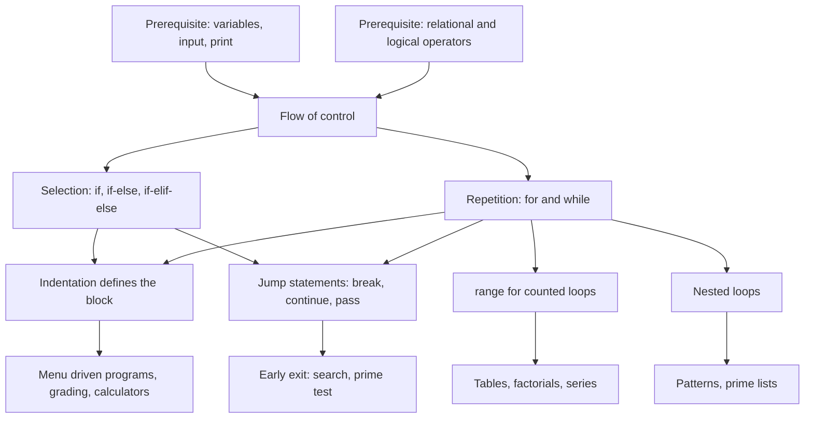
```mermaid
flowchart TD
    P1["Prerequisite: variables, input, print"] --> P3["Flow of control"]
    P2["Prerequisite: relational and logical operators"] --> P3
    P3 --> C1["Selection: if, if-else, if-elif-else"]
    P3 --> C2["Repetition: for and while"]
    C1 --> C3["Indentation defines the block"]
    C2 --> C3
    C2 --> C4["range for counted loops"]
    C1 --> C5["Jump statements: break, continue, pass"]
    C2 --> C5
    C2 --> C6["Nested loops"]
    C3 --> A1["Menu driven programs, grading, calculators"]
    C4 --> A2["Tables, factorials, series"]
    C5 --> A3["Early exit: search, prime test"]
    C6 --> A4["Patterns, prime lists"]
```

- Everything downstream of "Flow of control" splits into exactly two structures: selection and repetition.
- Indentation is not a separate topic; it is the mechanism both selection and repetition use to mark their bodies.

---

## 6.1 Introduction — what "flow of control" means

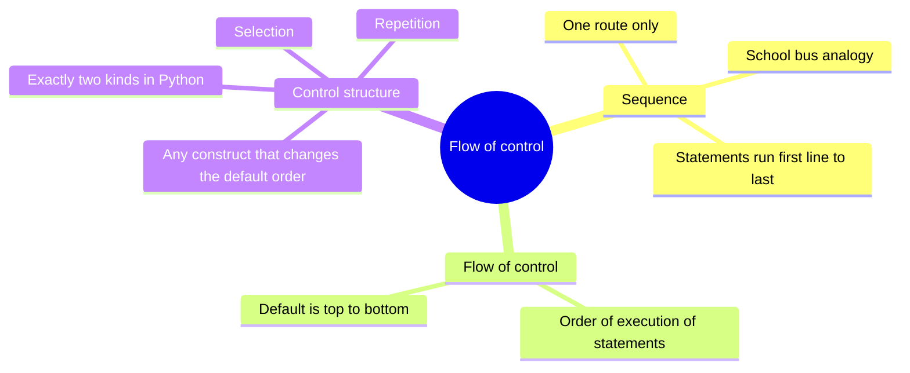
```mermaid
mindmap
  root((Flow of control))
    Sequence
      One route only
      School bus analogy
      Statements run first line to last
    Flow of control
      Order of execution of statements
      Default is top to bottom
    Control structure
      Any construct that changes the default order
      Exactly two kinds in Python
      Selection
      Repetition
```

- NCERT opens with a school bus following one fixed road from milestone to milestone.
- There is only one route, so the order of arrival is fixed.
- That fixed order is sequence: Python executes one statement after another, first line to last.
- Flow of control: the order in which the statements of a program are executed.
- Left alone, flow of control is top to bottom.
- A control structure is any construct that changes flow of control.
- Python has exactly two control structures: selection and repetition.

### Program 6-1 — Difference of two numbers ([NCERT] Program 6-1)

- Prints the difference of two numbers entered by the user.
- Pure sequence — no decision, no repetition.

```python
#Program 6-1
#Program to print the difference of two input numbers
num1 = int(input("Enter first number: "))
num2 = int(input("Enter second number: "))
diff = num1 - num2
print("The difference of",num1,"and",num2,"is",diff)
```

```text
Enter first number: 5
Enter second number: 7
The difference of 5 and 7 is -2
```

- `5 - 7` is `-2`; the program is correct.
- A "difference" is usually meant to be positive; the answer here may not be what was wanted.
- Fixing that needs a decision — see §6.2.
- Trap: `input()` always returns a string.
- Without `int()`, `num1 - num2` raises `TypeError: unsupported operand type(s) for -: 'str' and 'str'`.
- The `int()` conversion is not decoration — it is required.

### 6.1a CPU framing (Supp.)

- [CSP-XI] frames decision-making in hardware terms.
- Every statement of a program is executed by the CPU.
- The CPU has three parts: ALU (Arithmetic Logic Unit), CU (Control Unit), MU (Memory Unit).
- The ALU handles all mathematical operations and conversions.
- The ALU's logic half is what lets a computer evaluate a condition as true or false.
- Writing an `if` statement is how a programmer hands work to the ALU's logic half.
- Everyday example: "If it is raining, I will use an umbrella so that I don't get wet."
- If the condition is true (it is raining), take the umbrella.
- If the condition is false, do not take the umbrella.
- This is called branching.
- A bare `if` only covers the true half of a decision — that limitation is removed by `if..else` (§6.2.2).

### 6.1b Types of statements in Python (Supp.)

- [NCERT] does not classify statements; [CSP-XI] does, and the vocabulary is examinable.

| Type | What it is | Example |
| ---- | ---------- | ------- |
| Empty statement | A placeholder that does nothing; Python has no empty blocks, so a block needing no action still needs a statement | `pass` |
| Simple statement | A single logical statement: an assignment, an expression, a call | `x = 10`, `x = 10 + 15`, `print(name)` |
| Compound statement | A header line ending in a colon, plus an indented body of one or more statements | `if`, `while`, `for`, `def` blocks |

```text
<compound statement header>:
    <one or more simple or compound statements,
     all indented to the same level>
```

- Every control structure in this chapter is a compound statement.
- The header ends with a colon.
- The body is indented.

### 6.1c The three control-flow categories (Supp.)

- Sequence — statements run in written order, no jumps.
- Selection / Decision — a condition picks one block out of two or more alternatives (`if..else`).
- Iteration / Looping — a block runs repeatedly while a condition holds (`for`, `while`).
- The set of statements repeated is the body of the loop.
- One pass through the body is an iteration.
- The condition that ends the loop is the exit condition or test condition.

---

## 6.2 Selection

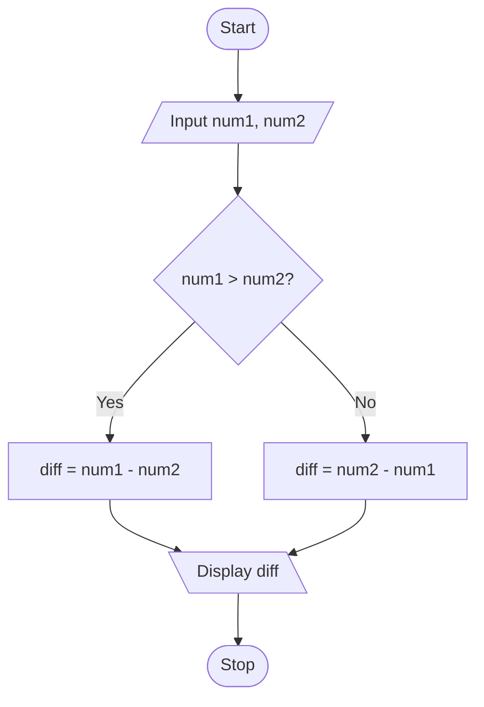
```mermaid
flowchart TD
    A([Start]) --> B[/"Input num1, num2"/]
    B --> C{"num1 > num2?"}
    C -->|Yes| D["diff = num1 - num2"]
    C -->|No| E["diff = num2 - num1"]
    D --> F[\"Display diff"\]
    E --> F
    F --> G([Stop])
```

- A decision means choosing one of two or more possible options.
- Example: ₹10 to buy a pen, several pens priced at ₹10 each — must decide which to buy.
- Example: a digital map offers a least-crowded route and a shortest route — must select one.
- In Python, decision-making is the `if` family.
- The diamond in the flowchart is the only place the path splits.
- Both branches rejoin before the output.
- Exactly one of the two branches runs — never both, never neither.
- That single-path guarantee is the defining property of selection.

### 6.2.1 The `if` statement

```text
if condition:
    statement(s)
```

- The condition is followed by a colon; the colon is not optional.
- The statement(s) below are indented (4 spaces is standard).
- Indentation is what says a statement belongs to the `if`.
- If the condition is `True`, the indented block runs.
- If the condition is `False`, the block is skipped entirely.
- Control moves to the first un-indented line after a skipped block.
- There is no limit on how many statements the block may contain.
- Brackets around the condition, e.g. `if (age >= 18):`, are legal but not required.

#### Example 6.1 — Voting eligibility ([NCERT] Example 6.1)

```python
age = int(input("Enter your age "))
if age >= 18:
    print("Eligible to vote")
```

- For input `10`, nothing is printed at all.
- The program ends without telling the user anything.
- That silence is a usability flaw, not a bug.
- It is the reason `else` exists.

### 6.2.2 The `if..else` statement

- `if` alone has no answer for the `False` case.
- `if..else` supplies one.
- Exactly one of the two blocks always runs.

```text
if condition:
    statement(s)
else:
    statement(s)
```

```python
age = int(input("Enter your age: "))
if age >= 18:
    print("Eligible to vote")
else:
    print("Not eligible to vote")
```

```text
Enter your age: 10
Not eligible to vote
```

#### Program 6-2 — Positive difference of two numbers ([NCERT] Program 6-2)

- Fixes Program 6-1 so it always prints a positive difference.
- Subtracts the smaller number from the bigger one.
- One decision, two branches — matches the flowchart at the top of §6.2.

```python
#Program 6-2
#Program to print the positive difference of two numbers
num1 = int(input("Enter first number: "))
num2 = int(input("Enter second number: "))
if num1 > num2:
    diff = num1 - num2
else:
    diff = num2 - num1
print("The difference of",num1,"and",num2,"is",diff)
```

```text
Enter first number: 5
Enter second number: 6
The difference of 5 and 6 is 1
```

- `num1 == num2` falls into the `else` branch and gives `0`.
- A two-way `if..else` leaves no case uncovered, unlike a bare `if`.

### 6.2.2a Four standard `if..else` programs (Supp.)

- All four are the same two-way shape with a different condition.
- They appear in question papers constantly.

**1. Odd or even** ([CSP-XI] PI-4).

- The test is always the remainder operator, never division.

```python
x = int(input("Enter no: "))
if (x % 2 == 0):
    print("Even number")
else:
    print("Odd number")
```

```text
Enter no: 20
Even number
```

**2. Absolute value** ([CSP-XI] PI-5).

```python
#Program to find absolute value of a number in Python
x = int(input("Enter the number: "))
if x > 0:
    print("absolute value is", x)
else:
    print("absolute value is", -x)
```

```text
Enter the number: -50
absolute value is 50
```

- The condition is `x > 0`.
- `0` falls into the `else` branch and prints `-0`.
- For an integer, `-0` is `0`, so the program is right, but by luck rather than by design.
- `x >= 0` says what was actually meant.

**3. Divisibility** ([CSP-XI] PI-6).

```python
#Program to check divisibility of a number
print("Enter a Number (Numerator): ")
numn = int(input())
print("Enter a Number (denominator): ")
numd = int(input())
if numn % numd == 0:
    print("\n" + str(numn) + " is divisible by " + str(numd))
else:
    print("\n" + str(numn) + " is not divisible by " + str(numd))
```

```text
Enter a Number (Numerator): 
20
Enter a Number (denominator): 
13

20 is not divisible by 13
```

- `+` concatenates strings.
- `str(numn)` is required for that reason.
- `+` raises `TypeError` on mixed `str` and `int`.
- `print("...", numn, "...")` uses commas instead and needs no conversion.
- Trap: entering `0` as the denominator raises `ZeroDivisionError: integer division or modulo by zero`.
- That is a runtime error — the program starts fine and dies mid-way.
- Neither book guards against it; a real program would add `if numd != 0:`.

**4. Weekly pay** ([CSP-XI] 6.5.2, Example 1) — the book's only example with a flowchart alongside its code.

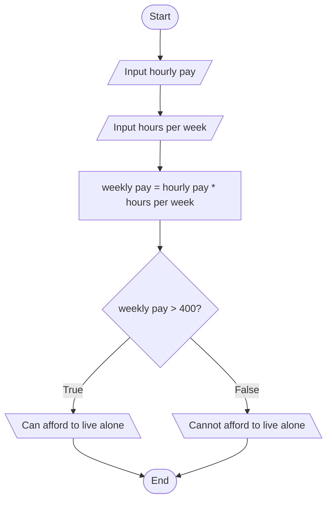
```mermaid
flowchart TD
    A([Start]) --> B[/"Input hourly pay"/]
    B --> C[/"Input hours per week"/]
    C --> D["weekly pay = hourly pay * hours per week"]
    D --> E{"weekly pay > 400?"}
    E -->|True| F[\"Can afford to live alone"\]
    E -->|False| G[\"Cannot afford to live alone"\]
    F --> H([End])
    G --> H
```

```python
hourlypay = int(input("How much do you earn per hour?"))
hoursperweek = int(input("How many hours a week do you work?"))
weeklypay = hourlypay * hoursperweek
if weeklypay > 400:
    print("You can afford to live alone.")
else:
    print("You can't afford to live alone.")
```

```text
How much do you earn per hour?12
How many hours a week do you work?40
You can afford to live alone.
```

- The calculation happens before the decision, not inside it.
- Standard shape: compute a value, then branch on it.
- Do not duplicate the arithmetic inside both branches.

### 6.2.3 The `if..elif..else` ladder

- Chaining is clearer than nesting when there are more than two outcomes.
- `elif` is short for "else if".

```text
if condition:
    statement(s)
elif condition:
    statement(s)
elif condition:
    statement(s)
else:
    statement(s)
```

- Conditions are tested in order, top to bottom.
- The moment one condition is `True`, its block runs.
- The whole ladder ends at that point — no later condition is evaluated.
- `else` is optional.
- The number of `elif`s depends only on how many cases there are.
- "First true branch wins" is why ladder order matters.
- "First true branch wins" is also why overlapping conditions are not automatically a bug.

#### Example 6.2 — Positive, negative or zero ([NCERT] Example 6.2)

```python
number = int(input("Enter a number: "))
if number > 0:
    print("Number is positive")
elif number < 0:
    print("Number is negative")
else:
    print("Number is zero")
```

- As printed in NCERT, the first line is `number = int(input("Enter a number: ")` — one closing parenthesis short.
- That is a syntax error: `SyntaxError: '(' was never closed`.
- Python refuses to run the file at all.
- The version above is corrected.

#### Example 6.3 — Traffic signal ([NCERT] Example 6.3)

```python
signal = input("Enter the colour: ")
if signal == "red" or signal == "RED":
    print("STOP")
elif signal == "orange" or signal == "ORANGE":
    print("Be Slow")
elif signal == "green" or signal == "GREEN":
    print("Go!")
```

- There is no `else`; typing `blue` prints nothing.
- `signal` is not passed through `int()` — it is meant to stay a string.

#### PI-7 — Grade from percentage ([CSP-XI] PI-7)

```python
# A program to accept percentage of a student and display grade
perc = float(input("enter percentage of a student : "))
if perc > 85:
    print('A')
elif perc > 70 and perc <= 85:
    print('B')
elif perc > 60 and perc <= 70:
    print('C')
elif perc > 45 and perc <= 60:
    print('D')
else:
    print('E')
```

```text
enter percentage of a student : 78
B
```

- `perc > 85` is `False`.
- `78 > 70 and 78 <= 85` is `True`, so `'B'` prints.
- Conditions 3 and 4 are never tested.
- The `and perc <= 85` half of condition 2 is redundant.
- Control only reaches the second test when the first was `False`, i.e. when `perc <= 85` already.
- `elif perc > 70:` gives identical behaviour.
- Keeping the upper bound is a readability choice, not a correctness one.

#### PI-8 — Income tax slabs ([CSP-XI] PI-8)

```python
# program to accept salary and calculate tax amount
salary = int(input("Enter salary of a person : "))
if salary <= 50000:
    tax = 0.05*salary
elif salary <= 60000:
    tax = 0.07*salary
elif salary <= 70000:
    tax = 0.08*salary
else:
    tax = 0.10*salary
print("Salary : ", salary, " Tax : ", tax)
```

```text
Enter salary of a person : 65000
Salary :  65000  Tax :  5200.0
```

- `65000 <= 50000` is `False`.
- `65000 <= 60000` is `False`.
- `65000 <= 70000` is `True`, so `tax = 0.08 × 65000 = 5200.0`.
- Each `elif` carries only an upper bound — no `and salary > 60000` is needed.
- Control only reaches the third test when the first two were `False`, so the lower bound is already guaranteed.
- This is the cleanest way to write slab-based conditions.
- Ladder order matters: write slabs in increasing order or the wrong rate wins.

### 6.2.4 Nested `if`

- An `if..else` may sit inside another `if`, `elif`, or `else` block.
- This is nesting.
- Python places no limit on nesting depth.

#### Program 6-3 — Four-function calculator ([NCERT] Program 6-3)

- Accepts two numbers and an operator (`+`, `-`, `*`, `/`).
- Returns the result, keeping the difference always positive, and refusing division by zero.
- Structure: an `if..elif..else` ladder over the operator, with a nested `if..else` inside the `"-"` and `"/"` branches.

```python
#Program to create a four function calculator
result = 0
val1 = float(input("Enter value 1: "))
val2 = float(input("Enter value 2: "))
op = input("Enter any one of the operator (+,-,*,/): ")
if op == "+":
    result = val1 + val2
elif op == "-":
    if val1 > val2:
        result = val1 - val2
    else:
        result = val2 - val1
elif op == "*":
    result = val1 * val2
elif op == "/":
    if val2 == 0:
        print("Error! Division by zero is not allowed. Program terminated")
    else:
        result = val1/val2
else:
    print("Wrong input,program terminated")
print("The result is ",result)
```

```text
Enter value 1: 84
Enter value 2: 4
Enter any one of the operator (+,-,*,/): /
The result is  21.0
```

- `val1` and `val2` were read with `float()`.
- `84.0 / 4.0` is `21.0` — a float.
- `/` is true division in Python 3.
- The program prints `21.0`, not `21`.
- With `val2 = 0` and `op = "/"`: the error message prints, and then `The result is  0` also prints.
- `result` was never reassigned in that branch, and the final `print` is outside the ladder.
- The word "terminated" in the message is misleading — the program does not actually stop.
- Fixing this needs `exit()` or a restructure.
- Spec mismatch (New): NCERT states four requirements for Program 6-3 before giving the code.
- Requirement 1: accept two numbers from the user.
- Requirement 2: ask for one of `+ - * /`; error message for anything else.
- Requirement 3: display only the positive difference for `-`.
- Requirement 4: display the message "Please enter a value other than 0" if the second number is `0` and `/` is entered.
- The code satisfies requirements 1–3.
- The code does not satisfy requirement 4 — it prints a different message instead, and does not actually terminate.
- An `else` pairs with the nearest `if` at the same indentation level.
- Indentation alone decides which `if` an `else` belongs to.

#### PI-10 — Zero, positive or negative, by nesting ([CSP-XI] PI-10)

```python
num = float(input("Enter a number: "))
if num >= 0:
    if num == 0:
        print("Zero")
    else:
        print("Positive number")
else:
    print("Negative number")
```

```text
Enter a number: 5
Positive number
```

- NCERT Example 6.2 reaches the same three outcomes with a flat `if..elif..else`.
- Both approaches are correct.
- The flat ladder is easier to read.
- [CSP-XI] itself advises avoiding deep nesting "as far as possible".

#### Nested `if..elif..else` ([CSP-XI] 6.5.4)

- The nested form lets an entire ladder sit inside one branch of an outer decision.

```python
var = 100
if var < 200:
    print("value is less than 200")
    if var == 150:
        print("Which is 150")
    elif var == 100:
        print("Which is 100")
    elif var == 50:
        print("Which is 50")
    elif var < 50:
        print("value is less than 50")
else:
    print("Could not find true countenance")
print("Good bye!")
```

```text
value is less than 200
Which is 100
Good bye!
```

- Two lines come from inside the outer `if` (the outer condition was `True`).
- That `print` is un-indented.
- `"Good bye!"` therefore comes from outside the outer `if`.
- `"Could not find true countenance"` is unreachable for any `var` below 200.

#### PI-9 — Sort three numbers into ascending order ([CSP-XI] PI-9)

```python
#Program to sort three inputted numbers and arrange them in ascending order.
x = int(input("Enter first number: "))
y = int(input("Enter second number: "))
z = int(input("Enter third number: "))
if y >= x <= z:
    if y <= z:
        min, mid, max = x, y, z
    else:
        min, mid, max = x, z, y
elif x >= y <= z:
    if x <= z:
        min, mid, max = y, x, z
    else:
        min, mid, max = y, z, x
elif x >= z <= y:
    if x <= y:
        min, mid, max = z, x, y
    else:
        min, mid, max = z, y, x
print("Numbers in ascending order = ", min, mid, max)
```

```text
Enter first number: 67
Enter second number: 5
Enter third number: 14
Numbers in ascending order =  5 14 67
```

- `y >= x <= z` is not a typo — Python allows chained comparisons.
- It means exactly `y >= x and x <= z`, i.e. "`x` is the smallest".
- The outer ladder picks the smallest of the three; each nested `if` then orders the remaining two.
- Most other languages would evaluate `y >= x` to a boolean, then compare that boolean to `z`.
- `min` and `max` are built-in function names; assigning to them shadows the built-ins for the rest of the program.
- Rename them `smallest` / `largest`.
- The ladder has no final `else`.
- If some ordering slipped through, `print` would fail with `NameError`.
- As written, the three conditions do cover every ordering, but relying on that silently is fragile.

#### Practice 6-A — the leap-year program has a hole (New)

- [CSP-XI] Solved Question 13 gives this code and asks for the output for inputs 2000 and 1971.

```python
year = int(input('Enter 4-digit year:'))
if year % 100 == 0:
    if year % 400 == 0:
        print('Leap year')
elif year % 4 == 0:
    print('Leap year')
else:
    print("Not a leap year")
```

- The book's answers — `Leap year` for 2000, `Not a leap year` for 1971 — are both correct.
- Trace `1900`: `1900 % 100 == 0` is `True`, so control enters the outer `if`.
- `1900 % 400 == 0` is `False`.
- The inner `if` has no `else`.
- The outer `elif` / `else` are unreachable once the outer `if` was taken.
- The program prints nothing at all for `1900`.
- This is a logical error, not a syntax one — it runs silently.

```python
year = int(input('Enter 4-digit year: '))
if year % 400 == 0:
    print('Leap year')
elif year % 100 == 0:
    print('Not a leap year')
elif year % 4 == 0:
    print('Leap year')
else:
    print('Not a leap year')
```

```text
Enter 4-digit year: 1900
Not a leap year
```

- Ordering the divisibility tests 400 → 100 → 4 makes every branch reachable.
- This ordering removes the nesting entirely.

---

## 6.3 Indentation

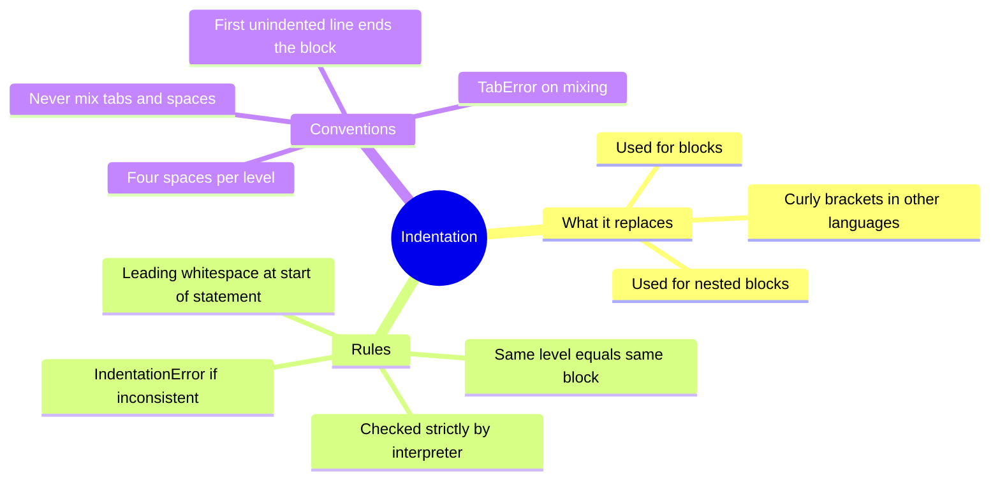
```mermaid
mindmap
  root((Indentation))
    What it replaces
      Curly brackets in other languages
      Used for blocks
      Used for nested blocks
    Rules
      Leading whitespace at start of statement
      Same level equals same block
      Checked strictly by interpreter
      IndentationError if inconsistent
    Conventions
      Four spaces per level
      Never mix tabs and spaces
      TabError on mixing
      First unindented line ends the block
```

- Most languages wrap a block in curly brackets.
- Python uses indentation instead, for blocks and for nested blocks.
- Indentation is the leading whitespace (spaces or tabs) at the start of a statement.
- Statements at the same level of indentation form one block.
- The interpreter checks indentation strictly.
- Inconsistent indentation raises `IndentationError`.
- Convention: use 4 spaces per level.
- NCERT and [CSP-XI] both describe one tab per level; 4 spaces is the PEP 8 standard and what most editors insert for a tab.
- Never mix tabs and spaces in the same file.
- Tabs and spaces look identical on screen; Python treats them as different.
- Mixing them produces `TabError`, or worse, a block that silently contains the wrong statements.
- The first un-indented line marks the end of a block.

### Program 6-4 — Larger of two numbers, with two-statement blocks ([NCERT] Program 6-4)

```python
#Program 6-4
#Program to find larger of the two numbers
num1 = 5
num2 = 6
if num1 > num2:                          #Block1
    print("first number is larger")
    print("Bye")
else:                                    #Block2
    print("second number is larger")
    print("Bye Bye")
```

```text
second number is larger
Bye Bye
```

- `5 > 6` is `False`, so Block1 is skipped entirely.
- Both lines of Block2 run.
- If `print("Bye")` and `print("Bye Bye")` were un-indented, they would sit outside the `if..else`.
- Un-indented, both would run every time, adding two extra lines to the output.
- Indentation alone decides this outcome.

### 6.3a How the interpreter reads nesting (Supp.)

```python
statement_1                # block 1
if condition_a:            # block 1
    if condition_b:        # block 2
        statement_2        # block 3
    else:                  # block 2
        statement_3        # block 3
statement_4                # block 1
```

- `statement_1`, the outer `if` header, and `statement_4` are all in block 1.
- If `condition_a` is `False`, control jumps straight to `statement_4`.
- The nested `if..else` headers are block 2.
- `statement_2` and `statement_3` are block 3.
- Exactly one of `statement_2` / `statement_3` runs, and only when `condition_a` was `True`.

---

## 6.4 Repetition

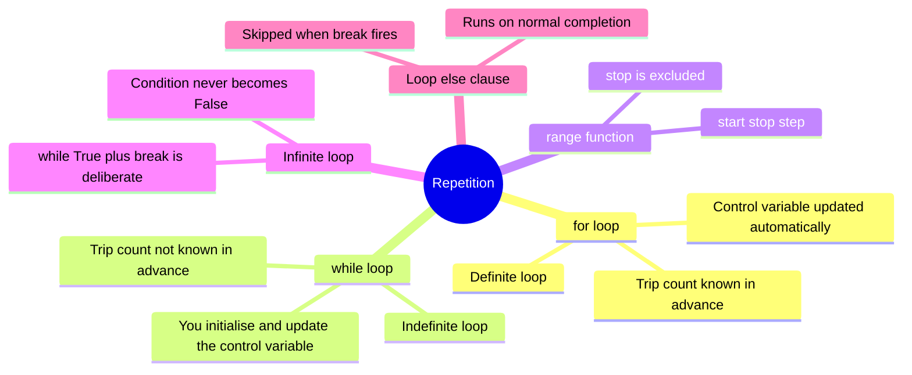
```mermaid
mindmap
  root((Repetition))
    for loop
      Definite loop
      Trip count known in advance
      Control variable updated automatically
    while loop
      Indefinite loop
      Trip count not known in advance
      You initialise and update the control variable
    range function
      start stop step
      stop is excluded
    Infinite loop
      Condition never becomes False
      while True plus break is deliberate
    Loop else clause
      Runs on normal completion
      Skipped when break fires
```

- Real processes repeat: paying an electricity bill every month, a butterfly's egg to caterpillar to pupa to butterfly to egg cycle.
- Code repeats too.
- Printing the first five natural numbers with five `print()` calls works.

```python
#Program 6-5
#Print first five natural numbers
print(1)
print(2)
print(3)
print(4)
print(5)
```

- Printing the first 100,000 natural numbers this way would need 100,000 lines.
- A loop is the alternative.
- Loop logic: take a variable `count`, set its value to 1.
- Print the value of `count`.
- Increment the variable (`count += 1`).
- Repeat printing and incrementing as long as `count <= 100000`.
- A loop's condition is checked against a control variable.
- The programmer is responsible for making that condition eventually become `False` — the exit condition.
- Without an exit condition, the loop never ends.
- Python has two looping constructs: `for` and `while`.
- The choice between them is usually decided before writing a line of code.

| | `for` | `while` |
| --- | --- | --- |
| Called | definite loop | indefinite loop |
| Repeats | over the items of a sequence or range | as long as a condition stays `True` |
| Trip count | known in advance | not known in advance |
| Control variable | updated automatically by the loop | you must initialise and update it |
| Natural fit | "do this 10 times", "for each character" | "keep going until the user enters a negative number" |

### 6.4.1 The `for` loop

```text
for <control-variable> in <sequence / items in range>:
    <statements inside body of the loop>
```

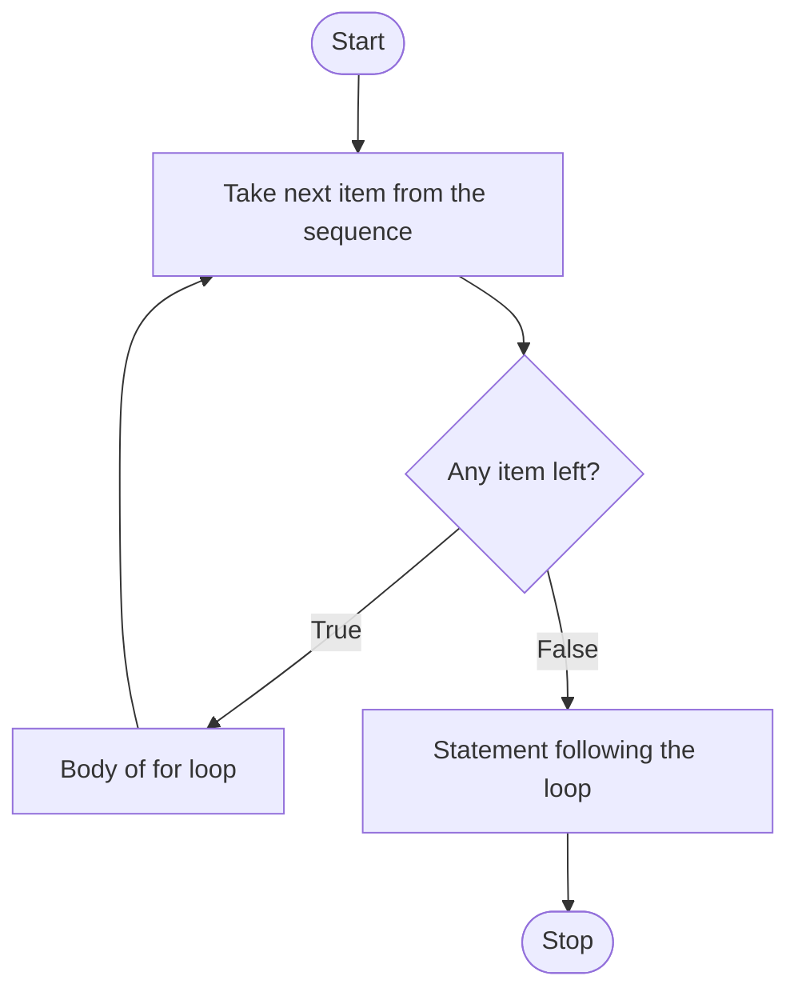
```mermaid
flowchart TD
    A([Start]) --> B["Take next item from the sequence"]
    B --> C{"Any item left?"}
    C -->|True| D["Body of for loop"]
    D --> B
    C -->|False| E["Statement following the loop"]
    E --> F([Stop])
```

- The `for` loop runs once for each item in the sequence.
- With every iteration the control variable takes the next value.
- When the items are exhausted, the body stops running and control passes to the first statement after the loop.
- The sequence may be a string, a list, a tuple, or a `range`.
- There is no separate "update" step to write — advancing to the next item is the loop mechanism itself.

#### Program 6-6 — Characters of a string ([NCERT] Program 6-6)

```python
#Print the characters in word PYTHON using for loop
for letter in 'PYTHON':
    print(letter)
```

```text
P
Y
T
H
O
N
```

#### Program 6-7 — Items of a list ([NCERT] Program 6-7)

```python
#Print the given sequence of numbers using for loop
count = [10,20,30,40,50]
for num in count:
    print(num)
```

```text
10
20
30
40
50
```

#### Program 6-8 — Even numbers in a sequence ([NCERT] Program 6-8)

```python
#Print even numbers in the given sequence
numbers = [1,2,3,4,5,6,7,8,9,10]
for num in numbers:
    if (num % 2) == 0:
        print(num,'is an even Number')
```

```text
2 is an even Number
4 is an even Number
6 is an even Number
8 is an even Number
10 is an even Number
```

- The `if` is inside the loop body, so it is evaluated once per item.
- Ten tests, five prints.
- Two levels of indentation are in play: the loop body is one level in, the `if` body is two.

#### PI-11 — Iterating over a string of digits ([CSP-XI] PI-11)

```python
# Python program to illustrate for loop statement
for i in '123':
    print("Welcome", i, "times")        # body of for loop
```

```text
Welcome 1 times
Welcome 2 times
Welcome 3 times
```

- Trap: the loop variable `i` here is the character `'1'`, not the integer `1`.
- `i` only looks numeric.
- `i + 1` raises `TypeError: can only concatenate str (not "int") to str`.
- `i * 2` gives `'11'`, not `2`.
- The string has three characters.
- The loop runs 3 times.
- `for i in range(1, 4)` gives the same three lines with genuine integers.

### 6.4.1a The `range()` function — [NCERT] labels this 6.4.1(B)

- `range()` is a built-in function that produces a sequence of integers.

```text
range([start], stop[, step])
```

- Rule 1: `stop` is excluded. `range(1, 11)` gives 1 to 10, not 1 to 11.
- Rule 2: omitted `start` defaults to 0; omitted `step` defaults to 1.
- Rule 3: all three arguments must be integers; `step` may be positive or negative but never zero.

| Call | Values generated |
| ---- | ---------------- |
| `range(10)` | `0, 1, 2, 3, 4, 5, 6, 7, 8, 9` |
| `range(1, 11)` | `1, 2, 3, 4, 5, 6, 7, 8, 9, 10` |
| `range(2, 10)` | `2, 3, 4, 5, 6, 7, 8, 9` |
| `range(0, 30, 5)` | `0, 5, 10, 15, 20, 25` |
| `range(0, -9, -1)` | `0, -1, -2, -3, -4, -5, -6, -7, -8` |

- In Python 3, `range()` returns a lazy range object, not a list.
- `list(range(10))` shows the values in the shell.

```python
>>> list(range(10))
[0, 1, 2, 3, 4, 5, 6, 7, 8, 9]
>>> list(range(0, 30, 5))
[0, 5, 10, 15, 20, 25]
```

- Counting trick: the number of values in `range(a, b, s)` with `s > 0` is `(b - a + s - 1) // s`.
- For `range(1, 51, 3)` that is `(51 - 1 + 2) // 3 = 17` values, ending at 49.
- [CSP-XI] Solved Question 16 answers "16 times" for this — the correct count is 17.
- Verified by `len(list(range(1,51,3)))`.

#### Program 6-9 — Multiples of 10 ([NCERT] Program 6-9)

```python
#Print multiples of 10 for numbers in a given range
for num in range(5):
    if num > 0:
        print(num * 10)
```

```text
10
20
30
40
```

- `range(5)` yields `0, 1, 2, 3, 4`.
- The `if num > 0` skips the `0`.
- Four lines print, not five.

#### PI-13 — Table of a number ([CSP-XI] PI-13)

```python
# Python program to print table of a number, say 3
num = 3
for i in range(1, 11):
    print(num, ' x ', i, ' = ', num*i)
```

```text
3  x  1  =  3
3  x  2  =  6
3  x  3  =  9
3  x  4  =  12
3  x  5  =  15
3  x  6  =  18
3  x  7  =  21
3  x  8  =  24
3  x  9  =  27
3  x  10  =  30
```

- `range(1, 11)` is the standard "1 through 10" idiom.
- The doubled spaces in the output are real.
- `print()` inserts its default separator (`sep=' '`) between arguments.
- The string arguments here already contain spaces of their own.

#### PI-14 — Factorial, the `range(num)` variant ([CSP-XI] PI-14)

```python
# Python program to accept a number from a user and print factorial of that number
num = int(input("Enter non negative no to take factorial of : "))
fact = 1
for i in range(num):
    fact = fact * (i+1)
print('Factorial of ', num, '= ', fact)
```

```text
Enter non negative no to take factorial of : 8
Factorial of  8 =  40320
```

- Compare with NCERT Program 6-19: `for i in range(1, num + 1): fact = fact * i`.
- Both multiply the same eight numbers.
- The `range(num)` form shifts the correction into the body as `i+1`.
- The `range(1, num+1)` form puts the correction in the header.
- Prefer the header form — a correction buried in the body is easy to misread.
- Both versions share a flaw: for a negative `num`, `range()` is empty and the program happily prints `Factorial of -5 = 1`.
- NCERT Program 6-19 guards against this with an `if num < 0:` branch.
- [CSP-XI]'s version has no such guard, despite its own prompt asking for a non-negative number.

#### One `range()` detail, two different answers (New)

```python
for n in range(5):
    print(n*10)
```

```text
0
10
20
30
40
```

- NCERT Program 6-9 uses the same `range(5)` but guards the body with `if num > 0:`.
- The guarded version prints only `10 20 30 40`.
- Same range, four lines versus five.
- The difference is entirely the guard.
- `range(5)` starting at `0` is what makes the guard necessary at all.

### 6.4.2 The `while` loop

```text
while test_condition:
    body of while
```

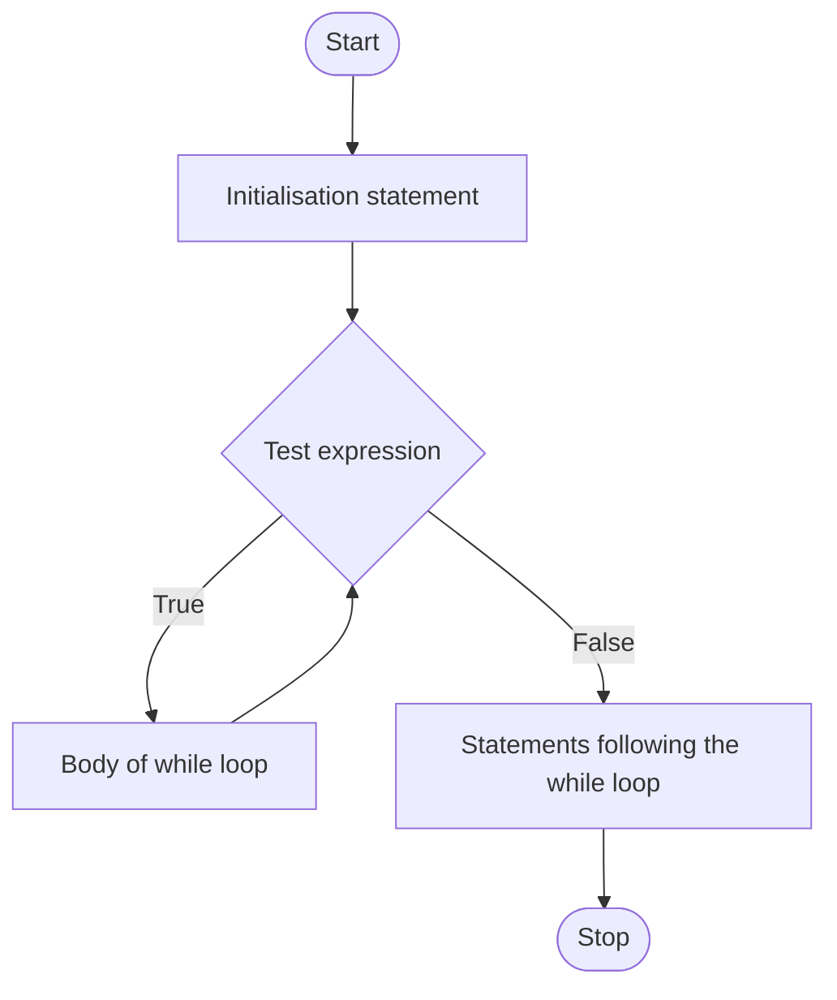
```mermaid
flowchart TD
    A([Start]) --> B["Initialisation statement"]
    B --> C{"Test expression"}
    C -->|True| D["Body of while loop"]
    D --> C
    C -->|False| E["Statements following the while loop"]
    E --> F([Stop])
```

- The condition is tested before any statement of the body runs.
- If the condition is `True`, the body runs; then the condition is tested again.
- When the condition becomes `False`, the body is skipped and control passes to the statement after the loop.
- Three things must all be present and correct: initialise before the loop, test at the top, update inside the body.
- Drop any one of the three and the loop either never runs or never stops.
- [CSP-XI]'s Fig. 6.5 caption says the body executes "until" the test expression evaluates to true — that is backwards.
- The body executes while the test expression is `True`; the loop ends when it becomes `False`.
- [CSP-XI] states this correctly elsewhere ("the loop continues as long as the condition remains true").
- If the condition is `False` the very first time it is tested, the body of a `while` loop never executes, not even once.
- Python treats any non-zero value as `True`.
- `0` and `None` are treated as `False`.
- `while 1:` and `while True:` behave identically.
- `while count:` ends exactly when `count` reaches `0`.
- At least one statement must be present in the loop body — `pass` counts.

#### Program 6-10 — First five natural numbers ([NCERT] Program 6-10)

```python
#Print first 5 natural numbers using while loop
count = 1
while count <= 5:
    print(count)
    count += 1
```

```text
1
2
3
4
5
```

- Initialisation (`count = 1`), test (`count <= 5`), update (`count += 1`) are all visible.
- Delete the update line and the condition stays `True` forever — see Infinite loops, §6.4.3.

#### Program 6-11 — Factors of a number ([NCERT] Program 6-11)

- Given a whole number from the user, finds all of its factors, on one line.
- 1 and the number itself are factors of everything, so they are printed outside the loop.
- Only `2` up to `num/2` need testing.
- No number larger than half of `num` (other than `num` itself) can divide it.

```python
#Find the factors of a number using while loop
num = int(input("Enter a number to find its factor: "))
print (1, end=' ')          #1 is a factor of every number
factor = 2
while factor <= num/2 :
    if num % factor == 0:
        print(factor, end=' ')
    factor += 1
print (num, end=' ')        #every number is a factor of itself
```

```text
Enter a number to find its factor: 6
1 2 3 6 
```

- `factor` runs 2, then 3 (since `3 <= 3.0`).
- `6 % 2` and `6 % 3` are both `0`, so both print.
- At `factor = 4`, `4 <= 3.0` is `False` and the loop ends.
- `end=' '` replaces the default `end='\n'`, keeping everything on one line.
- `factor += 1` sits at the loop-body level, not inside the `if`.
- Indent `factor += 1` one level further and `factor` would only increase when a factor was found.
- That deeper indentation would make an infinite loop for any `num` whose second-smallest factor is not 2.

### 6.4.3 Infinite loops (Supp.)

- A loop becomes an infinite loop when its condition never becomes `False`.
- Almost always caused by forgetting to update the control variable inside the body.

```python
#Program to illustrate the concept of infinite loop using while loop construct
var = 1
while var == 1:              # condition resulting in an infinite loop
    num = int(input("Enter a number: "))
    print("You entered : ", num)
print("Good bye")
```

- `var` is assigned `1` before the loop and never touched again.
- `var == 1` is permanently `True`.
- `print("Good bye")` is unreachable.
- Press `Ctrl + C` to interrupt a runaway program.

```python
a = 5
while a > 0:
    print(a)          # 'a' is never decreased -> runs forever
```

```python
i = 1
while i <= 10:
    print(i)
i += 1                # update is OUTSIDE the loop -> runs forever
```

- An infinite loop is not always a mistake.
- `while True:` with a `break` inside is a standard, deliberate pattern (NCERT Program 6-13, §6.5.1).

### 6.4.4 The loop `else` clause (Supp.)

- Python allows an `else` block attached to a loop.
- This does not exist in most other languages.
- Not covered by NCERT.

```text
for <control-variable> in <sequence>:
    <statements>
else:                       # optional
    <statements>

while <test_expression>:
    <body of while>
else:                       # optional
    <body of else>
```

- A loop's `else` runs when the loop finishes normally — the `for` exhausted its sequence, or the `while` condition became `False`.
- The loop's `else` is skipped entirely if the loop was left by `break`.
- Read it as "no-break", not as "otherwise".

```python
# Python program to demonstrate 'for' loop with else
for ch in 'GOA':
    print(ch)
else:
    print('Coming out of the loop')
```

```text
G
O
A
Coming out of the loop
```

```python
# Python program to illustrate while loop with else statement
x = 0
s = 0
while (x < 10):
    s = s + x
    x = x + 1
else:
    print("The sum of first nine integers is: ", s)
```

```text
The sum of first nine integers is:  45
```

- `x` runs 0 through 9, so `s = 0+1+...+9 = 45`.
- The double space before `45` is real: the string literal ends in a space and `print()` adds its default `sep=' '` as well.
- Source note: the message says "first nine integers" but the loop adds 0 through 9, which is ten values.
- The total is unaffected (adding 0 changes nothing), so the answer is right and the wording is loose.

```python
# Use of break statement inside loop in for..else statement
for val in "string":
    if val == "i":
        break
    print(val)
else:
    print("Bye")
```

```text
s
t
r
```

- `break` left the loop early.
- `"Bye"` never prints.
- Remove the `break` and `"Bye"` would print.
- This is the standard "searched the whole list and found nothing" idiom.

---

## 6.5 Jump statements — `break`, `continue`, `pass`

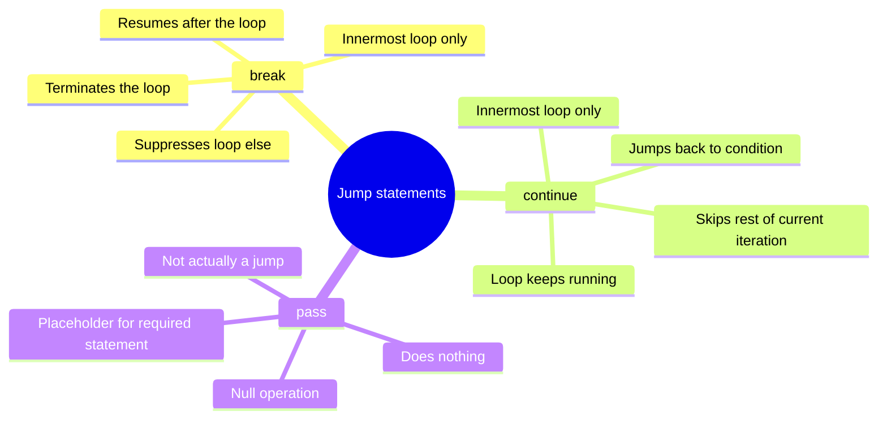
```mermaid
mindmap
  root((Jump statements))
    break
      Terminates the loop
      Resumes after the loop
      Innermost loop only
      Suppresses loop else
    continue
      Skips rest of current iteration
      Jumps back to condition
      Loop keeps running
      Innermost loop only
    pass
      Null operation
      Does nothing
      Placeholder for required statement
      Not actually a jump
```

- Sometimes you want to leave a loop early, or skip the rest of just this one pass.
- `break` and `continue` are Python's jump statements for those two cases.

### 6.5.1 The `break` statement

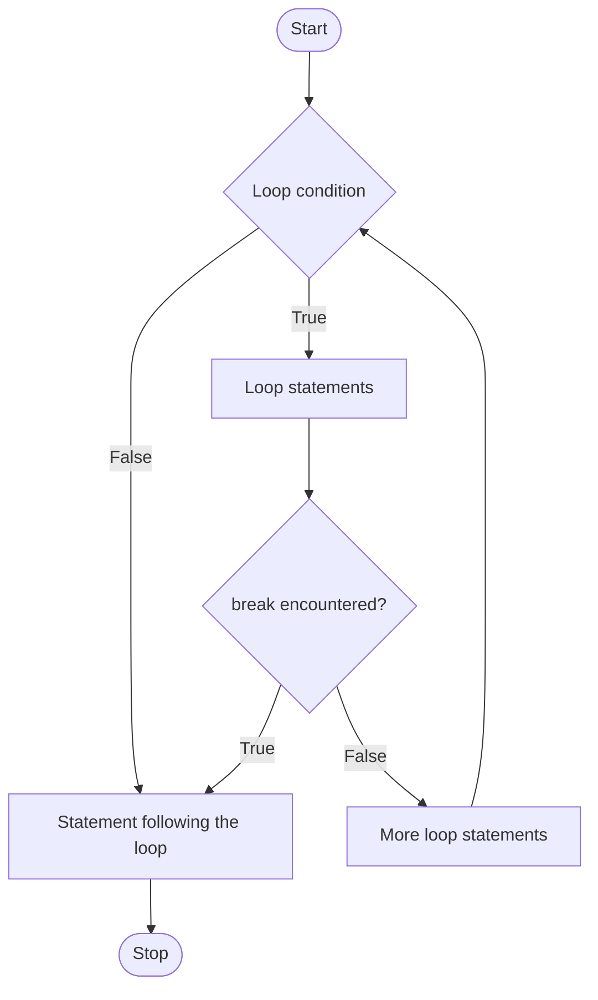
```mermaid
flowchart TD
    A([Start]) --> B{"Loop condition"}
    B -->|False| G["Statement following the loop"]
    B -->|True| C["Loop statements"]
    C --> D{"break encountered?"}
    D -->|True| G
    D -->|False| E["More loop statements"]
    E --> B
    G --> H([Stop])
```

- `break` terminates the loop that contains it.
- Execution resumes at the first statement after that loop.
- Any statements after `break`, inside the loop body, are skipped.
- In nested loops, `break` exits only the innermost loop containing it.
- `break` is the only arrow that leaves the loop body without passing back through the condition test.
- That is exactly why the loop's `else` clause is skipped when `break` fires.

#### Program 6-12 — Demonstrating `break` ([NCERT] Program 6-12)

```python
#Program to demonstrate the use of break statement in loop
num = 0
for num in range(10):
    num = num + 1
    if num == 8:
        break
    print('Num has value ' + str(num))
print('Encountered break!! Out of loop')
```

```text
Num has value 1
Num has value 2
Num has value 3
Num has value 4
Num has value 5
Num has value 6
Num has value 7
Encountered break!! Out of loop
```

- `range(10)` would give ten iterations.
- On the eighth, the reassigned `num` reaches `8` and `break` fires before the `print`.
- Seven lines print, then the message outside the loop.
- `num = 0` before the loop is dead code — `for num in range(10)` overwrites `num` immediately.
- Reassigning the control variable inside the body (`num = num + 1`) does not affect which value the loop supplies next.
- `range` hands over the next value regardless of body reassignment.

#### Program 6-13 — Sum until a negative number ([NCERT] Program 6-13)

- User enters numbers one at a time; a negative number means "stop".
- Finds the sum of the positive numbers entered.
- Trip count is unknown, and the stop condition depends on input that does not exist yet.
- `while True` plus `break` is the natural shape, not `for`.

```python
#Find the sum of all the positive numbers entered by the user
#till the user enters a negative number.
entry = 0
sum1 = 0
print("Enter numbers to find their sum, negative number ends the loop:")
while True:
    entry = int(input())        #int() typecasts string to integer
    if (entry < 0):
        break
    sum1 += entry
print("Sum =", sum1)
```

```text
Enter numbers to find their sum, negative number ends the loop:
3
4
5
-1
Sum = 12
```

- `3 + 4 + 5 = 12`.
- The `-1` triggers `break` before `sum1 += entry`, so it is not added.
- Ordering matters: swap those two lines and the answer becomes 11.
- Since `True` can never be `False`, `break` is the only exit.
- This is a deliberate infinite loop, not an accidental one.

#### Program 6-14 — Prime or not ([NCERT] Program 6-14), and a bug in it

```python
#Write a Python program to check if a given number is prime or not.
num = int(input("Enter the number to be checked: "))
flag = 0                          #presume num is a prime number
if num > 1 :
    for i in range(2, int(num / 2)):
        if (num % i == 0):
            flag = 1              #num is a not prime number
            break                 #no need to check any further
    if flag == 1:
        print(num , "is not a prime number")
    else:
        print(num , "is a prime number")
else :
    print("Entered number is <= 1, execute again!")
```

```text
Enter the number to be checked: 20
20 is not a prime number
```

```text
Enter the number to be checked: 19
19 is a prime number
```

```text
Enter the number to check: 2
2 is a prime number
```

```text
Enter the number to check: 1
Entered number is <= 1, execute again!
```

```text
Enter the number to be checked: 4
4 is a prime number
```

- For `num = 4`: `int(4 / 2)` is `2`, so the loop is `range(2, 2)` — empty.
- The body never runs, `flag` stays `0`, and the program wrongly reports `4` as prime.
- Gap (New): the loop stops one short. `range(2, int(num/2))` excludes `int(num/2)` itself.
- A composite number's smallest factor is at most `num/2`.
- That smallest factor is strictly less than `num/2` for every composite except 4.
- `4`'s smallest factor is exactly `4/2 = 2`.
- So `4` — and only `4` — is misclassified as prime.
- Verified by sweeping every `n` from 2 to 59 against a correct primality test; `4` is the sole disagreement.
- Fix 1: `for i in range(2, num // 2 + 1):` — include `num//2` in the search.
- Fix 2: `for i in range(2, int(num ** 0.5) + 1):` — faster, since no factor exceeds `sqrt(num)`.
- If `num = a * b` with `a <= b`, then `a <= sqrt(num)`.
- A factor above the square root can never be the first one found — this is why fix 2 is the better habit.

### 6.5.2 The `continue` statement

- `continue` skips the remaining statements in the current iteration.
- `continue` jumps back to the top of the loop for the next iteration.
- The loop does not terminate — only the current pass is cut short.

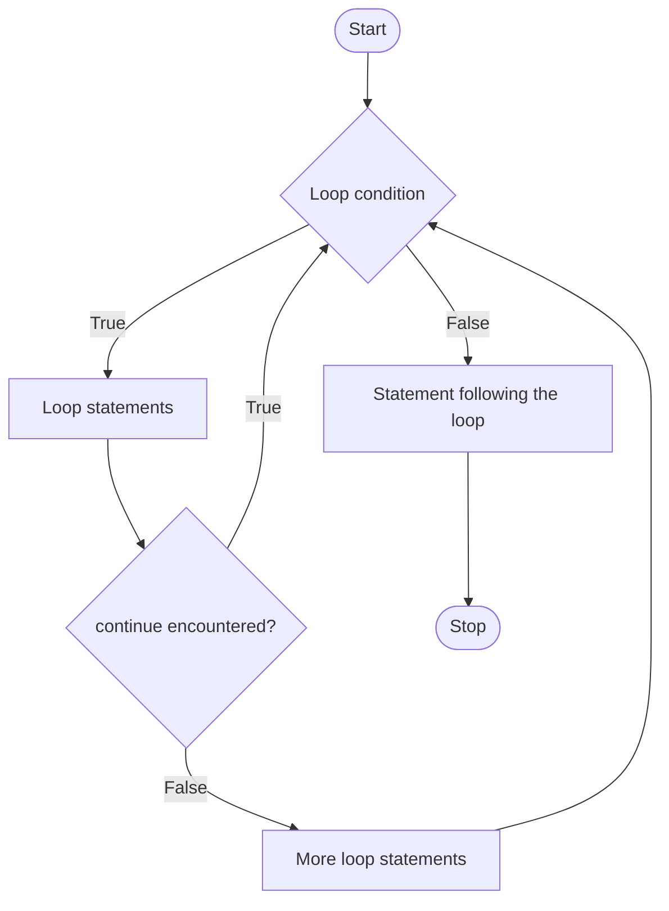
```mermaid
flowchart TD
    A([Start]) --> B{"Loop condition"}
    B -->|False| G["Statement following the loop"]
    B -->|True| C["Loop statements"]
    C --> D{"continue encountered?"}
    D -->|True| B
    D -->|False| E["More loop statements"]
    E --> B
    G --> H([Stop])
```

- Compared with the `break` flowchart, the only difference is where the "yes" arrow points.
- `break` leaves the loop; `continue` returns to the condition.

#### Program 6-15 — Demonstrating `continue` ([NCERT] Program 6-15)

```python
#Prints values from 0 to 6 except 3
num = 0
for num in range(6):
    num = num + 1
    if num == 3:
        continue
    print('Num has value ' + str(num))
print('End of loop')
```

```text
Num has value 1
Num has value 2
Num has value 4
Num has value 5
Num has value 6
End of loop
```

- `3` is missing, but `4`, `5`, `6` still print — proof that the loop survived.
- Replace `continue` with `break` and everything from `3` onwards disappears.

- Same contrast on a string ([CSP-XI] PI-20 and PI-24):

| Code | Output |
| ---- | ------ |
| `for val in "string": if val == "i": break; print(val)` then `print("Over")` | `s t r Over` (one per line) |
| `for val in "string": if val == "i": continue; print(val)` then `print("Over")` | `s t r n g Over` (one per line) |

- `break` loses everything from `i` onwards.
- `continue` loses only the `i`.

### 6.5.3 The `pass` statement (Supp.)

- `pass` is the empty statement — a null operation.
- `pass` does nothing at all.
- Python has no empty blocks.
- `pass` exists to fill a block that would otherwise be empty.
- Wherever a statement is syntactically required but no action is wanted, `pass` fills the slot.

```python
# pass is just a placeholder for any functionality to be added later.
sequence = ['p', 'a', 's', 's']
for val in sequence:
    pass
```

- No output — the loop iterates four times and does nothing each time.
- Typical uses: an `if` branch to handle later, a function or class body not yet written, deliberately ignoring a case inside a loop.
- `pass`, `continue`, and a comment are three different things.
- `pass` does nothing; control moves to the next statement in the block.
- `continue` does nothing and jumps to the next iteration, skipping the rest of the block.
- A comment is not a statement at all; leaving a block with only a comment causes `IndentationError: expected an indented block`.

---

## 6.6 Nested loops

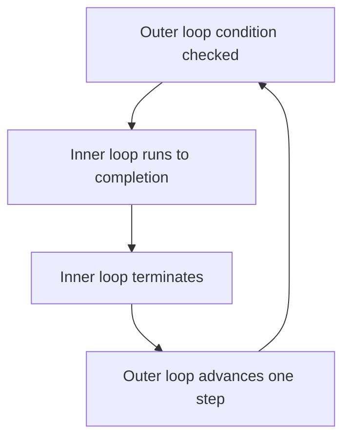
```mermaid
flowchart TD
    A["Outer loop condition checked"] --> B["Inner loop runs to completion"]
    B --> C["Inner loop terminates"]
    C --> D["Outer loop advances one step"]
    D --> A
```

- A loop inside another loop is a nested loop.
- For every single iteration of the outer loop, the inner loop runs to completion.
- The inner loop terminates first.
- The outer loop continues only after the inner loop has finished.
- Python places no restriction on how many loops may be nested or how deep.
- Any loop type may be nested in any other: `for` in `for`, `while` in `for`, `for` in `while`, `while` in `while`.
- The inner loop must use a different control variable from the outer loop.
- Reusing the same name makes the inner loop overwrite the outer loop's counter.
- Reusing the same name makes the outer loop's behaviour unpredictable.

### Program 6-16 — How nesting executes ([NCERT] Program 6-16)

```python
#Demonstrate working of nested for loops
for var1 in range(3):
    print( "Iteration " + str(var1 + 1) + " of outer loop")
    for var2 in range(2):        #nested loop
        print(var2 + 1)
    print("Out of inner loop")
print("Out of outer loop")
```

```text
Iteration 1 of outer loop
1
2
Out of inner loop
Iteration 2 of outer loop
1
2
Out of inner loop
Iteration 3 of outer loop
1
2
Out of inner loop
Out of outer loop
```

- Outer runs 3 times; inner runs 2 times per outer pass.
- 3 × 2 = 6 executions of `print(var2 + 1)`.
- That product is the total-iterations rule for nested loops.
- `"Out of inner loop"` is indented at the outer-loop-body level, so it prints three times.
- `"Out of outer loop"` is un-indented, so it prints once.

### Program 6-17 — Number pattern ([NCERT] Program 6-17)

- Given a number `n` from the user, prints a triangular pattern: `1` on row 1, `1 2` on row 2, up to row `n`.
- The outer loop counts rows.
- The inner loop's upper bound depends on the outer loop's variable.
- That dependency is what makes the triangle a triangle instead of a rectangle.

```python
#Program to print the pattern for a number input by the user
num = int(input("Enter a number to generate its pattern = "))
for i in range(1, num + 1):
    for j in range(1, i + 1):
        print(j, end = " ")
    print()
```

```text
Enter a number to generate its pattern = 5
1 
1 2 
1 2 3 
1 2 3 4 
1 2 3 4 5 
```

- On row `i`, the inner `range(1, i+1)` yields `1..i` — exactly `i` numbers.
- The bare `print()` at the outer body level supplies the line break that `end=" "` suppressed.
- Move that bare `print()` one level in and every number lands on its own line.

### Program 6-18 — Prime numbers from 2 to 50 ([NCERT] Program 6-18)

```python
#Use of nested loops to find the prime numbers between 2 to 50
num = 2
for i in range(2, 50):
    j = 2
    while ( j <= (i/2)):
        if (i % j == 0):    #factor found
            break           #break out of while loop
        j += 1
    if ( j > i/j) :         #no factor found
        print ( i, "is a prime number")
print ("Bye Bye!!")
```

```text
2 is a prime number
3 is a prime number
5 is a prime number
7 is a prime number
11 is a prime number
13 is a prime number
17 is a prime number
19 is a prime number
23 is a prime number
29 is a prime number
31 is a prime number
37 is a prime number
41 is a prime number
43 is a prime number
47 is a prime number
Bye Bye!!
```

- The `break` leaves only the inner `while`.
- The outer `for` carries on to the next `i`.
- This is precisely why a per-number test can live inside a range scan.
- Trace `i = 9`: `j = 2` (`9 % 2 = 1`, so `j = 3`), `3 <= 4.5` and `9 % 3 == 0` triggers `break` with `j = 3`.
- Then `3 > 9/3 = 3.0` is `False`, so nothing prints for 9.
- Trace `i = 5`: the `while` ends normally with `j = 3`.
- `3 > 5/3 ≈ 1.67` is `True`, so 5 prints.
- `num = 2` on line 1 is never used — dead code in the printed program.

### Program 6-19 — Factorial ([NCERT] Program 6-19)

```python
#The following program uses a for loop nested inside an if..else
#block to calculate the factorial of a given number
num = int(input("Enter a number: "))
fact = 1
# check if the number is negative, positive or zero
if num < 0:
    print("Sorry, factorial does not exist for negative numbers")
elif num == 0:
    print("The factorial of 0 is 1")
else:
    for i in range(1, num + 1):
        fact = fact * i
    print("factorial of ", num, " is ", fact)
```

```text
Enter a number: 5
factorial of  5  is  120
```

- `fact` accumulates `1×1×2×3×4×5 = 120`.
- This is the accumulator pattern: initialise outside the loop, update inside it.
- Same shape as `sum1` in NCERT Program 6-13, except the identity value is `1` for a product and `0` for a sum.
- NCERT prints the output line as `Factorial of  5  is  120` with a capital F.
- The code's own string is lowercase `"factorial of "`.
- The traced output above is what the code actually produces.

### PI-18 — Nested `while` ([CSP-XI] PI-18)

```python
i = 2
while (i >= 0):
    j = 2
    while (j >= 0):
        print(2, end=" ")
        j = j-1
    print()
    i = i-1
```

```text
2 2 2 
2 2 2 
2 2 2 
```

- Outer runs for `i = 2, 1, 0` (three times).
- Inner runs for `j = 2, 1, 0` (three times each pass) — nine `2`s in a 3 × 3 block.
- `j = 2` must be re-initialised inside the outer loop.
- Move `j = 2` above the outer `while` and the inner loop runs only on the first pass.
- `j` would already be `-1` on every pass after the first.
- That re-initialisation is the single most common nested-`while` bug.

---

## 6.7 Quick reference

### 6.7.1 Syntax cheat-sheet

| Construct | Syntax | Runs its body |
| --------- | ------ | ------------- |
| `if` | `if condition:` | once, if the condition is `True` |
| `if..else` | `if condition:` … `else:` | exactly one of the two blocks, always |
| `if..elif..else` | `if` … `elif` … `else:` | the first `True` branch only; `else` if none matched |
| Nested `if` | an `if` inside another block | depth is unlimited; pairing is set by indentation |
| `for` | `for var in sequence:` | once per item in the sequence |
| `while` | `while condition:` | repeatedly while the condition is `True`; possibly zero times |
| loop `else` | `else:` aligned with `for`/`while` | once, only if the loop ended without `break` |
| `break` | `break` | exits the innermost enclosing loop |
| `continue` | `continue` | skips to the next iteration of the innermost loop |
| `pass` | `pass` | nothing; a syntactic placeholder |
| `range` | `range([start], stop[, step])` | `start` defaults 0, `step` defaults 1, `stop` excluded |

### 6.7.2 Keywords introduced in this chapter

- Reserved words: `if` `elif` `else` `for` `while` `in` `break` `continue` `pass` `True` `False` `None`.
- `range` and `print` are built-in function names, not keywords.
- Python allows assignment to `range` or `print`, but doing so shadows the built-in and is bad practice.
- Casing is not negotiable: `True` and `False` are capitalised.
- `if`, `for`, `while`, `break` are lowercase.
- `IF` and `Print` are not Python.

### 6.7.3 Flowchart symbols

| Symbol | Meaning |
| ------ | ------- |
| Oval / stadium | Start, Stop |
| Parallelogram | Input, Output |
| Rectangle | Process (a calculation or assignment) |
| Diamond | Decision (the only symbol with two outgoing arrows) |

---

## 6.8 Points to ponder — the traps

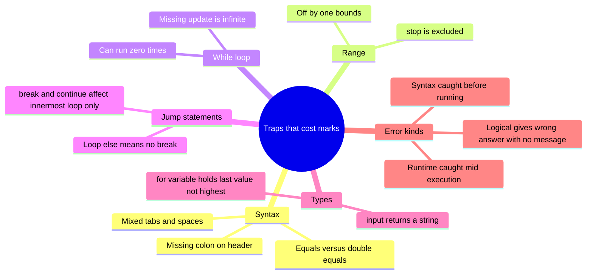
```mermaid
mindmap
  root((Traps that cost marks))
    Syntax
      Equals versus double equals
      Missing colon on header
      Mixed tabs and spaces
    Range
      stop is excluded
      Off by one bounds
    While loop
      Can run zero times
      Missing update is infinite
    Jump statements
      Loop else means no break
      break and continue affect innermost loop only
    Types
      input returns a string
      for variable holds last value not highest
    Error kinds
      Syntax caught before running
      Runtime caught mid execution
      Logical gives wrong answer with no message
```

- `=` is assignment, `==` is comparison. `if code = 'w':` is a `SyntaxError`, not a typo Python forgives.
- The colon is part of the header. `if x > 5` without `:` is a `SyntaxError`.
- `stop` is excluded from `range()`. "First 10 natural numbers" is `range(1, 11)`, never `range(1, 10)`.
- A `while` loop can run zero times. If the condition starts `False`, the body never executes.
- A `for` over an empty sequence behaves the same way — zero executions.
- Forgetting the update makes an infinite loop.
- Putting the update outside the loop body also makes an infinite loop.
- Putting the update inside an `if` that is not always taken also makes an infinite loop.
- Loop `else` means "no `break` happened" — not "otherwise".
- Loop `else` is not skipped just because the loop body never ran.
- `break` and `continue` affect the innermost loop only.
- In a nested loop, `break` in the inner loop does not stop the outer one.
- Indentation is syntax, not style.
- Mixing tabs and spaces produces `TabError`.
- Indenting one line too far silently moves it into the wrong block.
- `input()` returns a string.
- `if age >= 18` on an unconverted `input()` raises `TypeError` in Python 3.
- Comparing `"10" > "9"` is a string comparison, and it is `False`.
- A `for` control variable holds the value it was last given, not "the highest value of the list".
- [CSP-XI]'s Points to Remember says "highest" — true only for an ascending range.
- After `for i in range(10, 0, -2)` the variable holds `2`, the lowest.
- Missing colon or unbalanced bracket is a syntax error, caught before the program runs.
- Division by zero or `int('abc')` is a runtime error, caught mid-execution.
- A loop that runs one time too few is a logical error.
- A logical error runs to completion and quietly gives the wrong answer.
- Program 6-14's mishandling of `4` is a logical error — exactly why no error message appears.

---

## 6.9 Problem-solving strategy

### 6.9.1 Choosing the right loop

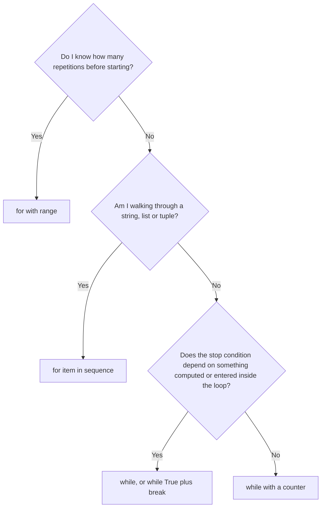
```mermaid
flowchart TD
    A{"Do I know how many repetitions before starting?"} -->|Yes| B["for with range"]
    A -->|No| C{"Am I walking through a string, list or tuple?"}
    C -->|Yes| D["for item in sequence"]
    C -->|No| E{"Does the stop condition depend on something computed or entered inside the loop?"}
    E -->|Yes| F["while, or while True plus break"]
    E -->|No| G["while with a counter"]
```

### 6.9.2 Word problem to working program

- Step 1: identify the inputs — what does the user supply, and what type must it become. Write the `int()`/`float()` conversion in immediately.
- Step 2: identify the output — one value, or one line per iteration.
- Step 3: decide the structure before the syntax — decision, repetition, or both; how many cases the decision has.
- Step 4: write the algorithm or pseudocode first.

```text
START
INPUT n
SET fact = 1
FOR i = 1 TO n DO
    SET fact = fact * i
END FOR
DISPLAY fact
STOP
```

- Step 5: translate to Python, watching the colon and the indentation.
- Step 6: trace it by hand once with a small input before trusting it.
- Build a table of the control variable and the accumulator, one row per iteration.
- Every bug in this chapter shows up in that table.

### 6.9.3 Tracing a loop on paper

| Iteration | Control variable | Condition | Accumulator | Printed |
| --------- | ---------------- | --------- | ----------- | ------- |
| before | `count = 1` | — | — | — |
| 1 | 1 | `1 <= 5` True | — | `1` |
| 2 | 2 | `2 <= 5` True | — | `2` |
| … | … | … | … | … |
| exit | 6 | `6 <= 5` False | — | — |

- Always include the exit row.
- Off-by-one errors live in the exit row.

---

## 6.10 Check your understanding

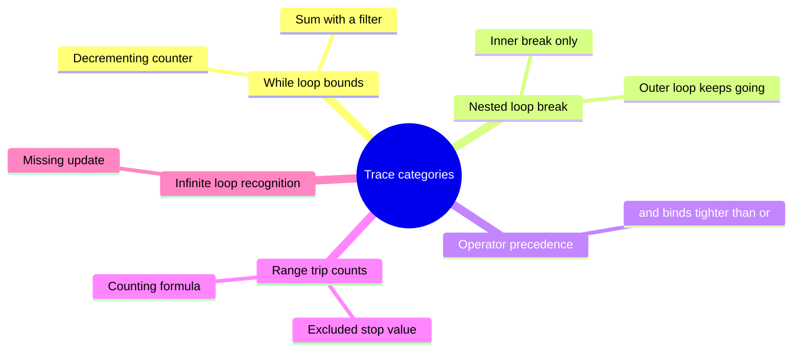
```mermaid
mindmap
  root((Trace categories))
    While loop bounds
      Decrementing counter
      Sum with a filter
    Nested loop break
      Inner break only
      Outer loop keeps going
    Operator precedence
      and binds tighter than or
    Range trip counts
      Excluded stop value
      Counting formula
    Infinite loop recognition
      Missing update
```

**1.** ([NCERT] Exercise 5(i))

```python
a = 110
while a > 100:
    print(a)
    a -= 2
```

```text
110
108
106
104
102
```

**2.** ([NCERT] Exercise 5(iv))

```python
i = 0; sum = 0
while i < 9:
    if i % 4 == 0:
        sum = sum + i
    i = i + 2
print (sum)
```

- Output: `12`.
- `i` takes 0, 2, 4, 6, 8.
- Only 0, 4 and 8 are divisible by 4.
- `0 + 4 + 8 = 12`.

**3.** ([NCERT] Exercise 5(v))

```python
for x in range(1,4):
    for y in range(2,5):
        if x * y > 10:
            break
        print (x * y)
```

```text
2
3
4
4
6
8
6
9
```

- At `x = 3, y = 4`, `12 > 10` fires `break`.
- The `break` ends the inner loop only.
- `x = 3` is the outer loop's last value, so the program then finishes.

**4.** ([CSP-XI] Solved Question 11(c))

```python
x = 10
y = 0
while x > y:
    x = x - 4
    y += 4
    print(x, end=" ")
```

- Output: `6 2 `.
- After pass 1, `x = 6, y = 4` (`6 > 4`, continue).
- After pass 2, `x = 2, y = 8`, and `2 > 8` is `False`.

**5.** ([CSP-XI] Solved Question 12)

```python
x = 0
z = 1
for i in range(1,3):
    for j in range(1,i):
        z = i+j-1
        if(z%2==0):
            x=x+z
        elif(z%3==0):
            x=x+z-2
print("x =",x)
```

- Output: `x = 2`.
- When `i = 1`, the inner `range(1,1)` is empty and the body never runs.
- When `i = 2`, `j = 1` gives `z = 2`, which is even, so `x = 0 + 2 = 2`.

**6.** ([NCERT] Exercise 5(vi)) — assuming `print("Good bye!")` is indented at the loop-body level, aligned with `if var == 3:`.

```python
var = 7 
while var > 0: 
    print ('Current variable value: ', var)
    var = var - 1
    if var == 3:
        break
    else:
        if var == 6:
            var = var - 1
            continue
    print ("Good bye!")
```

```text
Current variable value:  7
Current variable value:  5
Good bye!
Current variable value:  4
```

- Pass 1: prints 7, `var` becomes 6, `continue` skips `"Good bye!"` and `var` drops to 5.
- Pass 2: prints 5, `var` becomes 4, neither special case applies, so `"Good bye!"` prints.
- Pass 3: prints 4, `var` becomes 3, `break`.
- The indentation of the last line is genuinely ambiguous in the printed book; a different reading changes the answer.
- In Python, indentation is the answer — this exercise demonstrates that directly.

**7.** ([CSP-XI] Objective 3(g)) — how many times does this execute?

```python
a = 5
while a > 0:
    print(a)
print("Thank You")
```

- Answer: infinitely.
- `a` is never changed, so `a > 0` stays `True`.
- `"Thank You"` is unreachable.
- Interrupt with `Ctrl + C`.

**8.** How many values does `range(1, 51, 3)` produce, and what is the last one?

- Answer: 17 values, ending at 49.
- `(51 - 1 + 2) // 3 = 17`.
- [CSP-XI] Solved Question 16 answers 16; that is an error in the book.

---

## 6.11 Conceptual questions with answers

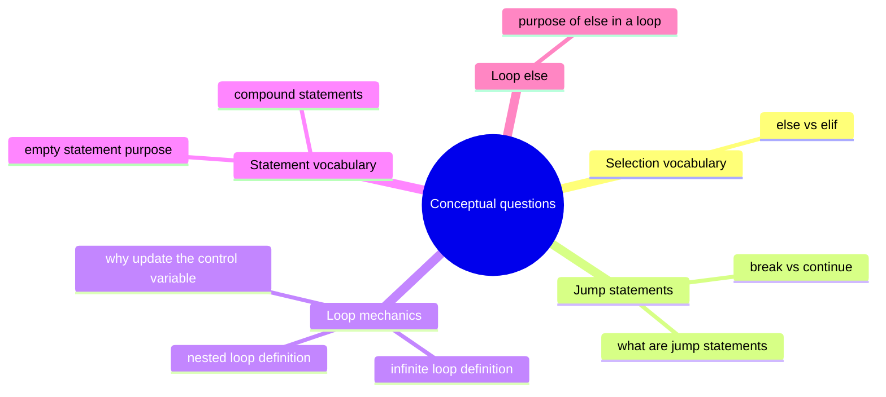
```mermaid
mindmap
  root((Conceptual questions))
    Selection vocabulary
      else vs elif
    Jump statements
      break vs continue
      what are jump statements
    Loop mechanics
      infinite loop definition
      why update the control variable
      nested loop definition
    Statement vocabulary
      compound statements
      empty statement purpose
    Loop else
      purpose of else in a loop
```

**Difference between `else` and `elif`** ([NCERT] Ex. 1, [CSP-XI] Unsolved 11).

| | `else` | `elif` |
| --- | --- | --- |
| Takes a condition? | No | Yes |
| How many per `if`? | At most one | Any number |
| When does it run? | When every preceding condition was `False` | When all earlier conditions were `False` and its own is `True` |
| Position | Always last | Between the `if` and the `else` |

- Purpose of `range()` ([NCERT] Ex. 2): generates a sequence of integers from `start` up to but excluding `stop`, in steps of `step`.
- Example: `list(range(0, 30, 5))` gives `[0, 5, 10, 15, 20, 25]`.
- `range()` is what turns a `for` loop into a counted loop.
- `break` versus `continue` ([NCERT] Ex. 3, [CSP-XI] Solved 5): both alter the flow of a loop.
- `break` terminates the loop and resumes at the statement after it.
- `continue` skips only the rest of the current iteration and goes back to the condition.
- See §6.5.2 for the same code run with each.
- Infinite loop ([NCERT] Ex. 4): a loop whose condition never becomes `False`.

```python
a = 5
while a > 0:
    print(a)
```

- `a` is never decreased, so the loop never ends.
- Interrupt with `Ctrl + C`.
- Compound statements ([CSP-XI] Unsolved 1): statements made of a header ending in a colon plus an indented body, executed as one unit — `if`, `while`, `for`, `def`.
- Jump statements ([CSP-XI] Unsolved 2): `break` and `continue`, which transfer control out of the normal loop flow.
- Nested loop ([CSP-XI] Unsolved 3): a loop inside another loop; the inner loop completes fully for each single iteration of the outer one. See Program 6-16.
- The loop control variable must be updated inside a `while` ([CSP-XI] Unsolved 4).
- The condition is tested against that variable on every pass.
- Without an update, the condition never becomes `False` and the loop never terminates.
- Significance of an empty statement ([CSP-XI] Solved 3): Python allows no empty blocks, so `pass` fills a block that is syntactically required but should do nothing.
- Purpose of `else` in a loop ([CSP-XI] Solved 6): it runs when the loop finishes normally.
- The book words this as "if the items in the sequence do not match or when loop gets over", which is loose.
- Precise statement: the loop `else` runs if and only if the loop was not exited by `break`.

---

## 6.12 More output tracing

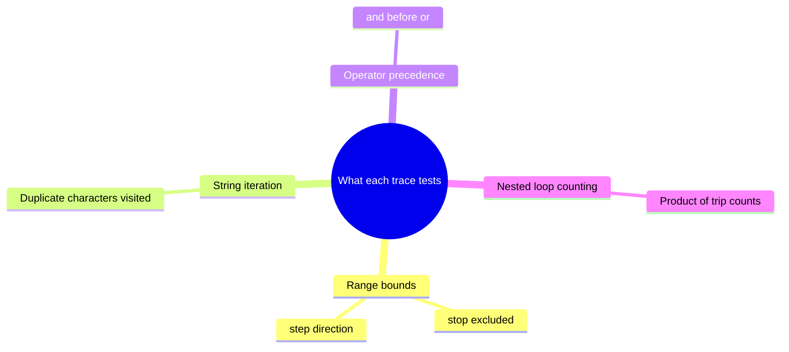
```mermaid
mindmap
  root((What each trace tests))
    Range bounds
      stop excluded
      step direction
    String iteration
      Duplicate characters visited
    Operator precedence
      and before or
    Nested loop counting
      Product of trip counts
```

**[NCERT] Exercise 5(ii)**

```python
for i in range(20,30,2):
    print(i)
```

```text
20
22
24
26
28
```

**[NCERT] Exercise 5(iii)**

```python
country = 'INDIA'
for i in country:
    print (i)
```

```text
I
N
D
I
A
```

- Five lines, and the repeated `I` prints twice.
- A `for` over a string visits every character, duplicates included.

**[CSP-XI] Solved 11(a)** — operator precedence.

```python
x = 3
if x > 2 or x < 5 and x == 6:
    print("ok")
else:
    print("no output")
```

- Output: `ok`.
- `and` binds tighter than `or`.
- This reads `x > 2 or (x < 5 and x == 6)` — that is `True or (True and False)`, which is `True`.
- Written as `(x > 2 or x < 5) and x == 6` it would print `no output` instead.
- Parenthesise when in doubt.

**[CSP-XI] Solved 11(b)** — `x, y = 2, 4`; `if (x+y==10)` → `6 == 10` is `False`.

- Output is `False` (the string, from the `else` branch — not the boolean).

**[CSP-XI] Solved 11(e)**

```python
for x in range(2):
    for y in range(2):
        print(x,y,x+y)
```

```text
0 0 0
0 1 1
1 0 1
1 1 2
```

- Four lines: 2 × 2, the nested-loop product rule.

**[CSP-XI] Solved 11(h)** — `for z in range(-100,100,100): print(z,end=' ')` gives `-100 0 `.

- Only two values: `100` is the excluded `stop`.
- Compare with 11(g)'s `range(-100,200,100)`, which does include `100`.

---

## 6.13 Converting between `while` and `for`

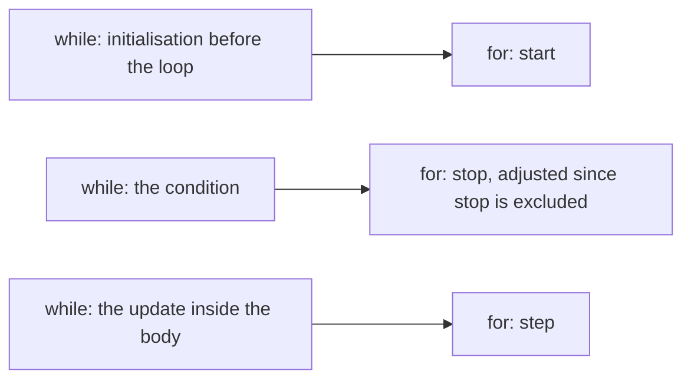
```mermaid
flowchart LR
    A["while: initialisation before the loop"] --> D["for: start"]
    B["while: the condition"] --> E["for: stop, adjusted since stop is excluded"]
    C["while: the update inside the body"] --> F["for: step"]
```

- A counted `while` and a `for` over a `range` are interchangeable.
- The mapping is mechanical: initialisation maps to `start`, the condition maps to `stop` (adjusted), the update maps to `step`.

**[CSP-XI] Solved 8 — `while` to `for`.**

```python
x = 5
while (x<10):
    print(x+10)
    x+=2
```

becomes

```python
for x in range(5,10,2):
    print(x+10)
```

- Both print `15`, `17`, `19`.

**[CSP-XI] Solved 9 — `for` to `while`.**

```python
for k in range(10,20,5):
    print(k)
```

becomes

```python
k = 10
while(k<20):
    print(k)
    k+=5
```

- Both print `10` then `15`.

**[CSP-XI] Solved 38** — the same conversion with a body that branches.

```python
for a in range(3,100,3):
    if a%2==0:
        print(a+2,end=",")
    else:
        print(a*2,sep="$")
```

- Output identical to the original `while` version, starting `6`, `8,18`, `14,30`, …
- Trap in the original: `sep="$"` does nothing here.
- `sep` separates multiple arguments to one `print()`.
- With a single argument there is nothing to separate.
- The `$` never appears in the output.

---

## 6.14 Find the error

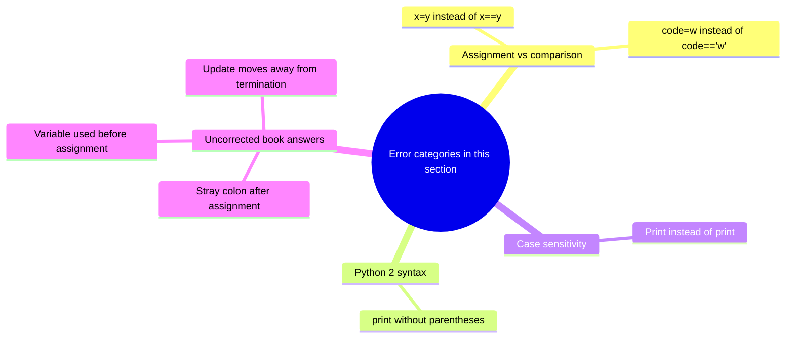
```mermaid
mindmap
  root((Error categories in this section))
    Assignment vs comparison
      x=y instead of x==y
      code=w instead of code=='w'
    Python 2 syntax
      print without parentheses
    Case sensitivity
      Print instead of print
    Uncorrected book answers
      Stray colon after assignment
      Variable used before assignment
      Update moves away from termination
```

**[CSP-XI] Solved 10(a)** — as printed.

```text
x=int("Enter value for x:")
for in range(0,11):
    if x=y
        print x+y
    else:
        Print x-y
```

- Error 1: `input()` is missing inside `int()`.
- Error 2: the `for` has no loop variable.
- Error 3: `x=y` uses assignment instead of `==` and has no colon.
- Error 4: `print x+y` is Python 2 syntax.
- Error 5: `Print` has the wrong case.

```python
x = int(input("Enter value for x: "))
for y in range(0,11):
    if x == y:
        print(x+y)
    else:
        print(x-y)
```

**[CSP-XI] Solved 10(b)** — the book's corrected answer reads:

```text
MaxSpeed=50
Alter='N'
MySpeed=int(input())
if MySpeed >MaxSpeed:
    Alter='Y':
print(Alter)
```

- The printed answer still fails (New): `Alter='Y':` carries a stray colon left over from the question.
- Running it gives `SyntaxError: invalid syntax`.
- A colon ends a compound-statement header; an assignment is a simple statement and takes none.

```python
MaxSpeed = 50
Alter = 'N'
MySpeed = int(input())
if MySpeed > MaxSpeed:
    Alter = 'Y'
print(Alter)
```

```text
70
Y
```

**[CSP-XI] Solved 10(c)** — the book's corrected answer:

```python
A = int(input("enter a value"))
while A != 0:
    count = count + 1
    if count < A:
        print(count)
    else:
        print(count + A)
    A = A + 1
```

- Two bugs survive the correction (New).
- Running with input `3` gives `NameError: name 'count' is not defined`.
- `count` is used on the right-hand side of its own first assignment and was never initialised.
- The update `A = A + 1` moves `A` away from `0` for any positive input.
- Even with `count` fixed, the loop never terminates.

```python
A = int(input("enter a value"))
count = 0
while A != 0:
    count = count + 1
    if count < A:
        print(count)
    else:
        print(count + A)
    A = A - 1
```

**[CSP-XI] Solved 39** — complete the code to reverse a number.

- The book's answers for the four blanks: `n!=0`, `x=x%10`, `rev=rev*10+x`, `n=n//10`.
- The second blank is wrong (New): `x=x%10` uses `x` before it has any value — `NameError: name 'x' is not defined`.
- It must be `x = n % 10`: take the last digit of `n`.

```python
n = int(input("Enter the number:"))
rev = 0
while n != 0:
    x = n % 10
    rev = rev * 10 + x
    n = n // 10
print("Reverse number=", rev)
```

```text
Enter the number:1234
Reverse number= 4321
```

**[CSP-XI] Solved 40** — make the loop print multiples of 5.

- `for a in range(5,100):` becomes `for a in range(5,100,5):`.
- The fix is the missing `step`, not the bounds.

**[CSP-XI] Unsolved 6** — as printed.

```text
code=input("Enter season code:")
if code=w:
    print "winter season"
    elif code==r:
    PRINT "rainy season"
else:
    Print "summer season"
```

- Error: `code=w` should be `code == 'w'` — assignment instead of comparison, and `w` is an undefined name rather than a string literal.
- Error: `print "…"` is Python 2 syntax — Python 3 needs parentheses.
- Error: the `elif` is indented inside the `if` body instead of aligned with it.
- Error: `PRINT` and `Print` have the wrong case.

```python
code = input("Enter season code:")
if code == 'w':
    print("winter season")
elif code == 'r':
    print("rainy season")
else:
    print("summer season")
```

---

## 6.15 Writing logical expressions

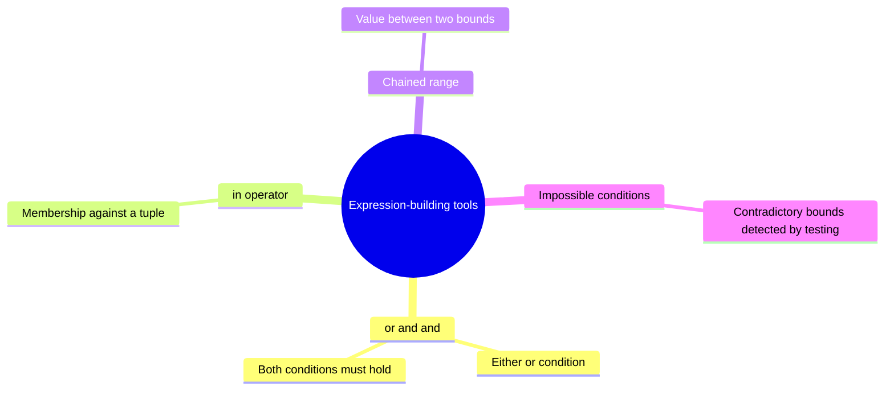
```mermaid
mindmap
  root((Expression-building tools))
    or and and
      Either or condition
      Both conditions must hold
    in operator
      Membership against a tuple
    Chained range
      Value between two bounds
    Impossible conditions
      Contradictory bounds detected by testing
```

**[CSP-XI] Solved 7**

| In words | Expression |
| --- | --- |
| Either A is greater than B or A is less than C | `A > B or A < C` |
| Name is Aman and age is between 18 and 35 | `name == "Aman" and 18 <= age <= 35` |
| Place is either 'Delhi' or 'Goa' but not 'Jaipur' | `(place == 'Delhi' or place == 'Goa') and place != 'Jaipur'` |

- The third expression's final clause is redundant.
- A value that already equals `'Delhi'` or `'Goa'` cannot equal `'Jaipur'`.
- The book includes the clause because the question asks for it.
- The redundancy should be noted, not treated as adding correctness.

**[CSP-XI] Unsolved 5**

| In words | Expression |
| --- | --- |
| Num is between 0 and 5 but not equal to 2 | `0 < num < 5 and num != 2` |
| Answer is either 'N' or 'n' | `answer in ('N', 'n')` |
| Age is at least 18 and gender is male | `age >= 18 and gender == 'M'` |
| City is either 'Kolkata' or 'Mumbai' | `city in ('Kolkata', 'Mumbai')` |

- Part (i) is impossible as printed (New): "Mark is greater than or equal to 100 but less than 70" — `mark >= 100 and mark < 70` can never be `True` for any value.
- Presumably a misprint for `>= 60`.
- Writing the expression exactly as asked, then pointing out that it is unsatisfiable, is the correct answer.
- Silently "fixing" the numbers is not the correct answer.

---

## 6.16 Objective questions

```mermaid
mindmap
  root((Question types))
    Fill in the blanks
      Sequential execution
      Flow charts
      for and while
      break and continue
      infinite loop
      header line
    True or false
      Flowchart is graphical
      pass is empty statement
      Ctrl C cancels loop
      else if is invalid
    Multiple choice
      Flow chart symbol
      Colon ends if header
      Case sensitivity
      do-while absent
      range trip values
```

### 6.16.1 Fill in the blanks ([CSP-XI])

- Statements in Python are executed sequentially (one after another) while working with a sequence construct.
- Flow charts are diagrams that show the step-by-step solution to a given problem.
- Two types of looping statements are `for` and `while`.
- `for` loop is best when the number of iterations is known.
- `break` statement terminates the loop.
- A loop that never ends is called an infinite loop.
- The looping / iteration construct means repetition of a set of statements depending upon a condition test.
- In a nested loop the inner loop must be terminated before the outer loop.
- `continue` statement abandons the current iteration of the loop.
- A header line begins with a keyword and ends with a colon.

### 6.16.2 True or false ([CSP-XI])

- A flow chart IS a graphical representation of the step-by-step solution to a problem.
- `if`, `elif`, `else` ARE block or compound statements.
- Every compound statement has a header and an indented body.
- A block is a group of consecutive statements at the same indentation level.
- Python offers `pass` as an empty statement.
- `Ctrl + C` cancels a running endless loop.
- Indentation IS necessary when working with blocks.
- `else if` cannot be used in Python — Python spells it `elif`.
- An `else:` containing a nested `if` is a different, legal construct.
- `continue` skips the rest of the loop body and causes the next iteration to take place.
- The `else` block for a loop executes only on normal termination of the loop.
- Repeated execution of a set of statements is called iteration.

### 6.16.3 Multiple choice ([CSP-XI])

- The graphical representation of an algorithm is a flow chart.
- The statement that is not a decision-making statement, among the options given, is the `for` statement — it is a looping statement.
- The symbol used to end an `if` statement header is the colon `:`.
- Of `IF`, `If`, `if`, the valid keyword is `if` — Python is case-sensitive.
- `if True: print(101) else: print(202)` prints `101`.
- The statement not a loop statement in Python, among the options given, is `do-while` — Python has no `do-while`.
- `a=5` then `while a>0: print(a)` runs infinitely — `a` is never updated.
- The statement used to iterate over a range or sequence is `for`.
- `for x in range(1,20,3): print(x)` prints `1, 4, 7, 10, 13, 16, 19`.
- The statement that abandons the current iteration of the loop is `continue`.

---

## 6.17 Program library

```mermaid
mindmap
  root((Program techniques))
    Digit by digit
      Peel with percent ten
      Shrink with floor divide ten
    Accumulator
      Zero for a sum
      One for a product
    Running extreme
      Seed with first value read
      Never seed with zero
    Sequence generation
      Fibonacci rolling assignment
      Prime scan with for else
    Classification ladders
      in operator collapses many ors
      Slabs in increasing order
    Menu driven
      while True plus break
      Final else catches bad input
    Running term series
      Each term built from previous term
```

- Programs grouped by the technique each one teaches, since the technique transfers, not the problem statement.

### 6.17.1 Technique — digit-by-digit processing with `% 10` and `// 10`

- The same three-line engine solves five different questions.
- Peel off the last digit with `% 10`, then remove it with `// 10`, until the number reaches `0`.

**Sum of digits** ([NCERT] Programming Exercise 7, [CSP-XI] Unsolved 19).

```python
n = int(input("Enter an integer: "))
total = 0
while n > 0:
    total = total + n % 10
    n = n // 10
print("Sum of digits =", total)
```

```text
Enter an integer: 4523
Sum of digits = 14
```

**Reverse and palindrome** ([NCERT] Programming Exercise 8, [CSP-XI] Solved 29).

```python
orig = int(input("Enter a number: "))
num = orig
rev = 0
while num > 0:
    digit = num % 10
    rev = rev * 10 + digit
    num = int(num/10)
if orig == rev:
    print('Palindrome')
else:
    print('Not a Palindrome')
```

```text
Enter a number: 12321
Palindrome
```

- `rev = rev * 10 + digit` is the reversal step: shift what is held one place left, then drop the new digit in.
- `num = int(num/10)` works.
- `num = num // 10` is the better tool: integer division avoids creating a float only to truncate it.

**Armstrong number** ([CSP-XI] Solved 28) — a 3-digit number equal to the sum of the cubes of its digits, e.g. 3 cubed + 7 cubed + 1 cubed = 371.

```python
num = int(input("Enter 3-digit number: "))
f = num
sum = 0
while(f>0):
    a = f%10
    f = int(f/10)
    sum = sum+(a**3)
if (sum==num):
    print(num," is an Armstrong number.")
else:
    print(num," is not an Armstrong number.")
```

```text
Enter 3-digit number: 371
371  is an Armstrong number.
```

- `sum` here shadows the built-in `sum()` function.
- Harmless in this short program, bad practice in general — rename it `total`.

**Decimal to binary** ([CSP-XI] Solved 31).

```python
n = int(input("Enter no:"))
a = 0
m = 0
c = 1
while n > 0:
    a = n%2
    m = m + (a*c)
    c = c*10
    n = int(n/2)
print(m)
```

```text
Enter no:13
1101
```

- Same peel-and-shift engine, base 2 instead of base 10.
- `c` is a place-value multiplier (1, 10, 100, …) that assembles the bits into a decimal-looking number, not a string.
- The trick breaks for numbers above about 19 digits of output.
- A string build (`bin_str = str(a) + bin_str`) is the safer approach.

**Binary to decimal** ([CSP-XI] Unsolved 18) — shorter as a `for` over the characters.

```python
b = input("Enter a binary number: ")
dec = 0
for bit in b:
    dec = dec * 2 + int(bit)
print("Decimal =", dec)
```

```text
Enter a binary number: 1101
Decimal = 13
```

### 6.17.2 Technique — the accumulator

- Initialise outside the loop (`0` for a sum, `1` for a product), update inside it.

**Sum of even numbers up to n** ([CSP-XI] Solved 21).

```python
s = 0
n = int(input('Enter a limit'))
for i in range(n+1):
    if i%2==0:
        s+=i
print(s)
```

```text
Enter a limit10
30
```

**Sum of 1 + 1/8 + 1/27 + ... + 1/n cubed** ([NCERT] Programming Exercise 6).

```python
n = int(input("Enter n: "))
total = 0
for i in range(1, n + 1):
    total = total + 1/(i ** 3)
print("Sum =", round(total, 4))
```

```text
Enter n: 4
Sum = 1.1777
```

**Sum of 1 + (1+2) + (1+2+3) + ...** ([CSP-XI] Unsolved 23) — an accumulator inside a nested loop.

```python
n = int(input("Enter n: "))
total = 0
for i in range(1, n + 1):
    for j in range(1, i + 1):
        total = total + j
print("Sum =", total)
```

```text
Enter n: 4
Sum = 20
```

### 6.17.3 Technique — running extreme

- Seed the extreme with the first value read, never with `0`.
- Seeding with `0` breaks the moment all the inputs are negative.

**Largest of 10 numbers** ([CSP-XI] Solved 41).

```python
n = int(input("Enter first number:"))
max = n
for i in range(2,11):
    n = int(input("Enter next number:"))
    if max<n:
        max = n
print("Maximum=",max)
```

```text
Maximum= 17
```

- Inputs used: `4 9 2 17 3 8 1 6 11 5`.
- `range(2,11)` runs 9 more times.
- Together with the first `input()`, that makes exactly 10 numbers.
- `max` here shadows a built-in.

**Minimum and maximum of five numbers** ([NCERT] Programming Exercise 3).

```python
n = int(input("Enter number 1: "))
smallest = largest = n
for i in range(2, 6):
    n = int(input("Enter number " + str(i) + ": "))
    if n < smallest:
        smallest = n
    if n > largest:
        largest = n
print("Minimum =", smallest, " Maximum =", largest)
```

```text
Minimum = 4  Maximum = 39
```

- Inputs used: `12 4 39 7 25`.
- Two independent `if`s, not `if..else`.
- A single value can be both the new minimum and the new maximum on the first comparison.

**Largest of three, by nesting** ([CSP-XI] Solved 20).

```python
A = int(input("Enter first number: "))
B = int(input("Enter second number: "))
C = int(input("Enter third number: "))
if (A > B):
    if (A > C):
        print(A," is the largest number")
    else:
        print(C," is the largest number")
else:
    if (B > C):
        print(B," is the largest number")
    else:
        print(C," is the largest number")
```

```text
Enter first number: 12
Enter second number: 45
Enter third number: 30
45  is the largest number
```

### 6.17.4 Technique — generating a sequence

**Fibonacci series** ([CSP-XI] Solved 26).

```python
i = int(input("Enter the limit:"))
x = 0
y = 1
z = 1
print("Fibonacci series")
print(x, y, end=" ")
while(z<=i):
    print(z, end=' ')
    x = y
    y = z
    z = x+y
```

```text
Enter the limit:20
Fibonacci series
0 1 1 2 3 5 8 13 
```

- The book writes `print(x,y,end="")` with an empty `end`.
- The empty `end` runs the `1` of `0 1` into the next number as `0 11 2 3 …`.
- Using `end=" "` fixes the display without touching the logic.
- The rolling assignment `x = y; y = z; z = x + y` is the part to memorise.
- Order matters — doing it in the wrong order loses a term.

**Sequence minus five, ten, minus fifteen, twenty, minus twenty-five ...** ([NCERT] Programming Exercise 5).

```python
n = int(input("How many terms? "))
for i in range(1, n + 1):
    if i % 2 == 1:
        print(-5 * i, end=' ')
    else:
        print(5 * i, end=' ')
```

```text
How many terms? 6
-5 10 -15 20 -25 30 
```

**Even numbers between 10 and 20** ([CSP-XI] Unsolved 15).

```python
for i in range(10, 21):
    if i % 2 == 0:
        print(i, end=' ')
```

```text
10 12 14 16 18 20 
```

- `range(10, 21, 2)` would do the same task with no `if` at all.

**Prime numbers below 30** ([CSP-XI] Unsolved 20) — a `for..else` doing the work a flag variable usually does.

```python
for n in range(2, 30):
    for d in range(2, int(n ** 0.5) + 1):
        if n % d == 0:
            break
    else:
        print(n, end=' ')
```

```text
2 3 5 7 11 13 17 19 23 29 
```

- The `else` belongs to the inner `for`, not to the `if`.
- The `else` runs only when the inner loop found no divisor, i.e. no `break` fired.
- This is the single best illustration of why loop `else` exists.

**Perfect number** ([CSP-XI] Solved 30) — a positive integer equal to the sum of its proper divisors; the smallest is 6.

```python
i = 1
s = 0
num = int(input("Enter number:"))
while i<num:
    if num%i == 0:
        s += i
    i = i+1
if s == num:
    print("It is a perfect no.")
else:
    print("It is not a perfect no.")
```

```text
Enter number:28
It is a perfect no.
```

### 6.17.5 Technique — classification ladders

**Vowel or consonant** ([CSP-XI] Solved 24) — the book writes five `elif`s, one per vowel; the `in` operator collapses all of them.

```python
ch = input("Enter a character:")
if ch in ('a','A','e','E','i','I','o','O','u','U'):
    print(ch, "is a vowel")
else:
    print(ch, "is a consonant")
```

```text
Enter a character:E
E is a vowel
```

**Uppercase / lowercase / digit / special** ([CSP-XI] Solved 42).

```python
ch = input("Enter character:")
if ch.isupper():
    print("Uppercase character")
elif ch.islower():
    print("lowercase character")
elif ch.isdigit():
    print("Digit")
else:
    print("Special Character")
```

```text
Enter character:7
Digit
```

**Driving licence eligibility** ([NCERT] Programming Exercise 1).

```python
name = input("Enter your name: ")
age = int(input("Enter your age: "))
if age >= 18:
    print(name, "is eligible to apply for a driving license")
else:
    print(name, "is not eligible to apply for a driving license")
```

```text
Enter your name: Riya
Enter your age: 16
Riya is not eligible to apply for a driving license
```

**Grade from percentage** ([NCERT] Programming Exercise 10).

| Percentage of marks | Grade |
| --- | --- |
| Above 90% | A |
| 80% to 90% | B |
| 70% to 80% | C |
| 60% to 70% | D |
| Below 60% | E |

```python
perc = float(input("Enter percentage: "))
if perc > 90:
    print("A")
elif perc >= 80:
    print("B")
elif perc >= 70:
    print("C")
elif perc >= 60:
    print("D")
else:
    print("E")
```

```text
Enter percentage: 84
B
```

- The printed table overlaps at every boundary — 80 is in both "70% to 80%" and "80% to 90%".
- The ladder above resolves each boundary upwards (80 to B).
- Stating the convention used matters; an unstated one is where marks are lost.

**Temperature conversion** ([CSP-XI] Solved 17, [CSP-XI] Unsolved 14).

```python
Celsius = float(input("Enter temperature in Celsius:"))
Fahrenheit = (Celsius * 1.8) + 32
print(Celsius, " Celsius", Fahrenheit, "Fahrenheit")
```

```text
Enter temperature in Celsius:37
37.0  Celsius 98.60000000000001 Fahrenheit
```

- The trailing `...00000000001` is not a bug in the program.
- Floats are stored in binary; `98.6` has no exact binary representation.
- `round(Fahrenheit, 2)` fixes the display.
- The same effect reappears in every float calculation in this course.

```text
START
INPUT fahrenheit
SET celsius = (fahrenheit - 32) / 1.8
DISPLAY celsius
STOP
```

```python
f = float(input("Enter temperature in Fahrenheit: "))
c = (f - 32) / 1.8
print(f, "Fahrenheit =", round(c, 2), "Celsius")
```

```text
Enter temperature in Fahrenheit: 98.6
98.6 Fahrenheit = 37.0 Celsius
```

### 6.17.6 Technique — menu-driven programs

- ([CSP-XI] Solved 23, Unsolved 16) The menu must reappear after every choice.
- The user decides when to stop — the defining case for an intentional infinite loop.

```python
while True:
    print(" 1. For Area of Circle")
    print(" 2. For Area of Rectangle")
    ch = int(input("Enter your choice (enter 0 to exit): "))
    if ch == 1:
        r = int(input("Enter the radius of the Circle:"))
        a = 3.14*r*r
        print("Area of Circle: ", a)
    elif ch == 2:
        l = int(input("Enter the length:"))
        b = int(input("Enter the breadth:"))
        print("Area of Rectangle: ", l*b)
    elif ch == 0:
        break
    else:
        print("Invalid Option")
```

```text
 1. For Area of Circle
 2. For Area of Rectangle
Enter your choice (enter 0 to exit): 1
Enter the radius of the Circle:7
Area of Circle:  153.86
 1. For Area of Circle
 2. For Area of Rectangle
Enter your choice (enter 0 to exit): 0
```

- The `else` at the bottom catches invalid input.
- That `else` does not `break` — so the menu redisplays.
- Every menu program in the syllabus is this shape.

### 6.17.7 Technique — series with a running term

**Exponential series** ([CSP-XI] Solved 32) — the series 1 + x/1! + x squared/2! + ... + x to the n over n!.

- The book's program computes a different series (New).
- [CSP-XI]'s code is `total = total + ((x**i)/i)` — dividing by `i`, not by `i!`.
- For `x = 2, n = 5` it prints `18.07`.
- The exponential series sums to about `7.27` (and e squared is approximately `7.389`).
- The denominators must be factorials.

```python
x = int(input("Enter the value of x :"))
n = int(input("Enter the limit :"))
total = 1
term = 1
for i in range(1, n + 1):
    term = term * x / i        # turns the previous term into the next one
    total = total + term
print(round(total,3))
```

```text
Enter the value of x :2
Enter the limit :5
7.267
```

- Never recompute x to the power i and i factorial from scratch each pass.
- Each term is the previous term times `x/i` — one multiplication and one division per iteration instead of two inner loops.

**Geometric series** ([CSP-XI] Solved 33) — S = a + ar + ar squared + ar cubed + ...

- The book's program drops the first term (New).
- Its loop is `for i in range(1,n)`.
- That starts at `ar` to the power 1 and omits `a` itself.
- The loop also runs `n-1` times rather than `n`.
- For `a = 1, r = 2, n = 4` it prints `14.0`; the series `1 + 2 + 4 + 8` is `15.0`.

```python
n = int(input("Number of terms:"))
r = float(input("Enter ratio:"))
a = int(input("Enter the first term:"))
total = 0
for i in range(0, n):
    total = total + a*(r**i)
print("Sum of the series: ", total)
```

```text
Number of terms:4
Enter ratio:2
Enter the first term:1
Sum of the series:  15.0
```

- Sanity check: the closed form S-sub-n equals a times (r to the n minus 1) over (r minus 1), which is 1 times (16 minus 1) over 1, equals 15.
- Always check a series program against its closed form when one exists.

---

## 6.18 Pattern printing

```mermaid
flowchart TD
    A["Outer loop counts rows"] --> B["Print leading spaces depending on row"]
    B --> C["Inner loop prints items on the row"]
    C --> D["Inner bound may depend on outer variable"]
    D --> E["Bare print at outer level gives the line break"]
    E --> A
```

- Every pattern is the same skeleton: outer loop is rows, inner loop is what goes on a row, `print()` at the outer level is the line break.
- The only thing that changes is how the inner bounds depend on the outer variable.

**Rectangle of a repeated value** ([CSP-XI] Solved 34) — inner bound does not depend on the outer variable, so the shape is a rectangle.

```python
i = 3
while (i>=0):
    j = 3
    while (j>=0):
        print(5,end=' ')
        j = j-1
    print()
    i = i-1
```

```text
5 5 5 5 
5 5 5 5 
5 5 5 5 
5 5 5 5 
```

**Shrinking rows** ([CSP-XI] Solved 35).

```python
i = 3
while i>=0:
    j = 1
    while j<=i:
        print(j,end=' ')
        j = j+1
    print()
    i = i-1
```

```text
1 2 3 
1 2 
1 

```

- The target pattern in the book has three rows.
- `while i>=0` runs a fourth time with `i = 0`, where the inner loop does nothing and the bare `print()` still emits a blank line.
- `while i>0` matches the printed pattern exactly.

**Consecutive letters** ([CSP-XI] Solved 36) — `chr(65)` is `'A'`; the counter is carried across rows rather than reset.

```python
i = 1
num = 65
while i<=5:
    j = 1
    while j<=i:
        print(chr(num), end=" ")
        j = j+1
        num = num+1
    print()
    i = i+1
```

```text
A 
B C 
D E F 
G H I J 
K L M N O 
```

**Repeated odd numbers** ([CSP-XI] Solved 37(ii)).

```python
n = 10
for i in range(1,n+1,2):
    for j in range(0,i+1,2):
        print(i,end=' ')
    print("")
```

```text
1 
3 3 
5 5 5 
7 7 7 7 
9 9 9 9 9 
```

**Right-aligned increasing rows** ([CSP-XI] Solved 37(iii)).

- The book's answer does not produce the pattern it was set (New).
- Target: `5` / `4 5` / `3 4 5` / `2 3 4 5` / `1 2 3 4 5`, right-aligned.
- The printed answer prints `a` repeatedly instead of `a` through `5`, giving `11111 / 2222 / 333 / 44 / 5`.

```python
for a in range(5, 0, -1):
    print("  " * (a - 1), end="")
    for x in range(a, 6):
        print(x, end=" ")
    print()
```

```text
        5 
      4 5 
    3 4 5 
  2 3 4 5 
1 2 3 4 5 
```

**Star pyramid** ([NCERT] Programming Exercise 9(i)).

```python
n = 3
for i in range(1, n + 1):
    print(" " * (n - i) + "* " * (2 * i - 1))
for i in range(n - 1, 0, -1):
    print(" " * (n - i) + "* " * (2 * i - 1))
```

```text
  * 
 * * * 
* * * * * 
 * * * 
  * 
```

- Two loops, one ascending and one descending, is the standard way to build any symmetric pattern.
- Row `i` has `2i - 1` stars and `n - i` leading spaces.
- Derive that relationship before writing the loop.

**Mirrored number pyramid** ([NCERT] Programming Exercise 9(ii)).

```python
n = 5
for i in range(1, n + 1):
    print("  " * (n - i), end="")
    for j in range(i, 1, -1):
        print(j, end=" ")
    for j in range(1, i + 1):
        print(j, end=" ")
    print()
```

```text
        1 
      2 1 2 
    3 2 1 2 3 
  4 3 2 1 2 3 4 
5 4 3 2 1 2 3 4 5 
```

- Two inner loops on one row: one counting down to 2, one counting up from 1.
- Splitting a row into parts is what makes mirrored patterns tractable.

**Shrinking numbered rows** ([NCERT] Programming Exercise 9(iii)).

```python
n = 5
for i in range(n, 0, -1):
    print(" " * (n - i), end="")
    for j in range(1, i + 1):
        print(j, end=" ")
    print()
```

```text
1 2 3 4 5 
 1 2 3 4 
  1 2 3 
   1 2 
    1 
```

**Hollow diamond** ([NCERT] Programming Exercise 9(iv)).

```python
n = 3
for i in range(1, n + 1):
    if i == 1:
        print(" " * (n - i) + "*")
    else:
        print(" " * (n - i) + "*" + " " * (2 * i - 3) + "*")
for i in range(n - 1, 0, -1):
    if i == 1:
        print(" " * (n - i) + "*")
    else:
        print(" " * (n - i) + "*" + " " * (2 * i - 3) + "*")
```

```text
  *
 * *
*   *
 * *
  *
```

- The fourth pattern is printed with ambiguous spacing in NCERT.
- A hollow diamond is the reading the row-by-row star counts support.
- Stating the chosen reading matters when answering it.

**Letter blocks and countdown rows** ([CSP-XI] Unsolved 25 and 26).

```python
num = 65
for i in range(1, 6):
    for j in range(i):
        print(chr(num), end=' ')
    print()
    num += 1
```

```text
A 
B B 
C C C 
D D D D 
E E E E E 
```

```python
for i in range(1, 6):
    for j in range(i, 0, -1):
        print(j, end=' ')
    print()
```

```text
1 
2 1 
3 2 1 
4 3 2 1 
5 4 3 2 1 
```

---

## 6.19 Case studies

```mermaid
mindmap
  root((Case studies))
    Student Management System
      Five subject marks
      Accumulator for total
      Grade ladder with boundary gaps
    Guruji Astro
      Zodiac sign from date
      Twelve branch ladder
      Conditional expression per branch
    Redwood Shop
      GST on apparel and footwear
      Nested if inside elif
      CGST and SGST split
```

### 6.19.1 Student Management Information System ([NCERT] Case Study 6.1)

- A menu-driven program that accepts marks in five subjects, displays them, computes the total and percentage, and awards a grade.

| Criteria | Grade |
| --- | --- |
| percentage > 85 | A |
| percentage < 85 and percentage >= 75 | B |
| percentage < 75 and percentage >= 50 | C |
| percentage > 30 and percentage <= 50 | D |
| percentage < 30 | Reappear |

- The criteria table has two holes (New).
- A percentage of exactly 85 matches no row: `> 85` is false, and B requires `< 85`.
- A percentage of exactly 30 also matches nothing: D requires `> 30`, Reappear requires `< 30`.
- Both values fall through every branch when tested against the five conditions as printed.
- The version below resolves the boundaries explicitly, reading each band as "at least this much".

```python
total = 0
for i in range(1, 6):
    m = int(input("Enter marks in subject " + str(i) + ": "))
    total = total + m
percentage = total / 5
print("Total marks =", total)
print("Percentage =", percentage)
if percentage >= 85:
    grade = "A"
elif percentage >= 75:
    grade = "B"
elif percentage >= 50:
    grade = "C"
elif percentage > 30:
    grade = "D"
else:
    grade = "Reappear"
print("Grade =", grade)
```

```text
Enter marks in subject 1: 78
Enter marks in subject 2: 82
Enter marks in subject 3: 91
Enter marks in subject 4: 69
Enter marks in subject 5: 75
Total marks = 395
Percentage = 79.0
Grade = B
```

- With `percentage = total / 5`, the number of subjects is written as a literal `5` in two places: the loop bound and the divisor.
- Naming it once — `subjects = 5` — and using that name in both places is the habit worth forming.

### 6.19.2 Guruji Astro — zodiac sign from a date ([CSP-XI] Case Study 1)

- Each month splits at a day boundary into two signs.
- This makes it a twelve-branch ladder with a conditional expression in each branch.

```python
day = int(input("Input birthday: "))
month = input("Input month of birth (e.g. march, july etc): ")
if month == 'april':
    astro_sign = 'Aries' if (day < 20) else 'Taurus'
elif month == 'december':
    astro_sign = 'Sagittarius' if (day < 22) else 'Capricorn'
else:
    astro_sign = 'unknown'          # remaining ten months follow the same shape
print("Your Astrological sign is :", astro_sign)
```

```text
Input birthday: 12
Input month of birth (e.g. march, july etc): april
Your Astrological sign is : Aries
```

- `A if condition else B` is a single expression that evaluates to `A` or `B`.
- It is not a new control structure — it is a compact `if..else` usable on the right-hand side of an assignment.
- Use it only when both outcomes are one short value each.
- Robustness note: the program compares against lowercase month names, so `April` fails.
- `month = input(...).lower()` fixes every such case at once.

### 6.19.3 Redwood Shop — GST on a sale ([CSP-XI] Case Study 2)

| Item | GST rate |
| --- | --- |
| Footwear up to 500 rupees per pair | 5% |
| Footwear above 500 rupees per pair | 18% |
| Apparel up to 1000 rupees per piece | 5% |
| Apparel above 1000 rupees per piece | 12% |

- The printed table reads "Footwear <= 500" and "Footwear >= 500".
- Both rows apply at exactly 500 rupees.
- The same ambiguity exists at 1000 rupees for apparel.
- The code resolves it with `<=` first, so 500 rupees is taxed at 5%.
- The table above states that resolution instead of leaving it ambiguous.

```python
item_code = input("Enter item code (A) Apparel, (F) Footwear :")
SP = float(input("Enter selling price (per unit) of item:"))
if item_code == 'A' or item_code == 'a':
    item = 'Apparel'
    if SP <= 1000:
        gstRate = 5
    else:
        gstRate = 12
elif item_code == 'F' or item_code == 'f':
    item = 'Footwear'
    if SP <= 500:
        gstRate = 5
    else:
        gstRate = 18
cgst = SP*(gstRate/2)/100
sgst = cgst
amount = SP + cgst + sgst
print("Item:", item)
print("Price:", SP)
print("CGST:", cgst)
print("SGST:", sgst)
print("Amount payable:", amount)
```

```text
Enter item code (A) Apparel, (F) Footwear :A
Enter selling price (per unit) of item:800
Item: Apparel
Price: 800.0
CGST: 20.0
SGST: 20.0
Amount payable: 840.0
```

- GST is split equally into CGST (central) and SGST (state).
- Each is half the total rate — 5% total means 2.5% each, i.e. 20 rupees apiece on 800 rupees.
- A nested `if` inside each `elif` branch is the natural fit.
- The rate depends on the price only after the category is known.
- Missing guard: an item code other than A or F leaves `item` and `gstRate` undefined.
- Such a code makes the program die with `NameError`.
- A final `else` reporting an invalid code is the fix.

---

## 6.20 Still to attempt

| Question | Technique it reuses |
| --- | --- |
| [CSP-XI] Unsolved 13 — positive or negative number | classification ladder |
| [CSP-XI] Unsolved 16 — full calculator with all operations | menu-driven ladder |
| [CSP-XI] Unsolved 21, 22 — alternating-sign exponential series | running term, with a sign flip each pass |
| [CSP-XI] Unsolved 24 — right-triangle star pattern | outer rows, inner columns |
| [NCERT] Programming Exercise 2 — table of a number, as a function | counted `for` (functions come in Chapter 7) |

- These remain open in the books and are not solved in this note.
- All five reuse a technique from §6.17.

---

## 6.21 Summary

```mermaid
mindmap
  root((Flow of Control))
    Sequence
      Default order
      Top to bottom
      No jumps
    Selection
      if
      if else
      if elif else
      Nested if
    Repetition
      for loop
      while loop
      range function
      Infinite loop
      Loop else clause
    Jump statements
      break
      continue
      pass
    Nesting
      Nested loops
      Inner completes first
      Different control variables
    Indentation
      Defines every block
      Four spaces per level
      IndentationError
```

- Default flow is sequence; only selection and repetition change it.
- Selection: `if` (one-way), `if..else` (two-way), `if..elif..else` (multi-way, first `True` branch wins), and nesting for conditions inside conditions.
- Indentation defines every block — it is syntax, and it is what pairs an `else` with its `if`.
- Repetition: `for` for a known number of trips (definite), `while` for an unknown number (indefinite).
- `range(start, stop, step)` excludes `stop`.
- Every `while` needs initialise, test, update; a missing update is an infinite loop.
- `break` exits the innermost loop.
- `continue` skips to its next iteration.
- `pass` does nothing at all.
- A loop's optional `else` runs only if no `break` fired.
- In a nested loop, the inner loop completes fully for each single pass of the outer one.
- Total body executions in a nested loop are the product of the two trip counts.

---

## 6.22 Source-discrepancy appendix

```mermaid
mindmap
  root((Source errors found))
    Off by one in a range
      Prime test misses four
      range 1 51 3 runs seventeen times
      Geometric series drops first term
    Missing branch
      Leap year prints nothing for 1900
      Grade criteria miss 85 and 30
      GST code has no invalid code branch
    Wrong formula
      Exponential series divides by i not i factorial
    Uncorrected answers
      Stray colon after an assignment
      Counter used before assignment
      Reverse uses x instead of n
    Wording
      Loop runs until true should read while true
      Loop variable holds last not highest
```

- Every entry below was confirmed by executing the code, not by reading it.

| Where | Issue | Type |
| ----- | ----- | ---- |
| [NCERT] Example 6.2 | Missing closing parenthesis in `int(input(...)` | syntax error in print |
| [NCERT] Program 6-3 | Stated spec requires "Please enter a value other than 0"; the code prints a different message and does not terminate | spec/code mismatch |
| [NCERT] Program 6-14 | `range(2, int(num/2))` reports 4 as prime | logical error |
| [NCERT] Program 6-19 | Output shown as `Factorial of` but code prints `factorial of` | typographical |
| [NCERT] Prog. Ex. 9(iv) | Pattern spacing is ambiguous as printed | unclear specification |
| [NCERT] Prog. Ex. 10 | Grade bands overlap at 60/70/80/90 | ambiguous boundaries |
| [NCERT] Case Study 6.1 | Grade criteria match no branch for exactly 85 or exactly 30 | logical gap |
| [CSP-XI] Fig. 6.5 caption | "executed until test expression evaluates to true" should be while it is true | factual |
| [CSP-XI] Points to Remember (`for`) | "loop variable contains the highest value of the list" — it holds the last value | factual |
| [CSP-XI] PI-14 | Factorial program prints `1` for negative input despite prompting for a non-negative number | missing guard |
| [CSP-XI] Solved Q10(b) | The book's corrected answer still contains `Alter='Y':` which raises `SyntaxError` | uncorrected error |
| [CSP-XI] Solved Q10(c) | The book's corrected answer uses `count` before assigning it (`NameError`), and the update never terminates the loop | uncorrected error |
| [CSP-XI] Solved Q13 | Leap-year code prints nothing for 1900 | logical error |
| [CSP-XI] Solved Q16 | `range(1,51,3)` runs 17 times, not 16 | factual |
| [CSP-XI] Solved Q26 | `end=""` runs the Fibonacci terms together as `0 11 2 3 …` | formatting |
| [CSP-XI] Solved Q32 | "Exponential series" divides by `i`, not `i!` — computes a different series | logical error |
| [CSP-XI] Solved Q33 | Geometric series omits the first term `a` and runs `n-1` times | logical error |
| [CSP-XI] Solved Q35 | Prints a trailing blank line the target pattern does not have | off-by-one |
| [CSP-XI] Solved Q37(iii) | Answer prints `11111 / 2222 / …`, not the pattern that was set | logical error |
| [CSP-XI] Solved Q39 | Blank (ii) answered `x=x%10`; must be `x=n%10`, which raises `NameError` as printed | uncorrected error |
| [CSP-XI] Unsolved Q5(i) | "greater than or equal to 100 but less than 70" is unsatisfiable | impossible condition |
| [CSP-XI] Case Study 2 | GST table's `<= 500` and `>= 500` rows both apply at exactly 500 rupees | ambiguous boundaries |

---

## Rapid Reference

| Fact | Value |
| ---- | ----- |
| Flow of control | The order in which the statements of a program are executed; top to bottom by default |
| Two control structures in Python | Selection and repetition |
| Three control-flow categories | Sequence, selection/decision, iteration/looping |
| Empty statement | `pass` — a placeholder for a syntactically required, action-free block |
| Simple statement | A single logical statement: assignment, expression, or call |
| Compound statement | Header ending in `:` plus an indented body |
| CPU parts relevant to decisions | ALU (logic + arithmetic), CU (instruction order), MU (data storage) |
| `if` runs its block when | Condition is `True`; otherwise nothing happens |
| `if..else` outcome count | Exactly one of two blocks always runs |
| `elif` meaning | "else if" |
| `if..elif..else` rule | First `True` branch runs; rest of ladder is skipped |
| Nested `if` pairing rule | `else` pairs with the nearest `if` at the same indentation |
| Indentation replaces | Curly brackets |
| Indentation error type | `IndentationError` (mixed tabs/spaces gives `TabError`) |
| `for` loop type | Definite — trip count known in advance |
| `while` loop type | Indefinite — trip count not known in advance |
| `for` control variable update | Automatic |
| `while` control variable update | Manual — programmer's responsibility |
| `range()` syntax | `range([start], stop[, step])` |
| `range()` default `start` | `0` |
| `range()` default `step` | `1` |
| `range()` `stop` behaviour | Excluded |
| `range()` `step` restriction | Never zero; may be negative |
| `range(1, 51, 3)` trip count | 17, ending at 49 |
| Values Python treats as `False` | `0` and `None` |
| Minimum loop-body statements | 1 (`pass` satisfies this) |
| Cause of most infinite loops | Missing or misplaced control-variable update |
| Interrupt a runaway program | `Ctrl + C` |
| Loop `else` runs when | Loop ends normally (no `break`) |
| Loop `else` skipped when | Loop exited via `break` |
| `break` effect | Terminates the innermost containing loop |
| `continue` effect | Skips to next iteration of the innermost loop |
| `pass` effect | Nothing — null operation |
| Nested loop execution order | Inner loop completes fully per single outer iteration |
| Nested loop total executions | Outer trip count times inner trip count |
| Nested loop rule | Inner loop must use a different control variable |
| Flowchart oval | Start / Stop |
| Flowchart parallelogram | Input / Output |
| Flowchart rectangle | Process |
| Flowchart diamond | Decision — only symbol with two outgoing arrows |
| `=` vs `==` | Assignment vs comparison |
| `input()` return type | String |
| Syntax error timing | Before the program runs |
| Runtime error timing | Mid-execution |
| Logical error signature | Runs to completion, wrong answer, no message |
| `and`/`or` precedence | `and` binds tighter than `or` |
| Chained comparison example | `y >= x <= z` means `y >= x and x <= z` |
| `in` operator use | Membership test, e.g. `ch in ('a','e','i','o','u')` |
| Conditional expression syntax | `A if condition else B` |
| Accumulator seed for sum | `0` |
| Accumulator seed for product | `1` |
| Running-extreme seed rule | First value read, never `0` |
| Digit-peel operator pair | `% 10` (extract), `// 10` (shrink) |
| Fibonacci rolling update | `x = y; y = z; z = x + y` |
| Menu-driven loop shape | `while True:` with `break` on exit choice |
| Pattern-printing skeleton | Outer loop = rows, inner loop = columns, outer-level `print()` = line break |
| Star pyramid row formula | Row `i` has `2i - 1` stars and `n - i` leading spaces |
| GST split | CGST + SGST, each half the total rate |
| Program 6-14 bug | Misclassifies `4` as prime (`range(2, int(num/2))` excludes `num/2` itself) |
| Program 6-14 fix | `range(2, num // 2 + 1)` or `range(2, int(num ** 0.5) + 1)` |