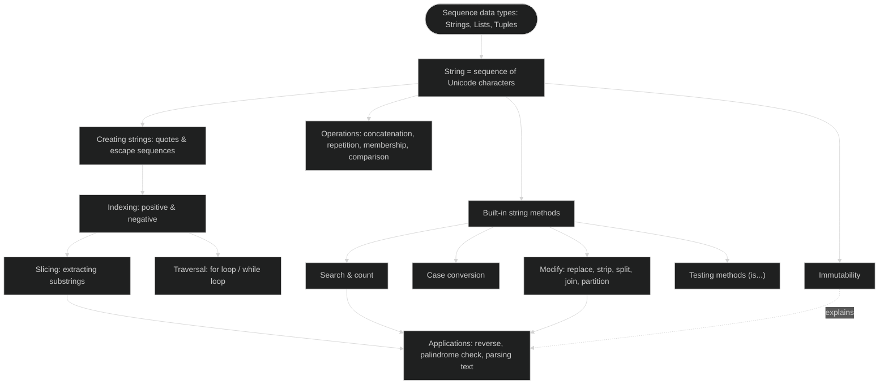
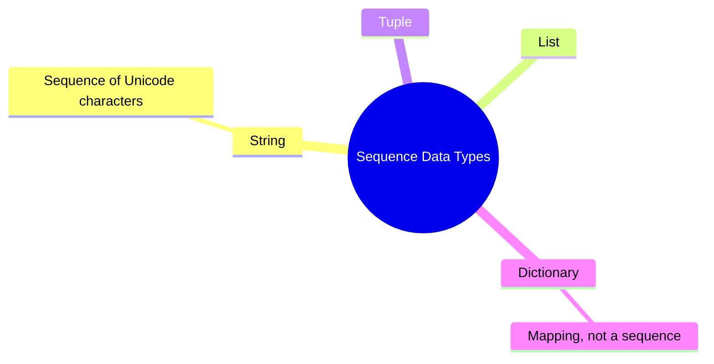
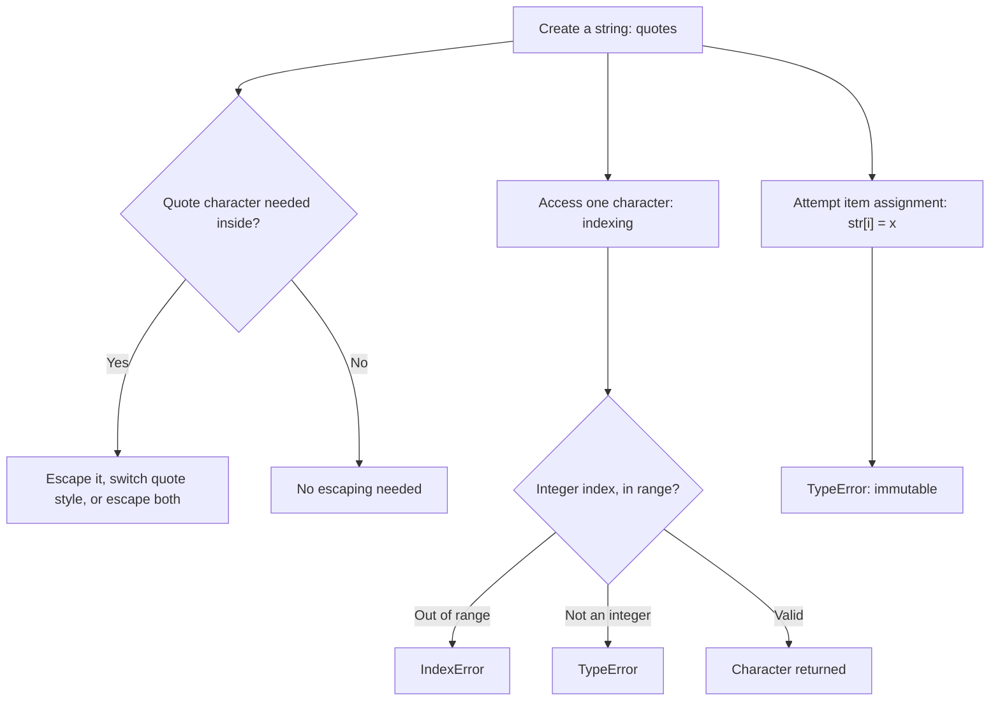
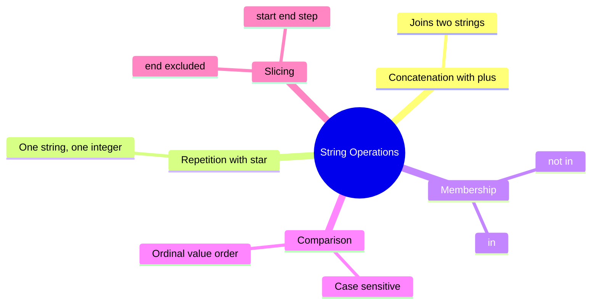
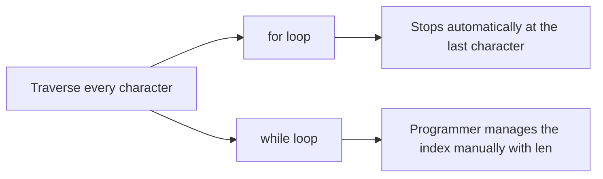
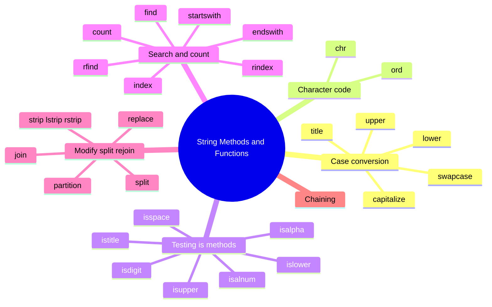
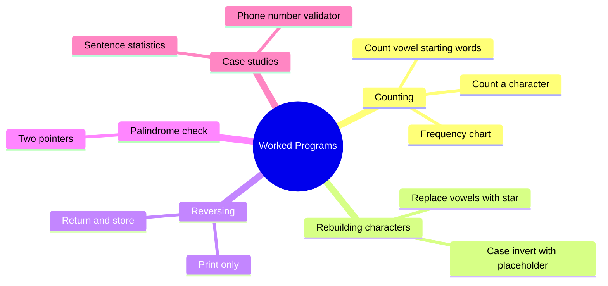
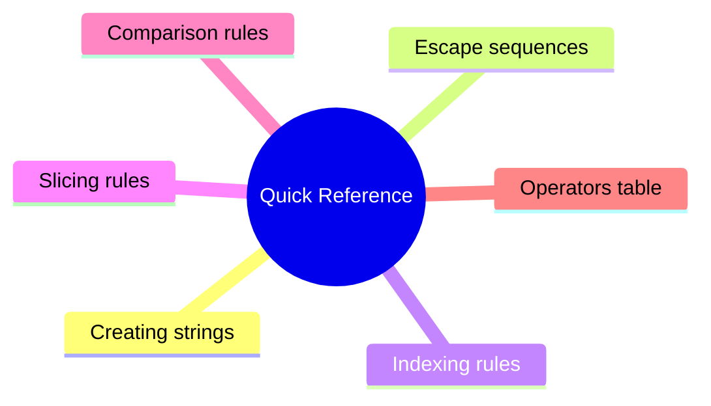
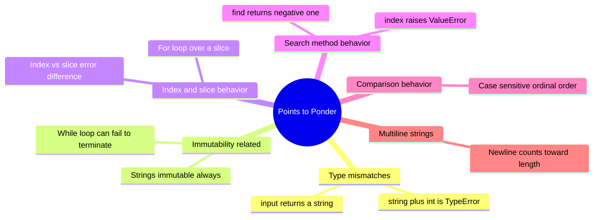
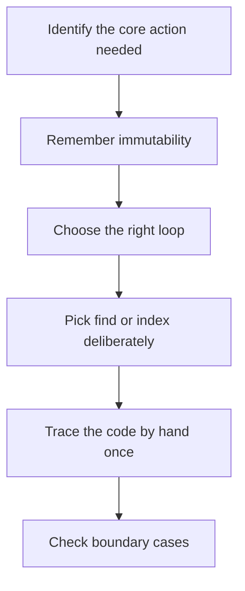

# Computer Science | Chapter 06 | Strings in Python | CNOTES

- Branch: Strings, Lists, Tuples & Dictionaries.
- Level: Class XI (CBSE/NCERT).
- Python version assumed: Python 3.x.
- A string is a sequence of characters.
- Analogy: a necklace is a sequence of beads.
- Primary source: NCERT *Computer Science – Class XI*, Chapter 8 "Strings" — section numbers here follow this book.
- Supplementary source: *Computer Science with Python–XI*, Chapter 7 "Strings in Python."
- The supplementary source's extra material (escape-sequence detail, the full method reference, comparison operators, extra worked programs) is folded in as labelled subsections and examples.
- Numbering key: `§8.x` sections follow NCERT's own numbers where NCERT has one.
- `§8.2.1` is a supplementary insertion (quoting/escape rules).
- That insertion shifts NCERT's own `8.2.1 Accessing Characters` down to `§8.2.2` here.
- It shifts NCERT's own `8.2.2 Immutability` down to `§8.2.3` here.
- Sub-parts with no number of their own in either textbook get letter-suffixed tags in the order they appear: `§8.5a`, `§8.6a`, etc.
- Cross-cutting sections that aren't chapter content get bracketed tags instead of numbers: `[ROADMAP]`, `[QR]` (Quick Reference), `[PTP]` (Points to Ponder — callouts individually numbered `PTP-1`…`PTP-9`), `[PSS]` (Problem-Solving Strategy).

## Concept Roadmap [ROADMAP]



- A string is an ordered, indexed, immutable sequence.
- Ordering is why indexing and slicing exist.
- Immutability is why every method returns a *new* string.

## §8.1 — Introduction



- A sequence is an orderly collection of items.
- Each item in a sequence is indexed by an integer. §8.1
- `String`, `List`, and `Tuple` are sequence types in Python. §8.1
- `Dictionary` is a *mapping* type, not a sequence. §8.1
- Dictionary is covered separately (a different chapter). §8.1
- This chapter studies strings — sequences made of `UNICODE` characters. §8.1
- Each character can be a letter, digit, whitespace, or any other symbol. §8.1
- ⚠ Python has no separate character type — a length-one string is itself a character, and therefore also a substring. §8.1

## §8.2 — Strings



- A string is created by enclosing one or more characters in quotes. §8.2
- Valid quote styles: single `'...'`, double `"..."`, triple `'''...'''` or `"""..."""`. §8.2
- Python treats single and double quotes identically. §8.2
- Example: `str1 = 'Hello World!'`, `str2 = "Hello World!"`, `str3 = """Hello World!"""`, `str4 = '''Hello World!'''`. §8.2
- All four variables above hold the same value `'Hello World!'`. §8.2
- Triple quotes can span multiple lines. §8.2
- Single and double quotes cannot span multiple lines directly. §8.2
- Multiline example: `str3 = """Hello World!` (newline) `welcome to the world of Python"""`. §8.2
- An empty string is written `''` or `""`. §8.2
- An empty string has zero characters. §8.2
- An empty string is a perfectly valid string. §8.2
- `len()` of an empty string is `0`. §8.2

### §8.2.1 — Quoting Rules and Escape Sequences

- Source: *Computer Science with Python–XI*, §7.2–7.3.
- A string may need to contain the same quote character used to enclose it. §8.2.1
- There are three ways to include a quote character inside a string without ending it early. §8.2.1
- Method 1 — escape the quote with a backslash `\`. §8.2.1
- Method 1 works inside either quote style. §8.2.1
- Method 1 example: `a = "This is Meera\'s pen."` prints `This is Meera's pen.` §8.2.1
- Method 2 — switch the enclosing quote style so the inner quote needs no escaping. §8.2.1
- Method 2 example: `c = 'Write an article on "AI" briefly.'` prints `Write an article on "AI" briefly.` §8.2.1
- Method 3 — escape both quote characters, if the string contains *both* single and double quotes. §8.2.1
- Leaving either quote character un-escaped when both appear is a `SyntaxError`. §8.2.1
- Method 3 example: `d = 'She said, "I\'ll call you."'` prints `She said, "I'll call you."` §8.2.1

| Escape sequence | Meaning | Effect |
| --- | --- | --- |
| `\'` | Single quote | Inserts `'` without ending the string |
| `\"` | Double quote | Inserts `"` without ending the string |
| `\\` | Backslash | Inserts a literal `\` |
| `\n` | Newline | Forces output onto the next line |
| `\t` | Tab | Inserts horizontal space in output |
| `\` at end of a physical line | Line continuation | Statement spans two source lines; output stays on one line (not the same as `\n`) |

- ⚠ An escape sequence like `\'` counts as ONE character, not two — `len("Meera\'s")` counts `\'` as a single `'`. §8.2.1

### §8.2.2 — Accessing Characters in a String (Indexing)

- Each character in a string can be accessed using its index (subscript). §8.2.2
- The index is written in square brackets `[ ]`. §8.2.2
- Indexing starts at `0`. §8.2.2
- The index must be an integer. §8.2.2
- A float index raises `TypeError`. §8.2.2
- An out-of-range integer index raises `IndexError`. §8.2.2
- Locker analogy (*Computer Science with Python–XI*): each character sits in its own numbered locker, retrieved directly by locker number. §8.2.2
- Positive indexing runs left to right. §8.2.2
- The first character is `str[0]`. §8.2.2
- The last character is `str[n-1]`, where `n = len(str)`. §8.2.2
- Negative indexing runs right to left. §8.2.2
- The last character is `str[-1]`. §8.2.2
- The first character is `str[-n]`. §8.2.2

```svg
<svg viewBox="0 0 620 130" xmlns="http://www.w3.org/2000/svg" style="max-width:100%;height:auto" font-family="sans-serif">
  <rect x="10" y="45" width="46" height="40" fill="#ffffff" stroke="#262626" stroke-width="1.5"/>
  <text x="33" y="30" font-size="11" text-anchor="middle" fill="#1565c0">0</text>
  <text x="33" y="70" font-size="15" text-anchor="middle" fill="#262626">H</text>
  <text x="33" y="100" font-size="11" text-anchor="middle" fill="#c62828">-12</text>

  <rect x="60" y="45" width="46" height="40" fill="#ffffff" stroke="#262626" stroke-width="1.5"/>
  <text x="83" y="30" font-size="11" text-anchor="middle" fill="#1565c0">1</text>
  <text x="83" y="70" font-size="15" text-anchor="middle" fill="#262626">e</text>
  <text x="83" y="100" font-size="11" text-anchor="middle" fill="#c62828">-11</text>

  <rect x="110" y="45" width="46" height="40" fill="#ffffff" stroke="#262626" stroke-width="1.5"/>
  <text x="133" y="30" font-size="11" text-anchor="middle" fill="#1565c0">2</text>
  <text x="133" y="70" font-size="15" text-anchor="middle" fill="#262626">l</text>
  <text x="133" y="100" font-size="11" text-anchor="middle" fill="#c62828">-10</text>

  <rect x="160" y="45" width="46" height="40" fill="#ffffff" stroke="#262626" stroke-width="1.5"/>
  <text x="183" y="30" font-size="11" text-anchor="middle" fill="#1565c0">3</text>
  <text x="183" y="70" font-size="15" text-anchor="middle" fill="#262626">l</text>
  <text x="183" y="100" font-size="11" text-anchor="middle" fill="#c62828">-9</text>

  <rect x="210" y="45" width="46" height="40" fill="#ffffff" stroke="#262626" stroke-width="1.5"/>
  <text x="233" y="30" font-size="11" text-anchor="middle" fill="#1565c0">4</text>
  <text x="233" y="70" font-size="15" text-anchor="middle" fill="#262626">o</text>
  <text x="233" y="100" font-size="11" text-anchor="middle" fill="#c62828">-8</text>

  <rect x="260" y="45" width="46" height="40" fill="#f5f5f5" stroke="#262626" stroke-width="1.5"/>
  <text x="283" y="30" font-size="11" text-anchor="middle" fill="#1565c0">5</text>
  <text x="283" y="70" font-size="14" text-anchor="middle" fill="#757575">&#9251;</text>
  <text x="283" y="100" font-size="11" text-anchor="middle" fill="#c62828">-7</text>

  <rect x="310" y="45" width="46" height="40" fill="#ffffff" stroke="#262626" stroke-width="1.5"/>
  <text x="333" y="30" font-size="11" text-anchor="middle" fill="#1565c0">6</text>
  <text x="333" y="70" font-size="15" text-anchor="middle" fill="#262626">W</text>
  <text x="333" y="100" font-size="11" text-anchor="middle" fill="#c62828">-6</text>

  <rect x="360" y="45" width="46" height="40" fill="#ffffff" stroke="#262626" stroke-width="1.5"/>
  <text x="383" y="30" font-size="11" text-anchor="middle" fill="#1565c0">7</text>
  <text x="383" y="70" font-size="15" text-anchor="middle" fill="#262626">o</text>
  <text x="383" y="100" font-size="11" text-anchor="middle" fill="#c62828">-5</text>

  <rect x="410" y="45" width="46" height="40" fill="#ffffff" stroke="#262626" stroke-width="1.5"/>
  <text x="433" y="30" font-size="11" text-anchor="middle" fill="#1565c0">8</text>
  <text x="433" y="70" font-size="15" text-anchor="middle" fill="#262626">r</text>
  <text x="433" y="100" font-size="11" text-anchor="middle" fill="#c62828">-4</text>

  <rect x="460" y="45" width="46" height="40" fill="#ffffff" stroke="#262626" stroke-width="1.5"/>
  <text x="483" y="30" font-size="11" text-anchor="middle" fill="#1565c0">9</text>
  <text x="483" y="70" font-size="15" text-anchor="middle" fill="#262626">l</text>
  <text x="483" y="100" font-size="11" text-anchor="middle" fill="#c62828">-3</text>

  <rect x="510" y="45" width="46" height="40" fill="#ffffff" stroke="#262626" stroke-width="1.5"/>
  <text x="533" y="30" font-size="11" text-anchor="middle" fill="#1565c0">10</text>
  <text x="533" y="70" font-size="15" text-anchor="middle" fill="#262626">d</text>
  <text x="533" y="100" font-size="11" text-anchor="middle" fill="#c62828">-2</text>

  <rect x="560" y="45" width="46" height="40" fill="#e3f2fd" stroke="#1565c0" stroke-width="1.5"/>
  <text x="583" y="30" font-size="11" text-anchor="middle" fill="#1565c0">11</text>
  <text x="583" y="70" font-size="15" text-anchor="middle" fill="#262626">!</text>
  <text x="583" y="100" font-size="11" text-anchor="middle" fill="#c62828">-1</text>
</svg>
```

- Figure key: blue numbers above each box are positive indices, red numbers below are negative indices, for `str1 = 'Hello World!'`. §8.2.2
- The shaded box (`!`, index `11` or `-1`) is the last character either way. §8.2.2
- `str1[len(str1)-1]` and `str1[-1]` always agree. §8.2.2
- The gap at index `5` is the space character. §8.2.2

| Expression | Result |
| --- | --- |
| `str1[0]` | `'H'` — first character |
| `str1[6]` | `'W'` — an ordinary positive index |
| `str1[11]` | `'!'` — last character |
| `str1[15]` | `IndexError: string index out of range` |
| `str1[1.5]` | `TypeError: string indices must be integers` |
| `str1[-1]` | `'!'` — first character counting from the right |
| `str1[-12]` | `'H'` — last character counting from the right |

*(for `str1 = 'Hello World!'`)* §8.2.2

- The index can be any expression that evaluates to an integer. §8.2.2
- Example: `str1[2+4]` is valid and gives `str1[6]` → `'W'`. §8.2.2
- `len()` is the built-in function that gives a string's length. §8.2.2
- `len(str1)` → `12`. §8.2.2
- `str1[len(str1)-1]` → `'!'` (last character, computed generically). §8.2.2
- `str1[-len(str1)]` → `'H'` (first character, computed generically). §8.2.2

### §8.2.3 — String is Immutable

- Once created, the contents of a string cannot be changed. §8.2.3
- Trying to assign to an index is always a `TypeError`. §8.2.3
- Example: `str1 = "Hello World!"`; `str1[1] = 'a'` → `TypeError: 'str' object does not support item assignment`. §8.2.3
- ⚠ Immutable ≠ can't reassign the variable — `str1 = "abc"` then `str1 = "xyz"` is legal (rebinding); editing a character inside the existing object is what's illegal. §8.2.3
- Every string method that appears to "modify" a string (`.replace()`, `.upper()`, `.strip()`, …) builds and returns a new string. §8.2.3
- The original string is left untouched by every such method. §8.2.3

## §8.3 — String Operations



- Python supports concatenation, repetition, membership, comparison, and slicing on strings. §8.3

### §8.3.1 — Concatenation (`+`)

- `+` joins two strings into a new one. §8.3.1
- Both operands must be strings. §8.3.1
- Example: `str1 = 'Hello'`, `str2 = 'World!'`, `str1 + str2` → `'HelloWorld!'`. §8.3.1
- `str1` and `str2` remain unchanged after concatenation. §8.3.1
- Example: `2 + 'book'` → `TypeError: unsupported operand type(s) for +: 'int' and 'str'`. §8.3.1
- `+` means addition between two numbers. §8.3.1
- `+` means concatenation between two strings. §8.3.1
- Python decides which meaning applies by operand type. §8.3.1
- Python never silently converts one type to the other for `+`. §8.3.1
- `6 + 3` is `9`. §8.3.1
- `'6' + '3'` is `'63'`. §8.3.1
- `'6' + 3` is a `TypeError`. §8.3.1
- Two string literals side by side, with no operator, also concatenate. §8.3.1
- Example: `"Good " " Morning"` → `"Good  Morning"`, exactly as if `+` had been written. §8.3.1
- Adjacent-literal concatenation only works for literal quoted strings sitting next to each other in source code. §8.3.1
- It does not work for variables — `str1 str2` (no `+`) is a `SyntaxError`. §8.3.1
- `str1 + str2` is required once names are involved. §8.3.1

### §8.3.2 — Repetition (`*`)

- `*` repeats a string a given number of times. §8.3.2
- One operand must be a string, the other an integer. §8.3.2
- Example: `str1 = 'Hello'`, `str1 * 2` → `'HelloHello'`, `str1 * 5` → `'HelloHelloHelloHelloHello'`. §8.3.2
- `'3' * '5'` → `TypeError: can't multiply sequence by non-int of type 'str'`. §8.3.2
- `str1` is unchanged after repetition. §8.3.2
- A new string is returned by repetition, as with every string operation. §8.3.2

### §8.3.3 — Membership (`in` / `not in`)

- `in` returns `True` if the first string appears as a substring anywhere in the second. §8.3.3
- `not in` returns the opposite of `in`. §8.3.3
- Both operands of `in`/`not in` must be of string type. §8.3.3
- The membership test is case-sensitive. §8.3.3
- Example set, for `str1 = 'Hello World!'`: `'W' in str1` → `True`; `'Wor' in str1` → `True`; `'My' in str1` → `False`; `'My' not in str1` → `True`; `'HEL' in 'Hello'` → `False` (case-sensitive). §8.3.3

### §8.3.4 — Comparison Operators

- Source: *Computer Science with Python–XI*, §7.6.4.
- Strings can be compared with `>`, `<`, `>=`, `<=`, `==`, `!=`. §8.3.4
- Python compares strings character by character using ASCII/Unicode ordinal values. §8.3.4
- Ordinal values are also called ordinal values (the chapter's own term). §8.3.4
- Comparison stops at the first pair of characters that differ. §8.3.4
- Later characters are never looked at once a difference is found. §8.3.4

| Characters | Ordinal values |
| --- | --- |
| `'0'` to `'9'` | 48 to 57 |
| `'A'` to `'Z'` | 65 to 90 |
| `'a'` to `'z'` | 97 to 122 |

- Example: `str1 = "Mary"`, `str2 = "Mac"`, `str1 < str2` → `False`. §8.3.4
- Trace: `'M'=='M'` (equal) → `'a'=='a'` (equal) → `'r'` vs `'c'`: `ord('r') > ord('c')`. §8.3.4
- Therefore `str1 > str2`. §8.3.4
- `str1 < str2` is `False`. §8.3.4
- `'tim' == 'tie'` → `False`. §8.3.4
- `"free" != "freedom"` → `True`. §8.3.4
- `"arrow" > "aron"` → `True`. §8.3.4
- `"teeth" < "tee"` → `False` — `"tee"` is a prefix of `"teeth"`; a prefix compares as smaller. §8.3.4
- `"abc" > ""` → `True` — any non-empty string is greater than an empty one. §8.3.4
- ⚠ Uppercase compares "less than" lowercase — ordinals 65–90 vs 97–122 — so `"Apple" < "apple"` is `True`, not human alphabetical order. §8.3.4

### §8.3.5 — Slicing

- Slicing retrieves a substring (a "slice") from a string. §8.3.5
- Slicing needs no loop. §8.3.5
- Syntax: `string_name[start : end : step]`. §8.3.5
- `end` is always excluded. §8.3.5
- `string_name[n:m]` returns characters `string_name[n]` through `string_name[m-1]`. §8.3.5
- That range holds `m - n` characters. §8.3.5

| Expression | Result | for `str1 = 'Hello World!'` |
| --- | --- | --- |
| `str1[1:5]` | `'ello'` | indices 1,2,3,4 |
| `str1[7:10]` | `'orl'` | indices 7,8,9 |
| `str1[3:20]` | `'lo World!'` | out-of-range end truncates, no error |
| `str1[7:2]` | `''` | start > end, default step → empty string, no error |
| `str1[:5]` | `'Hello'` | start omitted ⟹ starts from index 0 |
| `str1[6:]` | `'World!'` | end omitted ⟹ goes to the end |
| `str1[:]` | `'Hello World!'` | both omitted ⟹ the whole string |
| `str1[0:10:2]` | `'HloWr'` | step 2 ⟹ every 2nd character |
| `str1[0:10:3]` | `'HlWl'` | step 3 ⟹ every 3rd character |
| `str1[-6:-1]` | `'World'` | negative indices work in slices too |
| `str1[::-1]` | `'!dlroW olleH'` | step -1 reverses the whole string |

- ⚠ Slicing never raises `IndexError` — out-of-range bounds truncate silently, and `start > end` (default step) just returns `''`; the sharpest difference from plain indexing. §8.3.5
- Step-size example, source *Computer Science with Python–XI* §7.6.5, Example 1: `alphabet_string = "ABCDEFGHIJKLMNOPQRSTUVWXYZ"`. §8.3.5
- `alphabet_string[6:15:1]` → `'GHIJKLMNO'`. §8.3.5
- `alphabet_string[6:15:2]` → `'GIKMO'`. §8.3.5
- `step=1` sliced out all nine letters `G` through `O`. §8.3.5
- `step=2` kept only every alternate one of those nine (`G, I, K, M, O`). §8.3.5

**Worked slice table**, for `A = "SAVE MONEY"`:

| String A | S | A | V | E | (space) | M | O | N | E | Y |
| --- | --- | --- | --- | --- | --- | --- | --- | --- | --- | --- |
| Positive index | 0 | 1 | 2 | 3 | 4 | 5 | 6 | 7 | 8 | 9 |
| Negative index | -10 | -9 | -8 | -7 | -6 | -5 | -4 | -3 | -2 | -1 |

- `A[1:3]` → `'AV'`. §8.3.5
- `A[:3]` → `'SAV'`. §8.3.5
- `A[3:]` → `'E MONEY'`. §8.3.5
- `A[:]` → `'SAVE MONEY'`. §8.3.5
- `A[-2:]` → `'EY'`. §8.3.5
- `A[:-2]` → `'SAVE MON'`. §8.3.5
- `A[::2]` → `'SV OE'`. §8.3.5
- Extra slicing practice, source *Computer Science with Python–XI*, Solved Question 6: `x = "AmaZing"` (7 characters). §8.3.5
- `x[3:]` and `x[:2]` → `'Zing and Am'`. §8.3.5
- `x[-7:]` and `x[-4:-2]` → `'AmaZing and Zi'`. §8.3.5
- `x[2:7]` and `x[-4:-1]` → `'aZing and Zin'`. §8.3.5
- `x[-7:]` starts at index `-7` — that is index `0` here — printing the whole string. §8.3.5
- `x[-4:-2]` and `x[2:7]` land on the same middle stretch reached from opposite ends. §8.3.5
- A positive-index slice and a negative-index slice can describe identical substrings. §8.3.5
- Growing-substring pattern, source *Computer Science with Python–XI*, Practical Implementation-3. §8.3.5
- Code: `name = input("Enter any name: ")`; `for i in range(1, len(name)+1): print(name[0:i])`. §8.3.5
- For `name = "ANAND"` (5 characters), `i` runs `1, 2, 3, 4, 5`. §8.3.5
- `name[0:i]` grows by one character each time: `A / AN / ANA / ANAN / ANAND`. §8.3.5
- ⚠ `range()` must start at `1`, not `0`, here — starting at `0` adds an extra empty first line (`name[0:0]`) before `A`. §8.3.5

## §8.4 — Traversing a String



- Traversal means accessing each character of a string one after another. §8.4
- Traversal uses either a `for` loop or a `while` loop. §8.4
- (A) `for` loop — stops automatically after the last character. §8.4
- Example: `str1 = 'Hello World!'`; `for ch in str1: print(ch, end='')` → `Hello World!`. §8.4
- (B) `while` loop — the programmer explicitly manages the index using `len()`. §8.4
- Example: `str1 = 'Hello World!'`; `index = 0`; `while index < len(str1): print(str1[index], end=''); index += 1` → `Hello World!`. §8.4
- The `while` loop runs exactly while `index < len(str1)` is `True`. §8.4
- `index` goes from `0` to `len(str1) - 1`. §8.4

## §8.5 — String Methods and Built-in Functions



- A method call has the syntax `string_object.methodName()`. §8.5
- Every method returns a new string (or other value). §8.5
- The original string object is never modified by any method (per §8.2.3). §8.5

### §8.5a — Length, Case Conversion, Character-Code Functions

| Method / function | Syntax | Returns | Example → Result |
| --- | --- | --- | --- |
| `len()` | `len(str)` | Number of characters (an escaped character like `\'` counts as one) | `len('Hello World!')` → `12` |
| `capitalize()` | `str.capitalize()` | Copy with the first character uppercased, every other character lowercased | `'welcome'.capitalize()` → `'Welcome'` |
| `title()` | `str.title()` | Copy with the first letter of every word uppercased, rest lowercased | `'hello ITS all about STRINGS!!'.title()` → `'Hello Its All About Strings!!'` |
| `lower()` | `str.lower()` | All-lowercase copy | `'Learning PYTHON'.lower()` → `'learning python'` |
| `upper()` | `str.upper()` | All-uppercase copy | `'Welcome'.upper()` → `'WELCOME'` |
| `swapcase()` | `str.swapcase()` | Copy with every letter's case flipped | `'Welcome'.swapcase()` → `'wELCOME'` |
| `ord()` | `ord(char)` | Unicode/ASCII ordinal (integer) of a single-character string | `ord('A')` → `65` |
| `chr()` | `chr(number)` | The character for a given Unicode/ASCII ordinal | `chr(97)` → `'a'` |

- `capitalize()` touches only the string's very first character. §8.5a
- `capitalize()` forces every other character to lowercase. §8.5a
- `title()` touches the first letter of every word. §8.5a
- `'hello world'.capitalize()` → `'Hello world'`. §8.5a
- `'hello world'.title()` → `'Hello World'`. §8.5a

### §8.5b — Testing Methods (`is...` — always return a `bool`)

| Method | Returns `True` when… | Example → Result |
| --- | --- | --- |
| `isalpha()` | Non-empty and every character is a letter | `'Good'.isalpha()` → `True`; `'This is a string'.isalpha()` → `False` (spaces) |
| `isdigit()` | Non-empty and every character is a digit | `'123456'.isdigit()` → `True`; `'Ram bagged 1st position'.isdigit()` → `False` |
| `isalnum()` | Non-empty and every character is a letter or digit | `'Python38'.isalnum()` → `True`; `'Python 3.8'.isalnum()` → `False` |
| `isspace()` | Non-empty and every character is whitespace | `' \n \t \r'.isspace()` → `True` |
| `islower()` | Non-empty, at least one cased character, every cased character lowercase | `'python'.islower()` → `True`; `'Python'.islower()` → `False` |
| `isupper()` | Same idea, for uppercase | `'PYTHON'.isupper()` → `True` |
| `istitle()` | Non-empty and title-cased | `'All Learn Python'.istitle()` → `True`; `'PYTHON'.istitle()` → `False` |

### §8.5c — Search, Count, and Prefix/Suffix Tests

| Method | Syntax | Returns | Example → Result |
| --- | --- | --- | --- |
| `find()` | `str.find(sub, start, end)` | Lowest index of `sub`, or `-1` if not found; never raises an error | `'Green revolution'.find('green')` → `-1` (case-sensitive) |
| `index()` | `str.index(sub, start, end)` | Same as `find()`, but raises `ValueError` if not found | `'Hello ITS all about STRINGS!!'.index('Hi')` → `ValueError: substring not found` |
| `count()` | `str.count(sub, start, end)` | Number of non-overlapping occurrences of `sub` in the given range | `'Hello World! Hello Hello'.count('Hello')` → `3`; `.count('Hello',12,25)` → `2` |
| `startswith()` | `str.startswith(sub)` | `True`/`False` | `'Machine Learning'.startswith('Mac')` → `True` |
| `endswith()` | `str.endswith(sub)` | `True`/`False` | `'Artificial Intelligence'.endswith('Artificial')` → `False` |
| `rfind()` *(New)* | `str.rfind(sub, start, end)` | Highest (rightmost) index of `sub`, or `-1` if not found | `'WZ-1,New Ganga Nagar,New Delhi'.rfind('New')` → `21` (`find()` on the same string gives `5`) |

- ⚠ `find()` returns `-1` on failure, `index()` raises `ValueError` on failure — same search, different failure behaviour; use `find()` when "not found" is normal, `index()` when it must exist. §8.5c
- `rindex()` is to `rfind()` exactly as `index()` is to `find()` — it raises `ValueError` instead of returning `-1`. §8.5c
- Gap between the two textbooks: `rfind()` is taught in neither source's body text. §8.5c
- NCERT's own end-of-chapter exercise (`myAddress.rfind('New')`) requires `rfind()`. §8.5c
- `rfind()`/`rindex()` are added here to close that gap. §8.5c

### §8.5d — Modify, Split, and Rejoin

| Method | Syntax | Returns | Example → Result |
| --- | --- | --- | --- |
| `replace()` | `str.replace(old, new)` | Copy with every occurrence of `old` swapped for `new` | `'This is a string example'.replace('is','was')` → `'Thwas was a string example'` |
| `strip()` | `str.strip([chars])` | Copy with matching characters removed from both ends (default: whitespace) | `'  Hello World!  '.strip()` → `'Hello World!'` |
| `lstrip()` | `str.lstrip([chars])` | Copy with matching characters removed from the left only | `'Green Revolution'.lstrip('Gr')` → `'een Revolution'` |
| `rstrip()` | `str.rstrip([chars])` | Copy with matching characters removed from the right only | `'Computers'.rstrip('rs')` → `'Compute'` |
| `split()` | `str.split(sep, maxsplit)` | A list of substrings, cut at `sep` (default: any whitespace) | `'Love your country'.split()` → `['Love', 'your', 'country']` |
| `join()` | `separator.join(sequence)` | A string formed by placing `separator` between every element of `sequence` | `'-'.join('12345')` → `'1-2-3-4-5'` |
| `partition()` | `str.partition(sep)` | A 3-tuple `(before, sep, after)`; if `sep` is absent, `(whole_string, '', '')` | `'xyz@gmail.com'.partition('@')` → `('xyz', '@', 'gmail.com')` |

- ⚠ `strip()`/`lstrip()`/`rstrip()`'s `chars` argument is a character SET, not a literal prefix/suffix — order doesn't matter: `.lstrip('Gr')` and `.lstrip('rG')` both give `'een Revolution'`. §8.5d
- `split()`'s second argument, `maxsplit`, caps the number of cuts. §8.5d
- `maxsplit` produces at most `maxsplit + 1` pieces. §8.5d
- `grocery = 'Red:Blue:Orange:Pink'`. §8.5d
- `grocery.split(':')` → `['Red', 'Blue', 'Orange', 'Pink']`. §8.5d
- `grocery.split(':', 1)` → `['Red', 'Blue:Orange:Pink']` (only 1 cut made). §8.5d
- `grocery.split(':', 0)` → `['Red:Blue:Orange:Pink']` (0 cuts ⟹ original string as the sole list item). §8.5d
- `split()` and `join()` are inverses of each other. §8.5d
- `sep.join(str.split(sep))` reconstructs the original string. §8.5d
- This pairing is the standard technique for "replace every space with a hyphen"-style problems. §8.5d

### §8.5e — Chaining String Methods

- Source: *Computer Science with Python–XI*, "Above Functions in a Nutshell."
- Every method returns a string, a `bool`, or an `int`. §8.5e
- Method calls can be chained. §8.5e
- The next call in a chain runs on the value the previous one produced, strictly left to right. §8.5e
- `"Hello World".upper().lower()` → `'hello world'`. §8.5e
- `"Hello World".lower().upper()` → `'HELLO WORLD'`. §8.5e
- `"Hello World".find("Wor", 1, 6)` → `-1` (`"Wor"` does not occur inside the slice `[1:6)`). §8.5e
- `"Hello World".find("Wor")` → `6`. §8.5e
- `"Hello World".isalpha()` → `False` (contains a space). §8.5e
- `"Hello World".isalnum()` → `False` (contains a space). §8.5e
- `"1234".isdigit()` → `True`. §8.5e
- `"123GH".isdigit()` → `False` (contains letters). §8.5e
- `"Hello World".endswith("World")` → `True`. §8.5e
- `"Hello World".endswith("rld")` → `True`. §8.5e
- `"Hello World".endswith("Wor")` → `False`. §8.5e
- `"Hello World".startswith("Hello")` → `True`. §8.5e
- In a chain, whichever method is called last decides the final result. §8.5e
- `.upper().lower()` always ends up lowercase. §8.5e
- `.lower().upper()` always ends up uppercase. §8.5e

## §8.6 — Handling Strings — Worked Programs



### §8.6a — Count occurrences of a character (NCERT Program 8-1)

- Method: `charCount(ch, st)` traverses `st` with a `for` loop. §8.6a
- The counter increments each time a character equals `ch`. §8.6a
- The function returns the count. §8.6a
- For `st = "Today is a Holiday"`, `ch = "a"` → count `3`. §8.6a

### §8.6b — Replace every vowel with `*` (NCERT Program 8-2)

- Method: `replaceVowel(st)` builds a new string character by character. §8.6b
- A new string is required. §8.6b
- Strings are immutable — no in-place edit exists. §8.2.3, §8.6b
- Every vowel (`a,e,i,o,u`, either case) is replaced by `'*'`. §8.6b
- For `st = "Hello World"` → `'H*ll* W*rld'`. §8.6b

### §8.6c — Counting vowel-starting words (*Computer Science with Python–XI*, Solved Question 24)

- Method: `VowCount()` splits a sentence into words with `split()`. §8.6c
- Each word's first character (`word[0]`) is tested against vowels, either case. §8.6c
- This is a word-level classification, unlike Program 8-2's character-level substitution. §8.6c
- For `"Updated information is simplified by official websites."` → matching words `Updated`, `information`, `is`, `official`. §8.6c
- `Vowelwords: 4`. §8.6c

### §8.6d — Case conversion with a placeholder for non-letters (*Computer Science with Python–XI*, Solved Question 8)

- Method: for each character of `Text`, uppercase letters are lowercased. §8.6d
- Other letters are uppercased. §8.6d
- Non-letters are replaced with the placeholder `'bb'`. §8.6d
- For `Text = "gmail@com"` → `'GMAILbbCOM'`. §8.6d

### §8.6e — Reverse a string without building a new one (NCERT Program 8-3 / *Computer Science with Python–XI*, Practical Implementation-2)

- Method: walk the string backwards with `range(-1, -len(st)-1, -1)`. §8.6e
- Each character is printed, not stored. §8.6e
- Both textbooks present this identical technique. §8.6e
- For `st = "Hello World"` → prints `dlroW olleH`. §8.6e
- The one-liner alternative `st[::-1]` (§8.3.5) does the same reversal. §8.6e
- `st[::-1]` builds a new string, unlike this loop. §8.6e

### §8.6f — Reverse a string using a function, storing the result (NCERT Program 8-4)

- Method: `reverseString(st)` accumulates `st[-1], st[-2], …` into `newstr` inside a loop. §8.6f
- The function returns `newstr`. §8.6f
- For `st = "Hello World"` (11 characters) → returns `'dlroW olleH'`. §8.6f
- Programs 8-3 and 8-4 use the identical backwards-`range()` idea. §8.6f
- Program 8-3 only displays the reversal (print, discard). §8.6f
- Program 8-4 keeps the reversal (return, store in `st1`). §8.6f

### §8.6g — Check whether a string is a palindrome (NCERT Program 8-5)

- A palindrome reads the same forwards and backwards, e.g. `Kanak`. §8.6g
- Method: `checkPalin(st)` uses two pointers, `i` from the front and `j` from the back. §8.6g
- `st[i]` is compared to `st[j]`, then the pointers move inward. §8.6g
- Any mismatch returns `False`. §8.6g
- No mismatch, once `i > j`, returns `True`. §8.6g
- Trace for `st = "kanak"` (length 5): `(i=0,j=4)` `k=k` → `(i=1,j=3)` `a=a` → `(i=2,j=2)` `n=n` (same index) → loop ends, `i>j`. §8.6g
- Result: `True` — `"kanak"` is a palindrome. §8.6g

### §8.6h — Frequency chart of a line of text (*Computer Science with Python–XI*, Practical Implementation-5)

- Method: traverse the line once. §8.6h
- Each character is classified with `islower()`/`isupper()`/`isdigit()`/`isalpha()`. §8.6h
- The matching counter is incremented for each character. §8.6h
- For `"Python for BIG data 2020"`: uppercase `= 4` (`P,B,I,G`). §8.6h
- Lowercase `= 12`. §8.6h
- Alphabets `= 16` (uppercase + lowercase). §8.6h
- Digits `= 4`. §8.6h
- ⚠ The textbook's own printed output for this program shows `5` uppercase / `11` lowercase (each off by one from a direct trace, though the total `16` still matches) — a scanned-answer-key artifact; trust the traced `4`/`12` split. §8.6h

### §8.6i — Case study: Validating a phone number (*Computer Science with Python–XI*, Case-Based Question 1)

- Valid format target: `017-555-1212` — 10 digits split `3-3-4`, joined by two dashes. §8.6i
- Method: check `len(p) == 12` and dashes at index `3` and index `7`. §8.6i
- Then slice out the two dashes: `p[0:3] + p[4:7] + p[8:]`. §8.6i
- Check `.isdigit()` on that sliced-together result. §8.6i
- For `p = "223098888"` (length `9`) → `"is invalid"` (length check already fails). §8.6i
- For `p = "989-234-3377"` (length `12`, dashes in place, digit check passes) → `"is valid"`. §8.6i
- The dashes are sliced *out* before calling `isdigit()`. §8.6i
- `isdigit()` on a string containing `'-'` would always be `False`. §8.6i
- The dashes are removed first for exactly that reason. §8.6i

### §8.6j — Case study: Sentence statistics without `split()` (*Computer Science with Python–XI*, Case-Based Question 2)

- Method: `number_of_words` starts at `1`. §8.6j
- The sentence is traversed once. §8.6j
- `number_of_words` increments on every space character. §8.6j
- `al_num` increments on every alphanumeric character. §8.6j
- Percentage = `al_num * 100 / len(s)`. §8.6j
- For `s = "This Utility is for Nursery KIDS"` (32 characters, 5 spaces): `number_of_words = 6`. §8.6j
- `number_of_characters = 32`. §8.6j
- `al_num = 27`. §8.6j
- `percentage = 84.375`. §8.6j
- `number_of_words` starts at `1`, not `0`. §8.6j
- *N* spaces always separate *N + 1* words. §8.6j

## Quick Reference — Cheat Sheet [QR]



| Style | Example | Notes |
| --- | --- | --- |
| Single quotes | `'Hello'` | Same as double quotes |
| Double quotes | `"Hello"` | Same as single quotes |
| Triple quotes | `'''Hello'''` / `"""Hello"""` | Only style that spans multiple lines directly |
| Empty string | `''` or `""` | Valid string, `len()` is `0` |

- Escape sequences: `\'` `\"` `\\` `\n` `\t`. §8.2.1
- Indexing: `str[i]` — positive `0` to `n-1`, negative `-1` to `-n`. §8.2.2
- Index must be `int` or `TypeError`. §8.2.2
- Out-of-range index is `IndexError`. §8.2.2
- Slicing: `str[start:end:step]` — `end` excluded. §8.3.5
- Out-of-range slice bounds truncate silently, never `IndexError`. §8.3.5
- `step=-1` reverses the string. §8.3.5
- Comparison operators `>`, `<`, `>=`, `<=`, `==`, `!=` compare by ASCII/Unicode ordinal value. §8.3.4
- Comparison is character by character, case-sensitive. §8.3.4
- `'A'`…`'Z'` = 65–90; `'a'`…`'z'` = 97–122. §8.3.4

| Operator | Operation | Example | Result |
| --- | --- | --- | --- |
| `+` | Concatenation | `'Good ' + 'Morning'` | `'Good Morning'` |
| `*` | Repetition | `3 * 'Hi '` | `'Hi Hi Hi '` |
| `in` | Membership | `'y' in 'Hello'` | `False` |
| `not in` | Membership | `'y' not in 'Hello'` | `True` |
| `[start:end:step]` | Slicing | `'Hello'[::-1]` | `'olleH'` |

## Points to Ponder [PTP]



- ⚠ PTP-1: `input()` always returns a string — `num1 * 2` on unconverted input repeats it (`'22'`) rather than doubling it; convert first with `int(num1) * 2`.
- ⚠ PTP-2: Strings are immutable, always — `str[i] = 'x'` is always `TypeError`; every "modifying" method (`replace()`, `upper()`, `strip()`) returns a new string that must be captured or it's lost.
- ⚠ PTP-3: Index vs. slice error behaviour differs — plain indexing out-of-range raises `IndexError`; slicing out-of-range truncates silently, no error.
- ⚠ PTP-4: `find()` returns `-1` on failure, `index()` raises `ValueError` on failure — interchangeable-looking but they fail completely differently. §8.5c
- ⚠ PTP-5: `str + int` is always `TypeError` — no auto-conversion either direction; `'Total: ' + 25` fails, `'Total: ' + str(25)` succeeds.
- ⚠ PTP-6: Case-sensitivity runs through the whole chapter — membership, comparison, and search are all case-sensitive; `"Apple" < "apple"` is `True` — uppercase ordinals sit lower.
- ⚠ PTP-7: A `for` loop over a slice iterates by the slice's length, not by what the loop body does — `for ch in s[3:8]: print('Python')` prints `'Python'` exactly `5` times regardless of `ch`.
- ⚠ PTP-8: A triple-quoted multiline string counts its own line breaks — the embedded `\n` is a real character included in `len(s)`.
- ⚠ PTP-9: A `while` loop can fail to terminate due to immutability — rebuilding a string that reproduces the same test condition never shrinks toward a base case.
- Example: `STR1 = STR1[0] + 'bb'` rebuilt when `STR1[0]` is already `'a'` reproduces the same condition every time. PTP-9
- Trace for input `'abcd'`: `'a' in 'abcd'` → `True` → `STR1='abb'` → loop again → `'a' in 'abb'` → still `True` → `STR1='abb'` again — a fixed point, never exits. PTP-9

## Problem-Solving Strategy [PSS]



- Step 1 — identify the core action needed: reading one character (→ indexing), extracting a run of characters (→ slicing), visiting every character (→ traversal with `for`/`while`), or transforming the whole string (→ a built-in method). [PSS]
- Step 2 — remember immutability: if the result must differ from the input, build a *new* string (accumulate in a loop, or call a method that returns one). Never plan to edit the original in place. [PSS]
- Step 3 — choose the right loop: a `for` loop for "do this to every character" with no early exit; a `while` loop for an explicit condition to track (two pointers converging, or a counted number of iterations against `len()`). [PSS]
- Step 4 — pick `find()` vs `index()` deliberately: `find()` when "not found" is a normal case, `index()` when it's an error case. [PSS]
- Step 5 — trace the code by hand once, on a short sample string, before trusting its output — especially for negative indices, slicing bounds, or a loop counter. [PSS]
- Step 6 — check boundary cases: the empty string, a single-character string, a string containing only spaces or only digits. [PSS]

## Rapid Reference

| Fact | Value |
| --- | --- |
| Sequence types in this branch | String, List, Tuple (Dictionary is a mapping, not a sequence) |
| Character type in Python | None — a length-one string is the character |
| Quote styles | single, double, triple — single/double treated identically |
| Only quote style spanning multiple lines directly | Triple (`'''`/`"""`) |
| Empty string length | `0` |
| Escape for single quote | `\'` |
| Escape for double quote | `\"` |
| Escape for backslash | `\\` |
| Escape for newline | `\n` |
| Escape for tab | `\t` |
| Line-continuation escape | `\` at end of source line (output stays on one line) |
| Escaped character length contribution | 1 character |
| First positive index | `0` |
| Last positive index | `n-1` |
| First negative index (last char) | `-1` |
| Last negative index (first char) | `-n` |
| Non-integer index result | `TypeError` |
| Out-of-range plain index result | `IndexError` |
| Out-of-range slice bound result | Silently truncated — no error |
| `str[i] = x` result | `TypeError` (immutable) |
| Reassigning the variable itself | Legal — rebinds the name |
| `+` between two strings | Concatenation |
| `+` between `str` and `int` | `TypeError` |
| `*` between a string and an integer | Repetition |
| `*` between two strings | `TypeError` |
| Adjacent literal strings, no operator | Auto-concatenate (literals only, not variables) |
| Membership operand type required | Both sides must be `str` |
| Membership/comparison/search case-sensitivity | Always case-sensitive |
| String comparison basis | ASCII/Unicode ordinal value, character by character |
| `'0'`–`'9'` ordinal range | 48–57 |
| `'A'`–`'Z'` ordinal range | 65–90 |
| `'a'`–`'z'` ordinal range | 97–122 |
| `"Apple" < "apple"` | `True` |
| Slicing syntax | `str[start:end:step]`, `end` excluded |
| `step=-1` | Reverses the string |
| `find()` on failure | Returns `-1` |
| `index()` on failure | Raises `ValueError` |
| `rfind()` vs `find()` | Rightmost match vs leftmost match |
| `rindex()` vs `index()` | Rightmost match, raises `ValueError` on failure |
| `capitalize()` scope | Whole string, first character only |
| `title()` scope | Every word's first letter |
| `isalnum()` condition | `isalpha()` OR `isdigit()`, for every character |
| `strip`/`lstrip`/`rstrip` `chars` argument | A character *set*, order irrelevant — not a literal prefix/suffix |
| `split()` default separator | Any whitespace |
| `split(sep, maxsplit)` piece count | At most `maxsplit + 1` |
| Inverse of `split()` | `join()` |
| Inverse of `ord()` | `chr()` |
| Method chaining result | Decided by whichever call is *last* |
| `for` loop over a slice, iteration count | Exactly `len(slice)`, regardless of loop body |
| Program 8-3 vs Program 8-4 | Print-only vs return-and-store the reversed string |
| Palindrome check technique | Two pointers, front and back, converging |
| Frequency-chart example traced result | 4 uppercase, 12 lowercase, 16 alphabets, 4 digits (textbook's printed 5/11 is an answer-key artifact) |
| Phone validator technique | Slice the two dashes out, then check `isdigit()` |
| Sentence-statistics word count starting value | `1` (N spaces separate N+1 words) |
