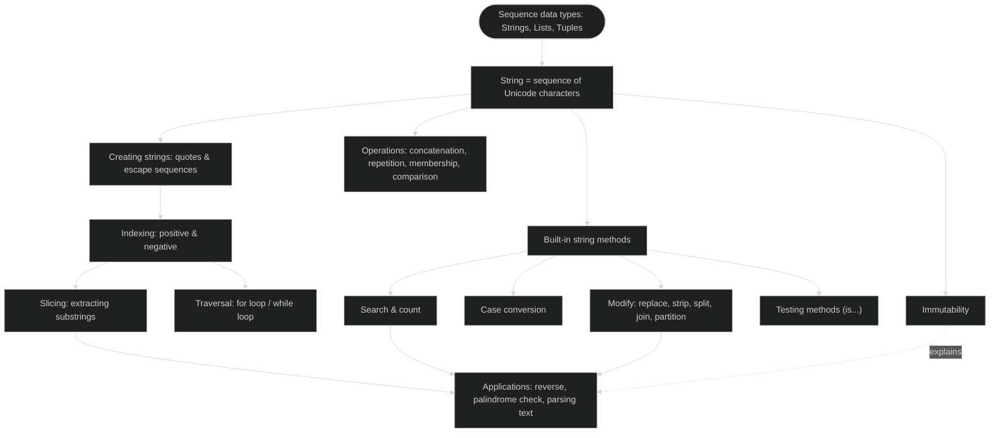

# Computer Science | Chapter 06 | STRINGS in PYTHON | NOTES

**Branch:** Strings, Lists, Tuples & Dictionaries · **Level:** Class XI (CBSE/NCERT) · **Python version assumed:** Python 3.x

> A `string` is a sequence of characters — the same way a necklace is a sequence of beads. This note builds up how Python creates, reads, compares, and reshapes that sequence, and where each operation quietly breaks if you forget that strings never change once made.

**Primary source:** NCERT *Computer Science – Class XI*, Chapter 8 "Strings" (section numbers below follow this book). **Supplementary source:** *Computer Science with Python–XI*, Chapter 7 "Strings in Python" — its extra material (escape-sequence detail, the full 25-method reference, comparison operators, extra worked programs) is folded in as labelled subsections and examples.

> **Numbering key** (referenced by GLOSSARY and CNOTES): `§8.x` sections follow NCERT's own numbers where NCERT has one. `§8.2.1` is a supplementary insertion (quoting/escape rules), which shifts NCERT's own `8.2.1 Accessing Characters` and `8.2.2 Immutability` down to `§8.2.2`/`§8.2.3` here — a deliberate, one-time renumbering, not a transcription error. Sub-parts with no number of their own in either textbook (the method-reference tables under §8.5, the worked programs under §8.6) are given letter-suffixed tags — `§8.5a`, `§8.6a`, etc. — in the order they appear. Cross-cutting sections that aren't chapter content get short bracketed tags instead of numbers: `[ROADMAP]`, `[QR]` (Quick Reference), `[PTP]` (Points to Ponder, with its callouts individually numbered `PTP-1`…`PTP-9`), `[PSS]` (Problem-Solving Strategy).

## Concept Roadmap [ROADMAP]



Every later idea in this chapter traces back to one fact: a string is an ordered, indexed, **immutable** sequence. Indexing and slicing exist because it is ordered; every method returns a *new* string because it is immutable.

## 8.1 Introduction ⭐

A **sequence** is an orderly collection of items where each item is indexed by an integer. `String`, `List`, and `Tuple` are all sequence types in Python; `Dictionary` is a *mapping* type, not a sequence (covered separately). This chapter studies strings — sequences made of `UNICODE` characters, where each character can be a letter, digit, whitespace, or any other symbol.

> **Key idea:** Python does not have a separate character data type. A string of length one *is* a character — and is therefore also, technically, a substring.

## 8.2 Strings ⭐

A string is created by enclosing one or more characters in single (`'...'`), double (`"..."`), or triple (`'''...'''` or `"""..."""`) quotes. Python treats single and double quotes identically — pick whichever avoids escaping.

```python
str1 = 'Hello World!'
str2 = "Hello World!"
str3 = """Hello World!"""
str4 = '''Hello World!'''
```

All four variables hold the same value `'Hello World!'`. Triple quotes can additionally span **multiple lines**, which single/double quotes cannot do directly:

```python
str3 = """Hello World!
welcome to the world of Python"""
```

An **empty string** (`''` or `""`) has zero characters — it is a perfectly valid string, just one with `len()` equal to `0`.

### 8.2.1 Quoting Rules and Escape Sequences ⭐⭐ *(Computer Science with Python–XI, §7.2–7.3)*

Because a string can itself contain the quote character used to enclose it, Python needs a way to include a quote *inside* a string without ending the string early. There are three ways to do this:

1. **Escape the quote with a backslash** `\` — works inside either quote style.

   ```python
   a = "This is Meera\'s pen."
   print(a)     # This is Meera's pen.
   ```

2. **Switch the enclosing quote style** so the inner quote needs no escaping.

   ```python
   c = 'Write an article on "AI" briefly.'
   print(c)     # Write an article on "AI" briefly.
   ```

3. **Escape both**, if the string contains *both* single and double quotes — leaving either one un-escaped is a `SyntaxError`.

   ```python
   d = 'She said, "I\'ll call you."'
   print(d)     # She said, "I'll call you."
   ```

**Common escape sequences:**

| Escape sequence | Meaning | Effect |
| --- | --- | --- |
| `\'` | Single quote | Inserts `'` without ending the string |
| `\"` | Double quote | Inserts `"` without ending the string |
| `\\` | Backslash | Inserts a literal `\` |
| `\n` | Newline | Forces output onto the next line |
| `\t` | Tab | Inserts horizontal space in output |
| `\` at end of a physical line | Line continuation | Lets a long statement span two *source* lines, but the **output stays on one line** (it is not the same as `\n`) |

> [!warning] ⚠️ A real trap to avoid
> An escape sequence such as `\'` is stored internally as **one character**, not two. `len("Meera\'s")` counts `\'` as a single `'` — do not double-count it when computing string length by hand.

### 8.2.2 Accessing Characters in a String (Indexing) ⭐⭐

Each character in a string can be accessed using its **index** (also called subscript), written in square brackets `[ ]`. Indexing starts at `0` and the index **must be an integer** — a float index raises `TypeError`, and an out-of-range integer index raises `IndexError`. *(Computer Science with Python–XI's own picture for this: each character sits in its own numbered locker — you retrieve one item by its locker number, not by rummaging through all of them.)*

- **Positive indexing** runs left to right: the first character is `str[0]`, the last is `str[n-1]`, where `n = len(str)`.
- **Negative indexing** runs right to left: the last character is `str[-1]`, the first is `str[-n]`.

```svg
<svg viewBox="0 0 620 130" xmlns="http://www.w3.org/2000/svg" style="max-width:100%;height:auto" font-family="sans-serif">
  <rect x="10" y="45" width="46" height="40" fill="#ffffff" stroke="#262626" stroke-width="1.5"/>
  <text x="33" y="30" font-size="11" text-anchor="middle" fill="#1565c0">0</text>
  <text x="33" y="70" font-size="15" text-anchor="middle" fill="#262626">H</text>
  <text x="33" y="100" font-size="11" text-anchor="middle" fill="#c62828">-12</text>

  <rect x="60" y="45" width="46" height="40" fill="#ffffff" stroke="#262626" stroke-width="1.5"/>
  <text x="83" y="30" font-size="11" text-anchor="middle" fill="#1565c0">1</text>
  <text x="83" y="70" font-size="15" text-anchor="middle" fill="#262626">e</text>
  <text x="83" y="100" font-size="11" text-anchor="middle" fill="#c62828">-11</text>

  <rect x="110" y="45" width="46" height="40" fill="#ffffff" stroke="#262626" stroke-width="1.5"/>
  <text x="133" y="30" font-size="11" text-anchor="middle" fill="#1565c0">2</text>
  <text x="133" y="70" font-size="15" text-anchor="middle" fill="#262626">l</text>
  <text x="133" y="100" font-size="11" text-anchor="middle" fill="#c62828">-10</text>

  <rect x="160" y="45" width="46" height="40" fill="#ffffff" stroke="#262626" stroke-width="1.5"/>
  <text x="183" y="30" font-size="11" text-anchor="middle" fill="#1565c0">3</text>
  <text x="183" y="70" font-size="15" text-anchor="middle" fill="#262626">l</text>
  <text x="183" y="100" font-size="11" text-anchor="middle" fill="#c62828">-9</text>

  <rect x="210" y="45" width="46" height="40" fill="#ffffff" stroke="#262626" stroke-width="1.5"/>
  <text x="233" y="30" font-size="11" text-anchor="middle" fill="#1565c0">4</text>
  <text x="233" y="70" font-size="15" text-anchor="middle" fill="#262626">o</text>
  <text x="233" y="100" font-size="11" text-anchor="middle" fill="#c62828">-8</text>

  <rect x="260" y="45" width="46" height="40" fill="#f5f5f5" stroke="#262626" stroke-width="1.5"/>
  <text x="283" y="30" font-size="11" text-anchor="middle" fill="#1565c0">5</text>
  <text x="283" y="70" font-size="14" text-anchor="middle" fill="#757575">&#9251;</text>
  <text x="283" y="100" font-size="11" text-anchor="middle" fill="#c62828">-7</text>

  <rect x="310" y="45" width="46" height="40" fill="#ffffff" stroke="#262626" stroke-width="1.5"/>
  <text x="333" y="30" font-size="11" text-anchor="middle" fill="#1565c0">6</text>
  <text x="333" y="70" font-size="15" text-anchor="middle" fill="#262626">W</text>
  <text x="333" y="100" font-size="11" text-anchor="middle" fill="#c62828">-6</text>

  <rect x="360" y="45" width="46" height="40" fill="#ffffff" stroke="#262626" stroke-width="1.5"/>
  <text x="383" y="30" font-size="11" text-anchor="middle" fill="#1565c0">7</text>
  <text x="383" y="70" font-size="15" text-anchor="middle" fill="#262626">o</text>
  <text x="383" y="100" font-size="11" text-anchor="middle" fill="#c62828">-5</text>

  <rect x="410" y="45" width="46" height="40" fill="#ffffff" stroke="#262626" stroke-width="1.5"/>
  <text x="433" y="30" font-size="11" text-anchor="middle" fill="#1565c0">8</text>
  <text x="433" y="70" font-size="15" text-anchor="middle" fill="#262626">r</text>
  <text x="433" y="100" font-size="11" text-anchor="middle" fill="#c62828">-4</text>

  <rect x="460" y="45" width="46" height="40" fill="#ffffff" stroke="#262626" stroke-width="1.5"/>
  <text x="483" y="30" font-size="11" text-anchor="middle" fill="#1565c0">9</text>
  <text x="483" y="70" font-size="15" text-anchor="middle" fill="#262626">l</text>
  <text x="483" y="100" font-size="11" text-anchor="middle" fill="#c62828">-3</text>

  <rect x="510" y="45" width="46" height="40" fill="#ffffff" stroke="#262626" stroke-width="1.5"/>
  <text x="533" y="30" font-size="11" text-anchor="middle" fill="#1565c0">10</text>
  <text x="533" y="70" font-size="15" text-anchor="middle" fill="#262626">d</text>
  <text x="533" y="100" font-size="11" text-anchor="middle" fill="#c62828">-2</text>

  <rect x="560" y="45" width="46" height="40" fill="#e3f2fd" stroke="#1565c0" stroke-width="1.5"/>
  <text x="583" y="30" font-size="11" text-anchor="middle" fill="#1565c0">11</text>
  <text x="583" y="70" font-size="15" text-anchor="middle" fill="#262626">!</text>
  <text x="583" y="100" font-size="11" text-anchor="middle" fill="#c62828">-1</text>
</svg>
```

*Reading the figure:* blue numbers above each box are positive indices, red numbers below are negative indices, for `str1 = 'Hello World!'`. The shaded box (`!`, index `11` or `-1`) is the last character either way — `str1[len(str1)-1]` and `str1[-1]` always agree. The gap at index `5` is the space character.

```python
str1 = 'Hello World!'
str1[0]        # 'H'   -- first character
str1[6]        # 'W'   -- an ordinary positive index
str1[11]       # '!'   -- last character
str1[15]       # IndexError: string index out of range
str1[1.5]      # TypeError: string indices must be integers
str1[-1]       # '!'   -- first character counting from the right
str1[-12]      # 'H'   -- last character counting from the right
```

The index can be any **expression that evaluates to an integer** — `str1[2+4]` is valid and gives `str1[6]` → `'W'`.

`len()` is the built-in function that gives a string's length, and it is the natural way to index relative to the end without hardcoding a number:

```python
len(str1)        # 12
str1[len(str1)-1]  # '!'  -- last character, computed generically
str1[-len(str1)]   # 'H'  -- first character, computed generically
```

### 8.2.3 String is Immutable ⭐⭐⭐

Once created, the *contents* of a string cannot be changed. Trying to assign to an index is always a `TypeError`:

```python
str1 = "Hello World!"
str1[1] = 'a'
```

```text
TypeError: 'str' object does not support item assignment
```

> [!warning] ⚠️ Immutable ≠ can't reassign the variable
> `str1 = "abc"` followed by `str1 = "xyz"` is perfectly legal — the *name* `str1` is rebound to a brand-new string object. What is illegal is changing a character *inside* the existing string object. Every string method that appears to "modify" a string (`.replace()`, `.upper()`, `.strip()`, …) actually **builds and returns a new string**, leaving the original untouched.

## 8.3 String Operations ⭐⭐

Python supports concatenation, repetition, membership, comparison, and slicing on strings.

### 8.3.1 Concatenation (`+`) ⭐

`+` **joins** two strings into a new one. Both operands must be strings.

```python
str1 = 'Hello'
str2 = 'World!'
str1 + str2      # 'HelloWorld!'
str1              # 'Hello'   -- str1 and str2 are unchanged
```

```python
2 + 'book'
```

```text
TypeError: unsupported operand type(s) for +: 'int' and 'str'
```

> **Key idea:** `+` means *addition* between two numbers but *concatenation* between two strings — Python decides which by the operand types, and never silently converts one type to the other. `6 + 3` is `9`; `'6' + '3'` is `'63'`; `'6' + 3` is a `TypeError`.

> [!example] Two string literals side by side, with no operator, also concatenate
> Writing two quoted strings back to back — `"Good " " Morning"` — is joined by Python automatically into `"Good  Morning"`, exactly as if a `+` had been written between them. This only works for *literal* quoted strings sitting next to each other in the source code, not for variables — `str1 str2` (no `+`) is a `SyntaxError`, while `str1 + str2` is required once names are involved.

### 8.3.2 Repetition (`*`) ⭐

`*` **repeats** a string a given number of times. One operand must be a string, the other an integer.

```python
str1 = 'Hello'
str1 * 2      # 'HelloHello'
str1 * 5      # 'HelloHelloHelloHelloHello'
'3' * '5'     # TypeError: can't multiply sequence by non-int of type 'str'
```

`str1` itself is unchanged after repetition — a new string is returned, as with every string operation.

### 8.3.3 Membership (`in` / `not in`) ⭐⭐

`in` returns `True` if the first string appears as a **substring** anywhere in the second; `not in` returns the opposite. Both operands must be of string type, and the test is **case-sensitive**.

```python
str1 = 'Hello World!'
'W' in str1        # True
'Wor' in str1       # True
'My' in str1        # False
'My' not in str1     # True
'HEL' in 'Hello'     # False  -- case-sensitive
```

### 8.3.4 Comparison Operators ⭐⭐ *(Computer Science with Python–XI, §7.6.4)*

Strings can be compared with `>`, `<`, `>=`, `<=`, `==`, `!=`. Python compares them **character by character using ASCII/Unicode ordinal values** (also called *ordinal values*), stopping at the first pair of characters that differ — later characters are never even looked at.

| Characters | Ordinal values |
| --- | --- |
| `'0'` to `'9'` | 48 to 57 |
| `'A'` to `'Z'` | 65 to 90 |
| `'a'` to `'z'` | 97 to 122 |

```python
str1 = "Mary"
str2 = "Mac"
str1 < str2
```

```text
False
```

`'M'=='M'` (equal, keep comparing) → `'a'=='a'` (equal, keep comparing) → `'r'` vs `'c'`: since `ord('r') > ord('c')`, `str1 > str2`, so `str1 < str2` is `False`.

```python
'tim' == 'tie'         # False
"free" != "freedom"     # True
"arrow" > "aron"        # True
"teeth" < "tee"         # False  -- "tee" is a prefix of "teeth", so "tee" < "teeth"
"abc" > ""              # True   -- any non-empty string is greater than an empty one
```

> [!warning] ⚠️ Uppercase letters compare "less than" lowercase letters
> Because `'A'`–`'Z'` occupy ordinals 65–90 while `'a'`–`'z'` occupy 97–122, `"Apple" < "apple"` is `True` — comparison is case-sensitive, and it is *not* the same as dictionary/alphabetical order a human would use.

### 8.3.5 Slicing ⭐⭐⭐

**Slicing** retrieves a substring — a *slice* — from a string, without needing a loop. The syntax is:

```text
string_name[start : end : step]
```

`end` is always **excluded**. `string_name[n:m]` returns characters `string_name[n]` through `string_name[m-1]` — that is, `m - n` characters.

```python
str1 = 'Hello World!'
str1[1:5]      # 'ello'   -- indices 1,2,3,4
str1[7:10]     # 'orl'    -- indices 7,8,9
str1[3:20]     # 'lo World!'  -- an index too big is truncated to the string's end, no error
str1[7:2]      # ''       -- start > end (default step +1) gives an empty string, no error
str1[:5]       # 'Hello'  -- start omitted ⟹ starts from index 0
str1[6:]       # 'World!' -- end omitted ⟹ goes to the end of the string
str1[:]        # 'Hello World!' -- both omitted ⟹ the whole string
str1[0:10:2]   # 'HloWr'  -- step 2 ⟹ every 2nd character
str1[0:10:3]   # 'HlWl'   -- step 3 ⟹ every 3rd character
str1[-6:-1]    # 'World'  -- negative indices work in slices too
str1[::-1]     # '!dlroW olleH'  -- step -1 reverses the whole string
```

> [!example] ⭐⭐⭐ Slicing never raises `IndexError`
> Unlike plain indexing (`str1[15]`), an out-of-range slice bound is silently truncated to the nearest valid end, and `start > end` with the default step just returns `''`. This is one of the sharpest differences between indexing and slicing — and a favourite "state whether True/False" exam trap.

**Seeing the step size clearly** *(Computer Science with Python–XI, §7.6.5, Example 1)* — a plain alphabet string makes the effect of `step` easiest to see:

```python
alphabet_string = "ABCDEFGHIJKLMNOPQRSTUVWXYZ"
alphabet_string[6:15:1]      # 'GHIJKLMNO'  -- every character from index 6 up to (not including) 15
alphabet_string[6:15:2]      # 'GIKMO'      -- the same range, but every 2nd character
```

`step=1` sliced out all nine letters `G` through `O`; `step=2` kept only every alternate one of those nine (`G, I, K, M, O`), skipping the one in between each time.

**Worked slice table**, for `A = "SAVE MONEY"`:

| String A | S | A | V | E | (space) | M | O | N | E | Y |
| --- | --- | --- | --- | --- | --- | --- | --- | --- | --- | --- |
| Positive index | 0 | 1 | 2 | 3 | 4 | 5 | 6 | 7 | 8 | 9 |
| Negative index | -10 | -9 | -8 | -7 | -6 | -5 | -4 | -3 | -2 | -1 |

```python
A = 'SAVE MONEY'
A[1:3]      # 'AV'          -- index 1 up to (not including) 3
A[:3]       # 'SAV'         -- from the beginning up to index 3
A[3:]       # 'E MONEY'     -- from index 3 to the end
A[:]        # 'SAVE MONEY'  -- entire string
A[-2:]      # 'EY'          -- from index -2 to the end
A[:-2]      # 'SAVE MON'    -- from the start, excluding the last two characters
A[::2]      # 'SV OE'       -- every alternate character
```

**Extra slicing practice** *(Computer Science with Python–XI, Solved Question 6)* — combining positive and negative bounds in one line is where slicing mistakes actually happen in exams:

```python
x = "AmaZing"
print(x[3:], "and", x[:2])          # Zing and Am
print(x[-7:], "and", x[-4:-2])       # AmaZing and Zi
print(x[2:7], "and", x[-4:-1])       # aZing and Zin
```

`x` has 7 characters (indices `0`–`6` / `-7`–`-1`): `A m a Z i n g`. `x[-7:]` starts at index `-7`, which *is* index `0` here, so it prints the whole string. `x[-4:-2]` and `x[2:7]` land on the same middle stretch reached from opposite ends — proof that a positive-index slice and a negative-index slice can describe identical substrings.

**Slicing inside a loop — a growing-substring pattern** *(Computer Science with Python–XI, Practical Implementation-3)*: printing progressively longer prefixes of a name is a direct combination of `range()` and slicing.

```python
name = input("Enter any name: ")
for i in range(1, len(name)+1):
    print(name[0:i])
```

For `name = "ANAND"` (5 characters), `i` runs `1, 2, 3, 4, 5`, and `name[0:i]` grows by one character each time:

```text
Enter any name: ANAND
A
AN
ANA
ANAN
ANAND
```

> [!warning] ⚠️ Starting the `range()` at `1`, not `0`, matters here
> `range(0, len(name)+1)` would additionally produce `name[0:0]`, an *empty* first line, before `A` — one extra, unwanted line at the top. Whenever a loop's job is "print growing/shrinking slices," check what the very first and very last iteration actually slice out, not just the general pattern in the middle.

## 8.4 Traversing a String ⭐⭐

**Traversal** means accessing each character of a string one after another, using either a `for` loop or a `while` loop.

**(A) Using a `for` loop** — the loop automatically stops after the last character:

```python
str1 = 'Hello World!'
for ch in str1:
    print(ch, end='')
```

```text
Hello World!
```

**(B) Using a `while` loop** — the programmer explicitly manages the index using `len()`:

```python
str1 = 'Hello World!'
index = 0
while index < len(str1):
    print(str1[index], end='')
    index += 1
```

```text
Hello World!
```

The `while` loop runs exactly while `index < len(str1)` is `True`, i.e. while `index` goes from `0` to `len(str1) - 1`.

## 8.5 String Methods and Built-in Functions ⭐⭐⭐

A method call has the syntax `string_object.methodName()`. Every method below **returns a new string (or other value)** — the original string object is never modified, per §8.2.3.

### §8.5a — Length, case conversion, and character-code functions

| Method / function | Syntax | Returns | Example → Result |
| --- | --- | --- | --- |
| `len()` | `len(str)` | Number of characters (an escaped character like `\'` counts as one) | `len('Hello World!')` → `12` |
| `capitalize()` | `str.capitalize()` | Copy with the **first character uppercased and every other character lowercased** | `'welcome'.capitalize()` → `'Welcome'` |
| `title()` | `str.title()` | Copy with the **first letter of every word uppercased**, rest lowercased | `'hello ITS all about STRINGS!!'.title()` → `'Hello Its All About Strings!!'` |
| `lower()` | `str.lower()` | All-lowercase copy | `'Learning PYTHON'.lower()` → `'learning python'` |
| `upper()` | `str.upper()` | All-uppercase copy | `'Welcome'.upper()` → `'WELCOME'` |
| `swapcase()` | `str.swapcase()` | Copy with every letter's case flipped | `'Welcome'.swapcase()` → `'wELCOME'` |
| `ord()` | `ord(char)` | Unicode/ASCII ordinal (integer) of a **single-character** string | `ord('A')` → `65` |
| `chr()` | `chr(number)` | The character for a given Unicode/ASCII ordinal | `chr(97)` → `'a'` |

> **Key idea:** `capitalize()` and `title()` are easy to conflate because both sound like "make this capitalized" — but their *scope* differs: `capitalize()` only ever touches the string's very first character (and forces everything else lowercase), while `title()` touches the first letter of **every word**. `'hello world'.capitalize()` → `'Hello world'`; `'hello world'.title()` → `'Hello World'`.

### §8.5b — Testing methods (`is...` — always return a `bool`)

| Method | Returns `True` when… | Example → Result |
| --- | --- | --- |
| `isalpha()` | Non-empty and every character is a letter | `'Good'.isalpha()` → `True`; `'This is a string'.isalpha()` → `False` (spaces) |
| `isdigit()` | Non-empty and every character is a digit | `'123456'.isdigit()` → `True`; `'Ram bagged 1st position'.isdigit()` → `False` |
| `isalnum()` | Non-empty and every character is a letter or digit (no space/symbol) | `'Python38'.isalnum()` → `True`; `'Python 3.8'.isalnum()` → `False` |
| `isspace()` | Non-empty and every character is whitespace | `' \n \t \r'.isspace()` → `True` |
| `islower()` | Non-empty, has at least one cased character, and every cased character is lowercase | `'python'.islower()` → `True`; `'Python'.islower()` → `False` |
| `isupper()` | Same idea, for uppercase | `'PYTHON'.isupper()` → `True` |
| `istitle()` | Non-empty and title-cased (first letter of every word uppercase, rest lowercase) | `'All Learn Python'.istitle()` → `True`; `'PYTHON'.istitle()` → `False` |

### §8.5c — Search, count, and prefix/suffix tests

| Method | Syntax | Returns | Example → Result |
| --- | --- | --- | --- |
| `find()` | `str.find(sub, start, end)` | Lowest index of `sub`, or **`-1`** if not found — never raises an error | `'Green revolution'.find('green')` → `-1` (case-sensitive) |
| `index()` | `str.index(sub, start, end)` | Same as `find()`, but **raises `ValueError`** if not found | `'Hello ITS all about STRINGS!!'.index('Hi')` → `ValueError: substring not found` |
| `count()` | `str.count(sub, start, end)` | Number of (non-overlapping) occurrences of `sub` in the given range | `'Hello World! Hello Hello'.count('Hello')` → `3`; restricted to a range, `'Hello World! Hello Hello'.count('Hello',12,25)` → `2` |
| `startswith()` | `str.startswith(sub)` | `True`/`False` | `'Machine Learning'.startswith('Mac')` → `True` |
| `endswith()` | `str.endswith(sub)` | `True`/`False` | `'Artificial Intelligence'.endswith('Artificial')` → `False` |
| `rfind()` *(New)* | `str.rfind(sub, start, end)` | Like `find()`, but the **highest** (rightmost) index of `sub`, or `-1` if not found | `'WZ-1,New Ganga Nagar,New Delhi'.rfind('New')` → `21` (`'New'` also occurs earlier, at index `5` — `find()` would return that `5`) |

> [!warning] ⚠️ `find()` vs `index()` — the distinction that costs marks
> Both locate a substring, but they fail differently: `find()` returns `-1` on failure (safe to use in an `if`), while `index()` raises `ValueError` and crashes the program unless the failure is anticipated with `try`/`except`. Reach for `find()` when "not found" is a normal outcome; reach for `index()` only when you are certain the substring exists. The same pairing exists in reverse: `rindex()` is to `rfind()` exactly as `index()` is to `find()` — it raises `ValueError` instead of returning `-1`.

> [!example] Gap between the two textbooks: `rfind()`
> Neither source's body text actually teaches `rfind()`, yet NCERT's own end-of-chapter exercise (`myAddress.rfind('New')`) requires it. It is added here to close that gap — same idea as `find()`, just searched from the right.

### §8.5d — Modify, split, and rejoin

| Method | Syntax | Returns | Example → Result |
| --- | --- | --- | --- |
| `replace()` | `str.replace(old, new)` | Copy with every occurrence of `old` swapped for `new` | `'This is a string example'.replace('is','was')` → `'Thwas was a string example'` |
| `strip()` | `str.strip([chars])` | Copy with matching characters removed from **both** ends (default: whitespace) | `'  Hello World!  '.strip()` → `'Hello World!'` |
| `lstrip()` | `str.lstrip([chars])` | Copy with matching characters removed from the **left** only | `'Green Revolution'.lstrip('Gr')` → `'een Revolution'` |
| `rstrip()` | `str.rstrip([chars])` | Copy with matching characters removed from the **right** only | `'Computers'.rstrip('rs')` → `'Compute'` |
| `split()` | `str.split(sep, maxsplit)` | A **list** of substrings, cut at `sep` (default: any whitespace) | `'Love your country'.split()` → `['Love', 'your', 'country']` |
| `join()` | `separator.join(sequence)` | A single string formed by placing `separator` between every element of `sequence` | `'-'.join('12345')` → `'1-2-3-4-5'` |
| `partition()` | `str.partition(sep)` | A 3-tuple: `(before, sep, after)`; if `sep` is absent, `(whole_string, '', '')` | `'xyz@gmail.com'.partition('@')` → `('xyz', '@', 'gmail.com')` |

> [!warning] ⚠️ `strip()`/`lstrip()`/`rstrip()` take a **set of characters**, not a literal prefix or suffix string
> `chars` is treated as a *bag* of characters to strip away, repeatedly, from that end — not as a substring that must match in order. This is why the character order inside the argument makes no difference at all: `'Green Revolution'.lstrip('Gr')` and `'Green Revolution'.lstrip('rG')` **both** give `'een Revolution'` — Python just keeps removing leading characters that are *either* `'G'` or `'r'` until it hits one that is neither. Confusing this with "remove this exact prefix" is a common source of wrong predictions.

**`split()`'s second argument, `maxsplit`,** caps the number of cuts, producing at most `maxsplit + 1` pieces:

```python
grocery = 'Red:Blue:Orange:Pink'
grocery.split(':')       # ['Red', 'Blue', 'Orange', 'Pink']
grocery.split(':', 1)    # ['Red', 'Blue:Orange:Pink']   -- only 1 cut made
grocery.split(':', 0)    # ['Red:Blue:Orange:Pink']      -- 0 cuts ⟹ original string, as the sole list item
```

> **Key idea:** `split()` and `join()` are inverses of each other. `sep.join(str.split(sep))` reconstructs the original string — this pairing is the standard technique for "replace every space with a hyphen"-style problems.

### §8.5e — Chaining String Methods ⭐⭐ *(Computer Science with Python–XI, "Above Functions in a Nutshell")*

Because every method returns a string (or a `bool`/`int`), calls can be **chained** — the next call runs on the value the previous one just produced, strictly left to right.

```python
"Hello World".upper().lower()        # 'hello world'
"Hello World".lower().upper()        # 'HELLO WORLD'
"Hello World".find("Wor", 1, 6)       # -1   -- "Wor" does not occur inside the slice [1:6)
"Hello World".find("Wor")             # 6
"Hello World".isalpha()               # False  -- contains a space
"Hello World".isalnum()               # False  -- contains a space
"1234".isdigit()                      # True
"123GH".isdigit()                     # False  -- contains letters
"Hello World".endswith("World")       # True
"Hello World".endswith("rld")         # True
"Hello World".endswith("Wor")         # False
"Hello World".startswith("Hello")     # True
```

> **Key idea:** In a chain, whichever method is called **last** decides the final case — `.upper().lower()` always ends up lowercase and `.lower().upper()` always ends up uppercase, no matter what came before it in the chain.

## 8.6 Handling Strings — Worked Programs ⭐⭐⭐

### §8.6a — Program 8-1 — Count occurrences of a character (NCERT Program 8-1)

**Given:** A string and a single character typed by the user.
**Find:** How many times that character occurs in the string.
**Approach:** Traversal — a known, fixed-size job (visit every character exactly once) ⟹ a `for` loop, incrementing a counter on each match.
**Work:**

```python
def charCount(ch, st):
    count = 0
    for character in st:
        if character == ch:
            count += 1
    return count

st = input("Enter a string: ")
ch = input("Enter the character to be searched: ")
count = charCount(ch, st)
print("Number of times character", ch, "occurs in the string is:", count)
```

**Check:** For `st = "Today is a Holiday"`, `ch = "a"`: the letter `'a'` occurs in "Today", "a", and "Holiday" — 3 times.

```text
Enter a string: Today is a Holiday
Enter the character to be searched: a
Number of times character a occurs in the string is: 3
```

### §8.6b — Program 8-2 — Replace every vowel with `*` (NCERT Program 8-2)

**Given:** A string.
**Find:** A new string with every vowel (`a,e,i,o,u`, either case) replaced by `'*'`.
**Approach:** Since strings are immutable, the new string must be **built up character by character** in an initially empty string — not edited in place.
**Work:**

```python
def replaceVowel(st):
    newstr = ''
    for character in st:
        if character in 'aeiouAEIOU':
            newstr += '*'
        else:
            newstr += character
    return newstr

st = input("Enter a String: ")
st1 = replaceVowel(st)
print("The original String is:", st)
print("The modified String is:", st1)
```

**Check:** `'Hello World'` → `H` kept, `e` → `*`, `ll` kept, `o` → `*`, `' World'` similarly.

```text
Enter a String: Hello World
The original String is: Hello World
The modified String is: H*ll* W*rld
```

### §8.6c — Counting vowel-starting words (Computer Science with Python–XI, Solved Question 24)

**Given:** A sentence.
**Find:** How many *words* (not characters) start with a vowel, and which ones they are — a **word-level** classification, contrasting with Program 8-2's character-level substitution.
**Approach:** `split()` (§8.5) breaks the sentence into a list of words; for each word, its very first character — `word[0]` — is what gets tested for vowel membership, in either case.
**Work:**

```python
def VowCount():
    cnt = 0
    str1 = input("Enter a string:")
    word = str1.split()
    for i in word:
        if i[0] in 'aeiou' or i[0] in 'AEIOU':
            cnt += 1
            print(i)
    print("Vowelwords:", cnt)
```

**Check:** For `"Updated information is simplified by official websites."`, `split()` gives `['Updated', 'information', 'is', 'simplified', 'by', 'official', 'websites.']`. Testing each word's first letter: `U`pdated ✓, `i`nformation ✓, `i`s ✓, `s`implified ✗, `b`y ✗, `o`fficial ✓, `w`ebsites. ✗ — four matches.

```text
Updated
information
is
official
Vowelwords: 4
```

### §8.6d — Case conversion with a placeholder for non-letters (Computer Science with Python–XI, Solved Question 8)

**Given:** A string that mixes letters and symbols.
**Find:** A new string where every letter's case is *inverted* (uppercase → lowercase and vice versa), and every non-letter character is replaced by the two-character placeholder `'bb'`.
**Approach:** A three-way branch per character, tested with indexing and `isupper()`/`isalpha()`, accumulating into a new string exactly as in Program 8-2.
**Work:**

```python
Text = "gmail@com"
l = len(Text)
ntext = ""
for i in range(0, l):
    if Text[i].isupper():
        ntext = ntext + Text[i].lower()
    elif Text[i].isalpha():
        ntext = ntext + Text[i].upper()
    else:
        ntext = ntext + 'bb'
print(ntext)
```

**Check:** Every letter in `"gmail@com"` is already lowercase, so each one falls into the `elif` branch and gets upper-cased; the one non-letter (`@`) falls into `else` and becomes `'bb'`.

```text
GMAILbbCOM
```

### §8.6e — Program 8-3 — Reverse a string without building a new one (NCERT Program 8-3 / Computer Science with Python–XI, Practical Implementation-2)

**Given:** A string. **Find:** Its characters printed in reverse order — *without* creating a second string object.
**Approach:** Walk the string **backwards** with a negative-step `range()`, printing (not storing) each character as it goes. Both textbooks present this identical technique.
**Work:**

```python
st = input("Enter a string: ")
for i in range(-1, -len(st)-1, -1):
    print(st[i], end='')
```

**Check:** `range(-1, -len(st)-1, -1)` walks the negative indices `-1, -2, …, -len(st)` — i.e. last character to first.

```text
Enter a string: Hello World
dlroW olleH
```

The far simpler one-liner alternative uses slicing directly: `st[::-1]` (§8.3.5) — but it *does* build a new string, unlike this loop.

### §8.6f — Program 8-4 — Reverse a string using a function, storing the result (NCERT Program 8-4)

**Given:** A string, passed as a parameter. **Find:** A *new* string holding the reverse, returned by a user-defined function (contrast with Program 8-3, which only prints).
**Approach:** Since strings are immutable, the reversed result must be **accumulated** in a fresh string inside the function, one character at a time, then handed back with `return`.
**Work:**

```python
def reverseString(st):
    newstr = ''
    length = len(st)
    for i in range(-1, -length-1, -1):
        newstr += st[i]
    return newstr

st = input("Enter a String: ")
st1 = reverseString(st)
print("The original String is:", st)
print("The reversed String is:", st1)
```

**Check:** For `st = "Hello World"` (11 characters), the loop appends `st[-1], st[-2], …, st[-11]` — i.e. `d, l, r, o, W, (space), o, l, l, e, H` — onto `newstr` in that order, giving `"dlroW olleH"`.

```text
Enter a String: Hello World
The original String is: Hello World
The reversed String is: dlroW olleH
```

> **Key idea:** Programs 8-3 and 8-4 use the *exact same* backwards-`range()` idea, but for different jobs — Program 8-3 only ever needs to *display* the reversal (`print`, discard), while Program 8-4 needs to *keep* it (`return`, store in `st1`). Whenever a problem says "and return/store the result," a printing loop is not enough — the characters must be accumulated into a new string.

### §8.6g — Program 8-5 — Check whether a string is a palindrome (NCERT Program 8-5)

**Given:** A string. A palindrome reads the same forwards and backwards (e.g. `Kanak`).
**Find:** Whether the string is a palindrome.
**Approach:** Compare the first character with the last, the second with the second-last, and so on, moving two pointers `i` (from the front) and `j` (from the back) toward each other. Any mismatch means "not a palindrome."
**Work:**

```python
def checkPalin(st):
    i = 0
    j = len(st) - 1
    while i <= j:
        if st[i] != st[j]:
            return False
        i += 1
        j -= 1
    return True

st = input("Enter a String: ")
if checkPalin(st):
    print("The given string", st, "is a palindrome")
else:
    print("The given string", st, "is not a palindrome")
```

**Check** (trace for `st = "kanak"`, length 5, `i=0, j=4`):

| Step | i | j | `st[i]` | `st[j]` | Equal? |
| --- | --- | --- | --- | --- | --- |
| 1 | 0 | 4 | `k` | `k` | yes |
| 2 | 1 | 3 | `a` | `a` | yes |
| 3 | 2 | 2 | `n` | `n` | yes (same index) |
| 4 | 3 | 1 | — | — | loop ends, `i > j` |

No mismatch found ⟹ returns `True`.

```text
Enter a String: kanak
The given string kanak is a palindrome
```

### §8.6h — Frequency chart of a line of text (Computer Science with Python–XI, Practical Implementation-5)

**Given:** A line of text.
**Find:** Counts of uppercase letters, lowercase letters, alphabets in total, and digits.
**Approach:** Traverse once; classify each character with the `is...` testing methods (§8.5), incrementing the matching counter(s).
**Work:**

```python
line = input("Enter a line:")
lowercount = uppercount = 0
digicount = alphacount = 0
for a in line:
    if a.islower():
        lowercount += 1
    elif a.isupper():
        uppercount += 1
    elif a.isdigit():
        digicount += 1
    if a.isalpha():
        alphacount += 1
print("Number of uppercase letters :", uppercount)
print("Number of lowercase letters:", lowercount)
print("Number of alphabets:", alphacount)
print("Number of digits:", digicount)
```

**Check:** Tracing `"Python for BIG data 2020"` character by character against the algorithm above: uppercase → `P, B, I, G` = 4; lowercase → `ython` (5) + `for` (3) + `data` (4) = 12; alphabets = uppercase + lowercase = 16; digits → `2020` = 4.

```text
Enter a line:Python for BIG data 2020
Number of uppercase letters : 4
Number of lowercase letters: 12
Number of alphabets: 16
Number of digits: 4
```

> [!warning] ⚠️ Textbook answer keys can contain typos
> The supplementary book's own printed output for this exact program and input shows 5 uppercase and 11 lowercase letters — each off by one from a direct trace, though the *alphabets* total (16) still matches. Since only `P, B, I, G` are actually uppercase in `"Python for BIG data 2020"`, the 4/12 split above is what the given code genuinely produces. This note keeps the traced value rather than the printed one, per the "trace, don't transcribe" rule — always re-derive an output yourself rather than trusting a printed answer at face value, especially one recovered from a scanned image.

### §8.6i — Case study — Validating a phone number (Computer Science with Python–XI, Case-Based Question 1)

**Given:** A phone number typed as a string, meant to follow the pattern `017-555-1212` — 10 digits split into groups of `3-3-4`, joined by two dashes.
**Find:** Whether the entered string is a *valid* phone number in exactly that format.
**Approach:** Validity here has two independent conditions that both must hold: (1) the dashes sit at the two fixed positions index `3` and index `7`, and the total length is `12`; (2) every character *other than* the two dashes is a digit. Slicing pulls out "everything except the dashes" in one line, and `isdigit()` checks it in one call.
**Work:**

```python
p = input("Enter Phone Number :")
val = False
# length must be 12
if len(p) == 12 and p[3] == '-' and p[7] == '-':
    if (p[0:3] + p[4:7] + p[8:]).isdigit():
        val = True
if val:
    print(p, "is valid")
else:
    print(p, "is invalid")
```

**Check:**

- `p = "223098888"` → length `9` ≠ `12`, the outer `if` is already `False` ⟹ `val` stays `False`.
- `p = "989-234-3377"` → length `12`, `p[3]='-'`, `p[7]='-'` ⟹ enter the inner check; `p[0:3]+p[4:7]+p[8:]` = `"989"+"234"+"3377"` = `"9892343377"`, and `.isdigit()` on that is `True` ⟹ `val = True`.

```text
Enter Phone Number :223098888
223098888 is invalid
Enter Phone Number :989-234-3377
989-234-3377 is valid
```

> **Key idea:** This program never actually inspects the dash *characters* for "digit-ness" — it deliberately slices them **out** (`p[0:3]+p[4:7]+p[8:]` skips indices `3` and `7`) before calling `isdigit()`, because `isdigit()` on a string containing a `-` would always be `False`. Concatenating slices to *remove* specific characters, rather than looping and rebuilding, is a pattern worth recognising.

### §8.6j — Case study — Sentence statistics without `split()` (Computer Science with Python–XI, Case-Based Question 2)

**Given:** A sentence typed by the user.
**Find:** The number of words, the total number of characters, and the percentage of characters that are alphanumeric.
**Approach:** `split()` (§8.5) is the obvious way to count words, but this program shows the alternative technique of **counting spaces while traversing once** — one more space always means one more word than the count started with.
**Work:**

```python
s = input("Enter a sentence : ")
number_of_words = 1
number_of_characters = len(s)
al_num = 0
for i in s:
    if i.isalnum():
        al_num += 1
    if i == ' ':
        number_of_words += 1
print("number of words are", number_of_words)
print("number_of_characters are", number_of_characters)
print("percentage of characters that are alphanumric is", al_num * 100 / len(s), "%")
```

**Check:** For `s = "This Utility is for Nursery KIDS"` — 6 words separated by 5 spaces, so `number_of_words` starts at `1` and is incremented 5 times → `6`; `len(s) = 32`; every character except the 5 spaces is alphanumeric, so `al_num = 27`, giving `27 * 100 / 32 = 84.375`.

```text
Enter a sentence : This Utility is for Nursery KIDS
number of words are 6
number_of_characters are 32
percentage of characters that are alphanumric is 84.375 %
```

> **Key idea:** `number_of_words = 1` (not `0`) before the loop starts, because *N* spaces always separate *N + 1* words — a common off-by-one spot to double-check when word-counting by hand instead of with `split()`.

## Quick Reference — Cheat Sheet ⭐⭐⭐ [QR]

**Creating strings**

| Style | Example | Notes |
| --- | --- | --- |
| Single quotes | `'Hello'` | Same as double quotes |
| Double quotes | `"Hello"` | Same as single quotes |
| Triple quotes | `'''Hello'''` / `"""Hello"""` | Only style that spans multiple lines directly |
| Empty string | `''` or `""` | Valid string, `len()` is `0` |

**Escape sequences:** `\'` `\"` `\\` `\n` `\t` — see §8.2.1.

**Indexing:** `str[i]` — positive `0` to `n-1`, negative `-1` to `-n`; index must be `int` or `TypeError`; out-of-range is `IndexError`.

**Slicing:** `str[start:end:step]` — `end` excluded, out-of-range bounds truncate silently (never `IndexError`), `step=-1` reverses the string.

**Comparison:** `>`, `<`, `>=`, `<=`, `==`, `!=` compare by ASCII/Unicode ordinal value, character by character, case-sensitive (`'A'`…`'Z'` = 65–90 < `'a'`…`'z'` = 97–122).

**Operators at a glance**

| Operator | Operation | Example | Result |
| --- | --- | --- | --- |
| `+` | Concatenation | `'Good ' + 'Morning'` | `'Good Morning'` |
| `*` | Repetition | `3 * 'Hi '` | `'Hi Hi Hi '` |
| `in` | Membership | `'y' in 'Hello'` | `False` |
| `not in` | Membership | `'y' not in 'Hello'` | `True` |
| `[start:end:step]` | Slicing | `'Hello'[::-1]` | `'olleH'` |

## Points to Ponder ⭐⭐⭐ [PTP]

> [!warning] ⚠️ [PTP-1] `input()` always returns a string
> Even when the user types digits, `input()` gives back a `str`. `num1 * 2` on that string *repeats* it (`'22'`); it does not double it arithmetically. Convert first: `int(num1) * 2`.

> [!warning] ⚠️ [PTP-2] Strings are immutable, always
> `str[i] = 'x'` is always a `TypeError`, regardless of which method or loop produced `i`. Every "modifying" method (`replace()`, `upper()`, `strip()`, …) returns a brand-new string — the result must be captured in a variable (or printed) or it is lost.

> [!warning] ⚠️ [PTP-3] Index vs. slice error behaviour differs
> Plain indexing (`str[15]` on a 12-character string) raises `IndexError`. Slicing (`str[3:20]` on the same string) never raises an error — it silently truncates to the string's actual end. Do not assume both behave the same way under exam pressure.

> [!warning] ⚠️ [PTP-4] `find()` returns `-1`; `index()` raises `ValueError`
> They look interchangeable in easy cases but fail completely differently — see §8.5c's search-methods table.

> [!warning] ⚠️ [PTP-5] `str + int` is always a `TypeError`
> `+` never auto-converts between `str` and `int`. `'Total: ' + 25` fails; `'Total: ' + str(25)` succeeds.

> [!warning] ⚠️ [PTP-6] Case-sensitivity runs through the whole chapter
> Membership (`in`), comparison (`<` etc.), and search methods (`find()`, `count()`, …) are all case-sensitive: `'H' in 'Hello'` is `True` but `'h' in 'Hello'` is `False`; `"Apple" < "apple"` is `True` because uppercase ordinals are lower than lowercase ones.

> [!warning] ⚠️ [PTP-7] A `for` loop over a slice iterates by the slice's *length*, not by what the loop body does
> `for ch in s[3:8]: print('Python')` prints `'Python'` exactly as many times as `s[3:8]` is long — `5` times — regardless of what `ch` actually holds, because the loop body never uses `ch` at all. This exact trap (count the slice's length, ignore the literal being printed) recurs across both books' objective questions; the fix is to compute `len(s[3:8])` separately from whatever the loop body happens to do with each character.

> [!warning] ⚠️ [PTP-8] A triple-quoted multiline string counts its own line breaks
> `s = '''Hello\nWorld'''` (equivalently, a literal line break typed inside triple quotes) contains an actual `\n` character, and that character is included in `len(s)` like any other — a multiline string is not "free" length-wise just because the break looks like formatting rather than content.

> [!warning] ⚠️ [PTP-9] A `while` loop can fail to terminate precisely *because* strings are immutable
> Consider a loop that keeps checking `if 'a' in STR1` and, on a match, rebuilds `STR1` as `STR1[0] + 'bb'`. If `STR1[0]` already *is* `'a'`, this rebuild produces a new string that *still* starts with `'a'` — so the condition is true again next time, forever. Trace: input `'abcd'` → `'a' in 'abcd'` is `True` ⟹ `STR1 = 'a' + 'bb' = 'abb'` → loop again → `'a' in 'abb'` is still `True` ⟹ `STR1 = 'a' + 'bb' = 'abb'` again — a fixed point, never leaving the loop. Because a string cannot be edited in place, "shrinking toward a base case" has to be designed deliberately (e.g. by advancing an index), not assumed to happen automatically.

## Problem-Solving Strategy ⭐⭐ [PSS]

For any string word-problem, work through this checklist before writing code:

1. **Identify the core action needed:** reading one character (→ indexing), extracting a run of characters (→ slicing), visiting every character (→ traversal with `for`/`while`), or transforming the whole string (→ a built-in method).
2. **Remember immutability:** if the result must differ from the input, plan to build a *new* string (either accumulate it in a loop, as in Program 8-2, or call a method that returns one) — never plan to edit the original in place.
3. **Choose the right loop:** a `for` loop when the job is "do this to every character" with no early exit; a `while` loop when there is an explicit condition to track (two pointers converging, as in the palindrome check, or a counted number of iterations against `len()`).
4. **Pick `find()` vs `index()`** deliberately based on whether "not found" is a normal case (`find()`) or an error case (`index()`).
5. **Trace the code by hand once**, on a short sample string, before trusting its output — especially for anything involving negative indices, slicing bounds, or a loop counter.
6. **Check boundary cases:** the empty string, a single-character string, a string containing only spaces or only digits.
