# Computer Science | Chapter 07 | Lists in Python | CNOTES

**Branch:** Strings, Lists, Tuples & Dictionaries · **Level:** Class XI (CBSE / NCERT) · **Assumes:** Python 3.x

- Primary structure: NCERT Computer Science – Class XI, Chapter 9, "Lists" (2025-26 reprint)
- Supplementary depth: *Computer Science with Python – XI*, Chapter 8, "Lists in Python" — marked **(Supp.)** at first mention
- §9.8 "Sorting Lists" is new relative to NCERT
- NCERT's own §9.8 "List Manipulation" is renumbered **§9.9** here
- Full worked derivations for every fact below live in `CS09-LISTS-NOTES.md`, same `§` numbers

---

## Concept Roadmap

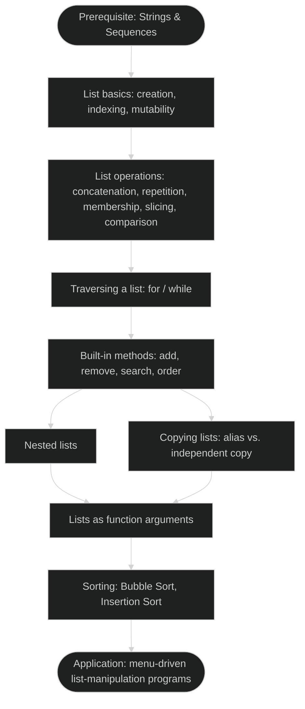

- A list builds on a string's ordered-sequence property
- Unlike a string, a list is mutable
- Unlike a string, a list can hold any mix of data types
- Every later topic — operations, methods, nested lists, copying, sorting — grows out of mutability plus heterogeneity

---

## §9.1 Introduction to List

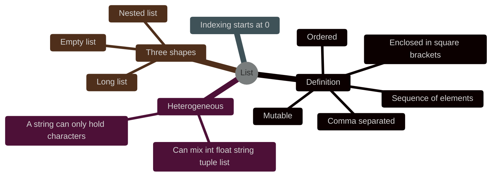

- A **list** is a mutable, ordered sequence of values called **elements**
- Elements are enclosed in square brackets `[ ]`
- Elements are separated by commas
- A list can hold elements of different data types in the same list — integer, float, string, tuple, even another list
- This mixing is why lists are called **heterogeneous**
- A string, by contrast, can only hold characters
- List indices start at `0`, same as string indices

**NCERT Example 9.1 — four ways a list can look:**

```python
#list1 is the list of six even numbers
>>> list1 = [2,4,6,8,10,12]
>>> print(list1)
[2, 4, 6, 8, 10, 12]

#list2 is the list of vowels
>>> list2 = ['a','e','i','o','u']
>>> print(list2)
['a', 'e', 'i', 'o', 'u']

#list3 is the list of mixed data types
>>> list3 = [100,23.5,'Hello']
>>> print(list3)
[100, 23.5, 'Hello']

#list4 is the list of lists, called a nested list
>>> list4 = [['Physics',101],['Chemistry',202],['Maths',303]]
>>> print(list4)
[['Physics', 101], ['Chemistry', 202], ['Maths', 303]]
```

- `list1` — a list of one type (`int`)
- `list2` — a list of one type (`str`)
- `list3` — a mixed-type list
- `list4` — a nested list
- All four are still just "a list" — Python does not care what is inside

**(Supp.) Three broad types of list, by shape:**

| Type | Meaning |
|---|---|
| Empty list | `[]`, no elements |
| Long list | many elements, typically built from a pattern rather than typed one by one — e.g. squares of `0` to `25`, `[0,1,4,9,16,...,576,625]` |
| Nested list | a list containing another list (§9.5) |

- This is a description, not a new syntax
- A "long list" is created exactly the way any other list literal is

### §9.1.1 Accessing Elements in a List (Indexing)

- Each element of a list is accessed the same way a character is accessed in a string
- Access uses the element's position (its **index**) inside square brackets: `list_name[index]`

```svg
<svg viewBox="0 0 400 130" xmlns="http://www.w3.org/2000/svg" style="max-width:100%;height:auto" font-family="sans-serif">
  <rect x="20" y="45" width="56" height="40" fill="#ffffff" stroke="#262626" stroke-width="1.5"/>
  <text x="48" y="70" font-size="13" text-anchor="middle" fill="#262626">10</text>
  <text x="48" y="35" font-size="11" text-anchor="middle" fill="#1565c0">0</text>
  <text x="48" y="105" font-size="11" text-anchor="middle" fill="#b71c1c">-6</text>

  <rect x="80" y="45" width="56" height="40" fill="#ffffff" stroke="#262626" stroke-width="1.5"/>
  <text x="108" y="70" font-size="13" text-anchor="middle" fill="#262626">20</text>
  <text x="108" y="35" font-size="11" text-anchor="middle" fill="#1565c0">1</text>
  <text x="108" y="105" font-size="11" text-anchor="middle" fill="#b71c1c">-5</text>

  <rect x="140" y="45" width="56" height="40" fill="#ffffff" stroke="#262626" stroke-width="1.5"/>
  <text x="168" y="70" font-size="13" text-anchor="middle" fill="#262626">30</text>
  <text x="168" y="35" font-size="11" text-anchor="middle" fill="#1565c0">2</text>
  <text x="168" y="105" font-size="11" text-anchor="middle" fill="#b71c1c">-4</text>

  <rect x="200" y="45" width="56" height="40" fill="#ffffff" stroke="#262626" stroke-width="1.5"/>
  <text x="228" y="70" font-size="13" text-anchor="middle" fill="#262626">40</text>
  <text x="228" y="35" font-size="11" text-anchor="middle" fill="#1565c0">3</text>
  <text x="228" y="105" font-size="11" text-anchor="middle" fill="#b71c1c">-3</text>

  <rect x="260" y="45" width="56" height="40" fill="#ffffff" stroke="#262626" stroke-width="1.5"/>
  <text x="288" y="70" font-size="13" text-anchor="middle" fill="#262626">50</text>
  <text x="288" y="35" font-size="11" text-anchor="middle" fill="#1565c0">4</text>
  <text x="288" y="105" font-size="11" text-anchor="middle" fill="#b71c1c">-2</text>

  <rect x="320" y="45" width="56" height="40" fill="#e3f2fd" stroke="#1565c0" stroke-width="1.5"/>
  <text x="348" y="70" font-size="13" text-anchor="middle" fill="#1565c0">60</text>
  <text x="348" y="35" font-size="11" text-anchor="middle" fill="#1565c0">5</text>
  <text x="348" y="105" font-size="11" text-anchor="middle" fill="#b71c1c">-1</text>

  <text x="200" y="122" font-size="11" text-anchor="middle" fill="#555555">list1 = [10, 20, 30, 40, 50, 60] — positive index above, negative index below</text>
</svg>
```

- Positive index counts from the left, starting at `0`
- Negative index counts from the right, starting at `-1`
- For `list1 = [10,20,30,40,50,60]`: `list1[0]` and `list1[-6]` name the same element (`10`)

**Trace, `list1 = [2,4,6,8,10,12]`, `n = len(list1)`:**

| Expression | Result |
|---|---|
| `list1[0]` | `2` — first element |
| `list1[3]` | `8` — fourth element |
| `list1[15]` | `IndexError: list index out of range` |
| `list1[1+4]` | `12` — index from an expression |
| `list1[-1]` | `12` — first element counted from the right |
| `list1[n-1]` | `12` — last element, using length |
| `list1[-n]` | `2` — first element, using negative length |

- ⚠ `list1[15]` raises `IndexError` — an ordinary index (not a slice) must lie strictly between `-len(list1)` and `len(list1)-1`. §9.1.1
- ⚠ Slicing (§9.2.4) behaves differently and never raises `IndexError`.

### §9.1.2 Lists are Mutable

- Unlike a string, a list's contents can be changed after it is created
- A single element can be replaced in place by assigning to its index

```python
>>> list1 = ['Red','Green','Blue','Orange']
>>> list1[3] = 'Black'        #change the fourth element
>>> list1
['Red', 'Green', 'Blue', 'Black']
```

- Mutability is the defining property that separates a list from a string or a tuple
- Aliasing (§9.6), a function changing a list argument in place (§9.7), and sorting in place (§9.8) are all direct consequences of this one property
- ⚠ A list can never be used as a dictionary key, or stored inside a `set`. §9.1.2
- Dictionary keys and set elements must be hashable
- A value that can change (mutable) is never hashable
- `{[1,2]: 'a'}` raises `TypeError: unhashable type: 'list'`
- A tuple (immutable) works fine as a dictionary key instead

### §9.1.3 Creating a List from an Existing Sequence (Supp.)

- Besides writing a list literal, the built-in `list()` function builds a list from any existing sequence

| Form | Effect | Example |
|---|---|---|
| `list()` | Creates an empty list | `list1 = list()` → `[]` |
| `list(string)` | One list element per character of the string | `list('Computer')` → `['C','o','m','p','u','t','e','r']` |
| `oldList[:]` | An independent copy of an existing list (§9.6) | `list1[:]` |

```python
>>> list1 = list()          #empty list
>>> list1
[]
>>> list1 = list('Computer')
>>> list1
['C', 'o', 'm', 'p', 'u', 't', 'e', 'r']
```

**(Supp.) Three lists built from one existing list**, given `list1 = [10, 20, 30, 40, 50]`:

| Statement | What it builds | Result | Alias or independent? |
|---|---|---|---|
| `list5 = list1[:]` | A full copy | `[10, 20, 30, 40, 50]` | Independent (§9.6) |
| `list6 = list1[1:4]` | A subset | `[20, 30, 40]` | Independent — a genuinely new, smaller list |
| `list7 = list1` | An alias | `[10, 20, 30, 40, 50]`, sharing `list1`'s identity | Alias — not a new list at all (§9.6) |

- Slicing (`list5`, `list6`) always builds a brand-new list object, whether it takes the whole list or only part
- Only plain assignment (`list7 = list1`) creates an alias rather than a list
- ⚠ `list(input("Enter the values: "))` splits by *character*, not by word. §9.1.3
- Typed as `Hi Python`, it produces `['H', 'i', ' ', 'P', 'y', 't', 'h', 'o', 'n']` — one element per character, including the space
- `input()` always returns a single string
- `list()` treats a string as a sequence of characters
- Building a list of space-separated values instead needs `input().split()`, or reading each value in a loop
- Python does not distinguish single quotes from double quotes for strings — `'abc'` and `"abc"` are identical

---

## §9.2 List Operations

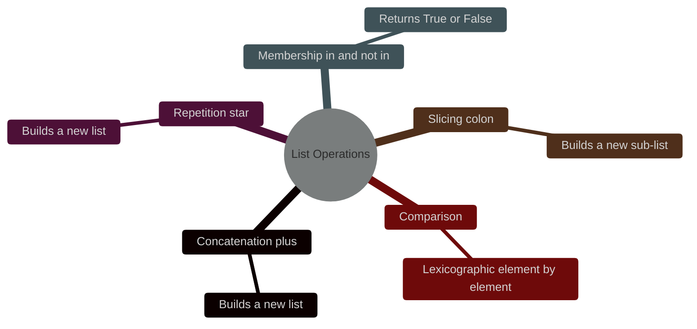

- Example lists used in this section: `list1 = ['Red','Green']`, `list2 = [10,20,30]`
- Python lets you manipulate list contents through the operators below

### §9.2.1 Concatenation

- The `+` operator joins two lists into a new list
- `+` never modifies either original list

```python
>>> list1 = [1,3,5,7,9]
>>> list2 = [2,4,6,8,10]
>>> list1 + list2
[1, 3, 5, 7, 9, 2, 4, 6, 8, 10]
>>> list1               #list1 itself is unchanged
[1, 3, 5, 7, 9]
```

- `+` requires both operands to be lists
- Concatenating a list with a value of any other type raises `TypeError`

```python
>>> list1 = [1,2,3]
>>> list1 + "abc"
TypeError: can only concatenate list (not "str") to list
```

- ⚠ `list1 + list2` returns a new list — it does not change `list1`. §9.2.1
- To keep the merged result, assign it back: `list1 = list1 + list2`
- Or use `list1.extend(list2)` (§9.4)

### §9.2.2 Repetition

- The `*` operator repeats a list's elements a given number of times
- `*` builds a new list

```python
>>> list1 = ['Hello']
>>> list1 * 4
['Hello', 'Hello', 'Hello', 'Hello']
```

- Multiplying a list *by another list* is not defined
- `TypeError: can't multiply sequence by non-int of type 'list'`

### §9.2.3 Membership

- `in` returns `True` if an element is present anywhere in the list
- `not in` returns `True` if it is absent

```python
>>> list1 = ['Red','Green','Blue']
>>> 'Green' in list1
True
>>> 'Cyan' in list1
False
>>> 'Cyan' not in list1
True
```

- `in` combines naturally with a `for` loop to traverse a list (§9.3)
- `for name in students_XII:` visits every element in turn
- This is the same spirit as `x in list1` testing membership

### §9.2.4 Slicing

- `list[start:stop:step]` extracts a sub-list
- `start` is included
- `stop` is excluded
- `step` defaults to `1` and is the stride

**Given `x = ['c','o','m','p','u','t','e','r']`:**

| Expression | Result | Meaning |
|---|---|---|
| `x[1:4]` | `['o', 'm', 'p']` | items 1 to 3 |
| `x[1:6:2]` | `['o', 'p', 't']` | items 1, 3, 5 |
| `x[3:]` | `['p', 'u', 't', 'e', 'r']` | item 3 to the end |
| `x[:5]` | `['c', 'o', 'm', 'p', 'u']` | items 0 to 4 |
| `x[-1]` (indexing) | `'r'` | last item |
| `x[-3:]` | `['t', 'e', 'r']` | last 3 items |
| `x[:-2]` | `['c', 'o', 'm', 'p', 'u', 't']` | all except the last 2 items |
| `x[::-1]` | `['r','e','t','u','p','m','o','c']` | the whole list, reversed |

- ⚠ Slicing never raises `IndexError`. §9.2.4
- `list1[2:20]` on a 5-element list returns everything from index 2 to the end
- Python silently clips an out-of-range `stop` (and, symmetrically, `start`) to the list's actual boundary
- A `start` past `stop` (`list1[7:2]`), or both bounds outside the list, produces an empty list `[]`, not an error
- Plain indexing (`list1[20]`) does raise `IndexError` — this is exactly where the two differ

```python
>>> list1 = [10,20,30,40,50]
>>> list1[2:20]          #stop is out of range — silently clipped to the end
[30, 40, 50]
>>> list1[10:20]         #both bounds out of range
[]
>>> list1[7:2]           #start beyond stop
[]
```

- A missing `start` defaults to `0`
- A missing `stop` defaults to the end of the list
- A given `stop` is always excluded — `list1[:5]` stops at index `4`, not `5`

### §9.2.5 Comparing Lists (Supp.)

- Lists can be compared with `>`, `<`, `==`, `!=`, `>=`, `<=`
- The comparison proceeds element by element, left to right
- Same rule as comparing two strings lexicographically
- Step 1: compare the first pair of elements
- Step 2: if equal, move to the next pair
- Step 3: stop at the first pair that differs — that pair alone decides the result
- Elements after the first difference are never examined

```python
>>> [1,2,3,4] < [4,5,6]
True         #1 < 4, decided at the very first pair
>>> [1,2,3,4] < [1,5,2,3]
True         #index 0 ties (1==1); index 1 decides: 2 < 5
>>> [1,2,3,4] > [1,2,0,3]
True         #indices 0,1 tie; index 2 decides: 3 > 0
>>> [1,2,3,4] < [1,2,3,2]
False        #indices 0-2 tie; index 3 decides: 4 is not < 2
```

- Two lists must have the same number of elements and matching values to be equal
- Matching types are not required

```python
>>> L1, L2 = [10,20,30], [10,20,30]
>>> L3 = [10,[20,30]]          #a nested list
>>> L1 == L2
True
>>> L1 == L3
False          #index 1: 20 vs [20,30] are simply never equal
```

- ⚠ `int` and `float` are mutually comparable by value. §9.2.5
- `[20,30] == [20.0,30.0]` is `True`
- A string that merely looks like a number is not equal to that number
- `[20,30] == ['20','30']` is `False`, because `20 == '20'` is `False` in Python
- Only genuinely numeric types (`int`, `float`, `bool`) get this value-based equivalence across types
- Equality (`==`, `!=`) between mismatched, non-numeric types simply evaluates to `False`/`True`
- Equality never raises an error
- Ordering comparisons (`<`, `>`, `<=`, `>=`) between genuinely incomparable types do raise `TypeError`
- Example: `[1,2] < ['a','b']` raises `TypeError: '<' not supported between instances of 'int' and 'str'`

---

## §9.3 Traversing a List

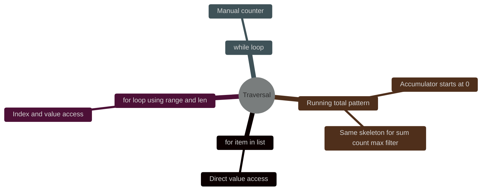

- "Traversing" a list means visiting every element in turn
- Done with a `for` loop or a `while` loop

**Using `for … in`** (most direct, when only the value is needed):

```python
>>> list1 = ['Red','Green','Blue','Yellow','Black']
>>> for item in list1:
...     print(item)
Red
Green
Blue
Yellow
Black
```

**Using `for` with `range()` and `len()`** (needed when the index is also wanted):

```python
>>> for i in range(len(list1)):
...     print(list1[i])
```

- `len(list1)` returns the number of elements in `list1`
- `range(len(list1))` produces every valid index `0, 1, …, len(list1)-1`

**Using `while`:**

```python
>>> i = 0
>>> while i < len(list1):
...     print(list1[i])
...     i += 1
```

**(New) Summing a list — running-total pattern:**

```python
list1 = [10,2,4,5,6,20,40]
total = 0
for i in list1:
    total = total + i
print("The elements in list are:", list1)
print("The sum is:", total)
```
Output:
```text
The elements in list are: [10, 2, 4, 5, 6, 20, 40]
The sum is: 87
```

- Method: accumulator starts at `0`, adds to it on every loop pass
- Result: total = `87`
- Same skeleton is used for counting matches, finding a maximum, or building a filtered list
- Only the single operation inside the loop body changes

---

## §9.4 List Methods and Built-in Functions

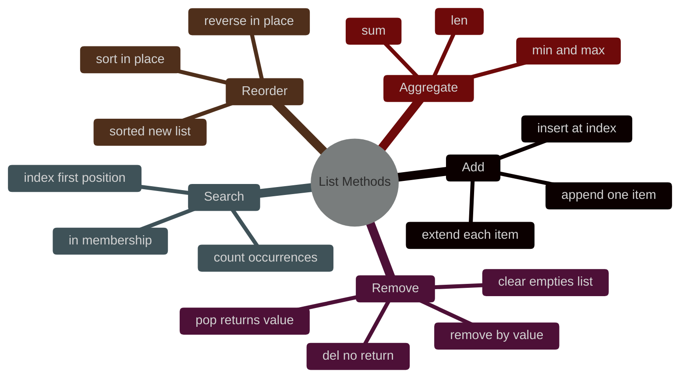

**Table 9.1 — Built-in functions for list manipulation:**

| Method | Description | Example |
|---|---|---|
| `len(list)` | Number of elements | `len([10,20,30,40,50])` → `5` |
| `list()` | Builds an (empty, or converted) list | `list('aeiou')` → `['a','e','i','o','u']` |
| `append(item)` | Adds a single element at the end (a list argument nests as one sub-list) | see below |
| `extend(iterable)` | Adds each element of the given iterable at the end | see below |
| `insert(index, item)` | Inserts `item` before position `index` | `[10,20,30,40,50].insert(2,25)` → `[10,20,25,30,40,50]` |
| `count(item)` | How many times `item` occurs | `[10,20,30,10,40,10].count(10)` → `3` |
| `index(item)` | Position of the first occurrence; `ValueError` if absent | `[10,20,30,20,40,10].index(20)` → `1` |
| `remove(item)` | Deletes the first occurrence by value; `ValueError` if absent | `[10,20,30,40,50,30].remove(30)` → `[10,20,40,50,30]` |
| `pop([index])` | Removes and returns the element at `index` (default: last) | `[10,20,30,40,50,60].pop(3)` → returns `40`; list becomes `[10,20,30,50,60]` |
| `reverse()` | Reverses element order, in place | `[34,66,12,89,28,99].reverse()` → `[99,28,89,12,66,34]` |
| `sort(reverse=False)` | Sorts in place; returns `None` | `[34,66,12,89,28,99].sort()` → `[12,28,34,66,89,99]` |
| `sorted(list, reverse=False)` | Returns a new sorted list; original untouched | `sorted([23,45,11])` → `[11,23,45]` |
| `min(list)` / `max(list)` | Smallest / largest element | `min([34,12,63])` → `12` |
| `sum(list)` | Total of numeric elements | `sum([34,12,63])` → `109` |

- ⚠ `append()` vs `extend()` — the single most common mix-up. §9.4

```python
>>> list1 = [10,20,30,40]
>>> list1.append([50,60])
>>> list1
[10, 20, 30, 40, [50, 60]]     #one new element — a nested list
```
```python
>>> list1 = [10,20,30]
>>> list2 = [40,50]
>>> list1.extend(list2)
>>> list1
[10, 20, 30, 40, 50]           #two new elements, added individually
```

- `append()` always adds exactly one item, even when that item is itself a list
- `extend()` unpacks the given iterable and adds its elements one by one

- `min()`/`max()` on a list of strings compare by ASCII value
- Same left-to-right rule as list comparison (§9.2.5)
- Comparison is character by character until one string differs, then stops there

```python
>>> list5 = ['ashwin','bharat','shelly','surpreet']
>>> max(list5)
'surpreet'      #'s' has the highest ASCII value among the first letters
>>> min(list5)
'ashwin'
```

- `count()` and `index()` can match any element type
- Matching works for a tuple or a nested sub-list, compared as a whole, not just plain numbers/strings

```python
>>> L1 = ['a', ('x','y'), [1,2], 'b', 10, [1,2]]
>>> L1.count([1,2])
2
>>> L1.count(('x','y'))
1
>>> L1.count(100)
0
```

### §9.4.1 Deletion Operations, in Detail (Supp.)

- Python offers three different ways to remove something from a list
- Each answers a different question

| I know… | Use | Returns the removed value? |
|---|---|---|
| the position, and want to keep the value | `list.pop(index)` | Yes |
| the position, and don't need the value | `del list[index]` | No |
| the value (not its position) | `list.remove(value)` | No |

```python
>>> L1 = [1,2,5,4,70,10,90,80,50]
>>> L1.pop(1)            #removes AND returns the element at index 1
2
>>> L1
[1, 5, 4, 70, 10, 90, 80, 50]
>>> L1.pop()              #no argument — removes the LAST element
50
>>> L2 = [100,200,300,500]
>>> L2.pop(-1)             #a negative index works with pop() too
500
```

```python
>>> L1 = [100,200,300,400,500]
>>> del L1[3]              #del is a statement, not a method — no parentheses
>>> L1
[100, 200, 300, 500]        #del returns nothing at all
>>> del L1[-2]              #del also accepts a negative index
>>> L1
[100, 200, 500]
```

```python
>>> L1 = [10,20,30,40,50,30]
>>> L1.remove(30)           #removes the FIRST 30 it finds, by value
>>> L1
[10, 20, 40, 50, 30]        #the second 30 is left untouched
```

- `del` can also remove a whole slice in one step

```python
>>> L1 = [10,20,30,40,50]
>>> del L1[2:4]              #removes indices 2 and 3 — index 4 stays
>>> L1
[10, 20, 50]
```

- ⚠ `pop()`/`del` raise `IndexError` for a bad position. §9.4.1
- ⚠ `remove()` raises `ValueError` for a missing value. §9.4.1
- `L1.pop(99)` and `del L1[99]` both raise `IndexError: list index out of range`
- `L1.remove(999)`, if `999` isn't in the list, raises `ValueError: list.remove(x): x not in list`
- Different problem, different exception

- `clear()` empties a list entirely

```python
>>> L1 = [10,20,30,40]
>>> L1.clear()
>>> L1
[]
```

- ⚠ Deleting elements while traversing a list by index shifts everything. §9.4.1
- Deleting (or inserting) an element in the middle of a list immediately shifts the index of every element after it
- A plain `for i in range(len(list1)):` loop that deletes elements as it goes will silently skip some of them
- Each deletion slides the next element back into the position that was just checked
- Fix: compensate the loop counter every time a deletion actually happens

```python
list1 = [11,-1,22,-3,33,55,44,-50,46,101,77,-100,42]
length = len(list1)
i = 0
while i < length:
    if list1[i] < 0:                 #delete negative numbers
        del list1[i]
        length = length - 1          #the list just got shorter
        i = i - 1                    #don't advance — the next element slid into position i
    elif list1[i] % 2 != 0:          #delete odd numbers
        del list1[i]
        length = length - 1
        i = i - 1
    i = i + 1
print("List after deletion:", list1)
```
Output:
```text
List after deletion: [22, 44, 46, 42]
```

- Without the `i = i - 1` compensation, the loop advances past the element that just slid into the deleted slot
- This is a classic, easy-to-miss bug whenever deleting and traversing happen together

---

## §9.5 Nested Lists

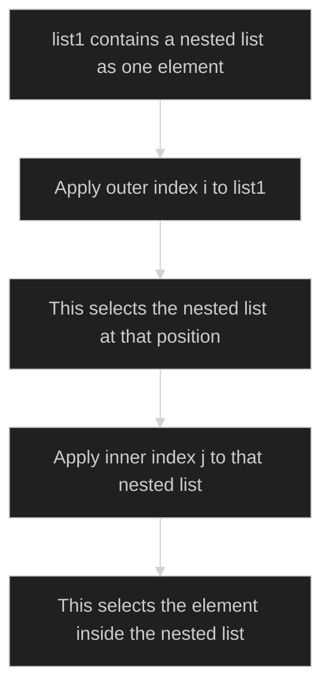

- When a list appears as an element of another list, it is called a nested list

```python
>>> list1 = [1,2,'a','c',[6,7,8],4,9]
>>> list1[4]            #the fifth element of list1 is itself a list
[6, 7, 8]
>>> list1[4][1]
7
```

- To reach an element inside the nested list, two indices are needed: `list1[i][j]`
- Index `i` first selects the nested list
- Index `j` then selects the desired element within that nested list
- Reading `list1[i][j]`: go to element `i` of the outer list; treat it as a list; go to element `j` of that
- Nesting can go arbitrarily deep: `list1[i][j][k]…`
- Two levels covers almost everything at this stage

```python
>>> list1 = [1,2,3,'a',['apple','green'],5,6,7,['red','orange']]
>>> list1[4][1]
'green'
>>> list1[4] = 'mango'        #replace the whole nested list with one value
>>> list1
[1, 2, 3, 'a', 'mango', 5, 6, 7, ['red', 'orange']]
>>> list1[8][0] = 'black'      #modify one element deep inside a nested list
>>> list1
[1, 2, 3, 'a', 'mango', 5, 6, 7, ['black', 'orange']]
>>> len(list1)
9
```

- ⚠ `len()` on a list containing a nested list counts outer elements only. §9.5
- A nested list, however many items it holds internally, still counts as ONE element of the outer list
- `len(list1)` above is `9`, not `10`, even though `['black', 'orange']` itself holds 2 items

**(Supp.) A nested list as a simple two-column table:**

```python
>>> subjectCodes = [['Sanskrit',43], ['English',85], ['Maths',65], ['History',36]]
>>> subjectCodes[1]
['English', 85]
>>> subjectCodes[1][0], subjectCodes[1][1]
('English', 85)
```

- A list of `[name, code]` pairs behaves like a tiny two-column table
- Outer index picks the row
- Inner index picks the column
- Same `list1[i][j]` pattern as any other nested list, just with a name attached to what `i` and `j` mean

---

## §9.6 Copying Lists

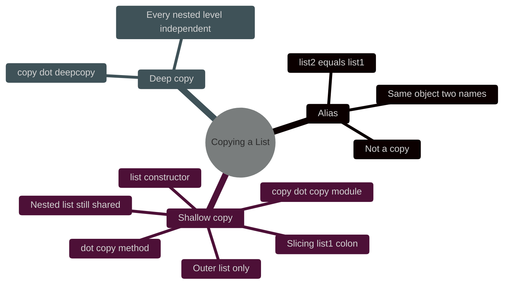

- The simplest way to "copy" a list is `list2 = list1`
- This does NOT actually copy anything

```python
>>> list1 = [1,2,3]
>>> list2 = list1
>>> list1.append(10)
>>> list1
[1, 2, 3, 10]
>>> list2
[1, 2, 3, 10]         #list2 changed too, even though only list1 was touched!
```

- `list2 = list1` makes `list2` an alias
- An alias is another name for the very same list object in memory
- An alias is not a second, independent list
- Any change made through either name is visible through the other

```svg
<svg viewBox="0 0 480 200" xmlns="http://www.w3.org/2000/svg" style="max-width:100%;height:auto" font-family="sans-serif">
  <defs>
    <marker id="arr" viewBox="0 0 10 10" refX="9" refY="5" markerWidth="6" markerHeight="6" orient="auto-start-reverse">
      <path d="M0,0 L10,5 L0,10 z" fill="#262626"/>
    </marker>
  </defs>
  <rect x="20" y="40" width="100" height="34" fill="#ffffff" stroke="#262626" stroke-width="1.5"/>
  <text x="70" y="62" font-size="13" text-anchor="middle" fill="#262626">subjects</text>
  <rect x="20" y="126" width="100" height="34" fill="#ffffff" stroke="#262626" stroke-width="1.5"/>
  <text x="70" y="148" font-size="13" text-anchor="middle" fill="#262626">temporary</text>

  <rect x="250" y="55" width="52" height="40" fill="#e3f2fd" stroke="#1565c0" stroke-width="1.5"/>
  <text x="276" y="80" font-size="12" text-anchor="middle" fill="#1565c0">Hindi</text>
  <text x="276" y="108" font-size="10" text-anchor="middle" fill="#757575">[0]</text>

  <rect x="302" y="55" width="60" height="40" fill="#e3f2fd" stroke="#1565c0" stroke-width="1.5"/>
  <text x="332" y="80" font-size="12" text-anchor="middle" fill="#1565c0">English</text>
  <text x="332" y="108" font-size="10" text-anchor="middle" fill="#757575">[1]</text>

  <rect x="362" y="55" width="52" height="40" fill="#e3f2fd" stroke="#1565c0" stroke-width="1.5"/>
  <text x="388" y="80" font-size="12" text-anchor="middle" fill="#1565c0">Maths</text>
  <text x="388" y="108" font-size="10" text-anchor="middle" fill="#757575">[2]</text>

  <rect x="414" y="55" width="58" height="40" fill="#e3f2fd" stroke="#1565c0" stroke-width="1.5"/>
  <text x="443" y="80" font-size="11" text-anchor="middle" fill="#1565c0">History</text>
  <text x="443" y="108" font-size="10" text-anchor="middle" fill="#757575">[3]</text>

  <line x1="120" y1="55" x2="248" y2="72" stroke="#262626" stroke-width="1.5" marker-end="url(#arr)"/>
  <line x1="120" y1="140" x2="248" y2="80" stroke="#262626" stroke-width="1.5" marker-end="url(#arr)"/>

  <text x="330" y="150" font-size="11" text-anchor="middle" fill="#555555">one list object in memory — two names both refer to it</text>
</svg>
```

- `subjects` and `temporary` are two different names
- There is only ONE list object in memory
- Both arrows point at the same object
- Changing an element via `temporary[0]` also changes what `subjects` shows

- `==` compares values
- `is` compares identity
- `list1 == list2` asks "do these two lists currently hold the same values?" (§9.2.5)
- `list1 == list2` says nothing about whether they are the same object
- `list1 is list2` asks exactly that
- `is` is `True` only when both names refer to the identical object in memory
- `is` is `False` for two separately-built lists that simply happen to hold equal values

```python
>>> a = [1,2,3]
>>> b = [1,2,3]          #a separate, independent list — same values
>>> a == b
True
>>> a is b
False
>>> c = a                 #c is an alias of a
>>> a is c
True
```

- ⚠ Aliasing is a real trap, not just a curiosity. §9.6
- This behaviour can be genuinely useful — e.g. a function meant to modify the caller's list (§9.7) relies on exactly this
- It is unexpected far more often than it is wanted
- If the goal is a second, independent list, aliasing is the wrong tool
- Use one of the three copying methods below instead

**Three ways to make a genuinely independent copy:**

| Method | Syntax |
|---|---|
| 1. Slicing | `newList = oldList[:]` |
| 2. The `list()` constructor | `newList = list(oldList)` |
| 3. The `copy` module, or the list's own `.copy()` method | `import copy; newList = copy.copy(oldList)` — or `newList = oldList.copy()` |

```python
>>> list1 = [1,2,3,4,5]
>>> list2 = list1.copy()
>>> list2
[1, 2, 3, 4, 5]
>>> list1[0] = 100
>>> list1
[100, 2, 3, 4, 5]
>>> list2                   #list2 is untouched — a genuinely separate object
[1, 2, 3, 4, 5]
```

- ⚠ All three copying methods make only a shallow copy. §9.6
- Slicing, `list()`, and `.copy()`/`copy.copy()` all copy the outer list only
- If an element is itself a nested list, the original and the copy still share that same inner list object
- Modifying a nested element through the copy is still visible in the original
- A genuinely independent copy at every nested level needs `copy.deepcopy()`, from the same `copy` module
- `deepcopy()` is worth knowing exists, though beyond this chapter's scope

---

## §9.7 List as Argument to a Function

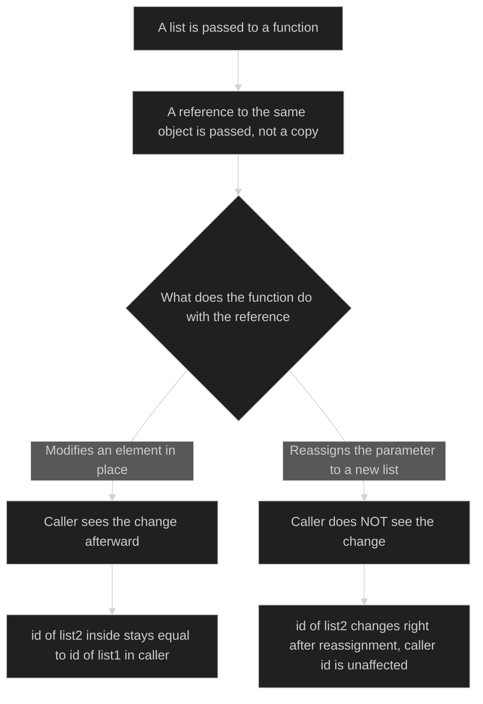

- Passing a list to a function passes a reference to the same list object, not a copy
- What the caller sees afterwards depends entirely on what the function does with that reference

**Scenario A — modifying elements in place: the caller DOES see the change**

```python
def increment(list2):
    for i in range(0, len(list2)):
        list2[i] += 5              #modifies the list THROUGH the reference
    print('Reference of list Inside Function', id(list2))

list1 = [10,20,30,40,50]
print("Reference of list in Main", id(list1))
print("The list before the function call")
print(list1)
increment(list1)
print("The list after the function call")
print(list1)
```
Output:
```text
Reference of list in Main 70615968
The list before the function call
[10, 20, 30, 40, 50]
Reference of list Inside Function 70615968       #same id — the same object
The list after the function call
[15, 25, 35, 45, 55]
```

**Scenario B — reassigning the parameter: the caller does NOT see the change**

```python
def increment(list2):
    print("ID before assignment:", id(list2))
    list2 = [15,25,35,45,55]        #REBINDS list2 to a brand-new list object
    print("ID after assignment:", id(list2))
    print(list2)

list1 = [10,20,30,40,50]
print("ID before function call:", id(list1))
increment(list1)
print("ID after function call:", id(list1))
print(list1)
```
Output:
```text
ID before function call: 65565640
ID before assignment: 65565640
ID after assignment: 65565600        #different id — a NEW object now
[15, 25, 35, 45, 55]
ID after function call: 65565640      #back in the caller: id is unchanged
[10, 20, 30, 40, 50]                  #and so is the content
```

- `list2[i] = …` reaches through the reference to modify the shared object
- This modification is visible everywhere that object is referenced
- `list2 = […]` makes the local name `list2` point at a completely new object
- The caller's original object, and the caller's own name for it, is left untouched
- `id()` reports an object's identity in memory
- `id()` exposes the difference: it stays the same throughout Scenario A
- `id()` changes inside the function in Scenario B

---

## §9.8 Sorting Lists (Supp.)

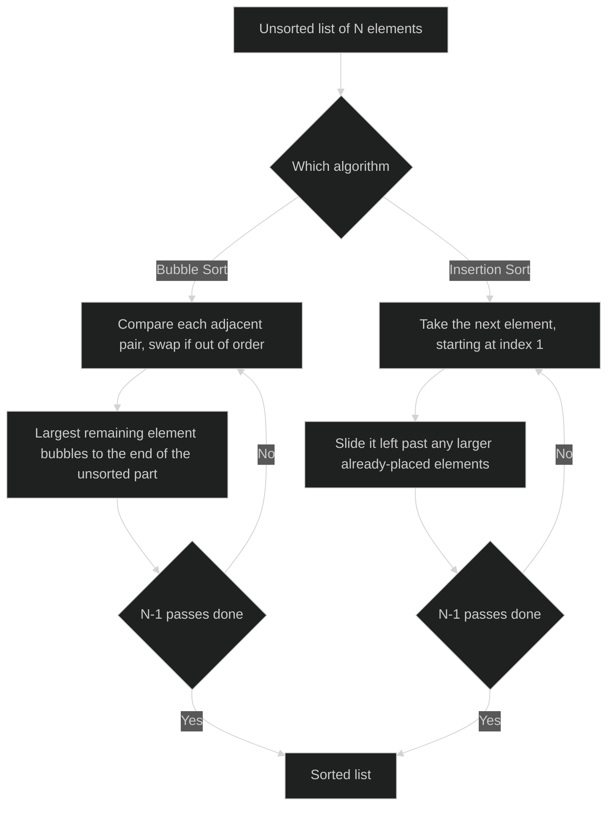

- Sorting means arranging a list's elements into ascending or descending order
- Sorting matters beyond tidiness — searching, and much else, is dramatically more efficient on already-sorted data
- Two classic, closely related techniques: Bubble Sort and Insertion Sort

### §9.8.1 Bubble Sort

**Algorithm (general form, ascending order):**

```text
START
INPUT array A of length N
FOR i = 0 TO N-2 DO
    FOR j = 0 TO N-i-2 DO
        IF A[j] > A[j+1] THEN
            SWAP A[j] AND A[j+1]
        END IF
    END FOR
END FOR
DISPLAY sorted array A
STOP
```

- Each pass of the outer loop compares every pair of adjacent elements
- Swaps them if out of order
- This "bubbles" the largest remaining element to its correct position at the end of the unsorted part, in that one pass
- With `N` elements, `N-1` passes are guaranteed to finish the job
- Each successive pass has one fewer comparison to make
- The last elements settled by earlier passes are already known to be correctly placed

**(New) Bubble Sort trace — sorting `[42, 29, 74, 11, 65, 58]` ascending:**

| Pass | Comparisons made | List after the pass |
|---|---|---|
| 1 | (42,29)→swap · (42,74)→no · (74,11)→swap · (74,65)→swap · (74,58)→swap | `[29, 42, 11, 65, 58, 74]` |
| 2 | (29,42)→no · (42,11)→swap · (42,65)→no · (65,58)→swap | `[29, 11, 42, 58, 65, 74]` |
| 3 | (29,11)→swap · (29,42)→no · (42,58)→no | `[11, 29, 42, 58, 65, 74]` |
| 4 | (11,29)→no · (29,42)→no | `[11, 29, 42, 58, 65, 74]` |
| 5 | (11,29)→no | `[11, 29, 42, 58, 65, 74]` |

- Each pass's newly-settled rightmost element never needs to be re-examined
- That's why pass 2 makes only 4 comparisons where pass 1 made 5, down to pass 5's single comparison

```python
l = [42,29,74,11,65,58]
n = len(l)
print("Original list: ", l)
for i in range(n-1):
    for j in range(n-i-1):
        if l[j] > l[j+1]:
            l[j], l[j+1] = l[j+1], l[j]
print("List after sorting is: ", l)
```
Output:
```text
Original list:  [42, 29, 74, 11, 65, 58]
List after sorting is:  [11, 29, 42, 58, 65, 74]
```

### §9.8.2 Insertion Sort

**Algorithm (general form, ascending order):**

```text
START
INPUT array A of length N
FOR i = 1 TO N-1 DO
    SET j = i
    WHILE j > 0 AND A[j-1] > A[j] DO
        SWAP A[j-1] AND A[j]
        SET j = j - 1
    END WHILE
END FOR
DISPLAY sorted array A
STOP
```

- Insertion Sort works the way a hand of playing cards is usually sorted
- Starts from index `1`, not `0` — a single element is trivially "sorted" already
- Each element in turn is treated as a card to be slid backward into its correct position among the elements already placed to its left

**(New) Insertion Sort trace — sorting `[70, 49, 31, 6, 65, 81, 68]` ascending:**

| Pass | Element being placed | Shifts made | List after the pass |
|---|---|---|---|
| 1 | `49` | swap with `70` | `[49, 70, 31, 6, 65, 81, 68]` |
| 2 | `31` | swap with `70`, then `49` | `[31, 49, 70, 6, 65, 81, 68]` |
| 3 | `6` | swap with `70`, `49`, then `31` | `[6, 31, 49, 70, 65, 81, 68]` |
| 4 | `65` | swap with `70` only (`49 < 65`, stop) | `[6, 31, 49, 65, 70, 81, 68]` |
| 5 | `81` | none needed — already `70 < 81` | `[6, 31, 49, 65, 70, 81, 68]` |
| 6 | `68` | swap with `81`, then `70` (`65 < 68`, stop) | `[6, 31, 49, 65, 68, 70, 81]` |

```python
a = [70,49,31,6,65,81,68]
print("Original list : ", a)
for i in a:
    j = a.index(i)
    while j > 0:
        if a[j-1] > a[j]:
            a[j-1], a[j] = a[j], a[j-1]
        else:
            break
        j = j - 1
print("List after sorting : ", a)
```
Output:
```text
Original list :  [70, 49, 31, 6, 65, 81, 68]
List after sorting :  [6, 31, 49, 65, 68, 70, 81]
```

- Both algorithms above sort ascending purely because of the direction of one comparison
- Bubble Sort's comparison: `A[j] > A[j+1]`
- Insertion Sort's comparison: `A[j-1] > A[j]`
- Flipping every `>` to `<` throughout sorts the same list into descending order instead
- The rest of the algorithm, passes and all, is unchanged

**Bubble Sort vs. Insertion Sort:**

| | Bubble Sort | Insertion Sort |
|---|---|---|
| Core action | Repeatedly swaps adjacent out-of-order pairs | Slides each new element backward into place among already-sorted elements |
| Number of passes | `N-1` | `N-1` |
| Best suited to | Very small and/or nearly-sorted data; simplest algorithm to teach and trace | Small data sets; adaptive — does less work the more nearly-sorted the input already is |
| Extra memory needed | None — sorts in place | None — sorts in place |

- Both algorithms compare and shift adjacent elements
- Both sort in place, needing no extra memory proportional to input size
- Which one does less total work depends on how disordered the input already is
- Insertion Sort needs fewer shifts the closer the input already is to sorted

---

## §9.9 List Manipulation

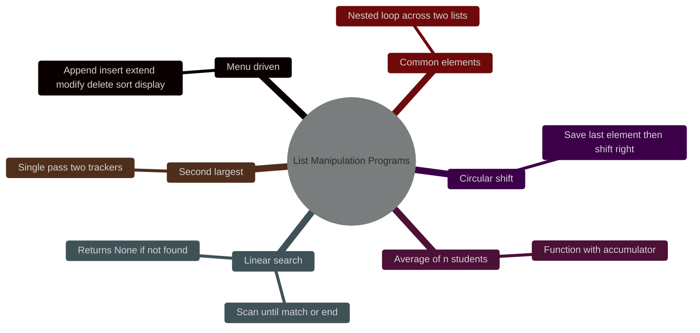

- Programs below put together everything from §9.1–§9.8

**Program 9-3 — menu-driven list-manipulation program (NCERT):**

- Offers: append, insert, extend ("append a list"), modify, delete by position, delete by value, ascending sort, descending sort, display
- Loops on a menu until the user chooses Exit
- Structure: a `while True:` loop containing one `if`/`elif` branch per menu choice
- Each branch calls exactly the method from §9.4 matching the chosen operation: `append()`, `insert()`, `extend()`, direct index assignment, `pop()`, `remove()`, `sort()`, `sort(reverse=True)`

Sample run, starting from `myList = [22, 4, 16, 38, 13]`:
```text
ENTER YOUR CHOICE (1-10): 8
The list has been sorted in reverse order
The list 'myList' has the following elements [38, 22, 16, 13, 4]

ENTER YOUR CHOICE (1-10): 5
Enter the position of the element to be deleted: 2
The element 16 has been deleted
The list 'myList' has the following elements [38, 22, 13, 4]
```

- Every branch is really just one line from Table 9.1, wrapped in an `input()` prompt and an `if`/`elif` check
- The challenge is choosing the right method for each menu option, not new syntax

**Program 9-4 — average marks of n students, via a function (NCERT):**

```python
def computeAverage(list1, n):
    total = 0
    for marks in list1:
        total = total + marks
    average = total / n
    return average

list1 = []
n = int(input("How many students' marks: "))
for i in range(0, n):
    marks = int(input("Enter marks of student " + str(i+1) + ": "))
    list1.append(marks)
average = computeAverage(list1, n)
print("Average marks of", n, "students is:", average)
```

- Method: accumulate `total`, divide by `n`
- With marks `45, 89, 79, 76, 55`: `total = 344`, `average = 344 / 5 = 68.8`

**Program 9-5 — linear search on a list (NCERT):**

```python
def linearSearch(num, list1):
    for i in range(0, len(list1)):
        if list1[i] == num:
            return i           #found — return its position
    return None                 #never found

list1 = [23, 567, 12, 89, 324]
num = 12
result = linearSearch(num, list1)
if result is None:
    print("Number", num, "is not present in the list")
else:
    print("Number", num, "is present at", result + 1, "position")
```
Output:
```text
Number 12 is present at 3 position
```

- Method: check every element in order until a match, or the list runs out
- A linear search needs no sorting first
- Faster search strategies (later chapter) rely on the list already being sorted

**(New) Second-largest element in a list:**

```python
num = [23, 89, 12, 89, 45, 6]
m1 = m2 = None
for x in num:
    if m1 is None or x > m1:
        m2 = m1
        m1 = x
    elif x != m1 and (m2 is None or x > m2):
        m2 = x
print("Largest:", m1, " Second largest:", m2)
```
Output:
```text
Largest: 89  Second largest: 45
```

- Method: track two running values across a single pass — largest so far (`m1`), second-largest so far (`m2`)
- Avoids sorting the whole list just to read off one value

**(Supp.) Finding common elements between two lists:**

```python
list1 = [1, 100, 200, 3, 5, 400]
list2 = [2, 10, 300, 4, 5, 500]
print("The elements in list1 are:", list1)
print("The elements in list2 are:", list2)
for x in list1:
    for y in list2:
        if x == y:
            print("The common element is:", x)
```
Output:
```text
The elements in list1 are: [1, 100, 200, 3, 5, 400]
The elements in list2 are: [2, 10, 300, 4, 5, 500]
The common element is: 5
```

- Method: nested loop — for every element of `list1`, scan all of `list2` for a match
- Natural first technique for "compare two lists against each other" problems
- Costs checking every pair
- `if x in list2:` does the same job in one line, without a visible inner loop

**(Supp.) Circularly shifting a list to the right:**

```python
list1 = [2, 4, 6, 8, 10]
temp = list1[len(list1) - 1]        #remember the last element first
for i in range(len(list1) - 1, 0, -1):
    list1[i] = list1[i-1]            #shift every element one place right
list1[0] = temp                       #the old last element becomes the new first
print(list1)
```
Output:
```text
[10, 2, 4, 6, 8]
```

- Method: save the element about to be overwritten (the last one) before shifting starts
- Shift every other element right by copying from its left neighbour, working backward from the end
- Working backward means nothing is overwritten before it's copied
- Drop the saved value into the now-empty first slot

---

## Quick Reference

**Operators on lists:**

| Operator | Meaning | Example |
|---|---|---|
| `+` | Concatenation (new list) | `[1,2] + [3,4]` → `[1,2,3,4]` |
| `*` | Repetition (new list) | `[1,2] * 2` → `[1,2,1,2]` |
| `in` / `not in` | Membership test | `2 in [1,2,3]` → `True` |
| `[i]` | Indexing (0-based; negative counts from the end); raises `IndexError` out of range | `[10,20,30][-1]` → `30` |
| `[a:b:c]` | Slicing (`b` excluded); never raises `IndexError` | `[10,20,30,40][1:3]` → `[20,30]` |
| `==` `!=` `<` `>` `<=` `>=` | Lexicographic comparison, element by element | `[1,2] < [1,3]` → `True` |

**Built-in methods, by purpose:**

| Purpose | Method(s) |
|---|---|
| Add elements | `append(item)`, `extend(iterable)`, `insert(index, item)` |
| Remove elements | `pop([index])` (returns value) · `del list[i]` / `del list[a:b]` (no return) · `remove(value)` · `clear()` |
| Search / count | `index(item)`, `count(item)`, `in` |
| Reorder | `sort()`, `sort(reverse=True)` (in place, returns `None`) · `sorted(list)` (new list) · `reverse()` |
| Aggregate | `len()`, `min()`, `max()`, `sum()` |
| Copy | `list1[:]`, `list(list1)`, `list1.copy()`, `copy.copy(list1)` |

---

## Points to Ponder

- `list2 = list1` does not copy — it aliases
- Use `list1[:]`, `list(list1)`, or `list1.copy()` for an independent (shallow) copy
- `append(x)` always adds one element, even when `x` is itself a list — it nests
- `extend(x)` adds each element of `x` individually
- `pop()` returns the removed value
- `del` and `remove()` do not
- `remove(x)` deletes by value — the first match only
- Deleting by position needs `pop(i)` or `del list[i]`
- Plain indexing (`list[i]`) raises `IndexError` when out of range
- Slicing never does — it silently clips to the list's actual bounds
- `list1.sort()` sorts in place and returns `None`
- `sorted(list1)` returns a new, separately sorted list, leaving `list1` untouched
- Passing a list to a function passes a reference
- Mutating an element in place (`list2[i] = …`) is seen by the caller
- Reassigning the parameter (`list2 = […]`) inside the function only rebinds the local name and is not seen by the caller
- `int`/`float`/`bool` compare equal across types by value — `20 == 20.0` is `True`
- A string that merely looks like a number never equals that number — `'20' == 20` is `False`
- A shallow copy (slicing, `list()`, `.copy()`) copies only the outer list
- A nested list inside it is still shared with the original
- `==` compares values
- `is` compares identity
- Two separately-built lists with equal contents give `list1 == list2` → `True` but `list1 is list2` → `False`
- Only true aliases give `is` → `True`
- Deleting an element while looping over indices shifts every later element back by one
- A plain `for i in range(len(list1))` that deletes as it goes will skip elements unless the loop counter is compensated
- A list can never be a dictionary key (or a set element)
- Only immutable values are hashable
- A list is mutable by definition
- Both Bubble Sort and Insertion Sort sort ascending only because of the direction of one comparison (`>`)
- Flipping it to `<` sorts descending instead, with no other change

---

## Problem-Solving Strategy

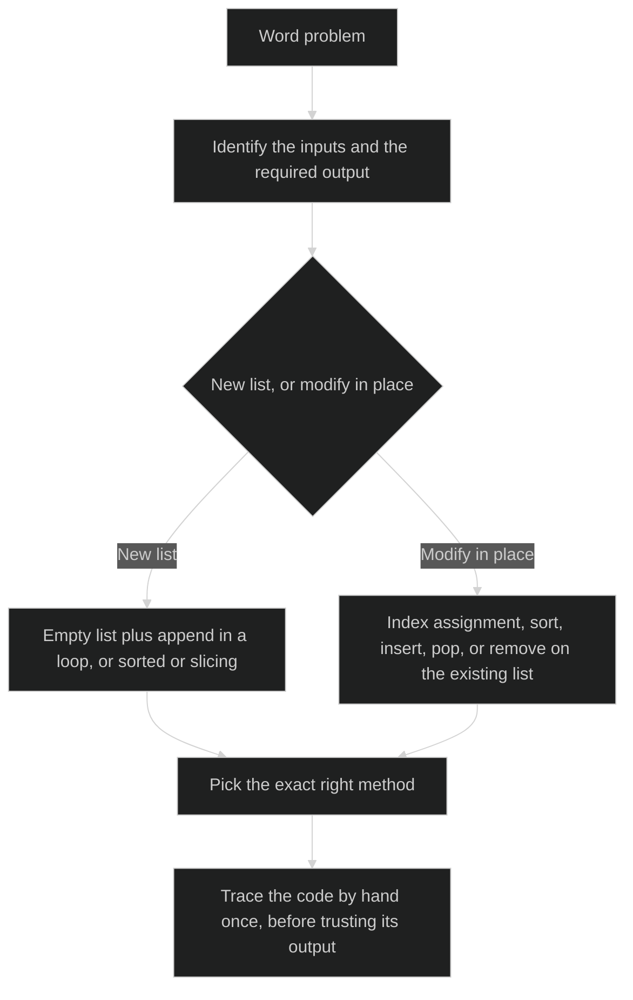

- Step 1: identify the inputs and the required output
- Is the answer a single value (sum, max, position), or a modified list?
- Step 2: decide whether to build a new list, or modify in place
- A new list needs an empty list plus `append()` inside a loop, or `sorted()`/slicing
- Modifying in place uses index assignment, `sort()`, `insert()`, `pop()`, or `remove()` directly on the existing list
- Step 3: pick the exact right method
- Know the position, want the value back → `pop(i)`
- Know the position, don't need the value → `del list[i]`
- Know the value, not the position → `remove(value)`
- Need a sorted copy, but must keep the original order elsewhere → `sorted(list)`
- Need the list itself sorted, going forward → `list.sort()`
- Step 4: trace the code by hand once, pass by pass or line by line, before trusting its output

---

## Rapid Reference

| § | Fact | Value |
|---|---|---|
| 9.1 | List defining properties | mutable, ordered, heterogeneous |
| 9.1 | List enclosure and separator | square brackets `[ ]`, comma-separated |
| 9.1 | List index start | `0` |
| 9.1 | Three list shapes | empty, long, nested |
| 9.1.1 | Positive index start | `0`, counted from the left |
| 9.1.1 | Negative index start | `-1`, counted from the right |
| 9.1.1 | Out-of-range plain index | `IndexError` |
| 9.1.2 | The one defining property everything else follows from | mutability |
| 9.1.2 | List as a dictionary key | not allowed — `TypeError: unhashable type: 'list'` |
| 9.1.3 | `list(input())` splits by | character, not word |
| 9.1.3 | `list1[1:4]` on an existing list | a new subset list, not an alias |
| 9.2.1 | `+` operator | concatenation, builds a new list |
| 9.2.1 | `list + non-list` | `TypeError` |
| 9.2.2 | `*` operator | repetition, builds a new list |
| 9.2.2 | `list * list` | `TypeError` |
| 9.2.3 | `in` / `not in` | membership test, returns a bool |
| 9.2.4 | `list[start:stop:step]` | `start` included, `stop` excluded |
| 9.2.4 | Slicing out of range | silently clipped, never `IndexError` |
| 9.2.5 | List comparison rule | lexicographic, element by element, first difference decides |
| 9.2.5 | `[20,30] == [20.0,30.0]` | `True` |
| 9.2.5 | `[20,30] == ['20','30']` | `False` |
| 9.2.5 | `==`/`!=` on mismatched types | `False`/`True`, never an error |
| 9.2.5 | `<`/`>` on incomparable types | `TypeError` |
| 9.3 | Traversal methods | `for…in`, `for` with `range(len())`, `while` |
| 9.4 | `append(x)` | adds `x` as one element (nests if `x` is a list) |
| 9.4 | `extend(x)` | adds each element of `x` individually |
| 9.4 | `min()`/`max()` on strings | compares by ASCII value, left to right |
| 9.4.1 | `pop(index)` | removes and returns the value |
| 9.4.1 | `del list[index]` | removes, returns nothing |
| 9.4.1 | `remove(value)` | removes by value, first match only |
| 9.4.1 | `pop()`/`del` on a bad position | `IndexError` |
| 9.4.1 | `remove()` on a missing value | `ValueError` |
| 9.4.1 | `clear()` | empties the list to `[]` |
| 9.4.1 | Deleting while traversing by index | shifts later elements back by one; compensate the loop counter |
| 9.5 | Nested list access | `list1[i][j]` — outer index then inner index |
| 9.5 | `len()` on a nested list | counts outer elements only |
| 9.6 | `list2 = list1` | alias, not a copy |
| 9.6 | Independent copy methods | `list1[:]`, `list(list1)`, `.copy()` / `copy.copy()` |
| 9.6 | `==` vs `is` | values vs identity |
| 9.6 | Shallow copy limitation | nested list still shared with the original |
| 9.6 | Deep copy | `copy.deepcopy()` — every level independent |
| 9.7 | List passed to a function | passes a reference, not a copy |
| 9.7 | In-place edit inside a function | seen by the caller |
| 9.7 | Reassignment inside a function | not seen by the caller |
| 9.8.1 | Bubble Sort action | compares and swaps adjacent pairs |
| 9.8.2 | Insertion Sort action | slides a new element backward into place |
| 9.8 | Passes needed, either algorithm, `N` elements | `N-1` |
| 9.8 | Insertion Sort's special property | adaptive — less work on nearly-sorted input |
| 9.8 | Sorting descending instead | flip every `>` to `<` |
| 9.9 | `linearSearch` return when not found | `None` |