# Computer Science | Chapter EX | Emerging Trends | CNOTES

- Branch: Society, Law & Ethics — closest fit in the CS-generator branch list
- This is a standalone descriptive survey chapter, not tied to Python syntax
- Level: Class XI (CBSE Computer Science)
- Python version assumed: Not applicable
- No code or pseudocode appears anywhere in this chapter

- Computers are everywhere now
- New technologies keep arriving faster than most people can track
- This chapter covers six such technologies: Artificial Intelligence, Big Data, Internet of Things, Cloud Computing, Grid Computing, Blockchain
- These six have moved from research labs into daily life
- They are reshaping digital economies and societies

## Sources for this note

| Source | Role | How it's labeled below |
|---|---|---|
| NCERT, *Computer Science – Class XI*, Chapter 3 "Emerging Trends" (Reprint 2025-26) | Primary — section numbering and structure follow this book | Unlabeled text is from this source |
| *Computer Science with Python-XI* (board-aligned textbook), Chapter 3 "Emerging Trends" | Supplementary — extra examples, sub-sections, and tables not in NCERT | Marked (Board book) |

- Where both books cover the same idea, NCERT's phrasing is preferred
- Board book additions NCERT skips entirely: Mixed Reality, the three cloud deployment types, DaaS
- Board book additions are folded in with an explicit "(Board book)" label
- Board book additions are never silently merged in as if NCERT said them too

## Concept Roadmap

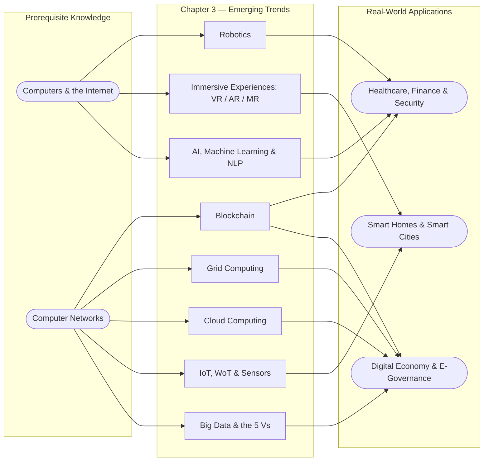
```mermaid
flowchart LR
    subgraph Prereq["Prerequisite Knowledge"]
        P1(["Computers & the Internet"])
        P2(["Computer Networks"])
    end
    subgraph Concepts["Chapter 3 — Emerging Trends"]
        C1["AI, Machine Learning & NLP"]
        C2["Immersive Experiences: VR / AR / MR"]
        C3["Robotics"]
        C4["Big Data & the 5 Vs"]
        C5["IoT, WoT & Sensors"]
        C6["Cloud Computing"]
        C7["Grid Computing"]
        C8["Blockchain"]
    end
    subgraph Apps["Real-World Applications"]
        A1(["Smart Homes & Smart Cities"])
        A2(["Digital Economy & E-Governance"])
        A3(["Healthcare, Finance & Security"])
    end
    P1 --> C1
    P1 --> C2
    P1 --> C3
    P2 --> C4
    P2 --> C5
    P2 --> C6
    P2 --> C7
    P2 --> C8
    C1 --> A3
    C2 --> A1
    C3 --> A3
    C4 --> A2
    C5 --> A1
    C6 --> A2
    C7 --> A2
    C8 --> A2
    C8 --> A3
```

- The chapter builds on computers and networks communicating with each other
- It branches into six largely independent technology families
- All six converge on the same real-world payoff: smarter, more automated, more connected homes, cities, and institutions

---

## 3.1 Introduction ⭐

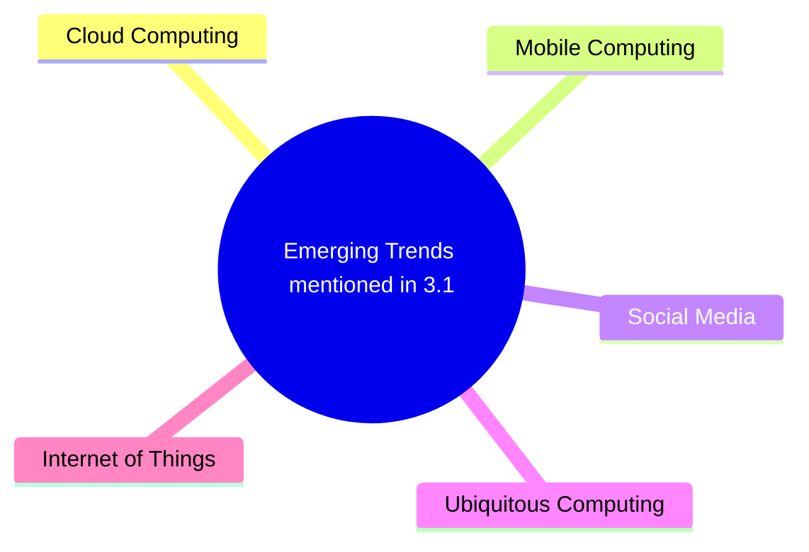
```mermaid
mindmap
  root(("Emerging Trends mentioned in 3.1"))
    Cloud Computing
    Mobile Computing
    Social Media
    Ubiquitous Computing
    Internet of Things
```

- New technologies appear almost every day
- Most new technologies fade
- A few persist and gain user attention §3.1
- These survivors are called emerging trends §3.1
- Emerging trend = a state-of-the-art technology that gains popularity and sets a new trend among users §3.1
- Trends flagged in this chapter's opening: cloud computing, mobile computing, social media, ubiquitous computing (Board book), Internet of Things (IoT) §3.1

| Trend | One-line description |
|---|---|
| Cloud computing | Share hardware/software resources as a service over the internet, pay-per-use |
| Mobile computing | Access and process data on handheld devices (smartphones, tablets) |
| Social media | Facebook, Twitter, WhatsApp, YouTube, LinkedIn — people interacting worldwide |
| Internet of Things (IoT) | A network of objects/devices embedded with microchips, sensors, actuators |

- Key idea: "emerging" doesn't mean brand new §3.1
- "Emerging" means currently gaining traction §3.1
- This is distinct from technologies that already failed to catch on §3.1
- This is also distinct from technologies that are now fully mainstream or legacy §3.1

---

## 3.2 Artificial Intelligence (AI) ⭐⭐

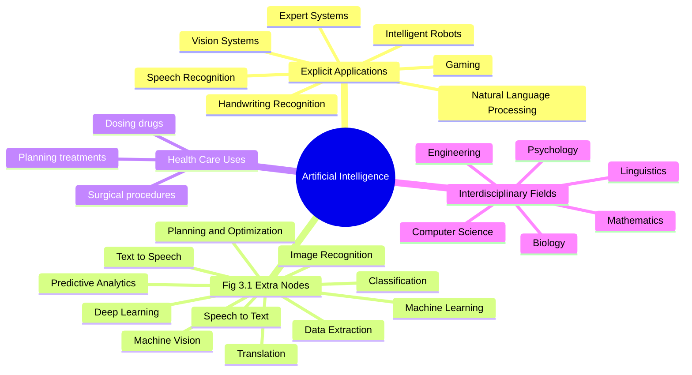
```mermaid
mindmap
  root(("Artificial Intelligence"))
    Explicit Applications
      Gaming
      Natural Language Processing
      Expert Systems
      Vision Systems
      Speech Recognition
      Handwriting Recognition
      Intelligent Robots
    Fig 3.1 Extra Nodes
      Predictive Analytics
      Deep Learning
      Machine Learning
      Text to Speech
      Speech to Text
      Classification
      Translation
      Data Extraction
      Machine Vision
      Image Recognition
      Planning and Optimization
    Health Care Uses
      Dosing drugs
      Planning treatments
      Surgical procedures
    Interdisciplinary Fields
      Computer Science
      Biology
      Psychology
      Linguistics
      Mathematics
      Engineering
```

- Artificial = man-made §3.2
- Intelligence = thinking power §3.2
- AI = "a man-made thinking power" §3.2
- AI endeavours to simulate the natural intelligence of human beings into machines §3.2
- This makes the machine behave intelligently §3.2
- AI imitates cognitive functions: learning, reasoning, planning, perceiving, decision-making, processing natural language §3.2

- A smartphone map suggests the fastest route by analysing real-time traffic data §3.2
- A social media site automatically recognises and tags friends in an uploaded photo §3.2
- Digital personal assistants powered by AI: Siri, Cortana, Alexa, and Google's assistant §3.2
- NCERT calls Google's assistant "Google Now" §3.2
- The Board book calls it "Google Assistant" §3.2
- Same product family, two different textbook snapshots in time §3.2

- Knowledge base = a store of information consisting of facts, assumptions, and rules §3.2
- An AI system uses its knowledge base for decision-making §3.2
- AI systems can also learn from past experiences or outcomes to make new decisions §3.2

- AI aims to build Expert Systems §3.2
- Expert Systems display intelligent behaviour: they learn, demonstrate, explain, and advise their users §3.2

**Applications of AI — the explicit list (Board book):**

| | | |
|---|---|---|
| Gaming | Natural Language Processing | Expert Systems |
| Vision Systems | Speech Recognition | Handwriting Recognition |
| Intelligent Robots | | |

- Fig. 3.1 (Board book) also sketches a wider AI application map §3.2
- Extra nodes in Fig. 3.1: Predictive Analytics, Deep Learning, Machine Learning, Text-to-Speech, Speech-to-Text, Classification, Translation, Data Extraction, Machine Vision, Image Recognition, Planning & Optimization §3.2

- AI is tested and used in the health care industry (Board book) §3.2
- Health care AI uses: dosing drugs, planning treatments, assisting in surgical procedures in the operating room §3.2

- AI is interdisciplinary (Board book) §3.2
- Fields AI draws on: Computer Science, Biology, Psychology, Linguistics, Mathematics, Engineering §3.2

---

## 3.2.1 Machine Learning ⭐⭐⭐

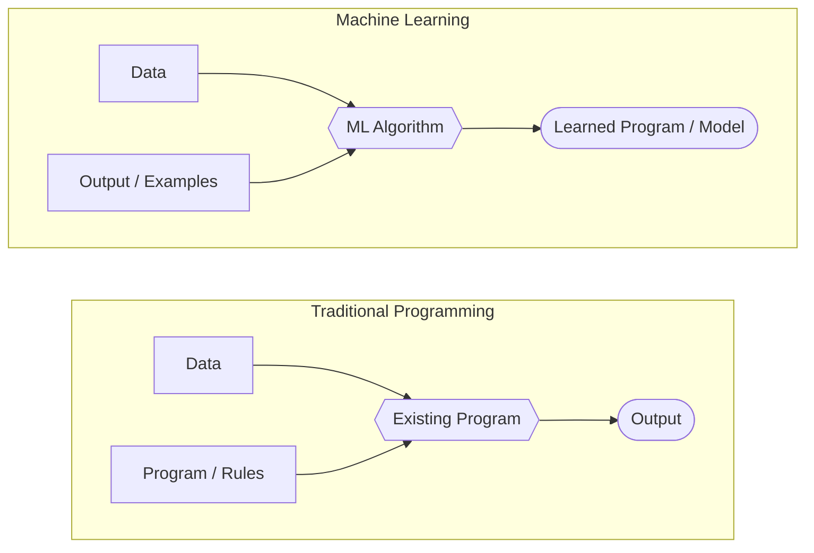
```mermaid
flowchart LR
    subgraph TP["Traditional Programming"]
        direction LR
        d1["Data"] --> box1{{"Existing Program"}}
        p1["Program / Rules"] --> box1
        box1 --> o1(["Output"])
    end
    subgraph MLB["Machine Learning"]
        direction LR
        d2["Data"] --> box2{{"ML Algorithm"}}
        o2["Output / Examples"] --> box2
        box2 --> p2(["Learned Program / Model"])
    end
```

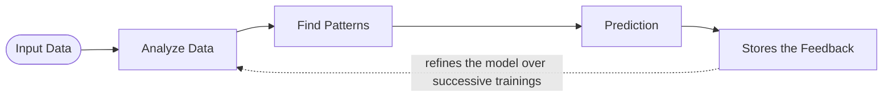
```mermaid
flowchart LR
    A(["Input Data"]) --> B["Analyze Data"]
    B --> C["Find Patterns"]
    C --> D["Prediction"]
    D --> E["Stores the Feedback"]
    E -.->|"refines the model over successive trainings"| B
```

- Machine Learning (ML) is a subsystem/application of AI §3.2.1
- ML gives computers the ability to learn from data using statistical techniques §3.2.1
- ML does this without being explicitly programmed §3.2.1
- ML comprises algorithms called models §3.2.1
- Models use data to learn on their own and make predictions §3.2.1

- Traditional programming: supply Data + Program (rules) — the computer computes the Output §3.2.1
- Machine Learning: supply Data + example Output — the algorithm works out the Program (model) §3.2.1

- Models are first trained on training data §3.2.1
- Models are then tested on testing data §3.2.1
- After successive trainings, once accuracy is acceptable, models predict new, unknown data §3.2.1

**Applications of Machine Learning:**

| | | |
|---|---|---|
| Virtual Personal Assistants | Image Recognition | Email Spam Filtering |
| Text & Speech Recognition | Medical Diagnosis | Automatic Translation |
| Traffic Prediction | Online Fraud Detection | Web Search & Recommendation Engines |

---

## 3.2.2 Natural Language Processing (NLP) ⭐⭐⭐

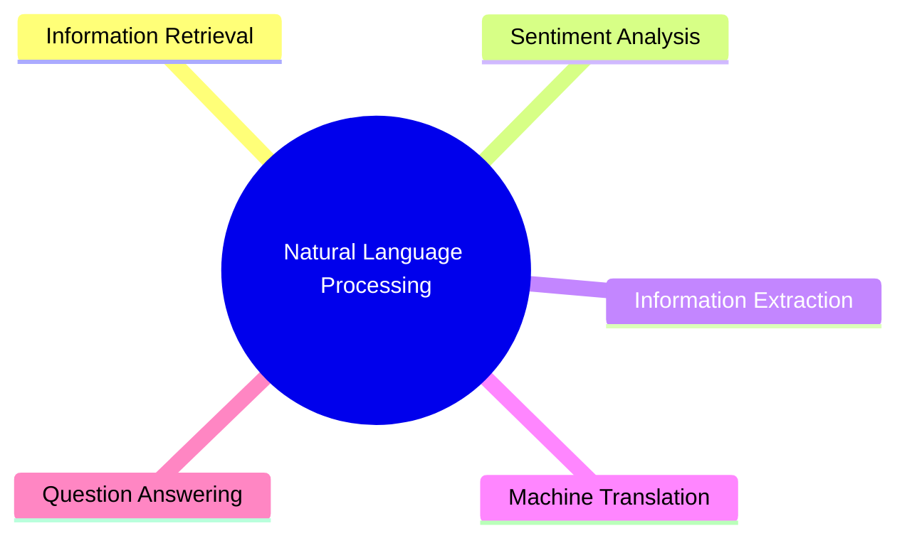
```mermaid
mindmap
  root(("Natural Language Processing"))
    Information Retrieval
    Sentiment Analysis
    Information Extraction
    Machine Translation
    Question Answering
```

- NLP is a subfield of AI §3.2.2
- NLP helps computers understand human language §3.2.2
- NLP is the interaction between computers and humans using natural spoken/written language, e.g. Hindi or English §3.2.2

- Everyday NLP: spell checkers, autocomplete, spam filters, voice text messaging, language translation, predictive-typing suggestions §3.2.2

- ⚠ NLP is not "a trait of Deep Learning" §3.2.2
- ⚠ Deep Learning is not "an implementation of AI" that NLP sits inside §3.2.2
- ⚠ NLP and ML are two separate subfields of AI §3.2.2
- ⚠ NLP relies on ML techniques to derive meaning from language, but is not nested inside ML §3.2.2

**Five things NLP does (Board book, Fig. 3.4):**

| Component | What it does |
|---|---|
| Information Retrieval | Finding relevant information from a large text collection |
| Sentiment Analysis | Judging whether text expresses a positive or negative opinion |
| Information Extraction | Pulling structured facts out of unstructured text |
| Machine Translation | Converting text from one language to another |
| Question Answering | Directly answering a question posed in natural language |

- NLP is the driving force behind: Google Translate, grammar checkers (Microsoft Word/Grammarly), Interactive Voice Response (IVR) systems, personal assistants (Google Assistant, Siri, Alexa) §3.2.2
- An NLP system's input/output can be speech or written text §3.2.2
- NLP can perform text-to-speech conversion §3.2.2
- NLP can perform speech-to-text conversion §3.2.2

- Emerging NLP application area: machine translation — translating text between languages with fair correctness §3.2.2
- Emerging NLP application area: automated customer service — software resolving customer queries/complaints §3.2.2

- Activity 3.1 (NCERT): how does NLP help differently-abled persons? §3.2.2
- NLP processes what was said, structures the information received, determines the necessary response, replies in an understandable language §3.2.2
- NLP's word-embedding feature helps differently-abled users work with systems more easily §3.2.2

---

## 3.2.3 Immersive Experiences ⭐⭐⭐

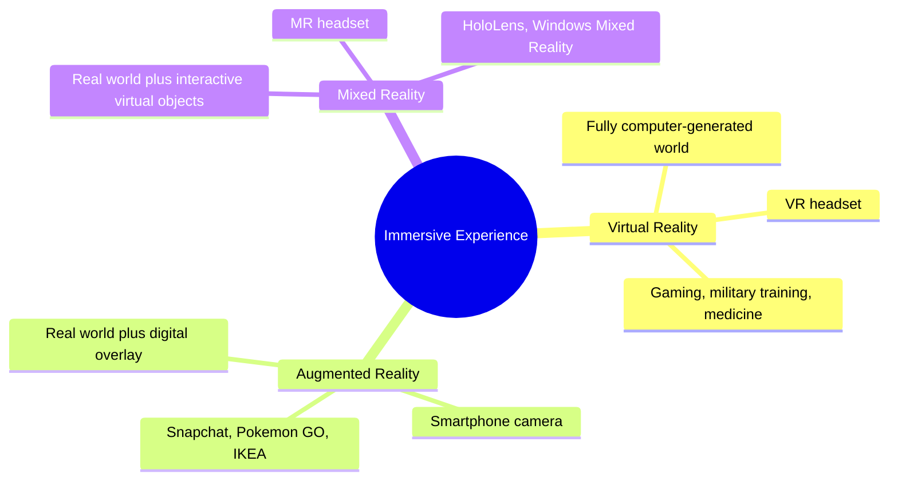
```mermaid
mindmap
  root(("Immersive Experience"))
    Virtual Reality
      Fully computer-generated world
      VR headset
      Gaming, military training, medicine
    Augmented Reality
      Real world plus digital overlay
      Smartphone camera
      Snapchat, Pokemon GO, IKEA
    Mixed Reality
      Real world plus interactive virtual objects
      MR headset
      HoloLens, Windows Mixed Reality
```

- Immersive experience = a technology that pulls a person into a new or augmented reality, engaging everyday life via technology §3.2.3
- Immersive experiences often chain together more than one technology §3.2.3
- 3D videography has changed how movies feel in theatres §3.2.3
- Video games use immersive design too §3.2.3
- Driving/flight simulators use immersive experience for training §3.2.3

### 3.2.3a Virtual Reality (VR)

- VR = a three-dimensional, computer-generated situation that simulates the real world §3.2.3a
- The VR user is immersed inside the experience §3.2.3a
- The VR user can interact with a 3D world §3.2.3a
- VR is achieved mainly through VR headsets §3.2.3a
- VR headsets are often paired with headphones and sometimes gloves §3.2.3a
- VR headsets can simulate sound, smell, motion, temperature to increase realism §3.2.3a
- VR applications: gaming, military training, medical procedures, entertainment, social science & psychology, engineering, simulation-heavy training §3.2.3a

### 3.2.3b Augmented Reality (AR)

- AR = the superimposition of computer-generated perceptual information over the existing physical surroundings §3.2.3b
- AR does not create a new world §3.2.3b
- AR adds a digital layer on top of the real one §3.2.3b
- AR is often delivered via a smartphone camera §3.2.3b
- AR examples: Snapchat lenses, Pokémon GO, location-based AR apps showing real-time info about nearby places §3.2.3b
- IKEA (Board book) was the first company to let customers preview furniture in their own room using AR §3.2.3b

### 3.2.3c Mixed Reality (MR) — Board book only, not in NCERT

- MR goes a step further than AR §3.2.3c
- The MR user can interact in real time with virtual objects placed within the real world §3.2.3c
- MR objects respond and react as if they were real §3.2.3c
- MR is achieved via an MR headset: Microsoft HoloLens, Acer Windows Mixed Reality, Lenovo Explorer, Samsung Odyssey §3.2.3c
- MR uses gesture/gaze/voice recognition §3.2.3c
- MR needs substantially more processing power than VR or AR alone §3.2.3c

| | Virtual Reality (VR) | Augmented Reality (AR) | Mixed Reality (MR) |
|---|---|---|---|
| What the user sees | A fully computer-generated world | The real world + a digital overlay | The real world + digital objects the user can interact with in real time |
| Creates something new? | Yes — replaces the real environment | No — alters perception of the real one | No — blends both, interactively |
| Typical hardware | VR headset | Smartphone camera / AR glasses | MR headset + motion controllers |
| Processing demand | Moderate | Lower | Highest of the three |

- ⚠ A drone is not an example of Augmented Reality §3.2.3b
- ⚠ A drone is an application of Robotics §3.2.4

---

## 3.2.4 Robotics ⭐⭐

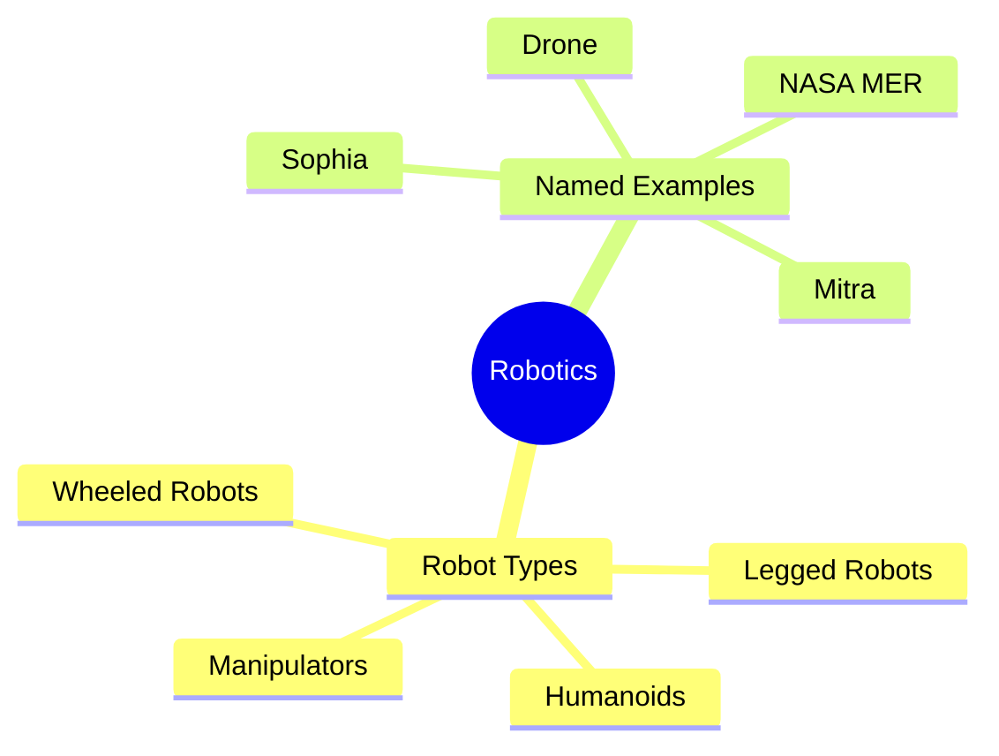
```mermaid
mindmap
  root(("Robotics"))
    Robot Types
      Wheeled Robots
      Legged Robots
      Manipulators
      Humanoids
    Named Examples
      Sophia
      NASA MER
      Mitra
      Drone
```

- Robotics = an interdisciplinary branch of technology §3.2.4
- Robotics combines mechanical engineering, electronics, computer science §3.2.4
- Robotics is concerned with the design, fabrication, operation, application of robots §3.2.4
- A robot is a machine that carries out one or more tasks automatically §3.2.4
- A robot works with accuracy and precision §3.2.4
- A robot is programmable §3.2.4
- A robot can follow instructions given through computer programs §3.2.4
- Sensors are one of the prime components of a robot §3.2.4

- Robots were originally built for repetitive, boring, stressful, or labour-intensive industrial tasks §3.2.4
- Robots are also used in hazardous environments: inspecting radioactive materials, bomb detection/deactivation §3.2.4
- Robots are used wherever humans can't survive: space, underwater, extreme heat §3.2.4
- Robot types: wheeled robots, legged robots, manipulators, humanoids §3.2.4
- Humanoids = robots that resemble humans §3.2.4

**Named examples worth remembering:**

| Robot | What it is |
|---|---|
| Sophia | A realistic humanoid capable of human-like expressions; the world's first robot citizen and first robot Innovation Ambassador for the UN Development Programme |
| NASA's Mars Exploration Rover (MER) | A robotic space mission studying planet Mars |
| Mitra (Board book) | The first Indian-made humanoid, using AI, visual data processing, and facial recognition; imitates human gestures/expressions |
| Drone | An unmanned aircraft, remotely controlled or flying autonomously via software-controlled flight plans, onboard sensors, and GPS |

- Drone uses: journalism, filming/aerial photography, short-distance delivery, disaster management, search & rescue, healthcare, geographic mapping, structural safety inspection, agriculture, wildlife monitoring, law enforcement, border patrolling §3.2.4

- Robots in medicine (Board book): prosthetic robotic limbs interface with the nervous system to restore movement/touch to amputees §3.2.4
- Robots in medicine (Board book): automated dispensing robots cut medication-dispensing errors in pharmacies §3.2.4
- Robots in medicine (Board book): clinical training robots simulate realistic medical scenarios for trainee doctors §3.2.4
- Robots after a natural calamity (Board book): drones help relief workers see the big picture §3.2.4
- Robots after a natural calamity (Board book): drones locate survivors faster §3.2.4
- Robots after a natural calamity (Board book): drones assess damaged infrastructure §3.2.4
- Robots after a natural calamity (Board book): drones deliver supplies §3.2.4
- Robots after a natural calamity (Board book): drones help put out fires §3.2.4

---

## 3.3 Big Data ⭐⭐⭐

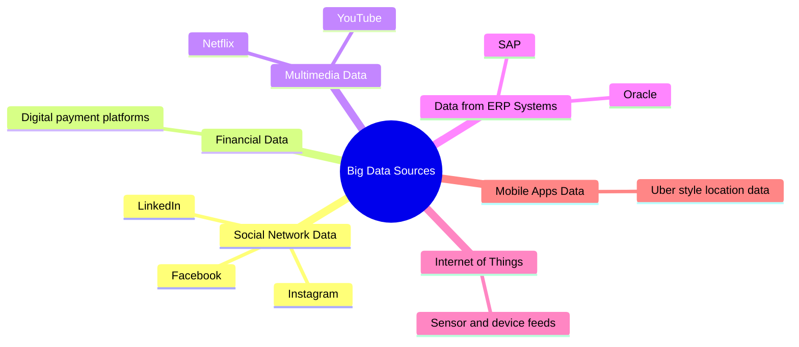
```mermaid
mindmap
  root(("Big Data Sources"))
    Social Network Data
      Facebook
      Instagram
      LinkedIn
    Financial Data
      Digital payment platforms
    Multimedia Data
      Netflix
      YouTube
    Data from ERP Systems
      SAP
      Oracle
    Internet of Things
      Sensor and device feeds
    Mobile Apps Data
      Uber style location data
```

- Big Data = a huge volume of data that cannot be stored or processed by traditional data-storage/processing tools §3.3
- Big Data is generated at massive scale §3.3
- Organisations use Big Data to uncover insights and improve their business §3.3

- Over a billion internet users exist (NCERT) §3.3
- The majority of the world's web traffic comes from smartphones §3.3
- Roughly 2.5 quintillion bytes of data are created every single day §3.3
- This pace keeps accelerating as IoT grows §3.3

**Big Data in 60 seconds (NCERT, Fig. 3.8 — approximate figures):**

| Source | Amount generated every 60 seconds |
|---|---|
| Emails sent | 204 million |
| WhatsApp messages sent | 44.4 million |
| Google search queries | 2.4 million |
| YouTube video views | 2.78 million |
| New tweets | 547,200 |
| Instagram posts uploaded | 46,200 |
| Snapchat snaps created | 1.8 million |
| Skype calls | 104,300+ |
| GIFs sent via Messenger | 15,000 |
| New LinkedIn accounts | 120+ |
| Apps downloaded | 342,000 |
| Netflix hours watched | 70,017 |
| Wikipedia page views | 5 lakh |
| Facebook status updates | 293,000 |

**Sources (Board book, Fig. 3.10):**

| Category | Concrete examples |
|---|---|
| Social Network Data | Facebook, Instagram, LinkedIn |
| Financial Data | Digital payment/transfer platforms |
| Multimedia Data | Netflix, YouTube |
| Data from ERP Systems | SAP, Oracle |
| Internet of Things | Sensor/device data feeds |
| Mobile Apps Data | Uber-style location/ride data |

- Big Data is not just voluminous — it's largely unstructured §3.3
- Unstructured examples: posts, instant messages/chats, shared photographs, tweets, blog articles, news items, opinion polls and their comments, audio/video chats §3.3
- Big Data challenges beyond volume: integration, storage, analysis, searching, processing, transfer, querying, visualisation §3.3

- Businesses analyse Big Data with: text analytics, machine learning, predictive analytics, data mining, statistics, NLP §3.3
- These techniques help businesses make faster, better-informed decisions §3.3

---

## 3.3.1 Characteristics of Big Data — the 5 V's ⭐⭐⭐

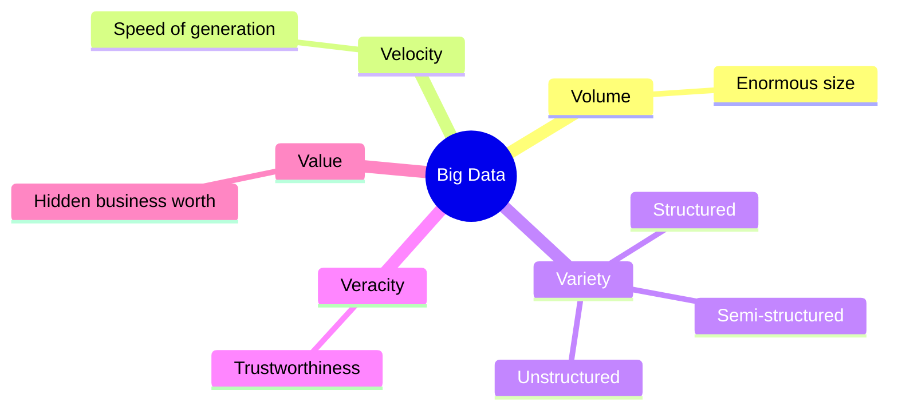
```mermaid
mindmap
  root(("Big Data"))
    Volume
      Enormous size
    Velocity
      Speed of generation
    Variety
      Structured
      Semi-structured
      Unstructured
    Veracity
      Trustworthiness
    Value
      Hidden business worth
```

| V | Meaning |
|---|---|
| Volume | The sheer size — huge 'volumes' generated daily from social media, business processes, machines, networks, human interaction; stored in data warehouses |
| Velocity | The speed at which data is created/generated in real time — rate of change and activity bursts |
| Variety | A combination of data types — structured, semi-structured, unstructured (emails, PDFs, photos, videos, audio, social-media posts) |
| Veracity | The trustworthiness of the data — inconsistent, biased, or noisy data can mislead conclusions |
| Value | The hidden patterns and business value locked in the data — worth checking for before investing heavily in processing it |

- Mnemonic: Volume, Velocity, Variety, Veracity, Value all start with "V" §3.3.1
- This is why they're called the "5 V's of Big Data" §3.3.1

---

## 3.3.2 Data Analytics ⭐

- Data analytics = the process of examining data sets to draw conclusions about the information they contain, with the aid of specialised systems and software §3.3.2
- Data analytics helps businesses make more informed decisions §3.3.2
- Data analytics helps researchers verify or disprove scientific models, theories, hypotheses §3.3.2
- Pandas is a Python library commonly used to simplify data analysis §3.3.2

---

## 3.4 Internet of Things (IoT) ⭐⭐⭐

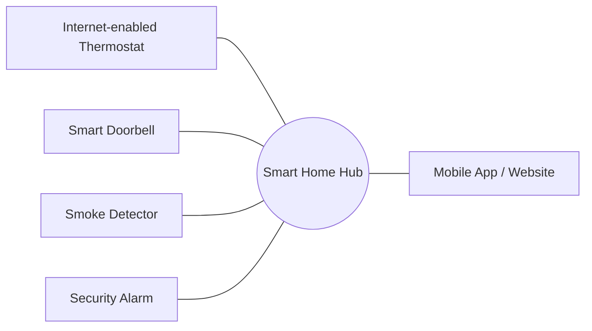
```mermaid
flowchart LR
    thermostat["Internet-enabled Thermostat"] --- hub(("Smart Home Hub"))
    doorbell["Smart Doorbell"] --- hub
    smoke["Smoke Detector"] --- hub
    alarm["Security Alarm"] --- hub
    hub --- app["Mobile App / Website"]
```

- IoT = a system of inter-related computing devices, mechanical/digital machines, objects, and people §3.4
- Each IoT thing is given a unique identifier (UID) §3.4
- IoT things can transfer data over a network §3.4
- IoT does this without needing human-to-human or human-to-computer interaction §3.4

- IoT makes once-"dumb" devices "smarter" §3.4
- IoT lets devices send data over the internet §3.4
- IoT lets devices communicate with people and other IoT-enabled things §3.4

- Smart home example: internet-enabled thermostats, doorbells, smoke detectors, security alarms §3.4
- These devices form a hub where data is shared §3.4
- Users remotely control things in that hub via a mobile app or website §3.4
- Example remote controls: adjusting temperature, unlocking doors §3.4

- NCERT's second IoT example: microwave oven, air conditioner, door lock, CCTV camera §3.4
- These devices, once internet-connected, can be accessed and remotely controlled from a smartphone §3.4
- ⚠ A networked CCTV camera counts as an IoT implementation, not just "plain surveillance" §3.4

---

## 3.4.1 Web of Things (WoT) ⭐⭐

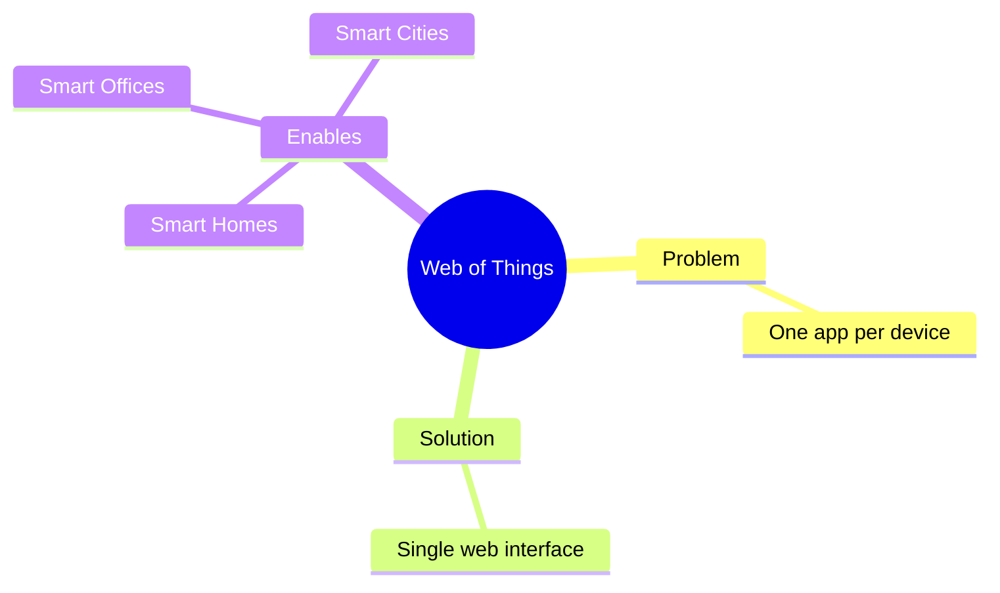
```mermaid
mindmap
  root(("Web of Things"))
    Problem
      One app per device
    Solution
      Single web interface
    Enables
      Smart Homes
      Smart Offices
      Smart Cities
```

- IoT has a friction problem: interacting with 'n' devices needs 'n' different apps §3.4.1
- WoT solves this by using the web itself as one common interface §3.4.1
- Web services connect anything in the physical world (besides human identities) to the web §3.4.1
- WoT paves the way for smart homes, smart offices, smart cities §3.4.1

---

## 3.4.2 Sensors ⭐⭐

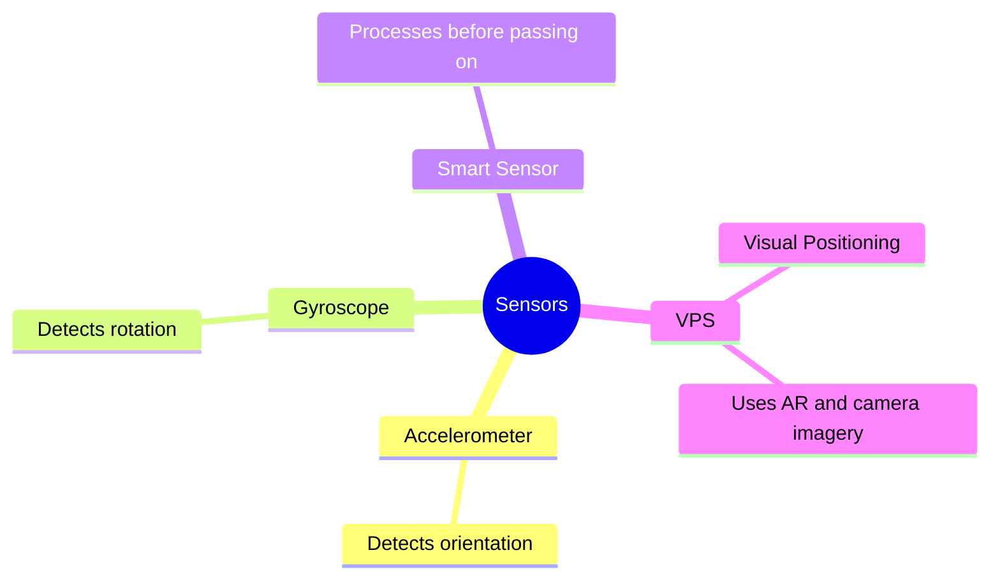
```mermaid
mindmap
  root(("Sensors"))
    Accelerometer
      Detects orientation
    Gyroscope
      Detects rotation
    Smart Sensor
      Processes before passing on
    VPS
      Visual Positioning
      Uses AR and camera imagery
```

- A sensor is a device that detects and responds to electrical/optical signals §3.4.2
- A sensor converts a physical parameter into a signal that can be measured electrically §3.4.2
- Physical parameter examples: temperature, blood pressure, humidity, speed §3.4.2

- Example: rotating a phone flips its display between vertical and horizontal §3.4.2
- This uses two sensors together: accelerometer and gyroscope §3.4.2
- Accelerometer detects the phone's orientation §3.4.2
- Gyroscope tracks rotation/twist of the hand §3.4.2
- The gyroscope adds to the information the accelerometer supplies §3.4.2

- Smart sensor: takes input from the physical environment §3.4.2
- Smart sensor: uses built-in computing resources §3.4.2
- Smart sensor: performs pre-defined functions upon detecting specific input §3.4.2
- Smart sensor: processes the data before passing it on §3.4.2
- The evolution of smart sensors is a major driver of IoT's growth §3.4.2

- VPS, Visual Positioning System, NCERT Activity 3.4: another emerging trend §3.4.2
- VPS layers Augmented Reality onto positioning §3.4.2
- VPS uses camera imagery rather than satellite signal alone to pinpoint location §3.4.2
- VPS is especially useful indoors or wherever GPS signal is weak §3.4.2

---

## 3.4.3 Smart Cities ⭐⭐

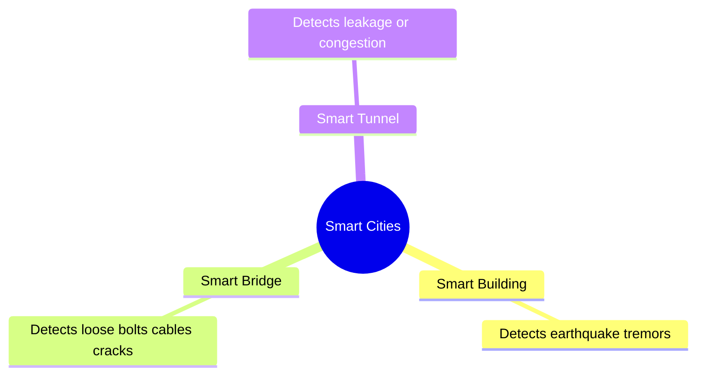
```mermaid
mindmap
  root(("Smart Cities"))
    Smart Building
      Detects earthquake tremors
    Smart Bridge
      Detects loose bolts cables cracks
    Smart Tunnel
      Detects leakage or congestion
```

- Smart City = an urban area that uses electronic IoT sensors to collect data §3.4.3
- A Smart City uses insights from that data to manage assets, resources, and services efficiently §3.4.3
- Domains covered: traffic/transportation, power plants, utilities, water supply networks, waste management, crime detection, information systems, schools, libraries, hospitals, other community services §3.4.3

| Smart infrastructure | What its sensors detect |
|---|---|
| Smart building | Earthquake tremors — warns nearby buildings to prepare |
| Smart bridge | Any loose bolt, cable, or crack — alerts authorities via SMS |
| Smart tunnel | Leakage or congestion — sends wireless signals to a centralised computer for analysis |

---

## 3.5 Cloud Computing ⭐⭐⭐

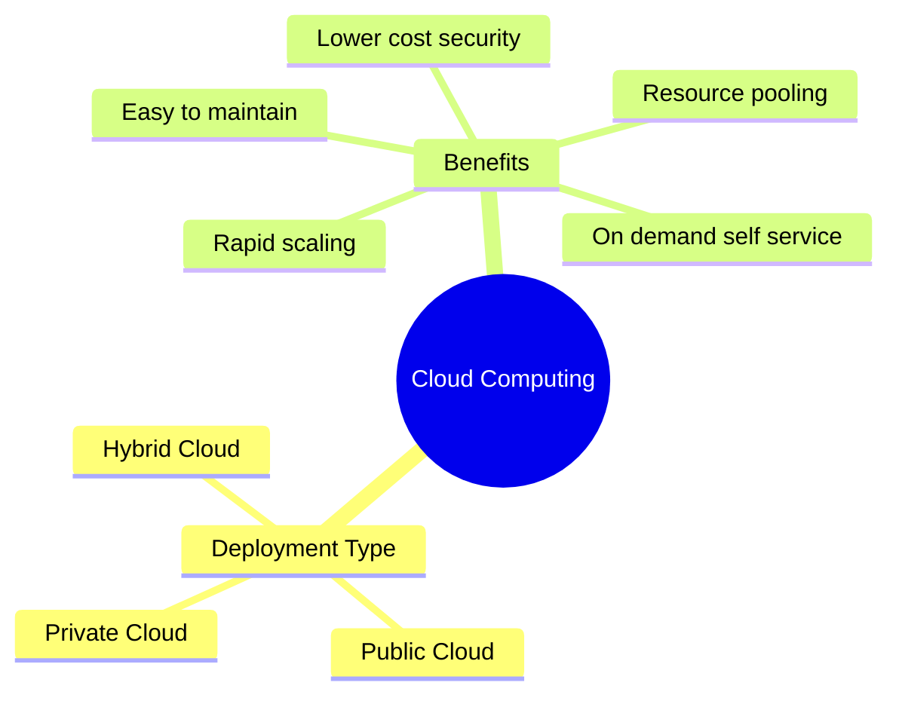
```mermaid
mindmap
  root(("Cloud Computing"))
    Deployment Type
      Public Cloud
      Private Cloud
      Hybrid Cloud
    Benefits
      Easy to maintain
      Lower cost security
      On demand self service
      Rapid scaling
      Resource pooling
```

- Cloud computing = a technology of distributed data processing §3.5
- Scalable information resources/capacities are provided as a service to multiple external customers over the internet §3.5
- Cloud computing involves storing, accessing data, and running programs entirely online §3.5
- Cloud computing is typically billed like a utility, pay-per-use §3.5

- NCERT: "a better way to understand the cloud is to interpret everything as a service" §3.5
- A user can run a bigger application without having the required storage/processing power on their own PC §3.5
- A user can process a large amount of data without having the required storage/processing power on their own PC §3.5
- This works as long as the user is connected to the internet §3.5

**Benefits of cloud computing (Board book):**

- Easy to maintain §3.5
- Increased security at a much lesser cost §3.5
- On-demand self-service by consumers §3.5
- Rapid scaling of capacity §3.5
- Resource pooling of physical and virtual resources §3.5

**Three deployment types (Board book — NCERT does not cover this split):**

| Type | Who it serves | Examples |
|---|---|---|
| Public Cloud | Multiple users/organisations ("tenants") share a portal owned/operated by a third-party provider | Google Drive, Dropbox, Microsoft OneDrive, iCloud, Amazon Cloud Drive |
| Private Cloud | Resources dedicated solely to one organisation (self-hosted, or via a paid third-party host) | — |
| Hybrid Cloud | Combines public + private, sharing data/applications between them | Built on infrastructure such as AWS + Microsoft Azure |

---

## 3.5.1 Cloud Service Models ⭐⭐⭐

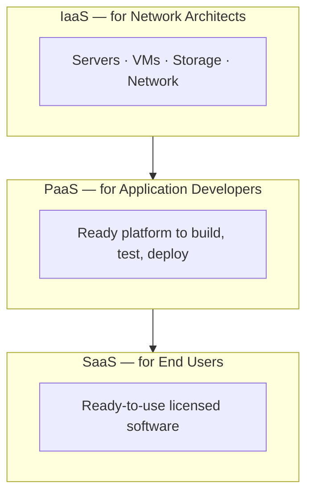
```mermaid
flowchart TD
    subgraph IaaS["IaaS — for Network Architects"]
        i1["Servers · VMs · Storage · Network"]
    end
    subgraph PaaS["PaaS — for Application Developers"]
        p1["Ready platform to build, test, deploy"]
    end
    subgraph SaaS["SaaS — for End Users"]
        s1["Ready-to-use licensed software"]
    end
    IaaS --> PaaS --> SaaS
```

| Service | What the provider gives you | Who typically uses it | Examples |
|---|---|---|---|
| IaaS — Infrastructure as a Service | Servers, virtual machines, storage/back-up, network components, OS — the raw building blocks | Network architects | Windows Azure, Rackspace, Google Compute Engine |
| PaaS — Platform as a Service | A ready platform to develop, test, and deploy applications, without managing the underlying infrastructure | Application developers | AWS Elastic Beanstalk, Heroku, Windows Azure |
| SaaS — Software as a Service | Finished, licensed software, used via a browser on demand | End users | Microsoft Office 365, Google Workspace, Dropbox, Cisco WebEx, GoToMeeting |
| DaaS — Desktop as a Service (Board book) | An improved SaaS model (first appeared early 2000s) using multiple services simultaneously to complete one piece of work | End users | — |

- NCERT's PaaS example: a web application built using MySQL and Python §3.5.1
- To deploy it, rent a pre-configured Apache server from the cloud §3.5.1
- The rented server has MySQL and Python already installed §3.5.1
- No need to install/configure MySQL, Python, or the web server yourself §3.5.1
- The user retains complete control over the deployed application and its configuration §3.5.1
- The cloud removes the setup and maintenance burden underneath it §3.5.1

- Beyond IaaS/PaaS/SaaS/DaaS, cloud hosting also offers Data as a Service (Board book) §3.5.1
- Cloud hosting also offers Everything as a Service (Board book) §3.5.1
- Common thread: the World Wide Web via cloud hosting can meet almost any information-processing requirement §3.5.1

- CTM (Board book): cloud computing means access to all your applications and data from any network device §3.5.1

- The Government of India's own cloud initiative is called "GI Cloud" §3.5.1
- GI Cloud is branded MeghRaj, https://cloud.gov.in §3.5.1

---

## 3.6 Grid Computing ⭐⭐⭐

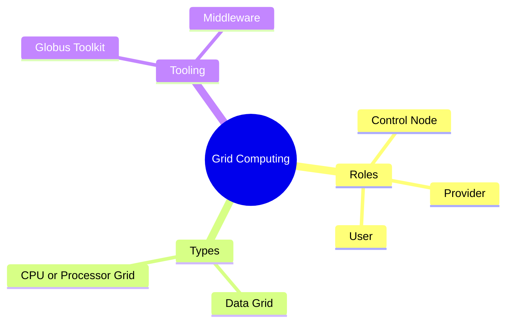
```mermaid
mindmap
  root(("Grid Computing"))
    Roles
      Control Node
      Provider
      User
    Types
      Data Grid
      CPU or Processor Grid
    Tooling
      Globus Toolkit
      Middleware
```

- Grid Computing = a network of computers working together to perform a task too difficult for a single machine §3.6
- All grid machines follow the same protocol §3.6
- A grid acts like a virtual supercomputer §3.6
- Grid machines contribute processing power and storage §3.6
- Grid computing is a subset of distributed computing §3.6
- Grid computing can be seen as a form of Parallel Computing §3.6
- Unlike parallel computing on one machine, grid cores are spread across many machines in different locations §3.6

- Countless devices (mobiles, PCs, workstations) are already connected to a LAN or the internet §3.6
- It's economically feasible to reuse their spare memory and processing power §3.6
- This avoids buying dedicated hardware §3.6
- Grid computing lets researchers tackle computationally intense scientific/research problems §3.6
- This is done without procuring costly hardware §3.6

**Three roles in a grid network:**

| Role | Job |
|---|---|
| Control Node | Usually a server (or group of servers) that administers the whole network and tracks resources in the pool |
| Provider | Contributes its resources to the network's resource pool |
| User | Uses the resources on the network |

**Two types of grid:**

| Type | Purpose |
|---|---|
| Data grid | Manages large, distributed data requiring multi-user access |
| CPU / Processor grid | Moves processing from one PC to another as needed, or splits a large task into sub-tasks distributed across nodes for parallel processing |

- ⚠ IaaS: a provider rents the required infrastructure to users §3.6
- ⚠ Grid computing: multiple computing nodes join together voluntarily to solve one common problem §3.6
- ⚠ In grid computing, nobody is "renting" anything §3.6

- Setting up a grid needs middleware to implement the distributed processor architecture §3.6
- Globus toolkit, http://toolkit.globus.org/toolkit, is one open-source software toolkit for building grids §3.6
- Globus toolkit provides: security, resource management, data management, communication, fault detection §3.6

---

## 3.7 Blockchain Technology ⭐⭐⭐

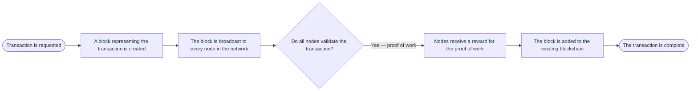
```mermaid
flowchart LR
    A(["Transaction is requested"]) --> B["A block representing the transaction is created"]
    B --> C["The block is broadcast to every node in the network"]
    C --> D{"Do all nodes validate the transaction?"}
    D -->|"Yes — proof of work"| E["Nodes receive a reward for the proof of work"]
    E --> F["The block is added to the existing blockchain"]
    F --> G(["The transaction is complete"])
```

- Traditionally, digital transactions (ticket bookings, banking) are stored in one centralised database §3.7
- Centralised transactions are updated one at a time §3.7
- All the data sits in one place §3.7
- ⚠ Centralised data is at risk of being hacked or lost §3.7

- Blockchain = a decentralised and shared database §3.7
- Every computer (node) holds its own full copy §3.7
- A block = a secured chunk of data or a valid transaction §3.7
- Each block has a header, visible to every other node §3.7
- Each block has private data, visible only to its owner §3.7
- Chained blocks form the blockchain §3.7

- Analogy (Board book): a blockchain is like a Google Doc shared with a group of people §3.7
- The document is distributed, not copied or transferred §3.7
- Everyone can access it at the same time §3.7
- No one waits for someone else to finish §3.7
- Every edit is recorded transparently in real time §3.7

- Each node maintains an "append-only" open ledger §3.7
- The ledger is updated only after every node in the network authenticates the transaction §3.7
- Every member keeps a copy §3.7
- No single member can unilaterally alter data §3.7
- This is what makes blockchain transactions safe and secure §3.7

- Blockchain's most popular application is digital currency §3.7
- Blockchain is being applied to healthcare: better data-sharing between providers gives more accurate diagnosis and more effective treatment §3.7
- Blockchain is being applied to land registration: avoiding ownership disputes §3.7
- Blockchain is being applied to voting systems: harder to alter votes since everything is on the ledger §3.7
- Broader sectors: banking, media, telecom, travel and hospitality §3.7
- Board book additional sectors: payment processing/money transfers, supply-chain monitoring, digital IDs, data sharing, copyright/royalty protection, medical recordkeeping, managing IoT networks §3.7

---

## Textbook Activities & Reflection Prompts ⭐

| Prompt | Where it points |
|---|---|
| How does NLP help differently-abled persons? | Word-embedding lets systems structure and respond to speech/text more naturally — §3.2.2 |
| What role do robots play in the medical field? | Prosthetic limbs, dispensing robots, clinical training robots — §3.2.4 |
| Can a drone help during a natural calamity? | Yes — survivor location, damage assessment, supply delivery, firefighting — §3.2.4 |
| Explore a few IoT devices available in the market | Smart thermostats, smart bulbs, smart locks, wearables, smart speakers |
| GPS handles outdoor navigation — what does VPS do? | VPS layers AR onto positioning for indoor/GPS-weak navigation — §3.4.2 |
| Name a few data centers in India and their major services | GI Cloud "MeghRaj" (government) is the chapter's own example — §3.5 |
| How are your own digital activities contributing to Big Data? | Every post, chat, photo, or search query you generate adds to the 5 V's — §3.3 |
| What are your ideas for transforming your city into a smart city? | Apply §3.4.3's Smart City domains (traffic, utilities, waste, safety) to a city you know |
| How could this chapter's trends assist people with disabilities? | NLP's word-embedding, VR/AR interfaces, and IoT-based smart-home automation are the clearest fits |
| Name two areas (beyond healthcare, land records, voting) where blockchain could help | Supply-chain provenance or academic credential verification |

---

## Quick Reference ⭐⭐⭐

- AI is the umbrella §3.2
- ML and NLP are both separate subfields of AI §3.2.1 / §3.2.2
- NLP borrows ML techniques but isn't inside ML §3.2.2
- Robotics and Immersive Experiences (VR/AR/MR) also sit under the AI/emerging-tech umbrella §3.2.3 / §3.2.4
- Robotics and Immersive Experiences aren't ML/NLP applications themselves §3.2.3 / §3.2.4

- 5 V's of Big Data: Volume, Velocity, Variety, Veracity, Value §3.3.1
- Cloud deployment types: Public (shared, third-party), Private (dedicated, one org), Hybrid (both, combined) §3.5
- Cloud service models, smallest to most finished: IaaS to PaaS to SaaS to DaaS, DaaS is Board book §3.5.1

**Cloud Computing vs Grid Computing:**

| | Cloud Computing | Grid Computing |
|---|---|---|
| Architecture | Client–server; resources at remote locations, available to anyone from anywhere | Distributed; a large number of computers connected in parallel to solve one problem |
| Resource management | Centrally managed by the provider | Managed on a collaboration pattern between nodes |
| Payment | Users pay for use | Users do not pay for use |
| Ownership | Servers owned by infrastructure providers | Grids owned and managed by the organisation(s) that built them |
| Accessibility | Highly accessible | Comparatively low accessibility |

- Grid types: Data grid, manages distributed data; CPU/Processor grid, splits/distributes processing §3.6
- VR replaces the real world §3.2.3a
- AR overlays the real world §3.2.3b
- MR lets you interact with virtual objects placed in the real world in real time §3.2.3c
- IoT connects devices §3.4
- WoT connects them all through one interface, the web, instead of one app per device §3.4.1

---

## Points to Ponder ⭐⭐⭐

- ⚠ NLP is not a trait of Deep Learning §3.2.2
- ⚠ NLP and ML are both independent subfields of AI §3.2.2
- ⚠ A drone is Robotics, not Augmented Reality §3.2.4
- ⚠ Cloud-based storage does not use local computer storage §3.5
- ⚠ VR is fully immersive — it replaces reality §3.2.3a
- ⚠ AR only overlays reality §3.2.3b
- ⚠ MR lets you interact with virtual objects placed in real time within reality §3.2.3c
- ⚠ Grid computing is not the same as IaaS cloud §3.6
- ⚠ IaaS: a provider rents infrastructure to you §3.5.1
- ⚠ Grid: independent nodes join together to solve a shared problem — nobody is renting anything §3.6
- ⚠ Public/Private/Hybrid Cloud is about deployment/ownership §3.5
- ⚠ IaaS/PaaS/SaaS/DaaS is about what layer of the stack you're being handed §3.5.1
- ⚠ CCTV cameras are a real-world IoT application §3.4
- ⚠ Smart cities are meant to be sustainable and livable by design §3.4.3
- ⚠ A block's header is visible to every node §3.7
- ⚠ Only the owner can see a block's private data §3.7
- ⚠ "Emerging" is about current momentum, not literal novelty §3.1

---

## Problem-Solving Strategy ⭐⭐

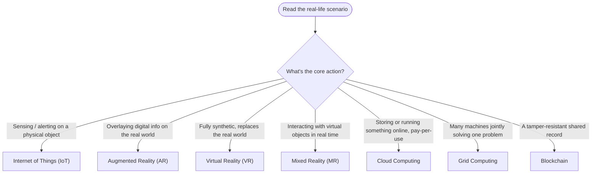
```mermaid
flowchart TD
    A(["Read the real-life scenario"]) --> B{"What's the core action?"}
    B -->|"Sensing / alerting on a physical object"| C["Internet of Things (IoT)"]
    B -->|"Overlaying digital info on the real world"| D["Augmented Reality (AR)"]
    B -->|"Fully synthetic, replaces the real world"| E["Virtual Reality (VR)"]
    B -->|"Interacting with virtual objects in real time"| F["Mixed Reality (MR)"]
    B -->|"Storing or running something online, pay-per-use"| G["Cloud Computing"]
    B -->|"Many machines jointly solving one problem"| H["Grid Computing"]
    B -->|"A tamper-resistant shared record"| I["Blockchain"]
```

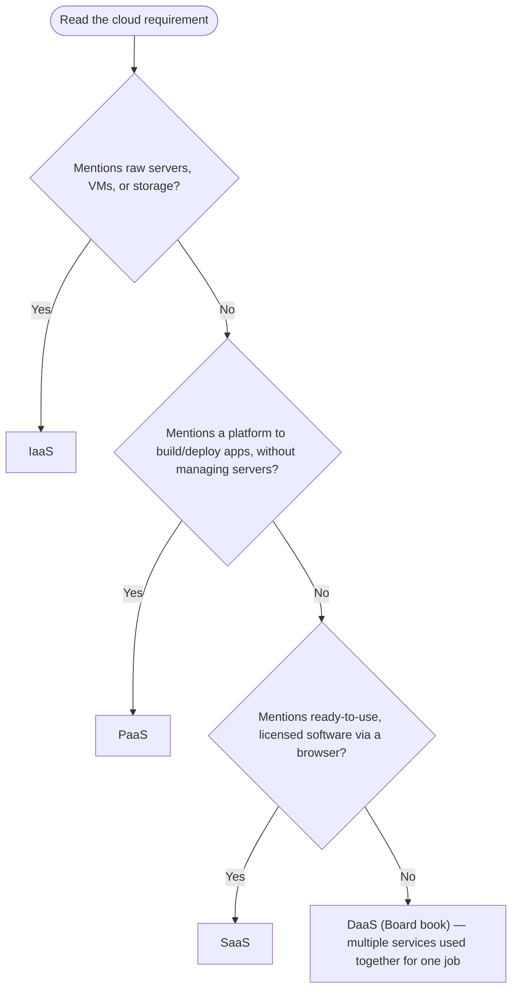
```mermaid
flowchart TD
    A(["Read the cloud requirement"]) --> B{"Mentions raw servers, VMs, or storage?"}
    B -->|"Yes"| C["IaaS"]
    B -->|"No"| D{"Mentions a platform to build/deploy apps, without managing servers?"}
    D -->|"Yes"| E["PaaS"]
    D -->|"No"| F{"Mentions ready-to-use, licensed software via a browser?"}
    F -->|"Yes"| G["SaaS"]
    F -->|"No"| H["DaaS (Board book) — multiple services used together for one job"]
```

- Step 1, scenario matching: identify the core action in the scenario
- Core action options: sensing, alerting, remote control, data storage, computation-sharing, record-keeping
- Step 2: match the action to a technology family
- Sensing/alerting on a physical object maps to IoT/Smart sensor
- A virtual overlay on the real world maps to AR
- A fully synthetic environment maps to VR
- Interacting with virtual objects placed in reality maps to MR
- Storing/running things "in the cloud" maps to Cloud Computing
- Many machines jointly solving one problem maps to Grid Computing
- A tamper-resistant shared ledger maps to Blockchain
- Step 3: cross-check against the definition, not just surface similarity
- Example: a drone looks high-tech but is Robotics, not AR
- Example: a CCTV camera looks like plain surveillance but is IoT once networked and remotely controllable
- Step 4: rule out look-alike distractors deliberately

- Cloud service model fit, Step 1: does the requirement mention raw servers/storage/VMs? Then IaaS
- Step 2: does it mention a ready platform to build/deploy apps without managing servers? Then PaaS
- Step 3: does it mention ready-to-use, licensed software accessed via a browser? Then SaaS
- Step 4: does it mention combined use of multiple services at once to finish one job? Then DaaS (Board book)

---

## Rapid Reference

| Fact | Value |
|---|---|
| AI stands for | Artificial Intelligence — "a man-made thinking power" |
| ML's relationship to AI | Subsystem/application of AI |
| NLP's relationship to AI | Separate subfield of AI, not inside ML |
| VR | Fully replaces the real world |
| AR | Overlays a digital layer on the real world |
| MR | Lets you interact with virtual objects placed in the real world |
| First robot citizen | Sophia |
| First Indian-made humanoid | Mitra |
| NASA's MER mission | Studies planet Mars |
| Drone's technology family | Robotics |
| Big Data's 5 V's | Volume, Velocity, Variety, Veracity, Value |
| Big Data's daily volume (NCERT) | About 2.5 quintillion bytes per day |
| Big Data's 8 challenges | Integration, storage, analysis, searching, processing, transfer, querying, visualisation |
| IoT definition | Inter-related devices/objects/people with UIDs, transferring data without human intervention |
| WoT's role | One web interface for many IoT devices, instead of one app each |
| Accelerometer detects | Orientation / tilt |
| Gyroscope detects | Rotation / twist |
| VPS | AR plus camera imagery for positioning, complements GPS |
| Public Cloud | Shared, third-party-owned portal |
| Private Cloud | Dedicated to one organisation |
| Hybrid Cloud | Combines Public + Private |
| IaaS users | Network architects |
| PaaS users | Application developers |
| SaaS users | End users |
| DaaS (Board book) | Improved SaaS model, multiple services at once |
| Grid Computing's 3 roles | Control Node, Provider, User |
| Grid Computing's 2 types | Data grid, CPU/Processor grid |
| Grid vs IaaS | Grid nodes are free and voluntary; IaaS is a paid rental from a provider |
| Government of India's cloud | GI Cloud, branded MeghRaj |
| Blockchain's block structure | Header, visible to all nodes; private data, owner-only |
| Blockchain's most popular use | Digital currency |
| Blockchain's ledger type | Append-only, decentralised, one copy per node |
