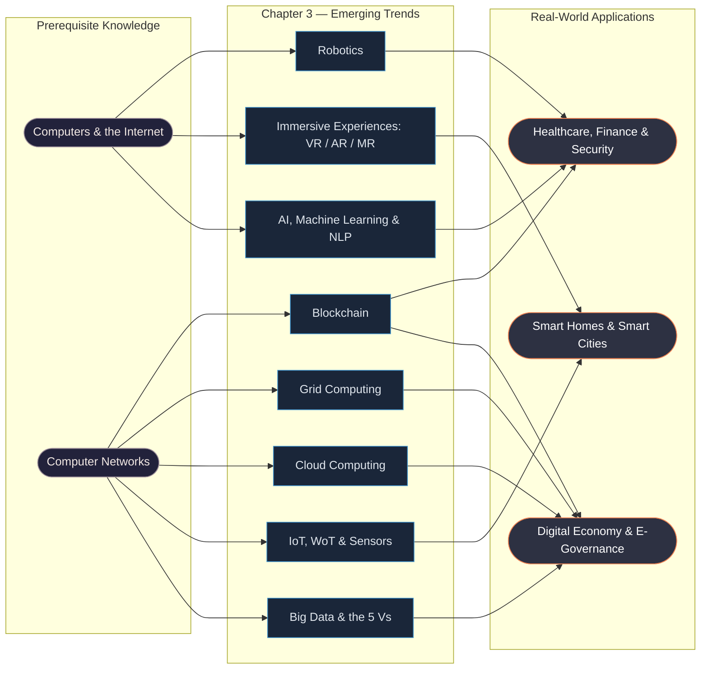
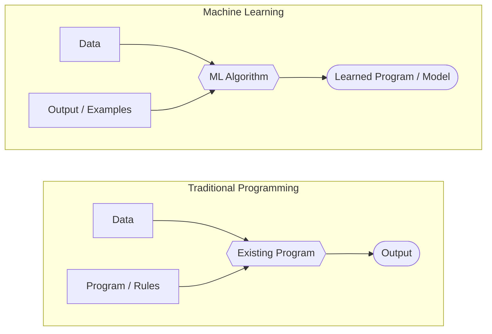
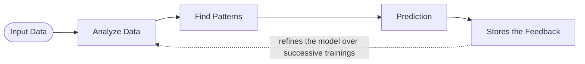
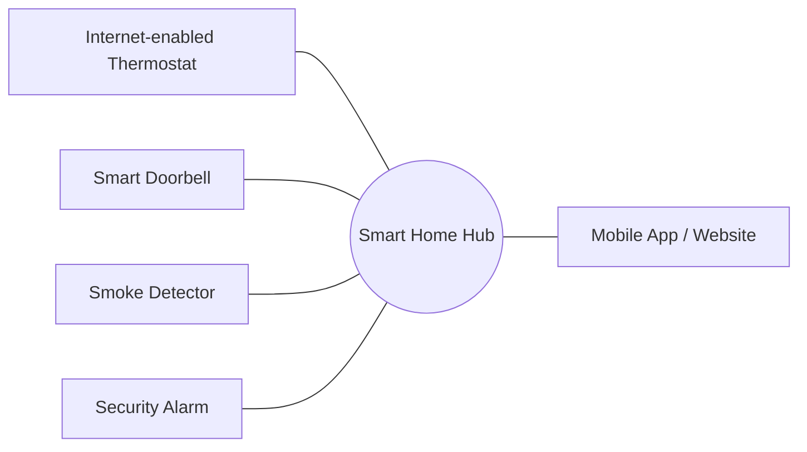
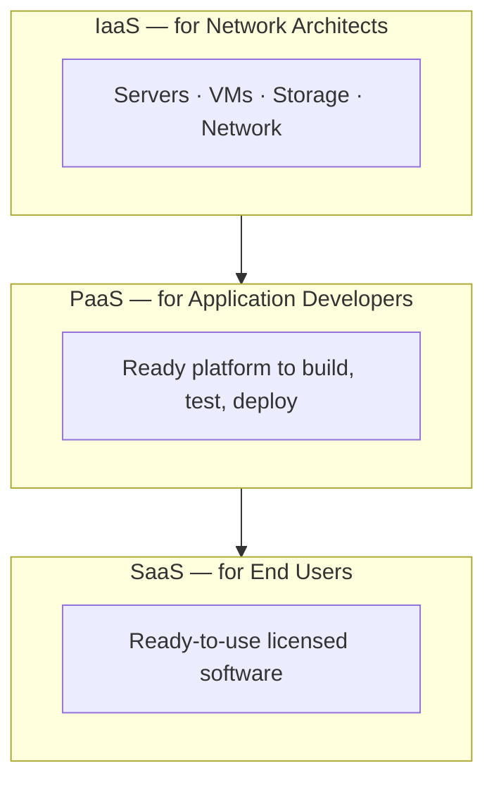
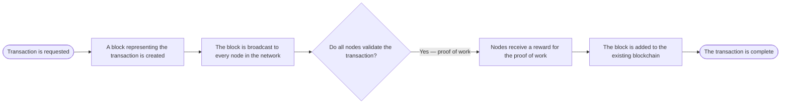

# Computer Science | Chapter EX | EMERGING TRENDS | NOTES

**Branch:** Society, Law & Ethics *(closest fit in the CS-generator branch list — this is a standalone descriptive survey chapter, not tied to Python syntax)*
**Level:** Class XI (CBSE Computer Science)
**Python version assumed:** Not applicable — no code or pseudocode appears anywhere in this chapter.

Computers are everywhere now, and new technologies keep arriving faster than most people can track. This chapter is a guided tour of six such technologies — **Artificial Intelligence**, **Big Data**, **Internet of Things**, **Cloud Computing**, **Grid Computing**, and **Blockchain** — that have moved from research labs into daily life, and are reshaping how digital economies and societies work.

## Sources for this note

| Source | Role | How it's labeled below |
|---|---|---|
| NCERT, *Computer Science – Class XI*, Chapter 3 "Emerging Trends" (Reprint 2025-26) | **Primary** — section numbering and structure follow this book | Unlabeled text is from this source |
| *Computer Science with Python-XI* (board-aligned textbook), Chapter 3 "Emerging Trends" | **Supplementary** — extra examples, sub-sections, and tables not in NCERT | Marked **(Board book)** |

Where the two books cover the same idea in different words, NCERT's phrasing is preferred. Where the Board book adds a concept NCERT skips entirely — Mixed Reality, the three cloud deployment types, DaaS — it is folded in as a clearly labeled addition rather than silently merged in as if NCERT said it too.

> [!note] This chapter's file set
> **NOTES.md** (this file) — read once to learn the chapter. **GLOSSARY.md** — airtight, one-line term lookup. **CNOTES.md** — blind-recall self-testing before an exam; every miss there sends you back to a `§` section here. **REVISION_MINDMAPS.md** — diagram-only visual overview and decision flowcharts. Each does a different job; none is a shorter substitute for another.

## Concept Roadmap ⭐

Everything in this chapter builds on a basic idea of computers and networks talking to each other; from there it branches into six largely independent technology families, all converging on the same real-world payoff — smarter, more automated, more connected homes, cities, and institutions.

---

## 3.1 Introduction ⭐

- New technologies appear "almost every day." Most fade; a few **persist and gain user attention** — these survivors are called **emerging trends**: state-of-the-art technologies that gain popularity and set a new trend among users.
- Trends flagged in this chapter's opening: **cloud computing**, **mobile computing**, **social media**, **ubiquitous computing (Board book)**, and **Internet of Things (IoT)**.

| Trend | One-line description |
|---|---|
| Cloud computing | Share hardware/software resources as a service over the internet, pay-per-use |
| Mobile computing | Access and process data on handheld devices (smartphones, tablets) |
| Social media | Facebook, Twitter, WhatsApp, YouTube, LinkedIn — people interacting worldwide |
| Internet of Things (IoT) | A network of objects/devices embedded with microchips, sensors, actuators |

> **Key idea:** "Emerging" doesn't mean brand new — it means *currently gaining traction*, as distinct from technologies that already failed to catch on, or ones that are now fully mainstream/legacy.

---

## 3.2 Artificial Intelligence (AI) ⭐⭐

**Artificial** ("man-made") + **Intelligence** ("thinking power") = **a man-made thinking power**. AI endeavours to **simulate the natural intelligence of human beings into machines**, so the machine behaves intelligently — imitating cognitive functions like learning, reasoning, planning, perceiving, decision-making, and processing natural language.

Everyday AI you've probably already used:

- A smartphone map suggesting the *fastest route* by analysing real-time traffic data.
- A social media site automatically **recognising and tagging** your friends in an uploaded photo.
- Digital personal assistants — **Siri, Cortana, Alexa**, and Google's assistant — all powered by AI. *(NCERT calls it **Google Now**; the Board book calls it **Google Assistant** — same product family, just two different textbook snapshots in time.)*

> [!note]
> A **knowledge base** is a store of information consisting of **facts, assumptions, and rules** which an AI system uses for decision-making. AI systems can also learn from past experiences or outcomes to make new decisions.

AI aims to build **Expert Systems** — systems that display intelligent behaviour: they *learn, demonstrate, explain,* and *advise* their users.

**Applications of AI — the explicit list (Board book):**

| | | |
|---|---|---|
| Gaming | Natural Language Processing | Expert Systems |
| Vision Systems | Speech Recognition | Handwriting Recognition |
| Intelligent Robots | | |

> Fig. 3.1 in the Board book also sketches a wider AI application map, feeding into the same "Artificial Intelligence" hub: **Predictive Analytics, Deep Learning, Machine Learning, Text-to-Speech / Speech-to-Text, Classification, Translation, Data Extraction, Machine Vision / Image Recognition,** and **Planning & Optimization**.

A notable real-world example **(Board book):** AI is tested and used in the **health care industry** — for dosing drugs, planning treatments, and assisting in surgical procedures in the operating room.

> AI itself is interdisciplinary, drawing on **Computer Science, Biology, Psychology, Linguistics, Mathematics, and Engineering (Board book)**.

### 3.2.1 Machine Learning ⭐⭐⭐

**Machine Learning (ML)** is a *subsystem/application of AI*: it gives computers the ability to **learn from data using statistical techniques, without being explicitly programmed**. It comprises **algorithms (called models)** that use data to learn on their own and make predictions.

The core shift ML makes, compared with how programming traditionally works:

- **Traditional programming:** you supply the **Data** and the **Program** (the rules) — the computer computes the **Output**.
- **Machine Learning:** you supply the **Data** and example **Output** — the algorithm works out the **Program** (model) that maps one to the other.

**How training works:** models are first **trained** on training data and **tested** on testing data. After successive trainings, once a model gives results at an acceptable accuracy, it's used to make predictions about **new, unknown data**.

**Applications of Machine Learning:**

| | | |
|---|---|---|
| Virtual Personal Assistants | Image Recognition | Email Spam Filtering |
| Text & Speech Recognition | Medical Diagnosis | Automatic Translation |
| Traffic Prediction | Online Fraud Detection | Web Search & Recommendation Engines |

### 3.2.2 Natural Language Processing (NLP) ⭐⭐⭐

**NLP** is a subfield of AI that helps computers **understand human language** — the interaction between computers and humans using natural (spoken/written) language such as Hindi or English.

You already use NLP daily without noticing: **spell checkers, autocomplete, spam filters, voice text messaging, language translation**, and the predictive-typing suggestions a search engine offers as you type.

> [!warning] A hierarchy trap
> NLP is **not** "a trait of Deep Learning," nor is Deep Learning simply "an implementation of AI" that NLP sits inside. The textbook is precise here: *"NLP and machine learning are subsets of Artificial Intelligence."* NLP and ML are **two separate subfields of AI** — NLP *relies on* ML techniques to derive meaning from language, but it isn't nested inside ML.

**Five things NLP does (Board book, Fig. 3.4):**

| Component | What it does |
|---|---|
| Information Retrieval | Finding relevant information from a large text collection |
| Sentiment Analysis | Judging whether text expresses a positive or negative opinion |
| Information Extraction | Pulling structured facts out of unstructured text |
| Machine Translation | Converting text from one language to another |
| Question Answering | Directly answering a question posed in natural language (e.g. Google's "?" box) |

NLP is the driving force behind: **Google Translate**, grammar checkers in **Microsoft Word / Grammarly**, **Interactive Voice Response (IVR)** systems in call centres, and personal assistants like **Google Assistant, Siri, Alexa**. An NLP system's input/output can be **speech** or **written text**, and it can perform **text-to-speech** and **speech-to-text** conversion.

Two emerging NLP application areas: **machine translation** (translating text between languages with a fair amount of correctness) and **automated customer service** (software resolving customer queries/complaints).

> **Activity 3.1 (NCERT) — reflection:** *How does NLP help differently-abled persons?* NLP processes what was said, structures the information received, determines the necessary response, and replies in an understandable language — and its **word-embedding** feature in particular helps differently-abled users work with systems more easily.

### 3.2.3 Immersive Experiences ⭐⭐⭐

An **immersive experience** pulls a person into a new or augmented reality, enhancing everyday life via technology — often chaining together more than one technology. **3D videography** has already changed how movies feel in theatres; video games use immersive design the same way; and **driving/flight simulators** use immersive experience for training.

#### 3.2.3a Virtual Reality (VR)

VR is a **three-dimensional, computer-generated situation that simulates the real world**. Instead of viewing a screen in front of them, the user is **immersed inside** the experience and can interact with a 3D world — achieved today mainly through **VR headsets** — often paired with headphones and, sometimes, gloves — which can also simulate sound, smell, motion, and temperature to increase realism.
*Applications:* gaming, military training, medical procedures, entertainment, social science & psychology, engineering, and other simulation-heavy training areas.

#### 3.2.3b Augmented Reality (AR)

AR is the **superimposition of computer-generated perceptual information over the existing physical surroundings**. Unlike VR, AR doesn't create a new world — it **adds a digital layer on top of the real one**, often via a smartphone camera. Examples: **Snapchat lenses**, **Pokémon GO**, and location-based AR apps that show real-time information about nearby places. **IKEA (Board book)** was the first company to let customers preview furniture in their own room using AR.

#### 3.2.3c Mixed Reality (MR) — Board book only, not in NCERT

MR goes a step further than AR: the user can **interact in real time with virtual objects placed within the real world**, and those objects **respond and react** as if they were real. Achieved via an **MR headset** (Microsoft HoloLens, Acer Windows Mixed Reality, Lenovo Explorer, Samsung Odyssey) using **gesture/gaze/voice recognition**. MR needs **substantially more processing power** than either VR or AR alone.

| | Virtual Reality (VR) | Augmented Reality (AR) | Mixed Reality (MR) |
|---|---|---|---|
| What the user sees | A fully computer-generated world | The real world **+** a digital overlay | The real world **+** digital objects the user can interact with in real time |
| Creates something new? | Yes — replaces the real environment | No — alters perception of the real one | No — blends both, interactively |
| Typical hardware | VR headset | Smartphone camera / AR glasses | MR headset + motion controllers |
| Processing demand | Moderate | Lower | Highest of the three |

> [!warning] ⚠️ A real exam trap
> A **drone is not an example of Augmented Reality** — it's an application of **Robotics** (see 3.2.4). Don't let "high-tech gadget" pattern-match to "AR."

### 3.2.4 Robotics ⭐⭐

**Robotics** is an interdisciplinary branch of technology (mechanical engineering + electronics + computer science) concerned with the **design, fabrication, operation, and application of robots**. A **robot** is a machine that carries out one or more tasks automatically, with accuracy and precision, and is **programmable** — unlike an ordinary machine, it can follow instructions given through computer programs. **Sensors are one of the prime components of a robot.**

Robots were originally built for **repetitive, boring, stressful, or labour-intensive industrial tasks**; today they're also used in hazardous environments — inspecting radioactive materials, bomb detection/deactivation — and wherever humans can't survive (space, underwater, extreme heat). Robot types include **wheeled robots, legged robots, manipulators**, and **humanoids** (robots that resemble humans).

**Named examples worth remembering:**

| Robot | What it is |
|---|---|
| **Sophia** | A realistic humanoid capable of human-like expressions; the world's **first robot citizen** and first robot Innovation Ambassador for the UN Development Programme |
| **NASA's Mars Exploration Rover (MER)** | A robotic space mission studying planet Mars |
| **Mitra (Board book)** | The first **Indian-made** humanoid, using AI, visual data processing, and facial recognition; imitates human gestures/expressions |
| **Drone** | An unmanned aircraft, remotely controlled or flying autonomously via software-controlled flight plans, onboard sensors, and GPS |

Drones are used for **journalism, filming/aerial photography, short-distance delivery, disaster management, search & rescue, healthcare, geographic mapping, structural safety inspection, agriculture, wildlife monitoring, law enforcement, and border patrolling.**

> **Robots in medicine (Board book):** prosthetic robotic limbs interface with the nervous system to restore movement/touch to amputees; automated dispensing robots cut medication-dispensing errors in pharmacies; clinical training robots simulate realistic medical scenarios for trainee doctors.
>
> **Robots after a natural calamity (Board book):** drones help relief workers see the big picture, locate survivors faster, assess damaged infrastructure, deliver supplies, and even help put out fires.

---

## 3.3 Big Data ⭐⭐⭐

**Big Data** refers to a **huge volume of data that cannot be stored or processed by traditional data-storage/processing tools** — generated at massive scale and used by organisations to uncover insights and improve their business.

NCERT frames just how fast this pile grows: there are now **over a billion internet users**, the **majority of the world's web traffic comes from smartphones**, and at the current pace roughly **2.5 quintillion bytes of data are created every single day** — a pace that keeps accelerating as IoT grows.

**Big Data in 60 seconds (NCERT, Fig. 3.8 — approximate figures):**

| Source | Amount generated every 60 seconds |
|---|---|
| Emails sent | 204 million |
| WhatsApp messages sent | 44.4 million |
| Google search queries | 2.4 million |
| YouTube video views | 2.78 million |
| New tweets | 547,200 |
| Instagram posts uploaded | 46,200 |
| Snapchat snaps created | 1.8 million |
| Skype calls | 104,300+ |
| GIFs sent via Messenger | 15,000 |
| New LinkedIn accounts | 120+ |
| Apps downloaded | 342,000 |
| Netflix hours watched | 70,017 |
| Wikipedia page views | 5 lakh |
| Facebook status updates | 293,000 |

It comes from everywhere **(Board book, Fig. 3.10)**:

| Category | Concrete examples |
|---|---|
| Social Network Data | Facebook, Instagram, LinkedIn |
| Financial Data | Digital payment/transfer platforms |
| Multimedia Data | Netflix, YouTube |
| Data from ERP Systems | SAP, Oracle |
| Internet of Things | Sensor/device data feeds |
| Mobile Apps Data | Uber-style location/ride data |

It's not just *voluminous* — it's largely **unstructured**: posts, instant messages/chats, shared photographs, tweets, blog articles, news items, opinion polls and their comments, audio/video chats. NCERT adds that Big Data isn't only about volume — it brings real challenges across **integration, storage, analysis, searching, processing, transfer, querying,** and **visualisation** of that data.

Businesses analyse it with **text analytics, machine learning, predictive analytics, data mining, statistics,** and **NLP** to make faster, better-informed decisions.

### 3.3.1 Characteristics of Big Data — the 5 V's ⭐⭐⭐

| V | Meaning |
|---|---|
| **Volume** | The sheer size — huge 'volumes' generated daily from social media, business processes, machines, networks, human interaction; stored in data warehouses |
| **Velocity** | The **speed** at which data is created/generated in real time — rate of change and activity bursts |
| **Variety** | A **combination of data types** — structured, semi-structured, unstructured (emails, PDFs, photos, videos, audio, social-media posts…) |
| **Veracity** | The **trustworthiness** of the data — inconsistent, biased, or noisy data can mislead conclusions |
| **Value** | The **hidden patterns and business value** locked in the data — worth checking for before investing heavily in processing it |

> [!note] Mnemonic
> **V**olume, **V**elocity, **V**ariety, **V**eracity, **V**alue — all five start with "V," which is exactly why they're called the "5 V's of Big Data."

### 3.3.2 Data Analytics ⭐

**Data analytics** is *"the process of examining data sets in order to draw conclusions about the information they contain, with the aid of specialised systems and software."* It helps businesses make more informed decisions and helps researchers **verify or disprove** scientific models, theories, and hypotheses. **Pandas** is a Python library commonly used as a tool to simplify data analysis.

---

## 3.4 Internet of Things (IoT) ⭐⭐⭐

**IoT** is a system of **inter-related computing devices, mechanical/digital machines, objects, and people**, each given a **unique identifier (UID)**, able to **transfer data over a network without needing human-to-human or human-to-computer interaction**.

IoT makes once-"dumb" devices "smarter" by letting them send data over the internet and communicate with people and other IoT-enabled things. The classic example is the **connected "smart home"**: internet-enabled **thermostats, doorbells, smoke detectors,** and **security alarms** form a hub where data is shared, and users remotely control "things" in that hub (adjust temperature, unlock doors) via a **mobile app or website**.

NCERT gives a second concrete example: enable a **microwave oven, air conditioner, door lock,** or **CCTV camera** to connect to the internet, and you can access and remotely control them on-the-go from your smartphone — which is exactly why a networked **CCTV camera counts as an IoT implementation**, not just "plain surveillance."

### 3.4.1 Web of Things (WoT) ⭐⭐

IoT alone still has a friction problem: to interact with '*n*' different devices, you'd need '*n*' different apps. **WoT solves this by using the web itself as one common interface** — web services connect anything in the physical world (besides human identities) to the web, paving the way for **smart homes, smart offices,** and **smart cities**.

### 3.4.2 Sensors ⭐⭐

A **sensor** is a device that detects and responds to electrical/optical signals, converting a **physical parameter** (temperature, blood pressure, humidity, speed…) into a **signal that can be measured electrically**.

> **Everyday example:** when you rotate your phone, the display flips between vertical and horizontal. This uses two sensors together — the **accelerometer** (detects the phone's orientation) and the **gyroscope** (tracks rotation/twist of your hand), which adds to the information the accelerometer supplies.

A **smart sensor**: takes input from the physical environment, uses **built-in computing resources** to perform pre-defined functions upon detecting specific input, and then **processes the data before passing it on** — the evolution of such sensors is a major driver of IoT's growth.

> **NCERT Activity 3.4 — a related emerging trend:** GPS handles outdoor navigation, but **VPS (Visual Positioning System)** is another emerging trend that layers **Augmented Reality** onto positioning — using camera imagery rather than satellite signal alone to pinpoint location, which is especially useful indoors or wherever GPS signal is weak.

### 3.4.3 Smart Cities ⭐⭐

A **Smart City** is an urban area that uses different types of electronic **IoT sensors** to collect data, then uses insights from that data to manage assets, resources, and services **efficiently** — traffic/transportation, power plants, utilities, water supply networks, waste management, crime detection, information systems, schools, libraries, hospitals, and other community services.

| Smart infrastructure | What its sensors detect |
|---|---|
| Smart building | Earthquake tremors — warns nearby buildings to prepare |
| Smart bridge | Any loose bolt, cable, or crack — alerts authorities via SMS |
| Smart tunnel | Leakage or congestion — sends wireless signals to a centralised computer for analysis |

---

## 3.5 Cloud Computing ⭐⭐⭐

**Cloud computing** is a technology of **distributed data processing** in which scalable information resources and capacities are provided **as a service** to multiple external customers over the internet — storing, accessing data, and running programs entirely online, typically billed like a utility (pay-per-use, the way you pay for electricity).

NCERT frames the whole idea simply: *"a better way to understand the cloud is to interpret everything as a service."* Because of this, a user can **run a bigger application or process a large amount of data without having the required storage or processing power on their own personal computer** — as long as they're connected to the internet.

**Benefits of cloud computing (Board book):**

- Easy to maintain
- Increased security at a much lesser cost
- On-demand self-service by consumers
- Rapid scaling of capacity
- Resource pooling of physical and virtual resources

**Three deployment types (Board book — NCERT does not cover this split):**

| Type | Who it serves | Examples |
|---|---|---|
| **Public Cloud** | Multiple users/organisations ("tenants") share a portal owned/operated by a third-party provider | Google Drive, Dropbox, Microsoft OneDrive, iCloud, Amazon Cloud Drive |
| **Private Cloud** | Resources dedicated solely to **one** organisation (self-hosted, or via a paid third-party host) | — |
| **Hybrid Cloud** | Combines public + private, sharing data/applications between them | Built on infrastructure such as AWS + Microsoft Azure |

### 3.5.1 Cloud Service Models ⭐⭐⭐

| Service | What the provider gives you | Who typically uses it | Examples |
|---|---|---|---|
| **IaaS** — Infrastructure as a Service | Servers, virtual machines, storage/back-up, network components, OS — the raw building blocks | Network architects | Windows Azure, Rackspace, Google Compute Engine |
| **PaaS** — Platform as a Service | A ready platform to develop, test, and deploy applications, without managing the underlying infrastructure | Application developers | AWS Elastic Beanstalk, Heroku, Windows Azure |
| **SaaS** — Software as a Service | Finished, licensed software, used via a browser on demand | End users | Microsoft Office 365, Google Workspace, Dropbox, Cisco WebEx, GoToMeeting |
| **DaaS — Desktop as a Service (Board book)** | An improved SaaS model (first appeared early 2000s) using multiple services simultaneously to complete one piece of work | End users | — |

> **NCERT's PaaS example:** say you've built a web application using **MySQL and Python**. To put it online, you can rent a **pre-configured Apache server** from the cloud with MySQL and Python already installed — no need to install or configure MySQL, Python, or the web server (Apache/nginx) yourself. You still have complete control over the deployed application and its configuration; the cloud just removes the setup and maintenance burden underneath it.

> Beyond these four, cloud hosting also offers **Data as a Service** and **Everything as a Service (Board book)** — the common thread is that the **World Wide Web via cloud hosting** can meet almost any information-processing requirement.

> [!tip] CTM (Board book)
> Cloud computing refers to having access to all your applications and data from **any network device**.

The **Government of India's** own cloud initiative is called **"GI Cloud," branded MeghRaj** (https://cloud.gov.in) — an example of a government-provided cloud computing platform.

---

## 3.6 Grid Computing ⭐⭐⭐

**Grid Computing** is a network of computers **working together to perform a task** that would be difficult for a single machine — all machines follow the same protocol to act like a **virtual supercomputer**, contributing processing power and storage. It's a subset of **distributed computing**, and can be seen as a form of **Parallel Computing** — except instead of many CPU cores on *one* machine, its cores are spread across *many* machines in different locations.

Countless devices — from hand-held mobiles to personal computers and workstations — already sit connected to a LAN or the internet, so it's **economically feasible to reuse their spare memory and processing power** rather than buy dedicated hardware. That's the opportunity grid computing exploits: it lets researchers tackle **computationally intense scientific and research problems without actually procuring costly hardware**.

**Three roles in a grid network:**

| Role | Job |
|---|---|
| **Control Node** | Usually a server (or group of servers) that administers the whole network and tracks resources in the pool |
| **Provider** | Contributes its resources to the network's resource pool |
| **User** | Uses the resources on the network |

**Two types of grid:**

| Type | Purpose |
|---|---|
| **Data grid** | Manages large, distributed data requiring multi-user access |
| **CPU / Processor grid** | Moves processing from one PC to another as needed, or splits a large task into sub-tasks distributed across nodes for parallel processing |

> [!warning] ⚠️ Grid Computing vs IaaS Cloud — the exam trap
> **IaaS:** a service **provider rents** the required infrastructure **to** users.
> **Grid computing:** **multiple computing nodes join together voluntarily** to solve **one common** computational problem — nobody is "renting" anything.

Setting up a grid needs **middleware** to implement the distributed processor architecture; the **Globus toolkit** (http://toolkit.globus.org/toolkit) is one such open-source software toolkit, providing security, resource management, data management, communication, and fault detection.

---

## 3.7 Blockchain Technology ⭐⭐⭐

Traditionally, digital transactions (ticket bookings, banking) are stored in **one centralised database**, updated one transaction at a time — which means all the data sits in one place, at risk of being hacked or lost.

**Blockchain** flips this: it's a **decentralised and shared database** where **every computer (node) holds its own full copy**. A **block** is a secured chunk of data or a valid transaction; each block has a **header** (visible to every other node) and **private data** (visible only to its owner). Chained together, these blocks form the **blockchain**.

> **Analogy (Board book):** think of a **Google Doc** shared with a group of people. The document is *distributed*, not copied or transferred — everyone can access it at the same time, no one waits for someone else to finish, and every edit is recorded transparently in real time. That's the decentralised-and-transparent feeling a blockchain is built to give.

Each node maintains an **"append-only" open ledger**, updated **only after every node in the network authenticates the transaction**. Because *every* member keeps a copy, **no single member can unilaterally alter data** — this is what makes blockchain transactions safe and secure.

**Where blockchain shows up:** the most popular application is **digital currency**, but its decentralised, open, and secure nature is also pushing it into **healthcare** (better data-sharing between providers → more accurate diagnosis, more effective treatment), **land registration** (avoiding ownership disputes), and **voting systems** (harder to alter votes, since everything is on the ledger). Broader sectors: **banking, media, telecom, travel and hospitality**, plus **(Board book)** payment processing/money transfers, supply-chain monitoring, digital IDs, data sharing, copyright/royalty protection, medical recordkeeping, and managing IoT networks.

---

## Textbook Activities & Reflection Prompts ⭐

Both books pause periodically to ask you to think rather than just read. These aren't throwaway — they often resurface as case-based questions:

| Prompt | Where it points |
|---|---|
| How does NLP help differently-abled persons? | Word-embedding lets systems structure and respond to speech/text more naturally — see §3.2.2 |
| What role do robots play in the medical field? | Prosthetic limbs, dispensing robots, clinical training robots — see §3.2.4 |
| Can a drone help during a natural calamity? | Yes — survivor location, damage assessment, supply delivery, firefighting — see §3.2.4 |
| Explore a few IoT devices available in the market | Smart thermostats, smart bulbs, smart locks, wearables, smart speakers |
| GPS handles outdoor navigation — what does VPS do? | VPS (Visual Positioning System) layers AR onto positioning for indoor/GPS-weak navigation — see §3.4.2 |
| Name a few data centers in India and their major services | GI Cloud "MeghRaj" (government) is the chapter's own example — see §3.5 |
| How are your own digital activities contributing to Big Data? | Every post, chat, photo, or search query you generate adds to the 5 V's — see §3.3 |
| What are your ideas for transforming your city into a smart city? | Apply §3.4.3's Smart City domains (traffic, utilities, waste, safety) to a city you know |
| How could this chapter's trends assist people with disabilities? | NLP's word-embedding, VR/AR interfaces, and IoT-based smart-home automation are the clearest fits |
| Name two areas (beyond healthcare, land records, voting) where blockchain could help | Try supply-chain provenance or academic credential verification as starting points |

---

## Quick Reference ⭐⭐⭐

**AI family tree:** AI is the umbrella; **ML** and **NLP** are both *separate* subfields of AI (NLP borrows ML techniques, but isn't inside ML). **Robotics** and **Immersive Experiences (VR/AR/MR)** also sit under the AI/emerging-tech umbrella but aren't ML/NLP applications themselves.

**5 V's of Big Data:** Volume · Velocity · Variety · Veracity · Value.

**Cloud deployment types:** Public (shared, third-party) · Private (dedicated, one org) · Hybrid (both, combined).

**Cloud service models, smallest to most finished:** IaaS (infrastructure) → PaaS (platform) → SaaS (software) → *(Board book)* DaaS (desktop).

**Cloud Computing vs Grid Computing:**

| | Cloud Computing | Grid Computing |
|---|---|---|
| Architecture | Client–server; resources at remote locations, available to anyone from anywhere | Distributed; a large number of computers connected in parallel to solve one problem |
| Resource management | Centrally managed by the provider | Managed on a **collaboration** pattern between nodes |
| Payment | Users **pay** for use | Users **do not pay** for use |
| Ownership | Servers owned by infrastructure providers | Grids owned and managed by the organisation(s) that built them |
| Accessibility | Highly accessible | Comparatively low accessibility |

**Grid types:** Data grid (manages distributed data) · CPU/Processor grid (splits/distributes processing).

**VR vs AR vs MR:** VR *replaces* the real world; AR *overlays* the real world; MR lets you *interact* with virtual objects placed in the real world in real time.

**IoT vs WoT:** IoT connects **devices**; WoT connects them all through **one interface — the web** — instead of one app per device.

---

## Points to Ponder ⭐⭐⭐

- **NLP ≠ a trait of Deep Learning.** NLP and ML are *both* independent subfields of AI (a common True/False exam item tests exactly this).
- **A drone is Robotics, not Augmented Reality** — a classic MCQ/True-False distractor.
- **Cloud-based storage does *not* use local computer storage** — that's the entire point of "the cloud."
- **VR is fully immersive (replaces reality); AR only overlays reality; MR lets you interact with virtual objects placed in real time within reality** — don't collapse these three into one idea.
- **Grid computing ≠ IaaS cloud.** IaaS = a provider *rents* infrastructure to you. Grid = independent nodes *join together* to solve a shared problem — nobody is renting anything.
- **Public/Private/Hybrid Cloud** is about **deployment/ownership**; **IaaS/PaaS/SaaS/DaaS** is about **what layer of the stack** you're being handed. Don't mix the two axes up.
- **CCTV cameras are a real-world IoT application** — they connect, embed sensors/hardware, and can be remotely monitored.
- **Smart cities are meant to be sustainable and livable** by design.
- **A block's header is visible to every node; only the owner can see a block's private data** — visibility isn't all-or-nothing in a blockchain.
- **"Emerging" is about current momentum, not literal novelty** — a technology can exist for years before becoming an "emerging trend" once it starts gaining mainstream traction.

---

## Problem-Solving Strategy ⭐⭐

For **case-based / scenario-matching questions** ("You got an SMS alert that you forgot to lock the door → which technology is this?"):

1. **Identify the core action** in the scenario — sensing, alerting, remote control, data storage, computation-sharing, or record-keeping?
2. **Match the action to a technology family**: sensing/alerting on a physical object → **IoT/Smart sensor**; a virtual overlay on the real world → **AR**; a fully synthetic environment → **VR**; interacting with virtual objects placed in reality → **MR**; storing/running things "in the cloud" → **Cloud Computing**; many machines jointly solving one problem → **Grid Computing**; a tamper-resistant shared ledger → **Blockchain**.
3. **Cross-check against the definition**, not just surface similarity — a drone "looks high-tech" but is Robotics, not AR; a CCTV camera "looks like plain surveillance" but is IoT once it's networked and remotely controllable.
4. **Rule out look-alike distractors** deliberately — re-read Points to Ponder above before finalising an answer in objective-type questions.

For a **"which cloud service model fits these requirements?"** question:

1. Does the requirement mention **raw servers/storage/VMs**? → **IaaS**.
2. Does it mention a **ready platform to build and deploy apps on**, without managing servers? → **PaaS**.
3. Does it mention **ready-to-use, licensed software** accessed via a browser? → **SaaS**.
4. Does it mention **combined use of multiple services at once** to finish one job? → **(Board book)** **DaaS**.

This chapter is now a four-file set, each with one job: this file (**NOTES.md**) is the full read-through; **GLOSSARY.md** is fast, airtight term lookup; **CNOTES.md** is what you test yourself against before an exam; **REVISION_MINDMAPS.md** is the diagram-only visual overview and decision-flowchart reference. Don't substitute one for another — a miss in CNOTES should send you back here, not to a shorter restatement of this same page.
