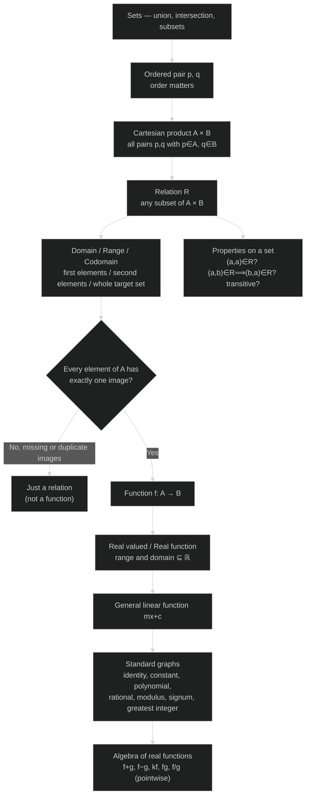
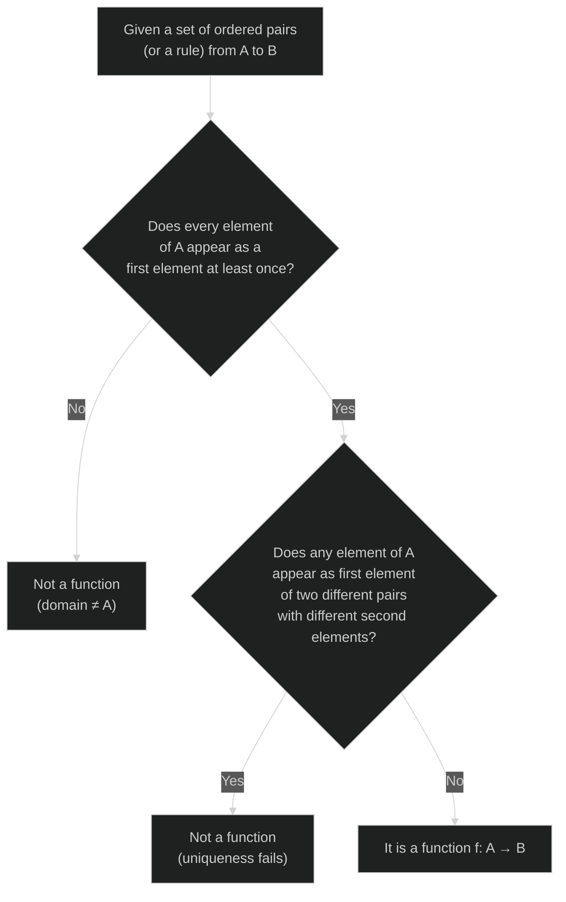
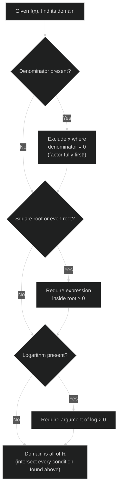
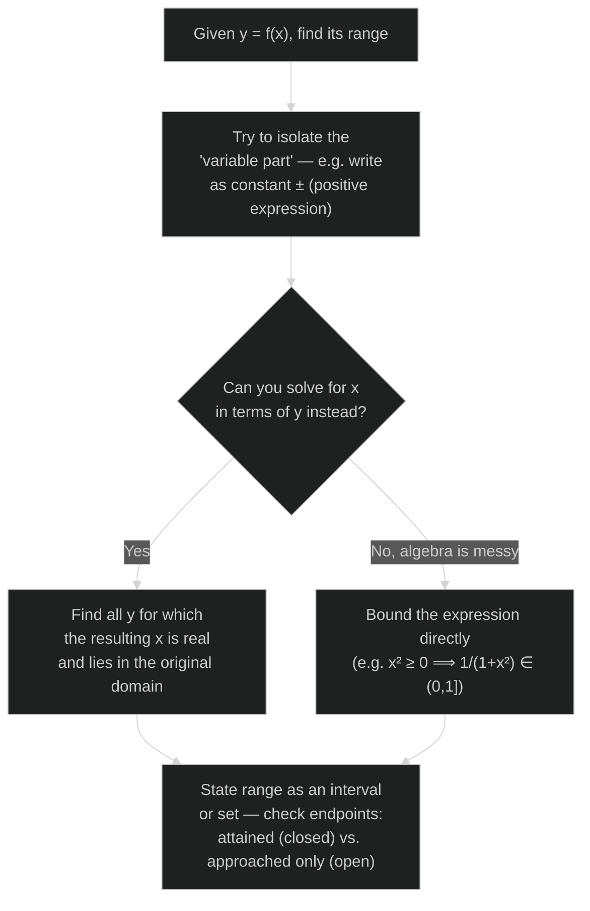
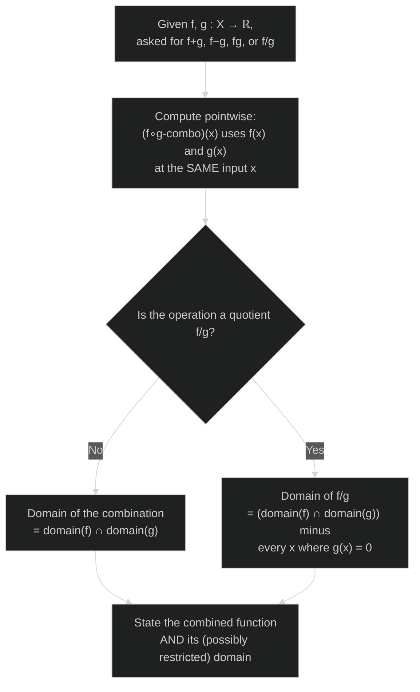

# Mathematics | Chapter 02 | Relations AND Functions Cnotes | CNOTES

> This file holds the chapter's **Concept Roadmap** and its **Problem-Solving Strategy** flowcharts only — for definitions and worked examples see the NOTES file, and for the formula/quick-reference sheet see the GLOSSARY file. *(Upgrade note: this content previously lived under the wrong filename — a `-PQs.md` file that, despite its name, contained this roadmap rather than practice questions. It has been moved here, and `-PQs.md` now holds actual solved practice questions from NCERT Exercises 2.1–2.3 and the Miscellaneous Exercise.)*

## Concept Roadmap

How every idea in this chapter builds on the one before it — from Sets, all the way to combining functions algebraically.

*Reading the map:* everything below "Relation" on the left branch is a *subset* of everything above it — a function is a relation, a real function is a function, and the seven standard graphs are just specific real functions worth memorizing by sight (with the general linear function \(mx+c\) as the parent case identity and constant both fall out of). The right branch — reflexivity, symmetry, transitivity — is a separate axis that any relation *on a set* can be tested against, independent of whether it happens to be a function. The algebra of functions at the bottom only makes sense once domain/range discipline (top half) is second nature — every combined function inherits domain restrictions from its pieces.

---

## Problem-Solving Strategy

### Strategy 1 — "Is this a relation or a function?"

### Strategy 2 — "Find the domain of a given expression"

### Strategy 3 — "Find the range of a given function"

*A worked instance of Strategy 3 lives in the main notes: \(f(x)=\dfrac{x^2}{1+x^2}\) rewritten as \(1-\dfrac{1}{1+x^2}\), giving range \([0,1)\) — closed at \(0\) because it's attained at \(x=0\), open at \(1\) because it's only approached as \(x\to\pm\infty\).*

### Strategy 4 — "Combine two real functions \(f\) and \(g\)"

*Reading the map:* the one place students lose marks here isn't the algebra — it's forgetting the quotient's extra restriction. Both worked examples in the main notes (NCERT Examples 16 and 17) show a value where \(f\) and \(g\) are individually fine but \(f/g\) is excluded solely because \(g(x)=0\) there.
