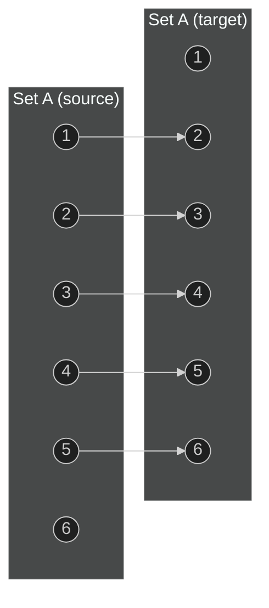

# Mathematics | Chapter 02 | RELATIONS and FUNCTIONS | NOTES

> Board / JEE-Foundation level. This chapter builds the language every later function-based topic (trigonometric functions, calculus, sequences) depends on: ordered pairs → Cartesian products → relations → the special relations called functions.

**Prerequisites:** Sets (union, intersection, subsets, universal set).
**Key idea:** A function is nothing more than a *relation with two extra guarantees* — every element of the domain is used, and each is used exactly once.

---

## 2.2 Cartesian Products of Sets ⭐⭐

### Ordered pairs and the definition

An **ordered pair** \((p, q)\) fixes *which* element comes first — unlike a set \(\{p,q\}\), order matters.

> **Definition:** For non-empty sets \(P\) and \(Q\), the **Cartesian product**
> \[
> P \times Q = \{(p, q) : p \in P,\ q \in Q\}
> \]
> If either \(P\) or \(Q\) is the null set, then \(P \times Q = \phi\).

### Key remarks

1. Two ordered pairs are equal **iff** corresponding elements are equal: \((a,b) = (x,y) \iff a=x \text{ and } b=y\).
2. If \(n(A) = p\) and \(n(B) = q\), then \(n(A \times B) = pq\).
3. If \(A, B\) are non-empty and either is infinite, so is \(A \times B\).
4. \(A \times A \times A = \{(a,b,c) : a,b,c \in A\}\) — an **ordered triplet**.
5. In general \(A \times B \neq B \times A\) (different pairs), though \(n(A\times B) = n(B \times A)\) (same count).

> **Quick Reference (2.2):**
> \[
> \boxed{n(A \times B) = n(A)\cdot n(B), \qquad A \times B \neq B \times A \text{ in general}}
> \]

### Worked Examples

#### 2.2 Solved — Equality of ordered pairs (NCERT Example 1)

**Given:** \((x+1,\ y-2) = (3,1)\).
**Find:** \(x\) and \(y\).
**Approach:** Ordered pairs are equal component-wise, so equate first elements and second elements separately.
**Work:**
\[
\begin{aligned}
x + 1 &= 3 \implies x = 2\\
y - 2 &= 1 \implies y = 3
\end{aligned}
\]
**Check:** Substituting back, \((2+1,\ 3-2) = (3,1)\). ✓

#### 2.2 Solved — \(P \times Q\) vs \(Q \times P\) (NCERT Example 2)

**Given:** \(P = \{a,b,c\}\), \(Q = \{r\}\).
**Work:**
\[
P \times Q = \{(a,r),(b,r),(c,r)\}, \qquad Q \times P = \{(r,a),(r,b),(r,c)\}
\]
Since \((a,r) \neq (r,a)\), \(P \times Q \neq Q \times P\).
**Check:** Both sets have \(3\) elements — equal *size*, different *content*. This is exactly why remark 5 above distinguishes "different pairs" from "same count."

#### 2.2 Solved — Set operations distribute over Cartesian product (NCERT Example 3, part i–ii)

**Given:** \(A=\{1,2,3\}\), \(B=\{3,4\}\), \(C=\{4,5,6\}\).
**Find:** \(A \times (B \cap C)\) and \((A \times B) \cap (A \times C)\), and verify they match.
**Work:**
\(B \cap C = \{4\}\), so \(A \times (B\cap C) = \{(1,4),(2,4),(3,4)\}\).
Independently, \(A \times B = \{(1,3),(1,4),(2,3),(2,4),(3,3),(3,4)\}\) and \(A \times C = \{(1,4),(1,5),(1,6),(2,4),(2,5),(2,6),(3,4),(3,5),(3,6)\}\); their intersection is \(\{(1,4),(2,4),(3,4)\}\).
**Check:** Both routes give the identical set — confirming \(A\times(B\cap C) = (A\times B)\cap(A\times C)\), a genuine distributive law (proved in general in Exercise 2.1 Q7).

#### 2.2 Solved — Reverse-engineering the factor sets (NCERT Example 6)

**Given:** \(A \times B = \{(p,q),(p,r),(m,q),(m,r)\}\).
**Find:** \(A\) and \(B\).
**Approach:** The set of *first* elements across all pairs is \(A\); the set of *second* elements is \(B\).
**Work:** \(A = \{p,m\}\), \(B = \{q,r\}\).
**Check:** \(n(A)\cdot n(B) = 2\times2 = 4\), matching the 4 given pairs, and re-multiplying \(A\times B\) reproduces exactly the given set.

#### 2.2 Solved — Ordered triplets, \(P\times P\times P\) (NCERT Example 4)

**Given:** \(P=\{1,2\}\).
**Find:** \(P\times P\times P\).
**Approach:** Extend the pair rule to three coordinates — every ordered triplet \((a,b,c)\) with \(a,b,c\in P\) is included, and order in each of the three slots matters independently.
**Work:** With \(2\) choices for each of \(3\) slots, there are \(2^3=8\) triplets:
\[
P\times P\times P = \{(1,1,1),(1,1,2),(1,2,1),(1,2,2),(2,1,1),(2,1,2),(2,2,1),(2,2,2)\}
\]
**Check:** \(n(P\times P\times P) = n(P)^3 = 2^3 = 8\), matching the count above — the same counting rule as \(n(A\times B)=n(A)\cdot n(B)\), extended one factor further.

#### 2.2 Solved — What \(\mathbb{R}\times\mathbb{R}\) and \(\mathbb{R}\times\mathbb{R}\times\mathbb{R}\) represent (NCERT Example 5)

**Given:** \(\mathbb{R}\) is the set of all real numbers.
**Find:** A geometric interpretation of \(\mathbb{R}\times\mathbb{R}\) and \(\mathbb{R}\times\mathbb{R}\times\mathbb{R}\).
**Work:** \(\mathbb{R}\times\mathbb{R} = \{(x,y): x,y\in\mathbb{R}\}\) is exactly the set of coordinates of every point in the **2-dimensional plane**. Extending by one factor, \(\mathbb{R}\times\mathbb{R}\times\mathbb{R} = \{(x,y,z): x,y,z\in\mathbb{R}\}\) is the set of coordinates of every point in **3-dimensional space**.
**Check:** This is consistent with Example 4's counting pattern read the other way — a Cartesian product's "size" (here, infinite-dimensional freedom in each of 2 or 3 independent real coordinates) is exactly what gives coordinate geometry its dimension count.

---

## 2.3 Relations ⭐⭐

> **Definition 2:** A **relation** \(R\) from a non-empty set \(A\) to a non-empty set \(B\) is any subset of \(A \times B\).
> **Definition 3 (Domain):** the set of all *first* elements of the pairs in \(R\).
> **Definition 4 (Range / Codomain):** the set of all *second* elements is the **range**; the whole set \(B\) is the **codomain**. Always \(\text{range} \subseteq \text{codomain}\).

An **arrow diagram** is the standard visual: an arrow from \(x \in A\) to \(y \in B\) whenever \((x,y) \in R\).

### Worked Examples

#### 2.3 Solved — Domain, codomain, range from a rule (NCERT Example 7)

**Given:** \(A = \{1,2,3,4,5,6\}\), \(R = \{(x,y): y = x+1\}\) on \(A\).
**Work:** \(R = \{(1,2),(2,3),(3,4),(4,5),(5,6)\}\).



*Reading the diagram:* every arrow starts from \(\{1,2,3,4,5\}\) — that's the **domain**. Node \(6\) receives an arrow but sends none, so it sits in the range but not the domain. The full target set \(\{1,\dots,6\}\) is the codomain.

**Check:** domain \(=\{1,2,3,4,5\}\), range \(=\{2,3,4,5,6\}\), codomain \(=\{1,2,3,4,5,6\}\) — range \(\subsetneq\) codomain, consistent with Definition 4.

#### 2.3 Solved — A relation that is emphatically *not* a function (NCERT Example 8)

**Given:** \(P=\{9,4,25\}\), \(Q=\{5,3,2,1,-2,-3,-5\}\), \(R = \{(x,y): x \text{ is the square of } y\}\).
**Work:** In set-builder form, \(R=\{(x,y): x=y^2,\ x\in P, y \in Q\}\). In roster form,
\[
R = \{(9,3),(9,-3),(4,2),(4,-2),(25,5),(25,-5)\}
\]

```mermaid
%%{init: {'theme':'dark'}}%%
graph LR
    subgraph P["Set P"]
        p9((9)); p4((4)); p25((25))
    end
    subgraph Q["Set Q"]
        q5((5)); q3((3)); q2((2)); q1((1)); qm2((-2)); qm3((-3)); qm5((-5))
    end
    p9 --> q3
    p9 --> qm3
    p4 --> q2
    p4 --> qm2
    p25 --> q5
    p25 --> qm5
```

**Check:** domain \(=\{4,9,25\}\), range \(=\{-5,-3,-2,2,3,5\}\); node \(1 \in Q\) is unused, so \(Q\) is only the codomain. Notice \(9\) sends *two* arrows — this single feature is exactly why \(R\) fails to be a function (see §2.4).

> **Quick Reference (2.3):**
> \[
> \boxed{\text{domain} = \{\text{1st elements}\},\quad \text{range} = \{\text{2nd elements}\} \subseteq \text{codomain}}
> \]
> **How many relations exist from \(A\) to \(B\)?** A relation is *any* subset of \(A\times B\). If \(n(A\times B)=pq\), the number of subsets of a \(pq\)-element set is \(2^{pq}\), so
> \[
> \boxed{\#\{\text{relations } A \to B\} = 2^{\,n(A)\cdot n(B)}}
> \]
> (NCERT Example 9: \(A=\{1,2\}\), \(B=\{3,4\}\) gives \(n(A\times B)=4\), so there are \(2^4=16\) relations from \(A\) to \(B\).)

### Beyond the arrow diagram — three properties a relation can have ⭐⭐ (NCERT Miscellaneous Example 19)

Every relation seen so far has just been tested for domain/range/function-hood. But a relation *on a single set* (from a set to itself) can also be checked for three structural properties — this example proves all three for one specific relation, without yet naming them formally.

**Given:** \(R\) is a relation from \(\mathbb{Q}\) to \(\mathbb{Q}\) defined by \(R=\{(a,b): a,b\in\mathbb{Q},\ a-b\in\mathbb{Z}\}\).
**Find:** Show (i) \((a,a)\in R\) for all \(a\in\mathbb{Q}\); (ii) \((a,b)\in R \implies (b,a)\in R\); (iii) \((a,b)\in R\) and \((b,c)\in R \implies (a,c)\in R\).
**Approach:** Each part only needs the definition of \(R\) unwound directly — no computation beyond checking that a particular difference is an integer.
**Work:**
\[
\begin{aligned}
\text{(i)}\quad & a - a = 0 \in \mathbb{Z} \implies (a,a)\in R \text{ for every } a\in\mathbb{Q}.\\[4pt]
\text{(ii)}\quad & (a,b)\in R \implies a-b\in\mathbb{Z} \implies b-a = -(a-b) \in \mathbb{Z} \implies (b,a)\in R.\\[4pt]
\text{(iii)}\quad & (a,b)\in R \text{ and } (b,c)\in R \implies a-b\in\mathbb{Z} \text{ and } b-c\in\mathbb{Z}\\
&\implies a-c = (a-b)+(b-c) \in \mathbb{Z} \quad(\text{sum of two integers is an integer}) \implies (a,c)\in R.
\end{aligned}
\]
**Check:** Each step only uses that \(\mathbb{Z}\) is closed under negation and addition — properties of integers themselves, not of \(R\)'s specific formula, so the argument pattern is fully general.

> **Look ahead:** These three properties have standard names you'll meet formally in later relations-and-functions work — (i) is called **reflexivity**, (ii) is **symmetry**, (iii) is **transitivity**. A relation with all three is an **equivalence relation**. NCERT doesn't use this vocabulary in this chapter, but recognizing the pattern now (as in this example) makes that later definition feel like a label for something already familiar, rather than a new idea.

---

## 2.4 Functions ⭐⭐⭐

> **Definition 5:** A relation \(f\) from \(A\) to \(B\) is a **function** if *every* element of \(A\) has *one and only one* image in \(B\). Equivalently: the domain of \(f\) is all of \(A\), and no two distinct pairs in \(f\) share a first element.
> Notation: \(f: A \to B\); if \((a,b)\in f\) then \(f(a)=b\), where \(b\) is the **image** of \(a\) and \(a\) the **preimage** of \(b\).

### Function or merely a relation? — Worked Examples

#### 2.4 Solved — Testing three relations (NCERT Example 11)

**Given:** (i) \(\{(2,1),(3,1),(4,2)\}\), (ii) \(\{(2,2),(2,4),(3,3),(4,4)\}\), (iii) \(\{(1,2),(2,3),(3,4),(4,5),(5,6),(6,7)\}\).
**Approach:** For each, check whether any first element repeats with a *different* second element.
**Work:**
(i) Each of \(2,3,4\) has a unique image \(\Rightarrow\) **function**.
(ii) The first element \(2\) maps to both \(2\) and \(4\) \(\Rightarrow\) **not a function**.
(iii) Every element has exactly one image \(\Rightarrow\) **function**.
**Check:** Re-examining Example 7 (§2.3) with this test: element \(6\) has *no* image at all, so that relation is also not a function — a second, distinct way a relation can fail (missing image, not just a duplicate one). Example 8 fails for the duplicate-image reason (\(9 \to 3\) and \(9 \to -3\)).

> **Watch out:** a relation can fail to be a function in **two different ways** — an element of \(A\) with *no* image (domain \(\neq A\)), or an element with *more than one* image. Both are visible instantly on an arrow diagram: "no outgoing arrow" or "two outgoing arrows."

> **Definition 6:** A function is **real valued** if its range is \(\mathbb{R}\) or a subset of \(\mathbb{R}\); it is a **real function** if, further, its domain is also \(\mathbb{R}\) or a subset of \(\mathbb{R}\).

#### 2.4 Solved — Evaluating a real-valued function pointwise (NCERT Example 12)

**Given:** \(f:\mathbb{N}\to\mathbb{N}\) defined by \(f(x)=2x+1\).
**Find:** \(f(1)\) through \(f(7)\).
**Approach:** A function defined by a formula is evaluated one input at a time — there's no shortcut around substituting each value.
**Work:**

| \(x\)    | 1 | 2 | 3 | 4 | 5  | 6  | 7  |
| -------- | - | - | - | - | -- | -- | -- |
| \(f(x)\) | 3 | 5 | 7 | 9 | 11 | 13 | 15 |

**Check:** Each output is odd and increases by \(2\) each step — consistent with \(f(x)=2x+1\) being an odd linear expression in \(x\); since \(f:\mathbb{N}\to\mathbb{N}\) and every computed value is a positive integer, the codomain is respected.

---

### 2.4.1 Real Functions and Their Standard Graphs ⭐⭐⭐

For each function below: **domain**, **range**, and the graph are all stated explicitly — this trio is what gets tested.

#### General linear functions, then their two special cases ⭐⭐

Rather than treating "identity" and "constant" as two unrelated named shapes, both fall out of one general result — presented first, per the general-before-special convention used throughout this note.

> **General result:** For \(m,c\in\mathbb{R}\), define \(f:\mathbb{R}\to\mathbb{R}\) by \(f(x)=mx+c\) (a **linear function**). Then
> \[
> \boxed{\text{Domain}(f)=\mathbb{R}, \qquad \text{Range}(f) = \begin{cases}\mathbb{R}, & m\neq0\\ \{c\}, & m=0\end{cases}}
> \]
> *Why:* if \(m\neq0\), solving \(y=mx+c\) for \(x=\frac{y-c}{m}\) gives a real \(x\) for **every** real \(y\), so every real number is attained — range \(=\mathbb{R}\). If \(m=0\), \(f(x)=c\) regardless of \(x\), so only the single value \(c\) is ever output.

**(i) Identity function ⭐** — the special case \(m=1,\ c=0\): \(f(x)=x\). **Domain** \(=\mathbb{R}\), **Range** \(=\mathbb{R}\) (matches the general result, since \(m=1\neq0\)). Passes through the origin with slope \(1\).

```tikz
\usetikzlibrary{arrows.meta}
\begin{tikzpicture}[>={Stealth[length=7pt,width=5pt]}, thick, scale=0.9]
  \draw[->, line width=1pt] (-4,0) -- (4,0) node[right, font=\small] {$x$};
  \draw[->, line width=1pt] (0,-4) -- (0,4) node[above, font=\small] {$y$};
  \draw[blue!70!black, line width=1.6pt] (-3.2,-3.2) -- (3.2,3.2);
  \node[below, font=\itshape\small, text=gray] at (0,-4.6) {$f(x)=x$ — a straight line of slope $1$ through the origin};
\end{tikzpicture}
```

**(ii) Constant function ⭐** — the special case \(m=0\): \(f(x)=c\) for a fixed \(c\). **Domain** \(=\mathbb{R}\), **Range** \(=\{c\}\) (matches the general result, since \(m=0\)) — a single point!

```tikz
\usetikzlibrary{arrows.meta}
\begin{tikzpicture}[>={Stealth[length=7pt,width=5pt]}, thick, scale=0.9]
  \draw[->, line width=1pt] (-4,0) -- (4,0) node[right, font=\small] {$x$};
  \draw[->, line width=1pt] (0,-1) -- (0,4) node[above, font=\small] {$y$};
  \draw[blue!70!black, line width=1.6pt] (-3.2,3) -- (3.2,3);
  \draw (0,3) -- (-0.08,3) node[left, font=\small] {$3$};
  \node[below, font=\itshape\small, text=gray] at (0,-1.5) {$f(x)=3$ for every $x$ — a horizontal line};
\end{tikzpicture}
```

#### 2.4.1 Solved — A general linear function away from both special cases (NCERT Example 18)

**Given:** \(f:\mathbb{R}\to\mathbb{R}\), \(f(x)=x+10\) (here \(m=1,\ c=10\) — neither special case above).
**Find:** Key values and the shape of the graph.
**Work:** \(f(0)=10\), \(f(10)=20\), \(f(-10)=0\), \(f(-1)=9\), and so on — every input shifts the identity line vertically by \(10\).

```tikz
\usetikzlibrary{arrows.meta}
\begin{tikzpicture}[>={Stealth[length=7pt,width=5pt]}, thick, scale=0.3]
  \draw[->, line width=1pt] (-12,0) -- (2.5,0) node[right, font=\small] {$x$};
  \draw[->, line width=1pt] (0,-2) -- (0,11.5) node[above, font=\small] {$y$};
  \draw[blue!70!black, line width=1.6pt] (-11,-1) -- (2,12);
  \fill[green!45!black] (0,10) circle (7pt); \node[right, font=\small, text=green!45!black] at (0.6,10) {$(0,10)$};
  \fill[red!75!black] (-10,0) circle (7pt); \node[below, font=\small, text=red!75!black] at (-10,-1) {$(-10,0)$};
  \node[below, font=\itshape\small, text=gray] at (-4.5,-4) {$f(x)=x+10$ — slope $1$, the identity line shifted up by $10$; both marked points are exact};
\end{tikzpicture}
```

**Check:** By the general result above with \(m=1\neq0\), Range \(=\mathbb{R}\) — confirmed by the line extending unboundedly in both directions.

#### (iii) Polynomial functions ⭐⭐

\(f(x) = a_0 + a_1x + a_2x^2 + \cdots + a_nx^n\), \(n\) a non-negative integer, \(a_i \in \mathbb{R}\). \(f(x)=x^3-x^2+2\) and \(g(x)=x^4+\sqrt2\,x\) qualify; \(h(x)=x^{2/3}+2x\) does **not** (the exponent \(2/3\) is not a non-negative integer).

**\(f(x)=x^2\)** (NCERT Example 13) — **Domain** \(=\mathbb{R}\), **Range** \(=[0,\infty)\) (never negative).

```tikz
\usetikzlibrary{arrows.meta}
\begin{tikzpicture}[>={Stealth[length=7pt,width=5pt]}, thick, scale=0.9]
  \draw[->, line width=1pt] (-3,0) -- (3,0) node[right, font=\small] {$x$};
  \draw[->, line width=1pt] (0,-0.6) -- (0,7) node[above, font=\small] {$y$};
  \draw[blue!70!black, line width=1.6pt, smooth]
    plot coordinates {(-2.5,6.25) (-2,4) (-1.5,2.25) (-1,1) (-0.5,0.25) (0,0)
                      (0.5,0.25) (1,1) (1.5,2.25) (2,4) (2.5,6.25)};
  \fill[green!45!black] (0,0) circle (2pt);
  \node[below, font=\itshape\small, text=gray] at (0,-1.1) {$f(x)=x^2$ — never negative, vertex at the origin};
\end{tikzpicture}
```

**\(f(x)=x^3\)** (NCERT Example 14) — **Domain** \(=\mathbb{R}\), **Range** \(=\mathbb{R}\) (odd function, unbounded both ways).

```tikz
\usetikzlibrary{arrows.meta}
\begin{tikzpicture}[>={Stealth[length=7pt,width=5pt]}, thick, scale=0.9]
  \draw[->, line width=1pt] (-2.2,0) -- (2.2,0) node[right, font=\small] {$x$};
  \draw[->, line width=1pt] (0,-4.6) -- (0,4.6) node[above, font=\small] {$y$};
  \draw[blue!70!black, line width=1.6pt, smooth]
    plot coordinates {(-1.6,-4.096) (-1.4,-2.744) (-1.2,-1.728) (-1,-1) (-0.8,-0.512)
                      (-0.6,-0.216) (-0.3,-0.027) (0,0) (0.3,0.027) (0.6,0.216)
                      (0.8,0.512) (1,1) (1.2,1.728) (1.4,2.744) (1.6,4.096)};
  \node[below, font=\itshape\small, text=gray] at (0,-5.1) {$f(x)=x^3$ — odd, passes through the origin, unbounded};
\end{tikzpicture}
```

#### (iv) Rational functions ⭐⭐

\(f(x) = \dfrac{p(x)}{q(x)}\) with \(p,q\) polynomials and \(q(x)\neq0\).

**\(f(x)=\dfrac{1}{x}\)** (NCERT Example 15) — **Domain** \(=\mathbb{R}-\{0\}\), **Range** \(=\mathbb{R}-\{0\}\) (the value \(0\) is never attained; \(x=0\) is never allowed).

```tikz
\usetikzlibrary{arrows.meta}
\begin{tikzpicture}[>={Stealth[length=7pt,width=5pt]}, thick, scale=0.9]
  \draw[->, line width=1pt] (-3.6,0) -- (3.6,0) node[right, font=\small] {$x$};
  \draw[->, line width=1pt] (0,-3.6) -- (0,3.6) node[above, font=\small] {$y$};
  \draw[blue!70!black, line width=1.6pt, smooth]
    plot coordinates {(0.3,3.33) (0.4,2.5) (0.5,2) (0.7,1.43) (1,1) (1.5,0.67) (2,0.5) (2.5,0.4) (3,0.33)};
  \draw[blue!70!black, line width=1.6pt, smooth]
    plot coordinates {(-3,-0.33) (-2.5,-0.4) (-2,-0.5) (-1.5,-0.67) (-1,-1) (-0.7,-1.43) (-0.5,-2) (-0.4,-2.5) (-0.3,-3.33)};
  \draw[dashed, gray] (0,-3.6) -- (0,3.6);
  \draw[dashed, gray] (-3.6,0) -- (3.6,0);
  \node[below, font=\itshape\small, text=gray] at (0,-4.2) {$f(x)=1/x$ — two branches, asymptotic to both axes, $x\neq0$};
\end{tikzpicture}
```

#### (v) The Modulus function ⭐⭐

\(f:\mathbb{R}\to\mathbb{R}\), \(f(x)=|x| = \begin{cases}x, & x\geq0\\-x, & x<0\end{cases}\). **Domain** \(=\mathbb{R}\), **Range** \(=[0,\infty)\).

```tikz
\usetikzlibrary{arrows.meta}
\begin{tikzpicture}[>={Stealth[length=7pt,width=5pt]}, thick, scale=0.9]
  \draw[->, line width=1pt] (-3.6,0) -- (3.6,0) node[right, font=\small] {$x$};
  \draw[->, line width=1pt] (0,-0.6) -- (0,4) node[above, font=\small] {$y$};
  \draw[blue!70!black, line width=1.6pt] (-3,3) -- (0,0) -- (3,3);
  \fill[green!45!black] (0,0) circle (2pt);
  \node[below, font=\itshape\small, text=gray] at (0,-1.1) {$f(x)=|x|$ — a "V", vertex at the origin, never negative};
\end{tikzpicture}
```

#### (vi) Signum function ⭐⭐

\[
f(x) = \begin{cases}1, & x>0\\0, & x=0\\-1,& x<0\end{cases} \qquad\left(\text{equivalently } f(x) = \dfrac{|x|}{x},\ x\neq0,\ f(0)=0\right)
\]
**Domain** \(=\mathbb{R}\), **Range** \(=\{-1,0,1\}\) — only three possible outputs, ever.

```tikz
\usetikzlibrary{arrows.meta}
\begin{tikzpicture}[>={Stealth[length=7pt,width=5pt]}, thick, scale=0.9]
  \draw[->, line width=1pt] (-3.6,0) -- (3.6,0) node[right, font=\small] {$x$};
  \draw[->, line width=1pt] (0,-2.2) -- (0,2.2) node[above, font=\small] {$y$};
  \draw[blue!70!black, line width=1.6pt] (0.05,1) -- (3.2,1);
  \draw[fill=white, draw=blue!70!black, line width=1.2pt] (0,1) circle (2.2pt);
  \draw[blue!70!black, line width=1.6pt] (-3.2,-1) -- (-0.05,-1);
  \draw[fill=white, draw=blue!70!black, line width=1.2pt] (0,-1) circle (2.2pt);
  \fill[green!45!black] (0,0) circle (2.2pt);
  \node[below, font=\itshape\small, text=gray] at (0,-2.8) {$f(x)=\mathrm{sgn}(x)$ — open circles at $y=\pm1$ (never attained at $x=0$), filled dot at the origin};
\end{tikzpicture}
```

#### (vii) Greatest integer function ⭐⭐⭐

\(f(x) = [x]\), the greatest integer \(\leq x\). **Domain** \(=\mathbb{R}\), **Range** \(=\mathbb{Z}\).
\[
[x] = -1 \text{ for } -1 \leq x < 0,\quad [x]=0 \text{ for } 0\leq x<1,\quad [x]=1 \text{ for } 1\leq x<2,\ \dots
\]

```tikz
\usetikzlibrary{arrows.meta}
\begin{tikzpicture}[>={Stealth[length=7pt,width=5pt]}, thick, scale=0.9]
  \draw[->, line width=1pt] (-3.6,0) -- (3.6,0) node[right, font=\small] {$x$};
  \draw[->, line width=1pt] (0,-3.2) -- (0,3.2) node[above, font=\small] {$y$};
  \draw[blue!70!black, line width=1.6pt] (-3,-3) -- (-2.05,-3);
  \fill[blue!70!black] (-3,-3) circle (2.2pt); \draw[fill=white, draw=blue!70!black, line width=1.2pt] (-2,-3) circle (2.2pt);
  \draw[blue!70!black, line width=1.6pt] (-2,-2) -- (-1.05,-2);
  \fill[blue!70!black] (-2,-2) circle (2.2pt); \draw[fill=white, draw=blue!70!black, line width=1.2pt] (-1,-2) circle (2.2pt);
  \draw[blue!70!black, line width=1.6pt] (-1,-1) -- (-0.05,-1);
  \fill[blue!70!black] (-1,-1) circle (2.2pt); \draw[fill=white, draw=blue!70!black, line width=1.2pt] (0,-1) circle (2.2pt);
  \draw[blue!70!black, line width=1.6pt] (0,0) -- (0.95,0);
  \fill[blue!70!black] (0,0) circle (2.2pt); \draw[fill=white, draw=blue!70!black, line width=1.2pt] (1,0) circle (2.2pt);
  \draw[blue!70!black, line width=1.6pt] (1,1) -- (1.95,1);
  \fill[blue!70!black] (1,1) circle (2.2pt); \draw[fill=white, draw=blue!70!black, line width=1.2pt] (2,1) circle (2.2pt);
  \draw[blue!70!black, line width=1.6pt] (2,2) -- (2.95,2);
  \fill[blue!70!black] (2,2) circle (2.2pt); \draw[fill=white, draw=blue!70!black, line width=1.2pt] (3,2) circle (2.2pt);
  \node[below, font=\itshape\small, text=gray] at (0,-3.8) {$f(x)=[x]$ — staircase; filled dot = included (closed) end, open dot = excluded (open) end};
\end{tikzpicture}
```

> **Quick Reference (2.4.1 — domain/range of the seven standard functions):**


| Function          | \(f(x)\)            | Domain               | Range                |
| ------------------- | --------------------- | ---------------------- | ---------------------- |
| Linear (general)  | \(mx+c\)            | \(\mathbb{R}\)       | \(\mathbb{R}\) if \(m\neq0\); \(\{c\}\) if \(m=0\)       |
| Identity (\(m{=}1,c{=}0\)) | \(x\)      | \(\mathbb{R}\)       | \(\mathbb{R}\)       |
| Constant (\(m{=}0\)) | \(c\)             | \(\mathbb{R}\)       | \(\{c\}\)            |
| Polynomial\(x^2\) | \(x^2\)             | \(\mathbb{R}\)       | \([0,\infty)\)       |
| Polynomial\(x^3\) | \(x^3\)             | \(\mathbb{R}\)       | \(\mathbb{R}\)       |
| Rational          | \(1/x\)             | \(\mathbb{R}-\{0\}\) | \(\mathbb{R}-\{0\}\) |
| Modulus           | \(\lvert x\rvert\)  | \(\mathbb{R}\)       | \([0,\infty)\)       |
| Signum            | \(\mathrm{sgn}(x)\) | \(\mathbb{R}\)       | \(\{-1,0,1\}\)       |
| Greatest integer  | \([x]\)             | \(\mathbb{R}\)       | \(\mathbb{Z}\)       |

---

### 2.4.2 Algebra of Real Functions ⭐⭐

For \(f, g : X \to \mathbb{R}\) (\(X \subseteq \mathbb{R}\)) and a scalar \(k \in \mathbb{R}\):
\[
\boxed{(f+g)(x)=f(x)+g(x)},\quad
\boxed{(f-g)(x)=f(x)-g(x)},\quad
\boxed{(kf)(x)=k\,f(x)}
\]
\[
\boxed{(fg)(x)=f(x)\,g(x)},\qquad
\boxed{\left(\frac{f}{g}\right)(x)=\frac{f(x)}{g(x)},\ g(x)\neq0}
\]
All operate **pointwise** — same input \(x\) fed into both functions, results combined afterward. The quotient carries an extra domain restriction: wherever \(g(x)=0\), \(f/g\) is undefined even if \(f\) and \(g\) individually are defined there.

#### 2.4.2 Solved — Combining \(f(x)=x^2\) and \(g(x)=2x+1\) (NCERT Example 16)

**Work:**
\[
\begin{aligned}
(f+g)(x) &= x^2+2x+1\\
(f-g)(x) &= x^2-2x-1\\
(fg)(x) &= x^2(2x+1) = 2x^3+x^2\\
\left(\frac{f}{g}\right)(x) &= \frac{x^2}{2x+1},\quad x\neq-\tfrac12
\end{aligned}
\]
**Check:** the quotient's domain excludes \(x=-\tfrac12\) precisely because \(g(-\tfrac12)=0\) — matches the general rule above.

#### 2.4.2 Solved — Combining \(f(x)=\sqrt x\) and \(g(x)=x\) on non-negative reals (NCERT Example 17)

**Work:**
\[
(f+g)(x)=\sqrt x + x,\quad (f-g)(x)=\sqrt x - x,\quad (fg)(x)=\sqrt x\cdot x = x^{3/2},\quad \left(\frac{f}{g}\right)(x) = \frac{\sqrt x}{x} = x^{-1/2},\ x\neq0
\]
**Check:** although \(f\) and \(g\) are both defined at \(x=0\), the quotient additionally excludes \(0\) because \(g(0)=0\) — the same domain-narrowing effect as above, now visible with a concrete function rather than a linear one.

#### 2.4.2 Additional Practice — Range by algebraic manipulation (New)

**Given:** \(f(x) = \dfrac{x^2}{1+x^2}\), \(x\in\mathbb{R}\) (Miscellaneous Exercise, Q6).
**Find:** the range of \(f\).
**Approach:** rewrite the fraction so the variable part is isolated, since directly "reading off" the range of a rational expression is unreliable.
**Work:**
\[
f(x) = \frac{x^2}{1+x^2} = \frac{(1+x^2)-1}{1+x^2} = 1 - \frac{1}{1+x^2}
\]
Since \(x^2 \geq 0\) for all real \(x\), \(1+x^2 \geq 1\), so \(0 < \dfrac{1}{1+x^2} \leq 1\). Hence
\[
0 \leq f(x) < 1
\]
**Check:** at \(x=0\), \(f(0)=0\) — attained, matching the closed end. As \(x\to\pm\infty\), \(f(x)\to1\) but never reaches it — matching the open end. So **Range** \(=[0,1)\).

#### 2.4.2 Solved — Recovering a linear function from sample values (NCERT Example 20 / Miscellaneous Exercise Q8)

**Given:** \(f=\{(1,1),(2,3),(0,-1),(-1,-3)\}\) is a linear function from \(\mathbb{Z}\) to \(\mathbb{Z}\), i.e.\ \(f(x)=mx+c\) for some \(m,c\in\mathbb{Z}\).
**Find:** \(m\) and \(c\).
**Approach:** Two points pin down a line; use the two simplest given points, then verify against the rest instead of assuming they'll automatically fit.
**Work:** From \((0,-1)\): \(f(0)=c=-1\). From \((1,1)\): \(f(1)=m+c=1 \implies m = 1-c = 1-(-1)=2\). So \(f(x)=2x-1\).
**Check:** Substitute the two *unused* points back in — \(f(2)=2(2)-1=3\) ✓ matches \((2,3)\); \(f(-1)=2(-1)-1=-3\) ✓ matches \((-1,-3)\). All four given points are consistent with \(\boxed{f(x)=2x-1}\).

---

## Points to Ponder ⭐⭐⭐

> **Watch out — component-wise equality, not sum/product equality.** \((a,b)=(x,y)\) means \(a=x\) *and* \(b=y\) separately. Students sometimes think \((2,3)\) and \((3,2)\) are "the same pair" because they have the same elements — they are not; order is the entire point of an ordered pair.

> **Watch out — \(A\times B \neq B\times A\), but same size.** Don't confuse "different sets" with "different sizes." \(n(A\times B) = n(B\times A) = n(A)\cdot n(B)\) always; the *pairs themselves* differ whenever \(A\neq B\) and both are non-empty.

> **Watch out — a relation can fail to be a function two different ways.** Either some element of \(A\) has **no** image (domain \(\subsetneq A\)), or some element has **more than one** image (uniqueness fails). Check both, not just one, when testing a given relation.

> **Watch out — codomain is a choice, range is a fact.** The codomain is whatever target set you *declared* when writing \(f:A\to B\); the range is whatever the function *actually* outputs. Range \(\subseteq\) codomain always, but they need not be equal — don't assume a function "fills up" its codomain.

> **Recomputed insight (not in the source, verified here):** NCERT's Example 22 defines \(f(x) = 1-x\) for \(x<0\), \(f(0)=1\), \(f(x)=x+1\) for \(x>0\) as three separate pieces. Recomputing each branch shows they are all the *same single formula*: \(1-x = 1+|x|\) when \(x<0\), and \(x+1 = 1+|x|\) when \(x>0\), and \(f(0)=1=1+|0|\). So \(f(x) = 1+|x|\) for **every** real \(x\) — the "three-piece" definition was one modulus function in disguise. Worth checking any piecewise definition for this kind of hidden simplification before graphing it the hard way.

> **Domain-restriction trap:** for \(f(x)=\dfrac{x^2+3x+5}{x^2-5x+4}\) (NCERT Example 21), the denominator must be *fully factored* — \(x^2-5x+4=(x-4)(x-1)\) — before reading off the excluded points. Domain \(=\mathbb{R}-\{1,4\}\); stopping after checking only the leading coefficient or a partial factorization is a common source of a wrong (or incomplete) domain.

> **Counting relations vs. counting functions (added, verified):** NCERT gives the total number of *relations* from \(A\) to \(B\) as \(2^{n(A)\cdot n(B)}\) — this counts every subset of \(A\times B\), including ones that aren't functions at all. If you want only the relations that qualify as **functions** \(A\to B\), each of the \(n(A)=p\) elements independently picks one of \(n(B)=q\) targets, giving
> \[
> \boxed{\#\{\text{functions } A\to B\} = q^{\,p}}
> \]
> which is generally far smaller than \(2^{pq}\) — e.g. for \(A=\{1,2\}\), \(B=\{3,4\}\): only \(2^2=4\) of the \(2^4=16\) relations are functions.

---

## Historical Note

The word *function* first appears in a 1673 Latin manuscript by Gottfried Wilhelm Leibnitz (1646–1716), used loosely — a function was a "mathematical job," with a curve itself standing in as the "employee." The specialized, analytical sense familiar today was assigned deliberately by Johann Bernoulli in a 1698 letter to Leibnitz, who approved the usage by the end of that month. The English word appears by 1779, in *Chambers' Cyclopaedia*, describing a function as an analytical expression built from a variable quantity together with constants — already close to the modern reading, though still a century before the domain/codomain formalism used in this chapter.
