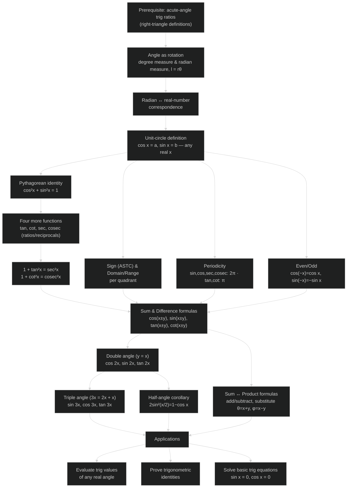
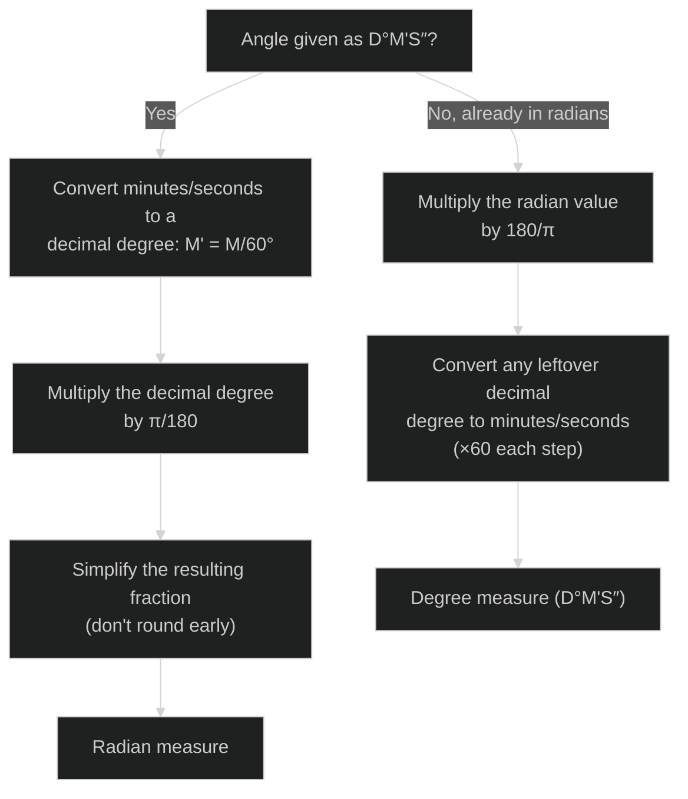
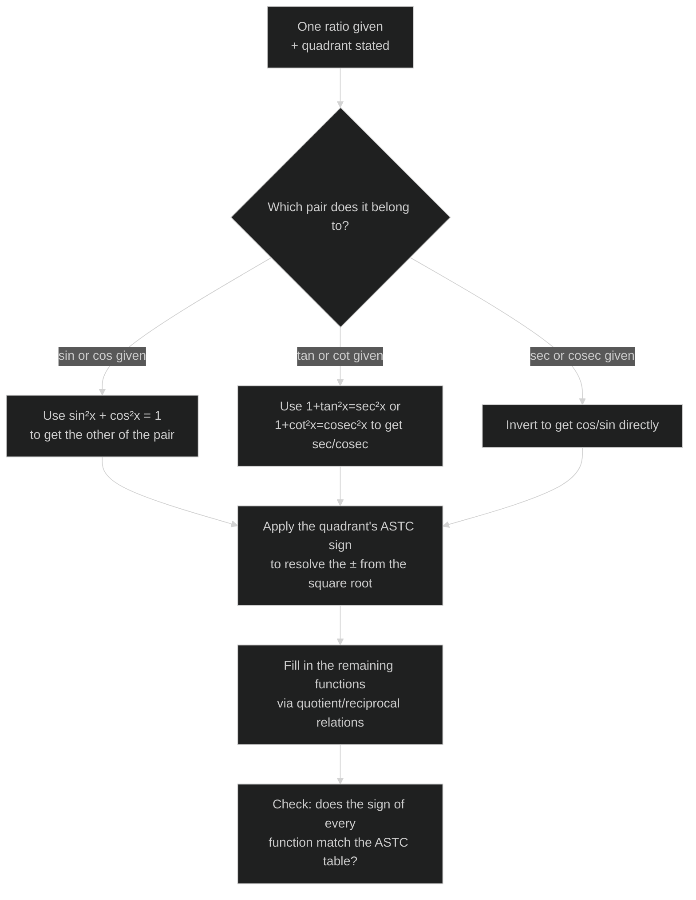
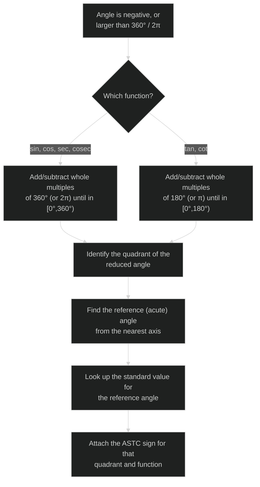
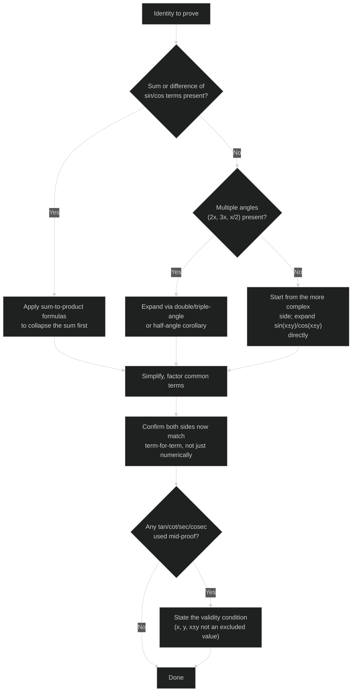

# Trigonometric Functions — Revision Mindmap

### NCERT Class 11 Mathematics, Chapter 3 — concept roadmap and problem-solving strategy

---

## Concept Roadmap

Prerequisite knowledge sits at the top; each result below it is either a **definition built on the unit circle** or a **corollary obtained by substitution** into an earlier boxed result — the whole chapter is one dependency chain, not a list of unrelated facts.

**Reading guide:** the two blue-collar dependencies to keep in view while revising are (i) *everything in §3.4 is a substitution corollary of the single distance-formula proof of $\cos(x+y)$*, and (ii) *domain/sign/periodicity all come from the same unit-circle definition* — so a mistake in one usually traces back to mis-stating a coordinate sign on the circle, not to forgetting a formula.

---

## Problem-Solving Strategy

### 1. Converting between degree and radian

### 2. Given one trig ratio + a quadrant, find the other five

### 3. Evaluating a trig function of an angle outside $[0°,90°]$

### 4. Proving a trigonometric identity

