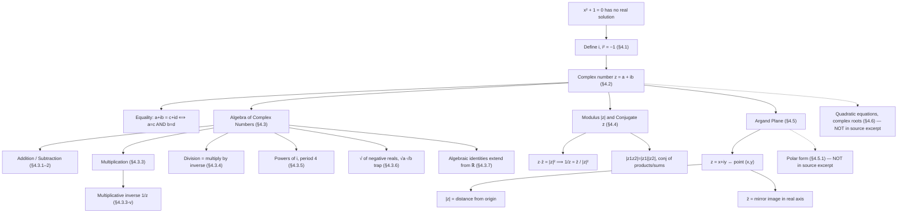
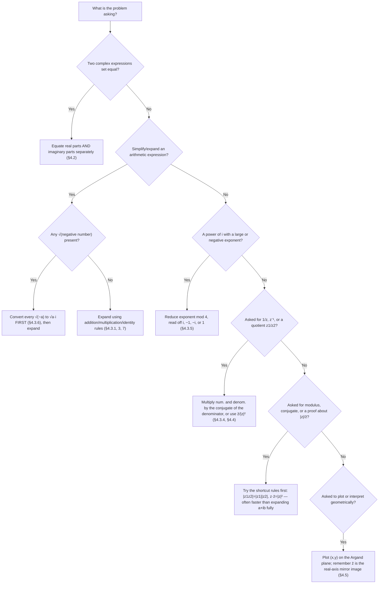
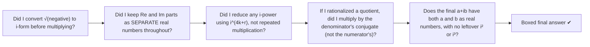

# Complex Numbers — Revision Mindmap

> **Level:** Class 11 Board (NCERT Ch. 4, §4.1–§4.5) — foundational for JEE
> **Use this for:** a last-look-before-the-exam pass over how the chapter's ideas connect, and which technique to reach for on a given problem.

## Concept Roadmap

> **Reading guide:** solid arrows trace the logical dependency actually built in the source (definition → algebra → modulus/conjugate → geometry). Dashed arrows point to the two sections the full NCERT chapter continues into (polar form, and solving quadratics with complex roots) that were **not** part of the uploaded pages — flagged here so revision doesn't silently skip them.

## Problem-Solving Strategy

### Which technique applies to this complex-number problem?

### Final check before writing the boxed answer

