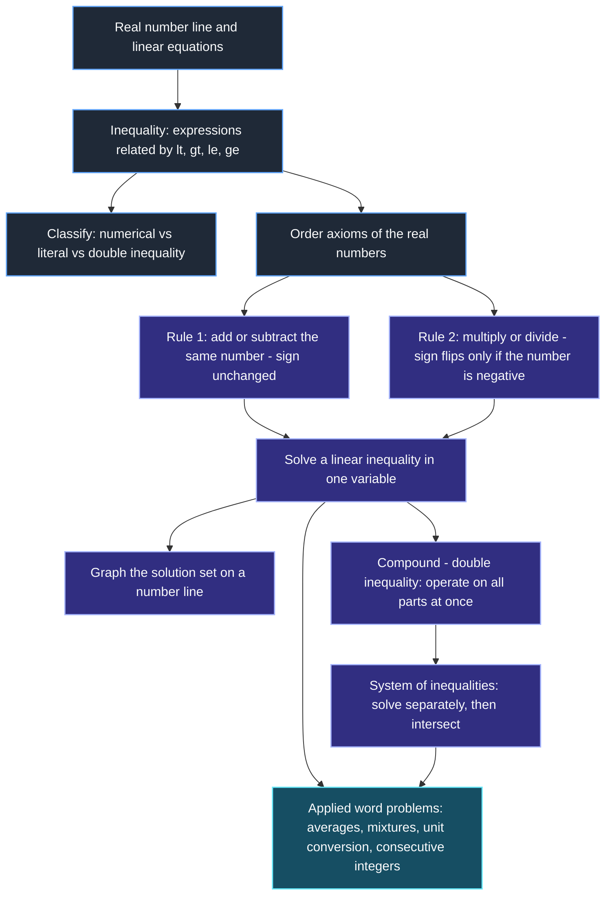
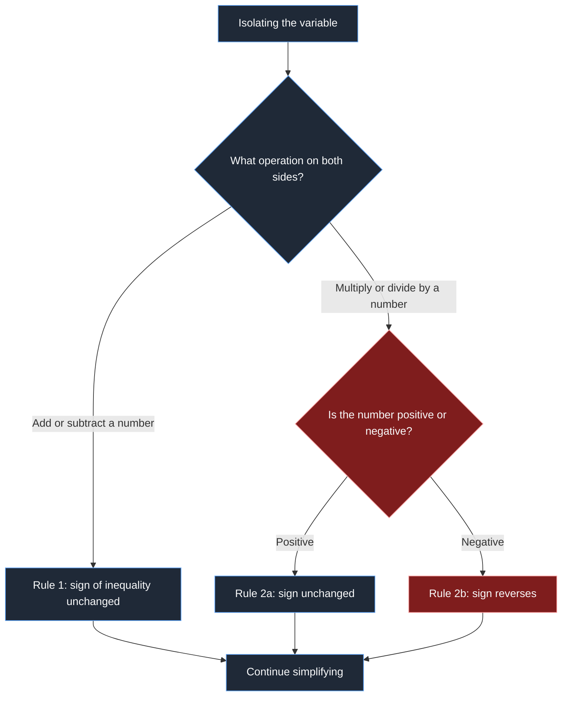
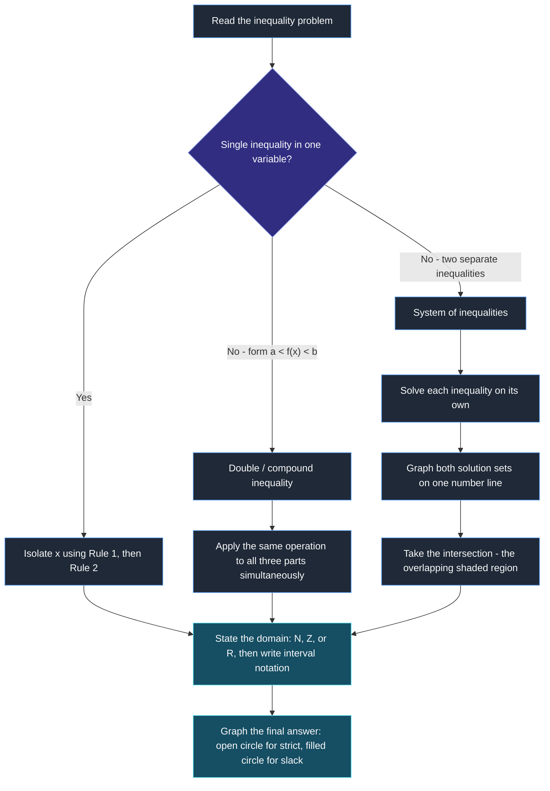
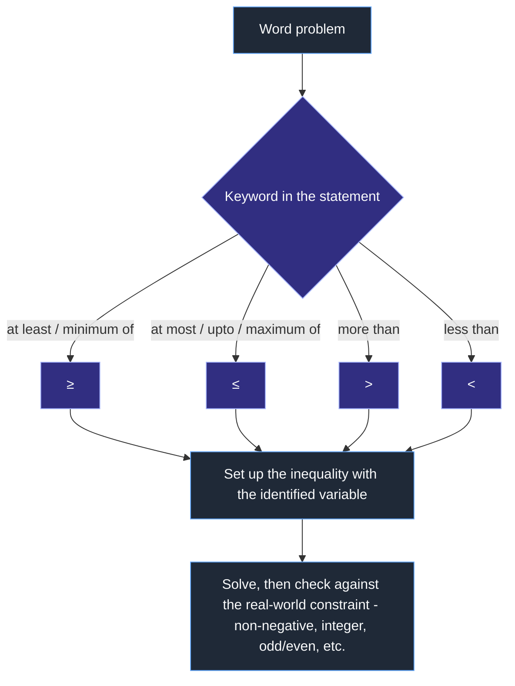

# Linear Inequalities — Revision Mindmap (NCERT Chapter 5)

> Visual revision aid: how the chapter's ideas connect, and a decision flow for approaching any inequality problem. Pairs with the NOTES and GLOSSARY files.

## Concept Roadmap

**Reading the map:** everything in the chapter traces back to the order axioms of \(\mathbb{R}\) (top). The addition property always preserves the sign (Rule 1); the multiplication property only preserves it for positive multipliers, forking into the sign-flip rule for negative ones (Rule 2). Both rules feed the single skill of solving a one-variable inequality, which then branches three ways: graphing it, chaining it into a compound/system inequality, or embedding it inside an applied word problem.

---

## Problem-Solving Strategy: Which Rule Applies?

**Interpretation:** the only decision point that actually risks an error is the sign check in the diamond — every sign-reversal mistake in this chapter traces back to skipping that check.

## Problem-Solving Strategy: Classify the Problem Type

**Interpretation:** the branch point is recognizing the problem's *shape* before touching any algebra — a compound inequality and a system look similar on paper but are solved by different mechanics (operate on all parts at once vs. solve-then-intersect).

## Problem-Solving Strategy: Word-Problem Keyword Mapping

**Interpretation:** most marks lost on word problems come from mapping "at least"/"at most" to the strict symbol instead of the slack one (see NCERT Example 7, where a mark of exactly 70 must still count as satisfying "at least 60 average") — this flow exists specifically to make that mapping explicit before setting up the algebra.
