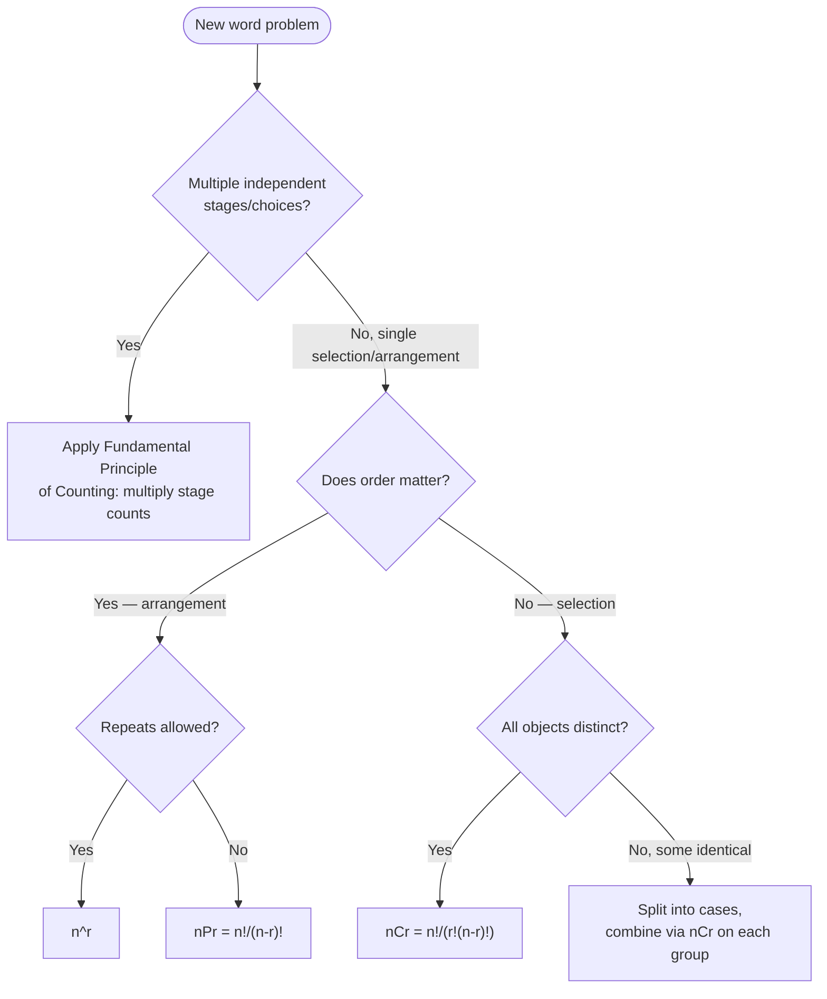

# Mathematics | Chapter 06 | Permutations AND Combinations Cnotes | CNOTES

> A one-page visual recall aid. Use this *after* reading the full notes, not instead of them.

## Formula cheat-sheet (read this first)


| Symbol             | Formula                                   |
| -------------------- | ------------------------------------------- |
| \( {}^nP_r \)      | \( \dfrac{n!}{(n-r)!} \)                  |
| Repetition allowed | \( n^r \)                                 |
| Not all distinct   | \( \dfrac{n!}{p_1!\,p_2!\,\dots\,p_k!} \) |
| \( {}^nC_r \)      | \( \dfrac{n!}{r!\,(n-r)!} \)              |
| Link               | \( {}^nP_r = {}^nC_r \times r!\)          |

## 1. Whole-chapter mind map

```mermaid
mindmap
  root("Permutations & Combinations")
    "Fundamental Principle of Counting"
      "m x n rule"
      "Generalises to m x n x p..."
      "Pant-shirt / bag-tiffin-bottle examples"
      "At least problems: sum mutually exclusive cases"
    "Factorial Notation"
      "n! = 1x2x...xn"
      "0! = 1 by convention"
      "n! = n x (n-1)!"
    "Permutations - order matters"
      "All distinct, no repetition"
        "nPr = n!/(n-r)!"
      "Repetition allowed"
        "n^r"
      "Not all distinct"
        "n!/(p1! p2! ... pk!)"
      "Vacant-places proof method"
      "Solving equations in n or r"
        "check root stays within 0 to n, else extraneous"
    "Combinations - order doesn't matter"
      "nCr = n!/(r! (n-r)!)"
      "nPr = nCr x r!"
      "nCr = nC(n-r)"
      "nCr + nC(r-1) = (n+1)Cr"
    "Applications"
      "Word / letter arrangements"
      "Digit and number formation"
      "Committee and team selection"
      "Card-deck problems"
      "Seating with constraints"
      "Choose-then-arrange: combination + permutation"
      "Dictionary-order word ranking"
```

**Reading guide:** the four upper branches are the *theory spine* — everything else in the chapter is an application of these four ideas layered together. When solving a new problem, walk down this map: is it a counting-stages problem, a factorial simplification, an ordered arrangement, or an unordered selection?

## 2. Decision path for a new problem



**Reading guide:** most exam questions collapse to one path through this tree. The "multiple independent stages" branch (top) is often layered *on top of* a later nCr or nPr result — e.g. "choose a committee, **then** assign 2 of its members to roles" is combination followed by permutation, chained via the multiplication principle.

## 3. Worked-example map (where each formula shows up)

```mermaid
mindmap
  root((Worked examples))
    "nPr, no repetition"
      "ROSE 4-letter words = 24"
      "NUMBER 3-letter words = 120"
      "Chairman and Vice-Chairman = 132"
      "4-digit numbers from 1-9 = 3024"
      "Numbers 100-1000, leading-zero trap = 100"
    "Solving for n or r"
      "nP5 = 42 nP3, n = 10"
      "nP4 divided by n-1P4 = 5/3, n = 10"
      "5 times 4Pr = 6 times 5P(r-1), r = 3 after domain check"
    "Not all distinct"
      "ROOT rearrangements = 12"
      "INSTITUTE = 30240"
      "ALLAHABAD arrangements = 7560"
      "DAUGHTER vowels together/never = 4320 / 36000"
      "4 red 3 yellow 2 green discs = 1260"
      "INDEPENDENCE, several constraints"
    "nCr, single group"
      "Committee of 3 from 5 people = 10"
      "52C4 total card hands = 270725"
    "nCr, multi-group combined by multiplication"
      "1 man + 2 women committee = 6"
      "One card per suit = 13^4"
      "Two red two black cards = 105625"
      "Team with at least 3 girls = 91"
      "Team with at least 1 boy and 1 girl = 441"
    "Choose-then-arrange"
      "INVOLUTE 3 vowels + 2 consonants = 2880"
    "Multiplication principle + constraint"
      "5 girls, 3 boys, no two boys together = 14400"
      "Signals with at least 2 of 5 flags = 320"
    "Mixed / edge cases"
      "7-digit numbers, no leading zero = 360"
      "Dictionary-order rank of a word AGAIN to 50th = NAAIG"
```

**Reading guide:** if a new problem resembles one of these leaf nodes, the surrounding branch tells you which formula family to reach for first.

## 4. Two rules that resolve most ambiguity

> **Watch out:** *Mutually exclusive* cases (only one can happen) are **added**. *Independent, simultaneous* choices (all happen together) are **multiplied**. Card-suit/colour problems and "leading digit" problems both hinge on getting this right — see the card and digit examples in the full notes.

> **Watch out:** An algebraically valid root of an \( {}^nP_r\)/\( {}^nC_r\) equation can still be extraneous — always re-check it against the domain \(0 \le r \le n\) before accepting it (see the full notes' solving-for-r example).
