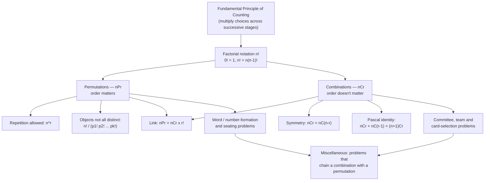
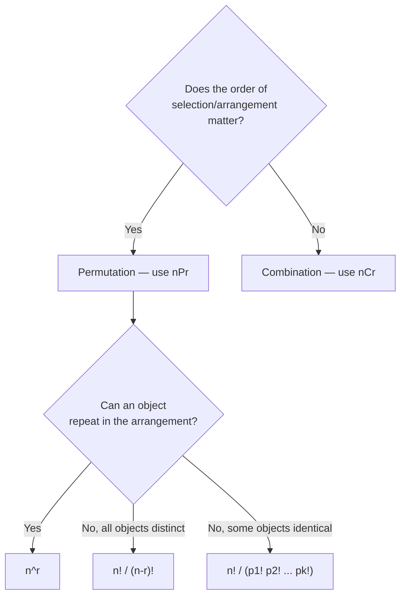

# Permutations and Combinations — NCERT Class 11, Chapter 6

> **Level:** CBSE/NCERT Board, JEE Main-foundational. This note explains how to count arrangements and selections *without listing every possibility*, and builds the two core formulas of combinatorics: \( {}^nP_r \) (order matters) and \( {}^nC_r \) (order doesn't).

## At a glance

- **Subject:** Mathematics — NCERT Class 11, Chapter 6
- **Level:** Foundational combinatorics (Board + JEE Main)
- **Prerequisites:** Basic algebra, comfort with set notation
- **Key idea:** Multi-stage counting problems can be solved by multiplying the number of choices available at each stage (the *Fundamental Principle of Counting*). This single idea, applied twice, produces both permutations and combinations.

## Learning goals

By the end of this note, you should be able to:

1. State and apply the Fundamental Principle of Counting to multi-stage problems, including "at least" problems solved by summing mutually exclusive cases.
2. Work with factorial notation, including \(0! = 1\) and the identity \(n! = n(n-1)!\).
3. Derive and apply \( {}^nP_r = \dfrac{n!}{(n-r)!} \), and know the repetition-allowed variant \(n^r\).
4. Solve equations in \(n\) or \(r\) involving \( {}^nP_r \) — and check any solution against the formula's domain \(0 \le r \le n\).
5. Handle permutations of objects that are **not all distinct** (repeated letters/items), including "keep together" / "never together" constraints.
6. Derive and apply \( {}^nC_r = \dfrac{n!}{r!(n-r)!} \), and use its key identities.
7. Decide, for a new word problem, whether it is asking for a permutation or a combination — and whether sub-cases should be added or multiplied.
8. Solve mixed problems that chain a combination (choosing *what*) with a permutation (arranging *how*), and rank a word in dictionary order.

## Concept Roadmap



**Reading guide:** everything below this point is one of two branches — permutation or combination — both resting on the Fundamental Principle of Counting and factorial notation. The bottom row is where exam problems actually live: most "hard" questions are just an unfamiliar combination of the boxes above.

## 6.1 Introduction ⭐

Imagine a 4-wheel suitcase lock where you remember only the first digit. Checking every possible 3-digit continuation by hand would be tedious. This chapter builds tools that count *how many* arrangements or selections exist — without writing a single one out.

Two different questions keep coming up in such problems:

- **"In how many orders can these be arranged?"** → a *permutation* question.
- **"How many groups/subsets can be chosen?"** → a *combination* question.

Both are built from one and the same idea: the **Fundamental Principle of Counting**.

## 6.2 Fundamental Principle of Counting ⭐⭐

> **Key idea:** If an event can occur in *m* different ways, and — following that — a second event can occur in *n* different ways, then the two events together occur, in that order, in \(m \times n\) ways.

\[
\boxed{\text{Total ways} = m \times n \times p \times \cdots}
\]

This generalises to any finite chain of events: for three events with *m*, *n*, *p* ways respectively, the total is \(m \times n \times p\).

*Example:* Mohan has 3 pants and 2 shirts → \(3 \times 2 = 6\) pant–shirt pairs. Sabnam has 2 bags, 3 tiffin boxes, 2 bottles → \(2 \times 3 \times 2 = 12\) ways to carry her items.

### 6.2 Solved — Flag signals (NCERT Example 2)

**Given:** 4 flags of different colours. **Find:** signals using 2 flags, one below the other (order matters — top flag ≠ bottom flag).
**Work:** upper place: 4 choices; lower place: 3 remaining choices. \(4 \times 3 = 12\).

### 6.2 Solved — Even 2-digit numbers with repetition (NCERT Example 3)

**Given:** digits \(1,2,3,4,5\), repetition allowed. **Find:** 2-digit *even* numbers.
**Approach:** fill the *units* place first, since it's the more restricted place (only 2 and 4 make the number even) — filling the freely-choosable place first is a common trap.
**Work:** units place: 2 choices (2 or 4). Tens place: 5 choices (repetition allowed, so it can even repeat the units digit). \(2 \times 5 = 10\).
**Check:** if we'd (wrongly) filled the tens place first, we'd still get \(5 \times 2 = 10\) here since both places are independent — but this only works because repetition is allowed. Order-of-filling matters more once repetition is *not* allowed (see the leading-zero examples in §6.3.3).

### 6.2 Solved — Signals with at least 2 flags (NCERT Example 4)

**Given:** 5 different flags. **Find:** signals using *at least* 2 flags (so 2, 3, 4, or 5 flags), one below the other.
**Approach:** "at least" ⟹ split into mutually exclusive cases by exact flag-count, count each with the multiplication principle, then **add** (never multiply mutually exclusive cases).
**Work:**

| Flags used | Count |
| --- | --- |
| 2 | \(5\times4=20\) |
| 3 | \(5\times4\times3=60\) |
| 4 | \(5\times4\times3\times2=120\) |
| 5 | \(5\times4\times3\times2\times1=120\) |

**Total:** \(20+60+120+120=320\).
**Check:** each row is itself an application of §6.2's multiplication principle; the rows are added because a signal made of exactly 2 flags and a signal made of exactly 5 flags can never be the same signal — the cases are mutually exclusive.

## 6.3 Permutations — order matters

### 6.3.1 Permutations when all the objects are distinct ⭐⭐

> **Definition:** A permutation is an arrangement, in a *definite order*, of some or all of a set of objects.

**Theorem 1 (ⁿPᵣ, no repetition).** The number of permutations of *n* distinct objects taken *r* at a time, \(0 \le r \le n\), is

\[
\boxed{{}^nP_r = n(n-1)(n-2)\cdots(n-r+1)}
\]

**Derivation (vacant-places method).** Picture *r* vacant places to be filled by the *n* objects, without repetition:

```tikz
\begin{tikzpicture}[thick, scale=1.0]
  \draw (0,0) rectangle (1,1); \node[font=\small] at (0.5,0.5) {$n$};
  \draw (1.3,0) rectangle (2.3,1); \node[font=\small] at (1.8,0.5) {$n-1$};
  \draw (2.6,0) rectangle (3.6,1); \node[font=\small] at (3.1,0.5) {$n-2$};
  \node[font=\small] at (4.0,0.5) {$\cdots$};
  \draw (4.4,0) rectangle (5.4,1); \node[font=\small] at (4.9,0.5) {$n-r+1$};
  \node[below, font=\small] at (0.5,-0.3) {place 1};
  \node[below, font=\small] at (1.8,-0.3) {place 2};
  \node[below, font=\small] at (3.1,-0.3) {place 3};
  \node[below, font=\small] at (4.9,-0.3) {place $r$};
  \node[below, font=\itshape\small, text=gray] at (2.7,-0.9) {choices per vacant place, multiplied, give ${}^{n}P_r$};
\end{tikzpicture}
```

Place 1 can be filled in \(n\) ways; once filled, place 2 has only \(n-1\) remaining choices; place 3 has \(n-2\); and so on until place \(r\), which has \(n-(r-1) = n-r+1\) choices. By the Fundamental Principle of Counting, multiplying these gives the boxed product above.

- Special case \(r = n\): \( {}^nP_n = n! \)
- Special case \(r = 0\): \( {}^nP_0 = 1 \) (there is one way to arrange nothing)

**Theorem 2 (repetition allowed).** If an object may be reused across the *r* places, the count is simply

\[
\boxed{n^r}
\]

*(Each of the r places independently has all n objects available — Theorem 2's proof is identical in structure to Theorem 1's, except every place has exactly \(n\) choices instead of a shrinking count.)*

### 6.3 Solved — Words from ROSE (NCERT Example 1)

**Given:** 4 distinct letters R, O, S, E. **Find:** number of 4-letter arrangements, no repetition.
**Work:** \( {}^4P_4 = 4! = 4\times3\times2\times1 = 24\).
**Check:** if repetition *were* allowed, each of the 4 places independently has 4 choices → \(4^4 = 256\), sensibly larger than 24.

### 6.3.2 Factorial notation ⭐

The symbol \(n!\) ("*n* factorial") is shorthand for a descending product:

\[
n! = 1 \times 2 \times 3 \times \dots \times n
\]

- By definition, \(\boxed{0! = 1}\) (there is exactly one way to arrange *zero* objects — do nothing).
- Useful recursive form: \(n! = n \times (n-1)! = n(n-1)(n-2)! = \dots\)

This notation exists purely to compress the long products that show up in the permutation and combination formulas.

### 6.3.2 Solved — Factorial evaluation (NCERT Example 5)

**Given:** direct evaluation. **Work:** \(5! = 120\). \(7! = 5040\). \(7! - 5! = 5040-120 = 4920\).
**Check:** \(7!-5! \ne 2!\) — factorial does not distribute over subtraction; you must fully evaluate each term first.

### 6.3.2 Solved — Factorial ratios (NCERT Example 6)

**Given:** \(\dfrac{7!}{5!}\) and \(\dfrac{12!}{10!\,2!}\).
**Work:** \(\dfrac{7!}{5!} = \dfrac{7\times6\times5!}{5!} = 7\times6 = 42\). \(\dfrac{12!}{10!\,2!} = \dfrac{12\times11\times10!}{10!\times2} = \dfrac{132}{2}=66\).
**Approach note:** cancel the larger factorial against the smaller one first — never expand both fully; this is the technique every later \( {}^nP_r,{}^nC_r\) computation relies on.

### 6.3.2 Solved — Evaluate \(n!/(r!(n-r)!)\) at \(n=5,r=2\) (NCERT Example 7)

**Work:** \(\dfrac{5!}{2!\,3!} = \dfrac{120}{2\times6} = 10\).
**Note:** this expression *is* the \( {}^nC_r\) formula, computed here purely as factorial practice before Combinations is formally introduced in §6.4 — worth remembering once you reach that section.

### 6.3.2 Solved — Solve for x (NCERT Example 8)

**Given:** \(\dfrac{1}{8!} + \dfrac{1}{9!} = \dfrac{x}{10!}\). **Find:** \(x\).
**Work:**

\[
\begin{aligned}
\frac{1}{8!} + \frac{1}{9\times 8!} &= \frac{9+1}{9\times 8!} = \frac{10}{9\times 8!} \\
\frac{x}{10!} &= \frac{x}{10\times 9\times 8!}
\end{aligned}
\]

Equating and cancelling \(9\times8!\): \(\dfrac{10}{1} = \dfrac{x}{10} \Rightarrow x = 100\).
**Check:** substitute back — \(\frac{1}{8!}+\frac{1}{9!} = \frac{100}{10!}\) numerically confirms (both sides equal \(\frac{10}{9\times8!}\)).

### 6.3.3 Derivation of the formula for ⁿPᵣ ⭐⭐⭐

Theorem 1 gave \( {}^nP_r = n(n-1)(n-2)\cdots(n-r+1)\), a form that's awkward to manipulate algebraically. Multiply numerator and denominator by \((n-r)(n-r-1)\cdots3\times2\times1 = (n-r)!\):

\[
\begin{aligned}
{}^nP_r &= n(n-1)(n-2)\cdots(n-r+1) \times \frac{(n-r)(n-r-1)\cdots3\times2\times1}{(n-r)(n-r-1)\cdots3\times2\times1} \\
&= \frac{n!}{(n-r)!}
\end{aligned}
\]

\[
\boxed{{}^nP_r = \frac{n!}{(n-r)!}, \quad 0 \le r \le n}
\]

Checking the formula still holds at the boundaries: at \(r=n\), \({}^nP_n = n!/0! = n!\) ✓ (matches the special case above). At \(r=0\), \({}^nP_0 = n!/n! = 1\) ✓ — this is *why* \(0!=1\) is defined the way it is: so this single formula stays valid at both edges without a separate rule.

### 6.3.3 Solved — 3-letter words from NUMBER (NCERT, illustrating the formula)

**Given:** 6 distinct letters. **Find:** 3-letter arrangements, no repetition.
**Work:** \( {}^6P_3 = \dfrac{6!}{3!} = 6\times5\times4 = 120\).
**Check:** with repetition allowed it would be \(6^3 = 216\) — again larger, as expected.

### 6.3.3 Solved — Chairman and Vice-Chairman (NCERT, illustrating the formula)

**Given:** group of 12 people, 2 distinct roles (order matters — being Chairman ≠ being Vice-Chairman, and no person holds both).
**Work:** \( {}^{12}P_2 = \dfrac{12!}{10!} = 12 \times 11 = 132\).

### 6.3.3 Solved — 4-digit numbers from digits 1–9 (NCERT Example 10)

**Given:** digits 1 to 9, no repetition. **Find:** 4-digit numbers.
**Approach:** order matters (1234 ≠ 1324) and every digit here is nonzero, so there's no leading-digit restriction to worry about — a plain \( {}^9P_4\).
**Work:** \( {}^9P_4 = \dfrac{9!}{5!} = 9\times8\times7\times6 = 3024\).

### 6.3.3 Solved — Numbers between 100 and 1000 (NCERT Example 11) — the leading-zero trap

**Given:** digits \(0,1,2,3,4,5\), no repetition. **Find:** 3-digit numbers (i.e. between 100 and 1000) that can be formed.
**Approach:** a naive \( {}^6P_3\) *over-counts*, because it includes arrangements like 042 that aren't really 3-digit numbers (0 can't lead). Subtract those off instead of guessing.
**Work:** all 3-digit arrangements of 6 digits: \( {}^6P_3 = \dfrac{6!}{3!} = 120\). Arrangements with 0 fixed in the hundreds place: rearrange the remaining 5 digits into the other 2 places, \( {}^5P_2 = \dfrac{5!}{3!} = 20\).
\[
\boxed{{}^6P_3 - {}^5P_2 = 120 - 20 = 100}
\]
**Check:** alternatively, fill the hundreds place first with only the 5 nonzero digits (5 choices), then the remaining 2 places from the remaining 5 digits in order (\(5\times4\)): \(5\times5\times4=100\). Both methods agree.

### 6.3.3 Solved — Solve for n (NCERT Example 12)

**(i) Given:** \( {}^nP_5 = 42\,{}^nP_3\), \(n>4\).
**Work:** \(n(n-1)(n-2)(n-3)(n-4) = 42\,n(n-1)(n-2)\). Since \(n>4\), \(n(n-1)(n-2)\ne0\); divide both sides by it:
\[
(n-3)(n-4)=42 \;\Rightarrow\; n^2-7n-30=0 \;\Rightarrow\; (n-10)(n+3)=0
\]
So \(n=10\) or \(n=-3\). **Check:** \(n\) must be a positive integer, so reject \(n=-3\). \(\boxed{n=10}\).

**(ii) Given:** \(\dfrac{{}^nP_4}{{}^{n-1}P_4} = \dfrac{5}{3}\), \(n>4\).
**Work:** \(\dfrac{n!/(n-4)!}{(n-1)!/(n-5)!} = \dfrac{n}{n-4}\) (the \((n-1)!\) cancels most of \(n!\), leaving a factor of \(n\); the \((n-5)!\) cancels most of \((n-4)!\), leaving a factor of \(n-4\)). Setting \(\dfrac{n}{n-4}=\dfrac{5}{3}\): \(3n = 5(n-4) \Rightarrow 3n=5n-20 \Rightarrow \boxed{n=10}\).
**Check:** \(n=10>4\) ✓ in both parts — no domain issue here.

### 6.3.3 Solved — Solve for r, with a domain check (NCERT Example 13)

**Given:** \(5\cdot{}^4P_r = 6\cdot{}^5P_{r-1}\).
**Work:**
\[
5\times\frac{4!}{(4-r)!} = 6\times\frac{5!}{(5-r+1)!} = 6\times\frac{5!}{(6-r)!}
\]
Simplifying (using \(5!=5\times4!\) and expanding \((6-r)! = (6-r)(5-r)(4-r)!\)):
\[
(6-r)(5-r)=6 \;\Rightarrow\; r^2-11r+24=0 \;\Rightarrow\; (r-8)(r-3)=0 \;\Rightarrow\; r=8 \text{ or } r=3
\]
**Check (domain — the step the algebra alone can't see):** \( {}^4P_r\) is only defined for \(0 \le r \le 4\). \(r=8\) fails this outright (there is no such thing as arranging 8 objects chosen from 4 distinct ones without repetition), so it is an **extraneous root** introduced by multiplying out the factorials — the same way squaring both sides of an equation can introduce roots that solve the transformed equation but not the original one. Only \(r=3\) lies in the valid domain.
\[
\boxed{r = 3}
\]

> [!warning] Why this matters
> The printed textbook solution states "Hence \(r=8,3\)" without checking the domain. Always re-apply \(0 \le r \le n\) after solving a permutation/combination equation — an algebraically valid root can still be combinatorially meaningless.

### 6.3.4 Permutations when all the objects are not distinct ⭐⭐⭐

When some objects repeat (like the two O's in **ROOT**), naively computing \(n!\) over-counts, because swapping two identical objects doesn't create a genuinely new arrangement.

**Motivating case — ROOT.** Temporarily label the two O's as \(O_1, O_2\) (as if distinct). This gives \(4!=24\) "fake-distinct" permutations. But every pair like \(RO_1O_2T\) and \(RO_2O_1T\) collapses into the single real word ROOT once the labels are dropped — so each real arrangement is counted \(2!\) times.
\[
\text{Required permutations} = \frac{4!}{2!} = \frac{24}{2}=12
\]

**Motivating case — INSTITUTE (New completion — NCERT leaves this as the unsimplified fraction).** 9 letters, with I repeated 2 times and T repeated 3 times. Labelling all copies as distinct gives \(9!\) fake-distinct permutations; each real arrangement is then over-counted by a factor of \(2!\) (for the I's) times \(3!\) (for the T's), since both groups of labels can be internally shuffled without producing a new real word.
\[
\text{Required permutations} = \frac{9!}{2!\,3!} = \frac{362880}{12} = 30240
\]

**Theorem 3.** For *n* objects where *p* are alike (and the rest all different):

\[
\boxed{\frac{n!}{p!}}
\]

**Theorem 4 (general case).** For *n* objects with *k* groups of identical objects, of sizes \(p_1, p_2, \dots, p_k\):

\[
\boxed{\frac{n!}{p_1!\,p_2!\,\dots\,p_k!}}
\]

*Why divide?* Exactly the reasoning used for ROOT and INSTITUTE above, generalized: treat every repeated group as temporarily distinct (giving \(n!\)), then divide by \(p_i!\) for each group of \(p_i\) identical objects, since that many "fake-distinct" permutations collapse into one real arrangement.

### 6.3.4 Solved — ALLAHABAD (NCERT Example 9)

**Given:** 9 letters, of which A appears 4 times and L appears 2 times (rest — H, B, D — distinct).
**Work:** \(\dfrac{9!}{4!\,2!} = \dfrac{362880}{24\times2} = \boxed{7560}\).

### 6.3.4 Solved — DAUGHTER, vowels together vs. never together (NCERT Example 14)

**Given:** 8 distinct letters D, A, U, G, H, T, E, R, of which A, U, E are vowels.
**(i) All vowels together — Approach:** glue the 3 vowels into a single block; this block plus the 5 remaining consonants make 6 objects to arrange, and the block's own 3 letters can be internally reordered.
**Work:** \( {}^6P_6 \times 3! = 6! \times 3! = 720\times6 = \boxed{4320}\).
**(ii) Vowels never together — Approach:** total − vowels-always-together.
**Work:** \(8! - 4320 = 40320-4320 = \boxed{36000}\).
**Check:** "never together" is far larger than "always together" — sensible, since most arrangements scatter the 3 vowels among 8 positions.

### 6.3.4 Solved — Coloured discs (NCERT Example 15)

**Given:** 4 red, 3 yellow, 2 green discs (9 total), discs of the same colour indistinguishable.
**Work:** \(\dfrac{9!}{4!\,3!\,2!} = \dfrac{362880}{24\times6\times2} = \dfrac{362880}{288} = \boxed{1260}\).

### 6.3.4 Solved — INDEPENDENCE, four constraints (NCERT Example 16)

**Given:** 12 letters; N appears 3×, E appears 4×, D appears 2× (rest distinct: I, P, C).
**Total arrangements:** \( \dfrac{12!}{3!\,4!\,2!} = 1{,}663{,}200\).

- **(i) Starting with P:** fix P, rearrange remaining 11 letters → \( \dfrac{11!}{3!\,2!\,4!} = 138{,}600\).
- **(ii) All 5 vowels (E,E,E,E,I) together:** glue them into one block → 8 objects (with 3 N's, 2 D's) arranged in \( \dfrac{8!}{3!\,2!}\) ways, times \( \dfrac{5!}{4!}\) internal vowel arrangements → \(16{,}800\).
- **(iii) Vowels never together:** total − vowels-together = \(1{,}663{,}200 - 16{,}800 = 1{,}646{,}400\).
- **(iv) Words begin with I and end with P:** fix I at the left end and P at the right end, leaving 10 letters (N×3, D×2, E×4, C×1) to rearrange in between → \( \dfrac{10!}{3!\,2!\,4!} = \dfrac{3628800}{288} = \boxed{12{,}600}\).

**Check:** part (iv)'s count is smaller than part (i)'s, as expected — fixing *two* letters' positions is more restrictive than fixing just one.

## 6.4 Combinations — order doesn't matter ⭐⭐⭐

> **Definition:** A combination is a selection of some or all objects from a set, without regard to the order of selection.

**Why a new idea is needed.** A group of 3 tennis players X, Y, Z forms a 2-player team: is the XY team different from the YX team? No — order doesn't matter here, so there are only 3 possible teams (XY, YZ, ZX), not \( {}^3P_2=6\). The same "order doesn't matter" structure appears when 12 people shake hands (X shaking Y's hand isn't a different event from Y shaking X's) or when 7 points on a circle are joined pairwise into chords.

**Motivating the formula.** With 4 distinct objects A, B, C, D, taken 2 at a time, the combinations are AB, AC, AD, BC, BD, CD — exactly 6, since AB and BA are the same selection. Each of these 6 combinations can be internally reordered in \(2!\) ways to produce a permutation, so \( {}^4P_2 = {}^4C_2 \times 2!\), i.e. \(12 = 6\times2\). The same pattern with 5 objects taken 3 at a time gives \( {}^5P_3 = {}^5C_3\times3!\).

**Theorem 5 (link between P and C).**

\[
\boxed{{}^nP_r = {}^nC_r \times r!, \quad 0 < r \le n}
\]

*Why:* every combination of *r* objects can be internally rearranged in \(r!\) ways, and each such rearrangement is a distinct permutation. So permutations = combinations × (orderings per combination).

Rearranging Theorem 5 gives the working formula:

\[
\boxed{{}^nC_r = \frac{n!}{r!\,(n-r)!}, \quad 0 \le r \le n}
\]

**Remarks (derived, not just stated):**

- \( {}^nC_0 = \dfrac{n!}{0!\,n!} = 1\) and \( {}^nC_n = \dfrac{n!}{n!\,0!}=1\): only one way to choose nothing, or to choose everything.
- \( {}^nC_{n-r} = \dfrac{n!}{(n-r)!\,(n-(n-r))!} = \dfrac{n!}{(n-r)!\,r!} = {}^nC_r\): choosing *r* objects to keep is literally the same act as choosing the other \(n-r\) to reject, so the two counts must agree.
- \( {}^nC_a = {}^nC_b \Rightarrow a=b\) or \(a+b=n\): since \( {}^nC_r\) only repeats its value at the complementary index \(n-r\) (this follows from the previous remark), two equal combination counts pin the index down to one of at most two possibilities.

### 6.4 Solved — Find \(^nC_{17}\) given \(^nC_9={}^nC_8\) (NCERT Example 17)

**Approach:** \(9 \ne 8\), so by the remark above we need \(9+8=n\), i.e. \(n=17\).
**Work:** \( {}^{17}C_{17} = 1\).

**Theorem 6 (Pascal-type identity).**

\[
\boxed{{}^nC_r + {}^nC_{r-1} = {}^{n+1}C_r}
\]

*Proof sketch:* expand both terms with the \({}^nC_r = n!/(r!(n-r)!)\) formula, find the common factor \(\dfrac{n!}{(r-1)!(n-r)!}\), and simplify the remaining bracket \(\left[\dfrac{1}{r} + \dfrac{1}{n-r+1}\right]\) to \(\dfrac{n+1}{r(n-r+1)}\), which reassembles into \({}^{n+1}C_r\).

### 6.4 Solved — Mixed committee (NCERT Example 18)

**Given:** 2 men, 3 women. **Find (i):** a 3-person committee, any mix. **Find (ii):** exactly 1 man and 2 women.
**Work (i):** \( {}^5C_3 = \dfrac{5!}{3!\,2!} = 10\).
**Work (ii):** \( {}^2C_1 \times {}^3C_2 = 2 \times 3 = 6\).
**Check:** 6 out of the 10 total committees have this exact composition — plausible since it's one of several possible splits.

### 6.4 Solved — Card combinations (NCERT Example 19)

**Given:** standard 52-card deck. **Find:** ways to choose 4 cards, and several restricted versions.

- **Any 4 cards:** \( {}^{52}C_4 = 270{,}725\).
- **(i) All 4 the same suit:** \(4 \times {}^{13}C_4 = 4 \times 715 = 2{,}860\) (choose the suit's worth of combinations, then sum over the 4 suits — an *addition*, since the cases are mutually exclusive).
- **(ii) One card from each of the 4 suits:** \( ({}^{13}C_1)^4 = 13^4\) (a *multiplication*, since one independent choice is made per suit).
- **(iii) All face cards:** \( {}^{12}C_4 = 495\) (12 face cards total: J, Q, K × 4 suits).
- **(iv) Two red cards and two black cards:** \( {}^{26}C_2 \times {}^{26}C_2 = 325^2 = \boxed{105{,}625}\) — choose 2 of the 26 red cards *and* (independently) 2 of the 26 black cards, so multiply.
- **(v) Cards all of the same colour:** \( {}^{26}C_4 + {}^{26}C_4 = 2\times14{,}950 = \boxed{29{,}900}\) — "all red" and "all black" are mutually exclusive cases, so add.

**Check:** notice the pattern — *mutually exclusive cases get added*, *independent simultaneous choices get multiplied*. Parts (i)/(v) are additions; parts (ii)/(iv) are multiplications. This distinction resolves most "how many ways" ambiguities.

## 6.5 Choosing between permutation and combination ⭐⭐



**Reading guide:** the first branch is the real fork in every word problem — *"team of 3 players"* is a combination (no captain/vice-captain roles distinguishing order), while *"password of 3 digits"* is a permutation (position matters). The second branch only applies once you've settled on a permutation.

## 6.6 Miscellaneous applications — chaining combination and permutation ⭐⭐⭐

Many exam questions aren't purely "permutation" or purely "combination" — they choose a subset (combination) and then arrange it (permutation), or split into cases and add.

### 6.6 Solved — INVOLUTE: choose then arrange (NCERT Example 20)

**Given:** the word INVOLUTE has 4 vowels (I, O, U, E) and 4 consonants (N, V, L, T). **Find:** 5-letter words with exactly 3 vowels and 2 consonants.
**Approach:** this is a combination *followed by* a permutation, chained via the multiplication principle — first choose *which* letters, then arrange them.
**Work:** choose 3 vowels from 4: \( {}^4C_3=4\). Choose 2 consonants from 4: \( {}^4C_2=6\). Combined selections: \(4\times6=24\). Each 5-letter selection can be internally arranged in \(5!=120\) ways.
\[
\boxed{24 \times 120 = 2880}
\]

### 6.6 Solved — Team with "at least" constraints (NCERT Example 21)

**Given:** a group of 4 girls and 7 boys. **Find:** the number of 5-member teams under three different conditions.

**(i) No girl:** only boys are chosen. \( {}^7C_5 = \dfrac{7!}{5!\,2!}=21\).

**(ii) At least one boy and one girl:** split by exact composition (1B+4G, 2B+3G, 3B+2G, 4B+1G) and add, since each composition is mutually exclusive of the others:
\[
{}^7C_1{}^4C_4 + {}^7C_2{}^4C_3 + {}^7C_3{}^4C_2 + {}^7C_4{}^4C_1 = 7+84+210+140 = \boxed{441}
\]

**(iii) At least 3 girls:** the team *cannot* be all 5 girls, because the group has only 4 girls — an easy case to wrongly include if you don't check the group sizes first. Valid compositions: 3G+2B, 4G+1B.
\[
{}^4C_3{}^7C_2 + {}^4C_4{}^7C_1 = 84+7 = \boxed{91}
\]

**Check:** \(91\) and \(441\) should both be less than the unrestricted \( {}^{11}C_5 = 462\) — both are. \(91<441\) also makes sense, since "at least 3 girls" is a stricter condition than "at least 1 of each."

### 6.6 Solved — Dictionary rank of AGAIN (NCERT Example 22)

**Given:** the letters of AGAIN (A, G, A, I, N — A repeated twice). **Find:** the 50th word if all distinct arrangements are listed in dictionary order.
**Approach:** fix the first letter to the smallest available, count how many words start with it; if the target rank is still beyond that count, move to the next letter and repeat.
**Work:** alphabetical order of the letters is A, A, G, I, N.

- **Starting with A:** the remaining pool is A, G, I, N — all 4 *now distinct* (only one A is left) → \(4! = 24\) words.
- **Starting with G:** remaining pool A, A, I, N (A repeats) → \(\dfrac{4!}{2!}=12\) words.
- **Starting with I:** remaining pool A, A, G, N → \(\dfrac{4!}{2!}=12\) words.

Running total after A, G, I: \(24+12+12=48\). So the 49th word is the *first* word starting with N. The remaining letters A, A, G, I, sorted alphabetically, give the smallest completion AAGI → **49th word = NAAGI**. The next completion in order is AAIG → **50th word = NAAIG**.
\[
\boxed{\text{50th word} = \text{NAAIG}}
\]

### 6.6 Solved — Numbers with a mixed-repetition digit list (NCERT Example 23)

**Given:** digits 1, 2, 0, 2, 4, 2, 4 (note: 2 appears three times, 4 appears twice). **Find:** 7-digit numbers greater than 1,000,000 (i.e. no leading zero).
**Work:** split by leading digit —

- Leading 1: remaining digits {0,2,2,2,4,4} arranged \( \dfrac{6!}{3!\,2!} = 60\) ways.
- Leading 2: remaining {0,1,2,2,4,4} arranged \( \dfrac{6!}{2!\,2!} = 180\) ways.
- Leading 4: remaining {0,1,2,2,2,4} arranged \( \dfrac{6!}{3!} = 120\) ways.
  **Total:** \(60 + 180 + 120 = 360\).
  **Check (alternative method):** all 7-digit arrangements = \( \dfrac{7!}{3!\,2!} = 420\); subtract those with a leading 0 (fix 0 first, arrange the rest: \( \dfrac{6!}{3!\,2!} = 60\)) → \(420 - 60 = 360\). Both methods agree.

### 6.6 Solved — Seating with a separation constraint (NCERT Example 24)

**Given:** 5 girls and 3 boys in a row; no two boys may sit together.
**Work:** seat the 5 girls first: \(5!\) ways. This creates 6 gaps (including the two ends) where boys can go: `_ G _ G _ G _ G _ G _`. Place the 3 boys into 3 of these 6 gaps, order mattering: \( {}^6P_3\).
**Total:** \(5! \times {}^6P_3 = 120 \times 120 = 14{,}400\).
**Check:** far smaller than the unrestricted \(8! = 40{,}320\), as expected since the constraint rules out many arrangements.

## Points to Ponder ⭐⭐

> **Watch out:** Treating a *selection* problem as if order mattered (or vice versa) is the single most common error. Ask "would swapping two chosen items change the answer?" — if no, it's a combination.

> **Watch out:** Forgetting to divide by the factorial of each repeated group when objects are not all distinct. Writing \(n!\) for a word like ROOT over-counts by a factor of \(2!\) (the two O's).

> **Watch out:** In "numbers formed from digits" problems, a leading digit of 0 silently turns an *n*-digit number into an (*n*−1)-digit one. Always check whether 0 is in the available digit set and subtract the leading-zero cases, or fill the leading place first with a restricted count.

> **Watch out:** Confusing "AND" (multiply — independent, simultaneous choices) with "OR" (add — mutually exclusive cases). The suit- and colour-based card examples hinge entirely on getting this right.

> **Watch out:** After solving an equation in \(n\) or \(r\) from an \( {}^nP_r\)/\( {}^nC_r\) equation, always re-check the root against the formula's own domain \(0 \le r \le n\) — the algebra can produce roots (like \(r=8\) in §6.3.3) that are extraneous the moment you remember what \( {}^nP_r\) actually means.

> **Watch out:** In "at least *k*" team-selection problems, don't assume every composition down to "all *k* from one group" is possible — check that the group is even large enough (§6.6, at-least-3-girls example, where "all 5 girls" was impossible with only 4 girls available).

## Problem-Solving Strategy ⭐⭐

**Any counting problem — start here:**
1. Does the order of arrangement/selection matter? → Yes: permutation. No: combination.
2. Is repetition of objects allowed? → Yes: \(n^r\). No: continue.
3. Are all objects distinct, or do some repeat? → Distinct: plain \( {}^nP_r\)/\( {}^nC_r\). Repeats: divide by \(p_i!\) for each repeated group (Theorem 3/4 — permutations only).
4. Do the cases you're counting overlap, or happen together? → Mutually exclusive: **add**. Independent & simultaneous: **multiply**.

**Word/letter-arrangement problems:**
- Count total letters \(n\) and each repeated letter's multiplicity.
- "Must stay together": glue into one block, arrange (block + rest), then multiply by the block's internal arrangements.
- "Must occupy fixed positions": fix those letters first, then arrange the rest.
- "Never together" = total − "always together".

**Digit/number-formation problems:**
- Check for the leading-zero trap: if 0 is available and repetition isn't allowed, either fill the leading place first with a restricted count, or compute all arrangements and subtract the leading-zero ones.
- If the number must be even/odd with repetition allowed, fill the more restricted place (units) first.

**Committee/team-selection problems:**
- Order doesn't matter → \( {}^nC_r\).
- "At least"/"at most": split into mutually exclusive cases by exact composition, then add — and check each extreme case is numerically possible before including it.

**Card-deck problems:**
- "One item per category" (e.g. one card per suit) → multiply.
- "All items from one category, summed across categories" (e.g. all-same-suit, all-same-colour) → add.

**Seating-with-constraints problems:**
- Seat the unconstrained group first; identify the gaps created; place the constrained group into the gaps using \( {}^nP_r\)/\( {}^nC_r\) as appropriate.

**Solving equations in \(n\) or \(r\):**
- Expand using the definitions; cancel common nonzero factors (state why they're nonzero, using any given domain restriction).
- After solving, re-check every root against \(0 \le r \le n\); discard extraneous roots.

**Dictionary-order (rank) problems:**
- Sort the distinct letters alphabetically. Fix the smallest first letter, count words starting with it (using Theorem 3/4 for any remaining repeats). If the target rank exceeds this count, move to the next letter and repeat; otherwise recurse into the next position the same way.

## Summary

- The **Fundamental Principle of Counting** (multiply choices across successive stages) underlies everything in this chapter; **"at least"** problems apply it by splitting into mutually exclusive cases and adding.
- **Factorial notation** (\(n!\), with \(0! = 1\)) compresses the repeated products that show up in counting formulas.
- **Permutations** (\( {}^nP_r = n!/(n-r)! \)) count ordered arrangements; repetition-allowed permutations are \(n^r\); permutations of objects with repeats divide by the repeated groups' factorials.
- **Combinations** (\( {}^nC_r = n!/(r!(n-r)!) \)) count unordered selections, and relate to permutations by \( {}^nP_r = {}^nC_r \times r!\).
- Word problems are solved by identifying whether order matters, whether repetition is allowed, and whether cases should be added (mutually exclusive) or multiplied (simultaneous independent choices) — and a mixed problem often chains a combination (choose) with a permutation (arrange).
- Any root obtained from solving an \( {}^nP_r\)/\( {}^nC_r\) equation must be checked against the formula's own domain, \(0 \le r \le n\), before it's accepted.

## Check your understanding

1. In how many ways can the letters of the word **STATISTICS** be arranged? (Identify the repeated letters first.)
2. A quiz team of 4 is to be picked from 6 boys and 5 girls, with at least 2 girls. How would you split this into cases?
3. Why is \( {}^nC_r = {}^nC_{n-r} \) true just from the *meaning* of a combination, without touching the formula?
4. A 5-digit number is formed from the digits 0–9 without repetition. Why can't you simply compute \( {}^{10}P_5 \) directly?
5. Solve \( {}^{n}P_4 = 20\cdot{}^nP_2\) for \(n\), then check your root against the formula's domain the way §6.3.3's Example 13 does.
6. In a dictionary listing of all arrangements of the word CHAIR, would the technique from §6.6's AGAIN example need any modification? Why or why not?

## Quick recall (exam memory)


| Formula                                        | Use when…                                            |
| ------------------------------------------------ | ------------------------------------------------------- |
| \(m \times n\) (…\(\times p \times \dots\))   | Multi-stage counting, each stage independent          |
| \(n! = 1\times2\times\dots\times n\), \(0!=1\) | Compressing/simplifying counting expressions          |
| \( {}^nP_r = \dfrac{n!}{(n-r)!}\)              | Ordered selection,*n* distinct objects, no repetition |
| \(n^r\)                                        | Ordered selection, repetition allowed                 |
| \(\dfrac{n!}{p_1!p_2!\dots p_k!}\)             | Arranging*n* objects with repeated items              |
| \( {}^nC_r = \dfrac{n!}{r!(n-r)!}\)            | Unordered selection ("choose")                        |
| \( {}^nP_r = {}^nC_r \times r!\)               | Converting between the two                             |
| \( {}^nC_r = {}^nC_{n-r}\)                     | Symmetry / complementary choosing                      |
| \( {}^nC_r + {}^nC_{r-1} = {}^{n+1}C_r\)       | Pascal-type recursive relation                          |

> **Historical aside:** the Jains treated permutations and combinations as a self-contained topic under the name *Vikalpa*; *Mahavira* (c. 850 CE) is credited as the first to give general formulae for both. *Sushruta* (6th c. BCE) and *Pingala* (c. 3rd c. BCE) worked with combinations of tastes and letters respectively; *Bhaskaracharya* (b. 1114) added further theorems under the name *Anka Pasha* in his *Lilavati*. Outside India, the Chinese *I-Ching*, and later Hebrew writers such as *Rabbi ben Ezra* (c. 1140) and *Levi Ben Gerson* (1321, who supplied the general \( {}^nC_r\) formula), contributed independently. The first complete treatment appeared in Swiss mathematician *Jacob Bernoulli*'s posthumously published *Ars Conjectandi* (1713) — essentially the theory as taught today.