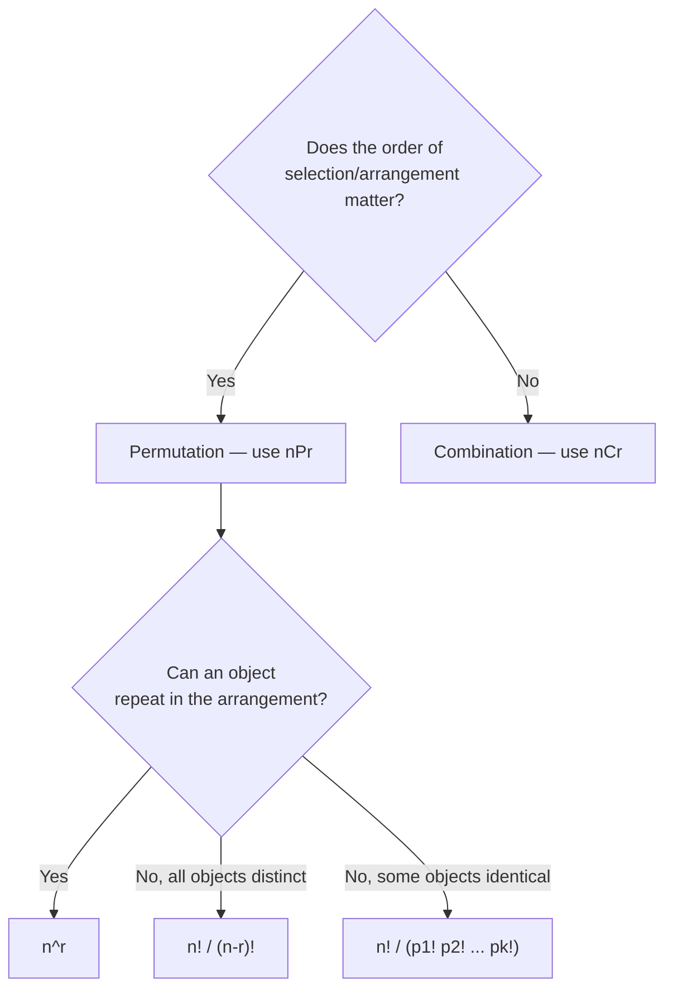
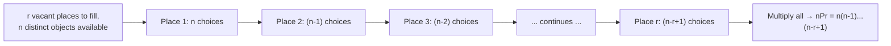

# Permutations and Combinations (NCERT Class 11 — Chapter 6)

> This note explains how to count arrangements and selections *without listing every possibility*, and builds the two core formulas of combinatorics: \( {}^nP_r \) (order matters) and \( {}^nC_r \) (order doesn't).

## At a glance

- **Subject:** Mathematics — NCERT Class 11, Chapter 6
- **Level:** Foundational combinatorics
- **Prerequisites:** Basic algebra, comfort with set notation
- **Key idea:** Multi-stage counting problems can be solved by multiplying the number of choices available at each stage (the *Fundamental Principle of Counting*). This single idea, applied twice, produces both permutations and combinations.

## Learning goals

By the end of this note, you should be able to:

1. State and apply the Fundamental Principle of Counting to multi-stage problems.
2. Work with factorial notation, including \(0! = 1\) and the identity \(n! = n(n-1)!\).
3. Derive and apply \( {}^nP_r = \dfrac{n!}{(n-r)!} \), and know the repetition-allowed variant \(n^r\).
4. Handle permutations of objects that are **not all distinct** (repeated letters/items).
5. Derive and apply \( {}^nC_r = \dfrac{n!}{r!(n-r)!} \), and use its key identities.
6. Decide, for a new word problem, whether it is asking for a permutation or a combination.

## 1. The central idea

Imagine a 4-wheel suitcase lock where you remember only the first digit. Checking every possible 3-digit continuation by hand would be tedious. This chapter builds tools that count *how many* arrangements or selections exist — without writing a single one out.

Two different questions keep coming up in such problems:

- **"In how many orders can these be arranged?"** → a *permutation* question.
- **"How many groups/subsets can be chosen?"** → a *combination* question.

Both are built from one and the same idea: the **Fundamental Principle of Counting**.

## 2. Key concepts

### 2.1 Fundamental Principle of Counting (Multiplication Principle)

> **Key idea:** If an event can occur in *m* different ways, and — following that — a second event can occur in *n* different ways, then the two events together occur, in that order, in \(m \times n\) ways.

This generalises to any finite chain of events: for three events with *m*, *n*, *p* ways respectively, the total is \(m \times n \times p\).

*Example:* Mohan has 3 pants and 2 shirts → \(3 \times 2 = 6\) pant–shirt pairs. Sabnam has 2 bags, 3 tiffin boxes, 2 bottles → \(2 \times 3 \times 2 = 12\) ways to carry her items.

### 2.2 Factorial notation

The symbol \(n!\) ("*n* factorial") is shorthand for a descending product:

\[
n! = 1 \times 2 \times 3 \times \dots \times n
\]

- By definition, \(0! = 1\) (there is exactly one way to arrange *zero* objects — do nothing).
- Useful recursive form: \(n! = n \times (n-1)! = n(n-1)(n-2)! = \dots\)

This notation exists purely to compress the long products that show up in the permutation and combination formulas below.

### 2.3 Permutations — order matters

> **Definition:** A permutation is an arrangement, in a *definite order*, of some or all of a set of objects.

**Theorem 1 (ⁿPᵣ, no repetition).** The number of permutations of *n* distinct objects taken *r* at a time is

\[
{}^nP_r = n(n-1)(n-2)\cdots(n-r+1) = \frac{n!}{(n-r)!}, \quad 0 \le r \le n
\]

*Derivation idea:* picture *r* vacant places. The first place can be filled in *n* ways; once filled, the second place has only \(n-1\) remaining choices; the third has \(n-2\); and so on until the *r*-th place, which has \(n-(r-1)\) choices. Multiplying these (Fundamental Principle of Counting) gives the product above. Multiplying and dividing by \((n-r)!\) compresses it into the tidy factorial form.

- Special case \(r = n\): \( {}^nP_n = n! \)
- Special case \(r = 0\): \( {}^nP_0 = 1 \) (there is one way to arrange nothing)

**Theorem 2 (repetition allowed).** If an object may be reused across the *r* places, the count is simply

\[
n^r
\]

*(Each of the r places independently has all n objects available.)*

### 2.4 Permutations when objects are not all distinct

When some objects repeat (like the two O's in **ROOT**), naively computing \(n!\) over-counts, because swapping two identical objects doesn't create a genuinely new arrangement.

**Theorem 3.** For *n* objects where *p* are alike (and the rest all different):

\[
\frac{n!}{p!}
\]

**Theorem 4 (general case).** For *n* objects with *k* groups of identical objects, of sizes \(p_1, p_2, \dots, p_k\):

\[
\frac{n!}{p_1!\,p_2!\,\dots\,p_k!}
\]

*Why divide?* Temporarily treat the repeated letters as distinct (e.g. \(O_1, O_2\)). This gives \(n!\) permutations. But every group of \(p_i!\) of those "fake-distinct" permutations collapses into a single real permutation once you stop distinguishing the identical copies — so you divide by \(p_i!\) for each repeated group.

### 2.5 Combinations — order doesn't matter

> **Definition:** A combination is a selection of some or all objects from a set, without regard to the order of selection.

**Theorem 5 (link between P and C).**

\[
{}^nP_r = {}^nC_r \times r!, \quad 0 < r \le n
\]

*Why:* every combination of *r* objects can be internally rearranged in \(r!\) ways, and each such rearrangement is a distinct permutation. So permutations = combinations × (orderings per combination).

Rearranging Theorem 5 gives the working formula:

\[
{}^nC_r = \frac{n!}{r!\,(n-r)!}, \quad 0 \le r \le n
\]

**Key identities (Remarks):**

| Identity                                                        | Meaning                                                                |
| ----------------------------------------------------------------- | ------------------------------------------------------------------------ |
| \( {}^nC_0 = {}^nC_n = 1 \)                                     | Only one way to choose nothing, or to choose everything                |
| \( {}^nC_r = {}^nC_{\,n-r} \)                                   | Choosing*r* to keep = choosing \(n-r\) to reject                       |
| \( {}^nC_a = {}^nC_b \Rightarrow a = b \text{ or } a + b = n \) | Two equal combination counts pin down the index (up to the complement) |

**Theorem 6 (Pascal-type identity).**

\[
{}^nC_r + {}^nC_{r-1} = {}^{n+1}C_r
\]

*Proof sketch:* expand both terms with the \({}^nC_r = n!/(r!(n-r)!)\) formula, find the common factor \(\dfrac{n!}{(r-1)!(n-r)!}\), and simplify the remaining bracket \(\left[\dfrac{1}{r} + \dfrac{1}{n-r+1}\right]\) to \(\dfrac{n+1}{r(n-r+1)}\), which reassembles into \({}^{n+1}C_r\).

### 2.6 Choosing between permutation and combination

**Reading guide:** the first branch is the real fork in every word problem — *"team of 3 players"* is a combination (no captain/vice-captain roles distinguishing order), while *"password of 3 digits"* is a permutation (position matters). The second branch only applies once you've settled on a permutation.

## 3. How it works — the vacant-places method

Both core formulas are proved the same way: picture the *r* slots you need to fill, and count choices slot by slot.

**Reading guide:** this diagram *is* the proof of Theorem 1 — nothing more is needed once you accept the Fundamental Principle of Counting. Combinations are then derived on top of this: since every combination corresponds to \(r!\) permutations (the internal reorderings), dividing \({}^nP_r\) by \(r!\) gives \({}^nC_r\).

## 4. Worked examples

Each example follows: **Given → Find → Work → Check.**

### Example A — Words from ROSE (basic ⁿPᵣ)

**Given:** 4 distinct letters R, O, S, E. **Find:** number of 4-letter arrangements, no repetition.
**Work:** \( {}^4P_4 = 4! = 4\times3\times2\times1 = 24\).
**Check:** if repetition *were* allowed, each of the 4 places independently has 4 choices → \(4^4 = 256\), sensibly larger than 24.

### Example B — 3-letter words from NUMBER

**Given:** 6 distinct letters. **Find:** 3-letter arrangements, no repetition.
**Work:** \( {}^6P_3 = \dfrac{6!}{3!} = 6\times5\times4 = 120\).
**Check:** with repetition allowed it would be \(6^3 = 216\) — again larger, as expected.

### Example C — Rearranging ROOT (repeated letters)

**Given:** 4 letters, of which 2 are identical (O, O). **Find:** distinct arrangements.
**Work:** \( \dfrac{4!}{2!} = \dfrac{24}{2} = 12\).
**Check:** listing confirms exactly 12 distinct words (ROOT, ROTO, TORO, RTOO, TROO, OORT, OROT, OTOR, ORTO, OTRO, OOTR, OOTR-type pairs collapse correctly).

### Example D — INDEPENDENCE, with constraints

**Given:** 12 letters; N appears 3×, E appears 4×, D appears 2×.
**Total arrangements:** \( \dfrac{12!}{3!\,4!\,2!} = 1{,}663{,}200\).

- **Starting with P:** fix P, rearrange remaining 11 letters → \( \dfrac{11!}{3!\,2!\,4!} = 138{,}600\).
- **All 5 vowels (E,E,E,E,I) together:** glue them into one block → 8 objects (with 3 N's, 2 D's) arranged in \( \dfrac{8!}{3!\,2!}\) ways, times \( \dfrac{5!}{4!}\) internal vowel arrangements → \(16{,}800\).
- **Vowels never together:** total − vowels-together = \(1{,}663{,}200 - 16{,}800 = 1{,}646{,}400\).

**Check:** the "never together" count should be much larger than "always together," since most arrangements scatter the vowels — confirmed.

### Example E — Chairman and Vice-Chairman

**Given:** group of 12 people, 2 distinct roles (order matters — being Chairman ≠ being Vice-Chairman).
**Work:** \( {}^{12}P_2 = \dfrac{12!}{10!} = 12 \times 11 = 132\).

### Example F — A mixed committee (combination × combination)

**Given:** 2 men, 3 women. **Find (i):** a 3-person committee, any mix. **Find (ii):** exactly 1 man and 2 women.
**Work (i):** \( {}^5C_3 = \dfrac{5!}{3!\,2!} = 10\).
**Work (ii):** \( {}^2C_1 \times {}^3C_2 = 2 \times 3 = 6\).
**Check:** 6 out of the 10 total committees have this exact composition — plausible since it's one of several possible splits.

### Example G — Card combinations (52C4 and sub-cases)

**Given:** standard 52-card deck. **Find:** ways to choose 4 cards, and several restricted versions.

- **Any 4 cards:** \( {}^{52}C_4 = 270{,}725\).
- **All 4 the same suit:** \(4 \times {}^{13}C_4 = 4 \times 715 = 2{,}860\) (choose the suit's worth of combinations, then sum over the 4 suits — an *addition*, since the cases are mutually exclusive).
- **One card from each of the 4 suits:** \( ({}^{13}C_1)^4 = 13^4\) (a *multiplication*, since one independent choice is made per suit).
- **All face cards:** \( {}^{12}C_4 = 495\) (12 face cards total: J, Q, K × 4 suits).

**Check:** notice the pattern — *mutually exclusive cases get added*, *independent simultaneous choices get multiplied*. This distinction resolves most "how many ways" ambiguities.

### Example H — Seating with a separation constraint

**Given:** 5 girls and 3 boys in a row; no two boys may sit together.
**Work:** seat the 5 girls first: \(5!\) ways. This creates 6 gaps (including the two ends) where boys can go: `_ G _ G _ G _ G _ G _`. Place the 3 boys into 3 of these 6 gaps, order mattering: \( {}^6P_3\).
**Total:** \(5! \times {}^6P_3 = 120 \times 120 = 14{,}400\).
**Check:** far smaller than the unrestricted \(8! = 40{,}320\), as expected since the constraint rules out many arrangements.

### Example I — Numbers with a mixed-repetition digit list

**Given:** digits 1, 2, 0, 2, 4, 2, 4 (note: 2 appears three times, 4 appears twice). **Find:** 7-digit numbers greater than 1,000,000 (i.e. no leading zero).
**Work:** split by leading digit —

- Leading 1: remaining digits {0,2,2,2,4,4} arranged \( \dfrac{6!}{3!\,2!} = 60\) ways.
- Leading 2: remaining {0,1,2,2,4,4} arranged \( \dfrac{6!}{2!\,2!} = 180\) ways.
- Leading 4: remaining {0,1,2,2,2,4} arranged \( \dfrac{6!}{3!} = 120\) ways.
  **Total:** \(60 + 180 + 120 = 360\).
  **Check (alternative method):** all 7-digit arrangements = \( \dfrac{7!}{3!\,2!} = 420\); subtract those with a leading 0 (fix 0 first, arrange the rest: \( \dfrac{6!}{3!\,2!} = 60\)) → \(420 - 60 = 360\). Both methods agree.

## Common misconceptions

> **Watch out:** Treating a *selection* problem as if order mattered (or vice versa) is the single most common error. Ask "would swapping two chosen items change the answer?" — if no, it's a combination.

> **Watch out:** Forgetting to divide by the factorial of each repeated group when objects are not all distinct. Writing \(n!\) for a word like ROOT over-counts by a factor of \(2!\) (the two O's).

> **Watch out:** In "numbers formed from digits" problems, a leading digit of 0 silently turns an *n*-digit number into an (*n*−1)-digit one. Always check whether 0 is in the available digit set and subtract the leading-zero cases, or fill the leading place first with a restricted count.

> **Watch out:** Confusing "AND" (multiply — independent, simultaneous choices) with "OR" (add — mutually exclusive cases). The suit-based card examples above hinge entirely on getting this right.

## Summary

- The **Fundamental Principle of Counting** (multiply choices across successive stages) underlies everything in this chapter.
- **Factorial notation** (\(n!\), with \(0! = 1\)) compresses the repeated products that show up in counting formulas.
- **Permutations** (\( {}^nP_r = n!/(n-r)! \)) count ordered arrangements; repetition-allowed permutations are \(n^r\); permutations of objects with repeats divide by the repeated groups' factorials.
- **Combinations** (\( {}^nC_r = n!/(r!(n-r)!) \)) count unordered selections, and relate to permutations by \( {}^nP_r = {}^nC_r \times r!\).
- Word problems are solved by identifying whether order matters, whether repetition is allowed, and whether cases should be added (mutually exclusive) or multiplied (simultaneous independent choices).

## Check your understanding

1. In how many ways can the letters of the word **STATISTICS** be arranged? (Identify the repeated letters first.)
2. A quiz team of 4 is to be picked from 6 boys and 5 girls, with at least 2 girls. How would you split this into cases?
3. Why is \( {}^nC_r = {}^nC_{n-r} \) true just from the *meaning* of a combination, without touching the formula?
4. A 5-digit number is formed from the digits 0–9 without repetition. Why can't you simply compute \( {}^{10}P_5 \) directly?

## Quick recall (exam memory)

| Formula                                        | Use when…                                            |
| ------------------------------------------------ | ------------------------------------------------------- |
| \(m \times n\) (…\(\times p \times \dots\))   | Multi-stage counting, each stage independent          |
| \(n! = 1\times2\times\dots\times n\), \(0!=1\) | Compressing/simplifying counting expressions          |
| \( {}^nP_r = \dfrac{n!}{(n-r)!}\)              | Ordered selection,*n* distinct objects, no repetition |
| \(n^r\)                                        | Ordered selection, repetition allowed                 |
| \(\dfrac{n!}{p_1!p_2!\dots p_k!}\)             | Arranging*n* objects with repeated items              |
| \( {}^nC_r = \dfrac{n!}{r!(n-r)!}\)            | Unordered selection ("choose")                        |
| \( {}^nP_r = {}^nC_r \times r!\)               | Converting between the two                            |
| \( {}^nC_r = {}^nC_{n-r}\)                     | Symmetry / complementary choosing                     |
| \( {}^nC_r + {}^nC_{r-1} = {}^{n+1}C_r\)       | Pascal-type recursive relation                        |

> **Historical aside:** The Jain mathematician *Mahavira* (c. 850 CE) is credited as the first to give general formulae for permutations and combinations; centuries later, Swiss mathematician *Jacob Bernoulli*'s posthumously published *Ars Conjectandi* (1713) laid out essentially the theory as taught today.
