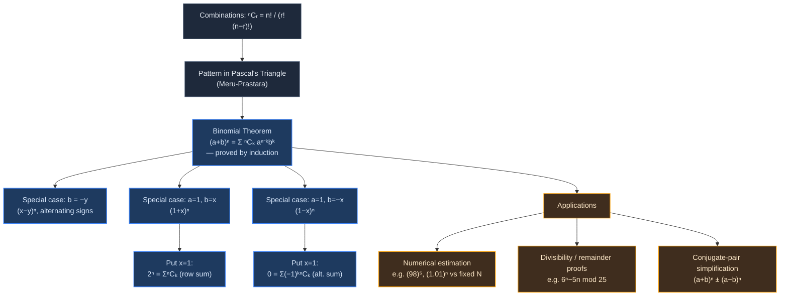
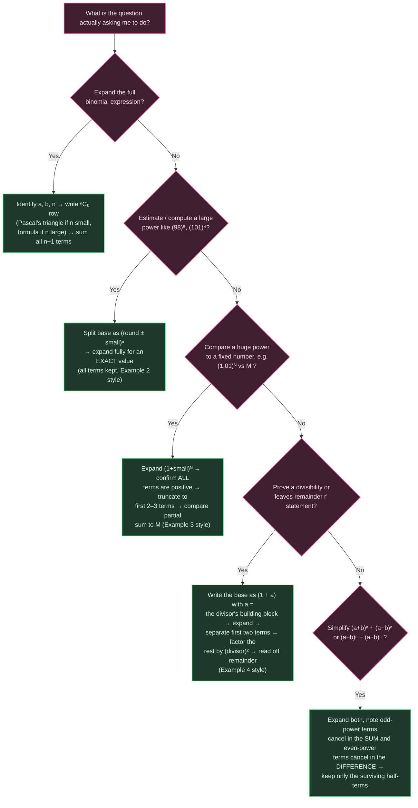

# REVISION MINDMAP — Binomial Theorem (NCERT Ch. 7)

*Pair with NOTES.md (derivations) and GLOSSARY.md (formula sheet)*

## Concept Roadmap

**Reading the map:** everything flows from one induction proof (node C). The three "special cases" (D, E, F) are not independent theorems — they are the *same* boxed result in NOTES.md §7.2.1 with specific values of $a,b$ plugged in. The two corollaries at $x=1$ (G, H) are themselves special cases of special cases (F chains from E's substitution, twice). The application branch (I) is where exam questions actually live — recognising *which* application a question wants (J vs K vs L) is exactly what the strategy flowchart below is for.

---

## Problem-Solving Strategy

**Reading the strategy map:** the branch order matters — always check "full expansion?" first, since every other route is really "apply the binomial theorem, then do one extra structural step." The distinguishing question between R2 and R3 is whether the problem wants an **exact value** (keep everything) or an **inequality/bound** (truncation is safe only because every kept-vs-dropped term's sign is known).
