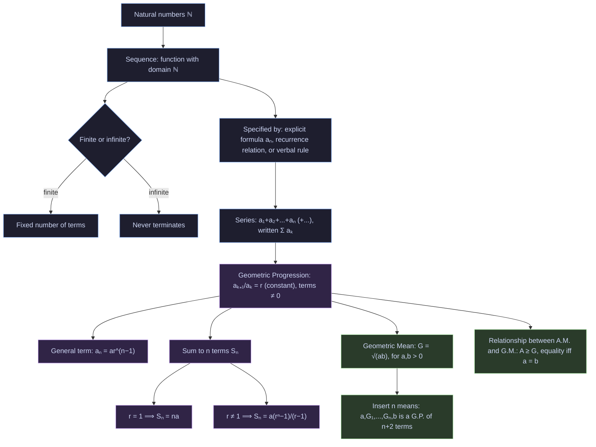
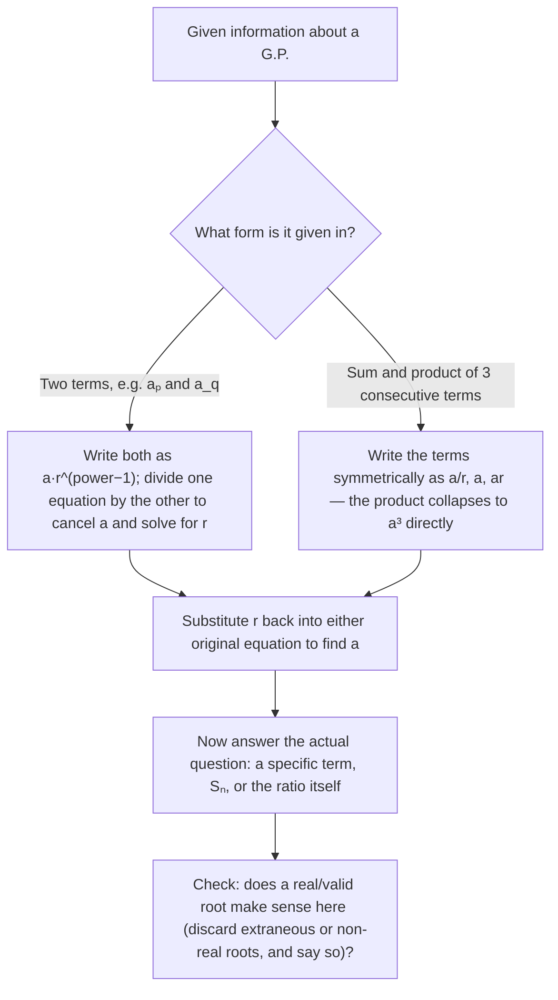
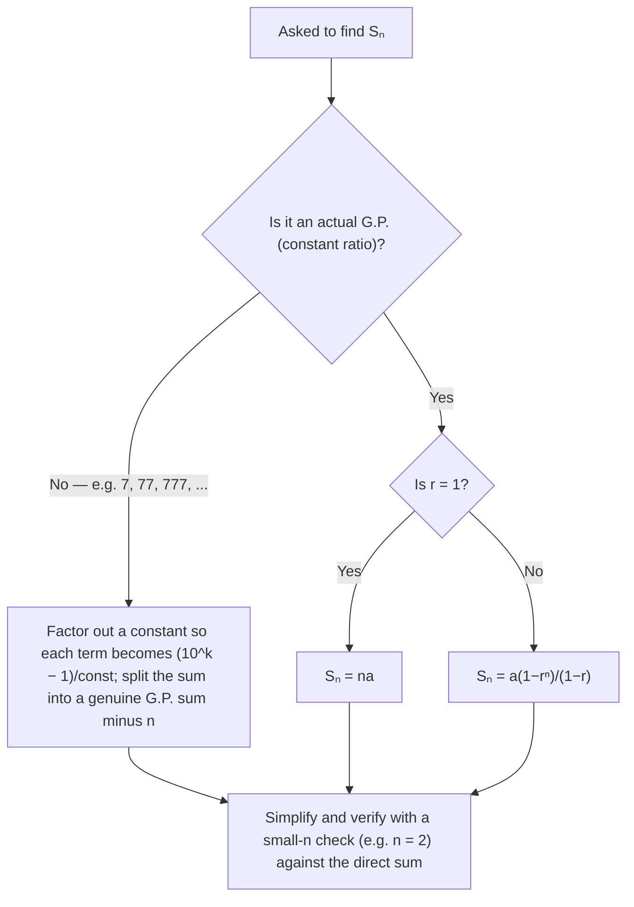
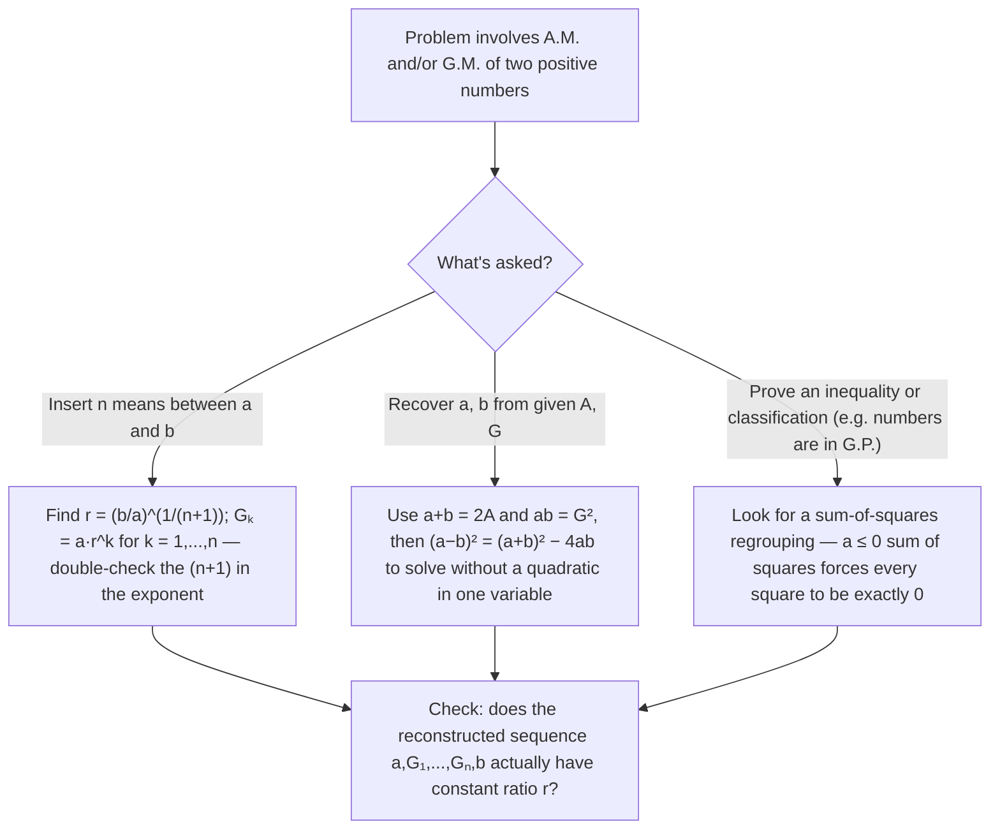

# Revision Mind-Map — Sequences and Series

> NCERT Class 11, Chapter 8. This file holds the chapter's concept roadmap and its problem-solving decision flows — for derivations and worked examples, see `NOTES-Sequences-and-Series.md`; for the formula sheet, see `GLOSSARY-Sequences-and-Series.md`.

## Concept Roadmap

**Reading guide:** everything downstream of "Sequence" is a special case built on top of it. A **G.P.** is a sequence with one extra constraint (constant ratio); the **geometric mean** is what you get by asking "what single number continues a 2-term G.P.?"; and the **A.M.–G.M. relationship** compares that geometric mean to the ordinary average. If a problem statement doesn't explicitly mention a constant ratio, check whether it's really about a general sequence/series (§8.2–8.3) rather than a G.P. (§8.4) before applying any G.P. formula.

---

## Problem-Solving Strategy

### Strategy 1 — Finding an unknown term or the common ratio of a G.P.

### Strategy 2 — Summing a G.P. (or something that looks like one)

### Strategy 3 — Geometric mean and A.M.–G.M. problems

**Reading guide:** all three strategies end in a **check** step deliberately — the chapter's most common errors (dropped roots, wrong exponent denominators, treating \(r=1\) as a special case of the main formula) are exactly the kind that a five-second substitution back into the given data catches immediately.
