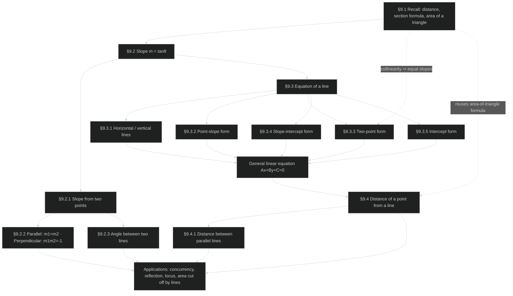
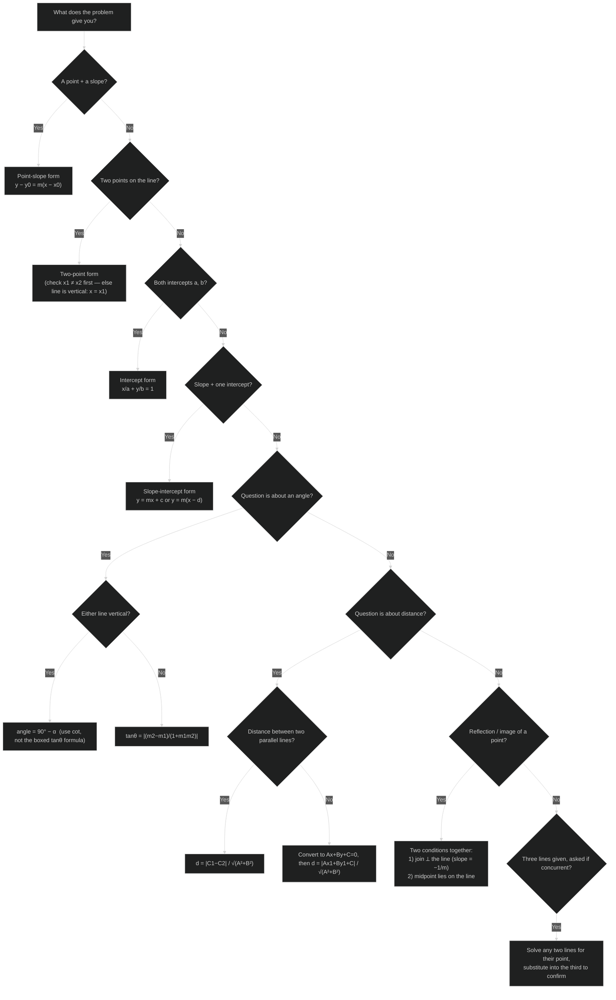
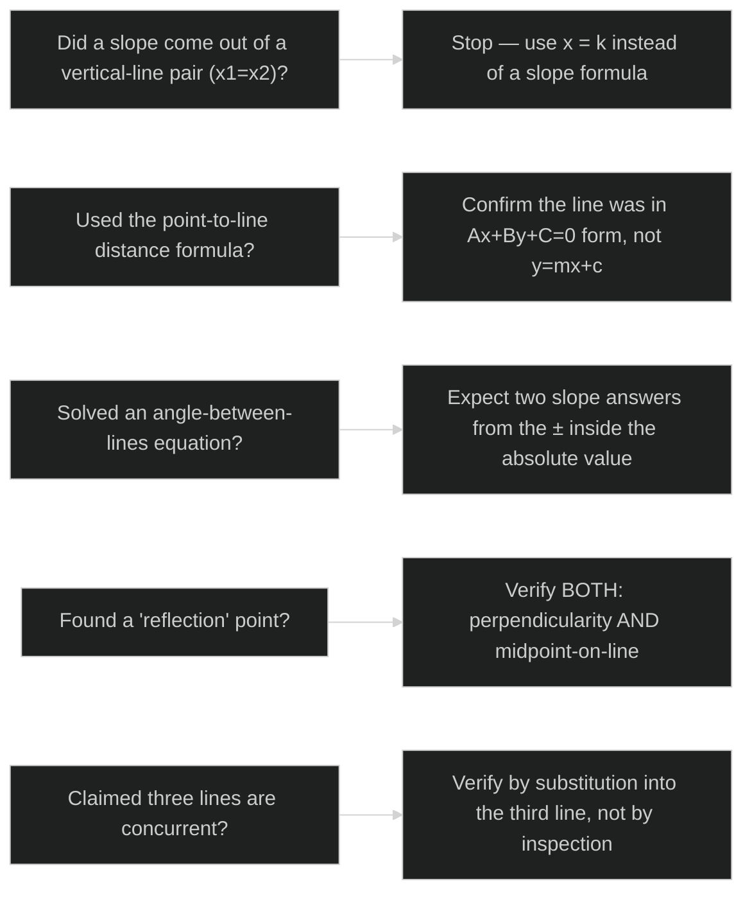

# Straight Lines — Revision Mind Map

> Two views for last-minute revision: (1) how the chapter's ideas depend on each other, and (2) which technique to reach for given what a problem hands you. Pairs with **STRAIGHT_LINES-NOTES.md** for the derivations these summarize.

## Concept Roadmap

Read this top-down: everything traces back to the four recalled facts in §9.1. The dotted arrows mark the two "callback" moments worth noticing on revision — the two-point form is just collinearity restated as equal slopes, and the distance formula is the area-of-a-triangle formula run in reverse.

## Problem-Solving Strategy — "Which technique applies?"

## Problem-Solving Strategy — Sanity checks before you finalize

