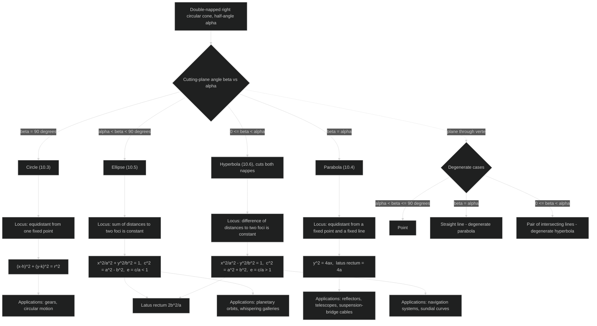
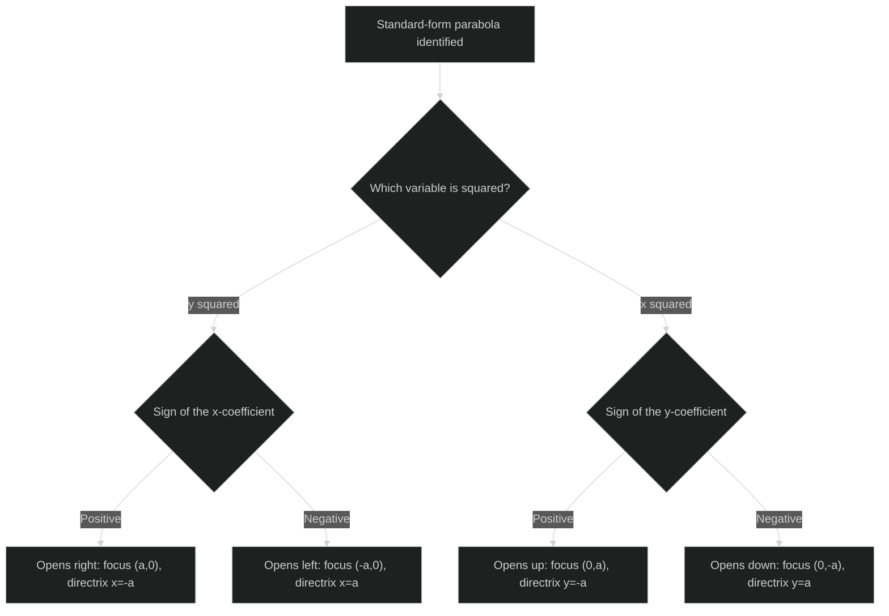
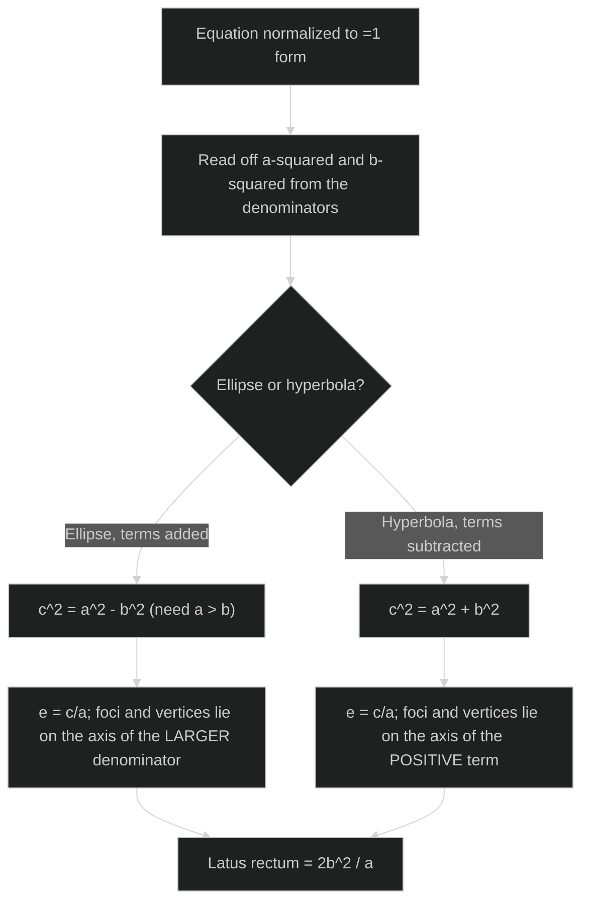
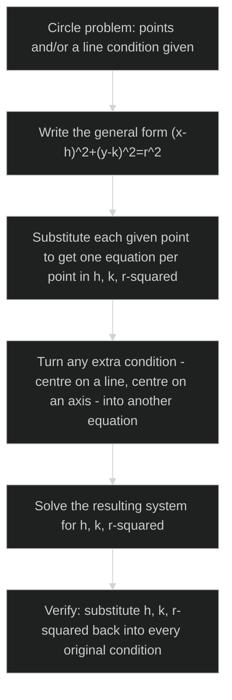

# Conic Sections — REVISION MINDMAP

*Companion to Conic-Sections-NOTES.md and Conic-Sections-GLOSSARY.md · NCERT Class 11 Mathematics, Chapter 10*

---

## Concept Roadmap

How the chapter's ideas connect, from the cone down to the four standard equations and their uses.



**Reading the map:** everything below the first branch point is a consequence of *where* the plane cuts the cone. Once you know which of the four curves you have, its defining locus property (row 2) is what you actually squeeze through the distance formula to get the boxed equation (row 3) — that's the one derivation pattern repeated four times across the whole chapter.

---

## Problem-Solving Strategy 1 — Classify a Conic From Its Equation

```mermaid
%%{init: {'theme': 'dark'}}%%
flowchart TD
    A[Given an equation with x^2 and/or y^2 terms] --> B{Only one variable is squared?}
    B -->|Yes| C[Parabola: isolate the squared variable, compare to y^2=4ax or x^2=4ay]
    B -->|No, both squared| D{Coefficients of x^2 and y^2 equal, same sign?}
    D -->|Yes| E[Circle: rewrite as (x-h)^2+(y-k)^2=r^2 by completing the square]
    D -->|No, same sign, different size| F[Ellipse: normalize to =1 form; larger denominator marks major axis]
    D -->|No, opposite signs| G[Hyperbola: normalize to =1 form; positive term marks transverse axis]
```

---

## Problem-Solving Strategy 2 — Orient a Parabola From Its Equation



---

## Problem-Solving Strategy 3 — Extract Every Parameter From an Ellipse or Hyperbola



---

## Problem-Solving Strategy 4 — Find a Circle's Equation From Given Conditions



---

## One-Glance Exam Checklist

- **Circle:** normalize to \((x-h)^2+(y-k)^2=r^2\) before reading centre/radius — never read them off an un-completed general form.
- **Parabola:** squared variable → axis; sign of linear term → direction; \(a\) is always a positive distance.
- **Ellipse:** compare **denominator sizes** for the major axis.
- **Hyperbola:** compare **term signs** for the transverse axis — this is the opposite test from the ellipse.
- **Any conic built from conditions (points, foci, directrix, latus rectum):** set up the general equation first, substitute every condition, solve, then substitute back to confirm — don't stop at "solved," stop at "checked."
