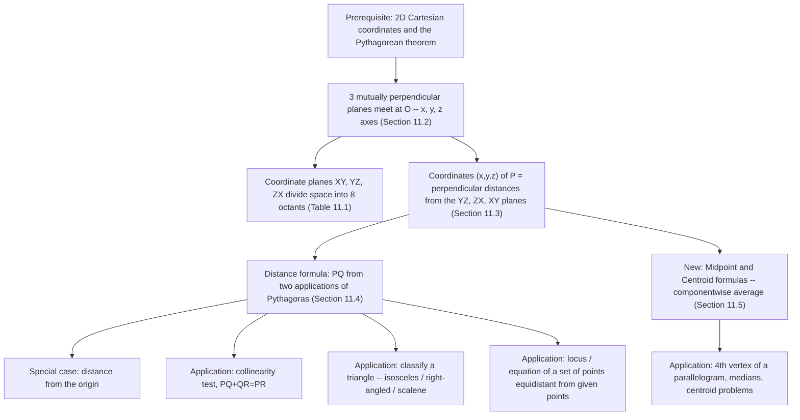
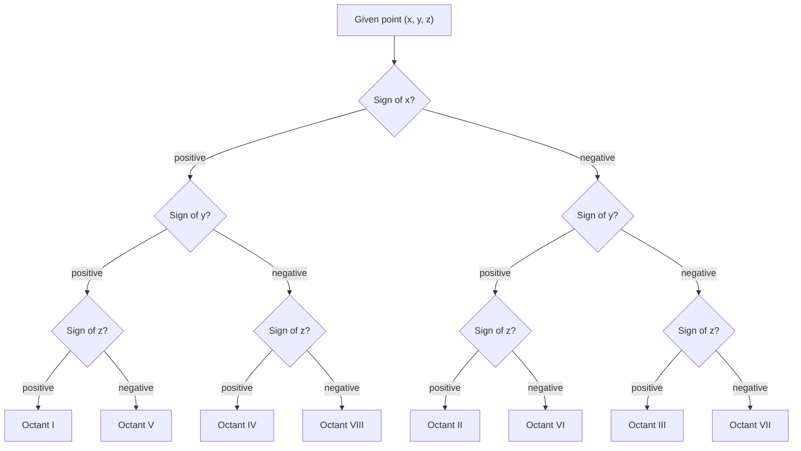
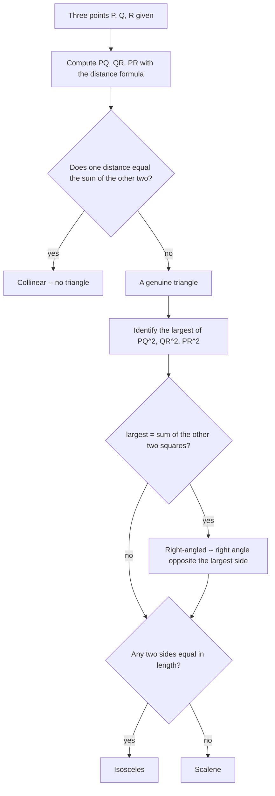
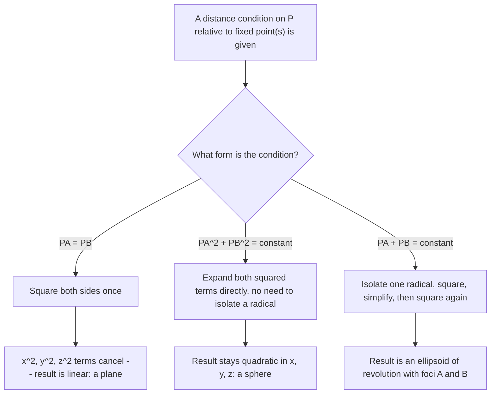

# Revision Mind Map — Introduction to Three-Dimensional Geometry (NCERT Ch. 11)

> Pair this with the NOTES file (derivations, worked examples) and the GLOSSARY file (formula sheet). This file is for two things: seeing how the chapter's ideas connect, and knowing which procedure to reach for on a given problem.

## Concept Roadmap

**Reading guide:** everything branches from one fact — a coordinate is a perpendicular distance from a plane, not an axis. Once octants (from signs) and the distance formula (from Pythagoras) are in hand, every application in the chapter — collinearity, triangle type, parallelograms, loci — is just that formula reused with a different diagnostic question layered on top.

## Problem-Solving Strategy 1 — Which Octant?

**Reading guide:** walk the tree top to bottom, one sign at a time — \(x\) first, then \(y\), then \(z\). This is faster and less error-prone under exam pressure than scanning a table left to right.

## Problem-Solving Strategy 2 — Classifying Three Points

**Reading guide:** always compute all three distances before branching — deciding collinearity or side-equality from just two distances risks missing the pairing that actually matters. Note the right-angle check only ever needs the single largest-side comparison.

## Problem-Solving Strategy 3 — Equation of a Locus

**Reading guide:** identify which of the three condition shapes you're looking at *before* touching algebra — it tells you in advance whether the quadratic terms should vanish (plane) or survive (sphere), which catches an arithmetic slip immediately if the expected cancellation doesn't happen.
