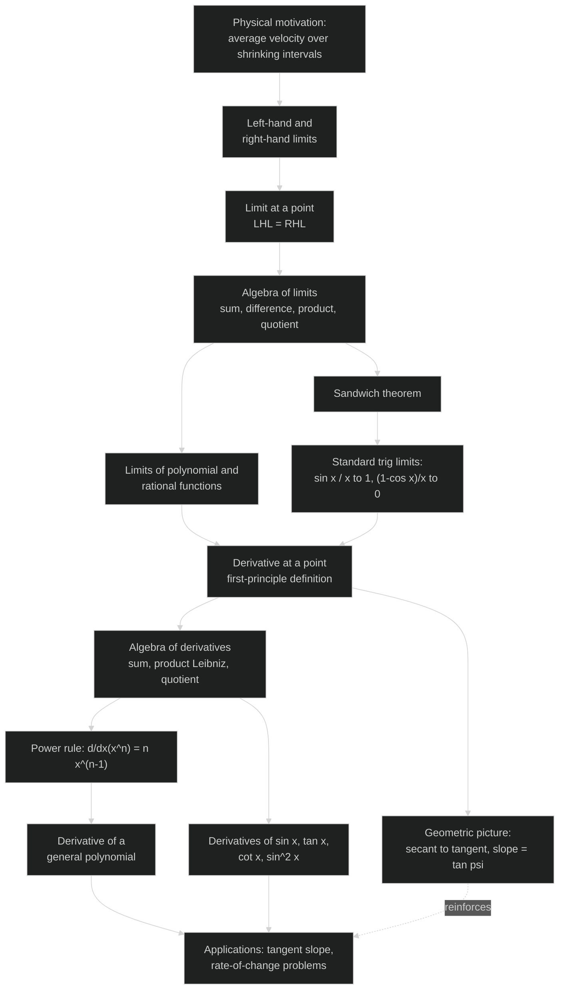

# Limits and Derivatives — Revision Mind-Map

*NCERT Class 11 Mathematics, Chapter 12 — pairs with the GLOSSARY and NOTES files for this chapter.*

> Use this file for a fast pre-exam pass: the first diagram shows how every result in the chapter connects to the next; the two decision flowcharts after it are the "what do I do first?" checklists for the two question types this chapter is tested on — evaluating a limit, and finding a derivative.

---

## Concept Roadmap



**Reading the roadmap:** everything before the "Algebra of limits" box is about *pinning down what a limit even means*; everything from "Algebra of limits" onward is about *computing* limits efficiently, which then becomes the machinery for defining and computing derivatives. The dashed arrow marks that the secant→tangent picture from §12.2/§12.5 isn't a separate computational tool — it's the geometric meaning sitting underneath every derivative you calculate.

---

## Problem-Solving Strategy 1: Evaluating a Limit

```mermaid
%%{init: {'theme':'dark'}}%%
flowchart TD
    S1[Given: limit of f(x) as x approaches a] --> Q1{Is f defined by<br/>different rules on either<br/>side of a?}
    Q1 -- Yes --> P1[Compute LHL and RHL separately]
    P1 --> Q2{Do LHL and RHL<br/>agree?}
    Q2 -- Yes --> R1[That common value<br/>is the limit]
    Q2 -- No --> R2[Limit does not exist]
    Q1 -- No --> P2[Substitute x = a directly]
    P2 --> Q3{Determinate value,<br/>no 0/0 or undefined form?}
    Q3 -- Yes --> R3[That value is the limit]
    Q3 -- No --> Q4{What kind of<br/>indeterminate form?}
    Q4 -- "0/0, polynomial or rational" --> P3[Factor out the common<br/>power of (x-a) and cancel;<br/>re-substitute]
    Q4 -- "involves sin, cos, tan" --> P4[Rewrite using identities into<br/>sin(u)/u or (1-cos u)/u form;<br/>apply standard trig limits]
    Q4 -- "involves a surd" --> P5[Rationalize by multiplying<br/>with the conjugate]
    P3 --> R4[Simplified expression gives the limit]
    P4 --> R4
    P5 --> R4
```

**Reading the flowchart:** the very first fork — piecewise or not — is the one students skip most often under time pressure. If a function is defined differently for \(x<a\) and \(x\ge a\) (or has an absolute value, floor function, etc. that changes behaviour at \(a\)), checking LHL and RHL separately is not optional, even if the two-sided limit "looks obvious."

---

## Problem-Solving Strategy 2: Finding a Derivative

```mermaid
%%{init: {'theme':'dark'}}%%
flowchart TD
    T1[Given: find f'(x)] --> Q1{Question explicitly says<br/>'from first principle'?}
    Q1 -- Yes --> P1["Apply f'(x) = lim h->0 of<br/>(f(x+h) - f(x)) / h directly;<br/>simplify before taking the limit"]
    Q1 -- No --> Q2{What is the<br/>structure of f?}
    Q2 -- "sum or difference of terms" --> P2[Differentiate each term<br/>separately, then combine]
    Q2 -- "product of two functions u, v" --> P3["Leibniz rule:<br/>(uv)' = u'v + uv'"]
    Q2 -- "quotient u / v" --> P4["Quotient rule:<br/>(u/v)' = (u'v - uv') / v^2"]
    Q2 -- "power x^n" --> P5["Power rule: n x^(n-1)"]
    Q2 -- "standard trig function" --> P6[Look up sin x, tan x, cot x, etc.<br/>in the standard-derivative table]
    P2 --> R1[Combine results;<br/>state the domain]
    P3 --> R1
    P4 --> R1
    P5 --> R1
    P6 --> R1
```

**Reading the flowchart:** the last step — *state the domain* — is easy to drop but often carries marks, especially after a quotient rule, since the new denominator \(v^2\) can exclude points that weren't excluded from \(f\)'s own domain (or, as with \(\tan x\to\sec^2x\), can carry the *same* exclusion forward). Treat "find \(f'(x)\)" as incomplete until you've said where \(f'(x)\) is valid.
