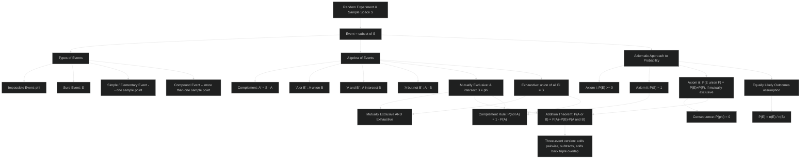
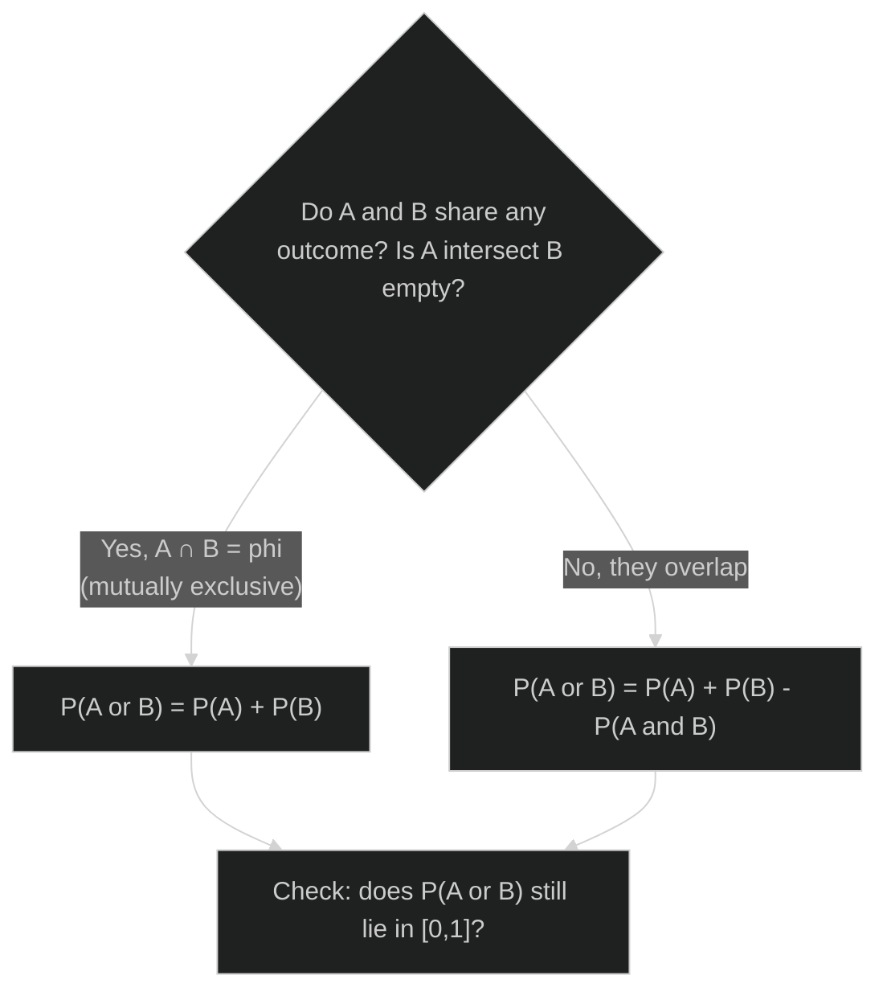
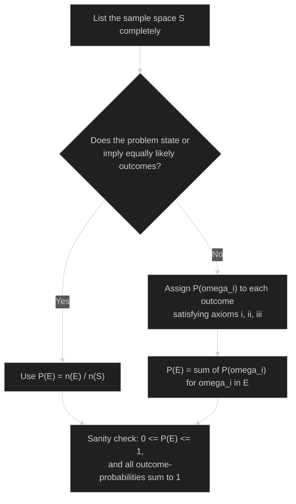
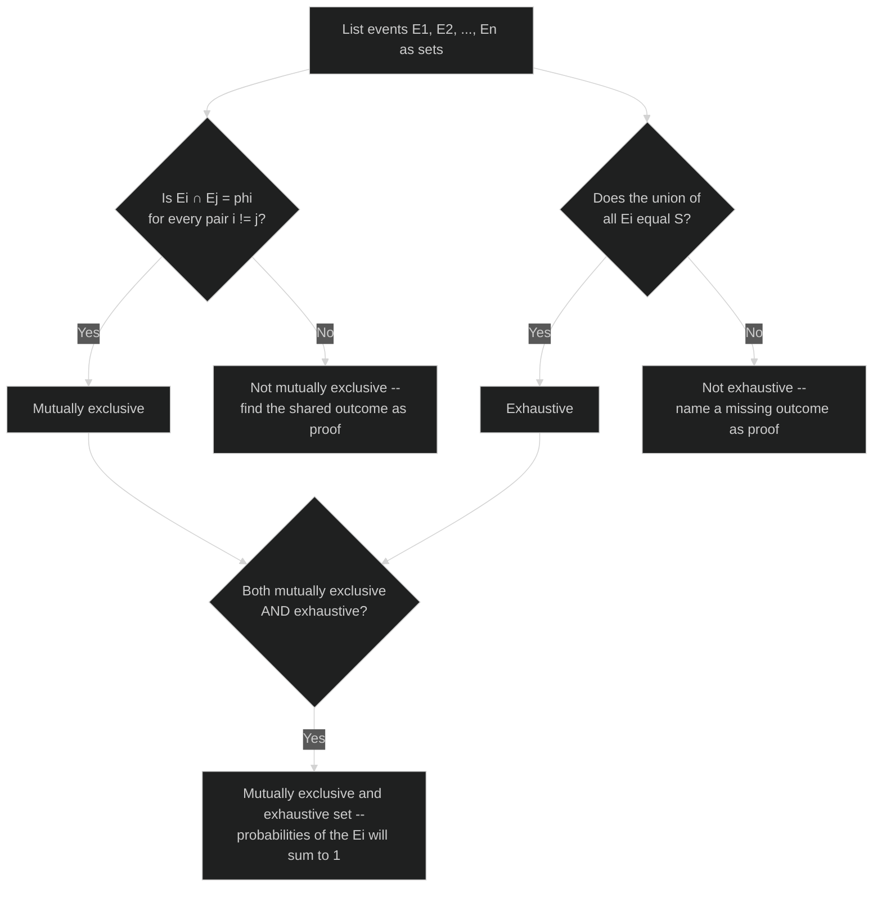
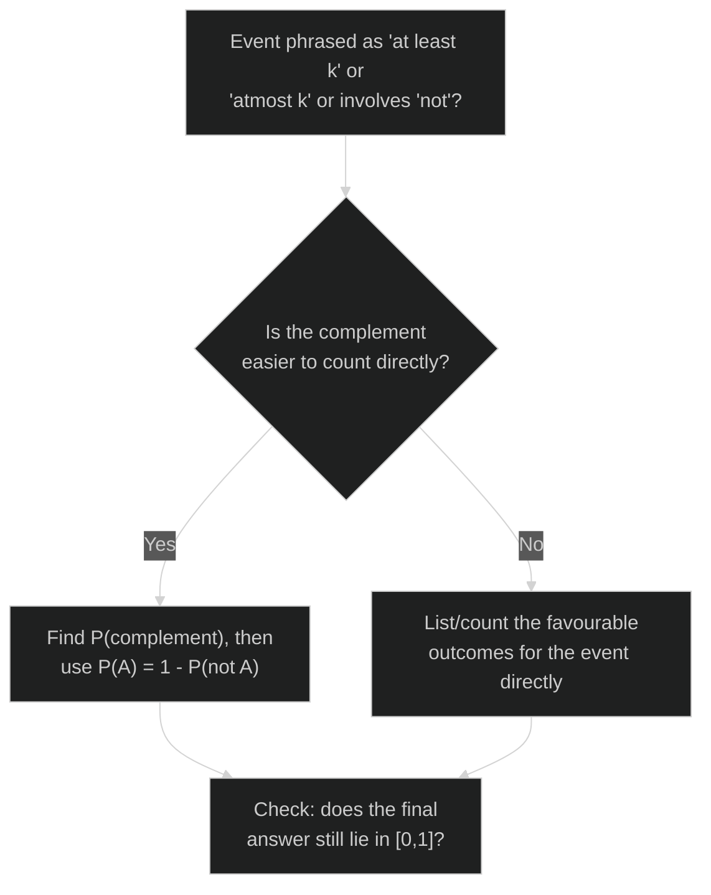

# REVISION MINDMAP — Probability (NCERT Class 11, Chapter 14)

> Visual map of how the chapter's ideas connect, plus decision flowcharts for the problem types you'll actually meet. Pair this with `NOTES-Probability.md` for the reasoning behind each box, and `GLOSSARY-Probability.md` for the formula sheet.

## Concept Roadmap

**Reading the map:** Everything downstream of the three axioms is a *derived consequence*, not a separate rule to memorize. Notice how "mutually exclusive" feeds into three different downstream results (mutually-exclusive-and-exhaustive, the addition theorem's special case, and the complement rule) — recognizing mutual exclusivity early in a problem is the single most useful diagnostic step in this chapter.

---

## Problem-Solving Strategy

### 1. Computing P(A or B) — which formula applies?

### 2. Assigning / computing a probability from scratch

### 3. Classifying a set of events (mutually exclusive? exhaustive?)

### 4. "At least" / "at most" / complement word problems

> **Tip:** "At least 3 Kings," "atleast one tail," "not an ace" are all textbook signals to try the complement route first — it's very often the shorter calculation (compare NCERT Example 5's "not an ace" and Example 10's "at least 3 Kings" in `NOTES-Probability.md`).
