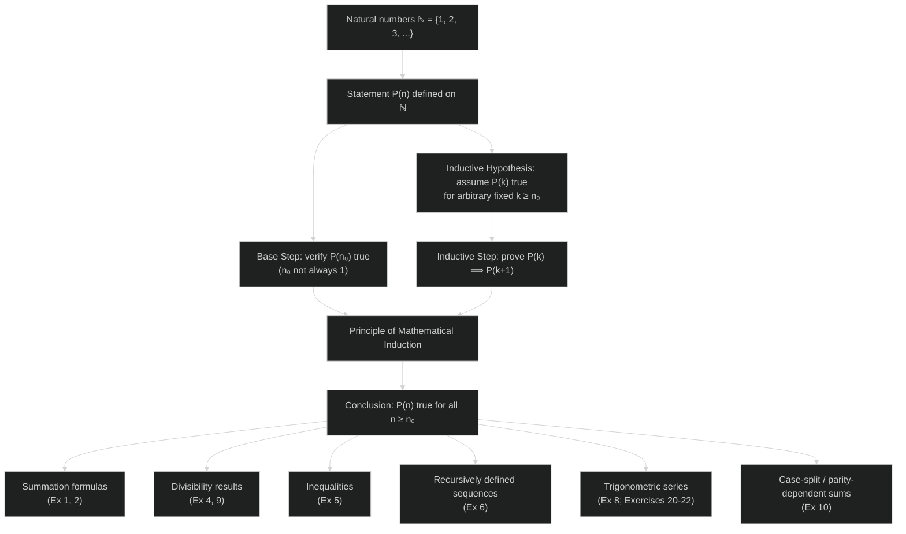
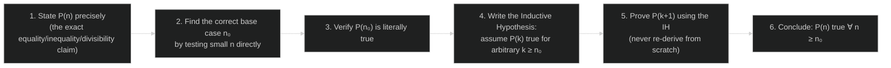
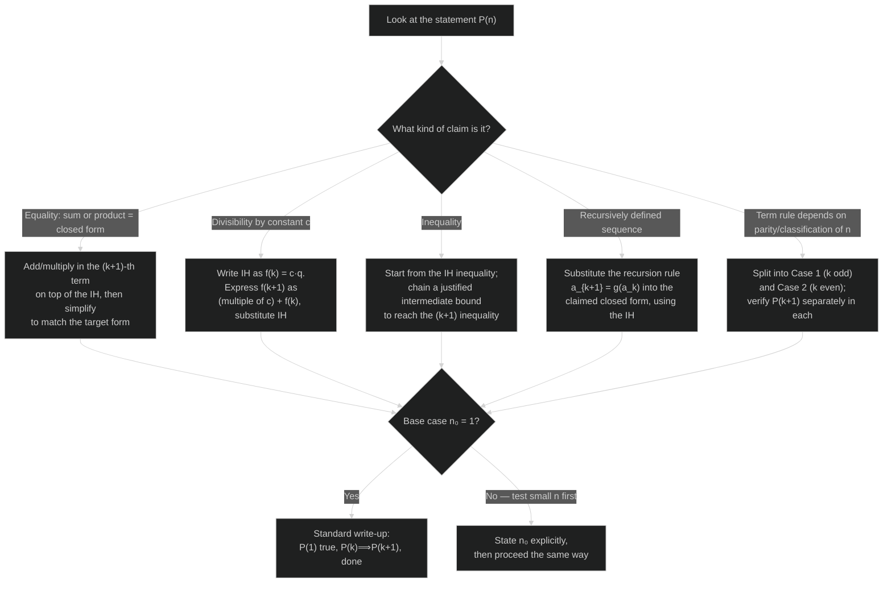

# Principle of Mathematical Induction — Revision Mind Map

> Pairs with **PMI-NOTES** (full derivations) and **PMI-GLOSSARY** (formula sheet). This file is purely visual: a concept roadmap, then the proof-writing and technique-selection flowcharts for exam revision.

## Concept Roadmap

**Reading the map:** everything below the theorem box (F) is an *application category* — the base step and inductive step are always the same two moves; only the algebraic technique used inside the inductive step (adding a term, factoring out a divisor, chaining an inequality, substituting a recursion, or splitting into cases) changes with the category.

---

## Proof-Writing Steps (Every Induction Proof, Every Time)

**Reading the map:** step 2 is the one students skip most often — assuming \(n_0=1\) by default costs marks whenever the statement (like Examples 2, 3, or 5 in the notes) is only meaningful or only true from a later point on.

---

## Which Technique Applies? (Decision Flow)

**Reading the map:** the *type* of statement (left branch) decides which algebraic move opens the inductive step; the base-case check (right side) is independent of that choice and must always be done by direct substitution, never assumed.
