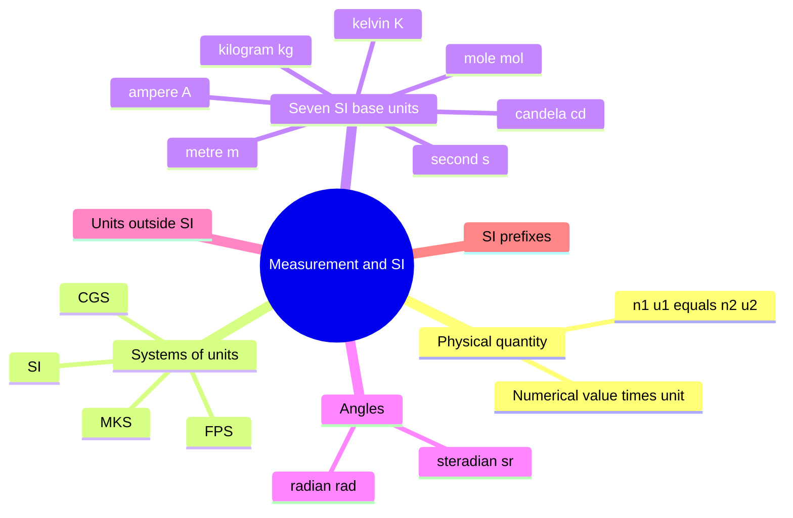
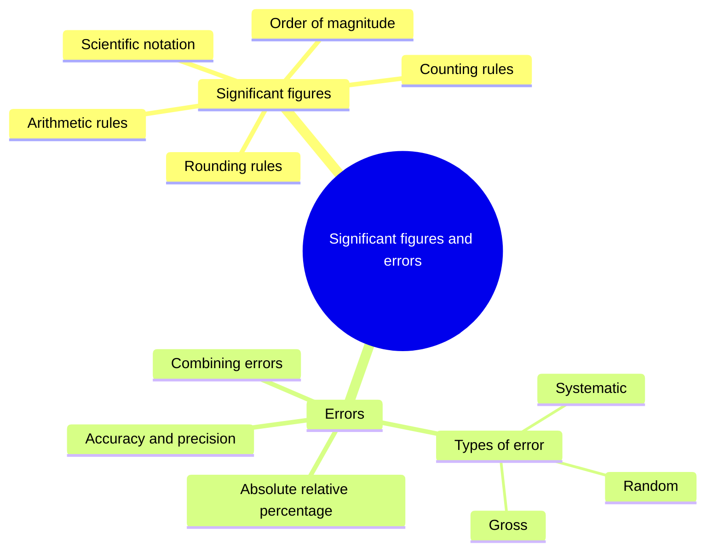
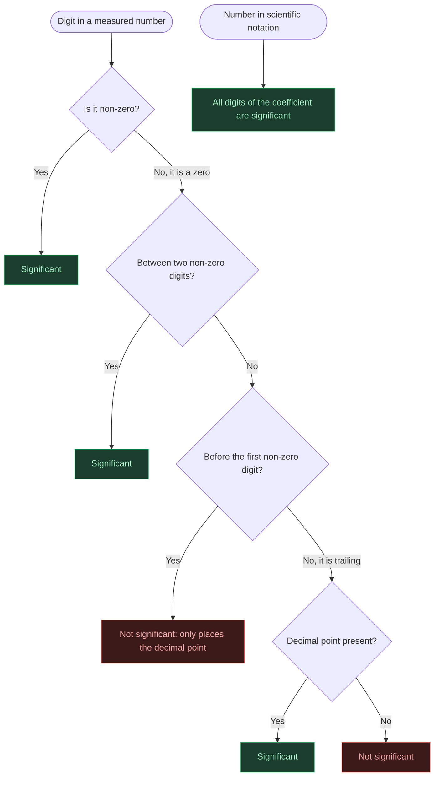
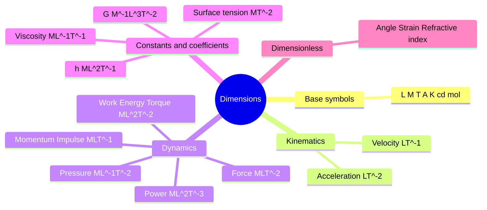
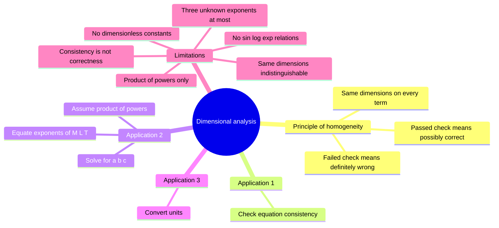

# Physics | Chapter 01 | Units and Measurements | CNOTES
> **Units and Measurements** | Condensed notes · Board · NEET · JEE

---

## SECTION 1 — INTRODUCTION TO MEASUREMENT AND SI UNITS

### 1.1 Why Measurement?

- **Physical quantity** — a measurable property; value = numerical value × unit.
- Example: rod of 5.2 m → numerical value 5.2, unit metre.
- The quantity is independent of the unit chosen; only the number changes.
- $n_1u_1 = n_2u_2$ — larger unit → smaller number (5.2 m = 520 cm).
- $n_1u_1 = n_2u_2$ is the basis of unit conversion *§5.4*.
- Quantities are linked by definitions and laws (speed = distance / time; force = mass × acceleration).
- Only a few independent units are needed.
- **Base (fundamental) quantities** — independent quantities chosen as the foundation; units are **base units**.
- **Derived quantities** — defined from one or more base quantities; units are **derived units**.
- **System of units** — a complete set of base and derived units.

### 1.2 Systems of Units

| System | Length | Mass | Time |
|:---:|:---:|:---:|:---:|
| **CGS** | centimetre | gram | second |
| **FPS** *(British)* | foot | pound | second |
| **MKS** | metre | kilogram | second |

- **SI** — *Système International d'Unités*; grew out of MKS.
- SI adds base units for current, temperature, amount of substance, luminous intensity.
- 1960 — 11th CGPM adopts SI.
- 1971 — 14th CGPM adds the mole (seventh base unit).
- 2018 — 26th CGPM redefines base units through exact constants; in force from 20 May 2019.
- **CGPM** — General Conference on Weights and Measures; decides SI.
- **BIPM** — International Bureau of Weights and Measures, Sèvres, France; maintains standards.
- Trap: NCERT dates SI to 1971; SI dates from 1960; 1971 is when the mole was added. *§1.2*

### 1.3 The Seven SI Base Units ⭐

| Base Quantity | Unit | Symbol | Defined Using |
|:---|:---:|:---:|:---|
| Length | metre | **m** | $c = 299{,}792{,}458 \text{ m s}^{-1}$ |
| Mass | kilogram | **kg** | $h = 6.62607015 \times 10^{-34} \text{ J s}$ |
| Time | second | **s** | Cs-133 hyperfine frequency $= 9{,}192{,}631{,}770 \text{ Hz}$ |
| Electric current | ampere | **A** | $e = 1.602176634 \times 10^{-19} \text{ C}$ |
| Thermodynamic temperature | kelvin | **K** | $k = 1.380649 \times 10^{-23} \text{ J K}^{-1}$ |
| Amount of substance | mole | **mol** | $N_A = 6.02214076 \times 10^{23} \text{ mol}^{-1}$ |
| Luminous intensity | candela | **cd** | $683 \text{ lm W}^{-1}$ at $540 \times 10^{12}$ Hz |

- Every base unit is fixed by an exact constant value.
- Definition order: second → metre (from $c$) → kilogram (from $h$).
- $\text{J s} = \text{kg m}^2\text{s}^{-1}$ already contains metre and second.
- Trap: unit names lowercase (metre, kelvin, ampere, newton). *§1.3*
- Symbols capitalised only if named after a person: **A**, **K**, **N**.
- Lowercase symbols: m, kg, s, mol, cd.
- Exception: **L** (litre) — capital avoids confusion with the digit 1.

### 1.4 Radian and Steradian

| Quantity | Unit | Symbol | Definition |
|:---|:---:|:---:|:---|
| Plane angle | radian | rad | $d\theta = ds / r$ (arc / radius) |
| Solid angle | steradian | sr | $d\Omega = dA / r^2$ (area / radius²) |

- Both are ratios of like quantities (length/length, area/area).
- Both are dimensionless: $[M^0L^0T^0]$.
- Full circle = $2\pi$ rad; half circle = $\pi$ rad ($180° = \pi$ rad).
- Full sphere = $4\pi$ sr.
- NCERT name: **supplementary units**.
- Trap: SI has classed them as dimensionless derived units from 1995 onward. *§1.4*
- Use the NCERT term (supplementary units) in exam answers.

### 1.5 Units Outside SI

| Name | Symbol | SI Equivalent |
|:---|:---:|:---|
| Minute | min | 60 s |
| Hour | h | 3600 s |
| Day | d | 86400 s |
| Year | y | $3.156 \times 10^7$ s |
| Degree | ° | $(\pi/180)$ rad |
| Litre | L | $10^{-3}$ m³ |
| Tonne | t | $10^3$ kg |
| Bar | bar | $10^5$ Pa |
| Barn | b | $10^{-28}$ m² |
| Hectare | ha | $10^4$ m² |
| Standard atmosphere | atm | $1.013 \times 10^5$ Pa |
| Calorie | cal | $4.184$ J (taken as $4.2$ J) |
| Unified atomic mass unit | u | $1.66054 \times 10^{-27}$ kg |

| Length Unit | Symbol | Value |
|:---|:---:|:---|
| Fermi | fm | $10^{-15}$ m |
| Ångström | Å | $10^{-10}$ m |
| Astronomical unit | AU | $1.496 \times 10^{11}$ m |
| Light year | ly | $9.46 \times 10^{15}$ m |
| Parsec | pc | $3.086 \times 10^{16}$ m |

- Barn — unit of nuclear cross-section.
- u = 1/12 the mass of a carbon-12 atom.
- Light year — distance light travels in vacuum in one year.
- AU — mean Earth–Sun distance.
- Parsec — distance subtending 1 arcsecond at a baseline of 1 AU.
- $1 \text{ pc} \approx 3.26 \text{ ly}$.
- Estimation: $1 \text{ year} \approx \pi \times 10^7$ s (within 0.5%).

### 1.6 SI Prefixes ⭐

| Prefix | Symbol | Power | | Prefix | Symbol | Power |
|:---:|:---:|:---:|:---:|:---:|:---:|:---:|
| exa | E | $10^{18}$ | | deci | d | $10^{-1}$ |
| peta | P | $10^{15}$ | | centi | c | $10^{-2}$ |
| tera | T | $10^{12}$ | | milli | m | $10^{-3}$ |
| giga | G | $10^9$ | | micro | μ | $10^{-6}$ |
| mega | M | $10^6$ | | nano | n | $10^{-9}$ |
| kilo | k | $10^3$ | | pico | p | $10^{-12}$ |
| hecto | h | $10^2$ | | femto | f | $10^{-15}$ |
| deka | da | $10^1$ | | atto | a | $10^{-18}$ |

- Prefix is part of the unit symbol; raised to a power with the unit.
- Trap: $1 \text{ km}^2 = 10^6 \text{ m}^2$; $1 \text{ cm}^3 = 10^{-6} \text{ m}^3$. *§1.6*
- No stacked prefixes: nm, not mμm.
- Mass prefixes attach to the gram: mg, not μkg.

---

## SECTION 2 — SIGNIFICANT FIGURES AND ERRORS

### 2.1 What Are Significant Figures?

- **Least count** — smallest value an instrument reads directly.
- **Significant figures (SF)** — all certain digits + the first uncertain digit.
- The uncertain digit is the last digit reported.
- Example: 2.31 cm on a 1 mm rule → 3 SF (2 and 3 certain; 1 estimated).
- Finer least count → more SF can be reported.
- Key principle: a change of unit does not change the SF count.
- $2.308 \text{ cm} = 0.02308 \text{ m} = 23.08 \text{ mm}$ → 4 SF each.

### 2.2 Rules for Counting Significant Figures ⭐

| Rule | Guideline | Example | SF |
|:---:|:---|:---:|:---:|
| 1 | Non-zero digits are significant | 285.3 | 4 |
| 2 | Zeros between non-zero digits are significant | 2005 / 80.04 | 4 / 4 |
| 3 | Leading zeros are not significant | 0.00230 / 0.007 | 3 / 1 |
| 4 | Trailing zeros without a decimal point are not significant | 12300 / 400 | 3 / 1 |
| 5 | Trailing zeros with a decimal point are significant | 3.500 / 0.0600 | 4 / 3 |
| 6 | Exact numbers have unlimited SF | $2$ in $2\pi r$, $n$ in $T = t/n$ | ∞ |

- Leading zeros only locate the decimal point.
- Trap: 4700 m is ambiguous (2 or 4 SF). *§2.2*
- $4.7 \times 10^3$ m → 2 SF.
- $4.700 \times 10^3$ m → 4 SF.

### 2.3 Scientific Notation and Order of Magnitude

- **Scientific notation** — $N \times 10^n$ with $1 \le N < 10$.
- **Order of magnitude** — $n$ if $N \le 5$; $n + 1$ if $N > 5$.

| Quantity | Value | Order of Magnitude |
|:---|:---:|:---:|
| Diameter of Earth | $1.28 \times 10^7$ m | 7 |
| Diameter of H atom | $1.06 \times 10^{-10}$ m | −10 |
| Difference | — | 17 orders |

- Threshold $N = 5$ is the NCERT convention.
- Strict logarithmic rounding would switch at $\sqrt{10} \approx 3.16$. *§2.3*

### 2.4 Arithmetic with Significant Figures ⭐

- Add / subtract → keep decimal places of the term with the fewest.
- Multiply / divide → keep SF of the factor with the fewest.
- In a sum, absolute errors add → decimal places govern.
- In a product, relative errors add → SF count governs.
- Trap: never mix the two rules. *§2.4*
- $436.32 + 227.2 + 0.301 = 663.821 \to 663.8$ g.
- $4.237 \div 2.51 = 1.688\ldots \to 1.69 \text{ g cm}^{-3}$ (3 SF).

### 2.5 Rounding Off ⭐

| Dropped part | Action | Example |
|:---|:---:|:---|
| More than half (> 5, or 5 then non-zero digits) | Raise by 1 | $2.746 \to 2.75$; $2.7451 \to 2.75$ |
| Less than half (< 5) | Unchanged | $1.743 \to 1.74$ |
| Exactly 5, preceding digit even | Unchanged | $2.745 \to 2.74$ |
| Exactly 5, preceding digit odd | Raise by 1 | $2.735 \to 2.74$ |

- Rounding an exact 5 to the even neighbour sends half up and half down.
- Tip: keep one extra digit in intermediate steps; round only the final answer.
- $4.0 \times 10^{-4} - 2.5 \times 10^{-6} = 3.975 \times 10^{-4} \to 4.0 \times 10^{-4}$.
- $3.9 \times 10^{5} - 2.5 \times 10^{4} = 3.65 \times 10^{5} \to 3.6 \times 10^{5}$ (exact 5; preceding 6 even).

### 2.6 Errors and Uncertainty

- **Error** — difference between a measured value and the true value.
- **True value** — actual value; estimated by the mean of many careful readings.

#### 2.6.1 Accuracy and Precision

| | Accuracy | Precision |
|:---|:---|:---|
| Meaning | Closeness to the true value | Closeness of repeated readings to one another |
| Limited by | Systematic (and random) errors | Least count and random scatter |
| Improved by | Calibration, zero correction | Finer instrument, careful technique |

- Readings can be precise yet inaccurate (example: zero error).

#### 2.6.2 Types of Error

| Type | Behaviour | Typical sources | Reduced by |
|:---|:---|:---|:---|
| Systematic | Same direction and size every time | Zero error, calibration, method, parallax, timing habit | Calibration, zero correction; not averaging |
| Random | Unpredictable in sign and size | Fluctuating conditions, small observation variations | Averaging many readings |
| Gross | Isolated blunders | Misreading, wrong recording | Care; repeat and discard |

- Trap: averaging does not reduce systematic error. *§2.6.2*

#### 2.6.3 Absolute, Relative and Percentage Error

- Mean: $\bar{a} = (a_1 + \cdots + a_n)/n$.
- Absolute error of a reading: $\Delta a_i = |a_i - \bar{a}|$.
- Mean absolute error: $\Delta\bar{a} = (\Delta a_1 + \cdots + \Delta a_n)/n$.
- Result reported as $\bar{a} \pm \Delta\bar{a}$.
- Single reading: $\Delta a$ = least count.
- Relative error: $\Delta\bar{a}/\bar{a}$ (dimensionless).
- Percentage error: $(\Delta\bar{a}/\bar{a}) \times 100\%$.
- Trap: relative error has no factor of 100; percentage error does. *§2.6.3*

| Measurement | Absolute | Relative | Percentage |
|:---:|:---:|:---:|:---:|
| 1.02 g | ±0.01 g | ≈ 0.0098 | ≈ 1% |
| 9.89 g | ±0.01 g | ≈ 0.0010 | ≈ 0.1% |

- Same absolute error → smaller percentage error at a larger measured value.

#### 2.6.4 Combining Errors

| Relation | Error rule |
|:---:|:---:|
| $Z = A \pm B$ | $\Delta Z = \Delta A + \Delta B$ |
| $Z = A \times B$ or $A / B$ | $\Delta Z / Z = \Delta A / A + \Delta B / B$ |
| $Z = A^n$ | $\Delta Z / Z = \lvert n \rvert \, \Delta A / A$ |

- Maximum-error (worst-case) estimate.
- Product rule origin: $(1+\alpha)(1+\beta) \approx 1 + \alpha + \beta$; $\alpha\beta$ negligible.
- Difference: absolute errors still add (worst case).
- $l = 16.2 \pm 0.1$ cm, $b = 10.1 \pm 0.1$ cm → relative errors $0.6\% + 1\% = 1.6\%$.
- Area $= 163.62$ cm²; $\Delta A = 2.6$ cm² → $\boxed{164 \pm 3 \text{ cm}^2}$.
- Error quoted to 1 SF; value rounded to the same decimal place.

---

## SECTION 3 — DIMENSIONS OF PHYSICAL QUANTITIES

### 3.1 What Are Dimensions?

- **Dimensions** — the exponents of the base quantities in a physical quantity.
- Written in square brackets $[\ ]$.
- Describe the nature of a quantity; independent of units and size.

| Base Quantity | Symbol |
|:---|:---:|
| Length | $[L]$ |
| Mass | $[M]$ |
| Time | $[T]$ |
| Electric current | $[A]$ |
| Thermodynamic temperature | $[K]$ |
| Luminous intensity | $[cd]$ |
| Amount of substance | $[mol]$ |

- Mechanics needs only $[M]$, $[L]$, $[T]$.

### 3.2 Dimensional Formulae of Common Physical Quantities ⭐

| Quantity | Derivation | Dimensional Formula |
|:---|:---|:---:|
| Velocity / Speed | Length / Time | $[LT^{-1}]$ |
| Acceleration | Velocity / Time | $[LT^{-2}]$ |
| Force | $F = ma$ | $[MLT^{-2}]$ |
| Work / Energy | Force × Length | $[ML^2T^{-2}]$ |
| Power | Work / Time | $[ML^2T^{-3}]$ |
| Momentum | $p = mv$ | $[MLT^{-1}]$ |
| Impulse | Force × Time | $[MLT^{-1}]$ |
| Density | Mass / Volume | $[ML^{-3}]$ |
| Pressure | Force / Area | $[ML^{-1}T^{-2}]$ |
| Torque | Force × Perpendicular arm | $[ML^2T^{-2}]$ |
| Frequency | 1 / Time | $[T^{-1}]$ |
| Angular velocity | Angle / Time | $[T^{-1}]$ |
| Intensity of a wave | Power / Area | $[MT^{-3}]$ |
| Gravitational constant $G$ | $Fr^2 / m_1 m_2$ | $[M^{-1}L^3T^{-2}]$ |
| Planck's constant $h$ | Energy / Frequency | $[ML^2T^{-1}]$ |
| Boltzmann constant $k$ | Energy / Temperature | $[ML^2T^{-2}K^{-1}]$ |
| Surface tension | Force / Length | $[MT^{-2}]$ |
| Coefficient of viscosity | Force / (Area × velocity gradient) | $[ML^{-1}T^{-1}]$ |

- Zero-exponent base quantities are omitted: $[LT^{-1}]$, not $[M^0LT^{-1}]$.
- Full $[M^0L^0T^0]$ is written only for dimensionless quantities.

### 3.3 Dimension Twins ⭐

| Dimensional Formula | Physical Quantities |
|:---:|:---|
| $[MLT^{-1}]$ | Momentum, Impulse |
| $[ML^2T^{-2}]$ | Work, Energy, Torque, Heat |
| $[T^{-1}]$ | Frequency, Angular velocity, Radioactive decay constant |
| $[ML^{-1}T^{-2}]$ | Pressure, Stress, Modulus of elasticity, Energy density |
| $[ML^2T^{-1}]$ | Planck's constant, Angular momentum |
| $[MT^{-2}]$ | Surface tension, Spring constant, Surface energy |
| $[M^0L^0T^0]$ | Angle, Strain, Refractive index |

- Twins share a formula when their defining relations combine base quantities identically.
- Trap: dimensions cannot distinguish quantities in the same row (work vs torque). *§3.3*

### 3.4 Dimensionless Quantities

- Dimensionless → all exponents zero: $[M^0L^0T^0]$.
- Examples: plane angle, refractive index, relative density, strain.
- Pure numbers, ratios and trigonometric values are dimensionless.
- Trap: dimensionless ≠ unitless (angle has a unit; refractive index has none). *§3.4*
- Arguments of $\sin$, $\cos$, $\log$, $\exp$ must be dimensionless.
- Reason: $\sin x = x - x^3/3! + \cdots$ adds powers of $x$.

---

## SECTION 4 — DIMENSIONAL FORMULA AND DIMENSIONAL EQUATION

### 4.1 Dimensional Formula

- **Dimensional formula** — expression of base-quantity powers; format $[M^a L^b T^c A^d K^e \ldots]$.
- Volume: $[L^3]$.
- Speed / Velocity: $[LT^{-1}]$.
- Force: $[MLT^{-2}]$.
- Mass density: $[ML^{-3}]$.

### 4.2 Dimensional Equation

- **Dimensional equation** — equates a quantity to its dimensional formula.
- $[V] = [L^3]$; $[v] = [LT^{-1}]$; $[F] = [MLT^{-2}]$; $[\rho] = [ML^{-3}]$.
- Formula = the bracketed expression; equation = the statement including the quantity.
- Newton = SI unit of force ($\text{kg m s}^{-2}$).
- $[MLT^{-2}]$ = dimensional formula of force in every system of units.

---

## SECTION 5 — DIMENSIONAL ANALYSIS AND ITS APPLICATIONS

### 5.1 Principle of Homogeneity of Dimensions

- Only quantities with identical dimensions can be added, subtracted or equated.
- Valid equation → every term has the same dimensions.
- $v = u + at$: every term $[LT^{-1}]$ ✓.
- $F + m$: dimensions differ → invalid.
- Same dimensions but different units → convert to a common unit first.

### 5.2 Application 1 — Checking Dimensional Consistency ⭐

- Step 1: write the dimensional formula of every term.
- Step 2: compare dimensions of all terms.
- Step 3: different → definitely wrong; identical → possibly correct.
- $\tfrac12 mv^2 = mgh$: both sides $[ML^2T^{-2}]$ → consistent.
- Kinetic-energy candidates (need $[ML^2T^{-2}]$):
  - $m^2v^3$ → $[M^2L^3T^{-3}]$ ✗
  - $\tfrac12 mv^2$ → $[ML^2T^{-2}]$ ✓
  - $ma$ → $[MLT^{-2}]$ ✗
  - $\tfrac{3}{16}mv^2$ → $[ML^2T^{-2}]$ ✓
  - $\tfrac12 mv^2 + ma$ → adds unlike dimensions ✗
- Two candidates pass → dimensions cannot fix numerical factors.
- Trap: $s = 5ut + at^2$ is dimensionally consistent yet wrong; correct form $s = ut + \tfrac12 at^2$. *§5.2*

### 5.3 Application 2 — Deducing Relations ⭐

- Step 1: assume $Q = k\,x^a y^b z^c$; $k$ dimensionless.
- Step 2: write dimensions of both sides.
- Step 3: equate exponents of $[M]$, $[L]$, $[T]$.
- Step 4: solve for $a$, $b$, $c$.
- Three base dimensions → three equations → at most three unknown exponents.
- **Pendulum:** $T = k\,l^x g^y m^z$ → $z = 0$, $x = \tfrac12$, $y = -\tfrac12$.
- $T = k\sqrt{l/g}$; period independent of mass; $k = 2\pi$ by experiment.
- **Oscillating drop:** $\nu = k\,r^a\rho^b S^e$ → $a = -\tfrac32$, $b = -\tfrac12$, $e = \tfrac12$.
- $\nu = k\sqrt{S / (r^3\rho)}$.
- **Capillary tube:** $S = k\,m^a P^b r^e$, $P = h\rho g$, $k = \tfrac12$ supplied → $a = 0$, $b = 1$, $e = 1$.
- $S = \tfrac12 Pr = \tfrac12 rh\rho g$; mass drops out.
- **Centripetal force (speed):** $F = k\,m^a v^b r^e$ → $a = 1$, $b = 2$, $e = -1$ → $F = k\,mv^2/r$.
- **Centripetal force (angular velocity):** $F = k\,r^a\omega^b m^c$ → $a = 1$, $b = 2$, $c = 1$ → $F = k\,m\omega^2 r$.
- The two agree: $mv^2/r = m\omega^2 r$; experiment gives $k = 1$.
- $v$ and $\omega$ are not independent ($v = \omega r$); use one per derivation.
- **Deep-water wave:** $v_w = k\,\lambda^a\rho^b g^e$ → $b = 0$, $e = \tfrac12$, $a = \tfrac12$.
- $v_w = k\sqrt{\lambda g}$; density drops out; full theory gives $k = 1/\sqrt{2\pi}$.

### 5.4 Application 3 — Unit Conversion ⭐

- Origin: $n_1u_1 = n_2u_2$ with $u = M^aL^bT^c$ *§1.1*.
- $n_2 = n_1\,[M_1/M_2]^a\,[L_1/L_2]^b\,[T_1/T_2]^c$.
- $n_1$, $n_2$ — numerical values in the old and new systems.
- $M_1, L_1, T_1$ and $M_2, L_2, T_2$ — sizes of the base units in each system (example: $M_1 = 1$ kg, $M_2 = 1$ g).
- Larger old unit → ratio greater than 1 → larger $n_2$.
- $1 \text{ km h}^{-1} = \tfrac{5}{18} \text{ m s}^{-1} \approx 0.278 \text{ m s}^{-1}$.
- $1 \text{ m s}^{-1} = 3.6 \text{ km h}^{-1}$; $36 \text{ km h}^{-1} = 10 \text{ m s}^{-1}$.
- $1 \text{ J} = 10^7 \text{ erg}$ (energy: $a = 1$, $b = 2$, $c = -2$).

### 5.5 Limitations of Dimensional Analysis

- No dimensionless constants ($\pi$, $\tfrac12$, $2$, …).
- Product-of-powers relations only; sums such as $s = ut + \tfrac12 at^2$ cannot be derived.
- At most three unknown exponents in mechanics.
- No relations involving $\sin$, $\log$, $\exp$.
- Cannot distinguish quantities with the same dimensions (work vs torque).
- Consistency ≠ correctness: fail → definitely wrong; pass → possibly correct.

---

## SECTION 6 — IMPORTANT PHYSICAL CONSTANTS

| Constant | Symbol | Value | Dimensional Formula |
|:---|:---:|:---|:---:|
| Speed of light in vacuum | $c$ | $3.00 \times 10^8 \text{ m s}^{-1}$ | $[LT^{-1}]$ |
| Avogadro's number | $N_A$ | $6.022 \times 10^{23} \text{ mol}^{-1}$ | $[\text{mol}^{-1}]$ |
| Planck's constant | $h$ | $6.626 \times 10^{-34} \text{ J s}$ | $[ML^2T^{-1}]$ |
| Boltzmann constant | $k$ | $1.381 \times 10^{-23} \text{ J K}^{-1}$ | $[ML^2T^{-2}K^{-1}]$ |
| Charge of electron | $e$ | $1.602 \times 10^{-19} \text{ C}$ | $[AT]$ |
| Mass of electron | $m_e$ | $9.109 \times 10^{-31} \text{ kg}$ | $[M]$ |
| Mass of proton | $m_p$ | $1.673 \times 10^{-27} \text{ kg}$ | $[M]$ |
| Universal gravitational constant | $G$ | $6.674 \times 10^{-11} \text{ N m}^2 \text{ kg}^{-2}$ | $[M^{-1}L^3T^{-2}]$ |

- Values rounded for calculation; exact defining values in §1.3.

---

## SECTION 7 — WORKED EXAMPLES: SIGNIFICANT FIGURES AND UNIT CONVERSION

- Conversion method: $n_2 = n_1[M_1/M_2]^a[L_1/L_2]^b[T_1/T_2]^c$ *§5.4*.
- Significant-figure method: multiplication / division → fewest SF *§2.4*.

| Example | Problem | $(a, b, c)$ | Result |
|:---:|:---|:---:|:---|
| 7.1 | Cube, $a = 7.203$ m: $6a^2$ and $a^3$ | — | $311.3$ m²; $373.7$ m³ (4 SF; 6 exact) |
| 7.2 | $5.74$ g ÷ $1.2$ cm³ | — | $4.8 \text{ g cm}^{-3}$ (2 SF) |
| 7.3 | 1 cal ($4.2$ J) in units of $\alpha$ kg, $\beta$ m, $\gamma$ s | $(1, 2, -2)$ | $4.2\,\alpha^{-1}\beta^{-2}\gamma^2$ |
| 7.4 | $13.6 \text{ g cm}^{-3}$ → SI | $(1, -3, 0)$ | $1.36 \times 10^4 \text{ kg m}^{-3}$ |
| 7.5 | $72 \text{ dyne cm}^{-1}$ → SI | $(1, 0, -2)$ | $7.2 \times 10^{-2} \text{ N m}^{-1}$ |
| 7.6 | $500$ W → CGS | $(1, 2, -3)$ | $5 \times 10^9 \text{ erg s}^{-1}$ |
| 7.7 | $G = 6.67 \times 10^{-8}$ (CGS) → SI | $(-1, 3, -2)$ | $6.67 \times 10^{-11}$ |
| 7.8 | Force $36$ in (m, kg, min) → CGS | $(1, 1, -2)$ | $10^3$ dyne |
| 7.9 | $10^6 \text{ dyne cm}^{-2}$ → SI | $(1, -1, -2)$ | $10^5 \text{ N m}^{-2}$ |
| 7.10 | $\sigma = 5.67 \times 10^{-8}$ (SI) → CGS | $(1, 0, -3)$ | $5.67 \times 10^{-5}$ |
| 7.11 | $100$ J in (250 g, 20 cm, 30 s) | $(1, 2, -2)$ | $9 \times 10^6$ |
| 7.12 | Units of force $20$ N, energy $200$ J, velocity $5 \text{ m s}^{-1}$ | — | length $10$ m; time $2$ s; mass $8$ kg |

- 7.10: length ratio drops out ($b = 0$); K is the same in both systems.
- 7.12: length unit = energy unit / force unit.
- 7.12: time unit = length unit / velocity unit.
- 7.12: mass unit = energy unit / (velocity unit)².
- 7.12: force unit rebuilt as $8 \times 10 / 2^2 = 20$ N ✓.

---

## RAPID REFERENCE

| Fact | Value |
|:---|:---|
| Base units (quantity → unit) | length → m; mass → kg; time → s; current → A; temperature → K; amount → mol; luminous intensity → cd |
| Radian / steradian | $d\theta = ds/r$; $d\Omega = dA/r^2$; both dimensionless |
| Full circle / full sphere | $2\pi$ rad / $4\pi$ sr |
| Speed of light (exact) | $299{,}792{,}458 \text{ m s}^{-1}$ |
| Planck constant (exact) | $6.62607015 \times 10^{-34} \text{ J s}$ |
| Cs-133 hyperfine frequency (exact) | $9{,}192{,}631{,}770$ Hz |
| Elementary charge (exact) | $1.602176634 \times 10^{-19}$ C |
| Boltzmann constant (exact) | $1.380649 \times 10^{-23} \text{ J K}^{-1}$ |
| Avogadro constant (exact) | $6.02214076 \times 10^{23} \text{ mol}^{-1}$ |
| Luminous efficacy at $540 \times 10^{12}$ Hz | $683 \text{ lm W}^{-1}$ |
| 1 Å / 1 fm | $10^{-10}$ m / $10^{-15}$ m |
| 1 AU | $1.496 \times 10^{11}$ m |
| 1 light year | $9.46 \times 10^{15}$ m |
| 1 parsec | $3.086 \times 10^{16}$ m $\approx 3.26$ ly |
| 1 year | $3.156 \times 10^7$ s $\approx \pi \times 10^7$ s |
| 1 atm | $1.013 \times 10^5$ Pa |
| 1 calorie | $4.184$ J (taken as $4.2$ J) |
| 1 u | $1.66054 \times 10^{-27}$ kg |
| $1 \text{ km h}^{-1}$ | $\tfrac{5}{18} \text{ m s}^{-1}$ |
| $1 \text{ m s}^{-1}$ | $3.6 \text{ km h}^{-1}$ |
| 1 J | $10^7$ erg |
| 1 W | $10^7 \text{ erg s}^{-1}$ |
| 1 N | $10^5$ dyne |
| $1 \text{ g cm}^{-3}$ | $10^3 \text{ kg m}^{-3}$ |
| $1 \text{ dyne cm}^{-1}$ | $10^{-3} \text{ N m}^{-1}$ |
| $1 \text{ dyne cm}^{-2}$ | $0.1$ Pa |
| $1 \text{ km}^2$ / $1 \text{ cm}^3$ | $10^6 \text{ m}^2$ / $10^{-6} \text{ m}^3$ |
| Unit conversion | $n_2 = n_1[M_1/M_2]^a[L_1/L_2]^b[T_1/T_2]^c$ |
| SF: add / subtract | match decimal places |
| SF: multiply / divide | match SF count |
| Rounding an exact 5 | preceding even → unchanged; preceding odd → raise |
| Order of magnitude | $n$ if $N \le 5$; $n+1$ if $N > 5$ |
| Relative error | $\Delta\bar{a}/\bar{a}$ |
| Percentage error | $(\Delta\bar{a}/\bar{a}) \times 100\%$ |
| Error in $A \pm B$ | $\Delta Z = \Delta A + \Delta B$ |
| Error in $A \times B$ or $A/B$ | $\Delta Z/Z = \Delta A/A + \Delta B/B$ |
| Error in $A^n$ | $\Delta Z/Z = \lvert n \rvert \Delta A/A$ |
| Velocity / Acceleration | $[LT^{-1}]$ / $[LT^{-2}]$ |
| Force | $[MLT^{-2}]$ |
| Work / Energy / Torque / Heat | $[ML^2T^{-2}]$ |
| Power | $[ML^2T^{-3}]$ |
| Momentum / Impulse | $[MLT^{-1}]$ |
| Pressure / Stress / Energy density | $[ML^{-1}T^{-2}]$ |
| Density | $[ML^{-3}]$ |
| Frequency / Angular velocity | $[T^{-1}]$ |
| Intensity of a wave | $[MT^{-3}]$ |
| Surface tension / Spring constant | $[MT^{-2}]$ |
| Viscosity coefficient | $[ML^{-1}T^{-1}]$ |
| Gravitational constant $G$ | $[M^{-1}L^3T^{-2}]$ |
| Planck constant $h$ / Angular momentum | $[ML^2T^{-1}]$ |
| Boltzmann constant $k$ | $[ML^2T^{-2}K^{-1}]$ |
| Pendulum period | $T = k\sqrt{l/g}$ ($k = 2\pi$) |
| Centripetal force | $F = mv^2/r = m\omega^2 r$ |
| Capillary surface tension | $S = \tfrac12 Pr$ ($P = h\rho g$) |
| Deep-water wave speed | $v_w = k\sqrt{\lambda g}$ |
| Oscillating drop frequency | $\nu = k\sqrt{S/(r^3\rho)}$ |
| Limits of dimensional analysis | no constants; product of powers only; ≤ 3 unknown exponents; no $\sin$/$\log$/$\exp$; same-dimension quantities indistinguishable; pass ≠ correct |

---

*End of Rapid Revision — Ch. 1: Units and Measurements*