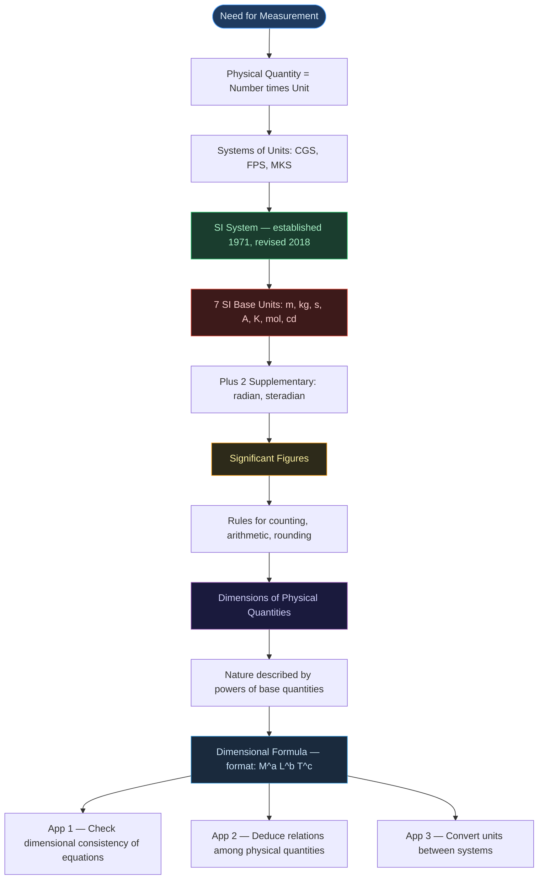
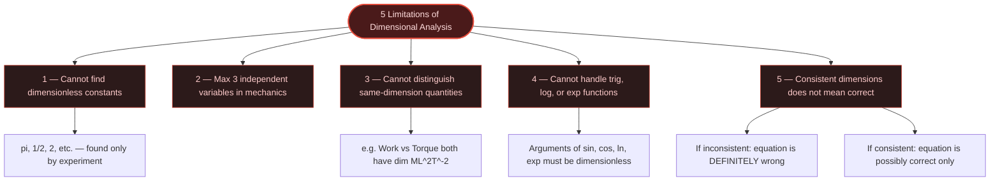

# ⚛️ CHAPTER 1 — UNITS AND MEASUREMENT
> **Complete Study Notes** | Board · NEET · JEE Layered

---

## 🗺️ CONCEPT ROADMAP



---

## SECTION 1 — INTRODUCTION TO MEASUREMENT & SI UNITS

### 1.1 Why Measurement?

> [!info] Definition
> **Physical Quantity** = A quantity that can be measured. Its measurement involves comparison with a chosen reference standard called a **unit**.
> 
> $$\text{Result of Measurement} = \text{Numerical Value} \times \text{Unit}$$

- Example: Length of a rod = 5.2 m → numerical value = 5.2, unit = metre
- Only a **limited number of units** are needed because quantities are interrelated
- **Fundamental (Base) Quantities** → independent units = **Fundamental / Base Units**
- **Derived Quantities** → combinations of base quantities = **Derived Units**
- Complete set (base + derived) = a **System of Units**

---

### 1.2 Historical Systems of Units

| System | Length | Mass | Time |
|:---:|:---:|:---:|:---:|
| **CGS** | centimetre | gram | second |
| **FPS** *(British)* | foot | pound | second |
| **MKS** | metre | kilogram | second |

> [!note] The Modern Standard
> The internationally accepted system is **SI** (*Système Internationale d'Unités*). Developed by **BIPM** (Bureau International des Poids et Mesures), established in **1971** by the 14th CGPM, and comprehensively revised in **November 2018** — all base units now defined using fundamental constants of nature.

---

### 1.3 The Seven SI Base Units ⭐

| Base Physical Quantity        | SI Unit  | Symbol  | Defined Using                                                                    |
| :---------------------------- | :------: | :-----: | :------------------------------------------------------------------------------- |
| **Length**                    |  metre   |  **m**  | Speed of light in vacuum $c = 299{,}792{,}458 \text{ m s}^{-1}$                  |
| **Mass**                      | kilogram | **kg**  | Planck constant $h = 6.62607015 \times 10^{-34} \text{ J·s}$                     |
| **Time**                      |  second  |  **s**  | Caesium-133 hyperfine transition frequency $= 9{,}192{,}631{,}770 \text{ Hz}$    |
| **Electric current**          |  ampere  |  **A**  | Elementary charge $e = 1.602176634 \times 10^{-19} \text{ C}$                    |
| **Thermodynamic temperature** |  kelvin  |  **K**  | Boltzmann constant $k = 1.380649 \times 10^{-23} \text{ J K}^{-1}$               |
| **Amount of substance**       |   mole   | **mol** | Avogadro constant $N_A = 6.02214076 \times 10^{23} \text{ mol}^{-1}$             |
| **Luminous intensity**        | candela  | **cd**  | Luminous efficacy of $540 \times 10^{12}$ Hz radiation $= 683 \text{ lm W}^{-1}$ |

> [!warning] Board Trap — Capitalisation Rules
> Unit **names** are always lowercase (metre, kelvin, ampere). Unit **symbols** are capitalised **only** when named after a person:
> - Named after person → **A** (Ampere), **K** (Kelvin), **N** (Newton)
> - Not named after person → **m** (metre), **kg** (kilogram), **s** (second)

---

### 1.4 Two Supplementary Units (Dimensionless)

| Quantity | Unit | Symbol | Definition |
|:---|:---:|:---:|:---|
| **Plane angle** | radian | rad | $d\theta = \dfrac{\text{arc length } ds}{\text{radius } r}$ |
| **Solid angle** | steradian | sr | $d\Omega = \dfrac{\text{intercepted area } dA}{r^2}$ |

```tikz
\usetikzlibrary{arrows.meta}
\begin{tikzpicture}[>={Stealth[length=7pt,width=5pt]}, thick, scale=1.0]
  \coordinate (O) at (0,0);
  \draw[line width=1.1pt] (O) -- (3.5,0);
  \draw[line width=1.1pt] (O) -- (2.94,1.91);
  \draw[blue!70!black, line width=1.8pt] (3.5,0) arc (0:33:3.5);
  \draw[gray] (0.7,0) arc (0:33:0.7);
  \node[font=\small] at (0.98,0.28) {$d\theta$};
  \node[below, font=\small] at (1.75,-0.1) {$r$};
  \node[font=\small, blue!70!black] at (3.55,1.15) {$ds$};
  \node[left, font=\small] at (O) {$O$};
  \node[below, font=\itshape\small, text=gray] at (1.75,-0.9) {(a) Plane angle: $d\theta = ds/r$};
\end{tikzpicture}
```

```tikz
\usetikzlibrary{arrows.meta}
\begin{tikzpicture}[>={Stealth[length=7pt,width=5pt]}, thick, scale=1.0]
  \coordinate (O) at (0,0);
  \draw[line width=1.1pt] (O) -- (2.55,0.75);
  \draw[line width=1.1pt] (O) -- (3.85,2.45);
  \draw[dashed, gray] (O) -- (3.2,1.6);
  \draw[blue!70!black, line width=1.6pt] (2.55,0.75) to[bend left=16] (3.85,2.45);
  \draw[blue!70!black, line width=1.6pt] (2.55,0.75) to[bend right=10] (3.85,2.45);
  \node[below, font=\small] at (1.5,0.35) {$r$};
  \node[font=\small, blue!70!black] at (3.7,1.9) {$dA$};
  \node[left, font=\small] at (O) {$O$};
  \node[below, font=\itshape\small, text=gray] at (1.9,-0.6) {(b) Solid angle: $d\Omega = dA/r^2$};
\end{tikzpicture}
```

Both figures redraw NCERT's own Fig 1.1(a)/(b): (a) an arc of length $ds$ subtending angle $d\theta$ at radius $r$, and (b) a cone from apex $O$ intercepting area $dA$ on a sphere of radius $r$. Both are **dimensionless** — $[M^0 L^0 T^0]$. Full circle $= 2\pi$ rad; full sphere $= 4\pi$ sr.

---

### 1.5 Some Units Retained for General Use *(Outside SI)*

| Name | Symbol | SI Equivalent |
|:---|:---:|:---|
| Minute | min | 60 s |
| Hour | h | 3600 s |
| Day | d | 86400 s |
| Year | y | $3.156 \times 10^7$ s |
| Degree | ° | $(\pi/180)$ rad |
| Litre | L | $10^{-3}$ m³ |
| Tonne | t | $10^3$ kg |
| Bar | bar | $0.1 \text{ MPa} = 10^5 \text{ Pa}$ |
| Barn | b | $10^{-28}$ m² *(nuclear cross-section)* |
| Hectare | ha | $1 \text{ hm}^2 = 10^4 \text{ m}^2$ |
| Standard atm. pressure | atm | $101325 \text{ Pa} = 1.013 \times 10^5 \text{ Pa}$ |
| Ångström | Å | $10^{-10}$ m |

---

### 1.6 SI Prefixes ⭐

| Prefix | Symbol | Power | | Prefix | Symbol | Power |
|:---:|:---:|:---:|:---:|:---:|:---:|:---:|
| tera | T | $10^{12}$ | | deci | d | $10^{-1}$ |
| giga | G | $10^9$ | | centi | c | $10^{-2}$ |
| mega | M | $10^6$ | | milli | m | $10^{-3}$ |
| kilo | k | $10^3$ | | micro | μ | $10^{-6}$ |
| hecto | h | $10^2$ | | nano | n | $10^{-9}$ |
| deka | da | $10^1$ | | pico | p | $10^{-12}$ |
| — | — | — | | femto | f | $10^{-15}$ |
| — | — | — | | atto | a | $10^{-18}$ |

> [!tip] JEE/NEET — Squared/Cubed Prefix Trap
> Squaring or cubing a unit squares/cubes the prefix factor too:
> $$1 \text{ km}^2 = (10^3 \text{ m})^2 = 10^6 \text{ m}^2 \qquad 1 \text{ cm}^3 = (10^{-2} \text{ m})^3 = 10^{-6} \text{ m}^3$$

---

## SECTION 2 — SIGNIFICANT FIGURES

### 2.1 What are Significant Figures?

> [!info] Definition
> **Significant Figures (SF)** = All digits in a measurement that are **known with certainty PLUS the first uncertain (estimated) digit**.
> 
> They indicate the **precision** of measurement, which depends on the **least count** of the instrument.

> [!important] Key Principle
> A change in **units** does **NOT** change the number of significant figures.
> $$2.308 \text{ cm} = 0.02308 \text{ m} = 23.08 \text{ mm} \longrightarrow \text{ALL have 4 SF}$$

---

### 2.2 Rules for Counting Significant Figures ⭐

| Rule | Guideline | Examples | SF Count |
|:---:|:---|:---:|:---:|
| **1** | All **non-zero digits** are significant | 285.3 | 4 |
| **2** | Zeros **between** two non-zero digits are significant | 2005 / 80.04 | 4 / 4 |
| **3** | **Leading zeros** (before first non-zero digit) are **NOT** significant | 0.00230 / 0.007 | 3 / 1 |
| **4** | Trailing zeros **without decimal point** are **NOT** significant | 12300 / 400 | 3 / 1 |
| **5** | Trailing zeros **with decimal point** ARE significant | 3.500 / 0.0600 | 4 / 3 |
| **6** | Exact numbers & formula constants have **infinite** SF | $2$ in $2\pi r$, $n$ in $T = t/n$ | ∞ |

> [!warning] Trailing Zero Ambiguity → Use Scientific Notation
> $4700$ m (2 SF? or 4 SF?) is ambiguous. In scientific notation:
> - $4.7 \times 10^3$ m → **2 SF** ✅
> - $4.700 \times 10^3$ m → **4 SF** ✅
> 
> *All zeros in the coefficient of scientific notation ARE significant.*

---

### 2.3 Scientific Notation and Order of Magnitude

Every number expressed as $N \times 10^n$ where $1 \leq N < 10$

**Order of Magnitude** = $n$, where:

$$\text{If } N \leq 5 \Rightarrow \text{round to } 1 \quad;\quad \text{If } N > 5 \Rightarrow \text{round to } 10$$

| Quantity | Value | Order of Magnitude |
|:---|:---:|:---:|
| Diameter of Earth | $1.28 \times 10^7$ m | **7** |
| Diameter of H atom | $1.06 \times 10^{-10}$ m | **−10** |
| Difference | — | **17 orders** |

```desmos
{
  "expressions": [
    { "id": "1", "latex": "y=0", "color": "#888888" },
    { "id": "2", "latex": "a=3" },
    { "id": "3", "latex": "(\\log_{10}(a),0.35)", "label": "N = a (drag me)", "color": "#f39c12" },
    { "id": "4", "latex": "x=\\log_{10}(5)", "color": "#e74c3c" },
    { "id": "5", "latex": "(\\log_{10}(1.28)+7,-0.35)", "label": "Earth's diameter, order 10^7", "color": "#2ecc71" },
    { "id": "6", "latex": "(\\log_{10}(1.06)-10,-0.35)", "label": "H atom diameter, order 10^{-10}", "color": "#4a9eff" }
  ],
  "graphSettings": { "xmin": -12, "xmax": 9, "ymin": -1.5, "ymax": 1.5 }
}
```

Drag the slider $a$ (the coefficient $N$ in $N\times10^n$) and watch the orange point cross the red rounding threshold at $a=5$ — everything left of it rounds down to $10^n$, everything right rounds up to $10^{n+1}$. The green and blue points show where Earth's diameter and the hydrogen atom's diameter actually sit on this same log scale: 17 units apart, matching the 17 orders of magnitude above.

---

### 2.4 Rules for Arithmetic Operations with SF ⭐

> [!example] Addition / Subtraction
> **Final result retains as many decimal places as the number with the LEAST decimal places.**
> 
> $$436.32 \text{ g} \;+\; 227.2 \text{ g} \;+\; 0.301 \text{ g} = 663.821 \text{ g} \xrightarrow{\text{round}} \boxed{663.8 \text{ g}}$$
> *(Limited by 227.2 which has only 1 decimal place)*

> [!example] Multiplication / Division
> **Final result retains as many SF as the number with the LEAST significant figures.**
> 
> $$\text{Density} = \frac{4.237 \text{ g}}{2.51 \text{ cm}^3} = 1.68804\ldots \xrightarrow{3 \text{ SF}} \boxed{1.69 \text{ g cm}^{-3}}$$
> *(Limited by 2.51 cm³ which has 3 SF)*

> [!danger] Never Mix the Rules
> Addition/subtraction → decimal places. Multiplication/division → SF count. These rules are NOT interchangeable.

---

### 2.5 Rules for Rounding Off ⭐

| Digit to be Dropped | Action on Preceding Digit | Example |
|:---:|:---:|:---:|
| $> 5$ | Raise by 1 | $2.746 \rightarrow 2.75$ |
| $< 5$ | Leave unchanged | $1.743 \rightarrow 1.74$ |
| $= 5$ (preceding digit is **even**) | Drop (leave unchanged) | $2.745 \rightarrow 2.74$ |
| $= 5$ (preceding digit is **odd**) | Raise by 1 | $2.735 \rightarrow 2.74$ |

> [!tip] JEE Multi-Step Calculations
> Retain **one extra digit** in intermediate steps to avoid cumulative rounding errors. Round only the **final answer**.

---

### 2.6 Relative Error & Uncertainty

For measured quantities $l = 16.2 \pm 0.1$ cm and $b = 10.1 \pm 0.1$ cm:

$$l = 16.2 \text{ cm} \pm 0.6\% \qquad b = 10.1 \text{ cm} \pm 1\%$$

$$\text{Area} = lb = 163.62 \text{ cm}^2 \pm 1.6\% = 163.62 \pm 2.6 \text{ cm}^2 \approx \boxed{164 \pm 3 \text{ cm}^2}$$

**Relative Error** formula:
$$\text{Relative Error} = \frac{\Delta A}{\bar{A}} \times 100\%$$

| Measurement | Absolute Error | Relative Error |
|:---:|:---:|:---:|
| 1.02 g | ±0.01 g | **±1%** |
| 9.89 g | ±0.01 g | **±0.1%** |

```desmos
{
  "expressions": [
    { "id": "1", "latex": "y=\\frac{0.01}{x}\\cdot100", "color": "#4a9eff" },
    { "id": "2", "latex": "(1.02,\\frac{0.01}{1.02}\\cdot100)", "label": "1.02 g \u2192 ~1%", "color": "#e74c3c" },
    { "id": "3", "latex": "(9.89,\\frac{0.01}{9.89}\\cdot100)", "label": "9.89 g \u2192 ~0.1%", "color": "#2ecc71" }
  ],
  "graphSettings": { "xmin": 0.2, "xmax": 12, "ymin": -0.3, "ymax": 3 }
}
```

For a fixed absolute error $\Delta = 0.01$ g, relative error $=(\Delta/x)\times100\%$ falls sharply as the measured value $x$ grows — the same $\pm0.01$ g means $\pm1\%$ at 1.02 g but only $\pm0.1\%$ at 9.89 g. This is exactly the point Section 2.6 makes in words, now visible as a curve.

---

### Additional Practice — Rounding Across Powers of Ten (New) ⭐⭐

> [!example] Subtract $2.5\times10^{-6}$ from $4.0\times10^{-4}$, keeping proper SF
> Align powers of ten first:
> $$4.0\times10^{-4} - 2.5\times10^{-6} = (4.0 - 0.025)\times10^{-4} = 3.975\times10^{-4}$$
> The decimal-place rule for subtraction applies: $4.0\times10^{-4}$ is reliable only to one decimal place in its own power of ten. Rounding $3.975\times10^{-4}$ to that precision (7 rounds the preceding 9 up, carrying):
> $$\boxed{4.0\times10^{-4}}$$

> [!example] Subtract $2.5\times10^{4}$ from $3.9\times10^{5}$, keeping proper SF
> $$3.9\times10^5 - 2.5\times10^4 = (39 - 2.5)\times10^4 = 36.5\times10^4 = 3.65\times10^5$$
> $3.9\times10^5$ is precise only to one decimal place, so $3.65\times10^5$ must round to one decimal place too. The dropped digit is exactly **5**, and the preceding digit **6 is even** — by the round-half-to-even rule (Section 2.5), the 5 is simply dropped:
> $$\boxed{3.6\times10^5}$$

---

## SECTION 3 — DIMENSIONS OF PHYSICAL QUANTITIES

### 3.1 What are Dimensions?

> [!info] Definition
> **Dimensions** = the **powers (exponents)** to which base quantities are raised to represent a physical quantity. Written with **square brackets [ ]**.

| Base Quantity | Dimension Symbol |
|:---|:---:|
| Length | **$[L]$** |
| Mass | **$[M]$** |
| Time | **$[T]$** |
| Electric current | **$[A]$** |
| Thermodynamic temperature | **$[K]$** |
| Luminous intensity | **$[cd]$** |
| Amount of substance | **$[mol]$** |

> [!note] In **mechanics**, all quantities are expressible using only **$[M]$, $[L]$, $[T]$**.

---

### 3.2 Dimensional Formulae of Common Physical Quantities ⭐

| Quantity | Derivation | Dimensional Formula |
|:---|:---|:---:|
| Velocity / Speed | Length / Time | $[M^0 L T^{-1}]$ |
| Acceleration | Velocity / Time | $[M^0 L T^{-2}]$ |
| Force | $F = ma$ | $[M L T^{-2}]$ |
| Work / Energy | Force × Length | $[M L^2 T^{-2}]$ |
| Power | Work / Time | $[M L^2 T^{-3}]$ |
| Momentum | $p = mv$ | $[M L T^{-1}]$ |
| Impulse | Force × Time | $[M L T^{-1}]$ |
| Density | Mass / Volume | $[M L^{-3} T^0]$ |
| Pressure | Force / Area | $[M L^{-1} T^{-2}]$ |
| Torque | Force × Arm | $[M L^2 T^{-2}]$ |
| Frequency | $1/\text{Time}$ | $[M^0 L^0 T^{-1}]$ |
| Angular velocity | Angle / Time | $[M^0 L^0 T^{-1}]$ |
| Gravitational constant G | $Fr^2 / m_1 m_2$ | $[M^{-1} L^3 T^{-2}]$ |
| Planck's constant h | $E / f$ | $[M L^2 T^{-1}]$ |
| Boltzmann constant k | $E / T$ | $[M L^2 T^{-2} K^{-1}]$ |
| Surface tension | Force / Length | $[M T^{-2}]$ |
| Coefficient of viscosity | F / (A × vel. gradient) | $[M L^{-1} T^{-1}]$ |

> [!tip] JEE/NEET Shortcut
> Work, Energy, Torque, and Heat all share the formula $[ML^2T^{-2}]$ but are fundamentally different. Dimensions alone **cannot distinguish** between them.

---

### 3.3 Dimension Twins ⭐ *(Same formula, different quantities — frequently tested)*

| Dimensional Formula | Physical Quantities |
|:---:|:---|
| $[M L T^{-1}]$ | Momentum, Impulse |
| $[M L^2 T^{-2}]$ | Work, Energy, Torque, Heat |
| $[T^{-1}]$ | Frequency, Angular velocity, Radioactive decay constant |
| $[M L^{-1} T^{-2}]$ | Pressure, Stress, Modulus of Elasticity, Energy density |
| $[M L^2 T^{-3}]$ | Power, Intensity of sound |
| $[M^0 L^0 T^0]$ | Angle, Strain, Refractive index *(all dimensionless)* |

---

### 3.4 Dimensionless Quantities

Quantities with $[M^0 L^0 T^0]$:

- Plane angle $(L/L)$
- Refractive index (speed/speed)
- Relative density
- Strain $(\Delta L / L)$
- All pure numbers, ratios, trigonometric values

> [!important] Arguments of special functions — $\sin$, $\cos$, $\log$, $\exp$ — **must always be dimensionless**.

---

## SECTION 4 — DIMENSIONAL FORMULA & DIMENSIONAL EQUATION

### 4.1 Dimensional Formula

Format: $[M^a \; L^b \; T^c \; A^d \; K^e \; \ldots]$

| Physical Quantity | Dimensional Formula |
|:---|:---:|
| Volume | $[M^0 L^3 T^0]$ |
| Speed / Velocity | $[M^0 L T^{-1}]$ |
| Force | $[M L T^{-2}]$ |
| Mass density | $[M L^{-3} T^0]$ |

### 4.2 Dimensional Equation

Equating a physical quantity to its dimensional formula:

$$[V] = [M^0 L^3 T^0]$$
$$[v] = [M^0 L T^{-1}]$$
$$[F] = [M L T^{-2}]$$
$$[\rho] = [M L^{-3} T^0]$$

---

## SECTION 5 — DIMENSIONAL ANALYSIS AND ITS APPLICATIONS

### 5.1 Principle of Homogeneity of Dimensions

> [!important] Principle
> Only physical quantities with **identical dimensions** can be added, subtracted, or equated. An equation is dimensionally valid only if **every term on both sides has the same dimensions**.

$$\underbrace{v}_{\scriptscriptstyle [LT^{-1}]} = \underbrace{u}_{\scriptscriptstyle [LT^{-1}]} + \underbrace{at}_{\scriptscriptstyle [LT^{-2}][T] = [LT^{-1}]} \quad \checkmark$$

$$\underbrace{F}_{\scriptscriptstyle [MLT^{-2}]} + \underbrace{m}_{\scriptscriptstyle [M]} = \; ? \quad \text{INVALID} \; \times$$

---

### 5.2 Application 1 — Checking Dimensional Consistency ⭐

**Steps:**
1. Write dimensional formula for every term
2. Check if ALL terms have identical dimensions
3. Different dimensions → equation is **definitely wrong**

> [!example] NCERT — Checking $\dfrac{1}{2}mv^2 = mgh$
> 
> **LHS:** $\frac{1}{2}mv^2 = [M][LT^{-1}]^2 = [ML^2T^{-2}]$
> 
> **RHS:** $mgh = [M][LT^{-2}][L] = [ML^2T^{-2}]$
> 
> LHS = RHS → **Dimensionally correct** ✅

> [!example] NCERT — Ruling out kinetic energy formulae
> 
> | Formula | Dimensions of RHS | Valid? |
> |:---|:---:|:---:|
> | $K = m^2 v^3$ | $[M^2 L^3 T^{-3}]$ | ❌ |
> | $K = \frac{1}{2}mv^2$ | $[ML^2T^{-2}]$ | ✅ |
> | $K = ma$ | $[MLT^{-2}]$ | ❌ |
> | $K = \frac{3}{16}mv^2$ | $[ML^2T^{-2}]$ | ✅ (can't distinguish from $\frac{1}{2}mv^2$) |
> | $K = \frac{1}{2}mv^2 + ma$ | Two different dimensions added | ❌ |

> [!warning] Critical Limitation
> Dimensional consistency does **NOT** guarantee physical correctness. E.g., $s = 5ut + at^2$ is dimensionally correct but physically wrong (correct is $s = ut + \tfrac{1}{2}at^2$).

---

### 5.3 Application 2 — Deducing Relations ⭐

Assume $Q = k \cdot x^a \cdot y^b \cdot z^c$ where $k$ is a dimensionless constant.

**Steps:** Write dim. formula → equate powers of $[M]$, $[L]$, $[T]$ → solve for $a, b, c$

> [!example] NCERT — Period of a Simple Pendulum
> Assume $T = k \cdot l^x \cdot g^y \cdot m^z$
>
> $$[M^0 L^0 T^1] = [L]^x \cdot [LT^{-2}]^y \cdot [M]^z = M^z \cdot L^{x+y} \cdot T^{-2y}$$
> 
> Equating powers:
> 
> | Dimension | Equation | Solution |
> |:---:|:---:|:---:|
> | $[M]$ | $z = 0$ | $z = 0$ ← **period is mass-independent!** |
> | $[L]$ | $x + y = 0$ | $x = \tfrac{1}{2}$ |
> | $[T]$ | $-2y = 1$ | $y = -\tfrac{1}{2}$ |
> 
> $$\therefore T = k\sqrt{\frac{l}{g}} \quad \Bigl(k = 2\pi \text{ found experimentally}\Bigr)$$

The pendulum is the textbook's own example — dimensional analysis is a general tool, so here are four more physical setups solved the same way.

```tikz
\usetikzlibrary{arrows.meta}
\begin{tikzpicture}[>={Stealth[length=7pt,width=5pt]}, thick, scale=1.0]
  \draw[fill=blue!12] (0,0) circle (1.6);
  \draw[blue!60!black, line width=1.4pt] (0,0) circle (1.6);
  \draw[->, line width=1pt] (0,0) -- (1.13,1.13) node[midway, above, font=\small] {$r$};
  \node[font=\small] at (-0.7,-0.7) {$\rho$};
  \draw[->, red!70!black, line width=1pt] (1.6,0) -- (1.9,0);
  \draw[->, red!70!black, line width=1pt] (-1.6,0) -- (-1.9,0);
  \draw[->, red!70!black, line width=1pt] (0,1.6) -- (0,1.9);
  \draw[->, red!70!black, line width=1pt] (0,-1.6) -- (0,-1.9);
  \draw[green!45!black, line width=1pt] (1.6,0) arc (0:28:1.6);
  \node[font=\small, green!45!black] at (1.75,0.42) {$T$};
  \node[below, font=\itshape\small, text=gray] at (0,-2.4) {Surface tension $T$ restores the breathing-mode oscillation};
\end{tikzpicture}
```

A liquid drop of density $\rho$ and radius $r$, disturbed slightly, oscillates back toward spherical because surface tension $T$ pulls it back — the setup below finds how fast.

> [!example] NCERT-style — Frequency of an Oscillating Liquid Drop (New)
> Assume frequency $\nu \propto r^a \rho^b T^e$:
> $$[M^0L^0T^{-1}] = [L]^a[ML^{-3}]^b[MT^{-2}]^e = [M^{b+e}L^{a-3b}T^{-2e}]$$
> Equating powers: $b+e=0$, $a-3b=0$, $-2e=-1 \Rightarrow e=\tfrac12,\; b=-\tfrac12,\; a=-\tfrac32$
> $$\therefore \nu \propto r^{-3/2}\rho^{-1/2}T^{1/2} \quad\Longrightarrow\quad \boxed{\nu = k\sqrt{\dfrac{T}{r^3\rho}}}$$

```tikz
\usetikzlibrary{arrows.meta}
\begin{tikzpicture}[>={Stealth[length=7pt,width=5pt]}, <={Stealth[length=7pt,width=5pt]}, thick, scale=1.0]
  \draw[fill=blue!8] (-1.2,0) rectangle (5.2,-1.4);
  \draw[line width=1pt] (-1.2,0) -- (5.2,0);
  \draw[line width=1.2pt] (1.6,-1.4) -- (1.6,3.2);
  \draw[line width=1.2pt] (2.4,-1.4) -- (2.4,3.2);
  \draw[fill=blue!15] (1.6,-1.4) rectangle (2.4,2.6);
  \draw[blue!60!black, line width=1.2pt] (1.6,2.6) to[bend right=12] (2.4,2.6);
  \draw[<->, line width=1pt] (1.6,3.0) -- (2.4,3.0) node[midway, above, font=\small] {$2r$};
  \draw[<->, line width=1pt] (0.9,0) -- (0.9,2.6) node[midway, left, font=\small] {$h$};
  \node[font=\small] at (3.6,-0.7) {reservoir};
  \node[below, font=\itshape\small, text=gray] at (2.0,-1.9) {Surface tension pulls the liquid column up to height $h$};
\end{tikzpicture}
```

A narrow tube of radius $r$ dipped in a liquid draws liquid up against gravity — surface tension is doing the lifting.

> [!example] NCERT-style — Surface Tension in a Capillary Tube (New)
> Assume $ST \propto m^a P^b r^e$, where $m$ is the mass of liquid risen and $P$ its pressure (take $k=\tfrac12$, given):
> $$[MT^{-2}] = [M]^a[ML^{-1}T^{-2}]^b[L]^e = [M^{a+b}L^{e-b}T^{-2b}]$$
> Equating powers: $-2b=-2\Rightarrow b=1$; $e-b=0\Rightarrow e=1$; $a+b=1\Rightarrow a=0$
> $$\therefore ST \propto m^0P^1r^1 \quad\Longrightarrow\quad \boxed{ST = \tfrac12 Pr}$$
>
> [!note] The constant $k=\tfrac12$ was *given*, not derived — dimensional analysis alone can never fix a dimensionless constant (Section 5.5, Limitation 1).

```tikz
\usetikzlibrary{arrows.meta}
\begin{tikzpicture}[>={Stealth[length=7pt,width=5pt]}, thick, scale=1.0]
  \draw[gray!50] (0,0) circle (2);
  \fill[black] (0,0) circle (1.5pt);
  \node[below, font=\small] at (0,-0.25) {$O$};
  \coordinate (P) at (2,0);
  \fill[blue!70!black] (P) circle (2.5pt);
  \node[right, font=\small] at (P) {$m$};
  \draw[line width=1pt] (0,0) -- (1.8,0) node[midway, below, font=\small] {$r$};
  \draw[->, red!75!black, line width=1.6pt] (P) -- (0.3,0) node[midway, above, font=\small, red!75!black] {$F$};
  \draw[->, green!50!black, line width=1.6pt] (P) -- (2,1.4) node[above, font=\small, green!50!black] {$v$};
  \draw[blue!60!black] (0.5,0) arc (0:35:0.5);
  \node[font=\small, blue!60!black] at (0.75,0.28) {$\omega$};
  \node[below, font=\itshape\small, text=gray] at (0,-2.5) {$F=mv^2/r=m\omega^2r$ — same law, since $v=\omega r$};
\end{tikzpicture}
```

A mass $m$ moving on a circle of radius $r$ needs a constant inward pull $F$ to keep turning — the handwritten notes derive it two ways, once from speed $v$ and once from angular velocity $\omega$.

> [!example] NCERT-style — Centripetal Force, Two Equivalent Derivations (New)
> **Via speed $v$:** assume $F \propto m^a v^b r^e$.
> $$[MLT^{-2}] = [M]^a[LT^{-1}]^b[L]^e = [M^aL^{b+e}T^{-b}]$$
> $a=1$; $-b=-2\Rightarrow b=2$; $b+e=1\Rightarrow e=-1$
> $$\boxed{F = k\dfrac{mv^2}{r}}$$
>
> **Via angular velocity $\omega$:** assume $F \propto r^a\omega^b m^c$.
> $$[MLT^{-2}] = [L]^a[T^{-1}]^b[M]^c$$
> $c=1$; $a=1$; $b=2$
> $$\boxed{F = k\, m\omega^2 r}$$
>
> Both are the same law: since $v=\omega r$, $mv^2/r = m\omega^2r^2/r = m\omega^2 r$. Experiment fixes $k=1$ either way.

```tikz
\usetikzlibrary{arrows.meta}
\begin{tikzpicture}[>={Stealth[length=7pt,width=5pt]}, <={Stealth[length=7pt,width=5pt]}, thick, scale=1.0]
  \draw[->, line width=1pt] (-0.3,0) -- (7.5,0);
  \draw[blue!70!black, line width=1.6pt, smooth]
       plot coordinates {(0,0) (0.4,0.55) (0.8,0.95) (1.2,1.1) (1.6,0.95) (2.0,0.55)
                          (2.4,0) (2.8,-0.55) (3.2,-0.95) (3.6,-1.1) (4.0,-0.95) (4.4,-0.55)
                          (4.8,0) (5.2,0.55) (5.6,0.95) (6.0,1.1) (6.4,0.95) (6.8,0.55) (7.2,0)};
  \draw[dashed, gray] (1.2,0) -- (1.2,1.1);
  \draw[dashed, gray] (6.0,0) -- (6.0,1.1);
  \draw[<->, line width=1pt] (1.2,1.5) -- (6.0,1.5) node[midway, above, font=\small] {$\lambda$};
  \draw[<->, line width=1pt] (1.2,0) -- (1.2,1.1) node[midway, right, font=\small] {$A$};
  \draw[->, red!70!black, line width=1.4pt] (3.6,-1.6) -- (4.6,-1.6) node[right, font=\small, red!70!black] {$v_w$};
  \node[below, font=\itshape\small, text=gray] at (3.4,-2.1) {Wave speed depends on $\lambda$, $\rho$, and $g$};
\end{tikzpicture}
```

A surface water wave's speed $v_w$ is assumed to depend on its wavelength $\lambda$, the liquid's density $\rho$, and $g$.

> [!example] NCERT-style — Velocity of a Water Wave (New)
> Assume $v_w \propto \lambda^a\rho^b g^e$:
> $$[LT^{-1}] = [L]^a[ML^{-3}]^b[LT^{-2}]^e = [M^bL^{a-3b+e}T^{-2e}]$$
> Equating powers: $b=0$; $-2e=-1\Rightarrow e=\tfrac12$; $a-3b+e=1\Rightarrow a=\tfrac12$
> $$\therefore v_w \propto \lambda^{1/2}\rho^0g^{1/2} \quad\Longrightarrow\quad \boxed{v_w = k\sqrt{\lambda g}}$$
> Density dropped out entirely ($b=0$) — by this simple model, wave speed doesn't depend on what liquid it is, only on $\lambda$ and $g$.

---

### 5.4 Application 3 — Unit Conversion ⭐

$$n_2 = n_1 \times \left[\frac{M_1}{M_2}\right]^a \times \left[\frac{L_1}{L_2}\right]^b \times \left[\frac{T_1}{T_2}\right]^c$$


Every conversion in this section — and the nine drills added to Section 7 — follows this same four-step path. Only the exponents $a,b,c$ and the unit ratios change.

> [!example] Convert 1 km h⁻¹ to m s⁻¹
> $$1 \text{ km h}^{-1} = 1 \times \frac{1000 \text{ m}}{3600 \text{ s}} = \frac{5}{18} \text{ m s}^{-1} \approx 0.278 \text{ m s}^{-1}$$

> [!example] NCERT — 1 calorie in new units (α kg, β m, γ s)
> $[E] = [ML^2T^{-2}]$, so $a=1, b=2, c=-2$:
> $$n_2 = 4.2 \times \frac{1}{\alpha} \times \frac{1}{\beta^2} \times \gamma^2 = 4.2 \; \alpha^{-1} \beta^{-2} \gamma^2$$

---

### 5.5 Limitations of Dimensional Analysis



---

## SECTION 6 — IMPORTANT PHYSICAL CONSTANTS

| Constant | Symbol | Value |
|:---|:---:|:---|
| Speed of light in vacuum | $c$ | $3.00 \times 10^8 \text{ m s}^{-1}$ |
| Avogadro's number | $N_A$ | $6.022 \times 10^{23} \text{ mol}^{-1}$ |
| Planck's constant | $h$ | $6.626 \times 10^{-34} \text{ J s}$ |
| Boltzmann constant | $k$ | $1.381 \times 10^{-23} \text{ J K}^{-1}$ |
| Charge of electron | $e$ | $1.602 \times 10^{-19} \text{ C}$ |
| Mass of electron | $m_e$ | $9.109 \times 10^{-31} \text{ kg}$ |
| Mass of proton | $m_p$ | $1.673 \times 10^{-27} \text{ kg}$ |
| Universal gravitational constant | $G$ | $6.674 \times 10^{-11} \text{ N m}^2 \text{ kg}^{-2}$ |
| 1 Ångström | Å | $10^{-10}$ m |
| 1 fermi / femtometre | fm | $10^{-15}$ m |
| 1 light year | ly | $9.46 \times 10^{15}$ m |

---

## SECTION 7 — WORKED EXAMPLES (NCERT)

> [!example] Example 7.1 — Surface Area and Volume (NCERT 1.1)
> Side of cube = 7.203 m → **4 SF**
> 
> $$\text{Surface area} = 6 \times (7.203)^2 = 311.299\ldots \text{ m}^2 \xrightarrow{4 \text{ SF}} \boxed{311.3 \text{ m}^2}$$
> 
> $$\text{Volume} = (7.203)^3 = 373.714\ldots \text{ m}^3 \xrightarrow{4 \text{ SF}} \boxed{373.7 \text{ m}^3}$$

> [!example] Example 7.2 — Density (NCERT 1.2)
> Mass = 5.74 g (3 SF) | Volume = 1.2 cm³ (2 SF)
> 
> $$\text{Density} = \frac{5.74}{1.2} = 4.783\ldots \text{ g cm}^{-3} \xrightarrow{2 \text{ SF}} \boxed{4.8 \text{ g cm}^{-3}}$$

> [!example] Example 7.3 — Unit Conversion (NCERT 1.3)
> 1 calorie = 4.2 J = 4.2 kg m² s⁻². New system: mass unit = α kg, length = β m, time = γ s.
> 
> $[E] = [M^1 L^2 T^{-2}]$
> 
> $$n_2 = 4.2 \times \left(\frac{1}{\alpha}\right)^1 \times \left(\frac{1}{\beta}\right)^2 \times \left(\frac{1}{\gamma}\right)^{-2} = \boxed{4.2 \; \alpha^{-1} \beta^{-2} \gamma^2}$$

---

### Additional Practice — Unit Conversion Drills (New) ⭐⭐

The handwritten practice set adds nine more conversions — same four-step method (Section 5.4), applied until it's automatic.

> [!example] Example 7.4 — Density into SI (New)
> Convert $13.6$ g cm$^{-3}$ into SI. $[\rho]=[ML^{-3}T^0] \Rightarrow a=1,\,b=-3,\,c=0$
> $$n_2 = 13.6\left[\frac{1\text{ g}}{1\text{ kg}}\right]^1\left[\frac{1\text{ cm}}{1\text{ m}}\right]^{-3} = 13.6\times10^{-3}\times10^{6} = \boxed{1.36\times10^4\text{ kg m}^{-3}}$$

> [!example] Example 7.5 — Surface Tension into SI (New)
> Convert $72$ dyne cm$^{-1}$ into SI. $[F/L]=[MT^{-2}] \Rightarrow a=1,\,b=0,\,c=-2$
> $$n_2 = 72\left[\frac{1\text{ g}}{1\text{ kg}}\right]^1 = 72\times10^{-3} = \boxed{7.2\times10^{-2}\text{ N m}^{-1}}$$

> [!example] Example 7.6 — Power into CGS (New)
> Convert $500$ W into CGS. $[P]=[ML^2T^{-3}] \Rightarrow a=1,\,b=2,\,c=-3$
> $$n_2 = 500\left[\frac{1\text{ kg}}{1\text{ g}}\right]^1\left[\frac{1\text{ m}}{1\text{ cm}}\right]^2 = 500\times10^3\times10^4 = \boxed{5\times10^9\text{ erg s}^{-1}}$$

> [!example] Example 7.7 — Gravitational Constant, CGS to SI (New)
> Convert $G=6.67\times10^{-8}$ dyne cm$^2$ g$^{-2}$ into SI. $[G]=[M^{-1}L^3T^{-2}] \Rightarrow a=-1,\,b=3,\,c=-2$
> $$n_2 = 6.67\times10^{-8}\left[\frac{1\text{ g}}{1\text{ kg}}\right]^{-1}\left[\frac{1\text{ cm}}{1\text{ m}}\right]^{3} = 6.67\times10^{-8}\times10^{3}\times10^{-6} = \boxed{6.67\times10^{-11}\text{ N m}^2\text{ kg}^{-2}}$$
> Matches the value quoted in Table 1.1 — a nice self-check.

> [!example] Example 7.8 — Force in a Custom System, into CGS (New)
> In a system with 1 m, 1 kg, 1 min as fundamental units, a force has magnitude 36. Find its value in CGS. $[F]=[MLT^{-2}] \Rightarrow a=1,\,b=1,\,c=-2$
> $$n_2 = 36\left[\frac{1\text{ kg}}{1\text{ g}}\right]^1\left[\frac{1\text{ m}}{1\text{ cm}}\right]^1\left[\frac{1\text{ min}}{1\text{ s}}\right]^{-2} = 36\times10^3\times10^2\times(60)^{-2} = \boxed{10^3\text{ dyne}}$$

> [!example] Example 7.9 — Pressure into SI (New)
> Convert $10^6$ dyne cm$^{-2}$ into SI. $[P]=[ML^{-1}T^{-2}] \Rightarrow a=1,\,b=-1,\,c=-2$
> $$n_2 = 10^6\left[\frac{1\text{ g}}{1\text{ kg}}\right]^1\left[\frac{1\text{ cm}}{1\text{ m}}\right]^{-1} = 10^6\times10^{-3}\times10^{2} = \boxed{10^5\text{ N m}^{-2}}$$

> [!example] Example 7.10 — Stefan–Boltzmann Constant, SI to CGS (New)
> Convert $\sigma=5.67\times10^{-8}$ J s$^{-1}$ m$^{-2}$ K$^{-4}$ into CGS. $[\sigma]=[MT^{-3}K^{-4}]$ — note $L$ has **zero** net power ($b=0$, since the J's $L^2$ cancels the $\text{m}^{-2}$), so only the mass conversion matters:
> $$n_2 = 5.67\times10^{-8}\left[\frac{1\text{ kg}}{1\text{ g}}\right]^1 = 5.67\times10^{-8}\times10^3 = \boxed{5.67\times10^{-5}\text{ erg s}^{-1}\text{ cm}^{-2}\text{ K}^{-4}}$$

> [!example] Example 7.11 — Energy into a Custom System (New)
> Convert $100$ J into a system with 250 g, 20 cm, half a minute as fundamental units. $[E]=[ML^2T^{-2}] \Rightarrow a=1,\,b=2,\,c=-2$
> $$n_2 = 100\left[\frac{1\text{ kg}}{250\text{ g}}\right]^1\left[\frac{1\text{ m}}{20\text{ cm}}\right]^2\left[\frac{1\text{ s}}{30\text{ s}}\right]^{-2} = 100\times4\times25\times900 = \boxed{9\times10^6 \text{ new units}}$$
> where 1 new unit $=(250\text{ g})(20\text{ cm})^2(30\text{ s})^{-2}$.

> [!example] Example 7.12 — Finding Fundamental Units from Derived Ones (New)
> If Force $=20$ N, Energy $=200$ J, and Velocity $=5$ m s$^{-1}$ define a unit system, find the units of length, mass, and time.
> $$[L] = \frac{[E]}{[F]} = \frac{200\text{ J}}{20\text{ N}} = 10\text{ m} \qquad (\text{since } E = F{\times}d)$$
> $$[T] = \frac{[L]}{[v]} = \frac{10\text{ m}}{5\text{ m s}^{-1}} = 2\text{ s}$$
> $$[M] = \frac{[E]}{[v]^2} = \frac{200\text{ J}}{(5\text{ m s}^{-1})^2} = 8\text{ kg} \qquad (\text{since } E = \tfrac12 mv^2)$$
> $$\boxed{L = 10\text{ m}, \quad M = 8\text{ kg}, \quad T = 2\text{ s}}$$

---

## QUICK FORMULA REFERENCE

| Topic | Formula / Rule |
|:---|:---|
| SF — Addition/Subtraction | Match **decimal places** of least precise number |
| SF — Multiplication/Division | Match **SF count** of least precise number |
| Rounding (digit = 5) | Round to **even** preceding digit (banker's rounding) |
| Scientific notation | $N \times 10^n$ where $1 \leq N < 10$ |
| Order of magnitude | $n$ (round $N$: $\leq 5 \to 1$, $>5 \to 10$) |
| $[F]$ | $[MLT^{-2}]$ |
| $[E]$ or $[W]$ | $[ML^2T^{-2}]$ |
| $[P]$ | $[ML^2T^{-3}]$ |
| $[\text{Pressure}]$ | $[ML^{-1}T^{-2}]$ |
| $[G]$ | $[M^{-1}L^3T^{-2}]$ |
| $[h]$ | $[ML^2T^{-1}]$ |
| Unit conversion | $n_2 = n_1 \times (u_1/u_2)$ in each dimension |
| Pendulum period | $T \propto \sqrt{l/g}$ |
| Centripetal force | $F = k\,mv^2/r = k\,m\omega^2 r$ |
| Oscillating-drop frequency | $\nu = k\sqrt{T_{\text{surf}}/(r^3\rho)}$ |
| Capillary surface tension | $ST = \tfrac12 Pr$ |
| Water-wave speed | $v_w = k\sqrt{\lambda g}$ |
| Relative error | $\dfrac{\Delta A}{\bar{A}} \times 100\%$ |
| 1 km h⁻¹ | $= \dfrac{5}{18}$ m s⁻¹ $\approx 0.278$ m s⁻¹ |
| 1 m s⁻¹ | $= \dfrac{18}{5} = 3.6$ km h⁻¹ |

---

*End of Core Notes — Ch. 1: Units and Measurement*
*Exam Tags: Board · NEET · JEE Mains · JEE Advanced*