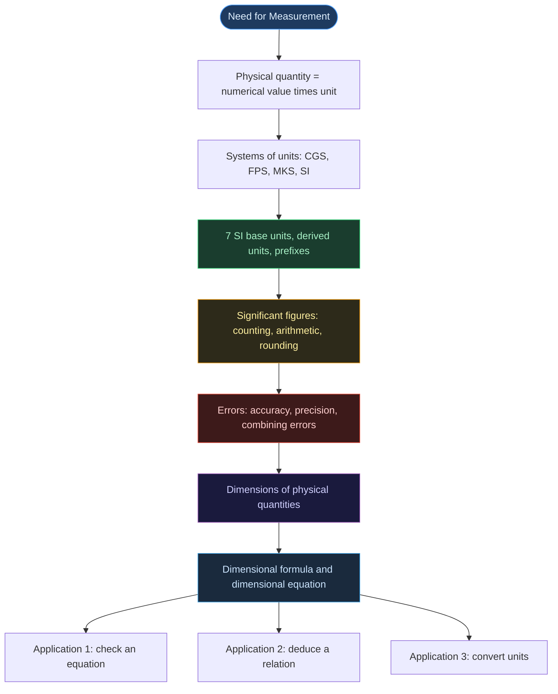

# Physics | Chapter 01 | Units and Measurements | NOTES
> **Complete Study Notes** | Board · NEET · JEE Layered

---

## CHAPTER BRIEF

Every quantitative statement in physics is a number attached to a unit, and every result is only as trustworthy as the measurement and bookkeeping behind it. This chapter builds that bookkeeping: the SI system of units, how uncertain a measurement is and how many digits of a result are worth keeping, and how the dimensions of quantities let you test, derive and convert relations without knowing the detailed physics. Every later chapter relies on these tools to check formulas and to state answers with the right units and precision.

**Prerequisites:** algebra with exponents and ratios; the everyday ideas of length, mass and time.

**Key outcomes** — by the end of this chapter you should be able to:
- State the seven SI base units and rewrite a quantity using SI prefixes.
- Count significant figures, round correctly, and carry the right number of digits through arithmetic.
- Express the error in a measurement and in a quantity calculated from measurements.
- Write the dimensional formula of a quantity and use it to test an equation.
- Deduce a relation among quantities by equating dimensions, and convert a quantity between unit systems.

**Scope note:** error propagation is treated at the maximum-error level (no statistical combination); dimensional analysis is developed for mechanics, where only mass, length and time are needed.

---

## TABLE OF CONTENTS

- **1 — Introduction to Measurement and SI Units**
  - 1.1 Why Measurement?
  - 1.2 Systems of Units
  - 1.3 The Seven SI Base Units ⭐
  - 1.4 Radian and Steradian
  - 1.5 Units Outside SI
  - 1.6 SI Prefixes ⭐
- **2 — Significant Figures and Errors**
  - 2.1 What Are Significant Figures?
  - 2.2 Rules for Counting Significant Figures ⭐
  - 2.3 Scientific Notation and Order of Magnitude
  - 2.4 Arithmetic with Significant Figures ⭐
  - 2.5 Rounding Off ⭐
  - 2.6 Errors and Uncertainty
    - 2.6.1 Accuracy and Precision
    - 2.6.2 Types of Error
    - 2.6.3 Absolute, Relative and Percentage Error
    - 2.6.4 Combining Errors
- **3 — Dimensions of Physical Quantities**
  - 3.1 What Are Dimensions?
  - 3.2 Dimensional Formulae of Common Physical Quantities ⭐
  - 3.3 Dimension Twins ⭐
  - 3.4 Dimensionless Quantities
- **4 — Dimensional Formula and Dimensional Equation**
  - 4.1 Dimensional Formula
  - 4.2 Dimensional Equation
- **5 — Dimensional Analysis and Its Applications**
  - 5.1 Principle of Homogeneity of Dimensions
  - 5.2 Application 1 — Checking Dimensional Consistency ⭐
  - 5.3 Application 2 — Deducing Relations ⭐
  - 5.4 Application 3 — Unit Conversion ⭐
  - 5.5 Limitations of Dimensional Analysis
- **6 — Important Physical Constants**
- **7 — Worked Examples: Significant Figures and Unit Conversion**

---

## CONCEPT ROADMAP



Read the roadmap top to bottom: a measurement needs a unit (Section 1), a measured number carries limited certainty (Section 2), and the nature of a quantity can be expressed independently of units (Sections 3–4), which is what makes the three applications in Section 5 possible.

---

## SECTION 1 — INTRODUCTION TO MEASUREMENT AND SI UNITS

This section sets up the vocabulary the rest of the chapter uses: what a measurement is, which units are chosen as the foundation, and how multiples of a unit are written.

### 1.1 Why Measurement?

Physics deals in quantities that can be measured, and a measurement is always a comparison with an agreed reference. The reference is the **unit**, and the comparison produces a number.

> [!info] Definition
> **Physical quantity** — a property that can be measured. Its measurement compares it with a chosen reference standard, the **unit**:
>
> $$\text{Physical quantity} = \text{Numerical value} \times \text{Unit}$$

For example, a rod of length 5.2 m has numerical value 5.2 and unit metre.

The quantity itself does not depend on the unit chosen; only the number does. The same rod is 520 cm, so a larger unit gives a smaller number:

$$n_1 u_1 = n_2 u_2$$

This one relation is the whole basis of unit conversion in §5.4.

Physical quantities are linked by definitions and laws (speed is distance over time; force is mass times acceleration), so an independent unit for every quantity is unnecessary. It is enough to choose a few quantities as independent and build all others from them.

- **Base (fundamental) quantities** — the independent quantities chosen as the foundation; their units are **base units**.
- **Derived quantities** — quantities defined from one or more base quantities; their units are **derived units**.
- **System of units** — a complete set of base and derived units.

---

### 1.2 Systems of Units

Different regions and eras chose different base units, so a system of units is identified by the length, mass and time units it uses.

| System | Length | Mass | Time |
|:---:|:---:|:---:|:---:|
| **CGS** | centimetre | gram | second |
| **FPS** *(British)* | foot | pound | second |
| **MKS** | metre | kilogram | second |

The internationally accepted system is **SI** (*Système International d'Unités*). It grew out of MKS by adding base units for electric current, temperature, amount of substance and luminous intensity.

- **1960** — the 11th CGPM adopts SI.
- **1971** — the 14th CGPM completes the set of seven base units by adding the mole.
- **2018** — the 26th CGPM redefines the base units through exact values of fundamental constants (in force from 20 May 2019).
- **CGPM** (General Conference on Weights and Measures) decides SI; **BIPM** (International Bureau of Weights and Measures, Sèvres, France) maintains the standards.

> [!note] Source discrepancy
> NCERT dates the SI to 1971. The 1971 meeting is when the seventh base unit (mole) was added; the system itself dates from 1960. Quote 1971 only if the question follows NCERT wording.

---

### 1.3 The Seven SI Base Units ⭐

Each base unit is now fixed by assigning an exact value to a constant of nature, so it can be reproduced anywhere without a physical artefact.

| Base Physical Quantity        | SI Unit  | Symbol  | Defined Using                                                                    |
| :---------------------------- | :------: | :-----: | :------------------------------------------------------------------------------- |
| **Length**                    |  metre   |  **m**  | Speed of light in vacuum $c = 299{,}792{,}458 \text{ m s}^{-1}$                  |
| **Mass**                      | kilogram | **kg**  | Planck constant $h = 6.62607015 \times 10^{-34} \text{ J s}$                     |
| **Time**                      |  second  |  **s**  | Caesium-133 hyperfine transition frequency $= 9{,}192{,}631{,}770 \text{ Hz}$    |
| **Electric current**          |  ampere  |  **A**  | Elementary charge $e = 1.602176634 \times 10^{-19} \text{ C}$                    |
| **Thermodynamic temperature** |  kelvin  |  **K**  | Boltzmann constant $k = 1.380649 \times 10^{-23} \text{ J K}^{-1}$               |
| **Amount of substance**       |   mole   | **mol** | Avogadro constant $N_A = 6.02214076 \times 10^{23} \text{ mol}^{-1}$             |
| **Luminous intensity**        | candela  | **cd**  | Luminous efficacy of $540 \times 10^{12}$ Hz radiation $= 683 \text{ lm W}^{-1}$ |

The definitions build on one another: the second is fixed first, then the metre follows from $c$, then the kilogram follows from $h$ (because $\text{J s} = \text{kg m}^2 \text{s}^{-1}$ already contains metre and second).

> [!warning] Board Trap — Capitalisation
> Unit **names** are written in lowercase (metre, kelvin, ampere, newton). Unit **symbols** are capitalised only when the unit is named after a person:
> - Named after a person → **A** (Ampère), **K** (Kelvin), **N** (Newton)
> - Not named after a person → **m** (metre), **kg** (kilogram), **s** (second), **mol**, **cd**
>
> The one exception is **L** for litre, capitalised to avoid confusion with the digit 1.

---

### 1.4 Radian and Steradian

An angle is measured as a ratio of two lengths, so its value has no dimensions; the radian and steradian are the named units that say *which* ratio is meant.

| Quantity | Unit | Symbol | Definition |
|:---|:---:|:---:|:---|
| **Plane angle** | radian | rad | $d\theta = \dfrac{\text{arc length } ds}{\text{radius } r}$ |
| **Solid angle** | steradian | sr | $d\Omega = \dfrac{\text{intercepted area } dA}{r^2}$ |

```tikz
\usetikzlibrary{arrows.meta}
\begin{tikzpicture}[>={Stealth[length=7pt,width=5pt]}, thick, scale=1.0]
  \coordinate (O) at (0,0);
  \draw[line width=1.1pt] (O) -- (3.5,0);
  \draw[line width=1.1pt] (O) -- (2.94,1.91);
  \draw[blue!70!black, line width=1.8pt] (3.5,0) arc (0:33:3.5);
  \draw[gray] (0.7,0) arc (0:33:0.7);
  \node[font=\small] at (0.98,0.28) {$d\theta$};
  \node[below, font=\small] at (1.75,-0.1) {$r$};
  \node[font=\small, blue!70!black] at (3.55,1.15) {$ds$};
  \node[left, font=\small] at (O) {$O$};
  \node[below, font=\itshape\small, text=gray] at (1.75,-0.9) {(a) Plane angle: $d\theta = ds/r$};
\end{tikzpicture}
```

```tikz
\usetikzlibrary{arrows.meta}
\begin{tikzpicture}[>={Stealth[length=7pt,width=5pt]}, thick, scale=1.0]
  \coordinate (O) at (0,0);
  \draw[line width=1.1pt] (O) -- (2.55,0.75);
  \draw[line width=1.1pt] (O) -- (3.85,2.45);
  \draw[dashed, gray] (O) -- (3.2,1.6);
  \draw[blue!70!black, line width=1.6pt] (2.55,0.75) to[bend left=16] (3.85,2.45);
  \draw[blue!70!black, line width=1.6pt] (2.55,0.75) to[bend right=10] (3.85,2.45);
  \node[below, font=\small] at (1.5,0.35) {$r$};
  \node[font=\small, blue!70!black] at (3.7,1.9) {$dA$};
  \node[left, font=\small] at (O) {$O$};
  \node[below, font=\itshape\small, text=gray] at (1.9,-0.6) {(b) Solid angle: $d\Omega = dA/r^2$};
\end{tikzpicture}
```

Figure (a) shows an arc $ds$ subtending angle $d\theta$ at the centre of a circle of radius $r$; figure (b) shows a cone from apex $O$ intercepting area $dA$ on a sphere of radius $r$. Both are ratios of like quantities (length/length, area/area), so both are **dimensionless**, $[M^0L^0T^0]$.

- Full circle $= 2\pi$ rad; full sphere $= 4\pi$ sr.
- Half-circle $= \pi$ rad, which is why $180° = \pi$ rad.

> [!note] Terminology
> NCERT calls the radian and steradian the two **supplementary units** of SI. Since 1995 the SI itself lists them as dimensionless *derived* units. Both descriptions agree that they are dimensionless; use the NCERT term in board and entrance answers.

---

### 1.5 Units Outside SI

Some units are not part of SI but remain in everyday and scientific use because they suit particular scales.

| Name | Symbol | SI Equivalent |
|:---|:---:|:---|
| Minute | min | 60 s |
| Hour | h | 3600 s |
| Day | d | 86400 s |
| Year | y | $3.156 \times 10^7$ s |
| Degree | ° | $(\pi/180)$ rad |
| Litre | L | $10^{-3}$ m³ |
| Tonne | t | $10^3$ kg |
| Bar | bar | $0.1 \text{ MPa} = 10^5 \text{ Pa}$ |
| Barn *(nuclear cross-section)* | b | $10^{-28}$ m² |
| Hectare | ha | $1 \text{ hm}^2 = 10^4 \text{ m}^2$ |
| Standard atmosphere | atm | $101325 \text{ Pa} = 1.013 \times 10^5 \text{ Pa}$ |
| Calorie | cal | $4.184$ J *(taken as $4.2$ J in calculations)* |
| Unified atomic mass unit | u | $1.66054 \times 10^{-27}$ kg *(1/12 the mass of a carbon-12 atom)* |

Lengths span an enormous range of scales, and each scale has its own convenient unit:

| Unit | Symbol | Value | Used for |
|:---|:---:|:---|:---|
| Fermi (femtometre) | fm | $10^{-15}$ m | nuclei |
| Ångström | Å | $10^{-10}$ m | atoms and molecules |
| Astronomical unit | AU | $1.496 \times 10^{11}$ m *(mean Earth–Sun distance)* | planetary distances |
| Light year | ly | $9.46 \times 10^{15}$ m *(distance light travels in vacuum in one year)* | stellar distances |
| Parsec | pc | $3.086 \times 10^{16}$ m $\approx 3.26$ ly *(distance at which 1 AU subtends an angle of 1 arcsecond)* | stellar distances |

> [!tip] Estimation
> For quick estimates, $1 \text{ year} \approx \pi \times 10^7$ s (within 0.5% of $3.156 \times 10^7$ s).

---

### 1.6 SI Prefixes ⭐

A prefix multiplies a unit by a power of ten, so one unit name covers every scale without inventing new units.

| Prefix | Symbol | Power | | Prefix | Symbol | Power |
|:---:|:---:|:---:|:---:|:---:|:---:|:---:|
| exa | E | $10^{18}$ | | deci | d | $10^{-1}$ |
| peta | P | $10^{15}$ | | centi | c | $10^{-2}$ |
| tera | T | $10^{12}$ | | milli | m | $10^{-3}$ |
| giga | G | $10^9$ | | micro | μ | $10^{-6}$ |
| mega | M | $10^6$ | | nano | n | $10^{-9}$ |
| kilo | k | $10^3$ | | pico | p | $10^{-12}$ |
| hecto | h | $10^2$ | | femto | f | $10^{-15}$ |
| deka | da | $10^1$ | | atto | a | $10^{-18}$ |

The prefix is part of the unit symbol, so it is raised to a power together with the unit.

> [!tip] JEE/NEET — Squared/Cubed Prefix Trap
> $$1 \text{ km}^2 = (10^3 \text{ m})^2 = 10^6 \text{ m}^2 \qquad 1 \text{ cm}^3 = (10^{-2} \text{ m})^3 = 10^{-6} \text{ m}^3$$

- Two prefixes are never stacked: write nm, not mμm.
- The kilogram is the base unit of mass, so mass prefixes attach to the gram: write mg, not μkg.

---

## SECTION 2 — SIGNIFICANT FIGURES AND ERRORS

A measured number is never exact. This section covers how to write a measurement so that it shows its own reliability (significant figures), and how to state and combine the uncertainty itself (errors).

### 2.1 What Are Significant Figures?

No instrument reads a quantity exactly: the reading is limited by the instrument's **least count**, the smallest value it can read directly. A reported number should show how far it can be trusted, and significant figures are the convention that does this.

> [!info] Definition
> **Significant figures (SF)** — all digits in a measured value that are known with certainty, plus the first uncertain (estimated) digit.

- The uncertain digit is always the last one reported: a reading of 2.31 cm on a rule with 1 mm divisions has 2 and 3 certain, and 1 estimated — 3 SF.
- A finer least count allows more significant figures to be reported.

> [!important] Key Principle
> A change of **units** does **not** change the number of significant figures.
> $$2.308 \text{ cm} = 0.02308 \text{ m} = 23.08 \text{ mm} \longrightarrow \text{all have 4 SF}$$

---

### 2.2 Rules for Counting Significant Figures ⭐

A digit counts if it carries information about the measurement. Zeros that only locate the decimal point carry none, which is why converting cm to m (which adds leading zeros) cannot change the SF count.

| Rule | Guideline | Examples | SF Count |
|:---:|:---|:---:|:---:|
| **1** | All **non-zero digits** are significant | 285.3 | 4 |
| **2** | Zeros **between** two non-zero digits are significant | 2005 / 80.04 | 4 / 4 |
| **3** | **Leading zeros** (before the first non-zero digit) are **not** significant | 0.00230 / 0.007 | 3 / 1 |
| **4** | Trailing zeros **without a decimal point** are **not** significant | 12300 / 400 | 3 / 1 |
| **5** | Trailing zeros **with a decimal point** are significant | 3.500 / 0.0600 | 4 / 3 |
| **6** | Exact numbers and formula constants have **unlimited** SF | $2$ in $2\pi r$, $n$ in $T = t/n$ | ∞ |

> [!warning] Trailing Zero Ambiguity → Use Scientific Notation
> $4700$ m could mean 2 SF or 4 SF. Scientific notation removes the doubt:
> - $4.7 \times 10^3$ m → **2 SF**
> - $4.700 \times 10^3$ m → **4 SF**
>
> All digits in the coefficient of scientific notation are significant.

---

### 2.3 Scientific Notation and Order of Magnitude

Very large and very small numbers are written as a coefficient times a power of ten, which also makes the SF count explicit.

- **Scientific notation:** $N \times 10^n$ with $1 \le N < 10$.
- **Order of magnitude:** the power of ten nearest to the number — it is $n$ if $N \le 5$, and $n + 1$ if $N > 5$.

| Quantity | Value | Order of Magnitude |
|:---|:---:|:---:|
| Diameter of Earth | $1.28 \times 10^7$ m | **7** |
| Diameter of H atom | $1.06 \times 10^{-10}$ m | **−10** |
| Difference | — | **17 orders** |

> [!note] Threshold
> The cut-off $N = 5$ is the NCERT convention. Strict rounding on a logarithmic scale would switch at $\sqrt{10} \approx 3.16$; exam problems use 5.

```desmos
{
  "expressions": [
    { "id": "1", "latex": "y=0", "color": "#888888" },
    { "id": "2", "latex": "a=3" },
    { "id": "3", "latex": "(\\log_{10}(a),0.35)", "label": "N = a (drag me)", "color": "#f39c12" },
    { "id": "4", "latex": "x=\\log_{10}(5)", "color": "#e74c3c" },
    { "id": "5", "latex": "(\\log_{10}(1.28)+7,-0.35)", "label": "Earth's diameter, order 10^7", "color": "#2ecc71" },
    { "id": "6", "latex": "(\\log_{10}(1.06)-10,-0.35)", "label": "H atom diameter, order 10^{-10}", "color": "#4a9eff" }
  ],
  "graphSettings": { "xmin": -12, "xmax": 9, "ymin": -1.5, "ymax": 1.5 }
}
```

Drag the slider $a$ (the coefficient $N$): the orange point moves along the log scale and crosses the red threshold at $a = 5$. Left of the line the order of magnitude is $n$; right of it, $n + 1$. The green and blue points place Earth's diameter and the hydrogen atom's diameter on the same scale, 17 units apart.

---

### 2.4 Arithmetic with Significant Figures ⭐

A result cannot be more certain than the data that produced it. Two rules cover this, and they differ because uncertainty combines differently in sums and products (§2.6.4): in a sum the **absolute** errors add, so the result is only as good, in decimal places, as the least precise term; in a product the **relative** errors add, and the SF count reflects relative precision.

- **Addition / subtraction:** keep as many **decimal places** as the term with the fewest decimal places.
- **Multiplication / division:** keep as many **significant figures** as the factor with the fewest significant figures.

> [!danger] Never Mix the Rules
> Addition/subtraction → decimal places. Multiplication/division → SF count. They are not interchangeable.

> [!example] Example 2.4.1 — Adding masses
> **Given:** $436.32$ g, $227.2$ g, $0.301$ g.
> **Find:** the total mass, with correct precision.
> **Concept:** Addition → match decimal places of the least precise term ($227.2$ has one).
> **Work:**
> $$436.32 + 227.2 + 0.301 = 663.821 \text{ g} \xrightarrow{\text{1 decimal place}} \boxed{663.8 \text{ g}}$$
> **Check:** the tenths digit of $227.2$ is already uncertain, so digits beyond tenths in the sum cannot be trusted.

> [!example] Example 2.4.2 — Density from mass and volume
> **Given:** mass $4.237$ g (4 SF), volume $2.51$ cm³ (3 SF).
> **Find:** density, with correct precision.
> **Concept:** Division → match the SF count of the least precise value (3 SF).
> **Work:**
> $$\rho = \frac{4.237}{2.51} = 1.68804\ldots \xrightarrow{\text{3 SF}} \boxed{1.69 \text{ g cm}^{-3}}$$
> **Check:** the volume is uncertain by about $1$ part in $251$ ($\approx 0.4\%$), which matches the precision of a 3-SF answer.

---

### 2.5 Rounding Off ⭐

When a result has more digits than are justified, the extra digits are dropped by comparing the dropped part with half a unit in the last kept place.

| Dropped part | Action on preceding digit | Example |
|:---|:---:|:---|
| More than half ($> 5$, or $5$ followed by non-zero digits) | Raise by 1 | $2.746 \rightarrow 2.75$, $\;2.7451 \rightarrow 2.75$ |
| Less than half ($< 5$) | Leave unchanged | $1.743 \rightarrow 1.74$ |
| Exactly $5$, preceding digit **even** | Leave unchanged | $2.745 \rightarrow 2.74$ |
| Exactly $5$, preceding digit **odd** | Raise by 1 | $2.735 \rightarrow 2.74$ |

Rounding a lone 5 to the even neighbour sends half such cases up and half down, so repeated rounding does not push results systematically in one direction.

> [!tip] JEE Multi-Step Calculations
> Keep **one extra digit** in intermediate steps and round only the **final answer**.

> [!example] Example 2.5.1 — Subtracting across different powers of ten
> **Given:** $4.0 \times 10^{-4}$ and $2.5 \times 10^{-6}$.
> **Find:** $4.0 \times 10^{-4} - 2.5 \times 10^{-6}$ with correct precision.
> **Concept:** Subtraction → decimal places, after writing both terms with the same power of ten.
> **Work:**
> $$4.0 \times 10^{-4} - 0.025 \times 10^{-4} = 3.975 \times 10^{-4}$$
> $4.0 \times 10^{-4}$ is known to one decimal place, so round $3.975$ to one decimal place. The dropped part ($0.075$) is more than half a unit in that place, so $3.9$ rises to $4.0$:
> $$\boxed{4.0 \times 10^{-4}}$$
> **Check:** the subtracted term ($0.025 \times 10^{-4}$) is smaller than the uncertainty already present in $4.0 \times 10^{-4}$ (about $0.05 \times 10^{-4}$), so the answer equals the first term.

> [!example] Example 2.5.2 — Rounding an exact 5
> **Given:** $3.9 \times 10^{5}$ and $2.5 \times 10^{4}$.
> **Find:** $3.9 \times 10^{5} - 2.5 \times 10^{4}$ with correct precision.
> **Concept:** Subtraction → decimal places; the dropped digit is exactly 5, so the even-neighbour rule applies.
> **Work:**
> $$3.9 \times 10^5 - 0.25 \times 10^5 = 3.65 \times 10^5$$
> Round to one decimal place: the dropped digit is exactly $5$ and the preceding digit $6$ is even, so it is left unchanged:
> $$\boxed{3.6 \times 10^5}$$
> **Check:** $3.65$ lies exactly halfway between $3.6$ and $3.7$; the even neighbour is $3.6$.

---

### 2.6 Errors and Uncertainty

Because every reading is limited by the instrument and the observer, a measured value differs from the true value. That difference is the **error**. The aim is not to remove error but to state how large it is.

> [!info] Definitions
> **Error** — the difference between a measured value and the true value.
> **True value** — the actual value of a quantity; in practice estimated by the mean of many careful readings.

#### 2.6.1 Accuracy and Precision

These two words describe different things, and a measurement can have one without the other: repeated readings can agree closely with each other and still all sit away from the true value (for example, because of a zero error).

| | Accuracy | Precision |
|:---|:---|:---|
| **Meaning** | Closeness of a measurement to the **true value** | Closeness of repeated measurements to **one another** |
| **Limited by** | Systematic errors (and random errors) | Least count of the instrument and random scatter |
| **Improved by** | Calibration, zero correction | Finer instrument, careful technique |

#### 2.6.2 Types of Error

Errors are grouped by how they behave over repeated readings, because that decides how they can be reduced.

| Type | Behaviour | Typical sources | Reduced by |
|:---|:---|:---|:---|
| **Systematic** | Same direction and size every time | Zero error, poor calibration, approximate method, parallax, consistent early/late timing | Calibration, zero correction, better method — **not** by averaging |
| **Random** | Unpredictable, positive or negative | Fluctuating conditions, small variations in observation | Averaging many readings |
| **Gross** | Isolated blunders | Misreading a scale, recording wrongly | Care; repeat and discard the faulty reading |

#### 2.6.3 Absolute, Relative and Percentage Error

For $n$ readings $a_1, a_2, \ldots, a_n$ of the same quantity:

- **Mean** (best estimate of the true value): $\bar{a} = \dfrac{a_1 + a_2 + \cdots + a_n}{n}$
- **Absolute error of a reading:** $\Delta a_i = |a_i - \bar{a}|$
- **Mean absolute error:** $\Delta \bar{a} = \dfrac{\Delta a_1 + \Delta a_2 + \cdots + \Delta a_n}{n}$, and the result is reported as $\bar{a} \pm \Delta \bar{a}$. For a single reading, $\Delta a$ is taken as the least count of the instrument.
- **Relative error:** $\dfrac{\Delta \bar{a}}{\bar{a}}$ (dimensionless)
- **Percentage error:** $\dfrac{\Delta \bar{a}}{\bar{a}} \times 100\%$

The same absolute error matters less when the measured value is larger, and relative error is what shows this:

| Measurement | Absolute Error | Relative Error | Percentage Error |
|:---:|:---:|:---:|:---:|
| 1.02 g | ±0.01 g | ≈ 0.0098 | **≈ 1%** |
| 9.89 g | ±0.01 g | ≈ 0.0010 | **≈ 0.1%** |

```desmos
{
  "expressions": [
    { "id": "1", "latex": "y=\\frac{0.01}{x}\\cdot100", "color": "#4a9eff" },
    { "id": "2", "latex": "(1.02,\\frac{0.01}{1.02}\\cdot100)", "label": "1.02 g \u2192 ~1%", "color": "#e74c3c" },
    { "id": "3", "latex": "(9.89,\\frac{0.01}{9.89}\\cdot100)", "label": "9.89 g \u2192 ~0.1%", "color": "#2ecc71" }
  ],
  "graphSettings": { "xmin": 0.2, "xmax": 12, "ymin": -0.3, "ymax": 3 }
}
```

For a fixed absolute error $\Delta = 0.01$ g, percentage error $= (\Delta / x) \times 100\%$ falls sharply as the measured value $x$ grows: the same $\pm 0.01$ g is $\pm 1\%$ at 1.02 g and only $\pm 0.1\%$ at 9.89 g.

#### 2.6.4 Combining Errors

A quantity $Z$ calculated from measured quantities $A$ and $B$ inherits their errors. The worst case (maximum error) is used, in which the errors reinforce each other.

| Relation | Error rule |
|:---:|:---:|
| $Z = A + B$ or $Z = A - B$ | $\Delta Z = \Delta A + \Delta B$ |
| $Z = A \times B$ or $Z = A / B$ | $\dfrac{\Delta Z}{Z} = \dfrac{\Delta A}{A} + \dfrac{\Delta B}{B}$ |
| $Z = A^n$ | $\dfrac{\Delta Z}{Z} = |n|\,\dfrac{\Delta A}{A}$ |

The product rule follows directly: writing $\alpha = \Delta A / A$ and $\beta = \Delta B / B$, the largest possible product is $AB(1+\alpha)(1+\beta) \approx AB(1 + \alpha + \beta)$, since $\alpha\beta$ is negligible. For a difference the absolute errors still **add**, because in the worst case one reading is high while the other is low.

> [!example] Example 2.6.1 — Area of a rectangle
> **Given:** $l = 16.2 \pm 0.1$ cm, $b = 10.1 \pm 0.1$ cm.
> **Find:** the area with its error.
> **Concept:** Product → relative errors add.
> **Work:**
> $$\frac{\Delta l}{l} = \frac{0.1}{16.2} \approx 0.6\% \qquad \frac{\Delta b}{b} = \frac{0.1}{10.1} \approx 1\%$$
> $$\text{Area} = lb = 163.62 \text{ cm}^2, \qquad \frac{\Delta A}{A} = 0.6\% + 1\% = 1.6\%$$
> $$\Delta A = 0.016 \times 163.62 \approx 2.6 \text{ cm}^2 \;\Rightarrow\; \boxed{A = 164 \pm 3 \text{ cm}^2}$$
> **Check:** the error is quoted to 1 SF, and the area is rounded to the same decimal place as its error.

---

## SECTION 3 — DIMENSIONS OF PHYSICAL QUANTITIES

A length is a length whether measured in metres or in feet. Dimensions capture this unit-independent nature of a quantity, and they are the foundation for testing, deriving and converting relations in Section 5.

### 3.1 What Are Dimensions?

> [!info] Definition
> **Dimensions** of a physical quantity — the powers (exponents) to which the base quantities must be raised to represent it. Written inside square brackets $[\ ]$.

| Base Quantity | Dimension Symbol |
|:---|:---:|
| Length | **$[L]$** |
| Mass | **$[M]$** |
| Time | **$[T]$** |
| Electric current | **$[A]$** |
| Thermodynamic temperature | **$[K]$** |
| Luminous intensity | **$[cd]$** |
| Amount of substance | **$[mol]$** |

In **mechanics**, every quantity can be written using only $[M]$, $[L]$ and $[T]$.

---

### 3.2 Dimensional Formulae of Common Physical Quantities ⭐

Each formula comes from substituting dimensions into a defining relation, so none needs to be memorised in isolation: for example, $F = ma$ gives $[M][LT^{-2}] = [MLT^{-2}]$.

A base quantity with exponent zero is left out ($[LT^{-1}]$, not $[M^0LT^{-1}]$); the full $[M^0L^0T^0]$ is written only for dimensionless quantities (§3.4).

| Quantity | Derivation | Dimensional Formula |
|:---|:---|:---:|
| Velocity / Speed | Length / Time | $[LT^{-1}]$ |
| Acceleration | Velocity / Time | $[LT^{-2}]$ |
| Force | $F = ma$ | $[MLT^{-2}]$ |
| Work / Energy | Force × Length | $[ML^2T^{-2}]$ |
| Power | Work / Time | $[ML^2T^{-3}]$ |
| Momentum | $p = mv$ | $[MLT^{-1}]$ |
| Impulse | Force × Time | $[MLT^{-1}]$ |
| Density | Mass / Volume | $[ML^{-3}]$ |
| Pressure | Force / Area | $[ML^{-1}T^{-2}]$ |
| Torque | Force × Perpendicular arm | $[ML^2T^{-2}]$ |
| Frequency | 1 / Time | $[T^{-1}]$ |
| Angular velocity | Angle / Time | $[T^{-1}]$ |
| Intensity of a wave | Power / Area | $[MT^{-3}]$ |
| Gravitational constant $G$ | $Fr^2 / m_1 m_2$ | $[M^{-1}L^3T^{-2}]$ |
| Planck's constant $h$ | Energy / Frequency | $[ML^2T^{-1}]$ |
| Boltzmann constant $k$ | Energy / Temperature | $[ML^2T^{-2}K^{-1}]$ |
| Surface tension | Force / Length | $[MT^{-2}]$ |
| Coefficient of viscosity | Force / (Area × velocity gradient) | $[ML^{-1}T^{-1}]$ |

---

### 3.3 Dimension Twins ⭐

Different quantities can share one dimensional formula, because their defining relations combine the base quantities in the same way (work and torque are both force × length, for instance). This is frequently tested.

| Dimensional Formula | Physical Quantities |
|:---:|:---|
| $[MLT^{-1}]$ | Momentum, Impulse |
| $[ML^2T^{-2}]$ | Work, Energy, Torque, Heat |
| $[T^{-1}]$ | Frequency, Angular velocity, Radioactive decay constant |
| $[ML^{-1}T^{-2}]$ | Pressure, Stress, Modulus of elasticity, Energy density |
| $[ML^2T^{-1}]$ | Planck's constant, Angular momentum |
| $[MT^{-2}]$ | Surface tension, Spring constant, Surface energy |
| $[M^0L^0T^0]$ | Angle, Strain, Refractive index *(all dimensionless)* |

> [!tip] JEE/NEET Shortcut
> Dimensions alone **cannot distinguish** quantities in the same row: work and torque have the same formula and are still different physical quantities.

---

### 3.4 Dimensionless Quantities

A quantity is dimensionless when all its exponents are zero, $[M^0L^0T^0]$. This happens when it is a ratio of like quantities or a pure number.

- Plane angle $(L/L)$
- Refractive index (speed / speed)
- Relative density (density / density)
- Strain $(\Delta L / L)$
- All pure numbers, ratios and trigonometric values

> [!note] Dimensionless is not unitless
> Angle is dimensionless but has units (radian, degree); refractive index and strain are dimensionless and have no unit.

> [!important] Arguments of $\sin$, $\cos$, $\log$, $\exp$ must be dimensionless
> The reason follows from homogeneity (§5.1): $\sin x = x - \dfrac{x^3}{3!} + \cdots$ adds different powers of $x$, which is meaningful only if $x$ has no dimensions.

---

## SECTION 4 — DIMENSIONAL FORMULA AND DIMENSIONAL EQUATION

Two terms are easily confused: the *formula* is the bracketed expression itself, and the *equation* is the statement that a quantity has that formula.

### 4.1 Dimensional Formula

> [!info] Definition
> **Dimensional formula** — the expression showing the powers of the base quantities that make up a physical quantity, in the format $[M^a \; L^b \; T^c \; A^d \; K^e \; \ldots]$.

| Physical Quantity | Dimensional Formula |
|:---|:---:|
| Volume | $[L^3]$ |
| Speed / Velocity | $[LT^{-1}]$ |
| Force | $[MLT^{-2}]$ |
| Mass density | $[ML^{-3}]$ |

---

### 4.2 Dimensional Equation

> [!info] Definition
> **Dimensional equation** — an equation that equates a physical quantity to its dimensional formula.

$$[V] = [L^3] \qquad [v] = [LT^{-1}] \qquad [F] = [MLT^{-2}] \qquad [\rho] = [ML^{-3}]$$

Dimensions describe the *nature* of a quantity and carry no size: the SI unit of force is the newton ($\text{kg m s}^{-2}$), but its dimensional formula is $[MLT^{-2}]$ in every system of units.

---

## SECTION 5 — DIMENSIONAL ANALYSIS AND ITS APPLICATIONS

Because dimensions describe nature independent of units, they can be manipulated like algebraic quantities. **Dimensional analysis** uses this to check equations, derive relations, and convert units.

### 5.1 Principle of Homogeneity of Dimensions

Adding metres to seconds is meaningless: only like quantities can be combined. This common-sense rule is the principle on which every check in this section rests.

> [!important] Principle
> Only physical quantities with **identical dimensions** can be added, subtracted or equated. An equation is dimensionally valid only if **every term on both sides has the same dimensions**.

$$\underbrace{v}_{\scriptscriptstyle [LT^{-1}]} = \underbrace{u}_{\scriptscriptstyle [LT^{-1}]} + \underbrace{at}_{\scriptscriptstyle [LT^{-2}][T] = [LT^{-1}]} \quad \checkmark$$

$$\underbrace{F}_{\scriptscriptstyle [MLT^{-2}]} + \underbrace{m}_{\scriptscriptstyle [M]} = \; ? \quad \text{INVALID} \; \times$$

Terms with the same dimensions but different units (metres and feet) must still be converted to a common unit before adding.

---

### 5.2 Application 1 — Checking Dimensional Consistency ⭐

The test can only reject an equation or leave it as possibly correct; it can never prove one right.

1. Write the dimensional formula of every term.
2. Check that all terms have identical dimensions.
3. Different dimensions → the equation is **definitely wrong**. Identical dimensions → it is **possibly correct**.

> [!example] Example 5.2.1 — Is $\tfrac{1}{2}mv^2 = mgh$ consistent? (NCERT)
> **Given:** the equation $\tfrac{1}{2}mv^2 = mgh$.
> **Find:** whether it is dimensionally consistent.
> **Concept:** Homogeneity — both sides must have equal dimensions.
> **Work:**
> $$\text{LHS: } \tfrac{1}{2}mv^2 = [M][LT^{-1}]^2 = [ML^2T^{-2}]$$
> $$\text{RHS: } mgh = [M][LT^{-2}][L] = [ML^2T^{-2}]$$
> LHS = RHS → **dimensionally consistent**.
> **Check:** both sides are energies, as expected for a statement of energy conservation. (The factor $\tfrac12$ is dimensionless and invisible to the test.)

> [!example] Example 5.2.2 — Ruling out kinetic energy formulae (NCERT)
> **Given:** five candidate expressions for kinetic energy $K$.
> **Find:** which are dimensionally possible.
> **Concept:** $K$ is an energy, so the right-hand side must be $[ML^2T^{-2}]$.
> **Work:**
>
> | Formula | Dimensions of RHS | Possible? |
> |:---|:---:|:---:|
> | $K = m^2 v^3$ | $[M^2 L^3 T^{-3}]$ | ❌ |
> | $K = \frac{1}{2}mv^2$ | $[ML^2T^{-2}]$ | ✅ |
> | $K = ma$ | $[MLT^{-2}]$ | ❌ |
> | $K = \frac{3}{16}mv^2$ | $[ML^2T^{-2}]$ | ✅ |
> | $K = \frac{1}{2}mv^2 + ma$ | two different dimensions added | ❌ |
>
> **Check:** $\frac{1}{2}mv^2$ and $\frac{3}{16}mv^2$ both pass, so dimensions cannot fix a numerical factor (§5.5).

> [!warning] Consistent does not mean correct
> $s = 5ut + at^2$ is dimensionally consistent (both terms have dimension $[L]$) but physically wrong; the correct relation is $s = ut + \tfrac{1}{2}at^2$.

---

### 5.3 Application 2 — Deducing Relations ⭐

If a quantity depends on a few others through a power law, matching dimensions on both sides fixes every exponent. Only a product of powers can be found this way, and three base dimensions give three equations, so at most three unknown exponents can be determined (§5.5).

1. Assume $Q = k \, x^a y^b z^c$, where $x, y, z$ are the quantities $Q$ depends on and $k$ is a dimensionless constant.
2. Write the dimensional formula of both sides.
3. Equate the exponents of $[M]$, $[L]$ and $[T]$.
4. Solve for $a$, $b$, $c$.

> [!example] Example 5.3.1 — Period of a simple pendulum (NCERT)
> **Given:** the period $T$ may depend on the length $l$, the mass $m$ of the bob and $g$.
> **Find:** the relation between them.
> **Concept:** Assume $T = k \, l^x g^y m^z$ and match dimensions.
> **Work:**
> $$[M^0 L^0 T^1] = [L]^x [LT^{-2}]^y [M]^z = [M^z L^{x+y} T^{-2y}]$$
>
> | Dimension | Equation | Solution |
> |:---:|:---:|:---:|
> | $[M]$ | $z = 0$ | $z = 0$ — **period is independent of mass** |
> | $[L]$ | $x + y = 0$ | $x = \tfrac{1}{2}$ |
> | $[T]$ | $-2y = 1$ | $y = -\tfrac{1}{2}$ |
>
> $$\boxed{T = k\sqrt{\frac{l}{g}}}$$
> **Check:** $\sqrt{l/g}$ has dimension $\sqrt{L / LT^{-2}} = [T]$. Experiment gives $k = 2\pi$, which dimensional analysis alone cannot supply.

The next four examples apply the same method to other physical setups.

```tikz
\usetikzlibrary{arrows.meta}
\begin{tikzpicture}[>={Stealth[length=7pt,width=5pt]}, thick, scale=1.0]
  \draw[fill=blue!12] (0,0) circle (1.6);
  \draw[blue!60!black, line width=1.4pt] (0,0) circle (1.6);
  \draw[->, line width=1pt] (0,0) -- (1.13,1.13) node[midway, above, font=\small] {$r$};
  \node[font=\small] at (-0.7,-0.7) {$\rho$};
  \draw[->, red!70!black, line width=1pt] (1.6,0) -- (1.9,0);
  \draw[->, red!70!black, line width=1pt] (-1.6,0) -- (-1.9,0);
  \draw[->, red!70!black, line width=1pt] (0,1.6) -- (0,1.9);
  \draw[->, red!70!black, line width=1pt] (0,-1.6) -- (0,-1.9);
  \draw[green!45!black, line width=1pt] (1.6,0) arc (0:28:1.6);
  \node[font=\small, green!45!black] at (1.75,0.42) {$S$};
  \node[below, font=\itshape\small, text=gray] at (0,-2.4) {Surface tension $S$ pulls a deformed drop back toward a sphere};
\end{tikzpicture}
```

A liquid drop of density $\rho$ and radius $r$, slightly deformed, oscillates because surface tension $S$ pulls it back toward a sphere.

> [!example] Example 5.3.2 — Frequency of an oscillating liquid drop
> **Given:** frequency $\nu$ depends on radius $r$, density $\rho$ and surface tension $S$.
> **Find:** the relation for $\nu$.
> **Concept:** Assume $\nu = k \, r^a \rho^b S^e$; use $[S] = [MT^{-2}]$.
> **Work:**
> $$[T^{-1}] = [L]^a[ML^{-3}]^b[MT^{-2}]^e = [M^{b+e}L^{a-3b}T^{-2e}]$$
> Equating powers: $b + e = 0$, $\; a - 3b = 0$, $\; -2e = -1$, giving $e = \tfrac12,\; b = -\tfrac12,\; a = -\tfrac32$.
> $$\boxed{\nu = k\sqrt{\frac{S}{r^3\rho}}}$$
> **Check:** a stiffer surface (larger $S$) raises $\nu$, while a bigger or denser drop lowers it — the expected trends.

```tikz
\usetikzlibrary{arrows.meta}
\begin{tikzpicture}[>={Stealth[length=7pt,width=5pt]}, <={Stealth[length=7pt,width=5pt]}, thick, scale=1.0]
  \draw[fill=blue!8] (-1.2,0) rectangle (5.2,-1.4);
  \draw[line width=1pt] (-1.2,0) -- (5.2,0);
  \draw[line width=1.2pt] (1.6,-1.4) -- (1.6,3.2);
  \draw[line width=1.2pt] (2.4,-1.4) -- (2.4,3.2);
  \draw[fill=blue!15] (1.6,-1.4) rectangle (2.4,2.6);
  \draw[blue!60!black, line width=1.2pt] (1.6,2.6) to[bend right=12] (2.4,2.6);
  \draw[<->, line width=1pt] (1.6,3.0) -- (2.4,3.0) node[midway, above, font=\small] {$2r$};
  \draw[<->, line width=1pt] (0.9,0) -- (0.9,2.6) node[midway, left, font=\small] {$h$};
  \node[font=\small] at (3.6,-0.7) {reservoir};
  \node[below, font=\itshape\small, text=gray] at (2.0,-1.9) {Surface tension pulls the liquid column up to height $h$};
\end{tikzpicture}
```

A narrow tube of radius $r$ dipped in a liquid draws the liquid up against gravity; surface tension does the lifting.

> [!example] Example 5.3.3 — Surface tension in a capillary tube
> **Given:** surface tension $S$ is assumed to depend on the mass $m$ of liquid risen, the pressure $P$ at the base of the raised column ($P = h\rho g$) and the tube radius $r$; the constant $k = \tfrac12$ is supplied.
> **Find:** the relation for $S$.
> **Concept:** Assume $S = k \, m^a P^b r^e$ and match dimensions; $m$ is included so the result shows whether mass matters.
> **Work:**
> $$[MT^{-2}] = [M]^a[ML^{-1}T^{-2}]^b[L]^e = [M^{a+b}L^{e-b}T^{-2b}]$$
> Equating powers: $-2b = -2 \Rightarrow b = 1$; $\; e - b = 0 \Rightarrow e = 1$; $\; a + b = 1 \Rightarrow a = 0$.
> $$\boxed{S = \tfrac12 P r}$$
> **Check:** with $P = h\rho g$ this is $S = \tfrac12 r h \rho g$, the capillary-rise formula for zero contact angle. $a = 0$ shows mass drops out. The value $k = \tfrac12$ was supplied, since dimensions cannot fix it (§5.5).

```tikz
\usetikzlibrary{arrows.meta}
\begin{tikzpicture}[>={Stealth[length=7pt,width=5pt]}, thick, scale=1.0]
  \draw[gray!50] (0,0) circle (2);
  \fill[black] (0,0) circle (1.5pt);
  \node[below, font=\small] at (0,-0.25) {$O$};
  \coordinate (P) at (2,0);
  \fill[blue!70!black] (P) circle (2.5pt);
  \node[right, font=\small] at (P) {$m$};
  \draw[line width=1pt] (0,0) -- (1.8,0) node[midway, below, font=\small] {$r$};
  \draw[->, red!75!black, line width=1.6pt] (P) -- (0.3,0) node[midway, above, font=\small, red!75!black] {$F$};
  \draw[->, green!50!black, line width=1.6pt] (P) -- (2,1.4) node[above, font=\small, green!50!black] {$v$};
  \draw[blue!60!black] (0.5,0) arc (0:35:0.5);
  \node[font=\small, blue!60!black] at (0.75,0.28) {$\omega$};
  \node[below, font=\itshape\small, text=gray] at (0,-2.5) {$F=mv^2/r=m\omega^2r$ — same law, since $v=\omega r$};
\end{tikzpicture}
```

A mass $m$ moving on a circle of radius $r$ needs a constant inward force $F$ to keep turning. It can be derived from the speed $v$ or from the angular velocity $\omega$.

> [!example] Example 5.3.4 — Centripetal force, two equivalent derivations
> **Given:** $F$ depends on mass $m$, radius $r$, and either speed $v$ or angular velocity $\omega$.
> **Find:** the relation for $F$ in each case.
> **Concept:** $v$ and $\omega$ are not independent ($v = \omega r$), so each derivation uses only one of them.
> **Work:**
> *Via speed:* assume $F = k\, m^a v^b r^e$.
> $$[MLT^{-2}] = [M]^a[LT^{-1}]^b[L]^e = [M^aL^{b+e}T^{-b}]$$
> $a = 1$; $\; -b = -2 \Rightarrow b = 2$; $\; b + e = 1 \Rightarrow e = -1$
> $$\boxed{F = k\,\frac{mv^2}{r}}$$
> *Via angular velocity:* assume $F = k\, r^a \omega^b m^c$.
> $$[MLT^{-2}] = [L]^a[T^{-1}]^b[M]^c \;\Rightarrow\; c = 1,\; a = 1,\; b = 2$$
> $$\boxed{F = k\, m\omega^2 r}$$
> **Check:** the two results agree, since $mv^2/r = m(\omega r)^2/r = m\omega^2 r$. Experiment gives $k = 1$ in both.

```tikz
\usetikzlibrary{arrows.meta}
\begin{tikzpicture}[>={Stealth[length=7pt,width=5pt]}, <={Stealth[length=7pt,width=5pt]}, thick, scale=1.0]
  \draw[->, line width=1pt] (-0.3,0) -- (7.5,0);
  \draw[blue!70!black, line width=1.6pt, smooth]
       plot coordinates {(0,0) (0.4,0.55) (0.8,0.95) (1.2,1.1) (1.6,0.95) (2.0,0.55)
                          (2.4,0) (2.8,-0.55) (3.2,-0.95) (3.6,-1.1) (4.0,-0.95) (4.4,-0.55)
                          (4.8,0) (5.2,0.55) (5.6,0.95) (6.0,1.1) (6.4,0.95) (6.8,0.55) (7.2,0)};
  \draw[dashed, gray] (1.2,0) -- (1.2,1.1);
  \draw[dashed, gray] (6.0,0) -- (6.0,1.1);
  \draw[<->, line width=1pt] (1.2,1.5) -- (6.0,1.5) node[midway, above, font=\small] {$\lambda$};
  \draw[<->, line width=1pt] (1.2,0) -- (1.2,1.1) node[midway, right, font=\small] {$A$};
  \draw[->, red!70!black, line width=1.4pt] (3.6,-1.6) -- (4.6,-1.6) node[right, font=\small, red!70!black] {$v_w$};
  \node[below, font=\itshape\small, text=gray] at (3.4,-2.1) {Wave speed depends on $\lambda$, $\rho$, and $g$};
\end{tikzpicture}
```

The speed $v_w$ of a surface water wave is assumed to depend on its wavelength $\lambda$, the liquid's density $\rho$ and $g$.

> [!example] Example 5.3.5 — Speed of a deep-water wave
> **Given:** $v_w$ depends on $\lambda$, $\rho$ and $g$ (deep-water gravity waves; surface tension and depth are ignored).
> **Find:** the relation for $v_w$.
> **Concept:** Assume $v_w = k\,\lambda^a\rho^b g^e$ and match dimensions.
> **Work:**
> $$[LT^{-1}] = [L]^a[ML^{-3}]^b[LT^{-2}]^e = [M^bL^{a-3b+e}T^{-2e}]$$
> Equating powers: $b = 0$; $\; -2e = -1 \Rightarrow e = \tfrac12$; $\; a - 3b + e = 1 \Rightarrow a = \tfrac12$.
> $$\boxed{v_w = k\sqrt{\lambda g}}$$
> **Check:** $b = 0$ means density drops out: in this model the wave speed does not depend on which liquid it is. The full theory gives $k = 1/\sqrt{2\pi}$, another constant that dimensions cannot supply.

---

### 5.4 Application 3 — Unit Conversion ⭐

Conversion follows from §1.1: a quantity is the same whatever unit is used, so $n_1u_1 = n_2u_2$. A quantity with dimensional formula $[M^aL^bT^c]$ has unit $u = M^aL^bT^c$, where $M$, $L$, $T$ are the sizes of the base units of the system in use. Substituting gives the conversion formula.

$$n_2 = n_1 \times \left[\frac{M_1}{M_2}\right]^a \times \left[\frac{L_1}{L_2}\right]^b \times \left[\frac{T_1}{T_2}\right]^c$$

Here $n_1$ and $n_2$ are the numerical values in the old (1) and new (2) systems, and $M_1, L_1, T_1$ and $M_2, L_2, T_2$ are the sizes of the base units of mass, length and time in each (for example $M_1 = 1$ kg, $M_2 = 1$ g). A larger old unit means more of the new unit, so its ratio is greater than 1.


Every conversion in this chapter follows this path; only the exponents and the unit ratios change.

> [!example] Example 5.4.1 — Convert $1 \text{ km h}^{-1}$ to $\text{m s}^{-1}$
> **Given:** $1 \text{ km h}^{-1}$.
> **Find:** its value in $\text{m s}^{-1}$.
> **Concept:** Velocity $[LT^{-1}]$, so $a = 0$, $b = 1$, $c = -1$.
> **Work:**
> $$1 \text{ km h}^{-1} = 1 \times \frac{1000 \text{ m}}{3600 \text{ s}} = \boxed{\tfrac{5}{18} \text{ m s}^{-1} \approx 0.278 \text{ m s}^{-1}}$$
> **Check:** a car at $36 \text{ km h}^{-1}$ covers $10 \text{ m}$ each second, consistent with $36 \times \tfrac{5}{18} = 10$. The inverse is $1 \text{ m s}^{-1} = \tfrac{18}{5} \text{ km h}^{-1} = 3.6 \text{ km h}^{-1}$.

> [!example] Example 5.4.2 — Convert $1$ joule to erg
> **Given:** $1 \text{ J} = 1 \text{ kg m}^2\text{s}^{-2}$; the CGS system uses g, cm, s.
> **Find:** the value in erg ($\text{g cm}^2\text{s}^{-2}$).
> **Concept:** Energy $[ML^2T^{-2}]$, so $a = 1$, $b = 2$, $c = -2$.
> **Work:**
> $$n_2 = 1\left[\frac{1\text{ kg}}{1\text{ g}}\right]^1\left[\frac{1\text{ m}}{1\text{ cm}}\right]^2\left[\frac{1\text{ s}}{1\text{ s}}\right]^{-2} = 10^3 \times 10^4 = \boxed{10^7 \text{ erg}}$$
> **Check:** matches the standard relation $1 \text{ J} = 10^7 \text{ erg}$.

---

### 5.5 Limitations of Dimensional Analysis

Dimensional analysis is a strong consistency tool, but its reach is narrow, and each limit below has a specific reason.

1. **Cannot find dimensionless constants** ($\pi$, $\tfrac12$, $2$, …) — they carry no dimensions, so no dimensional equation contains them; only experiment or full theory fixes them.
2. **Finds only product-of-powers relations** — a relation made of sums or differences of terms, such as $s = ut + \tfrac12 at^2$, cannot be derived.
3. **At most three unknown exponents in mechanics** — three base dimensions give three equations; with more than three variables the exponents are not uniquely determined.
4. **Cannot derive relations involving $\sin$, $\log$ or $\exp$** — their arguments are dimensionless, so dimensions give no information about them (they can only confirm the argument is dimensionless).
5. **Cannot distinguish quantities with the same dimensions** — work and torque, for example (§3.3).
6. **Consistency is not correctness** — the test only rejects: a failed test means definitely wrong, a passed test means possibly correct (§5.1).

---

## SECTION 6 — IMPORTANT PHYSICAL CONSTANTS

The values below are rounded for calculation; the exact defining values are in §1.3.

| Constant | Symbol | Value | Dimensional Formula |
|:---|:---:|:---|:---:|
| Speed of light in vacuum | $c$ | $3.00 \times 10^8 \text{ m s}^{-1}$ | $[LT^{-1}]$ |
| Avogadro's number | $N_A$ | $6.022 \times 10^{23} \text{ mol}^{-1}$ | $[\text{mol}^{-1}]$ |
| Planck's constant | $h$ | $6.626 \times 10^{-34} \text{ J s}$ | $[ML^2T^{-1}]$ |
| Boltzmann constant | $k$ | $1.381 \times 10^{-23} \text{ J K}^{-1}$ | $[ML^2T^{-2}K^{-1}]$ |
| Charge of electron | $e$ | $1.602 \times 10^{-19} \text{ C}$ | $[AT]$ |
| Mass of electron | $m_e$ | $9.109 \times 10^{-31} \text{ kg}$ | $[M]$ |
| Mass of proton | $m_p$ | $1.673 \times 10^{-27} \text{ kg}$ | $[M]$ |
| Universal gravitational constant | $G$ | $6.674 \times 10^{-11} \text{ N m}^2 \text{ kg}^{-2}$ | $[M^{-1}L^3T^{-2}]$ |

---

## SECTION 7 — WORKED EXAMPLES: SIGNIFICANT FIGURES AND UNIT CONVERSION

These examples apply §2.4 (significant figures) and §5.4 (unit conversion). In every conversion, system 1 is the system the value is given in, and system 2 is the one it is converted to.

> [!example] Example 7.1 — Surface area and volume of a cube (NCERT)
> **Given:** side $a = 7.203$ m (4 SF).
> **Find:** surface area $6a^2$ and volume $a^3$, with correct SF.
> **Concept:** Multiplication → 4 SF; the $6$ and the exponents are exact numbers (§2.2, Rule 6).
> **Work:**
> $$6a^2 = 6(7.203)^2 = 311.299\ldots \to \boxed{311.3 \text{ m}^2} \qquad a^3 = 373.714\ldots \to \boxed{373.7 \text{ m}^3}$$
> **Check:** with $a \approx 7.2$: $6 \times 51.8 \approx 311$ and $7.2^3 \approx 373$.

> [!example] Example 7.2 — Density with unequal SF (NCERT)
> **Given:** mass $= 5.74$ g (3 SF), volume $= 1.2$ cm³ (2 SF).
> **Find:** density, with correct SF.
> **Concept:** Division → the least precise factor (2 SF) sets the answer.
> **Work:**
> $$\rho = \frac{5.74}{1.2} = 4.783\ldots \to \boxed{4.8 \text{ g cm}^{-3}}$$
> **Check:** the volume is uncertain by about $0.05/1.2 \approx 4\%$; quoting $4.78$ would claim far better precision than the volume supports.

> [!example] Example 7.3 — Calorie in a new system of units (NCERT)
> **Given:** $1 \text{ cal} = 4.2 \text{ J} = 4.2 \text{ kg m}^2\text{s}^{-2}$; the new system has units of $\alpha$ kg, $\beta$ m, $\gamma$ s.
> **Find:** the numerical value of 1 cal in the new system.
> **Concept:** Energy $[ML^2T^{-2}]$, so $a = 1$, $b = 2$, $c = -2$.
> **Work:**
> $$n_2 = 4.2\left[\frac{1 \text{ kg}}{\alpha \text{ kg}}\right]^1\left[\frac{1 \text{ m}}{\beta \text{ m}}\right]^2\left[\frac{1 \text{ s}}{\gamma \text{ s}}\right]^{-2} = \boxed{4.2\,\alpha^{-1}\beta^{-2}\gamma^2}$$
> **Check:** the new unit of energy is $\alpha\beta^2\gamma^{-2}$ joules. A larger mass unit ($\alpha$) or length unit ($\beta$) makes it bigger, so fewer are needed; a longer time unit ($\gamma$) makes it smaller, so more are needed — matching the exponents.

> [!example] Example 7.4 — Density of mercury to SI
> **Given:** $13.6 \text{ g cm}^{-3}$ (CGS).
> **Find:** the value in $\text{kg m}^{-3}$.
> **Concept:** Density $[ML^{-3}]$, so $a = 1$, $b = -3$.
> **Work:**
> $$n_2 = 13.6\left[\frac{1 \text{ g}}{1 \text{ kg}}\right]^1\left[\frac{1 \text{ cm}}{1 \text{ m}}\right]^{-3} = 13.6 \times 10^{-3} \times 10^{6} = \boxed{1.36 \times 10^4 \text{ kg m}^{-3}}$$
> **Check:** $1 \text{ g cm}^{-3} = 10^3 \text{ kg m}^{-3}$, so $13.6 \times 10^3$ agrees.

> [!example] Example 7.5 — Surface tension of water to SI
> **Given:** $72 \text{ dyne cm}^{-1}$ (CGS).
> **Find:** the value in $\text{N m}^{-1}$.
> **Concept:** Surface tension $[MT^{-2}]$, so $a = 1$, $c = -2$; only the mass ratio matters, since the time unit is the second in both systems.
> **Work:**
> $$n_2 = 72\left[\frac{1 \text{ g}}{1 \text{ kg}}\right]^1 = 72 \times 10^{-3} = \boxed{7.2 \times 10^{-2} \text{ N m}^{-1}}$$
> **Check:** $1 \text{ dyne cm}^{-1} = 10^{-3} \text{ N m}^{-1}$, so $72 \to 0.072$.

> [!example] Example 7.6 — Power: watt to erg per second
> **Given:** $500$ W (SI).
> **Find:** the value in $\text{erg s}^{-1}$ (CGS).
> **Concept:** Power $[ML^2T^{-3}]$, so $a = 1$, $b = 2$, $c = -3$.
> **Work:**
> $$n_2 = 500\left[\frac{1 \text{ kg}}{1 \text{ g}}\right]^1\left[\frac{1 \text{ m}}{1 \text{ cm}}\right]^2\left[\frac{1 \text{ s}}{1 \text{ s}}\right]^{-3} = 500 \times 10^3 \times 10^4 = \boxed{5 \times 10^9 \text{ erg s}^{-1}}$$
> **Check:** $1 \text{ W} = 1 \text{ J s}^{-1} = 10^7 \text{ erg s}^{-1}$.

> [!example] Example 7.7 — Gravitational constant to SI
> **Given:** $G = 6.67 \times 10^{-8} \text{ cm}^3 \text{g}^{-1} \text{s}^{-2}$ (CGS).
> **Find:** $G$ in $\text{m}^3 \text{kg}^{-1} \text{s}^{-2}$.
> **Concept:** $[G] = [M^{-1}L^3T^{-2}]$, so $a = -1$, $b = 3$, $c = -2$.
> **Work:**
> $$n_2 = 6.67\times10^{-8}\left[\frac{1 \text{ g}}{1 \text{ kg}}\right]^{-1}\left[\frac{1 \text{ cm}}{1 \text{ m}}\right]^{3} = 6.67\times10^{-8} \times 10^{3} \times 10^{-6} = \boxed{6.67 \times 10^{-11}}$$
> **Check:** this is the accepted SI value of $G$ (§6).

> [!example] Example 7.8 — Force in a system with the minute as the time unit
> **Given:** a force has magnitude $36$ in a system whose units are metre, kilogram and minute.
> **Find:** its value in dyne (CGS).
> **Concept:** Force $[MLT^{-2}]$, so $a = 1$, $b = 1$, $c = -2$.
> **Work:**
> $$n_2 = 36\left[\frac{1 \text{ kg}}{1 \text{ g}}\right]\left[\frac{1 \text{ m}}{1 \text{ cm}}\right]\left[\frac{1 \text{ min}}{1 \text{ s}}\right]^{-2} = 36 \times 10^3 \times 10^2 \times \frac{1}{60^2} = \boxed{10^3 \text{ dyne}}$$
> **Check:** one unit of force is $1 \text{ kg m}/(60 \text{ s})^2 = \tfrac{1}{3600}$ N, so $36$ units $= 0.01 \text{ N} = 10^3$ dyne (using $1 \text{ N} = 10^5$ dyne).

> [!example] Example 7.9 — Pressure: dyne per cm² to SI
> **Given:** $10^6 \text{ dyne cm}^{-2}$ (CGS).
> **Find:** the value in $\text{N m}^{-2}$.
> **Concept:** Pressure $[ML^{-1}T^{-2}]$, so $a = 1$, $b = -1$, $c = -2$.
> **Work:**
> $$n_2 = 10^6\left[\frac{1 \text{ g}}{1 \text{ kg}}\right]^1\left[\frac{1 \text{ cm}}{1 \text{ m}}\right]^{-1} = 10^6 \times 10^{-3} \times 10^{2} = \boxed{10^5 \text{ N m}^{-2}}$$
> **Check:** $1 \text{ dyne cm}^{-2} = 0.1 \text{ Pa}$, so $10^6 \to 10^5 \text{ Pa}$, about one atmosphere.

> [!example] Example 7.10 — Stefan–Boltzmann constant to CGS
> **Given:** $\sigma = 5.67 \times 10^{-8} \text{ W m}^{-2}\text{K}^{-4}$ (SI).
> **Find:** $\sigma$ in $\text{erg s}^{-1}\text{cm}^{-2}\text{K}^{-4}$.
> **Concept:** $[\sigma] = [MT^{-3}K^{-4}]$, so $a = 1$, $b = 0$, $c = -3$; the length ratio drops out because the $\text{m}^2$ in the joule cancels the $\text{m}^{-2}$, and $K$ is the same in both systems.
> **Work:**
> $$n_2 = 5.67 \times 10^{-8}\left[\frac{1 \text{ kg}}{1 \text{ g}}\right]^1 = 5.67 \times 10^{-8} \times 10^3 = \boxed{5.67 \times 10^{-5}}$$
> **Check:** $1 \text{ W m}^{-2} = 10^7 \text{ erg s}^{-1} / 10^4 \text{ cm}^2 = 10^3 \text{ erg s}^{-1}\text{cm}^{-2}$, which gives the same factor of $10^3$.

> [!example] Example 7.11 — Energy in a system with unusual base units
> **Given:** $100$ J; a system has units of $250$ g, $20$ cm and $\tfrac12$ min (30 s) for mass, length and time.
> **Find:** the value of $100$ J in this system.
> **Concept:** Energy $[ML^2T^{-2}]$, so $a = 1$, $b = 2$, $c = -2$.
> **Work:**
> $$n_2 = 100\left[\frac{1 \text{ kg}}{0.25 \text{ kg}}\right]^1\left[\frac{1 \text{ m}}{0.2 \text{ m}}\right]^2\left[\frac{1 \text{ s}}{30 \text{ s}}\right]^{-2} = 100 \times 4 \times 25 \times 900 = \boxed{9 \times 10^6}$$
> **Check:** the new unit of energy is $0.25 \times 0.2^2 / 30^2 \approx 1.11 \times 10^{-5}$ J, and $100 / (1.11 \times 10^{-5}) = 9 \times 10^6$.

> [!example] Example 7.12 — Finding the fundamental units from derived units
> **Given:** in a new system the unit of force is $20$ N, the unit of energy is $200$ J and the unit of velocity is $5 \text{ m s}^{-1}$.
> **Find:** the unit of length, of time and of mass in this system.
> **Concept:** Unit relations mirror dimensional relations: energy = force × length, velocity = length / time, and energy = mass × velocity$^2$.
> **Work:**
> $$\text{Length unit} = \frac{\text{energy unit}}{\text{force unit}} = \frac{200}{20} = \boxed{10 \text{ m}}$$
> $$\text{Time unit} = \frac{\text{length unit}}{\text{velocity unit}} = \frac{10}{5} = \boxed{2 \text{ s}}$$
> $$\text{Mass unit} = \frac{\text{energy unit}}{(\text{velocity unit})^2} = \frac{200}{25} = \boxed{8 \text{ kg}}$$
> **Check:** the force unit rebuilt from these is $8 \times 10 / 2^2 = 20$ N, as given.

---

*End of Notes — Ch. 1: Units and Measurements*